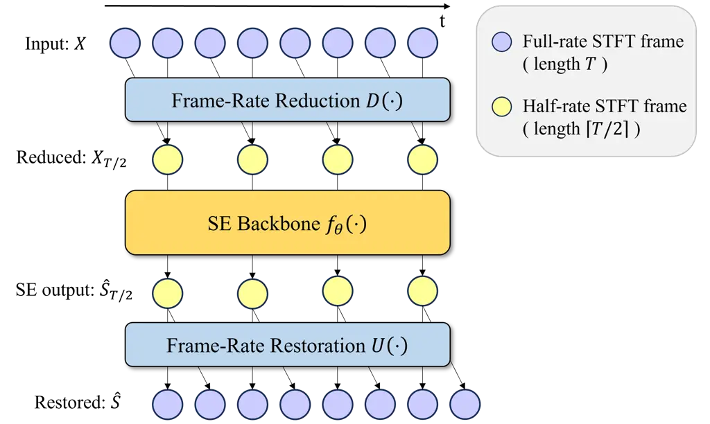
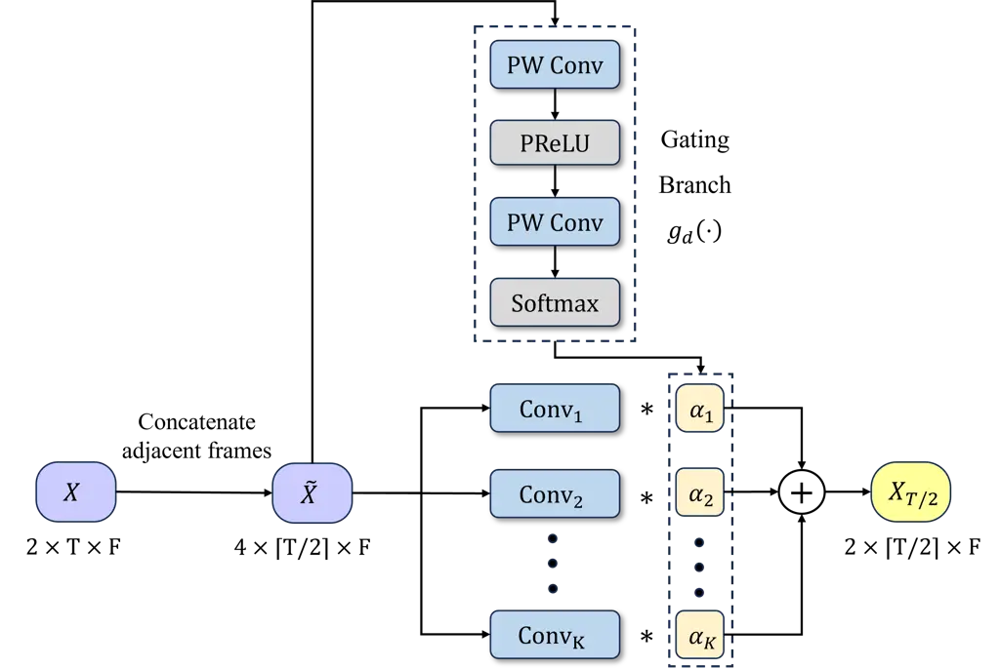

Zhao Wang Sun Yang Rong Sun Hu Lu

# HALO: Half-Frame-Rate Adaptive Learnable Operator for Lightweight STFT-Based Speech Enhancement

Jiadong    Dahan    Yu    Leyan    Xiaobin    Shiruo    Yuxiang    Jing

###### Abstract

STFT-based speech enhancement typically adopts overlapping analysis
frames. While overlap is essential for stable STFT processing, it makes
adjacent frames highly correlated, causing redundant computation in
lightweight models. We propose Half-frame-rate Adaptive Learnable
Operator (HALO), a causal plug-in module that halves the internal frame
rate without altering the STFT procedure. Broadly applicable to many
lightweight models, HALO applies adaptive rate reduction before the
backbone and restoration afterward, reconstructing the full-rate
spectrum on the original STFT grid. Both reduction and restoration are
implemented with lightweight dynamic convolutions. By halving the
processed frame rate, HALO reduces backbone compute cost with no added
algorithmic latency, freeing budget for channel widening. Experiments on
the DNS3 dataset show consistent gains across diverse lightweight models
under matched complexity, demonstrating the effectiveness of reducing
overlap-induced redundancy.

###### keywords

speech enhancement, STFT overlap, frame-rate reduction, computational
complexity

^(†)^(†)address: ¹ Key Laboratory of Modern Acoustics and Institute of
Acoustics, Nanjing University, Nanjing, 210093, China  
² NJU-Horizon Intelligent Audio Lab, Horizon Robotics, Beijing 100094,
China  
³ R&D Centre, Samsung Electronics (China), Nanjing 210019, China
^(†)^(†)email: {jiadong.zhao, dahan.wang}@smail.nju.edu.cn,
yuyu.sun@samsung.com, {leyan.yang, xiaobin.rong}@smail.nju.edu.cn,
{shiruo.sun, yuxiang.hu}@horizon.cc, lujing@nju.edu.cn

## 1 Introduction

Speech enhancement (SE) aims to recover clean speech from adverse
conditions such as background noise and reverberation, so as to improve
speech quality and intelligibility \[1\]. The DNN-based SE algorithms
can be broadly categorized into time-frequency (T-F) domain approaches
\[2, 3, 4, 5, 6\] and time-domain approaches \[7, 8, 9\]. Based on the
short-time Fourier transform (STFT) representation, the T-F approaches
effectively exploit the spectral structure to model speech and noise
characteristics, and have long been a dominant paradigm in this field.

For resource-constrained scenarios on edge devices, a number of
lightweight SE neural networks have emerged in recent years. These
models reduce computational cost while maintaining competitive
enhancement performance by designing efficient architectures. For
instance, DPCRN \[4\] combines convolutional recurrent network (CRN)
\[2\] with dual-path recurrent neural network (DPRNN) \[8\] to better
capture intra-frame spectral patterns and inter-frame dependencies.
Building on DPCRN, GTCRN \[10\] significantly simplifies the model with
grouped operations and further leverages subband feature extraction and
temporal recurrent attention modules to boost performance. Moreover,
LiSenNet \[11\] introduces several effective modules and techniques,
including sub-band convolution, convolutional gated linear unit, noise
detection, and phase refinement, to strengthen lightweight modeling.
More recently, UL-UNAS \[12\] utilizes neural architecture search to
discover an optimal architecture based on the framework of GTCRN,
achieving state-of-the-art results among ultra-lightweight models with
the same or lower computational complexity.

Despite these advances in lightweight architecture design, they largely
focus on reducing per-frame computation. Under traditional per-frame
STFT processing, the per-second computational cost grows with the frame
rate, which is determined by the STFT hop length. To mitigate boundary
effects and enable smooth reconstruction, STFT commonly adopts
overlapping analysis frames, and ISTFT reconstructs the waveform via
overlap-add synthesis \[13, 14\]. With 50% or higher overlap, adjacent
frames share many time-domain samples and are often strongly correlated,
making the resulting STFT frame sequence temporally redundant \[15\].
This renders the overlap-induced redundancy a key bottleneck for
improving compute efficiency beyond architecture-level design.

Prior overlap-related work, such as dual-window synthesis \[16\] and
multi-frame prediction \[17, 18\], has been mainly developed for lower
latency or improved reconstruction, and thus offers limited benefit for
lowering the computational load. Moreover, these designs often depart
from the traditional STFT procedure or the per-frame interface assumed
by existing efficient backbones, requiring nontrivial redesign or
adaptation. This motivates reducing compute by lowering the effective
number of frames processed inside the backbone without modifying the
STFT/ISTFT procedure.

In this work, we propose Half-frame-rate Adaptive Learnable Operator
(HALO), a causal plug-in module that runs the enhancement backbone at a
half frame rate via two adaptive learnable operators for rate reduction
and restoration. Preserving the original STFT/ISTFT procedure, HALO is
agnostic to the backbone architecture and can be readily integrated into
existing lightweight STFT-based models. Specifically, HALO performs rate
reduction before the backbone and rate restoration afterward to recover
the full-rate complex spectrum on the original STFT grid. To preserve
speech details and stability under half-frame-rate backbone processing,
we design adaptive learnable rate-reduction/restoration operators based
on lightweight dynamic convolutions \[19, 20, 21, 22\], enabling fusion
and restoration conditioned on local T-F features. By shortening the
sequence processed by the backbone, HALO reduces average backbone
multiply-accumulate operations per second (MAC/s), freeing compute for
channel widening under comparable complexity. We apply HALO to multiple
lightweight backbones and demonstrate consistent improvements over their
original counterparts on the DNS3 dataset. The audio samples are
available at
[https://github.com/dddaniel-z/HALO/](https://github.com/dddaniel-z/HALO/).

## 2 Methodology

### 2.1 Problem formulation

We consider monaural speech enhancement in the T-F domain. In the time
domain, the observed signal $`x(t)`$ is modeled as the clean speech
$`s(t)`$ corrupted by additive distortion $`n(t)`$. Applying the STFT
yields the complex spectrograms $`X`$, $`S`$, and $`N`$, where we
represent
$`X=\left[\Re\{X\};\Im\{X\}\right]\in\mathbb{R}^{2\times T\times F}`$
with real and imaginary parts along the first dimension, and $`T`$ and
$`F`$ denote the numbers of time frames and frequency bins. Under the
additive assumption in the T-F domain, we have

```math
\displaystyle X(t,f)=S(t,f)+N(t,f). \tag{1}
```

Our objective is to estimate an enhanced spectrum $`\hat{S}`$ from
$`X`$, and the enhanced waveform $`\hat{s}`$ can be reconstructed by the
ISTFT of $`\hat{S}`$.

### 2.2 HALO overview

HALO is a plug-in module that reduces the internal frame rate of a
backbone while preserving the original output resolution on the STFT
grid. It consists of two adaptive learnable operators, $`D(\cdot)`$ for
frame-rate reduction and $`U(\cdot)`$ for frame-rate restoration, as
shown in Fig. 1.

Specifically, we first apply a temporal rate reduction operator
$`D(\cdot)`$ to compress the input sequence:

```math
\displaystyle X_{T/2}=D(X)\in\mathbb{R}^{2\times\lceil T/2\rceil\times F}. \tag{2}
```

The backbone then operates on the shortened sequence to produce
half-frame-rate outputs:

```math
\displaystyle\hat{S}_{T/2}=f_{\theta}(X_{T/2})\in\mathbb{R}^{2\times\lceil T/2\rceil\times F}. \tag{3}
```

Here, $`f_{\theta}(\cdot)`$ denotes the STFT-based enhancement backbone
parameterized by $`\theta`$.

Finally, a restoration operator $`U(\cdot)`$ expands each half-rate
frame into two adjacent frames, restoring the full-rate sequence on the
original STFT grid:

```math
\displaystyle\hat{S}=U(\hat{S}_{T/2})\in\mathbb{R}^{2\times T\times F}. \tag{4}
```

Concretely, each reduced frame fuses the current frame with its
immediate predecessor on the original grid, and the restoration predicts
the current frame together with its immediate successor. Therefore, HALO
can be inserted without requiring any future STFT frames, preserving the
backbone’s per-frame interface and algorithmic latency.

### 2.3 Frame-rate reduction operator

The rate reduction operator $`D(\cdot)`$ is realized by an adaptive
learnable module, which integrates the information from adjacent
temporal frames instead of simply discarding every other STFT frame. The
overview of the operator is depicted in Fig. 2. Let
$`X(:,t,f)\in\mathbb{R}^{2}`$



Figure 1: Overall framework of HALO



Figure 2: Adaptive learnable rate-reduction operator

denote the complex feature at frame index $`t`$ and frequency bin $`f`$.
With $`L=\lceil T/2\rceil`$, for each reduced-time index
$`l=0,\dots,L-1`$, we form a two-frame paired feature
$`\tilde{X}(:,l,f)`$ by concatenating adjacent frames at each frequency
bin:

```math
\displaystyle\tilde{X}(:,l,f)=\text{cat}(X(:,2l-1,f),X(:,2l,f))\in\mathbb{R}^{4}, \tag{5}
```

where $`X(:,-1,f)`$ is set to an all-zero vector for all $`f`$ to handle
the boundary case. $`\tilde{X}(:,l,f)`$ is then mapped to a
half-frame-rate representation $`X_{T/2}(:,l,f)\in\mathbb{R}^{2}`$ using
a dynamic convolution with lightweight gating branch.

Specifically, we maintain a kernel bank $`\{W_{k}\}_{k=1}^{K}`$, with
$`W_{k}\in\mathbb{R}^{2\times 4}`$, and predict T-F-dependent mixture
weights $`\alpha_{k}(l,f)`$ via a lightweight gating function
$`g_{d}(\cdot)`$:

```math
\displaystyle\alpha(l,f)=g_{d}(\tilde{X}(:,l,f)), \tag{6}
```

```math
\displaystyle\sum_{k=1}^{K}\alpha_{k}(l,f)=1,\ \alpha_{k}(l,f)\geq 0. \tag{7}
```

Here $`g_{d}(\cdot)`$ denotes a lightweight gating network consisting of
two point-wise (PW) convolutions and a PReLU nonlinearity, followed by a
softmax over the kernel index. Thus, $`g_{d}(\cdot)`$ outputs a set of
$`K`$ normalized mixture weights at each T-F bin.

|                             | Para. (k) | MAC/s (M) | PESQ  | ESTOI | SI-SNR | OVRL  | SIG   | BAK   |
| --------------------------- | --------- | --------- | ----- | ----- | ------ | ----- | ----- | ----- |
| Noisy                       |           |           | 1.406 | 0.669 | 5.610  | 1.628 | 2.049 | 1.855 |
| GTCRN (baseline)            | 23.67     | 33.83     | 2.101 | 0.754 | 11.390 | 2.629 | 2.981 | 3.809 |
| no-overlap STFT             | 47.30     | 31.84     | 1.783 | 0.722 | 10.960 | 2.512 | 2.859 | 3.728 |
| D-FixedRed + U-FixedRest    | 47.40     | 32.02     | 2.118 | 0.758 | 11.620 | 2.663 | 3.003 | 3.853 |
| D-Decimate + U-FixedRest    | 47.32     | 32.70     | 2.104 | 0.755 | 11.510 | 2.600 | 2.936 | 3.817 |
| D-Decimate + U-Duplicate    | 47.30     | 32.60     | 2.086 | 0.752 | 11.400 | 2.568 | 2.929 | 3.794 |
| HALO (w/o channel widening) | 24.07     | 22.05     | 2.093 | 0.754 | 11.430 | 2.625 | 2.970 | 3.826 |
| HALO (w/ channel widening)  | 46.87     | 32.85     | 2.198 | 0.769 | 11.900 | 2.673 | 3.015 | 3.843 |

Table 1: Ablation study results on DNS3 test set.

We first compute $`K`$ basis outputs using the kernel bank, and then
obtain the reduced feature by a weighted sum using $`\alpha_{k}(l,f)`$:

```math
\displaystyle{X_{T/2,k}}(:,l,f)=W_{k}\tilde{X}(:,l,f), \tag{8}
```

```math
\displaystyle X_{T/2}(:,l,f)=\sum_{k=1}^{K}\alpha_{k}(l,f){X_{T/2,k}}(:,l,f). \tag{9}
```

This implementation is equivalent to mixing the kernels before
convolution, but is more implementation-friendly under time-varying
adaptive weights, with similar MAC/s under our channel configuration.
Because the fusion weights are conditioned on the local T-F feature, the
frame-rate reduction operator can adaptively combine the two adjacent
frames, either emphasizing one frame or forming a mixture of both. This
flexibility enables temporal compression while retaining information
that is important for reconstructing rapidly varying speech components.

### 2.4 Frame-rate restoration operator

Given the half-frame-rate backbone output
$`\hat{S}_{T/2}\in\mathbb{R}^{2\times L\times F}`$, the restoration
operator $`U(\cdot)`$ reconstructs the full-rate STFT sequence
$`\hat{S}\in\mathbb{R}^{2\times T\times F}`$ on the original grid. For
each reduced-time index $`l`$, we synthesize two consecutive frames
corresponding to original indices $`2l`$ and $`2l+1`$ with a dynamic
convolution. The restoration operator serves as a structural counterpart
of the reduction, using the same kernel-bank and gated design.

Specifically, for each bin $`(l,f)`$, we maintain a kernel bank
$`\{V_{k}\}_{k=1}^{K}`$ with $`V_{k}\in\mathbb{R}^{4\times 2}`$, and
predict T-F-dependent mixture weights $`\beta_{k}(l,f)`$ via the gating
function $`g_{u}(\cdot)`$, which shares the same architecture as
$`g_{d}(\cdot)`$:

```math
\displaystyle\beta(l,f)=g_{u}(\hat{S}_{T/2}(:,l,f)), \tag{10}
```

```math
\displaystyle\sum_{k=1}^{K}\beta_{k}(l,f)=1,\ \beta_{k}(l,f)\geq 0 \tag{11}
```

We first compute $`K`$ basis restoration outputs using the kernel bank,
and then form the restored two-frame pair by a weighted sum using
$`\beta_{k}(l,f)`$:

```math
\displaystyle\tilde{S}_{k}(:,l,f)=V_{k}\hat{S}_{T/2}(:,l,f), \tag{12}
```

```math
\displaystyle\tilde{S}(:,l,f)=\sum_{k=1}^{K}\beta_{k}(l,f)\tilde{S}_{k}(:,l,f)\in\mathbb{R}^{4}. \tag{13}
```

We then split $`\tilde{S}(:,l,f)`$ into two complex frames:

```math
\displaystyle\hat{S}(:,2l,f)=\tilde{S}(1:2,l,f), \tag{14}
```

```math
\displaystyle\hat{S}(:,2l+1,f)=\tilde{S}(3:4,l,f). \tag{15}
```

When $`T`$ is odd, we truncate the last synthesized frame to match the
original sequence length. Here, $`\hat{S}(:,2l,f)`$ and
$`\hat{S}(:,2l+1,f)`$ correspond to the current frame and the
immediately subsequent frame on the original STFT grid.

Notably, the reduction at index $`l`$ depends only on $`X(:,2l-1,:)`$
and $`X(:,2l,:)`$, while the restoration produces $`\hat{S}(:,2l,:)`$
and $`\hat{S}(:,2l+1,:)`$ solely from $`\hat{S}_{T/2}(:,l,:)`$ without
accessing any future input. This design introduces no additional
lookahead and does not increase algorithmic latency.

## 3 Experiments

### 3.1 Datasets

To evaluate the performance of our proposed framework, we conduct
experiments on the 3rd Deep Noise Suppression (DNS3) dataset \[23\],
which contains a wide range of clean sets, noise sets, and room impulse
responses (RIRs). Additionally, we also include the Mandarin corpus from
DiDiSpeech \[24\]. For data generation, the clean speech is convolved
with a randomly selected RIR, and then mixed with randomly selected
noise clips with the signal-to-noise ratio (SNR) ranging from $`-5`$ to
$`15`$ dB. A total of 72 000 pairs of 10-second noisy-clean data are
selected for training, while 840 and 800 pairs are generated for
validation and testing, respectively. All the utterances are sampled at
\SI16\kilo\hertz.

### 3.2 Implementation details

STFT is computed using a \SI32\milli\second square-root Hann window, a
\SI16\milli\second hop length (50% overlap), and an FFT length of 512,
unless noted. For dynamic convolution, the number of candidate kernels
is set to 5, with 8 hidden channels in the gating branch.

The models are trained by Adam Optimizer \[25\] with an initial learning
rate of 0.001. The learning rate will be halved if the validation loss
does not decrease for 10 consecutive epochs. During training, we use a
batch size of 8 and adopt the same training loss function as in GTCRN
\[10\] for all experiments.

The model complexity is measured by the number of parameters and MAC/s.
For controlled comparisons, we widen the backbone channel width when
inserting HALO so that the resulting model operates at similar MAC/s to
the corresponding baseline. This isolates the effect of HALO under
comparable computational cost. We match MAC/s rather than parameter
count because parameter count can be a misleading proxy due to varying
parameter efficiency of different architectures \[26\]. Moreover, for
lightweight models, parameters mainly reflect memory footprint, whereas
real-time edge deployment is typically compute bottlenecked \[12\].

| Model                    | Para. (k) | MAC/s (M) | PESQ  | ESTOI | SI-SNR | OVRL  | SIG   | BAK   |
| ------------------------ | --------- | --------- | ----- | ----- | ------ | ----- | ----- | ----- |
| Noisy                    |           |           | 1.406 | 0.669 | 5.610  | 1.628 | 2.049 | 1.855 |
| GTCRN-50% overlap        | 23.67     | 33.83     | 2.101 | 0.754 | 11.390 | 2.629 | 2.981 | 3.809 |
| GTCRN-50% overlap + HALO | 46.87     | 32.85     | 2.198 | 0.769 | 11.900 | 2.673 | 3.015 | 3.843 |
| GTCRN-75% overlap        | 23.67     | 67.66     | 2.121 | 0.756 | 11.370 | 2.639 | 2.977 | 3.846 |
| GTCRN-75% overlap + HALO | 46.87     | 65.49     | 2.237 | 0.772 | 11.990 | 2.674 | 3.011 | 3.857 |
| DPCRN-ultralight         | 27.92     | 31.80     | 2.025 | 0.750 | 11.070 | 2.597 | 2.943 | 3.797 |
| DPCRN-ultralight + HALO  | 55.03     | 31.34     | 2.212 | 0.771 | 11.920 | 2.648 | 2.990 | 3.826 |
| DPCRN-light              | 57.02     | 59.84     | 2.146 | 0.764 | 11.550 | 2.631 | 2.975 | 3.810 |
| DPCRN-light + HALO       | 115.95    | 61.48     | 2.247 | 0.778 | 12.100 | 2.657 | 2.995 | 3.842 |
| DPCRN-middle             | 207.22    | 225.11    | 2.340 | 0.788 | 12.350 | 2.713 | 3.048 | 3.865 |
| DPCRN-middle + HALO      | 419.80    | 223.45    | 2.402 | 0.796 | 12.670 | 2.708 | 3.046 | 3.859 |
| DPCRN-large              | 787.15    | 872.09    | 2.522 | 0.807 | 13.130 | 2.777 | 3.115 | 3.887 |
| DPCRN-large + HALO       | 1440.00   | 869.86    | 2.536 | 0.809 | 13.150 | 2.766 | 3.105 | 3.882 |
| LiSenNet                 | 36.78     | 55.77     | 2.177 | 0.762 | 11.760 | 2.681 | 3.029 | 3.837 |
| LiSenNet + HALO          | 64.52     | 55.76     | 2.275 | 0.778 | 12.390 | 2.703 | 3.047 | 3.847 |
| UL-UNAS                  | 168.98    | 33.61     | 2.245 | 0.773 | 12.100 | 2.681 | 3.011 | 3.859 |
| UL-UNAS + HALO           | 205.16    | 31.26     | 2.261 | 0.777 | 12.240 | 2.684 | 3.027 | 3.848 |

Table 2: Experiments across diverse backbones on DNS3 test set.

### 3.3 Ablation study

We conduct ablation experiments on GTCRN to verify the efficacy of HALO.
The evaluation is conducted on the test set using metrics including
perceptual evaluation of speech quality (PESQ) \[27\], extended
short-time objective intelligibility (ESTOI) \[28\], scale-invariant
signal-to-noise ratio (SI-SNR) \[29\] and DNSMOS P.835 \[30\]. The
ablation test results are presented in Table 1.

As a reference, we remove STFT overlap by setting the hop size equal to
the window length and using the rectangular window (no-overlap STFT).
This change causes a pronounced degradation across all metrics,
confirming that overlap cannot be simply discarded without hurting
enhancement quality. We then conduct the remaining ablations under the
original STFT setting. Specifically, we progressively remove adaptive
gating, learnable reduction/restoration, and channel widening to
disentangle their individual contributions.

We first disable adaptive gating in both reduction and restoration,
yielding learnable but fixed-kernel single-convolution operators
(D-FixedRed + U-FixedRest). This degrades performance relative to HALO
and highlights the benefit of adaptive gating. Replacing the
fixed-kernel reduction with simple decimation by dropping every other
STFT frame (D-Decimate + U-FixedRest) further weakens performance,
indicating that a learnable reduction is important. Substituting the
fixed-kernel restoration with duplicating each half-rate output to two
adjacent frames yields the simplest variant (D-Decimate + U-Duplicate)
and causes another drop, showing that learnable restoration is also
necessary.

Table 1 also shows that HALO without channel widening substantially
reduces computational complexity (22.05M vs. 33.83M MAC/s) while
maintaining near-baseline performance. In the cost-matched setting with
channel widening, HALO achieves the best overall results, indicating
that exploiting overlap-induced redundancy with adaptive learnable
operators is crucial for preserving enhancement quality under frame-rate
compression. Compared with the GTCRN baseline, HALO (w/ channel
widening) improves PESQ by 0.1 and SI-SNR by 0.5 dB, and also boosts
DNSMOS-OVRL by 0.04, with the algorithmic latency unchanged.

### 3.4 Comparison across different backbones

Table 2 reports the plug-in results of HALO on several lightweight
STFT-based enhancement backbones, including DPCRN \[4\] of different
sizes, GTCRN \[10\], LiSenNet \[11\] and UL-UNAS \[12\]. HALO
consistently improves objective metrics across all tested architectures
under comparable computational cost, demonstrating that overlap-induced
temporal redundancy is a common efficiency bottleneck in these
lightweight backbones. Notably, to test heavier STFT redundancy, we also
evaluate GTCRN under a 75% overlap STFT setting (\SI32\milli\second
window, \SI8\milli\second hop), in which case HALO reduces the internal
frame overlap ratio to 50% and still delivers performance gains after
channel widening. These results demonstrate that HALO addresses a
bottleneck distinct from architectural slimming, providing consistent
improvements on top of existing lightweight designs.

The DPCRN family illustrates that the magnitude of improvement depends
on the backbone capacity. When the backbone has limited capacity, the
model is forced to spend substantial computation on temporally redundant
overlapping frames. By reducing the internal frame rate, HALO mitigates
redundancy and concentrates computation on more effective modules,
leading to a noticeable improvement. As model size increases, the gain
brought by HALO becomes smaller, as the additional channels become less
effective once the capacity is already large. This trend is also
observed in UL-UNAS, whose backbone is already highly optimized.
Consequently, reallocating the saved compute simply through channel
widening yields diminishing returns, leading to modest gains. It should
be noted that we focus on reducing overlap-induced redundancy in this
work, rather than exhaustively optimizing compute reallocation
strategies. Importantly, the compute saved by reducing overlap-induced
redundancy still provides headroom for incorporating stronger modules or
more efficient architectural designs.

### 3.5 Discussion

HALO reduces the average computational cost by halving the internal
sequence processed by the backbone, and in our cost-matched setting the
saved temporal budget is reallocated to channel widening. However, HALO
does not reduce the peak per-step computation, since the frame-rate
restoration operator generates two adjacent frames within the same
inference step. Designing peak-aware variants of HALO, including
peak-constrained compute reallocation and scheduling strategies for
streaming deployment, is left for future work.

## 4 Conclusion

We propose HALO, a causal plug-in module for lightweight STFT-based
speech enhancement that reduces the overlap-induced temporal redundancy.
By introducing adaptive learnable operators for frame-rate reduction and
restoration, HALO can be integrated into existing backbones and halve
the internal frame rate. Ablation results on DNS3 support the
effectiveness of the proposed design, and evaluations across multiple
lightweight backbones show consistent gains under comparable
computational complexity.

## 5 Acknowledgments

This work is supported by National Natural Science Foundation of China
(Grants No.12274221) and the AI & AI for Science Project of Nanjing
University.

## 6 Generative AI Use Disclosure

Generative AI tools were used only for language editing and polishing.
They were not used to generate research ideas, experimental designs,
results, or core technical content. The authors verified all statements,
code, and references and take full responsibility for the manuscript.

## References

- \[1\] J. Benesty, S. Makino, and J. Chen (2006) Speech enhancement.
  Springer Science & Business Media. Cited by: §1.
- \[2\] K. Tan and D. Wang (2018) A convolutional recurrent neural
  network for real-time speech enhancement.. In Interspeech, Vol. 2018,
  pp. 3229–3233. Cited by: §1, §1.
- \[3\] Y. Hu, Y. Liu, S. Lv, M. Xing, S. Zhang, Y. Fu, J. Wu, B. Zhang,
  and L. Xie (2020) DCCRN: deep complex convolution recurrent network
  for phase-aware speech enhancement. In Interspeech 2020,
  pp. 2472–2476. External Links:
  [Document](https://dx.doi.org/10.21437/Interspeech.2020-2537) Cited
  by: §1.
- \[4\] X. Le, H. Chen, K. Chen, and J. Lu (2021) DPCRN: dual-path
  convolution recurrent network for single channel speech enhancement.
  In Proc. Interspeech 2021, pp. 2811–2815. External Links:
  [Document](https://dx.doi.org/10.21437/Interspeech.2021-296) Cited by:
  §1, §1, §3.4.
- \[5\] H. Schröter, A. Maier, A. N. Escalante-B, and T.
  Rosenkranz (2022) DeepFilterNet2: towards real-time speech enhancement
  on embedded devices for full-band audio. In 2022 international
  workshop on acoustic signal enhancement (IWAENC), pp. 1–5. Cited by:
  §1.
- \[6\] Z. Wang, S. Cornell, S. Choi, Y. Lee, B. Kim, and S.
  Watanabe (2023) TF-GridNet: integrating full-and sub-band modeling for
  speech separation. IEEE/ACM Transactions on Audio, Speech, and
  Language Processing 31, pp. 3221–3236. Cited by: §1.
- \[7\] Y. Luo and N. Mesgarani (2019) Conv-TasNet: surpassing ideal
  time–frequency magnitude masking for speech separation. IEEE/ACM
  Transactions on Audio, Speech, and Language Processing 27 (8),
  pp. 1256–1266. External Links:
  [Document](https://dx.doi.org/10.1109/TASLP.2019.2915167) Cited by:
  §1.
- \[8\] Y. Luo, Z. Chen, and T. Yoshioka (2020) Dual-path RNN: efficient
  long sequence modeling for time-domain single-channel speech
  separation. In ICASSP 2020 - 2020 IEEE International Conference on
  Acoustics, Speech and Signal Processing (ICASSP), Vol. , pp. 46–50.
  External Links:
  [Document](https://dx.doi.org/10.1109/ICASSP40776.2020.9054266) Cited
  by: §1, §1.
- \[9\] K. Wang, B. He, and W. Zhu (2021) TSTNN: two-stage transformer
  based neural network for speech enhancement in the time domain. In
  ICASSP 2021 - 2021 IEEE International Conference on Acoustics, Speech
  and Signal Processing (ICASSP), Vol. , pp. 7098–7102. External Links:
  [Document](https://dx.doi.org/10.1109/ICASSP39728.2021.9413740) Cited
  by: §1.
- \[10\] X. Rong, T. Sun, X. Zhang, Y. Hu, C. Zhu, and J. Lu (2024)
  GTCRN: a speech enhancement model requiring ultralow computational
  resources. In ICASSP 2024 - 2024 IEEE International Conference on
  Acoustics, Speech and Signal Processing (ICASSP), Vol. , pp. 971–975.
  External Links:
  [Document](https://dx.doi.org/10.1109/ICASSP48485.2024.10448310) Cited
  by: §1, §3.2, §3.4.
- \[11\] H. Yan, J. Zhang, C. Fan, Y. Zhou, and P. Liu (2025) LiSenNet:
  lightweight sub-band and dual-path modeling for real-time speech
  enhancement. In ICASSP 2025 - 2025 IEEE International Conference on
  Acoustics, Speech and Signal Processing (ICASSP), Vol. , pp. 1–5.
  External Links:
  [Document](https://dx.doi.org/10.1109/ICASSP49660.2025.10888272) Cited
  by: §1, §3.4.
- \[12\] X. Rong, L. Yang, D. Wang, Y. Hu, C. Zhu, K. Chen, and J.
  Lu (2026) UL-UNAS: ultra-lightweight u-nets for real-time speech
  enhancement via network architecture search. IEEE Transactions on
  Audio, Speech and Language Processing 34 (), pp. 1085–1096. Note:
  Early Access. External Links:
  [Document](https://dx.doi.org/10.1109/TASLPRO.2026.3661271) Cited by:
  §1, §3.2, §3.4.
- \[13\] J.B. Allen and L.R. Rabiner (1977) A unified approach to
  short-time Fourier analysis and synthesis. Proceedings of the IEEE 65
  (11), pp. 1558–1564. External Links:
  [Document](https://dx.doi.org/10.1109/PROC.1977.10770) Cited by: §1.
- \[14\] P. C.Loizou (2013) Speech enhancement theory and practice
  (second edition). CRC Press. Cited by: §1.
- \[15\] N. Sturmel L. Daudet et al. (2011) Signal reconstruction from
  STFT magnitude: a state of the art. In International conference on
  digital audio effects (DAFx), pp. 375–386. Cited by: §1.
- \[16\] Z. Wang, G. Wichern, S. Watanabe, and J. Le Roux (2023)
  STFT-domain neural speech enhancement with very low algorithmic
  latency. IEEE/ACM Transactions on Audio, Speech, and Language
  Processing 31, pp. 397–410. External Links:
  [Document](https://dx.doi.org/10.1109/TASLP.2022.3224285) Cited by:
  §1.
- \[17\] Z. Wang and S. Watanabe (2022) Improving frame-online neural
  speech enhancement with overlapped-frame prediction. IEEE Signal
  Processing Letters 29, pp. 1422–1426. External Links:
  [Document](https://dx.doi.org/10.1109/LSP.2022.3183473) Cited by: §1.
- \[18\] J. Bartolewska, S. Kacprzak, and K. Kowalczyk (2023) Causal
  signal-based DCCRN with overlapped-frame prediction for online speech
  enhancement. In Proc. Interspeech 2023, pp. 4039–4043. External Links:
  [Document](https://dx.doi.org/10.21437/Interspeech.2023-2177) Cited
  by: §1.
- \[19\] B. Yang, G. Bender, Q. V. Le, and J. Ngiam (2019) CondConv:
  conditionally parameterized convolutions for efficient inference.
  Advances in neural information processing systems 32. Cited by: §1.
- \[20\] Y. Chen, X. Dai, M. Liu, D. Chen, L. Yuan, and Z. Liu (2020)
  Dynamic Convolution: attention over convolution kernels. In 2020
  IEEE/CVF Conference on Computer Vision and Pattern Recognition (CVPR),
  Vol. , pp. 11027–11036. External Links:
  [Document](https://dx.doi.org/10.1109/CVPR42600.2020.01104) Cited by:
  §1.
- \[21\] Z. Wang, Z. Miao, J. Hu, and Q. Qiu (2021) Adaptive
  convolutions with per-pixel dynamic filter atom. In 2021 IEEE/CVF
  International Conference on Computer Vision (ICCV), Vol. ,
  pp. 12282–12291. External Links:
  [Document](https://dx.doi.org/10.1109/ICCV48922.2021.01208) Cited by:
  §1.
- \[22\] D. Wang, X. Rong, S. Sun, Y. Hu, C. Zhu, and J. Lu (2025)
  Adaptive convolution for CNN-based speech enhancement models. IEEE
  Transactions on Audio, Speech and Language Processing 33 (),
  pp. 4400–4413. External Links:
  [Document](https://dx.doi.org/10.1109/TASLPRO.2025.3623897) Cited by:
  §1.
- \[23\] C. K. A. Reddy, H. Dubey, K. Koishida, A. Nair, V. Gopal, R.
  Cutler, S. Braun, H. Gamper, R. Aichner, and S. Srinivasan (2021)
  INTERSPEECH 2021 Deep Noise Suppression Challenge. In Proc.
  Interspeech 2021, pp. 2796–2800. External Links:
  [Document](https://dx.doi.org/10.21437/Interspeech.2021-1609) Cited
  by: §3.1.
- \[24\] T. Guo, C. Wen, D. Jiang, N. Luo, R. Zhang, S. Zhao, W. Li, C.
  Gong, W. Zou, K. Han, and X. Li (2021) DiDiSpeech: a large scale
  mandarin speech corpus. In ICASSP 2021 - 2021 IEEE International
  Conference on Acoustics, Speech and Signal Processing (ICASSP), Vol. ,
  pp. 6968–6972. External Links:
  [Document](https://dx.doi.org/10.1109/ICASSP39728.2021.9414423) Cited
  by: §3.1.
- \[25\] D. P. Kingma and J. L. Ba (2015) Adam: a method for stochastic
  optimization. In 3rd International Conference on Learning
  Representations, ICLR 2015, Cited by: §3.2.
- \[26\] W. Zhang, K. Saijo, Jee-weon Jung, C. Li, S. Watanabe, and Y.
  Qian (2024) Beyond Performance Plateaus: a comprehensive study on
  scalability in speech enhancement. In Interspeech 2024, pp. 1740–1744.
  External Links:
  [Document](https://dx.doi.org/10.21437/Interspeech.2024-1266) Cited
  by: §3.2.
- \[27\] A. W. Rix, J. G. Beerends, M. P. Hollier, and A. P.
  Hekstra (2001) Perceptual evaluation of speech quality (PESQ)-a new
  method for speech quality assessment of telephone networks and codecs.
  In 2001 IEEE international conference on acoustics, speech, and signal
  processing. Proceedings (Cat. No. 01CH37221), Vol. 2, pp. 749–752.
  Cited by: §3.3.
- \[28\] J. Jensen and C. H. Taal (2016) An algorithm for predicting the
  intelligibility of speech masked by modulated noise maskers. IEEE/ACM
  Transactions on Audio, Speech, and Language Processing 24 (11),
  pp. 2009–2022. External Links:
  [Document](https://dx.doi.org/10.1109/TASLP.2016.2585878) Cited by:
  §3.3.
- \[29\] J. L. Roux, S. Wisdom, H. Erdogan, and J. R. Hershey (2019) SDR
  – half-baked or well done?. In ICASSP 2019 - 2019 IEEE International
  Conference on Acoustics, Speech and Signal Processing (ICASSP),
  pp. 626–630. External Links:
  [Document](https://dx.doi.org/10.1109/ICASSP.2019.8683855) Cited by:
  §3.3.
- \[30\] C. K. A. Reddy, V. Gopal, and R. Cutler (2022) DNSMOS P.835: a
  non-intrusive perceptual objective speech quality metric to evaluate
  noise suppressors. In ICASSP 2022 - 2022 IEEE International Conference
  on Acoustics, Speech and Signal Processing (ICASSP), pp. 886–890.
  External Links:
  [Document](https://dx.doi.org/10.1109/ICASSP43922.2022.9746108) Cited
  by: §3.3.
