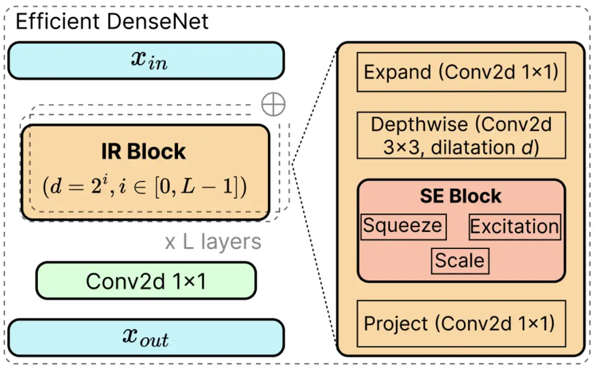
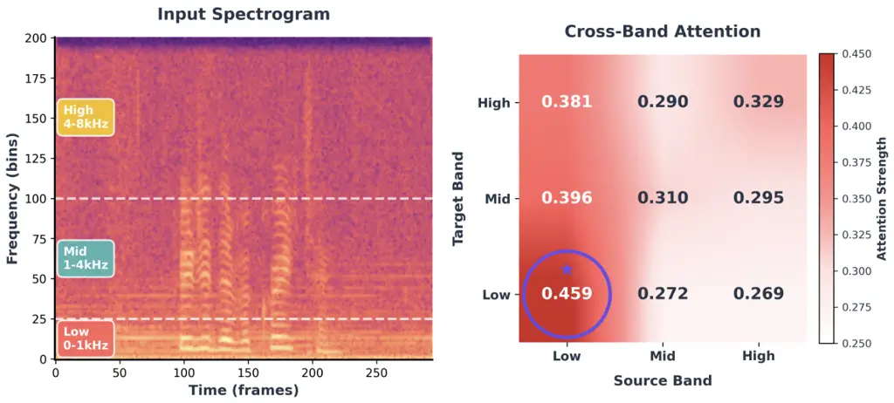

MARTINS GOMES CAPMAN

# BASENet: Band-Adapted Speech Enhancement Network with Cross-Band Attention

Damien    Francois

###### Abstract

Speech enhancement models typically apply uniform capacity across all
frequencies, disregarding the non-uniform spectral resolution of human
hearing. We propose BASENet, a frequency-adapted architecture that
partitions the spectrum into Bark-scale bands and assigns each a
scaled-capacity encoder derived from critical-band density,
automatically granting deeper branches to perceptually dense low
frequencies and lighter ones to high frequencies. A cross-band attention
module captures harmonic dependencies across bands through compact
frequency-pooled representations at linear complexity. Built on inverted
residual blocks with dense connectivity and a convolutional recurrent
network, BASENet achieves PESQ 3.55 and STOI 96% on VoiceBank+DEMAND
with only 0.83 M parameters and 7.3 G MACs, the fewest parameters among
all methods with PESQ $`\geq`$ 3.50. A causal variant (PESQ 3.44)
surpasses several non-causal baselines, confirming suitability for
real-time streaming on resource-constrained devices.

###### keywords

speech enhancement, frequency-adaptive processing, cross-band attention,
low complexity

^(†)^(†)address: ¹ Thales SIX GTS, FRANCE ^(†)^(†)email:
damien.martins-gomes@thalesgroup.com, francois.capman@thalesgroup.com

## 1 Introduction

Single-channel speech enhancement aims to recover clean speech from
noisy observations, with applications in hearing aids, voice
communication, and ASR front-ends \[1\]. Deep learning approaches have
progressed from masking-based methods \[2\] to architectures jointly
estimating magnitude and phase \[3, 4\] or operating on complex
spectrograms \[5, 6\]. State-of-the-art models such as MH-SENet \[7\],
Mamba-SEUNet \[8\], and MP-SENet \[4\] achieve impressive quality but at
substantial computational cost, while generative approaches based on
diffusion \[9\] or flow matching \[10\] require iterative sampling that
limits real-time deployment. Moreover, many high-performing
architectures rely on bidirectional or non-causal operations that
preclude streaming inference, a critical requirement for hearing aids
and live communication. A key limitation shared by many architectures is
their uniform treatment of the frequency axis. Speech exhibits highly
non-uniform spectral characteristics governed by the auditory system’s
frequency resolution: low-frequency critical bands are narrow yet
perceptually dense, encoding fundamental frequency and harmonic
structure; mid-frequency bands carry formants critical for
intelligibility; and high-frequency bands span wider ranges with lower
perceptual acuity \[11\]. Standard full-band encoders ignore these
differences, applying equal capacity across the spectrum. Recent
sub-band approaches have begun to address this. FullSubNet \[12\] and
extensions \[13\] fuse full-band context with sub-band processing but
apply uniform capacity per sub-band. DeepFilterNet \[14\] exploits
psychoacoustic structure for the _signal representation_ but not the
_model architecture_. Band-Split RNN \[15\] introduced explicit sub-band
splitting with interleaved band- and sequence-level modelling, yet uses
uniform depth across sub-bands and relies on shared BLSTMs for
cross-band modelling without leveraging perceptual importance to
modulate encoder capacity. A common tension persists: existing methods
either employ uniform-capacity sub-band networks \[12, 15\] or resort to
expensive full-band self-attention \[16\], leaving open how to
_systematically_ derive capacity from auditory principles while
maintaining cross-band coherence.  
We propose BASENet (Band-Adapted Speech Enhancement Network), a
frequency-adapted architecture whose encoder capacity is a closed-form
function of auditory bandwidth. BASENet partitions the spectrum into
$`B`$ perceptually motivated bands along the Bark scale \[17\] and
computes a per-band _critical-band density_ measuring how many Bark
bands are packed per Hertz. This density directly determines encoder
depth: narrow, perceptually dense low-frequency bands automatically
receive deeper, wider branches, while broad high-frequency bands are
processed by lighter ones. To restore cross-band coherence, a compact
cross-band attention mechanism operates on frequency-pooled band
summaries, enabling efficient inter-band information exchange at
$`\mathcal{O}(NF_{b}B)`$ complexity. The architecture combines
MobileNetV3-inspired inverted residual blocks \[18\] with dense
connectivity \[19\] and a Convolutional Recurrent Network (CRN) \[20\]
for temporal modelling. Crucially, all components—including the
cross-band attention—operate frame-by-frame, enabling native causal
streaming by simply replacing the bidirectional GRU with a
unidirectional variant. Our contributions are:

- •
  A perceptually scaled encoder that derives per-band capacity from
  Bark-scale critical-band density via a single closed-form rule,
  eliminating per-band hyperparameter tuning.
- •
  A cross-band attention module that models harmonic and formant
  dependencies across bands through compact frequency-pooled
  representations at linear complexity.
- •
  A lightweight, streaming-ready architecture (0.83 M parameters, 7.3 G
  MACs) that achieves the highest PESQ among all sub-1 M-parameter
  methods with PESQ $`\geq`$ 3.50, while natively supporting causal
  inference for real-time deployment.

Figure 1: Overview of BASENet. Noisy magnitude and phase spectrograms
are concatenated and processed by a frequency-adapted encoder that
partitions the spectrum into $`B`$ Bark-scale bands with capacity scaled
by perceptual density. Cross-band attention enables inter-band
information exchange before CRN temporal modelling. Decoders predict the
magnitude mask and enhanced phase.

## 2 Proposed Method

### 2.1 Overall Architecture

An overview of BASENet is shown in Fig. 1. We adopt the mask-and-phase
estimation paradigm of MP-SENet \[4\]: given a noisy speech signal
$`\mathbf{y}\in\mathbb{R}^{T}`$, we compute the Short-Time Fourier
Transform (STFT) $`\mathbf{Y}\in\mathbb{C}^{F\times N}`$ to obtain
magnitude $`\mathbf{Y}_{m}=|\mathbf{Y}|`$ and phase
$`\mathbf{Y}_{p}=\angle\mathbf{Y}`$ spectrograms, where
$`F=\lfloor n_{\text{fft}}/2\rfloor+1`$ frequency bins and $`N`$ time
frames. A power-law compression $`\mathbf{Y}_{m}^{c}=|\mathbf{Y}|^{c}`$
with $`c=0.3`$ reduces dynamic range. Compressed magnitude and phase are
concatenated along the channel dimension to form the input
$`\mathbf{X}\in\mathbb{R}^{2\times N\times F}`$.  
The input is processed by a _Frequency-Adapted Encoder_ (Sec. 2.2),
which partitions the spectrum into $`B`$ perceptually motivated bands
and applies scaled-capacity processing proportional to perceptual
importance. A _Cross-Band Attention_ module (Sec. 2.3) then enables
inter-band information exchange. The fused representation is passed to a
CRN for temporal modelling. Throughout the architecture, we employ
efficient inverted residual blocks with dense connectivity (Sec. 2.4) to
minimise computational cost while preserving representational capacity.
Finally, lightweight magnitude and phase decoders predict a
time-frequency mask $`\hat{\mathbf{M}}_{m}`$ and enhanced phase
$`\hat{\mathbf{X}}_{p}`$. The enhanced complex spectrogram is
reconstructed as:

```math
\hat{\mathbf{S}}=\underbrace{\mathbf{Y}_{m}\odot\hat{\mathbf{M}}_{m}}_{\hat{\mathbf{X}}_{m}}\odot e^{j\hat{\mathbf{X}}_{p}}, \tag{1}
```

where $`\odot`$ denotes element-wise multiplication. We follow the same
training procedure and loss functions as MP-SENet \[4\], and refer the
reader to that work for details.

### 2.2 Frequency-Adapted Encoder

Perceptually Motivated Frequency Decomposition. The human auditory
system resolves spectral detail non-uniformly: low-frequency regions are
analysed through narrow critical bands that provide fine resolution,
while high-frequency regions are covered by progressively wider bands
with coarser resolution \[11\]. The Bark scale \[17\] formalises this
observation by mapping each frequency $`f`$ (in Hz) to a position
$`z(f)`$ on a perceptual scale (in Bark) via¹¹ 1 Approximation due to
Traunmüller \[21\]. One Bark corresponds to one critical bandwidth; the
total audible range spans roughly 0–24 Bark.:

```math
z(f)=13\arctan(0.00076\,f)+3.5\arctan\left(\frac{f}{7500}\right)^{2}. \tag{2}
```

Because critical bands are narrow at low frequencies and wide at high
frequencies, the number of Bark units per Hertz—i.e., the _critical-band
density_—decreases with frequency. We embed this perceptual
non-uniformity directly into the encoder architecture. The input
spectrogram is partitioned into $`B`$ non-overlapping frequency bands
$`\mathcal{B}=\{[f_{0},f_{1}),\,[f_{1},f_{2}),\,\ldots,\,[f_{B-1},f_{B}]\}`$
with $`f_{0}=0`$ and $`f_{B}=f_{s}/2`$, whose boundaries are placed at
transitions between perceptually distinct spectral regions
(fundamental/harmonic, formant, fricative), guided by the Bark scale and
validated empirically in Sec. 3.4. For each band $`b`$, the
critical-band density is:

```math
\rho_{b}=\frac{z(f_{b})-z(f_{b-1})}{f_{b}-f_{b-1}}, \tag{3}
```

which measures how many Bark units are spanned per Hertz within
band $`b`$. A higher $`\rho_{b}`$ indicates finer auditory resolution
and, consequently, greater sensitivity to spectral distortion.  
Density-Driven Capacity Allocation. The key design principle of BASENet
is that encoder capacity should mirror perceptual density: bands where
the ear is most sensitive receive deeper processing, while bands with
coarser resolution are handled by shallower branches. We map
$`\rho_{b}`$ to a per-band depth:

```math
L_{b}=\left\lfloor L_{\max}\cdot\frac{\rho_{b}}{\max_{b^{\prime}}\rho_{b^{\prime}}}\right\rceil, \tag{4}
```

where $`L_{\max}`$ is the maximum branch depth and
$`\lfloor\cdot\rceil`$ denotes rounding to the nearest integer. The
normalisation ensures that the perceptually densest band always receives
$`L_{\max}`$ layers, while remaining bands receive depth proportional to
their relative density. This provides a single-parameter ($`L_{\max}`$)
design rule that, given any sampling rate and band partition, produces a
scaled-capacity allocation without per-band tuning.  
Scaled-Capacity Band Processing. Let
$`\mathbf{X}^{(b)}\in\mathbb{R}^{C\times N\times F_{b}}`$ denote the
$`b`$-th band after an initial $`1\times 1`$ projection to $`C`$
channels, where $`F_{b}`$ is the number of frequency bins in band $`b`$.
Each band is processed by a dedicated encoder branch of depth $`L_{b}`$:

```math
\mathbf{H}^{(b)}=\mathcal{E}_{b}\left(\mathbf{X}^{(b)}\right),\quad\text{depth}(\mathcal{E}_{b})=L_{b}, \tag{5}
```

where $`\mathcal{E}_{b}`$ consists of a DenseBlock of $`L_{b}`$ layers
followed by an inverted residual block (Sec. 2.4). Deeper branches (high
$`L_{b}`$) develop larger receptive fields along the frequency axis
through exponentially dilated convolutions, enabling fine-grained
modelling of harmonics and pitch structure in perceptually critical
low-frequency regions. Shallower branches (low $`L_{b}`$) provide
sufficient capacity for the spectrally smoother high-frequency content
while keeping computation low.



Figure 2: Efficient DenseNet architecture with $`L`$ inverted residual
(IR) blocks using exponential frequency dilation ($`d=2^{i}`$). Each IR
block applies expansion, dilated depthwise convolution,
squeeze-excitation, and projection.

### 2.3 Cross-Band Attention

Although bands are processed independently, speech production induces
strong inter-band dependencies: harmonics generated by the glottal
source span the entire spectrum, and formant transitions create
correlated energy modulations across bands \[22\]. To model these
dependencies efficiently, we introduce _cross-band attention_ operating
on compact band-level summaries rather than full time-frequency grids.
Let $`d_{k}=C/r_{a}`$ denote the attention projection dimension, where
$`r_{a}`$ is a reduction ratio (we use $`r_{a}=4`$). For each
band $`b`$, we compute query, key, and value projections:

```math
\displaystyle\mathbf{Q}^{(b)} \displaystyle=\mathbf{W}_{Q}^{(b)}\,\mathbf{H}^{(b)}\in\mathbb{R}^{d_{k}\times N\times F_{b}}, \tag{6}
```

```math
\displaystyle\mathbf{K}^{(b)} \displaystyle=\mathbf{W}_{K}^{(b)}\,\mathbf{H}^{(b)}\in\mathbb{R}^{d_{k}\times N\times F_{b}}, \tag{7}
```

```math
\displaystyle\mathbf{V}^{(b)} \displaystyle=\mathbf{W}_{V}^{(b)}\,\mathbf{H}^{(b)}\in\mathbb{R}^{C\times N\times F_{b}}. \tag{8}
```

Rather than allowing each time-frequency bin to attend to all
others—incurring prohibitive $`\mathcal{O}(N^{2}F^{2})`$ cost—we form a
compact global context by averaging keys and values across frequency
bins within each band, then concatenating across all $`B`$ bands:

```math
\displaystyle\bar{\mathbf{K}} \displaystyle=\operatorname{Concat}\left[\operatorname{AvgPool}_{F}\left(\mathbf{K}^{(b)}\right)\right]_{b=1}^{B}\in\mathbb{R}^{d_{k}\times N\times B}, \tag{9}
```

```math
\displaystyle\bar{\mathbf{V}} \displaystyle=\operatorname{Concat}\left[\operatorname{AvgPool}_{F}\left(\mathbf{V}^{(b)}\right)\right]_{b=1}^{B}\in\mathbb{R}^{C\times N\times B}. \tag{10}
```

Each band then attends to this shared context. Operating independently
per time frame $`n`$, we compute:

```math
\mathbf{A}^{(b)}_{n}=\operatorname{softmax}\left(\frac{{\mathbf{Q}^{(b)}_{n}}^{\top}\bar{\mathbf{K}}_{n}}{\sqrt{d_{k}}}\right)\bar{\mathbf{V}}_{n}^{\top}, \tag{11}
```

where $`{\mathbf{Q}^{(b)}_{n}}^{\top}\in\mathbb{R}^{F_{b}\times d_{k}}`$
multiplied by $`\bar{\mathbf{K}}_{n}\in\mathbb{R}^{d_{k}\times B}`$
yields attention weights in $`\mathbb{R}^{F_{b}\times B}`$, applied to
$`\bar{\mathbf{V}}_{n}^{\top}\in\mathbb{R}^{B\times C}`$ to produce the
output in $`\mathbb{R}^{F_{b}\times C}`$. The final output is:

```math
\tilde{\mathbf{H}}^{(b)}=\mathbf{H}^{(b)}+\mathbf{W}_{O}^{(b)}\,\mathbf{A}^{(b)}. \tag{12}
```

This achieves $`\mathcal{O}(NF_{b}B)`$ complexity per band, making it
tractable even for large $`F`$ and fully compatible with real-time
causal inference since each frame is processed independently.

### 2.4 Efficient DenseNet Architecture

Each encoder and decoder branch employs a lightweight architecture
combining inverted residual blocks \[18\] with dense
connectivity \[19\], as illustrated in Fig. 2. The core inverted
residual (IR) block is:

```math
\mathrm{IR}(\mathbf{x})=\mathbf{x}+\mathrm{Proj}\bigl(\mathrm{SE}(\mathrm{DWConv}(\mathrm{Expand}(\mathbf{x})))\bigr), \tag{13}
```

where Expand projects $`C`$ channels to $`rC`$ ($`r\in\{2,4\}`$), DWConv
applies depthwise separable convolution with kernel $`3\times 3`$ and
dilation $`d`$, SE denotes squeeze-and-excitation \[23\], and Proj
reduces back to $`C`$ channels. This achieves
$`\mathcal{O}(K^{2}rC+rC^{2})`$ complexity versus
$`\mathcal{O}(K^{2}C^{2})`$ for standard convolutions. We use Hardswish
activation for efficient inference. Dense connectivity promotes feature
reuse:
$`\mathbf{z}_{i}=\mathrm{IR}_{i}([\mathbf{z}_{0},\ldots,\mathbf{z}_{i-1}])`$,
with $`L`$ blocks stacked using exponentially increasing dilation rates
$`d=2^{i},\;i\in[0,L{-}1]`$ along the frequency axis, capturing
multi-scale patterns from narrow-band harmonics to broad formants. A
bottleneck $`1\times 1`$ convolution reduces concatenated features back
to $`C`$ channels.

### 2.5 Temporal Modelling and Decoders

After cross-band fusion, band features are concatenated along frequency
and processed by a CRN for temporal modelling. Unlike Conformer-based
approaches \[4, 24\] that incur $`\mathcal{O}(N^{2})`$ complexity from
self-attention, CRN achieves $`\mathcal{O}(N)`$ complexity using a
uni/bidirectional GRU followed by convolutional layers with GLU
activations \[20\], enabling efficient frame-by-frame processing. The
magnitude and phase decoders follow the same design as MP-SENet \[4\]: a
bounded sigmoid mask for magnitude and an arctan-based projection for
phase; we refer the reader to \[4\] for details.

| Method              | Causal | \#Param. | MACs  | PESQ | CSIG | CBAK | COVL | STOI % |
| ------------------- | ------ | -------- | ----- | ---- | ---- | ---- | ---- | ------ |
| Noisy               | –      | –        | –     | 1.97 | 3.35 | 2.44 | 2.63 | 91     |
| DEMUCS \[25\]       | ✗      | 33.5M    | –     | 3.07 | 4.31 | 3.40 | 3.63 | 95     |
| SE-Conformer \[24\] | ✗      | –        | –     | 3.13 | 4.45 | 3.55 | 3.82 | 95     |
| MANNER-S \[26\]     | ✗      | 0.90M    | 2.9G  | 3.06 | 4.42 | 3.58 | 3.77 | 95     |
| BSRNN \[15\]        | ✗      | 3M       | 5.1G  | 3.10 | –    | –    | –    | 95     |
| DPT-FSNet \[6\]     | ✗      | 0.88M    | 8.1G  | 3.33 | 4.58 | 3.72 | 4.00 | 96     |
| CMGAN \[27\]        | ✗      | 1.83M    | 20.9G | 3.41 | 4.63 | 3.94 | 4.12 | 96     |
| PHASEN \[3\]        | ✗      | 7.78M    | 11.4G | 2.99 | 4.21 | 3.55 | 3.62 | –      |
| MP-SENet \[4\]      | ✗      | 2.05M    | 37.2G | 3.50 | 4.73 | 3.95 | 4.22 | 96     |
| SE-Mamba \[28\]     | ✗      | 2.25M    | 32.7G | 3.55 | 4.77 | 3.95 | 4.26 | 96     |
| MUSE \[29\]         | ✗      | 0.51M    | 5.2G  | 3.37 | 4.63 | 3.80 | 4.10 | 95     |
| Mamba-SEUNet \[8\]  | ✗      | 3.78M    | 5.2G  | 3.57 | 4.79 | 4.00 | 4.30 | 96     |
| MH-SENet \[7\]      | ✗      | 0.99M    | 8.4G  | 3.62 | 4.79 | 4.01 | 4.34 | 96     |
| BASENet-3           | ✗      | 0.83M    | 7.3G  | 3.55 | 4.65 | 3.95 | 4.18 | 96     |
| BASENet-3 (Causal)  | ✓      | 0.81M    | 7.1G  | 3.44 | 4.58 | 3.85 | 4.04 | 96     |

Table 1: Comparison on VoiceBank+DEMAND. ‘–’ = unreported. Colours:
waveform, complex spectrogram, magnitude–phase, magnitude–phase–time
input. Bold = best per column. BASENet achieves the fewest parameters
among all methods with PESQ $`\geq`$ 3.50.

## 3 Experiments

### 3.1 Experimental Setup

Dataset. We evaluate on VoiceBank+DEMAND \[30\], including 11,572
training utterances (28 speakers, SNRs of 0, 5, 10, 15 dB) and 824 test
utterances (2 unseen speakers, SNRs of 2.5, 7.5, 12.5, 17.5 dB) with
mismatched noise conditions.  
Implementation. We use $`n_{\text{fft}}=400`$, hop length 100, and
16 kHz sample rate. Models are trained for 100 epochs on a single NVIDIA
Quadro RTX 6000 GPU with batch size 8, Adam optimizer \[31\]
($`\text{lr}=10^{-3}`$, $`\beta_{1}=0.9`$, $`\beta_{2}=0.999`$) and
exponential decay rate $`0.98`$.  
Metrics. We report wideband PESQ \[32\], STOI \[33\], and composite
measures CSIG, CBAK, COVL \[34\], along with parameter count and MACs.  
Band Configuration. We evaluate $`B\in\{3,8,12\}`$ bands (Table 2);
$`B=3`$ performs best (PESQ 3.55), with finer partitions degrading
quality by fragmenting each branch’s spectral context. For
$`f_{s}=16`$ kHz, the $`B=3`$ boundaries
$`\mathcal{B}=\{[0,1),\,[1,4),\,[4,8]\}`$ kHz separate
fundamental/harmonic (Bark $`0`$–$`8`$,
$`\rho_{\text{low}}\approx 8.0\times 10^{-3}`$ Bark/Hz), formant
(Bark $`8`$–$`17`$, $`\rho_{\text{mid}}\approx 3.0\times 10^{-3}`$), and
fricative regions (Bark $`17`$–$`22`$,
$`\rho_{\text{high}}\approx 1.25\times 10^{-3}`$). Applying Eq. (4) with
$`L_{\max}=4`$ yields depths $`L_{\text{low}}=4`$, $`L_{\text{mid}}=3`$,
$`L_{\text{high}}=2`$, directly reflecting the decreasing perceptual
density.



Figure 3: Left: input spectrogram with band boundaries. Right:
frame-averaged cross-band attention weights (Sec. 2.3); entry $`(i,j)`$
denotes the attention from band $`i`$ to the frequency-pooled summary of
band $`j`$.

### 3.2 Results

Table 1 compares BASENet-3 against representative methods spanning
waveform, complex spectrogram, magnitude–phase, and magnitude–phase–time
input representations.  
Quality–efficiency trade-off. BASENet-3 achieves PESQ 3.55 with only
0.83 M parameters and 7.3 G MACs—the fewest parameters among all methods
reaching PESQ $`\geq`$ 3.50. It matches SE-Mamba \[28\] (PESQ 3.55) at
$`4.5\times`$ fewer MACs and $`2.7\times`$ fewer parameters, and
surpasses MP-SENet \[4\] (PESQ 3.50) at $`5.1\times`$ fewer MACs. Among
other lightweight methods, it outperforms DPT-FSNet \[6\]
($`+0.22`$ PESQ, fewer MACs), CMGAN \[27\] ($`+0.14`$ PESQ at one-third
the computation), and MUSE \[29\] ($`+0.18`$ PESQ, $`+0.15`$ CBAK).
Compared to BSRNN \[15\]—which also employs sub-band splitting—BASENet-3
achieves $`+0.45`$ PESQ with fewer parameters (0.83 M vs. 3 M),
highlighting the benefit of scaled-capacity over uniform sub-band
processing.  
Comparison with recent SOTA. Mamba-SEUNet \[8\] (PESQ 3.57) and
MH-SENet \[7\] (PESQ 3.62) achieve higher PESQ, but at greater cost or
with richer inputs: Mamba-SEUNet requires $`4.6\times`$ more parameters
(3.78 M), while MH-SENet additionally leverages a time-domain input
stream (magnitude–phase–time) not available to magnitude–phase methods.
Within the same input category, BASENet-3 ties with SE-Mamba for the
highest PESQ among magnitude–phase methods while using $`4.5\times`$
fewer MACs, demonstrating that perceptually scaled capacity is a highly
effective inductive bias.  
Causal streaming. BASENet-3 natively supports causal inference by
replacing the bidirectional GRU with a unidirectional variant—no
architectural redesign is required. The causal model (0.81 M,
7.1 G MACs) achieves PESQ 3.44 and STOI 96%, outperforming several
_non-causal_ baselines including CMGAN (3.41) and DPT-FSNet (3.33),
demonstrating suitability for real-time streaming with only a modest
quality reduction ($`-0.11`$ PESQ).

### 3.3 Cross-Band Attention Analysis

Fig. 3 visualises frame-averaged attention weights. The attention matrix
$`\mathbf{W}\in\mathbb{R}^{B\times B}`$ reveals that all bands attend
most strongly to the low-frequency band
($`W_{\cdot\to\text{low}}\geq 0.381`$), confirming that the network
exploits fundamental frequency cues for coherent cross-band
reconstruction. The low band exhibits the strongest self-attention
($`0.459`$), reflecting the concentration of harmonic energy, while the
mid band shows the most balanced distribution ($`0.396/0.310/0.295`$),
acting as a spectral bridge consistent with the formant region’s
mediating role in speech perception.

|                        |      |      |      |      |
| ---------------------- | ---- | ---- | ---- | ---- |
| Configuration          | PESQ | CSIG | CBAK | COVL |
| BASENet-3              | 3.55 | 4.65 | 3.95 | 4.18 |
|    w/o freq-adapted    | 3.48 | 4.55 | 3.88 | 4.03 |
|    w/o cross-band attn | 3.42 | 4.43 | 3.81 | 3.89 |
|    w/o scaled-capacity | 3.44 | 4.45 | 3.85 | 3.97 |
| BASENet-3              | 3.55 | 4.65 | 3.95 | 4.18 |
| BASENet-8              | 3.52 | 4.57 | 3.89 | 4.08 |
| BASENet-12             | 3.47 | 4.53 | 3.80 | 3.99 |
| BASENet-3-CRN          | 3.55 | 4.65 | 3.95 | 4.18 |
| BASENet-3-MambaTM      | 3.53 | 4.62 | 3.94 | 4.17 |

Table 2: Ablation study on BASENet.

### 3.4 Ablation Study

Table 2 isolates each component’s contribution.  
Architecture components. Disabling cross-band attention causes the
largest degradation ($`-0.13`$ PESQ), confirming that inter-band
information exchange is critical for modelling harmonic relationships.
Replacing scaled-capacity allocation with uniform depth yields a
comparable drop ($`-0.11`$ PESQ), validating the density-derived depth
rule over equal-depth processing. Removing frequency-adapted processing
reduces PESQ by $`0.07`$—a smaller gap, suggesting the other components
partially compensate, though the full combination remains essential for
best performance.  
Band granularity. As discussed in Sec. 2.1, increasing from $`B=3`$ to
$`B=8`$ and $`B=12`$ progressively degrades performance ($`-0.03`$ and
$`-0.08`$ PESQ), suggesting that overly fine partitions limit each
branch’s spectral context and reduce modelling effectiveness.  
Temporal modelling. Replacing the CRN with a Mamba-based temporal
module \[28\] yields comparable performance (PESQ 3.53 vs. 3.55),
confirming that the architecture’s gains stem primarily from the
frequency-adapted encoder and cross-band attention rather than the
temporal modelling choice.

## 4 Conclusion

We introduced BASENet, a frequency-adaptive speech enhancement network
that allocates encoder depth according to Bark-scale critical-band
density and restores cross-band coherence via efficient attention,
achieving a strong quality–efficiency trade-off on VoiceBank+DEMAND
(PESQ 3.55, 0.83 M parameters) with a causal variant (PESQ 3.44) that
surpasses several non-causal baselines. Future work will explore
lower-triangular attention masks to exploit the bottom-up harmonic
structure of speech.

## 5 Generative AI Use Disclosure

Generative AI tools were used solely for spelling correction and
sentence reformulation during the preparation of this manuscript. No
generative AI tool was used to produce a significant part of the
scientific content, methodology, experiments, or results reported in
this work.

## References

- \[1\] P. C. Loizou (2013) Speech enhancement: theory and practice. CRC
  press. Cited by: §1.
- \[2\] Y. Wang, A. Narayanan, and D. Wang (2014) On training targets
  for supervised speech separation. IEEE/ACM Trans. Audio, Speech,
  Language Process. 22 (12), pp. 1849–1858. Cited by: §1.
- \[3\] D. Yin, C. Luo, Z. Xiong, and W. Zeng (2020) PHASEN: a
  phase-and-harmonics-aware speech enhancement network. In Proc. AAAI,
  pp. 9458–9465. Cited by: §1, Table 1.
- \[4\] Y. Lu, Y. Ai, and Z. Ling (2023) MP-SENet: a speech enhancement
  model with parallel denoising of magnitude and phase spectra. In Proc.
  Interspeech, pp. 3834–3838. Cited by: §1, §2.1, §2.1, §2.5, Table 1,
  §3.2.
- \[5\] Y. Hu, Y. Liu, S. Lv, M. Xing, S. Zhang, Y. Fu, J. Wu, B. Zhang,
  and L. Xie (2020) DCCRN: deep complex convolution recurrent network
  for phase-aware speech enhancement. In Proc. Interspeech,
  pp. 2472–2476. Cited by: §1.
- \[6\] K. Tan, J. Chen, and D. Wang (2022) DPT-FSNet: dual-path
  transformer based full-band and sub-band fusion network for speech
  enhancement. In Proc. ICASSP, pp. 6857–6861. Cited by: §1, Table 1,
  §3.2.
- \[7\] S. Kim, T. Kim, and C. Chun (2025) Mamba-based Hybrid Model for
  Speech Enhancement. In Interspeech 2025, pp. 5163–5167. External
  Links: [Document](https://dx.doi.org/10.21437/Interspeech.2025-1476),
  ISSN 2958-1796 Cited by: §1, Table 1, §3.2.
- \[8\] J. Wang, Z. Lin, T. Wang, M. Ge, L. Wang, and J. Dang (2025)
  Mamba-seunet: mamba unet for monaural speech enhancement. In ICASSP
  2025-2025 IEEE International Conference on Acoustics, Speech and
  Signal Processing (ICASSP), pp. 1–5. Cited by: §1, Table 1, §3.2.
- \[9\] J. Richter, S. Welker, J. Lemercier, B. Lay, and T.
  Gerkmann (2023) Speech enhancement and dereverberation with
  diffusion-based generative models. IEEE/ACM Trans. Audio, Speech,
  Language Process. 31, pp. 2351–2364. Cited by: §1.
- \[10\] A. H. Liu, M. Le, A. Vyas, B. Shi, A. Tjandra, and W.
  Hsu (2024) Generative pre-training for speech with flow matching. In
  Proc. ICLR, Cited by: §1.
- \[11\] B. C. Moore (2012) An introduction to the psychology of
  hearing. Brill. Cited by: §1, §2.2.
- \[12\] X. Hao, X. Su, R. Horaud, and X. Li (2021) FullSubNet: a
  full-band and sub-band fusion model for real-time single-channel
  speech enhancement. In Proc. ICASSP, pp. 6633–6637. Cited by: §1.
- \[13\] J. Chen, W. Rao, Z. Wang, J. Lin, Z. Wu, Y. Wang, S. Shang,
  and H. Meng (2023) Inter-SubNet: speech enhancement with subband
  interaction. In Proc. ICASSP, pp. 1–5. Cited by: §1.
- \[14\] H. Schröter, A. N. Escalante-B., T. Rosenkranz, and A.
  Maier (2022) DeepFilterNet: a low complexity speech enhancement
  framework for full-band audio based on deep filtering. In Proc.
  ICASSP, pp. 7407–7411. Cited by: §1.
- \[15\] J. Yu, H. Chen, Y. Luo, R. Gu, and C. Weng (2023) High Fidelity
  Speech Enhancement with Band-split RNN. In Interspeech 2023,
  pp. 2483–2487. External Links:
  [Document](https://dx.doi.org/10.21437/Interspeech.2023-1433), ISSN
  2958-1796 Cited by: §1, Table 1, §3.2.
- \[16\] Z. Wang, S. Cornell, S. Choi, Y. Lee, B. Kim, and S.
  Watanabe (2023) TF-GridNet: integrating full- and sub-band modeling
  for speech separation. IEEE/ACM Trans. Audio, Speech, Language
  Process. 31, pp. 3221–3236. Cited by: §1.
- \[17\] E. Zwicker (1961) Subdivision of the audible frequency range
  into critical bands (frequenzgruppen). The Journal of the Acoustical
  Society of America 33 (2), pp. 248–248. External Links: ISSN
  0001-4966, [Document](https://dx.doi.org/10.1121/1.1908630),
  [Link](https://doi.org/10.1121/1.1908630),
  https://pubs.aip.org/asa/jasa/article-pdf/33/2/248/18743398/248_1_online.pdf
  Cited by: §1, §2.2.
- \[18\] A. Howard, M. Sandler, G. Chu, L. Chen, B. Chen, M. Tan, W.
  Wang, Y. Zhu, R. Pang, V. Vasudevan, et al. (2019) Searching for
  MobileNetV3. In Proc. ICCV, pp. 1314–1324. Cited by: §1, §2.4.
- \[19\] G. Huang, Z. Liu, L. Van Der Maaten, and K. Q.
  Weinberger (2017) Densely connected convolutional networks. In Proc.
  CVPR, pp. 4700–4708. Cited by: §1, §2.4.
- \[20\] K. Tan and D. Wang (2019) Learning complex spectral mapping
  with gated convolutional recurrent networks for monaural speech
  enhancement. Vol. 28, pp. 380–390. Cited by: §1, §2.5.
- \[21\] H. Traunmüller (1990) Analytical expressions for the tonotopic
  sensory scale. The journal of the acoustical society of America 88
  (1), pp. 97–100. Cited by: footnote 1.
- \[22\] L. R. Rabiner and R. W. Schafer (1978) Digital processing of
  speech signals. Prentice-Hall. Cited by: §2.3.
- \[23\] J. Hu, L. Shen, and G. Sun (2018) Squeeze-and-excitation
  networks. In Proc. CVPR, pp. 7132–7141. Cited by: §2.4.
- \[24\] W. Kim, J. W. Chung, Y. Choi, K. Park, and J. Choi (2021)
  SE-Conformer: time-domain speech enhancement using conformer. In Proc.
  Interspeech, pp. 2736–2740. Cited by: §2.5, Table 1.
- \[25\] A. Defossez, G. Synnaeve, and Y. Adi (2020) Real time speech
  enhancement in the waveform domain. In Proc. Interspeech,
  pp. 3291–3295. Cited by: Table 1.
- \[26\] W. Shin, H. J. Park, J. S. Kim, B. H. Lee, and S. W. Han (2022)
  Multi-view attention transfer for efficient speech enhancement. In
  Interspeech 2022, interspeech_2022, pp. 1198–1202. External Links:
  [Link](http://dx.doi.org/10.21437/Interspeech.2022-10251),
  [Document](https://dx.doi.org/10.21437/interspeech.2022-10251) Cited
  by: Table 1.
- \[27\] R. Cao, S. Abdulatif, and B. Yang (2022) CMGAN: conformer-based
  metric GAN for speech enhancement. In Proc. Interspeech, pp. 936–940.
  Cited by: Table 1, §3.2.
- \[28\] R. Chao, W. Cheng, M. La Quatra, S. M. Siniscalchi, C. H.
  Yang, S. Fu, and Y. Tsao (2024) An investigation of incorporating
  mamba for speech enhancement. In 2024 IEEE Spoken Language Technology
  Workshop (SLT), pp. 302–308. Cited by: Table 1, §3.2, §3.4.
- \[29\] Z. Lin, X. Chen, and J. Wang (2024) MUSE: Flexible Voiceprint
  Receptive Fields and Multi-Path Fusion Enhanced Taylor Transformer for
  U-Net-based Speech Enhancement. In Interspeech 2024, pp. 672–676.
  External Links:
  [Document](https://dx.doi.org/10.21437/Interspeech.2024-1017), ISSN
  2958-1796 Cited by: Table 1, §3.2.
- \[30\] C. Valentini-Botinhao, X. Wang, S. Takaki, and J.
  Yamagishi (2016) Investigating RNN-based speech enhancement methods
  for noise-robust text-to-speech. In Proc. SSW, pp. 146–152. Cited by:
  §3.1.
- \[31\] D. P. Kingma and J. Ba (2015) Adam: a method for stochastic
  optimization. In International Conference on Learning Representations,
  External Links: [Link](http://arxiv.org/abs/1412.6980) Cited by: §3.1.
- \[32\] A. W. Rix, J. G. Beerends, M. P. Hollier, and A. P.
  Hekstra (2001) Perceptual evaluation of speech quality (PESQ)—a new
  method for speech quality assessment of telephone networks and codecs.
  In Proc. ICASSP, Vol. 2, pp. 749–752. Cited by: §3.1.
- \[33\] C. H. Taal, R. C. Hendriks, R. Heusdens, and J. Jensen (2011)
  An algorithm for intelligibility prediction of time–frequency weighted
  noisy speech. IEEE Trans. Audio, Speech, Language Process. 19 (7),
  pp. 2125–2136. Cited by: §3.1.
- \[34\] Y. Hu and P. C. Loizou (2007) Evaluation of objective quality
  measures for speech enhancement. Vol. 16, pp. 229–238. Cited by: §3.1.
