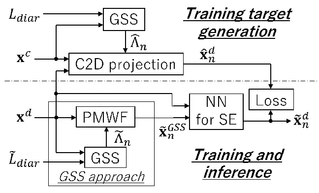

# Generating Training Targets for Real-World Speech Enhancement via Close-to-Distant Microphone Projection

Tomohiro Nakatani    Rintaro Ikeshita    Naoyuki Kamo    Marc Delcroix
   Shoko Araki

###### Abstract

Training neural networks (NNs) for speech enhancement (SE) in distant
speech-capturing scenarios requires paired distorted and clean reference
speech signals. While such data are often generated through simulation,
the mismatch between simulated and real recordings significantly limits
SE accuracy. To address this issue, we propose Close-to-Distant
microphone Projection (C2D projection), a method that generates paired
data from real recordings captured by close and distant microphones. C2D
projection estimates an optimal projection matrix that transforms
close-microphone inputs into clean reference signals aligned with
distant-microphone recordings, while simultaneously performing
denoising. We show this projection can be effectively realized using a
variant of the Parametric Multichannel Wiener Filter (PMWF).
Experimental results demonstrate that an NN trained with C2D-projected
data outperforms the state-of-the-art Guided Source Separation (GSS) on
the challenging CHiME6 dinner party ASR task under oracle diarization,
when using the enhanced output from GSS as an auxiliary input to the NN.

###### Index Terms: 

Speech enhancement, neural network, distant microphones, training data
generation, robust ASR

^(†)^(†)address: NTT, Inc., Japan

## 1 Introduction

Speech captured with Close Microphones (CMs), positioned near the
speaker’s mouth, generally provides high-quality recordings even in
real-world environments. However, their intrusive nature can limit user
comfort and natural interaction. In contrast, Distant Microphones (DMs),
placed farther away, offer greater freedom and flexibility but often
suffer from severe degradation due to reverberation, background noise,
and interference from other speakers. Such degradation reduces speech
intelligibility for human listeners and significantly impairs the
performance of speech-based applications, including Automatic Speech
Recognition (ASR).

Speech Enhancement (SE) aims to recover high-quality speech from such
degraded DM signals. Signal processing-based and Neural Network
(NN)-based approaches have been extensively studied \[1\]. Signal
processing-based SE (e.g., \[2, 3, 4, 5\]) relies on assumptions about
room acoustics and signal characteristics, typically requiring no prior
training. This enables them to adapt well to diverse, unknown test
conditions. In contrast, NN-based SE \[6, 7, 8\] learns a mapping from
distorted to clean speech and can achieve superior performance when
training and test conditions are well matched.

Despite the success of NN-based SE in delivering high-quality results,
its application to real-world recording scenarios, such as the CHiME6
dinner party conversations \[9\], remains a major challenge. A key
obstacle is the requirement for paired distorted and clean reference
signals for NN training, which are difficult to obtain in realistic
conditions. Simulation-based approaches, such as the image method
\[10\], are widely used to generate paired data. While effective in
relatively simple environments \[6\], these techniques have yet to prove
successful in complex real-world scenarios. For example, in CHiME6,
top-scoring systems rely on a signal processing-based Guided Source
Separation (GSS) approach \[11\], which combines Weighted Prediction
Error (WPE) dereverberation \[12, 13\] and Parametric Multichannel
Wiener Filter (PMWF) \[3\]. Replacing GSS with more advanced NNs has had
little success to date \[14\].

This paper proposes a novel approach, Close-to-Distant Microphone
Projection (C2D projection), to address this challenge. The method
assumes that both DM and CM signals are available during NN training,
with CM signals being much less distorted than DM signals (noting that
only DM signals are accessible at test time). This assumption is
realistic for real-world datasets; for example, worn microphone
recordings are provided as part of the training data in CHiME6. However,
such CM signals cannot be directly used as training targets, since they
are not phase- or power-aligned with DM signals and often contain
interfering signals. The goal of C2D projection is thus to estimate a
projection matrix that optimally aligns CM signals with DM signals while
simultaneously denoising them to produce suitable training targets. We
show that such a matrix can be derived as a variant of PMWF.
Additionally, we explain how to apply the C2D projection to NN training
using the CHiME6 scenario as the testbed. We show that the GSS approach,
with minor modifications, can provide all the required techniques for
the application.

Experiments show that an NN trained with C2D-projected data outperforms
the GSS approach on the CHiME6 ASR task under oracle diarization, when
using the GSS-based PMWF output as an auxiliary input. Moreover, using
the CHiME8 task \[15\] with the estimated diarization labels, the
proposed method still achieves improvements over the GSS approach across
most ASR scenarios, despite substantial mismatches with the training
conditions, including differences in diarization labels (oracle vs.
estimated) and diverse recording environments.

## 2 Related work

To achieve real-world SE, researchers have explored NN training
techniques that do not rely on target generation \[16, 17, 18, 19, 20,
21\]. Spatial self-supervised learning \[19\] enables unsupervised NN
training using only observed signals and has shown marginal ASR
improvements over the GSS approach on the multi-source CHiME-8 task.
SuperM2M \[20\] and FNSE-SAT \[21\] enable the direct use of CM signals
as training targets. The former combines unsupervised learning on real
data with supervised learning on simulated data, while the latter
employs supervised adversarial training. Both techniques have
demonstrated improved ASR performance on real-world single-source tasks.

In contrast to these techniques, our method generates training targets
directly from real data. This allows us to use a simple supervised
learning scheme for NN training and results in clear effectiveness on
the challenging multi-source CHiME-6 task.

## 3 Proposed method

After defining the problem to be solved, this section describes the
proposed method, C2D projection.

### 3.1 Problem definition

Suppose that the speech signals of $`N`$ speakers are captured by
$`M^{c}`$ CMs positioned near the speakers, and $`M^{d}`$ DMs. Let
$`s_{n}(t,f)\in\mathbb{C}`$ denote the $`n`$th speaker’s clean speech
signal in the short-time Fourier transform (STFT) domain, where $`t`$
and $`f`$ are the time and frequency indices, respectively. Let
$`\mathbf{x}^{c}(t,f)\in\mathbb{C}^{M^{c}}`$ and
$`\mathbf{x}^{d}(t,f)\in\mathbb{C}^{M^{d}}`$ denote vectors of signals
captured by all CMs and DMs, respectively. Then, we model the signals
by:

```math
\displaystyle\left[\begin{array}[]{c}\mathbf{x}_{n}^{c}(t,f)\\
\mathbf{x}_{n}^{d}(t,f)\end{array}\right] \displaystyle=\left[\begin{array}[]{c}\mathbf{h}_{n}^{c}(f)\\
\mathbf{h}_{n}^{d}(f)\end{array}\right]{s}_{n}(t,f),
```

```math
\displaystyle\left[\begin{array}[]{c}\mathbf{x}^{c}(t,f)\\
\mathbf{x}^{d}(t,f)\end{array}\right] \displaystyle=\sum_{n=1}^{N}\left[\begin{array}[]{c}\mathbf{x}_{n}^{c}(t,f)\\
\mathbf{x}_{n}^{d}(t,f)\end{array}\right]+\left[\begin{array}[]{c}\mathbf{v}^{c}(t,f)\\
\mathbf{v}^{d}(t,f)\end{array}\right],
```

where $`\mathbf{h}_{n}^{c}(f)\in\mathbb{C}^{M^{c}}`$ and
$`\mathbf{h}_{n}^{d}(f)\in\mathbb{C}^{M^{d}}`$ are vectors containing
acoustic transfer functions (ATFs) from the $`n`$th speaker to the CMs
and DMs, and $`\mathbf{x}_{n}^{c}(t,f)`$ and $`\mathbf{x}_{n}^{d}(t,f)`$
are source images of the $`n`$th speaker’s speech at the respective
microphones. We assume that the ATFs are time-invariant within each
short time segment of interest. Then, the captured signals,
$`\mathbf{x}^{c}(t,f)`$ and $`\mathbf{x}^{d}(t,f)`$, are modeled by the
sum of all source images and the additive noise, $`\mathbf{v}^{c}(t,f)`$
and $`\mathbf{v}^{d}(t,f)`$, at respective microphones.

This paper assumes that the goal of training target generation is to
estimate the source images of individual speakers at DMs,
$`\mathbf{x}_{n}^{d}(t,f)`$, which serve as training targets
corresponding to the observed DM signal $`\mathbf{x}^{d}(t,f)`$. We
adopt this objective based on prior studies demonstrating that using
such paired data is effective for achieving high-quality speech
enhancement in simulation experiments \[6, 22\].

According to this goal, we set the goal of C2D projection to estimate a
projection matrix $`{\bf{W}}_{n}(f)\in\mathbb{C}^{M^{c}\times M^{d}}`$
that transforms the CM signal $`\mathbf{x}^{c}`$ to an estimate of the
$`n`$th speaker’s source image at the DMs, $`\hat{\mathbf{x}}_{n}^{d}`$:

```math
\displaystyle\hat{\mathbf{x}}_{n}^{d}(t,f)=\mathbf{W}_{n}(f)^{\mathsf{H}}\mathbf{x}^{c}(t,f), \tag{11}
```

where $`(\cdot)^{\mathsf{H}}`$ denotes the Hermitian transpose. With the
projection matrix for each utterance, we can prepare paired data
composed of the speech reference $`\hat{\mathbf{x}}_{n}^{d}(t,f)`$ and
the distorted observation $`\mathbf{x}^{d}(t,f)`$ at the DMs, and use
them for the training of the SE model.

When the CM signal in Eq. (3.1) does not contain additive noise and all
ATFs from the sources to the microphones are given, the exact projection
matrix can be obtained, provided $`M^{c}\geq N`$, by:

```math
\displaystyle\mathbf{W}_{n}(f)^{\mathsf{H}}=\mbox{diag}\{\mathbf{h}_{n}^{d}(f)\}\mathbf{H}^{c}(f)^{+} \tag{12}
```

where
$`\mathbf{H}^{c}(f)=[\mathbf{h}_{1}^{c}(f),...,\mathbf{h}_{N}^{c}(f)]`$,
$`\mathbf{H}^{+}`$ is the Moore-Penrose pseudo-inverse of a matrix
$`\mathbf{H}`$, and $`\mbox{diag}\{\mathbf{h}\}`$ is a diagonal matrix
containing elements of $`\mathbf{h}`$ as its diagonal components. The
issue to be solved in this paper is thus to optimally estimate
$`\mathbf{W}_{n}(f)`$ with no prior knowledge of the ATFs in a way
robust against additive noise in the CM and DM signals.

### 3.2 C2D projection based on a variant of PMWF

This paper adopts the following cost function as the estimation
criterion of the projection matrix for the $`n`$th source:

```math
\displaystyle C(\mathbf{W}_{n}(f))= \displaystyle E\{\|\mathbf{W}_{n}(f)^{\mathsf{H}}\mathbf{x}_{n}^{c}(t,f)-\mathbf{x}_{n}^{d}(t,f)\|_{2}^{2}\}
```

```math
\displaystyle+\mu E\{\|\mathbf{W}_{n}(f)^{\mathsf{H}}\mathbf{v}_{n}^{c}(t,f)\|_{2}^{2}\}, \tag{13}
```

```math
\displaystyle\mbox{where}~~\mathbf{v}_{n}^{c}(t,f)= \displaystyle\sum_{n^{\prime}\neq n}\mathbf{x}_{n^{\prime}}^{c}(t,f)+\mathbf{v}^{c}(t,f). \tag{14}
```

The first term on the right-hand side in Eq. (13) quantifies the
projection error between the DM source images and the transformed source
images for the $`n`$th speaker. The second term quantifies the power of
the unwanted signal $`\mathbf{v}_{n}^{c}`$, composed of additive noise
and voices from other speakers, remaining after projection. $`\mu`$ is
the weight that balances the two terms. Minimizing the cost function
yields a projection matrix that jointly reduces projection error and
unwanted signal in a balanced manner.

The above cost function is equivalent to that of the Speech Distortion
Weighted Multichannel Wiener Filter (SDW-MWF) \[2\], except that the
observed and the target signals are in different domains, i.e., CM and
DM domains, in our formulation. As with the SDW-MWF, a closed-form
solution that minimizes the cost function can be derived:

```math
\displaystyle\mathbf{W}_{n}(f) \displaystyle=\left(\mathbf{\Phi}_{n}^{cc}(f)+\mu\mathbf{\Phi}_{v_{n}}^{cc}(f)\right)^{-1}\mathbf{\Phi}_{n}^{cd}(f), \tag{15}
```

```math
\displaystyle\mathbf{\Phi}_{n}^{cc}(f) \displaystyle=E\{\mathbf{x}_{n}^{c}(t,f)\mathbf{x}_{n}^{c}(t,f)^{\mathsf{H}}\}, \tag{16}
```

```math
\displaystyle\mathbf{\Phi}_{v_{n}}^{cc}(f) \displaystyle=E\{\mathbf{v}_{n}^{c}(t,f)\mathbf{v}_{n}^{c}(t,f)^{\mathsf{H}}\}, \tag{17}
```

```math
\displaystyle\mathbf{\Phi}_{n}^{cd}(f) \displaystyle=E\{\mathbf{x}_{n}^{c}(t,f)\mathbf{x}_{n}^{d}(t,f)^{\mathsf{H}}\}, \tag{18}
```

where $`\mathbf{\Phi}_{n}^{cc}(f)`$ and
$`\mathbf{\Phi}_{v_{n}}^{cc}(f)`$ are spatial covariance matrices of the
$`n`$th source and the unwanted signal in the CM domain, and
$`\mathbf{\Phi}_{n}^{cd}(f)`$ is the cross-covariance matrix of the
$`n`$th source across CM and DM domains. Further assuming
$`\mathbf{\Phi}_{n}^{cc}`$ and $`\mathbf{\Phi}_{n}^{cd}`$ are both
rank-1, which can be supported by Eq. (3.1), we obtain the following
formula for the C2D projection matrix:

```math
\displaystyle\mathbf{W}_{n}(f)=\frac{\mathbf{\Phi}_{v_{n}}^{cc}(f)^{-1}\mathbf{\Phi}_{n}^{cd}(f)}{\mu+\mbox{tr}\{\mathbf{\Phi}_{v_{n}}^{cc}(f)^{-1}\mathbf{\Phi}_{n}^{cc}(f)\}}, \tag{19}
```

where $`\mbox{tr}\{\cdot\}`$ denotes matrix trace. This is equivalent to
PMWF \[3\] except for $`\mathbf{\Phi}_{n}^{cd}`$ in the numerator, which
enables the C2D projection in our formulation.

It is important to note that the tradeoff between projection error
reduction and noise suppression can be controlled by adjusting the
parameter $`\mu`$, in a manner analogous to PMWF. For instance, setting
$`\mu=0`$ enforces the prediction error to be exactly zero, but at the
cost of reduced noise suppression capability. This setting corresponds
to the Minimum-Variance Distortionless Response (MVDR) BF within the
PMWF framework.

A remaining issue in applying the C2D projection is how to estimate
$`\mathbf{\Phi}_{v_{n}}^{cc}`$, $`\mathbf{\Phi}_{n}^{cc}`$, and
$`\mathbf{\Phi}_{n}^{cd}`$ in Eq. (19). Various techniques can be used
depending on the recording scenarios, and a representative case based on
the CHiME6 setup will be introduced in the next section.

## 4 Application to CHiME6 scenario

This paper adopts the CHiME6 scenario as the testbed, as it closely
matches the assumptions underlying the C2D projection. In this section,
we first provide a brief overview of the CHiME6 scenario, then describe
how the C2D projection can be applied to it.

Figure 1 illustrates the processing pipeline for C2D projection-based
training target generation, and the training and inference stages of the
NN for SE.

### 4.1 CHiME6 scenario



Figure 1: Processing flow of C2D projection-based training target
generation and NN training/inference for SE in the CHiME6 scenario.

In the CHiME6 scenario, dinner-party conversations by $`N=4`$ speakers
were recorded using both worn microphones and microphone arrays. Each
speaker wore a pair of microphones, yielding $`M^{c}=8`$ CMs (4 speakers
× 2 worn mics). Six microphone arrays were distributed throughout the
environment, each with four microphones, yielding $`M^{d}=24`$ DMs (6
arrays × 4 mics).

Manually generated oracle diarization labels $`L_{diar}`$ are provided,
indicating the start and end times of each utterance for each speaker.
The dataset comprises 20 conversation sessions, each approximately one
hour long, split into 16 for training (train), 2 for development (dev),
and 2 for evaluation (eval).

An effective SE baseline for CHiME6 is the GSS approach \[11\]. In this
baseline, time–frequency (TF) masks $`\tilde{\Lambda}_{n}(t,f)`$, which
indicate the dominant source at each TF point, are first estimated using
GSS by guiding the complex Angular Central Gaussian Mixture Model
(cACGMM) \[23\] with estimated diarization labels $`\tilde{L}_{diar}`$.
These masks are then used to compute the covariance matrices of the
target and unwanted signals, and the enhanced target is finally obtained
using the PMWF \[3\].

The goal is to estimate who speaks when and what, using only the DM
signals and models trained on the training data. The CM signals and
oracle diarization labels are assumed to be available only during
training.

### 4.2 Estimation of C2D projection matrix

For estimating the C2D projection matrix, all required techniques are
already available within the GSS approach, with only minor modifications
needed. Additionally, since the C2D projection is used to generate
training targets, all data, including CM signals and oracle diarization
labels, can be utilized for the estimation.

Unlike the original GSS approach, which estimates both the TF masks and
the PMWF from the DM signals, our proposed method derives the TF masks
from the CM signals and estimates the projection matrix using both CM
and DM signals. The processing flow is summarized:

1.  1.  Extract each segment, which contains a target speaker’s utterance
        and unwanted signals, using the oracle diarization labels.
2.  2.  Apply GSS, using the labels as guidance, to the CM signals for each
        segment, and obtain TF masks $`\hat{\Lambda}_{n}(t,f)`$ for the
        target speaker’s utterance.
3.  3.  Calculate the covariance matrices for the utterance:

    ```math
    \displaystyle\mathbf{\Phi}_{n}^{cc} \displaystyle=\frac{\sum_{t}\hat{\Lambda}_{n}(t,f)\mathbf{x}^{c}(t,f)\mathbf{x}^{c}(t,f)^{\mathsf{H}}}{\sum_{t}\hat{\Lambda}_{n}(t,f)}, \tag{20}
    ```

    ```math
    \displaystyle\mathbf{\Phi}_{v_{n}}^{cc} \displaystyle=\frac{\sum_{t}(1-\hat{\Lambda}_{n}(t,f))\mathbf{x}^{c}(t,f)\mathbf{x}^{c}(t,f)^{\mathsf{H}}}{\sum_{t}(1-\hat{\Lambda}_{n}(t,f))}, \tag{21}
    ```

    ```math
    \displaystyle\mathbf{\Phi}_{n}^{cd} \displaystyle=\frac{\sum_{t}\hat{\Lambda}_{n}(t,f)\mathbf{x}^{c}(t,f)\mathbf{x}^{d}(t,f)^{\mathsf{H}}}{\sum_{t}\hat{\Lambda}_{n}(t,f)}, \tag{22}
    ```

4.  4.  Calculate and apply $`\mathbf{W}_{n}(f)`$ by Eqs. (19) and (11) to
        obtain a training target $`\hat{\mathbf{x}}_{n}^{d}(t,f)`$ for the
        DM signal $`\mathbf{x}^{d}(t,f)`$.

In the above procedure, the three types of covariance matrices are all
derived from the observed CM and DM signals using TF masks in
Eqs. (20)–(22). Similar to the GSS approach, we here assume that
unwanted signals present in the CM signals can be effectively suppressed
by using the masks as the weighting function. Additionally, we assume
that unwanted signals present only in the DM signals,
$`\mathbf{x}^{d}(t,f)`$, are uncorrelated with the CM signals,
$`\mathbf{x}^{c}(t,f)`$, and can therefore be disregarded in Eq. (22).

### 4.3 Training of NN-based SE model for CHiME6

In the CHiME6 scenario, each segment of the DM signals typically
contains overlapping speech, necessitating a mechanism for the SE model
to identify the target speaker. To address this, as shown in Fig. 1, we
utilize the GSS-based PMWF output $`\tilde{\mathbf{x}}_{n}^{GSS}`$ as
auxiliary input to the SE model. The SE model is thus trained with both
the raw DM signal $`{\mathbf{x}}^{d}`$ and the PMWF output
$`\tilde{\mathbf{x}}_{n}^{GSS}`$ as observed inputs. The model’s output
$`\tilde{\mathbf{x}}_{n}^{d}`$ is then compared with the training target
$`\hat{\mathbf{x}}_{n}^{d}`$ generated by the C2D projection, and the
resulting loss is used to train the model.

To fully exploit the information in multichannel observations, we
employed a Multi-Input Multi-Output (MIMO) SE configuration.
Specifically, we selected $`M(=4)`$ channels from both the observed DM
signals and the GSS output to serve as inputs to the SE model. The
corresponding channels from the generated training targets were used as
the training reference. These channels were selected based on
signal-to-noise ratios (SNRs) estimated from the DM signals using the
method provided in the CHiME8 baseline system \[11\].

For the SE model, we adopted Deterministic Recursive Enhancement (DRE),
a simplified variant of Probabilistic-Deterministic Recursive
Enhancement (PDRE) \[22\]. While PDRE estimates both the enhanced speech
and its distribution, DRE removes the distribution estimation path from
PDRE and estimates only the enhanced speech. We choose DRE for its
simplicity and its ability to deliver comparable performance to PDRE. To
perform MIMO SE, we adopted the multi-stream Noise Conditional Score
Network (mNCSN++) \[24\] as the enhancement network, which is
recursively applied within DRE.

## 5 Experiments

This section demonstrates the effectiveness of the proposed method
through experiments on the CHiME8 dataset \[15\]. The NN for SE was
trained solely on the CHiME6 train set using oracle diarization labels,
and evaluated under various conditions. The evaluation covered all four
different recording scenarios in the CHiME8 dataset, including CHiME6,
Dipco, Mixer6, and Notsofar1, under estimated diarization, which
contains substantial mismatches with the training condition.

### 5.1 Analysis condition

For training the NN for SE, we generated data pairs for all sessions in
the CHiME6 train set using the C2D projection with oracle diarization
labels. Of these data pairs, 14 sessions were used for training, and the
remaining two sessions were reserved for validation. DRE for the NN was
implemented using publicly available code¹¹ 1
https://github.com/sp-uhh/sgmse for NCSN++. The model’s trainable
parameters amounted to 65.7 MB. We adopted $`\mu=0`$, i.e., the
distortionless setting, for the target generation. We did not apply the
post-filtering used in the GSS approach, consisting of post-masking and
Blind Analytic Normalization (BAN) \[25\], before feeding the PMWF
output into the NN. Instead, we applied the post-filtering to the NN
output.

For evaluation, we used the CHiME6 dev and eval sets based on the oracle
diarization labels, as well as the CHiME8 eval set based on estimated
diarization labels derived for it \[26\]. The baseline GSS and ASR
systems provided for the challenge \[15\] were used in our experiments.

Throughout training and evaluation, we applied Weighted Prediction Error
(WPE) dereverberation \[12, 13\] separately to CMs and DMs as
preprocessing. Consistent with the CHiME8 baseline system, this ensured
that the generated training targets were aligned with the baseline
conditions.

### 5.2 Compared methods

We compared the NN for SE trained using the C2D projection (C2D) against
the GSS approach (GSS) and All-to-Distant microphone projection-based SE
(A2D). GSS is a strong SE front-end adopted by top-scoring systems in
the challenge. Surpassing its performance can be regarded as achieving
the state-of-the-art.

A2D is a variant of C2D that incorporates both CM and DM signals as
inputs to the projection. Its projection matrix can be obtained by
extending the CM components in Eq. (19) to include all CM and DM
components. Notably, A2D is equivalent to applying GSS across the full
set of CM and DM signals. Compared to C2D, A2D could offer both benefits
and drawbacks: while the use of all CM and DM signals enables more
comprehensive modeling of spatial characteristics, the additional DM
signals also introduce noise, making the projection process more
challenging.

For reference, we also display the scores obtained by an NN for SE,
which was trained using the CM signals directly as the training targets
(CM training) without any projection.

### 5.3 Results under matched conditions with CHiME6

|                |             |                             |       |     |                     |      |
| -------------- | ----------- | --------------------------- | ----- | --- | ------------------- | ---- |
|                | Post filter | tcpWER \[%\] $`\downarrow`$ |       |     | DNSMOS $`\uparrow`$ |      |
|                |             | dev                         | eval  |     | dev                 | eval |
| CM training    | \-          | 56.31                       | 63.15 |     | 1.99                | 2.12 |
| GSS            | \-          | 20.94                       | 27.37 |     | 2.15                | 2.07 |
| A2D            | \-          | 20.94                       | 27.11 |     | 2.18                | 2.10 |
| C2D (proposed) | \-          | 20.13                       | 26.54 |     | 2.32                | 2.20 |
| GSS            | ✓           | 20.01                       | 26.26 |     | 2.25                | 2.13 |
| C2D (proposed) | ✓           | 19.45                       | 25.05 |     | 2.39                | 2.25 |

Table 1: Results under matched conditions with CHiME6 dev and eval sets
using oracle diarization labels

|                | Post filter | chime6 | dipco | mixer6 | notsofar1 | average |
| -------------- | ----------- | ------ | ----- | ------ | --------- | ------- |
| GSS            | \-          | 38.43  | 32.86 | 20.04  | 24.05     | 28.84   |
| C2D (proposed) | \-          | 37.57  | 30.38 | 20.91  | 20.70     | 27.39   |
| GSS            | ✓           | 37.26  | 28.22 | 16.16  | 20.60     | 25.56   |
| C2D (proposed) | ✓           | 36.81  | 28.13 | 18.89  | 20.10     | 25.98   |

Table 2: tcpWERs $`\downarrow`$ on different scenarios under mismatched
conditions with CHiME8 eval set using estimated diarization labels

Table 2 presents evaluation results on the CHiME6 dev and eval sets
using oracle diarization labels. Performance was measured using the
Time-Constrained minimum Permutation Word Error Rate (tcpWER) \[27\] and
the overall metric of the Deep Noise Suppression Mean Opinion Score
(DNSMOS) \[28\]. The tcpWER is a multi-speaker variant of WER that
accounts not only for word recognition errors but also for errors in
speaker identification and utterance timing. The table also compares the
performance of GSS and C2D, both with and without post-filtering, which
consists of post-masking and BAN. As described in Section 5.1, the
post-filter was applied to the NN output for C2D.

First, the tcpWER for CM training, where the NN for SE was trained using
CM signals as targets, was extremely poor. This confirms that CM signals
are unsuitable as direct training targets.

In comparisons among GSS, A2D, and C2D without post-filtering, A2D
provided only marginal improvement over GSS, whereas C2D achieved
relative error reductions of 3.87% and 3.13% for the dev and eval sets,
respectively. With post-filtering, both GSS and C2D further reduced
tcpWER, with C2D maintaining advantages of 2.80% and 4.61% relative
error reductions over GSS.

DNSMOS scores exhibited a similar trend, further demonstrating the
effectiveness of the proposed method in improving perceptual speech
quality.

Overall, these results clearly demonstrate the superiority of C2D over
GSS and A2D for the CHiME6 scenario under oracle diarization when
training and test conditions for the projection are well matched.

### 5.4 Results under mismatched conditions with CHiME8

Table 2 presents the tcpWERs obtained across all CHiME8 scenarios using
estimated diarization labels, along with their macro averages. The
evaluation considers two types of mismatch between training and test for
the proposed method: in diarization labels (oracle vs. estimated) and in
diverse recording scenarios. Note that the NN with C2D was trained
exclusively on the CHiME6 train set using oracle diarization labels.
Additionally, we did not jointly trained the NN with the ASR backend
unlike \[29\].

Despite the substantial mismatch between training and test conditions,
C2D maintained slight superiority over GSS in most scenarios, except for
Mixer6. These results demonstrate that the proposed method exhibits a
certain degree of robustness against the considered mismatches. The
performance degradation observed for Mixer6 may be attributed to its DM
configuration being substantially different from those of the other
scenarios \[15\].

Further improving robustness to such mismatches remains an important
direction for future work.

## 6 Concluding remarks

This paper introduced C2D projection, a technique for generating paired
distorted and reference speech signals to train NNs for real-world SE.
Given simultaneous recordings from CMs and DMs, the C2D projection
optimally estimates reference signals aligned with the DM recordings.
Experiments on the CHiME6 ASR task demonstrated that an NN trained with
C2D-projected data, which uses the GSS-based PMWF output as an auxiliary
input, outperformed the state-of-the-art SE method for this task, namely
the GSS approach itself. Moreover, in the CHiME8 ASR task, which
features diverse recording scenarios, the proposed method still
outperformed the GSS approach across most scenarios, despite substantial
mismatches between training and test conditions. Future work will
include enhancing robustness under mismatched conditions and examining
NN models that do not depend on the output of the GSS approach.

## References

- \[1\] R. Haeb-Umbach, T. Nakatani, M. Delcroix, C. Boeddeker, and
  T. Ochiai, “Microphone array signal processing and deep learning for
  speech enhancement,” _IEEE Signal Processing Magazine_, vol. 41,
  no. 6, pp. 12–23, 2025.
- \[2\] S. Doclo, A. Spriet, M. Moonen, and J. Wouters,
  “Frequency-domain criterion for the speech distortion weighted
  multichannel Wiener filter for robust noise reduction,” _Speech
  Communication_, vol. 49, pp. 636–656, 2007.
- \[3\] M. Souden, J. Benesty, and S. Affes, “On optimal
  frequency-domain multichannel linear filtering for noise reduction,”
  _IEEE Transactions on Audio, Speech, and Language Processing_,
  vol. 18, no. 2, pp. 260–276, 2007.
- \[4\] N. Ono and S. Miyabe, “Auxiliary-function-based independent
  component analysis for super-Gaussian sources,” in _International
  Conference on Latent Variable Analysis and Signal Separation_, 2010,
  pp. 165–172.
- \[5\] T. Nakatani, R. Ikeshita, K. Kinoshita, H. Sawada, and S. Araki,
  “Blind and neural network-guided convolutional beamformer for joint
  denoising, dereverberation, and source separation,” in _Proc. ICASSP_,
  2021, pp. 6129–6133.
- \[6\] Z.-Q. Wang, S. Cornell, S. Choi, Y. Lee, B.-Y. Kim, and
  S. Watanabe, “TF-GridNet: Integrating full-and sub-band modeling for
  speech separation,” _IEEE/ACM Transactions on Audio, Speech, and
  Language Processing_, 2023.
- \[7\] C. Subakan, M. Ravanelli, S. Cornell, F. Grondin, and M. Bronzi,
  “Exploring self-attention mechanisms for speech separation,” _IEEE/ACM
  Transactions on Audio, Speech, and Language Processing_, vol. 31, pp.
  2169–2180, 2023.
- \[8\] R. Gu, S.-X. Zhang, Y. Zou, and D. Yu, “Towards unified
  all-neural beamforming for time and frequency domain speech
  separation,” _IEEE/ACM Transactions on Audio, Speech, and Language
  Processing_, vol. 31, pp. 849–862, 2022.
- \[9\] S. Watanabe, M. Mandel, J. Barker, E. Vincent, A. Arora,
  X. Chang, S. Khudanpur, V. Manohar, D. Povey, D. Raj, D. Snyder, A. S.
  Subramanian, J. Trmal, B. B. Yair, C. Boeddeker, Z. Ni, Y. Fujita,
  S. Horiguchi, N. Kanda, T. Yoshioka, and N. Ryant, “CHiME-6 Challenge:
  Tackling multispeaker speech recognition for unsegmented recordings,”
  in _CHiME 2020 - 6th International Workshop on Speech Processing in
  Everyday Environments_, May 2020.
- \[10\] J. B. Allen and D. A. Berkley, “Image method for efficiently
  simulating small-room acoustics,” _The Journal of the Acoustical
  Society of America_, vol. 65, no. 4, pp. 943–950, 1978.
- \[11\] C. Boeddeker, J. Heitkaemper, J. Schmalenstroeer, L. Drude,
  J. Heymann, and R. Haeb-Umbach, “Front-end processing for the CHiME-5
  dinner party scenario,” in _CHiME5 Workshop, Hyderabad, India_, 2018.
- \[12\] T. Nakatani, T. Yoshioka, K. Kinoshita, M. Miyoshi, and B.-H.
  Juang, “Speech dereverberation based on variance-normalized delayed
  linear prediction,” _IEEE Transactions on Audio, Speech, and Language
  Processing_, vol. 18, no. 7, pp. 1717–1731, 2010.
- \[13\] T. Yoshioka and T. Nakatani, “Generalization of multi-channel
  linear prediction methods for blind MIMO impulse response shortening,”
  _IEEE Transactions on Audio, Speech, and Language Processing_,
  vol. 20, no. 10, pp. 2707–2720, 2012.
- \[14\] S. Cornell, C. Boeddeker, T. Park, H. Huang, D. Raj,
  M. Wiesner, Y. Masuyama, X. Chang, Z.-Q. Wang, S. Squartini _et al._,
  “Recent trends in distant conversational speech recognition: A review
  of chime-7 and 8 dasr challenges,” _arXiv preprint
  arXiv:2507.18161_, 2025.
- \[15\] S. Cornell, T. Park, H. Huang, C. Boeddeker, X. Chang,
  M. Maciejewski, M. Wiesner, P. Garcia, and S. Watanabe, “The CHiME-8
  DASR challenge for generalizable and array agnostic distant automatic
  speech recognition and diarization,” in _Proc. Interspeech_, 2024.
- \[16\] L. Drude, D. Hasenklever, and R. Haeb-Umbach, “Unsupervised
  training of a deep clustering model for multichannel blind source
  separation,” in _Proc. IEEE International Conference on Acoustics,
  Speech and Signal Processing (ICASSP)_, 2019, pp. 695–699.
- \[17\] N. Hou, C. Xu, E. S. Chng, and H. Li, “Domain adversarial
  training for speech enhancement,” in _Proc. Asia-Pacific Signal and
  Information Processing Association Annual Summit and Conference
  (APSIPA)_, 2019.
- \[18\] S. Wisdom, E. Tzinis, H. Erdogan, R. J. Weiss, K. W. Wilson,
  and J. R. Hershey, “Unsupervised sound separation using mixture
  invariant training,” in _NeurIPS_, H. Larochelle, M. Ranzato,
  R. Hadsell, M.-F. Balcan, and H.-T. Lin, Eds., 2020.
- \[19\] Y. Bando, S. Cornell, S. Fukayama, and S. Watanabe,
  “Investigation of spatial self-supervised learning and its application
  to target speaker speech recognition,” in _Proc. IEEE International
  Conference on Acoustics, Speech and Signal Processing (ICASSP)_, 2025.
- \[20\] Z.-Q. Wang, “SuperM2M: Supervised and mixture-to-mixture
  co-learning for speech enhancement and noise-robust asr,” _Neural
  Networks_, vol. 188, 2025.
- \[21\] T. Lei, Q. Hu, Z. Hou, and J. Lu, “Enhancing real-world
  far-field speech with supervised adversarial training,” _Applied
  Acoustics_, vol. 229, 2025.
- \[22\] T. Nakatani, N. Kamo, M. Delcroix, and S. Araki, “Hybrid
  probabilistic-deterministic model recursively enhancing speech,” in
  _Proc. IEEE International Conference on Acoustics, Speech and Signal
  Processing (ICASSP)_, 2025.
- \[23\] N. Ito, S. Araki, and T. Nakatani, “Complex angular central
  Gaussian mixture model for directional statistics in mask-based
  microphone array signal processing,” in _Proc. 2016 24th European
  Signal Processing Conference (EUSIPCO)_. IEEE, 2016, pp. 1153–1157.
- \[24\] T. Nakatani, N. Kamo, M. Delcroix, and S. Araki, “Multi-stream
  diffusion model for probabilistic integration of model-based and
  data-driven speech enhancement,” in _Proc. International Workshop on
  Acoustic Signal Enhancement (IWAENC)_, 2024.
- \[25\] E. Warsitz and R. Haeb-Umbach, “Blind acoustic beamforming
  based on generalized eigenvalue decomposition,” _IEEE Transactions on
  Audio, Speech, and Language Processing_, vol. 15, no. 5, pp.
  1529–1539, 2007.
- \[26\] N. Tawara, A. Ando, S. Horiguchi, and M. Delcroix,
  “Multi-channel speaker counting for EEND-VC-based speaker diarization
  on multi-domain conversation,” in _Proc. IEEE International Conference
  on Acoustics, Speech and Signal Processing (ICASSP)_, 2025, pp. 1–5.
- \[27\] T. von Neumann, C. Boeddeker, M. Delcroix, and R. Haeb-Umbach,
  “MeetEval: A toolkit for computation of word error rates for meeting
  transcription systems,” in _Proc. Interspeech_, 2023.
- \[28\] C. K. Reddy, V. Gopal, and R. Cutler, “DNSMOS: A non-intrusive
  perceptual objective speech quality metric to evaluate noise
  suppressors,” in _Proc. IEEE International Conference on Acoustics,
  Speech and Signal Processing (ICASSP)_, 2021, pp. 6493–6497.
- \[29\] A. Mitrofanov, T. Prisyach, T. Timofeeva, S. Novoselov,
  M. Korenevsky, Y. Khokhlov, A. Akulov, A. Anikin, R. Khalili,
  I. Lezhenin, A. Melnikov, D. Miroshnichenko, N. Mamaev, I. Odegov,
  O. Rudnitskaya, and A. Romanenko, “Accurate speaker counting,
  diarization and separation for advanced recognition of multichannel
  multispeaker conversations,” _Computer Speech & Language_,
  vol. 92, 2025.
