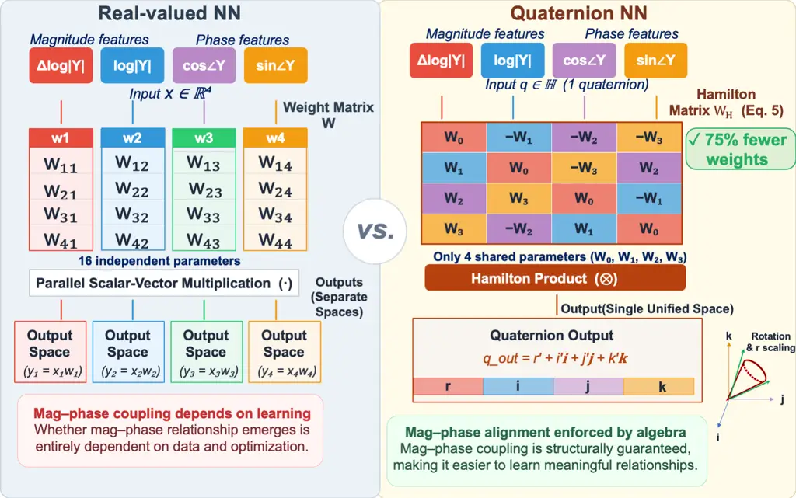
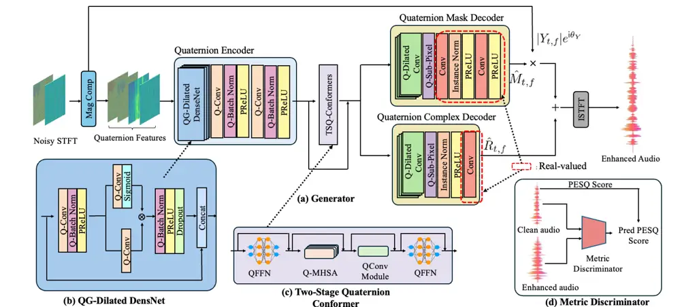
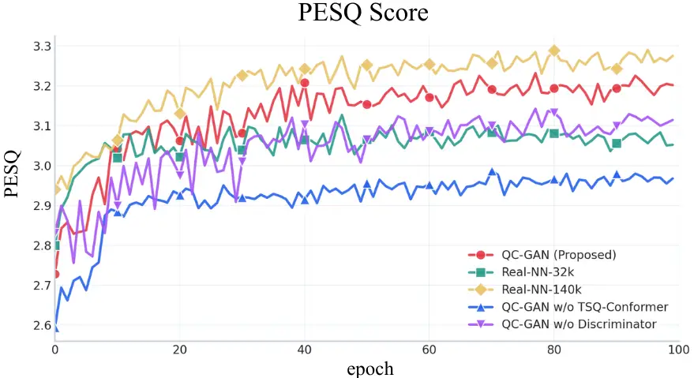
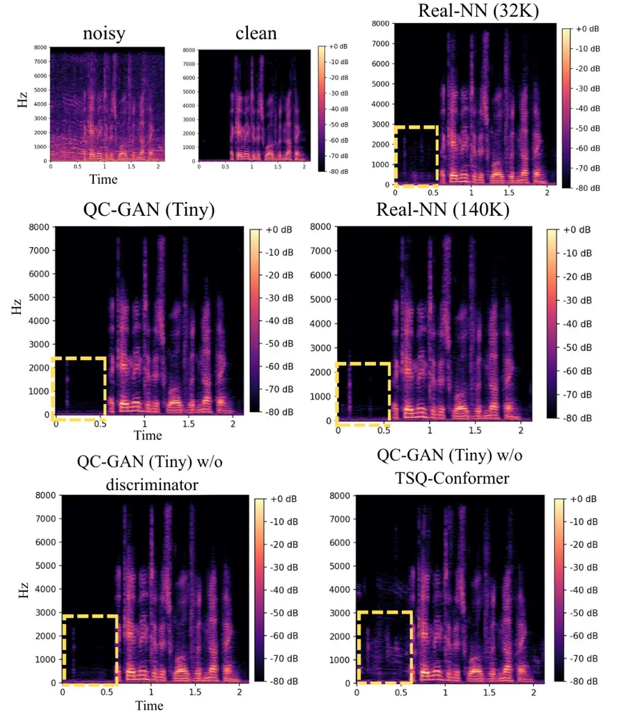
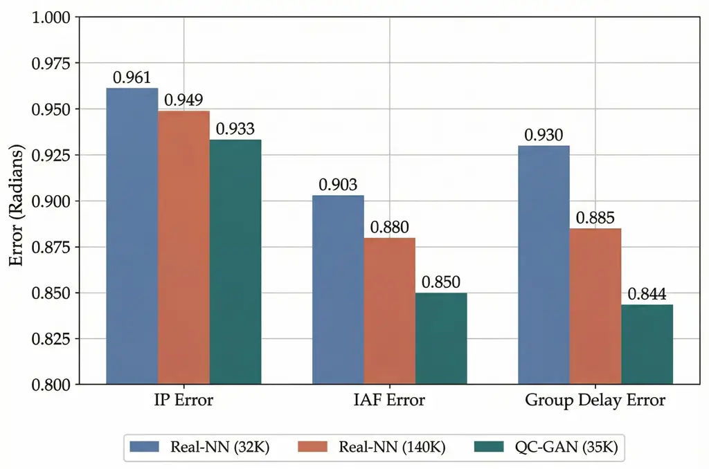
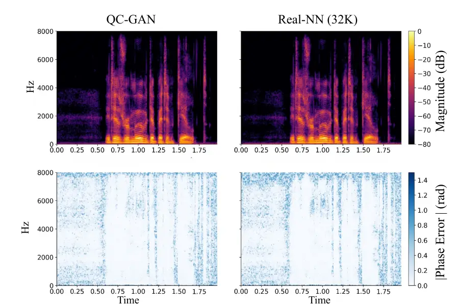

Yamauchi Tamori Sakai Yamano Nitta

# QC-GAN: A Parameter-Efficient Quaternion Conformer GAN for High-Fidelity Speech Enhancement

Shogo    Hideaki    Makoto    Yosuke    Tohru

###### Abstract

We propose a parameter-efficient speech enhancement framework,
Quaternion Conformer GAN (QC-GAN), which combines a Quaternion Conformer
generator with MetricGAN-based training. The Hamilton product encodes
the magnitude and phase via structured weight sharing, reducing the
number of layer parameters while preserving their interdependencies. A
metric-learning discriminator was employed to maximize perceptual
quality by optimizing the approximate perceptual evaluation scores. On
the VoiceBank+DEMAND dataset, QC-GAN achieved a Perceptual Evaluation of
Speech Quality (PESQ) score of 3.48 with only 0.89M parameters,
delivering a performance comparable to state-of-the-art models at less
than half their size. A 35K-parameter variant achieved a PESQ score of
3.23, surpassing conventional methods with significantly fewer
parameters. Evaluation on the DNS-Challenge 3 dataset further confirmed
generalization to real-world conditions. ¹¹ 1
https://github.com/asahi-research/QC-GAN

###### keywords

Speech Enhancement, Quaternion, GAN, hypercomplex

^(†)^(†)address: ¹ The Asahi Shimbun Company, Japan  
² Tokyo Woman’s Christian University, Japan ^(†)^(†)email:
yamauchi-s1@asahi.com

## 1 Introduction

Speech enhancement (SE) is a critical task that aims to improve the
perceptual quality of speech signals in real-world environments. With
recent advances in deep learning, methods operating in the
time-frequency (T–F) domain have become a dominant approach, resulting
in significant performance improvements. In particular, Transformers
with self-attention mechanisms \[1\], Conformers \[2\] that combine
Transformers with convolutional neural networks (CNNs), and state-space
models \[3\] have catalyzed a significant paradigm shift in this field.
Conformer-based architectures, in particular, have achieved
state-of-the-art (SoTA) performances through models such as CMGAN \[4\]
and MP-SENet \[5\], establishing themselves as foundational frameworks
for SE.

Although these methods achieve high performance, lightweight speech
enhancement has emerged as an increasingly active area of research.
Existing approaches achieve model compression through channel
reduction \[6\], pruning \[7\], or efficient operations, such as
depthwise separable convolutions \[8, 9, 10\]. However, aggressive
parameter reduction can significantly degrade a model’s representational
capacity, and its impact is particularly critical when modeling phase
information \[11\]. As phase accuracy directly affects perceptual
quality, phase distortions can introduce audible artifacts such as
musical noise even when the magnitude is accurately reconstructed,
ultimately limiting performance on metrics such as the Perceptual
Evaluation of Speech Quality (PESQ) \[12\].



Figure 1: Feature learning in real-valued vs. quaternion layers. A
real-valued layer considers magnitude and phase independently, whereas a
quaternion layer couples them through the Hamilton product as an
inductive bias.

To overcome this trade-off, we focus on Quaternion Neural Networks
(QNNs), which leverage Hamilton’s quaternion algebra \[13\]. In a QNN,
the Hamilton product performs linear transformations through structured
weight sharing by reusing four real-valued sub-matrices across all
components, reducing the number of parameters by a factor of four
compared with an equivalent real-valued layer \[14, 15, 16, 17, 18\].
Unlike standard real-valued networks that treat each channel
independently, this weight sharing imposes a rotation-like coupling
among components, enabling joint encoding of the magnitude and phase as
a unified quaternion representation \[19, 20\] (Figure 1). This
structural inductive bias mitigates the capacity loss inherent to
lightweight models.

In this study, we propose a Quaternion Conformer GAN (QC-GAN) that
integrates the advantages of quaternions into a modern Conformer
architecture. The Conformer captures local spectral patterns through
convolution and global temporal dependencies via self-attention; by
reformulating these operations in quaternion algebra, the QC-GAN models
these features while jointly preserving the magnitude and phase
information with significantly fewer parameters. Furthermore, we adopted
the MetricGAN training framework, employing a discriminator to
approximate perceptual evaluation metrics, such as PESQ, thereby further
maximizing the perceptual quality of the enhanced speech. The
contributions of this study are summarized as follows:

- \[nosep, leftmargin=\*\]
- •
  Novel Framework: To our knowledge, this is the first application of
  quaternion neural networks to single-channel speech enhancement.
  Furthermore, we propose the Quaternion Conformer (QC) architecture and
  demonstrate its effectiveness for achieving this task.
- •
  Parameter Efficiency: QC-GAN achieves higher parameter efficiency than
  conventional models, with a PESQ of 3.48 using only 0.89M parameters
  on the VoiceBank+DEMAND dataset, comparable to SoTA models at less
  than half their size. An ultra-compact variant with only 35K
  parameters achieves a PESQ of 3.23, further demonstrating the
  scalability of the proposed framework.
- •
  Quaternion Advantage in Phase Preservation: Ablation studies comparing
  QC-GAN with an approach in which all quaternion layers are replaced
  with real-valued layers show that the quaternion representations
  achieve lower phase errors, demonstrating the inherent advantage of
  quaternion algebra for phase preservation in speech enhancement.

## 2 Related Work

### 2.1 Speech-Enhancement Models

Deep learning-based speech enhancement (SE) has evolved from early
convolutional neural network (CNN) \[21\] and recurrent neural network
(RNN) architectures \[22\] to more sophisticated Transformer and
Conformer models. In particular, the Conformer excels at simultaneously
capturing local and global dependencies, underpinning SoTA models such
as MP-SENet \[5\] and CMGAN \[4\]. Meanwhile, lightweight SE is an
active research area for reducing the model size while preserving
performance. For instance, LiSenNet \[23\] combines sub-band processing
with a dual-path recurrent module, whereas LSENet \[7\] employs dilated
convolutions and attention mechanisms, achieving PESQ scores above 3.0
using extremely compact models with fewer than 0.1M parameters. However,
such parameter reduction strategies often impair the modeling of complex
spectral structures and phase information when the parameter counts
become extremely low, creating a performance gap compared with
full-scale models.

### 2.2 Quaternion Neural Networks in the Audio Domain

Quaternion Neural Networks (QNNs) embed a four-component input into a
four-dimensional hypercomplex space, where the Hamilton product
processes it as a single coupled entity, typically achieving a fourfold
parameter reduction. In speech and audio processing, QNNs have been
explored mainly for _discriminative_ tasks: Parcollet et al. \[19, 20\]
assign Mel filter-bank energies and their temporal derivatives to the
quaternion axes for automatic speech recognition (ASR), with related
formulations extended to multi-channel distant ASR \[24\] and 3D sound
source localization \[25\]. These studies predict labels or spatial
estimates rather than _reconstructing_ a clean waveform, and their
quaternion axes encode hand-crafted acoustic descriptors rather than the
spectrogram directly. To our knowledge, no prior study has applied QNNs
to single-channel speech enhancement, where magnitude and phase must be
jointly estimated. We address this gap by assigning the short-time
Fourier transform (STFT) magnitude and phase directly to the quaternion
axes and reformulating the Conformer— encompassing not only
convolutional and recurrent layers but also its architecture as a
whole—within hypercomplex algebra, positioning phase reconstruction as
the locus where the Hamilton-product coupling is expected to fully
exploit its advantage.

### 2.3 Metric-based Optimization

Conventional SE models are typically trained using objective functions
such as mean squared error (MSE) on spectrograms. However, these loss
functions do not necessarily correlate with human auditory perception or
evaluation metrics such as PESQ \[12\] and Short-Time Objective
Intelligibility (STOI) \[26\]. To bridge this gap, the MetricGAN \[27\]
framework and its successors, MetricGAN+ \[28\] and CMGAN \[4\], trained
a discriminator to estimate evaluation metrics, guiding the generator
toward optimizing perceptual quality. The proposed QC-GAN follows this
paradigm. However, unlike CMGAN, which relies on a real-valued
Conformer, we employ a Quaternion Conformer as the generator. Quaternion
operations enable the generator to model the magnitude and phase with
substantially fewer parameters, whereas MetricGAN-based training further
maximizes perceptual quality.

## 3 Proposed Method

This section describes the proposed QC-GAN architecture. Section 3.1
introduces the fundamentals of quaternion algebra, and Section 3.2
defines the quaternion neural network layers used as building blocks.
Sections 3.3 and 3.4 present the overall QC-GAN architecture and its
loss functions, respectively. Finally, Section 3.5 describes the
quaternion feature representation used as the model input.



Figure 2: Overall architecture of the proposed QC-GAN, comprising a
Quaternion Encoder, a QG-Dilated DenseNet encoder (b), a two-stage
Quaternion Conformer bottleneck (c), a dual-branch decoder (mask and
complex residual), and a metric discriminator (d). The overall generator
architecture is shown in (a).

### 3.1 Quaternion Algebra

A quaternion $`q\in\mathbb{H}`$ is a hypercomplex number with one real
$`q_{0}`$ and three imaginary components $`q_{1},q_{2},q_{3}`$:

```math
q=q_{0}+q_{1}{\sf i}+q_{2}{\sf j}+q_{3}{\sf k}, \tag{1}
```

where $`\mathbb{H}`$ denotes the set of quaternions. The imaginary units
$`{\sf i}`$, $`{\sf j}`$, and $`{\sf k}`$ obey the following fundamental
relations:

```math
{\sf i}^{2}={\sf j}^{2}={\sf k}^{2}={\sf ijk}=-1. \tag{2}
```

The quaternion conjugate and its squared norm are defined as

```math
q^{*}=q_{0}-q_{1}{\sf i}-q_{2}{\sf j}-q_{3}{\sf k},\qquad\lVert q\rVert^{2}=q\otimes q^{*}, \tag{3}
```

where $`\otimes`$ denotes the Hamilton product. The Hamilton product of
two quaternions $`p,q\in\mathbb{H}`$ is given by

```math
\displaystyle p\otimes q \displaystyle=(p_{0}q_{0}-p_{1}q_{1}-p_{2}q_{2}-p_{3}q_{3})
```

```math
\displaystyle\quad+(p_{0}q_{1}+p_{1}q_{0}+p_{2}q_{3}-p_{3}q_{2}){\sf i}
```

```math
\displaystyle\quad+(p_{0}q_{2}-p_{1}q_{3}+p_{2}q_{0}+p_{3}q_{1}){\sf j}
```

```math
\displaystyle\quad+(p_{0}q_{3}+p_{1}q_{2}-p_{2}q_{1}+p_{3}q_{0}){\sf k}. \tag{4}
```

### 3.2 Quaternion Neural Networks Layer

Building upon the Hamilton product defined in Section 3.1, we define the
proposed QC-GAN’s foundational elements: the Quaternion fully-connected
layer (QFC) and the Quaternion Convolutional layer (QConv).

#### 3.2.1 Quaternion Fully-Connected Layer

Let
$`\mathbf{x}=\mathbf{x}_{0}+\mathbf{x}_{1}{\sf i}+\mathbf{x}_{2}{\sf j}+\mathbf{x}_{3}{\sf k}\in\mathbb{H}^{N_{in}}`$
be the input vector and
$`\mathbf{W}=\mathbf{W}_{0}+\mathbf{W}_{1}{\sf i}+\mathbf{W}_{2}{\sf j}+\mathbf{W}_{3}{\sf k}\in\mathbb{H}^{N_{out}\times N_{in}}`$
be the quaternion weight matrix, where $`N_{in}`$ and $`N_{out}`$ denote
the input and output dimensions in the quaternion domain, respectively,
and $`\mathbf{W}_{\{0,1,2,3\}}`$ are real-valued matrices \[29\]. The
linear transformation $`\mathbf{y}=\mathbf{W}\otimes\mathbf{x}`$ can be
formulated as a real-valued matrix-vector multiplication using the
Hamilton matrix $`\mathbf{H}_{W}`$:

```math
\begin{bmatrix}\mathbf{y}_{0}\\
\mathbf{y}_{1}\\
\mathbf{y}_{2}\\
\mathbf{y}_{3}\end{bmatrix}=\underbrace{\begin{bmatrix}\mathbf{W}_{0}&-\mathbf{W}_{1}&-\mathbf{W}_{2}&-\mathbf{W}_{3}\\
\mathbf{W}_{1}&\mathbf{W}_{0}&-\mathbf{W}_{3}&\mathbf{W}_{2}\\
\mathbf{W}_{2}&\mathbf{W}_{3}&\mathbf{W}_{0}&-\mathbf{W}_{1}\\
\mathbf{W}_{3}&-\mathbf{W}_{2}&\mathbf{W}_{1}&\mathbf{W}_{0}\end{bmatrix}}_{\makebox[0.0pt]{\raisebox{-8.0pt}{$\mathbf{H}_{W}$}}}\begin{bmatrix}\mathbf{x}_{0}\\
\mathbf{x}_{1}\\
\mathbf{x}_{2}\\
\mathbf{x}_{3}\end{bmatrix}. \tag{5}
```

Here, $`\mathbf{H}_{W}\in\mathbb{R}^{4N_{out}\times 4N_{in}}`$ denotes
the Hamilton matrix constructed from the components of $`\mathbf{W}`$.
As shown in Eq. (5), the sub-matrices $`\mathbf{W}_{\{0,1,2,3\}}`$ are
shared across different axes. Consequently, a QFC layer requires only
$`4\times N_{in}\times N_{out}`$ parameters, achieving a 75% reduction
compared with a real-valued layer with an equivalent input–output
dimensionality of ($`4N_{in}\times 4N_{out}`$).

#### 3.2.2 Quaternion Convolutional Layer

Quaternion convolution extends the Hamilton product to the convolution
operation \[29\]. Let
$`\mathcal{X}\in\mathbb{H}^{T\times F\times C_{in}}`$ be the input
feature map and
$`\mathcal{K}\in\mathbb{H}^{K_{t}\times K_{f}\times C_{in}\times C_{out}}`$
be the quaternion kernel, defined as
$`\mathcal{K}=\mathcal{K}_{0}+\mathcal{K}_{1}{\sf i}+\mathcal{K}_{2}{\sf j}+\mathcal{K}_{3}{\sf k}`$,
where $`T`$ is the number of time frames, $`F`$ is the number of
frequency bins, $`C_{in}`$ and $`C_{out}`$ are the numbers of input and
output quaternion channels, respectively, and $`K_{t}\times K_{f}`$ is
the kernel size. The output feature map
$`\mathcal{Y}=\mathcal{K}\ast\mathcal{X}`$ is calculated by convolving
the four real-valued component feature maps according to the Hamilton
product rule (Eq. (4)):

```math
\displaystyle\mathcal{Y}_{0} \displaystyle=\mathcal{K}_{0}\ast\mathcal{X}_{0}-\mathcal{K}_{1}\ast\mathcal{X}_{1}-\mathcal{K}_{2}\ast\mathcal{X}_{2}-\mathcal{K}_{3}\ast\mathcal{X}_{3}, \tag{6}
```

```math
\displaystyle\mathcal{Y}_{1} \displaystyle=\mathcal{K}_{0}\ast\mathcal{X}_{1}+\mathcal{K}_{1}\ast\mathcal{X}_{0}+\mathcal{K}_{2}\ast\mathcal{X}_{3}-\mathcal{K}_{3}\ast\mathcal{X}_{2},
```

```math
\displaystyle\mathcal{Y}_{2} \displaystyle=\mathcal{K}_{0}\ast\mathcal{X}_{2}-\mathcal{K}_{1}\ast\mathcal{X}_{3}+\mathcal{K}_{2}\ast\mathcal{X}_{0}+\mathcal{K}_{3}\ast\mathcal{X}_{1},
```

```math
\displaystyle\mathcal{Y}_{3} \displaystyle=\mathcal{K}_{0}\ast\mathcal{X}_{3}+\mathcal{K}_{1}\ast\mathcal{X}_{2}-\mathcal{K}_{2}\ast\mathcal{X}_{1}+\mathcal{K}_{3}\ast\mathcal{X}_{0},
```

where $`\ast`$ denotes a standard real-valued convolution.

#### 3.2.3 Quaternion Multi-Head Self-Attention

Standard self-attention mechanisms rely on real-valued dot products and
treat feature channels independently. In contrast, we employ the
Quaternion Multi-Head Self-Attention (Q-MHSA) proposed by Tay et
al. \[30\], which captures latent structural dependencies between
quaternion components.

Given a quaternion input sequence
$`\mathbf{X}\in\mathbb{H}^{T\times D}`$, where $`D`$ denotes the
quaternion feature dimension, the query, key, and value matrices
($`\mathbf{Q},\mathbf{K},\mathbf{V}`$) are projected using the QFC
layers defined in Section 3.2.1:

```math
\mathbf{Q}=\mathbf{W}_{q}\otimes\mathbf{X},\quad\mathbf{K}=\mathbf{W}_{k}\otimes\mathbf{X},\quad\mathbf{V}=\mathbf{W}_{v}\otimes\mathbf{X}, \tag{7}
```

where
$`\mathbf{W}_{q},\mathbf{W}_{k},\mathbf{W}_{v}\in\mathbb{H}^{D\times D}`$
are quaternion weight matrices.

The attention scores are computed using the Hamilton product of the
queries and keys, followed by a scaling factor and a softmax function:

```math
\mathbf{A}_{\alpha}=\text{ComponentSoftmax}\left(\frac{\mathbf{Q}\otimes\mathbf{K}^{\top}}{\sqrt{d_{k}}}\right),\quad\alpha\in\{0,1,2,3\} \tag{8}
```

where $`d_{k}=D/h`$ denotes the dimension of each head, and $`h`$ is the
number of attention heads. Crucially, as formulated by Tay et
al. \[30\], the softmax function in Eq. (8) is applied component-wise to
each of the real and imaginary parts (indexed by $`0,1,2,3`$)
independently (ComponentSoftmax). Finally, the output of the attention
head is computed as $`\mathbf{Y}=\mathbf{A}_{\alpha}\mathbf{V}`$, with
RMSNorm applied to queries and keys for scale stability. The outputs
from all heads are concatenated and projected back to the original
dimension via a QFC layer.

### 3.3 QC-GAN Architecture

QC-GAN, inspired by the CMGAN architecture \[4\], reformulates its
components in the quaternion domain (Figure 2 (a)). The generator
comprises a quaternion encoder, a two-stage Quaternion Conformer
bottleneck (c), and a dual-branch decoder that simultaneously estimates
the magnitude masks and complex residuals. A metric discriminator (d)
approximates perceptual scores, such as PESQ, to further maximize the
enhancement quality.

#### 3.3.1 Encoder

The encoder projects the input quaternion features
$`\mathbf{X}\in\mathbb{H}^{B\times 1\times T\times F}`$, where $`B`$ is
the batch size, $`T`$ is the number of time frames, $`F`$ is the number
of frequency bins, and $`1`$ denotes a single quaternion channel
(equivalent to four real-valued channels), into a latent representation
using the Quaternion Gated (QG)-Dilated DenseNet (Figure 2(b)). Dense
connections reuse features from earlier layers, enabling effective
feature extraction with fewer parameters \[31\]. Each dense block
applies quaternion dilated convolutions with dilation rates of $`1,2,4`$
and $`8`$ to capture multi-scale spectral patterns. A gating mechanism
multiplies the convolution output element-wise with a parallel sigmoid
branch \[32\], suppressing the noise-related activations while retaining
informative features. We utilized Quaternion Batch Normalization
(Q-Batch Norm) based on quaternion variance statistics, as proposed
in \[33\]. The encoder concludes by downsampling the frequency dimension
($`F/2`$), yielding a latent tensor of shape $`[B,C,T,F/2]`$ for
efficient processing in the subsequent bottleneck.

#### 3.3.2 Bottleneck

The bottleneck employs a Two-Stage Quaternion Conformer (TSQ-Conformer,
Figure 2(c)), which stacks $`N`$ Q-Conformer blocks, each of which
applies self-attention, first along the time dimension and then along
the frequency dimension \[5\]. This two-stage design enables the model
to capture global dependencies across the entire spectrogram while
preserving its quaternion structure. A residual connection is applied
around the bottleneck module to facilitate the gradient flow.

#### 3.3.3 Decoder

The decoder employs a dual-branch architecture inspired by CMGAN \[4\]
to reconstruct high-resolution T–F features. It comprises two parallel
paths: a mask branch that estimates a real-valued magnitude mask
$`\hat{M}_{t,f}`$ and a complex branch that predicts complex residuals
$`\hat{R}_{t,f}`$ to correct the phase details. Each branch first
applies a dilated quaternion convolutional block (with dilation rates
$`d=\{1,2,4,8\}`$) to capture wide-context dependencies, followed by a
Quaternion Sub-Pixel Convolution ($`r=2`$) that upsamples the frequency
dimension ($`F/2\to F`$) while preventing checkerboard artifacts. The
mask branch concludes with channel-wise, learnable PReLU
activations \[34\]. Both branches project the quaternion features into
the real domain through a final real-valued convolution. Finally, the
outputs are integrated to synthesize the enhanced complex spectrogram
bin $`\hat{S}_{t,f}`$.

Let $`Y_{t,f}\in\mathbb{C}`$ denote the noisy STFT coefficient. It can
be expressed in polar form as
$`Y_{t,f}=|Y_{t,f}|e^{\mathrm{i}\theta_{Y_{t,f}}}`$, where
$`\theta_{Y_{t,f}}=\angle Y_{t,f}`$ denotes the noisy phase. We first
compute the masked magnitude and its phase-carrying complex spectrum as

```math
\displaystyle\tilde{S}_{t,f}=\hat{M}_{t,f}\,|Y_{t,f}|\,e^{\mathrm{i}\theta_{Y_{t,f}}}. \tag{9}
```

The enhanced complex spectrogram is then reconstructed by adding the
predicted complex residual:

```math
\hat{S}_{t,f}=\tilde{S}_{t,f}+\hat{R}_{t,f}. \tag{10}
```

The final time-domain waveform is obtained by applying the Inverse STFT
(ISTFT) to $`\hat{S}`$.

### 3.4 Loss Functions

To enable high-fidelity speech reconstruction and optimize perceptual
quality, we trained QC-GAN using a multi-task objective function
comprising a generator loss $`\mathcal{L}_{G}`$ and a discriminator loss
$`\mathcal{L}_{D}`$.

#### 3.4.1 Generator Loss

The total generator loss is defined as a weighted sum of five
components:

```math
\mathcal{L}_{G}=0.1\mathcal{L}_{\text{RI}}+0.9\mathcal{L}_{\text{Mag}}+0.2\mathcal{L}_{\text{Time}}+0.05\mathcal{L}_{\text{PESQ}}+0.05\mathcal{L}_{\text{GAN}}. \tag{11}
```

The loss weights were empirically determined based on preliminary
experiments. The individual loss terms are defined as

```math
\displaystyle\mathcal{L}_{\text{RI}}=\mathbb{E}\left[\lVert\hat{S}_{r}-S_{r}\rVert^{2}\right]+\mathbb{E}\left[\lVert\hat{S}_{i}-S_{i}\rVert^{2}\right], \tag{12}
```

```math
\displaystyle\mathcal{L}_{\text{Mag}}=\mathbb{E}\left[\lVert\hat{A}-A\rVert^{2}\right], \tag{13}
```

```math
\displaystyle\mathcal{L}_{\text{Time}}=\mathbb{E}\left[\lVert\hat{y}-y\rVert_{1}\right], \tag{14}
```

```math
\displaystyle\mathcal{L}_{\text{PESQ}}=\mathbb{E}\left[\Psi^{(s)}(\mathbf{l},\hat{\mathbf{l}})+\Psi^{(a)}(\mathbf{l},\hat{\mathbf{l}})\right], \tag{15}
```

```math
\displaystyle\mathcal{L}_{\text{GAN}}=\mathbb{E}\left[\lVert D(A,\hat{A})-1\rVert^{2}\right], \tag{16}
```

where $`S`$ and $`\hat{S}`$ respectively denote the clean and enhanced
complex spectrograms, with subscripts $`r`$ and $`i`$ indicating their
real and imaginary parts; $`A=|S|`$ and $`\hat{A}=|\hat{S}|`$ are the
corresponding magnitude spectrograms; $`y`$ and $`\hat{y}`$ are the
clean and enhanced time-domain waveforms; $`\Psi^{(s)}`$ and
$`\Psi^{(a)}`$ are the symmetrical and asymmetrical disturbance terms
computed from loudness spectra $`\mathbf{l}`$ and $`\hat{\mathbf{l}}`$
derived from $`y`$ and $`\hat{y}`$ \[35\]; and $`D`$ is the
discriminator. The differentiable PESQ loss provides a stable perceptual
training signal, whereas the MetricGAN discriminator offers adaptive
guidance from the data distribution, and their combination facilitates
perceptual quality optimization.

#### 3.4.2 Discriminator Loss

The discriminator $`D`$ acts as a learned metric approximator. It takes
a pair of magnitude spectrograms (reference and target) as input. The
discriminator loss $`\mathcal{L}_{D}`$ minimizes the prediction error
for both clean and enhanced speech as follows:

```math
\mathcal{L}_{D}=\mathbb{E}\left[\left\lVert D(A,A)-1\right\rVert^{2}\right]+\mathbb{E}\left[\left\lVert D(A,\hat{A})-Q_{\text{PESQ}}\right\rVert^{2}\right], \tag{17}
```

where $`D`$ denotes the discriminator and $`Q_{\text{PESQ}}`$ the
normalized PESQ score in the range $`[0,1]`$.

### 3.5 Quaternion Feature

To capture the spectral dynamics and phase relations effectively, we
constructed a four-channel quaternion input
$`\mathbf{X}_{\text{in}}\in\mathbb{H}^{B\times 1\times T\times F}`$ from
the noisy speech STFT coefficients $`Y`$. Let $`|Y|_{\epsilon}`$ denote
the magnitude spectrum clamped by a small constant $`\epsilon`$ (e.g.,
$`10^{-8}`$) for numerical stability, defined as

```math
|Y_{t,f}|_{\epsilon}=\max(|Y_{t,f}|,\epsilon). \tag{18}
```

The quaternion feature is represented as four real-valued channels of
shape $`[B,4,T,F]`$, and is defined as

```math
\displaystyle\mathbf{X}_{\text{in}}=\Delta\log(|Y|_{\epsilon})+\log(|Y|_{\epsilon})\,\mathsf{i}+\frac{\operatorname{Re}(Y)}{|Y|_{\epsilon}}\,\mathsf{j}+\frac{\operatorname{Im}(Y)}{|Y|_{\epsilon}}\,\mathsf{k}. \tag{19}
```

The real part is assigned the first-order temporal difference of the
log-magnitude, $`\Delta\log(|Y|_{\epsilon})`$, to capture the spectral
dynamics. Concretely,

```math
\Delta\log(|Y|_{\epsilon})_{t,f}=\begin{cases}0,&t=0,\\
\log(|Y_{t,f}|_{\epsilon})-\log(|Y_{t-1,f}|_{\epsilon}),&t>0,\end{cases} \tag{20}
```

That is, the difference is computed along the time axis, and the first
frame is padded with zeros. The first imaginary component (associated
with unit $`\mathsf{i}`$) encodes the log-magnitude
$`\log(|Y|_{\epsilon})`$, which represents the static spectral envelope
of the signal. The remaining imaginary components (associated with units
$`\mathsf{j}`$ and $`\mathsf{k}`$) correspond to the cosine and sine of
the phase normalized by the clamped magnitude, respectively, thereby
preserving the circular phase structure within the quaternion domain.
Following CMGAN and MP-SENet \[4, 5\], we applied power-law compression
($`\beta=0.3`$) to the complex STFT coefficients and computed the
spectral-domain losses (and the discriminator) in the compressed domain.
The predicted spectra were power-uncompressed before the ISTFT
reconstruction.

## 4 Experiment

### 4.1 Dataset

#### 4.1.1 VoiceBank+DEMAND

We evaluated QC-GAN using the VoiceBank+DEMAND dataset \[36\]²² 2
https://huggingface.co/datasets/JacobLinCool/VoiceBank-DEMAND-16k, which
comprises 28 speakers (11,572 utterances) for training and 2 speakers
(824 utterances) for testing. Clean speech from the Voice Bank
corpus \[37\] was mixed with noise from the DEMAND database \[38\] and
artificial sources at SNRs of 0–15 dB for training, and with unseen
noise types at SNRs of 2.5–17.5 dB for testing. Using this dataset, we
first compared QC-GAN with recent SoTA models to demonstrate its
performance. Furthermore, to highlight the parameter efficiency of our
framework, we conducted a focused comparison with ultra-compact models
to verify the superiority of our compact variant, QC-GAN (Tiny).

#### 4.1.2 DNS-Challenge 3

Although the VoiceBank+DEMAND dataset comprises synthetically mixed
noise under controlled conditions, real-world deployment requires
robustness to diverse and unpredictable acoustic environments. To
evaluate this, we employed the Deep Noise Suppression Challenge 3
(DNS-Challenge 3) dataset \[39\]³³ 3
https://github.com/microsoft/DNS-Challenge, released as part of an
international benchmark for speech enhancement under challenging
acoustic conditions, which provides approximately 760 hours of clean
speech covering diverse speaking styles and languages, 181 hours of
noise spanning approximately 150 classes, and over 118,000 room impulse
responses for reverberant simulation. We used the blind test set to
verify whether QC-GAN, despite its compact size, can generalize to
large-scale and diverse conditions without underfitting.

### 4.2 Experimental Setup

All audio recordings were resampled to 16 kHz. During training, the
audio segments were cropped to a fixed length of 2 s (32,000 samples).
For spectral analysis, we computed the STFT using a Hann window of
length 25 ms (400 samples) and hop size 6.25 ms (100 samples). The
models were trained using the AdamW \[40\] optimizer with
$`\beta_{1}=0.5,\beta_{2}=0.999`$. The initial learning rates were set
to $`5\times 10^{-4}`$ for the generator and $`1\times 10^{-3}`$ for the
discriminator, with a decay schedule applied every 30 epochs. Gradient
clipping was set to 1.0 to stabilize the training. We trained for 100
epochs on the VoiceBank+DEMAND dataset and 50 epochs on the
DNS-Challenge dataset, each trained separately from scratch.

We configured two model variants: QC-GAN (Base) and QC-GAN (Tiny). Both
models use four attention heads. The Base model uses a growth rate
(output channels per dense block) of 64, 4 TSQ-Conformer layers, and 64
decoder channels (0.89M parameters), whereas the Tiny model reduces
these to 16, 1, and 16, respectively (35K parameters).

To comprehensively assess enhancement performance, we employed distinct
metrics tailored to each dataset. For VoiceBank+DEMAND, we reported
standard objective metrics: PESQ \[12\], STOI \[26\], and composite
metrics comprising CSIG (signal distortion), CBAK (background
intrusiveness), and COVL (overall quality) \[41\]. To characterize both
parameter efficiency and computational cost, we report the number of
parameters (Params) and, for the ultra-compact models, the number of
real-valued MACs. For DNS-Challenge 3, given the absence of clean
references for the blind test set, we used non-intrusive metrics: DNSMOS
P.835 scores \[42\]—Signal (SIG), Background (BAK), and Overall
(OVRL)—along with the ITU-T P.808 MOS \[43\] as a perceptual quality
proxy.

### 4.3 Results

#### 4.3.1 VoiceBank+DEMAND

| Model             | Params (M) | PESQ | STOI | CSIG | CBAK | COVL |
| ----------------- | ---------- | ---- | ---- | ---- | ---- | ---- |
| Noisy             | -          | 1.97 | 0.91 | 3.35 | 2.44 | 2.63 |
| SEGAN \[44\]      | 97.47      | 2.16 | 0.92 | 3.48 | 2.94 | 2.80 |
| MetricGAN+ \[28\] | -          | 3.15 | -    | 4.14 | 3.16 | 3.64 |
| DPT-FSNet \[45\]  | 0.88       | 3.33 | 0.96 | 4.58 | 3.72 | 4.00 |
| CMGAN \[4\]       | 1.83       | 3.41 | 0.96 | 4.63 | 3.94 | 4.12 |
| MP-SENet \[5\]    | 2.05       | 3.50 | 0.96 | 4.73 | 3.95 | 4.22 |
| SE-Mamba \[3\]    | 2.26       | 3.55 | 0.96 | 4.77 | 3.95 | 4.26 |
| QC-GAN (Base)     | 0.89       | 3.48 | 0.95 | 4.60 | 3.65 | 4.10 |

Table 1: Performance comparison with state-of-the-art methods on
VoiceBank+DEMAND. Bold indicates the best performance in each metric.

| Model                 | Params (K) | MACs(G)         | PESQ | STOI |
| --------------------- | ---------- | --------------- | ---- | ---- |
| Noisy                 | –          | –               | 1.97 | 0.91 |
| RNNoise \[46\]        | 60         | 0.04            | 2.33 | 0.92 |
| CCFNet+ (Lite) \[47\] | 160        | 0.39            | 2.94 | \-   |
| FSPEN \[48\]          | 79         | 0.09            | 2.97 | 0.94 |
| LiSenNet \[23\]       | 37         | 0.06            | 3.07 | 0.94 |
| LSENet \[7\]          | 39         | 0.24            | 3.12 | 0.95 |
| QC-GAN (Tiny)         | 35         | 3.75 (0.22)^(†) | 3.23 | 0.94 |

Table 2: Comparison with ultra-compact models on VoiceBank+DEMAND. MACs
are real-valued. For QC-GAN, the value in parentheses is the qMAC count
of the parametrized layers (0.22 G; $`1`$ qMAC $`=16`$ real MACs);
^(†)its real-MAC value additionally includes attention.

The Base model is compared with recent state-of-the-art methods
(CMGAN \[4\], MP-SENet \[5\], SE-Mamba \[3\]), DPT-FSNet \[45\] (with a
comparable parameter count), and MetricGAN+ \[28\] (a representative
metric-based approach). The Tiny model is compared with (LSENet \[7\],
LiSenNet \[23\], FSPEN \[48\], CCFNet+ \[47\]) and RNNoise \[46\] as a
baseline. The results are given in Tables 1 and 2.

Table 1 compares QC-GAN (Base) with SoTA models. With only 0.89M
parameters, comparable to DPT-FSNet \[45\], QC-GAN achieves a PESQ of
3.48, surpassing CMGAN \[4\] (PESQ 3.41) and approaching MP-SENet \[5\]
(PESQ 3.50) and SE-Mamba \[3\] (PESQ 3.55), which require approximately
2–2.5$`\times`$ more parameters.

Table 2 focuses on the ultra-compact regime. QC-GAN (Tiny) achieves a
PESQ of 3.23 with only 35K parameters, outperforming LiSenNet \[23\]
(PESQ 3.07, 37K), LSENet \[7\] (PESQ 3.12, 39K), and RNNoise \[46\]
(PESQ 2.33, 60K) at a comparable or smaller model size. An STOI of 0.94
confirmed that speech intelligibility was preserved. These results
demonstrate that QC-GAN effectively captures the speech structures even
under extreme parameter constraints.

#### 4.3.2 DNS-Challenge

|               |        |      |      |      |          |
| ------------- | ------ | ---- | ---- | ---- | -------- |
| Model         | Params | OVRL | SIG  | BAK  | P808_MOS |
| Noisy         | –      | 2.11 | 2.89 | 2.34 | 2.92     |
| NSNet2 \[49\] | 2.7M   | 2.31 | 2.89 | 2.85 | 3.01     |
| DCCRN \[50\]  | 3.7M   | 2.54 | 2.98 | 3.43 | 3.26     |
| CMGAN \[4\]   | 1.83M  | 2.66 | 3.08 | 3.59 | 3.12     |
| QC-GAN (Tiny) | 35K    | 2.56 | 2.95 | 3.54 | 3.23     |
| QC-GAN (Base) | 0.89M  | 2.73 | 3.07 | 3.79 | 3.37     |

Table 3: Performance comparison on the DNS-Challenge 3 blind test set
using DNSMOS metrics. All models were trained from scratch on the
DNS-Challenge 3 training data.

To validate the generalization to real-world conditions, we evaluated
QC-GAN on the DNS-Challenge 3 blind test set (Table 3). We compared the
proposed model with NSNet2 \[49\], the official baseline of the
DNS-Challenge, DCCRN \[50\], a representative model from previous
challenges, and CMGAN \[4\], a real-valued Conformer-based architecture
that serves as the closest baseline. For fair comparison, all models
were trained from scratch using the DNS-Challenge 3 training data.

Among all the compared methods, QC-GAN (Base) achieved the highest
scores in OVRL (2.73), BAK (3.79), and P.808 MOS (3.37), outperforming
CMGAN despite using approximately half of its parameters. QC-GAN (Tiny),
despite having only 35K parameters, surpassed NSNet2 (2.7M) across all
metrics and achieved performance comparable to DCCRN (3.7M). These
results confirm that QC-GAN generalizes effectively, even under complex
real-world noise conditions, without relying on excessive model
capacity.

## 5 Ablation Study

|                      |      |      |      |      |      |
| -------------------- | ---- | ---- | ---- | ---- | ---- |
| Model                | PESQ | STOI | CSIG | CBAK | COVL |
| Real-NN (32K)        | 3.12 | 0.94 | 4.29 | 3.30 | 3.73 |
| Real-NN (140K)       | 3.29 | 0.94 | 4.45 | 3.48 | 3.90 |
|    w/o Discriminator | 3.32 | 0.94 | 4.45 | 3.40 | 3.76 |
|    w/o TS-Conformer  | 3.10 | 0.93 | 4.03 | 3.25 | 3.57 |
| QC-GAN (Tiny Full)   | 3.23 | 0.94 | 4.33 | 3.36 | 3.79 |
|    w/o Discriminator | 3.14 | 0.94 | 4.33 | 3.40 | 3.76 |
|    w/o TSQ-Conformer | 2.99 | 0.93 | 3.91 | 3.19 | 3.44 |

Table 4: Ablation study: QC-GAN (35K params) vs. Real-NN (32K, 140K
params) with comparable and matched-capacity model sizes. TS-Conformer
denotes the real-valued Two-Stage Conformer.



Figure 3: PESQ curves over 100 training epochs for QC-GAN, Real-NN (32K
and 140K), and QC-GAN ablated variants (w/o Discriminator and w/o
TSQ-Conformer).



Figure 4: Spectrogram comparison on a VoiceBank+DEMAND test sample.
Yellow dashed boxes mark the pre-speech silent region (0–0.5 s), where
QC-GAN (Tiny) achieves noise suppression closest to the clean reference.

To validate the effectiveness of our architectural design choices, we
conducted an ablation study using QC-GAN (Tiny) configured on the
VoiceBank+DEMAND dataset \[36\]. To isolate the contribution of
quaternion algebra, we constructed a real-valued counterpart, Real-NN,
by replacing all quaternion layers with standard real-valued layers. We
configured two variants: Real-NN (32K), which approximately matched the
parameter count of QC-GAN (Tiny, 35K), and Real-NN (140K), which had
$`4\times`$ the parameters, corresponding to the theoretical reduction
ratio of the Hamilton product. For a fair comparison, both variants used
the same four-channel input features (Eq. 19), training configuration,
and loss functions as QC-GAN. Additionally, to assess the contribution
of individual components, we evaluated the variants in which either the
discriminator or the Conformer bottleneck was removed. These ablations
were conducted for both QC-GAN and Real-NN (140K), enabling a direct
comparison of how each component interacts with the quaternion versus
real-valued representations. The results are summarized in Table 4.

### 5.1 Efficacy of Quaternion Representation

As shown in Table 4, QC-GAN (35K) outperformed the parameter-matched
Real-NN (32K) across all metrics, with STOI on par (PESQ: 3.12
$`\rightarrow`$ 3.23, COVL: 3.73 $`\rightarrow`$ 3.79). Moreover,
Real-NN (140K), which used $`4\times`$ the parameters corresponding to
the theoretical reduction ratio of the Hamilton product, attained a PESQ
of 3.29. QC-GAN achieved a competitive PESQ of 3.23 with only 25% of the
parameters, confirming that quaternion algebra effectively maintained
the representational capacity of a real-valued network at a fraction of
the parameter cost.

Figure 3 reveals further distinctions in the learning dynamics. QC-GAN
converged to a stable plateau after 30–40 epochs and maintained a
consistent performance thereafter. In contrast, Real-NN (32K) fluctuated
at a lower level throughout training, suggesting that the limited
capacity of the real-valued model was insufficient to learn stable
cross-component relationships. Real-NN (140K) achieved both higher PESQ
and comparable training stability to QC-GAN; however, this required
$`4\times`$ the parameters. QC-GAN attains competitive performance with
only 25% of those parameters, demonstrating that quaternion algebra’s
inductive bias, which structurally couples the magnitude and phase
components during feature transformation, achieved a favorable trade-off
between performance and parameter efficiency. Figure 4 shows that QC-GAN
achieved noise suppression in the pre-speech silent region closest to
the clean reference among the compared models.

### 5.2 Effect of Discriminator

Removing the discriminator degraded COVL in both architectures (QC-GAN:
3.79 $`\rightarrow`$ 3.76; Real-NN 140K: 3.90 $`\rightarrow`$ 3.76),
confirming its overall contribution to perceptual quality. For QC-GAN,
the discriminator yielded a clear PESQ gain (3.14 $`\rightarrow`$ 3.23)
at the cost of a slight CBAK decrease (3.40 $`\rightarrow`$ 3.36),
suggesting that adversarial training steered the generator toward
perceptually salient improvements beyond those achieved by
reconstruction losses alone. In Real-NN (140K), removing the
discriminator slightly improved PESQ (3.29 $`\rightarrow`$ 3.32) while
degrading COVL (3.90 $`\rightarrow`$ 3.76), suggesting that the
discriminator primarily contributed to the overall perceptual quality
(COVL) rather than PESQ optimization in real-valued networks. In
contrast, QC-GAN benefited from the discriminator in both PESQ and COVL,
indicating that adversarial training is more consistently effective
under quaternion representations.

### 5.3 Effect of Conformer

Removing the Conformer bottleneck causes substantial degradation in both
architectures: QC-GAN dropped from 3.23 to 2.99 ($`-`$0.24) and Real-NN
(140K) from 3.29 to 3.10 ($`-`$0.19). Although this removal also reduces
the parameter count, the disproportionately large degradation compared
with other ablations (e.g., discriminator removal) indicates that the
attenuated long-range modeling capability is the dominant factor.
Notably, QC-GAN exhibited greater degradation than the Real-NN, despite
having fewer parameters. This could be attributed to the fact that
quaternion convolutions, while effective at capturing local
inter-component relationships, rely more heavily on the Conformer’s
self-attention to model long-range temporal dependencies. Importantly,
both architectures exhibit substantial degradation in both cases,
confirming that the Conformer’s long-range modeling capability is
preserved when reformulated entirely within quaternion algebra. This
validates the Q-Conformer as a viable quaternion counterpart to the
standard Conformer, as it retains the essential role of self-attention
for speech enhancement under the structural constraints of Hamilton’s
product.

## 6 Discussion

This section examines the advantages of QC-GAN over Real-NN, focusing on
the learning characteristics and phase handling that contribute to its
superior parameter efficiency and improved performance. The comparison
uses QC-GAN (Tiny) and Real-NN from the ablation study.

### 6.1 Why Quaternion Networks Achieve Parameter Efficiency

Quaternion layers implement inter-component mixing via the Hamilton
product, where four real-valued sub-matrices are reused to generate all
quaternion components (Eq. 5). This yields a substantial parameter
reduction compared with an equivalent real-valued layer operating on
four channels. For a mapping from $`C_{\text{in}}`$ to
$`C_{\text{out}}`$ quaternion channels (kernel size $`K`$), a
real-valued layer requires $`16C_{\text{out}}C_{\text{in}}K`$
parameters, whereas a quaternion layer requires only
$`4C_{\text{out}}C_{\text{in}}K`$ parameters, i.e., a $`4\times`$
reduction. Beyond the parameter count, the Hamilton product imposes a
structured $`4\times 4`$ block mixing pattern (Eq. 5 and Figure 1)
rather than an unconstrained inter-channel transformation, enabling
rotation-like coupling that processes the four components: spectral
dynamics $`\Delta\log(|Y|_{\epsilon})`$, static magnitude $`\log|Y|`$,
and phase $`(\cos\theta_{Y},\sin\theta_{Y})`$ (Eq. 19) as a unified
representation. This structure aligns well with speech signals, where
magnitude and phase are inherently coupled, and the
$`(\cos\theta_{Y},\sin\theta_{Y})`$ pair preserves phase circularity.

This inductive bias is particularly beneficial in the ultra-compact
regime (35K parameters). A 4-channel Real-NN must allocate limited
capacity to learn consistent cross-channel relationships from data under
a highly unconstrained mixing space, which can be parameter-inefficient.
In contrast, QNNs encode cross-component coupling directly through the
Hamilton product, allowing the model to focus on time–frequency patterns
relevant to enhancement.

### 6.2 Phase Preservation Analysis



Figure 5: Phase reconstruction metrics on the VoiceBank+DEMAND test set.
Lower values indicate better phase preservation. QC-GAN outperforms both
Real-NN variants across all three metrics.



Figure 6: Phase reconstruction for QC-GAN and Real-NN (32K):
spectrograms (top) and absolute phase error weighted by clean speech
amplitude (bottom). QC-GAN reduces mean weighted phase error by 14.7%
(0.414$`\to`$0.353 rad).

The ablation study (Table 4) shows that QC-GAN outperformed the
parameter-matched Real-NN (32K) in PESQ and achieved competitive
performance with Real-NN (140K), which uses $`4\times`$ the parameters,
despite the identical training setup. To investigate whether this
advantage originated from improved phase reconstruction, we evaluated
the phase-related metrics on the entire VoiceBank+DEMAND test set (824
utterances). Specifically, we measured the Instantaneous Phase (IP),
Instantaneous Angular Frequency (IAF), and Group Delay (GD)
errors \[51\], all of which capture perceptually relevant aspects of
phase accuracy.

As shown in Figure 5, QC-GAN consistently reduced phase errors compared
with the Real-NNs (32K, 140K), achieving relative reductions of 2.91% in
IP (0.961$`\rightarrow`$0.933 rad), 5.87% in IAF
(0.903$`\rightarrow`$0.850 rad), and 9.25% in GD
(0.930$`\rightarrow`$0.844 rad). Notably, the improvement was most
pronounced for GD, indicating more accurate phase slopes across
frequencies and improved temporal consistency of reconstructed speech.
This improvement is also seen in the bottom row of Figure 6, where the
weighted absolute phase error map of QC-GAN exhibits noticeably lighter
colors than that of Real-NN (32K), demonstrating superior phase
reconstruction across the time-frequency plane. Furthermore, Figure 4
shows that QC-GAN achieves cleaner noise suppression in the pre-speech
silent region than Real-NN (140K), despite the latter achieving a
slightly higher PESQ, suggesting that improved phase consistency
contributes to local noise suppression. Overall, these results support
our hypothesis that Hamilton-product-based coupling helps maintain
consistent relationships between magnitude and the
$`(\cos\theta,\,\sin\theta)`$ phase representation, leading to more
stable phase reconstruction under an ultra-compact parameter budget.

### 6.3 Computational Trade-off

| Model                | MACs(G)         | CPU RTF | GPU RTF |
| -------------------- | --------------- | ------- | ------- |
| Real-NN (32K)        | 0.07            | 0.106   | 0.0033  |
| Real-NN (140K)       | 0.42            | 0.179   | 0.0092  |
| QC-GAN (Tiny)        | 3.75 (0.22)^(†) | 0.890   | 0.015   |
|    w/o TSQ-Conformer | 2.96 (0.19)     | 0.107   | 0.012   |

Table 5: RTF comparison. MACs are real-valued, for 1 s of audio. CPU:
Intel Xeon Gold 6342 (4 threads); GPU: NVIDIA A100 80GB PCIe. For each
quaternion model, the value in parentheses represents the qMAC count of
the parametrized layers ($`1`$ qMAC $`=16`$ real MACs); ^(†)the real-MAC
value of QC-GAN (Tiny) additionally includes attention.

Although quaternion operations deliver superior perceptual quality, they
incur computational overhead. As shown in Table 5, QC-GAN (Tiny)
requires 3.75 G real-valued MACs (0.22 G qMACs from parametrized layers,
plus attention, where $`1`$ qMAC $`=16`$ real MACs) compared with 0.07 G
for Real-NN (32K). However, QC-GAN (Tiny) achieves a CPU RTF of 0.89 on
a 4-thread CPU, remaining below the real-time threshold (RTF $`<1.0`$).
Profiling showed the TSQ-Conformer, rather than the total MAC count,
dominated CPU runtime: removing this module reduced the CPU RTF to
0.107. Moreover, the near-identical CPU RTFs of QC-GAN (Tiny) w/o
TSQ-Conformer and Real-NN (32K) (0.107 vs. 0.106), despite the large MAC
gap, indicate that the runtime is constrained by dispatch overhead
rather than arithmetic complexity. All variants achieved GPU RTFs well
below 1.0 (0.015 for QC-GAN Tiny), confirming real-time deployability.
Nonetheless, the attention bottleneck leaves limited CPU margin, which
can be improved through fused quaternion kernels or linear attention.

## 7 Conclusion

We proposed QC-GAN, a speech-enhancement framework that integrates
Quaternion Neural Networks into a Conformer architecture with
MetricGAN-based training. Leveraging the Hamilton product, QC-GAN
achieved performance competitive with SoTA models with approximately
half their parameters, and the Tiny model (35K) attained a PESQ of 3.23
on VoiceBank+DEMAND, outperforming existing lightweight methods.
Evaluation on the DNS Challenge confirmed generalization to real-world
conditions. Ablation studies showed that quaternion representations
improved phase reconstruction—reducing group delay error by
approximately 9%—confirming phase preservation as the key mechanism
underlying the framework’s performance advantage.

Future work includes reducing inference latency through fused quaternion
operators and linear attention, extending the framework to multi-channel
and streaming settings, and exploring alternative assignments of
spectral and phase information to the quaternion components.

## 8 Acknowledgements

The authors thank the anonymous reviewers for their constructive
comments.

## 9 Generative AI Use Disclosure

Anthropic Claude was used for English translation assistance, and
Paperpal (by Editage) was used for grammatical proofreading. The authors
reviewed and edited the outputs and take full responsibility for the
final content of this paper.

## References

- \[1\] A. Vaswani, N. Shazeer, N. Parmar, J. Uszkoreit, L. Jones, A. N.
  Gomez, Ł. Kaiser, and I. Polosukhin, “Attention is all you need,” in
  _Advances in Neural Information Processing Systems_, vol. 30, 2017.
- \[2\] A. Gulati, J. Qin, C.-C. Chiu, N. Parmar, Y. Zhang, J. Yu,
  W. Han, S. Wang, Z. Zhang, Y. Wu, and R. Pang, “Conformer:
  Convolution-augmented transformer for speech recognition,” in _Proc.
  Interspeech_, 2020, pp. 5036–5040.
- \[3\] R. Chao, W.-H. Cheng, M. L. Quatra, S. M. Siniscalchi, C.-H. H.
  Yang, S.-W. Fu, and Y. Tsao, “An investigation of incorporating mamba
  for speech enhancement,” in _2024 IEEE Spoken Language Technology
  Workshop (SLT)_, 2024, pp. 302–308.
- \[4\] R. Cao, S. Abdulatif, and B. Yang, “CMGAN: Conformer-based
  Metric GAN for Speech Enhancement,” in _Interspeech 2022_, 2022, pp.
  936–940.
- \[5\] Y.-X. Lu, Y. Ai, and Z.-H. Ling, “Mp-senet: A speech enhancement
  model with parallel denoising of magnitude and phase spectra,” in
  _INTERSPEECH 2023_. ISCA, Aug. 2023, pp. 3834–3838. \[Online\].
  Available:
  [http://dx.doi.org/10.21437/Interspeech.2023-1441](http://dx.doi.org/10.21437/Interspeech.2023-1441)
- \[6\] K. Tan and D. Wang, “Towards model compression for deep learning
  based speech enhancement,” _IEEE/ACM Transactions on Audio, Speech,
  and Language Processing_, vol. 29, pp. 1785–1794, 2021.
- \[7\] H. Il Koh, S. Na, and M. N. Kim, “Lsenet: A lightweight spectral
  enhancement network for high-quality speech processing on
  resource-constrained platforms,” _IEEE Access_, vol. 13, pp.
  116 934–116 943, 2025.
- \[8\] H. Schröter, A. N. Escalante, T. Rosenkranz, and A. K. Maier,
  “Deepfilternet: A low complexity speech enhancement framework for
  full-band audio based on deep filtering,” _ICASSP 2022 - 2022 IEEE
  International Conference on Acoustics, Speech and Signal Processing
  (ICASSP)_, pp. 7407–7411, 2021. \[Online\]. Available:
  [https://api.semanticscholar.org/CorpusID:238634774](https://api.semanticscholar.org/CorpusID:238634774)
- \[9\] H. Schröter, T. Rosenkranz, A. N. Escalante-B., and A. Maier,
  “DeepFilterNet: Perceptually motivated real-time speech enhancement,”
  in _INTERSPEECH_, 2023.
- \[10\] H. Schröter, A. Maier, A. Escalante-B, and T. Rosenkranz,
  “Deepfilternet2: Towards real-time speech enhancement on embedded
  devices for full-band audio,” in _2022 International Workshop on
  Acoustic Signal Enhancement (IWAENC)_, 2022, pp. 1–5.
- \[11\] K. Paliwal, K. Wójcicki, and B. Shannon, “The importance of
  phase in speech enhancement,” _Speech Communication_, vol. 53, no. 4,
  pp. 465–494, 2011. \[Online\]. Available:
  [https://www.sciencedirect.com/science/article/pii/S0167639310002086](https://www.sciencedirect.com/science/article/pii/S0167639310002086)
- \[12\] A. W. Rix, J. G. Beerends, M. P. Hollier, and A. P. Hekstra,
  “Perceptual evaluation of speech quality (pesq)-a new method for
  speech quality assessment of telephone networks and codecs,” in _2001
  IEEE International Conference on Acoustics, Speech, and Signal
  Processing_, vol. 2, 2001, pp. 749–752.
- \[13\] W. R. Hamilton, “On quaternions, or on a new system of
  imaginaries in algebra,” 1847.
- \[14\] T. Nitta, “A quaternary version of the back-propagation
  algorithm,” in _Proceedings of ICNN’95 - International Conference on
  Neural Networks_, vol. 5, 1995, pp. 2753–2756.
- \[15\] X. Zhu, Y. Xu, H. Xu, and C. Chen, “Quaternion convolutional
  neural networks,” in _Proceedings of the European Conference on
  Computer Vision (ECCV)_, September 2018.
- \[16\] B. Grant and P. Wang, “Quaternion approximate networks for
  enhanced image classification and oriented object detection,” in _2025
  IEEE/RSJ International Conference on Intelligent Robots and Systems
  (IROS)_, 2025, pp. 4240–4247.
- \[17\] A. Mukhopadhyay, R. B. Joshi, N. Tiwari, and S. Mishra,
  “Transformers at a fraction,” in _Northern Lights Deep Learning
  Conference 2025_, 2024. \[Online\]. Available:
  [https://openreview.net/forum?id=1U0kkt7ymn](https://openreview.net/forum?id=1U0kkt7ymn)
- \[18\] S. Yamauchi, T. Nitta, and T. Ohnishi, “Learning
  characteristics of reverse quaternion neural network,” in _2025
  International Joint Conference on Neural Networks (IJCNN)_, 2025, pp.
  1–8.
- \[19\] T. Parcollet, Y. Zhang, M. Morchid, C. Trabelsi, G. Linarès,
  R. De Mori, and Y. Bengio, “Quaternion convolutional neural networks
  for end-to-end automatic speech recognition,” 06 2018.
- \[20\] T. Parcollet, M. Ravanelli, M. Morchid, G. Linarès,
  C. Trabelsi, R. D. Mori, and Y. Bengio, “Quaternion recurrent neural
  networks,” in _International Conference on Learning
  Representations_, 2019. \[Online\]. Available:
  [https://openreview.net/forum?id=ByMHvs0cFQ](https://openreview.net/forum?id=ByMHvs0cFQ)
- \[21\] S. R. Park and J. W. Lee, “A fully convolutional neural network
  for speech enhancement,” _Interspeech 2017_, 08 2017. \[Online\].
  Available:
  [https://cir.nii.ac.jp/crid/1360011145594860160](https://cir.nii.ac.jp/crid/1360011145594860160)
- \[22\] F. Weninger, H. Erdogan, S. Watanabe, E. Vincent, J. Le Roux,
  J. R. Hershey, and B. Schuller, “Speech enhancement with lstm
  recurrent neural networks and its application to noise-robust asr,” in
  _Latent Variable Analysis and Signal Separation_, E. Vincent,
  A. Yeredor, Z. Koldovský, and P. Tichavský, Eds. Cham: Springer
  International Publishing, 2015, pp. 91–99.
- \[23\] H. Yan, J. Zhang, C. Fan, Y. Zhou, and P. Liu, “Lisennet:
  Lightweight sub-band and dual-path modeling for real-time speech
  enhancement,” in _ICASSP 2025 - 2025 IEEE International Conference on
  Acoustics, Speech and Signal Processing (ICASSP)_, 2025, pp. 1–5.
- \[24\] X. Qiu, T. Parcollet, M. Ravanelli, N. D. Lane, and M. Morchid,
  “Quaternion neural networks for multi-channel distant speech
  recognition,” in _Interspeech 2020_, 2020, pp. 329–333.
- \[25\] M. R. Celsi, S. Scardapane, and D. Comminiello, “Quaternion
  neural networks for 3d sound source localization in reverberant
  environments,” in _2020 IEEE 30th International Workshop on Machine
  Learning for Signal Processing (MLSP)_, 2020, pp. 1–6.
- \[26\] C. H. Taal, R. C. Hendriks, R. Heusdens, and J. Jensen, “A
  short-time objective intelligibility measure for time-frequency
  weighted noisy speech,” in _2010 IEEE International Conference on
  Acoustics, Speech and Signal Processing_, 2010, pp. 4214–4217.
- \[27\] S.-W. Fu, C.-F. Liao, Y. Tsao, and S.-D. Lin, “MetricGAN:
  Generative adversarial networks based black-box metric scores
  optimization for speech enhancement,” in _Proceedings of the 36th
  International Conference on Machine Learning_, ser. Proceedings of
  Machine Learning Research, K. Chaudhuri and R. Salakhutdinov, Eds.,
  vol. 97. PMLR, 09–15 Jun 2019, pp. 2031–2041.
- \[28\] S.-W. Fu, C. Yu, T.-A. Hsieh, P. Plantinga, M. Ravanelli,
  X. Lu, and Y. Tsao, “MetricGAN+: An improved version of MetricGAN for
  speech enhancement,” in _Interspeech_, 2021, pp. 201–205.
- \[29\] C. J. Gaudet and A. Maida, “Deep quaternion networks,” _2018
  International Joint Conference on Neural Networks (IJCNN)_, pp.
  1–8, 2017. \[Online\]. Available:
  [https://api.semanticscholar.org/CorpusID:6912552](https://api.semanticscholar.org/CorpusID:6912552)
- \[30\] Y. Tay, A. Zhang, A. T. Luu, J. Rao, S. Zhang, S. Wang, J. Fu,
  and S. C. Hui, “Lightweight and efficient neural natural language
  processing with quaternion networks,” in _Proceedings of the 57th
  Annual Meeting of the Association for Computational Linguistics_,
  A. Korhonen, D. Traum, and L. Màrquez, Eds. Florence, Italy:
  Association for Computational Linguistics, Jul. 2019, pp. 1494–1503.
  \[Online\]. Available:
  [https://aclanthology.org/P19-1145/](https://aclanthology.org/P19-1145/)
- \[31\] A. Pandey and D. Wang, “Densely connected neural network with
  dilated convolutions for real-time speech enhancement in the time
  domain,” in _ICASSP 2020 - 2020 IEEE International Conference on
  Acoustics, Speech and Signal Processing (ICASSP)_, 2020, pp.
  6629–6633.
- \[32\] A. van den Oord, S. Dieleman, H. Zen, K. Simonyan, O. Vinyals,
  A. Graves, N. Kalchbrenner, A. Senior, and K. Kavukcuoglu, “Wavenet: A
  generative model for raw audio,” in _9th ISCA Workshop on Speech
  Synthesis Workshop (SSW 9)_, 2016, p. 125.
- \[33\] Q. Yin, J. Wang, X. Luo, J. Zhai, S. K. Jha, and Y.-Q. Shi,
  “Quaternion convolutional neural network for color image
  classification and forensics,” _IEEE Access_, vol. 7, pp.
  20 293–20 301, 2019.
- \[34\] K. He, X. Zhang, S. Ren, and J. Sun, “Delving deep into
  rectifiers: Surpassing human-level performance on imagenet
  classification,” in _2015 IEEE International Conference on Computer
  Vision (ICCV)_, 2015, pp. 1026–1034.
- \[35\] J. M. Martin-Doñas, A. M. Gomez, J. A. Gonzalez, and A. M.
  Peinado, “A deep learning loss function based on the perceptual
  evaluation of the speech quality,” _IEEE Signal Processing Letters_,
  vol. 25, no. 11, pp. 1680–1684, 2018.
- \[36\] C. Valentini-Botinhao, X. Wang, S. Takaki, and J. Yamagishi,
  “Investigating rnn-based speech enhancement methods for noise-robust
  text-to-speech,” in _9th ISCA Workshop on Speech Synthesis Workshop
  (SSW 9)_, 2016, pp. 146–152.
- \[37\] C. Veaux, J. Yamagishi, and S. King, “The voice bank corpus:
  Design, collection and data analysis of a large regional accent speech
  database,” in _Proc. Int. Conf. Oriental COCOSDA_, Nov. 2013.
- \[38\] J. Thiemann, N. Ito, and E. Vincent, “The diverse environments
  multi-channel acoustic noise database (DEMAND): A database of
  multichannel environmental noise recordings,” in _Proceedings of
  Meetings on Acoustics_, vol. 19, no. 1. Acoustical Society of America,
  2013, p. 035081.
- \[39\] C. K. A. Reddy, H. Dubey, K. Koishida, A. Nair, V. Gopal,
  R. Cutler, S. Braun, H. Gamper, R. Aichner, and S. Srinivasan,
  “INTERSPEECH 2021 deep noise suppression challenge,” in _Proc.
  Interspeech 2021_, 2021, pp. 2796–2800.
- \[40\] I. Loshchilov and F. Hutter, “Decoupled weight decay
  regularization,” in _International Conference on Learning
  Representations_, 2019. \[Online\]. Available:
  [https://openreview.net/forum?id=Bkg6RiCqY7](https://openreview.net/forum?id=Bkg6RiCqY7)
- \[41\] Y. Hu and P. C. Loizou, “Evaluation of objective quality
  measures for speech enhancement,” _IEEE Transactions on Audio, Speech,
  and Language Processing_, vol. 16, no. 1, pp. 229–238, 2008.
- \[42\] C. K. Reddy, V. Gopal, and R. Cutler, “Dnsmos p.835: A
  non-intrusive perceptual objective speech quality metric to evaluate
  noise suppressors,” in _ICASSP 2022 IEEE International Conference on
  Acoustics, Speech and Signal Processing (ICASSP)_. IEEE, 2022.
- \[43\] ——, “Dnsmos: A non-intrusive perceptual objective speech
  quality metric to evaluate noise suppressors,” in _ICASSP 2021 IEEE
  International Conference on Acoustics, Speech and Signal Processing
  (ICASSP)_. IEEE, 2021, pp. 6493–6497.
- \[44\] S. Pascual, A. Bonafonte, and J. Serrà, “SEGAN: Speech
  enhancement generative adversarial network,” in _Proc. of
  Interspeech_, 2017, pp. 3642–3646.
- \[45\] F. Dang, H. Chen, and P. Zhang, “Dpt-fsnet: Dual-path
  transformer based full-band and sub-band fusion network for speech
  enhancement,” _ICASSP 2022 - 2022 IEEE International Conference on
  Acoustics, Speech and Signal Processing (ICASSP)_, pp.
  6857–6861, 2021. \[Online\]. Available:
  [https://api.semanticscholar.org/CorpusID:233407480](https://api.semanticscholar.org/CorpusID:233407480)
- \[46\] J.-M. Valin, “A hybrid DSP/deep learning approach to real-time
  full-band speech enhancement,” in _Proc. MMSP_, 2018, pp. 1–5.
- \[47\] F. Dang, H. Chen, Q. Hu, P. Zhang, and Y. Yan, “First coarse,
  fine afterward: A lightweight two-stage complex approach for monaural
  speech enhancement,” _Speech Communication_, vol. 146, pp.
  32–44, 2023.
- \[48\] L. Yang, W. Liu, R. Meng, G. Lee, S. Baek, and H.-G. Moon,
  “FSPEN: An ultra-lightweight network for real time speech
  enhancement,” in _Proc. ICASSP_, 2024, pp. 10 671–10 675.
- \[49\] S. Braun and I. Tashev, “Data augmentation and loss
  normalization for deep noise suppression,” 2020. \[Online\].
  Available:
  [https://arxiv.org/abs/2008.06412](https://arxiv.org/abs/2008.06412)
- \[50\] Y. Hu, Y. Liu, S. Lv, M. Xing, S. Zhang, Y. Fu, J. Wu,
  B. Zhang, and L. Xie, “Dccrn: Deep complex convolution recurrent
  network for phase-aware speech enhancement,” in _Interspeech_, 2020.
  \[Online\]. Available:
  [https://api.semanticscholar.org/CorpusID:220936516](https://api.semanticscholar.org/CorpusID:220936516)
- \[51\] Y. Ai and Z.-H. Ling, “Neural speech phase prediction based on
  parallel estimation architecture and anti-wrapping losses,” in _ICASSP
  2023 - 2023 IEEE International Conference on Acoustics, Speech and
  Signal Processing (ICASSP)_, 2023, pp. 1–5.
