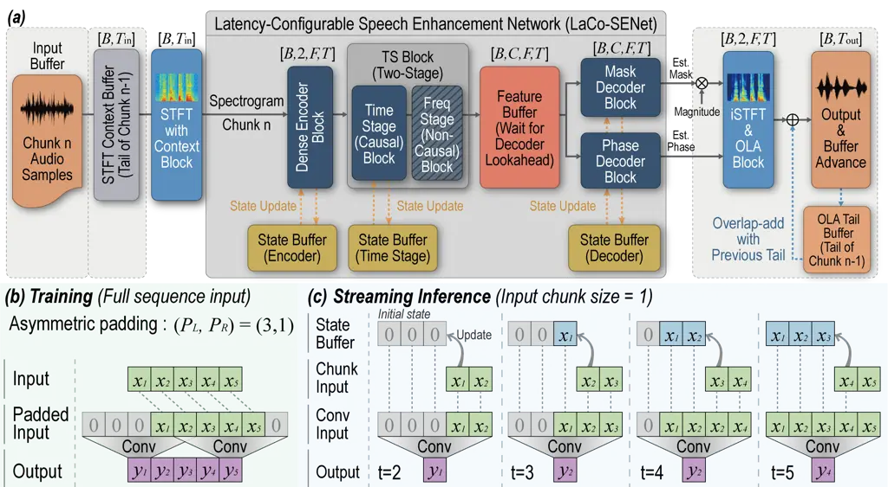
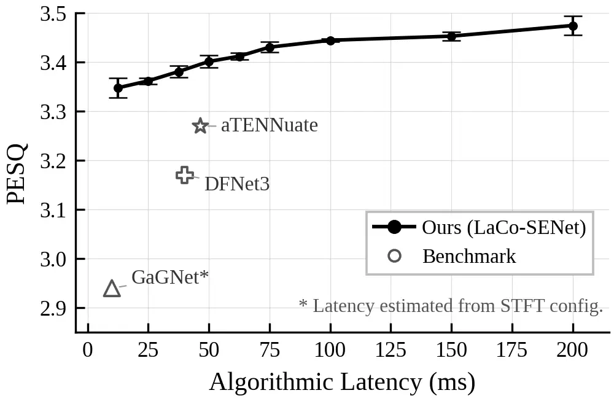
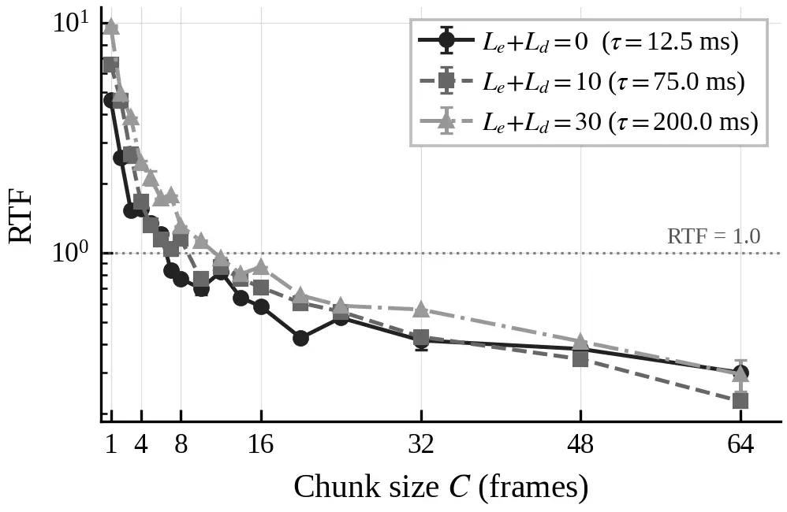

Kim Chung

# Latency-Configurable Streaming Speech Enhancement via Asymmetric Temporal Padding

Yunsik    Yoonyoung

###### Abstract

Streaming speech enhancement requires balancing algorithmic latency
against quality, yet existing approaches largely treat this as a binary
causal versus non-causal choice. LaCo-SENet addresses this issue with
two mechanisms parameterized by a single training-time hyperparameter.
First, asymmetric temporal padding redistributes past and future context
in convolutions, enabling systematic latency configuration. Second,
dual-buffer streaming combines state buffers for past context with
lookahead buffers that supply future context at both the input and
feature levels. Selective state updates also prevent future-frame
leakage into the streaming state, ensuring training–inference
consistency. On VoiceBank+DEMAND, a fixed-budget (1.37M parameters)
backbone yields a family of models spanning 12.5–75.0 ms, with PESQ
rising from 3.35 to 3.43. At just 12.5 ms (fully causal), a PESQ of 3.35
matches or exceeds the prior causal state-of-the-art (3.27 at 46.5 ms).

###### keywords

speech enhancement, streaming, configurable latency, causal convolution,
asymmetric padding

^(†)^(†)address: ¹ Department of Electrical Engineering, Pohang
University of Science and Technology (POSTECH), Pohang 37673, Republic
of Korea  
² Intus Co. Ltd., Pohang 37673, Republic of Korea ^(†)^(†)email:
yskim@postech.ac.kr; ychung@postech.ac.kr

## 1 Introduction

Streaming speech enhancement is essential for real-time applications
such as telephony, conferencing, hearing aids, and on-device voice
interfaces, where algorithmic latency directly governs system
responsiveness \[1, 2\]. Within the 10–80 ms regime where most
applications operate, quality generally improves with additional
lookahead, yet existing streaming models each target a fixed latency
point. No prior work has proposed a unified framework for exploring this
trade-off within a single convolutional architecture. Redistributing
convolution padding asymmetrically between past and future context
provides a practical latency-configuration knob that preserves the
receptive field and parameter count. However, deploying per-layer
asymmetric padding in chunk-based streaming introduces a state
corruption problem. Lookahead frames recorded into convolution state
buffers are replayed in subsequent chunks, progressively distorting
outputs. Our dual-buffer streaming framework resolves this through
selective state updates that restrict state recording to current-chunk
frames.

We present LaCo-SENet (Latency-Configurable SE Network, 1.37M
parameters, built on PrimeK-Net \[3\]). At just 12.5 ms (fully causal),
it achieves PESQ 3.35 on VoiceBank+DEMAND, matching or exceeding the
best reported causal PESQ of 3.27 at 46.5 ms \[4\]. Varying a single
training-time hyperparameter trades latency for quality, reaching PESQ
3.43 at 75.0 ms.



Figure 1: Overview of LaCo-SENet. (a) Dual-buffer streaming
architecture: the STFT context buffer provides encoder lookahead at the
input level; the feature buffer provides decoder lookahead; and state
buffers preserve past context. (b) Training with asymmetric temporal
padding $`(P_{L},P_{R})`$, redistributing past and future context while
preserving the receptive field. (c) Streaming inference with chunk-wise
processing (chunk size = 1): selective state updates prevent lookahead
frames from corrupting convolution states.

Our contributions are threefold: (1) we show that asymmetric temporal
padding serves as a practical, training-time latency-configuration knob
for streaming convolutional SE, enabling systematic exploration of
discrete latency–quality trade-offs without changing the receptive
field, parameter count, or architecture; (2) we propose a dual-buffer
streaming framework with selective state updates that preserves
equivalence between full-sequence and chunk-wise inference by preventing
future-frame leakage into the streaming state; and (3) we show that a
fixed 1.37M-parameter architecture spans 12.5–75.0 ms latency (PESQ
3.35–3.43) by training with different padding ratios, matching or
exceeding prior causal models at lower latency.

## 2 Related Work

Streaming SE architectures. Diverse approaches address streaming speech
enhancement, including DSP-DNN hybrids \[5\], complex-valued
convolutional-recurrent networks \[6\], perceptual deep filtering \[7\],
raw-waveform state-space autoencoders \[4\], Mamba-based models \[8\],
and xLSTM-based designs \[9\]. Each is locked to a single latency point
by its design, and none can systematically trade latency for quality
within a single architecture and parameter budget.

Stateful convolution and lookahead. Maintaining temporal context across
chunk boundaries is fundamental to streaming. FastWaveNet \[10\] and
cached convolution \[11\] cache past activations to replace zero
left-padding, while Denoiser \[12\] applies a similar mechanism in
waveform-domain models. For future context, Emformer \[13\] and Stateful
Conformer \[14\] add right-context to attention-based architectures
through segment-level masking or memory policies. These approaches
address past and future context individually but do not consider their
interaction under per-layer asymmetric padding.

Per-layer asymmetric padding. Among convolutional streaming approaches,
existing methods constrain where future context may enter.
DeepFilterNet \[7\] supplies lookahead through a global input shift
while keeping every convolution purely causal; cached convolution \[11\]
converts symmetric padding into an equivalent fixed output delay. Both
constraints deliberately preclude per-layer asymmetric padding, avoiding
state corruption at the cost of latency flexibility. Their lookahead is
therefore either fixed at the input boundary or set entirely by the
symmetric kernel size. Our approach distributes padding asymmetrically
within each layer, enabling discrete latency configuration while
resolving the resulting state corruption through selective updates.

## 3 Proposed Method

### 3.1 Asymmetric temporal padding

We fix the total temporal padding while distributing it asymmetrically
between past and future. Let $`P`$ denote the per-side padding of a
standard symmetric convolution, so that the total padding is
$`P_{\text{tot}}=2P`$. Defining padding*ratio as
$`\mathbf{r}=(r*{L},r*{R})`$ with $`r*{L}+r\_{R}=1`$, the temporal
padding is distributed as:

```math
P_{L}=\mathrm{round}(P_{\text{tot}}\cdot r_{L}),\quad P_{R}=P_{\text{tot}}-P_{L}. \tag{1}
```

For a given operating point, $`\mathbf{r}`$ is a fixed training-time
hyperparameter shared by all asymmetric convolution layers; it is not
adapted to SNR, input content, or runtime conditions.

Frequency-axis padding remains symmetric, and only the time axis
receives the asymmetric split $`(P_{L},P_{R})`$. Since
$`P_{\text{tot}}`$ is fixed, the receptive field size is preserved. Only
the ratio of past-to-future access changes, enabling quantized latency
configuration. Although the padding redistribution is algebraically
straightforward, deploying it in a stateful streaming pipeline is
non-trivial. Every layer with $`P_{R}{>}0`$ introduces future frames
into the convolution window, and naively caching all frames corrupts
subsequent chunks (Section 3.2).

|                                                                |      |               |                |                |                 |                |                |                |
| -------------------------------------------------------------- | ---- | ------------- | -------------- | -------------- | --------------- | -------------- | -------------- | -------------- |
| Model                                                          | Year | $`\tau`$ (ms) | Params         | PESQ           | STOI            | CSIG           | CBAK           | COVL           |
| Noisy                                                          | —    | —             | —              | 1.97           | .921            | 3.35           | 2.44           | 2.63           |
| RNNoise \[5\]                                                  | 2018 | 10            | 0.06M          | 2.33           | .922            | 3.40           | 2.51           | 2.84           |
| GaGNet \[15\]                                                  | 2022 | $`{\sim}`$10  | 5.94M          | 2.94           | —               | 4.26           | 3.45           | 3.59           |
| DFNet3 \[7\]                                                   | 2023 | 40            | 2.13M          | 3.17           | .944            | 4.34           | 3.61           | 3.77           |
| aTENNuate \[4\]                                                | 2025 | 46.5          | 0.84M          | 3.27           | —               | 4.57           | 2.85           | 3.96           |
| xLSTM-SENet^(†) \[9\]                                          | 2025 | —             | $`{\sim}`$2.2M | 3.26           | .950            | 4.57           | 3.79           | 4.00           |
| SEMamba^(†) \[8\]                                              | 2024 | —             | 1.41M          | 3.29           | .950            | —              | —              | —              |
| LaCo-SENet ($`L_{\text{enc}}{=}0,\,L_{\text{dec}}{=}0`$)       | 2026 | 12.5          | 1.37M          | 3.35$`\pm`$.02 | .952$`\pm`$.000 | 4.61$`\pm`$.01 | 3.71$`\pm`$.01 | 4.05$`\pm`$.02 |
| LaCo-SENet ($`L_{\text{enc}}{=}1,\,L_{\text{dec}}{=}1`$)       |      | 25.0          |                | 3.36$`\pm`$.01 | .953$`\pm`$.000 | 4.62$`\pm`$.01 | 3.72$`\pm`$.02 | 4.07$`\pm`$.01 |
| LaCo-SENet ($`L_{\text{enc}}{=}3,\,L_{\text{dec}}{=}3`$)       |      | 50.0          |                | 3.40$`\pm`$.02 | .953$`\pm`$.001 | 4.63$`\pm`$.02 | 3.72$`\pm`$.01 | 4.09$`\pm`$.02 |
| LaCo-SENet ($`L_{\text{enc}}{=}5,\,L_{\text{dec}}{=}5`$)       |      | 75.0          |                | 3.43$`\pm`$.01 | .954$`\pm`$.001 | 4.66$`\pm`$.02 | 3.78$`\pm`$.00 | 4.12$`\pm`$.02 |
| LaCo-SENet^(‡) ($`L_{\text{enc}}{=}15,\,L_{\text{dec}}{=}15`$) |      | 200.0         |                | 3.47$`\pm`$.02 | .957$`\pm`$.001 | 4.69$`\pm`$.01 | 3.79$`\pm`$.03 | 4.17$`\pm`$.02 |
| PrimeK-Net \[3\]                                               | 2025 | —             | 1.41M          | 3.61           | —               | 4.81           | 3.98           | 4.35           |

^(†) Labeled unidirectional, but encoder convolutions use non-causal
symmetric padding; algorithmic latency not deterministically
computable.  
^(‡) Symmetric padding ($`r_{R}{=}0.5`$); architecture upper bound,
excluded from best-causal ranking.

Table 1: Comparison on VoiceBank+DEMAND. Best causal result per metric
in bold; models marked $`\dagger`$ or $`\ddagger`$ excluded from bold
ranking. —: not reported or unverifiable.

### 3.2 Dual-buffer streaming framework

In the streaming setting, the input spectrogram is processed in chunks
of $`C`$ time frames. Let $`k`$ denote the chunk index and $`\ell`$ a
convolution layer with asymmetric temporal padding
$`(P_{L}^{(\ell)},P_{R}^{(\ell)})`$. The total right-side padding
accumulated across the encoder and decoder determines the algorithmic
latency:

```math
\displaystyle L_{\text{enc}} \displaystyle=\sum_{\ell\in\mathcal{E}}P_{R}^{(\ell)}, \tag{2}
```

```math
\displaystyle L_{\text{dec}} \displaystyle=\max_{b\in\mathcal{B}}\sum_{\ell\in\mathcal{D}_{b}}P_{R}^{(\ell)},\quad\mathcal{B}=\{\mathrm{mask},\mathrm{phase}\},
```

```math
\tau_{\mathrm{ms}}=1000\cdot\frac{(L_{\text{enc}}+L_{\text{dec}})\cdot h+W/2}{f_{s}}, \tag{3}
```

where $`\mathcal{E}`$ denotes the asymmetric convolution layers in the
encoder, $`\mathcal{D}_{b}`$ those in decoder branch $`b`$, $`h`$ is the
hop size, $`W`$ the STFT window size, and $`f_{s}`$ the sample rate. The
term $`W/2`$ accounts for the STFT center delay. Since the mask and
phase decoders run in parallel, decoder lookahead is maximized across
branches rather than summed across them. Deploying asymmetric padding in
chunk-based streaming raises three challenges, which we address below.

Challenge 1: State buffer for past context. At chunk boundaries,
convolution left-padding is filled with zeros rather than actual past
activations, which diverges from full-sequence processing \[11, 10\]. To
resolve this, each layer $`\ell`$ with left padding $`P_{L}^{(\ell)}`$
caches the last $`P_{L}^{(\ell)}`$ frames of the current input as state
$`\mathbf{s}^{(\ell)}_{k}`$. At chunk $`k`$, zero left-padding is
replaced by this cache:

```math
\displaystyle\tilde{\mathbf{x}}^{(\ell)}_{k} \displaystyle=\big[\,\mathbf{s}^{(\ell)}_{k-1};\ \mathbf{x}^{(\ell)}_{k};\ \mathbf{0}\,\big], \tag{4}
```

```math
\displaystyle\mathbf{s}^{(\ell)}_{k} \displaystyle\leftarrow\text{last }P_{L}^{(\ell)}\text{ frames of }\mathbf{x}^{(\ell)}_{k}.
```

Challenge 2: Lookahead buffer for future context. When $`P_{R}{>}0`$,
convolutions reference frames beyond the chunk boundary. In streaming,
these are unavailable unless explicitly buffered \[13\]. LaCo-SENet
delays its output and buffers additional input at two levels.

Input lookahead (encoder). When $`L_{\text{enc}}>0`$, the encoder input
is extended to $`C+L_{\text{enc}}`$ frames, so that every encoder-side
convolution accesses actual future frames instead of zeros.

Feature buffer (decoder). When $`L_{\text{dec}}>0`$, encoder output
features are accumulated in a buffer, and the decoder is invoked only
once the buffer satisfies
$`\text{buffered\_frames}\geq C+L_{\text{dec}}`$. Upon invocation, the
decoder receives an extended feature sequence. Only the portion
corresponding to the current chunk is emitted, while the remaining
frames serve as future context. Since at least $`L_{\text{dec}}`$
lookahead frames lie between the emitted region and the zero
right-padding boundary, all emitted outputs are computed with actual
future context rather than zeros.

Challenge 3: Selective state update. When both state and lookahead
buffers are active, a subtler problem emerges. If the state buffer
records all frames, including the appended lookahead, those frames
appear twice in subsequent chunks (once from the state and once as newly
arrived input), progressively distorting outputs. LaCo-SENet restricts
the state-update scope via a selection operator
$`\Pi_{C}(\mathbf{x})=\mathbf{x}_{1:C}`$ that keeps only current-chunk
frames. Even when processing an extended input
$`\mathbf{x}_{k,\text{ext}}`$ that contains $`C`$ current frames plus
lookahead, the state update depends only on the current-chunk frames:

```math
\mathbf{s}^{(\ell)}_{k}\leftarrow\text{last }P_{L}^{(\ell)}\text{ frames of }\Pi_{C}(\mathbf{x}^{(\ell)}_{k,\text{ext}}). \tag{5}
```

Consequently, lookahead frames participate in the forward computation
but are never recorded into the state.

### 3.3 Backbone architecture

Let $`x[t]\in\mathbb{R}`$ denote a single-channel noisy waveform. We
compute the STFT $`X_{f,n}\in\mathbb{C}`$, apply power-law magnitude
compression ($`c{=}0.3`$), and represent the input as
$`\mathbf{X}\in\mathbb{R}^{2\times T\times F}`$ (compressed magnitude
and phase).

Our backbone $`g_{\theta}`$ follows PrimeK-Net \[3\] with
streaming-specific modifications. We decompose it into an encoder
$`E_{\theta}`$, a sequence of time–frequency blocks
$`\mathcal{T}_{\theta}`$, and two parallel decoders $`D^{M}_{\theta}`$
(mask) and $`D^{\Phi}_{\theta}`$ (phase):

```math
\mathbf{H}=\mathcal{T}_{\theta}(E_{\theta}(\mathbf{X})),\quad\hat{\mathbf{M}}=D^{M}_{\theta}(\mathbf{H}),\quad\hat{\mathbf{\Phi}}=D^{\Phi}_{\theta}(\mathbf{H}). \tag{6}
```

The backbone predicts a magnitude mask
$`\hat{\mathbf{M}}\in\mathbb{R}^{T\times F}`$ and an enhanced phase
$`\hat{\mathbf{\Phi}}\in\mathbb{R}^{T\times F}`$, from which the
enhanced spectrogram is reconstructed via masking and phase replacement.
The input is projected to $`C_{h}`$ channels, processed by the encoder’s
Dense Dilated Depthwise Block (DSDDB), and downsampled along frequency
(stride $`(1,2)`$), yielding
$`\mathbf{H}\in\mathbb{R}^{C_{h}\times T\times F^{\prime}}`$
($`F^{\prime}{=}\lceil F/2\rceil`$). Each decoder applies a DSDDB
followed by transposed convolution to restore frequency resolution.

#### 3.3.1 Dense Dilated Depthwise Block (DSDDB)

DSDDB stacks four depthwise separable convolutions with exponentially
increasing dilation rates $`(1,2,4,8)`$ and dense connections. Each
subsequent layer takes the concatenation of all preceding layer outputs
as input. The depthwise convolution uses AsymmetricConv2d (Section 3.1)
so that the temporal padding ratio $`\mathbf{r}`$ consistently controls
the allocation of past and future context across the network.

#### 3.3.2 Time–Frequency Sequence Block (TS Block)

Each TS Block processes time and frequency axes sequentially. For batch
size $`N`$, the time branch reshapes the feature map from
$`\mathbb{R}^{N\times C_{h}\times T\times F^{\prime}}`$ to
$`\mathbb{R}^{(NF^{\prime})\times C_{h}\times T}`$ and applies a stack
of Channel Attention Blocks (CAB) and Group Prime Kernel FFN (GPKFFN)
modules, all employing causal convolutions. The frequency branch
reshapes it to $`\mathbb{R}^{(NT)\times C_{h}\times F^{\prime}}`$ and
applies the same block types non-causally, since the frequency axis
carries no temporal ordering.

#### 3.3.3 Streaming-specific modifications

The following changes are required to make the backbone compatible with
chunk-based streaming:

1.  1.  Normalization: InstanceNorm $`\to`$ BatchNorm. InstanceNorm
        statistics depend on the full sequence length, making them
        inconsistent across chunk sizes. BatchNorm uses fixed running
        statistics and is chunk-size invariant.
2.  2.  Channel attention (SCA): AdaptiveAvgPool1d (global) $`\to`$
        CausalConv1d (depthwise,
        $`K_{\text{sca}}{=}\texttt{sca\_kernel\_size}`$). Global pooling
        aggregates future frames, violating causality. A causal depthwise
        convolution restricts the context to past frames only.

#### 3.3.4 Model configuration

The backbone uses dense channels $`C_{h}{=}64`$, DSDDB depth 4, four TS
Blocks (2 time + 2 freq), time kernels $`[3,5,7,11]`$, frequency kernels
$`[3,11,23,31]`$, SCA kernel size 11, and STFT parameters (win/hop/fft)
of 400/100/400 samples (25.0/6.25/25.0 ms at 16 kHz).

## 4 Experiments

### 4.1 Experimental Setup

We evaluated on VoiceBank+DEMAND \[16\] at 16 kHz, comprising 11,572
training and 824 test utterances mixed with 10 noise types at four SNR
levels.

Training. We used AdamW ($`\text{lr}{=}5{\times}10^{-4}`$,
$`(\beta_{1},\beta_{2}){=}(0.8,0.99)`$) with exponential LR decay, batch
size 8, and 400K steps. The training loss follows PrimeK-Net \[3\]:
$`\mathcal{L}=0.9\mathcal{L}_{\mathrm{mag}}+0.3\mathcal{L}_{\mathrm{pha}}+0.1\mathcal{L}_{\mathrm{com}}+0.05\mathcal{L}_{\mathrm{con}}+0.05\mathcal{L}_{\mathrm{gan}}`$,
weighting magnitude, phase, complex, consistency, and MetricGAN \[17\]
metric terms. Each latency configuration was trained independently with
three random seeds. The best checkpoint was selected by validation PESQ,
and we report mean $`\pm`$ s.d. across seeds.

Evaluation. We report PESQ (wideband), STOI, and the composite measures
CSIG, CBAK, COVL \[18\] on full-length test utterances using
full-sequence inference. Streaming equivalence is verified in
Section 4.3.

Latency configurations. Encoder and decoder share a common padding ratio
$`\mathbf{r}{=}(r_{L},r_{R})`$, giving equal lookahead
($`L_{\text{enc}}{=}L_{\text{dec}}`$). Sweeping $`r_{R}`$ from 0 (fully
causal) to 0.5 (symmetric) yields nine configurations spanning
$`\tau{=}12.5`$–$`200.0`$ ms. These comprise six at
$`L_{\text{enc}}{=}L_{\text{dec}}\in\{0,\dots,5\}`$, two intermediate
(100.0, 150.0 ms), and a symmetric reference ($`r_{R}{=}0.5`$) as an
architecture upper bound. Table 1 reports four representative causal
points and the symmetric reference. Figure 2 shows all nine.

Comparison models. Our comparison includes four causal baselines with
verifiable latency spanning 10–46.5 ms: RNNoise \[5\], GaGNet \[15\],
DeepFilterNet3 \[7\], and aTENNuate \[4\], along with the non-causal
PrimeK-Net \[3\] as an upper bound. Latency values are from original
papers or estimated as $`(\text{window}{-}\text{hop})/f_{s}`$.
SEMamba \[8\] and xLSTM-SENet \[9\] report unidirectional variants but
use non-causal symmetric encoder padding, so their algorithmic latency
is indeterminate. They are excluded from latency-based ranking.

### 4.2 Results

At 12.5 ms (fully causal), LaCo-SENet achieves PESQ 3.35, outperforming
all causal baselines including aTENNuate \[4\] (3.27 at 46.5 ms). PESQ
then rises with lookahead (Figure 2), from 3.35 at 12.5 ms to 3.43 at
75.0 ms, with the largest gains in the 25–75 ms range and diminishing
returns beyond. The symmetric reference adds only $`+`$0.04 over a
further 125 ms, reaching 3.47 at 200.0 ms. The streaming configurations
thus retain 93–95% of the non-causal PrimeK-Net \[3\] quality (3.61) at
comparable parameter count (1.37M vs. 1.41M).



Figure 2: PESQ vs. algorithmic latency on VoiceBank+DEMAND. LaCo-SENet
(filled circles, connected) spans 12.5–200.0 ms with a constant 1.37M
parameters. Open markers denote selected comparison models shown in the
plot.

Streaming throughput. We measured end-to-end _steady-state_ streaming
RTF (STFT + model + iSTFT) using ONNX Runtime on a single thread of an
Intel Xeon Silver 4510. Increasing $`C`$ amortizes fixed per-step
overhead (Figure 3). RTF falls from 4.59 at $`C{=}1`$ to 0.30 at
$`C{=}64`$ for $`L_{\text{enc}}{+}L_{\text{dec}}{=}0`$, while the
large-lookahead penalty narrows from 2.10$`\times`$ at $`C{=}1`$ to
$`{\approx}1.0\times`$ by $`C{=}64`$ (RTF $`{\approx}`$0.23–0.30 across
all configurations). Real-time operation (RTF$`{<}1`$) needs
$`C{\geq}7`$–$`12`$. At $`C{=}8`$ the total latency (algorithmic plus
chunk buffering) is 62.5 ms for the causal case, at RTF 0.77.



Figure 3: Steady-state streaming RTF vs. chunk size $`C`$ (frames) for
three total lookahead values
$`L_{\text{enc}}{+}L_{\text{dec}}\in\{0,10,30\}`$.

| $`L_{\text{enc}}{+}L_{\text{dec}}`$ | $`\tau`$ (ms) | w/ SSU         | w/o SSU        | $`\Delta`$PESQ |
| ----------------------------------- | ------------- | -------------- | -------------- | -------------- |
| 0                                   | 12.5          | 3.39$`\pm`$.01 | 3.39$`\pm`$.01 | 0.00           |
| 2                                   | 25.0          | 3.41$`\pm`$.01 | 1.86$`\pm`$.31 | $`-`$1.56      |
| 6                                   | 50.0          | 3.45$`\pm`$.01 | 1.45$`\pm`$.14 | $`-`$2.00      |
| 10                                  | 75.0          | 3.48$`\pm`$.01 | 1.39$`\pm`$.01 | $`-`$2.09      |
| 30                                  | 200.0         | 3.52$`\pm`$.02 | 2.04$`\pm`$.06 | $`-`$1.48      |

Table 2: Ablation on selective state update (SSU). Streaming PESQ at
chunk size $`C{=}1`$ with SSU enabled vs. disabled; tail 30 frames
trimmed to exclude end-of-utterance OLA boundary artifacts. Mean $`\pm`$
std over three seeds.

### 4.3 Ablation Study

Table 2 evaluates SSU by disabling it during streaming inference
($`C{=}1`$), with $`L_{\text{tot}}{=}L_{\text{enc}}{+}L_{\text{dec}}`$.
For all asymmetric configurations ($`L_{\text{tot}}{=}2`$–$`10`$),
disabling SSU drops PESQ below the noisy baseline (1.97), worsening
monotonically with lookahead, from $`-1.56`$ at $`L_{\text{tot}}{=}2`$
to $`-2.09`$ at $`L_{\text{tot}}{=}10`$. The symmetric reference
($`L_{\text{tot}}{=}30`$, $`r_{R}{=}0.5`$) drops less ($`-1.48`$), as
its equal left–right padding halves the state buffer, reducing
corruption. SSU is thus essential whenever asymmetric padding introduces
lookahead. We further verify that chunk-wise streaming outputs are
numerically identical to full-sequence outputs across all
configurations.

## 5 Conclusion

We presented LaCo-SENet, a dual-buffer streaming framework whose
algorithmic latency is configurable via asymmetric temporal padding,
with training–inference equivalence preserved by selective state
updates. On VoiceBank+DEMAND, a fixed 1.37M-parameter architecture spans
12.5–75.0 ms (PESQ 3.35–3.43) across padding ratios, surpassing prior
causal models at lower latency.

## 6 Code Availability

The implementation is available at
[https://github.com/yskim3271/LaCo-SENet](https://github.com/yskim3271/LaCo-SENet).

## 7 Acknowledgments

This work was supported by the National Research Foundation of Korea
(NRF) grant funded by the Ministry of Science and ICT
(RS-2025-00516311); by the Institute of Information & Communications
Technology Planning & Evaluation (IITP) grant funded by the Korean
government (RS-2019-II191906, Artificial Intelligence Graduate School
Program); by the Regional Innovation System & Education project
(Specialized Industry Scale-UP unit), supported by Gyeongsangbuk-do; and
by the High-Performance Computing Support Project funded by the
Government of the Republic of Korea (Ministry of Science and ICT).

## 8 Generative AI Use Disclosure

Generative AI tools were used solely to edit and polish the manuscript
text (e.g., grammar and wording). They were not used to generate
research content—including the method, experiments, analysis, or
results—and are not credited as authors.

## References

- \[1\] C. K. A. Reddy, H. Dubey, V. Gopal, R. Cutler, S. Braun, H.
  Gamper, R. Aichner, and S. Srinivasan (2021) ICASSP 2021 deep noise
  suppression challenge. In Proc. ICASSP, pp. 6623–6627. External Links:
  [Document](https://dx.doi.org/10.1109/ICASSP39728.2021.9415105) Cited
  by: §1.
- \[2\] H. Schröter, T. Rosenkranz, A. N. Escalante-B., and A.
  Maier (2022) Low latency speech enhancement for hearing aids using
  deep filtering. IEEE/ACM Trans. Audio, Speech, Lang. Process. 30,
  pp. 2716–2728. External Links:
  [Document](https://dx.doi.org/10.1109/TASLP.2022.3198548) Cited by:
  §1.
- \[3\] Z. Lin, J. Wang, R. Li, F. Shen, and X. Xuan (2025) PrimeK-Net:
  multi-scale spectral learning via group prime-kernel convolutional
  neural networks for single channel speech enhancement. In Proc.
  ICASSP, pp. 1–5. External Links:
  [Document](https://dx.doi.org/10.1109/ICASSP49660.2025.10890034) Cited
  by: §1, §3.3, Table 1, §4.1, §4.1, §4.2.
- \[4\] Y. R. Pei, R. Shrivastava, and FNU Sidharth (2025) aTENNuate:
  optimized real-time speech enhancement with deep SSMs on raw audio. In
  Proc. Interspeech, Note: arXiv:2409.03377 Cited by: §1, §2, Table 1,
  §4.1, §4.2.
- \[5\] J. Valin (2018) A hybrid DSP/deep learning approach to real-time
  full-band speech enhancement. In Proc. IEEE MMSP, pp. 1–5. External
  Links: [Document](https://dx.doi.org/10.1109/MMSP.2018.8547084) Cited
  by: §2, Table 1, §4.1.
- \[6\] Y. Hu, Y. Liu, S. Lv, M. Xing, S. Zhang, Y. Fu, J. Wu, B. Zhang,
  and L. Xie (2020) DCCRN: deep complex convolution recurrent network
  for phase-aware speech enhancement. In Proc. Interspeech,
  pp. 2462–2466. External Links:
  [Document](https://dx.doi.org/10.21437/Interspeech.2020-2537) Cited
  by: §2.
- \[7\] H. Schröter, A. N. Escalante-B., T. Rosenkranz, and A.
  Maier (2023) DeepFilterNet: perceptually motivated real-time speech
  enhancement. In Proc. Interspeech, pp. 312–316. External Links:
  [Document](https://dx.doi.org/10.21437/Interspeech.2023-1540) Cited
  by: §2, §2, Table 1, §4.1.
- \[8\] R. Chao, W. Cheng, M. La Quatra, S. M. Siniscalchi, C. H.
  Yang, S. Fu, and Y. Tsao (2024) An investigation of incorporating
  Mamba for speech enhancement. In Proc. IEEE SLT, Note:
  arXiv:2405.06573 Cited by: §2, Table 1, §4.1.
- \[9\] N. L. Kühne, J. Østergaard, J. Jensen, and Z. Tan (2025)
  xLSTM-SENet: xLSTM for single-channel speech enhancement. In Proc.
  Interspeech, Note: arXiv:2501.06146 Cited by: §2, Table 1, §4.1.
- \[10\] T. Le Paine, P. Khorrami, S. Chang, Y. Zhang, P.
  Ramachandran, M. A. Hasegawa-Johnson, and T. S. Huang (2016) Fast
  wavenet generation algorithm. arXiv preprint arXiv:1611.09482. Cited
  by: §2, §3.2.
- \[11\] A. Caillon and P. Esling (2022) Streamable neural audio
  synthesis with non-causal convolutions. In Proc. DAFx, Note:
  arXiv:2204.07064 Cited by: §2, §2, §3.2.
- \[12\] A. Défossez, G. Synnaeve, and Y. Adi (2020) Real time speech
  enhancement in the waveform domain. In Proc. Interspeech,
  pp. 3291–3295. External Links:
  [Document](https://dx.doi.org/10.21437/Interspeech.2020-2409) Cited
  by: §2.
- \[13\] Y. Shi, Y. Wang, C. Wu, C. Yeh, J. Chan, F. Zhang, D. Le,
  and M. Seltzer (2021) Emformer: efficient memory transformer based
  acoustic model for low latency streaming speech recognition. In Proc.
  ICASSP, pp. 6783–6787. External Links:
  [Document](https://dx.doi.org/10.1109/ICASSP39728.2021.9414560) Cited
  by: §2, §3.2.
- \[14\] V. Noroozi, S. Majumdar, A. Kumar, J. Balam, and B.
  Ginsburg (2024) Stateful conformer with cache-based inference for
  streaming automatic speech recognition. In Proc. ICASSP, Note:
  arXiv:2312.17279 Cited by: §2.
- \[15\] A. Li, C. Zheng, L. Zhang, and X. Li (2022) Glance and gaze: a
  collaborative learning framework for single-channel speech
  enhancement. Applied Acoustics 187, pp. 108499. External Links:
  [Document](https://dx.doi.org/10.1016/j.apacoust.2021.108499) Cited
  by: Table 1, §4.1.
- \[16\] C. Valentini-Botinhao (2017) Noisy speech database for training
  speech enhancement algorithms and TTS models. Technical report
  University of Edinburgh. External Links:
  [Link](https://datashare.ed.ac.uk/handle/10283/2791) Cited by: §4.1.
- \[17\] S. Fu, C. Liao, Y. Tsao, and S. Lin (2019) MetricGAN:
  generative adversarial networks based black-box metric scores
  optimization for speech enhancement. In Proc. ICML, pp. 2031–2041.
  Cited by: §4.1.
- \[18\] Y. Hu and P. C. Loizou (2008) Evaluation of objective quality
  measures for speech enhancement. IEEE Trans. Audio, Speech, Lang.
  Process. 16 (1), pp. 229–238. External Links:
  [Document](https://dx.doi.org/10.1109/TASL.2007.911054) Cited by:
  §4.1.
