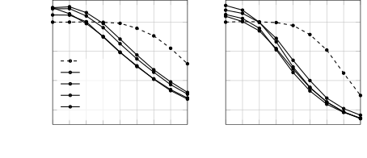
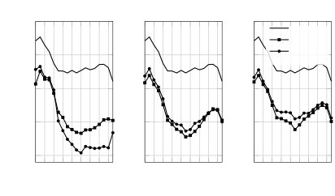
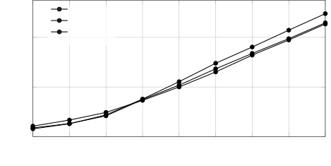

Monir Magron Serizel

# Time–Frequency Weighted Losses for Phoneme Reconstruction in DNN-Based Speech Enhancement

Nasser-Eddine    Paul    Romain

###### Abstract

Conventional training losses for speech enhancement based on the
signal-to-distortion ratio (SDR) treat all time–frequency (TF) regions
uniformly, overlooking the fine-grained spectral cues that are relevant
to specific phoneme intelligibility. We propose a TF weighting framework
that modulates the SDR objective based on local speech presence,
speech-to-interference ratio (SIR), and spectral flux. By integrating
these factors into a differentiable objective, the framework emphasizes
TF bins with high speech–noise competition while also accounting for
transient cues such as consonant bursts. Experimental results show that
our approach improves objective frequency-weighted enhancement metrics,
as well as phoneme recognition accuracy, particularly for consonants.
Spectral analysis shows better reconstruction of mid-frequency
structures at less adverse SIR.

###### keywords

multichannel speech enhancement, phoneme-level reconstruction,
time-frequency weighted training loss

^(†)^(†)address: Université de Lorraine, CNRS, Inria, LORIA, F-54000
Nancy, France^(†)^(†)email: {nasser-eddine.monir, paul.magron}@inria.fr,
romain.serizel@loria.fr

## 1 Introduction

Deep learning–based multichannel speech enhancement (MCSE) has evolved
toward end-to-end neural-spatial frameworks that jointly model spectral
and inter-channel dependencies \[1, 2, 3\]. State-of-the-art models
leverage temporal convolutional networks and self-attention to optimize
spatial filtering. MCSE algorithms are commonly trained using
signal-to-distortion ratio (SDR)-based objectives \[1\]. While
$`\mathrm{SDR}`$-based losses are effective for improving overall signal
reconstruction and interference reduction, they implicitly treat all
time or time–frequency (TF) regions uniformly. By assigning equal
importance to all TF regions, SDR-based losses overlook the uneven
perceptual contribution of different speech components, especially in
noisy conditions.

From a phonetic standpoint, intelligibility depends critically on
specific acoustic cues that are localized in both time and
frequency \[4, 5\]. Consonantal transitions, plosive bursts, fricative
noise bands, and formant trajectories carry disproportionate linguistic
information compared to steady-state vowel regions \[6, 7\]. Moreover,
masking effects are the strongest when speech and noise magnitudes are
comparable, leading to degraded transmission of these cues \[8, 9\]. In
hearing-assistive scenarios with competing sound sources or background
noise, preserving transient and mid-frequency speech structures is
particularly important \[10, 11, 12\]. Consequently, training objectives
that emphasize regions of strong speech–noise interaction may better
reflect perceptual priorities than globally uniform losses \[13, 14,
15\]. This intuition is also related to glimpsing theories of speech
perception, which emphasize the importance of local spectro-temporal
regions that remain informative in the presence of masking noise \[16\].

Monir et al. \[15\] previously introduced frequency-weighted SDR
formulations to improve phoneme-level behavior. These approaches
incorporated perceptual band-importance functions and local
signal-to-interference (SIR) modulation, yet did not explicitly combine
speech presence, speech–noise competition, and transient dynamics within
a unified weighting framework.

In this work, we investigate a structured TF-weighting framework
grounded in speech–noise competition. We first model the speech-noise
competition explicitly through SIR and speech-presence gating. We then
extend this formulation to transient phonetic cues via spectral flux.
Finally, we examine a data-driven alternative where spectral weights are
fully learned. This progression allows us to analyze the respective
roles of perceptual inductive bias and learned weighting in
phoneme-level enhancement.

## 2 Methodology

### 2.1 TF-weighted SDR

Conventional $`\mathrm{SDR}`$-based objectives treat all TF bins
uniformly, although their perceptual relevance strongly depends on local
speech–noise interaction \[8, 13\]. In particular, intelligibility is
mainly affected in regions where speech and noise have comparable
magnitudes, leading to strong competition and masking \[8\]. In
contrast, bins dominated by clean speech or containing negligible energy
contribute less to perceptual errors \[13\]. Therefore, we introduce a
TF-weighted $`\mathrm{SDR}`$ framework that explicitly models local
speech–noise competition.

Let $`S(f,t)`$, $`N(f,t)`$, and $`\widehat{S}(f,t)`$ denote the Mel-band
magnitudes of the clean speech, noise, and estimated speech signals in
the TF domain, respectively. In practice we compute their short-time
Fourier transform and group frequencies using a Mel scale. Let
$`S_{\mathrm{proj}}(f,t)`$ denote the orthogonal projection of
$`\widehat{S}(f,t)`$ onto $`S(f,t)`$, and
$`E_{\mathrm{dist}}(f,t)=\widehat{S}(f,t)-S_{\mathrm{proj}}(f,t)`$ the
residual distortion component. We then define the TF-weighted SDR loss
is as follows:

```math
\mathcal{L}_{w}=-10\log_{10}\frac{\sum_{f,t}w(f,t)\,|S_{\mathrm{proj}}(f,t)|^{2}}{\sum_{f,t}w(f,t)\,|E_{\mathrm{dist}}(f,t)|^{2}}, \tag{1}
```

where $`w(f,t)\geq 0`$ controls the contribution of each TF bin. When
$`w(f,t)=1`$, this formulation reduces to an unweighted TF-domain SDR.
Note that it is distinct from a time-domain $`\mathrm{SDR}`$
loss \[17\], which is used here as baseline and denoted
$`\mathcal{L}_{\mathrm{T}}`$. Monir et al. \[15\] proposed several
weighting strategies based on the local SIR defined as
$`\mathrm{SIR}(f,t)=10\log_{10}\frac{|S(f,t)|^{2}}{|N(f,t)|^{2}}`$.
Among these, the best performing weights are
$`w(f,t)=\mathrm{softmax}(-\log(\mathrm{SIR}(f,t)))`$, which yield a
loss denoted $`\mathcal{L}_{\mathrm{logSIR}}`$. While promising, these
approaches do not fully account for the speech–noise competition.

| Loss                                                           | WN               |                  |                  |                            |                            |                            |                   | SSN              |                  |                  |                            |                            |                            |                   |
| -------------------------------------------------------------- | ---------------- | ---------------- | ---------------- | -------------------------- | -------------------------- | -------------------------- | ----------------- | ---------------- | ---------------- | ---------------- | -------------------------- | -------------------------- | -------------------------- | ----------------- |
|                                                                | $`\mathrm{SIR}`$ | $`\mathrm{SAR}`$ | $`\mathrm{SDR}`$ | $`\mathrm{FW\text{-}SIR}`$ | $`\mathrm{FW\text{-}SAR}`$ | $`\mathrm{FW\text{-}SDR}`$ | $`\mathrm{STOI}`$ | $`\mathrm{SIR}`$ | $`\mathrm{SAR}`$ | $`\mathrm{SDR}`$ | $`\mathrm{FW\text{-}SIR}`$ | $`\mathrm{FW\text{-}SAR}`$ | $`\mathrm{FW\text{-}SDR}`$ | $`\mathrm{STOI}`$ |
| Input                                                          | -2.0             | –                | –                | -6.0                       | –                          | –                          | 0.50              | -2.0             | –                | –                | -4.8                       | –                          | –                          | 0.54              |
| $`\mathcal{L}_{\mathrm{T}}`$                                   | 13.3             | 2.4              | 1.7              | 5.1                        | 3.5                        | 4.7                        | 0.63              | 14.3             | 1.2              | 0.7              | 7.5                        | 2.2                        | 4.4                        | 0.63              |
| $`\mathcal{L}_{\mathrm{logSIR}}`$                              | 16.2             | 1.2              | 0.9              | 7.6                        | 3.1                        | 4.8                        | 0.61              | 14.2             | -1.1             | -1.6             | 7.5                        | 2.6                        | 3.9                        | 0.57              |
| $`\mathcal{L}_{\mathrm{learn}}`$                               | 16.1             | 1.9              | 1.6              | 7.5                        | 3.4                        | 5.0                        | 0.64              | 15.0             | 0.3              | -0.1             | 8.2                        | 2.2                        | 4.6                        | 0.59              |
| $`\mathcal{L}_{\mathrm{SIR}\cdot\mathrm{SP}}`$                 | 15.1             | 2.0              | 1.5              | 6.6                        | 3.3                        | 5.2                        | 0.63              | 13.4             | 0.4              | -0.2             | 6.8                        | 1.8                        | 3.6                        | 0.57              |
| $`\mathcal{L}_{\mathrm{SIR}\cdot\mathrm{SP}\cdot\mathrm{SF}}`$ | 17.2             | 1.8              | 1.5              | 8.4                        | 2.8                        | 5.2                        | 0.64              | 15.1             | 0.8              | 0.4              | 8.3                        | 2.3                        | 4.9                        | 0.61              |

Table 1: Utterance-level performance for the white noise (WN) and
speech-shaped noise (SSN) test sets averaged across input
$`\mathrm{SIR}`$ levels between $`\mathrm{-8}`$ dB and
$`\mathrm{8}`$ dB. Note that input (FW)-SDR and (FW)-SAR are not
reported as they are infinite.

### 2.2 Proposed weighting schemes

Intuitively, one desires high weight values when both $`|S(f,t)|`$ and
$`|N(f,t)|`$ are large, as these bins correspond to strong speech–noise
competition. Conversely, bins with dominant speech (high local
$`\mathrm{SIR}`$) or very low speech energy should receive smaller
weights in order to avoid over-optimizing perceptually less critical
regions. We propose the following schemes that comply with these
requirements. The first two schemes are grounded in explicit modeling of
speech–noise competition, while the third examines whether a purely
learned spectral profile can achieve similar benefits.

SIR–speech presence weighting First, let us define the two following
gating functions:

```math
\displaystyle g_{\mathrm{SIR}}(f,t) \displaystyle=\sigma(-\mathrm{SIR}(f,t)+\tau_{1}), \tag{2}
```

```math
\displaystyle g_{\mathrm{SP}}(f,t) \displaystyle=\sigma(|S(f,t)|^{\gamma}+\tau_{2}), \tag{3}
```

where $`\sigma(\cdot)`$ denotes the sigmoid function, and $`\tau_{1}`$
and $`\tau_{2}`$ are learned thresholds. We propose the following
weights:

```math
w(f,t)=g_{\mathrm{SIR}}(f,t)\cdot g_{\mathrm{SP}}(f,t) \tag{4}
```

which emphasizes TF bins where speech remains active despite low
$`\mathrm{SIR}`$. The corresponding loss is denoted
$`\mathcal{L}_{\mathrm{SIR}\cdot\mathrm{SP}}`$.

SIR–speech presence–spectral flux weighting When $`|S|`$ is weak but
perceptually relevant, as in several transient phonemes (e.g.,
plosives), a purely magnitude-based weighting may underestimate their
importance. To capture such rapidly varying cues, we consider the
frame-wise spectral flux

```math
\mathrm{SF}(t)=\frac{\sum_{f}\max(|S(f,t)|-|S(f,t-1)|,0)}{\sum_{f}|S(f,t-1)|+\epsilon}, \tag{5}
```

which measures the relative increase of spectral energy between
consecutive frames. We incorporate this quantity into the weighting
scheme as follows:

```math
w(f,t)=g_{\mathrm{SIR}}(f,t)\cdot g_{\mathrm{SP}}(f,t)\cdot\left(1+k\,\sigma(\mathrm{SF}(t))\right), \tag{6}
```

where $`k`$ is a scaling factor adjusting the relative importance of the
spectral flux. This scheme increases sensitivity to transient phonetic
structures while preserving speech–noise competition modeling. The
corresponding loss is denoted
$`\mathcal{L}_{\mathrm{SIR}\cdot\mathrm{SP}\cdot\mathrm{SF}}`$.

Learnable weights Lastly, we consider the following scheme:

```math
w(f)=\mathrm{softmax}(\theta_{f}), \tag{7}
```

where the spectral parameters $`\theta_{f}`$ are learned and
time-independent. We initialize $`\theta_{f}`$ with ANSI 1997
band-importance weights \[18\]. The corresponding loss is denoted
$`\mathcal{L}_{\mathrm{learn}}`$.

## 3 Experimental protocol

### 3.1 Acoustic conditions and dataset

We adopt the data generation and acoustic simulation protocol of Monir
et al. \[15\] for training and validation. Clean speech is drawn from
LibriSpeech \[19\], and noise consists of SSN and ecological noise from
the Disconoise dataset \[20\]. Reverberant mixtures are generated using
room impulse responses (RIRs) simulated with Pyroomacoustics \[21\],
with randomized room geometry and $`\mathrm{RT}_{60}`$, and a 4-channel
binaural hearing-aid microphone configuration. Mixtures are created over
$`\mathrm{SIR}`$ values in $`[-10,10]`$ dB. For evaluation, we consider
two dedicated test sets: one with WN and one with SSN, computed on 10
speakers (5 male, 5 female). These test sets follow a controlled
configuration, with the target speech placed at $`0^{\circ}`$ (front)
and the masker at $`45^{\circ}`$ (right), using measured RIRs from the
Binaurec dataset \[22\] at $`\mathrm{SIR}`$ levels from -8 dB to 8 dB.

### 3.2 Speech enhancement algorithm

As MCSE algorithm we use FaSNet, an end-to-end time-domain two-stage
adaptive beamformer \[1\]. We follow the training process ¹¹ 1 The
source code for this work is publicly available at
[https://github.com/Nasseredd/fw-se-loss](https://github.com/Nasseredd/fw-se-loss)
of Monir et al. \[15\], relying on Asteroid \[23\]. For a binaural
hearing-aid configuration, microphone permutation is disabled to
maintain a fixed front-left reference channel. The factor $`k`$ in
$`\mathcal{L}_{\mathrm{SIR}\cdot\mathrm{SP}\cdot\mathrm{SF}}`$ is tuned
on the validation set to $`0.2`$.

### 3.3 Performance measures

As objective metrics, we report scale-invariant SDR, SIR, and
signal-to-artifact ratios (SAR) computed in the time-domain \[24, 17\]
on the left ear, which is the best one \[25\]. In addition, we report
their intelligibility-oriented frequency-weighted (FW)
counterparts \[13, 14\], with weights proportional to
$`|S(f,t)|^{0.2}`$ \[14, 15\]. We also include short-time objective
intelligibility (STOI) \[26\] to assess intelligibility.

We additionally report the word error rate (WER) and phoneme accuracy
(PA) when performing speech and phoneme recognition after MCSE using
Wav2Vec2-based models \[27, 28\]. PA is defined as the percentage of
correctly predicted phoneme tokens within their annotated temporal
boundaries. These metrics serve as objective proxies for
intelligibility \[29\] and phonetic reconstruction. They do not replace
listening tests but provide a reproducible evaluation across conditions.
Metrics are computed on the left ear \[25\]. For all metrics except for
the WER, higher is better. Statistical significance is assessed via the
Wilcoxon signed-rank test \[30\] performed between each method against
the baseline, at a level of $`\alpha=5\%`$. Significant gains are
highlighted in bold fonts in the tables.

|            | Loss                                                           | WN               |                  |                  |                            |                            |                            |                 | SSN              |                  |                  |                            |                            |                            |                 |
| ---------- | -------------------------------------------------------------- | ---------------- | ---------------- | ---------------- | -------------------------- | -------------------------- | -------------------------- | --------------- | ---------------- | ---------------- | ---------------- | -------------------------- | -------------------------- | -------------------------- | --------------- |
|            |                                                                | $`\mathrm{SIR}`$ | $`\mathrm{SAR}`$ | $`\mathrm{SDR}`$ | $`\mathrm{FW\text{-}SIR}`$ | $`\mathrm{FW\text{-}SAR}`$ | $`\mathrm{FW\text{-}SDR}`$ | $`\mathrm{PA}`$ | $`\mathrm{SIR}`$ | $`\mathrm{SAR}`$ | $`\mathrm{SDR}`$ | $`\mathrm{FW\text{-}SIR}`$ | $`\mathrm{FW\text{-}SAR}`$ | $`\mathrm{FW\text{-}SDR}`$ | $`\mathrm{PA}`$ |
| Consonants | $`\mathcal{L}_{\mathrm{T}}`$                                   | 12.8             | 2.0              | 1.4              | 6.5                        | 3.9                        | 6.3                        | 34.0            | 14.7             | 0.8              | 0.5              | 9.9                        | 2.4                        | 6.4                        | 43.6            |
|            | $`\mathcal{L}_{\mathrm{SIR}\cdot\mathrm{SP}\cdot\mathrm{SF}}`$ | 16.1             | 1.4              | 1.1              | 9.7                        | 3.0                        | 6.7                        | 36.1            | 14.6             | 0.4              | 0.0              | 9.8                        | 2.1                        | 6.1                        | 45.5            |
| Vowels     | $`\mathcal{L}_{\mathrm{T}}`$                                   | 14.4             | 3.2              | 2.7              | 11.4                       | 4.6                        | 8.4                        | 43.7            | 13.8             | 1.9              | 1.3              | 12.5                       | 3.0                        | 7.6                        | 46.4            |
|            | $`\mathcal{L}_{\mathrm{SIR}\cdot\mathrm{SP}\cdot\mathrm{SF}}`$ | 17.8             | 2.7              | 2.5              | 14.8                       | 3.9                        | 7.7                        | 45.5            | 15.1             | 1.2              | 0.8              | 13.8                       | 3.3                        | 8.4                        | 47.9            |

Table 2: Performance for phoneme categories (consonants and vowels) for
the WN and SSN test sets averaged across input $`\mathrm{SIR}`$ levels.



Figure 1: $`\mathrm{WER}`$ (%) as a function of the input
$`\mathrm{SIR}`$ level for WN (left) and SSN (right) test sets.

## 4 Results

### 4.1 Results at the utterance level

Table 1 displays utterance-level performance in terms of classical,
frequency-weighted, and intelligibility metrics. First, we observe that
under $`\mathrm{WN}`$, all losses yield an improved $`\mathrm{SIR}`$ and
$`\mathrm{FW\text{-}SIR}`$, with
the $`\mathcal{L}_{\mathrm{SIR\cdot SP\cdot SF}}`$ achieving the
strongest overall improvement. Introducing the $`\mathrm{SIR}`$-based
weighting or learning frequency weights does not lead to a substantial
degradation in $`\mathrm{SAR}`$, $`\mathrm{FW\text{-}SAR}`$,
$`\mathrm{SDR}`$, $`\mathrm{FW\text{-}SDR}`$, or $`\mathrm{STOI}`$, as
results remain overall comparable across losses, with only slight
variations relative to the baseline.

Under $`\mathrm{SSN}`$, both $`\mathcal{L}_{\mathrm{learn}}`$ and
$`\mathcal{L}_{\mathrm{SIR\cdot SP\cdot SF}}`$ slightly improve
interference reduction compared to the baseline. In contrast,
$`\mathcal{L}_{\mathrm{logSIR}}`$ and
$`\mathcal{L}_{\mathrm{SIR\cdot SP}}`$ do not consistently reduce
interference. On the other hand, $`\mathrm{SAR}`$ and $`\mathrm{SDR}`$
slightly decrease for the weighted losses, with a more pronounced
reduction for $`\mathcal{L}_{\mathrm{logSIR}}`$ and a smaller one for
$`\mathcal{L}_{\mathrm{SIR\cdot SP\cdot SF}}`$. Frequency-weighted
metrics remain overall comparable to the baseline, with a more
noticeable drop for $`\mathcal{L}_{\mathrm{SIR\cdot SP}}`$, whereas
$`\mathcal{L}_{\mathrm{SIR\cdot SP\cdot SF}}`$ achieves the highest
$`\mathrm{FW\text{-}SAR}`$ and $`\mathrm{FW\text{-}SDR}`$ scores.
Finally, $`\mathrm{STOI}`$ decreases for all weighted losses under
$`\mathrm{SSN}`$, particularly for $`\mathcal{L}_{\mathrm{logSIR}}`$ and
$`\mathcal{L}_{\mathrm{SIR\cdot SP}}`$, while the drop remains more
limited for $`\mathcal{L}_{\mathrm{SIR\cdot SP\cdot SF}}`$.

Overall, these results indicate that weighting strategies combining
interference awareness with additional spectral or temporal
structure—either through learned frequency profiles or the
spectral-flux–augmented scheme—yield more consistent interference
suppression across noise types, whereas relying solely on local
$`\mathrm{SIR}`$-based time–frequency modulation, such as
$`\mathcal{L}_{\mathrm{logSIR}}`$ and
$`\mathcal{L}_{\mathrm{SIR\cdot SP}}`$, exhibits less stable
performance, particularly under spectrally shaped noise.

We now examine speech recognition results in terms of $`\mathrm{WER}`$,
as shown in Fig. 1, focusing on the three proposed weighting schemes.
For $`\mathrm{WN}`$, despite being relatively high, the gap between
input and output $`\mathrm{WER}`$ is consistent with observations
reported when comparing speech recognition-based evaluation with
listening tests \[31\]. All weighted losses yield a lower
$`\mathrm{WER}`$ than the baseline across most $`\mathrm{SIR}`$ levels.
While $`\mathcal{L}_{\mathrm{learn}}`$ yields consistent improvements,
both $`\mathcal{L}_{\mathrm{SIR\cdot SP}}`$ and
$`\mathcal{L}_{\mathrm{SIR\cdot SP\cdot SF}}`$ significantly decrease
the $`\mathrm{WER}`$, particularly at mid-to-high $`\mathrm{SIR}`$
levels. In the $`\mathrm{SSN}`$ condition, trends are less consistent.
The loss $`\mathcal{L}_{\mathrm{learn}}`$ performs worse than the
baseline across all $`\mathrm{SIR}`$ levels. Below 0 dB, the baseline
achieves the lowest $`\mathrm{WER}`$, whereas above 0 dB both
$`\mathrm{SIR}`$-based losses perform similarly to the baseline, with a
slight advantage for $`\mathcal{L}_{\mathrm{SIR\cdot SP\cdot SF}}`$ at
mid-to-high $`\mathrm{SIR}`$ levels. Overall, these results confirm
previous observations: interference-aware weighting improves recognition
performance, particularly under $`\mathrm{WN}`$ conditions. However,
incorporating additional spectral or temporal structure, as in
$`\mathcal{L}_{\mathrm{SIR\cdot SP\cdot SF}}`$, provides the most robust
and consistent behavior.

### 4.2 Performance on consonants and vowels



Figure 2: Comparison of estimated plosive spectra across
$`\mathrm{-8}`$ dB, $`\mathrm{0}`$ dB, and $`\mathrm{8}`$ dB input
$`\mathrm{SIR}`$ under $`\mathrm{WN}`$. The plots illustrate the
spectral reconstruction performance of $`\mathcal{L}_{\mathrm{T}}`$ and
$`\mathcal{L}_{\mathrm{SIR}\cdot\mathrm{SP}\cdot\mathrm{SF}}`$ relative
to the clean reference spectrum.

We now report the various performance metrics computed for phoneme
categories in Table 2. For clarity, we focus on comparing the proposed
$`\mathcal{L}_{\mathrm{SIR\cdot SP\cdot SF}}`$ loss against the
$`\mathcal{L}_{\mathrm{T}}`$ baseline.

For consonants under $`\mathrm{WN}`$,
$`\mathcal{L}_{\mathrm{SIR\cdot SP\cdot SF}}`$ improves interference
suppression, as reflected by higher $`\mathrm{SIR}`$ and
$`\mathrm{FW\text{-}SIR}`$ compared to the baseline, while maintaining
comparable $`\mathrm{FW\text{-}SDR}`$ and improving $`\mathrm{PA}`$.
Although $`\mathrm{SAR}`$ and $`\mathrm{SDR}`$ slightly decrease
relative to the baseline, the drop remains limited, indicating that
improved interference suppression does not induce substantial additional
distortion. Under $`\mathrm{SSN}`$, interference reduction in terms of
$`\mathrm{SIR}`$ and $`\mathrm{FW\text{-}SIR}`$ remains comparable to
the baseline. Slight reductions are observed in artifact-related and
overall distortion metrics, both classical and frequency-weighted.
Nevertheless, $`\mathcal{L}_{\mathrm{SIR\cdot SP\cdot SF}}`$ results in
an improvement in $`\mathrm{PA}`$.

For vowels under $`\mathrm{WN}`$,
$`\mathcal{L}_{\mathrm{SIR\cdot SP\cdot SF}}`$ increases both
$`\mathrm{SIR}`$ and $`\mathrm{FW\text{-}SIR}`$, while showing slight
reductions in artifact- and distortion-related metrics. Despite these
minor decreases, $`\mathrm{PA}`$ improves compared to the baseline,
indicating that the enhanced interference suppression benefits vowel
recognition. Under $`\mathrm{SSN}`$,
$`\mathcal{L}_{\mathrm{SIR\cdot SP\cdot SF}}`$ achieves higher
$`\mathrm{SIR}`$ and frequency-weighted metrics than the baseline,
together with the highest vowel $`\mathrm{PA}`$. Despite moderate
variations in $`\mathrm{SAR}`$ and $`\mathrm{SDR}`$, the overall
performance remains stable.

These phoneme-level results are consistent with the utterance-level
findings: $`\mathcal{L}_{\mathrm{SIR\cdot SP\cdot SF}}`$ tends to
provide more consistent improvements across phoneme classes,
particularly under $`\mathrm{WN}`$ conditions.

### 4.3 Plosive accuracy across $`\mathrm{SIR}`$ levels



Figure 3: Plosive $`\mathrm{PA}`$ under $`\mathrm{WN}`$ across input
$`\mathrm{SIR}`$ levels.

To further analyze phoneme-level performance observed in Table 2, we
examine plosive recognition across $`\mathrm{SIR}`$ levels under
$`\mathrm{WN}`$ (Fig. 3). Plosives are characterized by brief transients
and rapid spectral changes, making them particularly sensitive to
masking and well suited to assess the proposed spectral-flux-based
weighting.

Across increasing $`\mathrm{SIR}`$ levels, all losses exhibit a
monotonic improvement in plosive $`\mathrm{PA}`$. At very low
$`\mathrm{SIR}`$, performance remains similar, with the baseline
slightly higher. However, from mid $`\mathrm{SIR}`$ levels onward,
$`\mathcal{L}_{\mathrm{SIR\cdot SP\cdot SF}}`$ significantly outperforms
the baseline from 0 dB and $`\mathcal{L}_{\mathrm{SIR\cdot SP}}`$ from
2 dB onward, with the performance gap widening at higher
$`\mathrm{SIR}`$ levels.

This trend confirms that incorporating $`\mathrm{SIR}`$-aware and
spectral-flux-based weighting enhances recognition of transient phonemes
such as plosives, particularly in moderate-to-high $`\mathrm{SIR}`$
conditions where interference suppression becomes more effective.

### 4.4 Spectral analysis of plosives

To better understand the spectral behavior underlying the plosive
results, Fig. 2 compares the estimated spectra to the clean reference
across $`\mathrm{-8}`$, $`\mathrm{0}`$, and $`\mathrm{8}`$ dB under
$`\mathrm{WN}`$ in the Mel scale.

At $`\mathrm{-8}`$ dB, both methods remain far from the clean spectrum.
Up to band 6, the two estimates are similar. Beyond band 6,
$`\mathcal{L}_{\mathrm{T}}`$ remains closer to the clean reference,
while $`\mathcal{L}_{\mathrm{SIR\cdot SP\cdot SF}}`$ shows larger
deviation in the mid-to-high bands. At $`\mathrm{0}`$ dB,
$`\mathcal{L}_{\mathrm{SIR\cdot SP\cdot SF}}`$ becomes slightly closer
to the clean spectrum than the baseline, particularly across bands 8–13,
where it better tracks the clean spectral shape. At $`\mathrm{8}`$ dB,
the same tendency is observed with a larger margin, especially over
bands 6–12, where $`\mathcal{L}_{\mathrm{SIR\cdot SP\cdot SF}}`$ more
closely follows the clean spectrum.

Overall, the benefit of $`\mathcal{L}_{\mathrm{SIR\cdot SP\cdot SF}}`$
in reconstructing the mid-frequency structure of plosives is mainly
observed at moderate and high input $`\mathrm{SIR}`$ levels. At very low
$`\mathrm{SIR}`$, the baseline remains closer to the clean spectrum in
several mid-to-high frequency bands. These less adverse listening
conditions are particularly relevant for hearing-aid applications.

## 5 Conclusion

We proposed a TF weighting framework for $`\mathrm{SDR}`$-based speech
enhancement that explicitly models speech presence, local
$`\mathrm{SIR}`$, and transient dynamics. The proposed formulations
reshape the contribution of TF bins according to speech–noise
competition, while preserving the stability of $`\mathrm{SDR}`$
optimization. Experimental results show that incorporating
$`\mathrm{SIR}`$-aware and spectral-flux-based modulation improves
interference suppression and phoneme-level reconstruction. Future work
will explore additional perceptually-based phenomena, such as
frequency-dependent speech reception thresholds, band-specific masking,
or intelligibility-weighted filters. Such directions may better align
training with phoneme-level perception and hearing-assistive objectives.

## 6 Acknowledgments

This research was supported by the French National Research Agency as
part of the REFINED project, “REal-time artiFicial INtelligence for
hEaring aiDs” (ANR-21-CE19-0043). Experiments presented in this paper
were carried out using the [Grid’5000](https://www.grid5000.fr) testbed,
supported by a scientific interest group hosted by Inria and including
CNRS, RENATER and several Universities as well as other organizations.

## 7 Generative AI Use Disclosure

We acknowledge the ISCA policy regarding the use of generative AI tools.
The authors declare that generative AI tools have been used solely to
correct grammar. No such tools were used to write significant parts of
this manuscript.

## References

- \[1\] Y. Luo, Z. Chen, N. Mesgarani, and T. Yoshioka (2020) End-to-end
  microphone permutation and number invariant multi-channel speech
  separation. In Proc. IEEE International Conference on Acoustics,
  Speech and Signal Processing (ICASSP), Cited by: §1, §3.2.
- \[2\] D. Lee, S. Kim, and J. Choi (2021) Inter-channel Conv-TasNet for
  multichannel speech enhancement. In Proc. IEEE Statistical Signal
  Processing Workshop (SSP), Cited by: §1.
- \[3\] C. Quan and X. Li (2024) SpatialNet: multichannel long-term
  streaming neural speech enhancement for static and moving speakers.
  IEEE Signal Processing Letters 31, pp. 136–140. Cited by: §1.
- \[4\] G. A. Miller and P. E. Nicely (1955) An analysis of perceptual
  confusions among some english consonants. Journal of the Acoustical
  Society of America 27 (2), pp. 338–352. Cited by: §1.
- \[5\] K. N. Stevens (1998) Acoustic phonetics. MIT Press. Cited by:
  §1.
- \[6\] D. H. Klatt (1976) Linguistic uses of segmental duration in
  english: acoustic and perceptual evidence. Journal of the Acoustical
  Society of America 59 (5), pp. 1208–1221. Cited by: §1.
- \[7\] G. Fant (1960) Acoustic theory of speech production. Mouton.
  Cited by: §1.
- \[8\] S. A. Gelfand and S. Silman (1985) Effects of signal-to-noise
  ratio on speech recognition in noise for normal-hearing and
  hearing-impaired subjects. Journal of Speech and Hearing Research 28
  (3), pp. 407–415. Cited by: §1, §2.1.
- \[9\] S. A. Phatak and J. B. Allen (2008) Consonant and vowel
  confusions in speech-weighted noise. Journal of the Acoustical Society
  of America 124 (2), pp. 1220–1233. External Links:
  [Document](https://dx.doi.org/10.1121/1.2945165) Cited by: §1.
- \[10\] A. F. Bronkhorst (2000) The cocktail party phenomenon: a review
  of research on speech intelligibility in multiple-talker conditions.
  Acta Acustica united with Acustica 86 (1), pp. 117–128. Cited by: §1.
- \[11\] J. M. Kates and K. H. Arehart (2014) The hearing-aid speech
  perception index (HASPI). Speech Communication 65, pp. 75–93. External
  Links: [Document](https://dx.doi.org/10.1016/j.specom.2014.08.003)
  Cited by: §1.
- \[12\] T. Van den Bogaert, S. Doclo, J. Wouters, and M. Moonen (2009)
  Speech enhancement with multichannel Wiener filter techniques in
  multimicrophone binaural hearing aids. Journal of the Acoustical
  Society of America 125 (1), pp. 360–371. Cited by: §1.
- \[13\] J. E. Greenberg, P. M. Peterson, and P. M. Zurek (1993)
  Intelligibility-weighted measures of speech-to-interference ratio and
  speech system performance. Journal of the Acoustical Society of
  America 94 (5), pp. 3009–3010. External Links:
  [Document](https://dx.doi.org/10.1121/1.407334) Cited by: §1, §2.1,
  §3.3.
- \[14\] J. Ma, Y. Hu, and P. C. Loizou (2009) Objective measures for
  predicting speech intelligibility in noisy conditions based on new
  band-importance functions. Journal of the Acoustical Society of
  America 125 (5), pp. 3387–3405. External Links:
  [Document](https://dx.doi.org/10.1121/1.3097493) Cited by: §1, §3.3.
- \[15\] N. Monir, P. Magron, and R. Serizel (2025) Frequency-weighted
  training losses for phoneme-level DNN-based speech enhancement. In
  Proc. IEEE International Workshop on Multimedia Signal Processing
  (MMSP), Cited by: §1, §1, §2.1, §3.1, §3.2, §3.3.
- \[16\] M. Cooke (2006) A glimpsing model of speech perception in
  noise. Journal of the Acoustical Society of America 119 (3),
  pp. 1562–1573. External Links:
  [Document](https://dx.doi.org/10.1121/1.2166600) Cited by: §1.
- \[17\] J. L. Roux, S. Wisdom, H. Erdogan, and J. R. Hershey (2019) SDR
  — half-baked or well done?. In Proc. IEEE International Conference on
  Acoustics, Speech and Signal Processing (ICASSP), External Links:
  [Document](https://dx.doi.org/10.1109/ICASSP.2019.8683855) Cited by:
  §2.1, §3.3.
- \[18\] C. Pavlovic (2018) SII—Speech Intelligibility Index Standard:
  ANSI S3.5-1997. Journal of the Acoustical Society of America 143 (3),
  pp. 1906–1906. External Links:
  [Document](https://dx.doi.org/10.1121/1.5036508) Cited by: §2.2.
- \[19\] V. Panayotov, G. Chen, D. Povey, and S. Khudanpur (2015)
  Librispeech: an ASR corpus based on public domain audio books. In
  Proc. IEEE International Conference on Acoustics, Speech and Signal
  Processing (ICASSP), External Links:
  [Document](https://dx.doi.org/10.1109/ICASSP.2015.7178964) Cited by:
  §3.1.
- \[20\] N. Furnon, R. Serizel, S. Essid, and I. Illina (2021) DNN-based
  mask estimation for distributed speech enhancement in spatially
  unconstrained microphone arrays. IEEE/ACM Transactions on Audio,
  Speech, and Language Processing 29 (), pp. 2310–2323. External Links:
  [Document](https://dx.doi.org/10.1109/TASLP.2021.3092838) Cited by:
  §3.1.
- \[21\] R. Scheibler, E. Bezzam, and I. Dokmanic (2018)
  Pyroomacoustics: a Python package for audio room simulation and array
  processing algorithms. In Proc. IEEE International Conference on
  Acoustics, Speech and Signal Processing (ICASSP), Cited by: §3.1.
- \[22\] L. Delebecque and R. Serizel (2023) Binaurec: a dataset to test
  the influence of the use of room impulse responses on binaural speech
  enhancement. In Proc. European Signal Processing Conference (EUSIPCO),
  Nancy, France, pp. 126–130. External Links:
  [Document](https://dx.doi.org/10.23919/EUSIPCO58844.2023.10289772)
  Cited by: §3.1.
- \[23\] M. Pariente, S. Cornell, J. Cosentino, S. Sivasankaran, E.
  Tzinis, J. Heitkaemper, M. Olvera, F. Stöter, M. Hu, J. M.
  Martín-Doñas, D. Ditter, A. Frank, A. Deleforge, and E. Vincent (2020)
  Asteroid: the PyTorch-based audio source separation toolkit for
  researchers. In Proc. Interspeech, Cited by: §3.2.
- \[24\] E. Vincent, R. Gribonval, and C. Févotte (2006) Performance
  measurement in blind audio source separation. IEEE Transactions on
  Audio, Speech, and Language Processing 14 (4), pp. 1462–1469. External
  Links: [Document](https://dx.doi.org/10.1109/TSA.2005.858005) Cited
  by: §3.3.
- \[25\] A. W. Bronkhorst and R. Plomp (1988) The effect of head-induced
  interaural time and level differences on speech intelligibility in
  noise. Journal of the Acoustical Society of America 83 (4),
  pp. 1508–1516. External Links:
  [Document](https://dx.doi.org/10.1121/1.395906) Cited by: §3.3, §3.3.
- \[26\] C. H. Taal, R. C. Hendriks, R. Heusdens, and J. Jensen (2010) A
  short-time objective intelligibility measure for time-frequency
  weighted noisy speech. IEEE Transactions on Audio, Speech, and
  Language Processing 19 (7), pp. 2125–2136. Cited by: §3.3.
- \[27\] A. Baevski, H. Zhou, A. Mohamed, and M. Auli (2020) wav2vec
  2.0: a framework for self-supervised learning of speech
  representations. In Proc. International Conference on Neural
  Information Processing Systems (NeurIPS), Cited by: §3.3.
- \[28\] V. Phy (2022) Automatic phoneme recognition on TIMIT dataset
  with Wav2Vec 2.0. Hugging Face. Note:
  vitouphy/wav2vec2-xls-r-300m-timit-phoneme Cited by: §3.3.
- \[29\] C. Spille, B. Kollmeier, and B. T. Meyer (2018) Human vs.
  automatic speech recognition in acoustic scenes. Computer Speech &
  Language 52, pp. 123–140. Cited by: §3.3.
- \[30\] F. Wilcoxon (1945) Individual comparisons by ranking methods.
  Biometrics Bulletin 1 (6), pp. 80–83. External Links:
  [Document](https://dx.doi.org/10.2307/3001968) Cited by: §3.3.
- \[31\] A. Drelingyte, R. Serizel, and M. Lagrange (2025) Phoneme-level
  speech intelligibility reduction. In Proc. European Signal Processing
  Conference (EUSIPCO), Palermo, Italy. Cited by: §4.1.
