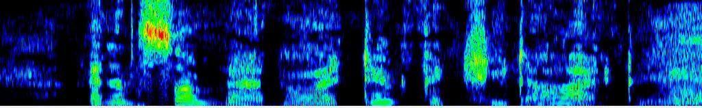
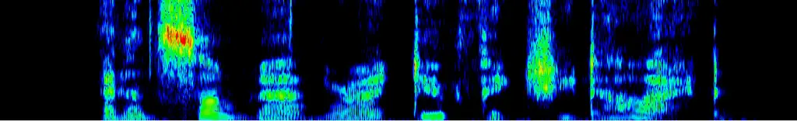
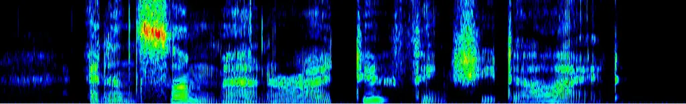

Ojha Espy-Wilson

# Bridging Self-Supervised Learning and Speech Enhancement: A Wav2Vec2-Conditioned Framework

Shuubham    Carol

###### Abstract

Diffusion models show potential for speech enhancement but lack
linguistic guidance. We condition a diffusion-based model on wav2vec 2.0
features from noisy input, injected at the U-Net bottleneck via
Feature-wise Linear Modulation (FiLM). Phonetic representations from
wav2vec 2.0 features of degraded speech, anchor the reverse diffusion
process. While a frozen wav2vec 2.0 encoder extracts features, a learned
FiLM generator produces scale and shift parameters modulating the
bottleneck with minimal overhead. Motivated by the optimal Bayesian
causal estimator under a linear-Gaussian state-space model, FiLM
coefficients are aggregated via exponential smoothing for temporal
compression. Evaluation on VoiceBank-DEMAND and LibriMix shows
competitive performance against the unconditioned baseline in PESQ,
STOI, SI-SDR and DNSMOS. We consistently record an improvement of 0.4 on
PESQ score, suggesting self-supervised representations effectively
condition diffusion-based speech enhancement.

###### keywords

speech enhancement, diffusion models, self-supervised learning,
feature-wise linear modulation.

^(†)^(†)address: ¹ Institute for Systems Research, University of
Maryland, College Park ^(†)^(†)email: sojha1@umd.edu, espy@umd.edu

## 1 Introduction

Speech enhancement (SE) seeks to recover clean speech from signals
degraded by additive noise, reverberation, and other distortions \[1\].
To this end, discriminative methods that learn a direct mapping from
noisy to clean speech, whether through time-frequency masking \[2\],
complex spectral mapping \[3\], or time-domain regression \[4\], have
been the dominant approach. Yet these methods often yield over-smoothed
outputs and can introduce audible artifacts, particularly at low
signal-to-noise ratios (SNRs). Diffusion-based generative models offer a
promising alternative by learning to reverse a gradual noising process,
producing enhanced speech that sounds more natural \[5, 6\].
CDiffuSE \[7\] was among the first to apply denoising diffusion
probabilistic models (DDPMs) to SE. Subsequent works have built on this
idea: SGMSE and SGMSE+ \[8, 9\] operate in the complex STFT domain using
interpolated forward processes, while UNIVERSE \[10\] employs a separate
conditioning network to handle a wide range of distortion types.
Although these generative methods achieve high perceptual quality when
training and test conditions are well matched, they often struggle to
generalize to unseen noise types or acoustic settings \[9\]. A key
design decision in diffusion-based SE is how to supply conditioning
information to steer the reverse process. Common strategies include
input concatenation \[7\] and dedicated conditioning networks \[10,
11\]. On a different note, self-supervised learning (SSL) models such as
wav2vec 2.0 \[12\], HuBERT \[13\], and WavLM \[14\] have been found to
capture rich phonetic and linguistic features that remains informative
even under noisy conditions. Several studies have explored using SSL
representations for SE via auxiliary losses \[15, 16\], as input
features \[17, 18\], or as discrete tokens for language-model-based
enhancement \[19\]. In this work, we propose conditioning a
diffusion-based SE model on wav2vec 2.0 features extracted from the
noisy input, injected at the U-Net bottleneck through Feature-wise
Linear Modulation (FiLM) \[20\]. To produce a temporally compressed
conditioning signal within the memory constraints of diffusion-based
training, we apply exponential averaging to the projected FiLM
coefficients. Our main contributions are:

- •
  a FiLM-based conditioning mechanism that incorporates wav2vec 2.0
  features at the U-Net bottleneck for diffusion-based SE,
- •
  a principled temporal smoothing strategy for the conditioning signal,
  and, evaluation on standard benchmarks with improvements on PESQ, STOI
  and DNSMOS with marginal tradeoffs in SI-SDR.

## 2 Related Work

### 2.1 Conditional Diffusion Models

Diffusion models \[5, 6\] generate data by reversing a gradual noising
process. To steer generation toward a desired output, conditioning can
be introduced via classifier guidance \[21\], classifier-free
guidance \[22\], input concatenation, cross-attention \[23\], or
adaptive normalization \[24, 21\]. Feature-wise Linear Modulation
(FiLM) \[20\] formalizes the last approach, applying a learned affine
transformation $`\gamma\odot\mathbf{h}+\beta`$ to feature maps
$`\mathbf{h}`$, where $`\gamma`$ and $`\beta`$ are predicted from the
conditioning signal. FiLM and its variants (e.g., AdaLN-Zero \[24\])
have been widely adopted in diffusion architectures for vision.

### 2.2 Diffusion-Based Speech Enhancement

StoRM \[25\] adopts a score-based diffusion framework in the complex
STFT domain, using an Ornstein-Uhlenbeck Variance Exploding (OUVE)
process. The forward process interpolates between the clean STFT
$`\mathbf{x}_{0}`$ and the noisy observation $`\mathbf{y}`$ via a
perturbation kernel:

```math
p_{0,t}(\mathbf{x}_{t}\mid\mathbf{x}_{0},\mathbf{y})=\mathcal{N}_{\mathbb{C}}\left(\mathbf{x}_{t};\;e^{-\gamma t}\mathbf{x}_{0}+(1-e^{-\gamma t})\mathbf{y},\;\sigma(t)^{2}\mathbf{I}\right)
```

where $`\gamma`$ controls the decay rate toward $`\mathbf{y}`$ and
$`\sigma(t)^{2}`$ is a monotonically increasing variance schedule. A
score network $`s_{\theta}(\mathbf{x}_{t},\mathbf{y},t)`$ is trained via
denoising score matching and a reverse-time stochastic differential
equation (SDE), utilizing this trained score function is solved at
inference to produce the enhanced waveform. We build directly on this
framework.

### 2.3 Self-Supervised Representations for Speech Enhancement

Self-supervised models such as wav2vec 2.0 \[12\], HuBERT \[13\], and
WavLM \[14\] learn rich phonetic representations that remain informative
even under noisy conditions. Prior work has leveraged SSL features for
SE via auxiliary losses \[16\], as input features \[17, 18\], or FiLM
with discriminative latents in a GAN framework \[26\]. Our work differs
in injecting temporally-smoothed wav2vec 2.0 embeddings into a diffusion
backbone via FiLM, with a theoretically motivated smoothing strategy.

|                        |                   |                   |                     |
| ---------------------- | ----------------- | ----------------- | ------------------- |
| Model                  | PESQ $`\uparrow`$ | STOI $`\uparrow`$ | SI-SDR $`\uparrow`$ |
| Noisy                  | 1.9797            | 0.7867            | 8.4450              |
| CDiffuSE (large) \[7\] | 2.52              | \-                | \-                  |
| UNIVERSE \[10\]        | 2.55              | 0.784             | \-                  |
| UNIVERSE++ \[11\]      | 2.88              | 0.860             | \-                  |
| StoRM-128 \[25\]       | 2.4862            | 0.8571            | 18.5656             |
| StoRM-32 \[25\]        | 2.7941            | 0.8522            | 17.9520             |
| Ours-128               | 2.8742            | 0.8673            | 17.9844             |
| Ours-32                | 2.8636            | 0.8589            | 17.8179             |
| Mean Pool-32 (OURS)    | 2.9186            | 0.8613            | 17.3581             |

Table 1: Intrusive metrics on VB-DEMAND test set. Best in bold,
second-best underlined. Each variant of StoRM and the proposed model
(except Mean Pool) are trained for 100 epochs. Mean Pool achieved
convergence after 81 epochs.

## 3 Proposed Architecture

|                        |                  |                  |                   |
| ---------------------- | ---------------- | ---------------- | ----------------- |
| Model                  | SIG $`\uparrow`$ | BAK $`\uparrow`$ | OVRL $`\uparrow`$ |
| Noisy                  | 3.249            | 2.878            | 2.588             |
| CDiffuSE (large) \[7\] | 3.72             | 2.91             | 3.10              |
| UNIVERSE \[10\]        | \-               | \-               | 3.12              |
| UNIVERSE++ \[11\]      | \-               | \-               | 3.20              |
| StoRM-128 \[25\]       | 3.624            | 3.724            | 3.229             |
| StoRM-32 \[25\]        | 3.606            | 4.073            | 3.347             |
| Ours-128               | 3.608            | 3.952            | 3.300             |
| Ours-32                | 3.636            | 3.968            | 3.359             |
| Mean Pool-32 (OURS)    | 3.557            | 3.939            | 3.253             |

Table 2: Non-intrusive DNSMOS metrics on VB-DEMAND test set.

### 3.1 U-Net Score Network

The score network follows the NCSN++ architecture \[27\], a U-Net with
BigGAN-style residual blocks, skip connections, and self-attention
layers at selected resolutions. The encoder progressively downsamples
the noisy STFT representation through a series of residual blocks,
producing feature maps of decreasing spatial resolution and increasing
channel dimension. The bottleneck processes the most compressed
representation, and the decoder mirrors the encoder with upsampling and
skip connections from corresponding encoder levels. The diffusion
timestep $`t`$ is embedded via a sinusoidal positional encoding followed
by a learned linear projection, and injected into each residual block
through additive bias after the first convolution. The noisy speech STFT
$`\mathbf{y}`$ is provided as an additional input channel to the U-Net.

| $`\alpha`$ | 2.5dB  | 7.5dB  | 12.5dB | 17.5dB |
| ---------- | ------ | ------ | ------ | ------ |
| 0.0        | 2.4455 | 2.8393 | 3.0019 | 3.2490 |
| 0.01       | 2.4334 | 2.8252 | 3.0133 | 3.2388 |
| 0.50       | 2.4394 | 2.8330 | 3.0194 | 3.2636 |
| 0.75       | 2.4434 | 2.8285 | 2.9968 | 3.2589 |
| 1.00       | 2.4580 | 2.8225 | 3.0304 | 3.2855 |

Table 3: Ablation on smoothing coefficient $`\alpha`$ for PESQ scores
(VB-DEMAND, 128-ch).

### 3.2 Wav2Vec 2.0 Feature Extraction

We extract wav2vec 2.0 representations from the noisy waveform $`y(n)`$
using a pretrained and frozen wav2vec 2.0 base model \[12\]. The model
consists of a multi-layer convolutional feature encoder that produces
latent speech representations at a 20ms frame rate, followed by a
Transformer encoder that contextualizes these representations over the
full utterance.

We use the output of the final Transformer layer as our conditioning
features, yielding a sequence
$`\mathbf{W}=[\mathbf{w}_{1},\ldots,\mathbf{w}_{L}]\in\mathbb{R}^{L\times D}`$,
where $`L`$ is the number of frames and $`D=768`$ is the feature
dimension. Although these features are extracted from noisy speech,
prior work has shown that wav2vec 2.0 representations retain substantial
phonetic and linguistic information even under degraded conditions \[12,
28\], owing to the model’s pretraining on diverse unlabeled speech data
with a contrastive objective that encourages invariance to surface-level
acoustic variation.

| Model            | T. Params (M) | RTF $`\downarrow`$ | Real Time |
| ---------------- | ------------- | ------------------ | --------- |
| StoRM-128 \[25\] | 55.1          | 1.63               | No        |
| Ours-128         | 55.1          | 1.8                | No        |
| StoRM-32 \[25\]  | 3.6           | 0.36               | Yes       |
| Ours-32          | 3.6           | 0.55               | Yes       |

Table 4: Inference time comparison. RTF $`<1`$ indicates
faster-than-real-time processing. T. Params denotes number of trainable
parameters.

### 3.3 FiLM Conditioning at the Bottleneck

We condition the U-Net on the wav2vec 2.0 features using Feature-wise
Linear Modulation (FiLM) \[20\] applied at the bottleneck. The wav2vec
2.0 features are projected to the bottleneck feature space via 3
cascaded fully connected layers to reduce it’s size from
$`\mathbb{R}^{T^{\prime}\times 768}`$ to
$`\mathbb{R}^{2\times T^{\prime}\times C}`$, where $`C=64`$ or 256 (for
32 and 128-ch configurations resp (see Section 4.1)). In this compressed
representation, the two channels are identified with $`\gamma`$ and
$`\beta`$ respectively. Upon temporal smoothing (see Sec. 3.4),
$`\gamma`$ and $`\beta`$ are compressed to $`\tilde{\gamma}`$ and
$`\tilde{\beta}`$ respectively each of size $`\mathbb{R}^{1\times C}`$.
Given bottleneck features
$`\mathbf{h}\in\mathbb{R}^{H\times W\times C}`$ and the projected
wav2vec 2.0 features, the modulated bottleneck features are then
computed as:

```math
\tilde{\mathbf{h}}=\tilde{\gamma}\odot\mathbf{h}+\tilde{\beta}
```

where $`\odot`$ denotes element-wise multiplication along the channel
dimension. We choose to apply FiLM at the bottleneck rather than at all
U-Net levels for two reasons. First, the bottleneck contains the most
abstract and compressed representation, making it a natural point to
inject high-level semantic information from wav2vec 2.0. Second,
modulating only the bottleneck keeps the computational overhead minimal.
We prove through an ablation study that over conditioning leads to
inferior enhancement performance.

### 3.4 Temporal Aggregation of FiLM Coefficients

The FiLM coefficients produced by the linear projection of wav2vec 2.0
features form a sequence over time. To condition the bottleneck with a
single scale-shift pair, we require a principled strategy for
aggregating this sequence. We derive the functional form of our
aggregation by considering the optimal causal estimator under a
linear-Gaussian state-space model.

Consider a scalar model for a single FiLM coefficient (the argument
applies identically to every element of $`\gamma_{n}`$ and
$`\beta_{n}`$). Let $`c_{n}`$ denote the underlying phonetic
conditioning state at frame $`n`$, and let $`\tilde{c}_{n}`$ denote the
projected FiLM coefficient at that frame. We posit the following
state-space model:

```math
c_{n}=c_{n-1}+w_{n},\quad w_{n}\sim\mathcal{N}(0,\sigma_{w}^{2}), \tag{1}
```

```math
\tilde{c}_{n}=c_{n}+v_{n},\quad v_{n}\sim\mathcal{N}(0,\sigma_{v}^{2}), \tag{2}
```

where the state equation (1) models the phonetic content as a random
walk with process noise variance $`\sigma_{w}^{2}`$, and the observation
equation (2) treats each projected coefficient $`\tilde{c}_{n}`$ as a
noisy measurement of $`c_{n}`$ with observation noise variance
$`\sigma_{v}^{2}`$. The noise sequences $`w_{n}`$ and $`v_{n}`$ are
assumed mutually independent.

The MMSE causal estimator of $`c_{n}`$ given observations
$`\tilde{c}_{1},\ldots,\tilde{c}_{n}`$ is the Kalman filter:

```math
\hat{c}_{n}=\hat{c}_{n|n-1}+K_{n}\left(\tilde{c}_{n}-\hat{c}_{n|n-1}\right), \tag{3}
```

where $`\hat{c}_{n|n-1}=\hat{c}_{n-1}`$ from the random-walk dynamics
and $`K_{n}\in[0,1]`$ is the Kalman gain. Substituting gives:

```math
\hat{c}_{n}=(1-K_{n})\,\hat{c}_{n-1}+K_{n}\,\tilde{c}_{n}. \tag{4}
```

The Kalman gain evolves according to the Riccati recursion:

```math
\displaystyle K_{n} \displaystyle=\frac{P_{n|n-1}}{P_{n|n-1}+\sigma_{v}^{2}}, \tag{5}
```

```math
\displaystyle P_{n|n-1} \displaystyle=P_{n-1}+\sigma_{w}^{2}, \tag{6}
```

```math
\displaystyle P_{n} \displaystyle=(1-K_{n})\,P_{n|n-1}, \tag{7}
```

where $`P_{n}=\mathrm{Var}(c_{n}-\hat{c}_{n})`$ is the estimation error
variance. At steady state, $`P_{n}\to P^{*}`$ and $`K_{n}\to K^{*}`$,
satisfying:

```math
K^{*}=\frac{P^{*}+\sigma_{w}^{2}}{P^{*}+\sigma_{w}^{2}+\sigma_{v}^{2}}. \tag{8}
```

Setting $`\alpha=1-K^{*}`$, the steady-state filter reduces to:

```math
\hat{c}_{n}=\alpha\,\hat{c}_{n-1}+(1-\alpha)\,\tilde{c}_{n},\quad\alpha\in(0,1), \tag{9}
```

which is exactly exponential smoothing with factor $`\alpha`$. This
establishes EMA as the optimal causal aggregation strategy under the
linear-Gaussian assumption.

| Model   | FiLM Location | PESQ $`\uparrow`$ | STOI $`\uparrow`$ | SI-SDR $`\uparrow`$ |
| ------- | ------------- | ----------------- | ----------------- | ------------------- |
| Ours-32 | BN only       | 2.8634            | 0.8583            | 17.8051             |
| Ours-32 | Enc + BN      | 2.7941            | 0.8575            | 17.5364             |
| Ours-32 | Dec + BN      | 2.5048            | 0.8532            | 15.6289             |

Table 5: Ablation on FiLM conditioning location (VB-DEMAND). We ignore
the 128 channel configuration for these experiments due to limited
computational resources. Both the variants below are trained for 100
epochs.

## 4 Experiments

### 4.1 Datasets and Setup

Dataset. We first train and evaluate on the VoiceBank-DEMAND (VB-DEMAND)
dataset \[29\], a widely used benchmark for speech enhancement. The
training set consists of 11,572 utterances from 28 speakers in the
VoiceBank corpus \[30\] mixed with 10 noise types from the DEMAND
database \[31\] at SNRs of 0, 5, 10, and 15 dB. The test set contains
824 utterances from 2 held-out speakers mixed with 5 unseen noise types
at SNRs of 2.5, 7.5, 12.5, and 17.5 dB. All audio is sampled at 16 kHz.

Model configurations. We evaluate two configurations of our proposed
model: a full model with 128 channels (Ours-128) and a lightweight
variant with 32 channels (Ours-32) in the U-Net. Both use a frozen
wav2vec 2.0 base model \[12\] for feature extraction and a three-layer
MLP as the FiLM generator. The diffusion process follows the StoRM
formulation \[25\] with 30 reverse sampling steps. All models are
trained for 100 epochs using Adam with a learning rate of 1e-4.

Baselines. We compare against four models: CDiffuSE \[7\], UNIVERSE
\[10\], UNIVERSE++ \[11\] and StoRM \[25\] in both 128- and 32-channel
configurations. For StoRM, we use the same 128/32-channel U-Net
configurations as our model to enable a direct comparison of the effect
of wav2vec 2.0 conditioning.

Metrics. We report PESQ (wideband) \[32\], STOI \[33\], and
SI-SDR \[34\] as intrusive metrics, and the DNSMOS components SIG, BAK,
and OVRL \[35\] as non-intrusive perceptual metrics. Intrusive metrics
are the ones that require a ground truth waveform as reference for
calculating scores whereas the non intrusive metrics don’t.

### 4.2 Ablation: Smoothing Coefficient $`\alpha`$

We investigate the sensitivity of enhancement quality to the
hyperparameter $`\alpha`$. Table 3 reports the average PESQ score on the
VB-DEMAND test set, whose constituent files were split by SNR, for the
128-channel wav2vec 2.0 conditioned model across a range of $`\alpha`$
values. We observe the higher degree of smoothing (corresponding to
higher value of $`\alpha`$) generally leads to better enhancement
quality. Further, from Table 1 and Table 2 we observe that exponential
averaging achieves the right balance between intrusive and non intrusive
metrics compared to mean pooling. This prompts us to use $`\alpha=1`$ in
all experiments in the subsequent sections.

| Model    | PESQ $`\uparrow`$ | STOI $`\uparrow`$ | SI-SDR $`\uparrow`$ | SIG$`\uparrow`$             | BAK $`\uparrow`$            | OVRL $`\uparrow`$           |
| -------- | ----------------- | ----------------- | ------------------- | --------------------------- | --------------------------- | --------------------------- |
| Ours-32  | 2.0099            | 0.7836            | 11.9086             | $`\mathbf{3.679\pm 0.290}`$ | $`\mathbf{3.936\pm 0.339}`$ | $`\mathbf{3.367\pm 0.329}`$ |
| StoRM-32 | 1.6385            | 0.7409            | 9.6058              | $`3.570\pm 0.305`$          | $`3.046\pm 0.537`$          | $`2.910\pm 0.387`$          |

Table 6: Speech enhancement results on the LibriMix dataset for the 32
channel configuration of the baseline and proposed models.

### 4.3 Results on VB-DEMAND

Tables 1 and 2 present results on the VB-DEMAND test set. As observed,
both configurations of our model achieve strong performance across all
metrics. Compared to StoRM at the same channel width, the addition of
wav2vec 2.0 FiLM conditioning yields consistent improvements in PESQ and
STOI for both configurations, confirming the value of the SSL-derived
conditioning signal. Specifically, for the 128 channel variant we
improve the PESQ score by 0.4 compared to StoRM. We observe through
spectrogram analysis, that the degradation in SI-SDR scores is caused by
aggressive noise suppression tendency of the proposed model.

### 4.4 Results on LibriMix

LibriMix is derived from LibriSpeech and WHAM! noise sources, and we use
the single-speaker configuration (Libri1Mix) with $`min`$ mixing mode at
a 16 kHz sample rate, where clean utterances are mixed with realistic
noise at various signal-to-noise ratios. The training set comprises 100
hours of noisy audio data spread over 13,900 waveforms, while the test
set comprises 3000 utterances. The learning rate was maintained at 1e-4.
We train the 32 channel variant of both our model and the baseline for
87 epochs to enable a fair comparison. We chose this number because the
baseline model converged after these many epochs with a patience of 50
epochs. Results on both intrusive and non intrusive metrics are
presented in Table 6.

### 4.5 Ablation: FiLM Conditioning Location

Table 5 compares bottleneck-only conditioning with a variant
(Ours-Enc+BN) that applies FiLM at all four encoder resolutions as well.
Extending conditioning beyond the bottleneck degrades performance, which
we attribute to a scale mismatch: early encoder layers process
fine-grained spectro-temporal details that are disrupted by high-level
semantic modulation, whereas the bottleneck operates at an abstraction
level naturally aligned with wav2vec 2.0 features.

### 4.6 Computational Cost and Inference Time

Our observations reveal that the U-Net dominates the total computational
cost: for the 128-channel configuration, a single U-Net forward pass
requires 312 GFLOPs, which is multiplied by $`N`$ = 30 reverse steps,
yielding 9360 GFLOPs for the iterative sampling alone. For the
32-channel configuration this number is 19.5 GFLOPs and 592 GFLOPs
respectively. By contrast, the wav2vec 2.0 base requires approximately
13.27 GFLOPs for a 1-second utterance, which is a one-time cost that
amounts to only 0.1% of the total inference budget for Ours-32. The FiLM
generator contributes only 0.0058 GFLOPs/sec, which is negligible by
comparison. Further, Table 4 reports real time fator (RTF) on the
VB-DEMAND test set, measured on a single NVIDIA GTX 3090 GPU. The total
duration of the test set is roughly 35 minutes. In particular, Ours-128
incurs only a 10.4% increase in RTF over StoRM-128, and Ours-32 adds
52.7% over StoRM-32 yet Ours-32 achieves an RTF of 0.55, demonstrating
that this configuration is capable of real time capabilities.

### 4.7 Spectrogram Analysis

We present sample output spectrograms in Figure 1 to corroborate the
objective metrics and revealing distinct qualitative advantages of the
proposed film conditioned architecture over the baseline model. The
ground truth spectrogram (Figure 1(c)) establishes a baseline of clean
acoustic features, characterized by sharp formant transitions and
distinct harmonic structures during voiced segments. The baseline model
(Figure 1(a)), while successful at basic denoising, suffers from
noticeable spectral blurring and over-smoothing. This is particularly
evident in the mid-to-high frequency bands, where fine harmonic details
are smeared and high-frequency fricatives are heavily attenuated, often
leading to a poor perceptual quality. In contrast, the proposed film
conditioned model (Figure 1(b)) demonstrates superior spectral fidelity.
By dynamically modulating the feature maps, the proposed model
successfully preserves the sharp contours of the formants and restores
the fine harmonic structure lost by the baseline. Furthermore, the
boundaries between speech and non-speech regions are distinctly crisper,
indicating that FiLM conditioning enables the network to more
selectively suppress noise without aggressively compromising the
underlying speech components. This visually confirms that the proposed
approach effectively bridges the existing gap with ground-truth signal
reconstruction.



(a)



(b)



(c)

Figure 1: Sample spectrograms of a LibriMix test set utterance enhanced
by (a) baseline StoRM-128, (b) Ours-128 and (c) the ground truth clean
waveform.

## 5 Conclusion

We presented a method for conditioning diffusion-based speech
enhancement on wav2vec 2.0 representations via FiLM modulation at the
U-Net bottleneck, with temporally smoothed coefficients. Evaluation on
VoiceBank-DEMAND and LibriMix benchmarks show competitive performance on
intrusive and non intrusive metrics against unconditioned baselines with
negligible computational cost overhead, and ablations confirm that
bottleneck-only conditioning is most effective. Future work includes
evaluation on larger benchmarks, formal subjective listening tests and
experimenting with WavLM/ HuBERT feature extractors.

## 6 Generative AI Use Disclosure

Generative AI tools were used to refine and polish portions of the
manuscript text. They were not used for idea formulation, experimental
design, or generating significant portions of the text from scratch.

## References

- \[1\] P. C. Loizou (2013) Speech enhancement: theory and practice. 2nd
  edition, CRC Press. Cited by: §1.
- \[2\] Y. Wang, A. Narayanan, and D. Wang (2014) On training targets
  for supervised speech separation. IEEE/ACM Transactions on Audio,
  Speech, and Language Processing 22 (12), pp. 1849–1858. Cited by: §1.
- \[3\] D. S. Williamson, Y. Wang, and D. Wang (2016) Complex ratio
  masking for monaural speech separation. IEEE/ACM Transactions on
  Audio, Speech, and Language Processing 24 (3), pp. 483–492. Cited by:
  §1.
- \[4\] Y. Luo and N. Mesgarani (2019) Conv-TasNet: surpassing ideal
  time-frequency magnitude masking for speech separation. IEEE/ACM
  Transactions on Audio, Speech, and Language Processing 27 (8),
  pp. 1256–1266. Cited by: §1.
- \[5\] J. Ho, A. Jain, and P. Abbeel (2020) Denoising diffusion
  probabilistic models. In Proc. NeurIPS, Cited by: §1, §2.1.
- \[6\] Y. Song, J. Sohl-Dickstein, D. P. Kingma, A. Kumar, S. Ermon,
  and B. Poole (2021) Score-based generative modeling through stochastic
  differential equations. In Proc. ICLR, Cited by: §1, §2.1.
- \[7\] Y. Lu, Z. Wang, S. Watanabe, A. Richard, C. J. Singh, and Y.
  Tsao (2022) Conditional diffusion probabilistic model for speech
  enhancement. In Proc. ICASSP, Cited by: §1, Table 1, Table 2, §4.1.
- \[8\] S. Welker, J. Richter, and T. Gerkmann (2022) Speech enhancement
  with score-based generative models in the complex STFT domain. In
  Proc. Interspeech, pp. 2928–2932. Cited by: §1.
- \[9\] J. Richter, S. Welker, J. Lemercier, B. Lay, and T.
  Gerkmann (2023) Speech enhancement and dereverberation with
  diffusion-based generative models. IEEE/ACM Transactions on Audio,
  Speech, and Language Processing 31, pp. 2351–2364. Cited by: §1.
- \[10\] J. Serrà, S. Pascual, J. Pons, R. O. Araz, and D. Scaini (2022)
  Universal speech enhancement with score-based diffusion. arXiv
  preprint arXiv:2206.03065. Cited by: §1, Table 1, Table 2, §4.1.
- \[11\] R. Scheibler, Y. Fujita, Y. Shirahata, and T. Komatsu (2024)
  UNIVERSE++: trainable multi-codec neural speech enhancement with
  multi-stage discriminators. In Proc. ICASSP, Cited by: §1, Table 1,
  Table 2, §4.1.
- \[12\] A. Baevski, Y. Zhou, A. Mohamed, and M. Auli (2020) Wav2vec
  2.0: a framework for self-supervised learning of speech
  representations. In Proc. NeurIPS, Cited by: §1, §2.3, §3.2, §3.2,
  §4.1.
- \[13\] W. Hsu, B. Bolte, Y. H. Tsai, K. Lakhotia, R. Salakhutdinov,
  and A. Mohamed (2021) HuBERT: self-supervised speech representation
  learning by masked prediction of hidden units. IEEE/ACM Transactions
  on Audio, Speech, and Language Processing 29, pp. 3451–3460. Cited by:
  §1, §2.3.
- \[14\] S. Chen, C. Wang, Z. Chen, Y. Wu, S. Liu, Z. Chen, J. Li, N.
  Kanda, T. Yoshioka, X. Xiao, et al. (2022) WavLM: large-scale
  self-supervised pre-training for full stack speech processing. IEEE
  Journal of Selected Topics in Signal Processing 16 (6), pp. 1505–1518.
  Cited by: §1, §2.3.
- \[15\] W. Huang, S. Watanabe, Y. Tsao, and H. Kashiwagi (2022)
  Investigating self-supervised learning for speech enhancement and
  separation. In Proc. ICASSP, Cited by: §1.
- \[16\] K. Hung, S. Fu, H. Tseng, H. Chiang, Y. Tsao, and C. Lin (2022)
  Boosting self-supervised embeddings for speech enhancement. arXiv
  preprint arXiv:2204.03339. Cited by: §1, §2.3.
- \[17\] H. Chen, Y. Tsao, and H. Lee (2023) Self-supervised speech
  representations for speech enhancement. In Proc. Interspeech, Cited
  by: §1, §2.3.
- \[18\] N. Babaev, K. Tamogashev, A. Saginbaev, I. Shchekotov, H.
  Bae, H. Sung, W. Lee, H. Cho, and P. Andreev (2024) FINALLY: fast and
  universal speech enhancement with studio-like quality. In Proc.
  NeurIPS, Cited by: §1, §2.3.
- \[19\] H. Yang, A. Pandey, and J. Shao (2023) Discrete token based
  speech enhancement. In Proc. Interspeech, Cited by: §1.
- \[20\] E. Perez, F. Strub, H. de Vries, V. Dumoulin, and A.
  Courville (2018) FiLM: visual reasoning with a general conditioning
  layer. In Proc. AAAI, Cited by: §1, §2.1, §3.3.
- \[21\] P. Dhariwal and A. Nichol (2021) Diffusion models beat GANs on
  image synthesis. In Proc. NeurIPS, Cited by: §2.1.
- \[22\] J. Ho and T. Salimans (2022) Classifier-free diffusion
  guidance. arXiv preprint arXiv:2207.12598. Cited by: §2.1.
- \[23\] R. Rombach, A. Blattmann, D. Lorenz, P. Esser, and B.
  Ommer (2022) High-resolution image synthesis with latent diffusion
  models. In Proc. CVPR, Cited by: §2.1.
- \[24\] W. Peebles and S. Xie (2023) Scalable diffusion models with
  transformers. In Proc. ICCV, Cited by: §2.1.
- \[25\] J. Lemercier, J. Richter, S. Welker, and T. Gerkmann (2023)
  StoRM: a diffusion-based stochastic regeneration model for speech
  enhancement and dereverberation. IEEE/ACM Transactions on Audio,
  Speech, and Language Processing 31, pp. 2724–2737. Cited by: §2.2,
  Table 1, Table 1, Table 2, Table 2, Table 4, Table 4, §4.1, §4.1.
- \[26\] S. S. Shetu, E. A. P. Habets, and A. Brendel (2025) GAN-based
  speech enhancement for low SNR using latent feature conditioning. In
  Proc. ICASSP, Cited by: §2.3.
- \[27\] Y. Song, J. Sohl-Dickstein, D. P. Kingma, A. Kumar, S. Ermon,
  and B. Poole (2021) Score-based generative modeling through stochastic
  differential equations. In Proc. ICLR, Cited by: §3.1.
- \[28\] W. Hsu, A. Sriram, A. Baevski, T. Likhomanenko, Q. Xu, V.
  Pratap, J. Kahn, A. Lee, R. Collobert, G. Synnaeve, and M. Auli (2021)
  Robust wav2vec 2.0: analyzing domain shift in self-supervised
  pre-training. In Proc. Interspeech, Cited by: §3.2.
- \[29\] C. Valentini-Botinhao, X. Wang, S. Takaki, and J.
  Yamagishi (2016) Investigating RNN-based speech enhancement methods
  for noise-robust text-to-speech. In Proc. SSW, Cited by: §4.1.
- \[30\] C. Veaux, J. Yamagishi, and S. King (2013) The voice bank
  corpus: design, collection and data analysis of a large regional
  accent speech database. In Proc. O-COCOSDA/CASLRE, Cited by: §4.1.
- \[31\] J. Thiemann, N. Ito, and E. Vincent (2013) The diverse
  environments multi-channel acoustic noise database (DEMAND): a
  database of multichannel environmental noise recordings. In Proc.
  Meetings on Acoustics, Vol. 19. Cited by: §4.1.
- \[32\] A. W. Rix, J. G. Beerends, M. P. Hollier, and A. P.
  Hekstra (2001) Perceptual evaluation of speech quality (PESQ)—a new
  method for speech quality assessment of telephone networks and codecs.
  In Proc. ICASSP, Vol. 2, pp. 749–752. Cited by: §4.1.
- \[33\] C. H. Taal, R. C. Hendriks, R. Heusdens, and J. Jensen (2011)
  An algorithm for intelligibility prediction of time-frequency weighted
  noisy speech. IEEE Transactions on Audio, Speech, and Language
  Processing 19 (7), pp. 2125–2136. Cited by: §4.1.
- \[34\] J. Le Roux, S. Wisdom, H. Erdogan, and J. R. Hershey (2019)
  SDR—half-baked or well done?. In Proc. ICASSP, Cited by: §4.1.
- \[35\] C. K. A. Reddy, V. Gopal, and R. Cutler (2021) DNSMOS: a
  non-intrusive perceptual objective speech quality metric to evaluate
  noise suppressors. In Proc. ICASSP, Cited by: §4.1.
