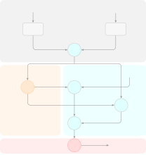
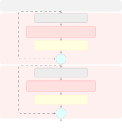

Meng Jiang Zhang Zhou Yin

# Neuromorphic Speech Enhancement with Dual-Branch Spiking Neural Networks

Taiyu    Wenbin    Haoyi    Yuhan    Haibing

###### Abstract

Spiking neural network (SNN)-based neuromorphic speech enhancement has
emerged as a promising paradigm due to its energy efficiency, yet it
still underperforms classical artificial neural network (ANN)-based
approaches owing to binary activations and the lack of well-designed
network architectures. To overcome this limitation, we propose a novel
dual-branch spiking neural network architecture equipped with a gated
spiking unit (GSU), termed GSU-DBNet. Specifically, GSU-DBNet
simultaneously models the speech magnitude spectrum and complex
spectrum, predicting the corresponding magnitude and complex spectral
masks. Meanwhile, a dual-path GSU module is adopted to exploit temporal
and frequency information for enhanced spatiotemporal feature
representation. Experiments on a popular benchmark dataset show that
GSU-DBNet achieves a PESQ score of 3.04 with only 394K parameters,
outperforming existing SNN-based methods while using only 4.5%–10.6% of
the parameters of representative ANN-based models.

###### keywords

speech enhancement, spiking neural networks, neuromorphic, dual-branch,
parameter efficiency

^(†)^(†)address: School of Communication Engineering, Hangzhou Dianzi
University, Hangzhou, China ^(†)^(†)email: {meng_taiyu, wbjiang,
hyzhang11, yhzhou05, yhb}@hdu.edu.cn

## 1 Introduction

Speech enhancement (SE) aims to recover clean speech from noisy
observations and serves as a critical front-end for hearing aids,
automatic speech recognition, and real-time communication. Deep neural
networks have become the dominant paradigm \[1, 2, 3\], achieving
remarkable speech enhancement performance \[4, 5\]. However, current
high-performance models typically require millions of parameters and
intensive floating-point operations \[6, 7, 8\], whose computational and
energy overhead is difficult to accommodate within the low-power,
low-latency constraints of edge devices.

Spiking neural networks (SNNs) offer a fundamentally different paradigm:
binary spikes and event-driven dynamics enable temporal modeling with
fewer parameters and are natively compatible with low-power neuromorphic
hardware \[9\]. With surrogate gradient training \[10\], SNNs have
achieved near-ANN performance on speech recognition \[11\], keyword
spotting \[12\], and other tasks, with recent extensions to speech
enhancement \[13\]. The Gated Spiking Unit (GSU) \[14\] retains only a
forget gate, halving the number of recurrent layer parameters relative
to Long Short-Term Memory (LSTM) and providing a foundation for
parameter-efficient SNN-based SE models. However, existing SNN-based SE
methods generally adopt single branch architectures that model only a
single spectral dimension. For example, Spiking-FullSubNet \[14\]
focuses on complex spectral features and achieves parameter compression,
but a notable quality gap with conventional networks remains.
DPSNN \[15\] constructs a dual-path structure on time-domain waveforms
and uniformly applies SNN units without investigating the suitability of
spiking dynamics across signal domains. These methods fail to exploit
the complementary advantages of magnitude and complex spectra in noise
suppression and phase recovery.

In the conventional neural network domain, lightweight speech
enhancement has developed effective architectural paradigms. Dual-path
recurrent networks \[16, 17\] factorize long sequences into time and
frequency dimensions for separate modeling, substantially reducing
computational complexity. For spectral representation, methods such as
complex spectral modeling \[6\], sub-band decomposition, dual-branch
estimation \[18\], and multi-domain fusion \[7, 8\] exploit
complementary information across different representations to improve
performance. However, these gains mainly stem from macro-level
architectural changes, while the core recurrent modules remain largely
unchanged. LSTM \[19\] is still widely used, and even GRU \[20\],
despite fewer gates, relies on continuous hidden states and dense
floating-point operations, limiting energy efficiency. Integrating
spiking units into these architectures could achieve both efficiency and
performance gains, yet no prior work has systematically explored SNN
modeling across feature dimensions in a dual-path framework.

Inspired by dual-path architectures \[16, 21\] and gated spiking
modeling \[14\], we propose GSU-DBNet, a dual-branch
encoder–separator–decoder architecture for speech enhancement based on
gated spiking units. Specifically, the separator employs a bidirectional
BiGSU in the frequency path to capture global spectral correlations and
a unidirectional GSU in the time path for causal temporal modeling. A
dual-branch decoder simultaneously estimates a complex mask for
phase-aware reconstruction via DeepFilter and a magnitude mask for
energy envelope estimation, with the two outputs fused through weighted
averaging. On VoiceBank+DEMAND, GSU-DBNet achieves PESQ 3.04 with only
394K parameters, a parameter count of only 4.5%–10.6% of representative
ANN methods, while improving PESQ by 0.84 and 0.38 over DPSNN \[15\] and
Spiking-FSN \[14\] respectively.

Overall, the main contributions of this work are threefold:

- •
  We propose GSU-DBNet, a dual-branch SNN architecture with gated
  spiking units, for joint magnitude–complex spectrum modeling and
  spatiotemporal feature extraction.
- •
  GSU-DBNet achieves competitive speech quality with fewer parameters
  than ANN-based methods and demonstrates significant improvements over
  existing SNN approaches.
- •
  Ablation studies reveal that the binary output bottleneck makes the
  single-gate design optimal, while additional gates degrade
  performance.

## 2 Proposed method

### 2.1 Architecture overview


Figure 1: Overview of the GSU-DBNet architecture with dual-path spiking
blocks and a complex-magnitude dual-branch decoder.

As illustrated in Figure 1, GSU-DBNet follows an
encoder–separator–decoder paradigm. The noisy speech is first
transformed via STFT, from which the real part, imaginary part, and
magnitude spectrum are extracted and concatenated into a three-channel
spectral input. The encoder comprises three convolutional blocks, each
consisting of a Conv2d layer, GroupNorm, PReLU, and a CBAM \[22\]
attention module. The first two layers progressively compress the
frequency dimension and increase the channel count through strided
convolutions, while the third layer employs a $`1{\times}1`$ convolution
to increase the channel count to 64, producing a latent feature map.
Subsequently, two stacked dual-path GSU blocks alternately process the
encoded features along the frequency and time dimensions. The frequency
path uses BiGSU to model cross-frequency dependencies, whereas the time
path uses GSU to capture causal temporal dependencies. Each path is
followed by a linear projection layer, GroupNorm, and a residual
connection. Finally, two independent transposed-convolution decoders
incorporate U-Net \[23\] skip connections to fuse features from the
corresponding encoder layers. The complex decoder applies a tanh
activation function to generate DeepFilter \[24\] coefficients for
filtering the noisy STFT, while the magnitude decoder applies a sigmoid
activation function to generate a magnitude mask that is multiplied with
the noisy magnitude spectrum. The outputs of the two branches are fused
via weighted averaging, and the enhanced speech is reconstructed through
the inverse STFT.

### 2.2 Dual-branch spectral processing

GSU-DBNet employs a dual-branch decoding structure that performs
parallel modeling of the complex and magnitude spectra, fully exploiting
the complementary information provided by these two spectral
representations.

The complex branch jointly estimates the real and imaginary components
of the spectrum, thereby preserving phase information. This branch
progressively recovers frequency resolution through a
transposed-convolution decoder and fuses features from the corresponding
encoder layers via U-Net skip connections. The decoder output is passed
through a tanh activation function to generate a complex mask, which
serves as DeepFilter \[24\] coefficients for filtering the noisy STFT
spectrum. The magnitude branch focuses on accurately estimating the
speech energy envelope, adopting the same decoder and skip-connection
structure with a sigmoid activation function to generate a magnitude
mask. The two branches produce spectral estimates as follows:

```math
\displaystyle Y_{c} \displaystyle=\text{DeepFilter}\bigl(\tanh(D_{c}(Z)),X\bigr), \tag{1}
```

```math
\displaystyle Y_{m} \displaystyle=\sigma\bigl(D_{m}(Z)\bigr)\odot|X|,
```

where $`Z`$ denotes the separator output and $`X`$ the noisy STFT. The
two estimates are fused via weighted averaging and converted to the
enhanced waveform through inverse STFT:

```math
Y=\alpha Y_{c}+(1-\alpha)Y_{m}. \tag{2}
```

The complex branch excels at correcting phase information, while the
magnitude branch provides stable energy estimation, and their fusion
enables the model to benefit from the complementary strengths of both
branches.

### 2.3 Gated spiking unit

We adopt the gated spiking unit \[14\] as the fundamental recurrent cell
in the dual-path module. GSU is a recurrent unit inspired by the leaky
integrate-and-fire (LIF) neuron \[25\], which maintains a membrane
potential through a gated memory mechanism and transmits information via
binary spikes. Its computation involves two key mechanisms: gated
membrane potential updates and spike emission.

As illustrated in Figure 2(a), the GSU updates its membrane potential
through a single-gate mechanism. At each time step $`t`$, given the
input $`x_{t}`$ and the previous spike output $`h_{t-1}`$, the GSU
computes a joint linear projection and splits it into two halves. A
forget gate $`f_{t}`$ controls the temporal decay of the membrane
potential, where values close to 1 preserve the previous state and
values close to 0 favor the incorporation of new input. The
complementary term $`1-f_{t}`$ serves as an implicit input gate, thereby
reducing the number of recurrent-layer parameters by approximately half
compared with an LSTM. The projection and membrane potential update are
given by:

```math
\displaystyle\mathbf{g}_{t} \displaystyle=W_{ih}\,x_{t}+W_{hh}\,h_{t-1}+b, \tag{3}
```

```math
\displaystyle f_{t} \displaystyle=\sigma\bigl(\mathbf{g}_{t}^{(1)}\bigr),
```

```math
\displaystyle c_{t} \displaystyle=f_{t}\odot c_{t-1}+(1-f_{t})\odot\mathbf{g}_{t}^{(2)}.
```

The GSU transmits information through binary spikes. The membrane
potential $`c_{t}`$ is passed through the Heaviside step function
$`\Theta`$ to produce the binary output $`h_{t}`$. Since $`\Theta`$ is
non-differentiable, a triangular surrogate gradient \[10\] is employed
during training for approximation:

```math
\displaystyle h_{t}=\Theta(c_{t}),\quad\frac{\partial\Theta}{\partial c_{t}}\approx\frac{1}{\gamma^{2}}\max\bigl(\gamma-\lvert c_{t}\rvert,0\bigr), \tag{4}
```

with $`\gamma=1.0`$, enabling standard backpropagation through
time \[26\]. Each neuron transmits only one bit of information per time
step. This binary output bottleneck is the fundamental source of GSU’s
parameter efficiency, while also limiting the benefits of additional
gates.

To verify this hypothesis, we define two multi-gate spiking variants
inspired by spiking LSTM \[27\] for ablation. SLSTM-2G decouples the
forget and input gates into two independent sigmoid gates, with the
projection dimension expanded to $`3H`$. SLSTM-3G further introduces an
output gate that modulates the membrane potential before thresholding,
with the projection dimension expanded to $`4H`$. All three variants
share the same forget-gate and spike-generation mechanisms, differing
only in the number of gates and the membrane potential update:

```math
i_{t}=\sigma(\mathbf{g}_{t}^{(2)}),\,c_{t}=f_{t}\odot c_{t-1}+i_{t}\odot\mathbf{g}_{t}^{(3)},\,h_{t}=\Theta(c_{t}). \tag{5}
```

```math
o_{t}=\sigma(\mathbf{g}_{t}^{(3)}),\,c_{t}=f_{t}\odot c_{t-1}+i_{t}\odot\mathbf{g}_{t}^{(4)},\,h_{t}=\Theta(o_{t}{\odot}c_{t}). \tag{6}
```

### 2.4 Loss function

The model is trained using a hybrid loss function that combines
power-law-compressed spectral MSE and time-domain SI-SNR \[28\]. The
spectral loss applies power-law compression to the real part, imaginary
part, and magnitude spectrum of the STFT before computing the MSE.
Denoting the magnitude by $`M`$, the phase by $`\theta`$, and the
compression exponent by $`c{=}0.3`$, the compressed representations are
defined as:

```math
\tilde{r}=M^{c}\cos\theta,\quad\tilde{i}=M^{c}\sin\theta,\quad\tilde{m}=M^{c}. \tag{7}
```

This compression emphasizes low-energy spectral regions, thereby
improving perceptual quality. The time-domain loss is based on the
scale-invariant signal-to-noise ratio (SI-SNR), computed from the
waveform reconstructed via the inverse STFT. The total loss is given by

```math
\mathcal{L}=\alpha_{c}\bigl(\lVert\Delta\tilde{r}\rVert^{2}{+}\lVert\Delta\tilde{i}\rVert^{2}\bigr)+\alpha_{m}\lVert\Delta\tilde{m}\rVert^{2}+\mathcal{L}_{\text{SI-SNR}}, \tag{8}
```

where $`\alpha_{c}{=}30`$ and $`\alpha_{m}{=}70`$ are determined through
preliminary experiments and fixed across all configurations.



(a) GSU cell computation graph.



(b) DP-GSU block ($`\times`$2).

Figure 2: (a) GSU cell computation graph. (b) DP-GSU block with BiGSU
(frequency) and GSU (time).

## 3 Experiments

### 3.1 Dataset

We evaluate our method on the VoiceBank+DEMAND dataset \[2\], which
comprises 11,572 training utterances from 28 speakers mixed with 10
noise types at SNRs of 0, 5, 10, and 15 dB. The test set contains 824
utterances from two held-out speakers mixed with five unseen noise types
at SNRs of 2.5, 7.5, 12.5, and 17.5 dB, all sampled at 16 kHz.

### 3.2 Implementation details

The STFT uses a Hann window of 400 samples (\SI25\milli\second), a hop
size of 100 samples (\SI6.25\milli\second), and an FFT size of 512,
producing a 257-bin spectrum.

The encoder consists of three convolutional blocks, each comprising a
Conv2d layer, GroupNorm, PReLU, and a CBAM attention module, with output
channels of 16, 32, and 64, respectively. The kernel sizes and strides
of the first two layers are $`(5,2)`$ and $`(2,1)`$, respectively, while
the third layer uses a kernel size and stride of $`(1,1)`$. The decoder
is symmetric to the encoder, employing transposed convolutions to
progressively recover the frequency resolution, with U-Net skip
connections used to fuse features from the corresponding encoder layers.
The separator contains two stacked dual-path GSU blocks, with the hidden
dimensions of both the frequency and time paths set to 128. The output
is passed through a PReLU layer followed by a $`1{\times}1`$
convolution. The frequency, time, and channel filter orders of
DeepFilter are set to 3, 5, and 16, respectively.

The model is trained using AdamW \[29\] with an initial learning rate of
$`1\times 10^{-3}`$, which is reduced by a factor of 0.5 using
ReduceLROnPlateau (patience = 10). Gradient norms are clipped to 5.0.
The batch size is 18, and training is performed for up to 150 epochs.

We evaluate the models using wideband PESQ \[30\], the composite
measures CSIG, CBAK, and COVL \[31\], as well as segmental SNR (SSNR).
The ablation experiments additionally report DNSMOS \[32\] SIG, BAK, and
OVRL scores, STOI \[33\] (%), and SI-SNR (dB). Audio samples from the
compared methods are available online¹¹ 1
[https://meng-taiyu.github.io/dpnet-demo/](https://meng-taiyu.github.io/dpnet-demo/).

## 4 Results

### 4.1 Comparison with existing methods

|                        |               |      |      |      |      |      |
| ---------------------- | ------------- | ---- | ---- | ---- | ---- | ---- |
| Method                 | \#Params. (K) | PESQ | CSIG | CBAK | COVL | SSNR |
| Noisy                  | –             | 1.97 | 3.35 | 2.44 | 2.63 | 1.68 |
| DCCRN^(†) \[6\]        | 3700          | 2.68 | 3.88 | 3.18 | 3.27 | 8.62 |
| FullSubNet+^(†) \[34\] | 8670          | 2.88 | 3.86 | 3.42 | 3.57 | –    |
| GaGNet^(†) \[7\]       | 5940          | 2.94 | 4.26 | 3.45 | 3.59 | –    |
| TSTNN^(†) \[35\]       | 920           | 2.96 | 4.33 | 3.53 | 3.67 | 9.70 |
| DPSNN^(‡) \[15\]       | 572           | 2.20 | 3.21 | 2.99 | 2.68 | 8.30 |
| Spiking-FSN^(‡) \[14\] | 954           | 2.66 | 3.85 | 3.24 | 3.24 | 8.31 |
| GSU-DBNet (ours)       | 394           | 3.04 | 4.28 | 3.57 | 3.68 | 9.94 |

Table 1: Comparison on VoiceBank+DEMAND. ^(†)Published results.
^(‡)Reproduced. Best per metric in bold.

Table 1 summarizes a comparison between GSU-DBNet and representative
ANN-based methods and SNN baselines. GSU-DBNet achieves a PESQ score of
3.04 with only 394K parameters and attains the best scores on CBAK,
COVL, and SSNR, indicating that dual-branch spectral modeling provides
consistent improvements in both perceptual quality and noise
suppression.

Compared with larger-scale ANN-based methods, GSU-DBNet surpasses DCCRN
(2.68), FullSubNet+ (2.88), and GaGNet (2.94) in terms of PESQ while
requiring 9–22$`\times`$ fewer parameters. Compared with TSTNN, which
also operates with fewer than one million parameters, GSU-DBNet improves
the PESQ score from 2.96 to 3.04 while using fewer parameters, achieving
better overall enhancement quality. However, TSTNN retains a slight
advantage in CSIG, suggesting that there is still room for improvement
in speech signal consistency.

Compared with SNN baselines, GSU-DBNet improves PESQ by 0.84 over DPSNN
and by 0.38 over Spiking-FSN, demonstrating that dual-path gated spiking
modeling effectively narrows the performance gap with mainstream methods
while maintaining a low parameter overhead. Overall, GSU-DBNet achieves
the best results on most evaluation metrics while using the fewest
parameters among all compared methods.

### 4.2 Ablation study

|                     |               |      |        |      |      |          |             |
| ------------------- | ------------- | ---- | ------ | ---- | ---- | -------- | ----------- |
| Config              | \#Params. (K) | PESQ | DNSMOS |      |      | STOI (%) | SI-SNR (dB) |
|                     |               |      | SIG    | BAK  | OVRL |          |             |
| GSU-DBNet           | 394           | 3.04 | 3.44   | 4.02 | 3.15 | 94.8     | 18.87       |
| (a) Branch ablation |               |      |        |      |      |          |             |
| w/o Mag-branch      | 379           | 2.96 | 3.42   | 4.03 | 3.15 | 94.6     | 19.02       |
| w/o Comp-branch     | 379           | 2.94 | 3.39   | 4.01 | 3.11 | 94.4     | 18.16       |
| (b) Path ablation   |               |      |        |      |      |          |             |
| w/o Time-path       | 278           | 2.80 | 3.40   | 3.98 | 3.09 | 94.2     | 18.90       |
| w/o Freq-path       | 163           | 2.72 | 3.38   | 3.95 | 3.07 | 93.3     | 18.77       |
| (c) Cell design     |               |      |        |      |      |          |             |
| Full-SLSTM2G        | 542           | 3.04 | 3.44   | 4.02 | 3.15 | 94.7     | 18.88       |
| Full-SLSTM3G        | 690           | 2.98 | 3.43   | 4.01 | 3.14 | 94.6     | 18.83       |
| (d) Model capacity  |               |      |        |      |      |          |             |
| H=64                | 163           | 2.86 | 3.41   | 4.01 | 3.12 | 94.4     | 19.01       |
| H=192               | 714           | 3.07 | 3.44   | 4.02 | 3.15 | 94.9     | 18.98       |

Table 2: Ablation study on VoiceBank+DEMAND. The baseline is the same
GSU-DBNet as in Table 1. Best per column in bold.

We conduct ablation studies along four dimensions to evaluate the
effectiveness of each design choice, with the results presented in
Table 2.

(a) We separately remove the magnitude branch (complex-only) and the
complex branch (magnitude-only) to verify the necessity of dual-branch
joint estimation. Both single-branch variants yield lower PESQ scores
than the dual-branch baseline (2.96 and 2.94 vs. 3.04), confirming that
each branch captures complementary spectral information. Removing the
complex branch causes a larger degradation, with SI-SNR dropping by
0.71 dB, whereas SI-SNR remains nearly unchanged in the complex-only
variant. This indicates that complex mask estimation plays a central
role in waveform reconstruction through its phase-modeling capability.

(b) We remove the time and frequency paths to study their roles in the
dual-path structure. Both are essential for enhancement, as removing
either significantly degrades PESQ, with the frequency path causing a
larger drop. This is expected, since the frequency path captures global
spectral structure via bidirectional modeling, contributing more to
noise suppression and harmonic recovery, while the time path enforces
inter-frame continuity through causal modeling. Together, they form a
complete time–frequency modeling framework.

(c) We replace GSU in both paths with multi-gate spiking variants
SLSTM-2G and SLSTM-3G to study the effect of gate complexity. As the
number of gates increases from 1 to 3, parameters nearly double, yet
PESQ does not improve and instead declines. The two-gate variant matches
GSU, while the three-gate variant degrades noticeably. We attribute this
to the binary output bottleneck: each neuron outputs only 1 bit per time
step, and although additional gates refine membrane potential dynamics,
this information is compressed into binary spikes via Heaviside
thresholding and cannot be effectively propagated. This suggests that
the simplest single-gate design is optimal within the spiking framework.

(d) We vary the hidden dimension $`H`$. Doubling $`H`$ from a smaller
value substantially improves PESQ, but further increases yield
diminishing returns while significantly increasing the parameter count,
consistent with the binary output bottleneck discussed in (c). We
therefore select $`H{=}128`$, which lies near the inflection point, as
the default configuration.

Figure 3: Membrane potential and spike raster of the time-path GSU. Five
representative neurons from 128 hidden units are selected, showing
diverse self-organized firing patterns ranging from silent to tonic
firing.

### 4.3 Spike activity analysis

Figure 3 visualizes the membrane potential and spike raster of the
first-layer time-path GSU on a test utterance. Five representative
neurons out of 128 hidden units are selected, revealing that the network
self-organizes into diverse firing patterns ranging from silent, sparse,
phasic, burst, to tonic firing, with firing rates of 0%, 19%, 33%, 59%,
and 100%, respectively. Across all 128 neurons and 824 test utterances,
the mean firing rate is 37% with a standard deviation of 19%, confirming
that this diversity is systematic rather than incidental.

This observation confirms the ablation study in Section 4.2: although
each neuron transmits only one bit per step, the single-gate GSU enables
a rich functional spectrum through population coding, where 128 neurons
with heterogeneous firing rates collectively express temporal features.
Since the bottleneck lies in one-bit output thresholding rather than
input gating precision, fine-grained modulation from additional gates is
discarded after thresholding and thus provides no benefit. The 37% mean
firing rate further implies that two-thirds of neurons are silent at any
time step, confirming that the network relies on sparse population
coding rather than dense activation, a property well suited to
event-driven neuromorphic hardware.

## 5 Conclusions

We propose GSU-DBNet, which integrates the Gated Spiking Unit into a
dual-path, dual-branch architecture as a replacement for LSTM, enabling
joint magnitude and complex mask estimation. Experiments on
VoiceBank+DEMAND show that GSU-DBNet achieves a PESQ of 3.04 with only
394K parameters, improving by 0.84 and 0.38 over DPSNN and Spiking-FSN,
respectively, while using only 4.5%–10.6% of representative ANN
parameters. Furthermore, ablation studies show that the binary output
bottleneck makes the single-gate design optimal, as additional gates do
not improve performance but add redundant parameters, providing
empirical evidence for spiking recurrent cell design. Future work
includes conducting experiments on more diverse datasets and exploring
deployment on neuromorphic hardware.

## 6 Acknowledgments

This work was supported in part by Yangtze River Delta Science and
Technology Innovation Community Joint Research under Grant
2024CSJGG1100, in part by the Zhejiang Provincial Natural Science
Foundation of China (No. LMS26F020008), and in part by the Zhejiang
Provincial College Student Innovation and Entrepreneurship Training
Program under Grant S202510336076.

## 7 Generative AI Use Disclosure

Generative AI tools were used for editing and polishing the manuscript
text. All experimental results, method design, and scientific
conclusions are the sole responsibility of the authors.

## References

- \[1\] D. Wang and J. Chen (2018) Supervised speech separation based on
  deep learning: an overview. IEEE/ACM Transactions on Audio, Speech,
  and Language Processing 26 (10), pp. 1702–1726. Cited by: §1.
- \[2\] C. Valentini-Botinhao, X. Wang, S. Takaki, and J.
  Yamagishi (2016) Investigating RNN-based speech enhancement methods
  for noise-robust text-to-speech. In Proc. ISCA Speech Synthesis
  Workshop (SSW), pp. 146–152. Cited by: §1, §3.1.
- \[3\] W. Jiang, K. Yu, and F. Wen (2024) Unsupervised speech
  enhancement using optimal transport and speech presence probability.
  IEEE/ACM Trans. Audio, Speech, Lang. Process. 32, pp. 4445–4455. Cited
  by: §1.
- \[4\] Y. Zhang, W. Jiang, Z. Wang, K. Wu, W. Zhang, and F. Wen (2026)
  HyFlowSE: hybrid end-to-end flow-matching speech enhancement via
  generative-discriminative learning. In Proc. ICASSP, pp. 16177–16181.
  Cited by: §1.
- \[5\] W. Jiang and K. Yu (2023) Speech enhancement with integration of
  neural homomorphic synthesis and spectral masking. IEEE/ACM Trans.
  Audio, Speech, Lang. Process. 31, pp. 1758–1770. Cited by: §1.
- \[6\] Y. Hu, Y. Liu, S. Lv, M. Xing, S. Zhang, Y. Fu, J. Wu, B. Zhang,
  and L. Xie (2020) DCCRN: deep complex convolution recurrent network
  for phase-aware speech enhancement. In Proc. Interspeech,
  pp. 2472–2476. Cited by: §1, §1, Table 1.
- \[7\] A. Li, C. Zheng, L. Zhang, and X. Li (2022) Glance and gaze: a
  collaborative learning framework for single-channel speech
  enhancement. Applied Acoustics 187, pp. 108499. Cited by: §1, §1,
  Table 1.
- \[8\] Y. Lu, Y. Ai, Z. Du, and Z. Zhu (2023) MP-SENet: a speech
  enhancement model with parallel denoising of magnitude and phase
  spectra. In Proc. Interspeech, pp. 3834–3838. Cited by: §1, §1.
- \[9\] M. Davies, N. Srinivasa, T. Lin, G. Chinya, Y. Cao, S. H.
  Choday, G. Dimou, P. Joshi, N. Imam, S. Jain, et al. (2018) Loihi: a
  neuromorphic manycore processor with on-chip learning. IEEE Micro 38
  (1), pp. 82–99. Cited by: §1.
- \[10\] E. O. Neftci, H. Mostafa, and F. Zenke (2019) Surrogate
  gradient learning in spiking neural networks. IEEE Signal Processing
  Magazine 36 (6), pp. 51–63. Cited by: §1, §2.3.
- \[11\] J. Wu, E. Yılmaz, M. Zhang, H. Li, and K. C. Tan (2020) Deep
  spiking neural networks for large vocabulary automatic speech
  recognition. Frontiers in Neuroscience 14, pp. 199. Cited by: §1.
- \[12\] A. Bittar and P. N. Garner (2022) A surrogate gradient spiking
  baseline for speech command recognition. Frontiers in Neuroscience 16,
  pp. 865897. Cited by: §1.
- \[13\] Y. Du, X. Liu, and Y. Chua (2024) Spiking structured state
  space model for monaural speech enhancement. In Proc. ICASSP,
  pp. 766–770. Cited by: §1.
- \[14\] X. Hao, C. Ma, Q. Yang, J. Wu, and K. C. Tan (2025) Toward
  ultralow-power neuromorphic speech enhancement with
  Spiking-FullSubNet. IEEE Transactions on Neural Networks and Learning
  Systems 36 (9), pp. 17350–17364. Cited by: §1, §1, §2.3, Table 1.
- \[15\] T. Sun and S. M. Bohte (2024) DPSNN: spiking neural network for
  low-latency streaming speech enhancement. Neuromorphic Computing and
  Engineering 4 (4), pp. 044008. Cited by: §1, §1, Table 1.
- \[16\] Y. Luo, Z. Chen, and T. Yoshioka (2020) Dual-path RNN:
  efficient long sequence modeling for time-domain single-channel speech
  separation. In Proc. ICASSP, pp. 46–50. Cited by: §1, §1.
- \[17\] Y. Luo and N. Mesgarani (2019) Conv-TasNet: surpassing ideal
  time–frequency magnitude masking for speech separation. IEEE/ACM
  Transactions on Audio, Speech, and Language Processing 27 (8),
  pp. 1256–1266. Cited by: §1.
- \[18\] G. Yu, A. Li, Y. Wang, Y. Guo, C. Zheng, and H. Wang (2022)
  Dual-branch attention-in-attention transformer for single-channel
  speech enhancement. In Proc. ICASSP, pp. 7847–7851. Cited by: §1.
- \[19\] S. Hochreiter and J. Schmidhuber (1997) Long short-term memory.
  Neural Computation 9 (8), pp. 1735–1780. Cited by: §1.
- \[20\] K. Cho, B. van Merriënboer, C. Gulcehre, D. Bahdanau, F.
  Bougares, H. Schwenk, and Y. Bengio (2014) Learning phrase
  representations using RNN encoder–decoder for statistical machine
  translation. In Proc. EMNLP, pp. 1724–1734. Cited by: §1.
- \[21\] W. Jiang, F. Wen, and K. Yu (2025) MOS-GAN: mean opinion score
  gan for unsupervised speech enhancement. IEEE Signal Process. Lett.
  32, pp. 3465–3469. Cited by: §1.
- \[22\] S. Woo, J. Park, J. Lee, and I. S. Kweon (2018) CBAM:
  convolutional block attention module. In Proc. ECCV, pp. 3–19. Cited
  by: §2.1.
- \[23\] O. Ronneberger, P. Fischer, and T. Brox (2015) U-Net:
  convolutional networks for biomedical image segmentation. In Proc.
  MICCAI, pp. 234–241. Cited by: §2.1.
- \[24\] H. Schröter, A. Maier, A. N. Escalante-B, and T.
  Rosenkranz (2022) DeepFilterNet: perceptually motivated real-time
  speech enhancement. In Proc. Interspeech, pp. 51–55. Cited by: §2.1,
  §2.2.
- \[25\] A. N. Burkitt (2006) A review of the integrate-and-fire neuron
  model: I. homogeneous synaptic input. Biological Cybernetics 95 (1),
  pp. 1–19. Cited by: §2.3.
- \[26\] P. J. Werbos (1990) Backpropagation through time: what it does
  and how to do it. Proceedings of the IEEE 78 (10), pp. 1550–1560.
  Cited by: §2.3.
- \[27\] A. Lotfi Rezaabad and S. Vishwanath (2020) Long short-term
  memory spiking networks and their applications. In Proc. International
  Conference on Neuromorphic Systems (ICONS), pp. 3:1–3:9. Cited by:
  §2.3.
- \[28\] J. Le Roux, S. Wisdom, H. Erdogan, and J. R. Hershey (2019) SDR
  – half-baked or well done?. In Proc. ICASSP, pp. 626–630. Cited by:
  §2.4.
- \[29\] I. Loshchilov and F. Hutter (2019) Decoupled weight decay
  regularization. In Proc. ICLR, Cited by: §3.2.
- \[30\] A. W. Rix, J. G. Beerends, M. P. Hollier, and A. P.
  Hekstra (2001) Perceptual evaluation of speech quality (PESQ)—a new
  method for speech quality assessment of telephone networks and codecs.
  In Proc. ICASSP, Vol. 2, pp. 749–752. Cited by: §3.2.
- \[31\] Y. Hu and P. C. Loizou (2008) Evaluation of objective quality
  measures for speech enhancement. IEEE Transactions on Audio, Speech,
  and Language Processing 16 (1), pp. 229–238. Cited by: §3.2.
- \[32\] C. K. A. Reddy, V. Gopal, and R. Cutler (2022) DNSMOS P.835 – a
  non-intrusive perceptual objective speech quality metric to evaluate
  noise suppressors. In Proc. IEEE ICASSP, pp. 886–890. Cited by: §3.2.
- \[33\] C. H. Taal, R. C. Hendriks, R. Heusdens, and J. Jensen (2011)
  An algorithm for intelligibility prediction of time–frequency weighted
  noisy speech. IEEE Transactions on Audio, Speech, and Language
  Processing 19 (7), pp. 2125–2136. Cited by: §3.2.
- \[34\] J. Chen, Z. Wang, D. Tuo, Z. Wu, S. Kang, and H. Meng (2022)
  FullSubNet+: channel attention FullSubNet with complex spectrograms
  for speech enhancement. In Proc. ICASSP, pp. 7857–7861. Cited by:
  Table 1.
- \[35\] K. Wang, B. He, and W. Zhu (2021) TSTNN: two-stage transformer
  based neural network for speech enhancement in the time domain. In
  Proc. ICASSP, pp. 7098–7102. Cited by: Table 1.
