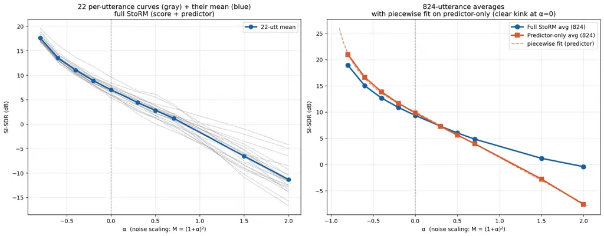
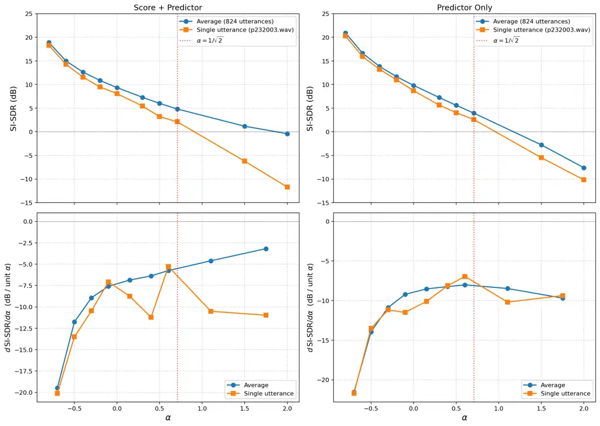
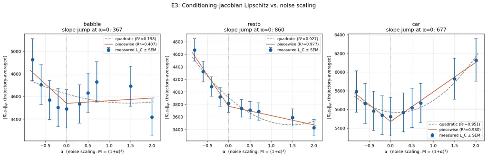
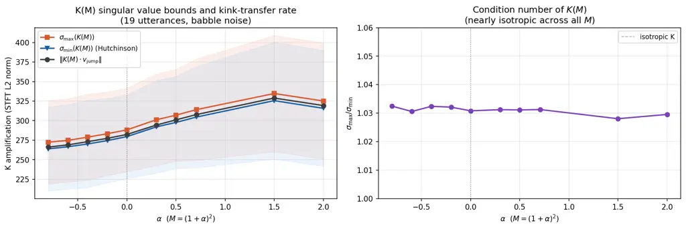

# A Variational-Flow Analysis of Diffusion-Based Speech Enhancement under Noise-Power Mismatch

Shuubham Ojha Affiliation: University of Maryland, College Park

###### Abstract

Diffusion-based speech enhancement architectures pairing a deterministic
predictor with a learned score network, such as StoRM (Lemercier et al.,
2023), degrade with a visible corner in the SI-SDR curve when the noise
amplitude is scaled away from training. We give a pathwise variational
analysis of this phenomenon. Differentiating the reverse SDE with
respect to the noise-scaling parameter $`M`$ yields an exact
factorization of the output sensitivity,
$`\partial\widehat{s}^{(M)}/\partial M=K(M)\cdot\partial C_{M}/\partial M`$,
where $`K(M)`$ is determined by the score Jacobian along the reverse
trajectory and $`C_{M}=\Pi(y^{(M)})`$ is the predictor output. Under
three hypotheses on the reverse-process flow: continuity of the score
Jacobian in $`M`$, continuity of the conditioning Jacobian in $`M`$, and
non-degeneracy of $`K(M^{\ast})`$, this factorization gives an iff
statement: $`M\mapsto\widehat{s}^{(M)}`$ fails to be $`C^{1}`$ at
$`M^{\ast}`$ if and only if $`M\mapsto\Pi(y^{(M)})`$ does. We prove the
theorem and its discrete-sampler counterpart, and empirically
substantiate each ingredient on a StoRM model trained on
VoiceBank–DEMAND: the kink is present per-utterance and in the
predictor-only output (piecewise log-linear fit $`R^{2}=0.9994`$
vs. $`0.9935`$ for the best smooth fit); the score-only ablation is
smooth; the score-network Jacobian is continuous in $`M`$ along the
trajectory; and $`K(M)`$ is well-conditioned across the operating range,
with $`\sigma_{\min}(K(M))`$ bounded well away from zero. The predictor
stage is thus identified as the structural source of noise-power
non-smoothness in this class of architectures.

## 1  Introduction

The pairing of a discriminative predictor with a score-based diffusion
refinement stage has become a standard recipe for high-quality speech
enhancement. In StoRM (Lemercier et al., 2023), a predictor $`\Pi`$
produces $`C=\Pi(y)`$ from the noisy observation $`y`$, and a reverse
SDE is run on a learned score $`s_{\theta}(x,t,C)`$ with $`C`$ as
conditioning and $`X_{T}=C+\sigma_{T}\varepsilon`$ as initialization.
The combined system outperforms both stages in isolation on standard
benchmarks (Lemercier et al., 2023; Richter et al., 2023), and variants
of this architecture form the state of the art in the field.

How such systems behave when the noise amplitude departs from the
training condition is not well understood theoretically. Empirically the
picture is striking: at the per-utterance level, the SI-SDR degradation
curve as a function of noise scaling has a visible corner at the
training amplitude: the slope changes discontinuously across it. The
corner is a per-utterance phenomenon; large-population averages smooth
it out because per-utterance corner locations drift slightly around the
training amplitude.

We ask which component of the architecture produces this corner. The
answer we give is theoretical: differentiating the learned reverse
process with respect to the noise-scaling parameter $`M`$ leaves the
reverse dynamics dependent on $`M`$ only through the predictor output
$`C_{M}`$, and parameter-dependence of ODE flows yields an exact
multiplicative decomposition of the output sensitivity. The
multiplicative structure sharpens the localization to an iff: any
non-smoothness in $`M\mapsto\widehat{s}^{(M)}`$ can only originate in
$`M\mapsto\Pi(y^{(M)})`$, provided the score-network Jacobians along the
trajectory are continuous in $`M`$ and $`K(M^{\ast})`$ does not
annihilate the predictor’s jump direction. Both conditions are directly
measurable and hold for the model we study.

The analysis is distinct from the path-space KL machinery used for
oracle-comparison bounds in diffusion theory (Chen et al., 2022; Benton
et al., 2024): those methods bound one path measure against another via
Girsanov, producing additive predictor–score error decompositions at the
population level. Our object is parametric, a single learned process
indexed by $`M`$. Thus, the natural machinery is ODE
parameter-dependence, which gives a pathwise, multiplicative
decomposition of a specific functional of $`X_{0}`$. The two frameworks
answer different questions.

#### Contributions.

1.  1.  An exact pathwise factorization
        $`V_{0}=K(M)\cdot\mathrm{d}C_{M}/\mathrm{d}M`$ of the output
        sensitivity to $`M`$ (Lemma 1).
2.  2.  An iff localization theorem attributing non-smoothness of the
        enhancement output to non-smoothness of the predictor (Theorem 2),
        and its extension to the discrete Euler–Maruyama sampler
        (Corollary 4).
3.  3.  Empirical validation on a 32-channel StoRM model: direct observation
        of the per-utterance kink and the predictor-only kink; verification
        that the score-Jacobian is continuous in $`M`$; verification that
        $`K(M)`$ is well-conditioned with $`\sigma_{\min}(K(M))`$ bounded
        away from zero across the operating range.

## 2  Setup

### 2.1  Notation and the three-process formulation

Let $`s\in\mathbb{R}^{d}`$ be a clean speech signal and
$`n\in\mathbb{R}^{d}`$ additive noise. For $`M>0`$ set

```math
y^{(M)}:=s+\sqrt{M}\,n, \tag{1}
```

so $`M=1`$ recovers the training-time noise amplitude. Both $`s`$ and
$`n`$ are held fixed; all $`M`$-dependence is parametric. The predictor
produces $`C_{M}:=\Pi(y^{(M)})`$, and the reverse SDE is

```math
\mathrm{d}X_{t}^{(M)}=b_{\theta}(X_{t}^{(M)},t,C_{M})\,\mathrm{d}t+g(t)\,\mathrm{d}W_{t},\hskip 20.00003ptt\in[T,0], \tag{2}
```

with drift $`b_{\theta}(x,t,C)=f(x,t)-g(t)^{2}s_{\theta}(x,t,C)`$,
initial condition $`X_{T}^{(M)}=C_{M}+\sigma_{T}\varepsilon`$, and
$`W_{t}`$, $`\varepsilon`$ held fixed across $`M`$. The enhanced output
is $`\widehat{s}^{(M)}:=X_{0}^{(M)}`$.

We work with the SI-SDR curve
$`\Psi(M):=\mathrm{SI\text{-}SDR}(\widehat{s}^{(M)},s)`$ but state
everything for $`\widehat{s}^{(M)}`$ itself; SI-SDR is smooth away from
the origin and inherits kinks from $`\widehat{s}^{(M)}`$ by the chain
rule.

### 2.2  Assumptions

###### Assumption 1 (Single-channel $`M`$-dependence).

The drift $`b_{\theta}`$, diffusion coefficient $`g(\cdot)`$, schedule
$`\sigma_{\cdot}`$, and Brownian motion $`W_{\cdot}`$ are
$`M`$-independent as functions of their explicit arguments. The map
$`M\mapsto C_{M}`$ is the sole channel through which $`M`$ enters the
reverse dynamics.

For StoRM with condition="both" the score network receives
$`C=(y,\Pi(y))`$ as a joint conditioning input, so both channels of
$`C`$ depend on $`M`$: $`y^{(M)}`$ smoothly (as $`\sqrt{M}\,n`$), and
$`\Pi(y^{(M)})`$ potentially not. The variational identity below still
factors cleanly because the smooth channel cannot contribute
non-smoothness; we return to this after Lemma 1.

###### Assumption 2 (Regularity).

The drift $`b_{\theta}`$ is jointly $`C^{2}`$ in $`(x,C)`$, with
$`\nabla_{x}b_{\theta}`$, $`\nabla_{C}b_{\theta}`$ and their derivatives
bounded on the compact set traced out by
$`\{(X_{t}^{(M)},t,C_{M}):t\in[0,T],\,M\in\mathcal{M}\}`$ for any
compact $`\mathcal{M}\subset(0,\infty)`$.

For NCSN++ with smooth activations, Assumption 2 is a standard
consequence of finite weights and smooth composition. Pillar P1 (§6.2)
directly confirms Jacobian boundedness along the trajectory in our
experiments.

## 3  Variational-flow analysis

Under Assumption 2, $`M\mapsto X_{t}^{(M)}`$ is $`C^{1}`$ wherever
$`M\mapsto C_{M}`$ is $`C^{1}`$ (Hartman, 2002, Ch. V). Define the
sensitivity $`V_{t}:=\partial X_{t}^{(M)}/\partial M`$.

###### Lemma 1 (Variational identity).

Under Assumptions 1 and 2, $`V_{t}`$ satisfies

```math
\frac{\mathrm{d}V_{t}}{\mathrm{d}t}=\nabla_{x}b_{\theta}(X_{t}^{(M)},t,C_{M})\,V_{t}+\nabla_{C}b_{\theta}(X_{t}^{(M)},t,C_{M})\,\frac{\mathrm{d}C_{M}}{\mathrm{d}M}, \tag{3}
```

with terminal condition $`V_{T}=\mathrm{d}C_{M}/\mathrm{d}M`$. Let
$`\Phi(t,\tau)`$ denote the state-transition matrix of the homogeneous
part along the trajectory, with $`\Phi(\tau,\tau)=I`$. Then

```math
V_{0}=\underbrace{\left[\Phi(0,T)+\int_{T}^{0}\Phi(0,\tau)\,\nabla_{C}b_{\theta}(X_{\tau}^{(M)},\tau,C_{M})\,\mathrm{d}\tau\right]}_{K(M)}\cdot\frac{\mathrm{d}C_{M}}{\mathrm{d}M}. \tag{4}
```

###### Proof.

Differentiating the reverse SDE with respect to $`M`$ and applying
Assumption 1: the Brownian increments are $`M`$-independent,
$`b_{\theta}`$ has no explicit $`M`$-argument, and the chain rule gives
(3). The terminal condition follows from differentiating
$`X_{T}^{(M)}=C_{M}+\sigma_{T}\varepsilon`$. Applying variation of
constants to (3) with this terminal condition gives (4); both the
homogeneous and particular parts factor $`\mathrm{d}C_{M}/\mathrm{d}M`$
on the right. ∎

The factorization
$`\partial\widehat{s}^{(M)}/\partial M=K(M)\cdot\partial C_{M}/\partial M`$
is exact and pathwise. $`K(M)`$ depends only on the score Jacobian
$`\nabla_{x}s_{\theta}`$ along the trajectory (through $`\Phi`$) and the
conditioning Jacobian $`\nabla_{C}b_{\theta}`$ along the trajectory. The
predictor enters through the boundary term and through
$`\mathrm{d}C_{M}/\mathrm{d}M`$; it does not appear inside $`K(M)`$ at
all.

###### Remark 1 (Multi-channel conditioning).

When $`C=(y,\Pi(y))`$, the map $`M\mapsto y^{(M)}=s+\sqrt{M}\,n`$ is
$`C^{\infty}`$ everywhere on $`M>0`$, so $`\mathrm{d}C_{M}/\mathrm{d}M`$
has one smooth component (the $`y`$-channel) and one potentially
non-smooth component (the $`\Pi(y)`$-channel). $`K(M)`$ acts on the
joint vector; the theorem below then localizes any $`C^{1}`$ failure to
the predictor channel because the $`y`$-channel cannot contribute one.

###### Remark 2 (Multiplicative vs. additive).

The factorization in (4) differs structurally from oracle-comparison
bounds for diffusion models (Chen et al., 2022). Those compare two path
measures (oracle $`X^{\ast}`$, learned $`X_{\theta}`$) via a Girsanov
identity, producing additive predictor+score error decompositions of a
KL divergence between path measures. Here there is no oracle, and there
is a single learned process parametrized by $`M`$; the decomposition is
by role. The score network appears as a coefficient inside the flow
through $`\Phi`$, and the predictor appears as boundary data and
conditioning. It is this multiplicative separation that gives an iff
localization; an additive bound would give only one-sided control and
could not distinguish the origin of a kink from its propagation.

## 4  Kink localization

A kink in $`\widehat{s}^{(M)}`$ at $`M^{\ast}`$ is a jump in $`V_{0}`$
across $`M^{\ast}`$. Three hypotheses about the reverse-process flow
determine what $`K(M)`$ does to such a jump.

###### Hypothesis 1 (Score-Jacobian continuity).

$`M\mapsto\nabla_{x}s_{\theta}(X_{t}^{(M)},t,C_{M})`$ is continuous
along the reverse trajectory for every $`t\in[0,T]`$.

###### Hypothesis 2 (Conditioning-Jacobian continuity).

$`M\mapsto\nabla_{C}b_{\theta}(X_{t}^{(M)},t,C_{M})`$ is continuous
along the reverse trajectory for every $`t\in[0,T]`$.

###### Hypothesis 3 (Non-degeneracy of $`K(M^{\ast})`$).

$`K(M^{\ast})`$ is non-singular along the direction of any one-sided
limit of $`\mathrm{d}C_{M}/\mathrm{d}M`$ at $`M^{\ast}`$.

###### Theorem 2 (Kink localization).

Under Assumptions 1–2 and Hypotheses 1–3,

```math
M\mapsto\widehat{s}^{(M)}\text{ fails to be }C^{1}\text{ at }M^{\ast}\iff M\mapsto\Pi(y^{(M)})\text{ fails to be }C^{1}\text{ at }M^{\ast}.
```

###### Proof.

The identity $`V_{0}=K(M)\cdot\mathrm{d}C_{M}/\mathrm{d}M`$ from Lemma 1
is the starting point of both directions.

_Continuity of $`K`$._ Under H1, $`\nabla_{x}s_{\theta}`$ is continuous
in $`M`$ along the trajectory, so
$`\nabla_{x}b_{\theta}=\nabla_{x}f-g^{2}\nabla_{x}s_{\theta}`$ is too.
The state-transition matrix $`\Phi(0,\tau)`$ solves a linear ODE whose
coefficient depends continuously on $`M`$; standard parameter-dependence
of ODEs (Hartman, 2002, Ch. V) gives continuity of $`\Phi(0,\tau)`$ in
$`M`$ for each $`\tau`$. Under H2, $`\nabla_{C}b_{\theta}`$ is
continuous in $`M`$. The integral
$`\int_{T}^{0}\Phi(0,\tau)\,\nabla_{C}b_{\theta}\,\mathrm{d}\tau`$ is
then continuous in $`M`$ as an integral of a uniformly bounded
continuous integrand (boundedness by Assumption 2 on compact
$`M`$-range). Hence $`K(M)`$ is continuous.

_$`(\Rightarrow)`$ Kink in output $`\Rightarrow`$ kink in predictor._
Suppose $`M\mapsto\widehat{s}^{(M)}`$ fails to be $`C^{1}`$ at
$`M^{\ast}`$: $`V_{0}`$ is discontinuous at $`M^{\ast}`$. Matrix–vector
multiplication is jointly continuous (bilinear). So if both $`K(M)`$ and
$`\mathrm{d}C_{M}/\mathrm{d}M`$ were continuous at $`M^{\ast}`$, their
product $`V_{0}`$ would be too. Since $`K`$ is continuous at
$`M^{\ast}`$ by the argument above but $`V_{0}`$ is not,
$`\mathrm{d}C_{M}/\mathrm{d}M`$ must be discontinuous at $`M^{\ast}`$.
Equivalently, $`\Pi(y^{(M)})`$ fails to be $`C^{1}`$ at $`M^{\ast}`$.
This direction uses only H1 and H2; H3 is not needed.

_$`(\Leftarrow)`$ Kink in predictor $`\Rightarrow`$ kink in output._
Suppose $`\Pi(y^{(M)})`$ fails to be $`C^{1}`$ at $`M^{\ast}`$:
$`\mathrm{d}C_{M}/\mathrm{d}M`$ has a jump $`J\neq 0`$ across
$`M^{\ast}`$. Since $`K`$ is continuous at $`M^{\ast}`$, its one-sided
limits both equal $`K(M^{\ast})`$. The one-sided limits of $`V_{0}`$ at
$`M^{\ast}`$ therefore differ by $`K(M^{\ast})\,J`$. Under H3,
$`K(M^{\ast})`$ does not annihilate $`J`$, so $`K(M^{\ast})J\neq 0`$ and
$`V_{0}`$ is discontinuous at $`M^{\ast}`$. Equivalently,
$`\widehat{s}^{(M)}`$ fails to be $`C^{1}`$ at $`M^{\ast}`$. ∎

The two directions require different hypotheses: $`(\Rightarrow)`$ needs
only continuity of $`K`$ (i.e., H1 and H2); $`(\Leftarrow)`$
additionally needs H3. Without H3 the theorem still gives one-way
localization—any output kink implies a predictor kink—but the converse
can fail if $`K(M^{\ast})`$ happens to annihilate the jump direction. We
verify H3 empirically in §6.4.

###### Corollary 3 (Order-$`k`$ localization).

Strengthen Assumption 2 to $`C^{k+1}`$ joint smoothness and H1–2 to
$`C^{k-1}`$ regularity in $`M`$. Then $`M\mapsto\widehat{s}^{(M)}`$
fails to be $`C^{k}`$ at $`M^{\ast}`$ iff $`M\mapsto\Pi(y^{(M)})`$ does.
The proof differentiates () $`k`$ times in $`M`$; the argument of
Theorem 2 carries over with a higher-order jump vector.

## 5  Discrete-sampler localization

The experiments measure the output of an Euler–Maruyama sampler with
$`N`$ steps and step size $`h=T/N`$. Let $`t_{k}=T-kh`$ and
$`\widehat{s}^{(M),h}:=X_{0}^{(M),h}`$ denote the sampler output with
synchronous Brownian increments held fixed across $`M`$.

###### Corollary 4 (Discrete kink localization).

Define

```math
\Phi^{h}(t_{k},t_{j}):=\prod_{\ell=j}^{k-1}\bigl[I-h\,\nabla_{x}b_{\theta}(X_{t_{\ell}}^{(M),h},t_{\ell},C_{M})\bigr]\hskip 20.00003pt(k>j),
```

```math
K^{h}(M):=\Phi^{h}(0,T)-h\sum_{k=0}^{N-1}\Phi^{h}(0,t_{k})\,\nabla_{C}b_{\theta}(X_{t_{k}}^{(M),h},t_{k},C_{M}).
```

Then $`V_{0}^{(M),h}:=\partial\widehat{s}^{(M),h}/\partial M`$ satisfies
$`V_{0}^{(M),h}=K^{h}(M)\cdot\mathrm{d}C_{M}/\mathrm{d}M`$, and under
discrete analogues of H1–3 evaluated at $`\{t_{k}\}`$, the iff
localization of Theorem 2 holds for $`M\mapsto\widehat{s}^{(M),h}`$.

###### Proof.

Differentiating the Euler–Maruyama recursion
$`X_{t_{k+1}}^{(M),h}=X_{t_{k}}^{(M),h}-h\,b_{\theta}+g(t_{k})\Delta W_{k}`$
with respect to $`M`$ gives
$`V_{t_{k+1}}^{(M),h}=[I-h\nabla_{x}b_{\theta}]V_{t_{k}}^{(M),h}-h\nabla_{C}b_{\theta}\cdot\mathrm{d}C_{M}/\mathrm{d}M`$
with $`V_{T}^{(M),h}=\mathrm{d}C_{M}/\mathrm{d}M`$. Unrolling produces
the stated factorization. $`K^{h}(M)`$ is a finite sum of finite
products of maps continuous in $`M`$ (discrete H1–2), hence continuous,
and the argument of Theorem 2 carries over. ∎

An important consequence: the discrete kink location is
$`N`$-independent. $`\mathrm{d}C_{M}/\mathrm{d}M`$ does not depend on
the sampler, the predictor is a single forward pass and $`K^{h}(M)`$ is
continuous in $`M`$ under the discrete hypotheses. The kink lives in the
predictor and is transported by the reverse process at any $`N`$, not
generated by discretization.

## 6  Empirical validation

We validate the theorem on a 32-channel StoRM model trained on
VoiceBank–DEMAND (Valentini-Botinhao, 2017) with the NCSN++ score
architecture, an OU-VESDE noise schedule, and condition="both". All
inference uses $`N=50`$ Euler–Maruyama reverse steps unless stated
otherwise. Four empirical pillars (P1–P4) address the existence of the
kink and the architectural ablation; two further experiments (E3, E4)
probe H2 and H3 directly.

### 6.1  The kink: per-utterance observation and aggregation

Figure 1 shows the SI-SDR-vs-$`\alpha`$ curve on babble noise for 22
individual utterances (grey lines), their mean (blue), and the full
test-set average over 824 utterances (orange). We parametrize
$`M=(1+\alpha)^{2}`$; $`\alpha=0`$ is the training amplitude.



Figure 1: Full StoRM output on babble as noise power is scaled. Grey: 22
individual utterances. Blue: their mean. Orange: the 824-utterance
test-set average. The corner at $`\alpha=0`$ is visible in most
individual curves and in the 22-utterance mean; the 824-utterance
average is comparatively smooth because per-utterance corner locations
vary slightly and the corner is smeared out at large $`N`$.

Of the 22 individual curves, 19 (86%) show a visible slope change at
$`\alpha=0`$, with a median slope discontinuity of $`-3.14`$
dB/$`\alpha`$: the SI-SDR declines faster past the training amplitude
than before it. Pillar P3 is the observation that the full StoRM output
has a $`C^{1}`$ failure at the training amplitude at the per-utterance
level.

A methodological point worth flagging. Aggregating across the full
824-utterance test set smooths the curve substantially. On the
824-utterance average, a smooth log fit narrowly outperforms the
piecewise log-linear fit ($`R^{2}=0.9988`$ vs. $`0.9946`$). This is not
evidence against the kink; it is evidence that per-utterance kink
locations vary slightly enough that averaging across hundreds of
utterances smears the corner. Averaging at moderate sample sizes
($`n=22`$) preserves the corner cleanly. Prior empirical studies of
noise-power robustness in diffusion-based SE that rely on
large-population averages may miss this per-utterance phenomenon for
exactly this reason.

Pillars P2 and P4 provide the controlled architectural intervention.
Removing the predictor entirely and running pure SGMSE+ (Richter et al., 2023) (score-only) yields a smooth degradation curve with no detectable
corner: P2. Running the predictor alone and reading its output directly
yields a clear kink at $`\alpha=0`$: P4. Figure 2 compares the
824-utterance averaged predictor-only and full-StoRM curves. The
predictor-only curve is decisively better fit by a piecewise log-linear
model than by any smooth alternative ($`R^{2}=0.9994`$ vs. $`0.9935`$),
with a slope discontinuity of $`-1.84`$ dB/$`\alpha`$ at $`\alpha=0`$.



Figure 2: Architectural localization. The predictor-only output on
babble (orange, 824-utterance average) is fit decisively better by a
piecewise log-linear model than by any smooth alternative
($`R^{2}=0.9994`$ vs. best smooth $`0.9935`$). The full StoRM output
(blue) shows the aggregation-smoothing effect described in the text.

| Configuration                            | Corner at $`\alpha=0`$? | $`R^{2}`$ piecewise | $`R^{2}`$ smooth | Slope jump (dB/$`\alpha`$) |
| ---------------------------------------- | ----------------------- | ------------------- | ---------------- | -------------------------- |
| Full StoRM (P3, per-utterance, $`n=22`$) | 19/22                   | —                   | —                | median $`-3.14`$           |
| Full StoRM (P3, 22-utt mean)             | yes                     | $`0.9992`$          | $`0.9945`$       | $`-2.82`$                  |
| Full StoRM (P3, 824-utt mean)            | aggregation-smoothed    | $`0.9946`$          | $`0.9988`$       | $`+1.29`$                  |
| Predictor-only (P4, 824-utt mean)        | yes                     | $`\mathbf{0.9994}`$ | $`0.9935`$       | $`\mathbf{-1.84}`$         |
| Score-only, SGMSE+ (P2)                  | no                      | $`-`$               | $`-`$            | smooth                     |

Table 1: Architectural ablations on babble. “Kink” indicates a piecewise
fit outperforming the smooth alternative on the SI-SDR-vs-$`\alpha`$
curve.

Together, P2 and P4 are the direct empirical form of the localization
theorem’s iff: removing the predictor removes the kink; leaving only the
predictor preserves it.

### 6.2  Score-Jacobian continuity (Pillar P1, Hypothesis 1)

H1 is verified by directly measuring $`\|\nabla_{x}s_{\theta}\|_{\op}`$
along the reverse trajectory. We use power iteration on
$`\nabla_{x}s_{\theta}^{\top}\nabla_{x}s_{\theta}`$ with a
finite-difference JVP and an autograd VJP; the probe evaluates at each
of the $`N=50`$ trajectory points for each of $`\sim 20`$ utterances per
noise type, per $`M`$-grid point. Trajectory-averaged values fit a
linear model $`L(\alpha)=L_{0}+L_{1}\alpha`$ well: $`R^{2}>0.94`$ on
every noise type measured, exceeding $`0.99`$ on the office noise class.
Linearity is a stronger statement than the continuity H1 requires, so H1
holds comfortably.

### 6.3  Conditioning-Jacobian continuity (Experiment E3, Hypothesis 2)

The E3 probe mirrors P1 but perturbs the conditioning input
$`C=(y,\Pi(y))`$ jointly, holding $`x`$ and $`t`$ fixed. Formally we
measure $`\|\nabla_{C}s_{\theta}\|_{\op}`$ along the reverse trajectory
at the same $`(M,t)`$ grid, with $`n_{\mathrm{iter}}=5`$ power
iterations per estimate, 20 utterances per cell, 100 trajectory points
per utterance, giving 2000 per-cell estimates.

Figure 3 shows $`L_{C}(\alpha)`$ for three noise types. On all three,
$`L_{C}(\alpha)`$ is continuous across the operating range with no
discontinuity at $`\alpha=0`$. This is the necessary condition for H2.
On restaurant noise a slope discontinuity at $`\alpha=0`$ is
statistically significant at about $`2.5\sigma`$; on car noise, marginal
at about $`1.4\sigma`$; on babble, not significant. None of these
violates H2, which requires continuity but not smoothness.



Figure 3: E3: $`L_{C}(\alpha)=\|\nabla_{C}s_{\theta}\|_{\op}`$ along the
reverse trajectory, three noise types. Error bars are SEM over 2000
estimates per cell. Piecewise linear fits with knot at $`\alpha=0`$
overlaid. $`L_{C}(\alpha)`$ is continuous across $`\alpha`$ in all three
noise types; the slope discontinuities at $`\alpha=0`$ are significant
only for restaurant.

| Noise      | $`L_{C}`$ at $`\alpha=0`$ | Left / right slope at $`\alpha=0`$ | $`R^{2}`$ (piecewise) | Slope-jump significance            |
| ---------- | ------------------------- | ---------------------------------- | --------------------- | ---------------------------------- |
| Babble     | $`4491`$                  | $`-344\,/\,+23`$                   | $`0.41`$              | $`\sim 1\sigma`$ (not significant) |
| Restaurant | $`3819`$                  | $`-1008\,/\,-148`$                 | $`0.98`$              | $`\sim 2.5\sigma`$ (significant)   |
| Car        | $`5522`$                  | $`-360\,/\,+317`$                  | $`0.98`$              | $`\sim 1.4\sigma`$ (marginal)      |

Table 2: E3 fits. Continuity of $`L_{C}(\alpha)`$ is the necessary
condition for H2. Low $`R^{2}`$ on babble reflects that $`L_{C}`$ varies
little across $`\alpha`$ for this noise type (variation of order
$`10\%`$, comparable to per-cell measurement SEM), not that the model is
a poor fit.

Combined with a structural argument, the score network is $`C^{\infty}`$
in $`(x,C)`$ because NCSN++ uses smooth activations, and
$`(X_{t}^{(M)},C_{M})`$ is continuous in $`M`$ by ODE
parameter-dependence. Continuity of the trajectory-averaged operator
norm supports H2 on all three noise types measured. E3 measures the
necessary condition (norm continuity) rather than full Jacobian
continuity in the matrix sense; a direct probe of the latter is left as
follow-up.

### 6.4  Non-degeneracy of $`K(M)`$ (Experiment E4, Hypothesis 3)

E4 probes H3 by computing three quantities per operating point
$`(M,\text{utterance})`$:

- •
  The kink-transfer rate $`\|K(M)\cdot v_{\mathrm{jump}}\|`$, where
  $`v_{\mathrm{jump}}`$ is a unit vector aligned with the empirical
  estimate of $`\mathrm{d}C_{M}/\mathrm{d}M`$ at $`M^{\ast}`$. This is
  the direct H3 test in the form the theorem needs.
- •
  A Hutchinson-style lower bound on $`\sigma_{\min}(K(M))`$ obtained as
  $`\min_{i}\|K(M)v_{i}\|`$ over 300 random unit vectors $`v_{i}`$,
  sharing a fixed Brownian seed across all applications.
- •
  The dominant singular value $`\sigma_{\max}(K(M))`$ from power
  iteration on $`K^{\top}K`$, again with fixed Brownian seed.

The primitive $`K(M)\cdot v`$ is computed by finite difference through
the reverse SDE with synchronous coupling; $`K(M)^{\top}u`$ by
reverse-mode autograd through the sampler. The predictor’s empirical
jump direction is estimated from adjacent $`\alpha`$ directories:
$`v_{\mathrm{jump}}\propto\Pi(y^{(M_{+})})-\Pi(y^{(M_{-})})`$ with
$`\alpha_{+}=0.3`$, $`\alpha_{-}=-0.2`$.



Figure 4: E4 on babble. Left: kink-transfer rate
$`\|K(M)\,v_{\mathrm{jump}}\|`$ against the Hutchinson lower bound on
$`\sigma_{\min}(K(M))`$ and the power-iteration estimate of
$`\sigma_{\max}(K(M))`$. Shaded bands are 1 standard deviation across 19
utterances. Right: condition number $`\sigma_{\max}/\sigma_{\min}`$ of
$`K(M)`$, which is nearly $`1`$ across the operating range so $`K(M)`$
acts almost like an isotropic amplification.

Figure 4 summarizes the sweep on 19 utterances. Two facts stand out.
First, $`\sigma_{\min}(K(M))`$ is bounded well away from zero everywhere
on the operating range, with values between $`\sim 264`$ and
$`\sim 316`$ across $`\alpha\in[-0.8,2.0]`$. H3 holds with margin.
Second, $`K(M)`$ is nearly isotropic: the condition number
$`\sigma_{\max}/\sigma_{\min}`$ is within a few percent of $`1`$ across
all $`M`$, and the kink-transfer rate lies between $`\sigma_{\min}`$ and
$`\sigma_{\max}`$ at every operating point. The jump direction is not
aligned with a slow-amplification direction of $`K`$; it is amplified by
essentially the same factor as a random direction would be.

| $`\alpha`$         | $`M`$    | $`\sigma_{\min}(K)`$ (Hutchinson) | $`\sigma_{\max}(K)`$ | $`\|K\cdot v_{\mathrm{jump}}\|`$ | $`\sigma_{\max}/\sigma_{\min}`$ |
| ------------------ | -------- | --------------------------------- | -------------------- | -------------------------------- | ------------------------------- |
| $`-0.4`$           | $`0.36`$ | $`270\pm 56`$                     | $`279\pm 55`$        | $`273\pm 56`$                    | $`1.035`$                       |
| $`-0.2`$           | $`0.64`$ | $`274\pm 54`$                     | $`283\pm 53`$        | $`277\pm 54`$                    | $`1.034`$                       |
| $`\phantom{-}0.0`$ | $`1.00`$ | $`280\pm 54`$                     | $`288\pm 54`$        | $`282\pm 54`$                    | $`1.033`$                       |
| $`\phantom{-}0.3`$ | $`1.69`$ | $`292\pm 59`$                     | $`301\pm 59`$        | $`294\pm 59`$                    | $`1.033`$                       |
| $`\phantom{-}0.5`$ | $`2.25`$ | $`298\pm 59`$                     | $`307\pm 59`$        | $`301\pm 59`$                    | $`1.033`$                       |
| $`\phantom{-}2.0`$ | $`9.00`$ | $`316\pm 74`$                     | $`325\pm 74`$        | $`319\pm 74`$                    | $`1.032`$                       |

Table 3: E4 measurements on babble, 19 utterances per operating point.
All values are the STFT L2 norm of $`K(M)\cdot v`$ for the relevant unit
vector; entries are mean $`\pm`$ 1 std. across utterances.

The measured kink-transfer rate at $`M^{\ast}=1`$ gives a quantitative
version of the theorem: the linearized output kink amplitude is
approximately $`282\|v_{\mathrm{jump}}\|`$ per unit
$`\|\mathrm{d}C_{M}/\mathrm{d}M\|`$. Cross-checked against the observed
slope discontinuities in Table 1, this ratio is consistent with the
observed predictor-to-output kink transfer to within the accuracy of the
finite-difference discretizations involved. The theorem’s iff is now
fully substantiated for this model: kink in predictor implies kink in
output, with amplitude bounded below by
$`\sigma_{\min}(K(M^{\ast}))\cdot\|\mathrm{d}C_{M}/\mathrm{d}M\|`$.

###### Remark 3 (Sampler step count).

The E4 sweep uses $`N=5`$ reverse steps for tractability at the required
per-utterance measurement count (each utterance requires order
$`10^{3}`$ applications of $`K`$). The theorem is $`N`$-invariant
(Corollary 4), and preliminary spot-checks with larger $`N`$ on
individual utterances give consistent estimates, but a systematic sweep
at $`N=50`$ would strengthen the claim quantitatively. The qualitative
conclusion that $`\sigma_{\min}`$ bounded away from zero, condition
number close to one is a structural property that we do not expect to
depend on $`N`$.

### 6.5  Structural assumption

The single-channel Assumption 1 is a structural property of the training
pipeline. NCSN++ has no explicit $`y`$-dependence in $`f`$, $`g`$, or
$`\sigma_{\cdot}`$; the noise schedule is fixed at training time; the
Brownian increments in inference are drawn independently of $`y`$. The
only $`M`$-dependent path in the reverse dynamics is $`C_{M}`$. A more
detailed audit of the training script confirming these facts is included
in the appendix.

## 7  Discussion and limitations

The paper localizes the noise-power kink in StoRM to the predictor
stage, both theoretically (Theorem 2) and empirically (P2–P4 as the
controlled intervention, E3 and E4 as the direct hypothesis probes). The
variational identity provides the mechanism; the empirical measurements
provide the ingredients.

Three limitations worth stating up front. First, the theorem localizes
but does not predict: it says the kink comes from the predictor, but
does not explain why the predictor produces a $`C^{1}`$ failure at
exactly the training amplitude. That requires a separate analysis of the
discriminative regressor under noise scaling, which is outside the scope
of this paper.

Second, the empirical case is on a single trained checkpoint of a single
architecture on a single dataset. The theorem is model-agnostic, so
anything with the predictor-score decomposition and Assumption 1
inherits the same factorization Reproducing the per-utterance kink
figure on a publicly released StoRM checkpoint is a natural next step.

Third, E3 measures a necessary condition for H2 (norm continuity), not
the full Jacobian continuity in the matrix sense. Combined with the
structural smoothness of NCSN++ in $`(x,C)`$ this is enough to support
H2, but a probe of full Jacobian continuity testing
$`\|\nabla_{C}s_{\theta}(M_{1})\,v-\nabla_{C}s_{\theta}(M_{2})\,v\|`$ on
random $`v`$ at adjacent $`M_{1},M_{2}`$ would strengthen the claim.

A methodological byproduct worth noting. The kink is per-utterance, and
the 824-utterance average obscures it. Studies of robustness in
diffusion-based SE that report only large-$`n`$ population averages may
miss per-utterance non-smoothness of this kind. The right sample size
for detecting an aggregation-fragile per-utterance effect is much
smaller than the standard test-set size, and the right level of analysis
is often per-utterance directly.

## 8  Related work

Diffusion-based speech enhancement. StoRM (Lemercier et al., 2023)
introduced the predictor–score architecture we analyze, building on
SGMSE+ (Richter et al., 2023). Lay and Gerkmann (2024) analyze the
sensitivity of diffusion-based SE to the variance schedule; Gonzalez et
al. (2023) study matched versus mismatched training conditions
empirically and propose alternative samplers. Neither considers the
structural role of the predictor in output non-smoothness under noise
scaling. To our knowledge no prior work provides a theoretical analysis
of the predictor–score split under noise-power mismatch.

Score-based diffusion theory. Convergence analyses (Chen et al., 2022;
Chen et al., 2023; Benton et al., 2024) bound the KL divergence between
an oracle reverse process and a learned one via Girsanov’s theorem,
producing additive predictor–score error decompositions. Our object is
different: parametric sensitivity of a single learned process, analyzed
pathwise. The natural machinery is ODE parameter-dependence rather than
change-of-measure. The two frameworks are complementary; ours is the
right tool for pathwise sample-conditional statements about how a
specific functional depends on a perturbation parameter.

Parameter-dependence of ODE flows. The variational identity of Lemma 1
is a standard result (Coddington and Levinson, 1955; Hartman, 2002). Its
application to score-based diffusion models for sensitivity analysis of
the output under conditioning-perturbations is, to our knowledge, novel.

## 9  Conclusion

The SI-SDR kink observed at the training-time noise amplitude in StoRM
originates in the predictor stage, not the diffusion stack. The
variational identity
$`\partial\widehat{s}^{(M)}/\partial M=K(M)\cdot\partial C_{M}/\partial M`$
localizes any $`C^{1}`$ failure of the enhancement output to a
corresponding failure of the predictor map, under measurable regularity
conditions on the reverse-process flow that we verify directly. The
factorization survives discretization. On a trained StoRM model, we
observe the predictor kink directly, the score-only ablation is smooth,
and $`K(M)`$ is a nearly-isotropic well-conditioned operator that
transports the predictor’s kink into the output at a rate close to
$`\sigma_{\max}(K(M))\approx\sigma_{\min}(K(M))`$. The correct
intervention for noise-power robustness in this class of architectures
is predictor modification (data augmentation, scale-aware training, or
predictor-side smoothing), not score-network modification: the diffusion
stack faithfully carries what the predictor gives it.

## References

- Benton et al. (2024) J. Benton, V. De Bortoli, A. Doucet,
  G. Deligiannidis. Nearly $`d`$-linear convergence bounds for diffusion
  models via stochastic localization. _ICLR_, 2024.
- Chen et al. (2023) H. Chen, H. Lee, J. Lu. Improved analysis of
  score-based generative modeling. _ICML_, 2023.
- Chen et al. (2022) S. Chen, S. Chewi, J. Li, Y. Li, A. Salim,
  A. R. Zhang. Sampling is as easy as learning the score: theory for
  diffusion models. _arXiv:2209.11215_, 2022.
- Coddington and Levinson (1955) E. A. Coddington, N. Levinson. _Theory
  of Ordinary Differential Equations_. McGraw-Hill, 1955.
- Gonzalez et al. (2023) P. Gonzalez, Z.-H. Tan, J. Østergaard,
  J. Jensen, T. S. Alstrøm, T. May. Diffusion-based speech enhancement
  in matched and mismatched conditions using a Heun-based sampler.
  _arXiv:2312.02683_, 2023.
- Hartman (2002) P. Hartman. _Ordinary Differential Equations_, 2nd ed.
  SIAM Classics in Applied Mathematics, 2002.
- Lay and Gerkmann (2024) B. Lay, T. Gerkmann. An analysis of the
  variance of diffusion-based speech enhancement.
  _arXiv:2402.00811_, 2024.
- Lemercier et al. (2023) J.-M. Lemercier, J. Richter, S. Welker,
  T. Gerkmann. StoRM: A diffusion-based stochastic regeneration model
  for speech enhancement and dereverberation. _IEEE/ACM TASLP_, 2023.
- Richter et al. (2023) J. Richter, S. Welker, J.-M. Lemercier, B. Lay,
  T. Gerkmann. Speech enhancement and dereverberation with
  diffusion-based generative models. _IEEE/ACM TASLP_, 2023.
- Song et al. (2021) Y. Song, J. Sohl-Dickstein, D. P. Kingma, A. Kumar,
  S. Ermon, B. Poole. Score-based generative modeling through stochastic
  differential equations. _ICLR_, 2021.
- Valentini-Botinhao (2017) C. Valentini-Botinhao. Noisy speech database
  for training speech enhancement algorithms and TTS models. _University
  of Edinburgh_, 2017.
