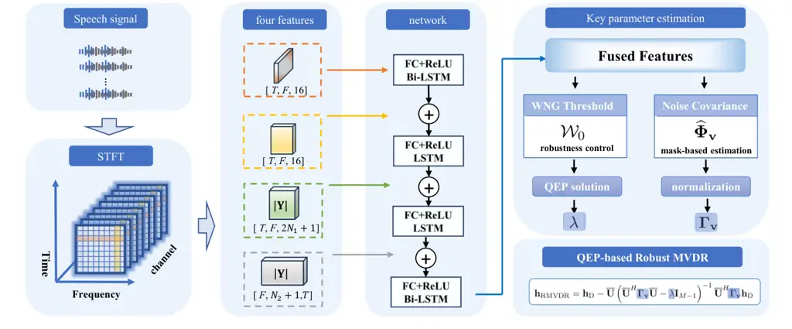

Deng Pei Ma Huang Chen Benesty

# Joint Learning of Covariance Estimation and White Noise Gain for Robust MVDR Beamforming

Yongyi    Hanchen    Jianbo    Gongping    Jingdong    Jacob

###### Abstract

The minimum variance distortionless response (MVDR) beamformer is widely
used for multichannel speech enhancement due to strong noise suppression
while preserving target signals. In practice, its performance is
sensitive to microphone self-noise and array mismatches. Existing
approaches typically rely on fixed, manually tuned WNG thresholds or
diagonal loading, leading to suboptimal performance under unknown or
time-varying acoustic conditions. This paper proposes a data-driven MVDR
framework that adaptively estimates the WNG constraint using a deep
neural network. The network jointly predicts a time–frequency noise mask
for covariance estimation and a frequency-dependent WNG threshold,
enabling dynamic robustness–directivity control. A differentiable robust
MVDR layer is integrated into the framework, allowing end-to-end
optimization. Experiments demonstrate consistent improvements in speech
quality and intelligibility over conventional fixed-WNG MVDR methods.

###### keywords

Beamforming, microphone arrays, speech enhancement, MVDR, data-driven
WNG constraint.

^(†)^(†)address: ¹ School of Electronic Information, Wuhan University,
Wuhan, Hubei, China  
² Dolby Laboratories  
³ CIAIC, Northwestern Polytechnical University, Xi’an, Shaanxi, China  
⁴ INRS-EMT, University of Quebec, Montreal, QC, Canada ^(†)^(†)email:
dyy520@whu.edu.cn

## 1 Introduction

Microphone array beamforming is a core technique in multichannel speech
processing, with applications including voice capture, spatial audio
recording, and environmental perception \[1, 2, 3, 4, 5\]. Among
existing approaches, the minimum variance distortionless response (MVDR)
beamformer is particularly attractive \[6, 7, 8, 9\]. The MVDR
beamformer relies on accurate estimation of the spatial covariance
matrix of the received signals \[10, 11, 12, 13, 14, 15\], which is
commonly obtained using time-averaged statistics or voice activity
detection (VAD)-based methods \[14, 12, 16\]. More recently, deep neural
networks have been widely adopted to estimate time–frequency noise
masks, enabling improved covariance matrix estimation and consequently
enhanced MVDR performance \[17, 18, 19, 20\]. Despite its effectiveness,
the MVDR beamformer is inherently sensitive to array imperfections and
modeling errors, such as microphone self-noise, gain and phase
mismatches, and sensor position inaccuracies. This sensitivity is
commonly quantified by the white noise gain (WNG) \[21\], which
characterizes the robustness of a beamformer against spatially white
noise and array uncertainties \[22, 23\]. A low WNG indicates a high
susceptibility to array mismatches and often leads to significant
performance degradation in practical scenarios \[24, 25\]. To improve
robustness, WNG-constrained MVDR formulations have been proposed, where
a minimum WNG level is enforced through diagonal loading or equivalent
regularization strategies \[26, 27, 28, 29\].

In most existing robust MVDR approaches, the WNG threshold is fixed and
selected empirically \[23, 30\]. Such a fixed robustness setting is
inherently suboptimal, as the optimal trade-off between robustness and
spatial selectivity depends on the acoustic scene, noise
characteristics, source configuration, and array geometry. Moreover,
microphone arrays deployed in real-world devices often exhibit
non-negligible variability due to manufacturing tolerances, aging
effects, and device-specific self-noise levels, making it difficult to
define a universal WNG threshold that generalizes well across different
arrays and operating conditions. Consequently, robustness control is
typically treated as a heuristic design choice rather than a
signal-dependent property of the beamformer. Recent learning-based
beamforming methods have primarily focused on improving covariance
matrix estimation, while the robustness control mechanism itself has
received comparatively less attention. In particular, the WNG or
diagonal loading factor is often regarded as a fixed hyperparameter or
adjusted independently of the beamforming objective, without being
explicitly integrated into an end-to-end optimization framework. As a
result, the robustness–directivity trade-off remains externally imposed
and cannot adapt to varying acoustic conditions or array mismatches.

To address these limitations, this work proposes a data-driven MVDR
beamforming framework that learns robustness control directly from
multichannel observations. Instead of treating the WNG as a manually
tuned hyperparameter, it is interpreted as a latent physical control
variable governing the robustness–directivity trade-off of the
beamformer. A dual-branch neural network architecture is introduced to
jointly estimate a time–frequency noise mask for covariance matrix
estimation and a frequency-dependent WNG constraint for robust MVDR
design. By embedding a differentiable WNG-constrained MVDR layer into
the learning pipeline, the proposed framework enables optimization of
both spatial statistics estimation and robustness control, without
requiring explicit supervision on the WNG values. Experimental results
demonstrate that the proposed method consistently outperforms
conventional MVDR beamformers with fixed WNG thresholds, particularly
under array mismatch conditions.

## 2 Signal Model and Problem Formulation

Consider a microphone array consisting of $`M`$ sensors in a acoustic
environment , capturing a desired source propagating from direction
$`\theta_{\mathrm{s}}`$, the observation signal vector of length $`M`$
in the short-time Fourier transform (STFT) domain can be written as

```math
\displaystyle\mathbf{y}(k) \displaystyle=\left[\begin{array}[]{cccc}Y_{1}(n,k)&Y_{2}(n,k)&\cdots&Y_{M}(n,k)\end{array}\right]^{T}
```

```math
\displaystyle=\mathbf{d}_{\theta_{\mathrm{s}}}(k)X\left(n,k\right)+\mathbf{v}\left(n,k\right), \tag{2}
```

where $`Y_{m}(n,k)`$ is the $`m`$th ($`m=1,2,\ldots,M`$) microphone
signal of the array at time frame $`n`$ and frequency bin $`k`$,
$`\mathbf{d}_{\theta_{\mathrm{s}}}(k)`$ is the signal propagation
vector, the superscript ^(T) is the transpose operator, and
$`\mathbf{v}(n,k)`$ is the noise signal vector defined similarly to
$`\mathbf{y}(n,k)`$.In the assumed far-field setting,
$`\mathbf{d}_{\theta_{\mathrm{s}}}(k)`$ is computed from the array
geometry and the target direction. The desired signal and the noise are
incoherent.

The covariance matrix of $`\mathbf{y}\left(n,k\right)`$ is given by

```math
\displaystyle\mathbf{\Phi}_{\mathbf{y}}(k) \displaystyle=E\left[\mathbf{y}(n,k)\mathbf{y}^{H}(n,k)\right]
```

```math
\displaystyle=\phi_{X}(k)\mathbf{d}_{\theta_{\mathrm{s}}}(k)\mathbf{d}_{\theta_{\mathrm{s}}}^{H}(k)+\mathbf{\Phi}_{\mathbf{v}}(k)
```

```math
\displaystyle=\phi_{X}(k)\mathbf{d}_{\theta_{\mathrm{s}}}(k)\mathbf{d}_{\theta_{\mathrm{s}}}^{H}(k)+\phi_{V}(k)\mathbf{\Gamma}_{\mathbf{v}}(k), \tag{3}
```

where $`(\cdot)^{H}`$ denotes the conjugate transpose,
$`\phi_{X}(k)=E[|X(k)|^{2}]`$ is the variance of $`X(k)`$,
$`\mathbf{\Phi}_{\mathbf{v}}(k)=E[\mathbf{v}(k)\mathbf{v}^{H}(k)]`$ is
the spatial covariance matrix of $`\mathbf{v}(k)`$, $`E[\cdot]`$ denotes
the mathematical expectation, and
$`\mathbf{\Gamma}_{\mathbf{v}}(k)=\mathbf{\Phi}_{\mathbf{v}}(k)/\phi_{V}(k)`$
is the normalized spatial covariance matrix of the noise.

To extract the target signal from the multi-channel observation, a
linear spatial filter $`\mathbf{h}(k)\in\mathbb{C}^{M}`$ is applied to
the observation vector $`\mathbf{y}(k)`$. In order to avoid signal
distortion in the target direction, the beamformer weights are designed
to satisfy the distortionless constraint:

```math
\displaystyle\mathbf{h}^{H}(k)\mathbf{d}_{\theta_{\mathrm{s}}}(k)=1. \tag{4}
```

The SNR gain with weight vector $`\mathbf{h}(k)`$ can be expressed as

```math
\displaystyle{\cal G}\left[\mathbf{h}(k)\right] \displaystyle=\frac{\left|\mathbf{h}^{H}(k)\mathbf{d}_{\theta_{\mathrm{s}}}(k)\right|^{2}}{\mathbf{h}^{H}(k)\,\mathbf{\Gamma}_{\mathbf{v}}(k)\,\mathbf{h}(k)}, \tag{5}
```

which measures the improvement in SNR. The MVDR beamformer is designed
to maximize the SNR gain while ensuring the distortionless constraint,
yields

```math
\displaystyle\mathbf{h}_{\mathrm{MVDR}}(k)=\frac{\mathbf{\Gamma}_{\mathbf{v}}^{-1}(k)\mathbf{d}_{\theta_{\mathrm{s}}}(k)}{\mathbf{d}^{H}_{\theta_{\mathrm{s}}}(k)\mathbf{\Gamma}_{\mathbf{v}}^{-1}(k)\mathbf{d}_{\theta_{\mathrm{s}}}(k)}. \tag{6}
```

The performance of a beamformer is highly susceptible to various array
imperfections, such as microphone mismatches, position errors, and
uncorrelated noise. To quantify its robustness against such
disturbances, the WNG serves as a key metric:

```math
\displaystyle{\cal W}\left[\mathbf{h}(k)\right] \displaystyle=\frac{\left|\mathbf{h}^{H}(k)\mathbf{d}_{\theta_{\mathrm{s}}}(k)\right|^{2}}{\mathbf{h}^{H}(k)\mathbf{h}(k)}. \tag{7}
```

For the MVDR beamformer, its WNG can become negative on the decibel
scale, a phenomenon often referred to as white noise amplification. This
implies that the beamformer is susceptible to array imperfections such
as microphone position errors, gain mismatches, and phase offsets \[31,
29\].

In practice, array uncertainties are typically bounded within a certain
range. This allows the use of a predefined WNG threshold, denoted by
$`\mathcal{W}_{0}`$, to specify the minimum acceptable robustness level
for the system, i.e., $`\mathcal{W}(\mathbf{h}(k))\geq\mathcal{W}_{0}`$.
When designing such robust MVDR beamformers, two common strategies are
typically adopted to determine an appropriate WNG level
$`\mathcal{W}_{0}`$.

- •
  Constraining the WNG is equivalent to applying diagonal loading to the
  noise covariance matrix, i.e.,
  $`\mathbf{\Gamma}_{\mathbf{v},\epsilon}(k)=\mathbf{\Gamma}_{\mathbf{v}}(k)+\epsilon\mathbf{I}_{M}`$,
  where $`\epsilon>0`$ denotes the diagonal loading factor. Selecting a
  suitable WNG threshold is therefore equivalent to determining an
  appropriate loading parameter.
- •
  Alternatively, the WNG-constrained MVDR problem can be formulated as a
  quadratic eigenvalue problem (QEP), which admits a closed-form
  solution for the beamformer weights. This approach is computationally
  more efficient and avoids iterative parameter tuning \[27\].



Figure 1: Overview of the proposed dual-branch network architecture for
joint mask estimation and data-driven WNG prediction.

Following the theory in \[27\], any distortionless beamformer can be
decomposed into the sum of two orthogonal components:

```math
\displaystyle\mathbf{h}(k) \displaystyle=\mathbf{h}_{\mathrm{D}}(k)+\overline{\mathbf{U}}(k)\ \overline{\mathbf{h}}(k), \tag{8}
```

where
$`\mathbf{h}_{\mathrm{D}}(k)=\mathbf{d}_{\theta{\mathrm{s}}}(k)/M`$, and
$`\overline{\mathbf{U}}(k)\in\mathbb{C}^{M\times(M-1)}`$ is a
semi-unitary basis for the subspace orthogonal to
$`\mathbf{d}_{\theta{\mathrm{s}}}(k)`$, i.e.,
$`\overline{\mathbf{U}}^{H}(k)\overline{\mathbf{U}}(k)=\mathbf{I}_{M-1}`$
and
$`\overline{\mathbf{U}}^{H}\mathbf{d}_{\theta_{\mathrm{s}}}(k)=\mathbf{0}`$.
The vector $`\overline{\mathbf{h}}(k)\in\mathbb{C}^{(M-1)\times 1}`$
collects the free parameters in this orthogonal subspace (e.g., obtained
via a Gram–Schmidt construction). Using this decomposition, the
constrained problem can be reformulated as a quadratic eigenvalue
problem whose solution leads to the following closed-form robust MVDR
beamformer:

```math
\displaystyle\mathbf{h}_{\mathrm{RMVDR}} \displaystyle=\mathbf{h}_{\mathrm{D}}-\overline{\mathbf{U}}\left(\overline{\mathbf{U}}^{H}\mathbf{\Gamma}_{\mathbf{v}}\overline{\mathbf{U}}-\lambda\mathbf{I}_{M-1}\right)^{-1}\overline{\mathbf{U}}^{H}\mathbf{\Gamma}_{\mathbf{v}}\mathbf{h}_{\mathrm{D}}, \tag{9}
```

where $`\lambda\in\mathbb{R}`$ is uniquely determined by the WNG target
$`\mathcal{W}_{0}`$ through the QEP (refer to \[27\] for detail).

Consequently, the performance of robust MVDR beamforming critically
depends on the accurate estimation of two key quantities: the noise
spatial covariance matrix and the WNG threshold. While noise covariance
estimation has been extensively studied, particularly through mask-based
approaches, the selection of the WNG threshold (or equivalently, the
diagonal loading factor) is often overlooked and typically determined
empirically. An inappropriate choice of $`\mathcal{W}_{0}`$ can
therefore lead to substantial performance degradation. In practical
systems, determining a suitable WNG threshold is especially challenging
due to array inconsistencies, such as device-dependent microphone
self-noise variations, which hinder the definition of a universal
robustness setting across different arrays and acoustic conditions. This
motivates the development of data-driven methods that can adaptively
estimate the WNG constraint directly from the observed signals.

## 3 Data-Driven Robustness Control for MVDR Beamforming

### 3.1 Robust MVDR with Learnable WNG Constraints

To overcome the limitations of fixed robustness control and heuristic
parameter tuning, a data-driven MVDR beamforming framework is proposed
based on a dual-branch neural network architecture. The two branches are
designed to address complementary mechanisms in robust beamforming: one
branch estimates a frequency-dependent WNG constraint that directly
controls robustness to array uncertainties, while the other branch
predicts a complex-valued time–frequency (T–F) mask for noise covariance
matrix estimation. By jointly learning these two quantities, the
proposed framework enables adaptive robustness–directivity control and
accurate spatial statistics estimation within a unified learning
pipeline.

The network takes the short-time Fourier transform (STFT) coefficients
of multi-channel speech signals as input. To extract informative
representations suitable for both robustness control and covariance
estimation, the feature extraction stage follows the multi-clue fusion
principle proposed in \[32\] and is implemented using the multi-channel
JNF backbone introduced in \[33\]. Specifically, the feature extractor
consists of four parallel modules that model T–F structures from
complementary perspectives. The frequency module captures
inter-frequency correlations, while the narrowband temporal module
models short-term temporal dynamics along the time axis. The subband
module exploits local frequency neighborhood expansion together with
reference-channel information to characterize localized spectral
patterns. In addition, the fullband module integrates cross-band
information to capture long-term global context. The outputs of these
modules are fused to form a unified multi-scale feature representation.

Each module adopts a unified RNN–FC architecture composed of a Bi-LSTM
or LSTM layer followed by a fully connected (FC) layer and a ReLU
activation. This design enforces structural consistency across modules
while allowing each module to focus on distinct contextual cues. The
resulting multi-scale features are shared by the two output branches,
facilitating joint optimization and parameter efficiency.

The fused features are then fed into two task-specific prediction heads.
The WNG branch employs a lightweight linear layer to predict a
frequency-dependent robustness parameter, which specifies the desired
WNG constraint for each frequency bin. In contrast, the complex mask
branch uses a multilayer perceptron (MLP) to perform a nonlinear mapping
from the shared features and estimates the real and imaginary components
of the complex-valued T–F mask. This asymmetric design reflects the
different functional roles of robustness control and spatial statistics
estimation, while maintaining computational complexity.

Based on the output of the complex mask branch, the noise component
$`\widehat{\mathbf{v}}(k,l)`$ is first estimated from the multichannel
observation. The noise spatial covariance matrix is then computed by
time averaging:

```math
\widehat{\mathbf{\Phi}}_{\mathbf{v}}(k)=\frac{1}{L}\sum_{l}\widehat{\mathbf{v}}(k,l)\widehat{\mathbf{v}}^{\mathrm{H}}(k,l), \tag{10}
```

where $`L`$ denotes the number of time frames. Since each outer product
$`\widehat{\mathbf{v}}(k,l)\widehat{\mathbf{v}}^{\mathrm{H}}(k,l)`$ is
Hermitian positive semi-definite, the averaged covariance matrix
$`\widehat{\mathbf{\Phi}}_{\mathbf{v}}(k)`$ also remains Hermitian
positive semi-definite.Therefore, it forms a valid noise covariance
estimate for the subsequent MVDR beamformer design.

### 3.2 Training with Differentiable Robust MVDR

The proposed framework is trained in an end-to-end manner by embedding a
differentiable WNG-constrained MVDR beamforming layer into the learning
pipeline. The training objective is defined as the mean absolute error
(MAE) between the enhanced output signal and an early-reference
beamformed signal:

```math
\mathcal{L}_{\text{total}}=\frac{1}{N}\sum_{i=1}^{N}\left|y_{\text{early}}^{(i)}-y_{\text{filtered}}^{(i)}\right|_{1}, \tag{11}
```

where $`y_{\text{filtered}}^{(i)}`$ denotes the output of the proposed
differentiable robust MVDR layer for the $`i`$-th training sample,
$`y_{\text{early}}^{(i)}`$ represents the corresponding early-reference
signal, and $`N`$ is the total number of training samples.

Although it is impractical to provide explicit supervision for the WNG
by manually specifying a target value for each training utterance, the
predicted WNG is implicitly constrained through the differentiable
beamforming operation and the reconstruction loss. The WNG governs the
trade-off between robustness and spatial selectivity: excessively large
values increase robustness at the expense of reduced directivity,
whereas overly small values increase sensitivity to array mismatches and
microphone self-noise. During training, the predicted WNG directly
affects the beamformer output, which is compared against the
early-reference signal. This mechanism naturally guides the network
toward physically meaningful robustness levels, enabling stable and
interpretable data-driven control that adapts to the acoustic scene and
array characteristics.

## 4 Experimental Results

Figure 2: Comparison of objective metrics: (a) SNR, (b) STOI, (c) SDR,
and (d) PESQ. Violin plots show the distribution of utterance-level
scores for the input signal, FullSubNet with its optimal WNG setting (-6
dB), and the proposed methods using the optimal fixed WNG (-8 dB) and
the adaptive WNG strategy.

### 4.1 Dataset and Acoustic Experimental Setup

The VCTK dataset is used as the speech source, which is sampled at
$`16`$kHz and from multiple speakers. Each target speech segment is
truncated to a fixed duration of $`3`$s. To generate multichannel noisy
signals, an $`8`$-microphone ULA with an inter-microphone spacing of
$`2`$cm is employed. The target source is positioned in the endfire
direction. Room dimensions are randomly sampled with lengths in
$`[5,10]`$ m, widths in $`[4,8]`$ m, and heights in $`[2.5,4]`$ m. The
reverberation time $`T_{60}`$ is uniformly drawn from $`0.1`$ to
$`0.4`$s. The number of interfering sources is randomly selected between
$`1`$ and $`4`$, with azimuths uniformly distributed from $`90^{\circ}`$
to $`270^{\circ}`$. The signal-to-interference ratio (SIR) is randomly
chosen from $`0`$ to $`10`$dB. In addition, spatially diffuse noise and
additive white Gaussian noise are added, with SNRs randomly selected
between $`0–10`$dB and $`10–40`$dB, respectively. Both SNRs are defined
with respect to the target signal power. Target speech and interfering
sources fully overlap in time and are convolved with room impulse
responses under varying acoustic conditions to produce multichannel
reverberant signals. All time-domain signals are transformed into the
STFT domain using a frame length of $`16`$ms with $`50\%`$ overlap. The
FFT length is set to $`256`$.

Network hyperparameters follow the configuration in \[32\]. The LSTM
layers in the four modules contain $`128`$, $`256`$, $`384`$, and
$`128`$ hidden units, respectively. The third module uses $`N_{1}=2`$
adjacent frequency bins, and the fourth module uses $`N_{2}=5`$
contextual frames. The model is trained using the Adam optimizer \[34\]
at the utterance level with a batch size of $`4`$. The initial learning
rate is $`10^{-4}`$ and is halved when the validation loss does not
improve for $`5`$ consecutive epochs. Performance is evaluated using
four objective metrics: SNR gain, signal-to-distortion ratio
(SDR) \[35\], short-time objective intelligibility (STOI) \[36\], and
perceptual evaluation of speech quality (PESQ) \[37\].

The first experiment compares the SNR, STOI, SDR, and PESQ performance
of the conventional and proposed MVDR beamformers. For the conventional
MVDR beamformers, the time–frequency mask is estimated using a
FullSubNet model trained on the VCTK dataset \[38\], which is also used
to train the proposed network. The model takes the noisy signal from a
single reference microphone channel as input and predicts a
time–frequency mask that is shared across all channels. The estimated
mask is then used to compute the noise covariance matrix according
to (10).We report the best-performing fixed WNG setting for this
baseline, which is achieved at $`\mathcal{W}_{0}=-6`$ dB. For the
proposed MVDR beamformers, the time–frequency mask and
$`\mathcal{W}_{0}`$ are estimated using the proposed model, and the
noise covariance matrix is computed following the procedure as in the
conventional case. We report results with the adaptive WNG strategy and
with the best fixed WNG setting ($`\mathcal{W}_{0}=-8`$ dB). Figure 2
shows plots of the results. Compared with the conventional baseline
under its best fixed WNG setting, the proposed method yields improved
performance across all metrics, while the adaptive WNG strategy provides
more robust results.

|                                                        |          |               |
| ------------------------------------------------------ | -------- | ------------- |
| Configuration                                          | SNR gain | $`\Delta`$SDR |
| Seen array conditions ($`\delta=2.0\pm\epsilon`$ cm)   |          |               |
| Proposed MVDR                                          | 11.940   | 11.474        |
| Conventional MVDR (with optimal $`\varepsilon`$)       | 10.118   | 9.275         |
| Conventional MVDR (with optimal $`\mathcal{W}_{0}`$)   | 10.543   | 9.510         |
| Unseen array conditions ($`\delta=1.0\pm\epsilon`$ cm) |          |               |
| Proposed MVDR                                          | 10.225   | 9.93          |
| Conventional MVDR (with optimal $`\varepsilon`$)       | 8.883    | 8.701         |
| Conventional MVDR (with optimal $`\mathcal{W}_{0}`$)   | 8.683    | 8.476         |
| Unseen array conditions ($`\delta=3.0\pm\epsilon`$ cm) |          |               |
| Proposed MVDR                                          | 11.586   | 10.850        |
| Conventional MVDR (with optimal $`\varepsilon`$)       | 9.889    | 8.649         |
| Conventional MVDR (with optimal $`\mathcal{W}_{0}`$)   | 9.952    | 8.786         |

Table 1: Performance comparison of MVDR-based methods under both seen
and unseen array conditions. SNR gain and $`\Delta`$SDR are measured in
dB.

In the second experiment, random array mismatch is introduced to assess
robustness. The seen array configuration adopts a nominal inter-element
spacing of $`2.0`$ cm, while the unseen array conditions use nominal
spacings of $`1.0`$ cm and $`3.0`$ cm. To simulate practical array
perturbations, each configuration is modeled as $`\delta=d+\epsilon`$,
where $`\epsilon`$ follows a zero-mean Gaussian distribution with a
standard deviation of $`0.1`$ cm. The corresponding results are reported
in Table 1. For the conventional methods, the optimal WNG constraint (or
equivalently, the optimal diagonal loading factor) is manually tuned. As
shown in Table 1, even under their optimal settings, the conventional
approaches underperform the proposed method. These results demonstrate
that the proposed framework can automatically adapt to varying noise
conditions and array mismatches by jointly improving covariance
estimation and WNG control, leading to more stable and enhanced speech
enhancement performance.

## 5 Conclusion

This work proposed a data-driven method for estimating the WNG
constraint in MVDR beamforming. Unlike conventional approaches that use
a fixed WNG threshold, the proposed framework employs a deep neural
network to jointly predict the optimal WNG value and the noise presence
mask. By doing so, the beamformer can dynamically adjust its robustness
to microphone mismatch while maintaining directivity for noise and
interference suppression according to the prevailing acoustic
conditions. Extensive experiments demonstrate that the proposed approach
consistently outperforms fixed-threshold baselines across a range of
noisy and reverberant scenarios. These results indicate that data-driven
WNG estimation is a promising direction for improving the adaptability
and effectiveness of MVDR beamformers in real-world applications.

## 6 Acknowledgments

This work was supported by the National Natural Science Foundation
(NSFC) of China under Grant 62471340. The numerical calculations in this
paper have been done on the supercomputing system in the Supercomputing
Center of Wuhan University.

## 7 Generative AI Use Disclosure

ChatGPT was used only for language polishing and grammar checking.

## References

- \[1\] M. Brandstein and D. Ward, _Microphone Arrays: Signal Processing
  Techniques and Applications_. Springer, 2001.
- \[2\] J. Benesty, I. Cohen, and J. Chen, _Fundamentals of Signal
  Enhancement and Array Signal Processing_. Singapore: Wiley-IEEE
  Press., 2018.
- \[3\] X. Luo, J. Jin, G. Huang, J. Chen, and J. Benesty, “Design of
  fully steerable differential beamformers with linear superarrays,”
  _IEEE/ACM Transactions on Audio, Speech, and Language Processing_,
  vol. 32, pp. 3076–3089, 2024.
- \[4\] G. Huang, J. Benesty, I. Cohen, and J. Chen, “Kronecker product
  multichannel linear filtering for adaptive weighted prediction
  error-based speech dereverberation,” _IEEE/ACM Trans. Audio, Speech,
  Lang. Process._, vol. 30, pp. 1277–1289, 2022.
- \[5\] A. Cohen, D. Wong, J.-S. Lee, and S. Gannot, “Explainable
  dnn-based beamformer with postfilter,” _IEEE Trans. Audio, Speech,
  Lang. Process._, vol. 33, pp. 3070–3084, 2025.
- \[6\] K. Yamaoka, N. Ono, and S. Makino, “Time-frequency-bin-wise
  linear combination of beamformers for distortionless signal
  enhancement,” _IEEE/ACM Trans. Audio, Speech, Lang. Process._,
  vol. 29, pp. 3461–3475, Nov. 2021.
- \[7\] J. Kealey, J. R. Hershey, and F. Grondin, “Unsupervised improved
  mvdr beamforming for sound enhancement,” in _Interspeech_, 2024, pp.
  2175–2179.
- \[8\] S. Tao, P. Mowlaee, J. R. Jensen, and M. G. Christensen,
  “Learning-based multi-channel speech presence probability estimation
  using a low-parameter model and integration with mvdr beamforming for
  multi-channel speech enhancement,” in _2024 18th International
  Workshop on Acoustic Signal Enhancement (IWAENC)_. IEEE, 2024, pp.
  100–104.
- \[9\] Q. Zhao, R. Chang, Z. Chen, and F. Yin, “Diffusion-based
  distributed multi-frame kalman filtering with speech distortionless
  constraint for speech enhancement,” _IEEE Trans. Audio, Speech, Lang.
  Process._, vol. 33, pp. 1063–1077, 2025.
- \[10\] B. D. Van Veen and K. M. Buckley, “Beamforming: A versatile
  approach to spatial filtering,” _IEEE ASSP Magazine_, vol. 5, no. 2,
  pp. 4–24, 1988.
- \[11\] V. M. Tavakoli, J. R. Jensen, M. G. Christenseny, and
  J. Benesty, “Pseudo-coherence-based MVDR beamformer for speech
  enhancement with ad hoc microphone arrays,” in _Proc. IEEE
  ICASSP_. IEEE, 2015, pp. 2659–2663.
- \[12\] E. A. P. Habets, J. Benesty, I. Cohen, S. Gannot, and
  J. Dmochowski, “New insights into the mvdr beamformer in room
  acoustics,” _IEEE Transactions on Audio, Speech and Language
  Processing_, vol. 18, no. 1, pp. 158–170, 2010.
- \[13\] Y. Huang, M. Zhou, and S. A. Vorobyov, “New designs on mvdr
  robust adaptive beamforming based on optimal steering vector
  estimation,” _IEEE Trans. Signal Process._, vol. 67, no. 14, pp.
  3624–3638, 2019.
- \[14\] A. H. Moore, S. Hafezi, R. R. Vos, P. A. Naylor, and
  M. Brookes, “A compact noise covariance matrix model for mvdr
  beamforming,” _IEEE/ACM Trans. Audio, Speech, Lang. Process._,
  vol. 30, pp. 2049–2061, Jun. 2022.
- \[15\] M. J. Alam, P. Kenny, and D. O’Shaughnessy, “Regularized
  minimum variance distortionless response-based cepstral features for
  robust continuous speech recognition,” _Speech Communication_,
  vol. 73, pp. 28–46, 2015.
- \[16\] R. Hëb-Umbach, T. Nakatani, M. Delcroix, C. Boeddeker, and
  T. Ochiai, “Microphone array signal processing and deep learning for
  speech enhancement: Combining model-based and data-driven approaches
  to parameter estimation and filtering,” _IEEE Signal Processing
  Magazine_, vol. 41, no. 6, pp. 12–23, 2024.
- \[17\] H. Erdogan, J. R. Hershey, S. Watanabe, M. I. Mandel, and
  J. Le Roux, “Improved mvdr beamforming using single-channel mask
  prediction networks.” in _Interspeech_, 2016, pp. 1981–1985.
- \[18\] J. Heymann, L. Drude, and R. Haeb-Umbach, “Neural network based
  spectral mask estimation for acoustic beamforming,” in _Proc. IEEE
  ICASSP_, 2016, pp. 196–200.
- \[19\] T. Higuchi, N. Ito, S. Araki, T. Yoshioka, M. Delcroix, and
  T. Nakatani, “Online mvdr beamformer based on complex gaussian mixture
  model with spatial prior for noise robust asr,” _IEEE/ACM Trans.
  Audio, Speech, Lang. Process._, vol. 25, no. 4, pp. 780–793, 2017.
- \[20\] T. Higuchi, N. Ito, T. Yoshioka, and T. Nakatani, “Robust MVDR
  beamforming using time-frequency masks for online/offline ASR in
  noise,” in _Proc. IEEE ICASSP_. IEEE, 2016, pp. 5210–5214.
- \[21\] H. Pei, G. Huang, J. Jin, J. Ma, Z. Wu, J. Chen, and
  J. Benesty, “Data-driven white noise gain constrained robust
  superdirective beamformer for speech enhancement,” in _Proc. IEEE
  ICASSP_, 2025, pp. 1–5.
- \[22\] H. Cox, R. Zeskind, and M. Owen, “Robust adaptive beamforming,”
  _IEEE Trans. Acoust., Speech, Signal Process._, vol. 35, pp.
  1365–1376, Oct. 1987.
- \[23\] J. Benesty, J. Chen, and Y. Huang, _Microphone Array Signal
  Processing_. Berlin, Germany: Springer-Verlag, 2008.
- \[24\] W. Lobato and M. H. Costa, “Worst-case-optimization robust-mvdr
  beamformer for stereo noise reduction in hearing aids,” _IEEE/ACM
  Trans. Audio, Speech, Lang. Process._, vol. 28, pp. 2224–2237, 2020.
- \[25\] L. Ehrenberg, S. Gannot, A. Leshem, and E. Zehavi, “Sensitivity
  analysis of mvdr and mpdr beamformers,” in _2010 IEEE 26-th Convention
  of Electrical and Electronics Engineers in israel_. IEEE, 2010, pp.
  416–420.
- \[26\] X. Chen, J. Benesty, G. Huang, and J. Chen, “On the robustness
  of the superdirective beamformer,” _IEEE/ACM Trans. Audio, Speech,
  Lang. Process._, vol. 29, pp. 838–849, 2021.
- \[27\] J. Benesty, G. Huang, J. Chen, and N. Pan, _Microphone
  Arrays_. Berlin, Germany: Springer-Verlag, 2023, vol. 22.
- \[28\] K. Harmanci, J. Tabrikian, and J. L. Krolik, “Relationships
  between adaptive minimum variance beamforming and optimal source
  localization,” _IEEE Trans. Signal Process._, vol. 48, no. 1, pp.
  1–12, 2000.
- \[29\] G. Huang, J. Benesty, and J. Chen, “Fundamental approaches to
  robust differential beamforming with high directivity factors,”
  _IEEE/ACM Trans. Audio, Speech, Lang. Process._, vol. 30, pp.
  3074–3088, 2022.
- \[30\] C. Pan, J. Chen, and J. Benesty, “Performance study of the MVDR
  beamformer as a function of the source incidence angle,” _IEEE/ACM
  Trans. Audio, Speech, Lang. Process._, vol. 22, no. 1, pp.
  67–79, 2014.
- \[31\] G. W. Elko and J. Meyer, “Microphone arrays,” in _Springer
  Handbook of Speech Processing_, J. Benesty, M. M. Sondhi, and
  Y. Huang, Eds. Berlin, Germany: Springer-Verlag, 2008, ch. 48, pp.
  1021–1041.
- \[32\] Y. Yang, C. Quan, and X. Li, “McNet: Fuse multiple cues for
  multichannel speech enhancement,” in _Proc. IEEE ICASSP_, 2023, pp.
  1–5.
- \[33\] K. Tesch, N.-H. Mohrmann, and T. Gerkmann, “On the role of
  spatial, spectral, and temporal processing for DNN-based non-linear
  multi-channel speech enhancement,” in _Interspeech 2022_, 2022, pp.
  2908–2912.
- \[34\] D. P. Kingma and J. Ba, “Adam: a method for stochastic
  optimization,” _arXiv preprint arXiv:1412.6980_, 2014.
- \[35\] E. Vincent, R. Gribonval, and C. Févotte, “Performance
  measurement in blind audio source separation,” _IEEE Transactions on
  Audio, Speech, and Language Processing_, vol. 14, no. 4, pp.
  1462–1469, 2006.
- \[36\] C. H. Taal, R. C. Hendriks, R. Heusdens, and J. Jensen, “A
  short-time objective intelligibility measure for time-frequency
  weighted noisy speech,” in _Proc. IEEE ICASSP_, 2010, pp. 4214–4217.
- \[37\] A. W. Rix, J. G. Beerends, M. P. Hollier, and A. P. Hekstra,
  “Perceptual evaluation of speech quality (PESQ)-a new method for
  speech quality assessment of telephone networks and codecs,” in _Proc.
  IEEE ICASSP_, vol. 2, 2001, pp. 749–752.
- \[38\] X. Hao, X. Su, R. Horaud, and X. Li, “Fullsubnet: a full-band
  and sub-band fusion model for real-time single-channel speech
  enhancement,” in _Proc. IEEE ICASSP_, 2021, pp. 6633–6637.
