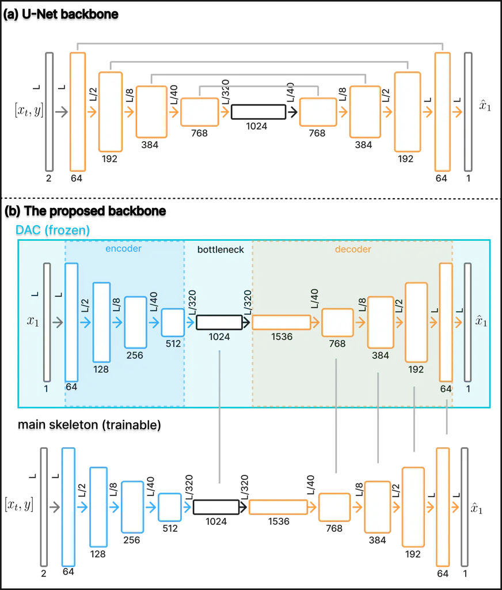

# Beyond U-Net: A Latent-Representation-Aligned Skip-Free Backbone for Flow-Matching Speech Enhancement

Wangyi Pu^(∗)    Michele Scarpiniti ^(†)^(†)thanks: ^(∗) Corresponding
author: wangyi.pu@uniroma1.it.

###### Abstract

Generative models, particularly diffusion and score-based approaches,
have recently achieved strong performance in speech enhancement, but
their iterative sampling process limits real-time deployment. Flow
Matching offers an efficient alternative by transporting noisy speech
toward clean speech through an ordinary differential equation with few
function evaluations. In this work, we propose a skip-free
encoder-decoder backbone for flow-matching speech enhancement, guided by
Latent Representation Alignment (LRA). Instead of relying on U-Net skip
connections, which may transfer noise-correlated low-level features to
the decoder, the proposed model aligns its bottleneck and decoder
representations with clean latent features extracted from a frozen
Descript Audio Codec encoder-decoder without quantization. This
codec-aligned supervision promotes compact clean-speech representations
while preserving efficient few-step inference. Experiments on
WSJ0-CHiME3 and VoiceBank-DEMAND show improved PESQ and perceptual
quality, especially on VoiceBank-DEMAND, using only five function
evaluations.

###### Index Terms: 

Speech enhancement, generative model, flow matching, diffusion model,
latent representation alignment.

^(†)^(†)address: Department of Information Engineering, Electronics and
Telecommunications,  
Sapienza University of Rome, Italy

## 1 INTRODUCTION

The objective of speech enhancement (SE) is to recover clean speech
signals from recordings corrupted by environmental noise \[23, 9\]. In
recent years, generative approaches, including GANs, normalizing flows,
diffusion models, and score-based methods, have shown strong performance
in SE \[2, 24, 4, 27, 20, 19, 16, 7, 8, 15\]. However, diffusion and
score-based models typically require iterative reverse-time sampling,
repeatedly evaluating a deep neural network (DNN) over many
discretization steps. This often results in a high number of function
evaluations (NFE), commonly larger than 25, which can hinder real-time
deployment \[27, 20, 19, 16, 7, 8, 15\]. To reduce this inference cost,
Flow Matching (FM) has recently been introduced for SE, as in FlowSE
\[21, 30, 22, 12, 18\]. By learning a continuous normalizing flow
governed by an ordinary differential equation (ODE) \[5\], FM enables
noisy speech to be transported toward clean speech through a simple
probability path, achieving competitive enhancement quality with as few
as five function evaluations.

Despite these inference speedups, training generative SE models can
remain computationally demanding, with the backbone architecture playing
a key role in convergence and final quality. Although U-Net skip
connections preserve fine acoustic details, they may also transfer
noise-correlated low-level features from the corrupted input to the
decoder \[29\]. This can increase the burden on the decoder, which must
simultaneously suppress residual noise and reconstruct clean speech,
motivating the design of a skip-free backbone guided by clean latent
representations.

To address this limitation, we propose a skip-free encoder-decoder
backbone for FM-based SE. Rather than transferring encoder features
through U-Net skip connections, the proposed model relies on Latent
Representation Alignment (LRA), which supervises the bottleneck and
decoder representations using clean latent features extracted from a
frozen high-fidelity audio codec. In particular, we repurpose the
Descript Audio Codec (DAC) by bypassing its residual vector quantization
stage, thus using it as a continuous acoustic autoencoder for
representation-level supervision during training.

By replacing structural shortcuts with prior-guided latent alignment,
the proposed method mitigates the potential noise leakage of U-Net skip
connections and promotes faster learning of perceptually relevant
clean-speech representations. Experimental results show improved PESQ
and competitive overall performance under an efficient inference setting
with only five function evaluations.



Figure 1: Overview of the proposed codec-aligned skip-free waveform
backbone. (a) The symmetric U-Net baseline takes $`[x_{t},y]`$ as a
2-channel input and uses four skip connections. (b) The proposed
asymmetric skip-free backbone removes skip connections and predicts the
complete clean waveform $`\hat{x}_{1}`$. A frozen DAC without RVQ
provides clean latent targets for LRA.

## 2 BACKGROUND

### 2.1 Problem Formulation

Speech enhancement aims to recover a clean speech signal
$`x_{1}\in\mathbb{R}^{L}`$ from a noisy speech
$`y=x_{1}+n\in\mathbb{R}^{L}`$, where $`n`$ represents additive
environmental noise and $`L`$ denotes the temporal length. In the
context of Flow Matching for SE, we define a continuous-time generative
process over a time variable $`t\in[0,1]`$. The process starts from a
conditional prior centered around the noisy speech,
$`x_{0}\sim p_{0}(x_{0}|y)=\mathcal{N}(y,\sigma^{2}\mathbf{I})`$ \[18,
27\], where $`\sigma\geq 0`$, and evolves toward the clean speech sample
$`x_{1}`$ at $`t=1`$.

### 2.2 Flow Matching for Speech Enhancement

The generative process is governed by an ordinary differential equation
(ODE) defined by a time-dependent vector field $`v_{t}(x_{t}|y)`$:

```math
\frac{dx_{t}}{dt}=v_{t}(x_{t}|y),\qquad x_{0}\sim\mathcal{N}(y,\sigma^{2}\mathbf{I}). \tag{1}
```

Following the FlowSE formulation, we define the conditional probability
path $`p_{t}(x_{t}|x_{1},y)`$ as a Gaussian distribution:

```math
p_{t}(x_{t}|x_{1},y)=\mathcal{N}\!\big(\mu_{t}(x_{1},y),\sigma_{t}^{2}\mathbf{I}\big), \tag{2}
```

whose mean linearly interpolates between the noisy and clean speech
signals, while its standard deviation decreases linearly:

```math
\displaystyle\mu_{t}(x_{1},y) \displaystyle=tx_{1}+(1-t)y, \tag{3}
```

```math
\displaystyle\sigma_{t} \displaystyle=(1-t)\sigma. \tag{4}
```

Accordingly, an intermediate state can be written as
$`x_{t}=\mu_{t}(x_{1},y)+\sigma_{t}\epsilon`$, where
$`\epsilon\sim\mathcal{N}(0,\mathbf{I})`$. Conditional Flow Matching
(CFM) trains a neural network $`v_{\theta}(x_{t},y,t)`$ to match the
target conditional vector field associated with this path:

```math
\mathcal{L}_{CFM}(\theta)=\mathbb{E}_{t,(x_{1},y),p_{0}(x_{0}|y)}\!\left[\left\|v_{\theta}(x_{t},y,t)-v_{t}(x_{t}|x_{1},y)\right\|_{2}^{2}\right], \tag{5}
```

where $`t`$ is sampled from $`[0,1]`$ during the ideal formulation and
from $`[0,1-t\delta]`$ in practice to avoid numerical singularities near
$`t=1`$.

For the Gaussian path above, the derivatives of the mean and standard
deviation are:

```math
\mu^{\prime}_{t}(x_{1},y)=x_{1}-y\quad\text{and}\quad\sigma^{\prime}_{t}=-\sigma. \tag{6}
```

The corresponding conditional vector field is:

```math
v_{t}(x_{t}|x_{1},y)=\mu^{\prime}_{t}(x_{1},y)+\frac{\sigma^{\prime}_{t}}{\sigma_{t}}\big(x_{t}-\mu_{t}(x_{1},y)\big). \tag{7}
```

Substituting derivatives in (6) into (7) yields the closed-form target
field:

```math
v_{t}(x_{t}|x_{1},y)=x_{1}-y-\sigma\epsilon=\frac{x_{1}-x_{t}}{1-t},\quad t<1. \tag{8}
```

At inference time, the enhanced speech signal is obtained by numerically
solving the ODE from $`t=0`$ to $`t=1`$. Starting from
$`x_{t_{0}}\sim\mathcal{N}(y,\sigma^{2}\mathbf{I})`$, the interval
$`[0,1]`$ is discretized into $`N`$ steps ($`0=t_{0}<\cdots<t_{N}=1`$),
and the Euler update is:

```math
x_{t_{i}}=x_{t_{i-1}}+v_{\theta}(x_{t_{i-1}},y,t_{i-1})\Delta t_{i},\quad i=1,\ldots,N, \tag{9}
```

where $`\Delta t_{i}=t_{i}-t_{i-1}`$. The final estimate is given by
$`\hat{x}_{1}=x_{t_{N}}`$.

## 3 PROPOSED METHOD

U-Net skip connections preserve fine acoustic details by transferring
multi-scale encoder features to the decoder but may also carry
noise-correlated low-level features from the corrupted input. Motivated
by this observation, we propose a skip-free encoder-decoder architecture
for flow-matching-based SE. Instead of using structural skip
connections, the proposed model is guided by LRA, a training-time
representation-level supervision mechanism based on a frozen DAC prior.
Unlike STFT-domain generative SE methods \[27, 18\], our framework
operates directly on time-domain waveforms.

### 3.1 $`x`$-Prediction Formulation

The target vector field in (8) motivates an $`x`$-prediction
parameterization, where the network directly estimates the clean
waveform at each timestep $`\hat{x}_{1}=f_{\theta}(x_{t},y,t)`$. The
corresponding velocity used for ODE integration is then recovered as:

```math
v_{\theta}(x_{t},y,t)=\frac{\hat{x}_{1}-x_{t}}{1-t}. \tag{10}
```

This parameterization preserves the flow-matching sampling procedure
while enabling direct waveform-domain, adversarial, and
representation-level supervision. In practice, we train the model using
an unweighted clean-speech prediction loss, which provides a stable
alternative to directly regressing the velocity field near $`t=1`$.

### 3.2 Skip-free Backbone

The proposed backbone consists of a trainable encoder and decoder
without lateral skip connections (see Fig. 1). To facilitate latent
representation alignment, the encoder follows the topology of the DAC
encoder \[14\], with the first layer modified to accept the two-channel
input $`[x_{t},y]\in\mathbb{R}^{2\times L}`$. The signal is processed
through a channel progression from $`2`$ to $`1024`$ using DAC-style
residual units, Snake activations, and strided convolutions with
downsampling factors $`[2,4,5,8]`$. Feature-wise Linear Modulation
(FiLM) layers \[25\] are used to inject timestep embeddings into the
network. The resulting bottleneck representation is denoted as
$`h_{\mathrm{bn}}\in\mathbb{R}^{1024\times L/320}`$.

The decoder follows the corresponding DAC decoder topology and is
initialized from the pre-trained DAC decoder. During training, this
decoder is updated as part of the enhancement network. The residual
vector quantization (RVQ) stage of DAC is bypassed, so that the
architecture operates as a continuous acoustic autoencoder rather than a
discrete codec. This design provides a natural correspondence between
the trainable enhancement network and the frozen DAC encoder-decoder
used as a representation teacher.

### 3.3 Latent Representation Alignment

Removing skip connections increases the information burden on the
bottleneck representation. LRA addresses this issue by aligning the
internal representations of the enhancement network with clean-speech
representations extracted from a frozen DAC model. Let
$`\Phi_{\mathrm{enc}}`$ and $`\Phi_{\mathrm{dec}}`$ denote the frozen
DAC encoder and decoder, respectively. Given the clean waveform
$`x_{1}`$, we first compute the clean codec latent representation
$`z_{1}=\Phi_{\mathrm{enc}}(x_{1})`$. The bottleneck alignment loss is
then defined as:

```math
\mathcal{L}_{\mathrm{bn}}=\mathbb{E}_{t,x_{1},y}\!\left[\left\|P_{\mathrm{bn}}(h_{\mathrm{bn}},t)-z_{1}\right\|_{2}^{2}\right], \tag{11}
```

where $`P_{\mathrm{bn}}`$ is a time-aware projection conditioned on the
timestep embedding via FiLM.

We also distill decoder features from the frozen DAC decoder:

```math
\mathcal{L}_{\mathrm{dec}}=\frac{1}{K}\sum_{k=1}^{K}\mathbb{E}_{t,x_{1},y}\!\left[\left\|P_{\mathrm{dec}}^{(k)}(d_{\theta}^{(k)})-\Phi_{\mathrm{dec}}^{(k)}(z_{1})\right\|_{2}^{2}\right], \tag{12}
```

where $`P_{\mathrm{dec}}^{(k)}`$ denotes a learnable projection head
applied to the $`k`$-th decoder feature prior to alignment, implemented
as a pointwise one-dimensional convolution.

The overall LRA objective combines these terms:

```math
\mathcal{L}_{\mathrm{LRA}}=\mathcal{L}_{\mathrm{bn}}+\eta\mathcal{L}_{\mathrm{dec}}, \tag{13}
```

where $`\eta`$ controls the decoder alignment strength.

### 3.4 Training Objective

The main prediction loss is the unweighted clean-waveform reconstruction
loss:

```math
\mathcal{L}_{x}=\mathbb{E}_{t,x_{1},y}\!\left[\left\|f_{\theta}(x_{t},y,t)-x_{1}\right\|_{2}^{2}\right]. \tag{14}
```

We further use DAC-style multi-period and multi-resolution
discriminators with adversarial loss $`\mathcal{L}_{\mathrm{adv}}`$ and
feature matching loss $`\mathcal{L}_{\mathrm{feat}}`$ \[14\]. The full
objective is:

```math
\mathcal{L}_{\mathrm{total}}=\lambda_{x}\mathcal{L}_{x}+\lambda_{\mathrm{lra}}\mathcal{L}_{\mathrm{LRA}}+\lambda_{\mathrm{adv}}\mathcal{L}_{\mathrm{adv}}+\lambda_{\mathrm{feat}}\mathcal{L}_{\mathrm{feat}}. \tag{15}
```

| Trained and Tested on WSJ0-CHiME3 |     |                           |                           |                           |                           |                           |                           |                           |                            |                            |                            |
| --------------------------------- | --- | ------------------------- | ------------------------- | ------------------------- | ------------------------- | ------------------------- | ------------------------- | ------------------------- | -------------------------- | -------------------------- | -------------------------- |
| Method                            | NFE | PESQ                      | DNSMOS                    | WVMOS                     | ESTOI                     | SIG                       | BAK                       | OVRL                      | SI-SDR                     | SI-SIR                     | SI-SAR                     |
| DAC                               | –   | $`2.36\pm 0.25`$          | $`3.84\pm 0.19`$          | $`3.53\pm 0.30`$          | $`0.83\pm 0.02`$          | $`3.35\pm 0.18`$          | $`4.01\pm 0.16`$          | $`3.03\pm 0.21`$          | $`-22.95\pm 8.29`$         | –                          | –                          |
| FlowSE (U-Net w/o GAN loss)       | 5   | $`2.94\pm 0.54`$          | $`3.84\pm 0.24`$          | $`3.87\pm 0.42`$          | $`\mathbf{0.93\pm 0.05}`$ | $`3.56\pm 0.08`$          | $`4.17\pm 0.04`$          | $`3.33\pm 0.10`$          | $`\mathbf{19.48\pm 4.23}`$ | $`31.30\pm 4.68`$          | $`\mathbf{19.84\pm 4.35}`$ |
| FlowSE (U-Net)                    | 5   | $`3.05\pm 0.50`$          | $`3.98\pm 0.20`$          | $`\mathbf{4.08\pm 0.34}`$ | $`\mathbf{0.93\pm 0.05}`$ | $`\mathbf{3.62\pm 0.08}`$ | $`\mathbf{4.19\pm 0.04}`$ | $`\mathbf{3.38\pm 0.10}`$ | $`19.10\pm 4.09`$          | $`30.22\pm 4.48`$          | $`19.52\pm 4.21`$          |
| FlowSE (LRA, proposed)            | 5   | $`\mathbf{3.06\pm 0.46}`$ | $`\mathbf{4.01\pm 0.18}`$ | $`3.87\pm 0.30`$          | $`\mathbf{0.93\pm 0.05}`$ | $`3.61\pm 0.08`$          | $`4.17\pm 0.05`$          | $`3.37\pm 0.10`$          | $`17.31\pm 2.94`$          | $`\mathbf{32.62\pm 5.20}`$ | $`17.47\pm 2.94`$          |
| Trained and Tested on VB-DMD      |     |                           |                           |                           |                           |                           |                           |                           |                            |                            |                            |
| DAC                               | –   | $`2.97\pm 0.29`$          | $`3.57\pm 0.26`$          | $`4.22\pm 0.27`$          | $`0.85\pm 0.03`$          | $`3.47\pm 0.18`$          | $`4.02\pm 0.14`$          | $`3.17\pm 0.21`$          | $`-13.19\pm 7.52`$         | –                          | –                          |
| FlowSE (U-Net w/o GAN loss)       | 5   | $`2.72\pm 0.60`$          | $`3.38\pm 0.31`$          | $`4.23\pm 0.36`$          | $`0.86\pm 0.10`$          | $`3.45\pm 0.17`$          | $`3.98\pm 0.19`$          | $`3.15\pm 0.22`$          | $`\mathbf{18.75\pm 3.65}`$ | $`\mathbf{31.08\pm 7.54}`$ | $`\mathbf{19.36\pm 3.52}`$ |
| FlowSE (U-Net)                    | 5   | $`2.88\pm 0.59`$          | $`3.46\pm 0.29`$          | $`4.37\pm 0.30`$          | $`\mathbf{0.87\pm 0.09}`$ | $`3.49\pm 0.17`$          | $`3.97\pm 0.20`$          | $`3.17\pm 0.21`$          | $`18.35\pm 3.49`$          | $`28.42\pm 6.14`$          | $`19.19\pm 3.49`$          |
| FlowSE (LRA, proposed)            | 5   | $`\mathbf{3.11\pm 0.63}`$ | $`\mathbf{3.51\pm 0.29}`$ | $`\mathbf{4.41\pm 0.28}`$ | $`\mathbf{0.87\pm 0.09}`$ | $`\mathbf{3.50\pm 0.15}`$ | $`\mathbf{4.00\pm 0.17}`$ | $`\mathbf{3.19\pm 0.20}`$ | $`16.87\pm 2.47`$          | $`28.07\pm 5.53`$          | $`17.49\pm 2.41`$          |

Table 1: Speech Enhancement performance of FlowSE variants on the
WSJ0-CHiME3 and VB-DMD datasets. DAC is reported as a clean-audio
reconstruction reference only and is not included in best-score
highlighting.

## 4 EXPERIMENTS

### 4.1 Datasets

We evaluate our model on two datasets. The WSJ0-CHiME3 dataset mixes
clean Wall Street Journal (WSJ0) speech \[6\] with CHiME3 \[3\] noises
at SNRs drawn from a uniform distribution between 0 and 20 dB, resulting
in 12,777 training, 1,206 validation, and 615 test files.¹¹ 1
https://github.com/sp-uhh/sgmse The publicly available VoiceBank-DEMAND
(VB-DMD) dataset mixes VCTK speech \[31\] with DEMAND noises. Training
SNRs are $`\{0,5,10,15\}`$ dB, and test SNRs are
$`\{2.5,7.5,12.5,17.5\}`$ dB. The training dataset is split into a
training and validation dataset, while speakers “p226” and “p287” are
reserved for validation \[27, 19, 15\].

### 4.2 Experimental Setup

Model Variants & Ablations: We evaluate three variants of our FlowSE
framework: FlowSE (U-Net w/o GANLoss), FlowSE (U-Net), and FlowSE (LRA).
The U-Net variants use a standard U-Net backbone, whereas FlowSE (LRA)
adopts our codec-aligned skip-free backbone, as shown in Fig 1. All
variants directly predict the clean speech
$`\hat{x}_{1}=f_{\theta}(x_{t},y,t)`$. A continuous DAC variant without
codebook quantization is reported separately as a clean-audio
reconstruction reference, rather than as an SE baseline.

Hyperparameters: Models are trained on 2-second segments (32,000
samples) with a batch size of 8. We use Adam optimization \[13\] with a
learning rate set to $`10^{-4}`$. For adversarially trained variants,
the same learning rate is used for both the generator and discriminator.
The Exponential Moving Average (EMA) decay is 0.999. The flow-matching
prior noise standard deviation is $`\sigma=0.487`$, and the integration
margin is set to $`t_{\delta}=0.03`$ to prevent numerical instability.
All models are trained until the validation PESQ and SI-SDR curves
plateau.

Loss Weights: Corresponding to Section 3.4, the waveform prediction
weight is set to $`\lambda_{x}=0.1`$ for all FlowSE variants. For FlowSE
(U-Net w/o GANLoss), adversarial and feature-matching losses are
disabled, i.e., $`\lambda_{\mathrm{adv}}=\lambda_{\mathrm{feat}}=0`$.
For FlowSE (U-Net) and FlowSE (LRA), we set
$`\lambda_{\mathrm{adv}}=1.0`$ and $`\lambda_{\mathrm{feat}}=2.0`$. For
FlowSE (LRA), the overall LRA weight is $`\lambda_{\mathrm{lra}}=1.0`$
and the decoder-level strength is $`\eta=1.0`$.

### 4.3 Evaluation Metrics

Performance is assessed using WB-PESQ \[10\], Deep Noise Suppression MOS
(DNSMOS) \[28\], wav2vec MOS (WVMOS) \[1\], Extended Short-Time
Objective Intelligibility (ESTOI) \[11\], DNSMOS P.835 (SIG, BAK, OVRL)
\[26\], and Scale-Invariant metrics (SI-SDR, SI-SIR, SI-SAR) \[17\].

Figure 2: Evolution of PESQ (left) and SI-SDR (right) metrics over
training epochs on the test dataset of VB-DMD

## 5 NUMERICAL RESULTS

Table 1 and Fig. 2 summarize the quantitative results and training
dynamics of the considered FlowSE variants.

Effect of adversarial training: Comparing FlowSE (U-Net w/o GAN loss)
with FlowSE (U-Net), adversarial training improves perceptual quality on
both datasets. On WSJ0-CHiME3, PESQ increases from $`2.94`$ to $`3.05`$,
while WVMOS improves from $`3.87`$ to $`4.08`$. A similar trend is
observed on VB-DMD, where PESQ increases from $`2.72`$ to $`2.88`$ and
WVMOS from $`4.23`$ to $`4.37`$. This improvement in perceptual metrics
is accompanied by a slight reduction in SI-SDR-related scores. Such a
trade-off is consistent with the behavior of adversarial objectives,
which tend to favor perceptual realism over strict waveform-level
reconstruction.

Effect of LRA: Replacing the U-Net backbone with the proposed skip-free
LRA backbone leads to clear perceptual improvements on VB-DMD and
competitive performance on WSJ0-CHiME3. On VB-DMD, FlowSE (LRA,
proposed) improves PESQ from $`2.88`$ to $`3.11`$ with respect to FlowSE
(U-Net), while also achieving the best DNSMOS, WVMOS, SIG, BAK, and OVRL
scores among the FlowSE variants. On WSJ0-CHiME3, the gain is more
moderate: LRA slightly improves PESQ and DNSMOS, while the U-Net
baseline remains better in WVMOS and SI-SDR-related metrics. These
results suggest that LRA is particularly beneficial when the
codec-derived clean latent prior provides an effective representation of
the target speech distribution.

Training dynamics: Fig. 2 shows that the proposed LRA backbone reaches
high perceptual quality with fewer training epochs than the U-Net
baseline. This suggests that aligning the bottleneck and decoder
features with clean codec representations provides useful
representation-level guidance during training. In contrast to structural
skip connections, which may also transfer noise-correlated encoder
features, LRA encourages the model to rely on compact clean-speech
representations.

Role of the DAC reference: The DAC row is reported only as a clean-audio
reconstruction reference and should not be interpreted as a
speech-enhancement baseline. Its performance indicates the quality of
the frozen codec prior used for representation alignment. On VB-DMD,
where the DAC reconstruction metrics are stronger, LRA brings a larger
improvement over the U-Net backbone. On WSJ0-CHiME3, the weaker DAC
reconstruction metrics are consistent with the smaller gains observed
for LRA. Importantly, FlowSE (LRA, proposed) outperforms the DAC
reference in PESQ on both datasets, indicating that the proposed model
does not merely reproduce the codec output, but combines codec-guided
representation learning with the flow-matching enhancement objective.

## 6 CONCLUSION

In this paper, we proposed a codec-aligned skip-free encoder-decoder
backbone for flow-matching-based speech enhancement. The proposed
architecture removes conventional U-Net skip connections and compensates
for the resulting information bottleneck through Latent Representation
Alignment with a frozen continuous audio codec prior. By aligning
bottleneck and decoder features with clean codec representations, the
model is encouraged to learn compact clean-speech representations rather
than relying on low-level structural shortcuts. Experiments on
WSJ0-CHiME3 and VoiceBank-DEMAND show that the proposed method achieves
competitive or improved perceptual quality under an efficient inference
regime with only five function evaluations. Future work will investigate
adaptive weighting of the alignment losses, extension to complex
STFT-domain enhancement, and more detailed analysis of the relationship
between codec latent quality and enhancement performance.

## References

- \[1\] P. Andreev, A. Alanov, O. Ivanov, and D. Vetrov (2023) HiFi++: a
  unified framework for bandwidth extension and speech enhancement. In
  2023 IEEE International Conference on Acoustics, Speech and Signal
  Processing (ICASSP 2023), Cited by: §4.3.
- \[2\] D. Baby and S. Verhulst (2019) Sergan: speech enhancement using
  relativistic generative adversarial networks with gradient penalty. In
  2019 IEEE International Conference on Acoustics, Speech and Signal
  Processing (ICASSP 2019), pp. 106–110. Cited by: §1.
- \[3\] J. Barker, R. Marxer, E. Vincent, and S. Watanabe (2015) The
  third ‘CHiME’ speech separation and recognition challenge: dataset,
  task and baselines. In Proceedings of the IEEE Workshop on Automatic
  Speech Recognition and Understanding (ASRU), pp. 504–511. Cited by:
  §4.1.
- \[4\] X. Bie, S. Leglaive, X. Alameda-Pineda, and L. Girin (2022)
  Unsupervised speech enhancement using dynamical variational
  autoencoders. IEEE/ACM Transactions on Audio, Speech, and Language
  Processing 30, pp. 2993–3007. Cited by: §1.
- \[5\] R. T. Q. Chen, Y. Rubanova, J. Bettencourt, and D. K.
  Duvenaud (2018) Neural ordinary differential equations. In Advances in
  Neural Information Processing Systems (NeurIPS 2018), Vol. 31. Cited
  by: §1.
- \[6\] J. S. Garofolo, D. Graff, D. Paul, and D. Pallett (1993) CSR-I
  (WSJ0) Complete. Note: Online Cited by: §4.1.
- \[7\] P. Gonzalez, Z.-H. Tan, J. Østergaard, J. Jensen, T. S. Alstrøm,
  and T. May (2024) Diffusion-based speech enhancement in matched and
  mismatched conditions using a Heun-based sampler. In 2024 IEEE
  International Conference on Acoustics, Speech and Signal Processing
  (ICASSP 2024), pp. 10431–10435. Cited by: §1.
- \[8\] Z. Guo, Q. Wang, J. Du, J. Pan, Q.-F. Liu, and C.-H. Lee (2024)
  A variance-preserving interpolation approach for diffusion models with
  applications to single channel speech enhancement and recognition.
  IEEE/ACM Transactions on Audio, Speech, and Language Processing 32,
  pp. 3025–3038. Cited by: §1.
- \[9\] R. C. Hendriks, T. Gerkmann, and J. Jensen (2022) DFT-domain
  based single-microphone noise reduction for speech enhancement.
  Springer Nature. Cited by: §1.
- \[10\] International Telecommunication Union (2007) Wideband extension
  to recommendation P.862 for the assessment of wideband telephone
  networks and speech codec. Technical report Technical Report
  Recommendation P.862.2, ITU-T, Geneva. Cited by: §4.3.
- \[11\] J. Jensen and C. H. Taal (2016) An algorithm for predicting the
  intelligibility of speech masked by modulated noise maskers. IEEE/ACM
  Transactions on Audio, Speech, and Language Processing 24 (11),
  pp. 2009–2022. Cited by: §4.3.
- \[12\] C. Jung, S. Lee, J.-H. Kim, and J. S. Chung (2024) FlowAVSE:
  efficient audio-visual speech enhancement with conditional flow
  matching. In Interspeech 2024, pp. 2210–2214. Cited by: §1.
- \[13\] D. P. Kingma and J. Ba (2015) Adam: a method for stochastic
  optimization. In 6th International Conference on Learning
  Representations (ICLR 2015), Cited by: §4.2.
- \[14\] R. Kumar, P. Seetharaman, A. Luebs, I. Kumar, and K.
  Kumar (2023) High-fidelity audio compression with improved RVQGAN. In
  Proceedings of the 37th International Conference on Neural Information
  Processing Systems (NIPS ’23), Cited by: §3.2, §3.4.
- \[15\] B. Lay, J.-M. Lemercier, J. Richter, and T. Gerkmann (2024)
  Single and few-step diffusion for generative speech enhancement. In
  2024 IEEE International Conference on Acoustics, Speech and Signal
  Processing (ICASSP 2024), pp. 626–630. Cited by: §1, §4.1.
- \[16\] B. Lay, S. Welker, J. Richter, and T. Gerkmann (2023) Reducing
  the prior mismatch of stochastic differential equations for
  diffusion-based speech enhancement. In Interspeech, Cited by: §1.
- \[17\] J. Le Roux, S. Wisdom, H. Erdogan, and J. R. Hershey (2019)
  SDR–half-baked or well done?. In 2019 IEEE International Conference on
  Acoustics, Speech and Signal Processing (ICASSP 2019), pp. 626–630.
  Cited by: §4.3.
- \[18\] S. Lee, S. Cheong, S. Han, and J. W. Shin (2025) FlowSE: flow
  matching-based speech enhancement. In 2025 IEEE International
  Conference on Acoustics, Speech and Signal Processing (ICASSP 2025),
  External Links:
  [Document](https://dx.doi.org/10.1109/ICASSP49660.2025.10888274) Cited
  by: §1, §2.1, §3.
- \[19\] J.-M. Lemercier, J. Richter, S. Welker, and T. Gerkmann (2023)
  StoRM: a diffusion-based stochastic regeneration model for speech
  enhancement and dereverberation. IEEE/ACM Transactions on Audio,
  Speech, and Language Processing. Cited by: §1, §4.1.
- \[20\] J. Lemercier, J. Richter, S. Welker, and T. Gerkmann (2023)
  Analysing diffusion-based generative approaches versus discriminative
  approaches for speech restoration. In 2023 IEEE International
  Conference on Acoustics, Speech and Signal Processing (ICASSP 2023),
  pp. 1–5. Cited by: §1.
- \[21\] Y. Lipman, R. T. Q. Chen, H. Ben-Hamu, M. Nickel, and M.
  Le (2023) Flow matching for generative modeling. In The Eleventh
  International Conference on Learning Representations (ICLR 2023),
  Cited by: §1.
- \[22\] A. H. Liu, M. Le, A. Vyas, B. Shi, A. Tjandra, and W.-N.
  Hsu (2024) Generative pre-training for speech with flow matching. In
  12th International Conference on Learning Representations (ICLR 2024),
  Cited by: §1.
- \[23\] P. C. Loizou (2007) Speech enhancement: theory and practice.
  CRC press. Cited by: §1.
- \[24\] A. A. Nugraha, K. Sekiguchi, and K. Yoshii (2020) A flow-based
  deep latent variable model for speech spectrogram modeling and
  enhancement. IEEE/ACM Transactions on Audio, Speech, and Language
  Processing 28, pp. 1104–1117. Cited by: §1.
- \[25\] E. Perez, F. Strub, H. de Vries, V. Dumoulin, and A.
  Courville (2018) FiLM: visual reasoning with a general conditioning
  layer. In Proceedings of the AAAI Conference on Artificial
  Intelligence, Vol. 32. Cited by: §3.2.
- \[26\] C. K. Reddy, V. Gopal, and R. Cutler (2022) DNSMOS P.835: a
  non-intrusive perceptual objective speech quality metric to evaluate
  noise suppressors. In 2022 IEEE International Conference on Acoustics,
  Speech, and Signal Processing (ICASSP 2022), pp. 886–890. Cited by:
  §4.3.
- \[27\] J. Richter, S. Welker, J. Lemercier, B. Lay, and T.
  Gerkmann (2023) Speech enhancement and dereverberation with
  diffusion-based generative models. IEEE/ACM Transactions on Audio,
  Speech, and Language Processing 31, pp. 2351–2364. Cited by: §1, §2.1,
  §3, §4.1.
- \[28\] O. F. Salas, V. Adzic, and H. Kalva (2013) Subjective quality
  evaluations using crowdsourcing. In 2013 Picture Coding Symposium
  (PCS), pp. 418–421. Cited by: §4.3.
- \[29\] C. Si, Z. Huang, Y. Jiang, and Z. Liu (2024) FreeU: free lunch
  in diffusion U-Net. In Proceedings of the IEEE/CVF Conference on
  Computer Vision and Pattern Recognition (CVPR), pp. 4733–4743. Cited
  by: §1.
- \[30\] A. Tong, K. Fatras, N. Malkin, G. Huguet, Y. Zhang, J.
  Rector-Brooks, G. Wolf, and Y. Bengio (2024) Improving and
  generalizing flow-based generative models with minibatch optimal
  transport. Transactions on Machine Learning Research. Cited by: §1.
- \[31\] C. Veaux, J. Yamagishi, and S. King (2013) The voice bank
  corpus: design, collection and data analysis of a large regional
  accent speech database. In 2013 International Conference Oriental
  COCOSDA held jointly with 2013 Conference on Asian Spoken Language
  Research and Evaluation (O-COCOSDA/CASLRE), pp. 1–4. Cited by: §4.1.
