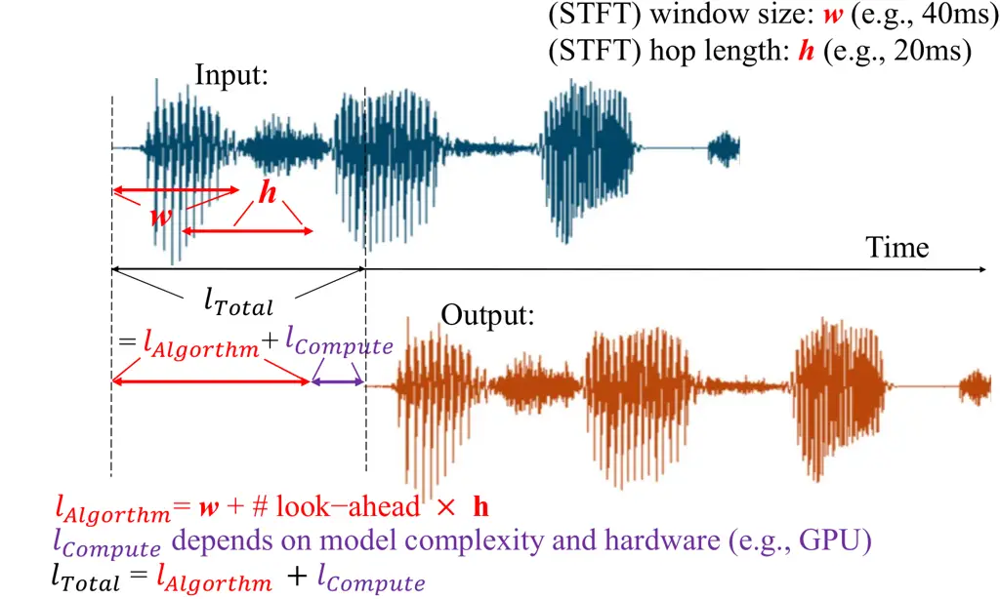
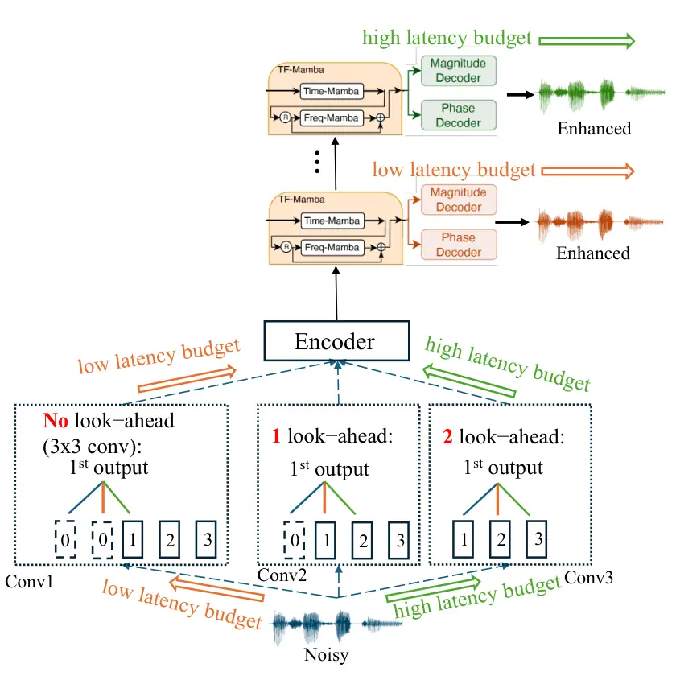

# One Model, Many Latencies: Universal Speech Enhancement for Diverse Real-Time Applications

Szu-Wei Fu¹, Rong Chao², Xuesong Yang¹, Sung-Feng Huang¹,  
Ante Jukić¹, Yu Tsao², Yu-Chiang Frank Wang¹ Affiliation: 
Affiliation: ¹NVIDIA Affiliation:  Affiliation: ²Academia Sinica,
Taipei, Taiwan

###### Abstract

Different real-time speech applications impose distinct latency budgets,
often requiring separately trained enhancement models for each scenario.
In this paper, we propose a one-for-all, real-time universal speech
enhancement model that provides explicit control over both algorithmic
and computational latency. Algorithmic latency is flexibly adjusted via
configurable look-ahead frames. To avoid learning inefficiency caused by
varying padding configurations, we introduce parallel convolutional
layers corresponding to different look-ahead settings. Computational
latency is controlled through an early-exit mechanism, enabling
inference at different network depths. To narrow the performance gap
between specialized and flexible models, we propose a two-stage training
strategy with a shared-to-multiple decoder transition. Overall, the
proposed framework enables a single model to be deployed across diverse
latency budgets without retraining separate models. Model weights are
available for download at:
[https://huggingface.co/nvidia/Real-time_RE-USE](https://huggingface.co/nvidia/Real-time_RE-USE)

###### Index Terms: 

universal speech enhancement, real-time processing, latency budget

## I Introduction

Recent studies in speech enhancement (SE) have increasingly moved beyond
task-specific approaches toward unified models that generalize across
heterogeneous domains \[1, 2, 3, 4, 5, 6, 7\]. In this context,
universal speech enhancement (USE) seeks to improve intelligibility and
perceptual quality under diverse degradation conditions while preserving
intrinsic attributes such as speaker identity, emotion, and accent.
Although Miipher-2 \[6\], and RE-USE \[8\] have demonstrated
effectiveness in improving training data quality for other speech
generative models (e.g., text-to-speech), their non-causal architectures
limit their applicability to real-time scenarios.

The total latency of a real-time speech enhancement model is the sum of
algorithmic latency and computational latency, as illustrated in
Figure 1. Algorithmic latency refers to the amount of input required by
the model to produce the first output unit. For frequency-domain–based
USE models, the algorithmic latency equals the STFT window size $`w`$
plus the product of the look-ahead frames and the hop size $`h`$.
Computational latency denotes the time required by the model to generate
an output after receiving the necessary input data, and it depends on
both model complexity and the computational capability of the deployment
hardware.



Fig. 1: The latency of a speech enhancement system can be categorized
into algorithmic latency and computational latency.

Unlike the restoration of pre-recorded speech, which prioritizes output
quality over latency constraints, real-time speech enhancement must
operate under strict latency budgets. These constraints vary across
applications: interactive speech applications such as conversational
VoIP typically tolerate 50–150 ms \[9\], while streaming ASR systems
generally operate within latency budgets of 100–200 ms \[10\]. Beyond
different latency budget considerations, computational latency is
influenced by the computational power of the deployment hardware (see
Figure 1). These factors prevent a single causal model from being
suitable across different applications. Accordingly, this paper aims to
develop a training method that allows a single model to accommodate
varying deployment conditions, such as latency constraints and hardware
specifications.

To enable a single streaming ASR model to support various latency
settings, \[11\] proposed a multiple look-ahead training strategy by
randomly sampling the chunk size. An effective strategy for reducing
computational latency is early exit \[12\], a training paradigm that
enables a network to produce predictions at intermediate layers rather
than only at the final layer, allowing the model to seamlessly adapt to
different deployment conditions during inference. In the context of
speech enhancement, several studies \[13, 14, 15, 16, 17, 18\] have
adopted early-exit mechanisms to build flexible models. Nevertheless,
most of them focus primarily on designing the exit criteria. For
example, Li et al. \[13\] and Chen et al. \[14\] explored exit
strategies based on the similarity between outputs of consecutive
layers, using predefined thresholds to determine when to exit. Beyond
dynamically adjusting the model depth, \[17\] introduces FlexAttention
to enable flexible control over model width.

Although early-exit can adjust computational latency during inference,
algorithmic latency remains fixed. In this paper, we propose a
one-for-all, real-time, streamable USE model that not only handles
diverse degradation conditions but also provides explicit control over
algorithmic latency via flexible look-ahead frames, thereby enabling
adaptable total latency and facilitating deployment across a wide range
of latency budgets.

## II From Offline to Real-Time Speech Enhancement

Before presenting our proposed method, this section outlines the
constraints that a real-time SE model must satisfy, based on the total
latency definition illustrated in Figure 1. Some of these constraints
are often overlooked in prior studies. Specifically, real-time SE models
must meet the following three requirements:

1\. Causality: The model architecture should be causal or allow only a
limited number of look-ahead frames.

2\. Latency budget ($`l_{\text{budget}}`$): The total latency must not
exceed the application-specific latency budget (examples are discussed
in Section I):

```math
l_{\text{Total}}\leq l_{\text{budget}}. \tag{1}
```

3\. Real-time processing: To prevent latency from accumulating over
time, the computation time per processing step must be shorter than the
corresponding hop size $`h`$ (i.e., the real-time factor (RTF) must be
less than 1):

```math
l_{\text{Compute}}\leq h. \tag{2}
```

As noted by \[19\], some prior studies may report RTF measured under
offline processing, where whole utterances are processed at once. This
setting exploits time-dimension parallelism and highly optimized
large-tensor CUDA kernels, and thus can substantially underestimate the
true RTF in streaming inference, obscuring whether a method is
practically real-time.

## III Proposed Method

### III-A Adjustable Algorithmic Latency

To enable adjustable algorithmic latency during inference, it is more
practical to control the number of look-ahead frames rather than
modifying the STFT window size or hop length. In practice, the number of
look-ahead frames can be determined by appropriately setting the left
and right padding of the convolutional layers. For example, consider a
convolutional layer with a kernel size of 3. To achieve 0, 1, and 2
look-ahead frames, the (left padding, right padding) number can be set
to (2, 0), (1, 1), and (0, 2), respectively. However, since convolution
is translation equivariant (i.e., if $`f`$ is a convolution operation
and $`T`$ is a translation (shift) operator: $`f(T(x))=T(f(x))`$), using
a single convolutional layer with varying padding configurations may
disrupt the following sequence modeling and thereby reduce the model’s
learning efficiency (see the green learning curve corresponding to the
UTMOS score on the validation set in Figure 3. Detailed experimental
settings are provided in Section IV).

To address this issue, inspired by the mixture-of-experts (MoE)
paradigm, we employ parallel convolutional layers, each corresponding to
a specific number of look-ahead frames (i.e., a particular padding
configuration). During training, a convolutional layer is randomly
sampled to construct the computational graph. Unlike conventional MoE
models, our framework does not require a learned routing mechanism, as
the expert selection is explicitly determined by the user based on the
latency budget, as illustrated in Fig. 2.



Fig. 2: Our proposed one-for-all model enables adjustable algorithmic
latency through configurable look-ahead frames and computational latency
via early exit. For example, under a low-latency budget, inference can
follow the orange arrows.

Fig. 3: Learning curves of UTMOS scores on the validation set under
different model architectures.

### III-B Two-Stage Training for Early-Exit Optimization

Although the early-exit mechanism enables flexible inference at
different network depths, each intermediate layer represents a
compromise, as it must accommodate the requirements of subsequent
layers. Consequently, its performance lags behind that of a model
optimized for a fixed output depth. One possible remedy is to assign
separate decoders to different intermediate layers. However, in the
initial experiments on early-exit training, we found that sharing a
single decoder across all intermediate layers is more effective, as it
enforces a consistent representation space. In contrast, using
independent decoders for each layer hinders model learning, as shown in
the blue line in Figure 3.

To address this issue and allow each output layer to learn
layer-specific parameters, we adopt a two-stage training framework:

1.  1.  Shared Decoder Stage: We first train the model with a shared
        decoder. In each training step, the exit layers are randomly
        sampled.
2.  2.  Multiple Decoder Stage: After convergence in the first stage, we
        instantiate independent decoders for each output layer, initializing
        their weights from the shared decoder. During this stage, the
        modules preceding the decoders (i.e., the encoder and sequence
        modeling module) are fine-tuned with a smaller learning rate.

This setting keeps the intermediate layers within a similar
representation space while allowing sufficient flexibility to optimize
their own outputs.

## IV Experiments

|                           |               |       |       |           |                                                                  |           |      |           |              |            |
| ------------------------- | ------------- | ----- | ----- | --------- | ---------------------------------------------------------------- | --------- | ---- | --------- | ------------ | ---------- |
| Method                    | Non-intrusive |       |       | Intrusive |                                                                  | Task-ind. |      | Task-dep. | Latency (ms) |            |
|                           | DNSMOS        | NISQA | UTMOS | PESQ      | ESTOI                                                            | SBERT     | LPS  | CAcc      | Algo.        | Comp.      |
| Noisy                     | 1.84          | 1.69  | 1.56  | 1.34      | 0.50                                                             | 0.74      | 0.61 | 81.29     | \-           | \-         |
| Baseline                  | 2.94          | 2.89  | 2.11  | \-        | \-                                                               | \-        | \-   | 84.96     | non-causal   | non-causal |
|                           |               |       |       |           | Exit layer=4, Look-ahead=0 (2.0M parameters, MACs (G/s)=19.15)   |           |      |           |              |            |
| Specialized (upper bound) | 3.05          | 3.65  | 2.26  | 2.06      | 0.68                                                             | 0.82      | 0.76 | 82.75     | 40           | 10.09      |
| Early-exit                | 3.03          | 3.57  | 2.19  | 2.02      | 0.67                                                             | 0.82      | 0.75 | 81.13     | 40           | 10.09      |
| +Parallel conv. (MoE)     | 2.96          | 3.52  | 2.16  | 2.00      | 0.67                                                             | 0.82      | 0.75 | 81.69     | 40           | 10.09      |
| +Multiple dec. stage      | 2.98          | 3.41  | 2.19  | 2.02      | 0.67                                                             | 0.82      | 0.75 | 81.86     | 40           | 10.09      |
|                           |               |       |       |           | Exit layer=8, Look-ahead=0 (2.9M parameters, MACs (G/s)=25.41)   |           |      |           |              |            |
| Specialized (upper bound) | 3.10          | 3.77  | 2.36  | 2.19      | 0.71                                                             | 0.84      | 0.78 | 83.71     | 40           | 18.31      |
| Early-exit                | 3.08          | 3.77  | 2.32  | 2.13      | 0.70                                                             | 0.83      | 0.77 | 81.84     | 40           | 18.31      |
| +Parallel conv. (MoE)     | 3.04          | 3.73  | 2.28  | 2.13      | 0.70                                                             | 0.83      | 0.77 | 82.72     | 40           | 18.31      |
| +Multiple dec. stage      | 3.07          | 3.62  | 2.31  | 2.15      | 0.70                                                             | 0.84      | 0.77 | 83.10     | 40           | 18.31      |
|                           |               |       |       |           | Exit layer=8, Look-ahead=1 (2.9M parameters, MACs (G/s)=25.41)   |           |      |           |              |            |
| Specialized (upper bound) | 3.15          | 3.90  | 2.42  | 2.27      | 0.72                                                             | 0.85      | 0.79 | 84.93     | 60           | 18.31      |
| Early-exit                | N/A           | N/A   | N/A   | N/A       | N/A                                                              | N/A       | N/A  | N/A       | N/A          | N/A        |
| +Parallel conv. (MoE)     | 3.10          | 3.82  | 2.34  | 2.21      | 0.71                                                             | 0.84      | 0.79 | 84.06     | 60           | 18.31      |
| +Multiple dec. stage      | 3.13          | 3.74  | 2.37  | 2.24      | 0.72                                                             | 0.84      | 0.79 | 84.62     | 60           | 18.31      |
|                           |               |       |       |           | Exit layer=12, Look-ahead=0 (3.7M parameters, MACs (G/s)=31.67)) |           |      |           |              |            |
| Specialized (upper bound) | 3.10          | 3.76  | 2.37  | 2.21      | 0.71                                                             | 0.84      | 0.78 | 84.24     | 40           | 25.05      |
| Early-exit                | 3.10          | 3.81  | 2.34  | 2.14      | 0.70                                                             | 0.84      | 0.77 | 82.62     | 40           | 25.05      |
| +Parallel conv. (MoE)     | 3.07          | 3.78  | 2.31  | 2.15      | 0.70                                                             | 0.83      | 0.77 | 82.93     | 40           | 25.05      |
| +Multiple dec. stage      | 3.11          | 3.70  | 2.34  | 2.17      | 0.70                                                             | 0.84      | 0.78 | 83.25     | 40           | 25.05      |

TABLE I: Non-blind test set results of the URGENT 2025 Challenge. Algo.
and Comp. denote algorithmic and computational latency, respectively.
Algorithmic latency is computed as
$`40\,\mathrm{ms}+(\#\,\text{look\mbox{-}ahead}\times 20\,\mathrm{ms})`$.
Computational latency is evaluated on an NVIDIA A100 GPU with 16 kHz
input speech.

### IV-A Dataset

Following the setup of the URGENT 2025 Challenge \[20\], the training
dataset consists of multi-condition speech recordings in five languages
(English, German, French, Spanish, and Chinese), covering a wide range
of sampling rates (8, 16, 22.05, 24, 32, 44.1, and 48 kHz). In addition
to clean speech, the dataset includes noise samples and room impulse
responses (RIRs). Seven types of degradations are considered: additive
noise, reverberation, clipping, bandwidth limitation, codec artifacts,
packet loss, and wind noise. The validation set is simulated according
to the organizers’ guidelines using the validation splits of the
underlying corpora \[20\]. The final model checkpoint is selected based
on the UTMOS \[21\] score on the validation set. For evaluation, we use
the non-blind URGENT 2025 test set, which contains 1,000 utterances.

### IV-B Model Architecture

Our model architecture largely follows USEMamba \[22, 23\] and RE-USE
\[8\], as Mamba \[24\] supports RNN-like inference and hence is
well-suited for real-time deployment. Considering computational latency
constraints, we set the maximum number of Mamba layers to 12 (total 3.7M
parameters). To ensure causality or allow only a limited number of
look-ahead frames, we introduce the following modifications: (1)
replacing standard convolutions with causal convolutions (we explicitly
control the number of look-ahead frames by using different amounts of
left padding in the first convolutional layer); (2) substituting the
bidirectional temporal Mamba with a unidirectional variant; and (3)
replacing instance normalization with layer normalization applied only
along the channel dimension.

Unlike RE-USE \[8\], which employs an additional generative model to
refine the regression output and achieve a favorable fidelity–quality
trade-off, we reduce computational latency by approximating the process
of ‘optimally transporting the posterior mean (MMSE estimate) toward the
true data distribution’ through a two-stage training strategy:
regression loss pre-training followed by adversarial loss fine-tuning
guided by a set of discriminators.

To enable a single model to operate across different sampling rates, we
adopt sampling frequency-independent (SFI) STFT \[25\], which adjusts
the FFT window and hop size according to the input sampling rate while
maintaining a fixed time duration. Specifically, we use a 40 ms window
and a 20 ms hop for all sampling rates, ensuring an integer number of
frequency bins. Therefore, the resulting algorithmic latency is 40 ms
plus the number of look-ahead frames multiplied by 20 ms. During
training, we randomly sample the exit layer from 3 to 12 and the number
of look-ahead frames from 0 to 2.

We use AdamW with a learning rate of 0.0002 for model training, and set
the learning rate to one-tenth of this value for the modules preceding
the decoders during the Multiple Decoder Stage.

### IV-C Evaluation Metrics

To jointly assess perceptual quality and signal fidelity, we employ a
diverse set of evaluation metrics. Reference-based metrics include PESQ
for perceptual quality \[26\], ESTOI for intelligibility \[27\].
Downstream performance is evaluated using task-independent
metrics—SpeechBERTScore (SBERT) \[28\] and Levenshtein Phoneme
Similarity (LPS) \[29\]—as well as task-dependent metrics, character
accuracy (CAcc) of an ASR  \[30\]. Finally, non-intrusive perceptual
quality is measured using DNSMOS \[31\], NISQA \[32\], and UTMOS \[21\].
Note that, following the setup in RE-USE \[8\], we compute the scores
using anechoic clean speech as the reference, rather than
early-reflected speech as adopted by the Challenge organizers.

For latency calculation, algorithmic latency is computed as
$`40\,\mathrm{ms}+(\#\,\text{look\mbox{-}ahead}\times 20\,\mathrm{ms})`$,
while computational latency is evaluated on an NVIDIA A100 GPU using 16
kHz input speech. We also evaluated the latency on NVIDIA 3090 and 4090
GPUs and observed results within a similar range. Following \[19\],
computational latency is measured under online processing (i.e.,
per-frame computation). However, unlike \[19\], we do not apply
torch.compile or CUDA graphs to further optimize latency measurement.

### IV-D Results on the non-Blind URGENT 2025 Test Set

Owing to the flexibility of our proposed one-for-all framework in
controlling both algorithmic and computational latency, the model
supports 30 different latency configurations, corresponding to 10 exit
layers (from 3 to 12) and 3 look-ahead settings (from 0 to 2). In
Table I, we present representative results of our method and compare
them with noisy speech, the non-causal baseline TF-GridNet \[33\] from
the URGENT 2025 Challenge (which uses early-reflected speech as the
learning target), as well as specialized models and early-exit. The
specialized model can be regarded as a performance upper bound, but does
not provide any latency flexibility. Note that for the 12-layer model,
the computational latency is 25 ms, which exceeds the hop size of 20 ms,
resulting in an RTF of 1.25. This means it cannot satisfy real-time
processing requirements (see Section II) on an NVIDIA A100 GPU, and a
faster GPU would be needed to achieve real-time performance.

As shown in Table I and discussed in Section III-B, while early-exit
enables flexible control of computational latency, its enhancement
performance typically falls short of the specialized model. Our proposed
method (Parallel conv. (MoE)), which introduces parallel convolutional
layers to control the number of look-ahead frames, achieves performance
comparable to early-exit while additionally providing flexibility in
controlling algorithmic latency. The proposed two-stage training
framework (Multiple dec. stage), incorporating the multiple-decoder
stage, consistently improves most evaluation metrics—most notably CAcc
(with the exception of NISQA)—and effectively narrows the performance
gap with the specialized model. Note that the results for the
conventional early-exit model with (Exit Layer = 8, Look-ahead = 1) are
marked as N/A, since the conventional early-exit method does not support
adjusting the algorithmic latency.

(b) CAcc vs. Total latency

(a) UTMOS vs. Total latency

Fig. 4: Relationship between performance metrics and total latency. Our
one-for-all model supports 30 distinct latency configurations (results
for exit layers 3, 5, 7, 9, and 11 are omitted for brevity).

|                                       |      |       |        |                                          |        |
| ------------------------------------- | ---- | ----- | ------ | ---------------------------------------- | ------ |
| Method                                | PESQ | ESTOI | SI-SDR | $`\mathbf{\ell_{\text{Algorithm}}}`$(ms) | Params |
| Noisy                                 | 1.97 | 0.79  | 08.4   | \-                                       | \-     |
| Diffusion Buffer \[34\]               | 2.45 | 0.84  | 14.5   | 176                                      | 22.2M  |
| DEMUCS \[35\]                         | 2.60 | 0.85  | 15.1   | 41                                       | 33.5M  |
| DeepFilterNet3 \[36\]                 | 2.71 | 0.84  | 17.3   | 40                                       | 2.14M  |
| Stream.FM \[19\]                      | 2.72 | 0.85  | 13.4   | 32                                       | 52.5M  |
| Proposed (exit layer=8, look-ahead=0) | 2.76 | 0.86  | 18.6   | 40                                       | 2.9M   |
| Proposed (exit layer=8, look-ahead=1) | 2.82 | 0.86  | 18.8   | 60                                       | 2.9M   |

TABLE II: Real-time speech enhancement results on the VoiceBank-DEMAND
benchmark. To evaluate generalization across datasets, none of the
models (except DEMUCS) are trained on the VoiceBank-DEMAND training set.

In Fig. 4, we present performance evaluation over a finer grid of total
latency. Note that our one-for-all model supports 30 distinct latency
configurations; results for exit layers 3, 5, 7, 9, and 11 are omitted
for brevity. From the figure, we observe that for UTMOS, performance
gains from additional look-ahead frames are less pronounced than those
achieved by increasing the model depth. On the other hand, for ASR
accuracy, introducing one look-ahead frame substantially improves
performance, while adding a second look-ahead frame yields only marginal
additional gains.

### IV-E Comparison with Other Real-Time Speech Enhancement Models

To the best of our knowledge, no prior open-source work has proposed a
real-time universal speech enhancement model capable of handling complex
degradations and inputs with varying sampling rates, as required in the
URGENT Challenge setting. Therefore, to enable comparison with existing
real-time speech enhancement models, we evaluate our approach on the
widely used VoiceBank-DEMAND benchmark \[37\], as shown in Table II.

For the baselines and to evaluate generalization across datasets, we use
DEMUCS \[35\], DeepFilterNet3 \[36\], Diffusion Buffer \[34\], and
Stream.FM \[19\], with most results directly taken from \[19\]. Note
that, consistent with our setting, there is a mismatch between the
training and testing data, as none of the compared models (except
DEMUCS) are trained on the VoiceBank-DEMAND training set. For our
proposed model, we first set the exit layer to 8 and the look-ahead to 0
to achieve a comparable algorithmic latency to DEMUCS, DeepFilterNet3,
and Stream.FM. Compared with these models, our method achieves the
highest PESQ, ESTOI, and SI-SDR \[38\]. We also observe that the
enhanced speech produced by our model often sounds cleaner than the
corresponding clean ground truth. In our model, setting the look-ahead
to 1 increases the algorithmic latency but consistently improves all
evaluation metrics, demonstrating the flexibility of our framework.

### IV-F Practical Deployment

Users can download the model and evaluate the total latency across
different early-exit layers and look-ahead configurations on their own
hardware, according to their specific latency budgets. Once the most
suitable setting is identified, they can retain only the layers up to
the selected exit point and the convolutional branch corresponding to
the chosen look-ahead frames. In this way, the resulting model has the
same size as a specialized model, without any additional footprint.

Note that computational latency must satisfy the constraints in both
Equations (1) and (2), whereas algorithmic latency is governed only by
Equation (1). Therefore, if users have limited computational resources,
they can simply consider increasing the number of look-ahead frames.

## V Future work

In this paper, we focus on training a flexible one-for-all model that
can be readily deployed under diverse conditions. Techniques such as
pruning and quantization offer promising directions for accelerating
inference and can be naturally combined with our framework. Another
avenue for future work is to further reduce the performance gap between
shallow and deep outputs. In particular, knowledge distillation
strategies, inspired by recent large-to-small language model
compression, may be explored to enhance the performance of shallower
exits.

## VI Conclusion

We propose a one-for-all, real-time universal speech enhancement
framework that explicitly controls both algorithmic and computational
latency within a single model. By introducing parallel convolutional
layers, we enable flexible adjustment of look-ahead frames for
algorithmic latency control, while the early-exit mechanism allows
dynamic control of computational latency through variable network depth.
To mitigate the performance gap between flexible and specialized models,
we further developed a two-stage training strategy with a
shared-to-multiple decoder transition, which effectively stabilizes
learning and improves intermediate-layer performance. Experimental
results on the URGENT 2025 Challenge dataset demonstrate that the
proposed framework supports 30 distinct latency configurations while
maintaining performance close to specialized models. These results show
that a single model can adapt to diverse real-time applications without
retraining separate models.

## VII Generative AI Use Disclosure

Generative AI was used only for editing and polishing this manuscript.

## References

- \[1\] H. Liu, Q. Kong, Q. Tian, Y. Zhao, D. Wang, C. Huang, and Y.
  Wang (2021) VoiceFixer: toward general speech restoration with neural
  vocoder. arXiv preprint arXiv:2109.13731. Cited by: §I.
- \[2\] J. Serrà, S. Pascual, J. Pons, R. O. Araz, and D. Scaini (2022)
  Universal speech enhancement with score-based diffusion. arXiv
  preprint arXiv:2206.03065. Cited by: §I.
- \[3\] X. Li, Q. Wang, and X. Liu (2024) MaskSR: masked language model
  for full-band speech restoration. In Proc. Interspeech, pp. 2275–2279.
  Cited by: §I.
- \[4\] N. Babaev, K. Tamogashev, A. Saginbaev, I. Shchekotov, H.
  Bae, H. Sung, W. Lee, H. Cho, and P. Andreev (2024) FINALLY: fast and
  universal speech enhancement with studio-like quality. In Neural
  Information Processing Systems, Vol. 37, pp. 934–965. Cited by: §I.
- \[5\] J. Zhang, J. Yang, Z. Fang, Y. Wang, Z. Zhang, Z. Wang, F. Fan,
  and Z. Wu (2025) AnyEnhance: a unified generative model with
  prompt-guidance and self-critic for voice enhancement. IEEE/ACM
  Transactions on Audio, Speech, and Language Processing. Cited by: §I.
- \[6\] S. Karita, Y. Koizumi, H. Zen, H. Ishikawa, R. Scheibler, and M.
  Bacchiani (2025) Miipher-2: a universal speech restoration model for
  million-hour scale data restoration. In IEEE WASPAA, Cited by: §I.
- \[7\] W. Nakata, Y. Saito, Y. Ueda, and H. Saruwatari (2026) Sidon:
  fast and robust open-source multilingual speech restoration for
  large-scale dataset cleansing. In IEEE International Conference on
  Acoustics, Speech and Signal Processing (ICASSP), Cited by: §I.
- \[8\] S. Fu, R. Chao, X. Yang, S. Huang, R. E. Zezario, R.
  Nasretdinov, A. Jukić, Y. Tsao, and Y. F. Wang (2026) Rethinking
  training targets, architectures and data quality for universal speech
  enhancement. arXiv preprint arXiv:2603.02641. Cited by: §I, §IV-B,
  §IV-B, §IV-C.
- \[9\] D. R. Kuhn, T. J. Walsh, and S. Fries (2005) Security
  considerations for voice over IP systems. NIST special publication 800. Cited by: §I.
- \[10\] X. Song, D. Wu, Z. Wu, B. Zhang, Y. Zhang, Z. Peng, W. Li, F.
  Pan, and C. Zhu (2023) Trimtail: Low-latency streaming ASR with simple
  but effective spectrogram-level length penalty. In IEEE International
  Conference on Acoustics, Speech and Signal Processing (ICASSP), Cited
  by: §I.
- \[11\] V. Noroozi, S. Majumdar, A. Kumar, J. Balam, and B.
  Ginsburg (2024) Stateful conformer with cache-based inference for
  streaming automatic speech recognition. In IEEE International
  Conference on Acoustics, Speech and Signal Processing (ICASSP), Cited
  by: §I.
- \[12\] S. Teerapittayanon, B. McDanel, and H. Kung (2016) Branchynet:
  fast inference via early exiting from deep neural networks. In IEEE
  international conference on pattern recognition (ICPR), Cited by: §I.
- \[13\] A. Li, C. Zheng, L. Zhang, and X. Li (2021) Learning to
  inference with early exit in the progressive speech enhancement. In
  IEEE European Signal Processing Conference (EUSIPCO), Cited by: §I.
- \[14\] S. Chen, Y. Wu, Z. Chen, T. Yoshioka, S. Liu, J. Li, and X.
  Yu (2021) Don’t shoot butterfly with rifles: multi-channel continuous
  speech separation with early exit transformer. In IEEE International
  Conference on Acoustics, Speech and Signal Processing (ICASSP), Cited
  by: §I.
- \[15\] S. Kim and M. Kim (2022) Bloom-net: blockwise optimization for
  masking networks toward scalable and efficient speech enhancement. In
  IEEE International Conference on Acoustics, Speech and Signal
  Processing (ICASSP), Cited by: §I.
- \[16\] R. Miccini, A. Zniber, C. Laroche, T. Piechowiak, M.
  Schoeberl, L. Pezzarossa, O. Karrakchou, J. Sparsø, and M.
  Ghogho (2023) Dynamic nsNet2: efficient deep noise suppression with
  early exiting. In IEEE International Workshop on Machine Learning for
  Signal Processing (MLSP), Cited by: §I.
- \[17\] L. Feng, C. Zhang, and X. Zhang (2025) Towards a flexible and
  unified architecture for speech enhancement. Vicinagearth 2 (1),
  pp. 14. Cited by: §I.
- \[18\] K. F. Olsen, M. Østergaard, K. Ulbæk, S. F. Nielsen, R. M. H.
  Lindrup, B. S. Jensen, and M. Mørup (2025) Knowing when to quit:
  probabilistic early exits for speech separation. arXiv preprint
  arXiv:2507.09768. Cited by: §I.
- \[19\] S. Welker, B. Lay, M. Hillemann, T. Peer, and T.
  Gerkmann (2025) Real-time streamable generative speech restoration
  with flow matching. arXiv preprint arXiv:2512.19442. Cited by: §II,
  §IV-C, §IV-E, TABLE II.
- \[20\] K. Saijo, W. Zhang, S. Cornell, R. Scheibler, C. Li, Z. Ni, A.
  Kumar, M. Sach, Y. Fu, W. Wang, et al. (2025) Interspeech 2025 URGENT
  speech enhancement challenge. In Proc. Interspeech, pp. 858–862. Cited
  by: §IV-A.
- \[21\] T. Saeki, D. Xin, W. Nakata, T. Koriyama, S. Takamichi, and H.
  Saruwatari (2022) UTMOS: utokyo-sarulab system for VoiceMOS challenge 2022. arXiv preprint arXiv:2204.02152. Cited by: §IV-A, §IV-C.
- \[22\] R. Chao, R. Nasretdinov, Y. F. Wang, A. Jukic, S. Fu, and Y.
  Tsao (2025) Universal speech enhancement with regression and
  generative Mamba. In Proc. Interspeech, pp. 888–892. External Links:
  ISSN 2958-1796 Cited by: §IV-B.
- \[23\] R. Chao, W. Cheng, M. L. Quatra, S. M. Siniscalchi, C. H.
  Yang, S. Fu, and Y. Tsao (2024) An investigation of incorporating
  Mamba for speech enhancement. In IEEE Spoken Language Technology
  Workshop (SLT), Vol. , pp. 302–308. Cited by: §IV-B.
- \[24\] A. Gu and T. Dao (2024) Mamba: linear-time sequence modeling
  with selective state spaces. In conference on language modeling
  (COLM), Cited by: §IV-B.
- \[25\] W. Zhang, K. Saijo, Z. Wang, S. Watanabe, and Y. Qian (2023)
  Toward universal speech enhancement for diverse input conditions. In
  IEEE Automatic Speech Recognition and Understanding Workshop (ASRU),
  pp. 1–6. Cited by: §IV-B.
- \[26\] A. W. Rix, J. G. Beerends, M. P. Hollier, and A. P.
  Hekstra (2001) Perceptual evaluation of speech quality (PESQ)-a new
  method for speech quality assessment of telephone networks and codecs.
  In IEEE International Conference on Acoustics, Speech and Signal
  Processing (ICASSP), Cited by: §IV-C.
- \[27\] J. Jensen and C. H. Taal (2016) An algorithm for predicting the
  intelligibility of speech masked by modulated noise maskers. IEEE/ACM
  Transactions on Audio, Speech, and Language Process. 24 (11),
  pp. 2009–2022. Cited by: §IV-C.
- \[28\] T. Saeki, S. Maiti, S. Takamichi, S. Watanabe, and H.
  Saruwatari (2024) SpeechBERTScore: reference-aware automatic
  evaluation of speech generation leveraging NLP evaluation metrics. In
  Proc. Interspeech, pp. 4943–4947. Cited by: §IV-C.
- \[29\] J. Pirklbauer, M. Sach, K. Fluyt, W. Tirry, W. Wardah, S.
  Moeller, and T. Fingscheidt (2023) Evaluation metrics for generative
  speech enhancement methods: issues and perspectives. In IEEE Speech
  Communication; 15th ITG Conference, pp. 265–269. Cited by: §IV-C.
- \[30\] Y. Peng, J. Tian, W. Chen, S. Arora, B. Yan, Y. Sudo, M.
  Shakeel, K. Choi, J. Shi, X. Chang, et al. (2024) Owsm v3.1: better
  and faster open whisper-style speech models based on e-branchformer.
  In Proc. Interspeech, Cited by: §IV-C.
- \[31\] C. K. A. Reddy, V. Gopal, and R. Cutler (2022) DNSMOS P.835: a
  non-intrusive perceptual objective speech quality metric to evaluate
  noise suppressors. In IEEE International Conference on Acoustics,
  Speech and Signal Processing (ICASSP), Vol. , pp. 886–890. Cited by:
  §IV-C.
- \[32\] G. Mittag, B. Naderi, A. Chehadi, and S. Möller (2021) NISQA: a
  deep cnn-self-attention model for multidimensional speech quality
  prediction with crowdsourced datasets. In Proc. Interspeech,
  pp. 2127–2131. Cited by: §IV-C.
- \[33\] Z. Wang, S. Cornell, S. Choi, Y. Lee, B. Kim, and S.
  Watanabe (2023) TF-GridNet: integrating full-and sub-band modeling for
  speech separation. IEEE/ACM Transactions on Audio, Speech, and
  Language Processing 31, pp. 3221–3236. Cited by: §IV-D.
- \[34\] B. Lay, R. Makarov, S. Welker, M. Hillemann, and T.
  Gerkmann (2025) Diffusion buffer for online generative speech
  enhancement. arXiv preprint arXiv:2510.18744. Cited by: §IV-E, TABLE
  II.
- \[35\] A. Defossez, G. Synnaeve, and Y. Adi (2020) Real time speech
  enhancement in the waveform domain. In Proc. Interspeech, Cited by:
  §IV-E, TABLE II.
- \[36\] H. Schröter, T. Rosenkranz, A. N. Escalante-B, and A.
  Maier (2023) DeepFilterNet: perceptually motivated real-time speech
  enhancement. In Proc. Interspeech, Cited by: §IV-E, TABLE II.
- \[37\] C. V. Botinhao, X. Wang, S. Takaki, and J. Yamagishi (2016)
  Investigating RNN-based speech enhancement methods for noise-robust
  text-to-speech. In 9th ISCA speech synthesis workshop, pp. 159–165.
  Cited by: §IV-E.
- \[38\] J. Le Roux, S. Wisdom, H. Erdogan, and J. R. Hershey (2019)
  SDR-half-baked or well done?. In IEEE International Conference on
  Acoustics, Speech and Signal Processing (ICASSP), Cited by: §IV-E.
