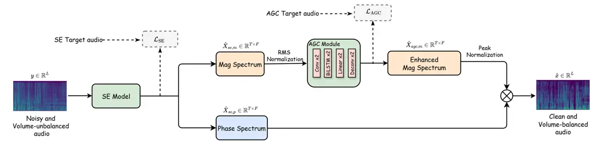

Zhang Rao Zhong Chng

# SE-AGCNet: An End-to-End Framework for Joint Speech Enhancement and Loudness Control in Meeting Scenarios

Jinming    Wei    Xionghu    Eng Siong

###### Abstract

Conventional audio pipelines typically treat speech enhancement (SE) and
automatic gain control (AGC) as discrete modules, which often limits
overall performance. For instance, applying AGC before SE may
inadvertently amplify background noise, while prioritizing SE tends to
over-suppress low-volume speech. To address these limitations, we
propose SE-AGCNet, an end-to-end framework that jointly optimizes SE and
AGC. Tailored for meeting scenarios with significant volume variations,
SE-AGCNet leverages the synergy between the two tasks: SE preserves
quiet speech, thereby facilitating effective volume adjustment by the
AGC component. Furthermore, we propose a specialized data simulation
pipeline, SE-AGC-DataGen, and incorporate standardized loudness
evaluation metrics: integrated loudness (LUFS), short-term loudness (St
LUFS), and LRA. Experiments show that SE-AGCNet consistently achieves
target loudness while improving speech quality and ASR accuracy over
competitive baselines.

###### keywords

Speech Enhancement, Automatic Gain Control, Joint Training, Meeting Room
Acoustics

^(†)^(†)address: ¹ Zhejiang University, China  
² Nanyang Technological University, Singapore  
³ Hunan University, China ^(†)^(†)email: pmhuan1212@gmail.com,
aseschng@ntu.edu.sg

## 1 Introduction

The audio front-end is traditionally characterized by the ”3A
algorithms”: Acoustic Echo Cancellation (AEC), Noise Suppression (also
referred to as speech enhancement), and Automatic Gain Control (AGC).
Conventional audio pipelines typically implement AGC \[1, 2, 3, 4, 5, 6,
7, 8, 9, 10, 11, 12\] and Speech Enhancement (SE) \[13, 14, 15\] as
separate, cascaded modules, a design that introduces several
limitations. When AGC precedes SE, it amplifies speech and noise
indiscriminately, thereby reducing the signal-to-noise ratio and
complicating subsequent denoising. When applied after SE, AGC
performance becomes highly dependent on SE quality, as residual noise is
often unintentionally amplified. A further challenge arises from SE
models’ tendency to over-suppress low-volume speech.

Jointly training SE and AGC provides a principled solution to the
limitations of cascaded pipelines. Through simultaneous optimization,
the SE module is encouraged to preserve low-volume speech while
concentrating on noise suppression, with the assurance that volume
normalization will be managed by the AGC module. This synergistic
framework mitigates two key issues: it reduces the risk of SE
misclassifying far-field or quiet speech as noise, and it prevents AGC
from inadvertently amplifying residual background noise.

Recent studies have attempted to integrate AEC, SE, and AGC within
unified frameworks. For example, \[16\] introduced a unified 3A
framework but treated AGC merely as a detached post-processing module
without specifying its underlying algorithm. Similarly, \[17\] explored
the joint training of AEC, SE, and AGC. However, their AGC targets were
generated by a proprietary in-house AGC tool, which may cap the model’s
achievable performance and hinder reproducibility.

To address these limitations, this paper proposes SE-AGCNet, a
deep-learning-based framework for joint SE and AGC. The proposed
approach is designed for meeting-room scenarios, where audio quality is
often degraded by background noise, reverberation, and volume
discrepancies arising from differences in distance from the microphone,
variations in speaking style, and head movements or shifts in body
position. Experimental results demonstrate that SE-AGCNet achieves
superior performance in both SE and AGC tasks, as well as in downstream
Automatic Speech Recognition (ASR) tasks, achieving significant
reductions in WER/CER while maintaining optimal loudness characteristics
compared with conventional methods.

Our main contributions are summarized as follows:

- •
  We propose SE-AGCNet¹¹ 1 Code and demo:
  https://jinming00.github.io/SE-AGCNet/, a flexible framework for
  joint, end-to-end training of SE and AGC. This framework supports
  integration with diverse existing speech enhancement architectures.
- •
  We propose SE-AGC-DataGen, a comprehensive and reproducible data
  simulation pipeline that addresses the lack of publicly available AGC
  datasets and enables joint SE-AGC training.
- •
  We introduce standardized loudness evaluation metrics (integrated
  loudness (LUFS), short-term loudness (St LUFS), and Loudness Range
  (LRA)) based on ITU-R BS.1770 \[18\] and EBU R128 \[19\] to enable
  more objective and perceptually meaningful evaluation of AGC
  performance.



Figure 1: Overview of SE-AGCNet architecture. The system processes input
audio through speech enhancement and automatic gain control modules in a
joint training framework. SE Target Audio: clean and volume-unbalanced
speech for SE module training; AGC Target Audio: clean and
volume-balanced speech for AGC module training.

## 2 Proposed SE-AGCNet

Figure 1 illustrates the SE-AGCNet architecture. Our approach employs a
two-stage architecture that jointly optimizes speech enhancement and
automatic gain control in the time-frequency domain, transforming a
noisy and volume-unbalanced speech waveform $`y\in\mathbb{R}^{L}`$ into
a clean and volume-balanced output $`\hat{x}\in\mathbb{R}^{L}`$, where
$`L`$ denotes the waveform length.

Specifically, we first extract the magnitude spectrum
$`Y_{m}\in\mathbb{R}^{T\times F}`$ and phase spectrum
$`Y_{p}\in\mathbb{R}^{T\times F}`$ from the input waveform $`y`$ through
STFT, where $`T`$ and $`F`$ denote the number of frames and frequency
bins, respectively. The speech enhancement module processes the noisy
input to produce enhanced magnitude spectrum
$`\hat{X}_{se,m}\in\mathbb{R}^{T\times F}`$ and enhanced phase spectrum
$`\hat{X}_{se,p}\in\mathbb{R}^{T\times F}`$:

```math
\hat{X}_{se,m},\hat{X}_{se,p}=\text{SE}(Y_{m},Y_{p};\theta_{se}) \tag{1}
```

where $`\theta_{se}`$ denotes the speech enhancement model parameters.
The enhanced magnitude spectrum is subsequently RMS-normalized and
processed by the AGC module to generate a volume-balanced magnitude
spectrum:

```math
\hat{X}_{agc,m}=\text{AGC}(\text{RMS-norm}(\hat{X}_{se,m});\theta_{agc}) \tag{2}
```

where $`\theta_{agc}`$ denotes the AGC module parameters. Finally, the
enhanced and volume-balanced waveform $`\hat{x}`$ is reconstructed via
ISTFT using the AGC-processed magnitude spectrum and the enhanced phase
from the SE module.

SE-AGCNet addresses two fundamental challenges: (1) the SE module
performs noise suppression while preserving low-volume speech; and (2)
the AGC module handles loudness adjustment. Through joint training,
these modules operate synergistically in an end-to-end optimization
framework.

### 2.1 Speech Enhancement Model

We adopt MP-SENet as the SE backbone and keep its original architecture
and training setup (16 kHz sampling rate, 400-sample STFT window,
100-sample hop size, 400-point FFT, and 2-second training segments).

Our only modification is an asymmetric reweighting strategy \[20\].
Specifically, the MP-SENet loss definition remains unchanged, but for
each time-frequency bin $`(t,f)`$, if the predicted magnitude is lower
than the target magnitude (i.e.,
$`\hat{X}_{se,m}^{t,f}<X_{se,target,m}^{t,f}`$), we multiply the
corresponding SE loss contribution by $`\alpha=10.0`$; otherwise, we
keep its original weight. This imposes a $`10\times`$ stronger penalty
on over-suppression.

During SE training, the target is clean but volume-unbalanced speech, so
the model learns noise suppression while preserving loudness variation
for the downstream AGC module.

### 2.2 AGC Module

The AGC module performs volume adjustment by processing the
RMS-normalized enhanced magnitude spectrum from MP-SENet to produce
volume-balanced outputs.

#### 2.2.1 Architecture Design

The AGC module takes the RMS-normalized enhanced magnitude spectrum
$`\hat{X}_{se,m}^{norm}\in\mathbb{R}^{T\times F}`$ from the SE module as
input and produces volume-balanced magnitude spectrum
$`\hat{X}_{agc,m}\in\mathbb{R}^{T\times F}`$ as output. During training,
the AGC target audio is the clean and volume-balanced magnitude spectrum
$`X_{agc,target,m}`$.

The AGC module consists of three components: frequency-domain
convolutional processing, bidirectional LSTM processing, and spectral
reconstruction. The frequency-domain component extracts features through
two 2D convolution layers:

```math
H_{1}=\text{ReLU}(\text{BN}(\text{Conv2D}(\hat{X}_{se,m}^{norm}))) \tag{3}
```

```math
H_{conv}=\text{ReLU}(\text{BN}(\text{Conv2D}(H_{1}))) \tag{4}
```

where $`H_{conv}\in\mathbb{R}^{T\times F\times 16}`$ represents
frequency-aware features extracted by 16-channel convolutions with
$`3\times 3`$ kernels. The bidirectional LSTM processes temporal
sequences by reshaping the features to $`(T,F\times 16)`$ and using a
2-layer BiLSTM with hidden size 256 per direction. The LSTM output is
then projected back to $`F\times 16`$ through linear layers before
reconstruction. Finally, the reconstruction component employs transposed
convolutions:

```math
\hat{X}_{agc,m}=\text{ReLU}(\text{ConvT}(\text{ReLU}(\text{BN}(\text{ConvT}(H_{lstm}))))) \tag{5}
```

with progressive channel reduction ensuring non-negative magnitude
outputs.

#### 2.2.2 Normalization Strategy

The AGC module employs independent RMS normalization for both input and
target during training, enabling the model to learn relative amplitude
control rather than absolute values. The AGC processing includes peak
normalization to 0.4 to achieve the target loudness of -23 LUFS. Since
the AGC module precisely controls amplitude variations including sudden
spikes, this peak normalization remains stable and avoids the common
issue where peak normalization reduces legitimate speech to extremely
low levels due to spike interference.

#### 2.2.3 Training Objectives and Strategy

To suppress noise amplification in silent target regions, we apply
conditional weighting to the AGC loss, following the same reweighting
principle used in the SE module:

```math
\displaystyle\mathcal{L}_{\mathrm{AGC}}=\frac{1}{TF}\sum_{t=1}^{T}\sum_{f=1}^{F}w_{t,f}\left|\hat{X}_{agc,m}^{t,f}-X_{agc,target,m}^{t,f}\right| \tag{6}
```

```math
\displaystyle w_{t,f}=\begin{cases}10,&\text{if }X_{agc,target,m}^{t,f}=0\land\hat{X}_{agc,m}^{t,f}>0\\
1,&\text{otherwise}\end{cases} \tag{7}
```

where $`(t,f)`$ denotes the time-frequency bin index,
$`\hat{X}_{agc,m}`$ is the AGC output magnitude spectrum, and
$`X_{agc,target,m}`$ is the target magnitude spectrum. This mechanism
applies a $`10\times`$ stronger penalty when the AGC predicts positive
energy in silent target regions, suppressing noise amplification.

The final training objective is defined as:

```math
\mathcal{L}_{\mathrm{total}}=\mathcal{L}_{\mathrm{MP-SENet}}+\lambda_{\mathrm{AGC}}\times\mathcal{L}_{\mathrm{AGC}} \tag{8}
```

where $`\mathcal{L}_{\mathrm{MP-SENet}}`$ denotes the original MP-SENet
multi-loss configuration with the asymmetric reweighting strategy
described above, and $`\lambda_{\mathrm{AGC}}=0.9`$, which is consistent
with the magnitude-loss weight in MP-SENet.

To ensure stability, we adopt a curriculum learning strategy: the
MP-SENet module is pre-trained for 5 epochs using SE targets before
jointly optimizing the entire framework.

## 3 SE-AGC-DataGen Data Simulation Pipeline

Since no publicly available dataset exists for AGC tasks, we develop a
comprehensive data simulation pipeline that generates multi-speaker
audio with realistic volume variations and acoustic conditions. We
create one simulated dataset, LibriAGC, for training and evaluation.
LibriTTS \[21\] is used as our base data source, as it contains
relatively volume-balanced clean speech suitable for controlled volume
variation simulation.

Our simulation process consists of three stages: Stage 1: We concatenate
clean speech segments from 2-5 speakers. Stage 2: We apply a two-layer
volume processing mechanism that includes basic volume adjustment (100%
original or reduced to 5%-30%) and four audio augmentation modes (sudden
spikes, gradual increase/decrease, and volume fluctuations, each applied
with 15% probability). These augmentation modes simulate real-world
scenarios where volume variations occur due to speaker emotions,
changing distances from microphones, recording equipment
characteristics, and audio clipping artifacts encountered in meeting
scenarios. Stage 3: We specially select 35 noise clips from the DNS
Challenge noise set and mix them at 5–25 dB SNR to mimic meeting-room
acoustics, including common noises such as fan hum, keyboard typing,
door sounds, and chair movement.

For training targets, we generate two reference signals from different
processing stages: the SE target is clean but volume-unbalanced speech
from Stage 2, used to train the speech enhancement module; the AGC
target is clean and volume-balanced speech from Stage 1, used to train
the AGC module. In Table 2, Ref denotes this AGC target, while Input
denotes the simulated noisy and volume-unbalanced audio after Stage 3.

Following the SE-AGC-DataGen pipeline, we construct one simulated
dataset for training and evaluation: LibriAGC, built from
LibriTTS-train-clean-100 (train) and LibriTTS-test-clean (test). The
final dataset contains 9,487 training utterances (54 hours) and 1,406
test utterances (8 hours). The effectiveness of this simulation pipeline
is further validated in the real-world evaluation results in
Section 4.5.

|                  |        |         |       |
| ---------------- | ------ | ------- | ----- |
| Dataset          | LUFS   | St LUFS | LRA   |
| VoiceBank+DEMAND | -23.38 | -25.06  | 3.68  |
| LibriTTS         | -23.95 | -24.77  | 4.33  |
| MMCSG            | -40.24 | -45.92  | 20.21 |
| AliMeeting-far   | -34.89 | -37.40  | 12.08 |

Table 1: Loudness statistics of high-quality clean speech datasets and
raw real-world recordings. For VoiceBank+DEMAND and LibriTTS, we
concatenate 2–5 clean utterances to form clips of at least 10 s and
report LUFS, St LUFS, and LRA (LU).

|                    |                   |                     |       |      |      |                     |      |      |        |         |       |                        |                        |
| ------------------ | ----------------- | ------------------- | ----- | ---- | ---- | ------------------- | ---- | ---- | ------ | ------- | ----- | ---------------------- | ---------------------- |
| System             | PESQ $`\uparrow`$ | SIGMOS $`\uparrow`$ |       |      |      | DNSMOS $`\uparrow`$ |      |      | LUFS   | St LUFS | LRA   | WER^(a) $`\downarrow`$ | WER^(b) $`\downarrow`$ |
|                    |                   | SIG                 | NOISE | LOUD | OVRL | SIG                 | BAK  | OVRL |        |         |       |                        |                        |
| Ref                | \-                | 3.53                | 3.78  | 3.91 | 3.13 | 3.64                | 4.08 | 3.36 | -22.75 | -23.36  | 4.21  | 2.40                   | 3.69                   |
| Input              | 1.33              | 2.87                | 2.55  | 3.18 | 2.41 | 3.34                | 2.89 | 2.57 | -24.12 | -28.95  | 14.87 | 10.67                  | 21.61                  |
| MP-SENet (Orig)    | 1.55              | 3.36                | 4.00  | 3.50 | 2.98 | 3.44                | 3.93 | 3.10 | -23.90 | -30.61  | 18.69 | 21.26                  | 27.16                  |
|    + pyagc         | 1.63              | 3.18                | 3.61  | 3.50 | 2.84 | 3.49                | 3.77 | 3.10 | -23.03 | -23.29  | 3.77  | 20.09                  | 23.15                  |
| MP-SENet (SE)^(†)  | 2.18              | 3.38                | 3.99  | 3.47 | 2.98 | 3.52                | 4.10 | 3.24 | -23.76 | -30.52  | 18.61 | 7.61                   | 11.20                  |
|    + pyagc         | 2.69              | 3.25                | 3.58  | 3.47 | 2.89 | 3.56                | 4.05 | 3.29 | -20.88 | -21.10  | 3.49  | 7.09                   | 9.35                   |
| MP-SENet (AGC)^(†) | 2.80              | 3.35                | 3.68  | 3.86 | 2.94 | 3.55                | 4.09 | 3.29 | -24.74 | -26.19  | 8.32  | 7.69                   | 10.61                  |
| SE-AGCNet^(†)      | 3.00              | 3.38                | 3.68  | 3.87 | 2.99 | 3.60                | 4.11 | 3.35 | -23.66 | -23.93  | 3.86  | 6.88                   | 9.12                   |

Table 2: Evaluation on LibriAGC test set: LUFS/St LUFS, LRA (LU), WER
(%). AGC metrics meeting the target requirements (LUFS and St LUFS
around -23, LRA between 3-6 LU) are underlined, while the best results
for other metrics are bolded. Ref: Clean and volume-balanced reference;
Input: Noisy and volume-unbalanced input. Models marked with $`\dagger`$
are re-trained on LibriAGC dataset. ^(a)Whisper-large-v3-turbo \[22\];
^(b)nvidia/stt_en_conformer_ctc_large \[23\].

|                    |        |         |       |                        |                        |                |         |       |                        |
| ------------------ | ------ | ------- | ----- | ---------------------- | ---------------------- | -------------- | ------- | ----- | ---------------------- |
| System             | MMCSG  |         |       |                        |                        | AliMeeting-far |         |       |                        |
|                    | LUFS   | St LUFS | LRA   | WER^(a) $`\downarrow`$ | WER^(b) $`\downarrow`$ | LUFS           | St LUFS | LRA   | CER^(a) $`\downarrow`$ |
| Noisy              | -40.24 | -45.92  | 20.21 | 15.12                  | 51.36                  | -34.89         | -37.40  | 12.08 | 36.16                  |
| MP-SENet (Orig)    | -38.86 | -45.23  | 23.15 | 46.74                  | 52.80                  | -40.35         | -47.12  | 22.67 | 81.91                  |
|    + pyagc         | -29.91 | -30.42  | 5.72  | 44.25                  | 50.72                  | -34.78         | -35.41  | 6.38  | 79.98                  |
| MP-SENet (SE)^(†)  | -39.07 | -45.16  | 20.83 | 14.41                  | 50.85                  | -35.66         | -38.25  | 12.36 | 38.95                  |
|    + pyagc         | -23.74 | -24.08  | 4.65  | 14.06                  | 34.91                  | -28.98         | -29.13  | 2.83  | 36.78                  |
| MP-SENet (AGC)^(†) | -47.57 | -53.08  | 19.72 | 15.19                  | 51.92                  | -32.58         | -34.66  | 11.66 | 43.06                  |
| SE-AGCNet^(†)      | -22.68 | -23.04  | 4.80  | 13.86                  | 30.36                  | -22.89         | -23.20  | 4.26  | 34.43                  |

Table 3: Evaluation on real-world datasets: LUFS/St LUFS, LRA (LU), WER
(%), CER (%). Models marked with $`\dagger`$ are re-trained on LibriAGC
dataset.

## 4 Experimental Setup and Results

### 4.1 Datasets

We use the following datasets in our experiments:
VoiceBank+DEMAND \[24\], which is used in Section 4.2 as a clean-speech
loudness reference (Table 1); LibriAGC, a simulated dataset described in
Section 3; and two real-world datasets, MMCSG \[25\], a CHiME-8
challenge dataset with two-person conversation recordings using Aria
glasses (evaluation set: 189 files, 9.4 hours), and
AliMeeting-far \[26\], the far-field speech portion from AliMeeting test
set (20 files, 10.8 hours). For multi-channel audio, we use the first
channel for evaluation. Both real-world datasets exhibit significant
volume imbalance due to varying speaker distances and acoustic
conditions.

### 4.2 Evaluation Metrics

Subjective metrics: We use SIGMOS \[27\] and DNSMOS \[28\] for
perceptual quality assessment. SIGMOS includes loudness MOS, making it
particularly well-suited for AGC evaluation.

Objective metrics: Speech quality is also assessed using PESQ. For
speech recognition performance, we compute WER and CER to evaluate the
impact on downstream applications.

AGC-specific metrics: We introduce standardized loudness metrics based
on ITU-R BS.1770 standards and EBU R128 recommendations to evaluate AGC
performance. These metrics address limitations of conventional
approaches like absolute gain and RMS that may not accurately reflect
AGC effectiveness.

LUFS (Loudness Units relative to Full Scale): LUFS provides a
perceptually-weighted loudness measure that better correlates with human
auditory perception than traditional RMS measurements. We set the target
loudness to -23 LUFS by following the EBU R128 loudness normalization
recommendation. We then analyze the loudness statistics of two
high-quality clean speech datasets using VoiceBank+DEMAND train-clean
and LibriTTS test-clean to verify this setting. Table 1 shows that their
mean LUFS values are close to -23 LUFS with moderate LRA, supporting -23
LUFS as a reasonable loudness target for clear speech. In contrast, raw
real-world recordings (MMCSG and AliMeeting-far) exhibit substantially
lower loudness and much larger LRA, motivating the need for AGC;
SE-AGCNet restores their loudness to the target range as reported in
Table 3.

St LUFS (Short-term LUFS): Standard LUFS employs gating mechanisms that
exclude relatively very quiet audio segments, which can produce biased
measurements in meeting room scenarios where near-field and far-field
speech should be treated equally. For example, in Table 2, despite
significant volume variations being applied, the LUFS difference between
Ref and Input is modest due to the gating effect. To address this
limitation, we utilize Short-term LUFS, defined as loudness measurements
using a 3-second sliding window with a 1-second hop, averaged across the
entire audio segment. This approach reduces gating influence and
provides more physically accurate loudness estimation. For effective AGC
evaluation, we require both LUFS and St LUFS to achieve values around
-23.

LRA (Loudness Range): LRA quantifies the dynamic range of an audio
signal based on short-term LUFS. Extremely high LRA indicates severe
volume imbalance, while excessively low LRA may result in
over-compressed audio with reduced dynamics. Based on our reference
audio analysis, we consider LRA values between 3-6 LU as optimal for
volume-balanced speech with appropriate dynamic range preservation.

### 4.3 Baseline Systems

We compare SE-AGCNet against several baselines:

MP-SENet (Orig): The original MP-SENet checkpoint, downloaded from the
official GitHub repository, which was trained on the DNS Challenge 2020
dataset.

MP-SENet (SE): MP-SENet retrained with noisy and volume-unbalanced audio
as input and clean and volume-unbalanced audio as target (i.e., SE
target audio). This configuration focuses solely on speech enhancement
without AGC functionality.

MP-SENet (AGC): MP-SENet retrained with noisy and volume-unbalanced
audio as input but targeting clean and volume-balanced audio (i.e., AGC
target audio), attempting to learn both speech enhancement and AGC
simultaneously within a single model.

- pyagc: We use pyagc²² 2 https://github.com/jorgehatccrma/pyagc as a
  post-processing baseline for conventional AGC behavior. It is the
  most-forked open-source AGC implementation on GitHub, adapted from the
  MATLAB implementation by Ellis \[29\], and follows an
  attack/release-time-based control strategy. To the best of our
  knowledge, few newer open-source AGC tools are publicly available. This
  baseline enables a fair comparison between our joint learning approach
  and an off-the-shelf AGC post-processor.

For both MP-SENet (SE) and MP-SENet (AGC) above, we use LibriAGC
training data for experiments in Sections 4.4. At inference time, long
recordings are processed using 2-second windows with 50% overlap.

### 4.4 Evaluation on LibriAGC

Table 2 presents evaluation results on the LibriAGC test set. The
open-source MP-SENet exhibits severe over-suppression of far-field
speech, resulting in poor PESQ and high WER. A key reason is that the
released checkpoint was not trained on data with such large loudness
variation, since publicly available datasets of this kind were limited
before. In particular, MP-SENet (Orig) + pyagc corresponds to the
conventional cascaded processing strategy (SE followed by AGC). Compared
with MP-SENet (SE), SE-AGCNet improves SE quality, ASR performance, and
loudness control, showing clear gains from adding the AGC module.
Compared with MP-SENet (SE) + pyagc, SE-AGCNet still shows consistent
gains on the reported metrics, suggesting that joint optimization is
more effective than using AGC only as a separate post-processing step.

### 4.5 Evaluation on Real-world Datasets

Table 3 validates SE-AGCNet’s applicability on real-world datasets. To
assess practical impact on downstream recognition, we use recognition
error rates as key metrics (WER for MMCSG and CER for AliMeeting-far).
WER/CER are jointly affected by residual noise, speech distortion, and
loudness inconsistency, and therefore reflect both SE effectiveness and
AGC quality in practical use. SE-AGCNet consistently achieves target AGC
characteristics across both datasets while maintaining the best ASR
performance. Notably, the relative improvements are more pronounced with
the ASR model trained on limited data (WER^(b)) compared to the highly
robust Whisper model (WER^(a)), which has been trained on extensive and
diverse speech scenarios. This suggests that our approach provides
greater benefits for ASR systems with constrained training data that are
more sensitive to audio quality variations.

## 5 Conclusion

This paper presents SE-AGCNet, a joint framework for speech enhancement
(SE) and automatic gain control (AGC) that addresses the limitations of
cascaded pipelines. Through end-to-end optimization, SE and AGC are
trained to cooperate, allowing SE to preserve low-volume speech while
AGC adjusts loudness. We also introduce SE-AGC-DataGen for SE-AGC tasks
and adopt standardized loudness metrics (LUFS, St LUFS, and LRA).
Experiments on simulated and real-world meeting datasets show that
SE-AGCNet jointly improves speech enhancement and loudness control: it
suppresses noise while preserving speech content, brings loudness close
to target ranges, and improves downstream ASR performance. The modular
design also supports integration with existing SE backbones. Future work
will extend the framework to more complex acoustic conditions and
explore lightweight real-time models.

## 6 Generative AI Use Disclosure

Generative AI tools were used only for language editing and polishing.
They were not used to generate a substantial portion of the manuscript.
All AI-assisted edits were carefully reviewed and revised by the
authors, who take full responsibility for the paper and approve its
submission.

## References

- \[1\] D. Wang, Y. Wei, K. Zhang, D. Ji, and Y. Wang (2022) Automatic
  speech recognition performance improvement for mandarin based on
  optimizing gain control strategy. Sensors 22 (8), pp. 3027. Cited by:
  §1.
- \[2\] D. E. Garcia, J. Hernandez, and S. Mann Automatic gain control
  for enhanced hdr performance on audio. In Proc. MMSP 2020, pp. 1–6.
  Cited by: §1.
- \[3\] V. Ambeth Kumar, S. Malathi, A. Kumar, P. M, and K. C.
  Veluvolu (2020) Active volume control in smart phones based on user
  activity and ambient noise. Sensors 20 (15), pp. 4117. Cited by: §1.
- \[4\] K. Iwai and T. Nishiura Audio integrated active noise control
  system with auto gain controller. In Proc. APSIPA ASC 2019,
  pp. 1819–1823. Cited by: §1.
- \[5\] J. Yang Multilayer adaptation based complex echo cancellation
  and voice enhancement. In Proc. ICASSP 2018, pp. 2131–2135. Cited by:
  §1.
- \[6\] J. Yang, P. Hilmes, B. Adair, and D. W. Krueger Deep learning
  based automatic volume control and limiter system. In Proc. ICASSP
  2017, Cited by: §1.
- \[7\] A. Sugiyama and R. Miyahara Automatic gain control with
  integrated signal enhancement for specified target and
  background-noise levels. In Proc. ICASSP 2017, Cited by: §1.
- \[8\] P. N. Petkov and Y. Stylianou Adaptive gain control and time
  warp for enhanced speech intelligibility under reverberation. In Proc.
  ICASSP 2017, Cited by: §1.
- \[9\] Y. Nagata, T. Fujioka, and M. Abe (2005) Speech enhancement
  based on auto gain control. IEEE Transactions on Audio, Speech, and
  Language Processing 14 (1), pp. 177–190. Cited by: §1.
- \[10\] F. J. Archibald (2008) Software implementation of automatic
  gain controller for speech signal. Texas Instruments SPRAAL1 White
  Paper. Cited by: §1.
- \[11\] R. Prabhavalkar, R. Alvarez, C. Parada, P. Nakkiran, and T. N.
  Sainath Automatic gain control and multi-style training for robust
  small-footprint keyword spotting with deep neural networks. In Proc.
  ICASSP 2015, Cited by: §1.
- \[12\] B. Sredojev, D. Samardzija, and D. Posarac (2015) WebRTC
  technology overview and signaling solution design and implementation.
  In Proc. MIPRO 2015, pp. 1006–1009. Cited by: §1.
- \[13\] Y. Lu, Y. Ai, and Z. Ling (2025) Explicit estimation of
  magnitude and phase spectra in parallel for high-quality speech
  enhancement. Neural Networks, pp. 107562. Cited by: §1.
- \[14\] D. Yin, Z. Zhao, C. Tang, Z. Xiong, and C. Luo TridentSE:
  guiding speech enhancement with 32 global tokens. In Proc. Interspeech
  2023, pp. 3839–3843. External Links: ISSN 2958-1796 Cited by: §1.
- \[15\] J. Yao, H. Liu, C. Chen, Y. Hu, E. Chng, and L. Xie GenSE:
  generative speech enhancement via language models using hierarchical
  modeling. In Proc. ICLR 2025, External Links:
  [Link](https://openreview.net/forum?id=1p6xFLBU4J) Cited by: §1.
- \[16\] Z. Wang, Y. Na, B. Tian, and Q. Fu NN3A: neural network
  supported acoustic echo cancellation, noise suppression and automatic
  gain control for real-time communications. In Proc. ICASSP 2022, Cited
  by: §1.
- \[17\] M. Yu, Y. Xu, C. Zhang, S. Zhang, and D. Yu Neuralecho: hybrid
  of full-band and sub-band recurrent neural network for acoustic echo
  cancellation and speech enhancement. In Proc. ASRU 2023, Cited by: §1.
- \[18\] International Telecommunication Union, Radiocommunication
  Sector Recommendation itu-r bs.1770: algorithms to measure audio
  programme loudness and true-peak audio level. Note: Available:
  https://www.itu.int/rec/R-REC-BS.1770 Cited by: 3rd item.
- \[19\] European Broadcasting Union EBU r 128: loudness normalisation
  and permitted maximum level of audio signals. Note: Available:
  https://tech.ebu.ch/publications/r128 Cited by: 3rd item.
- \[20\] Q. Wang, I. L. Moreno, M. Saglam, K. Wilson, A. Chiao, R.
  Liu, Y. He, W. Li, J. Pelecanos, M. Nika, et al. VoiceFilter-lite:
  streaming targeted voice separation for on-device speech recognition.
  In Proc. Interspeech 2020, pp. 2677–2681. Cited by: §2.1.
- \[21\] H. Zen, V. Dang, R. Clark, Y. Zhang, R. J. Weiss, Y. Jia, Z.
  Chen, and Y. Wu LibriTTS: a corpus derived from librispeech for
  text-to-speech. In Proc. Interspeech 2019, Cited by: §3.
- \[22\] A. Radford, J. W. Kim, T. Xu, G. Brockman, C. McLeavey, and I.
  Sutskever Robust speech recognition via large-scale weak supervision.
  In Proc. ICML 2023, pp. 28492–28518. Cited by: Table 2.
- \[23\] O. Kuchaiev, J. Li, H. Nguyen, O. Hrinchuk, R. Leary, B.
  Ginsburg, S. Kriman, S. Beliaev, V. Lavrukhin, J. Cook, et al. (2019)
  Nemo: a toolkit for building ai applications using neural modules.
  arXiv preprint arXiv:1909.09577. Cited by: Table 2.
- \[24\] C. V. Botinhao, X. Wang, S. Takaki, and J. Yamagishi
  Investigating rnn-based speech enhancement methods for noise-robust
  text-to-speech. In Proc. ISCA SSW 2016, pp. 159–165. Cited by: §4.1.
- \[25\] K. Zmolikova, S. Merello, K. Kalgaonkar, J. Lin, N. Moritz, P.
  Ma, M. Sun, H. Chen, A. Saliou, S. Petridis, et al. The chime-8 mmcsg
  challenge: multi-modal conversations in smart glasses. In Proc.
  CHiME-8 2024, pp. 7–12. Cited by: §4.1.
- \[26\] F. Yu, S. Zhang, Y. Fu, L. Xie, S. Zheng, Z. Du, W. Huang, P.
  Guo, Z. Yan, B. Ma, X. Xu, and H. Bu M2MeT: the ICASSP 2022
  multi-channel multi-party meeting transcription challenge. In Proc.
  ICASSP 2022, Cited by: §4.1.
- \[27\] N. Ristea, B. Naderi, A. Saabas, R. Cutler, S. Braun, and S.
  Branets (2025) ICASSP 2024 speech signal improvement challenge. IEEE
  Open Journal of Signal Processing. Cited by: §4.2.
- \[28\] C. K. Reddy, V. Gopal, and R. Cutler DNSMOS: a non-intrusive
  perceptual objective speech quality metric to evaluate noise
  suppressors. In Proc. ICASSP 2021, pp. 6493–6497. Cited by: §4.2.
- \[29\] D. Ellis (2026) Time-frequency automatic gain control (agc).
  Note: MATLAB Central File Exchange. Available:
  https://www.mathworks.com/matlabcentral/fileexchange/28472-time-frequency-automatic-gain-control-agcRetrieved
  March 3, 2026 Cited by: §4.3.
