# AmbiDrop: Ambisonics-Based Array-Agnostic Neural Speech Enhancement

Michael Tatarjitzky    Vladimir Tourbabin    and Boaz Rafaely
^(†)^(†)thanks: Michael Tatarjitzky and Boaz Rafaely are with the School
of Electrical and Computer Engineering, Ben-Gurion University of the
Negev, Beer-Sheva, Israel.^(†)^(†)thanks: Vladimir Tourbabin is with
Reality Labs Research at Meta, Redmond, WA, USA.

###### Abstract

Multichannel Deep Neural Networks (DNNs) have significantly improved
speech enhancement performance; however, they typically remain
constrained by reliance on fixed microphone array geometries, leading to
poor generalization on unseen or irregular configurations. Current
array-agnostic approaches often rely on high-complexity architectures or
massive, diverse datasets, yet they still struggle to generalize to
out-of-distribution layouts. In this paper, we present an in-depth
analysis of AmbiDrop, a recently proposed framework that achieves
geometry independence by leveraging ideal Ambisonics as the DNN input.
By employing a channel-wise dropout layer during training to simulate
Ambisonics encoding errors, AmbiDrop decouples the learning process from
the physical sensor arrangement. During inference, microphone signals
from arbitrary array configurations are transformed into the Ambisonics
domain via Ambisonics Signal Matching (ASM) before processing. Extensive
experiments demonstrate that AmbiDrop maintains high robustness across a
diverse suite of unseen simulated arrays and real-world recordings.
Furthermore, our results show that the framework is resilient to sensor
failures and remains effective even with reduced network scales, making
it highly suitable for deployment on resource-constrained edge devices
and versatile wearable hardware.

###### Index Terms: 

Speech enhancement, Ambisonics, array-agnostic modeling, deep learning.

## I Introduction

Modern devices and wearables increasingly leverage multi-microphone
arrays to perform sophisticated speech enhancement tasks, such as
dereverberation, target speaker extraction, and noise reduction. While
classical signal processing techniques—including beamforming \[1\],
multichannel Wiener filtering \[2\], and spectral masking \[3\]—offer
low algorithmic latency and predictable performance, they rely on
simplified physical models that often degrade in complex, non-stationary
acoustic environments.

To achieve greater robustness, Deep Neural Networks (DNNs) have become
the preferred approach. By simultaneously exploiting temporal, spectral,
and spatial cues, multichannel DNNs \[4, 5\] significantly outperform
classical methods in challenging acoustic scenes. However, a major
limitation persists: these models are typically data-driven and
optimized for a specific, fixed array geometry. Consequently, they often
fail to generalize to real-world scenarios where recording devices vary
in shape and microphone count, or when unexpected sensor failures occur.

To address these rigid constraints, array-agnostic DNNs have emerged as
a promising research direction. These architectures aim to decouple the
enhancement process from the specific sensor layout, providing a
flexible solution for geometry-independent speech enhancement. Current
approaches include the use of transform-average-concatenate (TAC) layers
or their variations \[6, 7, 8, 9, 10\], which enable networks to remain
invariant to the number and ordering of microphone channels. More
complex architectures leverage attention-based modules \[11, 12\], such
as spatial transformers or space-object cross-attention (SOCA) blocks,
to better exploit spatial information for improved generalization.
Furthermore, meta-learning techniques \[13\] have been proposed to
increase robustness to array configuration changes, though these
typically require highly diverse training sets. Additionally, recent
eigenbeam-feature-based multi-order encoder \[14\] attempts to achieve
array-agnostic enhancement by transforming microphone inputs into a
canonical circular harmonic space. Although this method demonstrates
generalization across various planar configurations, it lacks evaluation
on out-of-distribution (OOD) arrays that deviate from the training set.

Despite these advancements, significant challenges remain. Many existing
methods either rely on the availability of massive, diverse array
datasets for training or utilize complex architectures that still
struggle with OOD geometries. Furthermore, the performance of these
models is rarely validated across a comprehensive suite of arrays,
ranging from familiar configurations to unusual or irregular geometries.

Recently, we proposed AmbiDrop \[15\], a framework designed for
array-agnostic speech enhancement, aiming to overcome the limitations of
previous methods. AmbiDrop decouples the training process from specific
array geometries by leveraging ideal Ambisonics signals \[16\] as input.
These signals represent the sound field as a transformation of a
plane-wave representation, which is independent of the recording device.
Since each channel provides a spatially-consistent representation,
Ambisonics signals are highly suitable for DNN training. However,
obtaining perfect Ambisonics representations from physical arrays is
challenging, particularly for non-spherical or sparse configurations
\[17\]. To account for the encoding errors with such arrays, AmbiDrop
employs a channel-wise dropout layer during training to simulate
imperfect spatial information. During inference, microphone signals are
encoded into the Ambisonics domain using Ambisonics Signal Matching
(ASM) \[18\] before being processed by the network.

In this work, we extend the preliminary feasibility study presented in
\[15\] and present an in-depth investigation of the AmbiDrop framework,
addressing several key gaps left open by the preceding conference paper:

- •
  We evaluate performance across a diverse set of simulated 1D, 2D, and
  3D arrays using various Acoustic Transfer Function (ATF) (\[15\]
  studied only 1D and 2D arrays).
- •
  We examine the framework’s generalizability by evaluating it with two
  distinct DNN architectures as backbones (​\[15\] studied only one
  network backbone).
- •
  We validate the system on real-world data using the Project Aria
  \[19\] wearable glasses (​\[15\] studied only simulated data).
- •
  We conduct an extensive ablation study to analyze performance under
  different dropout configurations, missing input channels, and varying
  network scales (​\[15\] did not study robustness to channel count, nor
  the issue of computation complexity).

The results of this paper demonstrate that by utilizing Ambisonics-aided
array-free training, AmbiDrop maintains high robustness across diverse
unseen array datasets and real-world recordings. In contrast, baseline
geometry-agnostic DNNs trained with microphone signals as input and
diverse array configurations, fail when faced with unseen
configurations. Furthermore, we show that our framework remains
resilient even when losing nearly half of the input microphones and
maintains competitive performance with reduced network sizes. This
versatility positions AmbiDrop as a robust framework for deployment
across various DNN architectures and arbitrary microphone geometries.

## II Background

This section establishes the mathematical framework for the proposed
method, detailing the signal model, the Ambisonics encoding process, and
the core speech enhancement task formulation. We utilize a spherical
coordinate system $`(r,\theta,\phi)`$ representing the radius, polar
angle (inclination), and azimuth, respectively. Following the physics
convention, the polar angle $`\theta`$ is measured from the positive
$`z`$-axis (the north pole) downwards and ranges between $`0`$ and
$`\pi`$. The wavenumber is defined as $`k=\frac{2\pi}{c}f`$, where $`c`$
denotes the speed of sound and $`f`$ represents the frequency.

### II-A Array Signal Model

Let an arbitrary array consist of $`M`$ omnidirectional microphones,
where the position of each microphone is given by the coordinates
$`(r_{m},\theta_{m},\phi_{m})`$ for $`m\in\{1,\dots,M\}`$. We model the
sound field as a superposition of $`Q`$ plane waves originating from a
set of directions $`\Omega_{Q}`$, where each wave has its direction of
arrival (DOA) $`(\theta_{q},\phi_{q})\in\Omega_{Q}`$. These plane waves
represent the direct sound from sources and their respective reflections
from the enclosure boundaries.

The array steering matrix is defined as
$`\mathbf{V}(k)\in\mathbb{C}^{M\times Q}`$, where each entry
$`[\mathbf{V}(k)]_{m,q}`$ is the frequency-dependent transfer function
between the $`q`$-th plane wave and the $`m`$-th microphone.
Consequently, the captured microphone signals in the frequency domain
are modeled as:

```math
\mathbf{x}(k)=\mathbf{V}(k)\mathbf{s}(k)+\mathbf{n}(k), \tag{1}
```

where $`\mathbf{x}(k)\in\mathbb{C}^{M\times 1}`$ is the vector of
microphone signals. The vector
$`\mathbf{s}(k)=[s_{1}(k),\dots,s_{Q}(k)]^{T}\in\mathbb{C}^{Q\times 1}`$
contains the complex amplitudes of the $`Q`$ plane waves as measured at
the coordinate origin. The additive noise component $`\mathbf{n}(k)`$ is
assumed to be spatially white (i.i.d.) and uncorrelated with the source
signals $`\mathbf{s}(k)`$.


(a) Training phase


(b) Inference phase

Fig. 1: Schematic diagram of the proposed model: (a) training and (b)
inference.

### II-B Ambisonics Encoding

Ambisonics is a standard format \[16\] for representing a sound field
using a Spherical Harmonic (SH) basis. This representation is based on
the sound field excited by the source signals and is independent of the
specific microphone array geometry. To define Ambisonics, we first
introduce the complex SH basis functions:

```math
Y_{n}^{m}(\theta,\phi)\equiv\sqrt{\frac{2n+1}{4\pi}\frac{(n-m)!}{(n+m)!}}P_{n}^{m}(\cos\theta)e^{im\phi}, \tag{2}
```

where $`P^{m}_{n}(\cdot)`$ are the associated Legendre functions,
$`0\leq n\leq N_{a}`$ is the function order, and $`-n\leq m\leq n`$ is
the function degree.

The Ambisonics signal vector is calculated as (see Eq. 2.43 in \[17\]):

```math
\mathbf{a}_{nm}(k)=\mathbf{Y}^{H}_{\Omega_{Q}}\mathbf{s}(k). \tag{3}
```

Here, $`\mathbf{a}_{nm}(k)`$ is the Ambisonics signal vector up to order
$`N_{a}`$ with length $`(N_{a}+1)^{2}`$, ordered according to the
Ambisonics Channel Numbering (ACN) convention $`n^{2}+n+m`$ with
$`0\leq n\leq N_{a}`$ and $`-n\leq m\leq n`$. The matrix
$`\mathbf{Y}_{\Omega_{Q}}=[\mathbf{y}_{0,0},\dots,\mathbf{y}_{N_{a},N_{a}}]\in\mathbb{C}^{Q\times(N_{a}+1)^{2}}`$
is the SH matrix, where each column vector
$`\mathbf{y}_{n,m}=[Y_{n}^{m}(\theta_{1},\phi_{1}),\dots,Y_{n}^{m}(\theta_{Q},\phi_{Q})]^{T}`$
of length $`Q`$ contains the SH basis functions evaluated at the $`Q`$
DOAs $`(\theta_{q},\phi_{q})`$ for $`q=1,\dots,Q`$.

As discussed later in IV, certain Deep Neural Networks (DNNs) require
real-valued input. By utilizing real-valued SH basis functions, which
can be derived as shown in \[20\], real-valued Ambisonics signals can be
computed using a formulation analogous to (3). The resulting time-domain
real-valued Ambisonics signals are denoted as
$`\mathbf{a}_{nm,\text{real}}(t)`$.

Ambisonics Signal Matching (ASM) \[18\] provides a framework for
encoding Ambisonics signals from arbitrary microphone array geometries.
This is achieved through a linear transformation of the microphone
observations into the $`(n,m)`$-th Ambisonics coefficient:

```math
\hat{a}_{nm}(k)=\mathbf{c}_{nm}^{H}\mathbf{x}(k), \tag{4}
```

where $`0\leq n\leq N_{a}`$ and $`-n\leq m\leq n`$. The filter vector
$`\mathbf{c}_{nm}(k)\in\mathbb{C}^{M}`$ is designed to minimize the
normalized mean square error (NMSE) between the estimated and
ground-truth Ambisonics coefficients, defined as:

```math
\varepsilon_{\mathrm{Amb}}^{nm}(k)=\frac{E\left[|\hat{a}_{nm}(k)-a_{nm}(k)|^{2}\right]}{E\left[|a_{nm}(k)|^{2}\right]}, \tag{5}
```

where $`E[\cdot]`$ denotes the statistical expectation operator. By
substituting (1), (3), and (4) into (5), the NMSE can be expressed in
terms of the array steering function. Under the assumption of a diffuse
sound field—modeled by $`Q`$ uncorrelated plane waves with source
covariance $`\mathbf{R}_{s}(k)=\sigma_{s}^{2}\mathbf{I}`$—and spatially
white noise with variance $`\sigma_{n}^{2}`$, the error simplifies to:

```math
\varepsilon_{\mathrm{Amb}}^{nm}(k)=\frac{\sigma_{s}^{2}\left\|\mathbf{V}(k)^{H}\mathbf{c}_{nm}(k)-\mathbf{y}_{nm}\right\|_{2}^{2}+\sigma_{n}^{2}\left\|\mathbf{c}_{nm}(k)\right\|_{2}^{2}}{\sigma_{s}^{2}\left\|\mathbf{y}_{nm}\right\|_{2}^{2}}. \tag{6}
```

Minimizing (6) with respect to $`\mathbf{c}_{nm}(k)`$ yields the optimal
filter coefficients:

```math
\mathbf{c}_{nm}^{\mathrm{opt}}(k)=\left(\mathbf{V}(k)\mathbf{V}^{H}(k)+\frac{\sigma_{n}^{2}}{\sigma_{s}^{2}}\mathbf{I}\right)^{-1}\mathbf{V}(k)\mathbf{y}_{nm}. \tag{7}
```

By substituting the optimal filter coefficients from (7) into (4), the
estimated Ambisonics signals are obtained. To ensure the successful
encoding of all target channels, the microphone array must satisfy the
following dimensionality constraint \[17\]:

```math
(N_{a}+1)^{2}\leq M, \tag{8}
```

which implies that the number of microphones $`M`$ must be at least
equal to the total number of Ambisonics coefficients.

It has been demonstrated in \[18\] that the accuracy of Ambisonics
channel encoding is highly dependent on the microphone array geometry
and its corresponding steering matrix, which may lead to suboptimal
reconstruction of certain channels.

### II-C Speech Enhancement Model

The goal in a speech enhancement task is to extract a target speaker
from a mixture of interfering sources and reverberations. For this task,
it is usually convenient to model the time-domain noisy signal at the
$`m`$-th microphone, $`x_{m}(t)\in\mathbb{R}`$, as:

```math
x_{m}(t)=y_{m}(t)+u_{m}(t), \tag{9}
```

where $`y_{m}(t)`$ represents the clean speech of the target speaker
$`s(t)`$ as captured by the $`m`$-th microphone, and $`u_{m}(t)`$
denotes the noise component at the $`m`$-th microphone, encompassing
interfering speakers, reverberation, and ambient noise.

To extract the target speaker, the multichannel microphone signals
$`\mathbf{x}(t)`$ are processed by a DNN to estimate the enhanced speech
$`\hat{s}(t)`$. The performance of the DNN is typically evaluated
against the clean target speech captured at the reference channel,
denoted by $`x_{r}(t)`$. Here $`r`$ is the index of the reference
microphone, which is usually the one positioned closest to the target
speaker.

## III AmbiDrop Framework

AmbiDrop \[15\] is a framework designed for array-agnostic speech
enhancement that utilizes Ambisonics representations as DNN inputs
rather than raw microphone signals. By capturing the underlying sound
field and source characteristics independently of a specific sensor
geometry (as shown in Eq. (3)), Ambisonics provide a universal spatial
format for training.

While ideal Ambisonics are used during training, perfect representations
are unattainable during inference due to the practical limitations of
accurately estimating Ambisonics signals from real-world recordings.
AmbiDrop explicitly addresses this domain mismatch by incorporating a
channel-wise spatial dropout mechanism during training. This prepares
the model to remain robust even when the estimated Ambisonics components
are degraded, distorted, or incomplete during real-world deployment.

Since the AmbiDrop framework is comprised of three core components—the
DNN architecture, the Ambisonics input representation, and a dropout
layer—it is expected to be applicable across a wide range of DNN models.

### III-A Training Phase

Training a DNN directly on raw microphone signals typically requires
datasets from multiple array geometries, as spatial relationships vary
significantly across different configurations. In contrast, Ambisonics
signals maintain a fixed number of channels for a given order and
consistent spatial relationships regardless of the original sensor
layout. This simplifies the training process, as the network learns
spatial cues from a uniform representation.

At the training stage, as illustrated in Fig. 1(a), the DNN is fed with
ideal Ambisonics signals $`\mathbf{a}_{nm}(t)`$ up to order $`N_{a}`$.
The input first passes through a channel-wise dropout layer, which
simulates potential estimation failures at the inference stage as will
be explained later in Sec. III-C. The resulting signals are then
processed by the DNN. For loss calculation, the omnidirectional harmonic
$`a_{00}(t)`$ is utilized as the reference signal due to its spatial
uniformity.

### III-B Inference Phase

During inference, as illustrated in Fig. 1(b), Ambisonics signals are
estimated from microphone signals of an arbitrary array using ASM
\[18\]. These estimated signals are then processed by the DNN, bypassing
the dropout layer to allow the model to leverage all available spatial
information from the estimated channels.

### III-C Dropout Layer

Estimation methods such as ASM often introduce channel-specific errors
depending on the array geometry \[18\]. Specifically, poorly estimated
channels tend to exhibit low amplitudes, approaching zero in frequency
bins where reconstruction is ill-posed. This physical behavior mirrors
the dropout mechanism used in deep learning. By applying a channel-wise
dropout layer to ideal Ambisonics during training, we simulate these
reconstruction artifacts. This encourages the DNN to perform well even
when specific channels are missing or corrupted, allowing it to maintain
high performance despite the domain mismatch caused by imperfect
Ambisonics encoding during inference.

## IV Baseline DNN architectures

This section describes the DNN architectures evaluated in this study.
Each architecture is employed in two configurations: first, as a
standalone geometry-dependent baseline (e.g. “DNN”); and second, as the
backbone for the proposed array-agnostic framework (referred to as
“DNN+AmbiDrop”).

### IV-A FT-JNF

FT-JNF \[21\] is a multichannel DNN designed as a joint non-linear
filter that integrates spatial, spectral, and temporal cues. Operating
in the Short-Time Fourier Transform (STFT) domain, the network is
optimized to estimate a complex Ideal Ratio Mask (cIRM).

The multichannel time-domain signals $`\mathbf{x}(t)\in\mathbb{R}^{M}`$
are transformed into the STFT domain, where $`X_{m}(t,f)`$ denotes the
coefficient for the $`m`$-th microphone at time frame $`t`$ and
frequency bin $`f`$. The resulting input tensor
$`\mathbf{X}\in\mathbb{C}^{M\times T\times F}`$ is formed such that
$`\mathbf{X}(t,f)=[X_{1}(t,f),\dots,X_{M}(t,f)]^{T}`$. The network
processes the concatenated real and imaginary components through two
Bidirectional Long Short-Term Memory (BLSTM) layers followed by a linear
projection. The enhanced spectrum $`\hat{S}(t,f)`$ is obtained by
applying the estimated complex mask $`M(t,f)`$ to the reference channel
$`X_{r}(t,f)`$:

```math
\hat{S}(t,f)=M(t,f)\cdot X_{r}(t,f). \tag{10}
```

The time-domain enhanced signal $`\hat{s}(t)`$ is reconstructed via the
inverse STFT (iSTFT). In the FT-JNF+AmbiDrop configuration, the
microphone signals $`\mathbf{x}(t)`$ are replaced by the complex-valued
Ambisonics signals $`\mathbf{a}_{nm}(t)`$. Since both representations
share the same complex STFT structure, the underlying network
architecture remains compatible without modification.

### IV-B IC Conv-TasNet

The Inter-Channel Convolutional Time-domain Audio Separation Network (IC
Conv-TasNet) \[22\] is a time-domain masking-based framework utilizing
an encoder-separator-decoder architecture. This model explicitly
exploits inter-channel cues and spatial diversity to isolate the target
source.

The multichannel time-domain signals $`\mathbf{x}(t)\in\mathbb{R}^{M}`$
are first mapped into a high-dimensional latent space by a linear
encoder. A separator, consisting of stacked dilated Temporal
Convolutional Networks (TCNs), estimates a real-valued mask $`\in[0,1]`$
based on the fused multichannel latent representation. This mask is
element-wise multiplied with the encoded representation of the reference
channel $`x_{r}(t)`$. Finally, a linear decoder reconstructs the
enhanced time-domain signal $`\hat{s}(t)`$. For the IC
Conv-TasNet+AmbiDrop variant, the network is modified to accept
real-valued Ambisonics signals, $`\mathbf{a}_{nm,\text{real}}(t)`$, as
the primary input.

## V Simulation Study

This section first details the simulated datasets and DNN configurations
employed to train and evaluate the AmbiDrop framework. Then, focusing on
the extraction of a target speaker from a multi-talker mixture, we
assess performance within a controlled acoustic environment. The DNN
models described in Section IV serve as our baseline; we compare their
standalone performance against their performance when integrated with
the AmbiDrop framework to quantify the advantages of our proposed
approach.

### V-A Setup

The simulated acoustic scenes were generated using the image method
\[23\] implemented in MATLAB. The room and speaker configurations follow
the experimental setup established in \[21\], with modifications
specifically to the microphone array geometries. The target speaker is
positioned in the positive x-axis direction, accompanied by five
competing interferers distributed throughout the acoustic scene. In this
study, we generated 20 distinct 7-microphone arrays encompassing 1D, 2D,
and 3D configurations—including standard geometric layouts and
randomized distributions—utilizing both free-field and rigid-sphere
steering functions. The resulting geometries were partitioned into two
sets: training arrays (see Fig. 2) and test arrays (see Fig. 3), with
each set comprising a unique collection of configurations. All arrays
were constrained to a volume on or within a sphere of $`0.1\,`$m radius,
except for training array (2), which is defined by a $`0.1\,`$m planar
rectangle.

|                                                             |                                                             |                                                             |                                                             |
| ----------------------------------------------------------- | ----------------------------------------------------------- | ----------------------------------------------------------- | ----------------------------------------------------------- |
| 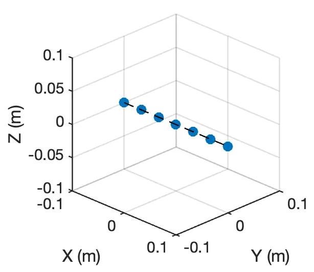 | 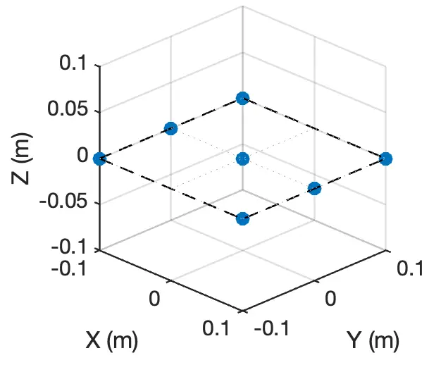 | 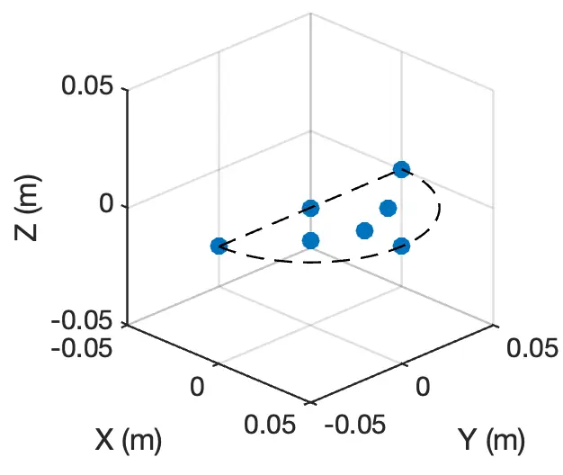 | 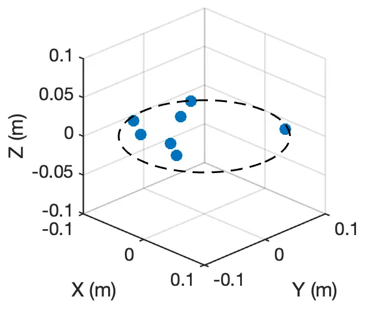 |
| \(1\)                                                       | \(2\)                                                       | \(3\)                                                       | \(4\)                                                       |
| 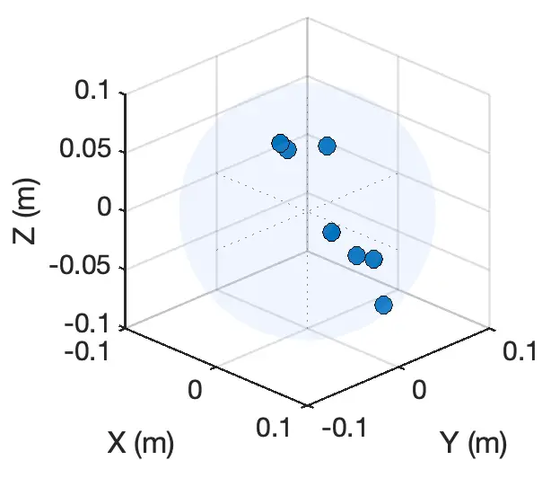 | 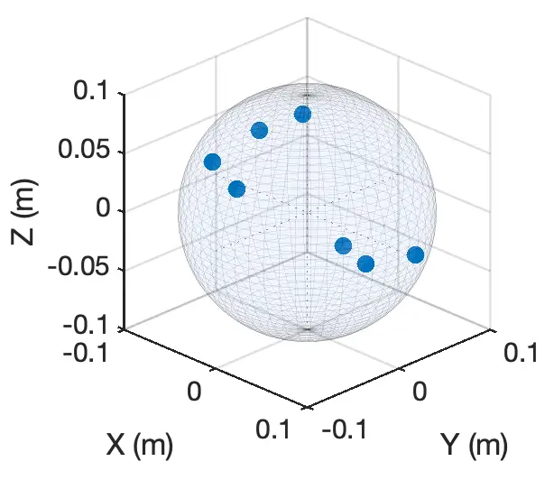 | 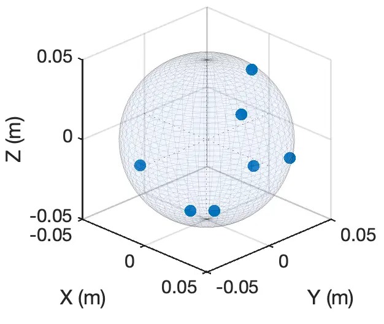 | 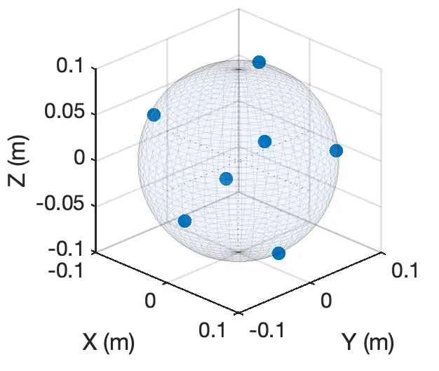 |
| \(5\)                                                       | \(6\)                                                       | \(7\)                                                       | \(8\)                                                       |

|                                                             |                                                              |
| ----------------------------------------------------------- | ------------------------------------------------------------ |
| 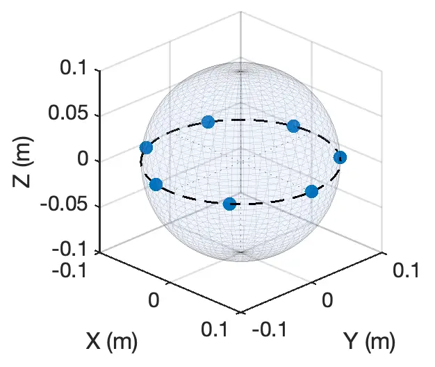 | 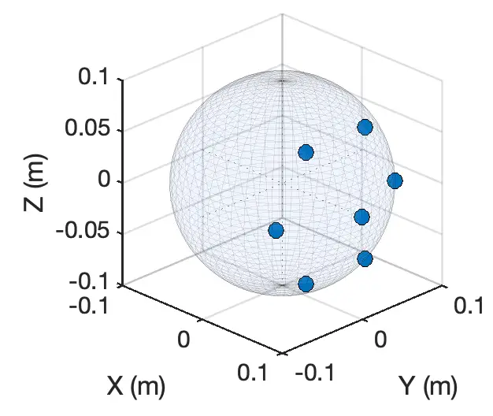 |
| \(9\)                                                       | \(10\)                                                       |

Fig. 2: Training Arrays. (1-4) 1D/2D free-field arrays; (5) free-field
spherical volume with internal and surface-mounted microphones; (6-10)
microphones mounted on rigid spheres. Blue dots mark microphone
locations, while dashed lines serve as auxiliary guides to illustrate
the array geometry. All arrays are bounded by spheres of radius
$`r=0.05`$ or $`0.1\,`$m, except for array (2), which is defined by a
$`0.1\,`$m planar rectangle.

|                                                              |                                                              |                                                              |                                                              |
| ------------------------------------------------------------ | ------------------------------------------------------------ | ------------------------------------------------------------ | ------------------------------------------------------------ |
| 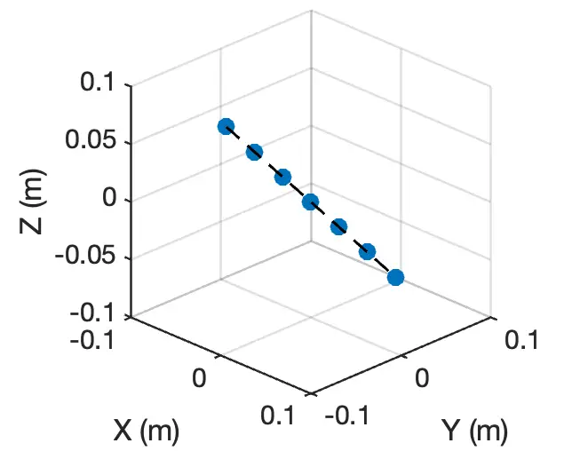 | 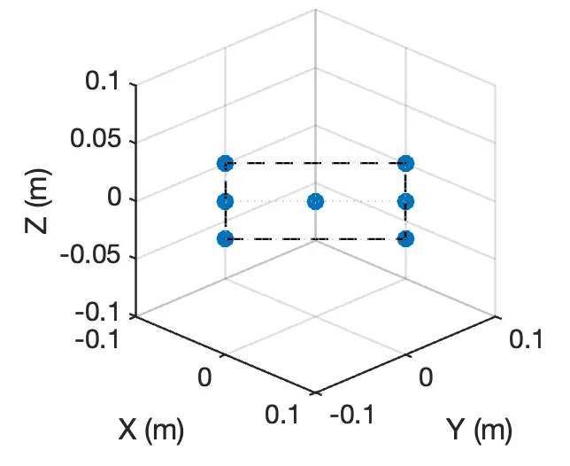 | 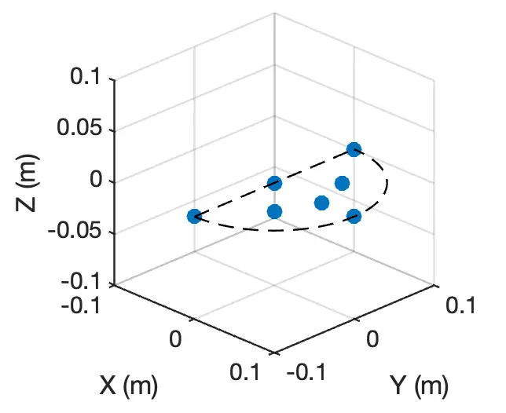 | 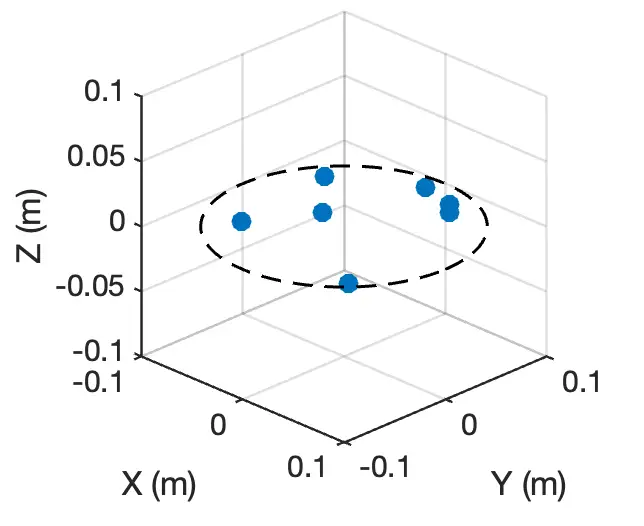 |
| \(1\)                                                        | \(2\)                                                        | \(3\)                                                        | \(4\)                                                        |
| 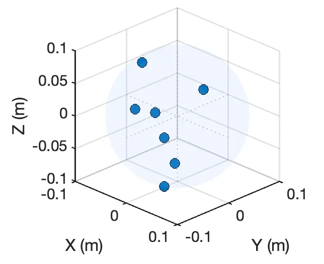 | 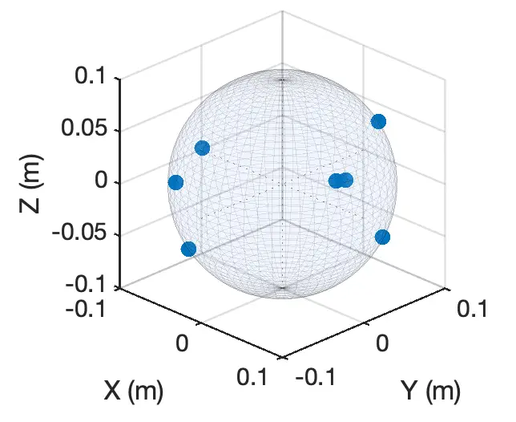 | 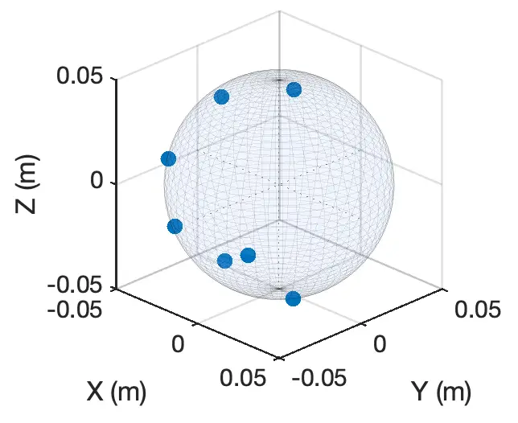 | 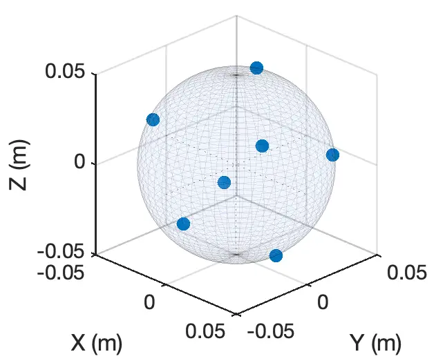 |
| \(5\)                                                        | \(6\)                                                        | \(7\)                                                        | \(8\)                                                        |

|                                                              |                                                              |
| ------------------------------------------------------------ | ------------------------------------------------------------ |
| 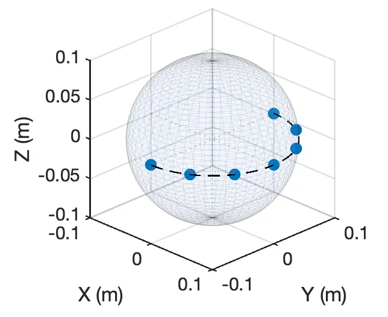 | 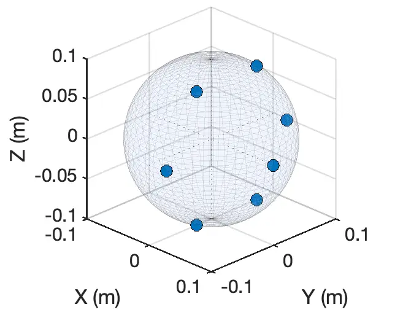 |
| \(9\)                                                        | \(10\)                                                       |

Fig. 3: Test Arrays. (1-4) 1D/2D free-field arrays; (5) free-field
spherical volume with internal and surface-mounted microphones; (6-10)
microphones mounted on rigid spheres. Blue dots mark microphone
locations, while dashed lines serve as auxiliary guides to illustrate
the array geometry. All arrays are bounded by spheres of radius
$`r=0.05`$ or $`0.1\,`$m.

For the baseline DNN models, the training and validation datasets were
synthesized using the training array configurations. This set includes a
diverse range of geometries to promote generalization to unseen arrays.
The clean reference signal corresponds to the microphone closest to the
target speaker—positioned at the front of the array in the positive
$`x`$-direction—and consists of the direct-path component of the target
signal within the room.

In contrast, the AmbiDrop training and validation datasets were
constructed using ideal Ambisonics signals up to order $`N_{a}=2`$,
resulting in 9 channels. These were calculated from the direct sound and
room reflections using Eq. (3) and the same experimental setup as the
baseline. For this model, the clean reference signal is defined as the
direct-path component of the target speaker in the omnidirectional
Ambisonics channel, $`a_{00}(t)`$. To simulate realistic conditions,
additive noise was introduced to both the baseline and AmbiDrop
datasets, to achieve a signal-to-noise ratio (SNR) of $`30\,`$dB.

Two simulated inference datasets were generated to evaluate the baseline
models and the AmbiDrop framework. The first set utilized the training
arrays used for training the baseline models, while the second set
utilized previously unseen test arrays. Each dataset contains an
identical number of examples, with source and room configurations kept
constant across all arrays to ensure a direct and fair comparison. At
the inference stage, the input provided to both the baseline DNN and the
DNN with AmbiDrop is identical. Consequently, the input (noisy)
Scale-Invariant Signal-to-Distortion Ratio (SI-SDR) was calculated for
each recording relative to the clean target speech captured by the
reference microphone.

Clean speech signals were obtained from the WSJ0 dataset \[24\] and
sampled at $`16\,`$kHz. For the baseline DNN training and validation
sets, 1,000 and 170 recordings were simulated per array, respectively,
resulting in a total of 10,000 training and 1,700 validation examples.
For the AmbiDrop framework, 6,000 training and 1,000 validation examples
were generated. Finally, each inference dataset comprised 300 examples
per array.

### V-B Methodology

For the training and validation datasets, 6-second recordings were
utilized, with each noisy recording temporally aligned to the start of
the corresponding clean target signal.

The FT-JNF network input signals were preprocessed by applying a STFT
with a $`32\,`$ms Hamming window and 50% overlap. The architecture
consisted of two BLSTM layers, each configured with 64 units. The final
linear layer produced a two-dimensional output corresponding to the real
and imaginary parts of the estimated complex mask. The network, totaling
142,594 parameters, was trained for 250 epochs using the ADAM optimizer
with a learning rate of 0.001, a weight decay of $`10^{-5}`$, and a
batch size of 8. The model instance achieving the lowest validation loss
was selected for evaluation.

For the IC-ConvTasNet architecture, we followed the notation and
parameterization described in \[22\]. The encoder output dimension was
set to 512, the bottleneck layer feature number to 128, and the channel
dimension to 8. The model comprised a single TCN stack containing 8 TCN
layers, utilizing a $`3\times 3`$ kernel size for the convolutional
blocks. The encoder and decoder processed time-domain signals using a
16 ms window with 50% overlap. The network, totaling 405,100 parameters,
was trained for 100 epochs using the ADAM optimizer with a learning rate
of 0.001 and a batch size of 64.

For models integrated with the AmbiDrop framework, input channel-wise
dropout was applied during training, randomly dropping up to 3 channels
with a probability of 0.4. During the inference stage, microphone
signals were first encoded to the Ambisonics domain using the ASM method
(Section II-B), assuming sensor noise with a SNR of $`30\,`$dB for the
encoding process.

All networks were optimized using the negative SI-SDR \[25\] as the loss
function. Performance was evaluated using three objective metrics:
SI-SDR, Perceptual Evaluation of Speech Quality (PESQ), and Short-Time
Objective Intelligibility (STOI).

### V-C Results

|                 |                          |                          |                   |                   |
| --------------- | ------------------------ | ------------------------ | ----------------- | ----------------- |
| Dataset         | Method                   | SI-SDR (dB) $`\uparrow`$ | PESQ $`\uparrow`$ | STOI $`\uparrow`$ |
| Training Arrays | Noisy (Input)            | -6.2                     | 1.17              | 0.6               |
|                 | FT-JNF (Baseline)        | 5.93                     | 1.72              | 0.85              |
|                 | FT-JNF + AmbiDrop        | 5.06                     | 1.81              | 0.86              |
|                 | IC-ConvTasNet (Baseline) | 2.92                     | 1.37              | 0.78              |
|                 | IC-ConvTasNet + AmbiDrop | 2.48                     | 1.49              | 0.79              |
| Test Arrays     | Noisy (Input)            | -6.35                    | 1.17              | 0.6               |
|                 | FT-JNF (Baseline)        | -15.08                   | 1.38              | 0.54              |
|                 | FT-JNF + AmbiDrop        | 4.77                     | 1.78              | 0.84              |
|                 | IC-ConvTasNet (Baseline) | -12.27                   | 1.24              | 0.45              |
|                 | IC-ConvTasNet + AmbiDrop | 1.4                      | 1.43              | 0.76              |

TABLE I: Performance across simulated datasets. For each dataset,
SI-SDR, PESQ and STOI, averaged over the dataset, are presented for the
baseline DNNs, and compared against the same architectures integrated
with the AmbiDrop framework. Bold values indicate the best performance
for each dataset.

In this section, we evaluate the baseline DNN models, with and without
the AmbiDrop framework, using the two simulated inference datasets
defined in Section V-A. The results are summarized in Table I. All
models were trained using their respective simulated training sets as
described in Section V-A.

The first experiment utilize the familiar training array geometries.
While these geometries were included during the training phase of the
baseline models, they remain effectively “unseen” for the models
integrated with AmbiDrop due to the inherently array-agnostic nature of
the training phase. As shown in Table I, the baseline models slightly
outperform the AmbiDrop-integrated models in terms of SI-SDR. This
result is expected, given that the baselines are specifically optimized
for these array configurations. Notably, however, each DNN combined with
AmbiDrop maintains robust performance despite never having encountered
these geometries during training, remaining highly competitive with the
baseline models.

In the second experiment, utilizing the test array dataset, the
geometries are unseen for both the baseline and the AmbiDrop-enhanced
models. The results demonstrate that both baseline models suffer from
significantly degraded performance, with enhanced SI-SDR values falling
below the noisy input level. This indicates poor generalization to
unseen microphone configurations. In contrast, the AmbiDrop-integrated
DNNs maintain strong performance across all metrics. The moderate drop
of approximately $`1\,`$dB observed in the test array experiment for the
AmbiDrop models is likely attributed to the specific test geometries
being more sensitive to ASM encoding errors rather than a lack of
generalization, as all arrays are equally novel to the AmbiDrop
framework.

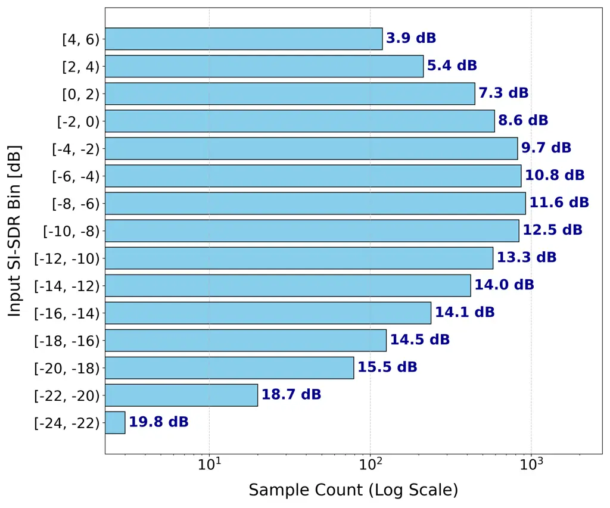

Fig. 4: Noisy SI-SDR distribution across simulated inference datasets
and mean SI-SDRi per bin.

Furthermore, we provide a histogram (Fig. 4) of all recordings across
both simulated inference datasets. The histogram illustrates the SI-SDR
distribution of the noisy recordings and the frequency of recordings
within each SI-SDR range. For each bin, we report the mean SI-SDR
improvement (SI-SDRi) achieved by the FT-JNF + AmbiDrop model. The data
suggests an inverse relationship between input quality and enhancement
gain: the lower the initial SI-SDR, the greater the performance
improvement achieved by the network. This can be explained by the nature
of the SI-SDR measure, quantifying both noise reduction and signal
distortion. At low input SI-SDR values, considerable noise reduction can
be applied before distortion start to affect SI-SDR improvement.

These results highlight the robustness and generalization capabilities
of the AmbiDrop framework when applied to unseen arrays through
array-agnostic training. Furthermore, the consistent performance
observed across two different DNN architectures suggests that the
framework may be adaptable to various network configurations. While the
full extent of this compatibility remains a subject for future research,
these initial findings are promising for its integration with different
speech enhancement models.

## VI Experimental Study with Project Aria Glasses

This section aims to evaluate the proposed AmbiDrop method with
real-world data, measured on an actual microphone array device - the
Aria glasses.

### VI-A Setup

To validate the proposed framework, we conducted real-world experiments
using Project Aria glasses \[19\] (Aria Gen 1, large model). This
experiment evaluates the baseline and AmbiDrop-enhanced models on
physical recordings with microphone positions that mirror the simulated
configurations described in Sec. V-A, maintaining the objective of
extracting a target speaker from a multi-talker mixture.

The experiment was carried out in a laboratory room with width, length
and height dimensions of $`5.15\times 6.3\times 2.67\,`$m, respectively.
A KEMAR acoustic manikin \[26\] wearing Aria glasses (Fig. 5(a)) was
positioned at a height of $`1.2\,`$m, located $`2.6\,`$m from the left
wall and $`4.1\,`$m from the front wall. The array was oriented toward
the shorter wall (width dimension). Target and interference signals were
reproduced via KRK ROKIT6 loudspeakers with $`0\,`$dB gain, driven by a
Scarlett 18i20 sound card. Physical coordinates for the speakers were
referenced to the center of the woofer, while the array coordinates were
referenced to the “nose bridge” microphone of the Aria device.

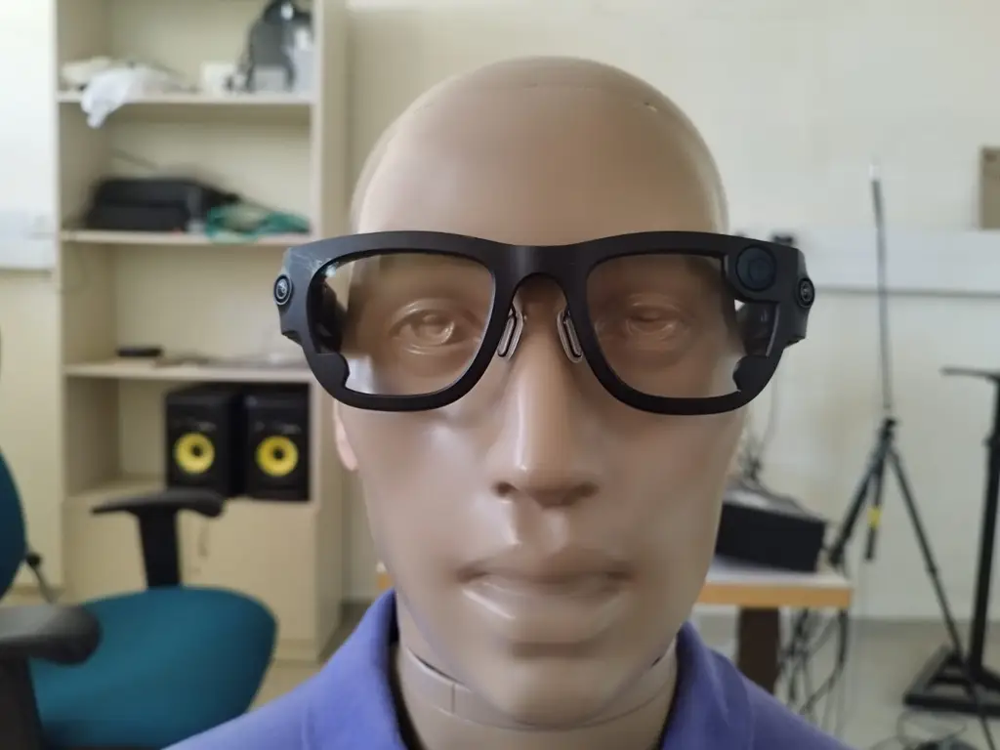

(a) Aria glasses on KEMAR.

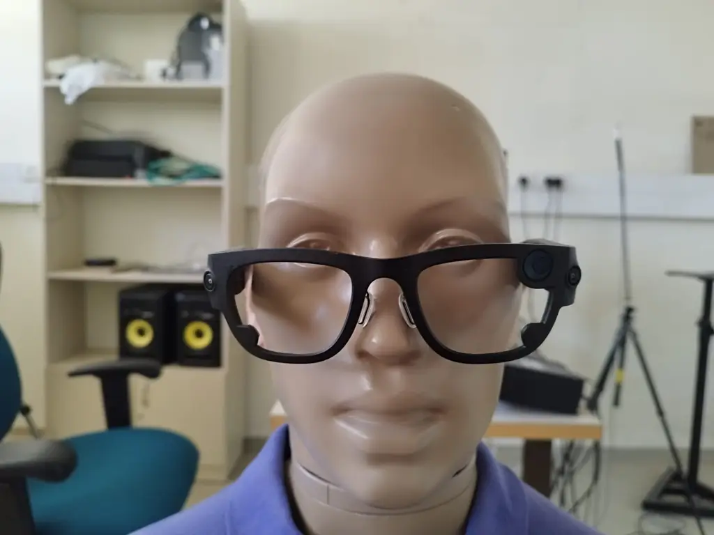

(b) Mispositioned glasses.

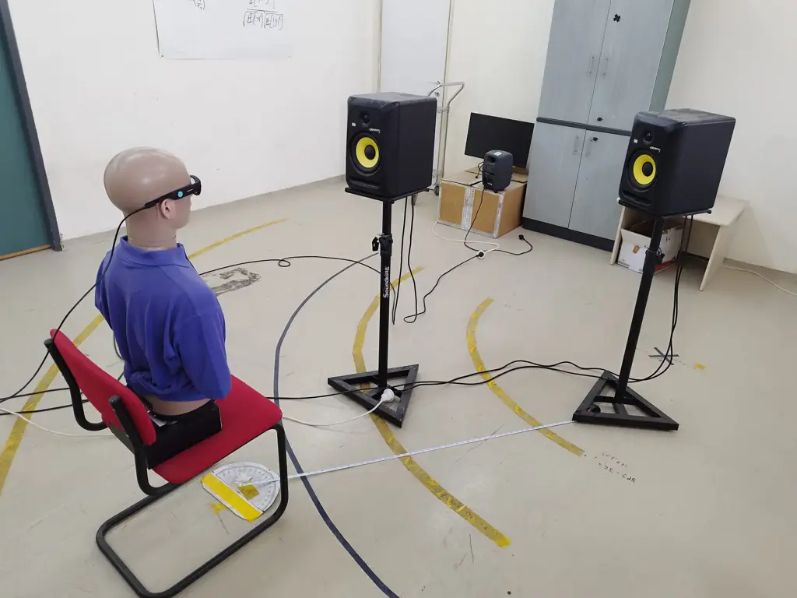

(c) Measurement setup example.

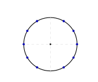

(d) Illustration of the positions of the target and interfering sources.

Fig. 5: Experimental setup showing (a) the Aria glasses on the KEMAR
manikin, (b) a mispositioned Aria glasses on the KEMAR Manikin, (c) an
example measurement setup showing the target loudspeaker and
interference loudspeaker at $`30^{\circ}`$, and (d) an illustration of
the position of the target source and all possible positions of the
interfering sources.

The target speaker was positioned directly in front of the array
($`0^{\circ}`$) at a distance of $`1\,`$m. Interference sources were
recorded at a distance of $`1.5\,`$m and at the same height as the array
across 10 distinct DOAs at $`30^{\circ}`$ intervals, excluding
$`0^{\circ}`$ and $`180^{\circ}`$ (see Fig. 5(d)). An example of the
physical placement for the target and an interfering source at
$`30^{\circ}`$ is shown in Fig. 5(c).

The clean speech signals were taken from the same set as for the
simulated study (Section V-A). For each DOA, including the target
position, multiple 10-second segments of clean speech were recorded
individually to allow for control of noisy SI-SDR in post-processing.
Speech signal were different for each speech source within a single
recorded scene, ensuring no overlap in speech content.

Noisy mixtures were synthesized by randomly selecting five interference
recordings from different DOAs and combining them with a target speaker
recording. To simulate various distances and relative source levels,
interference signals were scaled by random gains sampled uniformly from
the range $`[0.2,0.7]`$. Following this procedure, an evaluation dataset
of 300 unique mixture recordings was generated.

Furthermore, to evaluate robustness against variations in glasses
fittings on the head, we recorded the target and interference sources
using an array that was intentionally mispositioned on the manikin’s
head (see Fig. 5(b)). A second set of 300 evaluation examples was
generated using these recordings in the same manner as the primary
dataset.

### VI-B Methodology

For the measured data evaluation, we employ the FT-JNF network with the
parameters defined in Sec. V-B. Notably, we utilize the exact baseline
and AmbiDrop-enhanced models trained previously on simulated data
(Sec. V-A) to assess their zero-shot generalization capabilities. For
the baseline model, the “lower-lens left” microphone of the Aria glasses
was selected as the reference channel, as it is the closest microphone
to the target speaker.

Ambisonic encoding is performed using two distinct Aria ATFs: (1) a
simulated ATF modeled as a rigid sphere in MATLAB based on the Aria
geometry from the CHiME-8 challenge \[27\], and (2) the measured ATF
provided by the same challenge. To maintain consistency with the
$`16\,`$kHz sampling rate of our clean signals and simulated ATFs, the
$`48\,`$kHz Aria recordings and measured ATFs are downsampled to
$`16\,`$kHz.

As described previously, two datasets were collected: one with the Aria
glasses correctly positioned on a manikin head, and another with a
deliberate mispositioning, both utilizing the two aforementioned ATFs.
For comparison, we also included a simulated dataset with the same
acoustic scenario as described in the simulation study (see
Section V-A), containing an equivalent number of recordings generated
with the simulated Aria ATF.

A significant challenge in real-world recording is the variable latency
between the record command and the actual start of capture, which
complicates the acquisition of time-aligned reference signals. To
address this, we computed the performance metrics by performing a
temporal grid search, by shifting the dry clean target speech relative
to the enhanced output with the aim of finding the alignment that
maximizes the SI-SDR. All subsequent metrics (PESQ, STOI) are then
calculated using this optimally shifted reference.

### VI-C Results

|                                         |                          |                           |                   |                   |
| --------------------------------------- | ------------------------ | ------------------------- | ----------------- | ----------------- |
| Dataset                                 | Method                   | SI-SDRi (dB) $`\uparrow`$ | PESQ $`\uparrow`$ | STOI $`\uparrow`$ |
| Simulated Data                          | Noisy                    | -5                        | 1.17              | 0.63              |
|                                         | Baseline                 | -8.87                     | 1.09              | 0.51              |
|                                         | AmbiDrop + Simulated ATF | 9.6                       | 1.81              | 0.87              |
| Measured Data - Normal Glasses Position | Noisy                    | -6.74                     | 1.23              | 0.69              |
|                                         | Baseline                 | -7.87                     | 1.09              | 0.5               |
|                                         | AmbiDrop + Simulated ATF | 7.34                      | 1.62              | 0.78              |
|                                         | AmbiDrop + Measured ATF  | 5.79                      | 1.65              | 0.79              |
| Measured Data - Glasses Mispositioned   | Noisy                    | -7.1                      | 1.22              | 0.67              |
|                                         | Baseline                 | -9.14                     | 1.11              | 0.45              |
|                                         | AmbiDrop + Simulated ATF | 5.07                      | 1.45              | 0.72              |
|                                         | AmbiDrop + Measured ATF  | 3.64                      | 1.49              | 0.75              |

TABLE II: Performance evaluation in terms of SI-SDRi, PESQ and STOI, for
(i) the simulated dataset with the baseline method and AmbiDrop with the
simulated ATF, (ii) the measured dataset with normal glasses position
and with the baseline method and AmbiDrop incorporating both simulated
and measured ATFs, and (iii) the same as (ii) but for the measured
dataset with glasses mispositioned.

This section presents the performance of AmbiDrop on real-world
recordings from the Aria glasses, as described in Section VI-A.

#### VI-C1 Simulated vs. measured datasets

The results are presented in Table II. Notably, the baseline model
exhibits poor performance across all datasets, as the Aria array
geometry was not encountered during its training. For the correctly
positioned real-world dataset, AmbiDrop with simulated ATF encoding
achieves approximately $`2\,`$dB less improvement than on the fully
simulated dataset. This performance gap is expected, as real-world
recordings involve complex noise fields and reflections that differ from
the simulated environments used during training. However, as shown later
in Section VII-A, optimized dropout configurations can effectively
mitigate this gap.

#### VI-C2 Simulated vs. measured ATF

Interestingly, while the simulated ATF introduces a modeling mismatch
relative to the physical device, it still outperforms the measured ATF
in terms of SI-SDR. We attribute the degraded performance to probable
errors incorporated in the physical measurements of the measured ATF -
leading to a mismatch that exceeds the modeling imperfections found in
the simulated ATF.

#### VI-C3 Mispositioned Aria glasses

In the mispositioned array experiment, we observe an additional
$`2\,`$dB performance drop for AmbiDrop across both ATF types. The
mispositioning introduced deviations in microphone positions relative to
the manikin head, which were not captured by either the rigid-sphere
model or the measured ATF. These findings underscore the importance of
accurate array positioning, confirming that the performance of the
AmbiDrop framework is dependent on the accuracy of the ATF modeling.

In conclusion, this experiment validated the effectiveness of the
AmbiDrop framework using a real-world array in a physical acoustic
environments. The successful transition from simulated training to
real-world data provides a robust foundation for the framework,
demonstrating that its performance extends beyond idealized simulations
to practical, real-world applications.

## VII Ablation Study

In this section, we conduct a series of ablation studies to evaluate the
impact of various system components and hyperparameters on performance.
The study is performed using the FT-JNF architecture, and evaluation is
presented in terms of SI-SDR, as this metric directly aligns with the
training objective of the models.

### VII-A Impact of the Dropout Layer

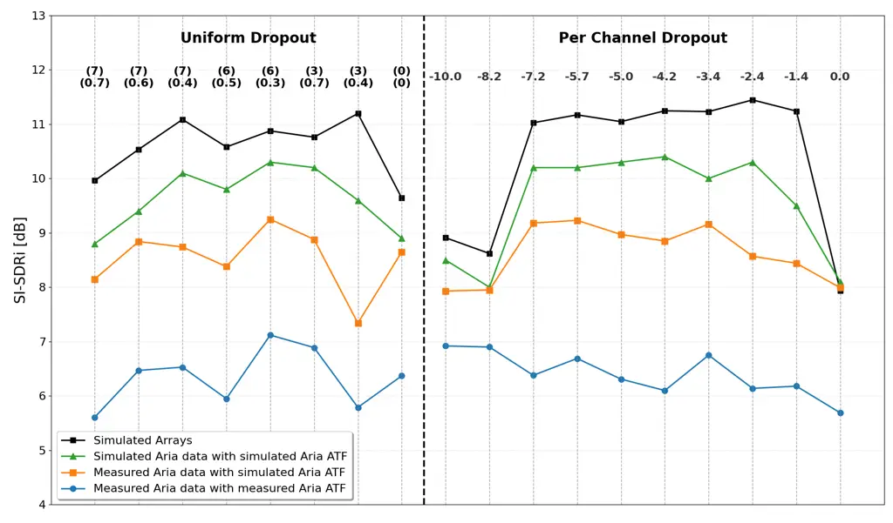

Fig. 6: SI-SDRi across various dropout configurations for simulated
arrays (black), simulated Aria data with simulated ATF (green), measured
Aria data (normal position) with simulated and measured ATFs (orange and
blue, respectively). The left section evaluates uniform dropout where
each configuration is denoted by the two values of (Max. Dropped
Channels) and (Dropout Probability). The right section evaluates
per-channel dropout where each configuration is denoted by an error
threshold.

We investigate the influence of various input dropout alternatives.
Recall that as discussed in Section III-C, dropout was introduced to
model encoding errors during training to enhance robustness during
inference. We evaluate two distinct dropout strategies:

1.  1.  Uniform: A single dropout probability is applied uniformly across
        all channels, subject to a maximum number of dropped channels.
2.  2.  Per Channel: Each channel is assigned a unique dropout probability
        derived from its specific ASM encoding errors characteristics across
        the dataset. No limit to the number of dropped channels is imposed.

It is important to note that for each strategy, the $`a_{00}`$ channel
is assigned a zero probability of being dropped, as it serves as the
reference channel for the DNN models.

With the aim of supporting the computation of the unifrom and
per-channel dropout probabilities, we define a broadband ASM encoding
error based on Eq. (5), between ideal Ambisonics ($`a_{nm}`$) and ASM
encoded Ambisonics ($`\hat{a}_{nm}`$) for each channel, as follows:

```math
\bar{\varepsilon}_{\text{Amb}}^{nm}=\frac{\frac{1}{K}\sum_{k=1}^{K}E\left[|\hat{a}_{nm}(k)-a_{nm}(k)|^{2}\right]}{\frac{1}{K}\sum_{k=1}^{K}E\left[|a_{nm}(k)|^{2}\right]}. \tag{11}
```

where $`K`$ is the number of frequency bins, and the expectation
operator, $`E[\cdot]`$, is computed in practice by averaging across
$`32\,`$ms time frames and over the 300 recordings within the inference
set of each respective array. Unlike Eq. (5), the error in Eq. (11) is
normalized by the broadband energy. This prevents the metric from being
dominated by high-error, low-variance frequency bins, which would occur
if the per-frequency ratios in Eq. (5) were simply averaged.
$`\bar{\varepsilon}_{\text{Amb}}^{nm}`$ is calculated for each channel
and for every simulated array configuration defined in Section V-A.

For the uniform dropout strategy, the dropout probability is determined
by the percentage of “bad” channels across the entire array dataset. A
channel is classified as “bad” if its error
$`\bar{\varepsilon}_{\text{Amb}}^{nm}`$ exceeds a specified error
threshold, where we examined threshold values ranging from $`-15\,`$dB
to $`0\,`$dB. For a given threshold, the maximum number of dropped
channels is defined as the peak count of bad channels observed within
any single array, capped at 7 to ensure that at least one non-reference
channel remains active. This approach yields eight distinct
configurations—three based on the defined thresholds and five selected
heuristically—as summarized in Table III.

Conversely, for the per-channel dropout strategy, the dropout
probability is calculated individually for each channel as the
percentage of arrays for which this channel is classified as “bad”.
Evaluating this across the same range of error thresholds yields a
unique dropout probability vector for each threshold. We evaluate ten
distinct thresholds for this strategy, resulting in the parameters
summarized in Table IV.

|                  |                       |                     |
| ---------------- | --------------------- | ------------------- |
| Threshold \[dB\] | Max. Dropped Channels | Dropout Probability |
| -6.7             | 7                     | 0.7                 |
| -4.7             | 7                     | 0.6                 |
| —                | 7                     | 0.4                 |
| -2.8             | 6                     | 0.5                 |
| —                | 6                     | 0.3                 |
| —                | 3                     | 0.7                 |
| —                | 3                     | 0.4                 |
| —                | 0                     | 0                   |

TABLE III: Parameters for the uniform dropout strategy. Threshold-based
configurations are derived from the specified threshold values; entries
marked with ”—” indicate heuristically selected parameters.

|                  |                                    |      |      |      |      |      |      |      |      |
| ---------------- | ---------------------------------- | ---- | ---- | ---- | ---- | ---- | ---- | ---- | ---- |
| Threshold \[dB\] | Dropout Probability (Channels 1-9) |      |      |      |      |      |      |      |      |
|                  | 1                                  | 2    | 3    | 4    | 5    | 6    | 7    | 8    | 9    |
| -10.0            | 0                                  | 0.55 | 0.9  | 0.6  | 1    | 1    | 1    | 1    | 1    |
| -8.2             | 0                                  | 0.35 | 0.75 | 0.2  | 1    | 1    | 1    | 1    | 1    |
| -7.2             | 0                                  | 0.15 | 0.6  | 0.2  | 0.95 | 1    | 0.95 | 1    | 0.95 |
| -5.7             | 0                                  | 0.15 | 0.55 | 0.15 | 0.8  | 1    | 0.95 | 1    | 0.85 |
| -5.0             | 0                                  | 0.1  | 0.45 | 0.15 | 0.7  | 1    | 0.85 | 1    | 0.65 |
| -4.2             | 0                                  | 0.1  | 0.45 | 0.1  | 0.55 | 1    | 0.85 | 1    | 0.55 |
| -3.4             | 0                                  | 0.1  | 0.45 | 0.1  | 0.45 | 1    | 0.75 | 1    | 0.45 |
| -2.4             | 0                                  | 0.05 | 0.45 | 0.05 | 0.4  | 0.95 | 0.5  | 0.95 | 0.4  |
| -1.4             | 0                                  | 0.05 | 0.45 | 0.05 | 0.1  | 0.75 | 0.4  | 0.75 | 0.1  |
| 0                | 0                                  | 0.05 | 0.35 | 0.05 | 0    | 0.4  | 0    | 0.3  | 0    |

TABLE IV: Dropout probability vectors derived from each examined error
threshold within the per-channel dropout strategy.

The performance of the FT-JNF+AmbiDrop model across the different
configurations for both strategies is presented in Fig. 6. For the
simulated array dataset - comprising both the training and test
geometries defined in Sec. V-A (black curve) - most configurations yield
an SI-SDRi of about $`11\,`$dB. When dropout is too aggressive (i.e. a
threshold of $`-10\,`$dB), the model lacks important information and
performance drops. Conversely, when dropout is too weak (i.e., a
threshold of $`0\,`$dB), performance drops again, probably because
encoding errors are insufficiently simulated. Notably, the baseline
model without dropout $`(0,0)`$ performs approximately $`1.5\,`$dB lower
than most other configurations, leading to the conclusion that the
incorporation of the dropout layer is an important factor in overall
model performance, but performance is not highly sensitive to the
dropout parameters.

Comparing the two dropout strategies reveals that the per-channel
approach does not offer a significant advantage over the simpler uniform
dropout method. While per-channel tuning allows for a more granular
configuration, the uniform dropout setting of $`(3,0.4)`$ used
throughout this study remains a robust and effective choice.

Performance degrades as the data transitions from ideal simulated arrays
(black curve) to real-world Aria data (orange and blue curves), as
discussed in Section VI-C. However, despite this shift in absolute
SI-SDRi values, the performance trends remain consistent across all
datasets. Nevertheless, fine-tuning of the dropout parameters based on
the dataset and array types, does provide some improvements in
performance.

These results demonstrate that the incorporation of a dropout layer is
important for achieving high performance, although fine-tuning of
dropout parameters may lead to some performance gains.

### VII-B Resilience to Microphone Failure

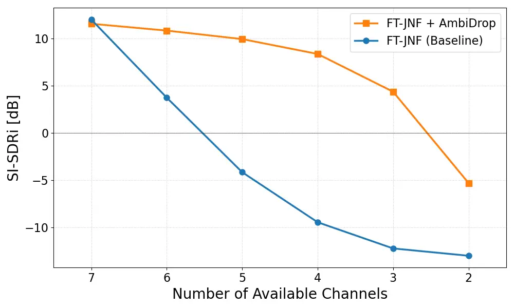

Fig. 7: SI-SDRi as a function of available channels (out of the nominal
7 channels) for the FT-JNF baseline with and without AmbiDrop.

Another aspect of performance with practical implications is the
resilience to hardware failures in specific microphones. Because
AmbiDrop training is based on the mapping of the input from a flexible
array configuration to a standardized 9-channel second-order Ambisonics
format, it may be interesting to investigate whether it is resilient to
missing input channels. For this investigation, we utilized an ensemble
of four representative array configurations, i.e. arrays (1), (3), (5),
and (8), spanning linear, planar, and spherical geometries as
illustrated in Fig. 2. During evaluation, we randomly deactivated a
specific number of microphones from the original 7-channel input, while
providing the ASM stage with this information so that the deactivated
channels were not included in the Ambisonics encoding process.
Performance of AmbiDrop was evaluated and compared to the baseline
FT-JNF method.

As shown in Fig. 7, the baseline model’s performance degrades
significantly even with a single missing microphone, dropping from an
initial SI-SDRi of approximately $`12\,`$dB down to nearly $`4\,`$dB.
Conversely, the AmbiDrop framework maintains stable performance down to
four available input channels, with the SI-SDRi only decreasing by
roughly $`2\,`$dB, specifically from $`11.5\,`$dB to $`9.5\,`$dB. This
resilience is attributed to the fact that Ambisonics channels maintain a
standardized spatial structure, and the ASM can still perform effective
spatial encoding provided a sufficient number of microphones remain
active. When only two or three channels remain, performance degrades
sharply for both models, as the spatial sampling becomes insufficient to
correctly encode the Ambisonics field.

In summary, for typical real-world sensor failures involving 1-2 missing
channels, the AmbiDrop framework maintains nearly full performance,
whereas the standard baseline architecture fails significantly. These
results indicate that our framework effectively decouples the
enhancement task from the physical integrity of the input array.

### VII-C Network Complexity vs. Performance

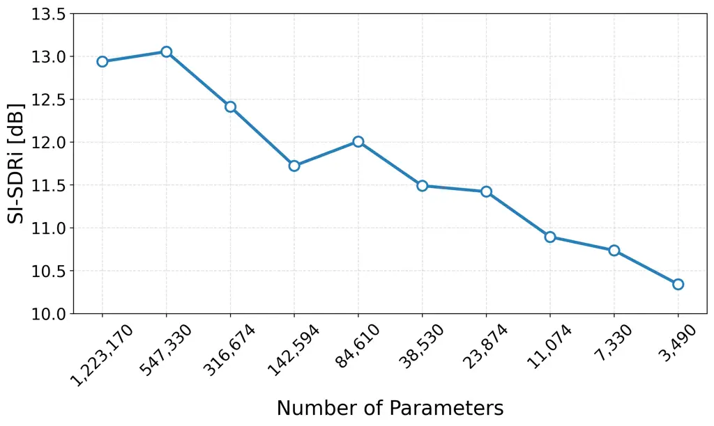

Fig. 8: SI-SDRi vs. the total number of parameters of AmbiDrop’s FT-JNF
network.

We further evaluate the performance of the AmbiDrop-enhanced FT-JNF
network across varying model scales. This analysis is motivated by the
requirement for low-complexity architectures suitable for edge-device
implementations and real-time applications.

To assess the impact of model complexity, we varied the hidden
dimensions ($`H_{1},H_{2}`$) of the two BLSTM layers within the FT-JNF
architecture. The resulting configurations and their corresponding
parameter counts are summarized in Table V. Notably, the configuration
$`(64,64)`$ used throughout this paper consists of 142,594 parameters,
representing a balanced trade-off between computational footprint and
enhancement quality.

|                                |                  |
| ------------------------------ | ---------------- |
| Network Size ($`H_{1},H_{2}`$) | Total Parameters |
| (256, 128)                     | 1,223,170        |
| (128, 128)                     | 547,330          |
| (128, 64)                      | 316,674          |
| (64, 64)                       | 142,594          |
| (64, 32)                       | 84,610           |
| (32, 32)                       | 38,530           |
| (32, 16)                       | 23,874           |
| (16, 16)                       | 11,074           |
| (16, 8)                        | 7,330            |
| (8, 8)                         | 3,490            |

TABLE V: Network size and total parameter count for various model
configurations, where ($`H_{1},H_{2}`$) denotes the hidden dimensions of
the two BLSTM layers in the FT-JNF network.

The mean SI-SDRi results across the simulated dataset are illustrated in
Fig. 8. Our findings indicate that reducing the model complexity by two
orders of magnitude—from approximately $`1.2\,`$ million parameters down
to approximately 11,000—results in a performance degradation of only
$`2\,`$dB. Even at the extreme lower bound of 3,490 parameters, the
framework maintains an SI-SDRi of nearly $`10.5\,`$dB.

These results demonstrate that the AmbiDrop framework is remarkably
robust to model downsizing. We hypothesize that this framework,
potentially integrated with even more efficient DNN architectures, is
well-suited for deployment on hardware with highly constrained
computational resources.

## VIII Conclusion

In this work, we presented AmbiDrop, an array-agnostic speech
enhancement framework. By utilizing ideal Ambisonics as the DNN input
and incorporating a dropout layer during training, AmbiDrop decouples
the training process from specific array geometries. This approach
allows the model to handle encoding errors when processing ASM-encoded
Ambisonics during inference.

The framework demonstrated generalization across 20 simulated arrays,
spanning one, two, and three dimensions using both free-field and
rigid-sphere ATF configurations. This generalization was also
demonstrated across several DNN architectures and measured data from
Project Aria glasses. Ablation studies confirmed that the dropout layer
is necessary and that fine-tuning its parameters can provide further
benefits. The system further demonstrated robustness to multiple
microphone failures. Finally, when the network size was reduced by two
orders of magnitude, the resulting performance drop in SI-SDR was less
than $`2\,`$dB.

These results demonstrate the generalization of the AmbiDrop framework
across diverse array geometries and its suitability for deployment on
resource-constrained edge devices such as wearables. Future research
could include extending this framework to lightweight DNN architectures
optimized for low-latency edge processing, and their real-time
implementation.

## References

- \[1\] H. L. Van Trees (2002) Optimum array processing: part iv of
  detection, estimation, and modulation theory. Wiley-Interscience, New
  York, NY, USA. Cited by: §I.
- \[2\] N. Modhave, Y. Karuna, and S. Tonde (2016) Design of
  multichannel wiener filter for speech enhancement in hearing aids and
  noise reduction technique. In 2016 Online International Conference on
  Green Engineering and Technologies (IC-GET), pp. 1–4. Cited by: §I.
- \[3\] T. Minipriya and R. Rajavel (2018) Review of ideal binary and
  ratio mask estimation techniques for monaural speech separation. In
  2018 Fourth International Conference on Advances in Electrical,
  Electronics, Information, Communication and Bio-Informatics (AEEICB),
  pp. 1–5. Cited by: §I.
- \[4\] R. Haeb-Umbach, T. Nakatani, M. Delcroix, C. Boeddeker, and T.
  Ochiai (2024) Microphone array signal processing and deep learning for
  speech enhancement: combining model-based and data-driven approaches
  to parameter estimation and filtering. IEEE Signal Process. Mag. 41
  (6), pp. 12–23. External Links:
  [Document](https://dx.doi.org/10.1109/MSP.2024.3451653) Cited by: §I.
- \[5\] G. Huang, J. R. Jensen, J. Chen, J. Benesty, M. G.
  Christensen, A. Sugiyama, G. Elko, and T. Gaensler (2025) Advances in
  microphone array processing and multichannel speech enhancement. In
  Proc. IEEE Int. Conf. Acoust., Speech Signal Process. (ICASSP),
  pp. 1–5. External Links:
  [Document](https://dx.doi.org/10.1109/ICASSP49660.2025.10888510) Cited
  by: §I.
- \[6\] Y. Luo, Z. Chen, N. Mesgarani, and T. Yoshioka (2020) End-to-end
  microphone permutation and number invariant multi-channel speech
  separation. In Proc. IEEE Int. Conf. Acoust., Speech Signal Process.
  (ICASSP), pp. 6394–6398. Cited by: §I.
- \[7\] T. Yoshioka, X. Wang, D. Wang, M. Tang, Z. Zhu, Z. Chen, and N.
  Kanda (2022) VarArray: array-geometry-agnostic continuous speech
  separation. In Proc. IEEE Int. Conf. Acoust., Speech Signal Process.
  (ICASSP), pp. 6027–6031. Cited by: §I.
- \[8\] A. Jukić, J. Balam, and B. Ginsburg (2023) Flexible multichannel
  speech enhancement for noise-robust frontend. In Proc. IEEE Workshop
  Appl. Signal Process. Audio Acoust. (WASPAA), pp. 1–5. Cited by: §I.
- \[9\] H. Taherian, S. E. Eskimez, T. Yoshioka, H. Wang, Z. Chen,
  and X. Huang (2022) One model to enhance them all: array geometry
  agnostic multi-channel personalized speech enhancement. In Proc. IEEE
  Int. Conf. Acoust., Speech Signal Process. (ICASSP), pp. 271–275.
  Cited by: §I.
- \[10\] S. Zhang and X. Li (2021) Microphone Array Generalization for
  Multichannel Narrowband Deep Speech Enhancement. In Proc. Interspeech
  2021, pp. 666–670. Cited by: §I.
- \[11\] D. Lee and J. Choi (2024) DeFTAN-AA: Array Geometry Agnostic
  Multichannel Speech Enhancement. In Interspeech 2024, pp. 3360–3364.
  External Links:
  [Document](https://dx.doi.org/10.21437/Interspeech.2024-669), ISSN
  2958-1796 Cited by: §I.
- \[12\] D. Wang, Z. Chen, and T. Yoshioka (2020) Neural Speech
  Separation Using Spatially Distributed Microphones. In Interspeech
  2020, pp. 339–343. External Links:
  [Document](https://dx.doi.org/10.21437/Interspeech.2020-1089), ISSN
  2958-1796 Cited by: §I.
- \[13\] A. Mannanova, K. Tesch, J.-M. Lemercier, and T. Gerkmann (2024)
  Meta-learning for variable array configurations in end-to-end few-shot
  multichannel speech enhancement. In Proc. Int. Workshop Acoustic
  Signal Enhancement (IWAENC), pp. 200–204. Cited by: §I.
- \[14\] D. Zhang, A. I. Mezza, F. Miotello, J. Chen, M. Wang, F.
  Antonacci, and A. Bernardini (2026) Eigenbeam-feature-based
  multi-order encoder for geometry-agnostic speech enhancement. In 2026
  IEEE International Conference on Acoustics, Speech and Signal
  Processing (ICASSP), Vol. , pp. 22192–22196. External Links:
  [Document](https://dx.doi.org/10.1109/ICASSP55912.2026.11464064) Cited
  by: §I.
- \[15\] M. Tatarjitzky and B. Rafaely (2026) AmbiDrop: Array-Agnostic
  Speech Enhancement Using Ambisonics Encoding and Dropout-Based
  Learning. In 2026 IEEE International Conference on Acoustics, Speech
  and Signal Processing (ICASSP), pp. 14732–14736. Cited by: 1st item,
  2nd item, 3rd item, 4th item, §I, §I, §III.
- \[16\] F. Zotter and M. Frank (2019) Ambisonics: a practical 3d audio
  theory for recording, studio production, sound reinforcement, and
  virtual reality. Springer Nature, Cham, Switzerland. Cited by: §I,
  §II-B.
- \[17\] B. Rafaely (2015) Fundamentals of spherical array processing.
  Vol. 8, Springer. External Links:
  [Document](https://dx.doi.org/10.1007/978-3-662-45665-1) Cited by: §I,
  §II-B, §II-B.
- \[18\] Y. Gayer, V. Tourbabin, Z. Ben-Hur, J. Donley, and B.
  Rafaely (2024) Ambisonics encoding for arbitrary microphone arrays
  incorporating residual channels for binaural reproduction. In Proc.
  IEEE Int. Conf. Acoust., Speech Signal Process. Workshops (ICASSP),
  pp. 244–248. Cited by: §I, §II-B, §II-B, §III-B, §III-C.
- \[19\] J. Engel, K. Somasundaram, M. Goesele, A. Sun, A. Gamino, A.
  Turner, A. Talattof, A. Yuan, B. Souti, B. Meredith, et al. (2023)
  Project aria: a new tool for egocentric multi-modal ai research. arXiv
  preprint arXiv:2308.13561. Cited by: 3rd item, §VI-A.
- \[20\] M. Poletti (2009) Unified description of ambisonics using real
  and complex spherical harmonics. In Ambisonics Symp, Cited by: §II-B.
- \[21\] K. Tesch and T. Gerkmann (2023) Insights into deep nonlinear
  filters for improved multi-channel speech enhancement. IEEE/ACM Trans.
  Audio, Speech, and Language Process. 31, pp. 563–575. Cited by: §IV-A,
  §V-A.
- \[22\] D. Lee, S. Kim, and J. Choi (2021) Inter-channel Conv-TasNet
  for multichannel speech enhancement (2021). arXiv preprint
  ArXiv:2111.04312. Cited by: §IV-B, §V-B.
- \[23\] J. B. Allen and D. A. Berkley (1979) Image method for
  efficiently simulating small-room acoustics. J. Acoust. Soc. Am. 65
  (4), pp. 943–950. Cited by: §V-A.
- \[24\] J. S. Garofolo, D. Graff, D. Paul, and D. Pallett (2007) CSR-I
  (WSJ0) complete LDC93S6A. Note: Linguistic Data Consortium,
  Philadelphia Cited by: §V-A.
- \[25\] J. L. Roux, S. Wisdom, H. Erdogan, and J. R. Hershey (2019)
  SDR—half-baked or well done?. In Proc. IEEE Int. Conf. Acoust., Speech
  Signal Process. (ICASSP), Brighton, UK, pp. 626–630. Cited by: §V-B.
- \[26\] M. Burkhard and R. Sachs (1975) Anthropometric manikin for
  acoustic research. The Journal of the Acoustical Society of America 58
  (1), pp. 214–222. Cited by: §VI-A.
- \[27\] K. Žmolíková, S. Merello, K. Kalgaonkar, J. Lin, N. Moritz, P.
  Ma, M. Sun, H. Chen, A. Saliou, S. Petridis, et al. (2024) The CHiME-8
  MMCSG Challenge: multi-modal conversations in smart glasses. In Proc.
  CHiME 2024, pp. 7–12. Cited by: §VI-B.
