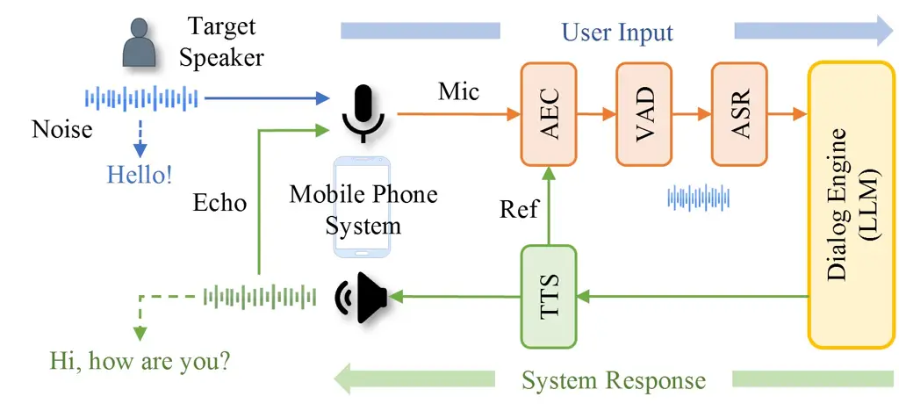
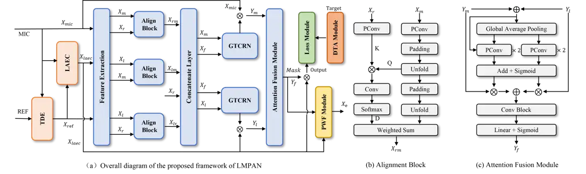
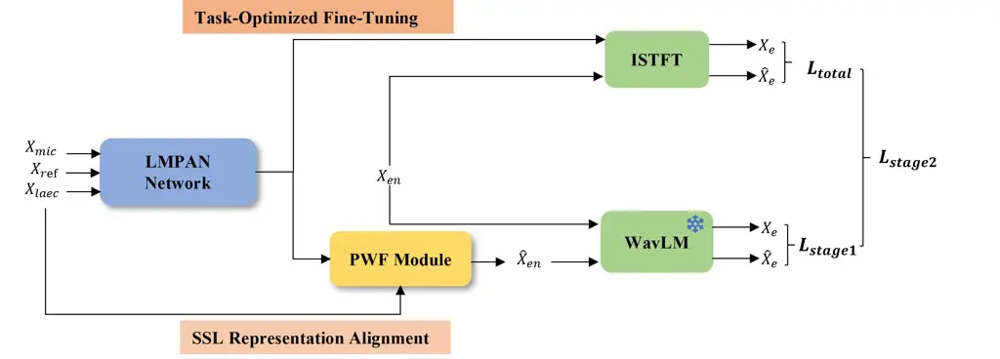
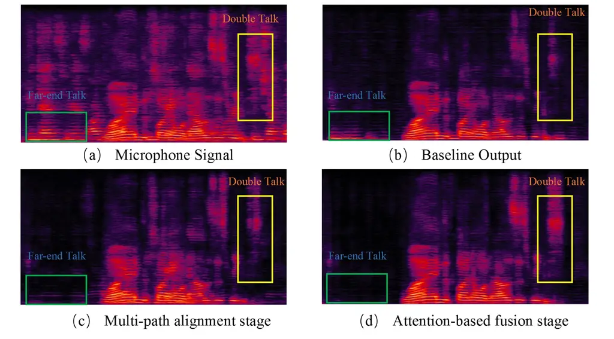

Liu Xue Yan Liang Xue

# LMPAN: A Lightweight Multi-Path Alignment Network for Joint Full-Duplex Acoustic Echo Cancellation and Noise Suppression

Chengwei    Shaofei    Haoyin    Xiaotao    Zheng

###### Abstract

We propose a lightweight multi-path alignment network (LMPAN) for
on-device joint acoustic echo cancellation (AEC) and noise suppression
(NS) in full-duplex spoken dialogue systems. To address hardware-induced
distortions and dynamic acoustic conditions, we introduce three core
innovations: (1) a multi-path alignment stage correcting temporal and
energy mismatches across reference, linear AEC (LAEC) output, and
microphone signals; (2) an attention-based mechanism that dynamically
integrates enhanced LAEC and microphone features under varying acoustic
scenarios; (3) a post-filtering module with a dynamic target generation
strategy for downstream tasks (ASR, VAD). Furthermore, we adopt a
two-stage training framework leveraging self-supervised learning
representations to enhance perceptual quality. Experiments show that
LMPAN, with only 480K parameters and 126 MACs, achieves performance
comparable to the state-of-the-art lightweight model DeepVQE-S, while
ensuring real-time inference capability.

###### keywords

Acoustic echo cancellation, noise suppression, multi-path alignment,
dynamic target generation, full-duplex spoken dialogue

^(†)^(†)address: ¹ Qwen Business Unit of Alibaba, China  
² TongYi AI Lab of Alibaba Group, China ^(†)^(†)email:
liuchengwei.lcw@alibaba-inc.com, mullerxue@126.com,
yanhaoyin.yhy@alibaba-inc.com

## 1 Introduction

Full-duplex spoken dialogue systems (FDSDS) have made remarkable
progress with the development of large language models (LLMs), enabling
more natural interactions \[1, 2\]. However, their performance degrades
substantially under adverse echo and noise conditions \[3\],
highlighting the critical importance of acoustic echo cancellation (AEC)
and noise suppression (NS) for system efficacy \[4, 5\].

A variety of AEC approaches have been proposed, which can be broadly
categorized into conventional digital signal processing (DSP)-based
methods \[5, 6\] and neural network (NN)-based techniques \[3, 7, 8\].
The performance of DSP-based methods is limited in complex full-duplex
scenarios involving heterogeneous hardware, device-specific nonlinear
distortions, time-varying latency (ranging from milliseconds to hundreds
of milliseconds), and diverse acoustic environments \[4, 9, 10\]. In
contrast, NN-based methods perform in-model alignment between the
microphone (mic) and far-end signals, achieving superior accuracy and
adaptability.

Within the NN-based approaches, end-to-end architectures have gained
traction. Evgenii et al. \[8\] proposed DeepVQE for joint echo
cancellation, noise reduction, and dereverberation (DRB). Yang et
al. \[11\] introduced a diffusion-based stochastic regeneration
approach, formulating AEC as a conditional generation problem. Other
methods combine NNs with traditional signal processing
components \[12\], typically incorporating a linear AEC (LAEC) module
based on adaptive filter algorithms to suppress linear echo components.
Additionally, multi-task learning frameworks \[8, 13, 14\] have shown
effectiveness in acoustic scenarios by jointly addressing NS, DRB, and
AEC, leading to overall improvements in speech quality. To address
time-varying latency, prior works \[8, 15, 16\] proposed attention-based
frameworks that integrate dynamic time alignment with parallel encoder
structures to enhance AEC robustness. Some studies incorporate data
augmentation and post-processing strategy to reduce the mismatch for
downstream tasks such as automatic speech recognition (ASR) and voice
activity detection (VAD) \[4, 9, 17\].



Figure 1: Full-Duplex Spoken Dialogue Architecture.

Despite these advances, existing frameworks remain vulnerable to
hardware-induced challenges in real-world FDSDS deployment. While
capable of implicit alignment learning, these neural approaches lack
explicit mechanisms to compensate for persistent temporal shifts and
energy disparities across streams under varying hardware conditions.
Consequently, such misalignments distort feature fusion, amplify
residual artifacts, and ultimately degrade the fidelity required by
sensitive downstream components \[4\].



Figure 2: Overall structure of the proposed LMPAN system. Details for
key components are given in: (a) Overall diagram of the proposed
framework of LMPAN, (b) Alignment block, (c) Attention fusion module.

To address this gap, we propose LMPAN, a lightweight multi-path
alignment network that holistically optimizes AEC performance through
four synergistic innovations: (i) Dedicated multi-path alignment modules
compensating temporal and energy mismatches; (ii) An attention-based
adaptive fusion mechanism adapting to dynamic conditions without
auxiliary VAD or double-talk detectors; (iii) A post-filtering module
with dynamic target generation, which preserves speech integrity and
prevents over-suppression to ensure robustness for ASR and VAD; and (iv)
SSL-guided two-stage training leveraging WavLM representations for
perceptual fidelity.

## 2 METHODOLOGY

### 2.1 Problem formulation

We assume an FDSDS in Fig. 1, where near-end speech is contaminated by
echo and noise. The observed signal model can be expressed as

```math
\bm{y}=\bm{s}+\bm{n}+\bm{e} \tag{1}
```

where $`\bm{y}`$, $`\bm{s}`$, $`\bm{n}`$, and $`\bm{e}`$ denote the
microphone signal, near-end speech, additive noise, and echo component,
respectively. The echo component $`\bm{e}`$ is generated by convolving
the far-end reference signal $`\bm{r}`$ with the acoustic echo path
response $`\bm{h}`$. Given $`\bm{r}`$ as the reference signal, the
target is to extract $`\bm{s}`$ from $`\bm{y}`$, involving both AEC and
NS.

### 2.2 Network Architecture

Our proposed LMPAN is illustrated in Fig. 2. We compute the LAEC output
by traditional algorithms, which is combined with mic and ref signals to
serve as the input of neural network. To address temporal and energy
misalignments among the LAEC output, mic signal, and ref signal, three
pairwise alignment blocks are employed. These aligned features are then
utilized to enhance the mic and LAEC signals, which are subsequently
fused via an attention-based module. Finally, a post-processing strategy
is applied to suppress nonlinear artifacts introduced by the neural
network \[4\], with an optimal residual scaling parameter $`\alpha=0.4`$
selected to minimize mismatch for downstream tasks (e.g., ASR, VAD).
Module details follow.

LAEC: A sub-band time delay estimation (TDE) algorithm based on
cross-correlation \[18\] estimates the time delay between the ref and
mic signals. A normalized least mean square (NLMS) based linear filter
then estimates the linear echo component and outputs the residual
signal.

Multi-path Alignment: Conventional TDE methods degrade significantly
under time-varying latency and low signal-to-noise ratio (SNR)
conditions. Conversely, end-to-end neural approaches often lack explicit
alignment mechanisms, leading to compromised robustness under data
scarcity or domain shift. To address these limitations, the proposed
alignment block (Fig. 2(b)) employs a soft temporal alignment strategy.
Let $`X_{r}\in\mathbb{R}^{2\times t\times f}`$ and
$`X_{m}\in\mathbb{R}^{2\times t\times f}`$ denote the
power-compressed \[19\] complex short-time Fourier transform (STFT)
spectrum (real and imaginary parts are concatenated as 2-channel
real-valued maps) of far-end (ref) and mic signal, where $`t`$ and $`f`$
indicate time and frequency bins, respectively.

First, feature maps are downsampled with a max-pooling layer (having a
kernel size of $`1\times 4`$) along the frequency dimension. Further,
the features are reshaped such that
$`X_{m}^{\prime}\in\mathbb{R}^{t\times(\frac{f}{4}\cdot c)}`$ and
$`X_{r}^{\prime}\in\mathbb{R}^{t\times(\frac{f}{4}\cdot c)}`$. Queries
$`Q\in\mathbb{R}^{t\times p}`$ and keys $`K\in\mathbb{R}^{t\times p}`$
are then projected from these representations, where $`p\in\mathbb{N}`$
is the projection size. To estimate the time alignment between signals,
a synthetic delay is applied to $`K`$ for each candidate delay
$`d\in[0,d_{\max}]`$ by zero-padding at the start and cropping at the
end. A dot product between $`Q`$ and the delayed $`K`$ yields a
similarity score for each $`d`$, forming a delay likelihood vector of
length $`d_{\max}`$. This vector is passed through a softmax to obtain a
probabilistic delay distribution $`D\in\mathbb{R}^{d_{\max}}`$, where
$`d_{\max}=100`$ corresponds to a maximum delay of 1 second, by
zero-padding at the start and cropping at the end. The aligned far-end
features $`\underline{X}_{F}\in\mathbb{R}^{2\times t\times f}`$ are
computed via soft time alignment.

Three alignment blocks parallelly process ref and mic pair
$`[X_{r},X_{m}]`$, mic and LAEC pair $`[X_{m},X_{l}]`$, and ref and LAEC
pair $`[X_{r},X_{l}]`$, yielding $`X_{rm}`$, $`X_{ml}`$, and
$`X_{rl}\in\mathbb{R}^{2\times t\times f}`$, respectively. This soft
alignment module accounts for uncertainty in temporal delays and
enhances robustness to dynamic misalignments, eliminating the need for
hard delay estimates. Energy compensation employs learnable per-path
scaling factors to normalize amplitude levels before fusion.

Attention-based Fusion Module: Conventional NN-based AEC pipelines
critically depend on LAEC outputs, yet LAEC inevitably introduces
spectral distortions. To eliminate this vulnerability, we adopt an
end-to-end dual-stream paradigm that jointly optimizes feature
extraction from both the LAEC spectrum $`Y_{l}`$ and mic spectrum
$`Y_{m}`$.

After alignment, $`X_{rm}`$, $`X_{ml}`$, $`X_{rl}`$, and $`X_{r}`$ are
concatenated to $`X_{f}`$ along channel dimension, which is subsequently
combined with $`X_{l}`$ and $`X_{m}`$ to refine LAEC spectrum and mic
spectrum by GTCRN \[20\], respectively. The attention fusion module
Fig. 2(c) integrates information from refined LAEC spectrum $`Y_{l}`$
and mic spectrum $`Y_{m}`$, which captures both local and global
contextual features based on multi-scale channel attention mechanism.
The attention mask $`M\in\mathbb{R}^{2\times t\times f}`$ and its
complement $`1-M`$ are applied to $`Y_{l}`$ and $`Y_{m}`$ as follows:

```math
Y_{f}=M\cdot Y_{l}+(1-M)\cdot Y_{m}. \tag{2}
```

### 2.3 Dynamic Target Adaptation

We propose a dynamic target generation strategy that adaptively retains
controlled residual noise or echo to alleviate over-suppression in
conventional AEC and NS systems. To construct the training target
$`\bm{t}`$, we introduce two residual scaling factors: (a) A noise
residual factor $`\gamma`$ controlled by a desired target
signal-to-noise ratio (SNR):

```math
\gamma=\min\left(1,\ 10^{({\rm SNR}_{\rm in}-{\rm SNR}_{\rm t})/20}\right), \tag{3}
```

where $`{\rm SNR}_{\rm in}`$ and $`{\rm SNR}_{\rm t}`$ denote the input
SNR and target SNR, respectively. (b) An echo residual factor $`\beta`$
controlled by a desired target signal-to-echo ratio (SER):

```math
\beta=\min\left(1,\ 10^{({\rm SER}_{\rm in}-{\rm SER}_{\rm t})/20}\right), \tag{4}
```

where $`{\rm SER}_{\rm in}`$ and $`{\rm SER}_{\rm t}`$ indicate the
input SER and target SER, respectively. The final target signal is
constructed as

```math
\bm{t}=\bm{s}+\gamma\bm{n^{\prime}}+\beta\bm{e^{\prime}}, \tag{5}
```

where $`\bm{n^{\prime}}`$ and $`\bm{e^{\prime}}`$ represent noise and
echo components according to $`\mathrm{SNR}_{\mathrm{in}}`$ and
$`\mathrm{SER}_{\mathrm{in}}`$, respectively. The factors $`\gamma`$ and
$`\beta`$ retain a controlled level of interference, avoiding
over-suppression and preserving realistic double-talk dynamics.



Figure 3: Two-stage training pipeline for LMPAN: Stage 1: SSL
representation alignment using a frozen pretrained WavLM model; Stage 2
jointly optimizes spectral fidelity, echo suppression, and perceptual
quality, with SSL loss as a consistency regularizer.

### 2.4 Loss Function

Inspired by the effectiveness of self-supervised learning (SSL)
embeddings in capturing rich acoustic and semantic representations \[21,
22, 23\], we adopt a two-stage training strategy for LMPAN (Fig. 3) to
jointly optimize representation alignment and task-specific objectives.
The stage-wise objectives are formulated as:

```math
\displaystyle\mathcal{L}_{\mathrm{stage\text{-}1}} \displaystyle=\mathcal{L}_{\mathrm{SSL}}, \tag{6}
```

```math
\displaystyle\mathcal{L}_{\mathrm{stage\text{-}2}} \displaystyle=10\,\mathcal{L}_{\mathrm{total}}+0.5\,\mathcal{L}_{\mathrm{SSL}}, \tag{7}
```

Stage 1: SSL Representation Alignment. We freeze a pretrained
WavLM-Large model \[24\]¹¹ 1
[https://huggingface.co/microsoft/wavlm-large](https://huggingface.co/microsoft/wavlm-large)
and minimize the mean squared error (MSE) between SSL embeddings of the
enhanced output and ground-truth clean speech:

```math
\mathcal{L}_{\mathrm{SSL}}=\frac{1}{L}\sum_{l=1}^{L}\left\|\mathbf{e}_{l}-\hat{\mathbf{e}}_{l}\right\|^{2}, \tag{8}
```

where $`L`$ denotes the total number of layers in the WavLM model.

Stage 2: Task-Optimized Fine-Tuning. We optimize a composite loss
$`\mathcal{L}_{\mathrm{total}}`$ combining spectral reconstruction
$`\mathcal{L}_{\mathrm{spec}}`$, echo-aware loss
$`\mathcal{L}_{\mathrm{echo}}`$ \[13\], scale-invariant SNR loss
$`\mathcal{L}_{\mathrm{si\text{-}snr}}`$ \[25\], and PMSQE perceptual
loss $`\mathcal{L}_{\mathrm{pmsqe}}`$ \[26\]:

```math
\mathcal{L}_{\mathrm{total}}=\mathcal{L}_{\mathrm{spec}}+\alpha_{1}\mathcal{L}_{\mathrm{echo}}+\alpha_{2}\mathcal{L}_{\mathrm{si\text{-}snr}}+\alpha_{3}\mathcal{L}_{\mathrm{pmsqe}}, \tag{9}
```

where $`\alpha_{1}=0.1`$, $`\alpha_{2}=0.2`$, and $`\alpha_{3}=0.8`$ are
weighting coefficients selected based on ablation studies. The SSL loss
$`\mathcal{L}_{\mathrm{SSL}}`$ serves as a consistency regularizer
during fine-tuning to preserve semantic fidelity. For ablation, we also
evaluate an SSL-only variant (denoted as SSL) that uses only Stage 1 (6)
without the second-stage fine-tuning, to isolate the contribution of
two-stage training.

\captionsetup

labelformat=empty

|     |                              |           |      |                    |      |       |       |      |                        |
| --- | ---------------------------- | --------- | ---- | ------------------ | ---- | ----- | ----- | ---- | ---------------------- |
| Exp | Method                       | \# Param. | MACs | AEC Challenge 2023 |      |       |       |      |                        |
|     |                              |           |      | DT                 |      |       | ST-FE |      | MOS$`{}_{\text{avg}}`$ |
|     |                              |           |      | EMOS               | DMOS | ERLE  | EMOS  | DMOS |                        |
| –   | DeepVQE (E2E) \[8\]          | 0.82M     | 315M | 4.62               | 4.02 | 65.7  | 4.61  | 4.36 | 4.40                   |
|     | Align-ULCNet (Hybrid) \[15\] | 0.69M     | 100M | 4.60               | 3.80 | –     | 4.77  | 4.28 | 4.36                   |
|     | TBNN (Hybrid) \[12\]         | 9.56M     | –    | 4.72               | 4.16 | –     | 4.70  | 3.91 | 4.37                   |
| 1   | Base Model (One-stage)       | 0.24M     | 65M  | 4.28               | 3.69 | 42.33 | 4.60  | 4.09 | 4.17                   |
| 2   | +MA                          | 0.32M     | 82M  | 4.43               | 3.89 | 45.21 | 4.62  | 4.29 | 4.31                   |
| 3   | +MA+AFM                      | 0.48M     | 126M | 4.51               | 4.02 | 48.22 | 4.65  | 4.38 | 4.39                   |
| 4   | +MA+AFM+SSL-only             | 0.48M     | 126M | 4.58               | 4.09 | 46.43 | 4.66  | 4.42 | 4.44                   |
| 5   | +MA+AFM+STL                  | 0.48M     | 126M | 4.63               | 4.17 | 47.15 | 4.71  | 4.44 | 4.49                   |
| 6   | +MA+AFM+STL+DTA              | 0.48M     | 126M | 4.59               | 4.12 | 45.04 | 4.66  | 4.40 | 4.44                   |

Table 1: Table 1. AECMOS and ERLE (dB) results on AEC Challenge 2023
blind test sets. MA: multi-path alignment; AFM: attention-based fusion
module; DTA: dynamic target adaptation; SSL-only: training with SSL loss
only; STL: two-stage training with SSL.

## 3 EXPERIMENTS

### 3.1 Experimental Setup

Datasets: In our experiments, we utilize matched clean and noisy speech
pairs from ICASSP 2022/2023 AEC Challenge \[27, 10\] and noise data from
DNS Challenge \[28, 29\]. For realistic full-duplex evaluation, we
additionally collect a large-scale echo dataset from 40 smartphones at
varying playback volume levels (30%–100%), capturing diverse acoustic
scenarios due to different hardware characteristics and software
configurations. Each device yields approximately 180 minutes of
real-world interactions, including far-end reference and microphone
signals.

Simulation Details: Training data are augmented with room impulse
responses (RIRs) simulated via the hybrid method \[30\], reference
signal perturbations including time-frequency masking and temporal
shifts of 0–80 ms, dynamic utterance concatenation, and standard
augmentations \[7, 31\]. We generate 10,000 rooms (dimensions:
$`3\times 3\times 3`$ m to $`8\times 5\times 4`$ m) and reverberation
times (RT60: 0.2–1.2 s). This yielded 2,000 hours of training data
partitioned 8:1:1 across double-talk (DT), far-end single-talk (ST-FE),
and near-end single-talk (ST-NE) scenarios. SER in DT segments ranges
from $`-20`$ dB to $`15`$ dB, and SNR in DT and ST-NE segments ranges
from $`-5`$ dB to $`25`$ dB. For evaluation, we adopt the AEC Challenge
2023 blind test \[10\] and a self-collected real-world test set ( 4,000
noisy DT utterances; loudspeaker volume: 60–100%). All audio is
resampled to 16k Hz.



Figure 4: Spectrum visualizations of different stage on real double-talk
sample of blind test.

Implementation Details: Input features were extracted via STFT with a
32-ms frame length, 16-ms frame shift, and magnitude compression factor
of 0.3. This model is trained using the AdamW optimizer for 100 epochs.
The learning rate reaches a peak of 0.001 after 4,000 warm-up steps and
is decayed by a factor of 0.98 per epoch. The AFM employs $`1\times 1`$
convolutions for Q/K/V projection with a single attention head. The
GTCRN-based refinement branches use PConv with a $`1\times 3`$ kernel
along the frequency axis. During training, the ref and noisy signals are
truncated to 5 seconds.

Evaluation Metrics: For NS and AEC evaluation, the echo return loss
enhancement (ERLE) and AECMOS \[32\] are adopted in ST-NE and DT
scenarios. AECMOS comprises two components: EMOS for echo annoyance and
DMOS for other degradations, averaged as $`MOS_{avg}`$. Downstream task
evaluation is assessed via: (1) detection cost function (DCF) with
semantic-VAD \[33\] model for VAD performance; (2) word error rate (WER)
using Paraformer \[34\]; (3) true interruption rate (TIR) via
LLM-enhanced dialogue management \[1\] for FDSDS assessment.

### 3.2 Experimental Results

AEC and NS Performance. Table 1 shows that LMPAN achieves competitive
performance on the AEC Challenge 2023 blind test. Starting from the
lightweight base model (Exp 1), integrating the multi-path alignment
module (MA, Exp 2) improves average MOS ($`\text{MOS}_{\text{avg}}`$)
from 4.17 to 4.31. Incorporating the attention-based fusion module (AFM,
Exp 3) increases $`\text{MOS}_{\text{avg}}`$ to 4.39 and ERLE to
48.22 dB. Two-stage training with SSL (STL, Exp 5) further boosts
perceptual quality to $`\text{MOS}_{\text{avg}}=\mathbf{4.49}`$,
achieving the highest DT EMOS (4.63), DMOS (4.17), and ST-NE scores.
Finally, DTA (Exp 6) maintains robustness in double-talk but slightly
reduces overall MOS. The final model (Exp 5, 0.48M parameters, 126M
MACs) outperforms prior methods including DeepVQE in
$`\text{MOS}_{\text{avg}}`$ with lower complexity, demonstrating that
architectural design, not scale, drives gains in efficient AEC systems.

|                      |                       |                    |                  |                       |                    |                  |
| -------------------- | --------------------- | ------------------ | ---------------- | --------------------- | ------------------ | ---------------- |
| Method               | SER: $`[-15,-10]`$ dB |                    |                  | SER: $`[-20,-15]`$ dB |                    |                  |
|                      | DCF $`\downarrow`$    | WER $`\downarrow`$ | TIR $`\uparrow`$ | DCF $`\downarrow`$    | WER $`\downarrow`$ | TIR $`\uparrow`$ |
| One-stage            | 4.68                  | 11.08              | 90.96            | 9.38                  | 24.25              | 85.17            |
|    + MA              | 3.42                  | 9.57               | 91.53            | 7.22                  | 21.57              | 87.96            |
|    + MA+AFM          | 2.55                  | 8.36               | 92.82            | 5.85                  | 19.38              | 89.17            |
|    + MA+AFM+SSL-only | 2.35                  | 8.16               | 93.12            | 5.45                  | 18.58              | 90.17            |
|    + MA+AFM+STL      | 1.98                  | 6.56               | 94.34            | 4.68                  | 17.18              | 91.47            |
|    + MA+AFM+STL+DTA  | 1.55                  | 4.34               | 92.54            | 3.75                  | 14.38              | 93.85            |

Table 2: Performance comparison of VAD (DCF %), ASR (WER %), and FDSDS
(TIR %) on a real-world double-talk test set, stratified by SER into
$`[-15,-10]`$ dB and $`[-20,-15]`$ dB, with SNR randomly sampled from
$`[5,20]`$ dB.

Downstream Task Performance. Table 2 summarizes performance across VAD,
ASR, and FDSDS tasks. Compared to the one-stage baseline, the full
pipeline (+MA+AFM+STL+DTA) achieves substantial gains in the more
challenging $`[-20,-15]`$ dB SER range (stronger echo interference),
with DCF, WER, and TIR improving by 5.63, 9.87, and 8.68 percentage
points, respectively. Despite retaining controlled residual components,
DTA and STL jointly boost performance by minimizing speech distortion,
demonstrating the importance of target signal preservation in
full-duplex systems.

Ablation Studies. Figure 4 visualizes spectrogram evolution across
processing stages, demonstrating that integrating local microphone cues
with multi-path alignment is essential for preserving near-end speech
fidelity under strong echo interference. This is quantitatively
validated in Table 2, where adding AFM (+​MA $`\rightarrow`$ +​MA+AFM)
consistently improves ASR performance across all SER ranges, confirming
that the LAEC+MIC fusion mechanism effectively preserves speech
fidelity.

Dynamic Target Adaptation Analysis. $`\mathrm{SER}_{\mathrm{t}}`$ is a
hyperparameter defining residual echo retention in training targets (not
an output metric). Table 3 demonstrates that
$`\mathrm{SER}_{\mathrm{t}}=25`$ dB optimizes WER for ASR by preserving
moderate echo to minimize speech distortion. In contrast,
$`\mathrm{SER}_{\mathrm{t}}=30`$ dB and $`35`$ dB maximize PESQ and
ERLE, respectively. This confirms that task-specific interference
retention levels should be selected based on downstream objectives.

|                                    |                    |                   |                        |
| ---------------------------------- | ------------------ | ----------------- | ---------------------- |
| $`\mathrm{SER}_{\mathrm{t}}`$ (dB) | WER $`\downarrow`$ | PESQ $`\uparrow`$ | ERLE (dB) $`\uparrow`$ |
| 20                                 | 13.12              | 2.22              | 35.49                  |
| 25                                 | 10.24              | 2.35              | 42.23                  |
| 30                                 | 11.34              | 2.39              | 44.56                  |
| 35                                 | 11.55              | 2.34              | 45.11                  |

Table 3: Ablation study of training target SER
($`\mathrm{SER}_{\mathrm{t}}`$) in dynamic target adaptation, evaluated
on a simulated double-talk test set using WER (%), PESQ, and ERLE (dB).

## 4 CONCLUSION

In this paper, we propose LMPAN, a lightweight multi-path alignment
network for on-device joint AEC and NS in full-duplex spoken dialogue
systems. By incorporating multi-path alignment and attention-based
fusion module, the model effectively adapts to diverse acoustic
conditions and hardware variations. Combined with a two-stage training
strategy leveraging SSL representations and a dynamic target adaptation
mechanism that mitigates speech over-suppression, LMPAN preserves speech
integrity critical for downstream tasks. Experimental results
demonstrate that LMPAN achieves competitive performance while
maintaining low complexity and real-time inference, surpassing
state-of-the-art lightweight baselines. Future work will focus on
further optimizing the trade-off between resource efficiency and
enhancement quality for end-to-end full-duplex spoken dialogue systems.

## References

- \[1\] H. Zhang, W. Li, R. Chen, et al. (2025) LLM-Enhanced Dialogue
  Management for Full-Duplex Spoken Dialogue Systems. arXiv preprint
  arXiv:2502.14145. Cited by: §1, §3.1.
- \[2\] P. Wang, S. Lu, Y. Tang, et al. (2024) A Full-Duplex Speech
  Dialogue Scheme Based on Large Language Models. arXiv preprint
  arXiv:2405.19487. Cited by: §1.
- \[3\] K. Sridhar, R. Cutler, A. Saabas, et al. (2021) ICASSP 2021
  Acoustic Echo Cancellation Challenge: Datasets, Testing Framework, and
  Results. In Proc. ICASSP, pp. 151–155. Cited by: §1, §1.
- \[4\] Y. Jiang and T. Tian (2025) A Small-Footprint Acoustic Echo
  Cancellation Solution for Mobile Full-Duplex Speech Interactions. In
  Proc. ICASSP, pp. 1–5. Cited by: §1, §1, §1, §1, §2.2.
- \[5\] J. Benesty, T. Gänsler, D. R. Morgan, et al. (2001) Advances in
  Network and Acoustic Echo Cancellation. Springer. Cited by: §1, §1.
- \[6\] N. Cohen, G. Hazan, and B. Schwartz (2021) An Online Algorithm
  for Echo Cancellation, Dereverberation and Noise Reduction Based on a
  Kalman-EM Method. J. Audio, Speech, Music Process. 2021 (1), pp. 33.
  External Links:
  [Document](https://dx.doi.org/10.1186/s13636-021-00219-2) Cited by:
  §1.
- \[7\] Z. Jiang, H. Li, and N. Zheng (2024) Two-Stage Acoustic Echo
  Cancellation Network with Dual-Path Alignment Interactions. In Proc.
  ICASSP, pp. 606–610. Cited by: §1, §3.1.
- \[8\] E. Indenbom, N.-C. Ristea, A. Saabas, et al. (2023) DeepVQE:
  Real Time Deep Voice Quality Enhancement for Joint Acoustic Echo
  Cancellation, Noise Suppression and Dereverberation. In Proc. ICASSP,
  pp. 20–24. Cited by: §1, §1, Table 1.
- \[9\] J. Heitkaemper, A. Narayanan, T. Z. Shabestary, et al. (2024)
  Improving Acoustic Echo Cancellation for Voice Assistants Using Neural
  Echo Suppression and Multi-Microphone Noise Reduction. In Proc.
  ICASSP, pp. 736–740. Cited by: §1, §1.
- \[10\] R. Cutler, A. Saabas, T. Parnamaa, et al. (2023) ICASSP 2023
  Acoustic Echo Cancellation Challenge. arXiv preprint arXiv:2309.12553.
  Cited by: §1, §3.1, §3.1.
- \[11\] Y. Liu, L. Wan, Y. Li, et al. (2024) FADI-AEC: Fast Score Based
  Diffusion Model Guided by Far-end Signal for Acoustic Echo
  Cancellation. arXiv preprint arXiv:2401.04283. Cited by: §1.
- \[12\] Z. Zhang, S. Zhang, M. Liu, et al. (2023) Two-Step Band-Split
  Neural Network Approach for Full-Band Residual Echo Suppression. In
  Proc. ICASSP, pp. 1–5. Cited by: §1, Table 1.
- \[13\] S. Zhang, Z. Wang, J. Sun, et al. (2022) Multi-Task Deep
  Residual Echo Suppression with Echo-Aware Loss. In Proc. ICASSP,
  pp. 9127–9131. Cited by: §1, §2.4.
- \[14\] S. Eskimez, T. Yoshioka, A. Ju, et al. (2023) Real-Time Joint
  Personalized Speech Enhancement and Acoustic Echo Cancellation. In
  Proc. Interspeech, pp. 1–5. Cited by: §1.
- \[15\] S. S. Shetu, N. K. Desiraju, W. Mack, et al. (2025)
  Align-ULCNet: Towards Low-Complexity and Robust Acoustic Echo and
  Noise Reduction. arXiv preprint arXiv:2410.13620. Cited by: §1, Table
  1.
- \[16\] Y. Liu, Y. Shi, Y. Li, et al. (2022) SCA: Streaming
  Cross-Attention Alignment for Echo Cancellation. arXiv preprint
  arXiv:2211.00589. Cited by: §1.
- \[17\] S. Braun and I. Tashev (2020) Data Augmentation and Loss
  Normalization for Deep Noise Suppression. In Proc. Interspeech,
  pp. 3815–3819. Cited by: §1.
- \[18\] M. Azaria and D. Hertz (1984) Time Delay Estimation by
  Generalized Cross Correlation Methods. IEEE Trans. Acoust., Speech,
  Signal Process. 32 (2), pp. 280–285. Cited by: §2.2.
- \[19\] A. Li, C. Zheng, R. Peng, et al. (2021) On the Importance of
  Power Compression and Phase Estimation in Monaural Speech
  Dereverberation. J. Acoust. Soc. Am. Express Lett. 2 (8), pp. 085001.
  Cited by: §2.2.
- \[20\] X. Rong, T. Sun, X. Zhang, et al. (2024) GTCRN: A Speech
  Enhancement Model Requiring Ultralow Computational Resources. In Proc.
  ICASSP, pp. 971–975. Cited by: §2.2.
- \[21\] R. Shankar, K. Tan, B. Xu, et al. (2024) A Closer Look at
  Wav2vec2 Embeddings for On-Device Single-Channel Speech Enhancement.
  In Proc. ICASSP, pp. 1–5. Cited by: §2.4.
- \[22\] X. Zhu, Y. Lv, Y. Lei, et al. (2023) Vec-Tok Speech: Speech
  Vectorization and Tokenization for Neural Speech Generation. arXiv
  preprint arXiv:2310.07246. Cited by: §2.4.
- \[23\] X. Li, B. Kang, Z. Wang, et al. (2025) EchoFree: Towards Ultra
  Lightweight and Efficient Neural Acoustic Echo Cancellation. arXiv
  preprint arXiv:2508.06271. Cited by: §2.4.
- \[24\] S. Chen, C. Wang, Z. Chen, et al. (2022) WavLM: large-scale
  self-supervised pre-training for full stack speech processing. IEEE J.
  Sel. Top. Signal Process. 16 (6), pp. 1505–1518. External Links:
  [Document](https://dx.doi.org/10.1109/JSTSP.2022.3188113) Cited by:
  §2.4.
- \[25\] J. Ma and P. C. Loizou (2011) SNR Loss: A New Objective Measure
  for Predicting Speech Intelligibility of Noise-Suppressed Speech.
  ELSEVIER Speech Commun. 53 (3), pp. 340–354. Cited by: §2.4.
- \[26\] J. M. Martin-Donas, A. M. Gomez, J. A. Gonzalez, et al. (2018)
  A Deep Learning Loss Function Based on the Perceptual Evaluation of
  Speech Quality. IEEE Signal Process. Lett. 25 (11), pp. 1680–1684.
  Cited by: §2.4.
- \[27\] R. Cutler, A. Saabas, T. Pärnamaa, et al. (2022) ICASSP 2022
  Acoustic Echo Cancellation Challenge. In Proc. ICASSP, pp. 9107–9111.
  Cited by: §3.1.
- \[28\] H. Dubey, V. Gopal, R. Cutler, et al. (2022) ICASSP 2022 Deep
  Noise Suppression Challenge. In Proc. ICASSP, pp. 9271–9275. Cited by:
  §3.1.
- \[29\] C. K. Reddy, V. Gopal, R. Cutler, et al. (2020) The Interspeech
  2020 Deep Noise Suppression Challenge: Datasets, Subjective Testing
  Framework, and Challenge Results. In Proc. Interspeech, pp. 340–354.
  Cited by: §3.1.
- \[30\] E. Bezzam, R. Scheibler, C. Cadoux, et al. (2020) A study on
  more realistic room simulation for far-field keyword spotting. In
  Proc. APSIPA ASC, Cited by: §3.1.
- \[31\] D. S. Park, W. Chan, Y. Zhang, et al. (2019) SpecAugment: A
  Simple Data Augmentation Method for Automatic Speech Recognition. In
  Proc. Interspeech, pp. 2613–2617. Cited by: §3.1.
- \[32\] M. Purin, S. Sootla, M. Sponza, et al. (2022) AECMOS: A Speech
  Quality Assessment Metric for Echo Impairment. arXiv preprint
  arXiv:2110.03010. Cited by: §3.1.
- \[33\] M. Shi, Y. Shu, L. Zuo, et al. (2023) Semantic VAD: Low-Latency
  Voice Activity Detection for Speech Interaction. In Proc. Interspeech,
  pp. 5047–5051. Cited by: §3.1.
- \[34\] Z. Gao, S. Zhang, I. McLoughlin, et al. (2022) Paraformer: Fast
  and Accurate Parallel Transformer for Non-Autoregressive End-to-End
  Speech Recognition. In Proc. Interspeech, pp. 5144–5148. Cited by:
  §3.1.
