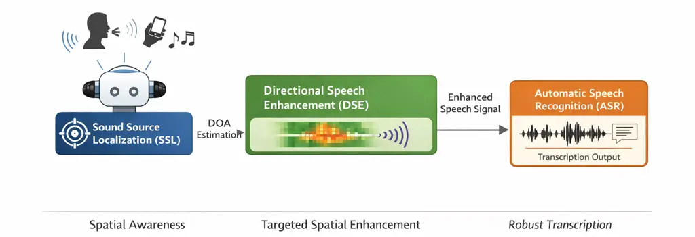
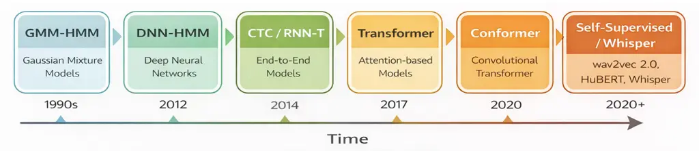

# Spatial Speech Perception Systems: A Survey of Sound Source Localization, Directional Enhancement, and Speech Recognition

Pengyuan Shao    Dimitrios Kanoulas ^(†)^(†)thanks: Pengyuan Shao and
Dimitrios Kanoulas are with the Department of Computer Science,
University College London, London, U.K.

###### Abstract

Robust speech understanding in real-world acoustic environments remains
a fundamental challenge for intelligent auditory systems. Applications
such as robot audition, hearing aids, assistive listening devices,
teleconferencing systems, and voice-controlled assistants must operate
in the presence of background noise, reverberation, competing speakers,
and dynamic acoustic conditions to accommodate various real-world
settings. Inspired by the human ability to selectively attend to
relevant speakers in complex auditory scenes, increasing attention has
been devoted to spatial speech perception, which exploits spatial
information captured by microphone arrays to localize, enhance, and
interpret target speech signals within complex acoustic scenes.
Realizing this capability requires advances across multiple research
areas, including sound source localization (SSL), speech enhancement and
separation, and automatic speech recognition (ASR). Over the past
decades, each of these fields has experienced substantial progress,
driven by developments in array signal processing, deep learning, and
large-scale speech modeling. As speech-enabled systems become
increasingly autonomous and interactive, understanding the interplay
among localization, enhancement, and recognition has become increasingly
important for achieving robust speech perception in real-world
environments.

Despite rapid progress in each area, the literature remains fragmented
across multiple research communities, making it difficult to obtain a
unified understanding of how these technologies contribute to robust
speech perception systems. This paper presents a comprehensive survey of
spatial speech perception systems, with particular emphasis on the roles
of sound source localization, directional speech enhancement, and
automatic speech recognition individually and within integrated
processing frameworks. We review both classical signal-processing
approaches and recent learning-based methods, covering microphone-array
localization, beamforming and neural enhancement techniques, speech
separation, and modern recognition architectures. Beyond component-level
analysis, we examine robustness to noise and reverberation,
multi-speaker operation, real-time constraints, computational
efficiency, and the relationship between enhancement quality and
downstream recognition performance. We further examine representative
applications in robot audition, hearing assistance, smart speakers, and
teleconferencing, highlighting how different system requirements
influence the design of spatial speech perception pipelines. Finally, we
identify key challenges and outline future research directions toward
robust, low-latency, and perception-aware speech systems capable of
reliable operation in complex acoustic environments.

###### Index Terms: 

Sound source localization, speech enhancement, speech separation,
automatic speech recognition, microphone arrays, spatial audio, speech
perception systems.

## I Introduction

With the rapid development of speech and audio signal processing
technologies, intelligent auditory systems are increasingly expected to
operate beyond clean, close-talking, and single-speaker conditions.
Modern speech-enabled systems, including hearing aids, assistive
listening devices, teleconferencing platforms, smart speakers, wearable
devices, and robots, must process speech in complex acoustic
environments involving background noise, reverberation, interfering
sources, and multiple competing speakers \[1, 2, 3, 4\]. Unlike
conventional laboratory speech recognition settings, where the input
signal is often assumed to be clean, well captured, and produced by a
single speaker, real-world auditory systems must infer useful speech
information from spatially distributed, degraded, and dynamically
changing acoustic observations. Under these conditions, robust speech
understanding requires not only recognizing what is being said, but also
identifying where the relevant speech originates from and how it can be
separated from other sound sources.

This problem is closely related to the long-standing challenge of
listening in multi-talker acoustic scenes. Human listeners are often
able to attend to a target speaker in the presence of competing voices
and background noise by exploiting a combination of spectral, temporal,
spatial, and contextual cues \[1, 2, 3\]. In machine listening systems,
however, this capability remains difficult to reproduce, particularly
when speech is captured at a distance or by compact microphone arrays
with limited spatial resolution. Far-field speech signals are affected
by room reverberation, source movement, sensor placement, device noise,
and overlap between speakers \[4, 5, 6\]. As a result, the acoustic
signal received by the system may contain a mixture of target speech,
competing speech, diffuse noise, and reflected sound, making direct
recognition unreliable.

Among the key approaches to real-world speech processing, spatial speech
perception has attracted increasing attention as a framework for robust
speech understanding in complex acoustic environments. Spatial speech
perception exploits spatial information captured by microphone arrays to
support the analysis, enhancement, and recognition of speech signals. In
this setting, speech is not treated merely as a monaural waveform to be
recognized independently, but as an acoustic event embedded in space and
time. The spatial origin of a speaker, the propagation path between
source and microphones, the interference structure of the scene, and the
geometry of the microphone array all influence the quality and
reliability of the captured signal \[7, 8, 4\]. Therefore, robust speech
understanding in realistic environments requires a processing
perspective that connects acoustic sensing, spatial filtering, target
speech extraction, and linguistic decoding.

Spatial speech perception is relevant to a wide range of speech and
audio applications. In hearing aids and assistive listening devices,
spatial selectivity can improve speech intelligibility by suppressing
competing speakers and background noise while preserving useful binaural
cues \[8\]. In teleconferencing and meeting transcription,
multi-microphone processing can help separate overlapping speakers and
improve recognition performance in distant conversational recordings
\[5, 6\]. In smart speakers and voice-controlled assistants, spatial
awareness can improve far-field speech capture under reverberant and
noisy conditions \[4\]. In robot audition, spatial speech perception
supports speaker localization, speech-driven navigation, human-robot
interaction, and auditory scene understanding in dynamic environments,
enabling robots to better interpret and respond to real-world acoustic
events \[9\]. Across these applications, the common objective is to
transform degraded multichannel acoustic observations into reliable
speech information under practical constraints such as latency,
robustness, and limited computational resources.

This motivates the study of spatial speech perception systems, where
acoustic signals are processed through a pipeline involving sound source
localization (SSL), directional speech enhancement (DSE), and automatic
speech recognition (ASR). As illustrated in Fig. 1, SSL estimates the
direction or position of acoustic sources from microphone array
observations, DSE enhances the target speech signal by exploiting
spatial information such as the direction of arrival (DOA), and ASR
converts the resulting speech signal into text, commands, or other
linguistic representations. This pipeline provides a structured view of
how multichannel acoustic observations can be transformed into
interpretable speech information.

Fig. 1: Overview of a spatial speech perception pipeline, illustrating
the integration of sound source localization (SSL), directional speech
enhancement (DSE), and automatic speech recognition (ASR).

### I-A Background

Traditional speech and audio processing systems have primarily focused
on well-defined component-level objectives, such as speech quality
improvement, acoustic source localization, speech enhancement,
separation accuracy, or word-level recognition performance. In such
systems, performance is generally measured using task-specific metrics,
including signal-to-noise ratio (SNR), angular error, signal distortion
ratio, perceptual quality, speech intelligibility, word error rate,
throughput, or latency. However, modern intelligent auditory systems
increasingly involve application-oriented objectives, where the value of
the processed speech signal depends not only on waveform fidelity or
component accuracy, but also on its usefulness for perception,
interaction, reasoning, and downstream decision-making. For example, in
speech-based interaction, a system may not need to reconstruct the exact
acoustic waveform if it can reliably infer the speaker’s intent.
Conversely, high signal fidelity alone does not guarantee successful
speech understanding if the recovered speech remains unintelligible,
misrecognized, or attributed to the wrong speaker.

This shift introduces new requirements for spatial speech perception
systems. Instead of treating speech as a passive single-channel signal
to be enhanced or recognized independently, practical auditory systems
must account for the complete information flow from acoustic capture to
linguistic interpretation. The first challenge is spatial ambiguity. In
realistic environments, multiple sound sources may be active
simultaneously, and the target speaker may change over time. Without
spatial awareness, a system may enhance or recognize the wrong source
\[7, 10, 11\]. The second challenge is acoustic degradation. Background
noise, reverberation, and overlapping speech can significantly reduce
the quality and intelligibility of the captured signal \[12, 13, 14, 15,
16\]. The third challenge is recognition reliability. Even when a
signal-level enhancement method improves perceptual quality, it may not
necessarily reduce ASR errors or improve downstream task success \[17,
18\]. The fourth challenge is real-time operation. Interactive speech
systems require low and predictable latency, and long processing delays
can reduce usability even when recognition accuracy is high \[19, 20\].

SSL, DSE, and ASR address different parts of this problem. SSL provides
spatial sensing by estimating the source location or DOA from
multichannel signals. Classical SSL methods, including
time-difference-of-arrival estimation, generalized cross-correlation,
beamforming-based localization, and subspace-based methods, rely on
explicit acoustic models and microphone array geometry \[7, 21, 22\].
These approaches often have interpretable structures and predictable
computational properties, making them attractive for low-latency
systems. However, their performance can degrade under strong
reverberation, diffuse noise, or multiple simultaneous speakers. More
recent learning-based SSL approaches attempt to learn spatial
representations directly from multichannel audio features, improving
flexibility in complex acoustic scenes, but often require large datasets
and may introduce additional computational cost \[10, 11\].

DSE forms the second stage of the spatial speech perception pipeline.
Once the target direction is estimated or inferred, DSE aims to extract
or enhance the speech signal corresponding to that direction. Classical
beamforming methods such as minimum variance distortionless response
(MVDR) and generalized sidelobe canceller (GSC) use spatial filtering to
preserve the target direction while suppressing interference \[23, 24\].
These methods are mathematically grounded and computationally efficient,
but they depend on accurate steering vectors, reliable covariance
estimation, and appropriate array calibration. Neural enhancement
methods, including masking-based, filtering-based, and DOA-conditioned
architectures, have been introduced to improve robustness in challenging
environments \[12, 13, 25, 14, 15, 16\]. In particular, DOA-conditioned
enhancement models explicitly use spatial information as input, making
them highly relevant to integrated spatial speech perception systems.

ASR provides the linguistic decoding stage. Its role is to transform the
enhanced speech signal into text, commands, or other linguistic
representations. ASR has evolved from traditional statistical systems
based on hidden Markov models and handcrafted acoustic features to
modern end-to-end neural architectures based on CTC, RNN-T, attention
mechanisms, Transformers, Conformers, and self-supervised speech
representation learning \[26, 27, 28, 29, 30, 31, 32\]. These advances
have significantly improved recognition performance under many
conditions. Nevertheless, ASR remains vulnerable to noise,
reverberation, domain mismatch, overlapping speech, and upstream
enhancement artifacts \[17, 18\]. This vulnerability is particularly
important from a spatial speech perception perspective because the final
objective is reliable speech understanding rather than signal
reconstruction alone.

Although SSL, DSE, and ASR have each achieved substantial progress,
practical auditory systems often require these technologies to operate
together rather than as isolated modules. This creates a need to
understand not only the performance of each component, but also how
spatial estimates, enhanced speech signals, and recognition outputs
interact across the complete processing chain. For example, an
inaccurate or unstable DOA estimate may cause DSE to suppress the target
speaker or enhance an interfering source. Similarly, an enhancement
model that improves perceptual quality may still introduce artifacts
that degrade ASR performance, while an ASR model that performs well on
clean speech may be vulnerable to residual noise, reverberation, or
separation errors. Therefore, spatial speech perception should be
studied as an integrated system in which localization, enhancement, and
recognition are jointly evaluated under robustness, latency,
computational, and deployment constraints.

### I-B Motivation

The integration of spatial sensing, speech enhancement, and recognition
is important for building robust speech perception systems in real-world
acoustic environments. This integrated perspective not only improves
target-speaker understanding under interference, but also highlights how
localization, enhancement, and recognition should be jointly considered
under recognition, latency, robustness, and deployment constraints.

First, spatial speech perception enables more reliable target-speaker
understanding under interference. In many practical environments, the
target speaker is not the only active source. Competing speakers,
environmental sounds, device-generated noise, and reverberation can
severely degrade both speech intelligibility and recognition accuracy.
By estimating the spatial structure of the acoustic scene, SSL helps
identify candidate target sources, while DSE uses this spatial
information to improve the target-to-interference ratio before
recognition \[10, 11, 14, 15, 16\]. This makes the recognition process
more target-aware than applying ASR directly to raw microphone signals,
particularly in far-field, multi-speaker, and noisy conditions.

Second, the pipeline supports recognition-oriented speech processing by
prioritizing information that is useful for downstream understanding. In
spatial speech perception systems, the objective is not necessarily to
reconstruct a perfectly clean waveform, but to preserve the acoustic and
linguistic cues required for accurate recognition and interaction.
Directional enhancement can therefore be interpreted as a target-aware
front-end that increases the relative prominence of the desired speech
signal before ASR. This is important because signal-level improvements
in perceptual quality do not always translate into lower word error rate
or better task performance \[17, 18\]. A pipeline-level perspective is
therefore needed to understand how enhancement objectives should be
aligned with recognition-oriented criteria.

Third, the pipeline exposes important system-level trade-offs that
cannot be captured by evaluating each component in isolation. For
example, an SSL module with high angular accuracy may still be
unsuitable for interactive systems if it introduces excessive delay or
unstable source estimates. A DSE model may improve perceptual speech
quality but distort phonetic cues required by ASR. An ASR model may
achieve high offline accuracy but be unsuitable for real-time
interaction if it requires long input contexts or delayed decoding.
Therefore, spatial speech perception should be evaluated using criteria
that jointly consider spatial accuracy, enhancement quality, recognition
accuracy, latency, robustness, and computational cost \[20, 19\].

Fourth, spatial speech perception provides a practical framework for
deployable and resource-constrained auditory systems. In many real-world
applications, acoustic sensing is performed on compact microphone
arrays, wearable devices, smart speakers, hearing aids, or mobile
robots, where computation, memory, energy consumption, and latency are
limited. Considering SSL, DSE, and ASR as an integrated pipeline makes
it possible to analyze where computation should be allocated, which
stages should be performed locally, how much spatial information should
be retained, and how enhancement and recognition models can be made
efficient enough for real-time use. Although this survey primarily
focuses on the algorithmic pipeline of SSL, DSE, and ASR, these
deployment considerations motivate future research on efficient,
adaptive, and perception-aware speech processing architectures for
real-world operation.

### I-C Contributions

Through a systematic review and comparative analysis of the existing
literature, this paper provides a unified knowledge framework for
spatial speech perception systems, covering component technologies,
system-level evaluation, integrated processing pipelines, applications,
challenges, and future research directions. The main contributions are
as follows.

- •
  Systematic review of component technologies: In Sections II, III,
  and IV, we review classical and learning-based methods for SSL, DSE,
  and ASR. For SSL, we discuss traditional approaches such as TDoA,
  GCC-PHAT, SRP-PHAT, MVDR-based localization, and subspace-based
  methods, together with learning-based CNN, CRNN, and attention-based
  models. For DSE, we examine filtering-based, masking-based, and
  DOA-conditioned enhancement approaches. For ASR, we summarize the
  evolution from traditional hybrid systems to CTC, RNN-T, Transformer,
  Conformer, self-supervised, and large-scale pretrained models.
- •
  System-level evaluation for spatial speech perception: In Section V,
  we analyze existing works from the perspectives of robustness,
  real-time feasibility, noise tolerance, multi-speaker operation, and
  downstream recognition performance. In particular, we emphasize that
  spatial speech perception systems should be evaluated not only by
  component-level metrics, but also by system-level criteria such as
  latency accumulation, error propagation, recognition accuracy,
  target-speaker consistency, and recognition-oriented reliability. This
  perspective highlights the need to assess whether improvements in SSL
  or DSE actually translate into more robust speech understanding.
- •
  Analysis of integrated spatial speech perception pipelines: In
  Section VI, we survey representative systems that combine
  localization, enhancement, separation, and recognition. Rather than
  treating these components as independent modules, we analyze how
  spatial information is used to guide enhancement, how enhanced speech
  affects recognition, and how end-to-end or jointly optimized
  architectures attempt to align intermediate processing with downstream
  recognition objectives. This analysis clarifies the design trade-offs
  among interpretability, robustness, latency, computational efficiency,
  and recognition-oriented optimization.
- •
  Applications, challenges, and future directions for robust auditory
  systems: In Section VII, we discuss representative applications of
  spatial speech perception in hearing aids and assistive listening
  devices, robot audition, smart speakers and smart-home interfaces,
  teleconferencing and meeting transcription, auditory software
  interfaces, and wearable or mobile speech systems. We further identify
  key open challenges, including the mismatch between signal-level and
  task-level objectives, limited real-time evaluation, simplified
  acoustic assumptions, lack of standardized SSL–DSE–ASR pipeline
  benchmarks, robustness under noisy and dynamic multi-speaker
  conditions, multichannel microphone and array constraints, and
  resource limitations in embedded deployment. Finally, we outline
  future directions toward perception-aware spatial speech processing,
  including recognition-oriented enhancement, uncertainty-aware spatial
  sensing, multimodal scene-aware perception, joint
  localization–enhancement–recognition modeling, streaming and causal
  architectures, and robust low-latency speech understanding in complex
  real-world acoustic environments.

## II Sound Source Localization

### II-A Traditional Methods

From a spatial speech perception perspective, SSL provides spatial
information that supports target-aware speech processing. The estimated
direction of arrival (DOA), source position, or spatial probability map
can be used to guide downstream directional speech enhancement and
improve the reliability of speech recognition.

Sound source localization (SSL) is a fundamental spatial sensing task in
spatial speech perception systems, aiming to estimate the direction or
position of an acoustic source using signals captured by a microphone
array. Traditional SSL methods are primarily rooted in array signal
processing and explicit acoustic modeling, relying on assumptions about
sound propagation, microphone geometry, and noise characteristics. These
approaches have played a central role in practical speech and acoustic
sensing systems due to their low computational requirements,
deterministic structure, interpretability, and predictable latency \[7,
9, 33, 34\].

#### II-A1 Time-Difference-of-Arrival (TDoA) and Cross-Correlation Methods

One of the earliest and most intuitive formulations of SSL is based on
estimating the time difference of arrival (TDoA) between signals
recorded by pairs of microphones. When a sound wave propagates across a
microphone array, it reaches spatially separated microphones at slightly
different times. These delays encode spatial information on the source
direction relative to the array, and can be exploited to infer the
direction of arrival (DOA) under the far-field assumption \[35\].

Cross-correlation methods estimate TDoA by measuring the similarity
between microphone signals as a function of time lag. The generalized
cross-correlation (GCC) framework introduced frequency-domain weighting
functions to improve robustness against noise and reverberation, with
the phase transform (PHAT) weighting proposed to emphasize phase
alignment while suppressing magnitude effects \[21\]. The resulting
GCC-PHAT method has become a canonical TDoA estimator in acoustic
sensing due to its low computational cost, and has been widely adopted
in real-time acoustic sensing, robot audition, and microphone-array
speech processing systems.

Despite its popularity, GCC-PHAT exhibits several limitations. It
typically assumes the presence of a dominant sound source, making it
sensitive to interference from competing speakers. In addition,
reverberation introduces multiple correlation peaks corresponding to
reflections, which can lead to erroneous delay estimates. The
discretization of TDoA values further limits angular resolution,
especially for compact microphone arrays commonly mounted on mobile
systems. Several correlation-based extensions of GCC-PHAT have been
proposed to partially mitigate these issues, including modified spectral
weightings and robust cross-correlation formulations that suppress
reverberation-induced spurious peaks or reduce interference from
competing speakers \[21, 36, 37\]. However, these approaches remain
fundamentally limited by their reliance on pairwise correlations and
peak selection, motivating a transition toward beamforming-based methods
that exploit array-wide spatial integration.

#### II-A2 Steered Response Power and Beamforming-Based Localization

Beamforming-based SSL methods extend the TDoA concept by coherently
combining signals from all microphones under hypothesized source
directions. In this framework, the microphone array is virtually steered
toward candidate directions, and a spatial response measure is evaluated
to determine the most likely source location. Delay-and-sum beamforming
represents the simplest instantiation of this idea and forms the basis
of many classical spatial filtering approaches \[38\]. Specifically,
signals received at each microphone are time-aligned according to the
expected propagation delays from a hypothesized direction and then
summed, such that contributions from the true source add constructively
while signals arriving from other directions are attenuated due to phase
misalignment.

Beyond delay-and-sum, adaptive beamforming methods exploit second-order
spatial statistics to enhance directional selectivity. A representative
example is the Minimum Variance Distortionless Response (MVDR)
beamformer \[23\], which designs a spatial filter by minimizing the
output power using the spatial covariance matrix, subject to a
distortionless constraint on signals arriving from a hypothesized
direction. MVDR, therefore, is capable of suppressing interference and
background noise more effectively than fixed beamformers. MVDR has been
successfully deployed in some robotic systems to suppress ego-noise and
environmental interference, particularly in outdoor mobile robots
\[39\]. In practice, however, MVDR performance depends critically on
accurate covariance estimation, which can be challenging in highly
dynamic environments.

Building on the directional response of beamforming, sound source
localization can be formulated by evaluating this response across
candidate source directions. Steered Response Power (SRP) methods follow
this idea by scanning the spatial domain and selecting the direction
that maximizes the array response, directly producing a
direction-of-arrival estimate. SRP-PHAT further combines this scanning
strategy with PHAT-weighted cross-correlations, improving robustness in
reverberant environments. Due to its ability to handle arbitrary array
geometries and localize multiple speakers, SRP-PHAT has been widely used
in real-time acoustic middleware such as ODAS, enabling real-time
multi-source localization on mobile and embodied platforms \[34\].

However, SRP-based methods typically rely on discretized spatial grids
and precomputed TDoA tables, leading to substantial memory usage and
computational overhead. To address these challenges, various
acceleration strategies have been proposed, including hierarchical
spatial search, coarse-to-fine resolution schemes, and lookup table
optimization \[34\]. Despite these optimizations, SRP-based systems
remain sensitive to strong noise and source overlap, which has motivated
hybrid pipelines that combine beamforming with additional signal
enhancement or learning-based components in real-world deployments
\[40\].

|        |      |          |         |                                 |        |          |        |
| ------ | ---- | -------- | ------- | ------------------------------- | ------ | -------- | ------ |
| Paper  | Year | Platform | Env.    | Model                           | \# Mic | Max Src. | S/M    |
| \[33\] | 2017 | UAV      | Outdoor | SEVD-MUSIC, iGSVD-MUSIC + ORPCA | 36     | 1        | Static |
| \[41\] | 2019 | Humanoid | Indoor  | DSVD-PHAT                       | 4      | 1        | Static |
| \[39\] | 2023 | UGV      | Indoor  | PCA + MVDR                      | 16     | 1        | Static |
| \[42\] | 2024 | N/S      | Indoor  | DUET + SRP-PHAT                 | 4      | 3        | Static |
| \[40\] | 2025 | UGV      | Outdoor | MVDR Beamformer + IRM           | 16     | 1        | Static |

TABLE I: Traditional signal-processing-based sound source localization
methods in real-world spatial acoustic systems.

#### II-A3 Subspace-Based Methods

To achieve higher angular resolution and improved multi-source
discrimination, subspace-based methods such as Multiple Signal
Classification (MUSIC) were introduced. MUSIC exploits the
eigenstructure of the spatial covariance matrix to separate signal and
noise subspaces, leveraging the orthogonality between array steering
vectors and the noise subspace to identify source directions \[22\].
Originally developed for narrowband signals, MUSIC was later extended to
broadband scenarios, including speech, through frequency-domain
aggregation techniques \[43\].

Subspace-based methods provide super-resolution capabilities under ideal
conditions, enabling the separation of closely spaced sources beyond the
limits of beamforming-based approaches. In robotics, MUSIC-based methods
have been applied to platforms requiring high angular resolution under
severe noise conditions, such as microphone-array-equipped UAVs for
search and rescue tasks \[33\]. However, classical MUSIC assumes
spatially white noise, uncorrelated sources, accurate array calibration,
and prior knowledge of the number of active sources. These assumptions
are frequently violated in real-world acoustic environments, where noise
is often spatially correlated and sound sources may overlap both
temporally and spectrally.

To address these limitations, several extensions of MUSIC have been
proposed. Generalized Eigenvalue Decomposition MUSIC (GEVD-MUSIC)
introduces a noise reference covariance matrix and solves a generalized
eigenvalue problem to better handle colored and spatially correlated
noise \[44\]. It has been adopted in robotic audition systems to improve
robustness under strong ego-noise, particularly on aerial robots where
propeller noise dominates the acoustic scene \[33\].

Generalized Singular Value Decomposition MUSIC (GSVD-MUSIC) \[45\]
further refines this approach by enforcing orthogonality between the
signal and noise subspaces, leading to improved DOA estimation accuracy
under challenging noise conditions. Incremental variants such as
iGSVD-MUSIC have been proposed to enable adaptive subspace updates for
streaming and time-varying scenarios, reducing computational overhead
and improving responsiveness in dynamic acoustic scenes \[46\].

Despite these advances, MUSIC-based methods remain computationally
demanding due to the repeated eigenvalue decompositions required for
subspace estimation, motivating the development of hybrid approaches
that seek to reduce computational complexity through structural reuse or
low-rank approximations.

#### II-A4 Hybrid Approaches

Beyond the traditional categorization, several approaches have been
proposed that explicitly integrate elements across paradigms, among
which SVD-based formulations of SRP-PHAT provide a representative
example. In conventional SRP-PHAT, pairwise GCC-PHAT responses are
aggregated across microphone pairs and evaluated through a steered
spatial response over a discretized spatial grid. While effective, this
procedure relies heavily on dense spatial sampling and precomputed TDoA
tables, resulting in substantial memory usage and computational
overhead. To address these limitations, SVD-based formulations
reinterpret the SRP-PHAT objective as a low-rank approximation problem,
enabling the spatial response to be computed more efficiently through
matrix factorization \[41\]. By applying singular value decomposition to
the phase-transformed cross-spectral matrices, these methods reduce the
dimensionality of the localization problem while preserving the dominant
spatial information relevant for DOA estimation.

In summary, Table I presents traditional signal-processing-based sound
source localization methods applied in real-world systems, reporting for
each work the publication year, system embodiment (if any), operating
environment, core localization model, microphone array size, maximum
number of simultaneously active sources, and whether the setup involves
static or moving sources.

### II-B Learning-based Methods

Recent years have seen a growing shift from purely model-based sound
source localization (SSL) toward learning-based approaches. Instead of
relying on handcrafted spatial cues and analytical formulations, these
methods leverage deep neural networks to learn discriminative spatial
representations directly from data. In real-world spatial speech
perception scenarios, this shift is motivated by the need to operate
under conditions that violate classical assumptions, including strong
reverberation, platform-induced noise, and multiple simultaneous sound
sources.

#### II-B1 Convolutional Neural Networks (CNNs)

Convolutional neural networks (CNNs) constitute one of the earliest deep
learning architectures applied to sound source localization, primarily
due to their ability to extract spatial patterns from structured
time-frequency and inter-channel representations. An early and
influential contribution is the work of Chakrabarty and Habets \[47\],
who proposed a CNN-based framework for broadband direction-of-arrival
estimation using phase-based spatial features. Their method operates on
phase maps constructed from the short-time Fourier transform of
multichannel signals, capturing inter-microphone phase differences
across frequency bands.

Building on this line of work, CNN-based SSL has been further explored
in interactive acoustic settings. He et al. \[48\] proposed a deep
neural network framework for multiple speaker detection and
localization. Their system was evaluated using real-world recordings
collected from a Pepper humanoid robot equipped with a four-microphone
array. The CNN operates on sub-band cross-correlation features derived
from microphone pairs, enabling the network to capture spatial delay
patterns associated with multiple simultaneous speakers. In addition, a
likelihood-based output encoding was introduced to allow localization of
an arbitrary number of active sources, resulting in improved detection
accuracy and reduced angular error compared to conventional methods.

CNN-based SSL has also been investigated for humanoid auditory
perception in indoor environments. Boztas \[49\] developed a
learning-based localization system for a NAO robot using time-frequency
features extracted via discrete wavelet transforms. These wavelet-based
representations encode both spectral and temporal characteristics of the
acoustic signals and are used as inputs to various neural architectures,
including CNNs, LSTMs, and bidirectional LSTMs. Experiments conducted on
real-world recordings demonstrated that learning-based models can
achieve accurate spatial estimation in controlled indoor settings.
However, evaluations were performed offline, and performance under
outdoor or highly dynamic acoustic conditions was not explored.

In addition to direct DOA regression, CNNs have also been used as
learned weighting modules that enhance classical correlation-based
localization pipelines while preserving their structure and
computational efficiency. Wang et al. \[50\] proposed a speech-oriented
extension of GCC-PHAT in which a lightweight CNN predicts frequency
masks from magnitude spectra. These masks are applied to the normalized
cross-power spectrum to emphasize speech-dominant regions before
cross-correlation, improving the reliability of TDoA estimation under
noise and reverberation. The method was evaluated on real-world recorded
datasets and demonstrated improved localization accuracy compared to
standard GCC-PHAT, while remaining compatible with real-time deployment.

#### II-B2 Convolution Recurrent Neural Networks (CRNNs)

While CNNs are effective at extracting spatial features, they do not
explicitly model temporal dependencies, which are critical for handling
intermittent speech, overlapping sound events, and moving sources. To
address this limitation, convolutional–recurrent neural networks (CRNNs)
combine convolutional front-ends with recurrent layers such as LSTMs or
GRUs, enabling temporal aggregation of spatial cues.

CRNN architectures form the backbone of the Sound Event Localization and
Detection (SELD) framework, most prominently represented by SELDnet
\[51\]. SELDnet unified sound event detection and direction-of-arrival
estimation within a single network and has served as an influential
baseline architecture for DCASE Task 3. Through extensive evaluations on
multi-source and reverberant datasets, SELDnet demonstrated that joint
temporal–spatial modeling significantly improves localization stability
compared to frame-wise methods. Recent extensions of CRNN-based SELD
systems have further improved robustness through data generation and
imbalance handling. Shin and Chun \[52\] proposed a residual CNN
combined with temporal modeling and multi-generator data sampling to
address the imbalance between real and synthetic recordings in DCASE
datasets.

Although SELDnet and its variants have been extensively evaluated in
benchmark settings, their deployment on physical systems remains
limited. The primary reasons include high computational cost and
reliance on large labeled datasets.

|        |      |          |        |                                           |        |          |        |
| ------ | ---- | -------- | ------ | ----------------------------------------- | ------ | -------- | ------ |
| Paper  | Year | Platform | Env.   | Model                                     | \# Mic | Max Src. | S/M    |
| \[48\] | 2018 | Humanoid | Indoor | CNN-GCCFB / TSNN-GCCFB                    | 4      | 2        | Static |
| \[51\] | 2019 | N/S      | Indoor | CRNN + ACCDOA / mACCDOA                   | 4      | 3        | Moving |
| \[50\] | 2021 | Humanoid | Indoor | CNN Mask + GCC-PHAT-SM + MLP/SNN          | 4      | 2        | Static |
| \[53\] | 2022 | N/S      | Indoor | ResNet–Conformer + ACCDOA Ensemble        | 4      | 3        | Moving |
| \[54\] | 2023 | N/S      | Indoor | Mic-Pair Model + Array-Specific MLP       | 2–4    | 2        | S+M    |
| \[52\] | 2023 | N/S      | Indoor | RCNN + Transformer                        | 4      | 3        | Moving |
| \[49\] | 2023 | Humanoid | Indoor | CNN, LSTM, biLSTM, MLP                    | 4      | 1        | Moving |
| \[55\] | 2024 | N/S      | Indoor | CNN–Transformer                           | 18     | 3        | Static |
| \[56\] | 2025 | N/S      | Indoor | Hybrid CNN–LSTM, Patch Transformer        | 1      | /        | /      |
| \[57\] | 2025 | Wheeled  | Indoor | Filter-Attention CNN + EKF                | 1      | 1        | Static |
| \[58\] | 2025 | N/S      | Indoor | IPDnet2                                   | 5      | 1        | S+M    |
| \[59\] | 2025 | N/S      | Indoor | CRNN + Source Count Fusion                | 3      | 2        | S+M    |
| \[60\] | 2025 | N/S      | Indoor | Hierarchical Attention Network (AuralNet) | 2      | 3        | S+M    |

TABLE II: Learning-based sound source localization methods in real-world
spatial acoustic systems.

#### II-B3 Attention-based SSL

Attention mechanisms and transformer-based architectures have been
introduced to overcome the limitations of recurrent models by enabling
global modeling across time, frequency, and spatial channels. By
adopting self-attention mechanisms, these approaches can capture
long-range dependencies among time-frequency representations,
facilitating more robust sound source localization in complex and
dynamic acoustic environments.

Zhang et al. \[55\] proposed a CNN–Transformer framework for multiple
sound source localization, combining sub-band spatial features derived
from SRP-PHAT with multi-head self-attention to distinguish true spatial
peaks from spurious reflections using sub-band spatial features. While
the system achieved strong localization accuracy on simulated and
real-world datasets, evaluations were conducted in wireless acoustic
sensor network settings rather than on mobile or embedded platforms. The
reliance on dense spatial grids and transformer-based inference
introduces significant computational overhead, limiting real-time
deployment on local platforms.

The DCASE SELD further popularized attention components for joint
localization and detection. Shin and Chun \[52\] combine a convolutional
front-end with a Transformer encoder to better capture global temporal
context, and propose data-generation strategies to mitigate imbalance
between real and synthetic data in SELD training. Similarly, Wang et al.
employ a ResNet–Conformer backbone and strong augmentation and ensemble
strategies \[53\]. Such systems illustrate the strong performance of
attention-heavy SELD architectures, but they are generally oriented
toward SSL benchmark accuracy rather than the real-time constraints
required by interactive spatial speech perception systems.

To conclude, attention-based methods demonstrate strong modeling
capacity and improved performance in complex acoustic scenes, but
practical acoustic systems often favor lighter architectures or hybrid
designs that balance localization accuracy with real-time constraints.
Table II provides an overview of learning-based sound source
localization approaches. Overall, SSL provides the spatial sensing
foundation for spatial speech perception by estimating where acoustic
sources are located. Traditional methods remain attractive for real-time
and resource-constrained systems due to their deterministic structure
and low computational cost, whereas learning-based methods offer
stronger modeling capacity in complex acoustic scenes. However,
localization alone does not directly improve the quality or
intelligibility of the captured speech signal. In noisy and
multi-speaker environments, the estimated spatial information must be
further exploited to suppress interference and extract the target
speech. This motivates the next stage of the spatial speech perception
pipeline: directional speech enhancement, where SSL outputs such as DOA
estimates are used to guide target-aware signal enhancement before
downstream speech recognition.

## III Directional Speech Enhancement

Sound source localization (SSL) enables a spatial speech perception
system to estimate the direction of arrival (DOA) of acoustic sources in
its surrounding environment. While SSL provides crucial spatial
awareness, it does not directly improve the quality of the recorded
speech signal. In realistic acoustic environments, speech signals are
often captured under challenging acoustic conditions involving
background noise, reverberation, and multiple simultaneously speaking
individuals. As a result, even when the direction of a target speaker is
correctly estimated, the captured audio may still contain significant
interference from competing sources. This degraded signal quality can
negatively affect downstream automatic speech recognition (ASR) systems
and reduce the reliability of downstream speech recognition.

To address this challenge, speech enhancement and speech separation
techniques are commonly applied before ASR to improve the
intelligibility and recognition reliability of the captured speech
signal. Early deep learning approaches focused on the problem of
multi-speaker speech separation, where the objective is to isolate
individual speakers from a mixture without explicit knowledge of their
spatial location. Methods such as Deep Clustering and Deep Attractor
Networks learn discriminative representations of time–frequency (TF)
components that allow overlapping speech signals to be separated.
Although these techniques can effectively isolate different speakers,
they do not explicitly exploit spatial information or directional cues.

In spatial speech perception systems equipped with microphone arrays,
spatial information can be leveraged to further improve speech
enhancement performance. When combined with SSL estimates, spatial
processing techniques allow the system to selectively enhance speech
originating from a particular direction while suppressing interference
from other spatial locations. Consequently, many spatial speech
processing pipelines integrate SSL with spatial filtering or neural
enhancement models to perform directional speech enhancement before the
enhanced signal is passed to ASR modules. Existing approaches for speech
enhancement can be broadly categorized into three groups: spatial
filtering approaches, time–frequency masking approaches, and
DOA-conditioned directional enhancement methods.

### III-A Filtering-based Approaches

Filtering-based approaches perform directional enhancement by estimating
spatial filters that operate directly on multichannel microphone
signals. These methods originate from classical beamforming techniques
and remain widely used in real-time spatial speech processing systems
due to their strong theoretical foundations and low computational
complexity.

One of the most well-known beamforming methods is the Minimum Variance
Distortionless Response (MVDR) beamformer \[23\]. MVDR computes spatial
filter weights that minimize the output signal power while maintaining a
distortionless response for the target direction. By exploiting the
spatial covariance structure of the microphone signals, MVDR suppresses
interference and noise arriving from other directions while preserving
the desired speech signal.

Another widely used approach is the Generalized Sidelobe Canceller (GSC)
\[24\], which reformulates the beamforming problem into a constrained
optimization framework consisting of a fixed beamformer, a blocking
matrix, and an adaptive interference cancellation stage. The upper path
is a constrained beamformer that steers to the desired direction,
producing a signal-plus-interference output. The lower path uses a
blocking matrix orthogonal to the steering vector to suppress the
desired signal and retain interference-dominant components, allowing the
adaptive filter to focus solely on suppressing interference. A weight
vector filters the noise in the lower path, which is subtracted from the
upper path to remove interference.

With the rise of deep learning, neural beamforming approaches have been
proposed to replace analytically derived spatial filters with
data-driven models. A representative example is the Filter-and-Sum
Network (FaSNet) \[25\], which learns adaptive beamforming filters
directly from multichannel input signals. FaSNet first selects one
channel as the reference signal and computes cross-correlations with the
other channels to extract spatial information about the sound sources.
It then applies a neural network to estimate time-domain filters for
reference channel. The similar procedure is then applied to other
channels to generate corresponding filters. These filters are then
applied to the input signals and summed to generate the enhanced speech
output. By learning spatial filtering parameters from data, FaSNet can
achieve strong performance while maintaining low latency.

Filtering-based approaches rely on different mechanisms for estimating
spatial filters. Classical beamforming methods such as MVDR and GSC
derive spatial filters analytically based on array geometry and steering
vectors corresponding to the target direction. In contrast, neural
beamforming approaches such as FaSNet learn adaptive spatial filters
directly from multichannel data without explicitly computing steering
vectors. While analytical methods offer strong theoretical guarantees
and low computational complexity, data-driven models provide greater
flexibility in complex acoustic environments where noise characteristics
and spatial configurations may vary.

### III-B Masking-based Approaches

Masking-based approaches operate in the time-frequency (TF) domain and
estimate a spectral mask that suppresses interference while preserving
the target speech components. These methods typically apply the
short-time Fourier transform (STFT) to the multichannel input signals
and estimate masks for each time-frequency bin.

One influential masking-based method is Deep Clustering \[12\], which
addresses the problem of separating overlapping speech sources by
learning discriminative embeddings for each TF bin. Instead of directly
estimating masks, the network maps each TF bin of the mixture
spectrogram into a high-dimensional embedding space. TF bins belonging
to the same speaker are encouraged to have similar embeddings, while
bins from different speakers are separated in the embedding space.
During inference, clustering algorithms such as k-means are applied to
the embeddings to group TF bins corresponding to different speakers, and
binary masks are subsequently constructed from the clustering
assignments. This approach allows the system to separate multiple
speakers without requiring explicit knowledge of the target speaker or
direction, and it has become a foundational method for deep
learning–based speech separation.

Another important masking-based method is the Deep Attractor Network
(DANet) \[13\], which extends the deep clustering framework by
introducing attractor points in the embedding space. In DANet, the
neural network learns embeddings for each TF bin similar to deep
clustering, but instead of performing clustering during inference, a set
of attractor points is estimated to represent the centers of different
speakers in the embedding space. Each TF bin is then associated with the
nearest attractor point, allowing masks to be generated directly through
similarity measures. This approach eliminates the need for an external
clustering algorithm during inference and improves computational
efficiency. Deep attractor networks also enable end-to-end training and
have demonstrated strong performance in multi-speaker speech separation
tasks.

Recent work has extended TF masking methods to multichannel scenarios by
incorporating spatial information into neural networks. One notable
example is the Joint Spatial and Tempo-Spectral Nonlinear Filter (JNF)
\[61\], which integrates spatial filtering and spectral enhancement into
a unified neural network architecture. In contrast to traditional
pipelines that separate beamforming and post-filtering stages, JNF
jointly models spatial, temporal, and spectral relationships using
recurrent neural networks. JNF processes time-frequency representations
through wideband and narrowband branches and generates corresponding
masks using recurrent and fully connected layers. These masks are then
applied to the time-frequency representations to estimate the target
speech and noise components. By jointly modeling spatial cues and
spectral characteristics, masking-based methods can achieve improved
enhancement performance compared with traditional beamforming
techniques.

However, despite their strong enhancement performance, masking-based
approaches present several limitations for real-time spatial speech
perception systems. First, most TF masking models operate in the
short-time Fourier transform (STFT) domain, which requires buffering
audio frames to construct time–frequency representations. This
frame-based processing introduces algorithmic latency that may affect
responsiveness in interactive speech applications. Furthermore, many
architectures rely on recurrent networks that exploit temporal context,
which can further increase inference delay depending on whether causal
or bidirectional models are used. Second, these approaches typically do
not explicitly incorporate direction-of-arrival (DOA) information.
Instead, spatial cues are implicitly learned from inter-channel time and
phase differences during training. As a result, the system lacks
explicit directional control and may struggle to selectively enhance
arbitrary speakers in dynamic multi-speaker environments.

### III-C DOA-conditioned Directional Enhancement

Recent research has explored the explicit integration of directional
cues into neural speech enhancement models. Unlike conventional masking
or beamforming approaches that infer spatial information implicitly from
inter-channel phase differences, time delays, or learned spatial
representations, these methods directly incorporate direction-of-arrival
(DOA) estimates as conditioning inputs to the neural network. Typically,
the DOA angle obtained from an upstream sound source localization (SSL)
module is encoded as a directional embedding and fused with acoustic
features extracted from multichannel microphone signals. By explicitly
providing spatial guidance to the model, these architectures allow the
enhancement network to focus on signals arriving from a specified
direction, making them well suited for spatial speech perception
pipelines where localization and enhancement modules operate
sequentially.

|                 |                   |                |           |                                                     |                                       |
| --------------- | ----------------- | -------------- | --------- | --------------------------------------------------- | ------------------------------------- |
| Category        | Methods           | DOA            | Real-time | Strength                                            | Limitation                            |
| Filtering-based | MVDR, GSC, FaSNet | $`\checkmark`$ | High      | Low latency Interpretable                           | Sensitive to DOA and noise estimation |
| Masking-based   | DC, DANet, JNF    | $`\times`$     | Low       | Strong separation quality                           | High latency No directional control   |
| DOA-conditioned | DRN, CDUNet       | $`\checkmark`$ | Medium    | Explicit spatial control Improved target extraction | Depends on DOA accuracy               |

TABLE III: Comparison of directional speech enhancement approaches for
spatial speech perception.

A representative DOA-conditioned architecture is the Directional
Recurrent Network (DRN) \[14\], which incorporates explicit directional
information into a neural speech enhancement model. In DRN, the
multichannel microphone signals are first converted into frame-level
acoustic features, which are then processed by a spatial filtering
module to capture inter-channel spatial information. The target-speaker
DOA is discretized and encoded as directional embeddings derived from
azimuth and elevation angles. These embeddings are fused with the
acoustic features within a recurrent neural network composed of stacked
LSTM layers, allowing the model to integrate temporal speech patterns
with directional cues. The network then predicts enhanced speech frames
corresponding to the specified direction. By explicitly injecting DOA
embeddings into the recurrent enhancement network, DRN demonstrates how
directional information can guide neural models to focus on speech
originating from a target direction.

Building on this idea of incorporating explicit directional cues into
neural architectures, alternative designs have explored convolutional
encoder–decoder networks to integrate spatial guidance. Another
representative DOA-conditioned architecture is the Causal Directed U-Net
(CDUNet) \[15\], which integrates directional beamforming cues with a
convolutional encoder–decoder network. In CDUNet, the DOA estimated by
the SSL module is used to generate steering vectors corresponding to the
target direction. Instead of relying on a single steering vector, the
model constructs three steering vectors representing the target
direction and two neighboring directions around it. These three steering
vectors approximate the spatial context around the target direction,
enabling the model to capture signals arriving from a small angular
neighborhood rather than a single direction. The spatial features
derived from these steering vectors are combined with spectral features
from the multichannel input and processed through a U-Net style
convolutional encoder–decoder architecture. The encoder captures
hierarchical spectral–spatial representations while the decoder
reconstructs enhanced speech features corresponding to the target
direction.

More recent work further extends DOA-conditioned enhancement by
introducing additional directional conditioning signals beyond the DOA
itself. One such approach introduces an end-to-end directional speech
extraction model that conditions the enhancement network on both DOA and
beamwidth embeddings \[16\]. In this architecture, the multichannel
mixture is first processed to extract spectral features, while the
target DOA and the desired spatial beamwidth are encoded through a clue
encoder that converts directional parameters into learnable embeddings.
These directional embeddings define a spatial region centered around the
target DOA and are fused with acoustic features within the neural
network. The model then processes the combined features through
convolutional modules designed to capture both cross-frequency
(crossband) interactions and local spectral dependencies (narrowband
processing). By jointly modeling spatial cues and spectral structures,
the network learns to extract speech signals originating within the
specified directional region while suppressing interference from other
directions. Unlike previous approaches that rely only on a single DOA
cue or fixed neighboring directions, this adjustable beamwidth-aware
conditioning explicitly defines the spatial extraction region around the
target speaker, allowing the system to flexibly control the spatial
focus of the enhancement process and improving robustness when multiple
speakers are present near the target direction.

Table III summarizes the key characteristics of different directional
speech enhancement approaches in terms of spatial modeling and real-time
performance. In spatial speech perception pipelines, DSE acts as the
bridge between spatial sensing and speech recognition: it transforms the
spatial information estimated by SSL into an enhanced target speech
signal that can be more reliably processed by downstream ASR systems.
However, enhancement quality alone does not guarantee recognition
accuracy, since signal-level improvements may not always translate into
lower recognition error. This motivates the next stage of the pipeline,
where ASR converts the enhanced acoustic signal into linguistic
representations for downstream interpretation.

## IV Automatic Speech Recognition (ASR)

Automatic Speech Recognition (ASR) is the linguistic decoding stage of
spatial speech perception systems. While sound source localization
provides spatial awareness and directional speech enhancement improves
the quality of the target signal, ASR converts the enhanced acoustic
signal into linguistic representations such as words, commands, or
transcriptions. In spatial speech perception systems, this stage is
critical because the final objective is not only to obtain an enhanced
signal, but also to produce reliable linguistic outputs that support
interaction, decision-making, and downstream applications.

In realistic acoustic environments, ASR systems must operate under
challenging acoustic conditions, including background noise,
reverberation, overlapping speakers, channel mismatch, and variable
recording devices. These factors can significantly degrade recognition
accuracy, especially when ASR is applied directly to raw microphone
signals. Therefore, the effectiveness of ASR depends not only on the
recognition model itself, but also on the quality and spatial
consistency of the upstream SSL and DSE stages. From a pipeline
perspective, ASR provides the final semantic output of the spatial
speech perception pipeline, while its performance reflects the
cumulative effects of localization accuracy, enhancement quality, and
latency constraints.

Recent advances in deep learning have significantly transformed ASR,
shifting from traditional hybrid systems toward end-to-end architectures
that directly map acoustic signals to text. Approaches such as
Connectionist Temporal Classification (CTC), Recurrent Neural Network
Transducers (RNN-T), attention-based encoder–decoder models,
Transformer-based architectures, and Conformer models have achieved
substantial improvements in recognition performance. In particular,
large-scale self-supervised and pretrained models, such as wav2vec 2.0,
data2vec, and Whisper, have demonstrated strong generalization across
diverse acoustic conditions, making them promising for real-world speech
applications.

ASR systems can also be distinguished by their inference mode. Streaming
ASR models process speech incrementally and emit partial or final
recognition results as audio is received, making them suitable for
interactive applications where low latency is required. Representative
streaming architectures include traditional online GMM-HMM and DNN-HMM
systems, as well as neural transducer models such as RNN-T and
Conformer-T \[26, 27, 29, 19\]. Recent streaming adaptations of
large-scale encoder-decoder ASR models have also been explored to reduce
the latency of models that were originally designed for offline or
utterance-level transcription, including Whisper-Streaming and
Simul-Whisper \[62, 63\]. In contrast, non-streaming ASR models
typically process complete utterances or longer audio segments before
producing a transcription. Attention-based encoder-decoder models,
self-supervised models such as wav2vec 2.0 and data2vec, and large-scale
models such as Whisper are commonly used in this mode \[30, 32, 64,
18\]. This distinction is important for spatial speech perception
systems because a model with high offline recognition accuracy may still
be unsuitable for real-time interaction if it requires long input
segments or delayed decoding. The real-time performance of both
streaming and non-streaming ASR models is discussed in Section V.

In this section, we focus on the architectural structure of ASR models
and review the evolution of ASR methodologies, covering both classical
and modern approaches. This discussion provides a foundation for
understanding how ASR can be integrated with upstream spatial sensing
and enhancement modules in spatial speech perception pipelines. As
illustrated in Fig. 2, ASR architectures have progressively evolved from
traditional hybrid GMM-HMM systems to modern end-to-end and
self-supervised models.

Fig. 2: Evolution of automatic speech recognition (ASR) architectures.

### IV-A Traditional Hybrid ASR

Early automatic speech recognition systems were predominantly based on
hybrid statistical frameworks that combine acoustic modeling with
probabilistic temporal sequence modeling. Among these, the Gaussian
Mixture Model–Hidden Markov Model (GMM-HMM) architecture has been the
most widely adopted and serves as the foundation of conventional ASR
systems \[26\]. In this framework, raw speech signals are first
transformed into compact acoustic representations, typically using
handcrafted features such as Mel-Frequency Cepstral Coefficients
(MFCCs), which are designed to capture perceptually relevant spectral
characteristics of speech.

The Hidden Markov Model (HMM) is then used to represent the temporal
structure of speech as a sequence of latent states corresponding to
phonetic units. Transitions between these states are governed by state
transition probabilities, enabling the model to capture the sequential
nature of speech production. The observation likelihood of each acoustic
feature vector given a hidden state is modeled using a Gaussian Mixture
Model (GMM), which approximates the distribution of acoustic features
associated with each phoneme. During decoding, the acoustic model is
integrated with a pronunciation lexicon and a language model to
determine the most probable word sequence.

To improve the modeling capacity of acoustic representations, deep
neural networks were later introduced to replace GMMs, resulting in
hybrid Deep Neural Network–Hidden Markov Model (DNN-HMM) systems \[27\].
In this approach, deep architectures are used to model the complex,
non-linear relationship between acoustic features and phonetic states,
significantly improving recognition accuracy compared to traditional
GMM-based systems. This transition marked an important step toward
incorporating learning-based components into ASR pipelines.

However, both GMM-HMM and DNN-HMM frameworks fundamentally rely on
handcrafted feature extraction, such as MFCCs, which may limit their
ability to fully capture the rich structure of raw speech signals and
adapt to diverse acoustic environments. This dependence on engineered
features constrains the representational flexibility of the models and
motivates the development of learning-based approaches that directly
learn feature representations from data. These advances have led to the
emergence of end-to-end ASR systems, which aim to jointly optimize
acoustic modeling and sequence prediction within a unified framework.

### IV-B Learning-based ASR

Learning-based ASR systems aim to directly map acoustic signals to text
or token sequences by jointly learning feature representations and
sequence prediction. Unlike traditional hybrid systems, these approaches
replace handcrafted feature engineering and modular pipelines with
neural network architectures that operate on raw or minimally processed
audio.

#### IV-B1 Connectionist Temporal Classification and RNN-Transducer ASR

In early stage, learning-based ASR systems commonly adopt recurrent
neural networks (RNNs) as the core architecture to model the temporal
dynamics of speech signals. In these approaches, an encoder network,
typically composed of stacked recurrent layers, processes input acoustic
features and generates a sequence of hidden representations \[65\].
These representations are then mapped to output tokens through different
training objectives, among which Connectionist Temporal Classification
(CTC) and the Recurrent Neural Network Transducer (RNN-T) are two widely
used formulations.

In CTC-based systems, the RNN encoder produces frame-level predictions
over output symbols (including a blank token), and the CTC loss function
is used to compute the probability of all valid alignments between the
input sequence and the target transcription \[28\]. This allows the
model to be trained without explicit one-to-one frame-level alignment,
significantly simplifying the training process. The CTC objective has
been successfully applied in early end-to-end ASR systems such as Deep
Speech \[66\], demonstrating that neural networks can directly learn
speech-to-text mappings from data. However, the CTC formulation assumes
that predictions at each time step are conditionally independent given
the input sequence, and therefore does not explicitly model dependencies
between output tokens.

To address this limitation, the RNN-Transducer (RNN-T) extends the
RNN-based architecture by introducing an additional prediction network
that conditions on previously generated output tokens \[29, 67, 68\].
The RNN-T model consists of three components: an encoder network that
processes acoustic features, a prediction network that encodes output
history, and a joint network that combines both representations to
generate the next-token probability distribution. By incorporating both
acoustic and label context, RNN-T enables joint modeling of input–output
sequences within a unified framework. Furthermore, incorporating
bidirectional recurrent architectures in the encoder allows the model to
exploit both past and future acoustic context, which has been shown to
significantly improve recognition performance in offline ASR settings
\[69, 70\].

While RNN-based architectures effectively capture temporal dependencies
in speech, their inherently sequential computation limits
parallelization and scalability. In addition, their ability to model
long-range dependencies is constrained, as information must be
propagated step-by-step through the sequence, which can lead to
degradation over long contexts. These limitations have motivated the
development of attention-based and Transformer-based architectures,
which replace recurrence with self-attention mechanisms to model global
context more efficiently.

#### IV-B2 Transformer-based ASR

The Transformer architecture replaces recurrence with multi-head
self-attention, allowing the model to directly capture global
dependencies across the entire input sequence \[30\]. In this framework,
both the encoder and decoder are composed of stacked self-attention and
feed-forward layers, enabling parallel computation over all time steps.
In ASR, the Speech Transformer extends this architecture by applying the
encoder–decoder framework to acoustic sequences, demonstrating that
self-attention can effectively model speech signals without relying on
recurrent structures \[71\]. Compared to RNN-based models, Transformer
ASR systems provide improved efficiency and stronger capability in
modeling long-range temporal relationships.

Recent advances in ASR have been driven by self-supervised learning,
where models are pretrained on large-scale unlabeled audio data and
later fine-tuned for speech recognition tasks. These approaches enable
the model to learn rich acoustic representations directly from raw
waveforms, significantly reducing the need for annotated datasets.
Representative models include wav2vec 2.0 and data2vec, which learn
contextualized speech representations through pretraining objectives
that capture temporal structure and contextual acoustic information
\[32, 64\]. By leveraging large amounts of unlabeled data,
self-supervised models improve robustness to noise, speaker variation,
and domain shifts, making them highly effective for real-world speech
perception applications.

Whisper represents a recent advancement in Transformer-based ASR,
trained on a large-scale, diverse, and multilingual speech dataset
\[18\]. The model adopts a sequence-to-sequence Transformer architecture
and demonstrates strong generalization across different languages,
accents, and acoustic conditions. Due to its large-scale training and
robust representations, Whisper achieves high performance in noisy and
real-world environments. Its ability to handle diverse inputs without
task-specific tuning highlights the potential of large-scale pretrained
models in advancing speech recognition systems.

#### IV-B3 Conformer-based ASR

The Conformer architecture extends Transformer-based ASR by integrating
convolutional modules to better capture local temporal dependencies in
speech signals \[31\]. While self-attention effectively models global
context, it lacks an inductive bias for local feature extraction, which
is important for capturing phonetic and short-term spectral patterns.
Conversely, convolutional neural networks (CNNs) are effective at
modeling local structures but have limited ability to capture long-range
dependencies due to their finite receptive fields, which require deeper
architectures or larger kernels to expand, leading to increased
computational cost. The Conformer addresses this limitation by combining
multi-head self-attention with convolutional blocks within each layer,
enabling the model to jointly capture both global and local
dependencies.

By integrating self-attention with convolutional operations, the
Conformer architecture highlights the complementary roles of global and
local modeling in speech recognition. More generally, the progression
from traditional hybrid systems to RNN-based architectures, and
subsequently to attention and Transformer-based models, reflects a
broader shift toward unified, data-driven approaches that jointly learn
acoustic representations and sequence dependencies. These developments
illustrate the increasing emphasis on capturing both long-range
contextual information and fine-grained temporal patterns within a
single framework, providing a foundation for modern end-to-end ASR
systems.

However, despite these significant advances, not all ASR models are
equally suitable for real-time spatial speech perception systems. More
broadly, the suitability of SSL, DSE, and ASR cannot be fully assessed
from component-level accuracy alone. A spatial speech perception system
should be evaluated according to how reliably it transforms noisy
multichannel acoustic observations into accurate linguistic outputs
under practical constraints. This requires considering not only
localization accuracy, enhancement quality, or word error rate in
isolation, but also robustness to noise, real-time feasibility, latency
accumulation, error propagation, and downstream recognition performance.
Therefore, the next section presents a system-level evaluation
perspective, summarizing evaluation metrics across individual
components, reviewing existing evidence on noise robustness and
real-time performance for SSL, DSE, and ASR, and discussing how these
metrics relate to system-level recognition reliability.

## V System-level Evaluation of Spatial Speech Pipelines

A key challenge in spatial speech perception systems is that individual
components are often evaluated using different task-specific metrics.
Sound source localization (SSL) methods are commonly assessed using
angular error, localization accuracy, source counting accuracy, or
detection rate. Directional speech enhancement (DSE) methods are
typically evaluated using signal-level or perceptual metrics such as
signal-to-distortion ratio (SDR), scale-invariant signal-to-distortion
ratio (SI-SDR), perceptual evaluation of speech quality (PESQ),
short-time objective intelligibility (STOI), or enhancement latency.
Automatic speech recognition (ASR) systems are primarily evaluated using
word error rate (WER), character error rate (CER), real-time factor
(RTF), partial recognition latency, or command success rate. While these
metrics are useful for analyzing individual modules, they do not fully
characterize the effectiveness of a complete spatial speech perception
pipeline.

From a system-level spatial speech perception perspective, the final
objective is to support reliable speech understanding under real-world
acoustic and deployment constraints. Therefore, evaluation should
consider how errors and delays accumulate across SSL, DSE, and ASR. For
example, an inaccurate DOA estimate may guide DSE toward the wrong
spatial region, causing target speech distortion or interference
leakage, which may subsequently increase ASR error. Similarly, an
enhancement model that improves signal-level metrics may not necessarily
improve recognition accuracy if it distorts phonetic cues or introduces
artifacts. These examples show that spatial speech perception systems
require both component-level and system-level evaluation.

In this section, we summarize existing quantitative evidence on
robustness and real-time feasibility, with particular emphasis on SSL
and ASR, where reported results are more consistently available. For
DSE, we discuss representative trends and evaluation metrics, while
noting that directly comparable real-time and downstream ASR results
remain less consistently reported across the literature. This motivates
benchmark design that jointly evaluates spatial accuracy, enhancement
quality, recognition performance, latency, and downstream recognition
reliability.

### V-A Evaluation Metrics Across SSL, DSE, and ASR

Evaluation metrics for spatial speech perception systems can be broadly
divided into three levels: component-level metrics, cross-stage metrics,
and system-level pipeline metrics. Component-level metrics measure the
performance of SSL, DSE, and ASR independently. Cross-stage metrics
examine how the output of one stage affects the next stage. System-level
metrics assess whether the complete pipeline successfully supports
robust and low-latency semantic information exchange. This distinction
is important because high performance at one stage does not necessarily
guarantee high performance for the complete pipeline.

|                     |                                                                                                             |                                                                                                      |                                                                                                                                                          |
| ------------------- | ----------------------------------------------------------------------------------------------------------- | ---------------------------------------------------------------------------------------------------- | -------------------------------------------------------------------------------------------------------------------------------------------------------- |
| Module              | Common Metrics                                                                                              | What They Measure                                                                                    | Pipeline-Level Limitation                                                                                                                                |
| SSL                 | Angular error, localization accuracy, detection rate, source counting accuracy, tracking stability          | Spatial accuracy, source detection, and temporal stability of DOA or position estimates              | Accurate localization alone does not guarantee improved speech understanding; DOA errors may propagate to DSE and degrade ASR.                           |
| DSE                 | SDR, SI-SDR, PESQ, STOI, eSTOI, SIR, SAR, enhancement latency                                               | Signal fidelity, perceptual quality, intelligibility, interference suppression, and processing delay | Signal-level improvement may not correspond to lower WER or better recognition reliability, especially when enhancement artifacts distort phonetic cues. |
| ASR                 | WER, CER, command success rate, intent accuracy, RTF, partial recognition latency                           | Transcription accuracy, linguistic/task accuracy, and real-time recognition feasibility              | Recognition metrics often do not reveal whether errors originate from localization, enhancement, acoustic mismatch, or ASR model limitations.            |
| End-to-end pipeline | Downstream WER after enhancement, total latency, robustness across SNRs, task success rate, task error rate | Overall ability to transform noisy acoustic input into reliable output under practical constraints   | Requires integrated benchmarks and consistent reporting across SSL, DSE, and ASR, which remain limited in current literature.                            |

TABLE IV: Representative evaluation metrics for SSL, DSE, and ASR in
spatial speech perception systems.

For SSL, the most common metrics quantify the spatial accuracy and
detection capability of the localization module. Angular error, often
measured in degrees, evaluates the difference between the estimated and
ground-truth DOA. Localization accuracy or recall measures whether the
active source is correctly localized within a predefined angular
tolerance. In multi-source scenarios, additional metrics such as source
counting accuracy, detection rate, false alarm rate, and missed
detection rate are used to evaluate whether the system can identify the
correct number of active sound sources. For moving-source scenarios,
tracking stability, temporal continuity, and source identity consistency
may also be considered. These metrics are essential for assessing the
spatial sensing capability of the system. However, from a pipeline
perspective, SSL should also be evaluated according to whether its
output is sufficiently accurate and stable to guide downstream DSE. A
small localization error may be acceptable for scene awareness, but it
may become harmful if the DSE module uses the DOA estimate to construct
a narrow spatial filter.

For DSE, evaluation is usually based on signal-level quality, perceptual
intelligibility, and enhancement efficiency. SDR and SI-SDR are commonly
used to measure the degree of signal distortion or separation quality.
PESQ and STOI provide perceptual estimates of speech quality and
intelligibility. Other metrics, such as extended short-time objective
intelligibility (eSTOI), signal-to-interference ratio (SIR), and
signal-to-artifact ratio (SAR), may also be used depending on the task
setting. These metrics are useful for measuring whether the enhanced
signal is closer to the clean reference signal. Nevertheless, they are
not always aligned with downstream semantic objectives. An enhancement
model may improve SI-SDR or PESQ while introducing spectral artifacts
that degrade ASR performance. Conversely, an enhancement output that
sounds less natural may still preserve phonetic information and improve
recognition. Therefore, DSE evaluation in a spatial speech perception
pipeline should include not only signal-level metrics, but also
downstream ASR performance and latency.

For ASR, the most widely used metrics are WER and CER, which measure
transcription errors at the word and character levels. These metrics
directly reflect the transcription accuracy of the system. In
command-based or task-oriented jobs, command success rate, intent
recognition accuracy, or semantic error rate may be more informative
than WER alone, because the final objective is often to recover the
intended meaning rather than produce a perfect transcription. In
addition, real-time ASR systems are commonly evaluated using RTF,
streaming latency, and partial recognition latency. These metrics are
particularly important for interactive speech systems, where delayed
recognition can reduce system responsiveness even if the final
transcription is accurate.

A key limitation of conventional evaluation practice is that SSL, DSE,
and ASR are often assessed using separate datasets, different acoustic
conditions, and different assumptions. SSL studies may focus on angular
accuracy under controlled source positions, DSE studies may evaluate
enhancement quality using clean reference signals, and ASR studies may
report WER on speech recognition benchmarks that do not include spatial
localization or directional enhancement. As a result, it is difficult to
determine how improvements in one module affect the complete pipeline.
This fragmentation is problematic for spatial speech perception systems,
where the final performance depends not only on the accuracy of
individual components, but also on the interaction among spatial
sensing, enhancement, and semantic decoding.

A system-level evaluation framework should therefore include both
component-level and pipeline-level metrics. At the component level, SSL
should be evaluated using spatial accuracy, source detection, and
tracking stability; DSE should be evaluated using enhancement quality,
intelligibility, and processing delay; and ASR should be evaluated using
recognition accuracy, latency, and streaming capability. At the pipeline
level, however, the system should be evaluated using end-to-end
recognition accuracy, total processing latency, robustness under noise
and reverberation, and recognition reliability and task success. In
particular, downstream WER, CER, intent accuracy, or command success
rate after enhancement provides a more direct measure of whether DSE
actually improves downstream recognition performance. Similarly,
evaluating recognition performance under different DOA errors can reveal
how sensitive the full pipeline is to localization uncertainty.

Recent integrated pipelines further illustrate the importance of
system-level evaluation (Detailed architectures of recent integrated
pipelines are in Section VI). Instead of optimizing SSL, DSE, and ASR
independently, some systems introduce joint training objectives that
combine localization, separation, enhancement, and recognition-related
losses, while others optimize the front-end processing chain directly
according to downstream ASR performance. For example, a model may
jointly predict DOA and separated speech \[72\], use DOA estimates to
guide spatial filtering \[73, 74\], or train the
localization–enhancement–recognition chain using recognition-oriented
objectives such as CTC loss or WER-related criteria \[75\]. These
designs indicate that the final goal of the pipeline is not merely
accurate localization or high signal fidelity, but reliable speech
recognition under practical constraints. Therefore, pipeline-level
evaluation should examine whether improvements in intermediate
representations lead to lower recognition error, higher task success
rate, and more robust speech understanding under noise, interference,
and latency constraints.

Table IV summarizes representative metrics across SSL, DSE, and ASR,
together with their relevance to spatial speech perception systems. The
table highlights that each component has its own mature evaluation
criteria, but a complete system-level assessment requires linking these
metrics across stages. In particular, component-level metrics should be
interpreted according to their influence on downstream processing: SSL
accuracy should be analyzed in terms of its effect on enhancement, DSE
quality should be analyzed in terms of its effect on recognition, and
ASR accuracy should be analyzed together with latency, robustness, and
semantic reliability.

Overall, the evaluation of spatial speech perception systems should
shift from isolated component assessment toward end-to-end recognition
reliability. This does not mean that component-level metrics are
unnecessary; rather, they should be embedded within a pipeline-level
evaluation framework. Such a perspective is essential for designing
spatial speech perception systems that are not only accurate in
individual tasks, but also efficient and reliable for downstream
applications in realistic acoustic environments. Based on this
evaluation perspective, the following subsections examine two key
practical dimensions: real-time feasibility and noise robustness. We
focus primarily on SSL and ASR, where quantitative results are more
consistently reported in the literature, while discussing DSE in
relation to its role as the intermediate enhancement stage.

### V-B Evaluation of Real-Time Feasibility and Noise Robustness

Real-time feasibility and noise robustness are two central requirements
for spatial speech perception systems. In interactive speech scenarios,
the system must process acoustic input with sufficiently low latency so
that speech interaction remains responsive. At the same time, the system
must remain robust under adverse acoustic conditions such as background
noise, reverberation, overlapping speakers, and platform-induced noise.
These requirements are particularly important because spatial speech
perception is not only concerned with component-level accuracy, but also
with the reliable transformation of noisy acoustic observations into
semantic information.

In the following, we summarize reported evidence for SSL, DSE, and ASR
from the perspectives of latency and noise tolerance. For SSL and ASR,
quantitative results are more consistently available in the literature.
For DSE, direct comparison is more difficult because studies often use
different datasets, signal-level metrics, enhancement objectives, and
hardware settings. Therefore, the DSE subsection focuses on
representative evaluation trends and explains why enhancement should be
assessed not only by signal fidelity, but also by downstream recognition
performance.

#### V-B1 SSL

While Sections II reviewed SSL methods from algorithmic and modeling
perspectives, real-world spatial speech perception systems introduce
additional constraints that fundamentally shape which approaches are
practical. In particular, SSL must provide spatial estimates with
sufficiently low latency and adequate robustness to adverse acoustic
conditions. This is because DOA estimates are often used as spatial side
information for downstream directional speech enhancement. If SSL is
slow, unstable, or inaccurate under noise, the error may propagate to
DSE and subsequently degrade ASR performance.

[TABLE]

TABLE V: Sound source localization systems with reported real-time
performance and noise tolerance.

As summarized in Table V, traditional signal-processing-based SSL
methods generally provide more explicit latency reporting and often more
predictable real-time behavior. Several correlation-based and
subspace-based approaches achieve millisecond-level processing times,
while other systems report bounded processing times per command or per
audio segment. These latency values are usually easier to interpret
because traditional SSL pipelines have deterministic computational
structures. In contrast, many learning-based methods report approximate
output rates, provide limited timing breakdowns, or are evaluated
offline. Although several neural SSL systems claim real-time
feasibility, their latency reporting is often less standardized. This
comparison suggests that traditional SSL methods currently remain
attractive for latency-sensitive spatial speech perception, especially
when predictable runtime is required.

Regarding noise robustness, Table V indicates that traditional
approaches have often been evaluated under more severe noise conditions,
including negative SNR regimes. Phase-transform weighting, beamforming,
and subspace-based techniques are frequently tested in adverse acoustic
scenarios, demonstrating their ability to operate under strong
background interference. By comparison, learning-based methods are more
commonly evaluated within moderate SNR ranges, typically from 0 dB to
20 dB, with fewer reported results under strongly negative SNR
conditions. This does not necessarily mean that learning-based SSL is
less robust; rather, it reflects differences in evaluation practice and
dataset design. Overall, the available evidence suggests a practical
tendency: traditional SSL methods emphasize computational efficiency and
robustness under low-SNR conditions, whereas learning-based approaches
provide stronger modeling capacity but often require more careful
reporting of latency, robustness, and generalization. For a spatial
speech perception pipeline, these metrics, together with DOA accuracy,
should be considered jointly because they directly affect the subsequent
enhancement and recognition stages.

#### V-B2 DSE

Compared with SSL and ASR, real-time feasibility and noise robustness
are more difficult to compare consistently for directional speech
enhancement. This is because DSE studies often differ substantially in
microphone configuration, input signal representation, acoustic scene
complexity, target definition, and evaluation protocol. Some works
evaluate enhancement using clean reference signals and report
signal-level metrics such as SDR, SI-SDR, PESQ, STOI, or eSTOI, whereas
others focus on perceptual quality, separation performance, or
downstream ASR improvement. In addition, latency reporting is often
incomplete, especially for neural enhancement models that operate in the
time–frequency domain or use non-causal temporal context.

From the perspective of real-time feasibility, filtering-based
approaches such as MVDR and GSC remain attractive because they are
mathematically structured and computationally efficient. Once the
steering vector or target direction is available, these methods can
perform spatial filtering with relatively predictable latency. This
makes them suitable for interactive speech systems where enhancement
must be performed before ASR without introducing excessive delay.
However, their performance depends strongly on accurate DOA estimation,
reliable covariance estimation, and stable microphone array calibration.
In dynamic acoustic scenes, errors in these quantities may reduce
interference suppression or distort the target speech signal.

Masking-based neural enhancement methods generally provide stronger
separation and enhancement capability, especially in multi-speaker and
noisy environments. However, they often operate on STFT representations
and may require temporal context to estimate reliable masks. This
introduces algorithmic latency due to frame buffering, windowing, and
overlap-add reconstruction. If bidirectional recurrent layers or
non-causal attention mechanisms are used, additional future context may
be required, making such systems less suitable for low-latency speech
interaction. Therefore, although masking-based methods may improve
signal-level metrics, their real-time feasibility depends on whether the
architecture is causal, whether the frame size and hop size are small
enough, and whether inference can be performed efficiently on the target
hardware.

DOA-conditioned enhancement methods provide a promising compromise for
spatial speech perception systems. By explicitly conditioning the
enhancement model on the target DOA, these methods can use spatial
information from SSL to guide target-aware extraction. This offers
greater directional control than generic masking-based separation and
greater flexibility than purely analytical beamforming. However, their
performance is inherently coupled to SSL accuracy. If the estimated DOA
is inaccurate or unstable, the enhancement model may focus on the wrong
direction or suppress the target speech. Therefore, DSE robustness
should be evaluated not only under different SNRs, but also under
controlled DOA perturbations that simulate upstream localization errors.
As for latency, recent work \[16\] has designed architectures that
reduce model size and FLOPs through frequency-time pooling to improve
inference efficiency.

Overall, DSE acts as the intermediate stage between spatial sensing and
speech recognition. Its role is to convert DOA or spatial information
into an enhanced target speech signal that supports reliable ASR. Future
DSE evaluations should therefore report not only enhancement quality,
but also latency, causal or non-causal processing mode, robustness
across SNR levels, sensitivity to DOA errors, and downstream ASR
performance. Such reporting would make it possible to determine whether
a DSE method truly improves the reliability of spatial speech perception
rather than only improving isolated signal-level metrics.

#### V-B3 ASR

Real-time performance is a fundamental requirement for spatial speech
perception systems, since delayed recognition can reduce interaction
quality and responsiveness. A commonly used metric for computational
efficiency is the real-time factor (RTF), defined as the ratio between
processing time and input audio duration. An RTF value below 1 indicates
that the system can process speech faster than real time, which is
generally desirable for interactive speech systems.

For streaming ASR systems, a more interaction-oriented measure is
partial recognition (PR) latency, which quantifies the time difference
between the end of a spoken utterance and the moment when the last token
is emitted in the finalized recognition result. Unlike throughput-based
metrics, PR latency better reflects the delay perceived by users during
real-time speech interaction. Therefore, both RTF and PR latency are
important for evaluating whether ASR models can operate as the semantic
decoding stage of a real-time spatial speech perception pipeline.

|                               |               |               |                              |                                                                |
| ----------------------------- | ------------- | ------------- | ---------------------------- | -------------------------------------------------------------- |
| Model                         | Mode          | Hardware      | Reported Metric              | Reported Value                                                 |
| GMM-HMM (Kaldi) \[76\]        | Streaming     | CPU           | RTF / processing time        | RTF $`\approx 1.0`$; $`\sim`$1000 ms per 1 s audio             |
| DNN-HMM \[77\]                | Streaming     | CPU           | RTF / processing time        | RTF $`\approx 0.8`$–$`1.4`$; $`\sim`$800–1400 ms per 1 s audio |
| RNN-T \[19\]                  | Streaming     | GPU/CPU       | PR50 latency                 | $`\sim`$190 ms                                                 |
| Transformer-T \[19\]          | Streaming     | GPU           | PR50 latency                 | $`\sim`$220 ms                                                 |
| Conformer-T \[19\]            | Streaming     | GPU           | PR50 latency                 | $`\sim`$150 ms                                                 |
| wav2vec 2.0 \[78\]            | Non-streaming | A5000 GPU     | Throughput / processing time | $`\sim`$3 ms per 1 s audio                                     |
| wav2vec 2.0 \[78\]            | Non-streaming | 2080Ti GPU    | Throughput / processing time | $`\sim`$4–5 ms per 1 s audio                                   |
| Whisper Large-v2 \[79\]       | Non-streaming | GPU (FP16)    | Processing time              | $`\sim`$183 ms per 1 s audio                                   |
| Whisper Large (faster) \[79\] | Non-streaming | GPU (INT8)    | Processing time              | $`\sim`$76 ms per 1 s audio                                    |
| Whisper Small \[79\]          | Non-streaming | CPU           | Processing time              | $`\sim`$536 ms per 1 s audio                                   |
| Whisper.cpp \[79\]            | Non-streaming | CPU optimized | Processing time              | $`\sim`$135–165 ms per 1 s audio                               |

TABLE VI: Real-time feasibility of representative ASR models.

As shown in Table VI, traditional hybrid systems such as GMM-HMM and
DNN-HMM can operate close to real time on CPU platforms, with latency on
the order of 800–1400 ms per second of audio. Although these systems can
support streaming decoding, their latency is often influenced by
decoding complexity, search graphs, and language models. In contrast,
modern end-to-end streaming architectures such as RNN-T, Transformer-T,
and Conformer-T achieve substantially lower partial recognition latency,
with reported values around 150–220 ms. These improvements are largely
attributed to neural architectures that support incremental decoding and
reduce reliance on complex modular decoding pipelines.

For non-streaming models, latency characteristics differ significantly
depending on hardware and evaluation methodology. Self-supervised models
such as wav2vec 2.0 can achieve very low processing times under GPU
batch inference, but such measurements often reflect throughput-oriented
evaluation rather than user-perceived streaming latency. Similarly,
large-scale Transformer models such as Whisper demonstrate competitive
latency under optimized GPU inference, but they are primarily designed
for offline or utterance-level processing and may require access to
complete speech segments. For real-time spatial speech perception
systems, streaming capability and predictable low-latency behavior are
therefore more important than throughput alone.

From a system-level perspective, models such as RNN-T and Conformer-T
are particularly suitable for interactive scenarios because they support
incremental inference and maintain latency well below real-time
thresholds. In contrast, non-streaming models may achieve high
recognition accuracy but require additional deployment strategies, such
as chunked inference, voice activity detection, hardware acceleration,
or model compression. Overall, achieving $`RTF<1`$ is a necessary but
not sufficient condition; practical ASR systems should also provide
stable streaming latency, robustness to enhanced speech artifacts, and
compatibility with upstream SSL and DSE modules.

|                         |                           |                                                          |
| ----------------------- | ------------------------- | -------------------------------------------------------- |
| Model                   | Reported Robustness Range | Key Observation                                          |
| Conformer-1 \[80\]      | $`>`$ 0 dB                | Stable performance across moderate SNR levels            |
| wav2vec 2.0 \[81\]      | $`>`$ 5 dB                | Evaluated mainly under moderate noise conditions         |
| Whisper base.en \[82\]  | $`>`$ -5 dB               | Performance degrades noticeably as SNR decreases         |
| Whisper small.en \[82\] | $`>`$ -10 dB              | Improved tolerance to lower SNR compared to base variant |
| Whisper + StoRM \[83\]  | $`>`$ -10 dB              | Robustness extends toward lower SNR conditions           |

TABLE VII: Noise robustness comparison of representative ASR models.

Due to the lack of standardized reporting, comprehensive noise
robustness results are not available for all ASR models. Table VII
therefore summarizes representative results collected from the
literature under varying SNR conditions. The available evidence shows
that many ASR models operate reliably only above moderate SNR levels,
typically above 5–10 dB, with performance degrading as noise increases.
Whisper-based models exhibit stronger robustness as SNR decreases,
especially near and below 0 dB. Increasing model size can improve
robustness, while additional enhancement or adaptation methods such as
StoRM can further extend the effective operating range toward lower SNR
conditions.

These findings suggest that, despite strong performance in clean or
moderately noisy environments, current ASR systems remain vulnerable
under highly adverse acoustic conditions. This reinforces the importance
of upstream SSL and DSE modules in spatial speech perception systems.

### V-C Lessons Learned

The evaluation results discussed above reveal that spatial speech
perception systems cannot be adequately assessed through isolated
component-level metrics alone. Although SSL, DSE, and ASR each have
mature evaluation criteria, their practical value depends on how well
they support the complete information flow from acoustic sensing to
semantic decoding. Several lessons can be drawn from the comparison of
real-time feasibility, noise robustness, and downstream recognition
reliability.

- •
  Component-level accuracy is necessary but insufficient. SSL accuracy,
  DSE quality, and ASR recognition performance are all important, but
  none of them alone determines the effectiveness of the complete
  spatial speech perception pipeline. A localization method with low
  angular error may still be unsuitable if its latency is high or if its
  DOA estimates are unstable under noise. Similarly, an enhancement
  method with improved SI-SDR or PESQ may not necessarily reduce WER if
  it introduces artifacts that distort phonetic information. Therefore,
  component-level metrics should be interpreted according to their
  impact on downstream stages.
- •
  Real-time feasibility remains unevenly reported across modules.
  Traditional SSL methods often provide more explicit and predictable
  latency reporting due to their deterministic signal-processing
  structure. In contrast, many learning-based SSL and DSE approaches
  either report approximate output rates or are evaluated offline. ASR
  studies provide more standardized latency metrics, such as RTF and
  partial recognition latency, but comparisons between streaming and
  non-streaming models remain difficult. For interactive speech systems,
  reporting only throughput is insufficient; latency should be measured
  in a way that reflects user-perceived responsiveness.
- •
  Noise robustness should be evaluated across the complete pipeline.
  Existing SSL and ASR studies often report robustness under different
  SNR ranges, but these evaluations are usually conducted independently.
  In a spatial speech perception pipeline, noise affects not only each
  module separately but also their interactions. Noise may degrade DOA
  estimation, inaccurate DOA may degrade enhancement, and residual
  interference or enhancement artifacts may increase ASR errors.
  Therefore, robustness should be evaluated under consistent acoustic
  conditions across SSL, DSE, and ASR.
- •
  Streaming capability is critical for interactive deployment. ASR
  models with strong offline accuracy may not be suitable for real-time
  speech interaction if they require complete utterances or large
  computational resources. Streaming models such as RNN-T and
  Conformer-T are more aligned with interactive jobs because they
  support incremental decoding and lower partial recognition latency.
  Similarly, SSL and DSE modules should be designed with causal or
  low-latency processing when the target application requires real-time
  interaction.
- •
  Semantic reliability should become a central evaluation objective. The
  final goal of spatial speech perceptions is not only to localize a
  source, enhance a waveform, or transcribe speech, but to reliably
  recover task-relevant meaning under practical constraints. Therefore,
  future benchmarks should evaluate whether the complete pipeline
  supports reliable task-oriented speech interaction. Metrics with
  task-relevant success rates are essential for assessing end-to-end
  pipeline reliability.

Overall, these lessons suggest that future evaluation protocols should
move from isolated module testing toward integrated, system-level
benchmarking. Such benchmarks should jointly report spatial accuracy,
enhancement quality, recognition performance, latency, noise robustness,
and semantic reliability under consistent acoustic conditions. This
evaluation perspective naturally motivates a closer examination of how
existing systems integrate SSL, DSE, and ASR in practice.

In the next section, we will analyze representative integrated spatial
speech perception pipelines developed in recent years. Building on the
evaluation criteria discussed in this section, we examine how existing
methods couple spatial sensing, directional enhancement, and speech
recognition through multitask learning, DOA-guided enhancement,
end-to-end recognition-driven optimization, and low-latency
enhancement-oriented designs.

## VI Analysis of Integrated Spatial Speech Perception Pipelines

While sound source localization (SSL), directional speech enhancement
(DSE), and automatic speech recognition (ASR) have each advanced
significantly, their integration remains a key challenge for spatial
speech perception systems. In realistic multi-speaker acoustic
environments, a system must not only identify the spatial origin of a
target speaker, but also exploit this spatial information to selectively
extract and accurately recognize the corresponding speech under noise,
reverberation, and interference. However, many existing systems still
treat localization, enhancement, and recognition as loosely coupled
modules. In such designs, localization is often used mainly for spatial
awareness, enhancement is optimized according to signal-level criteria,
and recognition is performed either on raw microphone signals or on
enhanced signals without explicit feedback to the preceding stages. This
modular separation limits the effective use of spatial cues and creates
a mismatch between intermediate signal-level objectives and final
system-level objectives such as recognition accuracy, semantic
reliability, and interaction latency.

To address this limitation, recent work has begun to explore integrated
pipelines that explicitly connect localization, speech separation or
enhancement, and recognition. These approaches differ in how spatial
information is represented, how DOA estimates are used, and how tightly
the components are coupled during training and inference. In this
section, we group representative approaches into three categories: (i)
DOA and separation learning frameworks, which incorporate spatial cues
into separation models through multitask or DOA-guided learning
strategies; (ii) localization-aware ASR and embodied perception
pipelines, which explicitly connect spatial localization, enhancement,
and recognition either through unified neural optimization or through
system-level integration with active sensing; and (iii) real-time
enhancement-oriented pipelines, which emphasize low-latency spatial
enhancement and practical deployment, but often do not include full
recognition-level optimization. We review these representative
approaches and analyze their design trade-offs in terms of spatial
interpretability, semantic reliability, latency, and robustness.

### VI-A DOA and Separation Learning Frameworks

A representative approach to incorporating spatial information through
joint learning is MSDET \[72\], which formulates speech separation and
DOA estimation as a multitask problem. The model is typically built upon
a multichannel separation network operating in the time–frequency
domain, augmented with an additional DOA estimation branch, and trained
using a weighted combination of separation and localization losses. In
this design, the shared representation is encouraged to encode both
spectral and spatial information, while separation and DOA estimation
are predicted through different task-specific outputs. This provides a
more integrated formulation than treating separation and localization as
completely independent modules. However, the estimated DOA is not
explicitly used to guide the separation process. Instead, spatial cues
remain implicitly encoded within the learned latent representation, and
the two outputs are predicted largely in parallel. As a result, the
framework provides limited directional controllability and limited
interpretability regarding how spatial estimates influence speech
extraction.

To address the lack of explicit spatial control, DBNet \[73\] introduces
a DOA-driven beamforming architecture that more tightly integrates
localization with the separation process. The model consists of an STFT
front-end, a neural DOA estimation module, and parallel beamforming
layers that use the estimated DOA to construct steering vectors for
source-specific filtering, followed by inverse STFT to reconstruct
time-domain signals. The entire system is trained end-to-end using
separation objectives, eliminating the need for ground-truth DOA
annotations while allowing the network to learn localization cues that
benefit separation. This design improves interpretability because
spatial information directly influences the beamforming operation. It
also provides a clearer spatially grounded information flow: acoustic
observations are first mapped to spatial estimates, which are then used
to extract target speech. Nevertheless, the pipeline remains largely
sequential, with localization acting as an upstream module. Separation
performance is therefore sensitive to DOA estimation errors, and limited
feedback is available from the enhancement stage to refine localization.

Building upon these designs, JointNet \[74\] further strengthens the
coupling between localization and enhancement through a joint learning
framework with bidirectional interaction. The architecture consists of
dedicated DOA estimation blocks and speech enhancement blocks connected
through interaction modules. These modules allow spatial information to
be injected into the enhancement process, while enhanced speech
representations are fed back to refine DOA estimation. This mutual
exchange enables the model to better exploit the synergy between spatial
and spectral information, leading to improved robustness in noisy and
reverberant environments. Compared with sequential or loosely coupled
approaches, JointNet provides a more unified treatment of localization
and enhancement. From a system-level spatial speech perception
perspective, this is important because it reduces the gap between
spatial sensing and signal extraction. However, the increased coupling
also introduces higher computational complexity, and the framework still
focuses primarily on front-end signal processing without incorporating
downstream ASR objectives. Therefore, although JointNet improves the
integration between SSL and DSE, it does not fully optimize the complete
pathway from spatial sensing to speech recognition.

### VI-B Localization-Aware ASR and Embodied Perception Pipelines

Directional ASR (D-ASR) \[75\] represents a more complete integration
strategy by jointly incorporating localization, separation, and
recognition within a single end-to-end architecture. Unlike approaches
where spatial information is either implicitly learned or used only to
guide signal extraction, D-ASR treats the direction of arrival (DOA) of
each source as an intermediate representation that directly influences
the subsequent processing stages. The architecture begins with a
localization subnetwork operating on multichannel phase features. A
convolutional module extracts spatial representations, followed by a
masking mechanism and temporal aggregation to produce source-specific
features. These features are then used to estimate discrete DOA
distributions for each speaker, which are converted into steering
vectors and time–frequency masks. A beamforming module applies these
spatial filters to separate the sources, and the resulting signals are
passed to an end-to-end ASR backend, typically optimized using a
CTC-based objective. Importantly, the entire system can be trained using
recognition loss, reducing the need for explicit ground-truth DOA
annotations or clean separation targets.

This design offers several advantages for spatial speech perception.
First, by explicitly modeling source location within the network, D-ASR
provides greater interpretability than fully implicit separation models.
Second, the use of DOA estimates as intermediate spatial variables
allows the model to build a more consistent spatial representation
across frequency bands. Third, optimizing the pipeline with respect to
ASR performance aligns intermediate processing with the final
recognition objective. This is particularly important because
signal-level improvement does not always guarantee better recognition or
semantic reliability. A recognition-driven objective encourages the
front-end localization and separation stages to preserve information
that is useful for transcription, rather than only optimizing signal
reconstruction quality.

However, D-ASR also illustrates the remaining challenges in fully
integrated spatial speech perception. The model typically assumes a
fixed number of speakers and relatively stable source directions over an
utterance, which may limit its applicability in dynamic multi-speaker
scenarios. In addition, the beamforming stage relies on classical
formulations rather than fully learned spatial filtering, which may
reduce robustness in highly noisy or reverberant environments. The
framework also does not explicitly target real-time deployment, and the
computational cost of jointly performing localization, separation, and
recognition may be substantial. Therefore, D-ASR demonstrates an
important step toward system-level pipeline optimization, but further
work is required to improve scalability, streaming capability, and
robustness to dynamic acoustic scenes.

Beyond fully neural localization-aware ASR, recent work has also
explored embodied pipeline-level integration, where spatial localization
is used not only to guide signal processing but also to control the
physical sensing configuration of the robot. A representative example is
the robotic-arm-based speech enhancement system proposed in \[84\]. In
this work, a sixteen-channel microphone array is mounted across the
joints of a Kinova manipulator, allowing the sensing geometry to be
physically reconfigured according to the target speaker position. The
pipeline first estimates an approximate target direction using an
SRP-PHAT-based SSL module supported by DNN-estimated ideal ratio masks.
Since the articulated arm introduces large and variable microphone
spacings, as well as possible acoustic obstruction from the robot
structure, this initial localization is treated as approximate rather
than final. The system then uses an RGB camera and depth sensor to
refine the target speaker position, after which an inverse-kinematics
module moves the arm into an optimized listening configuration. Speech
enhancement is subsequently performed using an MVDR beamformer whose
speech and noise spatial covariance matrices are estimated from
DNN-predicted masks, and the enhanced signal is evaluated using both
SI-SDR and WER with a Whisper recognizer.

This embodied pipeline demonstrates a distinct form of
localization-aware integration. Compared with several static
microphone-array configurations and a shotgun microphone, the optimized
robotic array achieves improved signal quality and lower recognition
error, showing that active sensor repositioning can complement
conventional spatial filtering. From the perspective of spatial speech
perception, this is important because the robot body itself becomes part
of the auditory front end: localization guides motion, motion improves
the acoustic input, and enhancement and recognition are then performed
on signals captured from a more favorable configuration. However, unlike
D-ASR, this framework does not jointly optimize localization,
enhancement, and recognition using an ASR loss. Its improvement should
therefore be interpreted as the combined benefit of physical
repositioning, improved reference-channel quality, and MVDR-based
enhancement, rather than a fully recognition-driven end-to-end pipeline.
This highlights an important trade-off between neural end-to-end
integration and embodied system-level integration: the former aligns
intermediate processing with recognition objectives, while the latter
improves perception by actively changing how acoustic information is
captured.

### VI-C Real-Time Enhancement-Oriented Pipelines

In addition to integrated and end-to-end frameworks, real-time
feasibility is a critical requirement for spatial speech perception
systems. A representative example is a real-time stereo speech
enhancement framework based on a dual-path structure with spatial-cue
preservation \[85\]. This system combines classical beamforming with a
pretrained monaural enhancement network, such as PercepNet, to process
multichannel inputs under strict latency constraints. The pipeline first
performs spatial separation using beamforming driven by steering
vectors, which are iteratively updated using enhanced signals to track
source locations. Each separated stream is then enhanced using a
shared-band gain strategy, ensuring that both channels are processed
consistently to preserve interaural level and phase differences. The
final output is reconstructed by remixing the enhanced spatial
components, allowing the system to maintain perceptual spatial cues
while improving speech quality. The overall system achieves a real-time
processing latency of approximately 20–30 ms, making it suitable for
interactive speech applications.

The use of lightweight neural enhancement modules and frame-based
processing enables low-latency operation, showing the feasibility of
practical real-time spatial enhancement. From a deployment-oriented
perspective, this type of system is valuable because it directly
addresses latency, which is often neglected in more complex end-to-end
models. However, these benefits come with limitations. The method
assumes a small and fixed number of speakers, typically two, and may be
difficult to extend to more complex multi-speaker environments. It also
relies on steering vector estimation rather than a fully learned spatial
representation, which may reduce robustness when the acoustic scene is
highly reverberant or when spatial estimates are inaccurate. Moreover,
the system focuses on signal enhancement and does not incorporate
downstream ASR or semantic decoding. As a result, while it demonstrates
the feasibility of low-latency spatial enhancement, it also highlights
the gap between practical real-time enhancement and fully integrated
localization-to-recognition spatial speech perception pipelines.

### VI-D Lessons Learned

The representative pipelines reviewed above show that integration can
occur at different levels, ranging from multitask front-end learning to
recognition-driven end-to-end optimization. Several lessons can be drawn
from these designs.

First, simply predicting DOA and separated speech within the same
network does not necessarily guarantee strong functional coupling.
Multitask systems such as MSDET encourage shared spatial-spectral
representations, but if DOA estimates are not explicitly used to guide
separation, spatial information remains difficult to interpret and
control. For spatial speech perception, integration should therefore be
evaluated not only by the number of tasks included in the model, but
also by how information flows between them.

Second, DOA-guided enhancement provides a more interpretable integration
mechanism. Systems such as DBNet show that estimated spatial information
can directly influence beamforming and source extraction. This makes the
pipeline more transparent and better aligned with the system-level
objective of extracting a target speaker from interference. However,
these systems are also sensitive to localization errors, indicating that
DOA-guided enhancement should be evaluated under controlled DOA
perturbations and realistic noise conditions.

Third, bidirectional interaction between localization and enhancement
can improve robustness. Joint frameworks such as JointNet demonstrate
that enhanced speech can help refine DOA estimation, while DOA estimates
can guide enhancement. This mutual interaction better reflects the
interdependence between spatial sensing and signal extraction.
Nevertheless, stronger coupling often increases model complexity, making
latency and computational efficiency important concerns.

Fourth, recognition-driven optimization provides the clearest link
between front-end spatial processing and downstream speech
understanding. D-ASR illustrates that when the entire pipeline is
optimized according to recognition loss, intermediate representations
can become more aligned with the final recognition or task-oriented
objective. This is especially important because signal-level metrics
such as SI-SDR or PESQ may not always correlate with WER or task
success. Embodied systems further show that spatial speech perception
can be integrated at the level of physical sensing, where localization
guides robot motion to improve the acoustic input before enhancement and
recognition. However, fully unified systems often rely on simplifying
assumptions, such as fixed speaker number, static DOA, or offline
inference, which limits their immediate applicability to dynamic
real-world scenarios.

Finally, real-time enhancement-oriented pipelines show that practical
deployment constraints remain essential. Low-latency systems may not be
fully integrated with ASR, but they provide valuable design principles
for interactive speech systems, including causal processing, lightweight
enhancement, and spatial cue preservation. Future spatial speech
perception systems should combine the strengths of these directions: the
interpretability of DOA-guided processing, the robustness of joint
localization enhancement learning, the downstream alignment of
recognition-driven optimization, and the efficiency of real-time
enhancement pipelines.

## VII Applications, Challenges, and Future Directions for Spatial Speech Perception Systems

The previous sections reviewed the foundations, evaluation criteria, and
integrated architectures of spatial speech perception systems. These
systems transform multichannel acoustic observations into spatial
information, enhanced target speech, and linguistic or task-level
outputs. The central concern in spatial speech perception is how
acoustic sensing, enhancement, and recognition can be combined to
support reliable speech understanding in real-world environments. This
perspective is closely aligned with application domains such as hearing
aids, robot audition, smart speakers, and meeting transcription.

In these applications, speech is rarely captured under clean,
close-talking, and single-speaker conditions. Instead, the system must
process distant speech, reverberation, background noise, overlapping
speakers, moving sources, and device-dependent microphone
characteristics. The practical value of SSL, DSE, and ASR therefore
depends not only on component-level accuracy, but also on whether the
complete pipeline can improve intelligibility, recognition reliability,
target-speaker consistency, and interaction latency. This section
discusses representative applications, followed by key challenges and
future directions for deployable spatial speech perception systems.

### VII-A Representative Applications

#### VII-A1 Hearing Aids and Assistive Listening Devices

Hearing aids and assistive listening devices are among the most direct
application domains for spatial speech perception. Listeners with
hearing impairment often experience difficulty understanding speech in
noisy and multi-talker environments, which motivates the use of spatial
filtering and microphone-array processing to improve the
target-to-interference ratio. Classical hearing-aid front ends commonly
rely on directional microphones, adaptive beamforming, multichannel
Wiener filtering, and binaural noise reduction techniques to suppress
interfering sources while preserving the target speech signal \[8, 86\].
From the perspective of spatial speech perception, these systems can be
interpreted as compact low-latency pipelines in which spatial sensing
and directional enhancement are used to support human speech
understanding.

A distinctive requirement in hearing assistance is that enhancement
should not only improve signal quality, but also preserve spatial
auditory cues. In binaural hearing aids, interaural time differences,
interaural level differences, and interaural coherence provide important
information for sound localization and spatial awareness. Noise
reduction methods that aggressively suppress interference may distort
these cues, leading to an unnatural or spatially inconsistent auditory
scene. This has motivated binaural enhancement methods that explicitly
trade off noise reduction, speech distortion, and spatial cue
preservation \[87, 88\]. More recent work on cooperative and augmented
listening further extends this idea by combining wearable devices with
distributed microphones in the environment, suggesting that future
hearing assistance may involve both local microphones and external
spatial sensors \[89, 90\]. These requirements make hearing aids an
important benchmark for evaluating whether spatial speech perception
systems can remain perceptually useful under strict latency, power, and
form-factor constraints.

For hearing assistance, a spatial speech perception pipeline can use
multichannel microphone inputs to estimate the target direction, enhance
speech from that direction, and suppress spatially separated noise or
competing speakers. This makes hearing aids and assistive listening
devices a demanding application scenario, where real-time operation,
device size, and power consumption constraints must be carefully
addressed.

#### VII-A2 Robot Audition and Human–Robot Interaction

Robot audition is another central application of spatial speech
perception. A robot operating in a human environment must determine
where a sound is coming from, separate target speech from other sound
sources, and recognize spoken instructions under ego-noise, room
reverberation, and source movement. Unlike fixed smart speakers, mobile
robots introduce additional challenges due to changing microphone
positions, self-generated motor noise, head or body motion, and the need
to associate speech with people and actions in the physical environment
\[91, 9\].

Early robot audition systems already emphasized the integration of
localization, separation, and recognition. For example, HARK was
designed as an open-source robot audition system with modules for sound
source localization, sound source separation, and automatic speech
recognition of separated speech signals \[92\]. Similarly, ManyEars
provided a real-time open framework for microphone-array-based
localization, tracking, and separation for mobile robot audition \[93\].
More recently, ODAS has focused on embedded robot audition by reducing
computational load and enabling localization, tracking, and separation
on low-cost computing platforms \[34\]. These software frameworks are
highly relevant to spatial speech perception because they demonstrate
that the field is not only concerned with isolated algorithms, but also
with deployable auditory pipelines that must operate in real time. Some
of these existing systems have already demonstrated the capability to
perform sound source localization and separation using predicted DoA
information. However, more comprehensive pipelines should be further
investigated, particularly in light of recent advances in deep neural
networks.

For human–robot interaction, spatial speech perception enables several
capabilities: identifying the active speaker, maintaining attention
toward a target user, following spoken commands, detecting
interruptions, and combining acoustic cues with visual perception.
However, existing systems often evaluate SSL, enhancement, and ASR
separately. A new research direction is therefore to evaluate robot
audition as a complete interaction pipeline, reporting not only angular
error or enhancement quality, but also command recognition accuracy,
target-speaker consistency, response latency, and robustness under robot
motion.

#### VII-A3 Smart Speakers, Smart Homes, and Voice-Controlled Interfaces

Smart speakers and voice-controlled home systems are practical examples
of far-field speech perception. These devices must process speech from
several meters away while handling reverberation, background television
or music playback, household noise, and multiple speakers. Far-field ASR
literature shows that distant speech recognition commonly requires a
front end for dereverberation, source separation, and beamforming,
together with a robust ASR back end trained under diverse acoustic
conditions \[4\]. Microphone arrays are therefore a key component of
smart-speaker front ends, supporting source localization, beamforming,
acoustic echo cancellation, and noise suppression before wake-word
detection or full ASR \[94\].

Smart-home speech interfaces further connect acoustic perception to
device control. Voice-controlled smart-home frameworks typically combine
ASR, natural language processing, and IoT control logic to transform
spoken utterances into executable actions \[95\]. In such systems,
spatial speech perception is useful because the intended command may be
mixed with other household sounds or conversations. SSL can estimate the
active speaker location, DSE can enhance the speech from that direction,
and ASR can convert the enhanced signal into a command. Domestic audio
datasets such as CHiME-Home and distant multi-microphone challenges such
as CHiME-5 further illustrate the acoustic complexity of home
environments, including background activities, multiple speakers, and
natural conversational speech \[96, 5\]. This application area is
important because it directly connects spatial processing with robust
ASR, user-facing interaction, and real-world acoustic deployment.

#### VII-A4 Teleconferencing and Meeting Transcription

Teleconferencing and meeting transcription are natural applications for
spatial speech perception because they involve distant microphones,
overlapping speech, room reverberation, and multiple participants.
Meeting corpora such as AMI provide multimodal meeting recordings with
transcriptions and annotations, supporting research on speech
recognition, diarization, and meeting understanding \[97\]. More recent
datasets and challenges, including CHiME-5 and LibriCSS, explicitly
target distant multi-microphone conversational ASR and continuous speech
separation in meeting-like scenarios \[5, 98\]. These datasets are
especially relevant to integrated spatial speech perception because they
require the system to handle both overlap and continuity rather than
isolated pre-segmented mixtures.

In meeting transcription, SSL can support speaker localization and
diarization, DSE can suppress interfering speakers or room noise, and
ASR can produce transcriptions for downstream summarization or indexing.
However, the relationship between enhancement and recognition is not
always straightforward. An enhancement model may improve signal-level
metrics while introducing artifacts that degrade word recognition.
Therefore, meeting transcription provides a useful test case for
recognition-oriented spatial enhancement: the front end should be
evaluated according to downstream WER, diarization consistency, overlap
handling, latency, and robustness across microphone configurations.

#### VII-A5 Wearable, Mobile, and Accessibility-Oriented Interfaces

Wearable and mobile devices, including earbuds, smart glasses,
augmented-reality headsets, and smartphones, introduce another
application domain for spatial speech perception. These platforms
combine strict constraints on power, latency, and memory with strong
requirements for natural interaction. In wearable listening devices,
spatial enhancement can improve speech intelligibility while preserving
the user’s awareness of the surrounding acoustic scene \[89, 90\]. In
mobile voice interfaces, wake-word detection and on-device recognition
must operate continuously with low power consumption, while more complex
ASR or semantic interpretation may be activated only when needed \[99\].

Spatial speech perception is also relevant for accessibility-oriented
systems such as real-time captioning, assistive communication, and
target-speaker enhancement. In audio-visual settings, visual information
can help identify the target speaker and guide speech separation when
multiple people are speaking simultaneously \[100\]. This suggests that
future wearable systems may combine microphone-array signals, visual
cues, user gaze, and contextual information to determine which speaker
should be enhanced or recognized.

### VII-B Key Challenges

#### VII-B1 Mismatch Between Signal-Level and Task-Level Objectives

A persistent challenge is the mismatch between signal-level enhancement
metrics and downstream task performance. Enhancement models are often
optimized using signal reconstruction objectives or evaluated using
metrics such as SI-SDR, PESQ, and STOI. However, these metrics do not
always predict ASR accuracy, command success, or perceived listening
benefit. In spatial speech perception, the final objective is not always
to reconstruct a clean waveform, but to preserve the information
required for recognition, interaction, or human listening. Future
systems should therefore evaluate enhancement jointly with downstream
ASR, speech intelligibility, target-speaker consistency, and
application-specific task success.

#### VII-B2 Robustness Under Dynamic Multi-Speaker Conditions

Many existing SSL, DSE, and ASR methods assume a fixed number of
speakers, static source positions, or short utterance-level inputs.
Real-world applications violate these assumptions. Speakers may move,
overlap intermittently, enter or leave the scene, or speak across chunk
boundaries. In robotics and smart-home environments, the target speaker
may also change depending on interaction context. This creates a need
for spatial speech perception systems that can handle dynamic DOA
trajectories, source counting uncertainty, intermittent speech activity,
and target-speaker switching.

#### VII-B3 Error Propagation Across the Pipeline

Integrated SSL–DSE–ASR systems are sensitive to error propagation. An
inaccurate DOA estimate can cause DSE to enhance the wrong direction,
and enhancement artifacts can increase ASR errors. Conversely, ASR
confidence or linguistic context may provide useful feedback for
detecting front-end failures. Current pipelines are often feed-forward,
with limited interaction between localization, enhancement, and
recognition. Future research should consider uncertainty-aware spatial
representations, multiple-hypothesis enhancement, confidence-based
reprocessing, and closed-loop feedback from ASR to the spatial front
end.

#### VII-B4 Real-Time and Embedded Deployment Constraints

Many applications require low and predictable latency. Hearing aids,
robot audition, smart speakers, and wearable interfaces cannot rely on
long offline processing windows or computationally expensive models.
Real-time systems must balance spatial accuracy, enhancement quality,
recognition performance, memory usage, power consumption, and hardware
constraints. This motivates causal architectures, lightweight neural
models, streaming ASR, efficient beamforming, and hybrid approaches that
combine interpretable signal processing with learning-based robustness.

#### VII-B5 Benchmarking Across Complete Pipelines

A major limitation in the literature is the lack of standardized
benchmarks for complete spatial speech perception systems. SSL, DSE, and
ASR are often evaluated using different datasets and assumptions, making
it difficult to determine whether improvements in one component improve
the full system. Future benchmarks should include multichannel audio,
realistic reverberation and noise, multiple and moving speakers, DOA
annotations, clean references, transcriptions, and task-level labels.
Evaluation should report angular error, enhancement quality,
intelligibility, WER, diarization performance, latency, computational
cost, and robustness under controlled acoustic perturbations.

### VII-C Future Directions

Future spatial speech perception systems should move from
component-level optimization toward perception-aware and task-oriented
design. First, recognition-oriented enhancement should be further
explored so that DSE is optimized not only for waveform reconstruction
but also for downstream ASR and command understanding. Directional ASR
and jointly optimized localization–separation–recognition models provide
promising examples of this direction \[75, 4\].

Second, future systems should incorporate uncertainty-aware spatial
processing. Instead of passing a single DOA estimate from SSL to DSE,
the system may pass a probability distribution over directions, multiple
candidate sources, or confidence-aware spatial embeddings. This would
allow the enhancement and recognition stages to remain robust when
localization is ambiguous or unstable.

Third, real-time deployment should become a first-class evaluation
criterion. Systems intended for hearing aids, smart speakers, robots,
and wearable devices should report end-to-end latency, real-time factor,
memory usage, and hardware platform, in addition to accuracy metrics.
This is particularly important for interactive applications where
delayed responses can reduce usability even when recognition accuracy is
high.

Fourth, multimodal scene-aware spatial speech perception is likely to
become increasingly important. In robotics, augmented reality, and
wearable interfaces, audio can be combined with vision, gaze, face
tracking, gesture recognition, and scene understanding to identify the
intended speaker and interaction context. Vision-based perception has
demonstrated strong capability in human tracking \[101, 102\], gesture
recognition \[103\], and visual scene understanding \[104\]. In
addition, recent audio–visual perception frameworks have shown that
combining spatial hearing with visual information can improve scene
understanding by exploiting cross-modal consistency between visual
motion cues and acoustic spatial cues \[105, 106, 107\]. Future systems
should integrate multimodal cues with SSL, DSE, and ASR in a temporally
consistent and deployable pipeline.

Finally, software reproducibility and real-world testing should be
strengthened. Open auditory middleware, simulation tools, and benchmark
datasets should support the same pipeline across offline simulation,
recorded real-world data, and live deployment. This would make it easier
to compare SSL–DSE–ASR systems under realistic constraints and
accelerate progress toward robust, low-latency, and application-aware
spatial speech perception.

## VIII Conclusion

This paper has presented a survey of spatial speech perception systems,
with particular emphasis on the integration of sound source localization
(SSL), directional speech enhancement (DSE), and automatic speech
recognition (ASR). Motivated by the growing need for robust speech
understanding in realistic acoustic environments, we considered spatial
speech perception as a complete processing framework that transforms
multichannel acoustic observations into spatial estimates, enhanced
target speech, and linguistic outputs. This perspective is relevant to a
wide range of speech and audio applications, including hearing aids,
assistive listening devices, robot audition, smart speakers,
teleconferencing, meeting transcription, wearable interfaces, and
intelligent voice-controlled systems.

We first reviewed the foundations of SSL, DSE, and ASR. For SSL, we
discussed traditional signal-processing methods, including TDoA,
GCC-PHAT, SRP-PHAT, MVDR-based localization, and subspace-based
approaches, together with learning-based methods based on CNNs, CRNNs,
and attention mechanisms. For DSE, we summarized filtering-based,
masking-based, and DOA-conditioned approaches, highlighting how spatial
information can be used to enhance target speech and suppress competing
sources. For ASR, we reviewed the development from traditional hybrid
GMM-HMM and DNN-HMM systems to modern end-to-end, Transformer-based,
Conformer-based, self-supervised, and large-scale pretrained models.
These component-level developments show substantial progress, but they
also reveal that robust real-world speech perception cannot be achieved
by optimizing localization, enhancement, or recognition in isolation.

A central message of this survey is that spatial speech perception
should be evaluated at the system level. In practical auditory systems,
errors and delays propagate across the SSL–DSE–ASR pipeline. An
inaccurate or unstable DOA estimate may cause the enhancement module to
suppress the target speaker or enhance an interfering source. Similarly,
an enhancement model that improves signal-level quality may introduce
artifacts that degrade recognition performance, while an ASR model with
strong offline accuracy may still be unsuitable for interactive
applications if it requires long input contexts or produces delayed
outputs. Therefore, evaluation should jointly consider spatial accuracy,
enhancement quality, intelligibility, recognition performance,
target-speaker consistency, latency, computational efficiency, and
robustness to noise, reverberation, and overlapping speech.

We further reviewed representative integrated pipelines that connect
localization, enhancement, separation, and recognition. Existing systems
demonstrate a clear trend from loosely coupled modular designs toward
more integrated architectures, including DOA-guided enhancement,
multitask localization and separation, bidirectional
localization–enhancement interaction, and recognition-oriented
optimization. Nevertheless, several challenges remain unresolved.
Current systems are often evaluated under simplified assumptions about
the number of speakers, source movement, array configuration, and
acoustic conditions. Real-time performance is also not consistently
reported, and standardized benchmarks for complete SSL–DSE–ASR pipelines
remain limited. These limitations make it difficult to assess whether
improvements in one component reliably translate into better end-to-end
speech understanding.

The application analysis further shows that different deployment
scenarios impose different requirements on spatial speech perception
systems. Hearing aids and assistive listening devices require
low-latency, noise-robust, and perceptually meaningful enhancement under
strict power and form-factor constraints. Robot audition requires
spatially aware speech perception under ego-noise, movement, and dynamic
human–robot interaction. Smart speakers and smart-home interfaces
require robust far-field speech capture in reverberant domestic
environments, while meeting transcription and teleconferencing systems
must handle overlapping speakers and long-form conversational speech.
These applications highlight the need for spatial speech perception
systems that are not only accurate, but also robust, efficient,
adaptive, and suitable for real-world deployment.

Future research should therefore move toward perception-aware and
task-oriented spatial speech processing. Promising directions include
recognition-oriented enhancement, uncertainty-aware DOA estimation,
joint localization–enhancement–recognition modeling, streaming and
causal architectures, multimodal scene-aware perception, and
standardized pipeline-level benchmarks. Greater attention should also be
given to real-time implementation, resource-constrained deployment,
multichannel microphone requirements, and evaluation under realistic
acoustic conditions. By jointly considering spatial sensing, target
enhancement, recognition reliability, latency, and robustness, future
spatial speech perception systems can better support reliable speech
understanding in complex real-world environments.

## References

- \[1\] E. C. Cherry (1953) Some experiments on the recognition of
  speech, with one and with two ears. The Journal of the Acoustical
  Society of America 25 (5), pp. 975–979. External Links:
  [Document](https://dx.doi.org/10.1121/1.1907229) Cited by: §I, §I.
- \[2\] A. S. Bregman (1990) Auditory scene analysis: the perceptual
  organization of sound. The MIT Press. External Links: ISBN
  9780262269209,
  [Document](https://dx.doi.org/10.7551/mitpress/1486.001.0001),
  [Link](https://doi.org/10.7551/mitpress/1486.001.0001) Cited by: §I,
  §I.
- \[3\] A. W. Bronkhorst (2000) The cocktail party phenomenon: a review
  of research on speech intelligibility in multiple-talker conditions.
  ACUSTICA united with acta acustica 86 (1), pp. 117–128. Cited by: §I,
  §I.
- \[4\] R. Haeb-Umbach, J. Heymann, L. Drude, S. Watanabe, M. Delcroix,
  and T. Nakatani (2021) Far-field automatic speech recognition.
  Proceedings of the IEEE 109 (2), pp. 124–148. External Links:
  [Document](https://dx.doi.org/10.1109/JPROC.2020.3018668) Cited by:
  §I, §I, §I, §I, §VII-A3, §VII-C.
- \[5\] J. Barker, S. Watanabe, E. Vincent, and J. Trmal (2018) The
  fifth ’chime’ speech separation and recognition challenge: dataset,
  task and baselines. External Links: 1803.10609,
  [Link](https://arxiv.org/abs/1803.10609) Cited by: §I, §I, §VII-A3,
  §VII-A4.
- \[6\] S. Watanabe, M. Mandel, J. Barker, E. Vincent, A. Arora, X.
  Chang, S. Khudanpur, V. Manohar, D. Povey, D. Raj, D. Snyder, A. S.
  Subramanian, J. Trmal, B. B. Yair, C. Boeddeker, Z. Ni, Y. Fujita, S.
  Horiguchi, N. Kanda, T. Yoshioka, and N. Ryant (2020) CHiME-6
  challenge:tackling multispeaker speech recognition for unsegmented
  recordings. External Links: 2004.09249,
  [Link](https://arxiv.org/abs/2004.09249) Cited by: §I, §I.
- \[7\] M. Brandstein and H. Silverman (2001) Microphone arrays: signal
  processing techniques and applications. Springer. Cited by: §I-A,
  §I-A, §I, §II-A.
- \[8\] S. Doclo, S. Gannot, M. Moonen, and A. Spriet (2010) Acoustic
  beamforming for hearing aid applications. In Handbook on Array
  Processing and Sensor Networks, S. Haykin and K. J. R. Liu (Eds.),
  pp. 269–302. Cited by: §I, §I, §VII-A1.
- \[9\] K. Nakadai and H. G. Okuno (2020) Robot audition and
  computational auditory scene analysis. Advanced Intelligent Systems 2
  (9), pp. 2000050. External Links:
  [Document](https://dx.doi.org/https%3A//doi.org/10.1002/aisy.202000050),
  [Link](https://advanced.onlinelibrary.wiley.com/doi/abs/10.1002/aisy.202000050),
  https://advanced.onlinelibrary.wiley.com/doi/pdf/10.1002/aisy.202000050
  Cited by: §I, §II-A, §VII-A2.
- \[10\] P. Grumiaux et al. (2022) A survey of sound source localization
  with deep learning methods. The Journal of the Acoustical Society of
  America 152 (1), pp. 107–136. External Links:
  [Link](https://pubs.aip.org/asa/jasa/article/152/1/107/2838290/A-survey-of-sound-source-localization-with-deep)
  Cited by: §I-A, §I-A, §I-B.
- \[11\] G. Jekateryńczuk et al. (2023) A survey of sound source
  localization and detection methods and their applications. Sensors.
  External Links:
  [Link](https://pmc.ncbi.nlm.nih.gov/articles/PMC10781166/) Cited by:
  §I-A, §I-A, §I-B.
- \[12\] J. R. Hershey, Z. Chen, J. L. Roux, and S. Watanabe (2015) Deep
  clustering: discriminative embeddings for segmentation and separation.
  External Links: 1508.04306, [Link](https://arxiv.org/abs/1508.04306)
  Cited by: §I-A, §I-A, §III-B.
- \[13\] Z. Chen, Y. Luo, and N. Mesgarani (2017) Deep attractor network
  for single-microphone speaker separation. In 2017 IEEE International
  Conference on Acoustics, Speech and Signal Processing (ICASSP),
  pp. 246–250. External Links:
  [Link](http://dx.doi.org/10.1109/ICASSP.2017.7952155),
  [Document](https://dx.doi.org/10.1109/icassp.2017.7952155) Cited by:
  §I-A, §I-A, §III-B.
- \[14\] A. Pandey, S. Lee, J. Azcarreta, D. Wong, and B. Xu (2024) All
  neural low-latency directional speech extraction. External Links:
  2407.04879, [Link](https://arxiv.org/abs/2407.04879) Cited by: §I-A,
  §I-A, §I-B, §III-C.
- \[15\] W. Wen, Q. Zhou, Y. Xi, H. Li, Z. Gong, and K. Yu (2024) Neural
  directed speech enhancement with dual microphone array in high noise
  scenario. External Links: 2412.18141,
  [Link](https://arxiv.org/abs/2412.18141) Cited by: §I-A, §I-A, §I-B,
  §III-C.
- \[16\] K. Jing, W. Zhang, and Y. Gao (2025) End-to-end doa-guided
  speech extraction in noisy multi-talker scenarios. External Links:
  2507.20926, [Link](https://arxiv.org/abs/2507.20926) Cited by: §I-A,
  §I-A, §I-B, §III-C, §V-B2.
- \[17\] H. Ahlawat, N. Aggarwal, and D. Gupta (2025) Automatic speech
  recognition: a survey of deep learning techniques and approaches.
  International Journal of Cognitive Computing in Engineering 6,
  pp. 201–237. External Links: ISSN 2666-3074,
  [Document](https://dx.doi.org/https%3A//doi.org/10.1016/j.ijcce.2024.12.007),
  [Link](https://www.sciencedirect.com/science/article/pii/S2666307424000573)
  Cited by: §I-A, §I-A, §I-B.
- \[18\] A. Radford, J. W. Kim, T. Xu, G. Brockman, C. Mcleavey, and I.
  Sutskever (2023) Robust speech recognition via large-scale weak
  supervision. In Proceedings of the 40th International Conference on
  Machine Learning, A. Krause, E. Brunskill, K. Cho, B. Engelhardt, S.
  Sabato, and J. Scarlett (Eds.), Proceedings of Machine Learning
  Research, Vol. 202, pp. 28492–28518. External Links:
  [Link](https://proceedings.mlr.press/v202/radford23a.html) Cited by:
  §I-A, §I-A, §I-B, §IV-B2, §IV.
- \[19\] J. Yu, C. Chiu, B. Li, S. Chang, T. N. Sainath, Y. He, A.
  Narayanan, W. Han, A. Gulati, Y. Wu, and R. Pang (2021) FastEmit:
  low-latency streaming asr with sequence-level emission regularization.
  External Links: 2010.11148, [Link](https://arxiv.org/abs/2010.11148)
  Cited by: §I-A, §I-B, §IV, TABLE VI, TABLE VI, TABLE VI.
- \[20\] S. Gondi and V. Pratap (2021) Performance and efficiency
  evaluation of asr inference on the edge. Sustainability 13 (22).
  External Links: [Link](https://www.mdpi.com/2071-1050/13/22/12392),
  ISSN 2071-1050, [Document](https://dx.doi.org/10.3390/su132212392)
  Cited by: §I-A, §I-B.
- \[21\] C. Knapp and G. C. Carter (1976) The generalized correlation
  method for estimation of time delay. IEEE Transactions on Acoustics,
  Speech, and Signal Processing 24 (4), pp. 320–327. External Links:
  [Document](https://dx.doi.org/10.1109/TASSP.1976.1162830) Cited by:
  §I-A, §II-A1, §II-A1.
- \[22\] R. O. Schmidt (1986) Multiple emitter location and signal
  parameter estimation. IEEE Transactions on Antennas and Propagation 34
  (3), pp. 276–280. Cited by: §I-A, §II-A3.
- \[23\] J. Capon (1969) High-resolution frequency-wavenumber spectrum
  analysis. Proceedings of the IEEE 57 (8), pp. 1408–1418. External
  Links: [Document](https://dx.doi.org/10.1109/PROC.1969.7278) Cited by:
  §I-A, §II-A2, §III-A.
- \[24\] L. Griffiths and C. Jim (1982) An alternative approach to
  linearly constrained adaptive beamforming. IEEE Transactions on
  Antennas and Propagation 30 (1), pp. 27–34. External Links:
  [Document](https://dx.doi.org/10.1109/TAP.1982.1142739) Cited by:
  §I-A, §III-A.
- \[25\] Y. Luo, E. Ceolini, C. Han, S. Liu, and N. Mesgarani (2019)
  FaSNet: low-latency adaptive beamforming for multi-microphone audio
  processing. External Links: 1909.13387,
  [Link](https://arxiv.org/abs/1909.13387) Cited by: §I-A, §III-A.
- \[26\] L.R. Rabiner (1989) A tutorial on hidden markov models and
  selected applications in speech recognition. Proceedings of the IEEE
  77 (2), pp. 257–286. External Links:
  [Document](https://dx.doi.org/10.1109/5.18626) Cited by: §I-A, §IV-A,
  §IV.
- \[27\] G. Hinton, L. Deng, D. Yu, G. E. Dahl, A. Mohamed, N.
  Jaitly, A. Senior, V. Vanhoucke, P. Nguyen, T. N. Sainath, and B.
  Kingsbury (2012) Deep neural networks for acoustic modeling in speech
  recognition: the shared views of four research groups. IEEE Signal
  Processing Magazine 29 (6), pp. 82–97. External Links:
  [Document](https://dx.doi.org/10.1109/MSP.2012.2205597) Cited by:
  §I-A, §IV-A, §IV.
- \[28\] A. Graves, S. Fernández, F. Gomez, and J. Schmidhuber (2006)
  Connectionist temporal classification: labelling unsegmented sequence
  data with recurrent neural networks. In Proceedings of the 23rd
  international conference on Machine learning, pp. 369–376. Cited by:
  §I-A, §IV-B1.
- \[29\] A. Graves (2012) Sequence transduction with recurrent neural
  networks. External Links: 1211.3711,
  [Link](https://arxiv.org/abs/1211.3711) Cited by: §I-A, §IV-B1, §IV.
- \[30\] A. Vaswani, N. Shazeer, N. Parmar, J. Uszkoreit, L.
  Jones, A. N. Gomez, Ł. Kaiser, and I. Polosukhin (2017) Attention is
  all you need. In Advances in Neural Information Processing Systems, I.
  Guyon, U. V. Luxburg, S. Bengio, H. Wallach, R. Fergus, S.
  Vishwanathan, and R. Garnett (Eds.), Vol. 30, pp. . External Links:
  [Link](https://proceedings.neurips.cc/paper_files/paper/2017/file/3f5ee243547dee91fbd053c1c4a845aa-Paper.pdf)
  Cited by: §I-A, §IV-B2, §IV.
- \[31\] A. Gulati, J. Qin, C. Chiu, N. Parmar, Y. Zhang, J. Yu, W.
  Han, S. Wang, Z. Zhang, Y. Wu, and R. Pang (2020) Conformer:
  convolution-augmented transformer for speech recognition. External
  Links: 2005.08100, [Link](https://arxiv.org/abs/2005.08100) Cited by:
  §I-A, §IV-B3.
- \[32\] A. Baevski et al. (2020) Wav2vec 2.0: a framework for
  self-supervised learning of speech representations. In NeurIPS,
  External Links: [Link](https://arxiv.org/abs/2006.11477) Cited by:
  §I-A, §IV-B2, §IV.
- \[33\] K. Nakadai, M. Kumon, H. G. Okuno, K. Hoshiba, M.
  Wakabayashi, K. Washizaki, T. Ishiki, D. Gabriel, Y. Bando, T.
  Morito, R. Kojima, and O. Sugiyama (2017) Development of
  microphone-array-embedded uav for search and rescue task. In 2017
  IEEE/RSJ International Conference on Intelligent Robots and Systems
  (IROS), Vol. , pp. 5985–5990. External Links:
  [Document](https://dx.doi.org/10.1109/IROS.2017.8206494) Cited by:
  §II-A3, §II-A3, §II-A, TABLE I, TABLE V.
- \[34\] F. Grondin, D. Létourneau, C. Godin, J. Lauzon, J. Vincent, S.
  Michaud, S. Faucher, and F. Michaud (2022) ODAS: open embedded
  audition system. External Links: 2103.03954,
  [Link](https://arxiv.org/abs/2103.03954) Cited by: §II-A2, §II-A2,
  §II-A, §VII-A2.
- \[35\] B. Xu, G. Sun, R. Yu, and Z. Yang (2013) High-accuracy
  tdoa-based localization without time synchronization. Parallel and
  Distributed Systems, IEEE Transactions on 24, pp. 1567–1576. External
  Links: [Document](https://dx.doi.org/10.1109/TPDS.2012.248) Cited by:
  §II-A1.
- \[36\] Y. Rui and D. Florencio (2004) Time delay estimation in the
  presence of correlated noise and reverberation. In Proceedings of IEEE
  International Conference on Acoustics, Speech, and Signal Processing
  (ICASSP), External Links:
  [Document](https://dx.doi.org/10.1109/ICASSP.2004.1326212) Cited by:
  §II-A1.
- \[37\] H. F. Silverman, Y. Yu, J. Sachar, and W. Patterson (1997) A
  robust method for speech signal time-delay estimation in the presence
  of reverberation and noise. In Proceedings of IEEE International
  Conference on Acoustics, Speech, and Signal Processing (ICASSP), Cited
  by: §II-A1.
- \[38\] H. L. Van Trees (2002) Optimum array processing: part iv of
  detection, estimation, and modulation theory. Wiley, New York.
  External Links: ISBN 9780471093909 Cited by: §II-A2.
- \[39\] P. Lagacé, F. Ferland, and F. Grondin (2023) Ego-noise
  reduction of a mobile robot using noise spatial covariance matrix
  learning and minimum variance distortionless response. External Links:
  2303.00829, [Link](https://arxiv.org/abs/2303.00829) Cited by: §II-A2,
  TABLE I, TABLE V.
- \[40\] V. Liu, T. Du, J. Sehn, J. Collier, and F. Grondin (2025) Sound
  source localization for human-robot interaction in outdoor
  environments. External Links: 2507.21431,
  [Link](https://arxiv.org/abs/2507.21431) Cited by: §II-A2, TABLE I,
  TABLE V.
- \[41\] F. Grondin and J. Glass (2019) Fast and robust 3-d sound source
  localization with dsvd-phat. In 2019 IEEE/RSJ International Conference
  on Intelligent Robots and Systems (IROS), Vol. , pp. 5352–5357.
  External Links:
  [Document](https://dx.doi.org/10.1109/IROS40897.2019.8967690) Cited
  by: §II-A4, TABLE I, TABLE V.
- \[42\] Y. Jiang, R. Hang, B. Liu, S. Yang, and Y. Xu (2024)
  Development of a high-precision multi-source localization system based
  on duet-srp-phat. In 2024 20th International Conference on Natural
  Computation, Fuzzy Systems and Knowledge Discovery (ICNC-FSKD),
  External Links:
  [Document](https://dx.doi.org/10.1109/icnc-fskd64080.2024.10702295),
  [Link](https://doi.org/10.1109/icnc-fskd64080.2024.10702295) Cited by:
  TABLE I.
- \[43\] H. Wang and M. Kaveh (1985) Coherent signal-subspace processing
  for the detection and estimation of angles of arrival of multiple
  wide-band sources. IEEE Transactions on Acoustics, Speech, and Signal
  Processing. Cited by: §II-A3.
- \[44\] K. Nakamura, K. Nakadai, F. Asano, Y. Hasegawa, and H.
  Tsujino (2009) Intelligent sound source localization for dynamic
  environments. In 2009 IEEE/RSJ International Conference on Intelligent
  Robots and Systems, Vol. , pp. 664–669. External Links:
  [Document](https://dx.doi.org/10.1109/IROS.2009.5354419) Cited by:
  §II-A3.
- \[45\] K. Nakamura, K. Nakadai, and G. Ince (2012) Real-time
  super-resolution sound source localization for robots. In 2012
  IEEE/RSJ International Conference on Intelligent Robots and Systems,
  Vol. , pp. 694–699. External Links:
  [Document](https://dx.doi.org/10.1109/IROS.2012.6385494) Cited by:
  §II-A3.
- \[46\] T. Ohata, K. Nakamura, T. Mizumoto, T. Taiki, and K.
  Nakadai (2014) Improvement in outdoor sound source detection using a
  quadrotor-embedded microphone array. In 2014 IEEE/RSJ International
  Conference on Intelligent Robots and Systems, Vol. , pp. 1902–1907.
  External Links:
  [Document](https://dx.doi.org/10.1109/IROS.2014.6942813) Cited by:
  §II-A3.
- \[47\] S. Chakrabarty and E. A. P. Habets (2017) Broadband doa
  estimation using convolutional neural networks trained with noise
  signals. In 2017 IEEE Workshop on Applications of Signal Processing to
  Audio and Acoustics (WASPAA), pp. 136–140. External Links:
  [Link](http://dx.doi.org/10.1109/WASPAA.2017.8170010),
  [Document](https://dx.doi.org/10.1109/waspaa.2017.8170010) Cited by:
  §II-B1.
- \[48\] W. He, P. Motlicek, and J. Odobez (2018) Deep neural networks
  for multiple speaker detection and localization. In 2018 IEEE
  International Conference on Robotics and Automation (ICRA), pp. 74–79.
  External Links: [Link](http://dx.doi.org/10.1109/ICRA.2018.8461267),
  [Document](https://dx.doi.org/10.1109/icra.2018.8461267) Cited by:
  §II-B1, TABLE II.
- \[49\] G. Boztas (2023) Sound source localization for auditory
  perception of a humanoid robot using deep neural networks. Neural
  Computing and Applications 35, pp. 6801–6811. Note: Published 29
  November 2022, Issue date March 2023 External Links:
  [Document](https://dx.doi.org/10.1007/s00521-022-08047-x),
  [Link](https://doi.org/10.1007/s00521-022-08047-x) Cited by: §II-B1,
  TABLE II.
- \[50\] J. Wang, X. Qian, Z. Pan, M. Zhang, and H. Li (2021) GCC-phat
  with speech-oriented attention for robotic sound source localization.
  In 2021 IEEE International Conference on Robotics and Automation
  (ICRA), Vol. , pp. 5876–5883. External Links:
  [Document](https://dx.doi.org/10.1109/ICRA48506.2021.9561885) Cited
  by: §II-B1, TABLE II, TABLE V.
- \[51\] S. Adavanne, A. Politis, J. Nikunen, and T. Virtanen (2018)
  Sound event localization and detection of overlapping sources using
  convolutional recurrent neural networks. CoRR abs/1807.00129. External
  Links: [Link](http://arxiv.org/abs/1807.00129), 1807.00129 Cited by:
  §II-B2, TABLE II.
- \[52\] Y. C. Shin and C. Chun (2023) Sound event localization and
  detection using imbalanced real and synthetic data via
  multi-generator. Sensors (Basel, Switzerland) 23. External Links:
  [Link](https://api.semanticscholar.org/CorpusID:257745516) Cited by:
  §II-B2, §II-B3, TABLE II.
- \[53\] Q. Wang, L. Chai, H. Wu, Z. Nian, S. Niu, S. Zheng, Y. Wang, L.
  Sun, Y. Fang, J. Pan, J. Du, and C. Lee (2022) The nerc-slip system
  for sound event localization and detection of dcase2022 challenge.
  Technical report DCASE2022 Challenge. Note: Technical Report External
  Links:
  [Link](https://dcase.community/documents/challenge2022/technical_reports/DCASE2022_Du_122_t3.pdf)
  Cited by: §II-B3, TABLE II.
- \[54\] I. An, G. An, T. Kim, and S. Yoon (2024) Microphone pair
  training for robust sound source localization with diverse array
  configurations. IEEE Robotics and Automation Letters 9 (1),
  pp. 319–326. External Links:
  [Document](https://dx.doi.org/10.1109/LRA.2023.3333700) Cited by:
  TABLE II, TABLE V.
- \[55\] D. Zhang, J. Chen, J. Bai, et al. (2025) Multiple sound sources
  localization using sub-band spatial features and attention mechanism.
  Circuits, Systems, and Signal Processing 44, pp. 2592–2620. Note:
  Published 13 December 2024, Issue date April 2025 External Links:
  [Document](https://dx.doi.org/10.1007/s00034-024-02925-6),
  [Link](https://doi.org/10.1007/s00034-024-02925-6) Cited by: §II-B3,
  TABLE II.
- \[56\] R. Akter, Md. R. Islam, S. K. Debnath, P. K. Sarker, and Md. K.
  Uddin (2025) A hybrid CNN-LSTM model for environmental sound
  classification: leveraging feature engineering and transfer learning.
  Digital Signal Processing 163, pp. 105234. External Links: ISSN
  1051-2004, [Document](https://dx.doi.org/10.1016/j.dsp.2025.105234),
  [Link](https://www.sciencedirect.com/science/article/pii/S1051200425002568)
  Cited by: TABLE II.
- \[57\] J. Wang, R. Shi, B. Yen, H. Kong, and K. Nakadai (2025)
  Single-microphone-based sound source localization for mobile robots in
  reverberant environments. External Links: 2506.16173,
  [Link](https://arxiv.org/abs/2506.16173) Cited by: TABLE II, TABLE V.
- \[58\] Y. Wang, B. Yang, and X. Li (2025) IPDnet2: an efficient and
  improved inter-channel phase difference estimation network for sound
  source localization. External Links: 2509.21900,
  [Link](https://arxiv.org/abs/2509.21900) Cited by: TABLE II, TABLE V.
- \[59\] F. Jazaeri, H. Kamkar-Parsi, F. Grondin, and M. Bouchard (2025)
  Multi-speaker doa estimation in binaural hearing aids using deep
  learning and speaker count fusion. External Links: 2509.21382,
  [Link](https://arxiv.org/abs/2509.21382) Cited by: TABLE II, TABLE V.
- \[60\] L. Fu, Y. Liu, Z. Liu, Z. Yang, Z. Wang, Y. Li, and H.
  Kong (2025) AuralNet: hierarchical attention-based 3d binaural
  localization of overlapping speakers. External Links: 2506.02773,
  [Link](https://arxiv.org/abs/2506.02773) Cited by: TABLE II, TABLE V.
- \[61\] K. Tesch and T. Gerkmann (2023) Insights into deep non-linear
  filters for improved multi-channel speech enhancement. IEEE/ACM
  Transactions on Audio, Speech, and Language Processing 31,
  pp. 563–575. External Links: ISSN 2329-9304,
  [Link](http://dx.doi.org/10.1109/TASLP.2022.3221046),
  [Document](https://dx.doi.org/10.1109/taslp.2022.3221046) Cited by:
  §III-B.
- \[62\] D. Macháček, R. Dabre, and O. Bojar (2023) Turning whisper into
  real-time transcription system. In Proceedings of the 13th
  International Joint Conference on Natural Language Processing and the
  3rd Conference of the Asia-Pacific Chapter of the Association for
  Computational Linguistics: System Demonstrations, S. Saha and H.
  Sujaini (Eds.), Bali, Indonesia, pp. 17–24. External Links:
  [Link](https://aclanthology.org/2023.ijcnlp-demo.3) Cited by: §IV.
- \[63\] D. Macháček and P. Polák (2025) Simultaneous translation with
  offline speech and LLM models in CUNI submission to IWSLT 2025. In
  Proceedings of the 22nd International Conference on Spoken Language
  Translation (IWSLT 2025), E. Salesky, M. Federico, and A.
  Anastasopoulos (Eds.), Vienna, Austria (in-person and online),
  pp. 389–398. External Links:
  [Link](https://aclanthology.org/2025.iwslt-1.41/),
  [Document](https://dx.doi.org/10.18653/v1/2025.iwslt-1.41), ISBN
  979-8-89176-272-5 Cited by: §IV.
- \[64\] A. Baevski, W. Hsu, Q. Xu, A. Babu, J. Gu, and M. Auli (2022)
  Data2vec: a general framework for self-supervised learning in speech,
  vision and language. In Proceedings of the 39th International
  Conference on Machine Learning, K. Chaudhuri, S. Jegelka, L. Song, C.
  Szepesvari, G. Niu, and S. Sabato (Eds.), Proceedings of Machine
  Learning Research, Vol. 162, pp. 1298–1312. External Links:
  [Link](https://proceedings.mlr.press/v162/baevski22a.html) Cited by:
  §IV-B2, §IV.
- \[65\] H. Sak, A. W. Senior, F. Beaufays, et al. (2014) Long
  short-term memory recurrent neural network architectures for large
  scale acoustic modeling.. In Interspeech, Vol. 2014, pp. 338–342.
  Cited by: §IV-B1.
- \[66\] A. Hannun, C. Case, J. Casper, B. Catanzaro, G. Diamos, E.
  Elsen, R. Prenger, S. Satheesh, S. Sengupta, A. Coates, and A. Y.
  Ng (2014) Deep speech: scaling up end-to-end speech recognition.
  External Links: 1412.5567, [Link](https://arxiv.org/abs/1412.5567)
  Cited by: §IV-B1.
- \[67\] K. Rao, H. Sak, and R. Prabhavalkar (2017) Exploring
  architectures, data and units for streaming end-to-end speech
  recognition with rnn-transducer. In 2017 IEEE Automatic Speech
  Recognition and Understanding Workshop (ASRU), Vol. , pp. 193–199.
  External Links:
  [Document](https://dx.doi.org/10.1109/ASRU.2017.8268935) Cited by:
  §IV-B1.
- \[68\] D. Amodei, S. Ananthanarayanan, R. Anubhai, J. Bai, E.
  Battenberg, C. Case, J. Casper, B. Catanzaro, Q. Cheng, G. Chen, J.
  Chen, J. Chen, Z. Chen, M. Chrzanowski, A. Coates, G. Diamos, K.
  Ding, N. Du, E. Elsen, J. Engel, W. Fang, L. Fan, C. Fougner, L.
  Gao, C. Gong, A. Hannun, T. Han, L. Johannes, B. Jiang, C. Ju, B.
  Jun, P. LeGresley, L. Lin, J. Liu, Y. Liu, W. Li, X. Li, D. Ma, S.
  Narang, A. Ng, S. Ozair, Y. Peng, R. Prenger, S. Qian, Z. Quan, J.
  Raiman, V. Rao, S. Satheesh, D. Seetapun, S. Sengupta, K. Srinet, A.
  Sriram, H. Tang, L. Tang, C. Wang, J. Wang, K. Wang, Y. Wang, Z.
  Wang, Z. Wang, S. Wu, L. Wei, B. Xiao, W. Xie, Y. Xie, D. Yogatama, B.
  Yuan, J. Zhan, and Z. Zhu (2016) Deep speech 2 : end-to-end speech
  recognition in english and mandarin. In Proceedings of The 33rd
  International Conference on Machine Learning, M. F. Balcan and K. Q.
  Weinberger (Eds.), Proceedings of Machine Learning Research, Vol. 48,
  New York, New York, USA, pp. 173–182. External Links:
  [Link](https://proceedings.mlr.press/v48/amodei16.html) Cited by:
  §IV-B1.
- \[69\] A. Graves and J. Schmidhuber (2005) Framewise phoneme
  classification with bidirectional lstm and other neural network
  architectures. Neural networks 18 (5-6), pp. 602–610. Cited by:
  §IV-B1.
- \[70\] W. Chan, N. Jaitly, Q. Le, and O. Vinyals (2016) Listen, attend
  and spell: a neural network for large vocabulary conversational speech
  recognition. In 2016 IEEE International Conference on Acoustics,
  Speech and Signal Processing (ICASSP), Vol. , pp. 4960–4964. External
  Links: [Document](https://dx.doi.org/10.1109/ICASSP.2016.7472621)
  Cited by: §IV-B1.
- \[71\] L. Dong, S. Xu, and B. Xu (2018) Speech-transformer: a
  no-recurrence sequence-to-sequence model for speech recognition. In
  2018 IEEE International Conference on Acoustics, Speech and Signal
  Processing (ICASSP), Vol. , pp. 5884–5888. External Links:
  [Document](https://dx.doi.org/10.1109/ICASSP.2018.8462506) Cited by:
  §IV-B2.
- \[72\] R. Hartanto, S. Sakti, and K. Shinoda (2024) MSDET: multitask
  speaker separation and direction-of-arrival estimation training.
  pp. 2170–2174. External Links:
  [Document](https://dx.doi.org/10.21437/Interspeech.2024-2537) Cited
  by: §V-A, §VI-A.
- \[73\] A. Aroudi and S. Braun (2021) DBnet: doa-driven beamforming
  network for end-to-end reverberant sound source separation. In ICASSP
  2021 - 2021 IEEE International Conference on Acoustics, Speech and
  Signal Processing (ICASSP), Vol. , pp. 211–215. External Links:
  [Document](https://dx.doi.org/10.1109/ICASSP39728.2021.9414187) Cited
  by: §V-A, §VI-A.
- \[74\] W. Xiong, M. Jia, J. Zhou, J. Zhang, and Q. Shen (2026)
  JointNet: joint learning for simultaneous doa estimation and speech
  enhancement in noisy and reverberant environments. IEEE Transactions
  on Audio, Speech and Language Processing 34 (), pp. 596–611. External
  Links: [Document](https://dx.doi.org/10.1109/TASLPRO.2026.3651053)
  Cited by: §V-A, §VI-A.
- \[75\] A. S. Subramanian, C. Weng, S. Watanabe, M. Yu, Y. Xu, S.
  Zhang, and D. Yu (2021) Directional asr: a new paradigm for e2e
  multi-speaker speech recognition with source localization. In ICASSP
  2021 - 2021 IEEE International Conference on Acoustics, Speech and
  Signal Processing (ICASSP), Vol. , pp. 8433–8437. External Links:
  [Document](https://dx.doi.org/10.1109/ICASSP39728.2021.9414243) Cited
  by: §V-A, §VI-B, §VII-C.
- \[76\] C. S. Leow, T. Hayakawa, H. Nishizaki, and N. Kitaoka (2020)
  Development of a low-latency and real-time automatic speech
  recognition system. In 2020 IEEE 9th Global Conference on Consumer
  Electronics (GCCE), Vol. , pp. 925–928. External Links:
  [Document](https://dx.doi.org/10.1109/GCCE50665.2020.9291818) Cited
  by: TABLE VI.
- \[77\] T. Wong, C. Li, S. Lam, B. Chiu, Q. Lu, M. Li, D. Xiong, R. S.
  Yu, and V. T. Y. Ng (2024) Syllable based dnn-hmm cantonese speech to
  text system. External Links: 2402.08788,
  [Link](https://arxiv.org/abs/2402.08788) Cited by: TABLE VI.
- \[78\] A. Seagraves (2025)Benchmarking top open source speech
  recognition models: whisper, facebook wav2vec2, and kaldi(Website)
  External Links:
  [Link](https://deepgram.com/learn/benchmarking-top-open-source-speech-models)
  Cited by: TABLE VI, TABLE VI.
- \[79\] G. Klein M. Ashraf et al. (2025) Faster Whisper: transcription
  with CTranslate2. GitHub. Note:
  [https://github.com/SYSTRAN/faster-whisper](https://github.com/SYSTRAN/faster-whisper)
  Cited by: TABLE VI, TABLE VI, TABLE VI, TABLE VI.
- \[80\] K. Zhang, L. Chkhetiani, F. M. Ramirez, Y. Khare, A. Vanzo, M.
  Liang, S. R. Martin, G. Oexle, R. Bousbib, T. Peyash, M. Nguyen, D.
  Pulliam, and D. Donato (2024) Conformer-1: robust asr via large-scale
  semisupervised bootstrapping. External Links: 2404.07341,
  [Link](https://arxiv.org/abs/2404.07341) Cited by: TABLE VII.
- \[81\] Y. Wang, J. Li, H. Wang, Y. Qian, C. Wang, and Y. Wu (2022)
  Wav2vec-switch: contrastive learning from original-noisy speech pairs
  for robust speech recognition. External Links: 2110.04934,
  [Link](https://arxiv.org/abs/2110.04934) Cited by: TABLE VII.
- \[82\] C. Simic and T. Bocklet (2023) Self-supervised adaptive av
  fusion module for pre-trained asr models. External Links: 2312.13873,
  [Link](https://arxiv.org/abs/2312.13873) Cited by: TABLE VII, TABLE
  VII.
- \[83\] S. Ojha, F. Gervits, and C. Espy-Wilson (2025) Speaking with
  robots in noisy environments. In 2025 20th ACM/IEEE International
  Conference on Human-Robot Interaction (HRI), Vol. , pp. 1057–1061.
  External Links:
  [Document](https://dx.doi.org/10.1109/HRI61500.2025.10974078) Cited
  by: TABLE VII.
- \[84\] Z. Turcotte and F. Grondin (2026) Lend me an ear: speech
  enhancement using a robotic arm with a microphone array. External
  Links: 2602.17818, [Link](https://arxiv.org/abs/2602.17818) Cited by:
  §VI-B.
- \[85\] M. Togami, J. Valin, K. Helwani, R. Giri, U. Isik, and M. M.
  Goodwin (2024) Real-time stereo speech enhancement with spatial-cue
  preservation based on dual-path structure. In ICASSP 2024 - 2024 IEEE
  International Conference on Acoustics, Speech and Signal Processing
  (ICASSP), Vol. , pp. 71–75. External Links:
  [Document](https://dx.doi.org/10.1109/ICASSP48485.2024.10447153) Cited
  by: §VI-C.
- \[86\] T. Van den Bogaert, S. Doclo, J. Wouters, and M. Moonen (2009)
  Speech enhancement with multichannel wiener filter techniques in
  multimicrophone binaural hearing aids. The Journal of the Acoustical
  Society of America 125 (1), pp. 360–371. External Links: ISSN
  0001-4966, [Document](https://dx.doi.org/10.1121/1.3023069),
  [Link](https://doi.org/10.1121/1.3023069),
  https://pubs.aip.org/asa/jasa/article-pdf/125/1/360/15289899/360_1_online.pdf
  Cited by: §VII-A1.
- \[87\] T. Van den Bogaert, J. Wouters, S. Doclo, and M. Moonen (2007)
  Binaural cue preservation for hearing aids using an interaural
  transfer function multichannel wiener filter. In 2007 IEEE
  International Conference on Acoustics, Speech and Signal
  Processing-ICASSP’07, Vol. 4, pp. IV–565. Cited by: §VII-A1.
- \[88\] D. Marquardt, V. Hohmann, and S. Doclo (2015) Interaural
  coherence preservation in multi-channel wiener filtering-based noise
  reduction for binaural hearing aids. IEEE/ACM Transactions on Audio,
  Speech, and Language Processing 23 (12), pp. 2162–2176. External
  Links: [Document](https://dx.doi.org/10.1109/TASLP.2015.2471096) Cited
  by: §VII-A1.
- \[89\] R. M. Corey, M. D. Skarha, and A. C. Singer (2019) Cooperative
  audio source separation and enhancement using distributed microphone
  arrays and wearable devices. In 2019 IEEE 8th International Workshop
  on Computational Advances in Multi-Sensor Adaptive Processing
  (CAMSAP), Vol. , pp. 296–300. External Links:
  [Document](https://dx.doi.org/10.1109/CAMSAP45676.2019.9022475) Cited
  by: §VII-A1, §VII-A5.
- \[90\] R. M. Corey and A. C. Singer (2020) Binaural audio source
  remixing with microphone array listening devices. In ICASSP 2020 -
  2020 IEEE International Conference on Acoustics, Speech and Signal
  Processing (ICASSP), Vol. , pp. 561–565. External Links:
  [Document](https://dx.doi.org/10.1109/ICASSP40776.2020.9053225) Cited
  by: §VII-A1, §VII-A5.
- \[91\] S. Argentieri, P. Danès, and P. Souères (2015) A survey on
  sound source localization in robotics: from binaural to array
  processing methods. Computer Speech & Language 34 (1), pp. 87–112.
  External Links: ISSN 0885-2308,
  [Document](https://dx.doi.org/https%3A//doi.org/10.1016/j.csl.2015.03.003),
  [Link](https://www.sciencedirect.com/science/article/pii/S0885230815000236)
  Cited by: §VII-A2.
- \[92\] K. Nakadai, T. Takahashi, H. G. Okuno, H. Nakajima, Y.
  Hasegawa, and H. Tsujino (2010) Design and implementation of robot
  audition system ’hark’ — open source software for listening to three
  simultaneous speakers. Advanced Robotics 24 (5-6), pp. 739–761.
  External Links:
  [Document](https://dx.doi.org/10.1163/016918610X493561),
  [Link](https://doi.org/10.1163/016918610X493561),
  https://doi.org/10.1163/016918610X493561 Cited by: §VII-A2.
- \[93\] F. Grondin, D. Létourneau, F. Ferland, V. Rousseau, and F.
  Michaud (2013) The manyears open framework. Auton. Robots 34 (3),
  pp. 217–232. External Links: ISSN 0929-5593,
  [Link](https://doi.org/10.1007/s10514-012-9316-x),
  [Document](https://dx.doi.org/10.1007/s10514-012-9316-x) Cited by:
  §VII-A2.
- \[94\] A. S. Chhetri, P. Hilmes, T. Kristjansson, R. Ayrapetian, W.
  Chu, M. Mansour, X. Li, and X. Zhang (2018) Multichannel audio
  front-end for far-field automatic speech recognition. External Links:
  [Link](https://www.amazon.science/publications/multichannel-audio-front-end-for-far-field-automatic-speech-recognition)
  Cited by: §VII-A3.
- \[95\] Y. Iliev and G. Ilieva (2023) A framework for smart home system
  with voice control using nlp methods. Electronics 12 (1). External
  Links: [Link](https://www.mdpi.com/2079-9292/12/1/116), ISSN
  2079-9292, [Document](https://dx.doi.org/10.3390/electronics12010116)
  Cited by: §VII-A3.
- \[96\] P. Foster, S. Sigtia, S. Krstulovic, J. Barker, and M. D.
  Plumbley (2015) Chime-home: a dataset for sound source recognition in
  a domestic environment. In 2015 IEEE Workshop on Applications of
  Signal Processing to Audio and Acoustics (WASPAA), Vol. , pp. 1–5.
  External Links:
  [Document](https://dx.doi.org/10.1109/WASPAA.2015.7336899) Cited by:
  §VII-A3.
- \[97\] J. Carletta, S. Ashby, S. Bourban, M. Flynn, M. Guillemot, T.
  Hain, J. Kadlec, V. Karaiskos, W. Kraaij, M. Kronenthal, G.
  Lathoud, M. Lincoln, A. Lisowska Masson, I. Mccowan, W. Post, D.
  Reidsma, and P. Wellner (2005) The ami meeting corpus: a
  pre-announcement. pp. . External Links: ISBN 978-3-540-32549-9,
  [Document](https://dx.doi.org/10.1007/11677482%5F3) Cited by: §VII-A4.
- \[98\] Z. Chen, T. Yoshioka, L. Lu, T. Zhou, Z. Meng, Y. Luo, J.
  Wu, X. Xiao, and J. Li (2020) Continuous speech separation: dataset
  and analysis. External Links: 2001.11482,
  [Link](https://arxiv.org/abs/2001.11482) Cited by: §VII-A4.
- \[99\] Apple Machine Learning Research (2017) Hey siri: an on-device
  dnn-powered voice trigger for apple’s personal assistant. Note: Apple
  Machine Learning Journal External Links:
  [Link](https://machinelearning.apple.com/research/hey-siri) Cited by:
  §VII-A5.
- \[100\] A. Ephrat, I. Mosseri, O. Lang, T. Dekel, K. Wilson, A.
  Hassidim, W. T. Freeman, and M. Rubinstein (2018) Looking to listen at
  the cocktail party: a speaker-independent audio-visual model for
  speech separation. ACM Trans. Graph. 37 (4). External Links: ISSN
  0730-0301, [Link](https://doi.org/10.1145/3197517.3201357),
  [Document](https://dx.doi.org/10.1145/3197517.3201357) Cited by:
  §VII-A5.
- \[101\] A. Milan, L. Leal-Taixé, I. Reid, S. Roth, and K.
  Schindler (2016) MOT16: a benchmark for multi-object tracking. arXiv
  preprint arXiv:1603.00831. Cited by: §VII-C.
- \[102\] L. Chen, H. Ai, Z. Zhuang, and C. Shang (2017) Real-time
  multiple people tracking with deeply learned candidate selection and
  person re-identification. IEEE International Conference on Multimedia
  and Expo (ICME). Cited by: §VII-C.
- \[103\] P. Molchanov, X. Yang, S. Gupta, K. Kim, S. Tyree, and J.
  Kautz (2016) Online detection and classification of dynamic hand
  gestures with recurrent 3d convolutional neural networks. In IEEE
  Conference on Computer Vision and Pattern Recognition (CVPR), Cited
  by: §VII-C.
- \[104\] J. Redmon, S. Divvala, R. Girshick, and A. Farhadi (2016) You
  only look once: unified, real-time object detection. In IEEE
  Conference on Computer Vision and Pattern Recognition (CVPR), Cited
  by: §VII-C.
- \[105\] C. Gan, Y. Zhang, J. Wu, B. Gong, and J. B. Tenenbaum (2020)
  Look, listen, and act: towards audio-visual embodied navigation.
  External Links: 1912.11684, [Link](https://arxiv.org/abs/1912.11684)
  Cited by: §VII-C.
- \[106\] C. Chen, U. Jain, C. Schissler, S. V. A. Gari, Z.
  Al-Halah, V. K. Ithapu, P. Robinson, and K. Grauman (2020)
  SoundSpaces: audio-visual navigation in 3d environments. External
  Links: 1912.11474, [Link](https://arxiv.org/abs/1912.11474) Cited by:
  §VII-C.
- \[107\] C. Chen, S. Majumder, Z. Al-Halah, R. Gao, S. K. Ramakrishnan,
  and K. Grauman (2021) Learning to set waypoints for audio-visual
  navigation. External Links: 2008.09622,
  [Link](https://arxiv.org/abs/2008.09622) Cited by: §VII-C.
