Li Tu Yang

# Noisy Environment Adaptation of Neural Speech Codec via Focal Mask and Noise Feature Separation

Shaokai    Weiping    Yuhong

###### Abstract

Neural speech codec has attracted extensive attention for high-quality
reconstruction at low-bitrate. However, real-world noise severely
degrades its performance and hinders high-quality clean speech
reconstruction. To tackle this problem, we propose FocalSE, a novel
speech enhancement method that performs feature denoising, noise feature
separation and noise recognition in the continuous embedding space of
neural speech codecs. Specifically, we develop focal modulation-based
compression and decompression to capture global context and local mutual
information, and generate focal masks to recover clean feature
embeddings. We then separate noise embeddings from noisy embeddings to
improve denoising performance. Finally, we use ResNet1D-18 to recognize
noise categories for better separation effectiveness. Extensive
experiments on two standard datasets, LibriTTS and ESC50, demonstrate
that our method outperforms state-of-the-art approaches under
low-bitrate and low-SNR conditions.

###### keywords

neural speech codec, speech enhancement, noise feature separation, noise
recognition

^(†)^(†)address: ¹ National Engineering Research Center for Multimedia
Software (NERCMS), School of Computer Science, Wuhan University, China  
² Hubei Key Laboratory of Multimedia and Network Communication
Engineering, China ^(†)^(†)email: 2025102110033@whu.edu.cn,
tuweiping@whu.edu.cn, yangyuhong@whu.edu.cn

## 1 Introduction

Neural speech codecs (NSC) aims to reconstruct high-quality speech
signals at the lowest possible bitrates, thereby improving the storage
efficiency of media communications \[1\]. In recent years, with the
continuous iteration of large language models (LLMs), discrete token
representation has become the core technical cornerstone of NSC \[2\],
and lots of state-of-the-art NSC methods have been proposed, such as
SoundStream \[3\], DAC \[4\], FocalCodec \[5\], and so on \[6\]. All
these methods support bitrate control and achieve high-quality
compression and reconstruction of speech signals.

However, in real-world scenarios, speech signals are often contaminated
by various environmental noises \[7\], such as natural ambient sounds,
urban noise, and human non-verbal noise. These noises will cause
existing NSC methods to deviate from ideal signal generation conditions,
leading to severe distortion and quality degradation of reconstructed
signals. Fortunately, speech enhancement (SE) strategies can effectively
tackle this issue, with the goal of mitigating noise interference and
signal distortion in noisy environments \[8\]. Traditional SE methods
directly process noisy speech to reconstruct clean signals \[9, 10\],
and though effective to some extent, they suffer from low efficiency and
cannot be seamlessly integrated with the NSC framework to satisfy
low-bitrate constraints.

To address the above issues, many SE methods are designed to perform in
the continuous embedding space of NSC. We roughly divide these NSC-based
SE methods into two categories: clean token generators and clean
embedding extractors. Clean token generators \[11, 12, 13, 14, 15\] use
self-supervised models to generate clean tokens from quantized noisy
tokens for speech reconstruction. In contrast, clean embedding
extractors \[16, 17, 18, 19, 20\] extract clean embeddings from encoded
noisy embeddings by designing feature denoising strategies, followed by
quantization or decoder. According to \[16, 21\], in this paper, we
focus on the clean embedding extractor approaches, which has higher
inference efficiency and excellent speech reconstruction results.

Recently, several NSC-based SE methods have been proposed to improve the
adaptability of NSC in noisy environments. Li et al. \[16\] design a
efficient SE module, which employs Transformer \[22\] to learn global
masks in the low-dimensional space obtained by down-sampling feature
channels, so as to recover clean embedding features. Mu et al. \[17\]
improve the performance of SE by conducting progressive clean embedding
extraction through two stages of encoding and quantization within the
continuous embedding space of NSC. Chae et al. \[18\] integrate the
SEMamba module \[23\] and variable bitrate into the embedding space of
NSC to enhance the signal reconstruction performance in noisy
environments. Han et al. \[19\] adopt the knowledge distillation
strategy to extract clean embeding features during the quantization
process of NSC. Shetu et al. \[20\] leverage the masked multi-head
attention mechanism in the encoding space to improve the performance of
SE. Kammoun et al. \[21\] conduct a detailed analysis of the signal
reconstruction performance of token generation strategies and feature
extraction strategies in the continuous embedding space of NSC. However,
most existing NSC-based SE methods only focus on the clean target while
neglecting the learning of noise components to be suppressed, which
degrades the performance of speech reconstruction under low-bitrate and
low-SNR conditions.

Different from existing works, in this paper, we propose a novel
NSC-based SE method, named FocalSE. Our contributions are summarized as
follows:

- •
  We design a novel feature mask strategy, named focal mask, which
  captures global contextual and local mutual information of speech
  signals by leveraging the focal modulation mechanism and Transformer
  blocks.
- •
  We use focal mask to perform feature denoising, noise feature
  separation, and noise recognition in the continuous embedding space of
  NSC. These components can reinforce each other, enabling NSC to better
  adapt to noisy environments.
- •
  Under various low-bitrate and low-SNR conditions, we conduct extensive
  experimental comparisons on speech reconstruction between the proposed
  method and state-of-the-art baselines, while also analysis the noise
  recognition performance of our method.

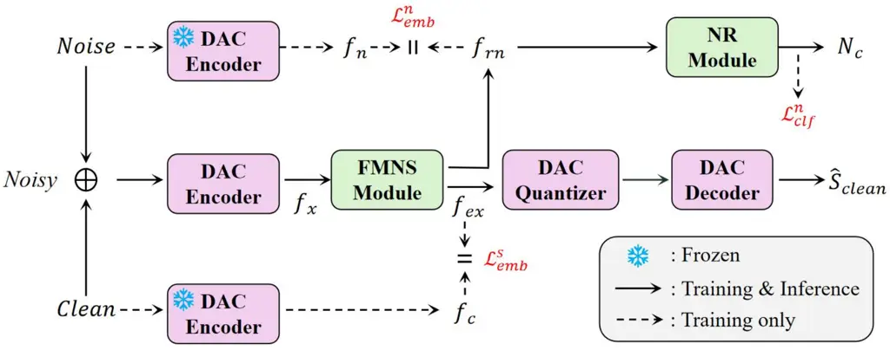

(a) The framework of FocalSE.

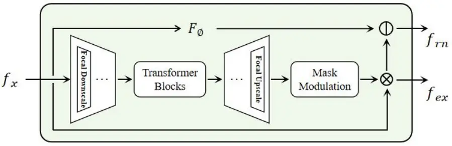

(b) The focal mask noise separation (FMNS) module.

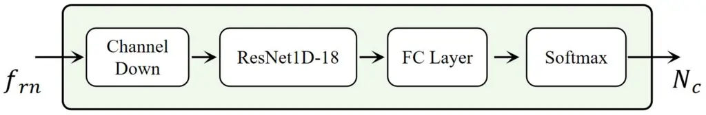

(c) The noise recognition (NR) module.

Figure 1: The overview of FocalSE. The $`f_{n}`$ represents ground-truth
noise embedding, $`f_{rn}`$ represents the reconstructed noise
embedding, $`f_{x}`$ represents the noisy embedding, $`f_{c}`$
represents the clean embedding, $`f_{ex}`$ represents the enhanced
embedding, $`N_{c}`$ represents the predicted class probability, and
$`\hat{S}_{clean}`$ represents the reconstructed speech signal.

## 2 Method

### 2.1 Model Architecture

The proposed FocalSE ¹¹ 1 https://github.com/shaokai1209/FocalSE is a
NSC-based SE method that performs feature denoising, noise feature
separation and noise recognition in the continuous embedding space of
NSC, enabling NSC to adapt to noisy environments. The framework of
FocalSE is shown in Figure 1(a). Key components of FocalSE consist of
the focal mask noise separation (FMNS) module and the noise recognition
(NR) module.

The FMNS module adopts a dual-branch structure, as illustrated in Figure
1(b). The lower branch explores feature mask based on the focal
modulation mechanism and stacks Transformer \[22\] blocks in the
low-dimensional compressed space, so as to extract enhanced embeddings
$`f_{ex}`$ from noisy embeddings $`f_{x}`$. The upper branch employs the
SEMamba \[23\] $`F_{\varnothing}`$ to filter the $`f_{x}`$. The filtered
results are then subtracted by $`f_{ex}`$ to separate the noise
embedding features $`f_{rn}`$. The structure of the NR module is
illustrated in Figure 1(c). It first performs downsampling on the
feature channels, then introduces a ResNet1D-18 \[24\] to extract
discriminative features from the $`f_{rn}`$, and finally obtains noise
classification results $`N_{c}`$ via a fully connected layer and a
softmax layer.

### 2.2 Training Strategy

In this paper, we select DAC \[4\] as the basic NSC architecture. The
proposed FocalSE performs in the continuous embedding space of DAC, and
its training strategy comprises two stages, pre-training and noisy
adaptation.  
Pre-training stage. First, we train the DAC model on clean speech data
under given bitrate configurations, enabling it to achieve fundamental
signal reconstruction capability.  
Noisy adaptation stage. This stage integrates the FocalSE into the DAC
architecture from the previous stage for feature denoising and
reconstructing speech signals $`\hat{S}_{clean}`$. All model weights
except those associated with FocalSE are initialized using pre-trained
DAC weights, followed by fine-tuning on the noisy speech dataset. We
freeze the weights of the pre-trained DAC encoder, use it as a feature
extractor to extract the ground-truth noise embedding $`f_{n}`$ and
clean embedding $`f_{c}`$, and guide FocalSE to perform feature
denoising and noise separation.

### 2.3 Focal Mask and Noise Separation

The FMNS module aims to exploit focal mask to extract enhanced
embeddings $`f_{ex}`$ from noisy embeddings $`f_{x}`$. It further
separates noise embeddings $`f_{rn}`$ to improve the feature denoising
capability. The obtained $`f_{ex}`$ is fed into the quantizer and
decoder for speech reconstruction.

We introduce the focal downscaling module \[5\] to performs feature
denoising, which combines the downscaling operation with the focal
modulation mechanism. Specifically, it first aggregates global
contextual information and then modulates local interactions based on
this aggregated representation, enabling it to capture the local
variation information of speech signals during the feature compression
process. For the decompression process, the downscaling layers are
replaced with upscaling layers. On this basis, we stack four Transformer
blocks in the low-dimensional compressed space to capture contextual
information throughout the compression and decompression processes,
thereby facilitating effective feature transition. In this way, FocalSE
exploits the global contextual information and local mutual information.
We further modulate these information weights with a learnable Sigmoid
\[25\] to obtain the focal mask, which is then applied to denoise
$`f_{x}`$ and ultimately generate $`f_{ex}`$. The calculation process is
detailed as follow:

```math
\displaystyle f_{ex}=\sigma(M_{focal}(f_{x}))\odot f_{x} \tag{1}
```

where $`\sigma(\cdot)`$ represents the learnable Sigmoid for mask
modulation, $`M_{focal}(\cdot)`$ represents the operation of focal mask.
We design and minimize the $`\mathrm{L1}`$ loss to align the enhanced
embeddings with the clean embeddings, as follow:

```math
\displaystyle\mathcal{L}^{s}_{emb}=\|f_{ex}-f_{c}\|_{1} \tag{2}
```

We expect the focal mask to simultaneously achieve feature denoising and
noise separation with synergistic effects. Therefore, we further
separate noise based on the $`f_{ex}`$. Considering that there always
exists a certain deviation between the enhanced result $`f_{ex}`$ and
$`f_{c}`$, we first introduce SEMamba $`F_{\varnothing}(\cdot)`$ to
filter $`f_{x}`$, and then subtract $`f_{ex}`$ to reconstruct the noise
embedding $`f_{rn}`$. The calculation formula is written as follows:

```math
\displaystyle f_{rn}=F_{\varnothing}(f_{x})-f_{ex} \tag{3}
```

To align the reconstructed noise embedding $`f_{rn}`$ with the
ground-truth noise embedding $`f_{n}`$, we design and minimize the
following loss:

```math
\displaystyle\mathcal{L}^{n}_{emb}=\|f_{rn}-f_{n}\|_{1} \tag{4}
```

### 2.4 Noise Recognition and Training Loss

To further improve the noise separation performance, we develop a noise
classification $`C_{n}(\cdot)`$ based on the ResNet1D-18. Specifically,
we first scale down the feature channels of the separated noise
embedding $`f_{rn}`$ to 256. Then, we use the 1D-convolution-based
ResNet18 to learn its discriminative features. Finally, we obtain the
class probability $`N_{c}`$ through a fully connected layer and a
softmax layer. The calculation of the noise recognition loss is given as
follows:

```math
\displaystyle\mathcal{L}^{n}_{clf}=CrossEntropy(C_{n}(f_{rn}),y) \tag{5}
```

where $`y`$ represents the true label vector of noise samples.

The final training loss of FocalSE can be written as:

```math
\displaystyle\mathcal{L}_{final}=\alpha\mathcal{L}^{s}_{emb}+\beta\mathcal{L}^{n}_{emb}+\gamma\mathcal{L}^{n}_{clf}+\mathcal{L}_{D} \tag{6}
```

where $`\alpha`$, $`\beta`$, and $`\gamma`$ are trade-off parameters,
$`\mathcal{L}_{D}`$ is the loss of discriminators in DAC.

|                  |                              |            |                   |                   |                     |                   |                   |                     |                   |                   |                     |                   |                   |                     |
| ---------------- | ---------------------------- | ---------- | ----------------- | ----------------- | ------------------- | ----------------- | ----------------- | ------------------- | ----------------- | ----------------- | ------------------- | ----------------- | ----------------- | ------------------- |
| Models           | Bitrate (kbps)$`\downarrow`$ | Params (M) | -5 dB             |                   |                     | 0 dB              |                   |                     | 5 dB              |                   |                     | 10 dB             |                   |                     |
|                  |                              |            | PESQ $`\uparrow`$ | STOI $`\uparrow`$ | SI-SDR $`\uparrow`$ | PESQ $`\uparrow`$ | STOI $`\uparrow`$ | SI-SDR $`\uparrow`$ | PESQ $`\uparrow`$ | STOI $`\uparrow`$ | SI-SDR $`\uparrow`$ | PESQ $`\uparrow`$ | STOI $`\uparrow`$ | SI-SDR $`\uparrow`$ |
| DAC \[4\]        | 6.00                         | 77         | 1.215             | 0.738             | -5.193              | 1.314             | 0.809             | -0.835              | 1.496             | 0.867             | 2.992               | 1.773             | 0.911             | 5.817               |
| SECE \[16\]      | 6.00                         | 196        | 1.955             | 0.810             | 4.294               | 2.281             | 0.908             | 6.010               | 2.573             | 0.919             | 7.001               | 2.806             | 0.937             | 7.191               |
| FD-CBR \[18\]    | 6.00                         | 83         | 1.975             | 0.871             | 4.516               | 2.305             | 0.911             | 6.178               | 2.589             | 0.930             | 7.193               | 2.839             | 0.942             | 7.646               |
| FocalSE^(-NR/ND) | 6.00                         | 152        | 1.988             | 0.875             | 4.816               | 2.331             | 0.917             | 6.301               | 2.611             | 0.937             | 7.301               | 2.860             | 0.943             | 7.803               |
| FocalSE^(-NR)    | 6.00                         | 159        | 2.086             | 0.888             | 5.387               | 2.397             | 0.923             | 6.839               | 2.691             | 0.944             | 7.768               | 2.928             | 0.955             | 8.211               |
| FocalSE          | 6.00                         | 222        | 2.116             | 0.892             | 5.403               | 2.432             | 0.926             | 6.892               | 2.728             | 0.945             | 7.835               | 2.970             | 0.957             | 8.373               |
| DAC \[4\]        | 2.50                         | 77         | 1.181             | 0.708             | -6.676              | 1.261             | 0.779             | -2.279              | 1.422             | 0.841             | 1.237               | 1.627             | 0.879             | 2.867               |
| SECE \[16\]      | 2.50                         | 195        | 1.741             | 0.803             | 2.393               | 1.979             | 0.863             | 3.913               | 2.186             | 0.907             | 4.013               | 2.435             | 0.927             | 5.101               |
| FD-CBR \[18\]    | 2.50                         | 82         | 1.754             | 0.855             | 2.417               | 2.016             | 0.896             | 3.988               | 2.270             | 0.919             | 4.862               | 2.504             | 0.935             | 5.680               |
| FocalSE^(-NR/ND) | 2.50                         | 151        | 1.905             | 0.868             | 3.603               | 2.150             | 0.903             | 4.983               | 2.402             | 0.926             | 5.804               | 2.606             | 0.939             | 6.189               |
| FocalSE^(-NR)    | 2.50                         | 159        | 1.917             | 0.871             | 3.611               | 2.157             | 0.911             | 5.009               | 2.437             | 0.929             | 5.826               | 2.615             | 0.940             | 6.274               |
| FocalSE          | 2.50                         | 221        | 1.932             | 0.874             | 3.635               | 2.190             | 0.911             | 5.016               | 2.465             | 0.932             | 5.879               | 2.682             | 0.944             | 6.316               |

Table 1: Objective metrics of various models under different low-SNR and
low-bitrate conditions, the best performance results are shown in
boldface, and the second-best results are marked with underline.

## 3 Experiments

### 3.1 Experimental Setup

Baselines. We select SECE \[16\] and FD \[18\] as the baselines for the
proposed FocalSE, as these methods both perform feature denoising in the
continuous embedding space of DAC. In particular, we employ the
reconstruction results of DAC \[4\] under noisy environments as the
reference, to clearly benchmark the denoising gains achieved by these
NSC-based SE models.  
Datasets. Our experiments are conducted on LibriTTS \[26\] and ESC-50
\[27\]. LibriTTS is a public English speech corpus that collects 585
hours of speech data from 2,456 speakers, with a sampling rate of 24
kHz. ESC-50 is a public environmental sound dataset containing labeled
information for 2,000 short audio clips, covering 50 categories of
common sound events and with a sampling rate of 44.1 kHz. In our
experiments, all samples are uniformly down-sampled to 16 kHz.

We select the train-clean-100 and train-clean-360 subsets of LibriTTS as
the clean training dataset with 245.1 hours, and the test-clean-100
subset as the clean testing dataset with 8.6 hours. For noisy data, 8/10
of the noise samples from each category of the ESC-50 are randomly
selected and added to the clean training dataset, forming the noisy
training dataset. The remaining noise samples are randomly selected and
added to the clean testing dataset, forming the noisy testing dataset.
The Signal-to-Noise Ratio (SNR) is randomly selected from \[-10, -5, 0,
5, 10, 15, 20\] dB.  
Training configures. During the pre-training stage, the DAC model uses a
downsampling factor of 512. The 16-layer codebooks use 12-bit vector
quantization to achieve 6.0 kbps, while the 8-layer codebooks use 10-bit
vector quantization to achieve 2.5 kbps. We train DAC on the clean
training dataset and test it on the noisy testing dataset. For noisy
adaptation stage, all models are trained based on the architecture of
the pre-trained DAC. For SECE, we follow its public parameters for
reproduction, freeze the DAC weights during training, and replace its
original signal reconstruction loss with the loss of DAC discriminators
to ensure fair comparison. We train all models on four RTX 3090 GPUs for
150 epochs. For FD, we adopt its publicly available constant bitrate RVQ
(FD-CBR) version. For FocalSE, the batch size is 32, the learning rate
is 0.0001, $`\alpha`$ = 0.2, $`\beta`$ = 0.2, and $`\gamma`$ = 0.5.  
Evaluation metrics. We select three objective metrics, PESQ \[28\], STOI
\[29\] and SI-SDR \[30\], to evaluate the quality of speech signals
reconstructed by the proposed FocalSE and baselines. For the noise
recognition of FocalSE, we calculate and report its classification
accuracy (ACC).

### 3.2 Experimental Results and Analysis

#### 3.2.1 Speech Reconstruction Results

Table 1 presents the speech reconstruction results of different models
under the conditions of low-SNR and low-bitrate. Notably,
FocalSE^(-NR/ND) represents the FocalSE without the noise feature
separation and NR module, and FocalSE^(-NR) represents that without the
NR module. From these experimental results, we can draw the following
important conclusions.

First, compared with the reconstruction results of DAC, NSC-based SE
methods including SECE, FD-CBR and the proposed FocalSE significantly
improve the speech reconstruction quality under low-bitrates and low-SNR
conditions. These results fully demonstrate that the clean embedding
extraction strategy based on the continuous embedding space enables NSC
to adapt well to noisy environments.

Second, compared with SECE that freezes the DAC weights during training,
both FD-CBR and FocalSE achieve better performance. The possible reason
is that the clean embedding extraction strategy adopted by FD-CBR and
FocalSE fine-tunes the pre-trained NSC during training. Theoretically,
this fine-tuning strategy is superior to the weight freezing strategy,
thus enabling superior speech reconstruction results.

Third, experimental results show that the proposed FocalSE compared with
baselines achieves the best speech reconstruction performance under
various conditions of low-bitrate and low-SNR. In contrast to SECE and
FD-CBR, the proposed method exploits focal mask that captures local
information regarding the short-term variations of speech signals and
global contextual information. Furthermore, FocalSE improves the feature
denoising capability of the focal mask by separating noise features and
noise recognition. In this way, FocalSE obtains higher evaluation
results. However, we can observe that FocalSE has a larger number of
parameters compared with other models, among which the NR module
accounts for approximately 222 - 159 = 63 M, the FMNS module 159 - 77 =
82 M, and DAC 77 M. In other words, if the noise recognition task is not
considered, the inference parameters of FocalSE are 159M.

Finally, experimental results show that the speech reconstruction
performance of FocalSE^(-NR/ND), FocalSE^(-NR) and FocalSE improves
steadily. This indicates that removing any component in the ablation
study leads to a performance degradation of FocalSE, which fully
demonstrates the effectiveness of the FocalSE strategy.

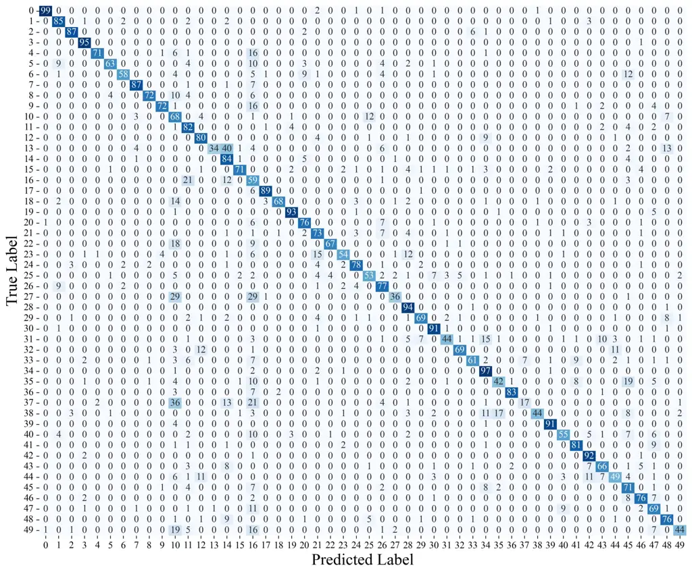

(a) -5 dB (ACC: 72.61$`\%`$)

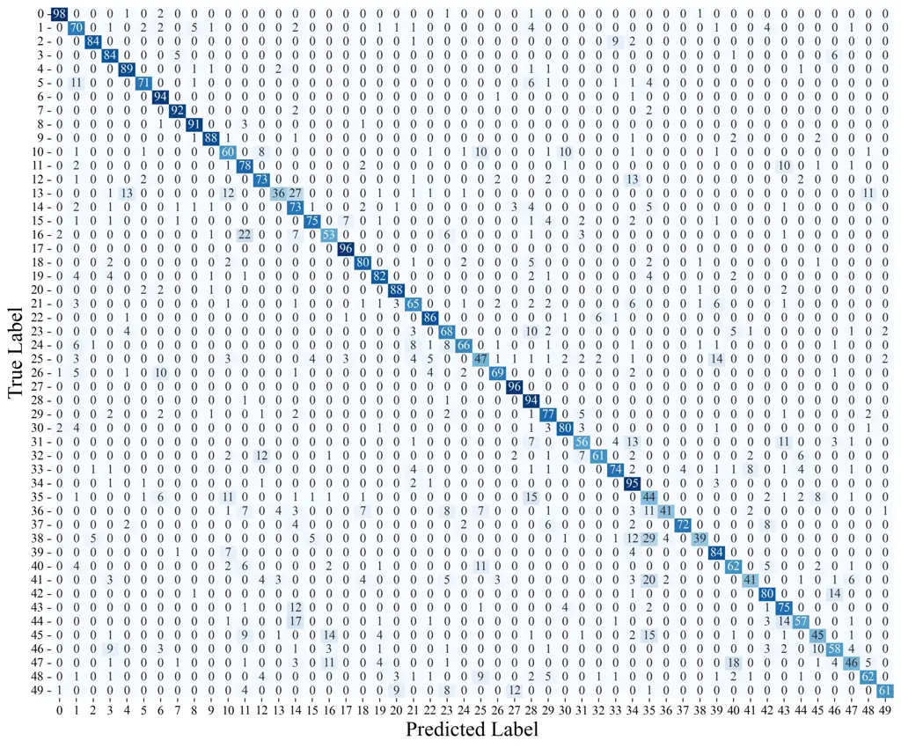

(b) 0 dB (ACC: 73.52$`\%`$)

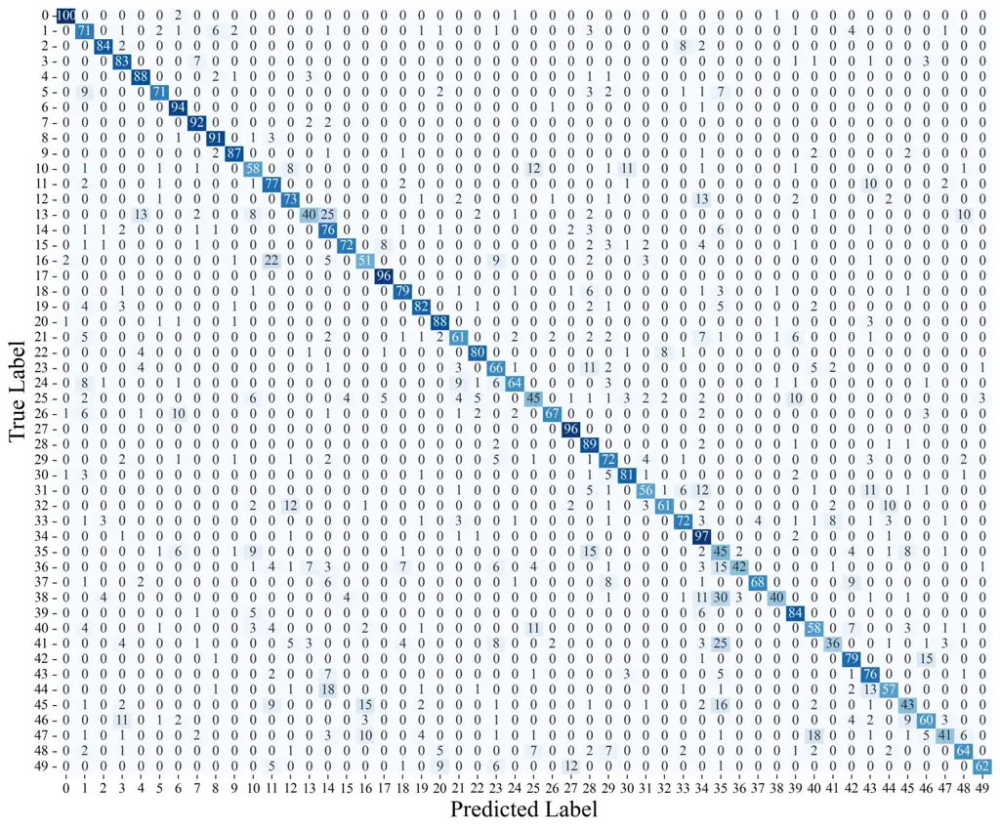

(c) 5 dB (ACC: 72.67$`\%`$)

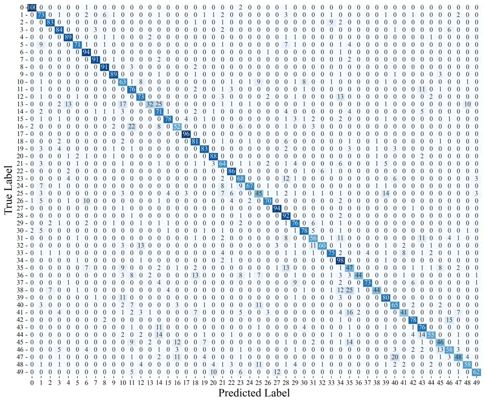

(d) 10 dB (ACC: 73.02$`\%`$)


(e) -5 dB (ACC: 70.89$`\%`$)

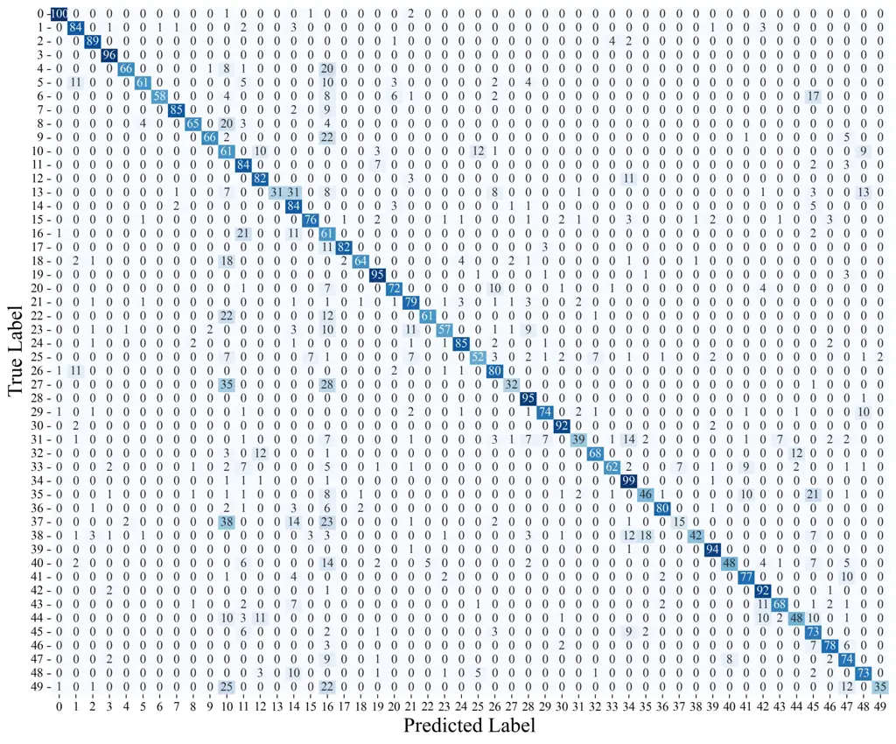

(f) 0 dB (ACC: 71.95$`\%`$)

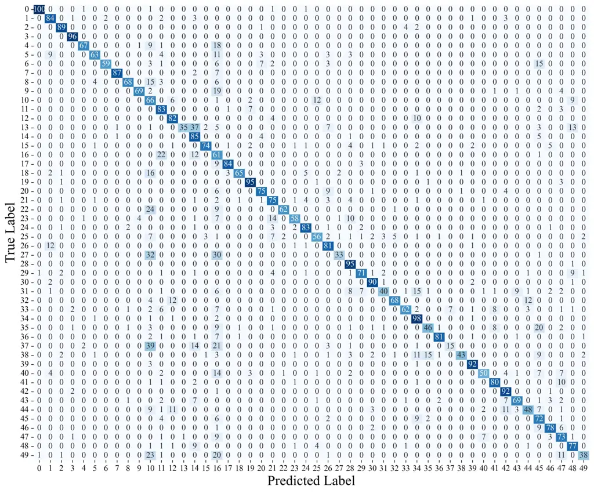

(g) 5 dB (ACC: 72.63$`\%`$)

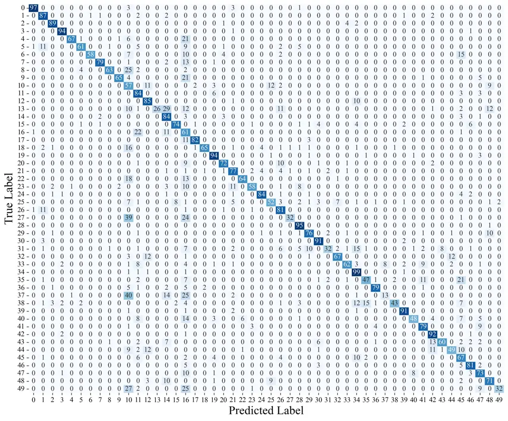

(h) 10 dB (ACC: 71.10$`\%`$)

Figure 2: Confusion matrices and accuracy (ACC) of FocalSE for noise
recognition under different SNR and bitrates, with the upper half for
6.0 kbps and the lower half for 2.5 kbps.

#### 3.2.2 Noise Recognition Results

We present the noise recognition accuracy and confusion matrices of
FocalSE in Figure 2. From these results, we can draw the following
important conclusions.

First, as can be seen, FocalSE achieves accuracy of over 70$`\%`$ in
fine-grained noise classification under different conditions of
low-bitrate and low-SNR. It can also be seen from the corresponding
confusion matrices that most noise categories exhibit good
discriminability, which fully demonstrates the effectiveness of the
noise features separated by FocalSE.

Secondly, we find that the noise recognition accuracy at 6.0 kbps is
mostly higher than that at 2.5 kbps. Besides, the noise classification
task under low SNR conditions is more challenging, as decreasing SNR may
distort the original energy distribution of the speech signals and thus
reduce inter-class differences. More detials are described in \[31\].

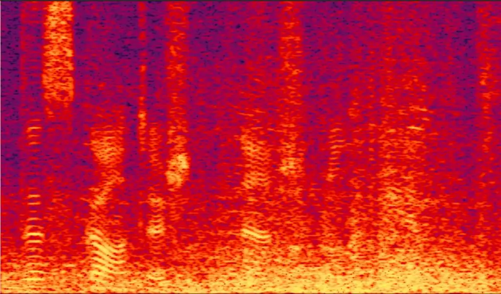

(a) Noisy

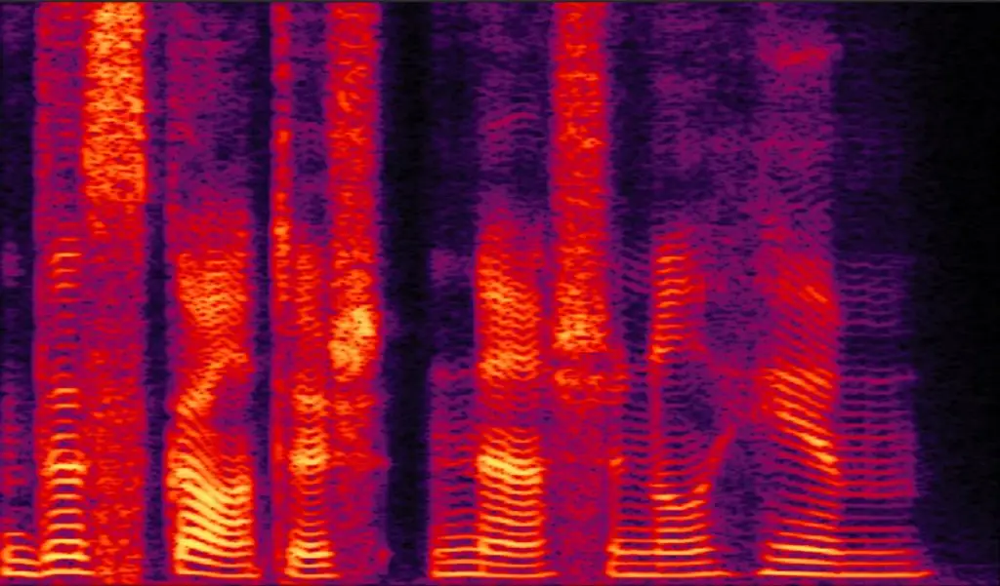

(b) Clean target

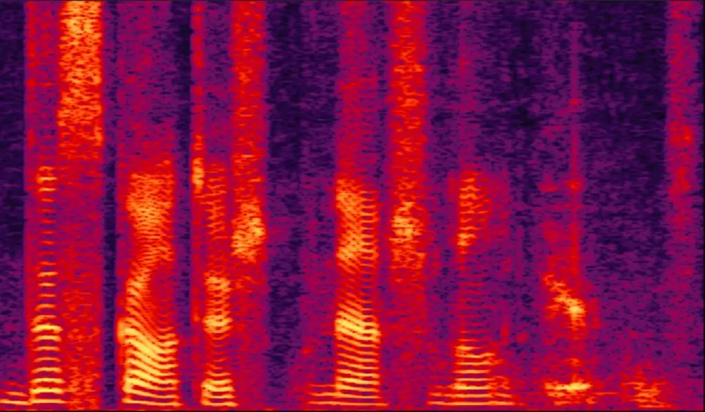

(c) FD-CBR under 6.0 kbps

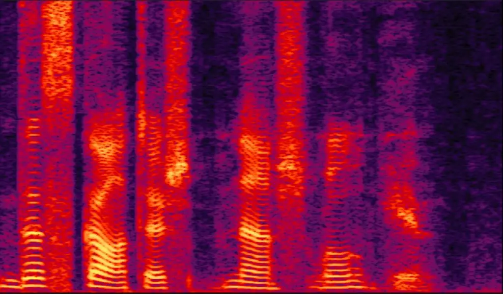

(d) FocalSE under 6.0 kbps

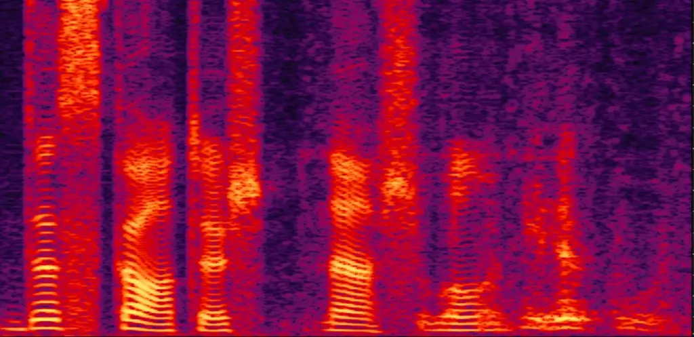

(e) FD-CBR under 2.5 kbps

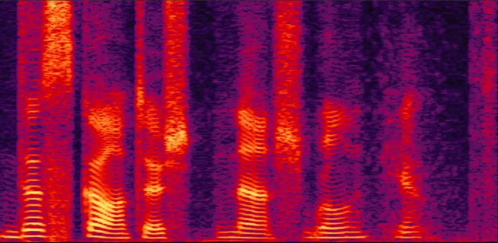

(f) FocalSE under 2.5 kbps

Figure 3: Spectrograms comparison of different models for restoring
speech signal under -5 dB.

#### 3.2.3 Spectrograms Comparison for Restoring Speech

Figure 3 presents the spectrogram examples of speech reconstructed by
different models under the -5 dB condition. Firstly, we can observe that
the reconstructed speech by FD-CBR and FocalSE can suppress most of the
noise. Secondly, compared with FD-CBR, the energy distribution and
harmonic structure of the speech reconstructed by FocalSE are
significantly closer to those of the clean target, achieving superior
speech reconstruction and denoising results.

## 4 Conclusion

In this paper, we propose a novel NSC-based SE method, named FocalSE,
which exploits the focal mask to perform feature denoising, noise
feature separation and noise recognition in the continuous embedding
space of NSC, enabling NSC to adapt to noisy environments. We conduct
extensive experiments and analyses, compared with state-of-the-art
methods, the proposed FocalSE achieves superior feature denoising and
speech signal reconstruction performance. In the future, we will extend
the focal mask to the speech-noise separation under ultra low-bitrate
and low-SNR conditions.

## 5 Acknowledgments

This work is supported by the National Nature Science Foundation of
China (No. 62471343, No.62171326).

## 6 Generative AI Use Disclosure

During the preparation of this work, the authors used generative AI
tools only for manuscript polishing. After using AI‑assisted tools, the
authors reviewed, edited and revised the content as needed, and take
full responsibility for the content of this paper.

## References

- \[1\] M. Kim and J. Skoglund (2025) Neural speech and audio coding:
  modern ai technology meets traditional codecs \[special issue on
  model-based and data-driven audio signal processing\]. IEEE Signal
  Processing Magazine 41 (6), pp. 85–93. Cited by: §1.
- \[2\] W. Cui, D. Yu, X. Jiao, Z. Meng, G. Zhang, Q. Wang, S. Y. Guo,
  and I. King (2025) Recent advances in speech language models: a
  survey. In Proceedings of the 63rd Annual Meeting of the Association
  for Computational Linguistics (Volume 1: Long Papers),
  pp. 13943–13970. Cited by: §1.
- \[3\] N. Zeghidour, A. Luebs, A. Omran, J. Skoglund, and M.
  Tagliasacchi (2021) Soundstream: an end-to-end neural audio codec.
  IEEE/ACM Transactions on Audio, Speech, and Language Processing 30,
  pp. 495–507. Cited by: §1.
- \[4\] R. Kumar, P. Seetharaman, A. Luebs, I. Kumar, and K.
  Kumar (2023) High-fidelity audio compression with improved rvqgan.
  Advances in Neural Information Processing Systems 36, pp. 27980–27993.
  Cited by: §1, §2.2, Table 1, Table 1, §3.1.
- \[5\] L. Della Libera, F. Paissan, C. Subakan, and M. Ravanelli (2025)
  Focalcodec: low-bitrate speech coding via focal modulation networks.
  NeurIPS. Cited by: §1, §2.3.
- \[6\] P. Mousavi, G. Maimon, A. Moumen, D. Petermann, J. Shi, H.
  Wu, H. Yang, A. Kuznetsova, A. Ploujnikov, R. Marxer, et al. (2025)
  Discrete audio tokens: more than a survey!. Transactions on Machine
  Learning Research. External Links: ISSN 2835-8856 Cited by: §1.
- \[7\] K. Zmolikova, M. Delcroix, T. Ochiai, K. Kinoshita, J. Černockỳ,
  and D. Yu (2023) Neural target speech extraction: an overview. IEEE
  Signal Processing Magazine 40 (3), pp. 8–29. Cited by: §1.
- \[8\] C. Zheng, H. Zhang, W. Liu, X. Luo, A. Li, X. Li, and B. C.
  Moore (2023) Sixty years of frequency-domain monaural speech
  enhancement: from traditional to deep learning methods. Trends in
  Hearing 27, pp. 23312165231209913. Cited by: §1.
- \[9\] Y. Jun, B. J. Woo, M. Jeong, and N. S. Kim (2025) SNR-aligned
  consistent diffusion for adaptive speech enhancement. In Proceedings
  of Interspeech 2025, pp. 4073–4077. Cited by: §1.
- \[10\] Y. Song, Y. Kim, and Y. Chung (2025) Lightweight speech
  enhancement model based on harmonic attention and phase estimation
  with skin-attachable accelerometer. In Proc. Interspeech 2025,
  pp. 66–70. Cited by: §1.
- \[11\] Z. Wang, X. Zhu, Z. Zhang, Y. Lv, N. Jiang, G. Zhao, and L.
  Xie (2024) Selm: speech enhancement using discrete tokens and language
  models. In ICASSP 2024-2024 IEEE International Conference on
  Acoustics, Speech and Signal Processing (ICASSP), pp. 11561–11565.
  Cited by: §1.
- \[12\] H. Yang, J. Su, M. Kim, and Z. Jin (2024) Genhancer:
  high-fidelity speech enhancement via generative modeling on discrete
  codec tokens. In Proc. Interspeech, Vol. 2024, pp. 1170–1174. Cited
  by: §1.
- \[13\] H. Xue, X. Peng, and Y. Lu (2024) Low-latency speech
  enhancement via speech token generation. In ICASSP 2024-2024 IEEE
  International Conference on Acoustics, Speech and Signal Processing
  (ICASSP), pp. 661–665. Cited by: §1.
- \[14\] X. Liu, M. Yang, S. Chen, and J. H. Hansen (2025) A neural
  codec approach for noise-robust bandwidth expansion. In Proc.
  Interspeech 2025, pp. 4083–4087. Cited by: §1.
- \[15\] J. Yao, H. Liu, C. Chen, Y. Hu, E. Chng, and L. Xie (2025)
  GenSE: generative speech enhancement via language models using
  hierarchical modeling. In The Thirteenth International Conference on
  Learning Representations, Cited by: §1.
- \[16\] H. Li, J. Q. Yip, T. Fan, and E. S. Chng (2025) Speech
  enhancement using continuous embeddings of neural audio codec. In IEEE
  International Conference on Acoustics, Speech and Signal Processing
  (ICASSP), pp. 1–5. Cited by: §1, §1, Table 1, Table 1, §3.1.
- \[17\] Z. Mu, R. Chen, A. Li, M. Yu, X. Yang, and D. Yu (2025) From
  continuous to discrete: cross-domain collaborative general speech
  enhancement via hierarchical language models. In Proceedings of the
  33rd ACM International Conference on Multimedia, pp. 219–228. Cited
  by: §1, §1.
- \[18\] Y. Chae and K. Lee (2025) Towards bitrate-efficient and
  noise-robust speech coding with variable bitrate rvq. In Proceedings
  of the Annual Conference of the International Speech Communication
  Association, INTERSPEECH, pp. 609–613. Cited by: §1, §1, Table 1,
  Table 1, §3.1.
- \[19\] Y. Han, H. Chen, L. Liu, and J. Du (2025) Dual-branch codec
  with orthogonality constraint and knowledge distillation for noisy
  environment. IEEE Signal Processing Letters 32, pp. 3017–3021. Cited
  by: §1, §1.
- \[20\] S. S. Shetu, E. A. Habets, and A. Brendel (2025) Gan-based
  speech enhancement for low snr using latent feature conditioning. In
  ICASSP 2025-2025 IEEE International Conference on Acoustics, Speech
  and Signal Processing (ICASSP), pp. 1–5. Cited by: §1, §1.
- \[21\] S. Kammoun, X. Alameda-Pineda, and S. Leglaive (2025) Modeling
  strategies for speech enhancement in the latent space of a neural
  audio codec. arXiv preprint arXiv:2510.26299. Cited by: §1, §1.
- \[22\] A. Vaswani, N. Shazeer, N. Parmar, J. Uszkoreit, L.
  Jones, A. N. Gomez, Ł. Kaiser, and I. Polosukhin (2017) Attention is
  all you need. Advances in Neural Information Processing Systems 30.
  Cited by: §1, §2.1.
- \[23\] R. Chao, W. Cheng, M. La Quatra, S. M. Siniscalchi, C. H.
  Yang, S. Fu, and Y. Tsao (2024) An investigation of incorporating
  mamba for speech enhancement. In IEEE Spoken Language Technology
  Workshop, SLT, pp. 302–308. Cited by: §1, §2.1.
- \[24\] Z. Cai, W. Wang, and M. Li (2023) Waveform boundary detection
  for partially spoofed audio. In ICASSP 2023-2023 IEEE International
  Conference on Acoustics, Speech and Signal Processing (ICASSP),
  pp. 1–5. Cited by: §2.1.
- \[25\] Y. Luo and N. Mesgarani (2019) Conv-tasnet: surpassing ideal
  time–frequency magnitude masking for speech separation. IEEE/ACM
  Transactions on Audio, Speech, and Language Processing 27 (8),
  pp. 1256–1266. Cited by: §2.3.
- \[26\] H. Zen, V. Dang, R. Clark, Y. Zhang, R. J. Weiss, Y. Jia, Z.
  Chen, and Y. Wu (2019) LibriTTS: a corpus derived from librispeech for
  text-to-speech. In Proc. Interspeech 2019, pp. 1526–1530. Cited by:
  §3.1.
- \[27\] K. J. Piczak (2015) ESC: dataset for environmental sound
  classification. In Proceedings of the 23rd ACM International
  Conference on Multimedia, pp. 1015–1018. Cited by: §3.1.
- \[28\] A.W. Rix, J.G. Beerends, M.P. Hollier, and A.P. Hekstra (2001)
  Perceptual evaluation of speech quality (pesq) - a new method for
  speech quality assessment of telephone networks and codecs. ICASSP,
  IEEE International Conference on Acoustics, Speech and Signal
  Processing - Proceedings 2, pp. 749 – 752. Cited by: §3.1.
- \[29\] C. H. Taal, R. C. Hendriks, R. Heusdens, and J. Jensen (2011)
  An algorithm for intelligibility prediction of time-frequency weighted
  noisy speech. IEEE Transactions on Audio Speech and Language
  Processsing 19 (7), pp. 2125–2136. Cited by: §3.1.
- \[30\] J. L. Roux, S. Wisdom, H. Erdogan, and J. R. Hershey (2019)
  SDR - half-baked or well done?. ICASSP, IEEE International Conference
  on Acoustics, Speech and Signal Processing - Proceedings, pp. 626 – 630. Cited by: §3.1.
- \[31\] Y. Liu, H. Fu, Y. Wei, and H. Zhang (2023) Sound event
  classification based on frequency-energy feature representation and
  two-stage data dimension reduction. IEEE/ACM Transactions on Audio,
  Speech, and Language Processing 31, pp. 1290–1304. Cited by: §3.2.2.
