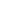
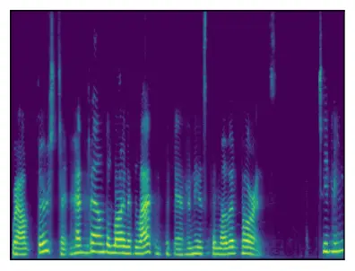
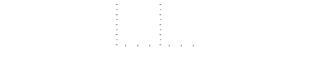
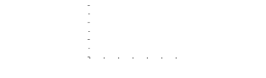
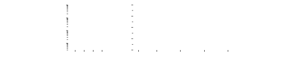

STFT  
short-time Fourier transform

RIR  
room impulse response

iSTFT  
inverse short-time Fourier transform

DoA  
direction of arrival

IRM  
ideal ratio mask

MVDR  
minimum-variance distortionless response

NN  
neural network

DNN  
deep neural network

GCC-PHAT  
generalized cross-correlation phase transform

SSL  
sound source localization

SRP-PHAT  
steered response power with phase transform

MSE  
mean squared error

MAE  
mean angular error

SDR  
signal-to-distortion ratio

SI-SDR  
scale-invariant signal-to-distortion ratio

PESQ  
perceptual evaluation of speech quality

POLQA  
perceptual objective listening quality

WER  
word error rate

PIT  
permutation-invariant training

LBT  
location-based training

ASR  
automatic speech recognition

BCE  
binary cross-entropy

JNF  
joint non-linear filter

NN  
neural network

DNN  
deep neural network

MC-CRUSE  
multi-channel convolutional recurrent U-net architecture for speech
enhancement

ESTOI  
extended short-time objective intelligibility

SNR  
signal-to-noise ratio

SIR  
signal-to-interference ratio

i.i.d.  
independent and identically distributed

w.r.t.  
with respect to

SSF  
spatially selective filter

CV  
constant velocity

RW  
random walk

AR  
autoregressive

TSE  
target speaker extraction

TST  
target speaker tracking

TSL  
target speaker localization

DNSMOS  
deep noise suppression mean opinion score

MAP  
maximum a posteriori

KF  
Kalman filter

PF  
particle filter

DaS  
delay-and-sum

AE  
angular error

ACC  
accuracy

MISO  
multiple-input and single-output

MIMO  
multiple-input and multiple-output

FOA  
first order ambisonics

HOA  
higher-order ambisonics

SH  
spherical harmonics

SHT  
spherical harmonics transform

MWF  
multichannel wiener filter

SELD  
sound event localization and detection

MAC  
multiply-accumulate operation

ACN  
ambisonics channel number ordering

RDS  
recurrent deep stacking

MOS  
mean opinion score

NISQA  
non-intrusive speech quality assessment

PEV  
principal eigenvector

FB  
fixed beamformer

EMA  
exponential moving average

# Weakly Guided and Autoregressive Beamformer Parameterization for Generalizable Moving Speaker Extraction in Higher-Order Ambisonics

This work was supported by the Deutsche Forschungsgemeinschaft (DFG)
under Grant 508337379. Computational resources were provided by the
Regional Computer Center (RRZ) of the University of Hamburg and the
Erlangen National High Performance Computing Center (NHR@FAU) under
Project f104ac. NHR is funded by the Federal Government and Bavaria.
Both facilities received DFG funding under Grants 440719683 and 498394658.

###### Abstract

Linear spatial filters (beamformers) enable robust, generalizable and
interpretable speech enhancement with performance guarantees under ideal
parameterization. Modern beamformers are often parameterized by deep
neural networks, whose performance degrades in dynamic scenarios with
multiple moving speakers of unknown directions. We propose a data-driven
beamforming pipeline, which only requires an estimate of the target’s
initial direction. Building on a higher-order ambisonics representation,
we show that neural temporal-spectral processing can be decoupled from
linear spatial processing, and thereby achieve generalizable and
array-agnostic enhancement. By incorporating autoregression into a
frame-wise causal framework, we maintain consistent performance
throughout fast speaker motion and long recordings. Evaluation on
synthetic data demonstrates robust enhancement under challenging
conditions with closely spaced and crossing speakers. Real-world
recordings in a dynamic office meeting scenario complement these
findings and show generalizability across varying ambisonics orders.

|                                                         |
| ------------------------------------------------------- |
| Jakob Kienegger, Tal Peer, Sina Khanagha, Timo Gerkmann |
| Signal Processing (SP) Group, University of Hamburg     |

Index Terms—  Ambisonics, autoregressive, moving speaker, multi-channel
speech enhancement, mask-based beamforming.

## 1 Introduction

Speech enhancement aims to improve the perceptual quality and
intelligibility of a recorded speech signal by suppressing noise and
reverberation. In a multi-speaker environment, tse (tse) solves the
additional challenge of differentiating between the desired target
speech and remaining speakers, which are to be treated as noise. When a
recording from a microphone array is available, the relative direction
of the target to the array, known as doa (doa), can be employed to
identify the desired speaker. In case of a spherical array,
ambisonics \[1\] provides a directional and array-agnostic
representation of the recorded sound field, making it a popular audio
format for enhancement \[2, 3, 4, 5\].

Assuming the target’s doa is known, a spatial filter can be steered
toward the desired direction and extract the corresponding speech
signal. By jointly processing temporal-spectral and spatial information,
recently proposed deep, non-linear spatial filters achieve outstanding
enhancement performance \[6, 7\]. While linear spatial filters, known as
beamformers, are proven to be inferior under realistic, non-Gaussian
statistical assumptions \[8\], they provide robustness and
interpretability by being a parametric, statistics-based approach. When
combined with dnn to estimate these statistics, such hybrid approaches
can achieve strong enhancement performance even with linear spatial
filters \[9, 10\].

In stationary scenarios, the target’s doa may be available a priori.
However, when speaker motion becomes non-negligible, the continuous
directional information necessary to steer a spatial filter—which we
refer to as strong guidance—is typically not available. Weakly guided
speaker extraction relaxes this constraint and only assumes knowledge of
the target’s direction at recording start. To continue using a spatial
filter for extraction, an additional tracking algorithm is typically
required to infer the target’s movement from the starting direction and
automate the steering of the spatial filter throughout the remaining
recording \[11\]. Nevertheless, to maintain precise target alignment in
challenging acoustic scenarios with closely spaced and crossing
speakers, computationally heavy, data-driven tracking algorithms become
necessary \[12\].

Besides explicit directional steering, estimation of the spatial
statistics required for beamformer parameterization can also be achieved
implicitly via dnn-driven signal indicator masks. These masks solely
contain temporal-spectral information and are used to improve the
performance of classical statistical moment estimation techniques.
Without explicitly modeling doa trajectories, beamformer
parameterization becomes unaffected by closely spaced speakers and can
even operate without learning the microphone array geometry \[13\]. This
results in generalizability across diverse motion profiles \[14\] as
well as acoustic and recording conditions.

Streaming real-time applications require causal frame-wise processing,
which limits the input to current and past frames. However, the
availability of past frames allows for exploitation of temporal-spectral
correlations, resulting in improved enhancement performance \[15, 16\].
In our prior work, we demonstrated how leveraging previous frames in an
ar (ar) framework based on a deep, non-linear spatial filter can
significantly increase speaker separability during spatially challenging
acoustic scenarios \[5\].

In this work, we focus on linear spatial filtering, i.e. beamforming,
for weakly guided moving speaker extraction in hoa (hoa) recordings. We
employ a dnn-driven mask to estimate the parameters of a beamformer and
decouple mask computation from spatial processing to remain
ambisonics-order-agnostic. Motivated by prior work with stationary
speakers \[17, 2, 18\], we convert the target’s initial direction into
an input feature for the dnn. Additionally, based on an underlying
frame-wise causal processing pipeline, we employ temporal feedback of
the enhanced speech signal to increase robustness and continuity of the
estimated masks while retaining streaming capability. Evaluation on
synthetic noisy and reverberant two-speaker mixtures demonstrates how
our ar framework robustly extracts the moving target while maintaining
consistent performance throughout long audio recordings, i.e. exceeding
30 s. Processed real-world recordings confirm the generalization
capability of our methods to challenging acoustic conditions in an
office meeting scenario across varying ambisonics orders.

## 2 Problem Setup

### 2.1 Ambisonics signal representation

Let $`\mathcal{X}(r,\theta,\phi)`$ denote an acoustic pressure field in
spherical coordinates at radius $`r`$, azimuth $`\theta`$ and elevation
$`\phi`$ centered about a spherical microphone array. At microphone
position $`p`$, the recorded sound field can be approximated by the
truncated sh (sh) expansion in the stft (stft) domain as

```math
\mathcal{X}_{tk}(r_{p},\theta_{p},\phi_{p})\approx\sum_{n=0}^{N}\sum_{m=-n}^{n}b_{n}(\kappa_{k}r_{p})\,X_{tk}^{nm}\,Y^{m}_{n}(\theta_{p},\phi_{p})\,, \tag{1}
```

with frequency bin $`k`$ and frame index $`t`$. We use the real-valued
sh

```math
Y^{m}_{n}(\theta,\phi)=\begin{cases}N_{n}^{\left|m\right|}P_{n}^{\left|m\right|}\!\left(\sin(\phi)\right)\cos(m\,\theta)\,,&\text{if}\ \ m\geq 0\,,\\
N_{n}^{\left|m\right|}P_{n}^{\left|m\right|}\!\left(\sin(\phi)\right)\sin(|m|\theta)\,,&\text{else},\end{cases} \tag{2}
```

with associated Legendre functions $`P_{n}^{m}`$ and normalization
factor $`N_{n}^{m}`$ (N3D). The radial response $`b_{n}(\kappa_{k}r)`$
with frequency dependent wavenumber $`\kappa_{k}`$ describes the
scattering effects of the spherical array. At truncation order $`N`$,
the series contains $`M=(N+1)^{2}`$ coefficients $`X_{tk}^{nm}`$, which
we denote in the vectorized form 𝐗t​k=(Xt​k00,Xt​k1​   −

 

 

$`1`$

 

,…,Xt​kN​N)𝖳\mathbf{X}\_{tk}=\big(X\_{tk}^{00},X\_{tk}^{{1\hskip
0.7113pt\scalebox{0.5}\[1.0\]{\$-\$}\hskip
0.0pt\scalebox{0.7}{\$1\$}}},\dots,X\_{tk}^{N\hskip-0.7113ptN}\big)^{\mathsf{T}}.
These coefficients represent the sound field in an array-agnostic audio
format, known as ambisonics \[1\]. If $`P\geq M`$ spatial samples, i.e.
microphones, are available, Eq. 1 can be solved in the least-squares
sense to obtain $`\mathbf{X}_{tk}`$ \[19, 20\].

### 2.2 Ambisonics signal model

Modeling the recorded sound field as a superposition of speech and noise
allows decomposing $`\mathbf{X}_{tk}`$ into ambisonics coefficients
corresponding to the target speaker $`\mathbf{S}_{tk}`$ and noise
$`\mathbf{V}_{tk}`$ \[\[21\], Sec. 7.1\],

```math
\mathbf{X}_{tk}=\mathbf{S}_{tk}+\mathbf{V}_{tk}\,\in\mathbb{C}^{M}\,. \tag{3}
```

Assuming a noisy and reverberant multi-speaker scenario,
$`\mathbf{V}_{tk}`$ absorbs interfering speech signals, environmental
and measurement noise as well as the reverberant part of the target
speech. The anechoic target speech signal $`\mathbf{S}_{tk}`$ can be
further factored as $`\mathbf{S}_{tk}=\mathbf{d}_{t}S_{tk}`$, with
steering vector $`\mathbf{d}_{t}=\mathbf{d}(\theta_{t},\phi_{t})`$
encoding the direct path propagation corresponding to the target’s doa
$`\theta_{t},\phi_{t}`$. Under far-field assumptions, $`\mathbf{d}_{t}`$
equals the sh basis vector $`\mathbf{Y}(\theta_{t},\phi_{t})`$ in Eq. 2
and is thereby real-valued and frequency-independent \[\[21\],
Sec. 2.4\].

### 2.3 Ambisonics beamforming

For tse (tse), we employ a linear spatial filter (beamformer)
$`\mathbf{w}_{tk}`$ to reconstruct the monaural target speech signal
$`S_{tk}`$ from observation $`\mathbf{X}_{tk}`$. We parameterize
$`\mathbf{w}_{tk}`$ based on second-order statistics of speech and noise
signals, i.e. covariance matrices
$`\mathbf{\Phi}_{tk}^{\scriptscriptstyle{(\mathrm{S})}}`$ and
$`\mathbf{\Phi}_{tk}^{\scriptscriptstyle{(\mathrm{V})}}`$, whose
estimation is at the center of this work.

In particular, we choose an mvdr (mvdr) beamformer, which suppresses
noise under a unit gain and phase-preserving (distortionless) constraint
toward the target doa. The mvdr beamformer $`\mathbf{w}_{tk}`$ can be
formulated as

```math
1 - 1 \tag{4}
```

For parameterization, a frequency-dependent estimate of the steering
vector $`\hat{\mathbf{d}}_{tk}`$ can be obtained via the pev (pev) of
the speech covariance matrix
$`\mathbf{\Phi}_{tk}^{\scriptscriptstyle{(\mathrm{S})}}`$. Since the pev
is phase-invariant, we follow \[20, 3\] and align
$`\hat{\mathbf{d}}_{tk}`$ at the omnidirectional channel and adjust its
scaling such that $`4\pi\lVert\hat{\mathbf{d}}_{tk}\rVert^{2}=M`$
\[\[21\], Sec. 1.2\].

## 3 Proposed Method

### 3.1 Mask-based recursive covariance matrix estimation

To infer the time-varying speech and noise covariance matrices
$`\mathbf{\Phi}_{tk}^{\scriptscriptstyle{(\mathrm{S})}}`$ and
$`\mathbf{\Phi}_{tk}^{\scriptscriptstyle{(\mathrm{V})}}`$, we employ
recursive covariance estimation of the form

```math
\hat{\mathbf{\Phi}}_{tk}^{\scriptscriptstyle{(\mathrm{\xi})}}=\gamma_{tk}^{\scriptscriptstyle{(\mathrm{\xi})}}\mathbf{X}_{tk}\mathbf{X}_{tk}^{\mathsf{H}}+\left(1-\gamma_{tk}^{\scriptscriptstyle{(\mathrm{\xi})}}\right)\hat{\mathbf{\Phi}}_{\scriptstyle t\hskip 0.7113pt\raisebox{1.08496pt}{\rule{2.30998pt}{0.16273pt}}1k}^{\scriptscriptstyle{(\mathrm{\xi})}}\,, \tag{5}
```

with $`\mathrm{\xi}\in\{\mathrm{S},\mathrm{V}\}`$. We define the
composite parameters
$`\gamma_{tk}^{\scriptscriptstyle{(\mathrm{\xi})}}`$ as

```math
\gamma_{tk}^{\scriptscriptstyle{(\mathrm{\xi})}}=\alpha^{\scriptscriptstyle{(\mathrm{\xi})}}\hat{\mathcal{M}}_{tk}^{\scriptscriptstyle{(\mathrm{\xi})}}\Big/\big(\alpha^{\scriptscriptstyle{(\mathrm{\xi})}}\hat{\mathcal{M}}_{tk}^{\scriptscriptstyle{(\mathrm{\xi})}}+1-\alpha^{\scriptscriptstyle{(\mathrm{\xi})}}\big)\,, \tag{6}
```

with estimated soft signal indicator masks
$`\hat{\mathcal{M}}_{tk}^{\scriptscriptstyle{(\mathrm{\xi})}}`$ and
temporal smoothing parameters
$`\alpha^{\scriptscriptstyle{(\mathrm{\xi})}}`$. Note that our proposed
formulation deviates from conventional mask-based ema
definitions \[10\]. Expanding the recursion in Eqs. 5 and 6 shows how
the denominator in Eq. 6 cancels the exponential decay for frames marked
without signal activity
($`\hat{\mathcal{M}}_{tk}^{\scriptscriptstyle{(\mathrm{\xi})}}=0`$). As
a result, the effective sample size depends on the mask values
$`\hat{\mathcal{M}}_{tk}`$, which avoids covariance shrinkage in periods
of signal inactivity. For initialization, we use the targets’ starting
direction to construct a rank-1 speech covariance matrix and a diffuse
(sh-white \[\[21\], Sec. 7.1\]) noise model, yielding

```math
\hat{\mathbf{\Phi}}_{0k}^{\scriptscriptstyle{(\mathrm{S})}}=\sigma_{0}^{2}\,\mathbf{d}_{0}\mathbf{d}_{0}^{\mathsf{T}}\hskip 9.24994pt\text{and}\hskip 9.24994pt\hat{\mathbf{\Phi}}_{0k}^{\scriptscriptstyle{(\mathrm{V})}}=\frac{\sigma_{0}^{2}}{4\pi}\,\mathbf{I}\,, \tag{7}
```

with $`\sigma_{0}^{2}`$ adjusted to match the expected input power. It
is to be emphasized that the adaptive exponential decay of our proposed
recursive covariance estimator in Eqs. 5 and 6 is essential to maintain
the target direction throughout periods of speech inactivity at
recording start.


Mask Mask Mask Mask Mask Mask Mask Mask Mask Mask Mask Mask Mask Mask
Mask Mask Mask DNNDNNDNNDNNDNNDNNDNNDNNDNNDNNDNNDNNDNNDNNDNNDNNDNN


$`\hat{S}_{tk}`$

FBFBFBFBFBFBFBFBFBFBFBFBFBFBFBFBFBARARARARARARARARARARARARARARARARAR$`\theta_{0},\!\phi_{0}`$

$`t`$ $`>`$ $`1`$$`t`$ $`>`$ $`1`$$`t`$ $`>`$ $`1`$$`t`$ $`>`$
$`1`$$`t`$ $`>`$ $`1`$$`t`$ $`>`$ $`1`$$`t`$ $`>`$ $`1`$$`t`$ $`>`$
$`1`$$`t`$ $`>`$ $`1`$$`t`$ $`>`$ $`1`$$`t`$ $`>`$ $`1`$$`t`$ $`>`$
$`1`$$`t`$ $`>`$ $`1`$$`t`$ $`>`$ $`1`$$`t`$ $`>`$ $`1`$$`t`$ $`>`$
$`1`$$`t`$ $`>`$
$`1`$
$`\hat{\mathbf{\Phi}}^{\scalebox{0.6}[0.6]{(V)}}_{\text{\raisebox{2.84526pt}{\scalebox{0.7}[0.7]{$0k$}}}}`$$`\hat{\mathbf{\Phi}}^{\scalebox{0.6}[0.6]{(V)}}_{\text{\raisebox{2.84526pt}{\scalebox{0.7}[0.7]{$0k$}}}}`$$`\hat{\mathbf{\Phi}}^{\scalebox{0.6}[0.6]{(V)}}_{\text{\raisebox{2.84526pt}{\scalebox{0.7}[0.7]{$0k$}}}}`$$`\hat{\mathbf{\Phi}}^{\scalebox{0.6}[0.6]{(V)}}_{\text{\raisebox{2.84526pt}{\scalebox{0.7}[0.7]{$0k$}}}}`$$`\hat{\mathbf{\Phi}}^{\scalebox{0.6}[0.6]{(V)}}_{\text{\raisebox{2.84526pt}{\scalebox{0.7}[0.7]{$0k$}}}}`$$`\hat{\mathbf{\Phi}}^{\scalebox{0.6}[0.6]{(V)}}_{\text{\raisebox{2.84526pt}{\scalebox{0.7}[0.7]{$0k$}}}}`$$`\hat{\mathbf{\Phi}}^{\scalebox{0.6}[0.6]{(V)}}_{\text{\raisebox{2.84526pt}{\scalebox{0.7}[0.7]{$0k$}}}}`$$`\hat{\mathbf{\Phi}}^{\scalebox{0.6}[0.6]{(V)}}_{\text{\raisebox{2.84526pt}{\scalebox{0.7}[0.7]{$0k$}}}}`$$`\hat{\mathbf{\Phi}}^{\scalebox{0.6}[0.6]{(V)}}_{\text{\raisebox{2.84526pt}{\scalebox{0.7}[0.7]{$0k$}}}}`$$`\hat{\mathbf{\Phi}}^{\scalebox{0.6}[0.6]{(V)}}_{\text{\raisebox{2.84526pt}{\scalebox{0.7}[0.7]{$0k$}}}}`$$`\hat{\mathbf{\Phi}}^{\scalebox{0.6}[0.6]{(V)}}_{\text{\raisebox{2.84526pt}{\scalebox{0.7}[0.7]{$0k$}}}}`$$`\hat{\mathbf{\Phi}}^{\scalebox{0.6}[0.6]{(V)}}_{\text{\raisebox{2.84526pt}{\scalebox{0.7}[0.7]{$0k$}}}}`$$`\hat{\mathbf{\Phi}}^{\scalebox{0.6}[0.6]{(V)}}_{\text{\raisebox{2.84526pt}{\scalebox{0.7}[0.7]{$0k$}}}}`$$`\hat{\mathbf{\Phi}}^{\scalebox{0.6}[0.6]{(V)}}_{\text{\raisebox{2.84526pt}{\scalebox{0.7}[0.7]{$0k$}}}}`$$`\hat{\mathbf{\Phi}}^{\scalebox{0.6}[0.6]{(V)}}_{\text{\raisebox{2.84526pt}{\scalebox{0.7}[0.7]{$0k$}}}}`$$`\hat{\mathbf{\Phi}}^{\scalebox{0.6}[0.6]{(V)}}_{\text{\raisebox{2.84526pt}{\scalebox{0.7}[0.7]{$0k$}}}}`$$`\hat{\mathbf{\Phi}}^{\scalebox{0.6}[0.6]{(V)}}_{\text{\raisebox{2.84526pt}{\scalebox{0.7}[0.7]{$0k$}}}}`$$`\hat{\mathbf{\Phi}}^{\scalebox{0.6}[0.6]{(S)}}_{\text{\raisebox{2.84526pt}{\scalebox{0.7}[0.7]{$0k$}}}}`$$`\hat{\mathbf{\Phi}}^{\scalebox{0.6}[0.6]{(S)}}_{\text{\raisebox{2.84526pt}{\scalebox{0.7}[0.7]{$0k$}}}}`$$`\hat{\mathbf{\Phi}}^{\scalebox{0.6}[0.6]{(S)}}_{\text{\raisebox{2.84526pt}{\scalebox{0.7}[0.7]{$0k$}}}}`$$`\hat{\mathbf{\Phi}}^{\scalebox{0.6}[0.6]{(S)}}_{\text{\raisebox{2.84526pt}{\scalebox{0.7}[0.7]{$0k$}}}}`$$`\hat{\mathbf{\Phi}}^{\scalebox{0.6}[0.6]{(S)}}_{\text{\raisebox{2.84526pt}{\scalebox{0.7}[0.7]{$0k$}}}}`$$`\hat{\mathbf{\Phi}}^{\scalebox{0.6}[0.6]{(S)}}_{\text{\raisebox{2.84526pt}{\scalebox{0.7}[0.7]{$0k$}}}}`$$`\hat{\mathbf{\Phi}}^{\scalebox{0.6}[0.6]{(S)}}_{\text{\raisebox{2.84526pt}{\scalebox{0.7}[0.7]{$0k$}}}}`$$`\hat{\mathbf{\Phi}}^{\scalebox{0.6}[0.6]{(S)}}_{\text{\raisebox{2.84526pt}{\scalebox{0.7}[0.7]{$0k$}}}}`$$`\hat{\mathbf{\Phi}}^{\scalebox{0.6}[0.6]{(S)}}_{\text{\raisebox{2.84526pt}{\scalebox{0.7}[0.7]{$0k$}}}}`$$`\hat{\mathbf{\Phi}}^{\scalebox{0.6}[0.6]{(S)}}_{\text{\raisebox{2.84526pt}{\scalebox{0.7}[0.7]{$0k$}}}}`$$`\hat{\mathbf{\Phi}}^{\scalebox{0.6}[0.6]{(S)}}_{\text{\raisebox{2.84526pt}{\scalebox{0.7}[0.7]{$0k$}}}}`$$`\hat{\mathbf{\Phi}}^{\scalebox{0.6}[0.6]{(S)}}_{\text{\raisebox{2.84526pt}{\scalebox{0.7}[0.7]{$0k$}}}}`$$`\hat{\mathbf{\Phi}}^{\scalebox{0.6}[0.6]{(S)}}_{\text{\raisebox{2.84526pt}{\scalebox{0.7}[0.7]{$0k$}}}}`$$`\hat{\mathbf{\Phi}}^{\scalebox{0.6}[0.6]{(S)}}_{\text{\raisebox{2.84526pt}{\scalebox{0.7}[0.7]{$0k$}}}}`$$`\hat{\mathbf{\Phi}}^{\scalebox{0.6}[0.6]{(S)}}_{\text{\raisebox{2.84526pt}{\scalebox{0.7}[0.7]{$0k$}}}}`$$`\hat{\mathbf{\Phi}}^{\scalebox{0.6}[0.6]{(S)}}_{\text{\raisebox{2.84526pt}{\scalebox{0.7}[0.7]{$0k$}}}}`$$`\hat{\mathbf{\Phi}}^{\scalebox{0.6}[0.6]{(S)}}_{\text{\raisebox{2.84526pt}{\scalebox{0.7}[0.7]{$0k$}}}}`$$`\hat{\mathcal{M}}^{\scalebox{0.6}[0.6]{(S)}}_{\text{\raisebox{2.84526pt}{\scalebox{0.7}[0.7]{$tk$}}}}`$$`\hat{\mathcal{M}}^{\scalebox{0.6}[0.6]{(S)}}_{\text{\raisebox{2.84526pt}{\scalebox{0.7}[0.7]{$tk$}}}}`$$`\hat{\mathcal{M}}^{\scalebox{0.6}[0.6]{(S)}}_{\text{\raisebox{2.84526pt}{\scalebox{0.7}[0.7]{$tk$}}}}`$$`\hat{\mathcal{M}}^{\scalebox{0.6}[0.6]{(S)}}_{\text{\raisebox{2.84526pt}{\scalebox{0.7}[0.7]{$tk$}}}}`$$`\hat{\mathcal{M}}^{\scalebox{0.6}[0.6]{(S)}}_{\text{\raisebox{2.84526pt}{\scalebox{0.7}[0.7]{$tk$}}}}`$$`\hat{\mathcal{M}}^{\scalebox{0.6}[0.6]{(S)}}_{\text{\raisebox{2.84526pt}{\scalebox{0.7}[0.7]{$tk$}}}}`$$`\hat{\mathcal{M}}^{\scalebox{0.6}[0.6]{(S)}}_{\text{\raisebox{2.84526pt}{\scalebox{0.7}[0.7]{$tk$}}}}`$$`\hat{\mathcal{M}}^{\scalebox{0.6}[0.6]{(S)}}_{\text{\raisebox{2.84526pt}{\scalebox{0.7}[0.7]{$tk$}}}}`$$`\hat{\mathcal{M}}^{\scalebox{0.6}[0.6]{(S)}}_{\text{\raisebox{2.84526pt}{\scalebox{0.7}[0.7]{$tk$}}}}`$$`\hat{\mathcal{M}}^{\scalebox{0.6}[0.6]{(S)}}_{\text{\raisebox{2.84526pt}{\scalebox{0.7}[0.7]{$tk$}}}}`$$`\hat{\mathcal{M}}^{\scalebox{0.6}[0.6]{(S)}}_{\text{\raisebox{2.84526pt}{\scalebox{0.7}[0.7]{$tk$}}}}`$$`\hat{\mathcal{M}}^{\scalebox{0.6}[0.6]{(S)}}_{\text{\raisebox{2.84526pt}{\scalebox{0.7}[0.7]{$tk$}}}}`$$`\hat{\mathcal{M}}^{\scalebox{0.6}[0.6]{(S)}}_{\text{\raisebox{2.84526pt}{\scalebox{0.7}[0.7]{$tk$}}}}`$$`\hat{\mathcal{M}}^{\scalebox{0.6}[0.6]{(S)}}_{\text{\raisebox{2.84526pt}{\scalebox{0.7}[0.7]{$tk$}}}}`$$`\hat{\mathcal{M}}^{\scalebox{0.6}[0.6]{(S)}}_{\text{\raisebox{2.84526pt}{\scalebox{0.7}[0.7]{$tk$}}}}`$$`\hat{\mathcal{M}}^{\scalebox{0.6}[0.6]{(S)}}_{\text{\raisebox{2.84526pt}{\scalebox{0.7}[0.7]{$tk$}}}}`$$`\hat{\mathcal{M}}^{\scalebox{0.6}[0.6]{(S)}}_{\text{\raisebox{2.84526pt}{\scalebox{0.7}[0.7]{$tk$}}}}`$$`\hat{\mathcal{M}}^{\scalebox{0.6}[0.6]{(V)}}_{\text{\raisebox{2.84526pt}{\scalebox{0.7}[0.7]{$tk$}}}}`$$`\hat{\mathcal{M}}^{\scalebox{0.6}[0.6]{(V)}}_{\text{\raisebox{2.84526pt}{\scalebox{0.7}[0.7]{$tk$}}}}`$$`\hat{\mathcal{M}}^{\scalebox{0.6}[0.6]{(V)}}_{\text{\raisebox{2.84526pt}{\scalebox{0.7}[0.7]{$tk$}}}}`$$`\hat{\mathcal{M}}^{\scalebox{0.6}[0.6]{(V)}}_{\text{\raisebox{2.84526pt}{\scalebox{0.7}[0.7]{$tk$}}}}`$$`\hat{\mathcal{M}}^{\scalebox{0.6}[0.6]{(V)}}_{\text{\raisebox{2.84526pt}{\scalebox{0.7}[0.7]{$tk$}}}}`$$`\hat{\mathcal{M}}^{\scalebox{0.6}[0.6]{(V)}}_{\text{\raisebox{2.84526pt}{\scalebox{0.7}[0.7]{$tk$}}}}`$$`\hat{\mathcal{M}}^{\scalebox{0.6}[0.6]{(V)}}_{\text{\raisebox{2.84526pt}{\scalebox{0.7}[0.7]{$tk$}}}}`$$`\hat{\mathcal{M}}^{\scalebox{0.6}[0.6]{(V)}}_{\text{\raisebox{2.84526pt}{\scalebox{0.7}[0.7]{$tk$}}}}`$$`\hat{\mathcal{M}}^{\scalebox{0.6}[0.6]{(V)}}_{\text{\raisebox{2.84526pt}{\scalebox{0.7}[0.7]{$tk$}}}}`$$`\hat{\mathcal{M}}^{\scalebox{0.6}[0.6]{(V)}}_{\text{\raisebox{2.84526pt}{\scalebox{0.7}[0.7]{$tk$}}}}`$$`\hat{\mathcal{M}}^{\scalebox{0.6}[0.6]{(V)}}_{\text{\raisebox{2.84526pt}{\scalebox{0.7}[0.7]{$tk$}}}}`$$`\hat{\mathcal{M}}^{\scalebox{0.6}[0.6]{(V)}}_{\text{\raisebox{2.84526pt}{\scalebox{0.7}[0.7]{$tk$}}}}`$$`\hat{\mathcal{M}}^{\scalebox{0.6}[0.6]{(V)}}_{\text{\raisebox{2.84526pt}{\scalebox{0.7}[0.7]{$tk$}}}}`$$`\hat{\mathcal{M}}^{\scalebox{0.6}[0.6]{(V)}}_{\text{\raisebox{2.84526pt}{\scalebox{0.7}[0.7]{$tk$}}}}`$$`\hat{\mathcal{M}}^{\scalebox{0.6}[0.6]{(V)}}_{\text{\raisebox{2.84526pt}{\scalebox{0.7}[0.7]{$tk$}}}}`$$`\hat{\mathcal{M}}^{\scalebox{0.6}[0.6]{(V)}}_{\text{\raisebox{2.84526pt}{\scalebox{0.7}[0.7]{$tk$}}}}`$$`\hat{\mathcal{M}}^{\scalebox{0.6}[0.6]{(V)}}_{\text{\raisebox{2.84526pt}{\scalebox{0.7}[0.7]{$tk$}}}}`$$`\hat{\mathbf{\Phi}}^{\scalebox{0.6}[0.6]{(V)}}_{\text{\raisebox{2.84526pt}{\scalebox{0.7}[0.7]{$tk$}}}}`$$`\hat{\mathbf{\Phi}}^{\scalebox{0.6}[0.6]{(V)}}_{\text{\raisebox{2.84526pt}{\scalebox{0.7}[0.7]{$tk$}}}}`$$`\hat{\mathbf{\Phi}}^{\scalebox{0.6}[0.6]{(V)}}_{\text{\raisebox{2.84526pt}{\scalebox{0.7}[0.7]{$tk$}}}}`$$`\hat{\mathbf{\Phi}}^{\scalebox{0.6}[0.6]{(V)}}_{\text{\raisebox{2.84526pt}{\scalebox{0.7}[0.7]{$tk$}}}}`$$`\hat{\mathbf{\Phi}}^{\scalebox{0.6}[0.6]{(V)}}_{\text{\raisebox{2.84526pt}{\scalebox{0.7}[0.7]{$tk$}}}}`$$`\hat{\mathbf{\Phi}}^{\scalebox{0.6}[0.6]{(V)}}_{\text{\raisebox{2.84526pt}{\scalebox{0.7}[0.7]{$tk$}}}}`$$`\hat{\mathbf{\Phi}}^{\scalebox{0.6}[0.6]{(V)}}_{\text{\raisebox{2.84526pt}{\scalebox{0.7}[0.7]{$tk$}}}}`$$`\hat{\mathbf{\Phi}}^{\scalebox{0.6}[0.6]{(V)}}_{\text{\raisebox{2.84526pt}{\scalebox{0.7}[0.7]{$tk$}}}}`$$`\hat{\mathbf{\Phi}}^{\scalebox{0.6}[0.6]{(V)}}_{\text{\raisebox{2.84526pt}{\scalebox{0.7}[0.7]{$tk$}}}}`$$`\hat{\mathbf{\Phi}}^{\scalebox{0.6}[0.6]{(V)}}_{\text{\raisebox{2.84526pt}{\scalebox{0.7}[0.7]{$tk$}}}}`$$`\hat{\mathbf{\Phi}}^{\scalebox{0.6}[0.6]{(V)}}_{\text{\raisebox{2.84526pt}{\scalebox{0.7}[0.7]{$tk$}}}}`$$`\hat{\mathbf{\Phi}}^{\scalebox{0.6}[0.6]{(V)}}_{\text{\raisebox{2.84526pt}{\scalebox{0.7}[0.7]{$tk$}}}}`$$`\hat{\mathbf{\Phi}}^{\scalebox{0.6}[0.6]{(V)}}_{\text{\raisebox{2.84526pt}{\scalebox{0.7}[0.7]{$tk$}}}}`$$`\hat{\mathbf{\Phi}}^{\scalebox{0.6}[0.6]{(V)}}_{\text{\raisebox{2.84526pt}{\scalebox{0.7}[0.7]{$tk$}}}}`$$`\hat{\mathbf{\Phi}}^{\scalebox{0.6}[0.6]{(V)}}_{\text{\raisebox{2.84526pt}{\scalebox{0.7}[0.7]{$tk$}}}}`$$`\hat{\mathbf{\Phi}}^{\scalebox{0.6}[0.6]{(V)}}_{\text{\raisebox{2.84526pt}{\scalebox{0.7}[0.7]{$tk$}}}}`$$`\hat{\mathbf{\Phi}}^{\scalebox{0.6}[0.6]{(V)}}_{\text{\raisebox{2.84526pt}{\scalebox{0.7}[0.7]{$tk$}}}}`$$`\hat{\mathbf{\Phi}}^{\scalebox{0.6}[0.6]{(S)}}_{\text{\raisebox{2.84526pt}{\scalebox{0.7}[0.7]{$tk$}}}}`$$`\hat{\mathbf{\Phi}}^{\scalebox{0.6}[0.6]{(S)}}_{\text{\raisebox{2.84526pt}{\scalebox{0.7}[0.7]{$tk$}}}}`$$`\hat{\mathbf{\Phi}}^{\scalebox{0.6}[0.6]{(S)}}_{\text{\raisebox{2.84526pt}{\scalebox{0.7}[0.7]{$tk$}}}}`$$`\hat{\mathbf{\Phi}}^{\scalebox{0.6}[0.6]{(S)}}_{\text{\raisebox{2.84526pt}{\scalebox{0.7}[0.7]{$tk$}}}}`$$`\hat{\mathbf{\Phi}}^{\scalebox{0.6}[0.6]{(S)}}_{\text{\raisebox{2.84526pt}{\scalebox{0.7}[0.7]{$tk$}}}}`$$`\hat{\mathbf{\Phi}}^{\scalebox{0.6}[0.6]{(S)}}_{\text{\raisebox{2.84526pt}{\scalebox{0.7}[0.7]{$tk$}}}}`$$`\hat{\mathbf{\Phi}}^{\scalebox{0.6}[0.6]{(S)}}_{\text{\raisebox{2.84526pt}{\scalebox{0.7}[0.7]{$tk$}}}}`$$`\hat{\mathbf{\Phi}}^{\scalebox{0.6}[0.6]{(S)}}_{\text{\raisebox{2.84526pt}{\scalebox{0.7}[0.7]{$tk$}}}}`$$`\hat{\mathbf{\Phi}}^{\scalebox{0.6}[0.6]{(S)}}_{\text{\raisebox{2.84526pt}{\scalebox{0.7}[0.7]{$tk$}}}}`$$`\hat{\mathbf{\Phi}}^{\scalebox{0.6}[0.6]{(S)}}_{\text{\raisebox{2.84526pt}{\scalebox{0.7}[0.7]{$tk$}}}}`$$`\hat{\mathbf{\Phi}}^{\scalebox{0.6}[0.6]{(S)}}_{\text{\raisebox{2.84526pt}{\scalebox{0.7}[0.7]{$tk$}}}}`$$`\hat{\mathbf{\Phi}}^{\scalebox{0.6}[0.6]{(S)}}_{\text{\raisebox{2.84526pt}{\scalebox{0.7}[0.7]{$tk$}}}}`$$`\hat{\mathbf{\Phi}}^{\scalebox{0.6}[0.6]{(S)}}_{\text{\raisebox{2.84526pt}{\scalebox{0.7}[0.7]{$tk$}}}}`$$`\hat{\mathbf{\Phi}}^{\scalebox{0.6}[0.6]{(S)}}_{\text{\raisebox{2.84526pt}{\scalebox{0.7}[0.7]{$tk$}}}}`$$`\hat{\mathbf{\Phi}}^{\scalebox{0.6}[0.6]{(S)}}_{\text{\raisebox{2.84526pt}{\scalebox{0.7}[0.7]{$tk$}}}}`$$`\hat{\mathbf{\Phi}}^{\scalebox{0.6}[0.6]{(S)}}_{\text{\raisebox{2.84526pt}{\scalebox{0.7}[0.7]{$tk$}}}}`$$`\hat{\mathbf{\Phi}}^{\scalebox{0.6}[0.6]{(S)}}_{\text{\raisebox{2.84526pt}{\scalebox{0.7}[0.7]{$tk$}}}}`$$`\hat{\mathbf{\Phi}}^{\scalebox{0.6}[0.6]{(V)}}_{\text{\raisebox{2.84526pt}{\scalebox{0.7}[0.7]{$\scriptstyle t\hskip 0.7113pt\raisebox{0.5907pt}{\rule{1.37198pt}{0.29535pt}}1k$}}}}`$$`\hat{\mathbf{\Phi}}^{\scalebox{0.6}[0.6]{(V)}}_{\text{\raisebox{2.84526pt}{\scalebox{0.7}[0.7]{$\scriptstyle t\hskip 0.7113pt\raisebox{0.5907pt}{\rule{1.37198pt}{0.29535pt}}1k$}}}}`$$`\hat{\mathbf{\Phi}}^{\scalebox{0.6}[0.6]{(V)}}_{\text{\raisebox{2.84526pt}{\scalebox{0.7}[0.7]{$\scriptstyle t\hskip 0.7113pt\raisebox{0.5907pt}{\rule{1.37198pt}{0.29535pt}}1k$}}}}`$$`\hat{\mathbf{\Phi}}^{\scalebox{0.6}[0.6]{(V)}}_{\text{\raisebox{2.84526pt}{\scalebox{0.7}[0.7]{$\scriptstyle t\hskip 0.7113pt\raisebox{0.5907pt}{\rule{1.37198pt}{0.29535pt}}1k$}}}}`$$`\hat{\mathbf{\Phi}}^{\scalebox{0.6}[0.6]{(V)}}_{\text{\raisebox{2.84526pt}{\scalebox{0.7}[0.7]{$\scriptstyle t\hskip 0.7113pt\raisebox{0.5907pt}{\rule{1.37198pt}{0.29535pt}}1k$}}}}`$$`\hat{\mathbf{\Phi}}^{\scalebox{0.6}[0.6]{(V)}}_{\text{\raisebox{2.84526pt}{\scalebox{0.7}[0.7]{$\scriptstyle t\hskip 0.7113pt\raisebox{0.5907pt}{\rule{1.37198pt}{0.29535pt}}1k$}}}}`$$`\hat{\mathbf{\Phi}}^{\scalebox{0.6}[0.6]{(V)}}_{\text{\raisebox{2.84526pt}{\scalebox{0.7}[0.7]{$\scriptstyle t\hskip 0.7113pt\raisebox{0.5907pt}{\rule{1.37198pt}{0.29535pt}}1k$}}}}`$$`\hat{\mathbf{\Phi}}^{\scalebox{0.6}[0.6]{(V)}}_{\text{\raisebox{2.84526pt}{\scalebox{0.7}[0.7]{$\scriptstyle t\hskip 0.7113pt\raisebox{0.5907pt}{\rule{1.37198pt}{0.29535pt}}1k$}}}}`$$`\hat{\mathbf{\Phi}}^{\scalebox{0.6}[0.6]{(V)}}_{\text{\raisebox{2.84526pt}{\scalebox{0.7}[0.7]{$\scriptstyle t\hskip 0.7113pt\raisebox{0.5907pt}{\rule{1.37198pt}{0.29535pt}}1k$}}}}`$$`\hat{\mathbf{\Phi}}^{\scalebox{0.6}[0.6]{(V)}}_{\text{\raisebox{2.84526pt}{\scalebox{0.7}[0.7]{$\scriptstyle t\hskip 0.7113pt\raisebox{0.5907pt}{\rule{1.37198pt}{0.29535pt}}1k$}}}}`$$`\hat{\mathbf{\Phi}}^{\scalebox{0.6}[0.6]{(V)}}_{\text{\raisebox{2.84526pt}{\scalebox{0.7}[0.7]{$\scriptstyle t\hskip 0.7113pt\raisebox{0.5907pt}{\rule{1.37198pt}{0.29535pt}}1k$}}}}`$$`\hat{\mathbf{\Phi}}^{\scalebox{0.6}[0.6]{(V)}}_{\text{\raisebox{2.84526pt}{\scalebox{0.7}[0.7]{$\scriptstyle t\hskip 0.7113pt\raisebox{0.5907pt}{\rule{1.37198pt}{0.29535pt}}1k$}}}}`$$`\hat{\mathbf{\Phi}}^{\scalebox{0.6}[0.6]{(V)}}_{\text{\raisebox{2.84526pt}{\scalebox{0.7}[0.7]{$\scriptstyle t\hskip 0.7113pt\raisebox{0.5907pt}{\rule{1.37198pt}{0.29535pt}}1k$}}}}`$$`\hat{\mathbf{\Phi}}^{\scalebox{0.6}[0.6]{(V)}}_{\text{\raisebox{2.84526pt}{\scalebox{0.7}[0.7]{$\scriptstyle t\hskip 0.7113pt\raisebox{0.5907pt}{\rule{1.37198pt}{0.29535pt}}1k$}}}}`$$`\hat{\mathbf{\Phi}}^{\scalebox{0.6}[0.6]{(V)}}_{\text{\raisebox{2.84526pt}{\scalebox{0.7}[0.7]{$\scriptstyle t\hskip 0.7113pt\raisebox{0.5907pt}{\rule{1.37198pt}{0.29535pt}}1k$}}}}`$$`\hat{\mathbf{\Phi}}^{\scalebox{0.6}[0.6]{(V)}}_{\text{\raisebox{2.84526pt}{\scalebox{0.7}[0.7]{$\scriptstyle t\hskip 0.7113pt\raisebox{0.5907pt}{\rule{1.37198pt}{0.29535pt}}1k$}}}}`$$`\hat{\mathbf{\Phi}}^{\scalebox{0.6}[0.6]{(V)}}_{\text{\raisebox{2.84526pt}{\scalebox{0.7}[0.7]{$\scriptstyle t\hskip 0.7113pt\raisebox{0.5907pt}{\rule{1.37198pt}{0.29535pt}}1k$}}}}`$$`\hat{\mathbf{\Phi}}^{\scalebox{0.6}[0.6]{(S)}}_{\text{\raisebox{2.84526pt}{\scalebox{0.7}[0.7]{$\scriptstyle t\hskip 0.7113pt\raisebox{0.5907pt}{\rule{1.37198pt}{0.29535pt}}1k$}}}}`$$`\hat{\mathbf{\Phi}}^{\scalebox{0.6}[0.6]{(S)}}_{\text{\raisebox{2.84526pt}{\scalebox{0.7}[0.7]{$\scriptstyle t\hskip 0.7113pt\raisebox{0.5907pt}{\rule{1.37198pt}{0.29535pt}}1k$}}}}`$$`\hat{\mathbf{\Phi}}^{\scalebox{0.6}[0.6]{(S)}}_{\text{\raisebox{2.84526pt}{\scalebox{0.7}[0.7]{$\scriptstyle t\hskip 0.7113pt\raisebox{0.5907pt}{\rule{1.37198pt}{0.29535pt}}1k$}}}}`$$`\hat{\mathbf{\Phi}}^{\scalebox{0.6}[0.6]{(S)}}_{\text{\raisebox{2.84526pt}{\scalebox{0.7}[0.7]{$\scriptstyle t\hskip 0.7113pt\raisebox{0.5907pt}{\rule{1.37198pt}{0.29535pt}}1k$}}}}`$$`\hat{\mathbf{\Phi}}^{\scalebox{0.6}[0.6]{(S)}}_{\text{\raisebox{2.84526pt}{\scalebox{0.7}[0.7]{$\scriptstyle t\hskip 0.7113pt\raisebox{0.5907pt}{\rule{1.37198pt}{0.29535pt}}1k$}}}}`$$`\hat{\mathbf{\Phi}}^{\scalebox{0.6}[0.6]{(S)}}_{\text{\raisebox{2.84526pt}{\scalebox{0.7}[0.7]{$\scriptstyle t\hskip 0.7113pt\raisebox{0.5907pt}{\rule{1.37198pt}{0.29535pt}}1k$}}}}`$$`\hat{\mathbf{\Phi}}^{\scalebox{0.6}[0.6]{(S)}}_{\text{\raisebox{2.84526pt}{\scalebox{0.7}[0.7]{$\scriptstyle t\hskip 0.7113pt\raisebox{0.5907pt}{\rule{1.37198pt}{0.29535pt}}1k$}}}}`$$`\hat{\mathbf{\Phi}}^{\scalebox{0.6}[0.6]{(S)}}_{\text{\raisebox{2.84526pt}{\scalebox{0.7}[0.7]{$\scriptstyle t\hskip 0.7113pt\raisebox{0.5907pt}{\rule{1.37198pt}{0.29535pt}}1k$}}}}`$$`\hat{\mathbf{\Phi}}^{\scalebox{0.6}[0.6]{(S)}}_{\text{\raisebox{2.84526pt}{\scalebox{0.7}[0.7]{$\scriptstyle t\hskip 0.7113pt\raisebox{0.5907pt}{\rule{1.37198pt}{0.29535pt}}1k$}}}}`$$`\hat{\mathbf{\Phi}}^{\scalebox{0.6}[0.6]{(S)}}_{\text{\raisebox{2.84526pt}{\scalebox{0.7}[0.7]{$\scriptstyle t\hskip 0.7113pt\raisebox{0.5907pt}{\rule{1.37198pt}{0.29535pt}}1k$}}}}`$$`\hat{\mathbf{\Phi}}^{\scalebox{0.6}[0.6]{(S)}}_{\text{\raisebox{2.84526pt}{\scalebox{0.7}[0.7]{$\scriptstyle t\hskip 0.7113pt\raisebox{0.5907pt}{\rule{1.37198pt}{0.29535pt}}1k$}}}}`$$`\hat{\mathbf{\Phi}}^{\scalebox{0.6}[0.6]{(S)}}_{\text{\raisebox{2.84526pt}{\scalebox{0.7}[0.7]{$\scriptstyle t\hskip 0.7113pt\raisebox{0.5907pt}{\rule{1.37198pt}{0.29535pt}}1k$}}}}`$$`\hat{\mathbf{\Phi}}^{\scalebox{0.6}[0.6]{(S)}}_{\text{\raisebox{2.84526pt}{\scalebox{0.7}[0.7]{$\scriptstyle t\hskip 0.7113pt\raisebox{0.5907pt}{\rule{1.37198pt}{0.29535pt}}1k$}}}}`$$`\hat{\mathbf{\Phi}}^{\scalebox{0.6}[0.6]{(S)}}_{\text{\raisebox{2.84526pt}{\scalebox{0.7}[0.7]{$\scriptstyle t\hskip 0.7113pt\raisebox{0.5907pt}{\rule{1.37198pt}{0.29535pt}}1k$}}}}`$$`\hat{\mathbf{\Phi}}^{\scalebox{0.6}[0.6]{(S)}}_{\text{\raisebox{2.84526pt}{\scalebox{0.7}[0.7]{$\scriptstyle t\hskip 0.7113pt\raisebox{0.5907pt}{\rule{1.37198pt}{0.29535pt}}1k$}}}}`$$`\hat{\mathbf{\Phi}}^{\scalebox{0.6}[0.6]{(S)}}_{\text{\raisebox{2.84526pt}{\scalebox{0.7}[0.7]{$\scriptstyle t\hskip 0.7113pt\raisebox{0.5907pt}{\rule{1.37198pt}{0.29535pt}}1k$}}}}`$$`\hat{\mathbf{\Phi}}^{\scalebox{0.6}[0.6]{(S)}}\_{\text{\raisebox{2.84526pt}{\scalebox{0.7}[0.7]{$\scriptstyle t\hskip 0.7113pt\raisebox{0.5907pt}{\rule{1.37198pt}{0.29535pt}}1k$}}}}`$

Fig. 1: Mask-based beamforming for weakly guided speaker extraction
using initial doa $`\theta_{0},\phi_{0}`$. A fixed beamformer (FB) and
autoregression (AR) is used as conditioning for the mask estimation dnn.


) to current speaker pos.
()

broadband beampattern
$`\sum_{k}|\mathbf{w}_{tk}^{\mathsf{H}}\mathbf{d}(\theta,\phi)|^{2}`$,
peak normalized

Fig. 2: Time-varying spatial selectivity of mask-based mvdr beamforming
for moving speaker extraction with third-order ambisonics. The simulated
two speaker
(/
)
trajectories follow the modified social force motion model from \[22\].
Further visualization are available online^(4.1).

### 3.2 Weakly guided neural mask estimation

For neural mask estimation, we propose to decouple temporal-spectral
from spatial processing, by using the sound field power
$`\lVert\mathbf{X}_{tk}\rVert^{2}`$ instead of stacked ambisonics
coefficients as dnn input. On top of an ambisonics-order-agnostic
architecture, without spatial information, the resulting mask estimator
is unaffected by closely spaced speakers, since it cannot exploit source
location. The speech and noise masks can be learned implicitly via a
signal reconstruction loss \[23, 14\], however, this reduces
interpretability and becomes ambiguous during speaker crossings under a
distortionless constraint. We thus use an irm (irm) as training target,
defined as

```math
\sqrt{\mathcal{M}^{\scriptscriptstyle{(\mathrm{\xi})}}_{tk}}=\begin{cases}{\lVert\boldsymbol{\xi}_{tk}\rVert}^{2}\Big/\big({{\lVert\boldsymbol{\xi}_{tk}\rVert}^{2}+{\lVert\mathbf{X}_{tk}\!-\!\boldsymbol{\xi}_{tk}\rVert}^{2}}\big),&\lVert\boldsymbol{\xi}_{tk}\rVert>\mathcal{E}_{\mathcal{M}}^{\scriptscriptstyle{(\mathrm{\xi})}},\\
0,&\text{else,}\end{cases} \tag{8}
```

with
$`\mathbf{\boldsymbol{\xi}}_{tk}\in\{\mathbf{S}_{tk},\mathbf{V}_{tk}\}`$
and threshold
$`\mathcal{E}_{\mathcal{M}}^{\scriptscriptstyle{(\mathrm{\xi})}}`$ to
avoid covariance contamination during periods of silence. Similar to
\[24\], one can show that for
$`\lVert\boldsymbol{\xi}_{tk}\rVert>\mathcal{E}_{\mathcal{M}}^{\scriptscriptstyle{(\mathrm{\xi})}}`$,
$`\mathcal{M}^{\scriptscriptstyle{(\mathrm{\xi})}}_{tk}`$ minimizes the
Frobenius norm of the rank-1 covariance update error
$`{\lVert\mathcal{M}^{\scriptscriptstyle{(\mathrm{\xi})}}_{tk}\mathbf{X}_{tk}\mathbf{X}_{tk}^{\mathsf{H}}-\boldsymbol{\xi}_{tk}\boldsymbol{\xi}_{tk}^{\mathsf{H}}\rVert}_{F}`$
under the condition $`\mathbf{S}_{tk}\perp\mathbf{V}_{tk}`$. While the
latter is not valid in general, especially not for closely spaced and
crossing speakers, it provides a bounded training target, which solely
depends on signal power. Furthermore, since
$`\sqrt{\mathcal{M}^{\scriptscriptstyle{(\mathrm{S})}}_{tk}}+\sqrt{\mathcal{M}^{\scriptscriptstyle{(\mathrm{V})}}_{tk}}=1`$
only holds in the restrictive case of
$`\mathcal{E}_{\mathcal{M}}^{\scriptscriptstyle{(\mathrm{S})}}=\mathcal{E}_{\mathcal{M}}^{\scriptscriptstyle{(\mathrm{V})}}=0`$,
both speech and noise masks are estimated separately in this work.
However, the input power $`\lVert\mathbf{X}_{tk}\rVert^{2}`$ alone
provides insufficient information to distinguish target and interfering
speakers, which is necessary for mask estimation. We therefore
complement $`\lVert\mathbf{X}_{tk}\rVert^{2}`$ by additional input
features based on the target’s starting direction, resulting in weakly
guided mask estimation.

Fixed beamformer Using a beamformer oriented towards the target speaker
as dnn conditioning has been extensively studied for stationary \[17, 2,
18\] and also recently for moving speakers \[25\]. We propose to adapt
this concept to the weakly guided scenario, by using a fb (fb) oriented
towards the target’s starting direction. This gives the neural mask
estimator the opportunity to learn the target’s temporal-spectral
characteristic at recording start, until the target moves out of the
beam width. To parameterize the fb, we re-use the initialization scheme
in Eq. 7, as shown in Fig. 1.

Autoregression A frame-wise causal, sequential processing style allows
leveraging previously enhanced frames via temporal feedback during the
estimation of the current frame. In our previous work, we could
demonstrate how integrating this additional speaker-specific cue
improves enhancement performance of deep, non-linear spatial
filters \[5\]. Here we propose utilizing autoregression for mask
estimation by including the processed speech
$`\hat{S}_{\scriptstyle t\hskip 0.7113pt\raisebox{1.08496pt}{\rule{2.30998pt}{0.16273pt}}1k}`$
as additional dnn input at current frame $`t`$. Compared with the fb,
the ar feedback provides continuous target speaker information, at the
price of a constant single frame delay. Optionally, both fb and ar input
features can be also used jointly, as illustrated in Fig. 1.

## 4 Experimental Setup

### 4.1 Dataset

Synthetic dataset To enable development and evaluation in a controlled
acoustic scenario, we create a synthetic dataset containing noisy and
reverberant two-speaker mixtures. In particular, we follow the
simulation setup from \[22\] and spatialize paired utterances from
Libri2Mix corresponding to speaker trajectories obtained by the social
force motion model \[26\], see Fig. 2. We generate third-order
ambisonics coefficients using a custom implementation of the image
method based on an idealized plane-wave model under far-field
assumptions  \[\[21\], Sec. 2.5\]. To account for the
frequency-dependency induced by regularized mode strength compensation,
i.e. inverting $`b_{n}(\kappa_{k}r_{p})`$ in Eq. 1, we assume a rigid
spherical array matching the dimensions of an MH Acoustics Eigenmike64,
and apply its Tikhonov-regularized response (15 dB max gain) in the stft
domain \[27\]. For the latter, we use a $`\sqrt{\text{Hann}}`$ window of
length $`32\,\mathrm{ms}`$ and $`16\,\mathrm{ms}`$ hop-size. Finally, we
add sensor noise at -30 dB snr (snr), which is amplified at low
frequencies in the ambisonics domain due mode strength compensation
 \[19\].

Recorded dataset To assess generalizability and robustness in real-world
scenarios, we also include recordings with human speakers for
evaluation. We use an MH Acoustics Eigenmike64 as recording device,
which we place centered in a meeting room with a reverberation time of
approximately 500 ms. In each recording, two male, non-native English
speakers simultaneously read out segments from the Rainbow Passage
\[28\]. While one speaker remains seated and stationary, the other
stands up, walks past the seated speaker to the opposite side of the
table, and sits down again, thereby including a directional speaker
crossing in each recording. We split the Rainbow Passage into 3 segments
of roughly equal length and permute these among both speakers, totaling
to 6 recordings of about 30 s each. Videos of the recordings can be
found on our project page^(†)^(†)
https://sp-uhh.github.io/weakly-guided-beamforming/ .

### 4.2 Model and algorithm parameterization

Mask estimation Weakly guided mask estimation requires the exploitation
of temporal-spectral correlations between recorded sound field and
speaker-specific input features. We therefore choose the
convolutional-recurrent architecture CRUSE \[29\] as a low-complexity
baseline, which has proven efficient for both single and multichannel
speech enhancement \[30\]. We adapt CRUSE for frame-wise causal
processing by using padded CNN and unidirectional GRU layers, yielding
2.3 GMACs$`/`$s at 6.9 M parameters. Additionally, we employ
SpatialNet \[31\], a state-of-the-art dnn architecture using state-space
modeling for efficient and streamable multichannel speech enhancement.
In our configuration, SpatialNet requires 18.7 GMACs$`/`$s at 1.7 M
parameters. For both architectures, using fb and ar input features
simultaneously results in a negligible increase of 500 parameters and
less than 10 MMACs$`/`$s.

MVDR beamformer The mvdr beamformer requires an inversion of the noise
covariance matrix, for which we use the Cholesky decomposition. For
improved conditioning, we employ Tikhonov regularization—in the
beamforming literature commonly referred to as diagonal loading—which
corresponds to a diffuse noise prior in the ambisonics domain. In
dynamic scenarios, directionally crossing speakers cause a singularity
in the mvdr beamformer formulation, since the inverted noise covariance
matrix approaches a projector orthogonal to the target steering vector.
As a result, both numerator and denominator in Eq. 4 jointly vanish,
which evaluates to a unit gain mathematically. In practice, we
artificially enforce this behavior using a thresholded pass-through for
numerical stability. Regarding the pev-based steering vector
computation, we employ five Power Iteration steps with additional
pre-whitening to reduce noise contamination from the soft-masking based
covariance matrix estimate \[23\]. We note that computational efficiency
could be further increased by using recursive eigenvector tracking, see
e.g. \[32\]. However, this lies outside the scope of this work.

Training and optimization strategy All non-learnable hyperparameters
used in beamforming, covariance estimation and irm definition are
optimized via an exhaustive search on the validation dataset. To train
the neural mask estimators, we employ an $`\ell_{1}`$ loss with an
initial learning rate of 10⁻³ and exponential decay, which decimates the
learning rate over the total training time of 50 epochs. To avoid the
inherent non-parallelizability of the ar methods, we use rds as
pseudo-ar training strategy \[16\].

## 5 Results

|     |                        |       |       |              |                         |                          |                          |
| --- | ---------------------- | ----- | ----- | ------------ | ----------------------- | ------------------------ | ------------------------ |
|     | Mask Estimation Method |       |       |              | Enhancement Performance |                          |                          |
| ID  | Architecture           | FB    | AR    | MACs \[G/s\] | pesq $`\uparrow`$       | estoi \[%\] $`\uparrow`$ | wer \[%\] $`\downarrow`$ |
|     | Unprocessed            | $`-`$ | $`-`$ | $`-`$        | 1.13$`\pm`$.01          | 43.4$`\pm`$.3            | 112.3$`\pm`$2.4          |
|     | IRM (oracle)           | $`-`$ | $`-`$ | $`-`$        | 1.93$`\pm`$.01          | 77.8$`\pm`$.3            | 10.7$`\pm`$0.5           |
|     | CRUSE$`/`$SpatialNet   | ✓     | ✗     | 2.3$`/`$18.7 | 1.38$`/`$1.71           | 59.2$`/`$71.1            | 45.4$`/`$17.5            |
|     | CRUSE$`/`$SpatialNet   | ✗     | ✓     | 2.3$`/`$18.7 | 1.60$`/`$1.70           | 68.3$`/`$71.2            | 24.0$`/`$18.0            |
|     | CRUSE$`/`$SpatialNet   | ✓     | ✓     | 2.3$`/`$18.7 | 1.65$`/`$1.77           | 69.2$`/`$73.3            | 22.5$`/`$15.5            |

[TABLE]

Table 1: Mask estimation methods for weakly guided speaker extraction
based on fixed beamforming (FB) and autoregression (AR).



(a)



(b)

Fig. 3: Fixed beamformer (FB, 

) vs. autoregressive (AR, 

) conditioning for weakly guided mvdr parameterization with SpatialNet.

We use our synthetic dataset for a detailed analysis and lab recordings
to assess real-world generalizability. With the synthetic dataset
availing ground truth speech signals, we employ the intrusive metrics
pesq and estoi as measures for speech quality and intelligibility,
respectively. Additionally, we leverage the transcription of a
downstream asr (asr) system to compute the wer (wer) relative to known
reference segments, which enables the evaluation of our real-world
meeting recordings. In particular, we utilize the lightweight asr model
QuartzNet15x5Base-En \[33\], which is trained solely on clean and
telephony conversational English speech. Since this increases
sensitivity to signal distortions, the wer provides a joint measure for
processing degradation as well as task-level performance.

Synthetic dataset Table 1 presents the enhancement results with CRUSE
and SpatialNet as neural mask estimators for mvdr beamformer
parameterization. For CRUSE, using the fb as input feature consistently
underperforms across all metrics (). Due to its limited computational
capacity, CRUSE is unable to exploit the target speaker characteristics
provided by the fb sufficiently. On the other hand, the ar feedback from
the beamformer output considerably improves enhancement (), proving its
capability to compensate for the limited guidance from the initial doa.
Due to the increased complexity and superior sequential modeling
capability via a state-space based architecture, SpatialNet performs
similarly for both fb and ar input features across the test set. While
the former provides a temporally aligned cue, it relies on implicitly
extracting an informative speaker embedding at recording start. This
depends on the representational capacity of the dnn, but also on the
duration of the target within proximity of the starting direction, as
shown in . Therefore, the fb feature is highly sensitive to speaker
movement at recording start (), while ar guidance retains consistent
enhancement across varying motion dynamics (). To evaluate the long-form
audio processing capability, we generate an additional test set using
all freeform speech utterances from the EARS corpus \[34\]. In
particular, we compute the snr on the first minute of the 322 synthetic
two-speaker mixtures in 2.5 s intervals. Figure 3(b) demonstrates how
after the first half of the recording, SpatialNet guided by the fb ()
drops in performance while autoregression maintains consistent noise
reduction (). Conclusively, the fb and ar input features represent a
tradeoff between temporal cue alignment, which is beneficial for short
recordings, and generalizability across speaker movement and recording
duration. As a result, their combination yields superior enhancement for
both CRUSE and SpatialNet ().

Recorded dataset Figure 4 displays the beamforming performance and
complexity on our recorded dataset for varying ambisonics order $`N`$
with SpatialNet as mask estimator. Note that all methods remain
optimized for order $`N=3`$. While the low spatial resolution at $`N=1`$
is insufficient for enhancement in the multi-speaker meeting scenario,
the weakly guided methods perform robustly across all higher orders
(, , ), demonstrating ambisonics-order-agnosticity. Note that high
ambisonics orders suffer from a limited bandwidth due to an
ill-conditioned mode-strength inversion, yielding only negligible
improvements from orders 3 to 4 at a significantly increased
computational cost. Even with the limited sample size, the combination
of fb and ar input features consistently achieves superior
enhancement (). Listening tests, which are available on our project
page^(4.1), reveal that autoregression helps SpatialNet to maintain
speaker separability in the latter part of the recordings.



Fig. 4: Compute (MACs) and enhancement performance (WER) with SpatialNet
in real world recordings from an Eigenmike64.

## 6 Conclusion

In this work, we proposed a novel mask-based beamforming framework for
moving speaker extraction in hoa (hoa) recordings. By using a fb (fb)
and the processed speech signal via temporal feedback as conditioning
for neural mask estimation, we achieved robust enhancement solely based
on the target speaker’s starting direction. In particular, we
demonstrated how our ar (ar) incorporation of the processed speech
improved the generalizability to fast speaker movement and long-duration
recordings. We could further show how the combination of fb and ar input
features maintained superior enhancement across mask estimators and
ambisonics orders, yielding an universally applicable beamforming
framework for arbitrary complexity constraints. Real-world recordings
complemented these findings under challenging acoustic conditions in an
office meeting scenario.

## References

- \[1\] F. Zotter and M. Frank, _Ambisonics: A Practical 3D Audio Theory
  for Recording, Studio Production, Sound Reinforcement, and Virtual
  Reality_. Springer, 2019.
- \[2\] L. Perotin, R. Serizel, E. Vincent, and A. Guérin, “Multichannel
  speech separation with recurrent neural networks from high-order
  Ambisonics recordings,” in _IEEE ICASSP_, 2018.
- \[3\] A. Herzog and E. A. P. Habets, “Direction and reverberation
  preserving noise reduction of ambisonics signals,” _IEEE/ACM TASLP_,
  vol. 28, 2020.
- \[4\] M. Lugasi and B. Rafaely, “Speech enhancement using masking for
  binaural reproduction of ambisonics signals,” _IEEE/ACM TASLP_,
  vol. 28, 2020.
- \[5\] J. Kienegger and T. Gerkmann, “Adaptive rotary steering with
  joint autoregression for robust extraction of closely moving speakers
  in dynamic scenarios,” in _IEEE ICASSP_, 2026.
- \[6\] K. Tesch and T. Gerkmann, “Multi-channel speech separation using
  spatially selective deep non-linear filters,” _IEEE/ACM TASLP_,
  vol. 32, 2024.
- \[7\] A. Bohlender, A. Spriet, W. Tirry, and N. Madhu, “Spatially
  selective speaker separation using a DNN with a location dependent
  feature extraction,” _IEEE/ACM TASLP_, vol. 32, 2024.
- \[8\] K. Tesch and T. Gerkmann, “Nonlinear spatial filtering in
  multichannel speech enhancement,” _IEEE/ACM TASLP_, vol. 29, 2021.
- \[9\] J. Heymann, L. Drude, and R. Haeb-Umbach, “Neural network based
  spectral mask estimation for acoustic beamforming,” in _2016 IEEE
  International Conference on Acoustics, Speech and Signal Processing
  (ICASSP)_, 2016, pp. 196–200.
- \[10\] R. Haeb-Umbach, T. Nakatani, M. Delcroix, C. Boeddeker, and
  T. Ochiai, “Microphone array signal processing and deep learning for
  speech enhancement: Combining model-based and data-driven approaches
  to parameter estimation and filtering,” _IEEE Signal Proc. Magazine_,
  vol. 41, 2024.
- \[11\] J. Kienegger and T. Gerkmann, “Steering deep non-linear
  spatially selective filters for weakly guided extraction of moving
  speakers in dynamic scenarios,” in _Interspeech_, 2025.
- \[12\] A. Bohlender, A. Spriet, W. Tirry, and N. Madhu, “Exploiting
  temporal context in CNN based multisource DoA estimation,” _IEEE/ACM
  TASLP_, vol. 29, 2021.
- \[13\] C. Boeddeker, A. Subramanian, G. Wichern, R. Haeb-Umbach, and
  J. Le Roux, “TS-SEP: Joint diarization and separation conditioned on
  estimated speaker embeddings,” _IEEE/ACM TASLP_, vol. 32, 2024.
- \[14\] T. Ochiai, M. Delcroix, T. Nakatani, and S. Araki, “Mask-based
  neural beamforming for moving speakers with self-attention-based
  tracking,” _IEEE/ACM TASLP_, vol. 31, 2023.
- \[15\] Z. Pan, G. Wichern, F. G. Germain, K. Saijo, and J. Le Roux,
  “PARIS: Pseudo-autoregressive siamese training for online speech
  separation,” in _Interspeech_, 2024.
- \[16\] P. Shen, X. Zhang, and Z.-Q. Wang, “ARiSE: Auto-regressive
  multi-channel speech enhancement,” in _Interspeech_, 2025.
- \[17\] A. A. Nugraha, A. Liutkus, and E. Vincent, “Multichannel audio
  source separation with deep neural networks,” _IEEE/ACM TASLP_,
  vol. 24, 2016.
- \[18\] M. Elminshawi, S. Raj Chetupalli, and E. A. P. Habets,
  “Beamformer-guided target speaker extraction,” in _IEEE ICASSP_, 2023.
- \[19\] S. Moreau, J. Daniel, and S. Bertet, “3D sound field recording
  with higher order Ambisonics - objective measurements and validation
  of a $`4^{\mathrm{th}}`$ order spherical microphone,” in _Audio
  Engineering Society Convention_, 2006.
- \[20\] D. P. Jarrett, E. A. Habets, and P. A. Naylor, _Theory and
  applications of spherical microphone array
  processing_. Springer, 2017.
- \[21\] B. Rafaely, _Fundamentals of Spherical Array
  Processing_. Springer, 2019.
- \[22\] J. Kienegger and T. Gerkmann, “Autoregressive guidance of deep
  spatially selective filters using Bayesian tracking for efficient
  extraction of moving speakers,” 2026. \[Online\]. Available:
  [https://arxiv.org/abs/2603.23723](https://arxiv.org/abs/2603.23723)
- \[23\] C. Boeddeker, W. Zhang, T. Nakatani, K. Kinoshita, T. Ochiai,
  M. Delcroix, N. Kamo, Y. Qian, and R. Haeb-Umbach, “Convolutive
  transfer function invariant SDR training criteria for multi-channel
  reverberant speech separation,” in _IEEE ICASSP_, 2021.
- \[24\] F. Zhang, C. Pan, J. Benesty, and J. Chen, “Directional gain
  based noise covariance matrix estimation for MVDR beamforming,” in
  _IEEE ICASSP_, 2024.
- \[25\] T. Iatariene, C. Cui, A. Guérin, and R. Serizel, “Speaker
  embeddings to improve tracking of intermittent and moving speakers,”
  in _EUSIPCO_, 2025.
- \[26\] D. Helbing and P. Molnar, “Social force model for pedestrian
  dynamics,” _Physical review E_, vol. 51, 1995.
- \[27\] L. McCormack, S. Delikaris-Manias, A. Farina, D. Pinardi, and
  V. Pulkki, “Real-time conversion of sensor array signals into
  spherical harmonic signals with applications to spatially localized
  sub-band sound-field analysis,” in _Audio Engineering Society
  Convention_, 2018.
- \[28\] G. Fairbanks, _Voice and Articulation Drillbook_. Harper, 1960.
- \[29\] S. Braun, H. Gamper, C. K. Reddy, and I. Tashev, “Towards
  efficient models for real-time deep noise suppression,” in _IEEE
  ICASSP_, 2021.
- \[30\] S. Kindt, A. Bohlender, and N. Madhu, “Improved separation of
  closely-spaced speakers by exploiting auxiliary direction of arrival
  information within a U-Net architecture,” in _IEEE AVSS_, 2022.
- \[31\] C. Quan and X. Li, “SpatialNet: Extensively learning spatial
  information for multichannel joint speech separation, denoising and
  dereverberation,” _IEEE/ACM TASLP_, vol. 32, 2024.
- \[32\] I. Zaidel and S. Gannot, “Interpretable binaural deep
  beamforming guided by time-varying relative transfer function,” 2026.
  \[Online\]. Available:
  [https://arxiv.org/abs/2511.10168](https://arxiv.org/abs/2511.10168)
- \[33\] O. Kuchaiev, J. Li, H. Nguyen, O. Hrinchuk, R. Leary,
  B. Ginsburg, S. Kriman, S. Beliaev, V. Lavrukhin, J. Cook,
  P. Castonguay, M. Popova, J. Huang, and J. M. Cohen, “NeMo: A toolkit
  for building AI applications using neural modules,” 2019.
- \[34\] J. Richter, Y.-C. Wu, S. Krenn, S. Welker, B. Lay, S. Watanabe,
  A. Richard, and T. Gerkmann, “EARS: An anechoic fullband speech
  dataset benchmarked for speech enhancement and dereverberation,” in
  _Interspeech_, 2024.
