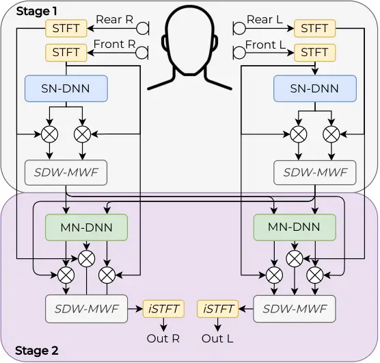
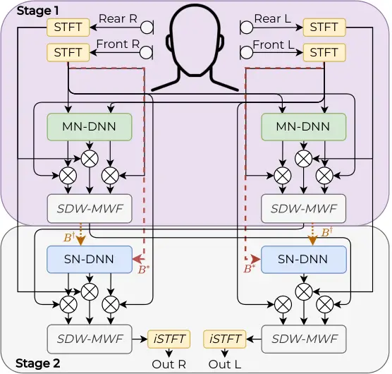
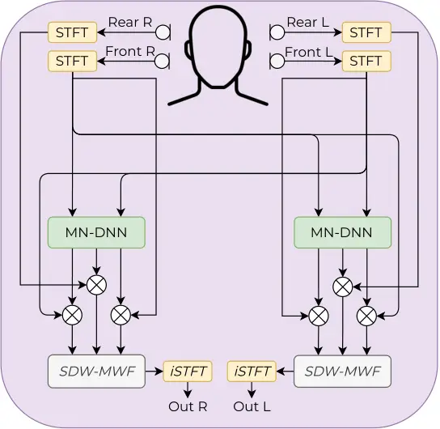

# It Takes Few to TANGO: A Quantized Distributed Model for Binaural Speech Enhancement

Zahra
Benslimane [ ](https://orcid.org/0009-0005-9846-9767)¹²,
Pierre Chouteau¹, Martyna
Poreba [](https://orcid.org/0000-0002-5102-7735)¹,
Fabrice
Auzanneau [ ](https://orcid.org/0000-0002-4441-9239)¹,
Michal
Szczepanski [](https://orcid.org/0009-0000-9061-4396)¹,
Fabian
Chersi [](https://orcid.org/0000-0003-1257-2607)¹,
Romain
Serizel [](https://orcid.org/0000-0002-6848-0114)²
Affiliation:  Affiliation: ¹ Université Paris-Saclay, CEA, List, F-91120
Palaiseau, France Affiliation:  Affiliation: ² Université de Lorraine,
CNRS, Inria, LORIA, F-54000 Nancy, France Affiliation:  Affiliation: 
zahra-hafida.benslimane@cea.fr

###### Abstract

Neural network-based multichannel speech enhancement systems achieve
strong enhancement performance, but their computational and memory
requirements limit deployment on resource-constrained devices. This
paper investigates low-precision inference for TANGO, a hybrid
distributed binaural speech enhancement system combining neural mask
estimation with spatial filtering. We evaluate post-training
quantization and quantization-aware training for the neural components,
and analyze how quantization errors in the mask estimators propagate
through the downstream spatial filtering stage. Our analysis shows that,
although quantization degrades intermediate mask estimates, the spatial
filtering stage compensates for most quantization-induced errors.
Leveraging this robustness, we simplify TANGO into MN-TANGO, reducing
both model size and computational complexity while maintaining
comparable final performance. By combining INT8 weight-and-activation
quantization with ERB compression and grouped recurrent layers, the most
compact MN-TANGO reaches 4.65 MMAC/s and 0.177 MB.

###### Index Terms: 

Speech enhancement, quantization-aware training, recurrent neural
networks, low-compute.

## I Introduction

Deep learning approaches to speech enhancement (SE) have achieved strong
performance, but they often rely on large and computationally expensive
models. This limits their deployment on resource-constrained devices,
such as embedded systems and hearing aids, where low-latency and
low-power inference are critical. To address this limitation, a growing
body of work has investigated model compression for neural SE.

Early studies mainly focused on reducing model storage through weight
compression. Wu et al. \[1\] combined channel pruning with k-means
clustering to quantize the weights of a time-domain fully convolutional
network. Similarly, Tan and Wang \[2\] applied sparse regularization,
iterative pruning, and k-means-based quantization to several
architectures, including temporal convolutional networks, and gated
convolutional recurrent networks (GCRNs). Other works explored reduced
floating-point representations. Hsu et al. \[3\] introduced the
Exponent-Only Floating-Point Quantized Neural Network (EOFP-QNN), which
quantizes the mantissa and exponent separately. Lin et al. \[4\] went
further by discarding the mantissa entirely and retaining only the sign
and exponent bits, achieving about $`81\%`$ model compression.

While these methods reduce memory footprint, they primarily target
weights. Activations, inputs, and outputs often remain in floating
point, so inference may still require costly floating-point arithmetic.
This limits efficiency on low-power hardware, such as microcontrollers
and neural processing units, which are typically optimized for integer
pipelines such as INT8. To address this limitation, Fedorov et al. \[5\]
proposed TinyLSTMs, combining structured pruning with quantization-aware
training (QAT) \[6\] to quantize both weights and activations to 8 bits,
while keeping the model outputs on 16-bit. Recent studies further showed
that activation and I/O standard QAT can be more challenging than weight
quantization alone, especially at high input signal-to-noise ratios
(SNRs). To mitigate this effect, \[7\] introduced a residual correction
branch to compensate for quantization errors. This approach was later
extended to source separation using a knowledge-distillation-based loss
for quantization-sensitive samples \[8\].



(a) Original two-stage TANGO



(b) Inverted TANGO



(c) MN-TANGO

Fig. 1: Overview of the evaluated TANGO variants: (a) original two-stage
TANGO with SN-DNN followed by MN-DNN processing, (b) inverted TANGO with
MN-DNN processing before the SN-DNN stage, and (c) MN-TANGO with only
the MN-DNN stage. In (b), the dotted lines indicate the two alternative
inputs to the second-stage SN-DNN: ($`B^{\dagger}`$) uses the output of
the first spatial filtering stage, whereas ($`B^{\star}`$) uses the
local reference signal.

Despite these advances, most quantization studies for SE focus on
single-channel, purely neural models, leaving hybrid multichannel
systems largely unexplored. In this work, we show that the hybrid
neural-spatial structure of TANGO \[9\] makes it robust to low-precision
neural inference. We focus on quantizing the neural network rather than
the spatial filter, since the neural component accounts for most of the
computational cost \[10\]. Although quantization degrades intermediate
mask estimates, the downstream spatial filtering stage compensates for
most quantization-induced errors. Our results highlight three main
findings: (i) the final spatial filtering stage provides most of the
enhancement gains, (ii) spatial filtering mitigates most of the
degradation introduced by quantization, and (iii) the original two-stage
architecture can be simplified into its second stage (MN-TANGO) while
maintaining comparable final performance. Building on these findings, we
combine MN-TANGO with QAT, Equivalent Rectangular Bandwidth (ERB)
compression, and grouped recurrent layers to obtain a compact
low-compute model for distributed binaural SE.

## II Background

### II-A Baseline TANGO Architecture

TANGO \[9\] is used as the baseline architecture in this study. Like
other hybrid SE systems, TANGO combines the representation learning
capabilities of deep neural networks with the spatial filtering
properties of classical beamformers. This hybrid design makes it
particularly relevant for studying the impact of quantization on both
neural and signal-processing components. In the first stage, each
ear-node independently estimates speech and noise time-frequency masks
using a single-node DNN (SN-DNN). These masks are used to estimate
speech and noise spatial covariance matrices, from which a
GEVD-based \[11\] speech-distortion-weighted multichannel Wiener filter
(SDW-MWF) \[12\] is derived and applied as a spatial filter. The
resulting ear-specific compressed signal is then transmitted to the
contralateral ear-node. In the second stage, a multi-node DNN (MN-DNN)
refines the mask estimates by exploiting both local signals and the
exchanged representation. A final SDW-MWF then generates the enhanced
binaural output. The overall architecture is illustrated in Fig. 11(a).

|               |           |       |       |            |            |          |            |          |            |         |           |           |           |           |
| ------------- | --------- | ----- | ----- | ---------- | ---------- | -------- | ---------- | -------- | ---------- | ------- | --------- | --------- | --------- | --------- |
| Quant. scheme | Precision |       |       | Memory^(↓) | SI-SIR^(↑) |          | SI-SDR^(↑) |          | SI-SAR^(↑) |         | STOI^(↑)  |           | PESQ^(↑)  |           |
|               | W         | A     | I/O   | MB         | L          | R        | L          | R        | L          | R       | L         | R         | L         | R         |
| Noisy         | $`-`$     | $`-`$ | $`-`$ | $`-`$      | $`0.0`$    | $`-4.0`$ | $`-0.6`$   | $`-4.6`$ | $`-`$      | $`-`$   | $`0.68`$  | $`0.56`$  | $`1.14`$  | $`1.10`$  |
| Float32       | FP32      | FP32  | FP32  | $`4.03`$   | $`22.8`$   | $`26.2`$ | $`4.7`$    | $`5.0`$  | $`5.0`$    | $`5.1`$ | $`0.842`$ | $`0.850`$ | $`1.731`$ | $`1.770`$ |
| DPTQ          | INT8      | FP32  | FP32  | $`1.01`$   | $`18.4`$   | $`20.9`$ | $`2.7`$    | $`2.9`$  | $`3.6`$    | $`3.6`$ | $`0.811`$ | $`0.813`$ | $`1.585`$ | $`1.614`$ |
| QAT           | INT8      | FP32  | FP32  | $`1.083`$  | $`22.8`$   | $`26.2`$ | $`4.7`$    | $`5.0`$  | $`5.0`$    | $`5.1`$ | $`0.843`$ | $`0.851`$ | $`1.729`$ | $`1.765`$ |
| QAT           | INT8      | INT8  | INT16 | $`1.083`$  | $`23.0`$   | $`25.9`$ | $`3.7`$    | $`4.5`$  | $`4.0`$    | $`4.6`$ | $`0.828`$ | $`0.842`$ | $`1.735`$ | $`1.753`$ |

TABLE I: Model comparison with quantization scheme, precision
configuration, memory, and left/right ear scores. W, A, and I/O denote
weights, activations, and input/output tensors, respectively.

### II-B Neural Network Quantization

Quantization maps floating-point values to a lower-precision integer
representation. This reduces memory requirements and can improve
inference efficiency, particularly on hardware that supports
low-precision arithmetic. In neural networks, it can be applied both to
the weights and to the intermediate activations.

In uniform affine quantization, values are mapped from a selected
floating-point range to a finite set of integer levels determined by the
target bit-width. The scale controls the spacing between these levels,
while clipping ensures that values outside the selected range remain
representable. In dynamic post-training quantization (DPTQ),
quantization is applied after floating-point training: the layer weights
are stored in low precision, while activations are quantized dynamically
at runtime according to their observed range. In contrast, QAT simulates
low-precision inference during training by inserting fake-quantization
modules in the forward pass. Since rounding is non-differentiable,
gradients are approximated using a straight-through estimator, allowing
the model to adapt to quantization errors before deployment \[6\].

## III Toward Low-Compute Quantized Tango

### III-A From TANGO to MN-TANGO

To better understand the contribution of each TANGO stage, we
investigate alternative architectures that either reorganize or simplify
its processing stages, as shown in Fig. 1. We first evaluate two
inverted configurations, denoted as ($`B^{\star}`$) and
($`B^{\dagger}`$) and illustrated in Fig. 1(b). Both variants start with
a cross-node exchange of the reference signals and apply an MN-DNN
before the first spatial filtering stage. They differ in the input used
by the second-stage SN-DNN: ($`B^{\dagger}`$) uses the output of the
first spatial filtering stage, whereas ($`B^{\star}`$) uses only the
local reference signal of the corresponding node. These variants allow
us to assess whether performing multi-node processing earlier in the
pipeline improves enhancement performance. We further investigate a
simplified MN-only configuration, shown in Fig. 1(c), that removes the
SN-DNN stage entirely. This variant tests whether the first single-node
stage is necessary once inter-node information is available, or whether
most of the final enhancement can be preserved by combining multi-node
mask estimation with the final spatial filtering stage. In the
following, we refer to this configuration as MN-TANGO.

### III-B End-to-End Training

The original TANGO training strategy optimizes the neural mask
estimators using mask-level objectives. However, in hybrid
neural-beamforming systems, accurate mask estimation does not
necessarily translate into optimal enhanced signals after spatial
filtering. To better align optimization with the final enhancement
objective, we investigate end-to-end training, where the spatial
filtering stage is included in the training loop. During training, we
use a differentiable implementation of the SDW-MWF, which allows
gradients to propagate from the enhanced STFT loss back to the neural
mask estimators. At inference time, the spatial filtering stage is
computed using the GEVD-based implementation adopted in the original
TANGO model. Thus, the reported enhancement results are obtained with
the GEVD-based spatial filter, unless explicitly stated otherwise.

The end-to-end objective combines the mask-level loss with an
enhanced-STFT loss computed after the last spatial filtering stage. Let
$`\tilde{M}_{c}`$ and $`M_{c}`$ denote the estimated and target masks
for ear $`c\in\{\mathrm{L},\mathrm{R}\}`$, and let $`\tilde{S}_{c}`$ and
$`S_{c}`$ denote the corresponding enhanced and clean STFTs. The mask
loss is defined as:

```math
\mathcal{L}_{\mathrm{mask}}=\frac{1}{2}\sum_{c\in\{\mathrm{L},\mathrm{R}\}}\mathrm{MSE}\left(\tilde{M}_{c},M_{c}\right). \tag{1}
```

Inspired by \[13\], the enhanced-STFT loss is defined as:

```math
\begin{array}[]{@{}l@{}}\ell_{\mathrm{STFT}}\left(\tilde{S}_{c},S_{c}\right)=(1-\beta)\mathrm{MSE}\left(|\tilde{S}_{c}|,|S_{c}|\right)+\\[2.15277pt]
{}\beta\left(\mathrm{MSE}\left(\mathrm{Re}\{\tilde{S}_{c}\},\mathrm{Re}\{S_{c}\}\right)+\mathrm{MSE}\left(\mathrm{Im}\{\tilde{S}_{c}\},\mathrm{Im}\{S_{c}\}\right)\right).\end{array} \tag{2}
```

where $`\mathrm{Re}\{\cdot\}`$ and $`\mathrm{Im}\{\cdot\}`$ denote the
real and imaginary parts, respectively. Here, $`\beta`$ balances
magnitude-domain and complex-domain reconstruction terms. The loss is
then averaged over the two ears:

```math
\mathcal{L}_{\mathrm{STFT}}=\frac{1}{2}\sum_{c\in\{\mathrm{L},\mathrm{R}\}}\ell_{\mathrm{STFT}}\left(\tilde{S}_{c},S_{c}\right). \tag{3}
```

The full end-to-end objective is:

```math
\mathcal{L}_{\mathrm{task}}=\alpha\mathcal{L}_{\mathrm{mask}}+(1-\alpha)\mathcal{L}_{\mathrm{STFT}}, \tag{4}
```

where $`\alpha`$ controls the balance between mask reconstruction and
final enhanced-signal reconstruction.

|                                  |                    |                    |                   |                      |                      |                     |                     |                     |                     |                      |                      |                      |                      |
| -------------------------------- | ------------------ | ------------------ | ----------------- | -------------------- | -------------------- | ------------------- | ------------------- | ------------------- | ------------------- | -------------------- | -------------------- | -------------------- | -------------------- |
| Method                           | MMACs/s^(↓)        | \#Params^(↓)       | Step              | SI-SIR^(↑)           |                      | SI-SDR^(↑)          |                     | SI-SAR^(↑)          |                     | STOI^(↑)             |                      | PESQ^(↑)             |                      |
|                                  |                    |                    |                   | L                    | R                    | L                   | R                   | L                   | R                   | L                    | R                    | L                    | R                    |
| Noisy                            | $`-`$              | $`-`$              | $`-`$             | $`0.0`$              | $`-4.0`$             | $`-0.6`$            | $`-4.6`$            | $`-`$               | $`-`$               | $`0.68`$             | $`0.56`$             | $`1.14`$             | $`1.10`$             |
| TANGO                            | $`65.65`$          | $`1~M`$            | SN-DNN            | $`3.1`$              | $`0.0`$              | $`0.7`$             | $`-2.2`$            | $`7.3`$             | $`5.5`$             | $`0.71`$             | $`0.59`$             | $`1.14`$             | $`1.09`$             |
|                                  |                    |                    | Filter₁ (GEVD)    | $`9.4`$              | $`6.7`$              | $`-0.7`$            | $`-2.1`$            | $`0.8`$             | $`0.4`$             | $`0.73`$             | $`0.66`$             | $`1.21`$             | $`1.16`$             |
|                                  |                    |                    | MN-DNN            | $`13.0`$             | $`7.8`$              | $`5.0`$             | $`2.2`$             | $`6.2`$             | $`4.6`$             | $`0.75`$             | $`0.74`$             | $`1.22`$             | $`1.15`$             |
|                                  |                    |                    | Filter₂ (GEVD)    | $`\mathbf{24.3}`$    | $`\mathbf{25.6}`$    | $`5.3`$             | $`\underline{4.9}`$ | $`5.5`$             | $`5.0`$             | $`0.85`$             | $`\mathbf{0.85}`$    | $`1.76`$             | $`1.68`$             |
| Inverted TANGO ($`B^{\dagger})`$ | $`65.65`$          | $`1~M`$            | MN-DNN            | $`3.3`$              | $`1.7`$              | $`-0.9`$            | $`-2.2`$            | $`4.8`$             | $`3.5`$             | $`0.52`$             | $`0.58`$             | $`1.11`$             | $`1.09`$             |
|                                  |                    |                    | Filter₁ (GEVD)    | $`12.3`$             | $`15.2`$             | $`-1.3`$            | $`-0.4`$            | $`0.5`$             | $`0.7`$             | $`0.70`$             | $`0.77`$             | $`1.29`$             | $`1.30`$             |
|                                  |                    |                    | SN-DNN            | $`9.1`$              | $`3.9`$              | $`3.6`$             | $`0.3`$             | $`6.0`$             | $`5.1`$             | $`0.72`$             | $`0.67`$             | $`1.15`$             | $`1.10`$             |
|                                  |                    |                    | Filter₂ (GEVD)    | $`\underline{24.2}`$ | $`\underline{24.9}`$ | $`5.2`$             | $`\underline{4.9}`$ | $`5.4`$             | $`5.1`$             | $`0.85`$             | $`0.84`$             | $`1.71`$             | $`1.67`$             |
| Inverted TANGO ($`B^{\star}`$)   | $`65.65`$          | $`1~M`$            | MN-DNN            | $`3.1`$              | $`0.8`$              | $`-0.20`$           | $`-2.1`$            | $`6.2`$             | $`4.7`$             | $`0.57`$             | $`0.55`$             | $`1.11`$             | $`1.10`$             |
|                                  |                    |                    | Filter₁ (GEVD)    | $`11.2`$             | $`8.7`$              | $`4.8`$             | $`2.3`$             | $`6.6`$             | $`4.4`$             | $`0.74`$             | $`0.62`$             | $`1.23`$             | $`1.13`$             |
|                                  |                    |                    | SN-DNN            | $`11.2`$             | $`8.7`$              | $`4.8`$             | $`2.3`$             | $`6.6`$             | $`4.4`$             | $`0.74`$             | $`0.62`$             | $`1.25`$             | $`1.13`$             |
|                                  |                    |                    | Filter₂ (GEVD)    | $`23.2`$             | $`23.6`$             | $`\mathbf{6.7}`$    | $`\mathbf{5.5}`$    | $`\mathbf{7.0}`$    | $`\mathbf{5.8}`$    | $`\mathbf{0.88}`$    | $`\underline{0.84}`$ | $`\mathbf{1.84}`$    | $`\mathbf{1.77}`$    |
| MN-TANGO                         | $`\mathbf{30.79}`$ | $`\mathbf{0.5~M}`$ | MN-DNN            | $`12.2`$             | $`8.9`$              | $`4.2`$             | $`2.0`$             | $`5.5`$             | $`3.8`$             | $`0.67`$             | $`0.61`$             | $`1.19`$             | $`1.13`$             |
|                                  |                    |                    | Filter₂ (GEVD)    | $`23.7`$             | $`24.2`$             | $`\underline{6.1}`$ | $`\mathbf{5.5}`$    | $`\underline{6.3}`$ | $`\underline{5.6}`$ | $`\underline{0.86}`$ | $`\underline{0.84}`$ | $`\underline{1.79}`$ | $`\underline{1.73}`$ |
|                                  |                    |                    | Filter₂ (SDW-MWF) | $`12.5`$             | $`10.4`$             | $`6.9`$             | $`5.5`$             | $`9.2`$             | $`8.3`$             | $`0.83`$             | $`0.76`$             | $`1.56`$             | $`1.37`$             |

TABLE II: Stage-wise performance and complexity comparison of end-to-end
trained TANGO variants in FP32. Bold and underlined values indicate the
best and second-best scores, respectively, among the final GEVD
filtering rows.

### III-C Low-Precision TANGO

We evaluate TANGO under low-precision inference using QAT, following
Section II-B. Because low-precision inference may degrade the quality of
the predicted masks and the resulting enhanced signal, we further
introduce knowledge distillation (KD) with floating-point TANGO as the
teacher and the quantized model as the student. The KD objective
combines mask-level MSE matching and enhanced-STFT matching between the
teacher and student outputs. The mask-level KD loss is defined as:

```math
\mathcal{L}_{\mathrm{KD}}^{\mathrm{mask}}=\frac{1}{2}\sum_{c\in\{\mathrm{L},\mathrm{R}\}}\mathrm{MSE}\left(M^{(s)}_{c},M^{(t)}_{c}\right), \tag{5}
```

where $`M^{(s)}_{c}`$ and $`M^{(t)}_{c}`$ denote the final masks
predicted by the student and teacher, respectively. The enhanced-STFT KD
loss reuses the per-ear STFT loss from Section III-B:

```math
\mathcal{L}_{\mathrm{KD}}^{\mathrm{STFT}}=\frac{1}{2}\sum_{c\in\{\mathrm{L},\mathrm{R}\}}\ell_{\mathrm{STFT}}\left(Y^{(s)}_{c},Y^{(t)}_{c}\right), \tag{6}
```

where $`Y^{(s)}_{c}`$ and $`Y^{(t)}_{c}`$ denote the corresponding
enhanced STFTs after the differentiable spatial filter. The final
distillation and training objectives are:

```math
\displaystyle\mathcal{L}_{\mathrm{distill}} \displaystyle=\lambda_{\mathrm{KD}}\mathcal{L}_{\mathrm{KD}}^{\mathrm{mask}}+(1-\lambda_{\mathrm{KD}})\mathcal{L}_{\mathrm{KD}}^{\mathrm{STFT}}, \tag{7}
```

```math
\displaystyle\mathcal{L}{\mathrm{total}} \displaystyle=\lambda_{\mathrm{task}}\mathcal{L}_{\mathrm{task}}+(1-\lambda_{\mathrm{task}})\mathcal{L}_{\mathrm{distill}}. \tag{8}
```

where $`\lambda_{\mathrm{KD}}`$ controls the balance between mask-level
and enhanced-STFT distillation, and $`\lambda_{\mathrm{task}}`$ controls
the balance between supervised task training and knowledge distillation.

### III-D Low-Compute TANGO

Beyond low-precision quantization, we further reduce the complexity of
TANGO through architectural compression. This allows us to assess
whether the proposed quantization pipeline remains effective under
stricter compute and memory constraints.

This design adapts the architectural compression strategy introduced in
our previous low-latency, low-compute RT-TANGO framework \[14\], relying
on ERB feature compression to exploit perceptual frequency redundancy
and grouped recurrent processing to reduce recurrent computation.

After the point-wise channel-mixing layer, the linear-frequency STFT
representation is projected onto a compact ERB scale, reducing the
recurrent input dimension. The predicted ERB-domain mask is then mapped
back to the original STFT frequency bins before filtering.

The original MN-DNN recurrent block is replaced with grouped LSTM
layers. The hidden representation is partitioned into (G) groups
processed independently within each recurrent layer. Deterministic
interleaving is applied between layers to exchange information across
groups \[15\].

## IV Experimental setup

### IV-A Training and Evaluation

The training data consisted of simulated binaural mixtures generated
according to the setup described by Monir et al. \[16\]. The simulated
hearing-aid configuration contains four microphones, two placed on each
ear. Speech signals were taken from LibriSpeech \[17\] and combined with
speech-shaped noise and real environmental noise sources. For
evaluation, we used a subset of the BinauRec dataset¹¹ 1 Online:
https://zenodo.org/records/7256984 \[18\]. This subset contains 1,200
binaural mixtures generated from measured room impulse responses. The
RIRs were recorded using a portable hearing laboratory equipped with
behind-the-ear hearing-aid shells mounted on a dummy head \[19\].
Mixtures were generated at input SNRs of $`-5`$, $`0`$, and $`5`$ dB.
The target source was placed in front of the listener, while the noise
source was located either $`45^{\circ}`$ or $`90^{\circ}`$ to the right
of the target. This setup reflects a typical hearing-aid scenario, with
a frontal target speaker and lateral interfering noise. Only right-side
noise locations are considered, since left-side configurations are
symmetric, making the right ear more challenging.

| Output              | Precision | KD    | SI-SIR^(↑) |          | SI-SDR^(↑) |         | SI-SAR^(↑) |         | STOI^(↑) |          | PESQ^(↑) |          |
| ------------------- | --------- | ----- | ---------- | -------- | ---------- | ------- | ---------- | ------- | -------- | -------- | -------- | -------- |
|                     |           |       | L          | R        | L          | R       | L          | R       | L        | R        | L        | R        |
| MN-DNN              | FP32      | $`-`$ | $`12.2`$   | $`8.9`$  | $`4.2`$    | $`2.0`$ | $`5.5`$    | $`3.8`$ | $`0.67`$ | $`0.61`$ | $`1.19`$ | $`1.13`$ |
|                     | W8A8      | ✗     | $`10.7`$   | $`7.1`$  | $`3.7`$    | $`1.4`$ | $`5.4`$    | $`4.0`$ | $`0.66`$ | $`0.59`$ | $`1.18`$ | $`1.12`$ |
|                     | W8A8      | ✓     | $`10.6`$   | $`7.0`$  | $`3.6`$    | $`1.3`$ | $`5.3`$    | $`3.9`$ | $`0.65`$ | $`0.59`$ | $`1.18`$ | $`1.12`$ |
| Final output (GEVD) | FP32      | $`-`$ | $`23.7`$   | $`24.2`$ | $`6.1`$    | $`5.5`$ | $`6.3`$    | $`5.6`$ | $`0.86`$ | $`0.84`$ | $`1.79`$ | $`1.73`$ |
|                     | W8A8      | ✗     | $`23.6`$   | $`24.8`$ | $`5.8`$    | $`5.4`$ | $`6.1`$    | $`5.5`$ | $`0.86`$ | $`0.84`$ | $`1.77`$ | $`1.71`$ |
|                     | W8A8      | ✓     | $`23.9`$   | $`25.2`$ | $`5.8`$    | $`5.3`$ | $`6.0`$    | $`5.5`$ | $`0.86`$ | $`0.84`$ | $`1.77`$ | $`1.72`$ |

TABLE III: Effect of W8A8 quantization and knowledge distillation on
MN-TANGO before and after GEVD filtering.

### IV-B Model Configuration

All mask estimators use $`257`$-bin magnitude STFT features computed
with a $`512`$-point FFT, a $`512`$-sample Hann window, and a
$`256`$-sample hop at $`16`$ kHz, corresponding to $`62.5`$ frames/s.
Floating-point end-to-end models are trained on $`512`$-frame segments,
while grouped QAT models are initialized from their floating-point
grouped checkpoints and fine-tuned on $`64`$-frame segments, to reduce
training time.

The learning rates are $`5\times 10^{-4}`$ for floating-point training
and $`10^{-4}`$ for QAT fine-tuning. For the end-to-end objective, we
set $`\alpha=0.3`$ and $`\beta=0.3`$. For the KD experiments, we set
$`\lambda_{\mathrm{KD}}=0.3`$ and $`\lambda_{\mathrm{task}}=0.7`$. In
all experiments, all spatial filtering stages use the trade-off
parameter $`\mu=1`$.

TANGO uses two recurrent mask estimators. The SN-DNN is a unidirectional
LSTM mask estimator with three LSTM layers of $`128`$ hidden units and a
fully connected mask head with hidden/output dimensions $`256`$ and
$`257`$. The MN-DNN first applies a point-wise convolution to combine
the two input channels, followed by GELU activation, layer
normalization, a three-layer unidirectional LSTM with $`128`$ hidden
units, and a fully connected sigmoid mask head with $`257`$ output bins.

For the low-compute TANGO, the ERB projection uses $`64`$ low-frequency
linear bins and $`64`$ ERB bands, yielding a $`128`$-dimensional
recurrent input for most grouped models. When divisibility by the group
count $`G`$ is required, the number of ERB bands is adjusted
accordingly. The grouped recurrent block consists of two unidirectional
LSTM layers with $`128`$ hidden units, and the final mask is mapped back
to the original $`257`$ STFT frequency bins before filtering.

### IV-C Quantization Configurations

In this work, quantization is applied only to the neural mask
estimators. All fixed signal-processing components, including STFT/iSTFT
operations, covariance estimation, and SDW-MWF/GEVD spatial filtering,
remain in floating-point precision (FP32). Although the low-precision
methodology can be applied to any TANGO variant, the QAT and KD
experiments in this paper are conducted on MN-TANGO. DPTQ is implemented
using the PyTorch eager-mode dynamic quantization API.²² 2
torch.ao.quantization.quantize_dynamic. For QAT, we use a custom
implementation inspired by the FQSS fully quantized source-separation
framework³³ 3 Code:
[https://github.com/ssi-research/FQSS/tree/main](https://github.com/ssi-research/FQSS/tree/main)..
Weights use a symmetric signed quantizer, while activations are
quantized using an asymmetric affine quantizer whose range is
initialized from observed activation minima and maxima. Observer-based
range updates are enabled during an initial warm-up phase and then
frozen, after which quantization ranges are optimized by gradient
descent. The main QAT configuration uses mixed precision: trainable
weights and internal activations are quantized to $`8`$ bits (W8A8),
while input and output mask tensors are simulated using $`16`$-bit. Bias
terms are kept in higher precision and added in the accumulator domain
before requantization. Throughout this work, W8A8 refers specifically to
the precision of internal neural layers rather than to input/output mask
tensors.

### IV-D Evaluation Metrics

Enhancement performance was measured using scale-invariant
signal-to-distortion ratio (SI-SDR), scale-invariant
signal-to-interference ratio (SI-SIR), and scale-invariant
signal-to-artifacts ratio (SI-SAR), all reported in dB \[20\], as well
as the short-time objective intelligibility (STOI) \[21\] and perceptual
evaluation of speech quality (PESQ) \[22\]. The unprocessed noisy input
mixture is reported in the result tables to provide a reference signal
quality prior to enhancement. SI-SAR is not reported for this baseline,
as the metric reflects artifacts introduced by signal processing and is
therefore not applicable to an unprocessed input. Computational
complexity and model size are reported per processing node, with
complexity measured in multiply-accumulate operations (MACs) and model
size given in terms of the number of trainable parameters and memory
footprint.

## V Results

### V-A Quantized TANGO

Table I compares DPTQ and QAT without KD on the full TANGO model,
revealing a clear performance gap between post-training and
training-aware quantization. DPTQ leads to a noticeable degradation
compared with the FP32 baseline. This likely reflects the quantization
sensitivity of LSTM layers, whose activations and internal states can
span different dynamic ranges. In contrast, weight-only QAT preserves
the FP32 performance almost exactly, indicating that TANGO can
effectively adapt to quantization noise when low-precision effects are
incorporated during training. When activations and I/O tensors are also
quantized, performance slightly decreases, mainly in SI-SDR and SI-SAR,
while STOI and PESQ remain close to the FP32 baseline. This suggests
that the neural mask estimators are highly sensitive to naïve
post-training quantization, but can effectively adapt to low-precision
constraints when quantization noise is incorporated during training.

### V-B Quantized MN-TANGO

| G      | PW       | LSTM       | ERB+Inv.  | FC        | Total/frame^(↓) | Total/s^(↓) |
| ------ | -------- | ---------- | --------- | --------- | --------------- | ----------- |
| $`1`$  | $`0.51`$ | $`459.26`$ | $`-`$     | $`32.90`$ | $`492.67`$      | $`30.79`$   |
| $`2`$  | $`0.51`$ | $`131.07`$ | $`24.70`$ | $`16.38`$ | $`172.67`$      | $`10.79`$   |
| $`4`$  | $`0.51`$ | $`65.54`$  | $`24.70`$ | $`16.38`$ | $`107.14`$      | $`6.70`$    |
| $`6`$  | $`0.51`$ | $`42.34`$  | $`23.93`$ | $`15.88`$ | $`82.66`$       | $`5.17`$    |
| $`8`$  | $`0.51`$ | $`32.77`$  | $`24.70`$ | $`16.38`$ | $`74.37`$       | $`4.65`$    |
| $`10`$ | $`0.51`$ | $`27.04`$  | $`25.48`$ | $`16.90`$ | $`69.93`$       | $`4.37`$    |

TABLE IV: Component-wise computational complexity of the grouped
recurrent architecture. Component costs and frame totals are in
kMACs/frame; the last column is in MMAC/s.

|               |       |                       |                         |                          |                |                      |                      |                     |                     |                     |                     |                      |                      |                      |                      |
| ------------- | ----- | --------------------- | ----------------------- | ------------------------ | -------------- | -------------------- | -------------------- | ------------------- | ------------------- | ------------------- | ------------------- | -------------------- | -------------------- | -------------------- | -------------------- |
| Method        | G     | MMACs/s^(↓)           | \#Params^(↓)            | Memory^(↓)               | Step           | SI-SIR^(↑)           |                      | SI-SDR^(↑)          |                     | SI-SAR^(↑)          |                     | STOI^(↑)             |                      | PESQ^(↑)             |                      |
|               |       |                       |                         |                          |                | L                    | R                    | L                   | R                   | L                   | R                   | L                    | R                    | L                    | R                    |
| Noisy         | $`-`$ | $`-`$                 | $`-`$                   | $`-`$                    | $`-`$          | $`0.0`$              | $`-4.0`$             | $`-0.6`$            | $`-4.6`$            | $`-`$               | $`-`$               | $`0.68`$             | $`0.56`$             | $`1.14`$             | $`1.10`$             |
| TANGO         | $`-`$ | $`65.65`$             | $`1M`$                  | $`4.03~MB`$              | Filter₂ (GEVD) | $`\mathbf{24.3}`$    | $`\mathbf{25.6}`$    | $`5.3`$             | $`4.9`$             | $`5.5`$             | $`5.0`$             | $`\underline{0.85}`$ | $`\mathbf{0.85}`$    | $`\underline{1.76}`$ | $`\underline{1.68}`$ |
| MN-TANGO W8A8 | $`-`$ | $`30.79`$             | $`0.5`$ M               | $`0.508`$ MB             | MN-DNN         | $`12.2`$             | $`8.9`$              | $`4.2`$             | $`2.0`$             | $`5.5`$             | $`3.8`$             | $`0.67`$             | $`0.61`$             | $`1.19`$             | $`1.13`$             |
|               |       |                       |                         |                          | Filter₂ (GEVD) | $`\underline{23.7}`$ | $`\underline{24.2}`$ | $`\mathbf{6.1}`$    | $`\mathbf{5.5}`$    | $`\mathbf{6.3}`$    | $`\mathbf{5.6}`$    | $`\mathbf{0.86}`$    | $`\underline{0.84}`$ | $`\mathbf{1.79}`$    | $`\mathbf{1.73}`$    |
| MN-TANGO W8A8 | $`2`$ | $`\underline{10.79}`$ | $`\underline{0.179~M}`$ | $`\underline{0.274~MB}`$ | MN-DNN         | $`10.3`$             | $`6.4`$              | $`3.4`$             | $`1.0`$             | $`5.3`$             | $`3.8`$             | $`0.65`$             | $`0.58`$             | $`1.18`$             | $`1.11`$             |
|               |       |                       |                         |                          | Filter₂ (GEVD) | $`22.7`$             | $`22.8`$             | $`\underline{5.7}`$ | $`\underline{5.0}`$ | $`\underline{6.0}`$ | $`\underline{5.3}`$ | $`\underline{0.85}`$ | $`0.83`$             | $`1.74`$             | $`1.66`$             |
| MN-TANGO W8A8 | $`8`$ | $`\mathbf{4.65}`$     | $`\mathbf{0.081~M}`$    | $`\mathbf{0.177~MB}`$    | MN-DNN         | $`9.1`$              | $`5.7`$              | $`2.7`$             | $`0.4`$             | $`4.9`$             | $`3.6`$             | $`0.62`$             | $`0.55`$             | $`1.16`$             | $`1.10`$             |
|               |       |                       |                         |                          | Filter₂ (GEVD) | $`21.2`$             | $`21.3`$             | $`5.2`$             | $`4.4`$             | $`5.6`$             | $`4.8`$             | $`0.84`$             | $`0.82`$             | $`1.68`$             | $`1.60`$             |

- \*
  TANGO is the full-precision reference; grouping and W8A8 quantization
  are applied only to MN-TANGO variants.

TABLE V: Performance-complexity trade-off of W8A8 MN-TANGO variants with
grouped recurrent layers.

Table II compares the TANGO variants introduced in Section III-A. Across
variants, the largest performance jump consistently occurs after the
final spatial filtering stage rather than within the neural mask
estimators. This indicates that the downstream spatial filter
contributes most of the final enhancement by exploiting binaural spatial
structure and compensating for imperfect mask estimates. For the
original TANGO model, the final stage increases SI-SIR from
$`13.0/7.8`$ dB after MN-DNN to $`24.3/25.6`$ dB after GEVD filtering
for the left and right ears, respectively. Among the inverted variants,
$`B^{\dagger}`$ achieves performance close to the original TANGO model
but does not provide consistent improvements across metrics. By
contrast, $`B^{\star}`$ achieves the best reconstruction quality in
terms of SI-SDR, SI-SAR, STOI, and PESQ, although its SI-SIR remains
slightly below that of the original TANGO model. This suggests that
performing multi-node processing earlier in the pipeline improves signal
reconstruction quality, even if interference suppression is not
maximized.

MN-TANGO provides the best overall trade-off between enhancement
quality, computational cost, and communication overhead. With GEVD
inference, it reaches SI-SIR values of $`23.7`$ dB and $`24.2`$ dB for
the left and right ears, respectively. Compared with the full TANGO
system, MN-TANGO reduces the parameter count and neural computational
cost by approximately 50%, from $`1.0`$M to $`0.5`$M parameters and from
$`65.65`$ to $`30.79`$ MMAC/s, while preserving the single inter-node
exchange required by the original TANGO architecture.

Since the end-to-end training uses a differentiable SDW-MWF
implementation, we additionally evaluate MN-TANGO using the same SDW-MWF
implementation at inference. This allows us to quantify the effect of
the train–test filtering mismatch and assess whether using the same
filtering formulation during training and inference improves
performance. The results show that SDW-MWF inference produces higher
SI-SDR and SI-SAR, whereas GEVD-based filtering provides stronger
interference suppression and better perceptual scores. This suggests
that the differentiable SDW-MWF is effective as an optimization
surrogate during training, while the GEVD-based implementation remains
preferable.

Table III evaluates the impact of W8A8 quantization and knowledge
distillation on MN-TANGO. Although quantization noticeably degrades the
intermediate MN-DNN outputs, most of this degradation disappears after
GEVD filtering. This indicates that the spatial filtering stage is
robust to errors introduced by 8-bit weight and activation quantization.
KD provides only marginal improvements, suggesting that teacher guidance
brings limited benefit once the downstream spatial filter compensates
for most quantization artifacts.

### V-C Low memory, low compute MN-TANGO

Fig. 2 and Table IV show that recurrent grouping provides substantial
computational savings with controlled performance degradation. The best
performance is obtained with one or two groups, whereas four and six
groups lead to a noticeable degradation. Performance partially recovers
for eight and ten groups, indicating that the effect of grouping is not
strictly monotonic and depends on how the recurrent representation is
partitioned. At the same time, increasing the number of groups
substantially reduces computational cost: the total complexity decreases
from $`492.67`$ kMACs/frame ($`30.79`$ MMAC/s) with one group to
$`69.93`$ kMACs/frame ($`4.37`$ MMAC/s) with ten groups. This reduction
is largely driven by the recurrent block, whose complexity decreases
from $`459.26`$ to $`27.04`$ kMACs/frame, confirming that the LSTM
dominates the neural computation. These results indicate that grouped
recurrent layers offer large computational savings, but the number of
groups must be selected as a trade-off between enhancement quality and
efficiency.

Table V then evaluates grouped MN-TANGO configurations after W8A8
quantization. The same trend is observed after quantization: increasing
the number of recurrent groups reduces both the parameter count and
memory footprint, from 0.5 M parameters and 0.508 MB to 0.179 M
parameters and 0.274 MB for $`G=2`$, and to 0.081 M parameters and
0.177 MB for $`G=8`$. This reduction comes with lower MN-DNN
performance, but the GEVD stage consistently improves the final output
for all configurations. Among the quantized variants, $`G=2`$ offers the
best complexity-performance trade-off, whereas $`G=8`$ provides the most
compact model with the lowest computational cost.

Fig. 2: Effect of the number of groups on normalized metrics. Dashed
lines correspond to the DNN output, while solid lines represent the
final GEVD output. The metrics are averaged over the left and right ears
and min-max normalized for compact visualization

## VI Conclusion

We presented a low-compute quantized version of TANGO for distributed
binaural SE. Our study showed that hybrid neural-spatial enhancement
systems are particularly well suited to low-precision inference: while
quantization degrades neural mask estimation, the spatial filtering
stage effectively mitigates most of the resulting errors. Based on this
insight, we simplified the original two-stage architecture into MN-TANGO
and combined W8A8 quantization, grouped recurrent processing, and ERB
compression to significantly reduce memory footprint and computational
complexity while maintaining strong enhancement performance. The best
trade-off was obtained with two recurrent groups, reducing the
complexity from 65.65 to 10.79 MMAC/s, with 0.179M parameters and
0.274 MB memory. The most compact configuration, with eight groups,
reduced the complexity further to 4.65 MMAC/s, while using only 0.081M
parameters and 0.177 MB memory. These results show that quantized
grouped MN-TANGO is a promising architecture for resource-constrained
binaural speech enhancement.

## Acknowledgment

This research was carried out with the support of the French National
Research Agency as part of the REFINED project, “REal-time artiFicial
INtelligence for hEaring aiDs” (ANR21-CE19-0043).

## VII Generative AI Use Disclosure

The authors used AI tools solely for language editing and clarity
improvement. All scientific ideas, content, and results were developed
and verified by the authors.

## References

- \[1\] J.-Y. Wu, C. Yu, S.-W. Fu, C.-T. Liu, S.-Y. Chien, and Y. Tsao,
  “Increasing Compactness of Deep Learning Based Speech Enhancement
  Models With Parameter Pruning and Quantization Techniques,” _IEEE
  Signal Processing Letters_, vol. 26, no. 12, p. 1887–1891, 2019.
- \[2\] K. Tan and D. Wang, “Towards Model Compression for Deep Learning
  Based Speech Enhancement,” _IEEE/ACM Transactions on Audio, Speech,
  and Language Processing_, vol. 29, pp. 1785–1794, 2021.
- \[3\] Y.-T. Hsu, Y.-C. Lin, S.-W. Fu, Y. Tsao, and T.-W. Kuo, “A Study
  on Speech Enhancement Using Exponent-Only Floating Point Quantized
  Neural Network (EOFP-QNN),” _IEEE Spoken Language Technology Workshop
  (SLT)_, pp. 566–573, 2018.
- \[4\] Y.-C. Lin, C. Yu, Y.-T. Hsu, S.-W. Fu, Y. Tsao, and T.-W. Kuo,
  “SEOFP-NET: Compression and Acceleration of Deep Neural Networks for
  Speech Enhancement Using Sign-Exponent-Only Floating-Points,”
  _IEEE/ACM Transactions on Audio, Speech, and Language Processing_,
  vol. 30, pp. 1016–1031, 2022.
- \[5\] I. Fedorov, M. Stamenovic, C. Jensen, L.-C. Yang, A. Mandell,
  Y. Gan, M. Mattina, and P. N. Whatmough, “TinyLSTMs: Efficient Neural
  Speech Enhancement for Hearing Aids,” in _Interspeech_, 2020, pp.
  4054–4058.
- \[6\] B. Jacob, S. Kligys, B. Chen, M. Zhu, M. Tang, A. Howard,
  H. Adam, and D. Kalenichenko, “Quantization and Training of Neural
  Networks for Efficient Integer-Arithmetic-Only Inference,” in
  _IEEE/CVF Conference on Computer Vision and Pattern Recognition_,
  2018, pp. 2704–2713.
- \[7\] E. Cohen, H. V. Habi, and A. Netzer, “Towards Fully Quantized
  Neural Networks For Speech Enhancement,” in _Interspeech_, 2023, pp.
  181–185.
- \[8\] E. Cohen, H. V. Habi, R. Peretz, and A. Netzer, “Fully Quantized
  Neural Networks for Audio Source Separation,” _IEEE Open Journal of
  Signal Processing_, vol. 5, pp. 926–933, 2024.
- \[9\] N. Furnon, R. Serizel, S. Essid, and I. Illina, “DNN-Based Mask
  Estimation for Distributed Speech Enhancement in Spatially
  Unconstrained Microphone Arrays,” _IEEE/ACM Transactions on Audio,
  Speech, and Language Processing_, vol. 29, pp. 2310–2323, 2021.
- \[10\] Z. Benslimane, F. Auzanneau, M. Poreba, M. Szczepanski,
  F. Chersi, and R. Serizel, “Multichannel Speech Enhancement Under
  Low-Latency Constraints: Balancing Quality And Computational Cost,” in
  _Pervasive Intelligence - From Architectures to Sustainable Edge AI
  Systems-of-Systems_, ser. European Conference on EDGE AI Technologies
  and Applications (EEAI2025), 2025, pp. 79–94.
- \[11\] R. Serizel, M. Moonen, B. Van Dijk, and J. Wouters, “Low-rank
  Approximation Based Multichannel Wiener Filter Algorithms for Noise
  Reduction with Application in Cochlear Implants,” _IEEE/ACM
  Transactions on Audio, Speech, and Language Processing_, vol. 22,
  no. 4, pp. 785–799, 2014.
- \[12\] S. Doclo, A. Spriet, J. Wouters, and M. Moonen,
  “Frequency-domain criterion for the speech distortion weighted
  multichannel wiener filter for robust noise reduction,” _Speech
  Communication_, vol. 49, no. 7, pp. 636–656, 2007.
- \[13\] X. Rong, T. Sun, X. Zhang, Y. Hu, C. Zhu, and J. Lu, “GTCRN: A
  Speech Enhancement Model Requiring Ultralow Computational Resources,”
  in _IEEE International Conference on Audio, Speech and Signal
  Processing (ICASSP)_, 2024, pp. 971–975.
- \[14\] Z. Benslimane, P. Chouteau, M. Poreba, F. Auzanneau,
  M. Szczepanski, F. Chersi, and R. Serizel, “Rt-tango: Real-time
  distributed binaural speech enhancement for low-power hearing aid
  devices,” 2026. \[Online\]. Available:
  [https://arxiv.org/abs/2607.01834](https://arxiv.org/abs/2607.01834)
- \[15\] F. Gao, L. Wu, L. Zhao, T. Qin, X. Cheng, and T.-Y. Liu,
  “Efficient Sequence Learning with Group Recurrent Networks,” in
  _Proceedings of the 2018 Conference of the North American Chapter of
  the Association for Computational Linguistics: Human Language
  Technologies, Volume 1 (Long Papers)_, M. Walker, H. Ji, and A. Stent,
  Eds., Jun. 2018, pp. 799–808.
- \[16\] N.-E. Monir, P. Magron, and R. Serizel, “Frequency-Weighted
  Training Losses for Phoneme-Level DNN-based Speech Enhancement,” in
  _IEEE International Workshop on Multimedia Signal Processing (MMSP)_,
  2025, pp. 310–315.
- \[17\] V. Panayotov, G. Chen, D. Povey, and S. Khudanpur,
  “Librispeech: An ASR corpus based on public domain audio books,” in
  _IEEE International Conference on Acoustics, Speech and Signal
  Processing (ICASSP)_, 2015, pp. 5206–5210.
- \[18\] L. Delebecque and R. Serizel, “BinauRec: A dataset to test the
  influence of the use of room impulse responses on binaural speech
  enhancement,” in _European Signal Processing Conference (EUSIPCO)_,
  2023, pp. 126–130.
- \[19\] C. Pavlovic, R. Kassayan, S. R. Prakash, H. Kayser, V. Hohmann,
  and A. Atamaniuk, “A high-fidelity multi-channel portable platform for
  development of novel algorithms for assistive listening wearables,”
  _The Journal of the Acoustical Society of America_, vol. 146, pp.
  2878–2878, 2019.
- \[20\] J. L. Roux, S. Wisdom, H. Erdogan, and J. R. Hershey, “SDR –
  Half-baked or Well Done?” in _IEEE International Conference on
  Acoustics, Speech and Signal Processing (ICASSP)_, 2019, pp. 626–630.
- \[21\] C. H. Taal, R. C. Hendriks, R. Heusdens, and J. Jensen, “A
  short-time objective intelligibility measure for time-frequency
  weighted noisy speech,” in _IEEE International Conference on
  Acoustics, Speech and Signal Processing (ICASSP)_, 2010, pp.
  4214–4217.
- \[22\] A. Rix, J. Beerends, M. Hollier, and A. Hekstra, “Perceptual
  evaluation of speech quality (PESQ)-a new method for speech quality
  assessment of telephone networks and codecs,” in _IEEE International
  Conference on Acoustics, Speech, and Signal Processing (ICASSP)_,
  vol. 2, 2001, pp. 749–752.
