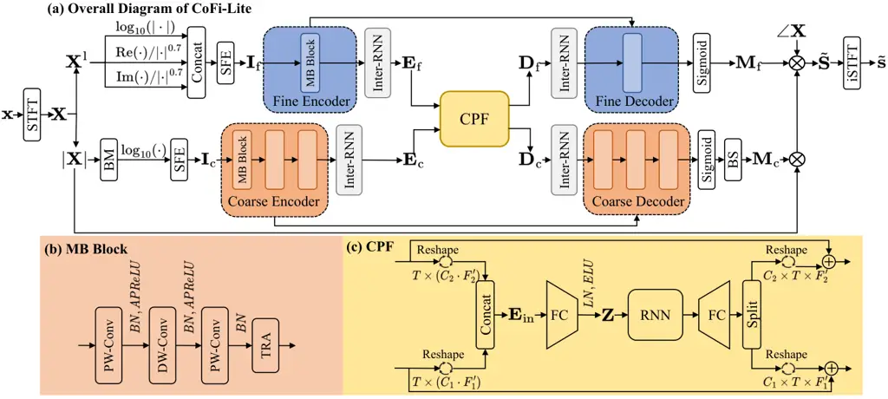

# CoFi-Lite: Pushing the Limits of Ultra-Lightweight Speech Enhancement

Leyan Yang    Dahan Wang    Xiaobin Rong    Jiadong Zhao    Jing Lu
^(†)^(†)thanks: This work was supported by the National Natural Science
Foundation of China with grant no. 12274221. (Corresponding author: Jing
Lu.)^(†)^(†)thanks: The authors are with the Key Laboratory of Modern
Acoustics, Nanjing University, Nanjing 210093, China, and also with
NJU-Horizon Intelligent Audio Lab, Horizon Robotics, Beijing 100094,
China (e-mail: leyan.yang@smail.nju.edu.cn; dahan.wang@smail.nju.edu.cn;
xiaobin.rong@smail.nju.edu.cn; jiadong.zhao@smail.nju.edu.cn;
lujing@nju.edu.cn).

###### Abstract

Ultra-lightweight models are essential for the deployment of deep
learning-based speech enhancement algorithms on edge devices. Although
recent approaches have achieved a certain balance between computational
complexity and performance, pushing the complexity limits further
demands more sophisticated designs. In this letter, we propose
CoFi-Lite, a highly efficient model that decouples spectral modeling
into coarse- and fine-grained streams. By leveraging two parallel and
symmetric encoder-decoder paths, it simultaneously extracts full-band
envelopes and low-frequency details for complementary enhancement. In
addition, a novel Cross-Path Fusion (CPF) module is introduced to bridge
the distinct paths, facilitating efficient feature interaction.
Remarkably, CoFi-Lite requires extremely low computational resources,
featuring only 12.87M MACs/s and 83.12k parameters. Experimental results
demonstrate that our proposed model outperforms the ultra-lightweight
baseline GTCRN while requiring only 40.26% of its computational
complexity. Its scaled-up variant also delivers performance on par with
that of the SOTA ultra-lightweight model AdaptCRN alongside a 19.34%
reduction in computational cost. Audio examples are available at
[https://acceleration123.github.io/CoFiLite-demo/](https://acceleration123.github.io/CoFiLite-demo/).

###### Index Terms: 

speech enhancement, ultra-lightweight model, computational complexity

## I Introduction

Speech enhancement (SE) aims to restore clean speech from noisy and
reverberant signals \[1\]. With the progress of deep learning, the field
of SE has achieved remarkable breakthroughs, with algorithms generally
categorized into time domain \[2, 3, 4, 5\] and time-frequency (T-F)
domain \[6, 7, 8, 9, 10, 11\] methods. Despite significantly surpassing
traditional signal processing methods, deep learning-based approaches
typically demand heavy computational resources, hindering their
deployment on low-compute edge devices. To address this issue, a recent
line of research centers on ultra-lightweight SE model development,
which typically adopts the T-F domain convolutional recurrent network
(CRN) \[6\] architecture, integrating various designs and techniques to
reduce the overall computational cost \[12, 13, 14, 15, 16\]. With only
30M to 100M multiply-accumulate operations per second (MACs/s), these
approaches deliver promising performance, even rivaling models with
substantially higher computational demands.

For resource-constrained edge devices, further reducing computational
complexity remains a meaningful yet challenging task. To achieve this
within the aforementioned CRN-based frameworks, a straightforward
strategy is to compress the whole network (e.g., layers, channels, and
spectral resolutions). However, our preliminary experiments reveal that
naive downscaling may lead to rapid performance degradation,
particularly in the low-frequency bands where noise components are
insufficiently suppressed. This observation suggests that a more refined
architecture is needed to allocate modeling capacity across low- and
high-frequency regions more effectively, thereby further reducing
computational complexity while preserving low-frequency performance. One
feasible solution is to employ full/sub-band \[13, 17\] or multi-scale
spectral processing \[18\], but these works lack explicit emphasis on
low-frequency recovery. \[19\] adopts two sub-networks to process the
full-band and low-frequency regions sequentially. Unfortunately, its
strictly cascaded structure prevents the sub-networks from achieving
mutual and synergistic feature fusion, and is prone to error
accumulation. \[20\] uses two parallel branches to model the magnitude
spectrum and phase details with cross-domain interaction in
multi-channel settings, but such architectural designs remain
under-explored in ultra-lightweight monaural SE.

To this end, we propose CoFi-Lite, an ultra-lightweight SE model that
operates in parallel at Coarse- and Fine-grained spectral scales while
requiring only 12.87M MACs/s and 83.12k parameters. Specifically,
CoFi-Lite employs two dedicated encoder-decoder paths to process
full-band envelopes and low-frequency details, respectively, thereby
achieving synergistic SE performance. We also introduce a novel
Cross-Path Fusion (CPF) module, which is inserted at the bottlenecks of
the two parallel paths, allowing efficient mutual feature interaction.
Extensive experiments confirm the superiority of these design choices.

## II Methodology



Fig. 1: (a) The overall diagram of the proposed CoFi-Lite, where
$`\text{Re}(\cdot)`$ and $`\text{Im}(\cdot)`$ denote the operations of
extracting real and imaginary parts, respectively. (b) The details of
the MB block. (c) The details of the CPF module.

### II-A Model Overview

As depicted in Fig. 1 (a), CoFi-Lite mainly comprises two parallel
coarse and fine paths, bridged by the CPF module. Each path adopts the
standard CRN framework, including an encoder, a decoder, and two
inter-frame RNNs (Inter-RNNs) \[8\] as the bottleneck enhancers. Given a
noisy mixture $`\mathbf{x}`$, it is first transformed into the complex
spectrum $`\mathbf{X}\in\mathbb{C}^{T\times F}`$ via short-time Fourier
transform (STFT), where $`T`$, $`F`$ denote the time and frequency
dimensions, respectively. $`\mathbf{X}`$ is then pre-processed into two
distinct inputs $`\mathbf{I}_{\text{c}}`$ and $`\mathbf{I}_{\text{f}}`$
for each path. These features are processed by their respective encoders
and the first Inter-RNN modules; the resulting representations
$`\mathbf{E}_{\text{c}}`$ and $`\mathbf{E}_{\text{f}}`$ are then fed
into CPF to obtain the interacted and enhanced features
$`\mathbf{D}_{\text{c}}`$ and $`\mathbf{D}_{\text{f}}`$. By mapping
these output features through the remaining modules, the model predicts
two ideal ratio masks (IRMs) \[21\], denoted as
$`\mathbf{M}_{\text{c}}`$ and $`\mathbf{M}_{\text{f}}`$. They are
applied sequentially to recover the full-band magnitude envelope and
refine low-frequency details, formulated as:

```math
|\tilde{\mathbf{S}}(t,f)|\!=\!\begin{cases}|\mathbf{X}(t,f)|\otimes\mathbf{M}_{\text{c}}(t,f)\otimes\mathbf{M}_{\text{f}}(t,f),&f\!\leq\!f_{\text{low}}\\
|\mathbf{X}(t,f)|\otimes\mathbf{M}_{\text{c}}(t,f),&f\!>\!f_{\text{low}}\end{cases} \tag{1}
```

where $`|\tilde{\mathbf{S}}|`$ denotes the restored magnitude spectrum,
and $`t`$, $`f`$ denote the frame index and frequency bin, respectively.
The operator $`\otimes`$ represents element-wise multiplication, and
$`f_{\text{low}}`$ is the cutoff frequency index separating low and high
frequency bands. Notably, the target does not involve phase recovery, as
ultra-lightweight models generally lack sufficient capacity for accurate
phase modeling \[15\]. Although this choice imposes an upper bound on
the theoretical performance \[22\], it ensures an effective
performance-complexity trade-off. The enhanced complex spectrum
$`\tilde{\mathbf{S}}`$ is formed by combining $`|\tilde{\mathbf{S}}|`$
with the noisy phase $`\angle\mathbf{X}`$, followed by the inverse STFT
(iSTFT) to generate the final output $`\tilde{\mathbf{s}}`$. For model
training, we adopt the same loss function as in \[12\].

### II-B Coarse Path

The coarse encoder aims to capture compact features that represent
coarse-grained spectral structures. Prior to encoding, we employ the
band merging (BM) module \[12\] to compress the sparse high-frequency
information by condensing components above $`f_{\text{low}}`$ with an
equivalent rectangular bandwidth (ERB) filter bank, formulating the
coarse input $`\mathbf{I}_{\text{c}}`$ as:

```math
\mathbf{I}_{\text{c}}=\mathcal{F}_{\text{SFE}}\left(\log_{10}\left(\mathcal{F}_{\text{ERB}}\left(|\mathbf{X}|\right)\right)\right) \tag{2}
```

where $`\mathcal{F}_{\text{ERB}}(\cdot)`$ denotes the BM operation, and
$`\mathcal{F}_{\text{SFE}}(\cdot)`$ represents the subband feature
extraction (SFE) module from \[12\] to boost efficient spectral
utilization. Within the encoder, three MB blocks shown in Fig. 1 (b) are
stacked to progressively reduce the frequency resolution by a factor of 2. Derived from \[15\] for its proven efficacy, the MB block consists of
a sequence of a point-wise convolution (PW-Conv), a depth-wise
convolution (DW-Conv), and another PW-Conv, integrated with a temporal
recurrent attention (TRA) module \[12\]. Notably, we replace the
original causal time-frequency attention (cTFA) module with TRA for
simplicity and computational efficiency. The configurations for Batch
Normalization (BN) and affine PReLU (APReLU) are kept consistent with
the original design. The coarse decoder adopts an architecture symmetric
to the encoder, utilizing transposed convolution in each DW-Conv. Skip
connections are employed between corresponding MB blocks of the encoder
and decoder. After sigmoid activation, the output undergoes the band
splitting (BS) module to generate $`\mathbf{M_{c}}`$ by reversing the BM
operation.

### II-C Fine Path

As deep compression and restricted channel count compromise the coarse
path’s capacity in low-frequency modeling, the fine path is introduced
to recover these fine-grained details. Unlike the coarse path, which
exploits the full-band magnitude, the fine path focuses on low-frequency
bands and leverages both magnitude and phase information, with its input
$`\mathbf{I}_{\text{f}}`$ calculated as:

```math
\mathbf{I}_{\text{f}}=\mathcal{F}_{\text{SFE}}\left(\bigg[\log_{10}|\mathbf{X}^{\text{l}}|,\frac{\mathbf{X}_{\text{r}}^{\text{l}}}{|\mathbf{X}^{\text{l}}|^{0.7}},\frac{\mathbf{X}_{\text{i}}^{\text{l}}}{|\mathbf{X}^{\text{l}}|^{0.7}}\bigg]\right) \tag{3}
```

where $`\mathbf{X}^{\text{l}}`$ refers to the low-frequency bands of
$`\mathbf{X}`$ truncated at the cutoff index $`f_{\text{low}}`$. The
subscripts r, i represent the real and imaginary parts of the complex
spectrum, respectively. Dynamic range compression with an empirical
exponent set of 0.7 is applied to the input components for effective
feature extraction \[23, 16, 14\]. Within the encoder, only a single MB
block is used for feature extraction, with a (1,2) stride to downsample
along the frequency dimension. This design choice preserves the high
resolution essential to low-frequency details while keeping the
computational burden of subsequent modules manageable. Analogous to the
coarse path, the fine decoder mirrors the encoder’s structure, and the
final output utilizes a sigmoid activation to yield
$`\mathbf{M}_{\text{f}}`$.

### II-D Cross-Path Fusion

To facilitate cross-path feature interaction, we introduce the CPF
module. As shown in Fig. 1 (c), the preceding representations
$`\mathbf{E}_{\text{c}}`$ and $`\mathbf{E}_{\text{f}}`$ are reshaped
from $`C_{i}\times T\times F^{\prime}_{i}`$ to
$`T\times(C_{i}\cdot F^{\prime}_{i})`$, where $`C_{i}`$ and
$`F^{\prime}_{i}`$ denote the channel and compressed frequency
dimensions, respectively, and subscript $`i\in\{1,2\}`$ corresponds to
the coarse and fine paths. The flattened features are then concatenated
to form a unified high-dimensional representation
$`\mathbf{E}_{\text{in}}\in\mathbb{R}^{T\times D}`$, where
$`D=(C_{\text{1}}\cdot F^{\prime}_{\text{1}})+(C_{\text{2}}\cdot F^{\prime}_{\text{2}})`$.
To control the computational complexity, the CPF module first compresses
$`\mathbf{E}_{\text{in}}`$ into an $`H`$-dimensional latent space using
a fully connected (FC) layer. The resulting feature is then processed by
layer normalization (LN) and an exponential linear unit (ELU), after
which an RNN module captures the temporal patterns of the fused feature
$`\mathbf{Z}`$. Another FC layer is subsequently applied to restore the
feature dimension to the original size $`D`$. The final output is split
into two parts and reshaped back to
$`C_{i}\times T\times F^{\prime}_{i}`$, $`i\in\{\text{1, 2}\}`$.
Additionally, skip connections are incorporated to retain previous
spectral information before obtaining $`\mathbf{D}_{\text{c}}`$ and
$`\mathbf{D}_{\text{f}}`$ for each path.

## III Experimental Setup

### III-A Dataset

We train and evaluate our proposed model using the DNS3 dataset \[24\],
with the Mandarin corpus from DiDiSpeech \[25\] as additional speech
material. Noisy mixtures are generated by convolving clean speech with a
random room impulse response (RIR) and adding a randomly selected noise
clip with the SNR uniformly sampled from \[-5, 15\] dB. The training
target is the speech signal containing early reverberation within the
first 100 ms. For training, 72,000 noisy-clean pairs of 10-second
duration (amounting to 200 hours) are generated, while 1,000 pairs are
generated for validation and testing, respectively.

To further validate the generalization capability of the proposed model
in different acoustic environments, we conduct additional evaluations on
the official DNS Challenge 2020 test set \[26\], covering both
non-reverberant and reverberant scenarios. All utterances are sampled at
16 kHz.

|                           |            |            |       |      |                        |        |              |              |      |      |
| ------------------------- | ---------- | ---------- | ----- | ---- | ---------------------- | ------ | ------------ | ------------ | ---- | ---- |
| Models                    | Params (k) | MACs/s (M) | RTF   | PESQ | ESTOI ($`\times 100`$) | SI-SNR | DNSMOS P.808 | DNSMOS P.835 |      |      |
|                           |            |            |       |      |                        |        |              | OVRL         | SIG  | BAK  |
| Noisy                     | \-         | \-         | \-    | 1.40 | 66.90                  | 5.61   | 2.82         | 1.63         | 2.05 | 1.86 |
| Level I: Below 20M MACs/s |            |            |       |      |                        |        |              |              |      |      |
| GTCRN (Small)             | 7.91       | 13.63      | 0.040 | 1.88 | 72.18                  | 10.07  | 3.38         | 2.53         | 2.88 | 3.76 |
| LiSenNet (Small)          | 12.46      | 15.57      | 0.031 | 1.94 | 72.74                  | 10.49  | 3.36         | 2.58         | 2.93 | 3.80 |
| UL-UNAS (Small)           | 56.43      | 13.63      | 0.054 | 2.05 | 74.87                  | 11.16  | 3.47         | 2.60         | 2.94 | 3.81 |
| AdaptCRN (Small)          | 34.98      | 12.97      | 0.047 | 2.06 | 75.15                  | 11.19  | 3.50         | 2.65         | 2.99 | 3.85 |
| CoFi-Lite                 | 83.12      | 12.87      | 0.033 | 2.16 | 76.10                  | 11.80  | 3.53         | 2.70         | 3.05 | 3.85 |
| Level II: Over 30M MACs/s |            |            |       |      |                        |        |              |              |      |      |
| GTCRN                     | 23.67      | 31.97      | 0.050 | 2.07 | 75.11                  | 11.30  | 3.48         | 2.63         | 2.98 | 3.81 |
| LiSenNet                  | 36.78      | 55.77      | 0.035 | 2.17 | 76.19                  | 11.74  | 3.53         | 2.69         | 3.03 | 3.85 |
| UL-UNAS                   | 171.33     | 34.91      | 0.066 | 2.25 | 77.69                  | 12.07  | 3.55         | 2.69         | 3.01 | 3.86 |
| AdaptCRN                  | 134.51     | 40.80      | 0.053 | 2.30 | 78.15                  | 12.35  | 3.59         | 2.75         | 3.08 | 3.88 |
| CoFi-Lite (Large)         | 221.31     | 32.91      | 0.036 | 2.30 | 77.94                  | 12.43  | 3.56         | 2.75         | 3.09 | 3.88 |
|                           |            |            |       |      |                        |        |              |              |      |      |

TABLE I: Performance comparison on the simulated DNS3 test set. Only
UL-UNAS uses the statistics reported in its original paper.

|                           |           |      |      |             |      |      |
| ------------------------- | --------- | ---- | ---- | ----------- | ---- | ---- |
| Models                    | No Reverb |      |      | With Reverb |      |      |
|                           | OVRL      | SIG  | BAK  | OVRL        | SIG  | BAK  |
| Noisy                     | 2.48      | 3.39 | 2.62 | 1.39        | 1.76 | 1.50 |
| Level I: Below 20M MACs/s |           |      |      |             |      |      |
| GTCRN (Small)             | 2.99      | 3.31 | 3.91 | 2.33        | 2.72 | 3.55 |
| LiSenNet (Small)          | 3.00      | 3.32 | 3.95 | 2.35        | 2.76 | 3.49 |
| UL-UNAS (Small)           | 3.08      | 3.36 | 4.01 | 2.39        | 2.79 | 3.52 |
| AdaptCRN (Small)          | 3.11      | 3.39 | 4.02 | 2.46        | 2.85 | 3.63 |
| CoFi-Lite                 | 3.15      | 3.43 | 4.03 | 2.48        | 2.89 | 3.57 |
| Level II: Over 30M MACs/s |           |      |      |             |      |      |
| GTCRN                     | 3.09      | 3.38 | 4.01 | 2.43        | 2.86 | 3.52 |
| LiSenNet                  | 3.09      | 3.37 | 4.02 | 2.47        | 2.89 | 3.55 |
| UL-UNAS                   | 3.13      | 3.40 | 4.05 | 2.44        | 2.84 | 3.56 |
| AdaptCRN                  | 3.20      | 3.45 | 4.10 | 2.51        | 2.92 | 3.57 |
| CoFi-Lite (Large)         | 3.19      | 3.44 | 4.09 | 2.50        | 2.92 | 3.57 |
|                           |           |      |      |             |      |      |

TABLE II: Performance comparison on the DNS Challenge 2020 test set. We
retrain all baselines and their variants to obtain the statistics.

### III-B Implementation Details

#### III-B1 Parameter configuration

The STFT is computed using a 32 ms square-root Hanning window with a hop
length of 16 ms and an FFT size of 512. The kernel size of both SFE
modules is set to 3. $`f_{\text{low}}`$ is set to 65, corresponding to a
physical frequency of 2 kHz. The BM module preserves the first 65
frequency bands unaltered and compresses the 192 high-frequency bands to
64 bands. With subsequent MB blocks introducing a compression factor of
8, the coarse path reaches a total full-band compression ratio of 16. In
the coarse encoder, the first MB block uses a (3,5) kernel, while the
remaining two use (1,5). The fine encoder employs a (3,3) kernel for
finer extraction. All MB blocks have 6 output channels, and all
Inter-RNN modules utilize GRUs. CPF employs a grouped GRU (2 groups)
with a latent dimension $`H`$ of 76. We also investigate a scaled-up
variant, CoFi-Lite (Large), where $`H`$ is increased to 102, and the
output channels of the coarse and fine encoders are expanded to \[6, 12,
14\] and 14, respectively. All other settings remain unchanged.

#### III-B2 Training configuration

The models are trained using the Adam optimizer \[27\] with a linear
warmup scheduler followed by cosine annealing. The training procedures
last for 200 epochs, where each epoch contains 1,250 iterations with a
batch size of 8. The learning rate increases linearly from $`10^{-6}`$
to $`10^{-3}`$ over the initial 25,000 iterations and then decays
following a cosine schedule until 250,000 iterations.

### III-C Baseline Models and Evaluation Metrics

We select the latest ultra-lightweight SE models as our baselines,
including GTCRN \[12\], LiSenNet \[14\], UL-UNAS \[15\], and
AdaptCRN \[16\]. In addition, we include their scaled-down variants to
provide a fairer comparison. Where available, we use reported statistics
from the original papers. For missing results, we retrain the models
using original codebases and parameter configurations, whereas for
scaled-down variants, we proportionally reduce the number of channels
for model compression. All retrained models use our own training
configuration—except for AdaptCRN and its variant, which follow the
settings from the original work.

Considering the real-time requirements of edge devices, we measure the
real-time factor (RTF) using ONNX Runtime \[28\] on an Intel(R) Core(TM)
i5-14600KF with streaming inference. STFT and iSTFT operations are
excluded, and no future frames are used, ensuring zero algorithmic
delay. To evaluate the SE performance, three intrusive metrics are
employed, including scale-invariant signal-to-noise ratio
(SI-SNR) \[29\], wide-band perceptual evaluation of speech quality
(PESQ) \[30\] and extended short-time objective intelligibility
(ESTOI) \[31\]. Additionally, two non-intrusive metrics, DNSMOS
P.808 \[32\] and DNSMOS P.835 \[33\], are utilized to assess the
enhanced speech quality. DNSMOS P.835 includes three sub-metrics: OVRL
for overall speech quality, SIG for signal quality, and BAK for
background noise quality.

## IV Experimental Results

### IV-A Comparison With the Baseline Models

The results on the simulated DNS3 test set are summarized in Table I,
categorized by complexity levels¹¹ 1 The parameters and MACs/s are
measured by the ptflops toolkit:
[https://github.com/sovrasov/flops-counter.pytorch](https://github.com/sovrasov/flops-counter.pytorch),
with a detailed per-module breakdown available on our aforementioned
demo page. (Level I/II). In Level I, CoFi-Lite demonstrates a distinct
advantage over the scaled-down variants of baselines. It also clearly
outperforms the Level II baseline GTCRN in PESQ (+0.09), OVRL (+0.07),
and SIG (+0.07), while requiring only 40.26% of its computational cost
and reducing RTF by 34.00%. In Level II, CoFi-Lite (Large) maintains
competitive efficacy against AdaptCRN with a 19.34% reduction in
computational demands, while also recording one of the lowest RTFs.
Despite exhibiting a higher parameter count, it remains within an
acceptable range for deployment on most edge devices \[34\].

Results on the official DNS 2020 test set are shown in Table II.
Notably, intrusive metrics are excluded due to a mismatch between the
anechoic reference and our training objective, which includes early
reverberation. As shown, the performance trends align closely with the
results observed on the DNS3 dataset.

### IV-B Ablation Study

#### IV-B1 Effect of key design choices

In this section, we investigate two key designs of our model: (i) the
architecture of the two parallel paths, and (ii) the CPF module. The
results are presented in Table III (IDs 1–5). For a fair comparison, we
align the complexity across all models by adjusting the hidden size of
the Inter-RNNs. Specifically, ID4 scales up ID3 to match the parameters
of our proposed ID5. As shown, ID3 outperforms single-path models
(IDs 1-2). Crucially, ID5 achieves a substantial PESQ gain (+0.14) over
ID3 by integrating CPF. Ruling out the impact of increased parameters,
it still yields a PESQ advantage (+0.10) over ID4. This indicates that
$`\mathbf{E}_{\text{c}}`$ and $`\mathbf{E}_{\text{f}}`$ are highly
complementary, and their interaction creates a strong synergy that
boosts model performance.

#### IV-B2 Investigation of different compression settings

Table III (IDs 6–9) details the performance across different spectral
compression ratios. Let $`\mathbf{R}_{\text{c}}`$ and
$`\mathbf{R}_{\text{f}}`$ denote the compression ratios of the coarse
and fine paths, respectively. Based on ID5, $`\mathbf{R}_{\text{c}}`$
and $`\mathbf{R}_{\text{f}}`$ are adjusted by adding or removing MB
blocks with a (1,5) kernel and a (1,2) stride in the corresponding
encoder and decoder. It can be observed that the model performance
rapidly degrades as $`\mathbf{R}_{\text{f}}`$ increases (IDs 5–7). We
attribute this degradation to the severe information loss caused by deep
compression, which is unsuitable for the fine path designed to model
low-frequency details. Conversely, increasing the frequency resolution
in the coarse path results in marginal or negligible improvements
(IDs 8–9 vs. ID5). This aligns with intuition, as envelope enhancement
does not require capturing excessive fine-grained spectral details.

#### IV-B3 Study of various cutoff frequency settings

The impact of varying $`f_{\text{low}}`$ settings on performance is
explored in Table III (IDs 10–12). $`\mathbf{R}_{\text{c}}`$ remains
unchanged by adjusting the compression ratio of the BM module. Notably,
increasing $`f_{\text{low}}`$ from 17 to 65 consistently yields
performance gains, as it allows the fine path to capture more
low-frequency details. However, no additional gains are obtained when
increasing $`f_{\text{low}}`$ to 97, since salient speech structures are
concentrated below 2 kHz, leaving higher bands with sparse informative
content.

|     |                           |                           |                    |     |            |            |      |                        |        |
| --- | ------------------------- | ------------------------- | ------------------ | --- | ---------- | ---------- | ---- | ---------------------- | ------ |
| IDs | $`\mathbf{R}_{\text{c}}`$ | $`\mathbf{R}_{\text{f}}`$ | $`f_{\text{low}}`$ | CPF | Params (k) | MACs/s (M) | PESQ | ESTOI ($`\times 100`$) | SI-SNR |
| 1   | 16                        | \-                        | 65                 | ✗   | 19.71      | 12.37      | 1.97 | 73.73                  | 10.68  |
| 2   | \-                        | 2                         | 65                 | ✗   | 9.24       | 12.05      | 1.53 | 70.14                  | 8.41   |
| 3   | 16                        | 2                         | 65                 | ✗   | 21.23      | 12.24      | 2.02 | 74.06                  | 10.81  |
| 4   | 16                        | 2                         | 65                 | ✗   | 90.80      | 13.44      | 2.06 | 74.98                  | 11.20  |
| 5   | 16                        | 2                         | 65                 | ✓   | 83.12      | 12.87      | 2.16 | 76.10                  | 11.80  |
| 6   | 16                        | 4                         | 65                 | ✓   | 71.18      | 11.89      | 2.12 | 75.72                  | 11.55  |
| 7   | 16                        | 8                         | 65                 | ✓   | 66.20      | 11.46      | 2.09 | 75.31                  | 11.41  |
| 8   | 8                         | 2                         | 65                 | ✓   | 95.06      | 13.84      | 2.16 | 76.10                  | 11.73  |
| 9   | 32                        | 2                         | 65                 | ✓   | 78.14      | 12.44      | 2.14 | 76.01                  | 11.77  |
| 10  | 16                        | 2                         | 17                 | ✓   | 58.79      | 11.51      | 2.08 | 75.30                  | 11.39  |
| 11  | 16                        | 2                         | 33                 | ✓   | 66.90      | 11.90      | 2.11 | 75.69                  | 11.58  |
| 12  | 16                        | 2                         | 97                 | ✓   | 99.35      | 14.09      | 2.15 | 76.25                  | 11.72  |

TABLE III: Ablation study results of the coarse/fine path design, the
CPF module, different compression ratio and cutoff frequency settings.
“$`-`$” indicates that the corresponding path is removed.

## V Conclusion

In this letter, we present CoFi-Lite, a highly efficient SE model
requiring extremely low computational resources. The architecture
effectively decouples full-band envelopes and low-frequency details via
parallel and symmetric paths for complementary enhancement. In addition,
a novel CPF module is introduced to facilitate mutual feature
interaction. Remarkably, CoFi-Lite outperforms GTCRN with significantly
reduced computational complexity. Its scaled-up variant also achieves
competitive performance among existing ultra-lightweight SE models,
further confirming the potential of our proposed method. However,
current measurements (e.g., RTF on a desktop CPU) might not directly
reflect real-world deployment on platforms such as ARM Cortex-M and DSP,
and closing this gap is our future work.

## References

- \[1\] J. Benesty, S. Makino, and J. Chen (2006) Speech enhancement.
  Signals and Communication Technology, Springer Berlin Heidelberg.
  External Links: ISBN 9783540274896, LCCN 2005921414 Cited by: §I.
- \[2\] A. Pandey and D. Wang (2019) TCNN: temporal convolutional neural
  network for real-time speech enhancement in the time domain. In ICASSP
  2019 - 2019 IEEE International Conference on Acoustics, Speech and
  Signal Processing (ICASSP), Vol. , pp. 6875–6879. Cited by: §I.
- \[3\] Y. Luo and N. Mesgarani (2019) Conv-tasnet: surpassing ideal
  time–frequency magnitude masking for speech separation. IEEE/ACM
  Transactions on Audio, Speech, and Language Processing 27 (8),
  pp. 1256–1266. Cited by: §I.
- \[4\] Y. Luo, Z. Chen, and T. Yoshioka (2020) Dual-path rnn: efficient
  long sequence modeling for time-domain single-channel speech
  separation. In ICASSP 2020 - 2020 IEEE International Conference on
  Acoustics, Speech and Signal Processing (ICASSP), Vol. , pp. 46–50.
  Cited by: §I.
- \[5\] K. Wang, B. He, and W. Zhu (2021) TSTNN: two-stage transformer
  based neural network for speech enhancement in the time domain. In
  ICASSP 2021 - 2021 IEEE International Conference on Acoustics, Speech
  and Signal Processing (ICASSP), Vol. , pp. 7098–7102. Cited by: §I.
- \[6\] K. Tan and D. Wang (2018) A convolutional recurrent neural
  network for real-time speech enhancement. In Interspeech 2018,
  pp. 3229–3233. Cited by: §I.
- \[7\] Y. Hu, Y. Liu, S. Lv, M. Xing, S. Zhang, Y. Fu, J. Wu, B. Zhang,
  and L. Xie (2020) DCCRN: deep complex convolution recurrent network
  for phase-aware speech enhancement. In Interspeech 2020,
  pp. 2472–2476. Cited by: §I.
- \[8\] X. Le, H. Chen, K. Chen, and J. Lu (2021) DPCRN: dual-path
  convolution recurrent network for single channel speech enhancement.
  In Interspeech 2021, pp. 2811–2815. Cited by: §I, §II-A.
- \[9\] J. Yu and Y. Luo (2023) Efficient monaural speech enhancement
  with universal sample rate band-split rnn. In ICASSP 2023 - 2023 IEEE
  International Conference on Acoustics, Speech and Signal Processing
  (ICASSP), Vol. , pp. 1–5. External Links:
  [Document](https://dx.doi.org/10.1109/ICASSP49357.2023.10096020) Cited
  by: §I.
- \[10\] Z. Wang, S. Cornell, S. Choi, Y. Lee, B. Kim, and S.
  Watanabe (2023) TF-gridnet: integrating full- and sub-band modeling
  for speech separation. IEEE/ACM Transactions on Audio, Speech, and
  Language Processing 31 (), pp. 3221–3236. Cited by: §I.
- \[11\] H. Wang and B. Tian (2025) ZipEnhancer: dual-path down-up
  sampling-based zipformer for monaural speech enhancement. In ICASSP
  2025 - 2025 IEEE International Conference on Acoustics, Speech and
  Signal Processing (ICASSP), Vol. , pp. 1–5. Cited by: §I.
- \[12\] X. Rong, T. Sun, X. Zhang, Y. Hu, C. Zhu, and J. Lu (2024)
  GTCRN: a speech enhancement model requiring ultralow computational
  resources. In ICASSP 2024 - 2024 IEEE International Conference on
  Acoustics, Speech and Signal Processing (ICASSP), Vol. , pp. 971–975.
  Cited by: §I, §II-A, §II-B, §II-B, §III-C.
- \[13\] L. Yang, W. Liu, R. Meng, G. Lee, S. Baek, and H. Moon (2024)
  Fspen: an ultra-lightweight network for real time speech enahncment.
  In ICASSP 2024 - 2024 IEEE International Conference on Acoustics,
  Speech and Signal Processing (ICASSP), Vol. , pp. 10671–10675. Cited
  by: §I, §I.
- \[14\] H. Yan, J. Zhang, C. Fan, Y. Zhou, and P. Liu (2025) LiSenNet:
  lightweight sub-band and dual-path modeling for real-time speech
  enhancement. In ICASSP 2025 - 2025 IEEE International Conference on
  Acoustics, Speech and Signal Processing (ICASSP), Vol. , pp. 1–5.
  Cited by: §I, §II-C, §III-C.
- \[15\] X. Rong, L. Yang, D. Wang, Y. Hu, C. Zhu, K. Chen, and J.
  Lu (2026) UL-unas: ultra-lightweight u-nets for real-time speech
  enhancement via network architecture search. IEEE Transactions on
  Audio, Speech and Language Processing (), pp. 1–13. Cited by: §I,
  §II-A, §II-B, §III-C.
- \[16\] D. Wang, X. Rong, S. Sun, Y. Hu, C. Zhu, and J. Lu (2025)
  Adaptive convolution for cnn-based speech enhancement models. IEEE
  Transactions on Audio, Speech and Language Processing 33 (),
  pp. 4400–4413. Cited by: §I, §II-C, §III-C.
- \[17\] X. Hao, X. Su, R. Horaud, and X. Li (2021) Fullsubnet: a
  full-band and sub-band fusion model for real-time single-channel
  speech enhancement. In ICASSP 2021 - 2021 IEEE International
  Conference on Acoustics, Speech and Signal Processing (ICASSP), Vol. ,
  pp. 6633–6637. External Links:
  [Document](https://dx.doi.org/10.1109/ICASSP39728.2021.9414177) Cited
  by: §I.
- \[18\] Z. Lin, J. Wang, R. Li, F. Shen, and X. Xuan (2025) PrimeK-net:
  multi-scale spectral learning via group prime-kernel convolutional
  neural networks for single channel speech enhancement. In ICASSP
  2025 - 2025 IEEE International Conference on Acoustics, Speech and
  Signal Processing (ICASSP), Vol. , pp. 1–5. Cited by: §I.
- \[19\] F. Dang, H. Chen, Q. Hu, P. Zhang, and Y. Yan (2023) First
  coarse, fine afterward: a lightweight two-stage complex approach for
  monaural speech enhancement. Speech Communication 146, pp. 32–44.
  External Links: ISSN 0167-6393,
  [Document](https://dx.doi.org/https%3A//doi.org/10.1016/j.specom.2022.11.004)
  Cited by: §I.
- \[20\] X. Shen, R. Wang, W. Zhu, and B. Champagne (2025) Dual-path
  state-space modeling with cross-domain interaction for multichannel
  speech enhancement. IEEE Transactions on Audio, Speech and Language
  Processing 33 (), pp. 4239–4252. External Links:
  [Document](https://dx.doi.org/10.1109/TASLPRO.2025.3618543) Cited by:
  §I.
- \[21\] A. Narayanan and D. Wang (2013) Ideal ratio mask estimation
  using deep neural networks for robust speech recognition. In 2013 IEEE
  International Conference on Acoustics, Speech and Signal Processing,
  Vol. , pp. 7092–7096. External Links:
  [Document](https://dx.doi.org/10.1109/ICASSP.2013.6639038) Cited by:
  §II-A.
- \[22\] K. Paliwal, K. Wójcicki, and B. Shannon (2011) The importance
  of phase in speech enhancement. Speech Communication 53 (4),
  pp. 465–494. External Links: ISSN 0167-6393 Cited by: §II-A.
- \[23\] A. Li, C. Zheng, R. Peng, and X. Li (2021) On the importance of
  power compression and phase estimation in monaural speech
  dereverberation. JASA Express Letters 1 (1), pp. 014802. Cited by:
  §II-C.
- \[24\] C. K.A. Reddy, H. Dubey, K. Koishida, A. Nair, V. Gopal, R.
  Cutler, S. Braun, H. Gamper, R. Aichner, and S. Srinivasan (2021)
  INTERSPEECH 2021 deep noise suppression challenge. In Interspeech
  2021, pp. 2796–2800. External Links:
  [Document](https://dx.doi.org/10.21437/Interspeech.2021-1609), ISSN
  2958-1796 Cited by: §III-A.
- \[25\] T. Guo, C. Wen, D. Jiang, N. Luo, R. Zhang, S. Zhao, W. Li, C.
  Gong, W. Zou, K. Han, and X. Li (2021) Didispeech: a large scale
  mandarin speech corpus. In ICASSP 2021 - 2021 IEEE International
  Conference on Acoustics, Speech and Signal Processing (ICASSP), Vol. ,
  pp. 6968–6972. External Links:
  [Document](https://dx.doi.org/10.1109/ICASSP39728.2021.9414423) Cited
  by: §III-A.
- \[26\] C. K. A. Reddy, V. Gopal, R. Cutler, E. Beyrami, R. Cheng, H.
  Dubey, S. Matusevych, R. Aichner, A. Aazami, S. Braun, P. Rana, S.
  Srinivasan, and J. Gehrke (2020) The interspeech 2020 deep noise
  suppression challenge: datasets, subjective testing framework, and
  challenge results. External Links: 2005.13981 Cited by: §III-A.
- \[27\] D. P. Kingma and J. Ba (2014) Adam: a method for stochastic
  optimization. CoRR abs/1412.6980. Cited by: §III-B2.
- \[28\] O. R. developers (2021) ONNX runtime. Note:
  [https://onnxruntime.ai/](https://onnxruntime.ai/)Version: 1.22.1
  Cited by: §III-C.
- \[29\] J. L. Roux, S. Wisdom, H. Erdogan, and J. R. Hershey (2019) SDR
  – half-baked or well done?. In ICASSP 2019 - 2019 IEEE International
  Conference on Acoustics, Speech and Signal Processing (ICASSP), Vol. ,
  pp. 626–630. External Links:
  [Document](https://dx.doi.org/10.1109/ICASSP.2019.8683855) Cited by:
  §III-C.
- \[30\] A.W. Rix, J.G. Beerends, M.P. Hollier, and A.P. Hekstra (2001)
  Perceptual evaluation of speech quality (pesq)-a new method for speech
  quality assessment of telephone networks and codecs. In 2001 IEEE
  International Conference on Acoustics, Speech, and Signal Processing.
  Proceedings (Cat. No.01CH37221), Vol. 2, pp. 749–752 vol.2. External
  Links: [Document](https://dx.doi.org/10.1109/ICASSP.2001.941023) Cited
  by: §III-C.
- \[31\] J. Jensen and C. H. Taal (2016) An algorithm for predicting the
  intelligibility of speech masked by modulated noise maskers. IEEE/ACM
  Transactions on Audio, Speech, and Language Processing 24 (11),
  pp. 2009–2022. External Links:
  [Document](https://dx.doi.org/10.1109/TASLP.2016.2585878) Cited by:
  §III-C.
- \[32\] C. K. A. Reddy, V. Gopal, and R. Cutler (2021) Dnsmos: a
  non-intrusive perceptual objective speech quality metric to evaluate
  noise suppressors. In ICASSP 2021 - 2021 IEEE International Conference
  on Acoustics, Speech and Signal Processing (ICASSP), Vol. ,
  pp. 6493–6497. External Links:
  [Document](https://dx.doi.org/10.1109/ICASSP39728.2021.9414878) Cited
  by: §III-C.
- \[33\] C. K. A. Reddy, V. Gopal, and R. Cutler (2022) Dnsmos p.835: a
  non-intrusive perceptual objective speech quality metric to evaluate
  noise suppressors. In ICASSP 2022 - 2022 IEEE International Conference
  on Acoustics, Speech and Signal Processing (ICASSP), Vol. ,
  pp. 886–890. External Links:
  [Document](https://dx.doi.org/10.1109/ICASSP43922.2022.9746108) Cited
  by: §III-C.
- \[34\] A. Pandey and J. Azcarreta (2025) Ultra low-compute complex
  spectral masking for multichannel speech enhancement. In ICASSP
  2025-2025 IEEE International Conference on Acoustics, Speech and
  Signal Processing (ICASSP), pp. 1–5. Cited by: §IV-A.
