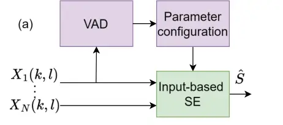
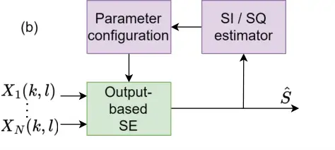

# Listen first: Output–Based Multi–Microphone Speech Enhancement

###### Abstract

Traditionally, hearing-aid speech enhancement (SE) algorithms rely on
_input-based_ feature estimation, often derived by a voice activity
detector (VAD), to configure beamformers. Yet features extracted from
noisy microphone signals can become unreliable in challenging acoustic
scenes where users most need help. We introduce a novel paradigm in
which the settings of a sound processing system are determined by
evaluating characteristics of its _output_. To demonstrate this idea, we
employ an _output-based_ system that selects among a set of minimum
power distortionless response (MPDR) beamformers. Although MPDR
beamformers are typically avoided due to their sensitivity to steering
errors, we show that they become effective within an output-based
framework. We compare the proposed system to a conventional input-based
minimum variance distortionless response (MVDR) baseline. Experimental
results show that the proposed system consistently outperforms the MVDR
baseline, particularly at low SNRs, in terms of SNR, ESTOI and PESQ.

| Panos Apostolidis^(1,2), Svend Feldt², Zheng-Hua Tan¹, Jan Østergaard¹, Jesper Jensen^(1,2) |
| ------------------------------------------------------------------------------------------- |
| ¹ Aalborg University, Department of Electronic Systems, Aalborg, 9220, Denmark              |
| ² Eriksholm Research Centre, Snekkersten, 3070, Denmark                                     |

Index Terms—  Beamforming, microphone arrays, multi-microphone speech
enhancement, voice activity detection.

## 1 Introduction

Multi-channel speech enhancement (SE) is widely used in audio
applications, including hearing-aid (HA) systems \[12\], which aim to
improve speech intelligibility (SI) and sound quality (SQ) by
attenuating noise and reverberation \[9\]. Conventional HA-oriented SE
algorithms, illustrated in Fig. 1a, often rely on acoustic features such
as voice-activity-detection (VAD) cues indicating where speech is
present in the time-frequency (T-F) domain. Because these features are
derived directly from microphone signals, we refer to such systems as
_input‑based_. As HAs are low-power devices, the features are often
extracted using signal-processing methods \[26, 8\], while
deep-learning-based feature extractors have also been explored \[11,
17\].

In a conventional input-based paradigm, the SE algorithm is decomposed
into a multi-channel and a single-channel stage, e.g. a Minimum Variance
Distortionless Response (MVDR) beamformer and a post-filter,
respectively \[14\]. The beamformer relies on estimates of the noise
cross-power spectral density and the relative transfer functions (RTFs)
from the target to each microphone \[8\], often provided by a VAD. Since
the VAD operates directly on noisy microphone signals, the quality of
the estimated speech statistics degrades in challenging acoustic
conditions, precisely when HA-users need most support.





Fig. 1: (a) _input‑based_ SE and (b) proposed _output‑based_ paradigm.

Instead, we propose an alternative paradigm in which a speech-processing
system is configured by evaluating the SI or SQ of its _output_ rather
than extracting features from its input, as illustrated in Fig. 1(b).
Related studies have explored output-driven mechanisms \[22, 16, 10\].
For instance, \[22\] uses output-based SQ estimates for
direction-of-arrival (DOA) correction, while \[16\] leverages enhanced
outputs for target tracking. These approaches modify individual
processing components, whereas the proposed paradigm is more general,
selecting among any candidate SE system configurations.

As an example of the proposed paradigm, we introduce a SE system that
selects from a discrete set of fixed candidate beamformer settings, the
one maximizing a speech-intelligibility-related glimpse proportion (GP)
measure \[4\] computed from each candidate’s output. This represents an
_output‑based_ form of processing because all estimates of SI are made
after the SE stage, allowing the output itself to guide the settings of
the beamforming system. To enable a fair comparison between the proposed
system and conventional input-based approaches, we use the same VAD in
both systems, ensuring that performance differences arise from the
structural distinction between output- and input-based processing rather
than from differences in the architecture and complexity of the VAD
itself.

In this paper, we demonstrate the potential of the proposed output-based
paradigm using a set of candidate minimum power distortionless response
(MPDR) beamformers. In particular, we show that the optimal candidate
can be reliably selected solely from its output signals, even in low
SNR, where input‑based MVDR systems often struggle to estimate speech
statistics. Although MPDR beamformers are rarely used due to their
sensitivity to steering errors, we find that in an output‑based approach
they become effective. Across multiple objective measures, the proposed
system consistently outperforms the input‑based baseline. Importantly,
the output‑based system retains a performance advantage over the
input‑based baseline even under RTF mismatch, highlighting the
robustness and practical potential of output‑driven SE for real‑world
applications.

## 2 Output-based multi-microphone SE system

### 2.1 Signal model

We model the noisy microphone signal in the STFT domain as:

```math
\displaystyle\mathbf{X}(k,l)\approx S(k,l)\mathbf{H}(k)+\mathbf{V}(k,l), \tag{1}
```

where $`S(k,l)`$ is the STFT of the target signal, and $`\mathbf{H}(k)`$
and $`\mathbf{V}(k,l)`$ are the $`M`$-dimensional Head-Related Transfer
Function (HRTF), and noise vectors \[7\]. The indices
$`k\in\{0,\dots,K-1\}`$ and $`l\in\{0,\dots,L-1\}`$ denote frequency bin
and time frame, respectively.

### 2.2 Output-based MPDR beamforming

To demonstrate the proposed output-based paradigm, we introduce a
beamforming system that selects an MPDR beamformer configuration from a
discrete set of candidates based on their output signals. The weights of
an MPDR beamformer are given by \[2\]

```math
\displaystyle\mathbf{W}_{MPDR}(k,l)=\frac{\mathbf{C}_{\mathbf{X}}^{-1}(k,l)\mathbf{d}_{\theta_{i}}(k)}{\mathbf{d}_{\theta_{i}}^{H}(k)\mathbf{C}_{\mathbf{X}}^{-1}(k,l)\mathbf{d}_{\theta_{i}}(k)}, \tag{2}
```

where $`\mathbf{C}_{\mathbf{X}}(k,l)\in C^{M\times M}`$ is the
covariance matrix of the noisy signal $`\mathbf{X}(k,l)`$ and
$`\mathbf{d}_{\theta_{i}}(k)`$ denotes the RTF vector with respect to
the reference microphone to a target position with direction
$`\theta_{i}`$.

To enable an output-based MPDR beamformer system, we assume access to a
dictionary $`\mathbf{d_{\theta}}(k)`$ of $`N`$ time-invariant candidate
RTF vectors $`\mathbf{d}_{\theta_{i}}(k)`$, each corresponding to a
candidate target direction $`\theta_{i}`$ at a fixed distance as

```math
\displaystyle\mathbf{d_{\theta}}(k)=\{\mathbf{d}_{\theta_{1}}(k),\mathbf{d}_{\theta_{2}}(k),...,\mathbf{d}_{\theta_{N}}(k)\}. \tag{3}
```

This dictionary, together with an estimate of
$`\mathbf{C}_{\mathbf{X}}(k,l)`$, is used to create candidate MPDR
beamformers using Eq. 2, one per candidate target direction, without
requiring input-based clean speech or noise statistics. Each candidate
MPDR beamformer uses a single direction $`\theta_{i}`$ across all
frequency bins. The optimal candidate MPDR beamformer is chosen by
evaluating the outputs of all candidates and selecting the one that
maximizes a performance metric (e.g. a perception-inspired measure, see
Section 2.3). This choice of MPDR beamforming is crucial, as it allows
each candidate to be constructed without relying on VAD‑based input
covariance estimates, enabling purely output‑driven selection among
fixed beamformer settings.

### 2.3 Output-based speech intelligibility prediction

In our output-based system the optimal MPDR beamformer is selected from
the candidate set so that a speech-intelligibility-inspired measure is
maximized. The evaluation of all candidates is performed on features
extracted by a VAD applied to each candidate output.

We express the T-F SNR at the reference microphone as

```math
\displaystyle\mathrm{SNR}(k,l)\,=20\log_{10}\left(\frac{|\tilde{S}_{\alpha}(k,l)|}{|V_{\alpha}(k,l)|}\right)\,\,[\mathrm{dB}], \tag{4}
```

where $`\tilde{S}_{\alpha}(k,l)`$ is the clean target signal at
microphone $`\alpha`$, and $`V_{\alpha}(k,l)`$ is the corresponding
noise. A T-F audibility measure $`\mathrm{AUD}(k,l)`$ is adopted from
the Speech Intelligibility Index (SII) \[13, 20\] and defined by
clipping the T-F SNR to the range $`[-15,15]`$ dB and linearly mapping
it to $`[0,1]`$.

Subsequently, the output-based system includes a SI estimation stage to
select the optimal candidate beamformer. For each candidate MPDR
beamformer, $`\mathrm{AUD}(k,l)`$ is estimated from its output signal.
For this purpose, we employ a neural VAD, see Section 4.2, i.e. a neural
network that during inference estimates $`\mathrm{AUD}(k,l)`$ without
access to separated speech or noise signals. Since the VAD produces a
per–T‑F audibility estimate $`\mathrm{\widehat{AUD}}(k,l)`$, we use an
intelligibility measure that operates on these audibility patterns.
Inspired by the Glimpse Proportion (GP) index \[4\], we compute a SI
measure as:

```math
\displaystyle\mathrm{GP}=\frac{1}{KL}\sum_{k}^{K}\sum_{l}^{L}U({\mathrm{\widehat{AUD}}(k,l)-\mathrm{\gamma}_{\mathrm{GP}})}, \tag{5}
```

where $`U(x)`$ is the unit step function and
$`\mathrm{\gamma}_{\mathrm{GP}}`$ is a configurable threshold.
Essentially, $`\mathrm{GP}`$ measures the proportion of T-F tiles that
contain glimpses of speech, i.e. T-F tiles where the estimated
audibility, and thus the SNR, exceeds a selected threshold. Finally, the
candidate whose output yields the highest $`\mathrm{GP}`$ score is
selected as the optimal candidate MPDR beamformer. $`\mathrm{GP}`$ as
defined in Eq. 5 is suitable for this purpose because it emphasizes
speech‑dominant T–F regions, making it more sensitive to the target
direction than measures dominated by noise. In an initial comparison
study (omitted here due to space constraints), $`\mathrm{GP}`$
consistently outperformed other SI and SQ measures estimated from the
beamformer outputs.

Fig. 2: Performance improvements of input-based and output-based systems
with respect to the unprocessed noisy input signal, for $`SNR_{i}=-5`$
dB. Lines correspond to mean performance, while the shading represents
25th and 75th quantiles.

Fig. 3: Performance improvements of input-based and output-based systems
for $`D_{T}=0.6`$ s.

## 3 Input-based MVDR baseline

As a baseline, we use a conventional input-based MVDR beamformer, which
aims to minimize the output noise variance while enforcing a unity gain
in the target direction. The weights of the MVDR beamformer are given by
\[1\]

```math
\displaystyle\mathbf{W}_{MVDR}(k,l)=\frac{\mathbf{C}_{\mathbf{V}}^{-1}(k,l)\mathbf{d}(k)}{\mathbf{d}^{H}(k)\mathbf{C}_{\mathbf{V}}^{-1}(k,l)\mathbf{d}(k)}, \tag{6}
```

where $`\mathbf{C}_{\mathbf{V}}(k,l)`$ is the noise covariance matrix.

The MVDR beamformer is equivalent to the MPDR if the estimated RTF
$`\mathbf{d}(k)`$ is exact and statistics (i.e.
$`\mathbf{C}_{\mathbf{V}}(k,l)`$ and $`\mathbf{C}_{\mathbf{X}}(k,l)`$
for MVDR and MPDR beamforming respectively) are known \[27\]. However,
if the RTF is mismatched, e.g. due to estimation errors or incorrect
target-direction prediction, the MPDR beamformer may cancel the target
signal, causing a substantial performance degradation \[5\]. Thus,
practical MPDR performance tends to be worse than MVDR performance,
depending on RTF-estimation accuracy.

For this input-based MVDR baseline, we use the same VAD as in
Section 2.3 to identify speech- and noise-dominated T-F tiles, ensuring
a fair comparison. Following a common approach \[11, 17\], ideal binary
masks are formed by applying thresholds to the Audibility function. The
ideal binary mask for speech is defined as

```math
\displaystyle\widehat{M}_{S}(k,l)=\begin{cases}0,&\text{if}\hskip 9.24994pt\mathrm{\widehat{AUD}}(k,l)\leq\mathrm{\gamma}_{S}\\
1,&\text{if}\hskip 9.24994pt\mathrm{\widehat{AUD}}(k,l)>\mathrm{\gamma}_{S},\end{cases} \tag{7}
```

where $`\mathrm{\gamma}_{S}`$ is a speech threshold. A noise mask
$`M_{V}(k,l)`$ is obtained analogously by applying a noise threshold
$`\gamma_{V}`$. The speech covariance matrix $`\mathbf{C_{S}}`$ can be
estimated using, e.g. \[11\],

```math
\displaystyle\mathbf{\widehat{C}_{S}}(k,l)=\sum_{l=1}^{L}\widehat{M}_{S}(k,l)\mathbf{X}(k,l)\mathbf{X}^{H}(k,l). \tag{8}
```

The noise covariance matrix $`\mathbf{\widehat{C}_{V}}(k,l)`$ is
calculated similarly using the noise mask $`\widehat{M}_{V}(k,l)`$.
Subsequently, the RTF vector is estimated from
$`\mathbf{\widehat{C}_{S}}(k,l)`$ using the principal eigenvector method
\[24\]. The estimated $`\mathbf{{C}_{V}}(k,l)`$ and RTF vector
$`\mathbf{d}(k)`$ are then inserted into Eq. 6 to compute the MVDR
weights.

## 4 Experimental setup

### 4.1 Acoustic scene generation

To generate the source signals used in our simulated acoustic scenes, we
use speech signals from the Librispeech Corpus \[19\], and point noise
sources from a 10-class subset of the ESC-50 dataset \[21\] of spatially
localized sources (e.g. vacuum cleaner).

We then construct acoustic scenes consisting of a HA user, wearing
bilateral HAs, i.e. one device on each ear. Each HA is equipped with two
microphones, and the left front microphone is arbitrarily selected as
the reference microphone. A target talker and one to three point noise
sources are placed at random positions on a ring in the horizontal plane
of the HAs, with a radius of 1.9 m around the HA user. Isotropic
speech-shaped noise (SSN) is also present.

| $`D_{T}`$ | $`\Delta`$SNR \[dB\] |                  |                  |                  | $`\Delta`$ESTOI |                  |                  |                  | $`\Delta`$PESQ |                  |                  |                  |
| --------- | -------------------- | ---------------- | ---------------- | ---------------- | --------------- | ---------------- | ---------------- | ---------------- | -------------- | ---------------- | ---------------- | ---------------- |
|           | Input MVDR           | Output MPDR\_(U) | Output MPDR\_(S) | Output MPDR\_(F) | Input MVDR      | Output MPDR\_(U) | Output MPDR\_(S) | Output MPDR\_(F) | Input MVDR     | Output MPDR\_(U) | Output MPDR\_(S) | Output MPDR\_(F) |
| 0.2       | 6.33                 | 7.40             | 7.65             | 9.21             | -0.09           | 0.02             | 0.02             | 0.14             | 0.00           | 0.02             | 0.04             | 0.07             |
| 0.4       | 6.42                 | 7.69             | 7.73             | 10.19            | -0.04           | 0.11             | 0.10             | 0.23             | 0.02           | 0.02             | 0.04             | 0.09             |
| 0.6       | 6.69                 | 7.88             | 7.87             | 10.64            | -0.02           | 0.15             | 0.14             | 0.26             | 0.02           | 0.03             | 0.03             | 0.10             |
| 0.8       | 6.78                 | 7.95             | 7.89             | 10.88            | 0.00            | 0.17             | 0.15             | 0.28             | 0.03           | 0.04             | 0.03             | 0.11             |
| 1.0       | 6.78                 | 7.97             | 7.90             | 11.00            | 0.00            | 0.17             | 0.16             | 0.28             | 0.04           | 0.03             | 0.04             | 0.11             |

Table 1: Performance of the input-based MVDR and three output-based MPDR
variants under RTF mismatch at $`SNR_{i}=-5`$ dB. Bold-faced values
indicate significant improvements over the MVDR baseline (Wilcoxon
signed-rank test, $`p=0.05`$).

The HA microphone signals are generated by convolving each clean speech
and point-noise source with the HA Head-Related Impulse Responses
(HRIRs) from the OTIMP dataset \[18\], which provides HRIRs from 46
individuals with late reverberations removed. For the acoustic scene
considered here, we use HRIRs sampled at 48 azimuth angles (7.5°
resolution) and at an elevation of 0°.

The convolved signals are summed with isotropic SSN, simulated as a sum
of SSN point sources, at the HA microphones. For each mixture, the
point‑source noise is level‑adjusted at the reference microphone to be
5–15 dB above the isotropic SSN floor. Each 5‑s utterance uses a new
acoustic scene by randomly selecting a HA user (and thus a set of
HRIRs), a target location, and one to three point‑noise sources, each
with a random position. All signals are processed at a sampling rate of
16 kHz, and the STFT is computed using a 128‑point FFT, an 8 ms Hann
window, and a 4 ms hop size.

### 4.2 VAD model and training procedure

Based on the acoustic scenes described in Section 4.1, we construct a
dataset for training a neural VAD model that estimates
$`\mathrm{AUD}(k,l)`$ for every T-F tile. The total duration of this
dataset is 1 hour, which is split into a 90% train set and 10% test set.
Training segments are 1-second-long and are created by dividing the
simulated mixtures into non‑overlapping 1 s excerpts, while the input
SNR is uniformly sampled between -15 and 15 dB. For each utterance, a
randomly selected microphone $`m`$ is used, which serves as a form of
data augmentation by exposing the VAD to the variability across
microphone channels. Subsequently, min-max scaling is applied, and the
stacked real and imaginary parts of $`X(k,l)`$ form the network input.

The neural VAD is implemented as a Convolutional Recurrent Network (CRN)
\[25\], combining a convolutional encoder-decoder architecture with an
LSTM on the encoder’s latent space. The network is trained using the
Mean Squared Error (MSE) loss function

```math
\displaystyle L_{\mathrm{MSE}}=\frac{1}{KL}\sum_{k}^{K}\sum_{l}^{L}(\mathrm{AUD}(k,l)-\mathrm{\widehat{AUD}}(k,l))^{2}. \tag{9}
```

The architecture is determined in a hyperparameter tuning stage using
Bayesian optimization \[6\], yielding a model with 2.9M parameters.
Using the resulting architecture, the network is trained for 300 epochs
using the Adam optimizer with a learning rate of 0.016, and a batch size
of 32. The encoder and decoder contain five causal convolution layers
with kernel size $`(k,l)=(3,2)`$, ELU activations \[3\], batch
normalization, and a stride of 2 along the frequency axis. Skip
connections link the encoder and decoder, while four stacked LSTM layers
are inserted between them. A sigmoid activation on the output maps
values to $`[0,1]`$.

### 4.3 Implementation details of beamforming systems

The beamforming systems are evaluated using the acoustic scenes
described in Section 4.1. The dataset used for beamforming evaluation
has a duration of 2 hours and is divided into a validation set and a
test set using a 50%-50% split. The validation set is used to tune the
hyperparameters $`\gamma_{S}`$, $`\gamma_{V}`$, and
$`\gamma_{\mathrm{GP}}`$ (defined in Eq. 7 and Eq. 5, respectively) with
the goal of maximizing the output SNR of both the proposed and the
baseline system.

Each utterance is segmented into non-overlapping segments of duration
$`D_{T}`$, during which beamformer weights remain fixed. As both
approaches have access to the full segment before selecting or applying
beamformer weights, they are non-causal. A causal implementation would
be possible by basing the beamformer selection for each segment on
estimates computed from previous segments.

## 5 Results

### 5.1 Output-based MPDR vs. input-based MVDR performance

In this section, we evaluate the proposed output-based MPDR system in
comparison with the conventional input-based MVDR baseline across
different experimental conditions. Fig. 2 shows the performance of the
proposed output-based system and input-based baseline as a function of
segment duration $`D_{T}`$, for an input SNR of $`\mathrm{SNR}_{i}=-5`$
dB. The evaluation is performed in terms of SNR, ESTOI \[15\], and PESQ
\[23\]. Across all metrics and durations, the output‑based MPDR
consistently outperforms the input‑based MVDR baseline. A Wilcoxon
signed-rank test ($`p<0.05`$) was conducted for each performance measure
and value of $`D_{T}`$ separately, confirming that the observed
differences are statistically significant.

The figure also includes the performance of two oracle systems, each
representing the upper performance bound for its respective system. The
oracle MVDR beamformer has access to the clean speech and noise signals,
enabling it to compute the ideal noise covariance matrix $`C_{V}`$ and
RTF vector. Therefore, this model reflects the maximum performance a
time-invariant MVDR beamformer can achieve. In contrast, the oracle MPDR
beamformer uses the true RTF corresponding to the target location and
thus represents the upper bound for the output-based approach. The
performance gap between these two oracle models is mainly due to the
duration $`D_{T}`$, as for sufficiently long segments the two models’
performance converge.

A comparison with the oracle models further illustrates the proposed
system’s effectiveness. For durations $`D_{T}>0.5`$ s, the performance
of the output-based MPDR beamformer approaches that of the oracle MPDR,
indicating that the GP-based selection reliably identifies the optimal
beamformer even in challenging conditions.

Fig. 3 presents the systems’ performance for $`D_{T}=0.6`$ s, i.e.
relatively slowly-changing beamformer systems, and input SNR values from
-10 dB to +5 dB. A Wilcoxon signed-rank test ($`p<0.05`$) shows that
performance differences are statistically significant for all metrics,
except for PESQ, for $`\mathrm{SNR}_{i}\leq-8`$ dB. For both SNR and
ESTOI, the proposed output-based MPDR beamforming system clearly
outperforms the input-based MVDR beamformer, especially at low input
SNRs. This behavior reflects the fact that, under such challenging
conditions, the input-based VAD struggles to identify speech-dominated
T-F tiles correctly, whereas the output-based system can still reliably
select the MPDR candidate beamformer pointing towards the correct target
direction.

### 5.2 Robustness to RTF mismatch

In Fig. 2 the RTF dictionary was matched, containing that user’s HRTFs,
including the one matching the target location. To investigate the
robustness of the proposed output-based system under realistic
conditions, we introduce two mismatches in the RTF dictionary. In the
first case, denoted MPDR*(U), the dictionary contains a lower spatial
resolution, i.e. RTFs are spaced 15° apart, with the target between
entries. In the second case, denoted MPDR*(S), we use non-individualized
RTFs measured on a HATS mannequin, meaning that the RTF dictionary does
not match the user. For comparison, MPDR\_(F) denotes the matched
condition, where the dictionary includes the true target RTF,
corresponding to the results in Fig. 2.

Table 1 shows the performance of the input-based MVDR beamformer and the
three output-based MPDR beamformer variants at $`\mathrm{SNR}_{i}=-5`$
dB. As expected, performance decreases for MPDR*(S) and MPDR*(U)
compared to the fully matched RTFs in MPDR*(F). Nevertheless, despite
these mismatches, the output-based MPDR beamformers with mismatched RTFs
still outperform the input-based MVDR beamformer in terms of SNR and
ESTOI for all values of $`D*{T}`$. A Wilcoxon signed-rank test
($`p=0.05`$) confirms that, for both mismatch conditions, the
output‑based MPDR significantly outperforms the input‑based baseline in
terms of SNR and ESTOI.

## 6 Conclusion

In this work, we introduced a novel _output‑based_ processing paradigm
in which a speech‑processing system is configured by evaluating the
quality of its _output_, rather than relying on features extracted from
its noisy input. We demonstrated this paradigm using a beamforming
example, proposing an _output‑based_ MPDR system for hearing‑aid
applications. Unlike conventional _input‑based_ beamforming, which
depends on VAD decisions derived from noisy microphone signals, the
proposed approach evaluates candidate beamformers directly from their
_output_, enabling more reliable decisions in adverse acoustic
conditions. By incorporating a neural VAD trained to estimate an
audibility measure, the system can identify the beamformer configuration
that maximizes an estimate of speech intelligibility, even at low input
SNRs where _input‑based_ methods often fail. Moreover, the proposed
system maintains its advantage under RTF mismatch conditions,
demonstrating robustness when the dictionary is coarse or
non‑individualized.

## References

- \[1\] J. Bitzer and K. U. Simmer (2001) Superdirective microphone
  arrays. In Microphone Arrays: Signal Processing Techniques and
  Applications, M. Brandstein and D. Ward (Eds.), pp. 19–38. External
  Links: ISBN 978-3-662-04619-7,
  [Document](https://dx.doi.org/10.1007/978-3-662-04619-7%5F2),
  [Link](https://doi.org/10.1007/978-3-662-04619-7_2) Cited by: §3.
- \[2\] J. Capon (1969) High-resolution frequency-wavenumber spectrum
  analysis. Proceedings of the IEEE 57 (8), pp. 1408–1418. Cited by:
  §2.2.
- \[3\] D. Clevert, T. Unterthiner, and S. Hochreiter (2015) Fast and
  accurate deep network learning by exponential linear units (elus).
  arXiv preprint arXiv:1511.07289 4 (5), pp. 11. Cited by: §4.2.
- \[4\] M. Cooke (2006) A glimpsing model of speech perception in noise.
  The Journal of the Acoustical Society of America 119 (3),
  pp. 1562–1573. Cited by: §1, §2.3.
- \[5\] H. Cox (1973) Resolving power and sensitivity to mismatch of
  optimum array processors. The Journal of the acoustical society of
  America 54 (3), pp. 771–785. Cited by: §3.
- \[6\] I. Dewancker, M. McCourt, and S. Clark (2015) Bayesian
  optimization primer. URL https://app. sigopt. com/static/pdf/SigOpt\_
  Bayesian_Optimization_Primer. pdf. Cited by: §4.2.
- \[7\] M. Farmani, M. S. Pedersen, Z. Tan, and J. Jensen (2015) Maximum
  likelihood approach to “informed” sound source localization for
  hearing aid applications. In 2015 IEEE international conference on
  acoustics, speech and signal processing (ICASSP), pp. 16–20. Cited by:
  §2.1.
- \[8\] S. Gannot, E. Vincent, S. Markovich-Golan, and A. Ozerov (2017)
  A consolidated perspective on multimicrophone speech enhancement and
  source separation. IEEE/ACM Transactions on Audio, Speech, and
  Language Processing 25 (4), pp. 692–730. Cited by: §1, §1.
- \[9\] T. Green, G. Hilkhuysen, M. Huckvale, S. Rosen, M. Brookes, A.
  Moore, P. Naylor, L. Lightburn, and W. Xue (2022) Speech recognition
  with a hearing-aid processing scheme combining beamforming with
  mask-informed speech enhancement. Trends in Hearing 26,
  pp. 23312165211068629. Cited by: §1.
- \[10\] S. Hafezi, A. H. Moore, P. H. Guiraud, P. A. Naylor, J.
  Donley, V. Tourbabin, and T. Lunner (2023) Subspace hybrid mvdr
  beamforming for augmented hearing. arXiv preprint arXiv:2311.18689.
  Cited by: §1.
- \[11\] J. Heymann, L. Drude, and R. Haeb-Umbach (2017) A generic
  neural acoustic beamforming architecture for robust multi-channel
  speech processing. Computer Speech & Language 46, pp. 374–385. Cited
  by: §1, §3, §3.
- \[12\] P. Hoang, J. M. de Haan, Z. Tan, and J. Jensen (2022)
  Multichannel speech enhancement with own voice-based interfering
  speech suppression for hearing assistive devices. IEEE/ACM
  Transactions on Audio, Speech, and Language Processing 30 (),
  pp. 706–720. External Links:
  [Document](https://dx.doi.org/10.1109/TASLP.2022.3145294) Cited by:
  §1.
- \[13\] B. W. Hornsby (2004) The speech intelligibility index: what is
  it and what’s it good for?. The Hearing Journal 57 (10), pp. 10–17.
  Cited by: §2.3.
- \[14\] J. Jensen and M. S. Pedersen (2015) Analysis of beamformer
  directed single-channel noise reduction system for hearing aid
  applications. In 2015 IEEE International Conference on Acoustics,
  Speech and Signal Processing (ICASSP), pp. 5728–5732. Cited by: §1.
- \[15\] J. Jensen and C. H. Taal (2016) An algorithm for predicting the
  intelligibility of speech masked by modulated noise maskers. IEEE/ACM
  Transactions on Audio, Speech, and Language Processing 24 (11),
  pp. 2009–2022. Cited by: §5.1.
- \[16\] J. Kienegger, A. Mannanova, H. Fang, and T. Gerkmann (2025)
  Self-steering deep non-linear spatially selective filters for
  efficient extraction of moving speakers under weak guidance. arXiv
  preprint arXiv:2507.02791. Cited by: §1.
- \[17\] M. Kim, S. Cheong, and J. W. Shin (2023) DNN-based parameter
  estimation for mvdr beamforming and post-filtering. Proceedings of the
  INTERSPEECH, Dublin, Ireland, pp. 20–24. Cited by: §1, §3.
- \[18\] A. H. Moore, J. M. de Haan, M. S. Pedersen, P. A. Naylor, M.
  Brookes, and J. Jensen (2019) Personalized signal-independent
  beamforming for binaural hearing aids. The Journal of the Acoustical
  Society of America 145 (5), pp. 2971–2981. Cited by: §4.1.
- \[19\] V. Panayotov, G. Chen, D. Povey, and S. Khudanpur (2015)
  Librispeech: an asr corpus based on public domain audio books. In 2015
  IEEE international conference on acoustics, speech and signal
  processing (ICASSP), pp. 5206–5210. Cited by: §4.1.
- \[20\] C. Pavlovic (2018) SII—speech intelligibility index standard:
  ansi s3. 5 1997. the Journal of the Acoustical Society of America 143
  (3_Supplement), pp. 1906–1906. Cited by: §2.3.
- \[21\] K. J. Piczak (2015) ESC: dataset for environmental sound
  classification. In Proceedings of the 23rd ACM international
  conference on Multimedia, pp. 1015–1018. Cited by: §4.1.
- \[22\] C. Rascon (2025) Direction of arrival correction through speech
  quality feedback. Digital Signal Processing 158, pp. 104960. Cited by:
  §1.
- \[23\] A. W. Rix, J. G. Beerends, M. P. Hollier, and A. P.
  Hekstra (2001) Perceptual evaluation of speech quality (pesq)-a new
  method for speech quality assessment of telephone networks and codecs.
  In 2001 IEEE international conference on acoustics, speech, and signal
  processing. Proceedings (Cat. No. 01CH37221), Vol. 2, pp. 749–752.
  Cited by: §5.1.
- \[24\] X. Sun, Z. Wang, R. Xia, J. Li, and Y. Yan (2018) Effect of
  steering vector estimation on mvdr beamformer for noisy speech
  recognition. In 2018 IEEE 23rd International Conference on Digital
  Signal Processing (DSP), pp. 1–5. Cited by: §3.
- \[25\] K. Tan and D. Wang (2018) A convolutional recurrent neural
  network for real-time speech enhancement.. In Interspeech, Vol. 2018,
  pp. 3229–3233. Cited by: §4.2.
- \[26\] Z. Tan N. Dehak et al. (2020) RVAD: an unsupervised
  segment-based robust voice activity detection method. Computer speech
  & language 59, pp. 1–21. Cited by: §1.
- \[27\] H. L. Van Trees (2002) Optimum waveform estimation. Optimum
  Array Processing 4, pp. 428–709. Cited by: §3.
