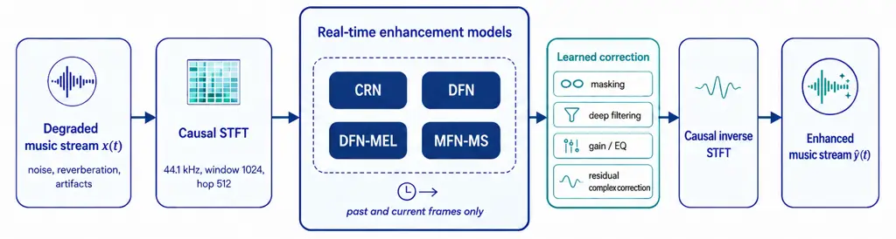

# Low-Latency Neural Models for Real-Time Music Enhancement

Emmanouil Karystinaios  Jonathan Greif  David Nadrchal  Paul
Primus Gerhard Widmer Affiliation: 
Email: <%7Bfirstname.lastname%7D@jku.at>

###### Abstract

Music recordings and live streams are often affected by noise,
reverberation, spectral imbalances, or artifacts that degrade listening
quality. While speech enhancement has matured into a well-defined
research area, music enhancement is less established because musical
signals combine overlapping sources, wide bandwidths, strong dynamics,
and intentional production effects. We study real-time music enhancement
under strict causal and low-latency constraints. We formulate the task
around recovery of the intended produced mix from acoustic and
production-oriented degradations, adapt compact causal networks to
music, and compare speech-derived real-time baselines, an external
music-denoising model, an offline restoration reference, and a
music-specific MusicFilterNet-MS variant. On the tested hardware, all
causal models run faster than real time, but improvements depend
strongly on the dataset, degradation type, and metric family; under
several objective criteria, indiscriminate enhancement can worsen the
degraded input. The main contribution is therefore a benchmark and an
analysis rather than a universal best model: real-time music enhancement
is feasible, but robust improvement requires degradation-aware modeling,
stereo-aware processing, identity-preserving correction, and evaluation
beyond a single objective score.

## I Introduction

Enhancement of degraded audio has been studied for decades, most
prominently in the context of speech. Speech enhancement systems target
additive noise and reverberation, with well-established datasets and
metrics supporting progress in telecommunications, hearing aids, and
interactive devices \[1\]. In contrast, music enhancement is less
clearly defined. Music signals combine multiple overlapping sources,
broader spectral ranges, and intentional nonlinearities from production,
making them more complex to model and evaluate.

Nevertheless, there are clear application scenarios where music
enhancement is valuable. These include at-home recording and online
streaming under non-ideal acoustic conditions, as well as on-device live
capture of performances (with or without video) and real-time rehearsals
in suboptimal conditions. In such cases, listeners may expect cleaner
and more balanced signals, with reduced noise, room reverberation, or
artifacts, and minimal latency to enable real-time use.

Related work in music processing has addressed specific aspects such as
denoising and restoration of historical recordings \[2, 3\] and
dedicated denoising networks for modern recordings \[4\]. More recently,
SonicMaster \[5\] proposed an all-in-one approach to music restoration
and mastering, introducing a taxonomy of degradations, including
equalization, dynamics, reverberation, amplitude defects, and
stereo-image issues, with dedicated evaluation metrics, but only in
offline settings.

Real-time approaches to music denoising, restoration, and enhancement
are limited. By contrast, real-time speech enhancement has advanced
considerably, with causal and low-latency neural architectures now
widely deployed \[6, 7, 8\]. Extending these techniques to music is
nontrivial because of higher source density, stronger dynamics, and
perceptual criteria that differ from intelligibility-driven speech
tasks.

In this paper, we take a step toward real-time music enhancement under a
shared 44.1 kHz causal streaming protocol. Our novelty lies in jointly
adapting the training objective, output parameterization, and model
design to music. Specifically, we contribute: (i) a degradation
formulation that distinguishes the intended produced mix from subsequent
acoustic and production-oriented corruption; (ii) a three-stage
curriculum that progresses from multi-resolution spectral reconstruction
to adversarial refinement and then to a new music-oriented composite
objective with waveform, log-mel, instantaneous-frequency, and
level-preservation terms; (iii) music-specific adaptations of compact
causal networks, including mel-domain processing and identity-centered
residual correction, together with the new MusicFilterNet-MS
architecture; and (iv) a benchmark using quality metrics and operational
measurements.¹¹ 1 All code is available at:
https://github.com/manoskary/audio-enhancement

We emphasize that our goal is not to match large offline systems such as
SonicMaster, which are non-causal and use long contexts. Instead, we use
SonicMaster as an offline reference and focus on three questions under
strict real-time constraints: (i) which compact causal architectures
remain computationally viable, (ii) how far speech-derived real-time
models transfer to music, and (iii) which degradation categories and
metric families expose the remaining failure modes. The results do not
support a universal state-of-the-art claim or identify MFN-MS as the
overall best model. Rather, they show that causal music enhancement is
computationally feasible, but improvement is degradation- and
metric-dependent, and an always-on global correction can be less
faithful than leaving the input unchanged. This motivates
degradation-aware routing, stereo-aware processing, and an
identity-preserving fallback when correction is uncertain.



Fig. 1: Framework of the real-time music enhancement pipeline. All
evaluated neural models operate on causal STFT frames and are
benchmarked at a batch size of one with the same analysis/synthesis
latency.

## II Problem Formulation and Novelty

### II-A Signal Model for Music Enhancement

Let $`\mathbf{y}`$ denote the intended $`C`$-channel produced mix, where
$`C=1`$ for mono and $`C=2`$ for stereo. We write

```math
\mathbf{y}=\mathcal{P}(s_{1},\ldots,s_{M}),\qquad\mathbf{x}=\mathcal{D}_{\phi}(\mathbf{y},\mathbf{n}), \tag{1}
```

where $`\mathcal{P}`$ denotes the artistic mixing and production
process, and $`\mathcal{D}_{\phi}`$ denotes a possibly nonlinear,
time-varying, and channel-dependent degradation process. The latter may
include room or device filtering, additive interference $`\mathbf{n}`$,
additional equalization or dynamics processing, clipping, amplitude
defects, quantization or codec distortion, and stereo-image
transformations. An operation belongs to $`\mathcal{P}`$ when it is
present in the reference production, and to $`\mathcal{D}_{\phi}`$ when
it is subsequently applied to construct the degraded observation.

For the linear, time-invariant, additive special case,
$`\mathcal{D}_{\phi}(\mathbf{y},\mathbf{n})=\mathbf{h}*\mathbf{y}+\mathbf{n}`$,
and the corresponding STFT-domain relation is

```math
\mathbf{X}(k,f)\approx\mathbf{H}(f)\mathbf{Y}(k,f)+\mathbf{N}(k,f), \tag{2}
```

up to STFT windowing effects. Here, $`\mathbf{H}(f)`$ may represent
either a scalar transfer function or a multichannel transfer matrix.
Nonlinear and channel-coupled degradations remain represented by
$`\mathcal{D}_{\phi}`$ and not by an additive artifact term.

A frame-causal enhancement model estimates
$`\widehat{\mathbf{Y}}(k,\cdot)=F_{\theta}\!\left(\{\mathbf{X}(\tau,\cdot)\}_{\tau\leq k}\right)`$,
so output frame $`k`$ depends only on the current and preceding input
frames. The target is the produced mix $`\mathbf{Y}`$ rather than the
individual stems, and the objective is to reduce unwanted degradations
while preserving intended production characteristics and interchannel
relationships. Channel indices are omitted below for readability.

### II-B FINALLY-Inspired Training Objective

We use a three-stage curriculum inspired by the training progression of
FINALLY \[9\], but with different objectives and stage transitions.
FINALLY first trains a 16-kHz model with a reconstruction objective,
then adds adversarial and feature-matching losses, and finally
introduces a 48-kHz upsampling module together with human-feedback
losses. In contrast, each of our causal architectures remains fixed at
44.1 kHz across the three stages. We use no speech self-supervised
encoder or speech-quality predictor; the final stage instead introduces
signal-domain constraints intended for music.

#### II-B1 Stage 1: Spectral reconstruction

Let $`\mathcal{R}`$ denote the set of STFT resolutions. We define the
multi-resolution spectral reconstruction objective as

```math
\mathcal{L}_{MR}=\frac{1}{|\mathcal{R}|}\sum_{r\in\mathcal{R}}\left(\lambda_{\mathrm{SC}}\mathrm{SC}_{r}+\lambda_{\mathrm{LM}}\mathcal{L}_{\mathrm{LM}}^{(r)}\right), \tag{3}
```

where $`\mathrm{SC}_{r}`$ is spectral convergence and
$`\mathcal{L}_{\mathrm{LM}}^{(r)}`$ is a log-magnitude distance at
resolution $`r`$.

#### II-B2 Stage 2: Adversarial refinement

Stage 2 retains the reconstruction objective and introduces a
multi-resolution STFT discriminator with hinge adversarial and
feature-matching losses:

```math
\mathcal{L}_{G}^{(2)}=\mathcal{L}_{\mathrm{MR}}+\lambda_{\mathrm{adv}}\mathcal{L}_{\mathrm{adv}}^{\mathrm{hinge}}+\lambda_{\mathrm{FM}}\mathcal{L}_{\mathrm{FM}}. \tag{4}
```

Feature matching regularizes the generator through intermediate
discriminator activations, while the adversarial term encourages outputs
whose time-frequency statistics are consistent with the reference music
distribution.

#### II-B3 Stage 3: Music-oriented multi-domain fine-tuning

Stage 3 replaces the reconstruction branch of Eq. (4) with a composite
music objective while retaining adversarial and feature-matching
supervision:

```math
\displaystyle\mathcal{L}_{\mathrm{music}} \displaystyle=\lambda_{\mathrm{si}}\mathcal{L}_{\mathrm{SI}}+\lambda_{\mathrm{pe}}\mathcal{L}_{\mathrm{PE\text{-}SI}}+\lambda_{\mathrm{l1}}\mathcal{L}_{\mathrm{L1\text{-}dB}}
```

```math
\displaystyle\quad+\lambda_{\mathrm{MR}}\mathcal{L}_{\mathrm{MR}}+\lambda_{\mathrm{mel}}\mathcal{L}_{\mathrm{logmel}}+\lambda_{\mathrm{IF}}\mathcal{L}_{\mathrm{IF}}+\lambda_{\mathrm{gain}}\mathcal{L}_{\mathrm{gain}}, \tag{5}
```

```math
\displaystyle\mathcal{L}_{G}^{(3)} \displaystyle=\mathcal{L}_{\mathrm{music}}+\lambda_{\mathrm{adv}}\mathcal{L}_{\mathrm{adv}}^{\mathrm{hinge}}+\lambda_{\mathrm{FM}}\mathcal{L}_{\mathrm{FM}}. \tag{6}
```

Here $`\mathcal{L}_{\mathrm{SI}}`$ and
$`\mathcal{L}_{\mathrm{PE\text{-}SI}}`$ are scale-invariant waveform
losses computed on the original and pre-emphasized signals,
respectively. The level-normalized
$`\mathcal{L}_{\mathrm{L1\text{-}dB}}`$ term combines an L1
reconstruction error normalized by the target level with adaptive
log-RMS regularization, while $`\mathcal{L}_{\mathrm{gain}}`$ penalizes
framewise log-RMS deviations. The log-mel term constrains the
frequency-dependent energy envelope, and $`\mathcal{L}_{\mathrm{IF}}`$
penalizes differences between wrapped temporal phase increments. The
objective therefore combines waveform, spectral, phase-evolution, and
level-preservation constraints without using speech-specific perceptual
features or quality predictors. Further implementation details and
grouped loss ablations are provided in the Supplementary Material.

|                       |                   |                  |                |                |                  |                |                 |                     |                  |                |                |                  |                |                 |
| --------------------- | ----------------- | ---------------- | -------------- | -------------- | ---------------- | -------------- | --------------- | ------------------- | ---------------- | -------------- | -------------- | ---------------- | -------------- | --------------- |
|                       | M&N Dataset       |                  |                |                |                  |                |                 | SonicMaster Dataset |                  |                |                |                  |                |                 |
| Model                 | FAD$`\downarrow`$ | KL$`\downarrow`$ | MM$`\uparrow`$ | SI$`\uparrow`$ | SSIM$`\uparrow`$ | PQ$`\uparrow`$ | ZIM$`\uparrow`$ | FAD$`\downarrow`$   | KL$`\downarrow`$ | MM$`\uparrow`$ | SI$`\uparrow`$ | SSIM$`\uparrow`$ | PQ$`\uparrow`$ | ZIM$`\uparrow`$ |
| Degraded input        | 0.640             | 0.152            | 5.336          | 3.509          | 0.537            | 5.818          | 2.391           | 0.103               | 0.077            | 8.477          | 0.023          | 0.501            | 7.007          | 3.659           |
| CRN Stage 3           | 0.684             | 0.099            | 7.048          | 4.556          | 0.502            | 5.903          | 2.339           | 0.102               | 0.350            | 5.511          | -1.990         | 0.508            | 6.988          | 3.657           |
| DFN Stage 3           | 0.655             | 0.184            | 4.001          | 1.929          | 0.465            | 5.742          | 2.338           | 0.114               | 0.205            | 3.296          | -4.410         | 0.503            | 6.869          | 3.528           |
| DFN-MEL Stage 3       | 0.754             | 0.132            | 5.348          | 3.898          | 0.512            | 5.475          | 2.223           | 0.145               | 0.222            | 2.794          | -5.179         | 0.494            | 6.564          | 3.306           |
| MFN-MS Stage 3        | 0.640             | 0.190            | 4.284          | 2.689          | 0.469            | 5.657          | 2.428           | 0.116               | 0.074            | 4.330          | -2.877         | 0.503            | 6.878          | 3.271           |
| MusicECAN (offline)   | 0.644             | 0.056            | 8.596          | 5.532          | 0.573            | 5.904          | 2.376           | 0.188               | 0.082            | 4.457          | -3.073         | 0.447            | 6.843          | 3.429           |
| SonicMaster (offline) | 0.697             | 0.124            | 2.654          | -1.150         | 0.456            | 5.898          | 2.296           | 0.072               | 0.008            | 2.021          | -3.309         | 0.519            | 3.028          | 2.885           |

TABLE I: Evaluation on M&N and SonicMaster. Lower is better for FAD/KL;
higher is better for MM-SNR, SI-SNR, SSIM, PQ, and ZIM. Shown are the
degraded input, Stage 3 real-time baselines, MFN-MS, and offline
references; the complete stage-wise table is in the Supplementary
Material. Best non-input values in each dataset section are bold.

### II-C Novel Contributions

Our technical novelty lies in the joint adaptation of the training
objective, output parameterization, and causal model design to music
enhancement. We introduce: (i) a FINALLY-inspired but music-specific
training curriculum; (ii) a composite multi-domain objective with
explicit level-preservation components; (iii) mel-domain and
identity-centered adaptations of compact causal enhancement networks;
and (iv) MusicFilterNet-MS as a music-specific causal architecture. The
contribution is therefore broader than a transfer of speech models,
while not claiming that every constituent loss is individually new.

#### II-C1 Music-oriented composite objective

The Stage 3 objective combines established scale-invariant waveform,
multi-resolution spectral, log-mel, and instantaneous-frequency
constraints with explicit level-aware terms. In particular, the
level-normalized L1 term penalizes reconstruction error relative to the
target signal level and adds adaptive log-RMS regularization, while the
framewise gain-consistency term discourages local loudness drift. The
novelty lies in their music-oriented composition and staged integration
with adversarial training, rather than in a claim of priority for the
standard SI, MR-STFT, log-mel, or phase-difference terms individually.

#### II-C2 Model adaptations

We evaluate two compact causal baselines from real-time speech
enhancement. The first is a convolutional recurrent network (CRN), a
causal encoder–recurrent–decoder architecture that predicts
time-frequency corrections from past and current frames only. The second
is DeepFilterNet (DFN) \[8\]. We use both the original ERB-style
configuration and a mel-domain variant (DFN-MEL), in which the original
ERB-based representation is replaced by a mel-frequency representation
that is more aligned with music timbre.

Following our problem formulation, we do not assume that enhancement can
be reduced to predicting purely attenuating spectral masks. In music,
intended production effects and degradations may interact in complex
ways, requiring both attenuation and amplification. To account for this,
we replace the original output heads with an identity-centered residual
complex ratio mask

```math
M=(1+\alpha\tanh r)+j(\alpha\tanh i)\\
\text{applied to the mixture STFT as: }\hat{Y}=M\odot X. \tag{7}
```

Here $`r`$ and $`i`$ are the real and imaginary outputs of the network
head, $`\alpha`$ bounds each Cartesian component of the residual
correction, and $`\odot`$ denotes element-wise complex multiplication.
This parameterization has an exact identity point at $`r=i=0`$ and
permits both attenuation and amplification. Exact passthrough at
initialization additionally requires the final output head to be
initialized at zero.

#### II-C3 MusicFilterNet-MS

To test a music-specific causal alternative to direct transfer from
speech models, we also introduce MusicFilterNet-MS (MFN-MS). MFN-MS
keeps the same streaming STFT interface as the other models but
increases music-specific capacity with absolute frequency encodings, a
causal local time-frequency encoder, gated deep filtering, smooth
equalization and gain heads, a lightweight waveform refiner, and several
causal complex residual refinement stages. The design is inspired by the
channel-attention and denoising emphasis of MusicECAN \[4\], but every
temporal operation is causal and the output remains a frame-synchronous
real-time enhancement model. Later experiments show that MFN-MS is
computationally feasible, but its learned correction is currently only
consistently beneficial on some degradation categories; we therefore use
it as a music-specific diagnostic model rather than claiming it as the
overall best system.

## III Experimental Setup

Our experiments evaluate real-time enhancement models against the
degraded input, a music-denoising baseline (MusicECAN \[4\]), and
offline restoration (SonicMaster \[5\]). MusicECAN is included to test
if a model trained for music denoising transfers beyond additive-noise
removal, and SonicMaster is included as a non-causal
restoration/mastering reference not as a real-time competitor. Prior
work \[4, 2\] has used a limited set of evaluation measures; we
therefore report both generic and music-oriented metrics.

#### III-1 Perceptual and music-specific metrics

Following SonicMaster \[5\], we report embedding and spectrogram-based
perceptual proxies: Fréchet Audio Distance (FAD) \[10\] computed from
CLAP embeddings \[11\], structural similarity index (SSIM), log-mel KL
divergence, and Production Quality (PQ) \[12\]. We also report
Zimtohrli \[13\] and Multi-Mel SNR \[14\], following the protocol used
in the recent Music Source Restoration Challenge.

#### III-2 Time-domain metric

We report scale-invariant SNR (SI-SNR) as a time-domain reference metric
that is commonly used in enhancement and restoration settings.

#### III-3 Operational metrics

We assess efficiency and real-time viability through real-time factor
($`\mathrm{RTF}`$) and algorithmic latency
($`\mathrm{lat}_{\mathrm{alg}}`$) with batch size $`=1`$. We further
report model size ($`|\theta|`$) and measured streaming throughput on
CPU and GPU execution paths.

### III-A Datasets

#### III-A1 SonicMaster Dataset

For training and evaluation, we use the SonicMaster dataset \[5\], which
contains 168k clean–degraded pairs. It spans ten genre groups (e.g.,
Hip-Hop) with fine-grained tags. Corruptions are formed by randomly
applying one to three degradations (from 19 total) across five
categories: EQ, dynamics, reverb, amplitude, and stereo. Each clean
track has seven corrupted variants. Following \[5\], we select 1,000
songs and their degradations (7,000 in total) as a test set.

#### III-A2 M&N Dataset

We employ the M&N dataset \[4\] for evaluation. It contains clean music
from nine categories (e.g., piano, harp, song, multi-instrument) mixed
with five noise types (electrical, crowd, weather, traffic, stationary).
The local paired test split contains 123 clean–noisy examples and is
used to evaluate all reported M&N rows.

#### III-A3 Instrument Datasets

We also use a training set of solo and ensemble instrument recordings
(GuitarSet \[15\], VocalSet \[16\], SynthSOD \[17\],
IDMT-PIANO-MM \[18\], MAESTRO \[19\], IDMT-SMT-Bass \[20\],
FiloBass \[21\]) to simulate room recording scenarios. Each clip is
degraded online (filtering, amplitude changes, noise, RIR convolution,
normalization) using audiomentations \[22\]. This dataset is used only
in Stage 3.

### III-B Models and Runtime Protocol

During training, we use random 2-second audio chunks. Waveforms are
resampled to 44.1 kHz and transformed into spectrograms with a window
size of 1024 and a hop size of 512. Unless otherwise stated, models are
trained with AdamW, a weight decay of $`1\times 10^{-4}`$, and a
learning rate of $`5\times 10^{-4}`$ for each stage. Streaming inference
uses a batch size of one, causal state updates, and 1024-sample blocks.
The algorithmic latency for all STFT-based models equals the analysis
window length, i.e. $`\mathrm{lat}_{\mathrm{alg}}=23.2`$ ms at 44.1 kHz.
RTF is measured as wall-clock inference time divided by the block
duration; $`\mathrm{RTF}<1`$ therefore indicates real-time processing.

### III-C Configuration Study

To validate the curriculum, we conduct two supporting analyses: CRN
checkpoints after Stages 1–3 and grouped Stage 3 loss ablations that
remove the time-domain, spectral, or music-perceptual block.

## IV Results

Table II addresses the real-time requirement directly. With a batch size
of one and causal 1024-sample blocks, all four causal models process a
23.2 ms block in 2.46–2.65 ms on the tested GPU, giving
$`\mathrm{RTF}=0.106`$–$`0.114`$. Thus, the evaluated systems are both
frame-causal and faster than real time on the tested accelerator. CPU
diagnostics are less uniform, especially for CRN, indicating that
reliable CPU-only deployment would require optimized kernels.

Table I shows that no single method dominates all metrics or datasets.
Among the displayed Stage 3 speech-derived causal systems, CRN gives the
strongest MM-SNR and SI-SNR on both datasets; DFN-MEL is the next
strongest on these two M&N measures but transfers poorly to the broader
SonicMaster degradations. MFN-MS is not the overall best model: on M&N
it matches the degraded-input FAD and improves ZIM, whereas on
SonicMaster it slightly improves KL and SSIM but worsens MM-SNR, SI-SNR,
PQ, and ZIM. The offline references are similarly task-dependent.
MusicECAN is strongest on several M&N metrics, consistent with its
denoising target, whereas SonicMaster is strongest on SonicMaster FAD
and KL but not on the signal-preservation metrics.

| Model   | M    | CPU   | GPU  | RTF   | Lat. |
| ------- | ---- | ----- | ---- | ----- | ---- |
| DFN     | 1.5  | 8.74  | 2.65 | 0.114 | 23.2 |
| DFN-MEL | 1.5  | 8.74  | 2.65 | 0.114 | 23.2 |
| CRN     | 5.6  | 69.20 | 2.56 | 0.110 | 23.2 |
| MFN-MS  | 16.5 | 17.56 | 2.46 | 0.106 | 23.2 |

TABLE II: Streaming runtime evidence at 44.1 kHz with a batch size of
one and 1024-sample causal blocks. CPU and GPU columns report mean
inference time in ms per 23.2 ms block. CPU values are unoptimized local
PyTorch diagnostics; the real-time claim is based on the measured
streaming GPU path, where all models have $`\mathrm{RTF}<1`$.

The Supplementary Material reports the omitted checkpoints and
diagnostics behind this interpretation. The stage-wise rows show that
CRN Stage 2 improves SonicMaster FAD/KL relative to Stage 1, while
Stage 3 shifts the model toward MM-SNR/SI-SNR. The grouped loss ablation
identifies the time-domain block as the main driver of M&N SI-SNR/MM-SNR
gains, and the MFN-MS category breakdown shows that its largest negative
MM-SNR delta occurs for stereo-image degradations. These results
reinforce that metric families should be compared rather than collapsed
into a single ranking.

The observed metric disagreement is expected and informative rather than
a defect of the benchmark: waveform, spectrogram, embedding,
production-quality, and psychoacoustic measures encode different notions
of fidelity and different invariances \[10, 23, 24, 25\]. We therefore
regard agreement across metric families as stronger evidence than an
isolated gain, while disagreement identifies cases in which nuisance
removal may trade against preservation of the produced mix. Without
subjective data, we do not claim that any one metric predicts listener
preference.

## V Conclusion

We presented a benchmark and diagnostic analysis of causal neural models
for real-time music enhancement. Runtime measurements show that compact
STFT-based systems can operate faster than real time at 44.1 kHz on the
tested GPU. However, no evaluated model consistently improves the
degraded input across both datasets and all metric families. The central
result is therefore not a claim of MFN-MS superiority: causal music
enhancement is computationally feasible, but indiscriminate always-on
processing can worsen the input under several objective criteria and may
trade nuisance removal against preservation of the intended production.
The category-level diagnostics, including the negative stereo MM-SNR
result, motivate degradation-aware routing, stereo-aware processing, and
an identity-preserving do-no-harm path that defaults to passthrough when
correction is uncertain. Subjective evaluation remains important future
work for determining which objective trade-offs correspond to listener
preference.

## Aknowledgments

This work has been supported by the European Research Council (ERC)
under the EU’s Horizon 2020 research & innovation programme, grant
agreement No. 101019375 (Whither Music?).

## References

- \[1\] S. Drgas (2023) A survey on low-latency dnn-based speech
  enhancement. Sensors 23 (3), pp. 1380. Cited by: §I.
- \[2\] E. Moliner and V. Välimäki (2022) A two-stage u-net for
  high-fidelity denoising of historical recordings. In International
  Conference on Acoustics, Speech and Signal Processing (ICASSP),
  pp. 841–845. Cited by: §I, §III.
- \[3\] E. Moliner and V. Välimäki (2022) BEHM-gan: bandwidth extension
  of historical music using generative adversarial networks. IEEE/ACM
  Transactions on Audio, Speech, and Language Processing 31,
  pp. 943–956. Cited by: §I.
- \[4\] H. Cheng, S. Liu, Z. Lian, L. Ye, and Q. Zhang (2024) MusicECAN:
  an automatic denoising network for music recordings with efficient
  channel attention. IEEE/ACM Transactions on Audio, Speech, and
  Language Processing 32. Cited by: §I, §II-C3, §III-A2, §III.
- \[5\] J. Melechovsky, A. Mehrish, and D. Herremans (2025) SonicMaster:
  towards controllable all-in-one music restoration and mastering. arXiv
  preprint arXiv:2508.03448. Cited by: §I, §III-1, §III-A1, §III.
- \[6\] K. Tan and D. Wang (2018) A convolutional recurrent neural
  network for real-time speech enhancement.. In Interspeech, Vol. 2018,
  pp. 3229–3233. Cited by: §I.
- \[7\] Y. Hu, Y. Liu, S. Lv, M. Xing, S. Zhang, Y. Fu, J. Wu, B. Zhang,
  and L. Xie (2020) DCCRN: deep complex convolution recurrent network
  for phase-aware speech enhancement. In Interspeech, Cited by: §I.
- \[8\] H. Schröter, T. Rosenkranz, A. N. Escalante-B, and A.
  Maier (2023) Deepfilternet: perceptually motivated real-time speech
  enhancement. In Interspeech, Cited by: §I, §II-C2.
- \[9\] N. Babaev, K. Tamogashev, A. Saginbaev, I. Shchekotov, H.
  Bae, H. Sung, W. Lee, H. Cho, and P. Andreev (2024) FINALLY: fast and
  universal speech enhancement with studio-like quality. In Advances in
  Neural Information Processing Systems (NeurIPS), Cited by: §II-B.
- \[10\] K. Kilgour, M. Zuluaga, D. Roblek, and M. Sharifi (2019)
  Fréchet audio distance: a reference-free metric for evaluating music
  enhancement algorithms. In Proc. Interspeech, pp. 2350–2354. Cited by:
  §III-1, §IV.
- \[11\] B. Elizalde, S. Deshmukh, M. Al Ismail, and H. Wang (2023) Clap
  learning audio concepts from natural language supervision. In
  International Conference on Acoustics, Speech and Signal Processing
  (ICASSP), pp. 1–5. Cited by: §III-1.
- \[12\] A. Tjandra, Y. Wu, B. Guo, J. Hoffman, B. Ellis, A. Vyas, B.
  Shi, S. Chen, M. Le, N. Zacharov, C. Wood, A. Lee, and W. Hsu (2025)
  Meta audiobox aesthetics: unified automatic quality assessment for
  speech, music, and sound. External Links:
  [Link](https://arxiv.org/abs/2502.05139) Cited by: §III-1.
- \[13\] J. Alakuijala, M. Bruse, S. Boukortt, J. Marus Coldenhoff,
  and M. Cernak (2025) Zimtohrli: an efficient psychoacoustic audio
  similarity metric. arXiv preprint arXiv:2509.26133. External Links:
  [Document](https://dx.doi.org/10.48550/arXiv.2509.26133) Cited by:
  §III-1.
- \[14\] Y. Zang, J. Hai, W. Ge, Q. Kong, Z. Dai, H. Wang, Y. Mitsufuji,
  and M. D. Plumbley (2026) Summary of the inaugural music source
  restoration challenge. arXiv preprint arXiv:2601.04343. Note: ICASSP
  2026 Music Source Restoration Challenge protocol and metrics
  (Multi-Mel-SNR, Zimtohrli, FAD-CLAP). External Links:
  [Document](https://dx.doi.org/10.48550/arXiv.2601.04343) Cited by:
  §III-1.
- \[15\] Q. Xi, R. M. Bittner, J. Pauwels, X. Ye, and J. P. Bello (2018)
  GuitarSet: a dataset for guitar transcription.. In Proceedings of the
  International Conference of Music Information Retrieval (ISMIR),
  pp. 453–460. Cited by: §III-A3.
- \[16\] J. Wilkins, P. Seetharaman, A. Wahl, and B. Pardo (2018)
  VocalSet: a singing voice dataset. Zenodo. External Links:
  [Document](https://dx.doi.org/10.5281/zenodo.1442513) Cited by:
  §III-A3.
- \[17\] J. García-Martínez, D. Díaz-Guerra, A. Politis, T.
  Virtanen, J. J. Carabias-Orti, and P. Vera-Candeas (2024) SynthSOD:
  developing an heterogeneous dataset for orchestra music source
  separation. IEEE Open Journal of Signal Processing. Cited by: §III-A3.
- \[18\] J. Abeßer, F. Bittner, M. Richter, M. Gonzalez, and H.
  Lukashevich (2023) IDMT-piano-mm dataset. Zenodo. External Links:
  [Document](https://dx.doi.org/10.5281/zenodo.7544248) Cited by:
  §III-A3.
- \[19\] C. Hawthorne, A. Stasyuk, A. Roberts, I. Simon, C. A. Huang, S.
  Dieleman, E. Elsen, J. Engel, and D. Eck (2019) Enabling factorized
  piano music modeling and generation with the maestro dataset. In
  International Conference on Learning Representations (ICLR), Cited by:
  §III-A3.
- \[20\] J. Abeßer (2023) IDMT-smt-bass dataset. Zenodo. External Links:
  [Document](https://dx.doi.org/10.5281/zenodo.7188892) Cited by:
  §III-A3.
- \[21\] X. Riley and S. Dixon (2023) FiloBass: a dataset and corpus
  based study of jazz basslines. In International Symposium of Music
  Information Retrieval (ISMIR), Note: Dataset available via Zenodo:
  10.5281/zenodo.10069709 Cited by: §III-A3.
- \[22\] I. Jordal (2024) Audiomentations documentation. Github. io.
  Cited by: §III-A3.
- \[23\] S. D. Jepsen, M. G. Christensen, and J. R. Jensen (2025) A
  study of the scale-invariant signal-to-distortion ratio in speech
  separation with noisy references. In IEEE ASRU, Workshop on Automatic
  Speech Recognition and Understanding., Cited by: §IV.
- \[24\] A. Gui, H. Gamper, S. Braun, and D. Emmanouilidou (2024)
  Adapting fréchet audio distance for generative music evaluation. IEEE
  International Conference on Acoustics, Speech, and Signal Processing
  (ICASSP). Cited by: §IV.
- \[25\] Y. Chung, P. Eu, J. Lee, K. Choi, J. Nam, and B. S. Chon (2025)
  KAD: no more fad! an effective and efficient evaluation metric for
  audio generation. In AI Heard That! ICML Workshop on Machine Learning
  for Audio, Cited by: §IV.

\[Supplementary Material\]

This appendix provides the complete results behind the compact
comparison in the main letter. The main paper keeps the degraded input,
final Stage 3 checkpoints, MFN-MS, and the two offline references to
emphasize the deployable setting. Here, we include the intermediate
checkpoints and diagnostics used to interpret those rows. The metrics
are the same as in the main paper: lower is better for FAD/KL, and
higher is better for MM-SNR, SI-SNR, SSIM, PQ, and Zimtohrli (ZIM).

|                       |                   |                  |                |                    |                  |                |                 |                     |                  |                |                    |                  |                |                 |
| --------------------- | ----------------- | ---------------- | -------------- | ------------------ | ---------------- | -------------- | --------------- | ------------------- | ---------------- | -------------- | ------------------ | ---------------- | -------------- | --------------- |
|                       | M&N Dataset       |                  |                |                    |                  |                |                 | SonicMaster Dataset |                  |                |                    |                  |                |                 |
| Model                 | FAD$`\downarrow`$ | KL$`\downarrow`$ | MM$`\uparrow`$ | SI-SNR$`\uparrow`$ | SSIM$`\uparrow`$ | PQ$`\uparrow`$ | ZIM$`\uparrow`$ | FAD$`\downarrow`$   | KL$`\downarrow`$ | MM$`\uparrow`$ | SI-SNR$`\uparrow`$ | SSIM$`\uparrow`$ | PQ$`\uparrow`$ | ZIM$`\uparrow`$ |
| Degraded input        | 0.640             | 0.152            | 5.336          | 3.509              | 0.537            | 5.818          | 2.391           | 0.103               | 0.077            | 8.477          | 0.023              | 0.501            | 7.007          | 3.659           |
| CRN Stage 1           | 0.663             | 0.077            | 2.685          | -0.515             | 0.475            | 5.983          | 2.307           | 0.089               | 0.325            | 4.420          | -2.185             | 0.555            | 7.056          | 3.725           |
| CRN Stage 2           | 0.688             | 0.069            | 2.848          | -0.650             | 0.481            | 6.005          | 2.287           | 0.085               | 0.186            | 4.021          | -2.474             | 0.558            | 7.064          | 3.726           |
| CRN Stage 3           | 0.684             | 0.099            | 7.048          | 4.556              | 0.502            | 5.903          | 2.339           | 0.102               | 0.350            | 5.511          | -1.990             | 0.508            | 6.988          | 3.657           |
| DFN Stage 1           | 0.702             | 0.162            | 1.283          | -2.830             | 0.427            | 5.848          | 2.285           | 0.115               | 0.199            | 3.383          | -5.112             | 0.537            | 6.846          | 3.507           |
| DFN Stage 2           | 0.724             | 0.144            | 1.225          | -3.266             | 0.421            | 5.882          | 2.283           | 0.117               | 0.189            | 3.385          | -4.962             | 0.544            | 6.865          | 3.510           |
| DFN Stage 3           | 0.655             | 0.184            | 4.001          | 1.929              | 0.465            | 5.742          | 2.338           | 0.114               | 0.205            | 3.296          | -4.410             | 0.503            | 6.869          | 3.528           |
| DFN-MEL Stage 1       | 0.727             | 0.168            | 2.503          | 0.358              | 0.444            | 5.892          | 2.267           | 0.144               | 0.228            | 2.886          | -5.025             | 0.494            | 6.582          | 3.306           |
| DFN-MEL Stage 2       | 0.751             | 0.128            | 5.351          | 3.333              | 0.513            | 5.476          | 2.208           | 0.120               | 0.285            | 3.587          | -4.228             | 0.575            | 6.915          | 3.556           |
| DFN-MEL Stage 3       | 0.754             | 0.132            | 5.348          | 3.898              | 0.512            | 5.475          | 2.223           | 0.145               | 0.222            | 2.794          | -5.179             | 0.494            | 6.564          | 3.306           |
| MFN-MS Stage 1        | 0.728             | 0.108            | -0.422         | -12.887            | 0.459            | 6.083          | 2.223           | 0.232               | 0.035            | -1.585         | -14.995            | 0.557            | 7.089          | 2.231           |
| MFN-MS Stage 2        | 0.671             | 0.177            | 3.658          | 1.636              | 0.493            | 5.675          | 2.441           | 0.149               | 0.071            | 3.323          | -6.353             | 0.507            | 6.876          | 2.872           |
| MFN-MS Stage 3        | 0.640             | 0.190            | 4.284          | 2.689              | 0.469            | 5.657          | 2.428           | 0.116               | 0.074            | 4.330          | -2.877             | 0.503            | 6.878          | 3.271           |
| MusicECAN (offline)   | 0.644             | 0.056            | 8.596          | 5.532              | 0.573            | 5.904          | 2.376           | 0.188               | 0.082            | 4.457          | -3.073             | 0.447            | 6.843          | 3.429           |
| SonicMaster (offline) | 0.697             | 0.124            | 2.654          | -1.150             | 0.456            | 5.898          | 2.296           | 0.072               | 0.008            | 2.021          | -3.309             | 0.519            | 3.028          | 2.885           |

TABLE S1: Complete evaluation on M&N and SonicMaster datasets.

Table S1 expands the compact main-table view by adding the Stage 1 and
Stage 2 checkpoints for both evaluation sets. It should be read as a
trace of changes across training rather than as a single leaderboard.
CRN Stage 3 gives the strongest speech-derived real-time result on
MM-SNR/SI-SNR, while CRN Stage 2 is better on SonicMaster FAD/KL and
PQ/ZIM. DFN-MEL remains competitive on M&N signal-preservation metrics
but weakens on the broader SonicMaster degradations, which suggests that
a mel-domain representation alone is not sufficient for general music
restoration. The offline references are also task-dependent: MusicECAN
is strongest on the denoising-oriented M&N split, whereas SonicMaster is
strongest only on SonicMaster FAD/KL among the displayed metric
families.

Table S2 collects the two diagnostics used to interpret these trends.
Panel (a) removes one Stage 3 loss block at a time from the same CRN
Stage 2 checkpoint. The time-domain block contains SI-SDR and PE-SI-SDR,
the spectral block contains MR-STFT terms, and the music-perceptual
block contains log-mel and instantaneous-frequency regularization. Panel
(b) reports MFN-MS deltas over the degraded input on SonicMaster;
positive values indicate improvement, and counts can exceed the number
of examples because one clip may contain multiple degradation
categories. Together, the diagnostics show that time-domain losses drive
the largest SI-SNR/MM-SNR gains, while the near-neutral non-stereo rows
and the negative stereo MM-SNR delta point to the need for stereo-aware
and degradation-aware correction.

[TABLE]

TABLE S2: Diagnostic analyses: (a) CRN Stage 3 grouped loss ablations on
M&N; (b) MFN-MS SonicMaster deltas by degradation category.
