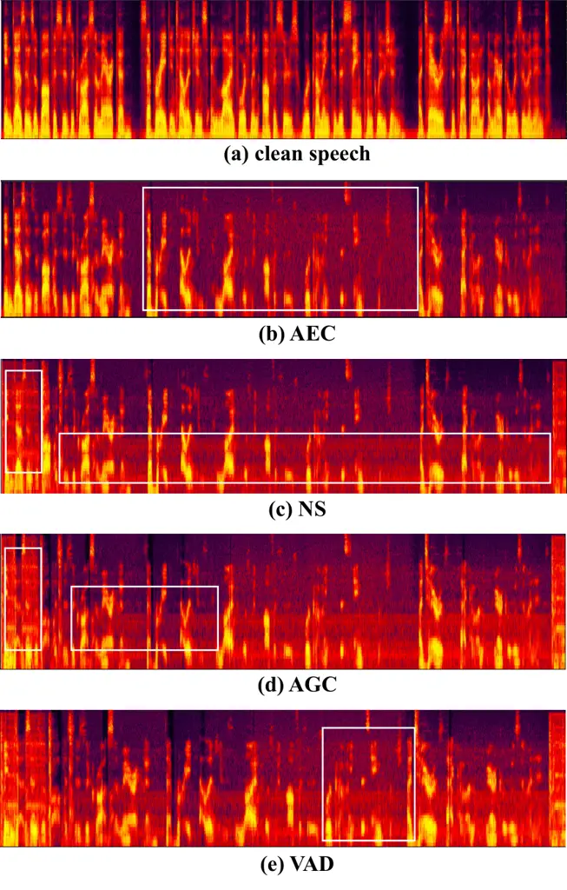
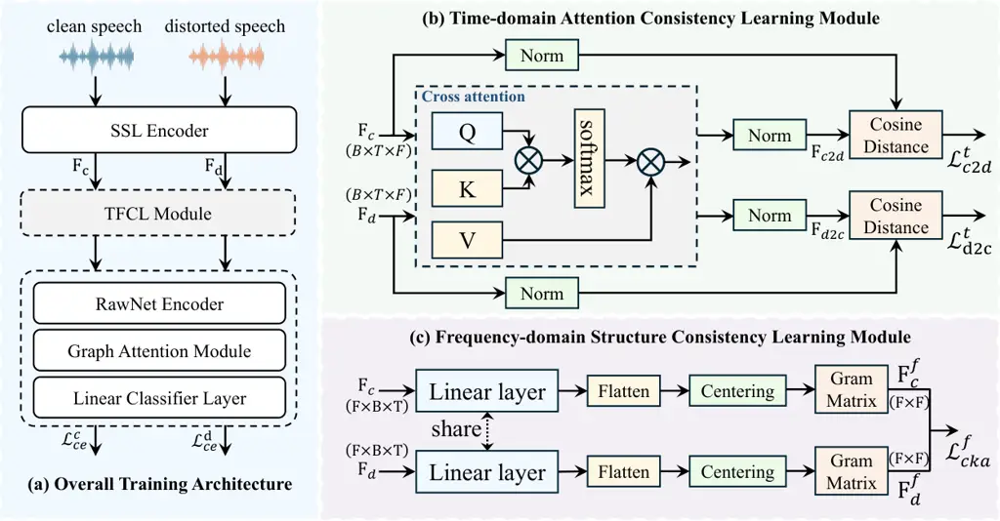
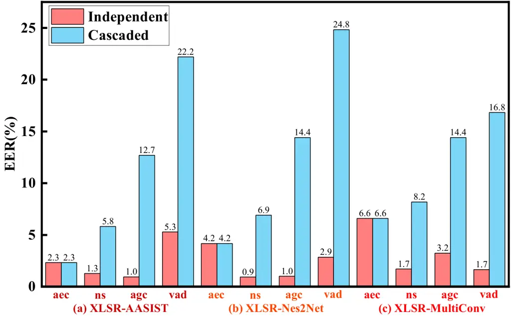
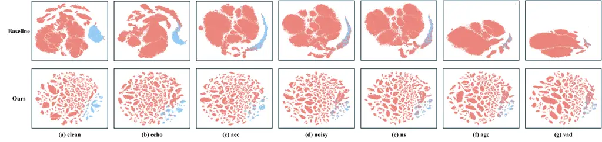

# Time-Frequency Consistency Learning for Robust Speech Deepfake Detection

Conference: Proceedings of the 34th ACM International Conference on
Multimedia; November 10–14, 2026; Rio de Janeiro, Brazil.Proceedings of
the 34th ACM International Conference on Multimedia (MM ’26), November
10–14, 2026, Rio de Janeiro,
BrazilDOI: [10.1145/3767308.3835861](https://doi.org/10.1145/3767308.3835861)ISBN: 979-8-4007-2213-4/2026/11CCS: Security
and privacy Privacy protectionsCCS: Security and
privacy AuthenticationCCS: Security and privacy Biometrics

Jun Xue
[](https://orcid.org/0009-0001-8465-011X)
email: <junxue@whu.edu.cn> Affiliation: School of Cyber Science and
Engineering, Wuhan University, Wuhan, China , Zhuolin Yi
[](https://orcid.org/0009-0008-5771-8976)
email: <yizhuolin@whu.edu.cn> Affiliation: School of Cyber Science and
Engineering, Wuhan University, Wuhan, China , Yanzhen Ren
[](https://orcid.org/0000-0003-0799-5082)
Note: Corresponding author. email: <renyz@whu.edu.cn>
Affiliation: School of Cyber Science and Engineering, Wuhan University,
Wuhan, China , Yihuan Huang
[](https://orcid.org/0009-0000-8939-0209)
email: <yihuanhuang@whu.edu.cn> Affiliation: Wuhan University, Wuhan,
China , Jiayu Xiong
[](https://orcid.org/0009-0000-3836-3438)
email: <yuinst@outlook.com> Affiliation: Tongji University, ShanghaiU ,
China , Yi Chai
[](https://orcid.org/0009-0006-7553-974X)
email: <talent@whu.edu.cn> Affiliation: Wuhan University, Wuhan, China ,
Guanxiang Feng
[](https://orcid.org/0009-0001-6742-1702)
email: <2022302191328@whu.edu.cn> Affiliation: Wuhan University, Wuhan,
China , Jiajun Liu
[](https://orcid.org/0009-0006-7070-9172)
email: <jiajunliu@whu.edu.cn> Affiliation: Wuhan University, Wuhan,
China and Tong Zhang email: <toby_zt@outlook.com> Affiliation: Wuhan
University, Wuhan, China

© cc

###### Abstract.

Recently, speech deepfake detection (SDD) has achieved significant
progress. However, its robustness evaluation remains largely confined to
controlled additive noise scenarios, lacking systematic investigation of
the complex distortions introduced by acoustic front-end (AFE)
processing pipelines in real-world deployments. In this work, we
simulate a unified AFE pipeline comprising acoustic echo cancellation,
noise suppression, automatic gain control, and voice activity detection
(VAD), and conduct a comprehensive evaluation of current
state-of-the-art models. The results show that the nonlinear and
time-frequency coupled distortions introduced by AFE significantly
degrade detection performance. To address this issue, we propose a
Time-Frequency Consistency Learning (TFCL) framework, which aims to
learn invariant spoofing representations that remain stable before and
after AFE processing. We observe that AFE not only introduces temporal
misalignment (e.g., segment-level shifts caused by VAD), but also
weakens or distorts critical frequency-domain cues. To this end, TFCL
employs an attention-driven soft alignment mechanism to capture
cross-temporal dependencies, along with frequency-domain structural
consistency constraints to enforce feature invariance. As a result, the
model is able to maintain stable representations under both temporal
perturbations and spectral distortions. Extensive experimental results
demonstrate that the proposed method effectively mitigates the
performance degradation caused by AFE processing, significantly
improving the robustness of SDD in real-world scenarios. The code is
available at
[https://github.com/JunXue-tech/TFCL](https://github.com/JunXue-tech/TFCL).

###### Keywords: 

Speech deepfake detection, acoustic front-end, robustness,
time-frequency consistency learning

^(†)^(†)cc-license: by

## 1. Introduction

With the advancement of generative models, text-to-speech (TTS) (Zhou
et al., 2025) and voice conversion (VC) (Du et al., 2024) techniques are
now capable of producing highly realistic speech signals, enabling
speech deepfakes to be used in real-world attacks. While these
technologies offer significant benefits, they have also been exploited
for fraudulent activities, identity impersonation, and other malicious
purposes, posing substantial risks to individual security and social
trust. In this context, speech deepfake detection (SDD) has emerged as
an important research topic. In recent years, benchmark initiatives such
as ASVspoof (Todisco et al., 2019; Liu et al., 2023; Wang et al., 2024)
and ADD (Yi et al., 2022; Yi et al., 2023) have driven the development
of detection methods, leading to continuous performance improvements
under controlled conditions.

To improve the applicability of SDD models in real-world scenarios,
existing studies have begun to investigate robustness under noisy
conditions (Cao et al., 2025; Chen et al., 2025b). For instance, ADD
2022 (Yi et al., 2022) introduces real-world environmental noise and
background music to evaluate model performance under complex acoustic
conditions. At the methodological level, Fan et al. (Fan et al., 2024)
enhance robustness in noisy scenarios through a dual-branch distillation
strategy, while Sen et al. (Sen et al., 2025) systematically analyze
performance variations across different signal-to-noise ratio (SNR)
levels, revealing the impact of environmental noise on detection
performance. However, these works primarily model speech degradation as
additive noise, overlooking the complex signal processing pipeline that
noisy speech undergoes in real-world communication systems.

In practical applications, speech deepfake threats have expanded to
real-time communication (RTC) platforms (Xue et al., 2026a), with their
latent risks manifesting in high-profile security incidents. A prime
example (Channel News Asia, 2025) is a 2025 case where attackers
utilized AI-generated voices during a Zoom meeting to successfully
impersonate a corporate CEO, executing a \$499,000 fraud. Such incidents
underscore the necessity for Speech Deepfake Detection (SDD) methods to
maintain high reliability in authentic communication deployments.
However, within mainstream communication applications, speech signals
are not transmitted directly but are processed by an acoustic front-end
(AFE) pipeline, including acoustic echo cancellation (AEC), noise
suppression (NS), automatic gain control (AGC), and voice activity
detection (VAD). This pipeline introduces complex nonlinear
transformations due to the cascading of multiple modules. As a result,
critical acoustic artifacts of spoofed speech may be distorted or
suppressed. Unfortunately, existing research lacks a thorough
investigation of this issue.

To address these challenges, we first simulate the acoustic front-end
processing and conduct a systematic evaluation of state-of-the-art
detection models. Experimental results reveal a severe performance
degradation across existing models following AFE processing. By further
analyzing the underlying impact of AFE on speech signals, we observe two
critical phenomena: in the time domain, VAD and AGC introduce
segment-level clipping and nonlinear gain variations, leading to
significant temporal misalignment; in the frequency domain, NS and AEC
inevitably suppress or distort essential spectral cues while mitigating
interference.

Motivated by these findings, we propose a Time-Frequency Consistency
Learning (TFCL) framework, designed to learn invariant forgery
representations across the AFE pipeline. Specifically, TFCL addresses
two types of AFE-induced distortions. In the time domain, an
attention-driven soft alignment mechanism is employed to mitigate
temporal inconsistencies by modeling cross-temporal dependencies. In the
frequency domain, we introduce structural consistency constraints to
preserve stable discriminative representations under spectral
distortions. By jointly enforcing temporal dependency alignment and
frequency structural consistency, the proposed framework is able to
learn robust representations that remain stable before and after AFE
processing. Extensive experimental results demonstrate that the proposed
method significantly enhances the robustness of SDD models against
distortions introduced by AFE processing chains.

The main contributions of this work are summarized as follows:

- •
  We move the robustness evaluation of SDD beyond additive-noise
  settings to realistic AFE distortions, and demonstrate their
  significant impact on detection performance.
- •
  We show that AFE degradation is not a single corruption type, but can
  be characterized as a coupled shift in temporal dependency and
  frequency structure, which challenges the stability of spoofing
  representations.
- •
  We propose a time-frequency consistency learning framework that
  addresses these two shifts through temporal soft alignment and
  frequency structural consistency regularization, yielding consistent
  improvements across different AFE conditions and model backbones.

## 2. Related Work

Speech Deepfake Detection Datasets. In recent years, a variety of
datasets and benchmarks have been developed for SDD, primarily focusing
on robustness from the perspectives of input degradation and
transmission processes. On the one hand, datasets such as ADD 2022 (Yi
et al., 2022) introduce real-world environmental noise and background
music to evaluate model robustness under low SNR and complex acoustic
conditions. On the other hand, some studies further consider factors in
the communication pipeline, including speech codecs (Liu et al., 2023),
compression artifacts (Wang et al., 2024), and bandwidth
constraints (Wang et al., 2024), and even extend to neural codec (Xie
et al., 2025; Chen et al., 2025a) scenarios to simulate realistic speech
transmission in modern communication systems. These efforts have
systematically expanded the evaluation scope of SDD at the data level.
However, existing work mainly focuses on input signal degradation or
transmission compression, and lacks systematic investigation and
modeling of the complex distortions introduced by AFE processing
pipelines, which are widely present in RTC systems.

Speech Deepfake Detection Methods. Mainstream SDD systems typically
combine a front-end feature extractor with a back-end classifier.
Wav2vec 2.0-based representations (Baevski et al., 2020) have been
widely adopted for modeling spoofing artifacts (Xue et al., 2026b),
while back-end architectures such as AASIST (Jung et al., 2022),
Mamba (Chen et al., 2024), and Nes2Net (Liu et al., 2025) improve
detection through enhanced structural and temporal modeling. Robustness
has also been explored through training strategies. For example,
DBKD (Fan et al., 2024) employs knowledge distillation to improve
stability under noisy conditions, whereas RawBoost (Tak et al., 2022a)
simulates signal degradation to enhance robustness against codec and
channel variations.

Nevertheless, existing methods mainly target additive noise or
transmission-related distortions, with limited attention to AFE
processing in real-world communication systems. Unlike a single
corruption, AFE comprises cascaded modules that introduce accumulated
nonlinear and time-frequency coupled distortions, making
spoof-discriminative representations difficult to preserve. To address
this issue, we construct a unified AFE simulation pipeline,
systematically evaluate its impact on existing SDD models, and propose a
TFCL framework to mitigate temporal dependency disruption and frequency
structural distortion.



Figure 1. Spectrogram visualization of the utterance LA_E_1184038.wav
across different front-end processing stages. The detailed processing
pipeline is described in Section 4.1.

## 3. Methodology

### 3.1. Problem Formulation

Given a clean speech signal $`x_{c}`$ and its corresponding distorted
version $`x_{d}=\mathcal{A}(x_{c})`$ processed by the AFE pipeline
$`\mathcal{A}(\cdot)`$, our goal is not to enforce strict signal-level
or frame-wise equivalence between $`x_{c}`$ and $`x_{d}`$. Instead, we
aim to learn _AFE-invariant spoofing representations_ that preserve
spoof-discriminative semantics while being robust to AFE-induced
nuisance variations.

Specifically, we focus on enforcing _discriminative representation
consistency_ between clean and distorted speech, rather than waveform
identity or exact temporal alignment. This formulation allows the model
to maintain stable spoofing cues under complex front-end processing
distortions.

### 3.2. Acoustic Front-end Pipeline

In modern real-time speech communication systems (e.g., VoIP, video
conferencing, and WebRTC-based applications), the acoustic front-end
typically consists of a cascade of speech enhancement modules, including
AEC, NS, AGC, and VAD. This modular architecture has become a de facto
standard in industrial systems. For instance, the Audio Processing
Module (APM) in WebRTC explicitly integrates AEC, NS, and AGC as core
components for real-time processing of microphone signals (Google,
\[n. d.\]). These processing modules are generally applied after audio
capture and before encoding, forming a complete acoustic front-end
processing pipeline (Bashir, \[n. d.\]).

From a processing perspective, mainstream systems typically organize
these modules in the order of “AEC → NS → AGC → VAD”. This ordering is
motivated by the dependency among different types of distortions:
acoustic echo is a structured interference that is highly correlated
with the far-end signal and therefore must be removed first; background
noise is largely uncorrelated and its suppression benefits from prior
echo reduction; AGC is then applied to normalize signal amplitude for
stable downstream processing; finally, VAD operates on relatively clean
and amplitude-stabilized signals to detect speech activity. In
communication systems, VAD is further used to identify active speech
segments, thereby avoiding redundant encoding and transmission of silent
intervals and improving bandwidth efficiency. Similar module
configurations and processing paradigms have been widely adopted in
real-time speech communication research (Wang et al., 2022).

### 3.3. Analysis and Motivation



Figure 2. Overview of the proposed framework. The distorted speech is
generated by passing clean speech through the AFE pipeline. The backend
classifier adopts the AASIST architecture. Note: The dual-input design
and the TFCL module are used only during training for consistency
learning, and are removed during inference without introducing
additional computational overhead.

From the spectrogram visualization in Figs. 1, it can be observed that
due to distortion accumulation introduced by the speech front-end
processing pipeline, the spectral characteristics and temporal prosody
of the original speech signal are irreversibly degraded. This
degradation manifests in different forms across each processing stage:

In the AEC stage, although echo components are effectively suppressed,
it simultaneously introduces substantial semantic information loss. As
observed in the highlighted regions, portions of continuous speech
energy are significantly attenuated or even completely removed,
resulting in the emergence of extended silent segments. Moreover, AEC
fails to fully eliminate background interference, leaving a noticeable
level of residual noise. This combination of “over-suppression and
residual noise” introduces latent risks for subsequent processing
stages.

The NS stage effectively suppresses high-frequency background noise,
resulting in a cleaner spectral structure in the high-frequency regions
of the spectrogram. However, this process also introduces a certain
degree of spectral variation. As observed in Fig. 1 (c), parts of the
spectral structure exhibit mild distortion, manifested as reduced
harmonic continuity and uneven local energy distribution. In addition,
noticeable residual noise remains in the low-frequency region.

Subsequently, AGC adjusts the gain to constrain the speech signal within
a certain dynamic range. However, since distortions have already been
introduced in the preceding stages, AGC may further amplify these
artifacts. On the one hand, previously attenuated or already distorted
spectral components can be nonlinearly enhanced under dynamic gain
adjustment, making the distortions more pronounced. On the other hand,
the energy distribution across different temporal segments is
rebalanced, thereby weakening the natural dynamic variations of speech
and exacerbating temporal inconsistencies.

Finally, in the VAD stage, the system detects and segments speech
activity regions based on energy or statistical features, and typically
removes non-speech segments (e.g., silence) to reduce redundancy and
lower transmission or storage costs. However, since preceding processing
stages (e.g., AEC) may introduce non-natural silence or speech loss,
VAD-based segmentation on such inputs can further alter the temporal
structure of the speech, thereby introducing additional effects on
speech rhythm (prosody) and overall prosodic patterns.

Overall, the above analysis indicates that the speech front-end
processing pipeline introduces progressively accumulated perturbations
to the intrinsic structure of speech in both temporal and frequency
domains. These perturbations are not only reflected in local information
loss or energy variation, but more importantly in the disruption of
temporal dependencies and alterations of spectral structural
relationships. Based on these observations, we identify two key
representation-level effects introduced by AFE processing: (1) temporal
dependency disruption, and (2) frequency structural distortion. These
two effects call for alignment at different granularities: in the time
domain, relation-aware soft alignment is required to handle non-rigid
temporal mismatch; in the frequency domain, global structural
consistency is needed to preserve discriminative spectral relationships.
Motivated by this decomposition, we propose a time-frequency consistency
learning framework, as illustrated in Fig. 2, which jointly addresses
temporal and frequency-domain distortions.

### 3.4. Overview of the Proposed Framework

Given clean and distorted speech, we first extract frame-level
representations using a shared feature encoder, denoted as
$`\bm{F}_{c}`$ and $`\bm{F}_{d}`$. To address the two types of
AFE-induced distortions, we introduce a dual-branch consistency learning
framework.

In the time domain, a temporal dependency consistency module is designed
to mitigate temporal misalignment by modeling cross-temporal
dependencies through soft alignment. In the frequency domain, a
structural consistency module is introduced to preserve global spectral
relationships under front-end processing.

The two consistency objectives are jointly optimized together with the
classification loss, enabling the model to learn spoof-discriminative
representations that remain stable before and after AFE processing.

### 3.5. Temporal Dependency Consistency Learning

Motivated by the temporal dependency disruption introduced by AFE
processing (e.g., segment-level shifts and non-rigid temporal mismatch
caused by VAD and AGC), we propose a temporal dependency consistency
learning mechanism to align clean and distorted speech representations.

Specifically, clean and distorted speech signals are first processed by
a shared feature extractor to obtain frame-level representations. Let
$`\bm{F}=[\bm{f}_{1},\bm{f}_{2},\dots,\bm{f}_{T}]\in\mathbb{R}^{T\times D}`$
denote the sequence of frame-level features, where $`T`$ is the number
of time steps and $`D`$ is the feature dimension. The corresponding
representations for clean and distorted speech are denoted as
$`\bm{F}_{c}`$ and $`\bm{F}_{d}`$, respectively.

Due to the non-rigid temporal distortions introduced by AFE processing,
strict frame-wise alignment is not appropriate. Therefore, we employ a
bidirectional cross-attention mechanism to perform relation-aware soft
alignment between $`\bm{F}_{c}`$ and $`\bm{F}_{d}`$.

For notational convenience, let
$`(\bm{F}_{s},\bm{F}_{r})\in\{(\bm{F}_{c},\bm{F}_{d}),(\bm{F}_{d},\bm{F}_{c})\}`$
denote the source-target feature pair for each direction. The
cross-attention aligned representation is then formulated as:

```math
\bm{F}_{s\rightarrow r}=\mathrm{Softmax}\left(\frac{\bm{Q}_{s}\bm{K}_{r}^{\top}}{\sqrt{D}}\right)\bm{V}_{r}, \tag{1}
```

To enforce temporal consistency, we measure the discrepancy between the
aligned feature and its corresponding original feature using cosine
distance:

```math
\mathcal{L}_{s\rightarrow r}^{t}=1-\frac{\bm{F}_{s\rightarrow r}\cdot\bm{F}_{s}}{\|\bm{F}_{s\rightarrow r}\|\,\|\bm{F}_{s}\|}. \tag{2}
```

The final temporal consistency loss is defined as:

```math
\mathcal{L}_{t}=\frac{1}{2}\left(\mathcal{L}_{c\rightarrow d}^{t}+\mathcal{L}_{d\rightarrow c}^{t}\right). \tag{3}
```

The aligned representation aggregates supportive evidence from the
counterpart domain, while preserving the source-domain spoof semantics,
rather than collapsing the two domains into identical embeddings. This
design allows the model to learn temporally robust representations under
AFE-induced distortions.

Figure 3. General acoustic front-end processing pipeline

### 3.6. Frequency Structural Consistency Learning

Motivated by the frequency structural distortion introduced by AFE
processing, we further propose a frequency structural consistency
learning mechanism to preserve stable discriminative spectral
relationships.

Unlike temporal distortions, frequency-domain perturbations mainly
affect the structural relationships across feature channels, rather than
introducing simple point-wise shifts. Therefore, instead of enforcing
strict feature matching, we aim to preserve second-order relational
structures in the frequency domain.

Specifically, given the frame-level features
$`\bm{F}_{c},\bm{F}_{d}\in\mathbb{R}^{T\times D}`$, we first reorganize
them into frequency-oriented representations:

```math
\bm{\tilde{F}}_{c}^{f}=\phi(\bm{F}_{c}^{f}),\quad\bm{\tilde{F}}_{d}^{f}=\phi(\bm{F}_{d}^{f}), \tag{4}
```

Subsequently, the projected features are flattened:

```math
\bm{X}_{c}=\mathrm{Flatten}(\bm{\tilde{F}}_{c}^{f}),\quad\bm{X}_{d}=\mathrm{Flatten}(\bm{\tilde{F}}_{d}^{f}), \tag{5}
```

We then adopt linear CKA to measure the similarity of second-order
structures:

```math
\mathrm{CKA}(\bm{X}_{c},\bm{X}_{d})=\frac{\mathrm{HSIC}(\bm{K}_{c},\bm{K}_{d})}{\sqrt{\mathrm{HSIC}(\bm{K}_{c},\bm{K}_{c})\mathrm{HSIC}(\bm{K}_{d},\bm{K}_{d})}}. \tag{6}
```

The corresponding loss is:

```math
\mathcal{L}_{f}=1-\mathrm{CKA}(\bm{X}_{c},\bm{X}_{d}). \tag{7}
```

CKA provides a practical surrogate for preserving second-order
frequency-domain structure, enabling the model to maintain stable
spectral relationships under AFE-induced distortions.

### 3.7. Training Objective

The overall training objective combines classification and consistency
constraints:

```math
\mathcal{L}=\mathcal{L}_{ce}^{c}+\mathcal{L}_{ce}^{d}+\lambda(\mathcal{L}_{t}+\mathcal{L}_{f}). \tag{8}
```

Here, $`\mathcal{L}_{ce}^{c}`$ and $`\mathcal{L}_{ce}^{d}`$ denote the
cross-entropy losses for clean and distorted speech, respectively, which
preserve spoof discriminability. $`\mathcal{L}_{t}`$ is the temporal
consistency loss that reduces temporal dependency shift, while
$`\mathcal{L}_{f}`$ is the frequency structural consistency loss that
mitigates frequency structural distortion. The hyperparameter
$`\lambda`$ balances the contribution of the consistency constraints. By
jointly optimizing these objectives, the model learns spoofing
representations that are both discriminative and robust to AFE-induced
distortions.

|                                    |                  |                   |                 |                   |                 |                   |                 |                   |                 |                   |                 |                   |                 |                   |                 |
| ---------------------------------- | ---------------- | ----------------- | --------------- | ----------------- | --------------- | ----------------- | --------------- | ----------------- | --------------- | ----------------- | --------------- | ----------------- | --------------- | ----------------- | --------------- |
| Model                              | Pub              | clean             |                 | AFE pipeline      |                 |                   |                 |                   |                 |                   |                 |                   |                 |                   |                 |
|                                    |                  |                   |                 | echo              |                 | aec               |                 | noisy             |                 | ns                |                 | agc               |                 | vad               |                 |
|                                    |                  | EER$`\downarrow`$ | AUC$`\uparrow`$ | EER$`\downarrow`$ | AUC$`\uparrow`$ | EER$`\downarrow`$ | AUC$`\uparrow`$ | EER$`\downarrow`$ | AUC$`\uparrow`$ | EER$`\downarrow`$ | AUC$`\uparrow`$ | EER$`\downarrow`$ | AUC$`\uparrow`$ | EER$`\downarrow`$ | AUC$`\uparrow`$ |
| AASIST (Jung et al., 2022)         | ICASSP 2022      | 0.83              | 99.93           | 10.23             | 95.41           | 5.20              | 98.75           | 17.55             | 90.41           | 15.22             | 92.16           | 43.56             | 60.09           | 47.11             | 54.97           |
| XLSR_AASIST (Tak et al., 2022b)    | Odyssey 2022     | 0.23              | 99.97           | 2.20              | 99.68           | 2.34              | 99.54           | 6.31              | 97.84           | 5.81              | 97.84           | 12.70             | 93.69           | 22.20             | 86.59           |
| XLSR_TCM (Truong et al., 2024)     | Interspeech 2024 | 0.23              | 99.99           | 5.44              | 98.45           | 17.61             | 90.06           | 25.37             | 81.90           | 22.73             | 84.51           | 30.46             | 75.71           | 38.41             | 66.35           |
| XLSR_SLS (Zhang et al., 2024)      | ACM MM 2024      | 0.23              | 99.99           | 3.95              | 99.26           | 9.46              | 96.71           | 11.11             | 95.56           | 10.80             | 95.73           | 14.34             | 92.64           | 20.27             | 86.90           |
| XLSR_Nes2Net (Liu et al., 2025)    | TIFS 2025        | 0.17              | 99.99           | 3.75              | 99.31           | 4.17              | 99.12           | 7.02              | 97.49           | 6.91              | 97.63           | 14.41             | 92.04           | 24.83             | 82.11           |
| XLSR_MultiConv (Tran et al., 2025) | ACM MM 2025      | 0.87              | 99.94           | 6.09              | 98.88           | 6.59              | 98.32           | 8.78              | 97.15           | 8.18              | 97.47           | 14.40             | 93.36           | 16.83             | 91.29           |
| ALLM4ADD\* (Gu et al., 2025)       | ACM MM 2025      | 0.67              | 99.84           | 16.46             | 91.44           | 45.16             | 56.71           | 37.78             | 65.32           | 38.72             | 65.32           | 42.62             | 59.81           | 45.26             | 56.14           |
| Ours                               | –                | 0.55              | 99.96           | 1.77              | 99.80           | 2.19              | 99.68           | 3.87              | 99.14           | 3.91              | 99.20           | 4.84              | 98.79           | 9.78              | 96.40           |

- •
  ^(∗) denotes reproduced results; all other results are obtained using
  publicly available pretrained weights.

Table 1. Performance comparison of different SDD models under various
acoustic front-end (AFE) conditions. The settings from echo to vad
correspond to intermediate stages of the AFE pipeline illustrated in
Fig. 3. Bold indicates the best result, and wavy underline indicates the
second-best result.

## 4. Experimental Setup and Results Analysis

### 4.1. Dataset and acoustic front-end simulation

To thoroughly analyze the impact of environmental noise and individual
components of acoustic front-end processing for SDD, we adopt the
ASVspoof2019 LA (Todisco et al., 2019) dataset as the research
benchmark. This dataset is constructed from high-quality clean speech
data. It is divided into three subsets: training, development, and
evaluation. Notably, the evaluation set introduces unseen conditions in
both speaker identity and spoofing algorithms.

We follow the processing pipeline illustrated in Fig. 3 to sequentially
process the original speech data. First, in the echo simulation stage,
for the training and development sets, we adopt a room acoustics
simulation-based method¹¹ 1
https://github.com/LCAV/pyroomacoustics (Scheibler et al., 2018).
Specifically, a virtual acoustic environment is constructed, and the
multi-path propagation from the sound source to the microphone is
simulated to generate speech signals with echo effects. This process can
be approximately formulated as:

```math
x_{\text{echo}}(t)=\sum_{k}\alpha_{k}\,x(t-\tau_{k}), \tag{9}
```

where $`\tau_{k}`$ and $`\alpha_{k}`$ denote the delay and attenuation
associated with the $`k`$-th propagation path, respectively.

For the evaluation set, to more realistically simulate echo effects in
practical scenarios, we adopt a room impulse response (RIR)-based²² 2
https://openslr.org/ echo simulation method. Specifically, the original
speech signal is convolved with the RIR to generate the echo component,
followed by introducing temporal delay and energy attenuation. The
processed echo signal is then superimposed onto the original speech to
form the final microphone signal. The process can be formulated as:

```math
x_{\text{mic}}(t)=x(t)+\beta\,(x*h)(t-\tau), \tag{10}
```

where $`h(t)`$ denotes the room impulse response, $`*`$ represents
convolution, $`\tau`$ is the echo delay, and $`\beta`$ is an attenuation
factor controlling the echo energy. The resulting $`x_{\text{mic}}(t)`$
corresponds to the simulated speech signal with echo effects.

In the noise addition stage, for the training and development sets, we
employ the MUSAN³³ 3 https://www.openslr.org/17/ (Snyder et al., 2015)
noise corpus and perform data augmentation by randomly sampling the SNR
within the range of 5–20 dB. For the evaluation set, to more
comprehensively assess the model’s robustness under realistic and
complex acoustic conditions, we adopt the DNS⁴⁴ 4
https://github.com/microsoft/DNS-Challenge noise dataset, which consists
of two noise sources: AudioSet (Gemmeke et al., 2017) and
Freesound (Fonseca et al., 2017). A round-robin strategy is applied to
traverse different noise samples, while the SNR is controlled to follow
a uniform distribution.

Finally, we adopt the standard implementations provided by WebRTC⁵⁵ 5
https://github.com/mail2chromium/Android-Audio-Processing-Using-WebRTC
to simulate the aforementioned acoustic front-end modules in a cascaded
manner, thereby constructing a speech processing pipeline that closely
resembles real-world communication systems. This design not only more
faithfully reflects the distortion processes encountered in practical
applications, but also provides a controlled and unified experimental
framework for analyzing the impact of different front-end processing
stages on spoofing detection performance.



Figure 4. Performance Comparison of Different Models under Independent
and Cascaded AFE Modules.

### 4.2. Model setup

To evaluate the performance of deepfake speech detection, we adopt three
advanced models as baseline systems, namely XLSR-AASIST⁶⁶ 6
https://github.com/TakHemlata/SSL_Anti-spoofing (Tak et al., 2022b),
XLSR-MultiConv⁷⁷ 7
https://github.com/hoanmyTran/dissimilarity_deepfake_detection (Tran
et al., 2025), and XLSR-Nes2Net⁸⁸ 8
https://github.com/Liu-Tianchi/Nes2Net_ASVspoof_ITW (Liu et al., 2025).
Specifically, XLSR (Babu et al., 2022) serves as the front-end feature
extractor to capture general speech representations, while AASIST,
MultiConv, and Nes2Net are employed as back-end classifiers for spoofing
detection. During training, RawBoost (Tak et al., 2022a) is applied to
the clean speech branch as a data augmentation strategy to enhance
robustness under complex acoustic conditions.

All models are optimized using the Adam optimizer, with a learning rate
of $`1\times 10^{-6}`$ and a weight decay of $`1\times 10^{-4}`$.
Training is conducted for up to 100 epochs with an early stopping
strategy, where training is terminated if no performance improvement is
observed for 10 consecutive epochs. During evaluation, Equal Error Rate
(EER) and Area Under the Curve (AUC) are adopted as performance metrics.
Hyperparameter $`\lambda`$ is 0.3. All experiments are conducted on an
NVIDIA RTX 4090 GPU.

|                                                   |                   |                 |                   |                 |                   |                 |                   |                 |                   |                 |                   |                 |                   |                 |
| ------------------------------------------------- | ----------------- | --------------- | ----------------- | --------------- | ----------------- | --------------- | ----------------- | --------------- | ----------------- | --------------- | ----------------- | --------------- | ----------------- | --------------- |
| Model                                             | clean             |                 | AFE pipeline      |                 |                   |                 |                   |                 |                   |                 |                   |                 |                   |                 |
|                                                   |                   |                 | echo              |                 | aec               |                 | noisy             |                 | ns                |                 | agc               |                 | vad               |                 |
|                                                   | EER$`\downarrow`$ | AUC$`\uparrow`$ | EER$`\downarrow`$ | AUC$`\uparrow`$ | EER$`\downarrow`$ | AUC$`\uparrow`$ | EER$`\downarrow`$ | AUC$`\uparrow`$ | EER$`\downarrow`$ | AUC$`\uparrow`$ | EER$`\downarrow`$ | AUC$`\uparrow`$ | EER$`\downarrow`$ | AUC$`\uparrow`$ |
| XLSR-AASIST backbone with different training data |                   |                 |                   |                 |                   |                 |                   |                 |                   |                 |                   |                 |                   |                 |
| Clean-only                                        | 0.23              | 99.97           | 2.20              | 99.68           | 2.34              | 99.54           | 6.31              | 97.84           | 5.81              | 97.84           | 12.70             | 93.69           | 22.20             | 86.59           |
| AFE-only                                          | 7.06              | 97.30           | 8.22              | 96.58           | 6.13              | 97.96           | 9.92              | 95.92           | 9.75              | 95.99           | 9.12              | 96.36           | 11.84             | 94.81           |
| Mix                                               | 0.52              | 99.95           | 2.62              | 99.46           | 5.01              | 98.99           | 6.95              | 97.93           | 6.31              | 98.31           | 7.15              | 97.83           | 17.39             | 90.33           |
| Ours                                              | 0.55              | 99.96           | 1.77              | 99.80           | 2.19              | 99.68           | 3.87              | 99.14           | 3.91              | 99.20           | 4.84              | 98.79           | 9.78              | 96.40           |
| Other backbones trained on mixed data             |                   |                 |                   |                 |                   |                 |                   |                 |                   |                 |                   |                 |                   |                 |
| XLSR_Nes2Net w/ TFCL                              | 0.56              | 99.97           | 1.89              | 99.78           | 2.44              | 99.66           | 4.61              | 98.98           | 5.04              | 98.76           | 5.91              | 98.32           | 11.08             | 95.59           |
| XLSR_Nes2Net w/o TFCL                             | 0.46              | 99.98           | 4.35              | 99.12           | 11.98             | 95.26           | 15.82             | 92.13           | 14.49             | 93.26           | 12.17             | 94.92           | 15.58             | 92.32           |
| XLSR_MultiConv w/ TFCL                            | 0.76              | 99.86           | 2.80              | 99.50           | 3.49              | 99.27           | 5.95              | 98.33           | 5.44              | 98.56           | 7.12              | 97.88           | 11.76             | 94.61           |
| XLSR_MultiConv w/o TFCL                           | 0.91              | 99.90           | 4.30              | 99.12           | 5.94              | 98.64           | 8.73              | 97.42           | 8.49              | 97.43           | 9.37              | 96.85           | 14.76             | 92.82           |
| Ablation experiments (XLSR-AASIST)                |                   |                 |                   |                 |                   |                 |                   |                 |                   |                 |                   |                 |                   |                 |
| TFCL                                              | 0.55              | 99.96           | 1.77              | 99.80           | 2.19              | 99.68           | 3.87              | 99.14           | 3.91              | 99.20           | 4.84              | 98.79           | 9.78              | 96.40           |
| w/o TACL                                          | 0.71              | 99.92           | 2.12              | 99.59           | 3.10              | 99.40           | 5.29              | 98.44           | 5.15              | 98.64           | 5.78              | 98.24           | 10.48             | 95.31           |
| w/o Bi_attention                                  | 0.58              | 99.97           | 2.19              | 99.65           | 2.80              | 99.53           | 7.08              | 97.66           | 5.22              | 98.62           | 5.91              | 98.23           | 11.37             | 94.91           |
| w/o Attention                                     | 0.45              | 99.96           | 1.59              | 99.80           | 2.05              | 99.70           | 4.56              | 98.94           | 5.03              | 98.90           | 5.85              | 98.52           | 11.56             | 95.39           |
| w/o FSCL                                          | 0.72              | 99.92           | 2.58              | 99.63           | 3.26              | 99.49           | 5.33              | 98.66           | 5.18              | 98.73           | 6.15              | 98.30           | 10.99             | 96.16           |

Table 2. Ablation study under different AFE conditions. Bold values
denote the best performance within each group.

### 4.3. Robustness of state-of-the-art models under AFE-Induced degradations

Table 1 presents a performance comparison of various state-of-the-art
(SOTA) SDD models under different AFE processing stages. The evaluation
covers scenarios ranging from the clean condition to intermediate stages
of the AFE pipeline (corresponding to the stages from Echo to VAD in
Fig. 3), enabling a systematic analysis of model robustness under
real-world communication processing pipelines.

Significant performance gap: robustness degradation from ideal to
real-world conditions. The experimental results show that although
existing models achieve excellent performance under the clean condition
(with very low EER and near-saturated AUC), their performance degrades
significantly and consistently once AFE processing is introduced. As the
processing progresses from Echo to VAD, this degradation exhibits a
clear accumulative trend. For instance, the EER of AASIST increases from
0.83% to 47.11%, while that of the SSL-based XLSR_AASIST rises from
0.23% to 22.20%. These observations indicate that the high performance
achieved under ideal conditions does not directly transfer to real-world
communication scenarios, and AFE processing has become a key factor
limiting the practical deployment of SDD models.

Cascaded distortion effect: cumulative degradation of discriminative
features under AFE processing. Further analysis reveals that the
performance degradation is not caused by individual processing modules
independently, but rather results from the cascaded effect of the AFE
pipeline. The stage-wise results in Table 1, from AEC and NS to AGC and
VAD, already exhibit a clear accumulative degradation trend. To further
investigate the source of this cascaded effect, Fig. 4 compares model
performance under independent AFE modules and cascaded processing
conditions. It can be observed that when individual AFE modules are
applied independently, the performance degradation remains relatively
limited. In contrast, under cascaded processing, the degradation is
significantly amplified, far exceeding the simple sum of individual
effects. For example, under AGC and VAD conditions, the EER increase
caused by cascaded processing is substantially larger than that induced
by the corresponding independent modules, indicating strong coupling
effects across processing stages. These observations suggest that AFE
processing not only introduces local perturbations, but also
progressively amplifies and accumulates distortions through cross-module
interactions. For instance, AEC may introduce residual artifacts or
information loss, NS alters local spectral structures, AGC redistributes
energy and amplifies existing distortions, while VAD further modifies
temporal structures. Under cascaded conditions, these effects interact
and compound, ultimately disrupting the subtle discriminative cues in
spoofed speech, making it difficult for methods relying on
single-feature patterns or local structures to maintain stable
performance.

Robustness improvement: stability of the proposed method under AFE
conditions. In contrast, the proposed method exhibits more stable
performance across all AFE conditions. It effectively mitigates
performance degradation both in the early stages of the processing
pipeline (Echo, AEC) and in more challenging later stages (AGC, VAD),
maintaining lower EER and higher AUC. This suggests that, by jointly
modeling temporal dependency consistency and frequency structural
consistency, the model is able to learn robust spoof-discriminative
representations that remain invariant before and after AFE processing,
thereby improving stability under cascaded distortions.



Figure 5. t-SNE (Van der Maaten and Hinton, 2008) visualization of
feature distributions across different AFE stages, with XLSR+AASIST as
the baseline model.

Figure 6. Results of hyperparameter $`\lambda`$ under various AFE
conditions.

### 4.4. Ablation study analysis

Table 2 presents the ablation results under different AFE conditions,
covering various training data strategies, model frameworks, and
component-level designs. The evaluation spans from the clean condition
to different stages of the AFE pipeline, providing a comprehensive
analysis of how each factor contributes to robustness. Based on these
results, several key observations can be drawn:

(1) Impact of training data strategies. Under the XLSR-AASIST framework,
different training data strategies lead to significantly different
behaviors. The model trained with clean-only data achieves the best
performance under the clean condition, but degrades severely under AFE
processing. The AFE-only strategy improves performance under certain AFE
conditions but remains unstable overall. The Mix strategy partially
alleviates the degradation, yet still suffers noticeable performance
drops under more severe distortions (e.g., AGC and VAD). In contrast,
the proposed method achieves consistently stable performance across all
AFE conditions, indicating that simple data augmentation or mixing is
insufficient to address the distribution shift introduced by AFE
processing.

(2) Effectiveness across different frameworks. The proposed TFCL
framework consistently improves performance across different model
frameworks, such as Nes2Net and MultiConv. Compared to their
corresponding w/o TFCL counterparts, models equipped with TFCL achieve
lower EER under all AFE conditions. Notably, the improvement becomes
more pronounced as distortions accumulate along the AFE pipeline. This
demonstrates that the proposed method is not tied to a specific
architecture, but generalizes well across different frameworks.

(3) Contribution of individual components. Further ablation results
highlight the roles of different components. Removing temporal
consistency learning (w/o TACL) leads to a clear performance drop.
Additionally, removing the attention mechanisms within TACL (w/o
Bi-attention and w/o Attention) also results in noticeable degradation,
indicating that attention-based soft alignment is essential for
cross-condition feature matching. On top of this, removing frequency
structural consistency learning (w/o FSCL) further degrades performance,
demonstrating that frequency-domain constraints provide complementary
benefits. Overall, TACL and FSCL operate on temporal dependency and
frequency structure, respectively, enabling the model to maintain stable
representations under AFE-induced distortions.

### 4.5. t-SNE visualization analysis

Figs. 5 presents the t-SNE visualization of feature distributions for
the baseline model (XLSR-AASIST) and the proposed method under different
AFE processing stages. The figure intuitively illustrates how model
representations evolve in the feature space as the AFE pipeline
progresses from echo to vad.

For the baseline model, under the clean condition, the feature
distributions exhibit relatively compact cluster structures, indicating
that the model is able to learn clear decision boundaries in ideal
scenarios. However, as AFE processing is introduced and progressively
intensified, these structures rapidly deform and undergo noticeable
distribution shifts. The feature clusters become increasingly stretched
and even overlap, leading to a significant degradation in class
separability. This suggests that the baseline model tends to fit
decision boundaries under specific data distributions, and the learned
discriminative patterns are highly sensitive to perturbations introduced
by AFE processing. Once the input distribution changes, the model
performance becomes difficult to maintain.

In contrast, the proposed method exhibits more stable feature
distribution structures across different AFE conditions. Although the
feature distributions are relatively more dispersed under the clean
condition, their overall structure changes less as the processing
pipeline progresses, and the relative arrangement between different
classes is better preserved. This observation indicates that the
proposed method is more inclined to learn representation spaces that
remain invariant across conditions, rather than relying on decision
boundaries tailored to specific input distributions.

In summary, the proposed time-frequency consistency learning framework
effectively mitigates the distribution shift induced by AFE processing,
enabling the model to maintain stable discriminative capability under
cascaded distortions and thereby improving robustness in real-world
communication scenarios.

### 4.6. Hyperparameter experimental analysis

Fig. 6 illustrates the performance of different consistency weights
$`\lambda`$ under various AFE conditions. Overall, the model performance
is clearly influenced by the choice of $`\lambda`$. When $`\lambda`$ is
small, the consistency constraint is insufficient, and the model tends
to rely more on the classification objective, making it less effective
in mitigating the distribution shift introduced by AFE processing. In
contrast, when $`\lambda`$ is too large, the overly strong constraint
restricts the discriminative capability of the model, leading to
performance degradation. Across different AFE conditions,
$`\lambda=0.3`$ achieves the most stable performance, maintaining low
EER while balancing robustness across all processing stages.

## 5. Conclusion

In this work, we revisit the robustness problem of SDD from a more
realistic deployment perspective. While prior studies primarily focus on
additive noise and communication-related degradations, they largely
overlook the impact of AFE processing pipelines that are ubiquitous in
modern RTC systems. To bridge this gap, we construct a unified AFE
simulation pipeline and systematically evaluate existing SDD models
across different processing stages. Our analysis reveals that
AFE-induced distortions exhibit strong time-frequency coupling
characteristics and are progressively amplified through cascaded
processing, leading to severe degradation in spoof-discriminative
representations.

To address these challenges, we propose a TFCL framework that explicitly
models the invariance of spoof-discriminative representations before and
after AFE processing. Specifically, the proposed method mitigates
temporal dependency disruption via attention-based soft alignment and
alleviates frequency structural distortion through consistency
constraints in the spectral domain. By jointly enforcing temporal and
frequency consistency, the model learns more robust representations that
generalize across AFE-induced distribution shifts. Extensive experiments
demonstrate that the proposed approach consistently improves robustness
under various AFE conditions and across different model frameworks.

Despite these improvements, this work represents an initial step toward
understanding SDD under realistic communication pipelines. In this
paper, we focus on modeling the AFE processing as a unified module and
systematically analyze its impact in isolation. However, in practical
RTC systems, AFE processing is further coupled with network transmission
effects, such as codec compression, packet loss, and bandwidth
constraints, which may introduce more complex and intertwined
distortions. Modeling such joint effects remains a challenging and
important direction for future research.

###### Acknowledgements.

This work is supported by the Natural Science Foundation of China (NSFC)
under the grant NO.62572358,62372334.

## References

- Babu et al. (2022) Arun Babu, Changhan Wang, Andros Tjandra, Kushal
  Lakhotia, Qiantong Xu, Naman Goyal, Kritika Singh, Patrick von Platen,
  Yatharth Saraf, Juan Pino, et al. 2022. XLS-R: Self-supervised
  Cross-lingual Speech Representation Learning at Scale. In _Proc.
  Interspeech 2022_. 2278–2282.
- Baevski et al. (2020) Alexei Baevski, Yuhao Zhou, Abdelrahman Mohamed,
  and Michael Auli. 2020. wav2vec 2.0: A framework for self-supervised
  learning of speech representations. _Advances in neural information
  processing systems_ 33 (2020), 12449–12460.
- Bashir (\[n. d.\]) Muhammad Usman Bashir. \[n. d.\]. _WebRTC Audio
  Processing Overview_.
  [https://github.com/mail2chromium/Android-Audio-Processing-Using-WebRTC](https://github.com/mail2chromium/Android-Audio-Processing-Using-WebRTC)
- Cao et al. (2025) Jialu Cao, Hui Tian, Peng Tian, Haizhou Li, and
  Jianzong Wang. 2025. Robust Detection of Partially Spoofed Audio Using
  Semantic-Aware Inconsistency Learning. _IEEE Transactions on Audio,
  Speech and Language Processing_ (2025).
- Channel News Asia (2025) Channel News Asia. 2025. _Company Finance
  Director Nearly Loses Over US\$499,000 to Scammers Using Deepfake to
  Impersonate CEO_.
  [https://www.channelnewsasia.com/singapore/deepfake-scam-impersonate-ceo-company-finance-director-5048706](https://www.channelnewsasia.com/singapore/deepfake-scam-impersonate-ceo-company-finance-director-5048706)
  Accessed: 2025-11-6.
- Chen et al. (2025b) Qixian Chen, Yuxiong Xu, Sara Mandelli, Sheng Li,
  and Bin Li. 2025b. Adaptive Mixture of Low-Rank Experts for Robust
  Audio Spoofing Detection. _IEEE Signal Processing Letters_ (2025).
- Chen et al. (2025a) Xuanjun Chen, I-Ming Lin, Lin Zhang, Jiawei Du,
  Haibin Wu, Hung yi Lee, and Jyh-Shing Roger Jang. 2025a. Codec-Based
  Deepfake Source Tracing via Neural Audio Codec Taxonomy. In
  _Interspeech 2025_. 1538–1542.
  [doi:10.21437/Interspeech.2025-1297](https://doi.org/10.21437/Interspeech.2025-1297)
- Chen et al. (2024) Yujie Chen, Jiangyan Yi, Jun Xue, Chenglong Wang,
  Xiaohui Zhang, Shunbo Dong, Siding Zeng, Jianhua Tao, Zhao Lv, and
  Cunhang Fan. 2024. RawBMamba: End-to-End Bidirectional State Space
  Model for Audio Deepfake Detection. In _Proc. Interspeech 2024_.
  2720–2724.
- Du et al. (2024) Zhihao Du, Qian Chen, Shiliang Zhang, Kai Hu, Heng
  Lu, Yexin Yang, Hangrui Hu, Siqi Zheng, Yue Gu, Ziyang Ma,
  et al. 2024. Cosyvoice: A scalable multilingual zero-shot
  text-to-speech synthesizer based on supervised semantic tokens. _arXiv
  preprint arXiv:2407.05407_ (2024).
- Fan et al. (2024) Cunhang Fan, Mingming Ding, Jianhua Tao, Ruibo Fu,
  Jiangyan Yi, Zhengqi Wen, and Zhao Lv. 2024. Dual-branch knowledge
  distillation for noise-robust synthetic speech detection. _IEEE/ACM
  Transactions on Audio, Speech, and Language Processing_ 32 (2024),
  2453–2466.
- Fonseca et al. (2017) Eduardo Fonseca, Jordi Pons Puig, Xavier Favory,
  Frederic Font Corbera, Dmitry Bogdanov, Andres Ferraro, Sergio Oramas,
  Alastair Porter, and Xavier Serra. 2017. Freesound datasets: a
  platform for the creation of open audio datasets. In _Hu X, Cunningham
  SJ, Turnbull D, Duan Z, editors. Proceedings of the 18th ISMIR
  Conference; 2017 oct 23-27; Suzhou, China.\[Canada\]: International
  Society for Music Information Retrieval; 2017. p. 486-93._
  International Society for Music Information Retrieval (ISMIR).
- Gemmeke et al. (2017) Jort F Gemmeke, Daniel PW Ellis, Dylan Freedman,
  Aren Jansen, Wade Lawrence, R Channing Moore, Manoj Plakal, and Marvin
  Ritter. 2017. Audio set: An ontology and human-labeled dataset for
  audio events. In _2017 IEEE international conference on acoustics,
  speech and signal processing (ICASSP)_. IEEE, 776–780.
- Google (\[n. d.\]) Google. \[n. d.\]. _WebRTC Audio Processing
  Module_.
  [https://webrtc.googlesource.com/src/+/refs/heads/main/modules/audio_processing/g3doc/audio_processing_module.md](https://webrtc.googlesource.com/src/+/refs/heads/main/modules/audio_processing/g3doc/audio_processing_module.md)
- Gu et al. (2025) Hao Gu, Jiangyan Yi, Chenglong Wang, Jianhua Tao,
  Zheng Lian, Jiayi He, Yong Ren, Yujie Chen, and Zhengqi Wen. 2025.
  Allm4add: Unlocking the capabilities of audio large language models
  for audio deepfake detection. In _Proceedings of the 33rd ACM
  International Conference on Multimedia_. 11736–11745.
- Jung et al. (2022) Jee-weon Jung, Hee-Soo Heo, Hemlata Tak, Hye-jin
  Shim, Joon Son Chung, Bong-Jin Lee, Ha-Jin Yu, and Nicholas
  Evans. 2022. Aasist: Audio anti-spoofing using integrated
  spectro-temporal graph attention networks. In _ICASSP 2022-2022 IEEE
  international conference on acoustics, speech and signal processing
  (ICASSP)_. IEEE, 6367–6371.
- Liu et al. (2025) Tianchi Liu, Duc-Tuan Truong, Rohan Kumar Das,
  Kong Aik Lee, and Haizhou Li. 2025. Nes2net: A lightweight nested
  architecture for foundation model driven speech anti-spoofing. _IEEE
  Transactions on Information Forensics and Security_ 20 (2025),
  12005–12018.
- Liu et al. (2023) Xuechen Liu, Xin Wang, Md Sahidullah, Jose Patino,
  Héctor Delgado, Tomi Kinnunen, Massimiliano Todisco, Junichi
  Yamagishi, Nicholas Evans, Andreas Nautsch, et al. 2023. Asvspoof
  2021: Towards spoofed and deepfake speech detection in the wild.
  _IEEE/ACM Transactions on Audio, Speech, and Language Processing_ 31
  (2023), 2507–2522.
- Scheibler et al. (2018) Robin Scheibler, Eric Bezzam, and Ivan
  Dokmanić. 2018. Pyroomacoustics: A python package for audio room
  simulation and array processing algorithms. In _2018 IEEE
  international conference on acoustics, speech and signal processing
  (ICASSP)_. IEEE, 351–355.
- Sen et al. (2025) Udayon Sen, Alka Luqman, and Anupam
  Chattopadhyay. 2025. Toward Noise-Aware Audio Deepfake Detection:
  Survey, SNR-Benchmarks, and Practical Recipes. _arXiv preprint
  arXiv:2512.13744_ (2025).
- Snyder et al. (2015) David Snyder, Guoguo Chen, and Daniel
  Povey. 2015. Musan: A music, speech, and noise corpus. _arXiv preprint
  arXiv:1510.08484_ (2015).
- Tak et al. (2022a) Hemlata Tak, Madhu Kamble, Jose Patino,
  Massimiliano Todisco, and Nicholas Evans. 2022a. Rawboost: A raw data
  boosting and augmentation method applied to automatic speaker
  verification anti-spoofing. In _ICASSP 2022-2022 IEEE International
  Conference on Acoustics, Speech and Signal Processing (ICASSP)_. IEEE,
  6382–6386.
- Tak et al. (2022b) Hemlata Tak, Massimiliano Todisco, Xin Wang,
  Jee-weon Jung, Junichi Yamagishi, and Nicholas Evans. 2022b. Automatic
  Speaker Verification Spoofing and Deepfake Detection Using Wav2vec 2.0
  and Data Augmentation. In _Proc. Odyssey 2022_. 112–119.
- Todisco et al. (2019) Massimiliano Todisco, Xin Wang, Ville Vestman,
  Md Sahidullah, Hector Delgado, Andreas Nautsch, Junichi Yamagishi,
  Nicholas Evans, Tomi Kinnunen, and Kong Aik Lee. 2019. ASVspoof 2019:
  Future Horizons in Spoofed and Fake Audio Detection. In _Interspeech
  2019_. International Speech Communication Association, 1008–1012.
- Tran et al. (2025) Hoan My Tran, Damien Lolive, Aghilas Sini, Arnaud
  Delhay, Pierre-François Marteau, and David Guennec. 2025. Multi-level
  SSL feature gating for audio deepfake detection. In _Proceedings of
  the 33rd ACM International Conference on Multimedia_. 11766–11775.
- Truong et al. (2024) Duc-Tuan Truong, Ruijie Tao, Tuan Nguyen,
  Hieu-Thi Luong, Kong Aik Lee, and Eng Siong Chng. 2024.
  Temporal-Channel Modeling in Multi-head Self-Attention for Synthetic
  Speech Detection. In _Proc. Interspeech 2024_. 537–541.
- Van der Maaten and Hinton (2008) Laurens Van der Maaten and Geoffrey
  Hinton. 2008. Visualizing data using t-SNE. _Journal of machine
  learning research_ 9, 11 (2008).
- Wang et al. (2024) Xin Wang, Héctor Delgado, Hemlata Tak, Jee-Weon
  Jung, Hye-Jin Shim, Massimiliano Todisco, Ivan Kukanov, Xuechen Liu,
  Md Sahidullah, Tomi Kinnunen, et al. 2024. ASVspoof 5: crowdsourced
  speech data, deepfakes, and adversarial attacks at scale. In _The
  Automatic Speaker Verification Spoofing Countermeasures Workshop
  (ASVspoof 2024)_. ISCA, 1–8.
- Wang et al. (2022) Ziteng Wang, Yueyue Na, Biao Tian, and Qiang
  Fu. 2022. NN3A: Neural network supported acoustic echo cancellation,
  noise suppression and automatic gain control for real-time
  communications. In _ICASSP 2022-2022 IEEE International Conference on
  Acoustics, Speech and Signal Processing (ICASSP)_. IEEE, 661–665.
- Xie et al. (2025) Yuankun Xie, Yi Lu, Ruibo Fu, Zhengqi Wen, Zhiyong
  Wang, Jianhua Tao, Xin Qi, Xiaopeng Wang, Yukun Liu, Haonan Cheng,
  et al. 2025. The codecfake dataset and countermeasures for the
  universally detection of deepfake audio. _IEEE Transactions on Audio,
  Speech and Language Processing_ 33 (2025), 386–400.
- Xue et al. (2026a) Jun Xue, Zhuolin Yi, Yihuan Huang, Yanzhen Ren,
  Yujie Chen, Cunhang Fan, Zicheng Su, Yongcheng Zhang, and Bo Cai.
  2026a. Rtcfake: Speech deepfake detection in real-time communication.
  In _Findings of the Association for Computational Linguistics: ACL
  2026_. 5763–5775.
- Xue et al. (2026b) Jun Xue, Tong Zhang, Zhuolin Yi, Yihuan Huang, Yi
  Chai, Yiyang Zhang, and Yanzhen Ren. 2026b. Profiling the Voice:
  Speaker-Specific Phoneme Fingerprinting for Speech Deepfake Detection.
  _arXiv preprint arXiv:2605.17737_ (2026).
- Yi et al. (2022) Jiangyan Yi, Ruibo Fu, Jianhua Tao, Shuai Nie, Haoxin
  Ma, Chenglong Wang, Tao Wang, Zhengkun Tian, Ye Bai, Cunhang Fan,
  et al. 2022. Add 2022: the first audio deep synthesis detection
  challenge. In _ICASSP 2022-2022 IEEE International Conference on
  Acoustics, Speech and Signal Processing (ICASSP)_. IEEE, 9216–9220.
- Yi et al. (2023) Jiangyan Yi, Jianhua Tao, Ruibo Fu, Xinrui Yan,
  Chenglong Wang, Tao Wang, Chu Yuan Zhang, Xiaohui Zhang, Yan Zhao,
  Yong Ren, et al. 2023. Add 2023: the second audio deepfake detection
  challenge. _arXiv preprint arXiv:2305.13774_ (2023).
- Zhang et al. (2024) Qishan Zhang, Shuangbing Wen, and Tao Hu. 2024.
  Audio deepfake detection with self-supervised xls-r and sls
  classifier. In _Proceedings of the 32nd ACM International Conference
  on Multimedia_. 6765–6773.
- Zhou et al. (2025) Yixuan Zhou, Guoyang Zeng, Xin Liu, Xiang Li,
  Renjie Yu, Ziyang Wang, Runchuan Ye, Weiyue Sun, Jiancheng Gui, Kehan
  Li, et al. 2025. VoxCPM: Tokenizer-Free TTS for Context-Aware Speech
  Generation and True-to-Life Voice Cloning. _arXiv preprint
  arXiv:2509.24650_ (2025).
