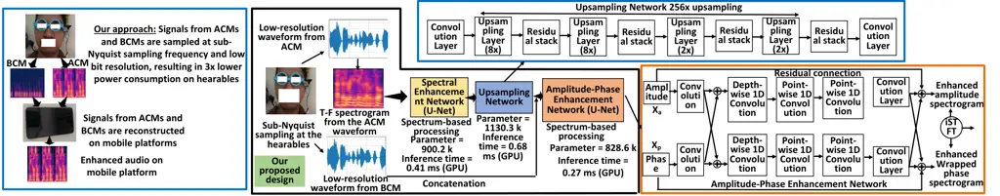
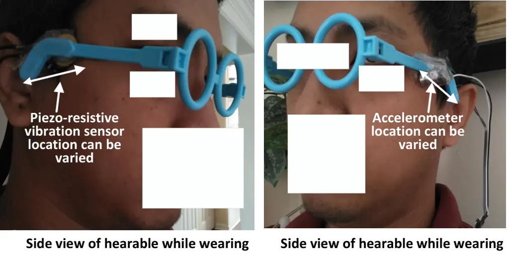

Tamiti Dipto Baja-Ricketts Vergano Barua

# CAPS: A Cascaded Reconstruction Model to Power Saving in Hearables Using Sub-Nyquist Sampling with Bandwidth Extension

Tarikul Islam    Sajid Fardin    Luke    David    Anomadarshi

###### Abstract

Hearables are wearable computers worn on the ear. Bone conduction
microphones are used with air conduction microphones in hearables for
multimodal speech enhancement in noisy conditions. Despite this
potential, current models largely fail to explore how jointly reducing
sampling bit resolution and sampling frequency in analog-to-digital
converters (ADCs) of hearables impacts both power usage and audio
quality. Furthermore, current frameworks cannot do sub-Nyquist sampling
in hearables because they lack a method to reconstruct wideband signals
from narrowband components. We therefore propose CAPS, which (i)
intentionally employs sub-Nyquist sampling and low bit resolution in
ADCs, achieving a 3.3x reduction in power consumption in hearables, and
(ii) supports streaming operation on mobile platforms with an inference
time of 1.36ms and a memory footprint of 11.04MB. CAPS ensures robust
speech intelligibility in real-world settings, bridging the gap between
efficiency and power savings.

###### keywords

hearables, sub-Nyquist sampling, low-power.

^(†)^(†)address: Cyber-Security Engineering, George Mason University,
USA

## 1 Introduction

A hearable is a wearable computer that is worn on the ear.
Traditionally, air conduction microphones (ACMs) are used in hearables
that are prone to background noise. To solve this problem, bone
conduction microphones (BCMs) are commonly used with ACMs as a
conditional signal enhancer for multimodal speech enhancement (SE) in
noisy conditions \[1, 2, 3\]. However, no SE models considers the
following practical aspects of low-power and low-memory applications in
hearables:

1. Lowering sampling frequency and bit resolution: Audio or vibration
   signals from ACMs and BCMs, respectively, are first sampled at Nyquist
   rates (greater than 16 kHz) and over 12-bit resolutions by the
   analog-to-digital converter (ADC). After sampling, audio codecs compress
   data to reduce the bitrate, saving transmission energy and bandwidth.
   Later, multimodal SE algorithms are applied on the decompressed data on
   connected mobile platforms (i.e., cell phones, see Fig. 1 (Left)).
   However, they do not explore how lowering the sampling frequency and bit
   resolutions in ADCs of hearables jointly impact low-power processing and
   multimodal SE.

2. Lacking in multimodal SE methods: State-of-the-art (SOTA) multimodal
   SE methods \[4, 5, 6, 7, 1, 8, 2, 9, 10, 11, 12, 13, 14, 15, 16, 4, 7,
   17\] have either one or multiple of the following limitations for which
   they are not suitable for our low-power hearables: (i) The multimodal SE
   algorithms do not consider lower bit resolution and low power
   applications in their frameworks. And, (ii) The joint bandwidth
   extension (BWE) and SE models are typically evaluated for single
   modality (i.e., audio only) and have not been extended to multimodality
   (see summary of limitations in rcent works in Table 1).

In this paper, we propose CAPS, which jointly reduces the sampling
frequency to the sub-Nyquist range with lower bit resolutions to reduce
power consumption in hearables and later reconstructs the
high-resolution audio in mobile platforms (see Fig. 1 (Left)). CAPS
jointly leverages BWE with multimodal SE by reducing the sampling
frequency and bit resolution from {24 kHz, 12-bit} to {4 kHz, 8-bit} and
achieves a 3.31x reduction in power consumption, ideally increasing the
battery life by $`\sim`$3.31x for hearables. CAPS is evaluated on both
speech and music datasets against six baselines and achieves better
performance under noisy conditions with the lowest inference time of
55.11 ms on a mobile platform (i.e., Google Pixel7), which is smaller
than the 150 ms threshold set by the International Telecommunication
Union \[18\], indicating its capability of streaming from hearables to
mobile platforms. The above results are further verified by using the
Galaxy S21.

|                                                                                                                               |     |                 |                |
| ----------------------------------------------------------------------------------------------------------------------------- | --- | --------------- | -------------- |
| Model name                                                                                                                    | BWE | Single-Modal SE | Multi-modal SE |
| ATS-UNet \[8\], TFiLM \[15\], AFiLM \[16\], TRAMBA \[1\], AERO \[9\], EBEN \[10\], HiFi++ \[17\], NVSR \[11\], NU-Wave \[13\] | ✓   | ✓               | ✗              |
| ClearSpeech \[4\], VibVoice \[7\]                                                                                             | ✗   | ✗               | ✓              |
| SEANet \[2\]                                                                                                                  | ✗   | ✓               | ✓              |
| Proposed                                                                                                                      | ✓   | ✓               | ✓              |

Table 1: A summary of limitations in recent works.

Figure 1: (Left) Overview of our appraoch. (Middle & Right) Our proposed
design and different modules – UN & APEN – of CAPS.

## 2 Preliminary

### 2.1 Power at Sub-Nyquist Frequencies and Bit Resolutions

The power consumption $`P`$ of ADCs in hearables increases with sampling
rates and resolutions, following $`P=k\cdot f_{s}\cdot 2^{N}`$, where
$`k`$ is a proportionality constant, $`N`$ is the bit resolution, and
$`f_{s}`$ is the sampling frequency of ADCs. Traditional methods require
ADCs to operate at high sampling frequencies (i.e., $`>`$16 kHz) and bit
resolution (i.e., 12-24 bits) to accurately capture wideband audio in
hearables. However, lowering sampling frequencies and bit resolution
offers a powerful approach to reducing energy consumption in low-power
applications like hearables.

To support this claim, we conduct experiments with an ACM (i.e., part
$`\#`$ B&K Type 4192 \[19\]) and an in-built ADC of NRF52840 \[20\]. We
get a relative power savings of 2.45x between {16 kHz, 12-bits} vs {4
kHz, 8 bits} computations. The power savings will be even greater for
high-fidelity hearables, which use 22 kHz and 24-bit resolutions. CAPS
considers the impact of the low bit resolution in BWE algorithms to save
power in hearables that is completely absent in SOTA research.

## 3 Architecture Design

CAPS is engineered to achieve the following objectives:

- •
  CAPS will enable streaming enhancement and low-power and low-memory
  solutions that will make CAPS deployable on mobile platforms.
- •
  CAPS will handle dynamic interferences from extremely noisy conditions
  in mobile scenarios using joint BWE and multimodal SE algorithms and
  reconstruct audio from low sampling frequency and bit resolutions.

CAPS adopts a cascaded model (Fig. 1 (Middle & Right)).

### 3.1 Spectral Enhancement Network (SEN)

The low-resolution (e.g., sampled at 4 kHz) and noisy audio from the ACM
is first converted to a 2D T-F spectrogram and is given as input to the
spectral enhancement network (SEN) (see Fig. 1). The SEN is designed to
extract features from the spectrogram at the frame level and convert it
to its high-resolution version. The idea is to simplify the task for the
remaining part of CAPS that should transform this 2D representation to a
1D sequence for waveform-based processing.

The SEN is a 2D convolutional U-Net framework with 5 residual layers as
encoders (E), 5 residual layers as decoders (D), and a Mamba \[21\]
block as the bottleneck. Each residual layer includes batch
normalization followed by leaky ReLU activations (see Table 2 for
details). Dilations are used to enlarge the receptive fields, capturing
local features over a dilated window and modeling inter-phoneme
dependencies in audio signals. The Mamba block in the bottleneck
captures global correlations among consecutive phonemes from the
spectrogram. Because Mamba is a sequence modeling architecture
originally designed for 1D sequences, we adapt it to the 2D bottleneck
by flattening the spatial dimensions into a sequence, applying Mamba,
and then reshaping back. Moreover, Mamba has linear-time inference
complexity compared to the quadratic complexity of Transformers, making
it well suited for fast inference in low-power applications such as
hearables.

|             |     |     |     |     |     |     |     |     |     |     |        |          |
| ----------- | --- | --- | --- | --- | --- | --- | --- | --- | --- | --- | ------ | -------- |
|             | SEN |     |     |     |     |     |     |     |     |     | APEN   |          |
| Layer       | E1  | E2  | E3  | E4  | E5  | D1  | D2  | D3  | D4  | D5  | Conv1D | DWConv1D |
| Kernels     | 8   | 16  | 24  | 32  | 64  | 64  | 32  | 24  | 16  | 8   | 512    | 512      |
| Kernel size | 4x4 | 4x4 | 4x4 | 4x4 | 4x4 | 4x4 | 4x4 | 4x4 | 4x4 | 4x4 | 7x1    | 7x1      |
| Dilation    | 1   | 1   | 2   | 3   | 5   |     |     |     |     |     | 1      | 1        |

Table 2: The details of the SEN and APEN.

### 3.2 Upsampling Network (UN)

The upsampling network (UN) converts the spectrum to its equivalent
waveform-based signals and is inspired by version 2 of HiFi-GAN \[22\].
The UN has multiple upsampling layers, which have transposed
convolutions with kernel size twice the stride, achieving an overall
256× increase in resolution through 4 stages (8×, 8×, 2×, and 2×). Each
upsampling layer is followed by a residual block comprising 3 dilated
convolutions with dilation rates of 1, 3, and 9 and kernel size 3,
yielding an effective receptive field of 27 timesteps. Stacking dilated
convolutions expands the receptive field exponentially, enabling the
model to capture long-range temporal dependencies. Leaky ReLU is applied
after each dilated convolution for stable training.

### 3.3 Amplitude-Phase Enhancement Network (APEN)

Amplitude-Phase Enhancement Network (APEN) is designed to fuse features
from both the acoustic (i.e., ACM) and vibration (i.e., BCM) modalities
and to remove artifacts and noise in both the amplitude and phase
domains from the output waveform in a learnable way. As signals from
BCMs are less noisy compared to the signals from ACMs, the enhanced
signals of ACMs from the SEN are further improved using the less noisy
signal of BCMs by the APEN. Specifically, the 1D sequences from the
upsampling network are concatenated with the noisy 1D waveform from
BCMs. This module helps to generate a clean phase from the noisy phase
for the successful reconstruction of audio signals in extremely noisy
conditions (see Fig. 1).

The waveform from the UN is first processed by a short-time Fourier
transform (STFT), producing an amplitude spectrum
$`X_{a}\in\mathbb{R}^{T\times F}`$ and a wrapped phase spectrum
$`X_{p}\in\mathbb{R}^{T\times F}`$, where $`T=125`$ and $`F=513`$ denote
the numbers of temporal frames and frequency bins, respectively. The
amplitude $`X_{a}`$ and phase $`X_{p}`$ streams use identical networks
consisting of a series of 1D convolution operations with mutual coupling
between the two streams. These 1D convolutions comprise a cascade of a
large-kernel depth-wise convolutional layer and a pair of point-wise
convolutional layers that expand and then restore the feature
dimensions. The depth-wise (DW) convolution is implemented with Conv1D,
and the point-wise convolution is implemented with linear layers (see
Table 2 for details). Layer normalization \[23\] and GELU activation
\[24\] are interleaved between layers. Finally, a residual connection is
added before the output to prevent gradient vanishing.

### 3.4 Loss Functions

Multi-period loss: CAPS reshapes the reconstructed 1D waveform into a 2D
representation by segmenting it based on a specific period (p) of 5 and
7 samples, denoted by $`P^{R}_{5}`$ and $`P^{R}_{7}`$, respectively.
After reshaping, the dimension of the 2D tensor is (1, T / p, p), where
T = number of audio samples. CAPS also generate $`P^{C}_{5}`$ and
$`P^{C}_{7}`$ from clean audio for the same p = {5, 7} and calculates
MAE for 2D tensors that is known as multi-period loss =
$`|\sum_{x,y}P^{C}_{5}-\sum_{x,y}P^{R}_{5}|+|\sum_{x,y}P^{C}_{7}-\sum_{x,y}P^{R}s_{7}|`$.
CAPS uses only 2 periods (i.e., p = 5 and 7) compared to 5 periods and 6
convolution layers in \[22\] to keep the network size small without
sacrificing audio quality.

Phase-spectrum loss function: Considering the phase wrapping issue
\[25\], CAPS proposes instantaneous phase and group delay anti-wrapping
loss as $`\frac{1}{TF}\sum^{TF}|f_{AW}(Y^{C}_{P}-Y^{R}_{P})|`$ and
$`\frac{1}{TF}\sum^{TF}|f_{AW}(Y^{C}_{GD}-Y^{R}_{GD})|`$, respectively.
Here, {$`Y^{C}_{P}`$, $`Y^{C}_{GD}`$} and {$`Y^{R}_{P}`$,
$`Y^{R}_{GD}`$} are the instantaneous phase and group delay for the
clean and reconstructed audio, respectively. The group delay
$`Y^{C}_{GD}`$ and $`Y^{E}_{GD}`$ are calculated by taking
differentiation along the frequency axis of the T-F spectrogram. The
$`f_{AW}(x)`$ denotes the anti-wrapping function, which is defined as:
$`f_{AW}(x)=|x-2\pi\cdot\text{round}(\frac{x}{2\pi})|,x\in\mathbb{R}`$.

Multi-scale loss: Inspired by MelGAN \[26\], CAPS uses a multi-scale
(MS) loss where mean absolute error (MAE) is calculated among clean and
reconstructed audio for three downsampling ratio - 1x, 2x, and 4x,
expressed by
$`\frac{1}{3}\sum|D^{C}_{1}-D^{R}_{1}|+|D^{C}_{2}-D^{R}_{2}|+|D^{C}_{3}-D^{R}_{3}|`$,
where $`D^{C}_{n}`$ and $`D^{R}_{n}`$ denotes clean and reconstructed
audio and $`n`$=3.

## 4 Implementation

### 4.1 Wearable Platform and Mobile Platform Design

We use a piezo-resistive vibration sensor (part# CEB-27032-L100) \[27\]
and an accelerometer (part# 352C33) \[28\] as BCMs, placed on an
off-the-shelf frame for collecting vibration near the earbone (see Fig.
2). We use the built-in ADC from the NRF52840 chip to sample the signals
from the BCMs and transmit them over Bluetooth to a mobile platform.
This helps us to vary the sampling frequency from 4 kHz to 22 kHz and
ADC bit resolution (8 to 12 bits) while sampling from BCMs.

Figure 2: A prototype of hearable.

As our low-resolution audio sampled from BCMs will go through joint BWE
and multimodal SE in a mobile platform, we choose Google Pixel7 having
the Google Tensor G2 chipset and Mali-G710 MP7 GPUs as the mobile
platform.

### 4.2 Dataset Collection

Although there are a few datasets \[29, 3\] available for multimodal SE,
they don’t have simultaneous data from both vibration and accelerometer
sensors with microphones at different ADC bit resolutions. Therefore, we
ask 20 persons (11 males and 9 females, age: 18-36) for data collection
for 45 minutes from the ACM and the two BCMs simultaneously at a 22 kHz
sampling frequency for 3 different bit resolutions - 12, 10, and 8 bits.
We select text from the VCTK dataset \[30\], which contains a variety of
dialogues. For this purpose, we convert the VCTK audio to text using
Whisper \[31\]. We apply a high-pass filter with a cut-off frequency of
5 Hz to remove any body movement.

Two noise sources - non-speech and speech noise - in -7 to 5 dB are
used. For non-speech noises, we choose from a diverse set of noise types
from \[32\]. For speech noises, we employ speech samples from
Librispeech from different speakers.

### 4.3 Model Training

The key training parameters include a batch size of 8 with $`\sim`$50
epochs, and the Adam optimizer with a learning rate of
$`1\times 10^{-4}`$, weight decay of $`1\times 10^{-5}`$, and momentum
parameters $`\beta_{1}=0.5`$ and $`\beta_{2}=0.999`$. The learning rate
is scheduled using cosine annealing warm restarts (with $`T_{0}=10`$ and
$`T_{\text{mult}}=1`$), gradient clipping (max norm of 10), and gradient
accumulation (over 2 batches) to ensure stability. Training is first
executed on a desktop with a 4090 GPU with Intel(R) Silver 4310 CPU.

Preparing to evaluate on Google Pixel7: To evaluate the model on the
Google Pixel7, we perform several additional steps. Training is first
conducted in PyTorch on the desktop. The trained PyTorch model is then
exported to ONNX and converted to TensorFlow Lite (TFLite) via
ONNX-TensorFlow \[33\] on the desktop. Next, the TFLite model is
integrated into the TensorFlow Lite Android API. Finally, we run the
TFLite model using the TFLite GPU Delegate on the Google Pixel7 to
leverage the Pixel’s Mali GPU.

### 4.4 Evaluation Metrics

To comprehensively evaluate in terms of intelligibility, fidelity, and
perceived quality, we use Log-Spectral Distance (LSD), Short-Time
Objective Intelligibility (STOI), Perceptual Evaluation of Speech
Quality (PESQ), Scale-Invariant Signal-to-Distortion Ratio (SI-SDR),
Non-Intrusive Speech Quality Assessment - Mean Opinion Score
(NISQA-MOS), and Virtual Speech Quality Objective Listener (VISQOL).

### 4.5 Base Models

We compare six base models. Two (TFiLM, VibVoice) of the models are pure
U-Net based, and four (SEANet, AERO, EBEN, HiFi++) are pure GAN based.

## 5 Performance Evaluation

### 5.1 Real-Time BWE and Multimodel SE with Inference

Please note that VibVoice and SEANet are multimodal SE models by
default, whereas TFiLM, AERO, EBEN, and HiFi++ are single-modal SE
models. To compare CAPS with the single-modal SE models, we convert our
multimodal CAPS into a single-modal model by using a single-input
network (i.e., we do not feed the BCM to the APEN) and name this version
CAPS-single. To diversify the evaluation, we introduce the music dataset
MagnaTagATune \[34\]. The results are shown in Table 3 for 4–16 kHz BWE
with noisy data at 12-bit ADC resolution for the vibration sensor on the
desktop only.

|                |           |           |           |         |             |                  |                |                |                |                |                 |
| -------------- | --------- | --------- | --------- | ------- | ----------- | ---------------- | -------------- | -------------- | -------------- | -------------- | --------------- |
| Model          | FLOPs (G) | Param (M) | Size (MB) | Dataset | Infer. (ms) | L $`\downarrow`$ | V $`\uparrow`$ | N $`\uparrow`$ | S $`\uparrow`$ | P $`\uparrow`$ | ST $`\uparrow`$ |
| Unprocessed    |           |           |           | VCTK    |             | 2.78             | 1.84           | 1.27           | 8.54           | 1.11           | 0.79            |
|                |           |           |           | Magna   |             | 2.85             | 1.62           | 1.21           | 7.28           | 1.03           | 0.78            |
| TFiLM \[15\]   | 234.7     | 68.2      | 260.3     | VCTK    | 4.85        | 1.68             | 3.73           | 3.53           | 10.28          | 2.03           | 0.81            |
|                |           |           |           | Magna   | 4.85        | 1.70             | 3.67           | 3.46           | 9.41           | 1.99           | 0.81            |
| VibVoice \[7\] | 79.4      | 23.14     | 5.8       | VCTK    | 17.2        | 3.1              | 2.73           | 2.51           | 12.48          | 2.05           | 0.81            |
|                |           |           |           | Magna   | 17.2        | 3.28             | 2.66           | 2.43           | 11.21          | 2.01           | 0.80            |
| AERO \[9\]     | 124.8     | 36.3      | 138.7     | VCTK    | 36          | 0.97             | 4.16           | 4.03           | 17.03          | 2.93           | 0.89            |
|                |           |           |           | Magna   | 36          | 0.99             | 4.10           | 3.98           | 16.29          | 2.89           | 0.88            |
| EBEN \[10\]    | 101.4     | 29.7      | 113.3     | VCTK    | 12.7        | 1.15             | 3.78           | 3.65           | 14.23          | 2.57           | 0.84            |
|                |           |           |           | Magna   | 12.7        | 1.17             | 3.76           | 3.63           | 13.13          | 2.54           | 0.88            |
| HiFi++ \[17\]  | 250.5     | 72.2      | 259.9     | VCTK    | 6.3         | 0.89             | 4.18           | 4.11           | 17.48          | 2.85           | 0.90            |
|                |           |           |           | Magna   | 6.3         | 0.91             | 4.13           | 4.07           | 16.65          | 2.83           | 0.89            |
| SEANet \[2\]   | 225.1     | 64.9      | 240.1     | VCTK    | 9.18        | 1.39             | 3.89           | 3.78           | 14.31          | 2.43           | 0.89            |
|                |           |           |           | Magna   | 9.18        | 1.44             | 3.79           | 3.67           | 13.74          | 2.40           | 0.87            |
| CAPS           | 10.01     | 2.85      | 11.04     | VCTK    | 1.36        | 0.87             | 4.15           | 4.13           | 16.99          | 2.99           | 0.90            |
|                |           |           |           | Magna   | 1.36        | 0.88             | 4.11           | 4.10           | 16.61          | 2.92           | 0.90            |
| CAPS-          | 10.01     | 2.85      | 11.04     | VCTK    | 1.36        | 0.87             | 4.10           | 4.11           | 16.97          | 2.97           | 0.90            |
| single         |           |           |           | Magna   | 1.36        | 0.88             | 4.09           | 4.09           | 16.71          | 2.95           | 0.90            |

Table 3: BWE and multimodal SE for 12-bit resolutions on the desktop for
4 - 16 kHz upsampling with noisy data. Here, L = LSD, V = VISQOL, N =
NISQA-MOS, S = SI-SDR, P = PESQ, ST = STOI, Param = Parameter and Infer.
= Inference.

Table 3 shows that CAPS achieves better perceptual quality and
intelligibility than SOTA U-Net and GAN models on both speech and music
datasets, while having the lowest inference time (i.e., 1.36 ms), which
is 4.63x lower than HiFi++ and 27x lower than AERO (i.e., the two
best-performing models). Please note that CAPS is also the smallest
model, with 25x fewer parameters than HiFi++ and 13x fewer parameters
than AERO.

Table 4 shows the real-time performance of CAPS on both desktop and
Google Pixel7 platforms.We keep the model quantization the same for both
desktop and Pixel7 while evaluating the inference time. All the models
in Table 4 are suitable for real-time operation on the desktop, as the
inference time is lower than the audio frame (1s). Moreover, for the
streaming operation, one-way delays up to 150 ms are considered
acceptable for most user applications, including voice calls, according
to the recommendation of the International Telecommunication Union (ITU)
G.114 \[18\]. Therefore, our proposed CAPS is the only model which has
inference time smaller than 150 ms on both desktop (1.36 ms) and Pixel7
(55.11 ms), indicating its capability of streaming on both desktop and
mobile platforms.

|               |         |        |                  |               |               |               |               |                 |               |               |               |               |
| ------------- | ------- | ------ | ---------------- | ------------- | ------------- | ------------- | ------------- | --------------- | ------------- | ------------- | ------------- | ------------- |
| Model         | Device  | Infer. | Vibration sensor |               |               |               |               | Accelerometer   |               |               |               |               |
|               |         | (ms)   | L$`\downarrow`$  | V$`\uparrow`$ | N$`\uparrow`$ | S$`\uparrow`$ | P$`\uparrow`$ | L$`\downarrow`$ | V$`\uparrow`$ | N$`\uparrow`$ | S$`\uparrow`$ | P$`\uparrow`$ |
| TFiLM\[15\]   | Desktop | 4.85   | 1.68             | 3.73          | 3.53          | 10.28         | 2.03          | 1.82            | 3.47          | 3.36          | 9.58          | 1.91          |
| (U-Net)       | Pixel7  | 198    | 1.69             | 3.70          | 3.50          | 10.19         | 2.00          | 1.83            | 3.45          | 3.34          | 9.52          | 1.88          |
| VibVoice\[7\] | Desktop | 17.2   | 3.1              | 2.73          | 2.51          | 12.48         | 2.05          | 3.5             | 2.54          | 2.41          | 11.43         | 1.93          |
| (U-Net)       | Pixel7  | 707    | 3.11             | 2.70          | 2.47          | 12.45         | 2.01          | 3.48            | 2.51          | 2.38          | 11.39         | 1.90          |
| AERO\[9\]     | Desktop | 36     | 0.97             | 4.16          | 4.03          | 17.03         | 2.93          | 1.03            | 4.04          | 3.91          | 16.65         | 3.86          |
| (GAN)         | Pixel7  | 1441   | 0.98             | 4.14          | 4.01          | 16.97         | 2.89          | 1.05            | 4.01          | 3.89          | 16.57         | 3.84          |
| EBEN\[10\]    | Desktop | 12.7   | 1.15             | 3.78          | 3.65          | 14.23         | 2.57          | 1.21            | 3.58          | 3.37          | 13.27         | 2.39          |
| (GAN)         | Pixel7  | 520    | 1.17             | 3.76          | 3.63          | 14.19         | 2.56          | 1.22            | 3.54          | 3.33          | 13.21         | 2.35          |
| HiFi++\[17\]  | Desktop | 6.3    | 0.89             | 4.18          | 4.11          | 17.48         | 2.85          | 0.92            | 4.10          | 4.03          | 16.87         | 2.81          |
| (GAN)         | Pixel7  | 258    | 0.91             | 4.15          | 4.09          | 17.43         | 2.83          | 0.94            | 4.07          | 3.98          | 16.71         | 2.78          |
| CAPS          | Desktop | 1.36   | 0.87             | 4.15          | 4.13          | 16.99         | 2.99          | 0.88            | 4.12          | 4.10          | 16.65         | 2.90          |
|               | Pixel7  | 55.11  | 0.88             | 4.13          | 4.15          | 17.21         | 2.97          | 0.89            | 4.11          | 4.09          | 16.78         | 2.89          |
| CAPS-         | Desktop | 1.36   | 0.87             | 4.10          | 4.11          | 16.97         | 2.97          | 0.88            | 4.09          | 4.10          | 16.87         | 2.89          |
| single        | Pixel7  | 55.11  | 0.88             | 4.10          | 4.12          | 17.11         | 2.95          | 0.90            | 4.09          | 4.07          | 16.58         | 2.87          |

Table 4: BWE and SE for 12-bit resolutions on desktop and Google Pixel7
for 4-16 kHz upsampling with noisy data for both vibration sensor and
accelerometer.

### 5.2 Evaluation of power consumption

We now evaluate how much power can be saved by reducing the sampling
frequency and bit resolution at the hearables’ ADC, and how much
additional power is required to run CAPS on mobile platforms such as
smartphones. We vary the sampling frequency of the NRF52840 from 4 kHz
to 24 kHz at 8-bit, 10-bit, and 12-bit resolutions, and measure power
for each configuration in Table 5 with EasyDMA enabled.

|                    |                   |              |                    |
| ------------------ | ----------------- | ------------ | ------------------ |
| Sampling Rate (Hz) | Resolution (bits) | Current (µA) | Power (mW) @ 3.0 V |
| 4 kHz              | 8-bit             | 234          | 0.702              |
|                    | 10-bit            | 248          | 0.744              |
|                    | 12-bit            | 275          | 0.825              |
| 8 kHz              | 8-bit             | 319          | 0.957              |
|                    | 10-bit            | 338          | 1.014              |
|                    | 12-bit            | 375          | 1.125              |
| 16 kHz             | 8-bit             | 489          | 1 467              |
|                    | 10-bit            | 518          | 1 554              |
|                    | 12-bit            | 575          | 1 725              |
| 24 kHz             | 8-bit             | 659          | 1.977              |
|                    | 10-bit            | 698          | 2.094              |
|                    | 12-bit            | 775          | 2.325              |

Table 5: Power at different sampling and resolutions.

Table 5 indicates that if we use {4 kHz, 8-bit} sampling instead of {24
kHz, 12-bit} sampling in hearables, we can save 2.325/0.702 = 3.31x
power in hearables. That means that we can increase the battery life by
$`\sim`$3.31x for hearables. Therefore, the idea is that CAPS will
reduce the sampling frequency and bit-resolutions in hearables from {24
kHz, 12-bit} or {16 kHz, 12-bit} to {4 kHz, 8-bit} to save power in
hearables. Later, CAPS will restore the low-resolution audio from {4
kHz, 8-bit} to {24 kHz, 12-bit} or {16 kHz, 12-bit} on mobile platforms
to provide the same audio quality.

|                   |                     |                                             |               |
| ----------------- | ------------------- | ------------------------------------------- | ------------- |
| Transmission rate | Power for CAPS only | Power for different transmission rates only | Total power   |
| 64 kbps           | 1.133 W             | 3.54 mW                                     | 1.136 W       |
| 128 kbps          | 1.141 W             | 4.18 mW                                     | 1.145 W       |
| 256 kbps          | 1.177 W             | 5.98 mW                                     | 1.183 W       |
|                   |                     |                                             | Avg. = 1.15 W |

Table 6: Power in Pixel7 at different transmission rates.

The next question is how much power is needed to restore audio using
CAPS on mobile platforms. We evaluate CAPS on Google Pixel7 at different
transmission rates from hearables to Pixel7 (see Table 6). Power
increases with transmission rate because higher rates require more
computation for spectrograms and raw waveforms. The average power
consumption of $`\sim`$1.15 W for running CAPS on smartphones such as
Pixel7 is negligible compared to the 3.31x power saving in hearables,
since smartphones typically have batteries about 100x larger than
hearables. For example, Samsung Galaxy Buds2 Pro has a 50 mAh battery,
while Pixel7 has a 4355 mAh battery. The 1.15 W power consumption by
CAPS would take about 13 hours to drain Pixel7’s 4355 mAh battery, which
is trivial.

### 5.3 ADC bit resolutions and sampling frequencies

We vary the bit resolution from 8 to 12 bits for 4-16 kHz and 4-22 kHz
upsampling, and evaluate CAPS on a desktop. Table 7 shows that CAPS’s
performance degrades at low bit resolutions due to increased
quantization error during sampling. However, CAPS still outperforms the
best-performing models.

|        |     |                                 |                          |                           |                          |                         |                         |
| ------ | --- | ------------------------------- | ------------------------ | ------------------------- | ------------------------ | ----------------------- | ----------------------- |
| Model  | Bit | LSD$`\downarrow`$ (4-16k/4-22k) | VISQOL     (4-16k/4-22k) | NISQA-MOS (4-16 k/ 4-22k) | SI-SDR     (4-16k/4-22k) | PESQ      (4-16k/4-22k) | STOI      (4-16k/4-22k) |
| AERO   | 8   | 0.99/1.04                       | 4.01/3.96                | 3.91/3.80                 | 16.03/16.42              | 2.85/2.69               | 0.88/0.87               |
|        | 10  | 0.98/1.03                       | 4.10/4.06                | 3.98/3.86                 | 16.69/17.14              | 2.89/2.73               | 0.89/0.88               |
|        | 12  | 0.97/1.02                       | 4.16/4.11                | 4.03/3.90                 | 17.03/17.49              | 2.93/2.77               | 0.89/0.88               |
| HiFi++ | 8   | 0.91/93                         | 4.01/3.96                | 3.97/3.93                 | 16.28/16.14              | 2.81/2.80               | 0.89/0.88               |
|        | 10  | 0.90/0.92                       | 4.13/3.99                | 4.07/3.97                 | 16.95/16.85              | 2.83/2.82               | 0.89/0.88               |
|        | 12  | 0.89/0.91                       | 4.18/4.05                | 4.11/4.01                 | 17.48/17.29              | 2.85/2.84               | 0.90/0.89               |
| CAPS   | 8   | 0.88/0.89                       | 4.09/3.95                | 4.05/3.99                 | 16.84/16.71              | 2.93/2.91               | 0.90/0.89               |
|        | 10  | 0.87/0.88                       | 4.11/3.99                | 4.09/3.97                 | 16.89/16.77              | 2.96/2.95               | 0.90/0.90               |
|        | 12  | 0.87/0.88                       | 4.15/4.01                | 4.13/4.01                 | 16.99/16.75              | 2.99/2.97               | 0.90/0.90               |

Table 7: Evaluating SE for 8, 10, and 12-bit ADC resolutions on the
desktop for 4 - 16 kHz and 4 - 22 kHz upsampling with noisy data for the
vibration sensor.

### 5.4 Evaluation at other mobile platforms

To generalize, we evaluate CAPS on Samsung Galaxy S21 also (see Table
8). The inference speed on the S21 is 1.51x slower than Pixel7, because
of Pixel7’s custom tensor processing unit (TPU) in its Tensor G2
chipset. The evaluation metrics are similar to Pixel7, as both the
Pixel7 and Galaxy S21 use the same CAPS model with the same quantization
(float 32).

|       |            |                |           |            |                 |                |                 |
| ----- | ---------- | -------------- | --------- | ---------- | --------------- | -------------- | --------------- |
| Model | Platform   | ADC resolution | Inference | Avg. Power | L$`\downarrow`$ | P $`\uparrow`$ | ST $`\uparrow`$ |
| CAPS  | Pixel7     | 12-bit         | 55.11 ms  | 1.15 W     | 0.84            | 2.99           | 0.90            |
|       | Galaxy S21 | 12-bit         | 84.3 ms   | 1.22 W     | 0.84            | 2.96           | 0.90            |

Table 8: Evaluation at two different mobile platforms.

### 5.5 Ablation study on the model components

Table 9 shows that replacing Mamba in the SEN yields similar performance
metrics. However, the training time increases significantly from 212 s
to 369 s per epoch, and the number of parameters increases slightly from
2.85 M to 2.98 M. Therefore, we keep Mamba in our design as Mamba
provides similar performance with a shorter training time and smaller
parameters. We can see from Table 9 that the APEN is an important
component, as its absence notably degrades the model performance for all
metrics. The reason behind this is that the APEN improves the
low-resolution spectral and phase information in noisy conditions.
Moreover, the multi-period loss function is critical as it works in the
time domain and facilitates learning low-resolution to high-resolution
mapping effectively.

|                                            |                  |                |                |                 |           |                      |
| ------------------------------------------ | ---------------- | -------------- | -------------- | --------------- | --------- | -------------------- |
| Method                                     | L $`\downarrow`$ | S $`\uparrow`$ | P $`\uparrow`$ | ST $`\uparrow`$ | Parameter | Train time per epoch |
| CAPS                                       | 0.87             | 16.99          | 2.99           | 0.90            | 2.85 M    | 212 s                |
| Replace Mamba with Transformers in the SEN | 0.85             | 17.12          | 3.03           | 0.90            | 2.98 M    | 369 s                |
| without APEN                               | 1.32             | 7.12           | 1.95           | 0.79            | 2.0214 M  | 135 s                |
| without multi-period loss                  | 0.84             | 15.94          | 2.50           | 0.81            | 3.61 M    | 212 s                |

Table 9: Ablation study for 4 - 16 kHz and 12-bit resolutions.

### 5.6 Subjective Analysis

We conduct a mean opinion score (MOS) across 4-22 kHz extension for
8-bit resolution with 12 volunteers and get an average of 4.3 MOS on a
scale from 1 (bad) to 5 (best). This provides strong evidence that CAPS
consistently generates perceptually higher quality audio, favored by a
wide range of listeners.

## 6 Conclusion and Limitation

The low latency of CAPS while performing joint BWE and multimodal SE
enables streaming enhancement, low power, and low memory solutions,
making CAPS deployable on mobile platforms. Therefore, CAPS is designed
to meet the high demands of smart hearables in low-power and real-world
usage by bridging the gap between power and the performance of current
technologies. However, this work does not consider any encryption of the
sampled audio before transmission to the mobile platform from the
hearables. Moreover, we do not include any codec while evaluating its
performance, power, and efficiency.

## 7 Generative AI Use Disclosure

We acknowledge that we have used Elicit for finding relevant papers, and
used ChatGPT for debugging codes, and finding grammatical errors

## References

- \[1\] Y. Sui, M. Zhao, J. Xia, X. Jiang, and S. Xia (2024) Tramba: a
  hybrid transformer and mamba architecture for practical audio and bone
  conduction speech super resolution and enhancement on mobile and
  wearable platforms. Proceedings of the ACM on Interactive, Mobile,
  Wearable and Ubiquitous Technologies 8 (4), pp. 1–29. Cited by: Table
  1, §1, §1.
- \[2\] M. Tagliasacchi, Y. Li, K. Misiunas, and D. Roblek (2020)
  SEANet: a multi-modal speech enhancement network. arXiv preprint
  arXiv:2009.02095. Cited by: Table 1, §1, §1, Table 3.
- \[3\] M. Wang, J. Chen, X. Zhang, and S. Rahardja (2022) End-to-end
  multi-modal speech recognition on an air and bone conducted speech
  corpus. IEEE/ACM Transactions on Audio, Speech, and Language
  Processing 31, pp. 513–524. Cited by: §1, §4.2.
- \[4\] D. Ma, T. Dang, M. Ding, and R. K. Balan (2023) ClearSpeech:
  improving voice quality of earbuds using both in-ear and out-ear
  microphones. Proceedings of the ACM on Interactive, Mobile, Wearable
  and Ubiquitous Technologies 7 (4), pp. 170:1–170:25. External Links:
  [Document](https://dx.doi.org/10.1145/3631409) Cited by: Table 1, §1.
- \[5\] F. Han, P. Yang, Y. Zuo, F. Shang, F. Xu, and X. Li (2024)
  EarSpeech: exploring in-ear occlusion effect on earphones for
  data-efficient airborne speech enhancement. Proceedings of the ACM on
  Interactive, Mobile, Wearable and Ubiquitous Technologies 8 (3),
  pp. 104:1–104:30. External Links:
  [Document](https://dx.doi.org/10.1145/3678594),
  [Link](https://doi.org/10.1145/3678594) Cited by: §1.
- \[6\] Q. Zhang, K. Guo, Y. Yang, and D. Wang (2025) WearSE: enabling
  streaming speech enhancement on eyewear using acoustic sensing.
  Proceedings of the ACM on Interactive, Mobile, Wearable and Ubiquitous
  Technologies 9 (1), pp. 1–30. Cited by: §1.
- \[7\] L. He, H. Hou, S. Shi, X. Shuai, and Z. Yan (2023) VibVoice:
  towards bone-conducted vibration speech enhancement on head-mounted
  wearables. In Proceedings of the 21st ACM International Conference on
  Mobile Systems, Applications and Services, pp. 356–369. Cited by:
  Table 1, §1, Table 3, Table 4.
- \[8\] Y. Li, Y. Wang, X. Liu, Y. Shi, S. Patel, and S. Shih (2022)
  Enabling real-time on-chip audio super resolution for bone-conduction
  microphones. Sensors 23 (1), pp. 35. Cited by: Table 1, §1.
- \[9\] M. Mandel, O. Tal, and Y. Adi (2023) Aero: audio super
  resolution in the spectral domain. In ICASSP 2023-2023 IEEE
  International Conference on Acoustics, Speech and Signal Processing
  (ICASSP), pp. 1–5. Cited by: Table 1, §1, Table 3, Table 4.
- \[10\] J. Hauret, T. Joubaud, V. Zimpfer, and É. Bavu (2023) EBEN:
  extreme bandwidth extension network applied to speech signals captured
  with noise-resilient body-conduction microphones. In ICASSP 2023 -
  2023 IEEE International Conference on Acoustics, Speech and Signal
  Processing (ICASSP), pp. 1–5. External Links:
  [Document](https://dx.doi.org/10.1109/ICASSP49357.2023.10096301) Cited
  by: Table 1, §1, Table 3, Table 4.
- \[11\] H. Liu, W. Choi, X. Liu, Q. Kong, Q. Tian, and D. Wang (2022)
  Neural vocoder is all you need for speech super-resolution. In
  Interspeech, Cited by: Table 1, §1.
- \[12\] J. Ho, A. Jain, and P. Abbeel (2020) Denoising diffusion
  probabilistic models. Advances in neural information processing
  systems 33, pp. 6840–6851. Cited by: §1.
- \[13\] J. Lee and S. Han (2021) NU-wave: a diffusion probabilistic
  model for neural audio upsampling. In Interspeech 2021, pp. 1634–1638.
  External Links:
  [Document](https://dx.doi.org/10.21437/Interspeech.2021-36), ISSN
  2958-1796 Cited by: Table 1, §1.
- \[14\] S. Han and J. Lee (2022) NU-wave 2: a general neural audio
  upsampling model for various sampling rates. In Interspeech 2022,
  pp. 4401–4405. External Links:
  [Document](https://dx.doi.org/10.21437/Interspeech.2022-45), ISSN
  2958-1796 Cited by: §1.
- \[15\] S. Birnbaum, V. Kuleshov, Z. Enam, P. W. W. Koh, and S.
  Ermon (2019) Temporal film: capturing long-range sequence dependencies
  with feature-wise modulations.. Advances in Neural Information
  Processing Systems 32. Cited by: Table 1, §1, Table 3, Table 4.
- \[16\] N. C. Rakotonirina (2021) Self-attention for audio
  super-resolution. In 2021 IEEE 31st International Workshop on Machine
  Learning for Signal Processing (MLSP), pp. 1–6. Cited by: Table 1, §1.
- \[17\] W. Kim, H. Kang, Y. Kim, K. Jung, J. S. Lee, and S. Lee (2023)
  HiFi++: towards perceptually enhanced and computationally efficient
  neural vocoders. In Proc. Interspeech, pp. 4374–4378. Cited by: Table
  1, §1, Table 3, Table 4.
- \[18\] International Telecommunication Union (2003) Recommendation
  G.114: One-way transmission time. Note:
  [https://www.itu.int/rec/T-REC-G.114](https://www.itu.int/rec/T-REC-G.114)Accessed:
  2025-04-10 Cited by: §1, §5.1.
- \[19\] Brüel & Kjær Sound & Vibration Measurement A/S (2002) Type
  4192: 1/2” Pressure-field Microphone – High Sensitivity. Note:
  [https://www.bksv.com/en/transducers/microphones/microphone-cartridges/4192](https://www.bksv.com/en/transducers/microphones/microphone-cartridges/4192)Accessed:
  2025-04-10 Cited by: §2.1.
- \[20\] N. Semiconductor (2018) NRF52840 product specification v1.1.
  Note:
  [https://infocenter.nordicsemi.com/pdf/nRF52840_PS_v1.1.pdf](https://infocenter.nordicsemi.com/pdf/nRF52840_PS_v1.1.pdf)Accessed:
  2025-04-26 Cited by: §2.1.
- \[21\] A. Gu and T. Dao (2023) Mamba: linear-time sequence modeling
  with selective state spaces. arXiv preprint arXiv:2312.00752. Cited
  by: §3.1.
- \[22\] J. Kong, J. Kim, and J. Bae (2020) Hifi-gan: generative
  adversarial networks for efficient and high fidelity speech synthesis.
  Advances in neural information processing systems 33, pp. 17022–17033.
  Cited by: §3.2, §3.4.
- \[23\] J. L. Ba, J. R. Kiros, and G. E. Hinton (2016) Layer
  normalization. arXiv preprint arXiv:1607.06450. Cited by: §3.3.
- \[24\] D. Hendrycks and K. Gimpel (2016) Gaussian error linear units
  (gelus). arXiv preprint arXiv:1606.08415. Cited by: §3.3.
- \[25\] Y. Ai and Z. Ling (2023) Neural speech phase prediction based
  on parallel estimation architecture and anti-wrapping losses. In
  ICASSP 2023-2023 IEEE International Conference on Acoustics, Speech
  and Signal Processing (ICASSP), pp. 1–5. Cited by: §3.4.
- \[26\] K. Kumar, R. Kumar, T. De Boissiere, L. Gestin, W. Z. Teoh, J.
  Sotelo, A. De Brebisson, Y. Bengio, and A. C. Courville (2019) Melgan:
  generative adversarial networks for conditional waveform synthesis.
  Advances in neural information processing systems 32. Cited by: §3.4.
- \[27\] CUI Devices (2023) CEB-27032-L100: Contact Microphone. Note:
  [https://www.cuidevices.com/product/audio/speakers/contact-microphones/ceb-27032-l100](https://www.cuidevices.com/product/audio/speakers/contact-microphones/ceb-27032-l100)Accessed:
  2025-04-10 Cited by: §4.1.
- \[28\] PCB Piezotronics, Inc. (2024) 352C33: ICP® Quartz Shear
  Accelerometer. Note:
  [https://www.pcb.com/products?m=352C33](https://www.pcb.com/products?m=352C33)Accessed:
  2025-04-10 Cited by: §4.1.
- \[29\] J. Hauret, M. Olivier, T. Joubaud, C. Langrenne, S. Poirée, V.
  Zimpfer, and É. Bavu (2024) Vibravox: a dataset of french speech
  captured with body-conduction audio sensors. arXiv preprint
  arXiv:2407.11828. Cited by: §4.2.
- \[30\] J. Yamagishi, C. Veaux, K. MacDonald, et al. (2019) CSTR vctk
  corpus: english multi-speaker corpus for cstr voice cloning toolkit
  (version 0.92). University of Edinburgh. The Centre for Speech
  Technology Research (CSTR), pp. 271–350. Cited by: §4.2.
- \[31\] A. Radford, J. W. Kim, T. Xu, G. Brockman, C. McLeavey, and I.
  Sutskever (2022) Whisper: robust speech recognition via large-scale
  weak supervision. Note:
  [https://github.com/openai/whisper](https://github.com/openai/whisper)OpenAI
  Technical Report Cited by: §4.2.
- \[32\] F. Font, G. Roma, and X. Serra (2013) Freesound technical demo.
  In Proceedings of the 21st ACM international conference on Multimedia,
  pp. 411–412. Cited by: §4.2.
- \[33\] O. Community (2024) ONNX-tensorflow: open neural network
  exchange (onnx) backend for tensorflow. Note:
  [https://github.com/onnx/onnx-tensorflow](https://github.com/onnx/onnx-tensorflow)GitHub
  repository Cited by: §4.3.
- \[34\] E. Law, M. West, M. Mandel, M. Bay, and J. S. Downie (2009)
  Evaluation of algorithms using games: the case of music tagging. In
  Proceedings of the 10th International Society for Music Information
  Retrieval Conference (ISMIR), Cited by: §5.1.
