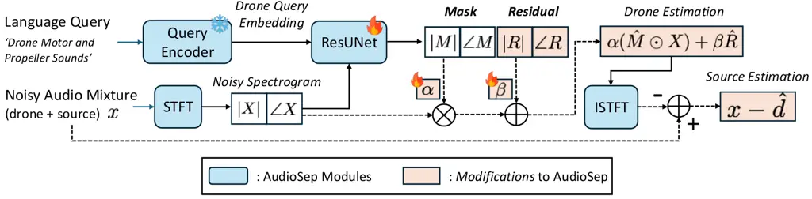
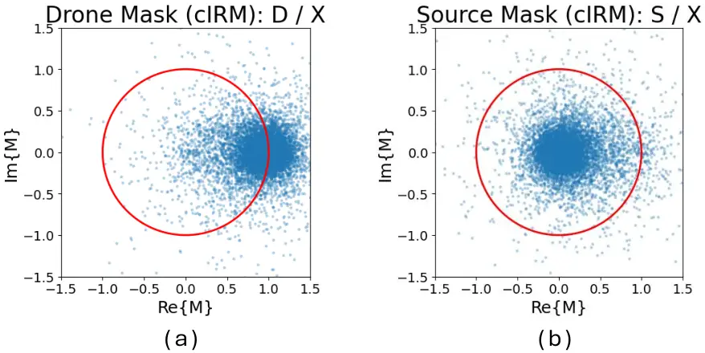
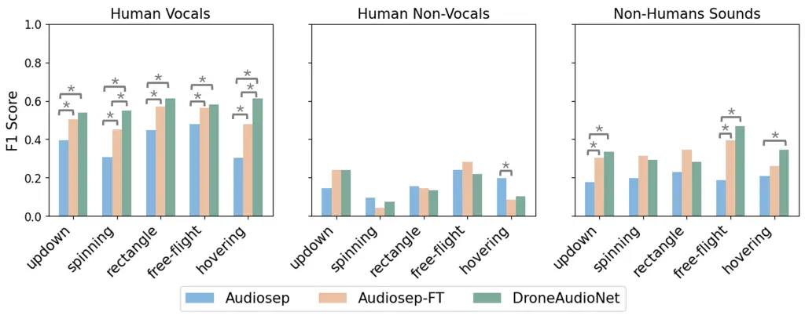
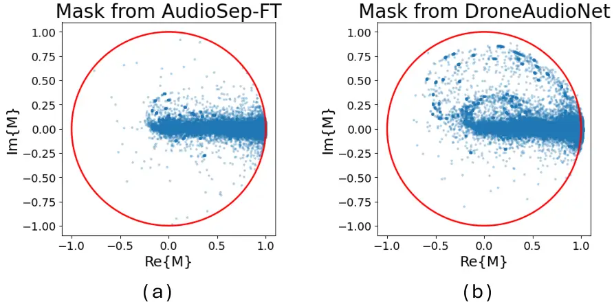
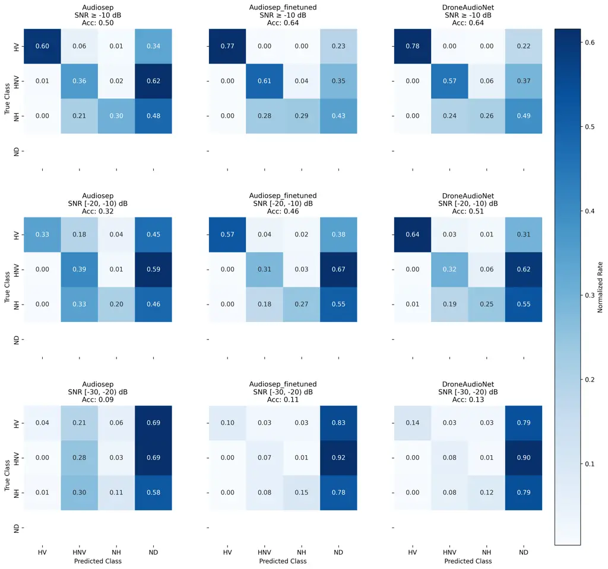

# DroneAudioNet: Noise Suppression for Drone Audition-based Search and Rescue

Chitralekha Gupta^(\*)    Soundarya Ramesh^(\*)    Yifei Luo    Suranga
Nanayakkara Affiliation: ^(\*)Equal contribution Affiliation: School of
Computing, National University of Singapore Affiliation: {chitralekha,
soundarya, yifei, suranga}@ahlab.org

###### Abstract

Microphones mounted on UAVs enable aerial acoustic scene analysis
applications such as search-and-rescue, wildlife monitoring, and
industrial inspection. However, drone rotor noise often dominates the
mixture signal at SNRs well below -10 dB, making source recovery
extremely challenging. Existing enhancement and source separation
methods are typically designed for near-balanced mixtures and degrade
substantially in drone audition settings. In this work, we propose
DroneAudioNet, a drone noise suppression method that reframes a source
separation model as a drone noise estimator. To better model
drone-dominant mixtures, we introduce a learnable mask-scaling mechanism
that allows mask magnitudes beyond unity, together with an additive
residual correction term for improved drone estimation and source
recovery. We train and evaluate our model on a publicly available drone
audition dataset and test generalizability on an out-of-domain dataset
with unseen drone hardware and flight modes. Results show that
DroneAudioNet consistently improves downstream sound classification
performance, with the largest gains observed for human vocal sounds. Our
findings demonstrate the importance of drone-specific modeling for
robust aerial acoustic perception and highlight the potential of source
separation methods for real-world drone-assisted search-and-rescue.

   

|     |
| --- |
|     |

## 1 Introduction

Microphones mounted on UAVs open up a range of aerial acoustic scene
analysis applications, including search-and-rescue, wildlife monitoring,
and industrial inspection, by providing an elevated acoustic vantage
point. The main challenge, however, is the drone itself: rotor blades
generate intense, time-varying noise comprising harmonics of the
blade-passing frequency and broadband turbulence, often overwhelming
ambient sounds of interest by 10–20 dB Deleforge (2020);
Martinez-Carranza and Rascon (2020). Existing enhancement and separation
approaches, whether speech enhancement pipelines Lu et al. (2023) or
universal source separation models such as USS Kong et al. (2023) and
AudioSep Liu et al. (2024), are primarily developed for near-balanced
mixtures (typically SNR $`>-5`$ dB) and degrade substantially in these
extreme low-SNR conditions.

A key property of this problem, however, works in the practitioner’s
favour: unlike generic noise suppression, the interference type is
known. Rotor noise has a well-defined physical origin, structured
harmonic content, and characteristic phase evolution Deleforge (2020).
Rather than estimating an unknown target source directly, we can instead
explicitly model the drone noise and subtract it from the mixture,
leaving the residual ambient signal intact regardless of its semantic
category. This formulation is especially attractive in drone audition,
where the target sounds may be open-domain and highly heterogeneous,
ranging from speech and screams to environmental and mechanical events.

While recent source separation models such as AudioSep Liu et al. (2024)
demonstrate strong performance across diverse audio domains, directly
applying them to drone noise suppression remains challenging. Unlike
typical source separation settings where sources have comparable energy,
drone audition often involves extremely low-SNR mixtures in which drone
noise dominates weak target sounds. In such conditions, conventional
mask-based separation methods can systematically underestimate the drone
component due to their bounded mask formulation Kong et al. (2023); Chen
et al. (2022); Liu et al. (2024). To address this, we propose
DroneAudioNet, which reframes AudioSep as a drone noise estimator, and
introduces architectural modifications tailored to the acoustic
characteristics of drone noise. Specifically, DroneAudioNet incorporates
a learnable mask-scaling mechanism that allows mask magnitudes beyond
unity, along with an additive residual correction term for improved
drone estimation and source recovery.

DroneAudioNet achieves significant gains through its relaxed mask
parameterization and additive residual correction, with the largest
improvements (10.6% relative increase in source classification over the
best baseline) observed for human vocal sounds under severe drone
interference (SNR between -20 to -10 dB). Evaluations on the
out-of-domain dataset demonstrate that DroneAudioNet generalizes
effectively to unseen drones and flight modes, particularly for vocal
sounds such as speech and cries.

We make three contributions. First, we propose DroneAudioNet, by
adapting state-of-the-art source separation method, AudioSep. Second, we
provide a comprehensive benchmark for universal source separation
methods on a publicly available drone dataset¹¹ 1 Links to Github
codebase and webpage consisting of sample audio files are available in
the Appendix A.1.. Third, we report improvements in signal fidelity and
downstream source classification performance on in-domain and
out-of-domain datasets. Our work is a step towards real-world
drone-assisted search and rescue.

## 2 Related Work

### 2.1 Drone Noise Suppression

Prior work on drone audition and UAV acoustics has explored a range of
hardware-assisted and classical signal-processing approaches
Martinez-Carranza and Rascon (2020). Representative systems include
spherical or phased microphone arrays for source localization Manamperi
et al. (2022); Manamperi et al. (2024), direction-of-arrival (DOA)
estimation with beamforming Go and Choi (2021); Manamperi et al. (2022),
Wiener/post-filtering and adaptive filtering pipelines Serrenho et al.
(2019); Manamperi et al. (2024); Minea and Dumitrescu (2023) for
specific tasks such as search and rescue, gunshot surveillance,
traffic-noise mapping, and bioacoustic monitoring. However, evaluations
are typically conducted under task-specific setups and datasets, making
reproducibility and comparison difficult. For example, Drone
Audition Manamperi et al. (2022) evaluates localization down to
approximately $`-30`$ dB SdNR using a hovering drone in a semi-anechoic
chamber with a 30-channel microphone array, while the gunshot detection
work of AIRA-UAS Ruiz-Espitia et al. (2018) reports experiments at 0, 2,
5, and 10 dB SNR. Moreover, while a few works released datasets or
relied on public toolkits, such as DREGON Strauss et al. (2018),
AIRA-UAS Ruiz-Espitia et al. (2018), and AVQ Wang et al. (2019), most
did not release public code or pretrained models, or the data is not
large and diverse enough for training a dedicated drone noise
suppression pipeline. This limits direct comparison and makes it
difficult to reuse earlier systems across new drone platforms and
recording conditions, making it difficult to establish standardized
baselines for drone-noise suppression.

### 2.2 Low-SNR Audio Enhancement and Universal Source Separation

Audio enhancement and source separation aim to recover signals of
interest from noisy mixtures, typically by estimating time–frequency
(TF) masks (magnitude and phase) with respect to the *target source* Luo
and Mesgarani (2019); Subakan et al. (2021); Lu et al. (2023). This
target-centric formulation assumes that the signal of interest is known
_a priori_ and sufficiently represented during training. In practice, a
large body of work focuses on speech enhancement, where models are
optimized for human speech characteristics (e.g., VoiceBank+DEMAND).
However, these assumptions do not hold in heterogeneous acoustic
environments. Our setting involves arbitrary, open-domain sounds (e.g.,
human vocalizations such as screams or crying, mechanical events, and
environmental sounds), where the target distribution is not predefined.
Consequently, speech-specific models do not generalize well, motivating
the use of class-agnostic, universal audio separation approaches.

To address this, we build upon _universal audio source separation_
methods that are trained on large-scale, diverse audio corpora and
generalize across sound categories. We consider three representative
baselines. Zero-shot separation Chen et al. (2022) formulates separation
as a query-conditioned task, enabling extraction of unseen sound classes
using weak supervision. Universal Source Separation (USS) Kong et al.
(2023) extends this paradigm to all AudioSet classes via a
FiLM-conditioned ResUNet, providing strong coverage over diverse sound
events. AudioSep Liu et al. (2024) further incorporates language
conditioning through CLAP embeddings, enabling flexible text-guided
separation and improved generalization. These models typically estimate
the mask of the sound of interest indicated by the query. These models
are well-suited as baselines in our setting due to their class-agnostic
design, large-scale pretraining on a diverse set of sounds from AudioSet
Gemmeke et al. (2017), and demonstrated zero-shot capability across
heterogeneous audio domains.

Despite these advances, existing audio enhancement and source separation
models typically assume balanced mixtures of source and noise (SNR
$`\approx`$ 0 dB). In contrast, drone audition operates in extreme low
SNRs, altering the behavior of ideal masks and limiting the
effectiveness of standard formulations.

### 2.3 Explicit Noise Modeling and Subtraction Paradigms

An alternative to target-signal estimation is to explicitly model and
subtract the interference signal. This paradigm has been explored in
speech enhancement, where neural networks predict noise components that
are removed from the mixture in the time or TF domain Odelowo and
Anderson (2017); Zheng et al. (2021). Such approaches exploit the
relatively stable structure of noise compared to target signals. These
noise-prediction methods are developed for speech enhancement of signals
with SNR \>-5dB. On the other hand, mask-based advances, such as complex
ideal ratio mask related modifications are largely studied for signals
where the source is dominant Kong et al. (2021). Building upon these
studies, we formulate our problem as known-noise estimation under
extreme low-SNR conditions, combining explicit noise modeling with an
unbounded complex mask representation tailored to noise-dominant
mixtures.

## 3 Methods

DroneAudioNet builds upon on the state-of-the-art source separation
method, AudioSep Liu et al. (2024), by reframing it as a drone noise
estimator (Section 3.1), and subsequently updating its architecture to
improve its suitability for modeling drone noise (Section 3.2).

Figure 1: Overview of the DroneAudioNet architecture, adapted from
AudioSep Liu et al. (2024). To better estimate drone noise, we introduce
a learnable mask-scaling parameter $`\alpha`$ for magnitudes beyond
unity and an additive residual correction term $`R`$. The recovered
source is obtained by subtracting the estimated drone signal from the
mixture.

### 3.1 Reframing Source Separation Model as a Drone Noise Estimator

We build our solution based on AudioSep Liu et al. (2024), a natural
language-query based universal source separation method, that performs
the best in our benchmarking experiments (results presented in
Section 4). We cannot directly apply AudioSep to our problem as it
requires a text query corresponding to the target source of interest,
which in our case, is unknown. However, given that the noise source is
known, we use AudioSep with a fixed drone-based query, “Drone motor and
propellor sounds”, to estimate the drone noise, $`\hat{d}`$, from the
noisy mixture, $`\boldsymbol{x}`$. Subsequently, we estimate the unknown
source sound, $`\hat{s}`$, as the subtraction,
$`\hat{s}=\boldsymbol{x}-\hat{d}`$, in the time-domain Odelowo and
Anderson (2017); Zheng et al. (2021).

Figure 2: Complex ideal ratio mask (cIRM) distributions for (a) the
source signal ($`S/X`$) and (b) the drone signal ($`D/X`$), with the
unit circle shown in red. While only 0.25% of source-mask values lie
outside the unit circle, 49.3% of drone-mask values exceed unity,
motivating the need for unbounded mask magnitudes in drone noise
estimation.

### 3.2 Improved Mask Estimation with Additive Residue

We now describe how AudioSep estimates the queried drone component and
motivate the architectural modifications introduced in DroneAudioNet.
AudioSep uses a frequency-domain ResUNet separator Liu et al. (2024),
which takes the mixture spectrogram, $`X`$, and the query embedding as
input, and predicts a magnitude mask $`|M|`$ and phase residual
$`\angle M`$. The estimated drone spectrogram from AudioSep,
$`\hat{D}_{audiosep}`$ is
$`\hat{D}_{audiosep}=\hat{M}\odot X=|M|\odot|X|e^{j(\angle X+\angle M)}`$,
where $`\hat{M}`$ is the estimated mask, and $`|M|`$ determines how much
mixture energy is retained in each time-frequency bin, while
$`\angle M`$ rotates the mixture phase, $`\angle X`$.

A key limitation of directly adopting this formulation for drone noise
estimation is the bounded magnitude-mask parameterization. In AudioSep,
the magnitude mask is obtained through a sigmoid nonlinearity,
constraining $`|M|\in(0,1)`$. This constraint is often useful in
source-separation models because it regularizes the solution and
stabilizes training. However, it implicitly assumes that the target
source can be recovered by attenuating the mixture magnitude in each
time-frequency bin, which can be restrictive for drone noise
suppression. First, our target component is the drone noise rather than
the weaker signal of interest; in many recordings, the drone dominates
the mixture by over 10 dB. Second, when source signal, $`S`$, and drone
signal, $`D`$, interfere destructively, the mixture magnitude
$`|X|=|S+D|`$ can be smaller than the magnitude of either component,
causing the ideal ratio $`D/X`$ or $`S/X`$ to exceed the unit
circle Williamson et al. (2015); Kong et al. (2021). We show this in
Figure 2, where the complex ideal ratio mask (cIRM) for drone noise,
$`D/X`$, contains substantial mass outside the unit circle²² 2 For this
illustration, we compute the ideal masks by combining a drone-noise
recording with a human non-vocal source recording from
DroneAudioSet Gupta\* et al. (2025) and taking the corresponding
spectrogram ratios..

To address this, DroneAudioNet modifies AudioSep in two complementary
ways (Figure 1).

Relaxing the bounded mask through a learnable scale. We include a
learnable scalar, $`\alpha`$ (initialized to 1), that is multiplied with
the magnitude mask, that can scale the mask to values beyond 1,
especially in drone-dominant mixtures and destructive-interference
regions. We learn the scalar, $`\alpha`$, while keeping the magnitude
mask, $`|M|`$, bounded through a sigmoid activation to maintain training
stability. The updated estimate drone signal, $`\hat{D_{M}}`$, is
$`\hat{D}_{M}=\alpha(\hat{M}\odot X)`$.

Adding a residual spectrogram correction. We incorporate an additive
residual term – with magnitude, $`\beta|R|`$, and phase, $`\angle R`$,
to enable direct drone signal prediction, similar to prior work Kong et
al. (2021). Such an additive formulation provides an additional degree
of freedom, and serves as a corrective term that compensates for
systematic underestimation in the mask. Similar to the magnitude mask,
here, we learn $`|R|`$ with the sigmoid constraint, while scalar,
$`\beta`$ (initialized to 1), enables learning of residual magnitudes
exceeding unity. Overall, the estimated drone signal, $`\hat{D}`$, is
$`\hat{D}=\hat{D}_{M}+\beta\hat{R}=\alpha(\hat{M}\odot X)+\beta|R|e^{j\angle R}`$,
where $`\hat{R}`$ is the estimated drone residual. Together, the scaled
mask and additive residual enable DroneAudioNet to adapt to acoustic
characteristics of drone noise.

## 4 Evaluation

### 4.1 Datasets

We use two public drone-audio datasets in this work. We use
DroneAudioSet Gupta\* et al. (2025), the largest publicly available
drone audition dataset, for model fine-tuning and in-domain evaluation,
and DREGON Strauss et al. (2018) for out-of-domain (OOD) evaluation
under unseen drone hardware and flight conditions.

#### DroneAudioSet.

We use DroneAudioSet Gupta\* et al. (2025), a publicly available drone
audition dataset containing drone-only, source-only, and
drone-with-source recordings across diverse recording conditions,
including different drone platforms, microphone configurations, throttle
levels, and acoustic environments, while the drone is hovering. Since
our focus is on practically relevant low-SNR conditions, we retain
configurations with input SNR $`\geq-30`$ dB, resulting in 101 recording
configurations spanning (i) Human Vocal (HV) sounds which includes male
and female speech/screams as well as infant crying sounds, (ii) Human
Non-Vocal (HNV) sounds such as footsteps and clapping, as well as (iii)
Non-Human (NH) sounds such as fire alarms and water trickling sounds. We
split the retained data into train, validation, and test sets, resulting
in 74.4, 24.7, and 25.3 hours of audio, respectively. We ensure that the
source sounds across the three sets are mutually exclusive. As
DroneAudioSet records each configuration simultaneously across multiple
microphones, we treat each channel independently, resulting in a
single-channel setup with increased spatial diversity. For training and
validation, we synthetically construct mixtures by combining aligned
drone-only and source-only recordings from the same configuration,
whereas evaluation is performed directly on the naturally recorded
drone-with-source mixtures to reflect realistic recording conditions.

#### Out-of-Domain Test Set.

To evaluate out-of-domain (OOD) generalization, we construct an OOD test
set using drone-only recordings from DREGON Strauss et al. (2018), which
differs substantially from DroneAudioSet in terms of recording setup and
flight dynamics. DREGON includes five drone flight modes: hovering,
free-flight, up-and-down, rectangle, and spinning. We combine these
recordings with source-only recordings from DroneAudioSet to construct
mixtures spanning input SNRs from $`-13.7`$ dB to $`-19.5`$ dB. Each
microphone channel is treated independently as a mono recording,
resulting in a 3.25-hour OOD test set covering the same sound categories
as DroneAudioSet.

### 4.2 Evaluation Metrics

We evaluate drone noise suppression performance using the following two
metrics:

Scale-Invariant Signal-to-Distortion Ratio (SI-SDR Le Roux et al.
(2019)): SI-SDR measures how well the estimated source waveform,
$`\hat{s}`$, reconstructs the clean ground-truth source $`s`$. We
compute SI-SDR between the estimated source and the corresponding clean
source-only recording for each configuration in DroneAudioSet Gupta\* et
al. (2025). To account for small temporal misalignments, we evaluate
SI-SDR over shifts of up to $`\pm`$1000 samples ($`\approx`$62.5 ms at
16 kHz) and report the maximum value across shifts.

Classification Performance (F1-Score): While SI-SDR captures signal
reconstruction fidelity, it does not directly measure perceptual quality
or downstream task utility. Hence, we pass the recovered source estimate
$`\hat{s}`$ through SSLAM Alex et al. (2025), a self-supervised audio
classification model with state-of-the-art performance on AudioSet.
SSLAM is used as a frozen classifier and applied identically across all
evaluated methods. For each 5-second audio segment, SSLAM predicts the
most likely class from the 527-class AudioSet ontology. Following the
evaluation protocol of DroneAudioSet Gupta\* et al. (2025), these
predictions are mapped into four coarse categories: Human Vocal (HV),
Human Non-Vocal (HNV), Non-Human (NH), and Not Detected/Silence (ND). We
report macro F1-score, computed as the harmonic mean of precision and
recall across the four categories.

### 4.3 Implementation Details

For DroneAudioNet’s implementation, we utilize ResUNet from AudioSep,
and utilize the same encoder/decoder blocks and FiLM conditioning. The
main difference comes in the after_conv projection layer, which converts
the decoder’s hidden representation into the actual prediction channels
used to reconstruct audio. While the original ResUNet outputs three
channels (corresponding to mask magnitude, as well as mask real and
imaginary components, for obtaining the phase), DroneAudioNet’s ResUNet
outputs six channels, with three additional channels corresponding to
residual magnitude, real and imaginary components. All the additional
weights/biases for predicting the additional channels are randomly
assigned using Xavier initialization Glorot and Bengio (2010).
DroneAudioNet also has two learnable scalar components, $`\alpha`$ and
$`\beta`$, both initialized to 1. Similar to AudioSep, we utilize
L1-loss between the target and the estimated drone sounds, as our loss
function. Furthermore, we decide the number of training epochs based on
the validation loss. Rather than training DroneAudioNet from scratch, we
fine-tune the publicly available AudioSep model pre-trained on the
AudioSet dataset. Appendix section A.2 elaborates on the computing and
memory resources required to run our models.

## 5 Results

### 5.1 Overall Performance on DroneAudioset

|                                          |                    |                            |                       |                           |                             |                                     |
| ---------------------------------------- | ------------------ | -------------------------- | --------------------- | ------------------------- | --------------------------- | ----------------------------------- |
| SNR (dB)                                 | Noisy              | ZeroShotChen et al. (2022) | USSKong et al. (2023) | AudioSepLiu et al. (2024) | AudioSep-FT                 | DroneAudioNet                       |
|                                          |                    | Without Finetuning         |                       |                           | With Finetuning             |                                     |
| (a) SI-SDR (dB) $`\uparrow`$             |                    |                            |                       |                           |                             |                                     |
| Human Vocals (HV)                        |                    |                            |                       |                           |                             |                                     |
| $`-10`$ to $`0`$                         | $`-11.87\pm 5.21`$ | $`-5.71\pm 5.69`$          | $`-6.41\pm 6.34`$     | $`-3.67\pm 4.63`$         | $`\mathbf{-3.36\pm 4.08}`$  | $`-3.48\pm 4.08`$                   |
| $`-20`$ to $`-10`$                       | $`-21.14\pm 5.78`$ | $`-17.85\pm 7.74`$         | $`-19.35\pm 8.45`$    | $`-13.88\pm 8.95`$        | $`\mathbf{-9.54\pm 8.07}`$  | $`-9.71\pm 8.11`$                   |
| $`-30`$ to $`-20`$                       | $`-26.87\pm 3.14`$ | $`-26.45\pm 3.89`$         | $`-26.66\pm 3.95`$    | $`-25.51\pm 5.44`$        | $`\mathbf{-21.64\pm 8.36}`$ | $`-21.68\pm 8.24`$                  |
| Human Non-Vocal (HNV)                    |                    |                            |                       |                           |                             |                                     |
| $`-10`$ to $`0`$                         | $`-18.45\pm 3.97`$ | $`-9.45\pm 5.34`$          | $`-11.08\pm 6.11`$    | $`-8.52\pm 5.16`$         | $`\mathbf{-6.00\pm 3.54}`$  | $`-6.14\pm 3.53`$                   |
| $`-20`$ to $`-10`$                       | $`-24.97\pm 3.50`$ | $`-20.90\pm 5.36`$         | $`-21.65\pm 6.73`$    | $`-19.40\pm 6.20`$        | $`\mathbf{-12.25\pm 7.18}`$ | $`-12.33\pm 7.14`$                  |
| $`-30`$ to $`-20`$                       | $`-27.85\pm 1.94`$ | $`-26.13\pm 2.46`$         | $`-27.18\pm 3.35`$    | $`-26.80\pm 3.43`$        | $`\mathbf{-23.13\pm 6.77}`$ | $`-23.18\pm 6.72`$                  |
| Non-Human Sounds (NH)                    |                    |                            |                       |                           |                             |                                     |
| $`-10`$ to $`0`$                         | $`-7.38\pm 4.32`$  | $`0.39\pm 6.12`$           | $`-0.32\pm 6.27`$     | $`1.62\pm 4.27`$          | $`\mathbf{2.17\pm 3.27}`$   | $`2.00\pm 3.22`$                    |
| $`-20`$ to $`-10`$                       | $`-15.30\pm 5.75`$ | $`-10.75\pm 8.57`$         | $`-11.02\pm 9.91`$    | $`-6.54\pm 7.46`$         | $`\mathbf{-1.66\pm 6.92}`$  | $`-1.84\pm 6.88`$                   |
| $`-30`$ to $`-20`$                       | $`-25.10\pm 4.41`$ | $`-24.26\pm 5.96`$         | $`-24.76\pm 6.11`$    | $`-22.25\pm 7.72`$        | $`-18.23\pm 10.39`$         | $`\mathbf{-17.90\pm 10.05}`$        |
| (b) Classification F1-score $`\uparrow`$ |                    |                            |                       |                           |                             |                                     |
| Human Vocals (HV)                        |                    |                            |                       |                           |                             |                                     |
| $`-10`$ to $`0`$                         | $`0.41\pm 0.36`$   | $`0.35\pm 0.33`$           | $`0.49\pm 0.33`$      | $`0.70\pm 0.26`$          | $`0.85\pm 0.15`$            | $`\mathbf{0.86\pm 0.13}`$           |
| $`-20`$ to $`-10`$                       | $`0.25\pm 0.32`$   | $`0.20\pm 0.28`$           | $`0.28\pm 0.32`$      | $`0.41\pm 0.37`$          | $`0.66\pm 0.31`$            | $`\mathbf{0.73\pm 0.28}^{\dagger}`$ |
| $`-30`$ to $`-20`$                       | $`0.05\pm 0.17`$   | $`0.04\pm 0.14`$           | $`0.05\pm 0.17`$      | $`0.05\pm 0.17`$          | $`0.13\pm 0.28`$            | $`\mathbf{0.17\pm 0.32}^{\dagger}`$ |
| Human Non-Vocal (HNV)                    |                    |                            |                       |                           |                             |                                     |
| $`-10`$ to $`0`$                         | $`0.12\pm 0.14`$   | $`0.28\pm 0.10`$           | $`0.24\pm 0.11`$      | $`0.50\pm 0.22`$          | $`\mathbf{0.72\pm 0.22}`$   | $`0.69\pm 0.22`$                    |
| $`-20`$ to $`-10`$                       | $`0.06\pm 0.12`$   | $`0.17\pm 0.18`$           | $`0.22\pm 0.20`$      | $`\mathbf{0.50\pm 0.30}`$ | $`0.42\pm 0.25`$            | $`0.44\pm 0.25`$                    |
| $`-30`$ to $`-20`$                       | $`0.02\pm 0.09`$   | $`0.05\pm 0.17`$           | $`0.14\pm 0.25`$      | $`\mathbf{0.34\pm 0.36}`$ | $`0.11\pm 0.19`$            | $`0.13\pm 0.21`$                    |
| Non-Human Sounds (NH)                    |                    |                            |                       |                           |                             |                                     |
| $`-10`$ to $`0`$                         | $`0.58\pm 0.24`$   | $`\mathbf{0.65\pm 0.22}`$  | $`0.42\pm 0.16`$      | $`0.45\pm 0.17`$          | $`0.44\pm 0.13`$            | $`0.40\pm 0.18`$                    |
| $`-20`$ to $`-10`$                       | $`0.39\pm 0.27`$   | $`0.37\pm 0.29`$           | $`0.24\pm 0.18`$      | $`0.32\pm 0.18`$          | $`\mathbf{0.40\pm 0.16}`$   | $`0.38\pm 0.18`$                    |
| $`-30`$ to $`-20`$                       | $`0.17\pm 0.26`$   | $`\mathbf{0.34\pm 0.37}`$  | $`0.14\pm 0.15`$      | $`0.18\pm 0.17`$          | $`0.24\pm 0.14^{\dagger}`$  | $`0.21\pm 0.14`$                    |

Table 1: (a) SI-SDR (dB) and (b) downstream classification F1-scores
across sound categories and SNR ranges. Values report mean $`\pm`$
standard deviation, with pastel heatmap (row-wise normalization). Best
values are in bold and second-best values are underlined. $`\dagger`$
indicates statistically significant improvement in pairwise t-test
comparison between AudioSep-FT and DroneAudioNet ($`p<0.05`$), with the
marker assigned to the better-performing model.

Table 1 reports SI-SDR and F1-score results across the three sound
classes HV, HNV, and NH, and three input SNR ranges or bands,
i.e. $`>-10`$ dB, $`-20`$ to $`-10`$ dB, and $`-30`$ to $`-20`$ dB, to
evaluate performance variation across acoustic conditions. The reported
results are on the test data from DroneAudioset for the noisy mixture,
noise suppressed source signals using the baseline models Zeroshot Chen
et al. (2022), USS Kong et al. (2023), and AudioSep Liu et al. (2024),
as well as the fine-tuned version of AudioSep (AudioSep-FT), and
DroneAudioNet.

AudioSep outperforms all other baselines. Across both signal-level
(SI-SDR) and downstream classification (F1-score) evaluations, AudioSep
consistently emerges as the strongest baseline in comparison to the
other two methods (ZeroShot and USS), in the zero-shot setting. It
achieves the highest SI-SDR across most sound categories and SNR
conditions, and similarly outperforms other baselines in classification
performance for human vocal and human non-vocal sounds. However, all
methods, including AudioSep, exhibit noticeable degradation in lower SNR
conditions (below -10 dB), indicating that challenging noise regimes
remain an open problem. Based on its consistent superiority across both
reconstruction fidelity and downstream task performance, we adopt
AudioSep as the base architecture for subsequent model development,
while specifically targeting improvements in these lower SNR regimes.

Effect of Finetuning on DroneAudioset dataset. Finetuning the base
AudioSep model with drone-specific recordings yields substantial gains
across both SI-SDR and downstream classification performance. The
fine-tuned variant (AudioSep-FT) consistently improves over the
zero-shot baselines across all sound categories, with particularly
pronounced gains in low and mid SNR regimes (below -10 dB), where the
drone noise is most severe. This trend is reflected not only in improved
signal reconstruction fidelity (through SI-SDR), but also in higher
F1-scores for human vocal and human non-vocal categories, indicating
better recovery of semantically meaningful content. These results
highlight the importance of domain-specific finetuning in handling drone
noise characteristics, which differ significantly from the training
distributions of generic audio separation models.

Effect of Mask Parameterization and Residual Correction. Building on the
fine-tuned baseline, DroneAudioNet refines mask estimation through a
relaxed sigmoid formulation together with explicit complex residual
correction (Section 3.2). While SI-SDR improvements over AudioSep-FT
remain modest and are generally comparable across most sound categories
and SNR regimes, DroneAudioNet achieves consistent gains in downstream
classification performance for Human Vocals (HV), with statistically
significant improvements in the challenging low-SNR conditions (10.6%
relative improvement over AudioSep-FT in $`-10`$ to $`-20`$ dB SNR range
and 30.8% in $`-20`$ to $`-30`$ dB SNR range). These gains suggest that
the proposed mask parameterization better preserves semantically
discriminative components relevant for downstream recognition, even when
waveform-level reconstruction improvements are limited. Performance for
Human Non-Vocal (HNV) and Non-Human (NH) sounds remains broadly
comparable to AudioSep-FT, indicating that the primary benefit of the
proposed formulation is in recovering structured and harmonically rich
signals such as speech and vocal distress sounds under severe drone
interference. Complementing the above F1-score results, Appendix
Figure 5 further illustrates confusion matrices for AudioSep,
AudioSep-FT and DroneAudioNet.

### 5.2 Ablation Study

[TABLE]

Table 2: Ablation study using Classification F1-score metric for
human-vocals (HV) (pastel heatmap with column-wise normalization).

|                  | AudioSep                  | AudioSep-FT      | DroneAudioNet                       |
| ---------------- | ------------------------- | ---------------- | ----------------------------------- |
| Human Vocals     | $`0.50\pm 0.29`$          | $`0.63\pm 0.27`$ | $`\mathbf{0.69\pm 0.25}^{\dagger}`$ |
| Human Non-Vocals | $`\mathbf{0.26\pm 0.19}`$ | $`0.25\pm 0.20`$ | $`0.25\pm 0.19`$                    |
| Non-Human Sounds | $`0.31\pm 0.21`$          | $`0.46\pm 0.20`$ | $`\mathbf{0.48\pm 0.22}`$           |

Table 3: Out-of-domain classification performance (F1-score) on DREGON
at $`-20`$ to $`-10`$ dB SNR. Values are reported as mean $`\pm`$
standard deviation (row-wise normalized heatmap). $`\dagger`$ denotes
statistically significant improvement ($`p<0.05`$) in pairwise t-tests
between AudioSep-FT and DroneAudioNet, assigned to the better-performing
model.

We perform an ablation study to analyze the contribution of the
learnable mask-scaling parameter $`\alpha`$ and the residual correction
term $`\beta|R|e^{j\angle R}`$ in DroneAudioNet. Results are reported
using downstream classification F1-score for human vocal sounds across
different SNR regimes in Table 2.

Effect of learnable mask scaling ($`\alpha`$). Comparing AudioSep-FT
with the variant that introduces only the learnable scaling parameter
$`\alpha`$ (without residual correction) shows consistent improvements
across all SNR regimes, with significant improvement in $`-20`$ to
$`-10`$ dB and $`-30`$ to $`-20`$ dB. This suggests that relaxing the
bounded mask through $`\alpha`$ improves drone-noise estimation when the
interference strongly dominates the mixture. Notably, although
$`\alpha`$ is initialized to $`1`$, the model consistently learns values
greater than $`1`$, indicating that the network naturally benefits from
scaling the mask beyond the unit-circle constraint imposed by the
sigmoid formulation. This supports our hypothesis that standard
sigmoid-constrained masks are overly restrictive for noise-dominant
mixtures. Appendix Figure 4 illustrates the masks learnt by the
AudioSep-FT and DroneAudioNet models, to further demonstrate the
influence of parameter, $`\alpha`$.

Effect of residual correction. Adding only the residual magnitude term
without phase prediction leads to a noticeable performance drop across
all SNR regimes, indicating that magnitude-only correction is
insufficient. In contrast, incorporating the full complex residual,
including both $`|R|`$ and $`\angle R`$, restores and slightly improves
performance, particularly in the lowest SNR regime. Interestingly, the
learned residual scaling parameter remains below its initialization
value of $`1`$, suggesting that the residual branch acts primarily as a
complementary corrective refinement rather than a dominant
reconstruction pathway. These findings indicate that the residual phase
component provides a small but useful corrective signal beyond the
scaled mask estimate.

### 5.3 Out-of-domain generalization on DREGON.

We evaluate out-of-domain generalization on DREGON in the challenging
-20 to -10 dB SNR regime, where the target distribution differs from
training data. As shown in Table 3, DroneAudioNet maintains competitive
or improved performance compared to both AudioSep and AudioSep-FT. Gains
are most pronounced for Human Vocals (0.69 vs. 0.63/0.50) and Non-Human
Sounds (0.48 vs. 0.46/0.31), indicating improved recovery of
semantically meaningful events under severe noise mismatch. In contrast,
performance on Human Non-Vocals remains comparable across methods,
suggesting that these signals, being less structured and often
transient, are inherently harder to recover in low-SNR, out-of-domain
settings. Overall, these results highlight the robustness of
DroneAudioNet to distribution shift, particularly for acoustically
salient and structured sources.

Figure 3: Dregon OOD: F1 Score by Drone Mode and Model (per Class). The \* refers to statistically significant difference ($`p<0.05`$) in a
pairwise t-test between two conditions.

Generalisation across drone flight modes. Figure 3 further breaks down
performance across drone flight modes, showing consistent advantages of
DroneAudioNet across diverse acoustic conditions. Improvements are
especially evident in complex modes such as _free-flight_, where noise
characteristics are highly non-stationary and differ substantially from
training conditions. The strong performance observed in _hovering_ can
be attributed to its alignment with the data distribution used in
DroneAudioSet, where hovering is the primary recording configuration.
Notably, DroneAudioNet achieves higher F1 scores across nearly all modes
for Human Vocals and Non-Human Sounds, with statistically significant
gains in several cases. This suggests that explicitly modeling drone
noise with an unbounded complex mask and residual correction enables
better generalization to unseen environments, particularly in
challenging settings like free-flight.

## 6 Discussion

Practical Implications for Drone-based Search and Rescue. Our results
suggest that explicit drone-noise modeling is valuable for
search-and-rescue scenarios where rotor noise dominates ambient sounds.
The strongest gains are observed in the mid-SNR regime, particularly for
human vocal sounds relevant to distress detection. Additionally, strong
out-of-domain performance on DREGON indicates robustness to unseen drone
hardware and flight modes. However, practical deployment still requires
low-latency onboard inference, improved robustness to environmental
noise, and validation with real-world rescue personnel and operating
conditions.

Broader Impacts and Safeguards. This work has potential positive impact
for drone-assisted search-and-rescue, disaster response, wildlife
monitoring, and remote environmental sensing by improving aerial
acoustic perception in visually challenging conditions. However,
drone-mounted microphones also raise concerns regarding privacy,
surveillance, and misuse, while incorrect predictions in extreme low-SNR
conditions may lead to false alarms or missed detections. Accordingly,
DroneAudioNet should be viewed as an assistive perception module
requiring human oversight rather than a fully autonomous decision-making
system.

We release DroneAudioNet as a research benchmark for drone-noise
suppression rather than a surveillance pipeline, and the system does not
perform identity recognition, speaker profiling, or long-term audio
monitoring. We encourage future deployments to comply with relevant
privacy, aviation, and ethical regulations for aerial sensing
technologies.

Limitations and Future Work DroneAudioSet primarily contains hovering
recordings, whereas real-world deployments involve dynamic flight
trajectories, wind, and environmental reverberation; broader real-world
evaluation is therefore needed. In addition, our framework operates on
single-channel audio and does not exploit spatial information from
multi-microphone arrays. Finally, performance under extremely adverse
SNR conditions and for transient acoustic events remains challenging,
motivating future work on end-to-end enhancement-and-detection
frameworks.

## 7 Conclusion

In this work, we presented DroneAudioNet, a drone noise suppression
method designed for drone-based search-and-rescue scenarios. Building
upon the state-of-the-art source separation framework AudioSep, we
adapted the model to the acoustic characteristics of drone noise through
a learnable mask-scaling mechanism and an additive residual branch for
improved drone noise estimation and source recovery. Our results
demonstrate that fine-tuning on drone-specific recordings substantially
improves both source reconstruction and downstream classification
performance, while the proposed architectural modifications further
improve downstream classification performance for human vocal sounds in
challenging low-SNR and out-of-domain settings.

## References

- \[1\] T. Alex, S. Atito, A. Mustafa, M. Awais, and P. J. B.
  Jackson (2025) SSLAM: enhancing self-supervised models with audio
  mixtures for polyphonic soundscapes. In The Thirteenth International
  Conference on Learning Representations, External Links:
  [Link](https://openreview.net/forum?id=odU59TxdiB) Cited by: §4.2.
- \[2\] K. Chen, X. Du, B. Zhu, Z. Ma, T. Berg-Kirkpatrick, and S.
  Dubnov (2022) Zero-shot audio source separation through query-based
  learning from weakly-labeled data. In Proceedings of the AAAI
  Conference on Artificial Intelligence, Vol. 36, pp. 4441–4449. Cited
  by: §1, §2.2, §5.1, Table 1.
- \[3\] A. Deleforge (2020) Drone audition for search and rescue:
  datasets and challenges. In QUIET DRONES International Symposium on
  UAV/UAS Noise, Cited by: §1, §1.
- \[4\] J. F. Gemmeke, D. P. W. Ellis, D. Freedman, A. Jansen, W.
  Lawrence, R. C. Moore, M. Plakal, and M. Ritter (2017) Audio set: an
  ontology and human-labeled dataset for audio events. In 2017 IEEE
  International Conference on Acoustics, Speech and Signal Processing
  (ICASSP), Vol. , pp. 776–780. External Links:
  [Document](https://dx.doi.org/10.1109/ICASSP.2017.7952261) Cited by:
  §2.2.
- \[5\] X. Glorot and Y. Bengio (2010) Understanding the difficulty of
  training deep feedforward neural networks. In Proceedings of the
  thirteenth international conference on artificial intelligence and
  statistics, pp. 249–256. Cited by: §4.3.
- \[6\] Y. Go and J. Choi (2021) An acoustic source localization method
  using a drone-mounted phased microphone array. Drones 5 (3), pp. 75.
  Cited by: §2.1.
- \[7\] C. Gupta\*, S. Ramesh\*, P. Sasikumar, K. P. Yeo, and S.
  Nanayakkara (2025) DroneAudioset: an audio dataset for drone-based
  search and rescue. Neurips. Cited by: §4.1, §4.1, §4.2, §4.2, footnote 2.
- \[8\] Q. Kong, Y. Cao, H. Liu, K. Choi, and Y. Wang (2021) Decoupling
  magnitude and phase estimation with deep resunet for music source
  separation. arXiv preprint arXiv:2109.05418. Cited by: §2.3, §3.2,
  §3.2.
- \[9\] Q. Kong, K. Chen, H. Liu, X. Du, T. Berg-Kirkpatrick, S. Dubnov,
  and M. D. Plumbley (2023) Universal source separation with weakly
  labelled data. arXiv preprint arXiv:2305.07447. Cited by: §1, §1,
  §2.2, §5.1, Table 1.
- \[10\] J. Le Roux, S. Wisdom, H. Erdogan, and J. R. Hershey (2019)
  SDR–half-baked or well done?. In ICASSP 2019-2019 IEEE International
  Conference on Acoustics, Speech and Signal Processing (ICASSP),
  pp. 626–630. Cited by: §4.2.
- \[11\] X. Liu, Q. Kong, Y. Zhao, H. Liu, Y. Yuan, Y. Liu, R. Xia, Y.
  Wang, M. D. Plumbley, and W. Wang (2024) Separate anything you
  describe. IEEE Transactions on Audio, Speech and Language Processing
  33, pp. 458–471. Cited by: §1, §1, §2.2, Figure 1, §3.1, §3.2, §3,
  §5.1, Table 1.
- \[12\] Y. Lu, Y. Ai, and Z. Ling (2023) MP-senet: a speech enhancement
  model with parallel denoising of magnitude and phase spectra. arXiv
  preprint arXiv:2305.13686. Cited by: §1, §2.2.
- \[13\] Y. Luo and N. Mesgarani (2019) Conv-tasnet: surpassing ideal
  time–frequency magnitude masking for speech separation. IEEE/ACM
  Trans. Audio, Speech and Lang. Proc. 27 (8), pp. 1256–1266. External
  Links: ISSN 2329-9290,
  [Link](https://doi.org/10.1109/TASLP.2019.2915167),
  [Document](https://dx.doi.org/10.1109/TASLP.2019.2915167) Cited by:
  §2.2.
- \[14\] W. Manamperi, T. D. Abhayapala, J. Zhang, and P. N.
  Samarasinghe (2022) Drone audition: sound source localization using
  on-board microphones. IEEE/ACM Transactions on Audio, Speech, and
  Language Processing 30, pp. 508–519. Cited by: §2.1.
- \[15\] W. N. Manamperi, T. D. Abhayapala, P. N. Samarasinghe,
  and J. A. Zhang (2024) Drone audition: audio signal enhancement from
  drone embedded microphones using multichannel wiener filtering and
  gaussian-mixture based post-filtering. Applied Acoustics 216,
  pp. 109818. Cited by: §2.1.
- \[16\] J. Martinez-Carranza and C. Rascon (2020) A review on auditory
  perception for unmanned aerial vehicles. Sensors 20 (24). External
  Links: [Link](https://www.mdpi.com/1424-8220/20/24/7276), ISSN
  1424-8220, [Document](https://dx.doi.org/10.3390/s20247276) Cited by:
  §1, §2.1.
- \[17\] M. Minea and C. M. Dumitrescu (2023) Urban traffic noise
  analysis using uav-based array of microphones. Sensors 23 (4),
  pp. 1912. Cited by: §2.1.
- \[18\] B. O. Odelowo and D. V. Anderson (2017) A noise prediction and
  time-domain subtraction approach to deep neural network based speech
  enhancement. In 2017 16th IEEE International Conference on Machine
  Learning and Applications (ICMLA), pp. 372–377. Cited by: §2.3, §3.1.
- \[19\] O. Ruiz-Espitia, J. Martinez-Carranza, and C. Rascon (2018)
  AIRA-uas: an evaluation corpus for audio processing in unmanned aerial
  system. In 2018 International Conference on Unmanned Aircraft Systems
  (ICUAS), pp. 836–845. Cited by: §2.1.
- \[20\] F. G. Serrenho, J. A. Apolinário Jr, A. L. L. Ramos, and R. P.
  Fernandes (2019) Gunshot airborne surveillance with rotary wing
  uav-embedded microphone array. Sensors 19 (19), pp. 4271. Cited by:
  §2.1.
- \[21\] M. Strauss, P. Mordel, V. Miguet, and A. Deleforge (2018)
  DREGON: dataset and methods for uav-embedded sound source
  localization. In 2018 IEEE/RSJ International Conference on Intelligent
  Robots and Systems (IROS), pp. 1–8. Cited by: §2.1, §4.1, §4.1.
- \[22\] C. Subakan, M. Ravanelli, S. Cornell, M. Bronzi, and J.
  Zhong (2021) Attention is all you need in speech separation. In ICASSP
  2021-2021 IEEE International Conference on Acoustics, Speech and
  Signal Processing (ICASSP), pp. 21–25. Cited by: §2.2.
- \[23\] L. Wang, R. Sanchez-Matilla, and A. Cavallaro (2019)
  Audio-visual sensing from a quadcopter: dataset and baselines for
  source localization and sound enhancement. In 2019 IEEE/RSJ
  International Conference on Intelligent Robots and Systems (IROS),
  pp. 5320–5325. Cited by: §2.1.
- \[24\] D. S. Williamson, Y. Wang, and D. Wang (2015) Complex ratio
  masking for monaural speech separation. IEEE/ACM transactions on
  audio, speech, and language processing 24 (3), pp. 483–492. Cited by:
  §3.2.
- \[25\] Y. Wu, K. Chen, T. Zhang, Y. Hui, T. Berg-Kirkpatrick, and S.
  Dubnov (2023) Large-scale contrastive language-audio pretraining with
  feature fusion and keyword-to-caption augmentation. In ICASSP
  2023-2023 IEEE International Conference on Acoustics, Speech and
  Signal Processing (ICASSP), pp. 1–5. Cited by: §A.2.
- \[26\] C. Zheng, X. Peng, Y. Zhang, S. Srinivasan, and Y. Lu (2021)
  Interactive speech and noise modeling for speech enhancement. In
  Proceedings of the AAAI conference on artificial intelligence, Vol.
  35, pp. 14549–14557. Cited by: §2.3, §3.1.

## Appendix A Extended Analysis and Results

### A.1 Webpage, Codebase and Models

- •
  Webpage (anonymized): for listening to example outputs
  [https://droneaudionet.github.io/DroneAudioNet-Homepage/](https://droneaudionet.github.io/DroneAudioNet-Homepage/)
- •
  Codebase (anonymized):
  [https://github.com/DroneAudioNet/DroneAudioNet-Homepage](https://github.com/DroneAudioNet/DroneAudioNet-Homepage)

|           | Exec Time (min) | Max CPU Usage (%) | Memory Usage (MB) | Max GPU Usage (%) | GPU Memory Usage (MB) |
| --------- | --------------- | ----------------- | ----------------- | ----------------- | --------------------- |
| Training  | 90.5            | 0.0               | 49440.3           | 100 (x2)          | 12241.6               |
| Inference | 23.5            | 2.9               | 3007.4            | 99                | 1602.4                |

Table 4: Computational resources required for training and inference to
process the training and test dataset from DroneAudioset, respectively.
For training, we report execution time per epoch.

### A.2 Computational Resources for Evaluation

Our DroneAudioNet model has a total of 238M parameters, with 212M
non-trainable parameters and 26.4M trainable parameters. This amounts to
a total memory requirement of 954.4 MB. Majority of the non-trainable
parameters belong to the CLAP encoder \[25\] which we use to obtain the
embedding corresponding to the natural language query. The entire
ResUNet model belongs under the trainable parameters.

All experiments were conducted on a Linux system (5.15.0-119-generic)
with an x86_64 architecture using Python 3.9.21. The hardware
configuration consisted of a 36-thread CPU (18 physical cores @ 2.95
GHz), 134.7 GB of system RAM, and an NVIDIA GeForce RTX 3090 GPU with
24GB of VRAM (utilizing 58MB during idle measurements at 28°C). The
computational resources required at each stage of the benchmarking
pipeline is provided in Table 4.

Figure 4: Masks predicted from the (a) AudioSep-FT and (b) DroneAudioNet
models, with the unit circle shown in red. While 23.6% of mask values
lie outside the unit circle, none of the values from AudioSep-FT exceed
unity, demonstrating the influence of the $`\alpha`$ parameter in
DroneAudioNet.

### A.3 Classification Confusion Matrices

Figure 5 shows normalized confusion matrices across the three SNR bands
for AudioSep, AudioSep-FT, and DroneAudioNet. As SNR decreases, all
methods increasingly confuse source sounds with the ND (Not Detected)
category, reflecting the difficulty of recovering weak signals under
dominant drone noise. Fine-tuning substantially improves recognition of
Human Vocal (HV) sounds compared to the zero-shot AudioSep baseline,
particularly in the $`-20`$ to $`-10`$ dB regime. DroneAudioNet further
improves HV recovery in low-SNR conditions while maintaining comparable
performance for Human Non-Vocal (HNV) and Non-Human (NH) sounds. These
trends are consistent with the quantitative F1-score improvements
reported in Table 1.

Figure 5: Confusion Matrices of the three models across the three input
SNR bands.

### A.4 Predicted Mask Visualization

In Section 3.2, we explain the need for mask magnitude greater than
unity for drone noise estimation. Hence, in Figure 4, we depict the
masks predicted by the two models – AudioSep-FT and DroneAudioNet. As
shown, while mask estimation of AudioSep-FT makes it impossible to learn
masks with magnitude over 1 (given the sigmoid) constraint, we observe
that DroneAudioNet’s predicted mask has 23.6% of its values beyond 1,
demonstrating the effect of the $`\alpha`$ ($`=1.0196`$). Additionally,
while most predictions from AudioSep-FT lie close to the real axis,
DroneAudioNet produces substantially more non-zero imaginary components,
indicating that the model learns meaningful phase corrections.
