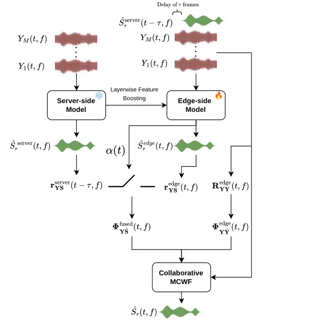

Fan Azcarreta Pandey Alvarez Tan Donley Giri Xu

# Cloud-Boosted Low-Compute Multi-Channel Speech Enhancement

Xulin    Juan    Ashutosh    Jesus    Ke    Jacob    Ritwik    Buye

###### Abstract

Low-latency, low-compute speech enhancement is essential for wearable
devices with real-time communication requirements, but strict
computational constraints significantly limit on-device performance.
Knowledge Boosting has been proposed as an effective approach to improve
edge model performance by leveraging a more capable server-side model,
but performance gains for speech enhancement have been limited. We
propose a collaborative framework incorporating three techniques: (1)
delayed server output as additional input, (2) layerwise feature
boosting that transfers intermediate server representations to guide
edge inference, and (3) collaborative multichannel Wiener filtering,
which fuses weighted covariance matrices estimated from both server and
edge models for improved beamforming. Experimental results demonstrate
that the proposed collaborative framework significantly outperforms the
edge-only baseline with minimal additional computational overhead.

###### keywords

speech enhancement, model collaboration

^(†)^(†)address: ¹ University of Illinois Urbana-Champaign, USA  
² Meta Reality Labs Research, USA ^(†)^(†)email: xulinf2@illinois.edu,
jazcarretao@meta.com, apandey620@meta.com, jsmalvarez@meta.com,
tanke1116@meta.com, jdonley@meta.com, ritwikgiri@meta.com, xub@meta.com

## 1 Introduction

The ubiquitous deployment of wearable devices, such as smart glasses and
hearables, has catalyzed a growing demand for high-fidelity real-time
audio processing. Among the myriad of audio tasks, on-device speech
enhancement is particularly critical for enabling clear communication in
noisy and reverberant environments. To meet strict latency thresholds
and hardware constraints (e.g., battery life, thermal limits), the
research community has developed a variety of compact speech enhancement
models \[1, 2, 3, 4, 5\]. While these lightweight architectures achieve
impressive efficiency, their reduced parameter counts and shallow depths
often fundamentally limit their capacity to model complex acoustic
scenes, resulting in performance that lags significantly behind
server-level solutions.

Conversely, the state-of-the-art in speech enhancement is dominated by
high-capacity deep neural networks \[6, 7, 8, 9\]. By leveraging
large-scale spatial-spectral attention mechanisms and massive parameter
sets, these models demonstrate remarkable robustness even under
ultra-low signal-to-noise ratio (SNR) conditions. However, the excessive
computational cost and memory footprint of such models render them
prohibitive for deployment on edge devices, creating a distinct
performance gap between cloud-based and on-device processing.

To bridge this gap, hybrid approaches \[10, 11, 12, 4, 13, 14, 15\] have
gained popularity. These methods integrate traditional signal
processing, specifically spatial filtering, with neural networks. By
offloading spatial discrimination to mathematical beamformers (e.g.,
minimum-variance distortionless response (MVDR) \[16\] or multichannel
Wiener filter (MCWF) \[17\]) and using small neural networks primarily
for mask estimation, these systems benefit from the stability of
physical acoustic models. Nevertheless, the performance of hybrid
systems remains bounded by the accuracy of the statistics estimated by
the lightweight neural estimator. If the edge model fails to identify
the target in a complex scene, the resulting beamformer collapses.

Recently, Knowledge Boosting \[18\] was introduced as a paradigm to
enhance edge model performance by leveraging a powerful server-side
model via a network connection. Assuming a fixed communication delay,
this framework trains the edge and server models collaboratively. While
this approach has yielded significant gains for target speaker
extraction and separation, improvements for general speech enhancement
have remained modest. This suggests that simply conditioning an edge
model on server outputs is insufficient to capture the rapid spectral
variations of non-stationary noise when communication latency is
present. However, two critical questions remain unexplored: (1) what
types of information from the server are most beneficial for improving
edge model performance under communication delays and minimal edge-side
computation, and (2) how knowledge boosting can be integrated into
hybrid beamforming approaches, where server-side information assists the
edge device in computing a robust spatial filter.

In this paper, we propose a comprehensive collaborative framework
designed to maximize the utility of a frozen, pretrained server-side
model for improving edge-side inference. Unlike \[18\], which trains
both models jointly and relies solely on delayed output conditioning,
our framework keeps the server fixed and introduces intermediate
representation-level guidance and spatial-statistics fusion. Our core
insight is that while spectral details may change rapidly, spatial
statistics (such as the target speaker’s direction of arrival) evolve
much more slowly and are robust to communication delays. We introduce
three complementary techniques to exploit this: (1) Delayed Input
Concatenation, where the server’s enhanced audio is fed as an auxiliary
reference, providing a clean but delayed prior to the edge model; (2)
Layerwise Feature Boosting, which transfers hierarchical representations
via Feature-wise Linear Modulation (FiLM) \[19\] to guide the edge
model’s internal states; and (3) Collaborative Multichannel Wiener
Filter (MCWF). We propose a novel fusion strategy where covariance
matrices from both the server and edge are combined. This allows the
system to leverage the superior spatial selectivity of the server model
to stabilize the on-device beamformer.

We evaluate this framework under challenging low-SNR conditions and a
more than 64ms server-edge communication delay. Experimental results
demonstrate that our collaborative approach significantly outperforms
strong edge-only baselines, closing the gap with server-grade
performance while incurring negligible ($`<`$5%) computational overhead
on the edge device.

## 2 Method

### 2.1 Overview

Our proposed collaborative speech enhancement system consists of a
high-capacity server-side model and a lightweight edge-side model. The
server-side model is first pretrained on the speech enhancement task and
subsequently frozen during edge model training and inference. During
operation, the server-side model processes the multichannel input and
produces auxiliary outputs, including enhanced spectrograms and
intermediate layer representations, that are transmitted to the edge
device to boost the performance of the edge-side model.



Figure 1: Overview of the proposed collaborative speech enhancement
system. The server-side model processes multichannel input and transmits
enhanced spectrograms and intermediate representations to the edge-side
model via a communication channel.

### 2.2 Server-side Model

The server-side model is a causal SpatialNet \[6\], a deep neural
network designed for multichannel speech enhancement. The architecture
processes time-frequency representations of the microphone array input
through a stack of transformer-based narrow-band and cross-band modules.
The network maintains causality by masking future frames in all
attention and convolution operations, ensuring that each output frame
depends only on current and past inputs. The network is pretrained on
the speech enhancement task and remains frozen during training and
inference of the edge-side model.

We identify two types of auxiliary information from SpatialNet that can
improve edge-side performance. The first is the final enhanced
spectrogram, representing SpatialNet’s estimate of the target speech.
The second is a set of intermediate layer representations extracted at
selected depths within the network. These intermediate features capture
hierarchical spatial and spectral patterns, from low-level acoustic cues
in early layers to high-level source characteristics in deeper layers,
providing multi-scale guidance to the edge model.

### 2.3 Edge-side Model

The edge-side model is based on TinyGRU \[4\], a compact architecture
designed for efficient real-time inference on resource-constrained
hardware. The network consists of a spatial convolution module that
reduces the multichannel input to a single-channel representation,
followed by a temporal processing module comprising three stacked
SplitGRU layers. The network outputs a complex-valued mask that is
applied to the noisy input spectrogram to obtain an initial clean speech
estimate.

This masked estimate is then used to derive a multichannel Wiener filter
(MCWF) beamformer, which produces the final enhanced output by optimally
combining information across all microphone channels. The MCWF
formulation enables the lightweight edge model to leverage spatial
diversity in the microphone array, achieving superior enhancement
compared to single-channel masking alone.

To incorporate server-side guidance at the earliest processing stage, we
concatenate the delayed enhanced spectrogram from SpatialNet to the
multichannel input before the spatial convolution module. Specifically,
the server-side enhanced output $`\hat{S}_{\text{server}}(t-\tau,f)`$,
delayed by $`\tau`$ frames to account for communication latency, is
appended as additional input channels alongside the $`M`$-channel
microphone input. This early conditioning provides the edge model with a
direct reference signal that captures the server’s estimate of the
target speech, allowing the spatial convolution to leverage this
information when learning to reduce the multichannel input to a
single-channel representation. Since we stack real and imaginary parts,
the M-channel microphone input yields 2M real-valued channels, and the
complex-valued server output contributes 2 additional channels,
resulting in 2(M+1) input channels total.

### 2.4 Layerwise Feature Boosting

To enable knowledge transfer from the server-side SpatialNet to the
device-side TinyGRU, we extract intermediate representations from
multiple depths of the SpatialNet rather than relying solely on its
final output. Specifically, we sample features from $`N=4`$ points: the
input encoding layer (before any transformer processing), and SpatialNet
layers 4, 8, and 12. Let
$`\mathbf{h}^{(l)}\in\mathbb{R}^{B\times F\times T\times H}`$ denote the
feature extracted from layer $`l`$, where $`B`$ is the batch size, $`F`$
the number of frequency bins, $`T`$ the number of time frames, and $`H`$
the hidden dimension. Each feature is compressed via a learned
$`1\times 1`$ convolution that projects the hidden dimension to a
scalar, yielding $`\mathbf{c}^{(l)}\in\mathbb{R}^{B\times T\times F}`$.
These compressed features are temporally delayed by $`\delta`$ frames to
account for server-side processing latency.

The processed features are injected into the $`N`$-layer TinyGRU through
hierarchical Feature-wise Linear Modulation (FiLM) \[19\]. The input
encoder features modulate the input to GRU layer 1, layer 4 features
modulate the input to GRU layer 2, layer 8 features modulate the input
to GRU layer 3, and layer 12 features modulate the final GRU output. Let
$`\tilde{\mathbf{c}}_{j}\in\mathbb{R}^{B\times T\times F}`$ denote the
$`j`$-th conditioning feature after compression and delay. At each
conditioning point $`j\in\{1,\ldots,N\}`$, a linear projection
$`\mathbf{W}_{j}\in\mathbb{R}^{2d\times F}`$ generates scale and shift
parameters independently for each time frame $`t`$:

```math
[\boldsymbol{\gamma}_{j}(t),\boldsymbol{\beta}_{j}(t)]=\mathbf{W}_{j}\tilde{\mathbf{c}}_{j}(t)+\mathbf{b}_{j} \tag{1}
```

where $`d`$ is the RNN hidden dimension. The modulated representation
is:

```math
\tilde{\mathbf{x}}_{j}(t)=\sigma(\boldsymbol{\gamma}_{j}(t))\odot\mathbf{x}_{j}(t)+\boldsymbol{\beta}_{j}(t) \tag{2}
```

where $`\sigma(\cdot)`$ is the sigmoid function and $`\odot`$ denotes
element-wise multiplication. This hierarchical design allows early
SpatialNet features to provide low-level spectral conditioning, while
deeper features capture increasingly refined speech-noise separation
cues at later processing stages.

|                          |                        |                 |                 |                     |                   |                   |                     |                   |                   |
| ------------------------ | ---------------------- | --------------- | --------------- | ------------------- | ----------------- | ----------------- | ------------------- | ----------------- | ----------------- |
| Model                    | Server-Edge Delay (ms) | Params (K)      | MMACs           | Standard            |                   |                   | Challenging         |                   |                   |
|                          |                        |                 |                 | SI-SDR $`\uparrow`$ | PESQ $`\uparrow`$ | STOI $`\uparrow`$ | SI-SDR $`\uparrow`$ | PESQ $`\uparrow`$ | STOI $`\uparrow`$ |
| Noisy Input              | –                      | –               | –               | -4.96               | 1.68              | 69.27             | -10.01              | 1.28              | 55.70             |
| TinyGRU+MCWF \[4\]       | –                      | 145.1           | 32.9            | 1.97                | 2.29              | 82.36             | -1.16               | 1.90              | 70.49             |
| +(a) (proposed)          | 64                     | 147.2 (+1.4%)   | 33.2 (+0.9%)    | 3.05                | 2.34              | 83.93             | -0.02               | 1.97              | 72.58             |
| +(a,b) (proposed)        | 64                     | 147.2 (+1.4%)   | 33.3 (+1.2%)    | 4.47                | 2.35              | 84.24             | 1.35                | 1.98              | 72.68             |
| +(a,b,c) (proposed)      | 64                     | 147.3 (+1.5%)   | 33.7 (+2.4%)    | 5.74                | 2.33              | 85.48             | 2.33                | 1.95              | 73.73             |
| TinyGRU-Large+MCWF \[4\] | –                      | 432.4 (+198.0%) | 68.77 (+109.0%) | 2.75                | 2.33              | 83.54             | -0.37               | 1.95              | 72.19             |
| +(a,b,c) (proposed)      | 96                     | 147.3 (+1.5%)   | 33.7 (+2.4%)    | 4.39                | 2.34              | 84.16             | 1.14                | 1.96              | 72.31             |
| +(a,b,c) (proposed)      | 128                    | 147.3 (+1.5%)   | 33.7 (+2.4%)    | 4.26                | 2.34              | 84.13             | 1.07                | 1.96              | 72.22             |
| Causal SpatialNet \[6\]  | –                      | –               | –               | 11.79               | 3.35              | 95.47             | 9.08                | 2.97              | 91.53             |

Table 1: Performance comparison of edge-side speech enhancement models
on standard and challenging conditions. We incrementally add three
improvements to the baseline: (a) delayed server output conditioning,
(b) layerwise feature boosting, and (c) collaborative MCWF. SI-SDR is in
dB; STOI is in %. Parameters (in thousands) and the number of
multiply-accumulate operations in millions (MMACs) are reported for
edge-side only. Causal SpatialNet (in gray) serves as a high-capacity
server-side reference. Best results under 64ms server-edge delay are in
bold.

### 2.5 Collaborative MCWF

In the edge-only approach, the device-side TinyGRU model estimates a
target speech signal, which is used to compute covariance statistics for
deriving the MCWF beamformer coefficients. However, the lightweight edge
model may produce suboptimal target estimates in challenging acoustic
conditions. To address this limitation, we propose a collaborative MCWF
framework that leverages target estimates from both the device-side
TinyGRU and the server-side SpatialNet, fusing their statistical
contributions to compute more robust beamformer coefficients.

#### 2.5.1 Frame-wise Outer Product Computation

At each time-frequency bin, we compute the instantaneous spatial
covariance matrix from the multichannel input:

```math
\mathbf{R}_{\mathbf{YY}}(t,f)=\mathbf{Y}(t,f)\mathbf{Y}^{H}(t,f) \tag{3}
```

where $`\mathbf{Y}(t,f)\in\mathbb{C}^{M}`$ is the $`M`$-channel input
STFT at time frame $`t`$ and frequency bin $`f`$. Since this depends
only on the input signal (identical on edge and server), it is computed
solely on the edge.

The cross-covariance vector between the input and estimated target is
computed independently by both models using their respective target
estimates $`\hat{\textbf{S}}(t,f)`$:

```math
\mathbf{r}_{\mathbf{YS}}(t,f)=\mathbf{Y}(t,f)\hat{\textbf{S}}^{H}(t,f) \tag{4}
```

yielding $`\mathbf{r}_{\mathbf{YS}}^{\text{edge}}(t,f)`$ and
$`\mathbf{r}_{\mathbf{YS}}^{\text{server}}(t,f)`$ for the edge and
server models, respectively.

#### 2.5.2 Cross-Covariance Fusion

Due to communication latency, the server-side statistics arrive with a
delay of $`\tau`$ frames. This creates a fundamental trade-off: the
server-side SpatialNet produces higher-quality target estimates due to
its greater model capacity, but these estimates reflect the acoustic
scene from $`\tau`$ frames in the past. Conversely, the edge-side
TinyGRU produces lower-quality estimates but captures the current
acoustic conditions without delay. We fuse the cross-covariance vectors
using an adaptive weight to navigate this trade-off:

```math
\mathbf{r}_{\mathbf{YS}}^{\text{fused}}(t,f)=(1-\alpha(t))\cdot\mathbf{r}_{\mathbf{YS}}^{\text{server}}(t-\tau,f)+\alpha(t)\cdot\mathbf{r}_{\mathbf{YS}}^{\text{edge}}(t,f) \tag{5}
```

where $`\alpha(t)\in[0,1]`$ is a per-frame scalar predicted by TinyGRU’s
final linear layer and applied uniformly across all frequency bins. This
weight controls the balance between server and edge contributions: when
$`\alpha`$ approaches 0, the system favors the more accurate but delayed
server-side statistics; when $`\alpha`$ approaches 1, it favors the less
accurate but current edge-side statistics.

The network learns to adapt this weight based on acoustic conditions. In
stationary or slowly-varying environments, where the acoustic scene
changes little over $`\tau`$ frames, the delayed server statistics
remain highly relevant, and lower $`\alpha`$ values allow the system to
benefit from SpatialNet’s superior estimation quality. In contrast,
during rapid acoustic changes such as sudden noise onsets or abrupt
spatial transitions, the delayed server statistics may no longer reflect
the current scene, and higher $`\alpha`$ values allow the system to rely
on the edge model’s real-time estimates despite their lower quality.

#### 2.5.3 Time-Varying Smoothing

The frame-wise statistics are accumulated over time through learned
recursive smoothing. Dropping the time-frequency indices $`(t,f)`$ for
brevity, the spatial covariance matrix and fused cross-covariance vector
are updated as:

```math
\boldsymbol{\Phi}_{\mathbf{YY}}=(1-\beta_{\mathbf{YY}})\cdot\boldsymbol{\Phi}_{\mathbf{YY}}^{\text{prev}}+\beta_{\mathbf{YY}}\cdot\mathbf{R}_{\mathbf{YY}} \tag{6}
```

```math
\boldsymbol{\Phi}_{\mathbf{YS}}=(1-\beta_{\mathbf{YS}})\cdot\boldsymbol{\Phi}_{\mathbf{YS}}^{\text{prev}}+\beta_{\mathbf{YS}}\cdot\mathbf{r}_{\mathbf{YS}}^{\text{fused}} \tag{7}
```

where $`\boldsymbol{\Phi}^{\text{prev}}`$ denotes the value at the
previous frame $`(t-1,f)`$.

The smoothing coefficient $`\beta(t,f)`$ is computed as the product of a
per-frame scalar weight $`w(t)`$ predicted by the TinyGRU and a learned
per-frequency weight vector $`\mathbf{v}\in\mathbb{R}^{F}`$ which add
temporal variability upon per-frequency smoothing \[20\] :

```math
\beta(t,f)=\sigma\left(\mathbf{v}\cdot\text{softplus}(w(t))\right) \tag{8}
```

where $`\sigma(\cdot)`$ is the sigmoid function. This factorization
allows the network to learn frequency-dependent smoothing
characteristics (e.g., longer integration for low frequencies) while the
per-frame scalar enables adaptation to temporal dynamics. Separate
weight pairs $`(w_{\mathbf{YY}},\mathbf{v}_{\mathbf{YY}})`$ and
$`(w_{\mathbf{YS}},\mathbf{v}_{\mathbf{YS}})`$ are used for the spatial
covariance and cross-covariance, respectively.

#### 2.5.4 Beamformer Computation

The MCWF coefficients are computed from the smoothed statistics:

```math
\mathbf{W}(t,f)=\mathbf{\Phi}_{\mathbf{YY}}^{-1}(t,f)\cdot\mathbf{\Phi}_{\mathbf{YS}}(t,f) \tag{9}
```

and the enhanced signal is calculated as:

```math
\hat{\textbf{S}}_{\text{MCWF}}(t,f)=\mathbf{W}^{H}(t,f)\mathbf{Y}(t,f) \tag{10}
```

## 3 Experiments

### 3.1 Data

We use clean speech and noise sources from the DNS-Challenge
dataset \[21\]. An 8-channel circular microphone array is employed to
simulate multichannel audio input, with room impulse responses (RIRs)
generated using Pyroomacoustics. For each sample, we randomly sample
room dimensions ranging from $`3\times 3\times 2`$ to
$`10\times 10\times 5`$ meters, with the microphone array placed at a
random position within the room. The wall absorption coefficient is
uniformly sampled from $`[0.1,0.7]`$. With a probability of 0.5, we
include 8–16 interference speakers to simulate babble noise. The number
of diffuse noise sources is sampled from $`[1,10]`$. The
signal-to-interference ratio (SIR) is sampled from $`[5,10]`$ dB.

We create two datasets of varying difficulty, differing only in
signal-to-noise ratio (SNR): the Standard dataset uses SNR sampled from
$`[-5,10]`$ dB, while the Challenging dataset uses SNR sampled from
$`[-10,-5]`$ dB. For each dataset, we simulate 80,000 samples for
training, 2,000 for validation, and 4,000 for testing.

### 3.2 Experimental Setting

We select a vanilla TinyGRU+MCWF \[4\] with time-varying smoothing as
the baseline. For experiments with server-side boosting, we first
pretrain the server-side SpatialNet model for 100 epochs with PCM loss
\[22\] until convergence. The server-side model is then frozen and the
edge-side TinyGRU model is trained with the respective boosting
strategy.

Both the baseline and TinyGRU with server-side boosting are trained for
100 epochs using the Adam optimizer with AMSGrad, an initial learning
rate of $`10^{-3}`$, and gradient clipping with a maximum norm of 0.03.
The learning rate is decayed by a factor of 0.1 at epochs 50 and 80
following a multi-step schedule. The training objective is the
signal-to-noise ratio (SNR) loss computed between the enhanced output
and the clean target signal. Both training and evaluation use the
anechoic target signal as the reference.

The audio is processed at 16kHz with a short-time Fourier transform
using a 256-sample (16ms) frame size and 128 sample (8ms) hop size,
resulting in 129 frequency bins. Training samples are 4-second segments
randomly chunked from longer recordings, with a batch size of 32. To
simulate the round-trip communication latency between the edge device
and server, a delay of $`\tau`$ frames ($`8\tau`$ms) is applied to all
server-side outputs/features before they are transmitted to the edge
model.

### 3.3 Results

Table 1 presents performance comparisons on Standard and Challenging
sets. We analyze the contribution of each proposed component and examine
the impact of server-edge communication latency.

Baseline Performance. The baseline TinyGRU+MCWF model achieves
reasonable enhancement on the Standard dataset, improving SI-SDR from
-4.96 dB to 1.97 dB and STOI from 69.27% to 82.36%. However, performance
degrades substantially under the Challenging condition (lower SNR),
where SI-SDR reaches only -1.16 dB when the noisy input is -10.01 dB.
This highlights the limitations of edge-only models in adverse acoustic
conditions.

Ablation Study. We incrementally evaluate each proposed component.
Adding delayed server output conditioning (a) improves SI-SDR from
1.97 dB to 3.05 dB on Standard and from -1.16 dB to -0.02 dB on
Challenging, confirming that delayed server-side clean estimate benefits
the edge model. Incorporating layerwise feature boosting (b) further
improves SI-SDR to 4.47 dB and 1.35 dB on Standard and Challenging,
respectively, demonstrating that multi-layer feature conditioning helps
the edge model better leverage server information at different depth of
the server model. The full model with collaborative MCWF (c) achieves
the best performance: 5.74 dB SI-SDR on Standard and 2.33 dB on
Challenging, representing total improvements of 3.77 dB and 3.49 dB over
baseline.

Comparison with Scaled-Up Baseline. To verify that improvements stem
from the server-edge architecture rather than increased model capacity,
we compare against TinyGRU-Large, where we simply scale up the hidden
dimension of TinyGRU from 96 to 192, which results in 198% more
parameters and 109% more MMACs. Despite this substantial increase,
TinyGRU-Large achieves only 2.75 dB and -0.37 dB SI-SDR on Standard and
Challenging, which significantly underperforms our proposed boosting
method (5.74 dB and 2.33 dB) which adds only 1.5% parameters. This
demonstrates that server-side information provides benefits that cannot
be replicated by scaling edge computation alone.

Server-Edge Delay Sensitivity. At 64 ms server-edge delay, the model
achieves optimal performance. Increasing latency to 96 ms and 128 ms
results in moderate degradation (SI-SDR drops from 5.74 dB to 4.39 dB
and 4.26 dB on Standard), but performance remains substantially above
the baseline. This graceful degradation indicates the model can
effectively leverage delayed server guidance under realistic network
conditions.

## 4 Conclusion

We presented a collaborative speech enhancement framework that bridges
the gap between lightweight edge models and high-capacity server models
by exploiting delay-tolerant spatial statistics. Our approach integrates
delayed server output conditioning, layerwise feature boosting, and
collaborative MCWF to transfer spatial knowledge from a pretrained
server-side SpatialNet to a compact edge-side TinyGRU. Experiments
demonstrate SI-SDR improvements of 3.77 dB and 3.49 dB on standard and
challenging conditions, respectively, while adding only 1.5% parameters
and 2.4% computation on the edge. These results show that server-edge
collaboration offers a promising path toward high-quality real-time
speech enhancement on resource-constrained devices.

## 5 Generative AI Use Disclosure

We used GPT and Claude for language editing and manuscript polishing,
including improving clarity, correcting grammatical errors, and
formatting LaTEX tables. All technical content, experimental design,
analysis, and scientific contributions are entirely the work of the
authors. The authors have carefully reviewed the manuscript and take
full responsibility for its content.

## References

- \[1\] N. L. Westhausen and B. T. Meyer (2023) Low bit rate binaural
  link for improved ultra low-latency low-complexity multichannel speech
  enhancement in hearing aids. In 2023 IEEE Workshop on Applications of
  Signal Processing to Audio and Acoustics (WASPAA), pp. 1–5. Cited by:
  §1.
- \[2\] K. Patel, A. Kovalyov, and I. Panahi (2023) Ux-net:
  filter-and-process-based improved u-net for real-time time-domain
  audio separation. In ICASSP 2023-2023 IEEE International Conference on
  Acoustics, Speech and Signal Processing (ICASSP), pp. 1–5. Cited by:
  §1.
- \[3\] H. Schröter, A. Maier, A. N. Escalante-B, and T.
  Rosenkranz (2022) Deepfilternet2: towards real-time speech enhancement
  on embedded devices for full-band audio. In 2022 International
  Workshop on Acoustic Signal Enhancement (IWAENC), pp. 1–5. Cited by:
  §1.
- \[4\] A. Pandey and J. Azcarreta (2025) Ultra low-compute complex
  spectral masking for multichannel speech enhancement. In ICASSP
  2025-2025 IEEE International Conference on Acoustics, Speech and
  Signal Processing (ICASSP), pp. 1–5. Cited by: §1, §1, §2.3, Table 1,
  Table 1, §3.2.
- \[5\] L. Cheng, A. Pandey, B. Xu, T. Delbruck, V. K. Ithapu, and S.
  Liu (2025) Modulating state space model with slowfast framework for
  compute-efficient ultra low-latency speech enhancement. In ICASSP
  2025-2025 IEEE International Conference on Acoustics, Speech and
  Signal Processing (ICASSP), pp. 1–5. Cited by: §1.
- \[6\] C. Quan and X. Li (2024) SpatialNet: extensively learning
  spatial information for multichannel joint speech separation,
  denoising and dereverberation. IEEE/ACM Transactions on Audio, Speech,
  and Language Processing 32, pp. 1310–1323. Cited by: §1, §2.2, Table
  1.
- \[7\] Z. Wang, S. Cornell, S. Choi, Y. Lee, B. Kim, and S.
  Watanabe (2023) TF-gridnet: integrating full-and sub-band modeling for
  speech separation. IEEE/ACM Transactions on Audio, Speech, and
  Language Processing 31, pp. 3221–3236. Cited by: §1.
- \[8\] W. Zhang, J. Jung, and Y. Qian (2024) Improving design of input
  condition invariant speech enhancement. In ICASSP 2024-2024 IEEE
  International Conference on Acoustics, Speech and Signal Processing
  (ICASSP), pp. 10696–10700. Cited by: §1.
- \[9\] W. Zhang, K. Saijo, Z. Wang, S. Watanabe, and Y. Qian (2023)
  Toward universal speech enhancement for diverse input conditions. In
  2023 IEEE Automatic Speech Recognition and Understanding Workshop
  (ASRU), pp. 1–6. Cited by: §1.
- \[10\] Z. Wang, G. Wichern, S. Watanabe, and J. Le Roux (2022)
  STFT-domain neural speech enhancement with very low algorithmic
  latency. IEEE/ACM Transactions on Audio, Speech, and Language
  Processing 31, pp. 397–410. Cited by: §1.
- \[11\] Y. Luo (2022) A time-domain real-valued generalized wiener
  filter for multi-channel neural separation systems. IEEE/ACM
  Transactions on Audio, Speech, and Language Processing 30,
  pp. 3008–3019. Cited by: §1.
- \[12\] K. Kuang, F. Yang, J. Li, and J. Yang (2023) Three-stage hybrid
  neural beamformer for multi-channel speech enhancement. The Journal of
  the Acoustical Society of America 153 (6), pp. 3378–3378. Cited by:
  §1.
- \[13\] T. Hsieh, J. Donley, D. Wong, B. Xu, and A. Pandey (2024) On
  the importance of neural wiener filter for resource efficient
  multichannel speech enhancement. In ICASSP 2024-2024 IEEE
  International Conference on Acoustics, Speech and Signal Processing
  (ICASSP), pp. 12181–12185. Cited by: §1.
- \[14\] C. Lee, C. Yang, Y. Shen, and H. Jin (2023) Improved mask-based
  neural beamforming for multichannel speech enhancement by snapshot
  matching masking. In ICASSP 2023-2023 IEEE International Conference on
  Acoustics, Speech and Signal Processing (ICASSP), pp. 1–5. Cited by:
  §1.
- \[15\] Z. Wang and D. Wang (2020) Multi-microphone complex spectral
  mapping for speech dereverberation. In ICASSP 2020-2020 IEEE
  International Conference on Acoustics, Speech and Signal Processing
  (ICASSP), pp. 486–490. Cited by: §1.
- \[16\] S. Doclo, S. Gannot, M. Moonen, and A. Spriet (2010) Acoustic
  beamforming for hearing aid applications. Handbook on array processing
  and sensor networks, pp. 269–302. Cited by: §1.
- \[17\] Z. Wang, H. Erdogan, S. Wisdom, K. Wilson, D. Raj, S.
  Watanabe, Z. Chen, and J. R. Hershey (2021) Sequential multi-frame
  neural beamforming for speech separation and enhancement. In 2021 IEEE
  Spoken Language Technology Workshop (SLT), pp. 905–911. Cited by: §1.
- \[18\] V. Srinivas, M. Itani, T. Chen, S. E. Eskimez, T. Yoshioka,
  and S. Gollakota (2024) Knowledge boosting during low-latency
  inference. arXiv preprint arXiv:2407.11055. Cited by: §1, §1.
- \[19\] E. Perez, F. Strub, H. De Vries, V. Dumoulin, and A.
  Courville (2018) Film: visual reasoning with a general conditioning
  layer. In Proceedings of the AAAI conference on artificial
  intelligence, Vol. 32. Cited by: §1, §2.4.
- \[20\] E. Grinstein, A. Pandey, C. Li, S. Srinivas, J. Azcarreta, J.
  Donley, S. Lee, A. Aroudi, and Ç. Bilen (2025) Controlling the
  parameterized multi-channel wiener filter using a tiny neural network.
  In 2025 IEEE Workshop on Applications of Signal Processing to Audio
  and Acoustics (WASPAA), pp. 1–5. Cited by: §2.5.3.
- \[21\] C. K. Reddy, V. Gopal, R. Cutler, E. Beyrami, R. Cheng, H.
  Dubey, S. Matusevych, R. Aichner, A. Aazami, S. Braun, et al. (2020)
  The interspeech 2020 deep noise suppression challenge: datasets,
  subjective testing framework, and challenge results. arXiv preprint
  arXiv:2005.13981. Cited by: §3.1.
- \[22\] A. Pandey, B. Xu, A. Kumar, J. Donley, P. Calamia, and D.
  Wang (2022) Time-domain ad-hoc array speech enhancement using a
  triple-path network. Cited by: §3.2.
