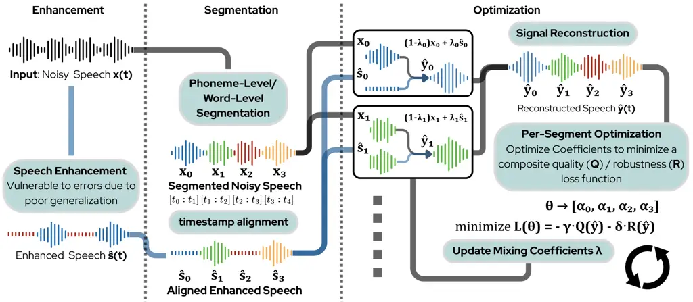

# Mitigating Over-Suppression in Speech Enhancement via Inference-Time Rethink-and-Refine Correction Module

^(∗)Equal contribution.

###### Abstract

We present a rethink-and-refine correction module that addresses
over-suppression, a common failure mode of speech enhancement (SE)
models, where speech cues are suppressed alongside noise. Our method
operates entirely in the inference stage without additional training,
allowing seamless integration with diverse SE models. Given noisy and
enhanced signals, we obtain word- or phoneme-level alignments using an
automatic speech recognition model and identify intervals where
enhancement is unreliable. These intervals are then selectively remixed
through convex interpolation, with per-segment weights optimized to
maximize a composite objective balancing perceptual quality and speech
preservation. Experiments on the URGENT 2024 and 2025, VCTK-DEMAND, and
MSP-PODCAST datasets show consistent improvements in perceptual quality,
intelligibility, and downstream performance compared to conventional SE
alone, demonstrating the benefit of rethink-and-refine framework for
robust speech processing.

|                                                          |
| -------------------------------------------------------- |
| Mike Qu^(∗), Yu-Wen Chen^(∗), Julia Hirschberg           |
| Department of Computer Science, Columbia University, USA |

Index Terms—  Speech enhancement, over-suppression correction,
inference-time rethink-and-refine

## 1 Introduction

Speech enhancement (SE) models aim to suppress noise while preserving
speech quality and intelligibility. Recent deep learning-based
approaches \[2, 3, 19\] are typically trained on tuples of noisy and
clean waveforms, with the objective of manipulating the noisy signal to
make it as “similar” to the clean signal as possible \[16, 14\]. When
test conditions match training data, these models often achieve
substantial gains on objective and subjective assessment metrics.
However, when deployed in unseen or complex real-world noise
environments, SE models often produce unnatural artifacts or destructive
distortions. One mitigation strategy is to train or fine-tune the model
on data resembling the target environment; however, in many real-world
applications, the clean and noise data required for SE training are
unavailable. To address this, output-level correction offers an
alternative by treating the enhancer as a black box and operating only
on its output. These methods adjust the enhanced waveform without
fine-tuning the base model, enabling use across different SE and noise
conditions. For example, observation-adding approaches address
suppression artifacts by globally interpolating the noisy and enhanced
signals, relying on a fixed global mixing rule to mitigate distortions
introduced during enhancement  \[10\]. NRSER used a signal-to-noise
ratio (SNR)-based detector to select the interpolation weight between SE
output and the original signal, improving the noise robustness of
downstream emotion recognition \[4\].

A common failure mode for SE is under-enhancement, in which residual
background noise remains after processing. Far more harmful is
_over-suppression_, where the model over-suppresses the signal to the
extent that it substantially removes parts of the speaker’s information,
leaving the output less intelligible and less informative for downstream
tasks, sometimes even worse than unprocessed signals. The performance of
SE is typically evaluated using speech assessment (SA) metrics. Compared
to traditional intrusive metrics like PESQ (perceptual evaluation of
speech quality) \[20\] and STOI (short-time objective
intelligibility) \[24\], non-intrusive metrics such as mean opinion
score (MOS) predictors estimate perceived listening quality without
requiring clean references and are sensitive to both residual noise and
over-suppression. While prior work has incorporated such predictors into
training objectives \[22, 6\], leveraging SA models at test time for
output-level correction, especially to prevent destructive
over-suppression, remains largely unexplored.

We reformulate the output-level correction as a “rethink-and-refine”
strategy that is prevalent in natural language processing. Large
language models frequently produce an initial answer that is then
checked, critiqued, and selectively edited using auxiliary modules or
downstream signals, rather than being treated as a final output \[23,
15\]. The key insight in these frameworks is that generation and
evaluation can be separated: the model produces a first-pass output, and
a later stage equipped with stronger or more specialized feedback
modifies the parts that need improvement. This decoupling enables the
incorporation of feedback signals, such as human judgments or assessment
models, that would have been difficult to enforce during initial
generation itself. By analogy, SE, which is typically performed in a
single forward pass, may also benefit from a secondary correction stage
that revisits the enhanced waveform with SA, identifies localized errors
such as over-suppression, and repairs them without altering regions that
were already handled correctly.

Together, these observations motivate an output-level inference-time
refinement approach for SE under the guidance of automatic speech
recognition (ASR) and non-intrusive SA models. Using ASR timestamps, we
align noisy and enhanced audio at the word or phoneme level and optimize
a mixing weight for each segment to maximize perceptual quality. Our key
contributions are these: (1) The proposed module operates without any
additional training and can be applied to any off-the-shelf SE model.
Serving as a plug-in module, it alleviates the catastrophic
over-suppression that arises when SE models are deployed under unseen
acoustic conditions. (2) Our module achieves consistent gains in
intrusive (e.g., PESQ and STOI) across SE models and datasets. (3)
Experimental results further demonstrate improved performance on
downstream tasks, with reduced word error rates (WER) of transcription
and better preservation of vocal traits.



Fig. 1: The proposed correction module. The module can be added to any
SE model, operating directly on its output without additional training.
An ASR system segments the speech signal, and a SA model guides the
correction of each segment.

## 2 Methodology

We propose a correction module for SE, inspired by the
rethink-and-refine framework, which identifies parts of the input speech
where the initial SE over-suppresses the signal and selectively restores
the information (Fig. 1). First, we segment both the noisy and output of
pretrained SE model (i.e., enhanced signals) into word- or phoneme-level
intervals using ASR-based timestamps, forming paired segments that are
aligned over the same time spans. For each segment, we then optimize a
mixing weight that interpolates between noisy and enhanced signal,
maximizing a perceptual quality and robustness objective on the
reconstructed waveform with SA. In addition, a reconciliation strategy
is introduced to address the issue of segment boundary mismatches.

### 2.1 ASR-guided segmentation

To localize and repair regions affected by over-suppression, we
introduce a post-processing stage based on word- or phoneme-level
segmentation. Given a noisy signal $`x(t)`$ and its enhanced counterpart
$`\hat{s}(t)`$, we run an ASR-based segmentation model, including
Charsiu (for phonemes) \[29\] or Whisper-timestamped (for words) \[17,
9\].

This produces a sequence of time intervals

```math
[t_{i}^{\mathrm{start}},t_{i}^{\mathrm{end}}],\quad i=1,\dots,K
```

where each interval corresponds to a meaningful speech unit.

For each interval, we extract the corresponding segments from noisy
$`x_{i}(t)`$ and enhanced $`\hat{s}_{i}(t)`$ signals. These segments
serve as the basic units for the subsequent mixing process. The
interval-wise view of noisy segment and enhanced segment makes it easier
to detect over-suppression (i.e., speech present in $`x_{i}`$ but
missing or strongly attenuated in $`\hat{s}_{i}`$) than working with the
full waveform, where such differences can be obscured by small timing
mismatches.

### 2.2 SA-guided segment-wise weight selection

Over-suppression occurs when the SE model removes genuine speech energy
along with noise, where the noisy segment $`x_{i}(t)`$ contains speech
cues that have been suppressed in enhanced signal $`\hat{s}_{i}(t)`$,
while $`\hat{s}_{i}(t)`$ may still provide useful denoising. Rather than
discarding either source, we repair these regions by interpolation, with
weights guided by non-intrusive SA metrics. Specifically,

For each segment, we define a convex interpolation

```math
s_{i}^{\mathrm{corr}}(t,\lambda_{i})=\lambda_{i}\,\hat{s}_{i}(t)+(1-\lambda_{i})\,x_{i}(t),\qquad\lambda_{i}\in[0,1], \tag{1}
```

where $`\lambda_{i}`$ is a segment-wise mixing weight: values near $`1`$
favor the enhanced signal, and values near $`0`$ favor the original
noisy input. Let $`\lambda=[\lambda_{1},\dots,\lambda_{K}]`$ denote the
vector of mixing weights over all segments. A corrected waveform
$`s^{\mathrm{corr}}(t,\lambda)`$ is obtained by replacing each segment
in time with $`s_{i}^{\mathrm{corr}}(t,\lambda_{i})`$ and leaving the
rest of the signal unchanged.

To select $`\lambda`$, we optimize a composite objective that balances
perceptual quality and robustness on the reconstructed signal. Let
$`Q(\cdot)`$ denote a non-intrusive quality predictor (e.g., SCOREQ),
and let $`R(\cdot)`$ measure the preservation of speech-like structure
(e.g., Whisper embedding L2 similarity). We define

```math
\mathcal{L}(\lambda)=\gamma\,Q\big(s^{\mathrm{corr}}(t,\lambda)\big)+\delta\,R\big(s^{\mathrm{corr}}(t,\lambda)\big), \tag{2}
```

with weights $`\gamma`$ and $`\delta`$ controlling the trade-off (both
set to $`0.5`$ in our experiments). A higher $`\gamma`$ biases the
optimizer to focus on the raw quality of the produced speech signal,
while a higher $`\delta`$ places a heavier emphasis on the preservation
of speech cues and semantics. The optimal mixing vector is then

```math
\lambda^{\star}=\arg\max_{\lambda\in[0,1]^{K}}\mathcal{L}(\lambda). \tag{3}
```

This formulation treats the segment weights as inference-time
parameters, enabling adaptation of any given SE output without
retraining or modifying the base model. In practice, $`\lambda^{\star}`$
is obtained via continuous gradient descent with the Adam optimizer,
initialized at $`\lambda=0.5`$. Existing methods \[10, 4\] employ a
similar formulation but restrict the mixing coefficient to be a _single_
global value or a coarsely selected utterance-level quantity (e.g.,
based on an SNR proxy), implicitly assuming a uniform correction
strength across time \[10, 4\]. Our method further generalizes that
approach to ASR-aligned segments and treats the set of mixing weights
$`\{\lambda_{i}\}_{i=1}^{K}`$ as inference-time decision variables,
selected by directly optimizing the composite objective in Equation 3.
This enables content-dependent correction that selectively addresses
over-suppression artifacts while avoiding unnecessary reintroduction of
noise in well-enhanced regions.

### 2.3 Reconciliation

The noisy-based and enhanced-based segments generally do not share
identical boundaries, so attempting to merge them at the interval level
would require explicit boundary matching or temporal warping, which is
brittle in practice. Therefore, we adopt a simple reconciliation
strategy instead. We consider two complementary segmentation views: one
obtained from the noisy signal and one from the enhanced signal. In both
cases, the construction above yields aligned pairs
$`(x_{i},\hat{s}_{i})`$ cut over the same time spans. We then run the
correction procedure described above twice, once using the intervals
obtained from the noisy signal and once using the intervals obtained
from the enhanced signal. This yields two fully reconstructed
candidates, each consistent with its own segmentation view. We then
evaluate both candidates with the same objective $`\mathcal{L}(\cdot)`$
and select the higher-scoring one as the final corrected signal. In this
way, both views can contribute: one emphasizing preservation of speech
activity, the other emphasizing regions already improved by the SE
model, without requiring explicit alignment between their segment
boundaries.

To ensure that the correction process does not degrade quality in cases
where remixing is unnecessary or counterproductive, we additionally
compare the selected reconstruction against the original noisy and
enhanced signals under the same objective. If either baseline achieves a
higher score, we retain it instead. This fallback criterion ensures that
the correction stage is conservative and never performs worse than
simply choosing the better of the two original inputs.

## 3 Experimental setup

### 3.1 Models and datasets

We evaluate our approach using three state-of-the-art SE models,
including CMGAN \[2\], SEMamba \[3\], and SGMSE \[19\]. For fair
comparison, all models use official VoiceBank-DEMAND pre-trained
checkpoints: the standard CMGAN checkpoint, SEMamba_advanced.pth, and
SGMSE+. To guide weight selection, we use Whisper-base \[17\] as the ASR
embedding model used to compute a L2 distance-based robustness
objective, and SCOREQ \[18\] as the SA model used to compute the speech
quality objective.

We conducted experiments on a collection of publicly available speech
datasets that span diverse speakers, languages, acoustic conditions, and
noise environments. This includes the non-blind test sets of the URGENT
2024 \[28\] and 2025 \[21\] challenges, the VCTK-DEMAND dataset \[27\],
as well as MSP-PODCAST \[13\] mixed with Audioset \[8\] noise at two SNR
levels (4 and 8), as settings in \[4\]. These benchmarks provide
distinct and complementary evaluation conditions: URGENT 2024 contains
English speech with diverse noise profiles, while URGENT 2025 extends
evaluation to multilingual settings. VCTK-DEMAND represents
lower-intensity stationary noise conditions, and MSP-PODCAST/Audioset
enables testing with large-scale noise sources at configurable SNRs.
Together, they cover a broad range of test-time conditions, allowing
robust evaluation under a variety of potentially unseen scenarios.

### 3.2 Evaluation metrics and models

We evaluate our method using both SA metrics and measures that reflect
downstream tasks. For SA, we report standard intrusive metrics,
including PESQ and STOI, alongside non-intrusive quality scores from the
Meta Audiobox aesthetics evaluator (AB-Aes.), specifically the content
enjoyment (CE) and perceptual quality (PQ) axes \[26\]. We also include
the SCOREQ MOS score \[18\], which was used to guide the weight
selection. For downstream tasks, we evaluate the WER of an ASR model
(i.e., Whisper-base \[17\]), calculated as the edit distance between
transcripts from clean speech and those generated from noisy, initial
SE, and our method. We also measure the preservation of speaker
characteristics. We evaluate the speaker verification score, computed
using the $`L_{2}`$ distance of NVIDIA’s SpeakerNet embeddings \[12\]
between the clean reference and the corresponding noisy, initial SE, and
our method. Additionally, jitter and shimmer, which capture
characteristics such as pathological conditions \[25\] or the speaker’s
emotional state \[1\], are calculated using the Parselmouth
library \[11\]^(†)^(†) http://www.praat.org/. Subjective listening tests
were conducted on the URGENT 2024 dataset, chosen for its English-only
speech under diverse and challenging noise conditions. Nine annotators
were divided into three groups, each assigned to evaluate a set of audio
samples comprising a balanced mixture of clean speech, noisy speech,
initial SE outputs, and our corrected outputs. In total, 240 audio
samples were evaluated across all groups. Samples were rated on a 1–5
scale (bad to excellent), where 1 indicates severe distortion with
unintelligible words and 5 denotes recording-quality audio. Annotation
was performed using Label Studio ^(†)^(†) https://labelstud.io.

## 4 Results

### 4.1 Performance across datasets

We evaluate SEMamba \[3\] both with and without the proposed
output-level correction module across multiple benchmark datasets to
examine whether our approach can reliably improve a strong SE under
unseen noise conditions (Table 1). On every dataset, our method yields
higher STOI and SCOREQ MOS than the enhanced baseline, and also improves
PESQ and Meta Audiobox aesthetic scores (CE/PQ) in most cases. The
relatively lower performance on the VCTK DEMAND dataset may be
attributed to its higher average SNR as well as the fact that SEMamba
was trained on DEMAND noise, which reduces the occurrence of
over-suppression. Consequently, the original SEMamba already performs
strongly, leaving limited room for our correction module to provide
additional benefits. Overall, the gains are stable across recording
conditions and SNR levels, indicating that the proposed method reliably
adds measurable perceptual improvements on top of a pretrained SE model,
even when the base SE already performs strongly.

| Dataset     | Cond. | PESQ         | STOI         | AB-Aes         | AB-Aes         | SCOREQ          |
| ----------- | ----- | ------------ | ------------ | -------------- | -------------- | --------------- |
| –           | –     | $`\uparrow`$ | $`\uparrow`$ | CE$`\uparrow`$ | PQ$`\uparrow`$ | MOS$`\uparrow`$ |
| URGENT 2025 | clean | 4.644        | 1.000        | 4.851          | 6.172          | 3.321           |
|             | noisy | 1.306        | 0.753        | 3.751          | 4.921          | 1.763           |
|             | enh.  | 1.535        | 0.678        | 3.600          | 5.109          | 2.044           |
|             | ours  | 1.546        | 0.741        | 3.755          | 5.142          | 2.221           |
| URGENT 2024 | clean | 4.644        | 1.000        | 5.393          | 6.352          | 3.978           |
|             | noisy | 1.415        | 0.840        | 3.994          | 4.746          | 2.252           |
|             | enh.  | 1.941        | 0.833        | 4.453          | 5.399          | 3.055           |
|             | ours  | 1.961        | 0.859        | 4.495          | 5.358          | 3.168           |
| VCTK DEMAND | clean | 4.644        | 1.000        | 5.664          | 6.352          | 3.978           |
|             | noisy | 1.970        | 0.921        | 4.694          | 4.746          | 2.252           |
|             | enh.  | 3.559        | 0.960        | 4.453          | 5.399          | 3.055           |
|             | ours  | 3.415        | 0.961        | 4.495          | 5.358          | 3.168           |
| MSP SNR-4   | clean | 4.644        | 1.000        | 5.279          | 6.263          | 3.751           |
|             | noisy | 1.238        | 0.804        | 4.396          | 5.326          | 2.024           |
|             | enh.  | 1.570        | 0.830        | 4.567          | 5.901          | 3.061           |
|             | ours  | 1.585        | 0.842        | 4.594          | 5.904          | 3.150           |
| MSP SNR-8   | clean | 4.644        | 1.000        | 5.279          | 6.263          | 3.751           |
|             | noisy | 1.394        | 0.862        | 4.541          | 5.379          | 2.308           |
|             | enh.  | 1.799        | 0.877        | 4.831          | 6.126          | 3.348           |
|             | ours  | 1.840        | 0.888        | 4.834          | 6.101          | 3.430           |

Table 1: Performance across datasets (mean $`\pm`$ std).

### 4.2 Performance across SE models

To evaluate the generalizability of our module, we integrated it with
three distinct SE models (SEMamba, CMGAN, and SGMSE). As shown in
Table 2, our method yields consistent improvements over each model’s
initial enhanced output. For all three enhancers, STOI and PESQ increase
after applying our method. The Audiobox aesthetic scores (CE/PQ) also
improve in most cases, with only small variations for SGMSE where the
baseline CE and PQ scores are already high. These results indicate that
the proposed output-level correction provides measurable perceptual
gains across diverse SE architectures without requiring model-specific
tuning.

| Enhancer  | Cond. | PESQ         | STOI         | AB-Aes         | AB-Aes         | SCOREQ          |
| --------- | ----- | ------------ | ------------ | -------------- | -------------- | --------------- |
| –         | –     | $`\uparrow`$ | $`\uparrow`$ | CE$`\uparrow`$ | PQ$`\uparrow`$ | MOS$`\uparrow`$ |
| Reference | clean | 4.644        | 1.000        | 4.851          | 6.172          | 3.321           |
|           | noisy | 1.306        | 0.753        | 3.751          | 4.921          | 1.763           |
| CMGAN     | enh.  | 1.537        | 0.682        | 3.566          | 5.048          | 2.029           |
|           | ours  | 1.558        | 0.759        | 3.774          | 5.087          | 2.155           |
| SEMamba   | enh.  | 1.535        | 0.678        | 3.600          | 5.109          | 2.044           |
|           | ours  | 1.546        | 0.741        | 3.755          | 5.142          | 2.221           |
| SGMSE     | enh.  | 1.423        | 0.658        | 4.084          | 5.716          | 2.370           |
|           | ours  | 1.464        | 0.713        | 4.050          | 5.554          | 2.406           |

Table 2: Performance across SE models (mean $`\pm`$ std).

### 4.3 Performance on downstream tasks

Table 3 shows the evaluation on downstream tasks. Compared with the
SEMamba outputs with and without our proposed module, our approach
consistently lowers WER and SpkVer relative to the enhanced baseline
across all datasets, indicating fewer ASR and speaker-embedding
distortions after correction. Jitter and shimmer remain similar, with
small improvements or trade-offs depending on the dataset. We observe
that noisy speech yields better results than enhanced speech, possibly
because ASR and speaker verification models may already incorporate
inherent noise-robust mechanisms, which could conflict with additional
SE. However, as shown earlier, enhanced speech generally achieves higher
PESQ and STOI scores than noisy speech. Similar observations have also
been reported in \[7\], suggesting that model-based scores may obscure
the effects of residual noise.

| Dataset     | Cond. | WER$`\downarrow`$ | SpkVer$`\downarrow`$ | Jitter$`\leftrightarrow`$ | Shimmer$`\leftrightarrow`$ |
| ----------- | ----- | ----------------- | -------------------- | ------------------------- | -------------------------- |
| –           | –     | ($`\%`$)          | –                    | ($`\times 10^{-2}`$)      | ($`\times 10^{-2}`$)       |
| URGENT 2025 | clean | 0.0               | 0.000                | 2.41                      | 12.51                      |
|             | noisy | 93.3              | 0.209                | 3.32                      | 15.57                      |
|             | enh.  | 226.4             | 0.228                | 2.88                      | 12.28                      |
|             | ours  | 99.4              | 0.207                | 3.19                      | 14.66                      |
| URGENT 2024 | clean | 0.0               | 0.000                | 2.36                      | 10.95                      |
|             | noisy | 32.1              | 0.195                | 3.33                      | 15.74                      |
|             | enh.  | 79.0              | 0.216                | 0.84                      | 10.69                      |
|             | ours  | 69.3              | 0.205                | 0.82                      | 11.08                      |
| VCTK DEMAND | clean | 0.0               | 0.000                | 3.43                      | 14.60                      |
|             | noisy | 8.1               | 0.147                | –                         | –                          |
|             | enh.  | 3.2               | 0.099                | 0.62                      | 1.93                       |
|             | ours  | 3.0               | 0.098                | 0.62                      | 1.98                       |
| MSP SNR-4   | clean | 0.0               | 0.000                | 0.62                      | 3.01                       |
|             | noisy | 21.1              | 0.163                | 0.78                      | 3.02                       |
|             | enh.  | 38.9              | 0.192                | 0.69                      | 2.72                       |
|             | ours  | 29.9              | 0.181                | 0.67                      | 2.82                       |
| MSP SNR-8   | clean | 0.0               | 0.000                | 0.62                      | 3.01                       |
|             | noisy | 16.0              | 0.136                | 0.69                      | 2.76                       |
|             | enh.  | 27.1              | 0.170                | 0.65                      | 2.62                       |
|             | ours  | 21.4              | 0.159                | 0.62                      | 2.72                       |

Table 3: Performance on downstream tasks (mean $`\pm`$ std).

Table 4 summarizes the subjective listening test. The average
inter-annotator agreement was 54.77%, probably due to diverse distortion
conditions that increase the subjectivity and variability of perceptual
ratings. The degraded performance of the initially enhanced speech
compared to noisy speech suggests that listeners are less tolerant of
unnatural distortions introduced by SE, as reported in \[5\]. Our method
mitigates this issue by detecting unreliable segments, restoring them
with the original signal, and improving listener preference over the raw
enhanced speech.

| clean               | noisy               | enhanced            | corrected           |
| ------------------- | ------------------- | ------------------- | ------------------- |
| $`4.18_{\pm 0.83}`$ | $`3.02_{\pm 0.97}`$ | $`2.30_{\pm 1.43}`$ | $`2.87_{\pm 1.06}`$ |

Table 4: Subject ratings on URGENT24 subset (mean $`\pm`$ std).

## 5 Conclusion

We introduce a correction module applied to existing SE models to
mitigate destructive over-suppression while preserving denoising
benefits under unseen noise conditions. Results show that our method is
compatible with various SE architectures and generally improves
performance across datasets in both SA metrics and downstream
evaluations compared with SE baselines. This work focuses on
reconstruction quality, with computational efficiency and real-time
deployment left for future investigation. Future work could also explore
specialized SA models for over-suppression detection, more effective
failure localization, and feedback-based refinement. Overall, our work
demonstrates the advantages of decoupling the initial enhancement and
correction stages and suggests potential directions for speech
processing pipelines.

## References

- \[1\] D. Bone, C. Lee, M. P. Black, M. E. Williams, S. Lee, P. Levitt,
  and S. Narayanan (2014) The psychologist as an interlocutor in autism
  spectrum disorder assessment: insights from a study of spontaneous
  prosody. Journal of Speech, Language, and Hearing Research 57 (4),
  pp. 1162–1177. Cited by: §3.2.
- \[2\] R. Cao, S. Abdulatif, and B. Yang (2022) CMGAN: conformer-based
  metric GAN for speech enhancement. In Proc. INTERSPEECH, pp. 936–940.
  Cited by: §1, §3.1.
- \[3\] R. Chao, W. Cheng, M. La Quatra, S. M. Siniscalchi, C. H.
  Yang, S. Fu, and Y. Tsao (2024) An investigation of incorporating
  mamba for speech enhancement. In Proc. SLT, pp. 302–308. Cited by: §1,
  §3.1, §4.1.
- \[4\] Y. Chen, J. Hirschberg, and Y. Tsao (2023) Noise robust speech
  emotion recognition with signal-to-noise ratio adapting speech
  enhancement. arXiv preprint arXiv:2309.01164. Cited by: §1, §2.2,
  §3.1.
- \[5\] Y. Chen and Y. Tsao (2022) InQSS: a speech intelligibility and
  quality assessment model using a multi-task learning network. In Proc.
  INTERSPEECH, pp. 3088–3092. Cited by: §4.3.
- \[6\] G. Close, W. Ravenscroft, T. Hain, and S. Goetze (2024)
  Multi-CMGAN+/+: leveraging multi-objective speech quality metric
  prediction for speech enhancement. In Proc. ICASSP, pp. 351–355. Cited
  by: §1.
- \[7\] D. de Oliveira, T. Peer, and T. Gerkmann (2026) Too good to be
  true: a study on modern automatic speech recognition for the
  evaluation of speech enhancement. arXiv preprint arXiv:2605.12107.
  Cited by: §4.3.
- \[8\] J. F. Gemmeke, D. P. W. Ellis, D. Freedman, A. Jansen, W.
  Lawrence, R. C. Moore, M. Plakal, and M. Ritter (2017) Audio set: an
  ontology and human-labeled dataset for audio events. In Proc. ICASSP,
  pp. 776–780. Cited by: §3.1.
- \[9\] T. Giorgino (2009) Computing and visualizing dynamic time
  warping alignments in r: the dtw package. Journal of Statistical
  Software 31 (7). External Links:
  [Document](https://dx.doi.org/10.18637/jss.v031.i07) Cited by: §2.1.
- \[10\] K. Iwamoto, T. Ochiai, M. Delcroix, R. Ikeshita, H. Sato, S.
  Araki, and S. Katagiri (2022) How bad are artifacts?: analyzing the
  impact of speech enhancement errors on ASR. In Proc. INTERSPEECH,
  pp. 5418–5422. Cited by: §1, §2.2.
- \[11\] Y. Jadoul, B. Thompson, and B. de Boer (2018) Introducing
  Parselmouth: a Python interface to Praat. Journal of Phonetics 71,
  pp. 1–15. External Links:
  [Document](https://dx.doi.org/https%3A//doi.org/10.1016/j.wocn.2018.07.001)
  Cited by: §3.2.
- \[12\] N. R. Koluguri, J. Li, V. Lavrukhin, and B. Ginsburg (2020)
  SpeakerNet: 1D depth-wise separable convolutional network for
  text-independent speaker recognition and verification. arXiv preprint
  arXiv:2010.12653. Cited by: §3.2.
- \[13\] R. Lotfian and C. Busso (2017) Building naturalistic
  emotionally balanced speech corpus by retrieving emotional speech from
  existing podcast recordings. IEEE Transactions on Affective Computing
  10 (4), pp. 471–483. Cited by: §3.1.
- \[14\] Y. Lu, Y. Ai, and Z. Ling (2023) MP-SENet: a speech enhancement
  model with parallel denoising of magnitude and phase spectra. In Proc.
  INTERSPEECH, pp. 3834–3838. Cited by: §1.
- \[15\] A. Madaan, N. Tandon, P. Gupta, S. Hallinan, L. Gao, S.
  Wiegreffe, U. Alon, N. Dziri, S. Prabhumoye, Y. Yang, et al. (2023)
  Self-refine: iterative refinement with self-feedback. In Proc.
  NeurIPS, Vol. 36, pp. 46534–46594. Cited by: §1.
- \[16\] A. Pandey and D. Wang (2021) Dense CNN with self-attention for
  time-domain speech enhancement. IEEE/ACM Trans. Audio, Speech, Lang.
  Process. 29, pp. 1270–1279. External Links:
  [Document](https://dx.doi.org/10.1109/TASLP.2021.3064421) Cited by:
  §1.
- \[17\] A. Radford, J. W. Kim, T. Xu, G. Brockman, C. McLeavey, and I.
  Sutskever (2023) Robust speech recognition via large-scale weak
  supervision. In Proc. ICML, pp. 28492–28518. Cited by: §2.1, §3.1,
  §3.2.
- \[18\] A. Ragano, J. Skoglund, and A. Hines (2024) SCOREQ: speech
  quality assessment with contrastive regression. In Proc. NeurIPS, Vol.
  37, pp. 105702–105729. Cited by: §3.1, §3.2.
- \[19\] J. Richter, S. Welker, J. Lemercier, B. Lay, and T.
  Gerkmann (2023) Speech enhancement and dereverberation with
  diffusion-based generative models. IEEE/ACM Trans. Audio, Speech,
  Lang. Process. 31, pp. 2351–2364. Cited by: §1, §3.1.
- \[20\] A.W. Rix, J.G. Beerends, M.P. Hollier, and A.P. Hekstra (2001)
  Perceptual evaluation of speech quality (pesq)-a new method for speech
  quality assessment of telephone networks and codecs. In Proc. ICASSP,
  Vol. 2, pp. 749–752. Cited by: §1.
- \[21\] K. Saijo, W. Zhang, S. Cornell, R. Scheibler, C. Li, Z. Ni, A.
  Kumar, M. Sach, Y. Fu, W. Wang, T. Fingscheidt, and S. Watanabe (2025)
  Interspeech 2025 URGENT speech enhancement challenge. In Proc.
  INTERSPEECH, pp. 858–862. Cited by: §3.1.
- \[22\] W. Shin, B. H. Lee, J. S. Kim, H. J. Park, and S. W. Han (2023)
  MetricGAN-OKD: multi-metric optimization of MetricGAN via online
  knowledge distillation for speech enhancement. In Proc. ICML, Vol.
  202, pp. 31521–31538. Cited by: §1.
- \[23\] N. Shinn, F. Cassano, A. Gopinath, K. Narasimhan, and S.
  Yao (2023) Reflexion: language agents with verbal reinforcement
  learning. In Proc. NeurIPS, Vol. 36, pp. 8634–8652. Cited by: §1.
- \[24\] C. H. Taal, R. C. Hendriks, R. Heusdens, and J. Jensen (2011)
  An algorithm for intelligibility prediction of time-frequency weighted
  noisy speech. IEEE/ACM Trans. Audio, Speech, Lang. Process. 19 (7),
  pp. 2125–2136. External Links:
  [Document](https://dx.doi.org/10.1109/TASL.2011.2114881) Cited by: §1.
- \[25\] J. P. Teixeira, C. Oliveira, and C. Lopes (2013) Vocal acoustic
  analysis–jitter, shimmer and hnr parameters. Procedia technology 9,
  pp. 1112–1122. Cited by: §3.2.
- \[26\] A. Tjandra, Y. Wu, B. Guo, J. Hoffman, B. Ellis, A. Vyas, B.
  Shi, S. Chen, M. Le, N. Zacharov, C. Wood, A. Lee, and W. Hsu (2025)
  Meta audiobox aesthetics: unified automatic quality assessment for
  speech, music, and sound. arXiv preprint arXiv:2502.05139. Cited by:
  §3.2.
- \[27\] C. Valentini-Botinhao, X. Wang, S. Takaki, and J.
  Yamagishi (2016) Investigating RNN-based speech enhancement methods
  for noise-robust Text-to-Speech. In Proc. SSW, Cited by: §3.1.
- \[28\] W. Zhang, R. Scheibler, K. Saijo, S. Cornell, C. Li, Z. Ni, J.
  Pirklbauer, M. Sach, S. Watanabe, T. Fingscheidt, and Y. Qian (2024)
  URGENT challenge: universality, robustness, and generalizability for
  speech enhancement. In Proc. INTERSPEECH, pp. 4868––4872. Cited by:
  §3.1.
- \[29\] J. Zhu, C. Zhang, and D. Jurgens (2022) Phone-to-audio
  alignment without text: a semi-supervised approach. In Proc. ICASSP,
  pp. 8167–8171. Cited by: §2.1.
