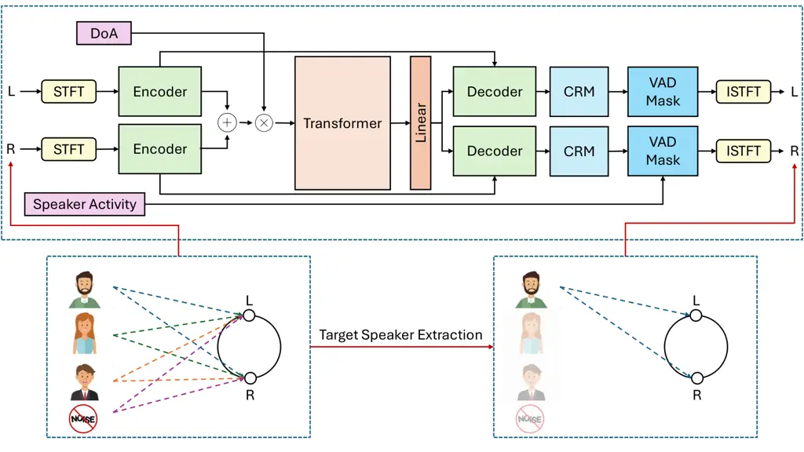

\IEEEoverridecommandlockouts

# BiTSE: Binaural Target Speaker Extraction in Noisy Multi-Talker Environments for AR Glass Arrays

\authorblockN Selani A. Indrapala and Wageesha N. Manamperi
\authorblockA Department of Electronic and Telecommunication
Engineering, University of Moratuwa, Sri Lanka  
E-mail: {indrapalasa.20, wageesham}@uom.lk ^(†)^(†)thanks: This work was
supported by the Accelerating Higher Education Expansion and Development
(AHEAD) operation (Grant No. 6026-LK/8743-LK) and the Telecommunications
Regulatory Commission of Sri Lanka (TRCSL) through the Financial Grant
for Research and Development 2024.

###### Abstract

Isolating a desired speech signal in noisy multi-talker conversational
scenarios is a key requirement for augmented reality (AR) wearable
microphone array systems. In this work, a binaural target speaker
extraction (TSE) framework, termed BiTSE, is proposed. It leverages both
spatial and temporal cues, specifically the direction-of-arrival (DoA)
of the target speaker and corresponding voice activity information, to
guide the extraction process. Built upon a binaural signal denoising
architecture, our model integrates three key enhancements: (i) a
DoA-aware attention mechanism using cyclic positional embeddings, (ii) a
timestamp-based masking strategy that utilizes speaker activity to
suppress non-target segments, and (iii) a novel two-stage loss
optimization strategy that first trains the model for robust denoising
and then fine-tunes it to improve perceptual quality. Evaluations on the
SPeech Enhancement for Augmented Reality (SPEAR) challenge dataset
demonstrate that the proposed BiTSE consistently improves upon
conventional approaches, leading to enhanced signal fidelity and
perceptual quality.

{IEEEkeywords}

Binaural target speaker extraction, direction-of-arrival, head-worn
array, multi-objective loss, speaker activity masking

## 1 Introduction

The cocktail party effect, which refers to the human ability to focus on
a single speaker in the presence of multiple overlapping voices, remains
a major challenge for hearable devices and augmented reality (AR)
headsets/glasses \[5, 1, 2\]. Target Speaker Extraction (TSE) focuses on
isolating a specific speaker from a mixture using auxiliary information
about the target speaker \[28\]. Recent methods leverage diverse cues
such as visual information \[14, 19\], acoustic embeddings \[27, 15\],
and spatial features \[26, 24, 8\]. However, in reverberant
environments, single-channel TSE performance degrades due to
reverberation-induced smearing of spectro-temporal structure \[8, 3\].
To address this, multi-microphone approaches are often used to exploit
spatial information, with binaural recordings from two spatially
separated microphones providing particularly useful spatial cues for
improved separation. This paper presents a neural network-based approach
to binaural TSE for AR glasses.

Among the cues used in TSE, spatial information is especially important
in multi-microphone settings, where direction-of-arrival (DoA)
information is often combined with time–frequency representations for
improved performance \[25, 9\]. In addition to cue design, various
architectures have been explored, including CNN- and RNN-based models
\[20, 7\], as well as more recent transformer and self-attention
approaches \[6, 17\]. These attention-based methods have shown strong
effectiveness in speech enhancement and source separation tasks \[22,
13\].

TSE involves two key objectives: suppressing interfering speakers and
noise, while preserving the perceptual quality of the extracted speech.
Prior work has explored loss functions that jointly optimize noise
reduction and perceptual fidelity \[11, 12\]. In particular, the
Binaural Complex Convolutional Transformer Network (BCCTN) \[22\]
improves both signal quality and spatial preservation in binaural speech
enhancement, motivating its extension to TSE. However, binaural TSE is
more challenging than speech enhancement, as it requires selectively
extracting a target speaker from competing sources while maintaining
spatial consistency.



Figure 1: Overview of the proposed BiTSE model. The system operates on
binaural microphone inputs containing background noise and competing
speakers. For each input channel, the STFT is computed separately and
processed through the BCCTN. A DoA embedding is incorporated to guide
the separation process. The model estimates a complex ratio mask (CRM),
which is further refined using a VAD–based masking strategy. Finally,
the inverse STFT is applied to reconstruct the denoised left and right
channel signals.

The SPeech Enhancement for Augmented Reality (SPEAR) challenge \[23\]
comprises noisy speech recordings captured using a microphone array
mounted on AR glasses in a realistic restaurant-like acoustic
environment. The dataset is particularly challenging due to strong
background noise and multiple competing speakers. Consequently, the
target source direction is assumed to be known for the challenge. Apart
from this assumption, most participating algorithms rely on pre-measured
steering vectors or array responses \[23\], including the conventional
baseline, the Minimum Variance Distortionless Response (MVDR) beamformer
\[10\].

In this paper, BiTSE, a deep learning-based binaural TSE algorithm, is
proposed, where BCCTN \[22\] is utilized to extract the desired speech
from multiple interference speakers in noisy, reverberant environments
using both the target source direction and ground-truth voice activity
detection (VAD) as prior information. This work explores the integration
of spatial conditioning, target activity guidance, and
perceptually-oriented optimization within a binaural complex-domain
transformer framework for robust TSE under adverse acoustic conditions.
The main aspects investigated in this work are: (i) DoA-informed
conditioning to incorporate spatial cues within binaural target speaker
extraction; and (ii) speaker activity-based masking to emphasize
target-active segments during extraction. We also propose a novel
two-stage loss optimization strategy that explicitly addresses denoising
and preservation of perceptual quality, enhancing both the accuracy and
naturalness of extracted speech.

The rest of the paper is organized as follows. Sections 3.1 through 3.3
present the proposed azimuth-aware attention mechanism, speaker
activity-based masking strategy, and two-stage loss optimization,
respectively. In Section 4, we evaluate the proposed BiTSE algorithm on
three distinct labeled datasets: D2, D3, and D4, from the SPEAR
challenge \[23\], and compare its performance against BCCTN variants and
the classical MVDR beamformer \[10\], where BiTSE consistently surpasses
state-of-the-art methods.

## 2 Problem Formulation

The objective is to extract a target speaker from a binaural mixture
under low Signal-to-Noise Ratio (SNR), overlapping speech, and
intermittent silence.

For each channel $`c\in\{L,R\}`$, where L and R denote the left and
right channel respectively, the time-domain mixture is modeled as:

```math
x_{c}(t)=\sum_{k=1}^{K}\hat{s}_{c,k}(t)+n_{c}(t), \tag{1}
```

where $`\hat{s}_{c,k}(t)`$ is the contribution of the $`c^{th}`$ channel
of speaker $`k`$, and $`n_{c}(t)`$ is additive noise at the $`c^{th}`$
channel. In the short-time Fourier transform (STFT) domain $`x_{c}(t)`$
can be defined as,

```math
X_{c}(t,f)=\sum_{k=1}^{K}H_{c,k}(f,\theta_{k})S_{k}(t,f)+N_{c}(t,f), \tag{2}
```

where $`H_{c,k}(f,\theta_{k})`$ denotes the acoustic transfer function
between the $`k^{th}`$ source and $`c^{th}`$ microphone channel for a
direction-of-arrival (DoA) $`\theta_{k}`$.

Given the binaural mixture $`X_{c}(t,f)`$ for $`c\in\{L,R\}`$, and an
auxiliary clue $`C_{g}`$, which is used here as the target DoA, the
target speaker extraction (TSE) model estimates the target signal at the
$`c^{th}`$ channel as:

```math
\hat{S}_{c,\text{target}}=\mathrm{TSE}(X_{c}(t,f),C_{g};\bm{\Theta}),\vskip-5.69046pt \tag{3}
```

where $`\bm{\Theta}`$ denote the model parameters.

The aim of this paper is to recover the target source signal
$`\hat{S}_{c,\text{target}}(t,f)`$ arriving from azimuth direction of
$`\theta_{\text{target}}`$, using both the microphone recordings,
$`X_{c}(t,f)`$, and a voice activity detection (VAD) label,
$`v(t)\in\{0,1\}`$, which indicates target activity of the desired
source.

## 3 Model architecture

In this section, we present the proposed binaural TSE (BiTSE)
architecture in detail. The model is designed to leverage binaural cues,
spatial embeddings, and temporal information to achieve robust target
speaker extraction. The proposed model, as depicted by Fig. 1, builds
upon the Binaural Complex Convolutional Transformer Network (BCCTN)
architecture¹¹ 1 While BCCTN is designed for single speaker binaural
speech enhancement, BiTSE extends it to target speaker extraction by
incorporating DoA-informed attention, speaker activity–based masking,
and a two-stage loss optimization strategy. \[22\], which processes
complex-valued binaural spectrograms through a symmetric dual-branch
design for the left and right channels. The model retains the complex
convolutional encoder-decoder structure of BCCTN to extract
spectral-spatial representations from each channel.

Figure 2: Overview of the azimuth-aware self-attention module in the
transformer block of Fig. 1. The time-varying DoA trajectory is first
converted into a DoA embedding, which modulates the encoder output. The
modulated features are then processed by a complex-valued multi-head
self-attention module to produce the input for the decoder.

### 3.1 Azimuth-Aware Self Attention

In this work, we use the azimuth of the target speaker as a clue for
TSE. The DoA information is first temporally aligned with the STFT time
resolution by averaging over each STFT frame’s corresponding time
window. Secondly, to incorporate azimuthal information as a positional
prior, we adopt a cyclic positional encoding strategy as in \[6\].
Specifically, for an azimuth angle $`\phi`$, the embedding vector
$`\mathrm{PE}_{\mathrm{cyc}}(\phi)\in\mathbb{R}^{D}`$ is defined as,

```math
\mathrm{PE}_{\mathrm{cyc}}(\phi,2j)=\sin\left(\sin(\phi)\cdot\frac{\alpha}{10000^{2j/D}}\right) \tag{4}
```

```math
\mathrm{PE}_{\mathrm{cyc}}(\phi,2j+1)=\sin\left(\cos(\phi)\cdot\frac{\alpha}{10000^{2j/D}}\right) \tag{5}
```

where $`j\in[0,D/2)`$, $`D`$ denotes the embedding dimension, and
$`\alpha`$ is a scaling factor controlling the angular variation of the
encoding. In our implementation, $`\phi`$ is represented in radians, and
we empirically set $`D=40`$ and $`\alpha=20`$, following \[6\]. The
resulting embedding is L2-normalized and broadcast along the temporal
dimension to match the encoder feature resolution. The resulting azimuth
embeddings are then passed through a fully connected layer followed by a
PReLU activation. Next, the azimuth embeddings are element-wise
multiplied with the concatenated encoder output (where the concatenation
operation is represented by the $`"+"`$ symbol in Fig. 1), allowing
spatial modulation. Finally, the azimuth-aware features are processed by
a complex-valued self-attention transformer module. The architecture for
the azimuth aware attention is depicted in Fig. 2. The output of the
azimuth-aware attention module is then passed to the mask estimation
stage to selectively extract the timestamps where the target speaker is
active.

### 3.2 Mask Estimation

The proposed model employs a two-stage masking strategy to isolate the
target speaker while suppressing interference and noise. First, a
complex ratio mask (CRM) $`\mathbb{M}_{c}(t,f)`$ is estimated for each
channel $`c\in\{L,R\}`$ and applied to the mixture STFT as
$`\hat{S}_{c}(t,f)=\mathbb{M}_{c}(t,f)\cdot X_{c}(t,f)`$, where
$`X_{c}(t,f)`$ is the observed binaural mixture. To further enforce
temporal consistency, a VAD-derived binary mask
$`\mathbb{V}(t)\in\{0,1\}`$ is applied, yielding the estimated target
source signal at $`c^{th}`$ channel as
$`\tilde{S}_{c}(t,f)=\mathbb{V}(t)\cdot\hat{S}_{c}(t,f)`$. Here we set
$`\mathbb{V}(t)=1`$, if the target speaker is active in frame $`t`$, and
$`\mathbb{V}(t)=0`$ otherwise. Integrating the VAD mask within the model
improves TSE performance, particularly in inactive speech regions, where
the CRM alone may produce unreliable or irrelevant estimates.

### 3.3 Loss Function

TSE requires addressing two key objectives: (i) denoising, by
suppressing interfering speakers and noise, and (ii) preservation of
perceptual quality. To this end, we adopt a two-stage training strategy
to jointly optimize both objectives.

In the first stage, the model is optimized for denoising using
energy-based fidelity losses. We consider both SNR and the segmental SNR
(SegSNR)²² 2 SegSNR is computed using the publicly available pysepm
library., defined as:

```math
\mathcal{L}_{\text{SNR}}=-10\log_{10}\left(\frac{\sum_{t}s^{2}(t)}{\sum_{t}(s(t)-\hat{s}(t))^{2}+\epsilon}\right), \tag{6}
```

```math
\mathcal{L}_{\text{SegSNR}}=-\frac{1}{K}\sum_{k=1}^{K}10\log_{10}\left(\frac{\sum_{t\in\mathcal{S}_{k}}s^{2}(t)}{\sum_{t\in\mathcal{S}_{k}}(s(t)-\hat{s}(t))^{2}+\epsilon}\right), \tag{7}
```

where $`s(t)`$ and $`\hat{s}(t)`$ are clean and estimated signals
respectively, $`\mathcal{S}_{k}`$ is the $`k^{th}`$ segment, and
$`\epsilon`$ is defined to ensure the stability. SegSNR is computed over
segments defined by the STFT analysis window, using a frame length of
1024 samples with a frame shift of 512 samples.

The second stage fine-tunes the model for perceptual and spatial quality
using additional loss terms: short-time objective intelligibility (STOI)
\[21\],

```math
\mathcal{L}_{\text{STOI}}=-\frac{\text{STOI}_{L}+\text{STOI}_{R}}{2}, \tag{8}
```

and an interaural phase difference (IPD) loss,

```math
\mathcal{L}_{\text{IPD}}=\frac{1}{N}\sum_{k,\ell}M(k,\ell)\left|\text{IPD}_{S}(k,\ell)-\hat{\text{IPD}}_{S}(k,\ell)\right|, \tag{9}
```

where $`M(k,\ell)`$ is a speech mask and $`N`$ is the number of active
time-frequency (TF) bins. Following Tokala et al. \[22\], the IPD is
computed as

```math
\text{IPD}_{S}(k,\ell)=\arctan\left(\frac{S_{L}(k,\ell)}{S_{R}(k,\ell)}\right), \tag{10}
```

where $`\arctan(\cdot)`$ denotes the inverse tangent function used to
compute the phase difference between the left and right channels.

The final training objectives are:

```math
\mathcal{L}_{\text{stage-1}}=\gamma\cdot\mathcal{L}_{\text{SegSNR}}, \tag{11}
```

```math
\mathcal{L}_{\text{stage-2}}=\gamma\cdot\mathcal{L}_{\text{SegSNR}}+\alpha\cdot\mathcal{L}_{\text{IPD}}+\beta\cdot\mathcal{L}_{\text{STOI}}, \tag{12}
```

where $`\gamma`$, $`\alpha`$, and $`\beta`$ are the weight factors for
$`\mathcal{L}_{\text{SegSNR}}`$, $`\mathcal{L}_{\text{IPD}}`$, and
$`\mathcal{L}_{\text{STOI}}`$, respectively. Here we utilize a two-stage
loss optimization where stage 1 uses a higher learning rate
($`\eta_{1}`$) for robust denoising and stage 2 adopts a smaller rate
($`\eta_{2}`$) for perceptual refinement. The two-stage optimization
strategy first establishes denoising and subsequently refines perceptual
quality and spatial consistency without disrupting the learned speech
reconstruction capability.

## 4 Experiments

| Model             | D2                  |                   | D3                  |                   | D4                  |                   |
| ----------------- | ------------------- | ----------------- | ------------------- | ----------------- | ------------------- | ----------------- |
|                   | SegSNR $`\uparrow`$ | PESQ $`\uparrow`$ | SegSNR $`\uparrow`$ | PESQ $`\uparrow`$ | SegSNR $`\uparrow`$ | PESQ $`\uparrow`$ |
| Unprocessed       | -8.69               | 1.45              | -8.67               | 1.46              | -7.34               | 1.21              |
| MVDR (6 channels) | -8.27               | 1.40              | -8.32               | 1.46              | -6.65               | 1.20              |
| BCCTN             | -8.78               | 1.64              | -9.15               | 1.71              | -8.26               | 1.31              |
| BCCTN + DoA       | -9.10               | 1.67              | -9.17               | 1.75              | -8.34               | 1.33              |
| Proposed Method   | -2.57               | 1.72              | -2.57               | 1.80              | -4.05               | 1.34              |

Table 1: Performance comparison with the baseline method on datasets D2,
D3, and D4 using SegSNR and PESQ metrics.

### 4.1 Dataset

We evaluate our proposed model using the SPeech Enhancement for
Augmented Reality (SPEAR) Challenge dataset \[23\]. The dataset consists
of a 6-channel audio mixture captured from an augmented reality (AR)
glass array. In this work, we focus on channels 5 and 6, corresponding
to the binaural left and right ear signals, respectively. In addition to
the audio recordings, each file provides DoA trajectories for all active
speakers, as well as VAD labels for each speaker, both sampled at 20 Hz.

We leverage ground-truth DoA and VAD annotations from the SPEAR dataset,
allowing us to focus on the design and evaluation of the proposed BiTSE
architecture by bypassing separate source direction and speaker activity
estimation, and isolating the assessment of the extraction and
enhancement components.

The dataset is organized into three subsets with increasing acoustic
complexity. Dataset 02 (D2) contains audio samples with simulated
reverberation and environmental noise. Dataset 03 (D3) extends D2 by
incorporating speaker and listener motion to simulate dynamic acoustic
scenes. Dataset 04 (D4) represents the most challenging conditions,
combining high noise levels, reverberation, head movements, and
overlapping speech. All datasets are characterized by low SNR and high
competing speaker conditions, making target speaker extraction
particularly challenging. In D2 and D3, there are over 38% of multi
speaker segments with the audio containing at least 2 concurrent
speakers. In contrast, D4 is dominated by overlapping speech, with 26%,
43%, and 29% of the audio containing 2, 3, and 4 concurrent speakers.

### 4.2 Training Details

The proposed model is trained using the two-stage optimization process
described in Section 3.3. We train the initial denoising stage with a
learning rate of $`\eta_{1}=0.001`$ and employ a lower learning rate of
$`\eta_{2}=0.0001`$ during the subsequent fine-tuning stage. Both stages
are trained for 100 epochs each using the Adam optimizer with a batch
size of 8. The SPEAR dataset provides predefined Main and Dev splits. We
define the loss as a weighted combination of denoising, spatial, and
intelligibility objectives, with empirically chosen weights
$`\gamma=1`$, $`\alpha=5`$, and $`\beta=1`$ for
$`\mathcal{L}_{\text{SegSNR}}`$, $`\mathcal{L}_{\text{IPD}}`$, and
$`\mathcal{L}_{\text{STOI}}`$, respectively. The mixture signals are
downsampled to 16 kHz before being fed into the model. We also filter
out the audio snippets to ensure that at least 60% of the audio is of an
active speech segment. This filtering criterion was applied
independently within each data split. The short-time Fourier transform
(STFT) uses a window size of 1024 samples with a hop size of 512
samples. The model architecture, shown in Fig. 1, incorporates 16
attention heads in the azimuth-aware self-attention module with a total
of approximately 2.6 million parameters.

### 4.3 Results and Discussion

The proposed BiTSE model is evaluated using two quantitative metrics:
SegSNR and Perceptual Evaluation of Speech Quality (PESQ) \[18\], which
respectively measure denoising performance and perceptual quality.

Table 1 compares the proposed BiTSE with the unprocessed binaural
mixture, a 6-channel Minimum Variance Distortionless Response (MVDR)
beamformer \[10\] output, the baseline BCCTN denoiser \[22\], and BCCTN
augmented with DoA embeddings across datasets D2–D4. The MVDR beamformer
uses the 6-channel head-worn microphone array configuration described in
\[10\], consisting of four microphones mounted on eyeglasses and two
in-ear microphones. The beamformer weights are computed using the
standard MVDR formulation, where the steering vector is obtained from
the target DoA and corresponding acoustic transfer functions (ATFs),
while the noise covariance matrix is estimated using an exponentially
averaged sample covariance matrix. The unprocessed signals exhibit
highly negative SegSNR values and low PESQ scores, reflecting
challenging acoustic conditions. The 6-channel MVDR beamformer provides
only marginal improvement, particularly in SegSNR, despite utilizing
more channels than both the BCCTN and the proposed model. As discussed
in \[10\], this could be due to adaptive beamformers being sensitive to
imperfections in target ATFs and DoA estimation, which may introduce
target distortion in dynamic multi-speaker environments. The baseline
BCCTN shows better perceptual quality performance than beamforming,
demonstrating the advantage of learning based binaural denoising. Adding
DoA embeddings to BCCTN yields small gains, highlighting the benefit of
incorporating spatial cues. However, in both the above model
architectures, the improvement is only in the PESQ. Alternatively, the
proposed BiTSE model outperforms all baseline methods, achieving the
greatest improvements across all datasets. SegSNR improves more than
threefold over the unprocessed input, while PESQ consistently increases.
While SegSNR values remain negative, the consistent PESQ gains indicate
effective suppression of perceptually disturbing noise, with spectral
modifications penalized by SegSNR.

| $`\mathcal{L}_{\text{Denoise}}`$ | $`\mathcal{L}_{\text{IPD}}`$ | $`\mathcal{L}_{\text{STOI}}`$ | SegSNR $`\uparrow`$ | PESQ $`\uparrow`$ |
| -------------------------------- | ---------------------------- | ----------------------------- | ------------------- | ----------------- |
|                                  | \-                           | \-                            | -2.50               | 1.66              |
| SNR                              | $`\alpha`$ = 5               | \-                            | -2.58               | 1.67              |
|                                  | $`\alpha`$ = 0.1             | \-                            | -2.61               | 1.67              |
|                                  | \-                           | $`\beta`$ = 5                 | -2.86               | 1.67              |
|                                  | \-                           | $`\beta`$ = 1                 | -2.70               | 1.68              |
|                                  | $`\alpha`$ = 5               | $`\beta`$ = 1                 | -2.72               | 1.67              |
|                                  | \-                           | \-                            | -2.66               | 1.64              |
| SegSNR                           | $`\alpha`$ = 5               | \-                            | -2.45               | 1.70              |
|                                  | $`\alpha`$ = 0.1             | \-                            | -2.47               | 1.70              |
|                                  | \-                           | $`\beta`$ = 5                 | -2.32               | 1.68              |
|                                  | \-                           | $`\beta`$ = 1                 | -2.50               | 1.69              |
|                                  | $`\alpha`$ = 5               | $`\beta`$ = 1                 | -2.57               | 1.72              |

Table 2: Loss function variants with dataset D2

Table 2 presents an ablation study evaluating the model under different
loss configurations. When trained with $`\mathcal{L}_{\text{SNR}}`$
alone, the model achieves SegSNR of -2.50 dB and PESQ of 1.66,
indicating strong global noise suppression. However, adding STOI or IPD
losses produces only marginal changes in SegSNR, suggesting that the
SNR-based loss encourages overly aggressive global energy minimization,
which can inadvertently suppress fine-grained temporal and spectral
variations in speech, leading to an oversmoothing effect. In contrast,
using $`\mathcal{L}_{\text{SegSNR}}`$ alone achieves slightly lower
SegSNR (-2.66 dB) and PESQ (1.64). However, combining SegSNR with
intelligibility-focused losses ($`\mathcal{L}_{\text{STOI}}`$ and
$`\mathcal{L}_{\text{IPD}}`$) further improves PESQ to 1.72 and SegSNR
to -2.57 dB, demonstrating a better balance between noise suppression
and perceptual quality. This indicates that while
$`\mathcal{L}_{\text{SNR}}`$ yields stronger uniform noise suppression,
it tends to oversmooth speech, whereas $`\mathcal{L}_{\text{SegSNR}}`$
better preserves temporal and spectral structures. We note that the
speaker extraction results can be further enhanced by the use of
post-filters to cancel residual noise \[16, 4\].

## 5 Conclusions

In this work, we propose BiTSE, a binaural target speaker extraction
algorithm for multiple talkers in noisy reverberant environments. The
method integrates DoA-informed embeddings, speaker activity-based
masking, and a two-stage loss optimization strategy. Experimental
results show that the proposed BiTSE framework improves performance over
beamforming and neural network baselines on the SPEAR dataset. Future
work will involve subjective testing evaluations, extensive comparison
with other deep learning models, and investigation of model optimization
techniques, such as quantization and model pruning, for real-time
deployment on AR glasses.

## Acknowledgment

The authors would like to thank Prof. Thushara D. Abhayapala and Prof.
Dileeka Dias for support on this work. Generative AI has been assisting
in writing scripts. Grammatical models have been used for grammar aid.

## References

- \[1\] A.S. Bregman (1994) Auditory scene analysis: the perceptual
  organization of sound. MIT press. Cited by: §1.
- \[2\] A.W. Bronkhorst (2000) The cocktail party phenomenon: a review
  of research on speech intelligibility in multiple-talker conditions.
  Acta acustica united with acustica 86 (1), pp. 117–128. Cited by: §1.
- \[3\] Z. Chen, J. Li, X. Xiao, T. Yoshioka, H. Wang, Z. Wang, and Y.
  Gong (2017) Cracking the cocktail party problem by multi-beam deep
  attractor network. In Proc. IEEE Automatic Speech Recognition and
  Understanding Workshop (ASRU), pp. 437–444. Cited by: §1.
- \[4\] S. Cheong, M. Kim, and J.W. Shin (2024) Postfilter for dual
  channel speech enhancement using coherence and statistical model-based
  noise estimation. Sensors 24 (12), pp. 3979. Cited by: §4.3.
- \[5\] E.C. Cherry (1953) Some experiments on the recognition of
  speech, with one and with two ears. Journal of the acoustical society
  of America 25, pp. 975–979. Cited by: §1.
- \[6\] D. Choi and J. Choi (2025) Multichannel-to-multichannel target
  sound extraction using direction and timestamp clues. In Proc. IEEE
  Int. Conf. on Acoust., Speech and Signal Process., pp. 1–5. Cited by:
  §1, §3.1, §3.1.
- \[7\] M. Delcroix, K. Zmolikova, T. Ochiai, K. Kinoshita, and T.
  Nakatani (2021) Speaker activity driven neural speech extraction. In
  Proc. IEEE Int. Conf. on Acoust., Speech and Signal Process.,
  pp. 6099–6103. Cited by: §1.
- \[8\] M. Elminshawi, S. R. Chetupalli, and E. Habets (2023)
  Beamformer-guided target speaker extraction. In Proc. IEEE Int. Conf.
  on Acoust., Speech and Signal Process., pp. 1–5. Cited by: §1.
- \[9\] R. Gu, S. Zhang, Y. Zou, and D. Yu (2021) Complex neural spatial
  filter: enhancing multi-channel target speech separation in complex
  domain. IEEE Signal Process. Lett. 28, pp. 1370–1374. Cited by: §1.
- \[10\] S. Hafezi, A.H. Moore, P. Guiraud, P.A. Naylor, J. Donley, V.
  Tourbabin, and T. Lunner (2023) Subspace hybrid beamforming for
  head-worn microphone arrays. In Proc. IEEE Int. Conf. on Acoust.,
  Speech and Signal Process., pp. 1–5. Cited by: §1, §1, §4.3.
- \[11\] C. Hernandez-Olivan, M. Delcroix, T. Ochiai, N. Tawara, T.
  Nakatani, and S. Araki (2024) Interaural time difference loss for
  binaural target sound extraction. In Proc. IEEE Int. Workshop on
  Acoust. Signal Enhancement, pp. 210–214. Cited by: §1.
- \[12\] M. Kolbæk, Z. Tan, S.H. Jensen, and J. Jensen (2020) On loss
  functions for supervised monaural time-domain speech enhancement.
  IEEE/ACM Trans. on Audio, Speech, and Lang. Process. 28, pp. 825–838.
  Cited by: §1.
- \[13\] Z. Kong, W. Ping, A. Dantrey, and B. Catanzaro (2022) Speech
  denoising in the waveform domain with self-attention. In Proc. IEEE
  Int. Conf. on Acoust., Speech and Signal Process., pp. 7867–7871.
  Cited by: §1.
- \[14\] J. Lin, X. Cai, H. Dinkel, J. Chen, Z. Yan, Y. Wang, J.
  Zhang, Z. Wu, Y. Wang, and H. Meng (2023) AV-SepFormer:
  cross-attention sepformer for audio-visual target speaker extraction.
  In Proc. IEEE Int. Conf. on Acoust., Speech and Signal Process.,
  pp. 1–5. Cited by: §1.
- \[15\] K. Liu, Z. Du, X. Wan, and H. Zhou (2023) X-SepFormer:
  end-to-end speaker extraction network with explicit optimization on
  speaker confusion. In Proc. IEEE Int. Conf. on Acoust., Speech and
  Signal Process., pp. 1–5. Cited by: §1.
- \[16\] W. Manamperi, P. N. Samarasinghe, T. D. Abhayapala, and J.
  Zhang (2022) GMM based multi-stage Wiener filtering for low SNR speech
  enhancement. In Proc. IEEE Int. Workshop on Acoust. Signal
  Enhancement, pp. 1–5. Cited by: §4.3.
- \[17\] H. Meng, Q. Zhang, X. Zhang, V. Sethu, and E.
  Ambikairajah (2024) Binaural selective attention model for target
  speaker extraction. In Proc. Interspeech 2024, pp. 4323–4327. Cited
  by: §1.
- \[18\] I. Recommendation (2001) Perceptual evaluation of speech
  quality (PESQ): an objective method for end-to-end speech quality
  assessment of narrow-band telephone networks and speech codecs. Rec.
  ITU-T P. 862. Cited by: §4.3.
- \[19\] H. Sato, T. Ochiai, K. Kinoshita, M. Delcroix, T. Nakatani,
  and S. Araki (2021) Multimodal attention fusion for target speaker
  extraction. In IEEE Spoken Language Technology Workshop (SLT),
  pp. 778–784. Cited by: §1.
- \[20\] R. Sinha, M. Tammen, C. Rollwage, and S. Doclo (2021)
  Speaker-conditioned target speaker extraction based on customized LSTM
  cells. In Proc. Speech Communication; 14th ITG Conference, pp. 1–5.
  Cited by: §1.
- \[21\] C.H. Taal, R.C. Hendriks, R. Heusdens, and J. Jensen (2011) An
  algorithm for intelligibility prediction of time–frequency weighted
  noisy speech. IEEE Transactions on audio, speech, and language
  processing 19 (7), pp. 2125–2136. Cited by: §3.3.
- \[22\] V. Tokala, E. Grinstein, M. Brookes, S. Doclo, J. Jensen, and
  P.A. Naylor (2024) Binaural speech enhancement using deep complex
  convolutional transformer networks. In Proc. IEEE Int. Conf. on
  Acoust., Speech and Signal Process., pp. 681–685. Cited by: §1, §1,
  §1, §3.3, §3, §4.3.
- \[23\] V. Tourbabin, P. Guiraud, S. Hafezi, P.A. Naylor, A.H.
  Moore, J. Donley, and T. Lunner (2023) The SPEAR challenge-review of
  results. In Proc. Forum Acusticum, Cited by: §1, §1, §4.1.
- \[24\] R. Wang, L. Li, and T. Toda (2024) Dual-channel target speaker
  extraction based on conditional variational autoencoder and
  directional information. IEEE/ACM Trans. on Audio, Speech, and Lang.
  Process.. Cited by: §1.
- \[25\] Y. Wang, J. Zhang, S. Chen, W. Zhang, Z. Ye, X. Zhou, and L.
  Dai (2024) A study of multichannel spatiotemporal features and
  knowledge distillation on robust target speaker extraction. In Proc.
  IEEE Int. Conf. on Acoust., Speech and Signal Process., pp. 431–435.
  Cited by: §1.
- \[26\] Y. Wang, J. Zhang, C. Jiang, W. Zhang, Z. Ye, and L. Dai (2025)
  Leveraging boolean directivity embedding for binaural target speaker
  extraction. In Proc. IEEE Int. Conf. on Acoust., Speech and Signal
  Process., pp. 1–5. Cited by: §1.
- \[27\] K. Zhang, J. Li, S. Wang, Y. Wei, Y. Wang, Y. Wang, and H.
  Li (2025) Multi-level speaker representation for target speaker
  extraction. In Proc. IEEE Int. Conf. on Acoust., Speech and Signal
  Process., pp. 1–5. Cited by: §1.
- \[28\] K. Zmolikova, M. Delcroix, T. Ochiai, K. Kinoshita, J.
  Černockỳ, and D. Yu (2023) Neural target speech extraction: an
  overview. IEEE Signal Process. Mag. 40 (3), pp. 8–29. Cited by: §1.
