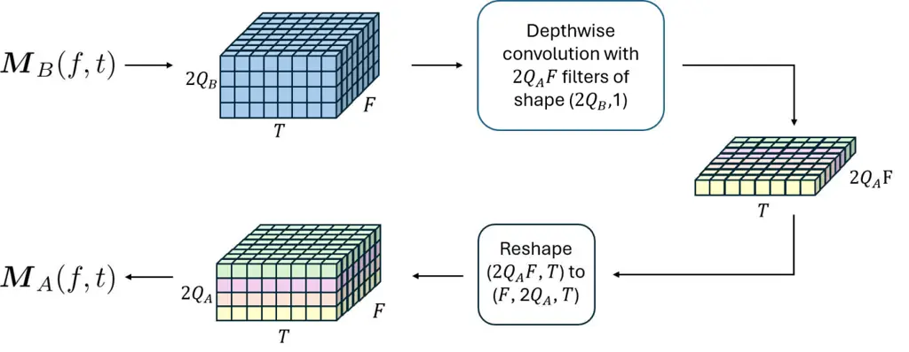
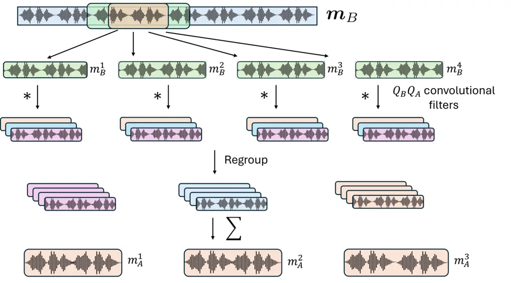
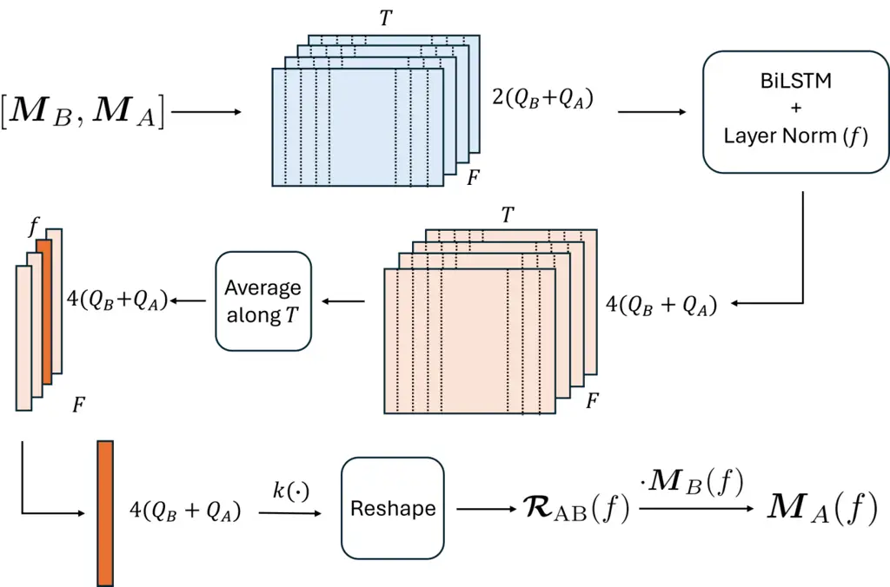

Yalegama Manamperi

# Deep Learning Based Relative Transfer Matrix Estimation for Multiple Sources and Multiple Microphones

Oshan A. B    Wageesha N

###### Abstract

The Relative Transfer Matrix (ReTM), recently introduced as a
generalization of the relative transfer function for multiple receivers
and sources, shows promising performance when applied to speech
enhancement in noisy environments. Estimating the ReTM of sound sources
by exploiting the covariance matrices of multichannel recordings is
highly beneficial for practical applications and, to date, remains the
only proposed approach. This paper investigates deep learning-based ReTM
estimation. We propose three novel supervised learning frameworks using
time and short-time frequency transform domain convolutional networks,
and a Long Short-Term Memory-based recurrent neural network.
Experimental results demonstrate that the proposed models achieve more
accurate estimation of the ReTM using five objective metrics compared to
the covariance-based method. We also show the effectiveness of the
proposed frameworks for speech enhancement, achieving performance on par
with the baseline method.

###### keywords

Relative transfer matrix, speech enhancement, CNN, LSTM, time domain

^(†)^(†)address: ¹ Department of Electronic and Telecommunication
Engineering, University of Moratuwa, Sri Lanka  
² School of Engineering, The Australian National University, Australia
^(†)^(†)email: yalegamammoab.20@uom.lk, wageesham@uom.lk

## 1 Introduction

Blind estimation of the relative transfer function (ReTF) without
requiring positional knowledge of receivers or sound sources is highly
attractive in practical applications such as robot audition \[1\], drone
audition \[2\], teleconferencing \[3\], and hearing aids \[4\], which
involve tasks such as sound source localization, speech enhancement,
speaker separation, and acoustic echo cancellation \[5, 6, 7, 8\].
However, these applications typically involve multiple simultaneously
active sound sources, where the assumption of W-disjoint orthogonality
\[9\] required for ReTF estimation does not hold. To overcome this
limitation, the relative transfer matrix (ReTM) \[10\] has been
introduced as a generalization of the ReTF for acoustic environments
with multiple simultaneously active sound sources and multiple
microphones, providing an essential component in audio signal processing
techniques and applications. In this paper, we propose machine
learning-based methods for ReTM estimation from microphone recordings.

Many approaches to estimate ReTF for a single active sound source have
been developed \[5, 6, 7, 11, 12, 13, 14, 15, 16, 17, 18, 19, 20, 21,
22, 23, 24, 25\]. Among them, covariance-based methods have gained
attention due to their practical feasibility as well as simplicity \[11,
12, 13, 14, 15, 16\], whereas, machine learning-based approaches offer
superior performance at an increased computational cost \[19, 20, 21,
22, 23, 24, 25\].

In \[10\], the concept of ReTM was introduced to relate the signal
received between two sets of microphone groups with respect to all
active sources present in a room. Similar to the ReTF \[6\], the ReTM is
independent of source signals but dependent on the spatial location of
the sources and the environment \[10\]. Recently, various studies have
been proposed to utilize ReTM for speech enhancement and speaker
separation in multi-source noisy reverberant environments \[26, 27, 28,
29, 30\], which have shown significant performance improvement.
Traditional ReTM estimation approach exploits statistical relationships
between two microphone groups using covariance matrices \[10\]. In
contrast to the baseline method that learns a spatial mapping between
receiver groups, alternative approaches remain largely unexplored.

In this paper, we introduce three fully supervised machine learning
frameworks for ReTM estimation. We use both time and short-time Fourier
transform (STFT) domains, deep learning approaches. All three models
assume a stationary environment that all sound sources are unmoving. The
contributions of this work are as follows: 1) We propose: i) the STFT
Convolutional Network (SCoNet) that uses depthwise convolution; ii) the
Convolutional Filter and Summation Network (FuSNet) that applies a set
of individual convolutional filters; and iii) the Long Short-Term Memory
(LSTM)-based Autoencoder Network (LAeNet) that uses a shared
bidirectional-LSTM followed by a feedforward network. 2) We evaluate
ReTM estimation accuracy with respect to the covariance-based approach
using five qualitative metrics, signal-to-distortion ratio (SDR), mean
square error (MSE), log spectral distortion (LSD), average phase
distortion (APD), and relative spectrum error (RSE). 3) We demonstrate
the merits of the proposed models in speech denoising. The simulation
results are comparable to the baseline method overall, while the STFT
domain models consistently outperform it.

## 2 Problem formulation

Consider a reverberant environment with concurrently active
$`\mathcal{L}`$ sound sources. In the short time Fourier transform
(STFT) domain, we denote $`S_{\ell}(f,t)`$,
$`\ell={1,\cdots,\mathcal{L}}`$ as the source signals. Let there be
$`Q`$ arbitrary distributed microphones in the room. We divide them to
two groups of microphones, $`\{A\}`$ and $`\{B\}`$ with $`Q_{A}`$ and
$`Q_{B}`$ microphones, respectively ($`Q=Q_{A}+Q_{B}`$). We denote
$`\mathbf{M}_{A}(f,t)`$ and $`\mathbf{M}_{B}(f,t)`$ as the vector of
received signals at microphone groups A and B, respectively. Then the
received signals at each microphone group in matrix form as

```math
\mathbf{M}_{A}(f,t)=\mathbf{H}_{A}(f)\mathbf{S}(f,t), \tag{1}
```

```math
\mathbf{M}_{B}(f,t)=\mathbf{H}_{B}(f)\mathbf{S}(f,t),
```

where $`\mathbf{S}(f,t)=[S_{1}(f,t),\ldots,S_{\mathcal{L}}(f,t)]^{T}`$,
and $`\{\cdot\}^{T}`$ is the matrix transpose. Here,
$`\mathbf{H}_{A}(f)\in\mathbb{C}^{Q_{A}\times\mathcal{L}}`$ and
$`\mathbf{H}_{B}(f)\in\mathbb{C}^{Q_{B}\times\mathcal{L}}`$ are the
matrices with elements defined by the acoustic transfer functions. Note
that we consider thermal microphone noise to be negligible.

The ReTM, $`\bm{\mathcal{R}}_{AB}(f)`$, is defined as in \[10\]

```math
\bm{\mathcal{R}}_{AB}(f)\triangleq\mathbf{H}_{A}(f)\mathbf{H}_{B}(f)^{\dagger}, \tag{2}
```

where $`(\cdot)^{\dagger}`$ is Moore-Penrose inverse, assuming the
validity, i.e., $`Q_{B}\geq\mathcal{L}`$. Thus, we can relate the
received signal at group $`\{A\}`$ and $`\{B\}`$ using

```math
\mathbf{M}_{A}(f,t)=\bm{\mathcal{R}}_{AB}(f)\mathbf{M}_{B}(f,t). \tag{3}
```

In time domain Equation 3 is given by

```math
m_{A}^{j}(t)=\sum_{i=1}^{Q_{B}}r_{AB}^{ji}(t)\ast m_{B}^{i}(t),\quad j={1,\cdots,Q_{A}}, \tag{4}
```

where $`m_{A}^{j}`$, and $`m_{B}^{i}`$ denote the signals of the
$`j^{\text{th}}`$ microphone in group $`\{A\}`$, and the
$`i^{\text{th}}`$ microphone in group $`\{B\}`$, respectively,
$`r_{AB}^{ji}`$ denotes the inverse Fourier transform of the
$`\{j,i\}^{\text{th}}`$ element of $`\boldsymbol{\mathcal{R}}_{AB}(f)`$.

The aim of this paper is to exploit the spatial properties of sound
sources by modeling the ReTM with machine learning algorithms in the
time domain and STFT domain as $`f_{B}(\cdot)`$, and $`F_{B}(\cdot)`$,
respectively, such that

```math
\bm{M}_{A}(f,t)=F_{B}(\bm{M}_{B}(f,t)), \tag{5}
```

```math
\boldsymbol{m}_{A}(t)=f_{B}(\boldsymbol{m}_{B}(t)). \tag{6}
```

The next section proposes machine learning approaches for the modeling
of $`f_{B}(\cdot)`$ and $`F_{B}(\cdot)`$.

## 3 Proposed ReTM estimation models

In this section, we present two convolutional networks and one Long
Short-Term Memory (LSTM)-based recurrent neural network for the modeling
of the ReTM.

### 3.1 STFT convolutional network (SCoNet)

We model $`F_{B}(\cdot)`$ using SCoNet, which applies depthwise
convolution operations in the STFT domain, as shown in Figure 1. We
input $`\boldsymbol{M}_{B}(f,t)`$, STFT of microphone signals in group
$`\{B\}`$, and train to estimate the microphone signals in group
$`\{A\}`$. SCoNet stacks the real and imaginary parts along the channel
dimension and performs two-dimensional depthwise convolution across the
time and channel axes, allowing the model to learn distinct parameter
sets for each frequency component of the relative transfer matrix. The
channel-wise outputs of group $`\{A\}`$ are then stacked to form the
STFT representation of $`M_{A}(f,t)`$.



Figure 1: Model architecture of SCoNet, where $`F`$ and $`T`$ are the
number of frequency bins and time frames, respectively.

### 3.2 Convolutional filter and summation network (FuSNet)

Motivated by the effectiveness of convolutional neural networks (CNNs)
in modeling the ReTF \[23\], we propose FuSNet, which parameterizes
$`f_{B}(\cdot)`$ using $`Q_{A}\times Q_{B}`$ learnable one-dimensional
convolutional filters, whose weights correspond to $`r_{AB}^{ji}(t)`$ in
Equation 4. Figure 3 shows the FuSNet architecture. We input
non-overlapping segments of length $`L`$, and a context window of size
$`3L`$ from the time frames of microphone signals at group $`\{B\}`$.
The context window is chosen such that the convolution output matches
the original segment length, setting the filter size to $`L`$. Note that
the window length should be longer than the room’s reverberation time to
satisfy the multiplicative transfer function \[23, 31\]. The convolution
outputs are regrouped and summed to obtain the time domain microphone
signals at group $`\{A\}`$.



Figure 2: Model architecture of FuSNet for the case of $`Q_{B}=4`$ and
$`Q_{A}=3`$.



Figure 3: Model architecture of LAeNet with a shared BiLSTM.

### 3.3 LSTM based autoencoder network (LAeNet)

We propose LAeNet, an LSTM-based autoencoder for modeling of
$`F_{B}(\cdot)`$, as shown in Figure 3. This design exploits LSTMs’
ability to capture narrow-band spatial information \[32\]. In LAeNet,
each frequency bin of the concatenated STFTs $`\boldsymbol{M}_{A}(f,t)`$
and $`\boldsymbol{M}_{B}(f,t)`$ is independently processed by a
bidirectional-LSTM (BiLSTM) layer with shared weights. The resulting
temporal sequences are passed through layer normalization to stabilize
and accelerate training, then averaged over time to yield feature
vectors of size $`4(Q_{B}+Q_{A})`$, where the increase in dimensionality
stems from the BiLSTM. Each feature vector is subsequently mapped by a
fully connected network $`k(\cdot)`$ to estimate the ReTM coefficients,
which are finally used to estimate the group $`\{A\}`$ microphone
signals $`\boldsymbol{M}_{A}(f,t)`$ as in Equation 3.

### 3.4 Loss function and training

To improve the stability and performance of the proposed models, we
train using a weighted sum of the negative signal-to-distortion ratio
(SDR) computed in the time domain, and the relative spectrum error (RSE)
measured in the STFT domain as:

```math
L=-\alpha L_{SDR}(\boldsymbol{m}_{A},\hat{\boldsymbol{m}}_{A})+\beta L_{RSE}(\boldsymbol{M}_{A},\hat{\boldsymbol{M}}_{A}), \tag{7}
```

where $`\hat{\boldsymbol{m}}_{A}`$, and $`\hat{\boldsymbol{M}}_{A}`$
denote the estimated microphone signals at group $`\{A\}`$ in the time
and STFT domains, respectively. This joint optimization enforces
consistency across both representations and improves robustness to noise
and artifacts that may manifest differently in the time and frequency
domains. Here, $`\alpha`$ and $`\beta`$ are weight factors for

```math
L_{SDR}=\frac{1}{T}\sum_{t=1}^{T}10\log_{10}\left(\frac{|m_{A}(t)|_{2}^{2}}{|m_{A}(t)-\hat{m}_{A}(t)|_{2}^{2}}\right) \tag{8}
```

and

```math
L_{RSE}=\frac{1}{FT}\sum_{t=1}^{T}\sum_{f=1}^{F}10\log_{10}\left(\frac{|\hat{M}_{A}(f,t)-M_{A}(f,t)|^{2}}{|M_{A}(f,t)|^{2}}\right), \tag{9}
```

respectively. For training, we employ the Adam optimizer \[33\] with a
learning rate that is adaptively reduced over epochs based on the
validation set performance.

## 4 Experiments

### 4.1 Experimental methodology

We utilize an open-source toolbox \[34\] to model the room impulse
response from the sound sources to irregularly distributed microphones
in a $`6\times 7\times 3`$ m rectangular room ($`T_{60}=500`$ ms). We
assign $`Q=7`$ with $`Q_{A}=3`$, and $`Q_{B}=4`$ number of receivers to
group $`\{A\}`$ and $`\{B\}`$, respectively. We consider four scenarios.
A1: two white Gaussian noise (WGN) sources, A2: two noise sources (air
conditioner noise, music), and B: three sources (speech, air conditioner
noise, music). Scenario C uses a total of $`Q=12`$ microphones with
$`Q_{A}=5`$, and $`Q_{B}=7`$, drives with the same set of sources as B.
The received signals are added with $`40`$ dB SNR of WGN at each
microphone and down-sampled to $`16`$ kHz. For Scenario A1, the
training, validation, and test recordings are 3 minutes, 1 minute, and 1
minute, respectively. For all other scenarios, 50 s and 10 s recordings
are used for training and testing, respectively.

For the model hyperparameter configuration, FuSNet is designed with a
window and context size of 8192 samples. For SCoNet and LAeNet, the
input recordings are converted to STFT frames using a Hann window of
size 8192 with 50% overlap. The window length is selected based on the
room’s reverberation time to ensure that it is sufficiently long for the
multiplicative transfer function assumption to hold \[31\]. The weight
factors $`\alpha`$ and $`\beta`$ are set to 1 and 10, respectively.

For a comprehensive evaluation of the proposed models, we adopt the
covariance-based approach \[10\] as the baseline. To fairly assess
performance across all scenarios, we use five quantitative metrics: (i)
SDR, (ii) mean square error (MSE), defined as

```math
\text{MSE}=10\log_{10}\left(\frac{1}{T}\sum_{t=1}^{T}|m_{A}(t)-\hat{m}_{A}(t)|^{2}\right),
```

\(iii\) log spectral distortion (LSD), defined as

```math
\text{LSD}=\sqrt{\frac{1}{N}\sum_{\eta=1}^{N}\left(10\log_{10}{|M_{A}(f_{\eta},t)|^{2}/|\hat{M}_{A}(f_{\eta},t)|^{2}}\right),^{2}}
```

\(iv\) average phase distortion (APD), defined as

```math
\text{APD}=\frac{1}{N}\sum_{\eta=1}^{N}\left|\angle M_{A}(f_{\eta},t)-\angle\hat{M}_{A}(f_{\eta},t)\right|,
```

and (v) RSE.

### 4.2 Results and discussion

| Scenario | Method   | SDR (dB)↑            | MSE (dB)↓                    | LSD (dB)↓          | APD (rad)↓               | RSE (dB)↓              |
| -------- | -------- | -------------------- | ---------------------------- | ------------------ | ------------------------ | ---------------------- |
| A1       | Baseline | $`26.56/26.1`$       | $`-43.84/-43.56`$            | $`1.21/1.19`$      | $`0.1/0.1`$              | $`-24.76/-24.10`$      |
|          | SCoNet   | $`24.76/24.24`$      | $`-40.88/-40.54`$            | $`0.89/0.96`$      | $`0.13/0.14`$            | $`-25.62/-24.89`$      |
|          | FuSNet   | $`\bm{29.13/28.46}`$ | $`\bm{-59.25/-58.75}`$       | $`\bm{0.5/0.49}`$  | $`\bm{0.08/0.09}`$       | $`\bm{-48.61/-48.4}`$  |
|          | LAeNet   | $`25.12/24.09`$      | $`-55.24/-54.38`$            | $`1.03/1.13`$      | $`0.12/0.13`$            | $`-20.25/-19.74`$      |
| A2       | Baseline | $`21.2/20.5`$        | $`-36.25/-36.57`$            | $`2.02/2.03`$      | $`0.21/0.21`$            | $`-25.28/24.65`$       |
|          | SCoNet   | $`26.26/26.59`$      | $`-43.08/-42.47`$            | $`\bm{1.22/1.23}`$ | $`\bm{0.18/0.19}`$       | $`-24.61/-24.06`$      |
|          | FuSNet   | $`\bm{30.96/29.62}`$ | $`\bm{-55.2/-54.94}`$        | $`2.47/2.59`$      | $`0.23/0.2`$             | $`\bm{-39.81/-33.78}`$ |
|          | LAeNet   | $`28.07/26.21`$      | $`-52.32/-51.53`$            | $`1.68/1.70`$      | $`0.22/0.21`$            | $`-18.17/-17.67`$      |
| B        | Baseline | $`16.1/16.29`$       | $`-36.65/-37.49`$            | $`2.48/2.5`$       | $`0.23/0.24`$            | $`-17.39/-16.85`$      |
|          | SCoNet   | $`\bm{22.42/21.96}`$ | $`-42.78/-42.98`$            | $`\bm{1.53/1.54}`$ | $`\bm{0.19/0.19}`$       | $`\bm{-20.76/-20.33}`$ |
|          | FuSNet   | $`22.51/21.91`$      | $`\bm{-45.12/-45.17}`$       | $`4.89/4.96`$      | $`0.71/0.72`$            | $`-19.60/-19.16`$      |
|          | LAeNet   | $`22.36/21.88`$      | $`-45.01`$ / $`\bm{-45.18}`$ | $`1.78/1.88`$      | $`0.2/0.21`$             | $`-17.58/-17.21`$      |
| C        | Baseline | $`23.05/23.25`$      | $`-43.6/-43.35`$             | $`\bm{1.03/1.09}`$ | $`0.15/0.15`$            | $`-34.03/-33.22`$      |
|          | SCoNet   | $`29.59/27.85`$      | $`-44.12/-43.27`$            | $`1.06/1.17`$      | $`\bm{0.14}`$ / $`0.16`$ | $`-28.63/-27.43`$      |
|          | FuSNet   | $`\bm{40.33/38.88}`$ | $`\bm{-62.89/-61.98}`$       | $`1.95/2.10`$      | $`0.15/0.16`$            | $`\bm{-34.07/-33.27}`$ |
|          | LAeNet   | $`29.35/28.57`$      | $`{-52/-51.77}`$             | $`1.39/1.49`$      | $`\bm{0.14/0.15}`$       | $`-20.15/-19.97`$      |

Table 1: ReTM estimation accuracy for various scenarios (Channel
1/Average).

The ReTM estimation accuracy results are given in Table 1. From the
results in scenario A1, we observe that FuSNet achieves the highest
performance across both time and frequency domain metrics. This
improvement of FuSNet can be attributed to the use of WGN sources that
provide a uniform spectral distribution and thereby facilitate more
accurate frequency domain estimation. The other proposed methods, SCoNet
and LAeNet, also achieve high estimation accuracy, performing comparably
to the baseline method.

In scenario A2, FuSNet again achieves the highest overall performance
across most evaluation metrics, with noticeable degradation in LSD and
APD. The key difference between scenarios A1 and A2 lies in the
replacement of WGN with specific noise sources, which exhibit
non-uniform frequency distributions. This indicates that FuSNet performs
best with uniform spectra but degrades under non-uniform conditions.
Moreover, SCoNet yields performance on par with LAeNet and surpasses the
state-of-the-art method, excluding the RSE score, where the baseline
approach shows the second-best performance.

From scenarios B and C, we observe that all four methods exhibit
improved ReTM estimation accuracy as the number of microphones in both
groups increases, consistently across all five evaluation metrics. The
traditional method exhibits significantly reduced accuracy, and is seen
to be the worst performing method among all methods, except for the LSD
and RSE measures. Compared to the baseline, both SCoNet and FuSNet, show
substantially superior performance. SCoNet performs best in scenario B
with an MSE score lower than FuSNet. Whereas, FuSNet achieves the
highest performance in scenario C, excluding the LSD and APD measures.

Overall, it can be verified that although the baseline method achieves
satisfactory results, it is clearly outperformed by the proposed deep
learning-based models, particularly in the time domain measures, e.g.,
MSE and SDR.

| Method | $`QA=3,Q_{B}=4`$ |         | $`Q_{A}=5,Q_{B}=7`$ |         |
| ------ | ---------------- | ------- | ------------------- | ------- |
|        | Param.           | Latency | Param.              | Latency |
| SCoNet | $`196.7`$k       | 6.77ms  | $`573.6`$k          | 6.61ms  |
| FuSNet | $`98.3`$k        | 1.07ms  | $`286.8`$k          | 2.41ms  |
| LAeNet | $`263.5`$k       | 1.80s   | $`652.5`$k          | 1.78s   |

Table 2: Computational complexity of each proposed model.

Table 2 compares the computational efficiency of the proposed models in
terms of the parameter count, alongside the inference latency measured
on an NVIDIA GeForce RTX 3090 GPU. Across both scenarios, FuSNet
demonstrates the lowest latency and the smallest parameter count,
whereas LAeNet exhibits the highest latency and the largest number of
parameters. Notably, FuSNet and SCoNet benefit from faster training due
to their comparatively low latency, although their memory usage
increases linearly with the window length. In contrast, LAeNet maintains
nearly constant memory usage as the window length increases, owing to
its shared LSTM and feedforward network architecture. This design allows
efficient parameter utilization for longer windows but results in
substantially longer training times due to higher latency.

## 5 Application into speech enhancement

Motivated by the computational efficiency of the proposed architectures,
in this section we further evaluate the ReTM estimation accuracy in a
speech denoising application \[27\].

Denote $`\bm{\mathcal{R}}_{AB}^{(N)}`$ be the noise sources ReTM. In
brief, \[27\] proposed to enhance the speech from the noisy speech
recordings with the known $`\bm{\mathcal{R}}_{AB}^{(N)}`$, which can be
estimated using the noise-only recordings, as

```math
\displaystyle\hat{\mathbf{S}}\triangleq\mathbf{M}_{A}-\bm{\mathcal{R}}_{AB}^{(N)}\mathbf{M}_{B}=\big[\mathbf{h}_{A}-\bm{\mathcal{R}}_{AB}^{(N)}\mathbf{h}_{B}\big]S, \tag{10}
```

where $`\mathbf{h}_{A}`$ and $`\mathbf{h}_{B}`$ be the acoustic transfer
function vectors from the speech source to group $`\{A\}`$ and $`\{B\}`$
microphones, respectively. We note that $`\mathbf{\hat{S}}`$ is a
$`Q_{A}\times 1`$ vector consists $`Q_{A}`$ copies of estimated target
speech signal $`S`$.

We evaluate speech denoising performance in scenarios B and C (Sec. 4),
each containing a single speech source, where the ReTM is estimated from
1-minute noise-only recordings. For analysis we use the SDR \[35\], and
the Short-Time Objective Intelligibility (STOI) \[36\].

Table 3 depicts the speech enhancement accuracy for both B and C
scenarios. The results confirm that enhanced performance ($`+0.5`$ dB in
SDR, $`13\%`$ in STOI) for all methods. Although FuSNet significantly
outperforms ReTM estimation on most metrics, its speech denoising
performance degrades, confirming the advantage of time-frequency domain
ReTM estimation over the time domain approach. Compared to FuSNet, both
LAeNet and SCoNet, demonstrate significantly superior performance.
LAeNet achieves the highest performance in both scenarios B and C, with
an average SDR of $`+10.55`$ dB and an average STOI of $`37\%`$.
Whereas, SCoNet ranks second in both scenarios, yielding an average SDR
of $`+8.41`$ dB and an average STOI $`33\%`$. In contrast, the
traditional method demonstrates comparable performance, although the
proposed models, except FuSNet, consistently achieve better results in
both scenarios. From informal listening, we find that FuSNet’s denoised
speech remains significant echo noise, leading to lower performance,
which could be improved through dereverberation algorithms \[37, 38\]
that we will investigate in future work. The audio samples of this work
can be found on GitHub.¹¹ 1
[https://github.com/oshanyalegama/Denoised_ReTM_DL](https://github.com/oshanyalegama/Denoised_ReTM_DL)

| Method   | B             |               | C             |               |
| -------- | ------------- | ------------- | ------------- | ------------- |
|          | SDR           | STOI          | SDR           | STOI          |
| Noisy    | $`-2.70`$     | $`0.54`$      | $`-2.70`$     | $`0.54`$      |
| Baseline | $`6.06`$      | $`0.87`$      | $`4.07`$      | $`0.85`$      |
| SCoNet   | $`6.45`$      | $`0.87`$      | $`4.96`$      | $`0.87`$      |
| FuSNet   | $`2.21`$      | $`0.80`$      | $`-1.19`$     | $`0.67`$      |
| LAeNet   | $`\bm{8.67}`$ | $`\bm{0.92}`$ | $`\bm{7.03}`$ | $`\bm{0.91}`$ |

Table 3: Evaluation results on the scenarios B & C.

## 6 Conclusion

We proposed SCoNet, FuSNet, and LAeNet to estimate the ReTM using
machine learning. Our proposed approaches use either time or
time-frequency domains to model the inter-group spatial relationship.
Experimental results confirmed that FuSNet consistently outperformed
other approaches in terms of accuracy, while SCoNet and LAeNet achieved
performance comparable to the baseline method. We further validated the
effectiveness of the proposed methods in a speech denoising application.
In future work, we aim to extend these models to source separation,
speech dereverberation, and investigate optimal microphone grouping
strategies for ReTM-based applications.

## 7 Acknowledgements

This work was supported by the Accelerating Higher Education Expansion
and Development (AHEAD) operation (Grant No. 6026-LK/8743-LK, World
Bank) and a data scholarship from the Linguistic Data Consortium,
University of Pennsylvania. The authors thank Prof. Thushara Abhayapala
for fruitful discussions and support on this work.

## 8 Use of Generative AI Disclosure

Generative AI tools were used to assist in drafting and refining
portions of the scripts. Additionally, grammar-checking models were
utilized to improve language clarity, correctness, and overall
readability.

## References

- \[1\] K. Nakadai, T. Lourens, H. G. Okuno, and H. Kitano (2000) Active
  audition for humanoid. In Natl. Conf. Artif. Intell., pp. 832–839.
  Cited by: §1.
- \[2\] W. Manamperi, T. D. Abhayapala, J. (. Zhang, and P. N.
  Samarasinghe (2022) Drone audition: Sound source localization using
  on-board microphones. IEEE/ACM Trans. on Audio, Speech, and Lang.
  Process. 30, pp. 508 – 519. Cited by: §1.
- \[3\] S. Araki, M. Fujimoto, K. Ishizuka, H. Sawada, and S.
  Makino (2008) Speaker indexing and speech enhancement in real
  meetings/conversations. In Proc.IEEE Int. Conf. on Acoust., Speech and
  Signal Process., pp. 93–96. Cited by: §1.
- \[4\] D. Marquardt, E. Hadad, S. Gannot, and S. Doclo (2016)
  Incorporating relative transfer function preservation into the
  binaural multi-channel wiener filter for hearing aids. In Proc.IEEE
  Int. Conf. on Acoust., Speech and Signal Process., pp. 6500–6504.
  Cited by: §1.
- \[5\] S. Gannot, D. Burshtein, and E. Weinstein (2001) Signal
  enhancement using beamforming and nonstationarity with applications to
  speech. IEEE Trans. on Signal Process. 49 (8), pp. 1614–1626. Cited
  by: §1, §1.
- \[6\] R. Talmon, I. Cohen, and S. Gannot (2009) Relative transfer
  function identification using convolutive transfer function
  approximation. IEEE Trans. on Audio, Speech, and Lang. Process. 17
  (4), pp. 546–555. Cited by: §1, §1, §1.
- \[7\] E. Warsitz, A. Krueger, and R. Haeb-Umbach (2008) Speech
  enhancement with a new generalized eigenvector blocking matrix for
  application in a generalized sidelobe canceller. In Proc.IEEE Int.
  Conf. on Acoust., Speech and Signal Process., pp. 73–76. Cited by: §1,
  §1.
- \[8\] W. N. Manamperi, T. D. Abhayapala, L. Brinie, J. Zhang,
  and P. N. Samarasinghe (2025) Drone audition: on measurements and
  modeling of drone-related transfer functions. IEEE/ACM Trans. on
  Audio, Speech, and Lang. Process. 33, pp. 1775 – 1786. Cited by: §1.
- \[9\] O. Yilmaz and S. Rickard (2004) Blind separation of speech
  mixtures via time-frequency masking. IEEE Signal Process. Mag. 52 (7),
  pp. 1830–1847. Cited by: §1.
- \[10\] T. D. Abhayapala, L. Birnie, M. Kumar, D. Grixti-Cheng,
  and P. N. Samarasinghe (2023) Generalizing the relative transfer
  function to a matrix for multiple sources and multichannel
  microphones. In Proc.Eur. Signal Process. Conf., pp. 336–340. Cited
  by: §1, §1, §2, §4.1.
- \[11\] R. Serizel, M. Moonen, B. Van Dijk, and J. Wouters (2014)
  Low-rank approximation based multichannel wiener filter algorithms for
  noise reduction with application in cochlear implants. IEEE/ACM Trans.
  on Audio, Speech, and Lang. Process. 22 (4), pp. 785–799. Cited by:
  §1.
- \[12\] R. Varzandeh, M. Taseska, and E. A. P. Habets (2017) An
  iterative multichannel subspace-based covariance subtraction method
  for relative transfer function estimation. In Proc.Joint Workshop
  Hands-free Speech Comm. and Microphone Arrays, pp. 11–15. Cited by:
  §1.
- \[13\] S. Markovich, S. Gannot, and I. Cohen (2009) Multichannel
  eigenspace beamforming in a reverberant noisy environment with
  multiple interfering speech signals. IEEE/ACM Trans. on Audio, Speech,
  and Lang. Process. 17 (6), pp. 1071–1086. Cited by: §1.
- \[14\] W. Middelberg, H. Gode, and S. Doclo (2023) Relative transfer
  function vector estimation for acoustic sensor networks exploiting
  covariance matrix structure. In Proc.IEEE Workshop on Applications of
  Signal Process. to Audio and Acoust., pp. 1–5. Cited by: §1.
- \[15\] E. Warsitz and R. Haeb-Umbach (2007) Blind acoustic beamforming
  based on generalized eigenvalue decomposition. IEEE Trans. on Audio,
  Speech, and Lang. Process. 15 (5), pp. 1529–1539. Cited by: §1.
- \[16\] S. Markovich-Golan, S. Gannot, and W. Kellermann (2018)
  Performance analysis of the covariance-whitening and the
  covariance-subtraction methods for estimating the relative transfer
  function. In Proc.Eur. Signal Process. Conf., pp. 2499–2503. Cited by:
  §1.
- \[17\] O. Shalvi and E. Weinstein (1996) System identification using
  nonstationary signals. IEEE Trans. on Signal Process. 44 (8),
  pp. 2055–2063. Cited by: §1.
- \[18\] I. Cohen (2004) Relative transfer function identification using
  speech signals. IEEE Trans. on Speech and Audio Process. 12 (5),
  pp. 451–459. Cited by: §1.
- \[19\] A. Brendel, J. Zeitler, and W. Kellermann (2022) Manifold
  learning-supported estimation of relative transfer functions for
  spatial filtering. In Proc.IEEE Int. Conf. on Acoust., Speech and
  Signal Process., pp. 8792–8796. Cited by: §1.
- \[20\] A. Sofer, T. Kounovskỳ, J. Čmejla, Z. Koldovskỳ, and S.
  Gannot (2021) Robust relative transfer function identification on
  manifolds for speech enhancement. In Proc.Eur. Signal Process. Conf.,
  pp. 401–405. Cited by: §1.
- \[21\] B. Yang, X. Li, and H. Liu (2021) Supervised direct-path
  relative transfer function learning for binaural sound source
  localization. In Proc.IEEE Int. Conf. on Acoust., Speech and Signal
  Process., pp. 825–829. Cited by: §1.
- \[22\] B. Yang, H. Liu, and X. Li (2021) Learning deep direct-path
  relative transfer function for binaural sound source localization.
  IEEE/ACM Trans. on Audio, Speech, and Lang. Process. 29,
  pp. 3491–3503. Cited by: §1.
- \[23\] L. Birnie, P. Samarasinghe, T. Abhayapala, and D.
  Grixti-Cheng (2021) Noise retf estimation and removal for low snr
  speech enhancement. In ’IEEE Workshop Mach. Learning Signal Process.’,
  pp. 1–6. Cited by: §1, §3.2.
- \[24\] Z. Wang and D. Wang (2018) Mask weighted stft ratios for
  relative transfer function estimation and its application to robust
  asr. In Proc.IEEE Int. Conf. on Acoust., Speech and Signal Process.,
  pp. 5619–5623. Cited by: §1.
- \[25\] D. Levi, A. Sofer, and S. Gannot (2025) PeerRTF: robust mvdr
  beamforming using graph convolutional network. IEEE Trans. on Audio,
  Speech, and Lang. Process.. Cited by: §1.
- \[26\] W. N. Manamperi and T. D. Abhayapala (2024) Relative transfer
  matrix for drone audition applications: source enhancement. In
  Proc.Asia-Pacific Signal and Inf. Process. Assoc. Annu. Summit and
  Conf., pp. 1–6. Cited by: §1.
- \[27\] M. Kumar, L. Birnie, T. Abhayapala, S. A. Holzinger, A.
  Bastine, D. Grixti-Cheng, and P. Samarasinghe (2024) Speech denoising
  in multi-noise source environments using multiple microphone devices
  via relative transfer matrix. In Proc.Eur. Signal Process. Conf.,
  pp. 336–340. Cited by: §1, §5, §5.
- \[28\] W. N. Manamperi and T. D. Abhayapala (2025) Relative transfer
  matrix estimator using covariance subtraction. arXiv preprint
  arXiv:2510.19439. Cited by: §1.
- \[29\] W. N. Manamperi and T. D. Abhayapala (2024) Successive speaker
  relative transfer function estimation through relative transfer matrix
  in noisy reverberant environments. In Proc.Asia-Pacific Signal and
  Inf. Process. Assoc. Annu. Summit and Conf., pp. 1–6. Cited by: §1.
- \[30\] W. N. Manamperi (2026) Multiple speaker separation in
  reverberant rooms under low snr conditions using the relative transfer
  matrix. accepted for publication in Appl. Acoust.. Cited by: §1.
- \[31\] Y. Avargel and I. Cohen (2007) On multiplicative transfer
  function approximation in the short-time fourier transform domain.
  IEEE Signal Process. Letters 14 (5), pp. 337–340. Cited by: §3.2,
  §4.1.
- \[32\] Y. Yang, C. Quan, and X. Li (2023) McNet: fuse multiple cues
  for multichannel speech enhancement. In Proc.IEEE Int. Conf. on
  Acoust., Speech and Signal Process., pp. 1–5. Cited by: §3.3.
- \[33\] D. P. Kingma and J. Ba (2014) Adam: a method for stochastic
  optimization. arXiv preprint arXiv:1412.6980. Cited by: §3.4.
- \[34\] E. A. Habets (2006) Room impulse response (RIR) generator.
  Note: \[Online\]. Available:
  [https://www.audiolabserlangen.de/fau/professor/habets/software/rir-generator](https://www.audiolabserlangen.de/fau/professor/habets/software/rir-generator)
  Cited by: §4.1.
- \[35\] E. Vincent, R. Gribonval, and C. Févotte (2006) Performance
  measurement in blind audio source separation. IEEE Trans. on Audio,
  Speech, and Lang. Process. 14 (4), pp. 1462–1469. Cited by: §5.
- \[36\] C. H. Taal, R. C. Hendriks, R. Heusdens, and J. Jensen (2011)
  An algorithm for intelligibility prediction of time-frequency weighted
  noisy speech. IEEE/ACM Trans. on Audio, Speech, and Lang. Process. 19
  (7), pp. 2125–2136. Cited by: §5.
- \[37\] P. A. Naylor and N. D. Gaubitch (2010) Speech dereverberation.
  Springer. Cited by: §5.
- \[38\] Z. Wang and D. Wang (2020) Deep learning based target
  cancellation for speech dereverberation. IEEE/ACM Trans. on Audio,
  Speech, and Lang. Process. 28, pp. 941–950. Cited by: §5.
