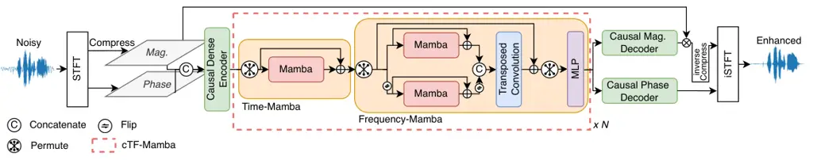
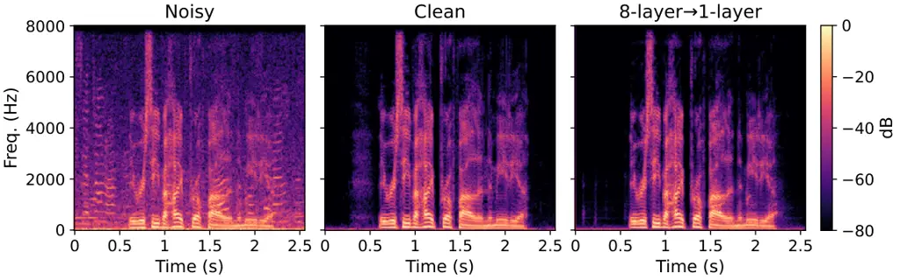

Chao Huang La Quatra Siniscalchi Cheng Fu Tsao

# RT-SEMamba: Real-Time Speech Enhancement Mamba via Progressive Knowledge Distillation

Rong    Sung-Feng    Moreno    Sabato Marco     
Wen-Huang    Szu-Wei    Yu

###### Abstract

We present RT-SEMamba, a fully causal speech enhancement (SE) model
built upon causal time–frequency Mamba blocks. Unlike Transformer-based
architectures that rely on a growing key–value cache, Mamba propagates a
fixed-size recurrent state per layer, enabling memory- and
bandwidth-efficient long-form inference. We further introduce a
progressive knowledge distillation (KD) strategy that compresses an
8-layer teacher into a shallow 1-layer student by jointly distilling
complex spectral outputs and intermediate representations. On
Voicebank-DEMAND, the 8-layer RT-SEMamba achieves 3.32 PESQ with a 25 ms
algorithmic latency constraint, and the distilled 1-layer student
improves over a naive 1-layer baseline from 3.06 to 3.18 PESQ while
preserving the same steady-state RTF, delivering a 2.64$`\times`$
speedup over the teacher. These results demonstrate that state-space
models with progressive KD provide a competitive quality–latency
trade-off for real-time SE.

###### keywords

speech enhancement, real-time processing, knowledge distillation,
state-space models, Mamba

^(†)^(†)address: ¹Academia Sinica, Taiwan ²National Taiwan University,
Taiwan  
³Kore University of Enna, Italy ⁴University of Palermo, Italy ⁵NVIDIA
^(†)^(†)email: roychao@cmlab.csie.ntu.edu.tw, yu.tsao@citi.sinica.edu.tw

## 1 Introduction

Real-time speech enhancement (SE) is a key component in interactive
audio applications such as hearing aids \[1, 2\], cochlear
implants \[3\], AR/VR communication \[4\], and live
teleconferencing \[5\]. In these scenarios, the SE front-end must
satisfy tight algorithmic latency and real-time factor (RTF) constraints
while robustly handling non-stationary noise and reverberation. Unlike
non-causal SE, streaming SE can only rely on past and current
observations, yet still needs to deliver artifact-free speech under
limited compute and memory resources \[6, 7\].

Modern SE systems are typically formulated as supervised regression from
noisy waveforms or time–frequency representations to their clean
targets \[8, 9, 10, 11\]. Convolutional, recurrent, and hybrid
convolutional–recurrent networks \[12, 13, 14, 15\], as well as
Transformer-style architectures \[16, 17, 18\], achieve strong
performance in non-causal benchmarks. Phase-aware, complex-spectrum,
sub-band, and metric-oriented models further improve time–frequency
enhancement quality \[19, 20, 21, 22, 23\]. More recently,
diffusion-based generative models have been explored as an alternative
SE formulation \[24, 25, 26, 27, 28, 29\]. However, many Transformer-
and diffusion-based SE systems are evaluated with non-causal future
context, making low-latency streaming deployment less straightforward.

To better match streaming requirements, several works have proposed
explicitly causal and low-latency SE architectures \[6, 30, 7\].
Waveform-domain models demonstrate real-time operation on commodity
hardware \[6\], and causal front-ends built on self-supervised
representations show that semantic priors can partially compensate for
limited context \[30\].

More recently, Mamba-style selective state-space models \[31\] have been
introduced as linear-complexity alternatives to self-attention, and have
been adapted to time–frequency speech enhancement and separation \[32,
33, 34, 35, 36, 37\]. By propagating a fixed-size recurrent state per
layer, Mamba naturally supports long-form sequence modeling with
constant memory and bandwidth; unlike Transformer/Conformer encoders
that maintain a growing key–value cache, it realizes streaming as a pure
recurrent update that avoids cache growth and reduces memory traffic on
edge devices. These Mamba-based systems are primarily evaluated in
non-causal settings and do not explicitly enforce streaming constraints.

In this work, we revisit SEMamba \[32\] from the perspective of strict
streaming deployment and propose a real-time variant, RT-SEMamba. Unlike
the original SEMamba, which contains non-causal components and is
evaluated offline, RT-SEMamba is made fully causal and operates in an
online streaming regime, making it directly applicable to low-latency
SE. We further introduce a depth-compression scheme \[38\] in which a
deeper 8-layer causal Time-Frequency Mamba (cTF-Mamba) teacher distills
its capability into a lightweight 1-layer student. On the
VoiceBank-DEMAND (VCTK-DEMAND) dataset \[39\], the distilled RT-SEMamba
(8-layer$`\rightarrow`$1-layer) consistently improves over a naive
1-layer baseline on common objective and perceptual metrics, while
substantially narrowing the gap to the 8-layer teacher. At the same
time, it matches the real-time factor of the 1-layer baseline and
reduces steady-state RTF by more than 60% compared with the 8-layer
teacher under the same algorithmic latency constraint of 25   ms,
indicating that RT-SEMamba is suitable for streaming deployment.



Figure 1: Architecture of the proposed RT-SEMamba.

## 2 Related Work

### 2.1 Mamba and SSM-based sequence models

Mamba \[31\] is a selective state space sequence model that replaces
self-attention with a lightweight linear recurrence. In its simplest
form, an SSM maps an input sequence $`\mathbf{x}=\{x_{n}\}_{n=1}^{N}`$
to an output sequence $`\mathbf{y}=\{y_{n}\}_{n=1}^{N}`$ through a
latent state $`\mathbf{h}`$:

```math
\mathbf{h}_{n}=\bar{\mathbf{A}}\,\mathbf{h}_{n-1}+\bar{\mathbf{B}}\,x_{n},\qquad y_{n}=\mathbf{C}\,\mathbf{h}_{n}, \tag{1}
```

where $`\bar{\mathbf{A}}`$ and $`\bar{\mathbf{B}}`$ are discretized
state transition matrices and $`\mathbf{C}`$ is an output projection.
This structure admits both parallel convolutional and recurrent
implementations, yielding linear time and memory complexity for long
sequences.

Building on this backbone, Mamba-style blocks have been applied to
time–frequency speech enhancement and separation \[32, 33, 34, 37\]. In
contrast, RT-SEMamba targets causal streaming speech enhancement with
explicit state propagation and progressive distillation from a deeper
causal teacher.

## 3 RT-SEMamba Architecture

We operate in the complex STFT domain. For a noisy waveform $`x(t)`$, we
compute

```math
\mathbf{X}(f,\tau)=\mathrm{STFT}(x(t))=\mathbf{M}(f,\tau)\,e^{j\mathbf{P}(f,\tau)}, \tag{2}
```

where $`\mathbf{M}`$ and $`\mathbf{P}`$ denote magnitude and phase. Both
teacher and student networks take $`(\mathbf{M},\mathbf{P})`$ as input
and predict $`(\hat{\mathbf{M}},\hat{\mathbf{P}},\hat{\mathbf{C}})`$,
where $`\hat{\mathbf{C}}=\hat{\mathbf{M}}e^{j\hat{\mathbf{P}}}`$ is the
complex reconstructed spectrum. The enhanced waveform is obtained via
inverse STFT from $`(\hat{\mathbf{M}},\hat{\mathbf{P}})`$.

### 3.1 Causal Formulation and Real-Time Inference

RT-SEMamba is implemented in a fully causal manner, with several
modifications to the non-causal SEMamba baseline \[32\]; its overall
architecture is shown in Fig. 1. The front-end uses causal STFT/iSTFT at
16 kHz with window size $`W=400`$, hop $`H=100`$, and center=False for
both analysis and synthesis, so the algorithmic latency is bounded by
one window (25 ms), and no extra spectral normalization is applied. All
temporal convolutions in the encoder and decoders use asymmetric causal
padding: for kernel size $`K`$ we pad $`(K-1)`$ zeros on the left and
none on the right, with missing past context at the beginning of an
utterance filled by zeros. We also replace InstanceNorm2d with
channel-wise LayerNorm with causal padding along the time axis, and
insert an additional MLP after each cTF-Mamba block to improve per-frame
modeling capacity. Time Mamba itself is made uni-directional along time:
frames are processed sequentially over $`t=1,\dots,T`$ without
lookahead, while sequence modeling along the frequency axis within each
frame remains bidirectional. In our experiments, we deploy the model in
an online streaming configuration, described next.

#### 3.1.1 Streaming inference setup

For streaming inference, the model operates online in a
1-frame-in/1-frame-out mode. To avoid recomputing past frames, we
propagate a small set of states across time: a temporal frame buffer
storing the previous $`(K-1)`$ feature frames required by causal
temporal convolutions in the encoder and decoders, a conv*state buffer
that keeps the internal buffer of the depthwise 1D convolution preceding
the SSM over the last $`(d*{\text{conv}}-1)`$ time steps, and an
ssm_state that holds the recurrent hidden state $`h\_{t}`$ of the
selective state-space model. At each time step $`t`$, the model consumes
one input frame, updates these states, and emits one enhanced frame,
discarding obsolete values. In this setup, the model runs without
lookahead, avoids redundant recomputation of past frames, and keeps
per-frame compute and memory effectively independent of the sequence
length $`T`$.

| \# cTF-Mamba Layers | Params (M) | MACs (G/s) | RTF  |
| ------------------- | ---------- | ---------- | ---- |
| 1-layer             | 1.05       | 20.56      | 0.11 |
| 2-layer             | 1.29       | 24.39      | 0.13 |
| 3-layer             | 1.53       | 28.21      | 0.16 |
| 4-layer             | 1.77       | 32.04      | 0.19 |
| 5-layer             | 2.01       | 35.87      | 0.22 |
| 6-layer             | 2.25       | 39.70      | 0.24 |
| 7-layer             | 2.50       | 43.52      | 0.27 |
| 8-layer             | 2.74       | 47.35      | 0.29 |

Table 1: Model size, computational complexity per second (MACs (G/s)),
and steady-state RTF versus number of cTF-Mamba layers. RTF is measured
on a single NVIDIA RTX 5090 GPU, after warm-up.

### 3.2 Knowledge Distillation

We use an 8-layer RT-SEMamba as the teacher $`\mathcal{T}`$ and a
1-layer RT-SEMamba as the student $`\mathcal{S}`$. For a noisy input
$`(\mathbf{M},\mathbf{P})`$,

```math
\displaystyle(\hat{\mathbf{M}}^{t},\hat{\mathbf{P}}^{t},\hat{\mathbf{C}}^{t}) \displaystyle=\mathcal{T}(\mathbf{M},\mathbf{P}), \tag{3}
```

```math
\displaystyle(\hat{\mathbf{M}}^{s},\hat{\mathbf{P}}^{s},\hat{\mathbf{C}}^{s}) \displaystyle=\mathcal{S}(\mathbf{M},\mathbf{P}). \tag{4}
```

The teacher parameters are frozen. To accelerate convergence, we
initialize the student’s encoder, decoder, and single TF-Mamba block
with the corresponding weights from the pre-trained teacher.

#### 3.2.1 Output-level distillation

We align student predictions with teacher outputs at magnitude, phase,
and complex levels:

```math
\displaystyle\mathcal{L}_{\mathrm{KD}}^{\mathrm{out}} \displaystyle=w_{\mathrm{mag}}\lVert\hat{\mathbf{M}}^{s}-\hat{\mathbf{M}}^{t}\rVert_{2}^{2}+w_{\mathrm{pha}}\lVert\hat{\mathbf{P}}^{s}-\hat{\mathbf{P}}^{t}\rVert_{2}^{2} \tag{5}
```

```math
\displaystyle\quad+w_{\mathrm{com}}\lVert\hat{\mathbf{C}}^{s}-\hat{\mathbf{C}}^{t}\rVert_{2}^{2}. \tag{6}
```

We set $`w_{\mathrm{mag}}=1.0`$, $`w_{\mathrm{pha}}=0.3`$,
$`w_{\mathrm{com}}=0.5`$.

#### 3.2.2 Intermediate feature distillation

Let $`\mathbf{H}_{i}^{t}`$ be the output of the $`i`$-th cTF-Mamba block
in the teacher:

```math
\mathbf{H}_{i}^{t}=\Phi_{i}^{t}(\mathbf{Z}_{i-1}^{t}),\quad i=1,\dots,8, \tag{7}
```

and let $`\mathbf{H}^{s}`$ denote the student block output. Since the
student has only one block, we aggregate teacher features as

```math
\mathbf{H}_{\mathrm{agg}}^{t}=\frac{1}{8}\sum_{i=1}^{8}\mathbf{H}_{i}^{t}. \tag{8}
```

To reduce scale mismatch, we normalize features per sample:

```math
\mathrm{Norm}(\mathbf{X})=\frac{\mathbf{X}-\mu(\mathbf{X})}{\sigma(\mathbf{X})+\epsilon}, \tag{9}
```

where mean and standard deviation are computed across channel, time, and
frequency. The feature distillation loss is

```math
\mathcal{L}_{\mathrm{KD}}^{\mathrm{feat}}=\lVert\mathrm{Norm}(\mathbf{H}^{s})-\mathrm{Norm}(\mathbf{H}_{\mathrm{agg}}^{t})\rVert_{2}^{2}. \tag{10}
```

#### 3.2.3 Progressive ramp-up and training objective

We gradually introduce the distillation signal using

```math
\gamma(k)=\min\left(\frac{k}{K_{\mathrm{ramp}}},1\right), \tag{11}
```

where $`k`$ is the training step and $`K_{\mathrm{ramp}}`$ is 10% of the
total steps. Let $`\mathcal{L}_{\mathrm{task}}`$ denote the original
speech enhancement loss, consisting of magnitude, phase, complex,
time-domain, and consistency terms, following the same formulation as
SEMamba \[32\]. The final objective is

```math
\mathcal{L}_{\mathrm{total}}=\mathcal{L}_{\mathrm{task}}+\gamma(k)\left(\lambda_{\mathrm{out}}\mathcal{L}_{\mathrm{KD}}^{\mathrm{out}}+\lambda_{\mathrm{feat}}\mathcal{L}_{\mathrm{KD}}^{\mathrm{feat}}\right), \tag{12}
```

with $`\lambda_{\mathrm{out}}=0.5`$ and $`\lambda_{\mathrm{feat}}=0.1`$.

|                               |      |      |      |      |      |
| ----------------------------- | ---- | ---- | ---- | ---- | ---- |
| Model                         | PESQ | CSIG | CBAK | COVL | STOI |
| 1-layer                       | 3.06 | 4.38 | 3.61 | 3.79 | 0.94 |
| 2-layer                       | 3.19 | 4.51 | 3.66 | 3.93 | 0.95 |
| 3-layer                       | 3.20 | 4.56 | 3.75 | 3.96 | 0.95 |
| 4-layer                       | 3.29 | 4.59 | 3.76 | 4.03 | 0.95 |
| 5-layer                       | 3.27 | 4.56 | 3.75 | 4.00 | 0.95 |
| 8-layer                       | 3.32 | 4.64 | 3.72 | 4.08 | 0.95 |
| 8-layer$`\rightarrow`$1-layer | 3.18 | 4.43 | 3.68 | 3.89 | 0.95 |
| 8-layer$`\rightarrow`$2-layer | 3.22 | 4.55 | 3.69 | 3.97 | 0.95 |

Table 2: Results on the VCTK-DEMAND dataset for different cTF-Mamba
depths and distilled students.

|                                      |      |             |      |      |      |      |      |        |                   |
| ------------------------------------ | ---- | ----------- | ---- | ---- | ---- | ---- | ---- | ------ | ----------------- |
| Model                                | Year | Venue       | PESQ | CSIG | CBAK | COVL | STOI | Params | Alg. Latency (ms) |
| Noisy                                | –    | –           | 1.97 | 3.34 | 2.44 | 2.63 | 0.92 | –      | –                 |
| PercepNet\[40\]^(†∗)                 | 2020 | Interspeech | 2.73 | –    | –    | –    | –    | 8.00M  | 40                |
| DCCRN+\[41\]^(∗)                     | 2021 | Interspeech | 2.84 | –    | –    | –    | –    | 3.30M  | –                 |
| FullSubNet+\[42\]^(∗)                | 2022 | ICASSP      | 2.88 | 3.86 | 3.42 | 3.57 | 0.94 | 8.67M  | –                 |
| DEMUCS\[43\]^(†∗)                    | 2020 | Interspeech | 2.93 | 4.22 | 3.25 | 3.52 | –    | \-     | 40                |
| LiSenNet\[44\]^(∗)                   | 2025 | ICASSP      | 3.07 | –    | –    | –    | 0.94 | 0.037M | –                 |
| DeepFilterNet2\[45\]^(†∗)            | 2022 | IWAENC      | 3.08 | 4.30 | 3.40 | 3.70 | 0.94 | 2.31M  | 40                |
| FRCRN\[46\]^(†∗)                     | 2022 | ICASSP      | 3.21 | –    | –    | –    | –    | 6.90M  | 30                |
| DeepFilterNet3\[47\]^(†∗)            | 2023 | Interspeech | 3.17 | 4.34 | 3.61 | 3.77 | 0.94 | 2.13M  | 40                |
| aTENNuate (base)\[48\]^(†∗)          | 2025 | Interspeech | 3.27 | –    | –    | –    | –    | 0.84M  | 46.5              |
| RT-SEMamba (8$`\rightarrow`$1-layer) | –    | Ours        | 3.18 | 4.43 | 3.68 | 3.89 | 0.95 | 1.05M  | 25                |
| RT-SEMamba (8$`\rightarrow`$2-layer) | –    | Ours        | 3.22 | 4.55 | 3.69 | 3.97 | 0.95 | 1.29M  | 25                |
| RT-SEMamba (8-layer)                 | –    | Ours        | 3.32 | 4.64 | 3.72 | 4.08 | 0.95 | 2.74M  | 25                |

Table 3: Causal real-time speech enhancement models on VCTK-DEMAND (16
kHz). $`\dagger`$ denotes models trained on larger corpora (e.g., DNS)
but evaluated on VCTK-DEMAND. ^(∗) indicates results and latency
reported from the original papers. Latency refers to the algorithmic
delay reported in the corresponding work.

| Depth | cTF-Trans. | PESQ | CSIG | CBAK | COVL |
| ----- | ---------- | ---- | ---- | ---- | ---- |
| 3     | –          | 3.20 | 4.56 | 3.75 | 3.96 |
| 3     | 2nd block  | 3.19 | 4.52 | 3.68 | 3.93 |
| 5     | –          | 3.27 | 4.56 | 3.75 | 4.00 |
| 5     | 4th block  | 3.32 | 4.62 | 3.78 | 4.07 |
| 8     | –          | 3.32 | 4.64 | 3.72 | 4.08 |

Table 4: Teacher architecture search on VCTK-DEMAND. “cTF-Trans.”
indicates replacing one cTF-Mamba block with a cTF-Transformer;
otherwise all blocks are cTF-Mamba. The 8-layer all-Mamba model is used
as the teacher.

## 4 Experiments

### 4.1 Dataset and evaluation protocol

We conduct experiments on the VCTK-DEMAND dataset \[39\], a widely used
benchmark for single-channel speech enhancement. Following the standard
configuration, the training set is created by mixing clean utterances
from 28 speakers with 10 noise types from the DEMAND corpus at four SNR
levels (0, 5, 10, and 15 dB), yielding 11,572 noisy–clean pairs. The
test set consists of 824 utterances from two unseen speakers mixed with
five unseen noise types at four SNR levels (2.5, 7.5, 12.5, and 17.5
dB). All signals are resampled to 16 kHz for training and evaluation,
following the same setup as in \[17, 32\], including the SNR ranges.

### 4.2 Quality–latency trade-off of cTF-Mamba

We first study how the number of cTF-Mamba blocks affects enhancement
quality and streaming cost. Table 2 summarizes objective scores for 1–8
layers. PESQ, CSIG, and COVL generally increase with depth, while STOI
saturates quickly. The largest gain comes from 1 to 2 layers (PESQ
3.06$`\rightarrow`$3.19); further increasing depth yields only modest
improvements (2$`\rightarrow`$4 layers: 3.19$`\rightarrow`$3.29), and 5
layers no longer outperform 4 layers. The 8-layer model achieves the
best overall performance (3.32 PESQ) and is therefore selected as the
teacher, although the 4-, 5-, and 8-layer variants perform similarly.

Streaming cost scales almost linearly with depth: parameters grow from
1.05M to 2.74M, MACs from 20.56 to 47.35 G/s, and RTF from 0.11 to 0.29
when going from 1 to 8 layers. Thus, deeper models offer only marginal
quality gains at a substantially higher real-time cost, whereas 1–2
layers are attractive for latency but noticeably weaker in quality. This
motivates compressing the 8-layer teacher into very shallow students via
knowledge distillation (KD).

### 4.3 Knowledge distillation: 8-layer $`\rightarrow`$ 1-layer

We now evaluate KD from the 8-layer cTF-Mamba teacher to lightweight 1-
and 2-layer students. The encoder, decoder, and front-end are shared;
the student keeps 1 or 2 cTF-Mamba blocks (initialized from the teacher)
and is trained with the same task loss plus KD losses on complex
spectral outputs and intermediate features.

Table 2 also compares shallower baselines against their distilled
counterparts. For the 1-layer student, KD improves PESQ from 3.06 to
3.18. The 2-layer distilled model likewise outperforms the naive 2-layer
baseline (3.19$`\rightarrow`$3.22 PESQ), bringing its performance close
to that of the 3-layer model.

To quantify transfer from the teacher, we define for a metric
GapRecovery($`M`$), where

```math
\mathrm{GapRecovery}(M)=\frac{M_{\text{KD}}-M_{\text{student}}}{M_{\text{teacher}}-M_{\text{student}}}\times 100\%.
```

For the 1-layer student, KD recovers 46.2%, 19.2%, 63.6%, and 34.5% of
the teacher–student gap in PESQ, CSIG, CBAK, and COVL, respectively.
Importantly, these gains incur no additional streaming cost: the
distilled 1-layer student preserves the 0.11 RTF of the naive 1-layer
baseline while running about $`2.64\times`$ faster than the 8-layer
teacher (0.29 RTF). The 2-layer KD student similarly remains in a
low-RTF regime ($`\approx 0.13`$).

Fig. 2 visualizes this quality–efficiency trade-off. While increasing
model depth improves PESQ at the cost of higher RTF, distillation shifts
the operating point upward in quality without increasing runtime. In
particular, the distilled 1-layer model achieves a substantial quality
gain over the direct 1-layer model while maintaining identical RTF,
demonstrating that KD effectively improves the Pareto frontier of
streaming SE models.

Figure 2: Distillation improves quality without increasing latency.

### 4.4 Ablation studies

We analyze two aspects of the proposed design: (i) alternative teacher
architectures that mix Mamba and Transformer blocks, and (ii) the
contribution of individual KD components.

#### 4.4.1 Hybrid Mamba–Transformer teachers

We also further explore hybrid Mamba–Transformer teachers. Jamba \[49\]
is a large language model that interleaves Mamba and Transformer blocks
to combine long-context efficiency with expressive attention. Following
this design, we replace one cTF-Mamba block with a cTF-Transformer at a
chosen depth. The cTF-Transformer uses a causal Time-Transformer with
future-masked self-attention and a 0.5 s key–value (KV) cache at
inference, thus satisfying the same streaming constraints but requiring
explicit cache management. As shown in Table 4, for 3-layer teachers,
swapping the 2nd block yields virtually no gain (3.20 vs. 3.19 PESQ) and
slightly degrades CBAK and COVL. For 5-layer teachers, replacing the 4th
block clearly helps: PESQ improves from 3.27 to 3.32, bringing the
5-layer hybrid very close to the 8-layer all-Mamba model (3.32 PESQ).

Thus, a single Transformer block can substantially boost a mid-depth
model, effectively letting a 5-layer hybrid match the 8-layer teacher,
but at the cost of maintaining a KV cache in addition to the recurrent
Mamba state. To avoid this extra complexity in our streaming
implementation, we adopt the 8-layer all-Mamba model as the teacher in
this study.



Figure 3: Spectrogram visualization of noisy, clean, and enhanced speech
produced by the distilled RT-SEMamba (8$`\rightarrow`$1).

### 4.5 Comparison with prior causal and real-time models

Finally, we compare RT-SEMamba with prior causal or real-time speech
enhancement systems on VCTK-DEMAND, summarized in Table 3. Experiment
result shows that RT-SEMamba achieves competitive performance under a
strict latency budget. The 1-layer KD student (8$`\rightarrow`$1)
reaches 3.18 PESQ with 1.05M parameters and a fixed 25 ms algorithmic
latency. The 2-layer KD student (8$`\rightarrow`$2) further improves to
3.22 PESQ , while the 8-layer model attains 3.32 PESQ at 2.74M
parameters, all with the same 25 ms delay. A qualitative spectrogram
comparison is provided in Fig. 3.

Compared to recent low-latency systems trained on larger corpora, the
proposed RT-SEMamba models offer competitive PESQ and COVL while using a
compact architecture and a strictly bounded 25 ms algorithmic latency.
This makes the 8$`\rightarrow`$1 and 8$`\rightarrow`$2 KD variants
attractive for practical real-time enhancement under tight latency and
data constraints.

## 5 Conclusion

We presented RT-SEMamba, a streaming speech enhancement architecture
that uses causal time–frequency Mamba blocks to sidestep the growing
memory footprint of Transformer key–value caches. To meet real-time and
edge-computing constraints, we applied a progressive KD scheme to
compress an 8-layer causal teacher into a lightweight 1-layer student.
Experiments on VCTK-DEMAND show that the distilled model recovers much
of the teacher–student performance gap and achieves competitive
enhancement quality with a 25 ms algorithmic delay and an RTF of 0.11,
indicating that distilled state-space models are well suited for
real-time speech applications. The code will be publicly released at
_github: https://github.com/RoyChao19477/RT-SEMamba_.

## 6 Generative AI Use Disclosure

Generative AI was used only for editing and polishing this manuscript.

## References

- \[1\] D. Wang (2017) Deep learning reinvents the hearing aid. IEEE
  Spectrum 54 (3), pp. 32–37. Cited by: §1.
- \[2\] S. Ahmed, R. E. Zezario, H. Yuan, A. Hussain, H. Wang, W. Chung,
  and Y. Tsao (2025) NeuroAMP: a novel end-to-end general purpose deep
  neural amplifier for personalized hearing aids. IEEE Transactions on
  Artificial Intelligence. Cited by: §1.
- \[3\] Y. Lai, F. Chen, S. Wang, X. Lu, Y. Tsao, and C. Lee (2016) A
  deep denoising autoencoder approach to improving the intelligibility
  of vocoded speech in cochlear implant simulation. IEEE Transactions on
  Biomedical Engineering 64 (7), pp. 1568–1578. Cited by: §1.
- \[4\] K. Yang, D. Marković, S. Krenn, V. Agrawal, and A.
  Richard (2022) Audio-visual speech codecs: rethinking audio-visual
  speech enhancement by re-synthesis. In Proc. IEEE/CVF CVPR, Cited by:
  §1.
- \[5\] Y. Hsu, Y. Lee, and M. R. Bai (2022) Learning-based personal
  speech enhancement for teleconferencing by exploiting spatial-spectral
  features. In Proc. ICASSP, Cited by: §1.
- \[6\] A. Defossez, G. Synnaeve, and Y. Adi (2020) Real time speech
  enhancement in the waveform domain. Proc. Interspeech. Cited by: §1,
  §1.
- \[7\] H. Schroter, A. N. Escalante-B, T. Rosenkranz, and A.
  Maier (2022) DeepFilterNet: a low complexity speech enhancement
  framework for full-band audio based on deep filtering. In Proc.
  ICASSP, Cited by: §1, §1.
- \[8\] P. C. Loizou (2013) Speech Enhancement: theory and practice. 2nd
  edition, CRC Press, USA. External Links: ISBN 1466504218 Cited by: §1.
- \[9\] D. O’Shaughnessy (2024) Speech enhancement—a review of modern
  methods. IEEE Transactions on Human-Machine Systems 54 (1),
  pp. 110–120. Cited by: §1.
- \[10\] D. Wang and J. Chen (2018) Supervised speech separation based
  on deep learning: an overview. IEEE/ACM Transactions on Audio, Speech,
  and Language Processing 26 (10), pp. 1702–1726. Cited by: §1.
- \[11\] M. Kolbæk, Z. Tan, S. H. Jensen, and J. Jensen (2020) On loss
  functions for supervised monaural time-domain speech enhancement.
  IEEE/ACM Transactions on Audio, Speech, and Language Processing 28,
  pp. 825–838. Cited by: §1.
- \[12\] S.-W. Fu, T.-W. Wang, Y. Tsao, X. Lu, and H. Kawai (2018)
  End-to-end waveform utterance enhancement for direct evaluation
  metrics optimization by fully convolutional neural networks. IEEE/ACM
  Transactions on Audio, Speech and Language Processing 26 (9),
  pp. 1570–1584. Cited by: §1.
- \[13\] Z. Chen, S. Watanabe, H. Erdogan, and J. R. Hershey (2015)
  Speech enhancement and recognition using multi-task learning of long
  short-term memory recurrent neural networks. In Proc. Interspeech,
  Cited by: §1.
- \[14\] A. Li, M. Yuan, C. Zheng, and X. Li (2020) Speech enhancement
  using progressive learning-based convolutional recurrent neural
  network. Applied Acoustics 166, pp. 107347. Cited by: §1.
- \[15\] K. Tan and D. Wang (2018) A convolutional recurrent neural
  network for real-time speech enhancement.. In Proc. Interspeech, Cited
  by: §1.
- \[16\] Y. Koizumi, K. Yatabe, M. Delcroix, Y. Masuyama, and D.
  Takeuchi (2020) Speech enhancement using self-adaptation and
  multi-head self-attention. In Proc. ICASSP, Cited by: §1.
- \[17\] S. Abdulatif, R. Cao, and B. Yang (2024) CMGAN: conformer-based
  metric-gan for monaural speech enhancement. IEEE/ACM Transactions on
  Audio, Speech, and Language Processing 32, pp. 2477–2493. Cited by:
  §1, §4.1.
- \[18\] Y.-X. Lu, Y. Ai, and Z.-H. Ling (2023) MP-SENet: A Speech
  Enhancement Model with Parallel Denoising of Magnitude and Phase
  Spectra. In Proc. Interspeech, Cited by: §1.
- \[19\] D. Yin, C. Luo, Z. Xiong, and W. Zeng (2020) Phasen: a
  phase-and-harmonics-aware speech enhancement network. In Proc. AAAI,
  Cited by: §1.
- \[20\] Y. Hu, Y. Liu, S. Lv, M. Xing, S. Zhang, Y. Fu, J. Wu, B.
  Zhang, and L. Xie (2020) DCCRN: deep complex convolution recurrent
  network for phase-aware speech enhancement. Proc. Interspeech. Cited
  by: §1.
- \[21\] X. Hao, X. Su, R. Horaud, and X. Li (2021) Fullsubnet: a
  full-band and sub-band fusion model for real-time single-channel
  speech enhancement. In Proc. ICASSP, Cited by: §1.
- \[22\] S.-W. Fu, C.-F. Liao, Y. Tsao, and S.-D. Lin (2019) MetricGAN:
  generative adversarial networks based black-box metric scores
  optimization for speech enhancement. In Proc. ICML, Cited by: §1.
- \[23\] S.-W. Fu, C. Yu, T.-A. Hsieh, P. Plantinga, M. Ravanelli, X.
  Lu, and Y. Tsao (2020) MetricGAN+: an improved version of metricgan
  for speech enhancement. In Proc. Interspeech, Cited by: §1.
- \[24\] Y. Lu, Z. Wang, S. Watanabe, A. Richard, C. Yu, and Y.
  Tsao (2022) Conditional diffusion probabilistic model for speech
  enhancement. In Proc. ICASSP, Cited by: §1.
- \[25\] J. Richter, S. Welker, J.-M. Lemercier, B. Lay, and T.
  Gerkmann (2023) Speech enhancement and dereverberation with
  diffusion-based generative models. IEEE/ACM Transactions on Audio,
  Speech, and Language Processing 31, pp. 2351–2364. Cited by: §1.
- \[26\] R. Scheibler, Y. Fujita, Y. Shirahata, and T. Komatsu (2024)
  Universal score-based speech enhancement with high content
  preservation. Proc. Interspeech. Cited by: §1.
- \[27\] S. Welker, J. Richter, and T. Gerkmann (2022) Speech
  Enhancement with Score-Based Generative Models in the Complex STFT
  Domain. In Proc. Interspeech, Cited by: §1.
- \[28\] C. Li, S. Cornell, S. Watanabe, and Y. Qian (2024)
  Diffusion-based generative modeling with discriminative guidance for
  streamable speech enhancement. In Proc. IEEE SLT, Cited by: §1.
- \[29\] P. Gonzalez, Z. Tan, J. Østergaard, J. Jensen, T. S. Alstrøm,
  and T. May (2024) Investigating the design space of diffusion models
  for speech enhancement. IEEE/ACM Transactions on Audio, Speech, and
  Language Processing 32, pp. 4486–4500. Cited by: §1.
- \[30\] E. Tsunoo, Y. Saito, W. Nakata, and H. Saruwatari (2025) Causal
  speech enhancement with predicting semantics based on quantized
  self-supervised learning features. In Proc. ICASSP, Cited by: §1.
- \[31\] A. Gu and T. Dao (2023) Mamba: linear-time sequence modeling
  with selective state spaces. arXiv preprint arXiv:2312.00752. Cited
  by: §1, §2.1.
- \[32\] R. Chao, W. Cheng, M. La Quatra, S. M. Siniscalchi, C. H.
  Yang, S. Fu, and Y. Tsao (2024) An investigation of incorporating
  mamba for speech enhancement. In Proc. IEEE SLT, Cited by: §1, §1,
  §2.1, §3.1, §3.2.3, §4.1.
- \[33\] K. Li and G. Chen (2024) SPMamba: state-space model is all you
  need in speech separation. arXiv preprint arXiv:2404.02063. Cited by:
  §1, §2.1.
- \[34\] J. Wang, Z. Lin, T. Wang, M. Ge, L. Wang, and J. Dang (2025)
  Mamba-SEUNet: mamba unet for monaural speech enhancement. In Proc.
  ICASSP, Cited by: §1, §2.1.
- \[35\] T. H. Avenstrup, B. Elek, I. L. Mádi, A. B. Schin, M.
  Mørup, B. S. Jensen, and K. Olsen (2025) SepMamba: state-space models
  for speaker separation using mamba. Cited by: §1.
- \[36\] S. Kim, T. Kim, and C. Chun (2025) Mamba-based hybrid model for
  speech enhancement. Proc. Interspeech. Cited by: §1.
- \[37\] R. Chao, R. Nasretdinov, Y. F. Wang, A. Jukić, S. Fu, and Y.
  Tsao (2025) Universal speech enhancement with regression and
  generative mamba. Proc. Interspeech. Cited by: §1, §2.1.
- \[38\] G. Hinton, O. Vinyals, and J. Dean (2015) Distilling the
  knowledge in a neural network. arXiv preprint arXiv:1503.02531. Cited
  by: §1.
- \[39\] C. Valentini-Botinhao, X. Wang, S. Takaki, and J.
  Yamagishi (2016) Investigating RNN-based speech enhancement methods
  for noise-robust text-to-speech.. In Proc. SSW, Cited by: §1, §4.1.
- \[40\] J. Valin, U. Isik, N. Phansalkar, R. Giri, K. Helwani, and A.
  Krishnaswamy (2020) A perceptually-motivated approach for
  low-complexity, real-time enhancement of fullband speech. In Proc.
  Interspeech, Cited by: Table 3.
- \[41\] S. Lv, Y. Hu, S. Zhang, and L. Xie (2021) DCCRN+: channel-wise
  subband dccrn with snr estimation for speech enhancement. In Proc.
  Interspeech, Cited by: Table 3.
- \[42\] J. Chen, Z. Wang, D. Tuo, Z. Wu, S. Kang, and H. Meng (2022)
  Fullsubnet+: channel attention fullsubnet with complex spectrograms
  for speech enhancement. In Proc. ICASSP, Cited by: Table 3.
- \[43\] A. Defossez, G. Synnaeve, and Y. Adi (2020) Real time speech
  enhancement in the waveform domain. Proc. Interspeech. Cited by: Table 3.
- \[44\] H. Yan, J. Zhang, C. Fan, Y. Zhou, and P. Liu (2025) LiSenNet:
  lightweight sub-band and dual-path modeling for real-time speech
  enhancement. In Proc. ICASSP, Cited by: Table 3.
- \[45\] H. Schröter, A. Maier, A. N. Escalante-B, and T.
  Rosenkranz (2022) DeepFilterNet2: towards real-time speech enhancement
  on embedded devices for full-band audio. In Proc. IEEE IWAENC, Cited
  by: Table 3.
- \[46\] S. Zhao, B. Ma, K. N. Watcharasupat, and W. Gan (2022) FRCRN:
  boosting feature representation using frequency recurrence for
  monaural speech enhancement. In Proc. ICASSP, Cited by: Table 3.
- \[47\] H. Schröter, T. Rosenkranz, A. N. Escalante-B, and A.
  Maier (2023) DeepFilterNet: perceptually motivated real-time speech
  enhancement. In Proc. Interspeech, Cited by: Table 3.
- \[48\] Y. R. Pei, R. Shrivastava, and F. Sidharth (2025) Optimized
  real-time speech enhancement with deep ssms on raw audio. In Proc.
  Interspeech, Cited by: Table 3.
- \[49\] O. Lieber, B. Lenz, H. Bata, G. Cohen, J. Osin, I.
  Dalmedigos, E. Safahi, S. Meirom, Y. Belinkov, S. Shalev-Shwartz, et
  al. (2024) Jamba: a hybrid transformer-mamba language model. arXiv
  preprint arXiv:2403.19887. Cited by: §4.4.1.
