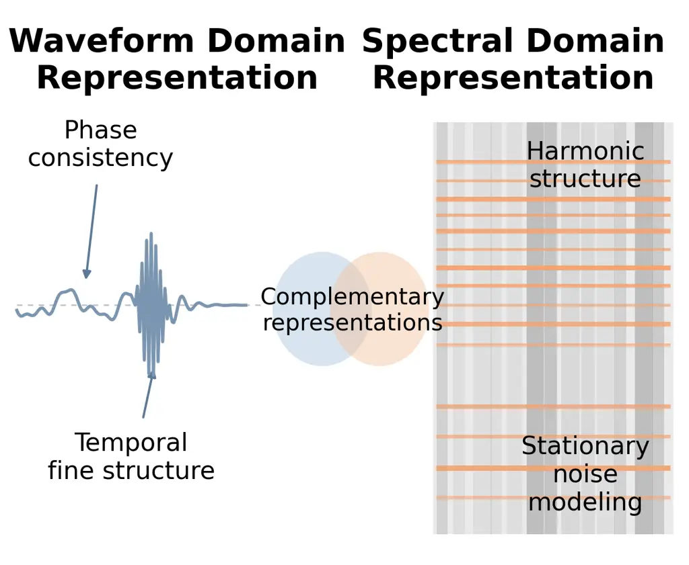
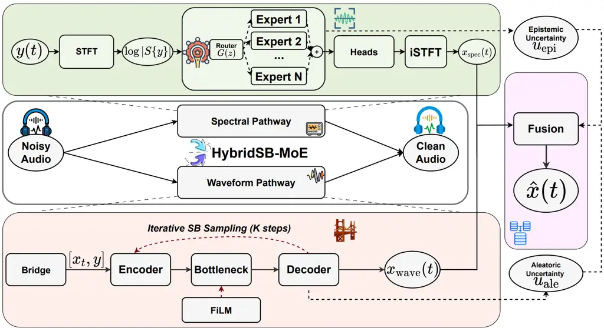
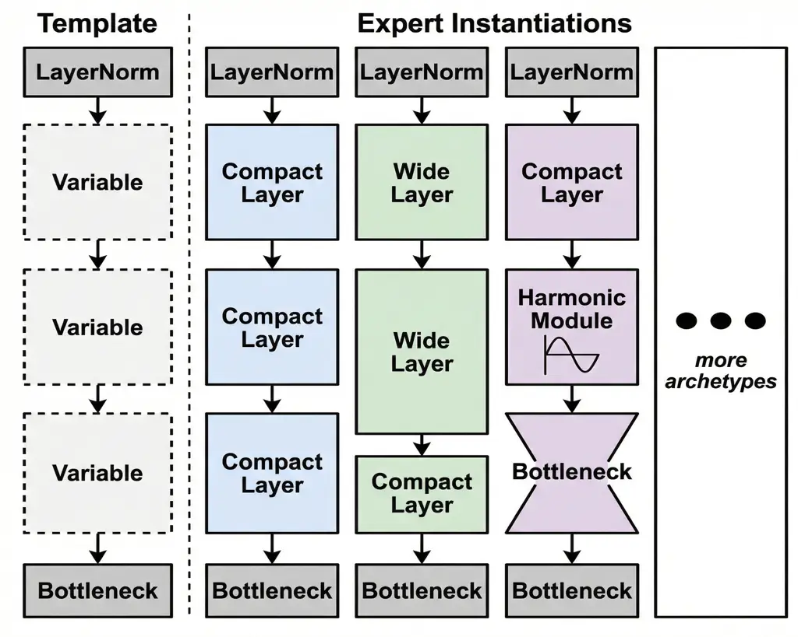
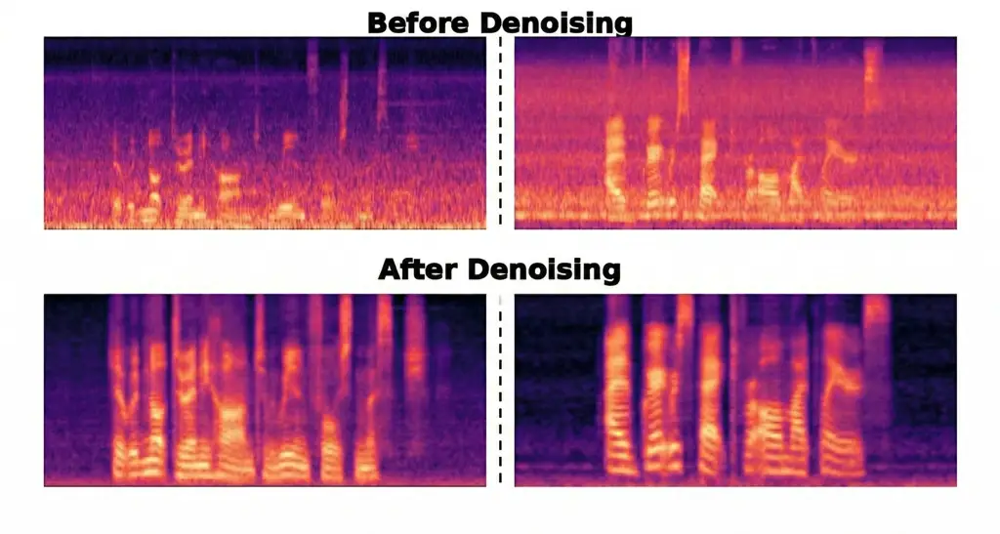

# HybridSB-MoE: Dual-Domain Schrödinger Bridges with Scene-Adaptive Expert Routing for Speech Enhancement

Zhengyi Lu    Aswini Sivakumar    Jie Hu    Yao Qiang
Affiliation: Department of Computer Science and Engineering, Oakland
University Affiliation: Rochester, MI 48309 Affiliation: {zhengyilu,
aswinisivakumar, jiehu, qiang}@oakland.edu

###### Abstract

Generative speech enhancement faces three gaps: spectral models capture
harmonic structure but often disrupt phase, waveform models preserve
phase but miss harmonics, and Schrödinger Bridges (SB) shorten transport
from noise to clean speech but leave inference cost only loosely tied to
training. We propose HybridSB-MoE, a dual-domain framework that fills
these gaps through three contributions unified by a single asymmetric
design principle. (i) _Asymmetric uncertainty fusion_: The spectral path
captures epistemic uncertainty via expert disagreement, while the
waveform bridge models aleatoric variance through stochastic dynamics.
We fuse them asymmetrically, allowing the mixing weight to adapt to
distinct error regimes rather than average predictions. (ii)
_Heterogeneous MoE_ with top-$`k{=}2`$ routing across five distinct
architectural archetypes, where architectural diversity makes the
epistemic signal indicate which inductive bias fails rather than small
perturbations among similar experts. (iii) _Discretization bound_
(Theorem 1): path-consistency and trajectory regularizers together bound
the $`K`$-step bridge sampling error in 2-Wasserstein distance at rate
$`K^{-\alpha}`$, making small-$`K`$ inference an objective-level
guarantee rather than an empirical claim. On VoiceBank+DEMAND,
HybridSB-MoE outperforms diffusion- and SB-based baselines at their step
budgets while remaining competitive with consistency-distilled few-step
methods.

## 1 Introduction

Speech enhancement (SE) has long faced a structural domain trade-off.
Spectral methods are effective at modeling harmonic structure and
stationary noise, but often fragment phase across STFT frames; waveform
methods preserve phase continuity, but can struggle with harmonically
structured interference (Fig. 1). This trade-off becomes especially
limiting in real-world deployment, where a hearing aid on a moving bus,
a video-conferencing system in a crowded café, or an in-car voice
assistant must handle harmonic engine drone, broadband ambient hum, and
non-stationary crowd babble under millisecond latency budgets and
without scene labels at inference time \[44, 9\]. These settings require
more than a universally stronger model: they require a mechanism that
can exploit complementary inductive biases and decide which one to trust
for each input.

A decade of deep learning has advanced SE from DNN masking \[51, 26\],
through time-domain \[22, 9, 21\] and spectro-temporal \[5, 47\]
architectures to diffusion-based generative models \[14, 48, 28\] and
Schrödinger Bridge formulations that replace the uninformative Gaussian
prior of diffusion with direct transport from noisy to clean speech.
Despite this progress, three structural limitations persist that are
precisely what a dual-domain framework must address. (i) Single-domain
commitment. Existing methods typically operate in either the waveform or
spectral domain, sacrificing the complementary inductive bias of the
other \[47\]. (ii) Uniform processing across heterogeneous noise. A
single network handles stationary appliance hum, harmonic engine noise,
and non-stationary crowd babble alike, despite their structurally
different inductive biases \[34, 4\]. (iii) Loosely controlled sampling
cost. Generative SE pipelines often require many iterative refinement
steps, with limited formal connection between the training objective and
the inference budget \[48, 28\].

The natural response, i.e., running a spectral and a waveform pathway in
parallel and combining them, fails on its own, because a generic
ensemble of two prediction streams provides no mechanism to know which
pathway is failing on a given input. Without such signal, the
combination defaults to fixed-weight averaging, which is provably
suboptimal whenever the two branches’ errors are uncorrelated, and the
dual-domain promise reduces to a parameter-count increase.



Figure 1: The persistent dual-domain dichotomy in speech enhancement.
Waveform processing preserves temporal fine structure and phase
coherence but underperforms on harmonically structured interference;
spectral processing captures harmonic structure and stationary noise
patterns but fragments phase across STFT frames. The two domains succeed
and fail in opposite regimes, and existing generative methods inherit
one half of the trade-off by committing to a single domain.

We introduce HybridSB-MoE, a dual-domain framework organized around one
asymmetric idea: _a multi-expert spectral path naturally produces an
epistemic uncertainty signal (which expert is right?), and a stochastic
waveform bridge naturally produces an aleatoric one (intrinsic transport
noise). These are categorically different signals about categorically
different errors_. Pairing the two pathways and fusing on this asymmetry
yields a mixing weight that selects between two error regimes rather
than averaging two predictions, transforming the dual-domain promise
into a principled co-design. Two further architectural choices are
required for this idea to work. First, the spectral pathway must produce
_informative_ expert disagreement, which requires architectural
heterogeneity rather than capacity-replicated variation. We therefore
use heterogeneous expert archetypes, each aligned with a canonical
noise-processing primitive, including low-rank denoising, wide receptive
fields, information bottlenecks, harmonic bases, and universal
approximation, and combine them under sparse routing. Second, the
waveform pathway must remain faithful under the small inference budget
$`K`$ targeted by the system. We therefore train it with
path-consistency and trajectory regularizers, and prove in Theorem 1
that jointly minimizing them bounds the $`K`$-step bridge discretization
error in $`2`$-Wasserstein distance, making small-$`K`$ inference a
consequence of the training objective rather than an empirical
heuristic. In Section 3, we further show that no proper subset of these
three components recovers the central design property.

Our contributions are as follows:

1. A dual-domain framework built around asymmetric uncertainty. We
   propose HybridSB-MoE, a dual-domain framework that couples spectral MoE
   and waveform SB pathways. By pairing each path with its natural
   uncertainty signal, epistemic disagreement for spectral experts and
   aleatoric variance for the waveform bridge, HybridSB-MoE enables fusion
   that adapts to error regimes rather than fixed-weight averaging.

2. A heterogeneous spectral MoE for informative epistemic disagreement.
   We design a sparse top-$`k{=}2`$ spectral MoE with architecturally
   distinct expert archetypes. This heterogeneity makes expert disagreement
   reflect mismatched inductive biases rather than small perturbations
   among capacity-replicated experts.

3. A regularized waveform bridge for few-step inference. We train the
   waveform SB with path consistency and trajectory regularizers, and prove
   in Theorem 1 that they bound the $`K`$-step discretization error in
   $`2`$-Wasserstein distance, linking small-$`K`$ inference to the
   training objective.

4. SOTA on VoiceBank+DEMAND. HybridSB-MoE improves over diffusion- and
   SB-based baselines at their respective step budgets, remains competitive
   with consistency-distilled few-step methods, and provides calibrated
   fusion uncertainty for input-adaptive dual-domain enhancement.

## 2 Related Work

Discriminative SE. The field has progressed from DNN masking \[51, 26\]
that surpassed classical Wiener and MMSE estimators \[2, 10\], through
time-domain encoder–decoders (Conv-TasNet \[22, 30\], DEMUCS \[9\]),
dual-path sequence models \[21\], full-sub-band hybrids (FullSubNet+
\[5\]), spectro-temporal grids (TF-GridNet \[47\]), and recent
Mamba-based linear-complexity backbones \[3, 45\]. Joint enhancement
objectives that combine SI-SDR with perceptual surrogates push fidelity
further \[32, 53\], yet the underlying paradigm remains a one-shot
deterministic regression. Two limitations therefore persist regardless
of architecture. _(i) Inherent ambiguity:_ under severe non-stationary
or harmonically structured noise, the noisy-to-clean mapping admits
multiple plausible solutions, and a deterministic regressor must
collapse this multimodal posterior to a single point estimate, which
typically manifests as residual noise or over-suppressed harmonics
\[7\]. _(ii) No uncertainty:_ discriminative networks expose no signal
at inference time to flag this ambiguity, so a downstream module cannot
tell when the prediction should be trusted—making them unsuitable as one
branch of a confidence-routed dual-domain combiner.

Generative models and Schrödinger Bridges for SE. Likelihood-based \[7\]
and score-based \[14, 38, 36\] diffusion models reverse a noise
corruption process; SGMSE/SGMSE+ \[48, 28\] apply this in the complex
spectrogram domain, jointly modeling magnitude and phase, but require
many iterative steps from an uninformative Gaussian prior. Two recent
paradigms exploit the structure of the noisy observation directly.
_Flow-matching_ approaches \[19, 20\] regress velocity fields between
coupled distributions, shortening the sampling trajectory but typically
without an explicit stochastic perturbation. _Schrödinger Bridges_ \[8,
33\] learn the optimal-transport-like coupling between the noisy
observation and clean speech, retaining a small bridge variance for
full-support marginals. SB for SE \[16, 46, 40, 52, 54\] confirm
improved low-SNR structure preservation along this shorter path.
Empirical step-count reductions have been achieved by consistency
distillation \[50, 37\], adversarial few-step training \[13\], and
SB-consistency trajectory models \[25\]. None of these works links the
training objective to the inference budget, where small $`K`$ is
_asserted_ but not _derived_. Theoretical convergence analyses for
diffusion sampling exist in the broader literature \[6\], but their
bounds are stated in terms of the score-matching error rather than
tractable, training-time-minimized regularizers, and have not been
adapted to the doubly-conditioned SB setting. Moreover, these methods
remain single-domain and lack calibrated uncertainty for fusion. We
address both with asymmetric uncertainty fusion and a discretization
bound (Theorem 1) that links small-$`K`$ inference to explicit
training-time quantities.

Mixture-of-Experts for SE. MoE enables conditional computation with
sparse routing, scaling capacity without proportional inference cost
\[31, 11, 18\]. In SE, sparse MoE \[34\] first enabled scene-adaptive
processing via noise-clustered experts; zero-shot personalization \[35\]
extended this to speakers via embedding-based routing; clean-cluster
pre-training \[4\] enforced expert specialization through pre-training
initialization; and dynamic capacity allocation \[23\] improved routing
efficiency at inference. However, this line of work shares three
limitations. _(i) Homogeneity._ Existing methods replicate a single
architecture across experts, assuming one computational primitive can
handle tonal, ambient, harmonic, and crowd noise. This assumption breaks
down under realistic, structurally diverse noise. _(ii) Routing without
uncertainty._ Existing routing only partitions inputs into specialist
regions, rather than exposing _interpretable uncertainty_; thus, the
epistemic signal from multi-expert disagreement remains unused. _(iii)
Separation from generative SE._ MoE routing and generative bridge models
remain disconnected in SE, leaving scene-adaptive computation and
structured distributional transport as separate lines of work. We
address all three with heterogeneous archetype experts that encode
distinct noise-specific inductive biases. Their disagreement provides
the epistemic signal which, together with the SB’s aleatoric variance,
drives asymmetric fusion. To our knowledge, this is the first joint
MoE–SB framework for SE.

Uncertainty quantification and dual-branch fusion. Calibrated
uncertainty for deep regression is most commonly obtained via deep
ensembles \[17\] or learned heteroscedastic variance heads, with
classification calibration assessed via ECE \[12\]. Prior dual-branch SE
methods that combine time- and frequency-domain estimates typically use
either fixed-weight averaging or learned attention over predictions
\[47, 9\]; none assigns categorically distinct uncertainty types to the
two branches, and so the fusion cannot route on _which kind_ of error
each branch is exposed to. Our pathway-typed asymmetric fusion is, to
our knowledge, the first to exploit this structure, and the calibration
loss (Eq. (11)) ties the abstract epistemic/aleatoric labels to
measurable per-pathway reconstruction errors so the routing weight is
learned, not asserted.

## 3 Method

HybridSB-MoE has three coupled components: a heterogeneous spectral MoE,
an SB waveform pathway with path-consistency and trajectory regularizers
(for which we prove a $`K`$-step discretization bound, Theorem 1), and
an asymmetric uncertainty fusion that selects between epistemic and
aleatoric error regimes. Figure 2 illustrates the overall HybridSB-MoE
framework. We develop each component in turn and close the section by
showing that no proper subset recovers the central design property.



Figure 2: Overview of HybridSB-MoE. The spectral pathway (top) routes
log-magnitude features $`z=\log|S\{y\}|`$ through $`N`$ heterogeneous
archetype experts via gating $`G(z)`$ to produce $`x_{\text{spec}}(t)`$.
The waveform pathway (bottom) iteratively refines an SB state
$`[x_{t},y]`$ through a U-Net to produce $`x_{\text{wave}}(t)`$. An
uncertainty-aware fusion combines both via $`u_{\text{epi}}`$ (top-$`k`$
expert disagreement) and $`u_{\text{ale}}`$ (bridge-variance head) to
yield $`\hat{x}(t)`$.

Overview. Given a noisy input $`y(t)`$, HybridSB-MoE processes it
through two parallel pathways designed to capture complementary speech
characteristics. The spectral pathway applies the heterogeneous MoE to
the log-magnitude STFT for scene-adaptive enhancement. In parallel, the
waveform pathway runs an efficient SB on the time-domain signal to
preserve phase. The two pathways exhibit asymmetric reliability across
acoustic conditions: spectral processing excels in harmonically
structured noise, whereas waveform processing is more robust in
phase-sensitive scenarios. Consequently, a fixed fusion strategy is
inherently suboptimal. We therefore introduce an uncertainty-aware
fusion module that integrates $`x_{\mathrm{spec}}(t)`$ and
$`x_{\mathrm{wave}}(t)`$ by dynamically weighting each pathway based on
confidence, producing the final enhanced signal $`\hat{x}(t)`$. Both
pathways run in parallel at inference, and long utterances use
overlap-add segmentation (Appendix B).

Spectral feature extraction. We apply the STFT \[1\] to obtain the
complex spectrogram $`S\{y\}\in\mathbb{C}^{F\times T_{f}}`$ ($`F`$
frequency bins) and decompose it in polar form into magnitude
$`|S\{y\}|`$ and phase $`\angle S\{y\}`$, processed by separate heads
(below). The MoE consumes log-magnitude features
$`z=\log|S\{y\}|\in\mathbb{R}^{F\times T_{f}}`$, whose logarithmic
scaling compresses the dynamic range in line with human hearing.

Heterogeneous mixture-of-experts. Unlike conventional homogeneous MoE
designs \[31, 11, 18\] in which all experts share the same architecture
and differ only in learned weights, we instantiate distinct
architectural archetypes, each tailored to a canonical noise-processing
primitive, i.e., Home, Nature, Office, Transport, and Public for
VoiceBank+DEMAND (see Appendix A for full specification). Under sparse
top-$`k`$ routing, pairwise mixtures and weighted blends of these
archetypes cover the $`14`$ noise categories in VoiceBank+DEMAND \[41\]
_combinatorially_ rather than by a dedicated expert per noise, and the
design extends to new acoustic environments by adding archetypes per
noise family encountered, without altering the rest of the framework
(see Appendix A for details). All experts share a backbone of
normalization (group norm \[49\]) $`\to`$ variable internal modules
$`\to`$ bottleneck projection, ensuring routing-interface compatibility
while permitting structurally divergent intermediate computation. This
design, a small semantically anchored basis composed of sparse routing,
replaces the parameter scaling of large homogeneous MoEs with
interpretable routing and meaningful expert disagreement, which we use
for asymmetric fusion below.

Scene-adaptive sparse routing. Standard sparse routing \[31, 11\]
assigns each input token to its top-$`k`$ experts independently, which
is well-suited to language modelling but ill-suited to SE: the dominant
noise type is a global property of an utterance, while local acoustic
events (a phoneme onset, a transient hit) require frame-level
adaptivity. We therefore use a two-level gate: _Archetype-level_ routing
$`G_{\mathrm{arch}}(z)`$ pools $`z`$ across time and decides the
dominant archetype mixture for the whole utterance; _token-level_
routing $`G_{\mathrm{token}}(z)`$ refines this assignment per frame. The
two combine as
$`G(z)=\alpha G_{\mathrm{arch}}(z)+(1-\alpha)G_{\mathrm{token}}(z)`$
with $`\alpha\in[0,1]`$. An MLP maps $`G(z)`$ to per-expert logits; the
top-$`k`$ entries are softmax-renormalized to weights
$`\{G_{i}(z)\}_{i\in\mathcal{I}_{k}}`$, and the routed output is

```math
\hat{x}_{\text{spec}}=\sum_{i\in\mathcal{I}_{k}}G_{i}(z)\,E_{i}(z), \tag{1}
```

where $`\mathcal{I}_{k}`$ indexes the selected experts and $`E_{i}`$ are
expert networks. To prevent expert collapse \[31, 11\], a standard
load-balancing regularizer

```math
\mathcal{L}_{\mathrm{aux}}=\lambda_{I}\,\mathrm{Var}(p_{i})+\lambda_{L}\,\mathrm{Var}(n_{i}) \tag{2}
```

penalizes uneven utilization, where $`p_{i}`$ and $`n_{i}`$ denote the
average routing probability and token count of expert $`i`$,
respectively.

Spectral reconstruction. The routed features $`\hat{x}_{\mathrm{spec}}`$
pass through two parallel $`1\times 1`$-conv heads. Since phase cannot
be inferred from log-magnitude alone, the phase head also consumes the
noisy phase as $`(\sin\angle S\{y\},\cos\angle S\{y\})`$, concatenated
along the channel dimension:

```math
\hat{M}=M_{\max}\,\mathrm{sigmoid}(h_{\mathrm{mag}}(\hat{x}_{\mathrm{spec}})),\Delta\phi=\phi_{\max}\,\tanh(h_{\mathrm{pha}}(\hat{x}_{\mathrm{spec}},\sin\angle S\{y\},\cos\angle S\{y\})), \tag{3}
```

where $`M_{\max},\phi_{\max}`$ bound the mask and phase correction to
prevent over-suppression, excessive amplification, and phase-wrap
instability. The enhanced spectrum
$`\hat{S}=\hat{M}\odot|S\{y\}|\cdot e^{j(\angle S\{y\}+\Delta\phi)}`$ is
inverted to $`x_{\mathrm{spec}}(t)`$ via iSTFT with overlap-add. STFT
processing nevertheless fragments temporal fine structure through
frame-wise phase decoupling, motivating the parallel waveform pathway
below.

Schrödinger Bridge formulation. The continuous-time SB problem seeks the
stochastic process minimizing the KL divergence to a reference Brownian
motion subject to fixed marginal distributions at both endpoints \[8,
33, 27\]. In our application the two endpoints are the noisy observation
$`y`$ and the clean target $`x`$, so the bridge directly couples the
conditional distributions our system must transport between. Where
standard diffusion \[14\] traverses the full path from a
data-independent Gaussian prior, the bridge exploits the substantial
mutual information between $`y`$ and $`x`$ to yield a shorter, more
informative trajectory and, empirically, fewer sampling steps and better
low-SNR structure preservation \[16, 46, 40\]. Conceptually adjacent
flow-matching methods \[19, 20\] also couple paired distributions but
typically without an explicit bridge perturbation; our SB construction
retains a small noise term $`\sigma_{t}\epsilon`$ to keep the marginal
$`p(x_{t}\mid x,y)`$ full-support, which is required for score-based
reverse sampling and for the trajectory regularizer to act as a
self-consistency constraint.

The intermediate state at diffusion time $`t\in[0,T]`$ interpolates
between $`y`$ and $`x`$ with a small Gaussian perturbation,

```math
x_{t}=\sqrt{\bar{\beta}_{t}}\,x+\sqrt{1-\bar{\beta}_{t}}\,y+\sigma_{t}\,\epsilon,\qquad\epsilon\sim\mathcal{N}(0,I), \tag{4}
```

where $`\bar{\beta}_{t}=f(t)/f(0)`$ with
$`f(t)=\cos^{2}((t/T+s)/(1+s)\cdot\pi/2)`$ is a cumulative cosine
schedule \[24\] decreasing monotonically from $`\bar{\beta}_{0}=1`$ to
$`\bar{\beta}_{T}=0`$ (offset $`s{=}0.008`$), and
$`\sigma_{t}=\sigma_{\max}\sqrt{\bar{\beta}_{t}(1-\bar{\beta}_{t})}`$
($`\sigma_{\max}{=}0.05`$) vanishes at both endpoints, so $`x_{0}=x`$
and $`x_{T}=y`$ deterministically while $`\sigma_{t}\epsilon`$ supplies
the full-support marginal $`p(x_{t}\mid x,y)`$ required by the
score-based reverse process.

The reverse process is parameterized as a learnable denoiser
$`\hat{x}_{\theta}(x_{t},y,t)`$ that predicts the clean target directly
from the bridge state and the observation. Rather than solving the
reverse-time stochastic differential equation (SDE) associated with the
bridge in closed form, we adopt a tractable bridge-consistent update
that iteratively re-injects the predicted clean estimate into the
forward construction of Eq. (4) at the previous timestep:

```math
x_{t-1}=\sqrt{\bar{\beta}_{t-1}}\,\hat{x}_{\theta}(x_{t},y,t)+\sqrt{1-\bar{\beta}_{t-1}}\,y+\sigma_{t-1}\,z,\qquad z\sim\mathcal{N}(0,I). \tag{5}
```

This data-prediction update is the bridge analogue of DDPM/DDIM
ancestral sampling \[14, 36\]: deterministic when $`\sigma_{t-1}{=}0`$,
stochastic otherwise. Bridge-marginal consistency is enforced
empirically through the path-consistency and trajectory regularizers
introduced below. The denoiser is a 1D U-Net with transformer bottleneck
and FiLM timestep conditioning (Appendix B). The training objective is
the data-prediction loss:

```math
\mathcal{L}_{\mathrm{SB}}^{\mathrm{data}}=\mathbb{E}_{t,(x,y),\epsilon}\big\|\hat{x}_{\theta}(x_{t},y,t)-x\big\|_{2}^{2}, \tag{6}
```

augmented by the path-consistency and trajectory regularizers introduced
next.

Path-consistency and trajectory regularizers. A fixed front-loaded
schedule $`t_{k}=T(k/K)^{\gamma}`$ with $`\gamma{<}1`$ concentrates the
$`K`$-step budget in the early-trajectory regime where the SNR changes
fastest and where errors propagate to all later steps \[14\]. Two
regularizers then encourage a smooth, low-curvature denoising path in
the $`(y,x)`$ subspace. The path-consistency loss enforces
cross-timestep agreement of clean-signal predictions along the same
trajectory:

```math
\mathcal{L}_{\mathrm{path}}=\mathbb{E}_{t,t^{\prime}}\left[\left\|\hat{x}_{\theta}(x_{t},y,t)-\hat{x}_{\theta}(x_{t^{\prime}},y,t^{\prime})\right\|^{2}\right] \tag{7}
```

where $`t,t^{\prime}`$ are independently sampled along the same bridge
trajectory. This penalizes inconsistent clean-signal predictions across
timesteps, reducing reverse-process curvature (cf. consistency models
\[37\], but here for path smoothing, not distillation). The trajectory
loss anchors $`x_{t}`$ to the schedule-consistent reconstruction:

```math
\mathcal{L}_{\mathrm{traj}}=\mathbb{E}_{t}\left[\left\|x_{t}-\big(\sqrt{\bar{\beta}_{t}}\,\hat{x}_{\theta}(x_{t},y,t)+\sqrt{1-\bar{\beta}_{t}}\,y\big)\right\|^{2}\right]. \tag{8}
```

At the optimum $`\hat{x}_{\theta}=x`$, the residual reduces to
$`\sigma_{t}\epsilon`$, so $`\mathcal{L}_{\mathrm{traj}}`$ couples the
prediction to the specific bridge state $`x_{t}`$ at each timestep,
complementing the in-expectation regression of Eq. (6). At inference, we
use $`K{=}8`$ steps with the front-loaded non-uniform discretization
$`t_{k}=T(k/K)^{\gamma}`$, $`\gamma{=}0.6`$ (see Appendix B for more
details).

Discretization bound. The two regularizers above make small-$`K`$
inference viable, and we now show _why_. Let $`\hat{p}_{K}`$ be the law
of the $`K`$-step rollout of Eq. (5) at $`t{=}0`$ and
$`p_{0}^{\mathrm{br}}`$ the continuous-time bridge marginal at
$`t{=}0`$, both conditional on $`y`$.

###### Assumption 1 (Regularity).

(i) $`\hat{x}_{\theta}(\cdot,y,t)`$ is $`L_{x}`$-Lipschitz in its first
argument and $`L_{t}`$-Lipschitz in $`t`$. (ii) $`\bar{\beta}_{t}`$ and
$`\sigma_{t}=\sigma_{\max}\sqrt{\bar{\beta}_{t}(1-\bar{\beta}_{t})}`$
are $`C^{1}`$ on $`[0,T]`$, with $`\bar{\beta}_{t}`$ monotone and
bounded second derivative. (iii) $`\mathbb{E}\|x_{t}\|^{2}`$ and
$`\mathbb{E}\|\hat{x}_{\theta}(x_{t},y,t)\|^{2}`$ are uniformly bounded
in $`t`$.

###### Theorem 1 (K-step bridge discretization bound).

Under Assumption 1, with the schedule $`t_{k}=T(k/K)^{\gamma}`$,
$`\gamma\in(0,1]`$,

```math
W_{2}\!\left(\hat{p}_{K},\,p_{0}^{\mathrm{br}}\right)\;\leq\;C_{1}\,K^{-\alpha}\;+\;C_{2}\,\sqrt{\mathcal{L}^{\star}_{\mathrm{path}}+\mathcal{L}^{\star}_{\mathrm{traj}}}, \tag{9}
```

with $`\alpha=\min(1,\gamma)`$, $`\mathcal{L}^{\star}`$ the
training-termination values of Eq. (7)–(8), and $`C_{1},C_{2}`$
depending only on $`L_{x},L_{t},\sigma_{\max}`$, and the curvature of
$`\bar{\beta}_{t}`$.

With $`\alpha=\min(1,\gamma)`$, front-loading ($`\gamma<1`$)
concentrates steps near $`t{=}0`$ where $`\Phi^{\prime}`$ is largest,
which is what drives small-$`K`$ behavior empirically. Each term
corresponds to a separate lever: $`C_{1}K^{-\alpha}`$ is controlled by
inference-time $`K,\gamma`$; $`C_{2}\sqrt{\mathcal{L}^{\star}}`$ is
controlled by training-time minimization of the two regularizers and is
independent of $`K`$. Two consequences follow. First, once
$`\mathcal{L}^{\star}`$ is small, the bound saturates: any $`K`$ with
$`C_{1}K^{-\alpha}\!\lesssim\!C_{2}\sqrt{\mathcal{L}^{\star}}`$ already
attains the asymptotic floor, which is what justifies our $`K{=}8`$
rather than the much larger $`K`$ of standard diffusion sampling.
Second, the regularizers are not auxiliary terms; without them, the
second term has no training-time upper bound, and the inequality does
not exist as a function of $`K`$. Therefore, removing either breaks the
entire argument. This is the formal sense in which path-consistency and
trajectory regularization are load-bearing for our inference schedule.
Eq. (9) is closely related to recent convergence results for diffusion
sampling \[6\] but adapts those analyses to the doubly-conditioned
bridge process and, importantly, replaces score-matching error with the
explicit, training-time-minimized regularizer pair, which makes the
bound directly actionable as a design tool. The full proof includes a
one-step fidelity lemma combined with a non-uniform Riemann estimate
under a synchronous coupling, with details deferred to Appendix C. We
present Eq. (9) as a design-justifying inequality, not a tight
predictor.

Asymmetric uncertainty fusion. A naive dual-branch ensembler treats the
two pathways symmetrically; ours does not, by design. Epistemic
uncertainty (‘which expert is right?’) is well-defined only when
multiple experts coexist (the spectral MoE); the waveform pathway has no
analog. Aleatoric uncertainty (intrinsic stochasticity of the bridge SDE
in Eq. (4)) is well-defined only when the forward process is genuinely
stochastic (the waveform pathway); the deterministic spectral mask in
Eq. (3) has no analog. Each pathway therefore carries exactly one
uncertainty type: $`u_{\mathrm{epi}}`$ flags an architectural mismatch,
$`u_{\mathrm{ale}}`$ flags a stochastic transport error. The fusion
selects between these two error regimes; it does not average two
predictions. Concretely,
$`u_{\mathrm{epi}}\!=\!\tfrac{1}{kT_{f}}\sum_{i\in\mathcal{I}_{k}}\|E_{i}(z)\!-\!\bar{E}(z)\|_{2}^{2}`$
with $`\bar{E}(z)\!=\!\tfrac{1}{k}\sum_{i\in\mathcal{I}_{k}}E_{i}(z)`$
(deep-ensembles sense \[17\], not Bayesian posterior);
$`u_{\mathrm{ale}}`$ is from the U-Net’s per-sample log-variance head,
exponentiated and time-averaged. After z-score normalization, a 2-layer
MLP gives
$`w\!=\!\sigma(\mathrm{MLP}(\tilde{u}_{\mathrm{epi}},\tilde{u}_{\mathrm{ale}}))\!\in\![0,1]`$,
and

```math
\hat{x}(t)=w\cdot x_{\mathrm{spec}}(t)+(1-w)\cdot x_{\mathrm{wave}}(t). \tag{10}
```

High expert disagreement pushes $`w`$ toward the waveform pathway and
high SB variance toward the spectral pathway: each pathway is deferred
away from when its native error is large. A calibration loss anchors the
two scalars to the errors they should track,

```math
\mathcal{L}_{\mathrm{cal}}=(u_{\mathrm{epi}}-\|x_{\mathrm{spec}}-x\|_{2}^{2})^{2}+(u_{\mathrm{ale}}-\|x_{\mathrm{wave}}-x\|_{2}^{2})^{2}, \tag{11}
```

where $`u_{\mathrm{epi}},u_{\mathrm{ale}}`$ are pre-normalized; without
it, the scalars have no incentive to scale with error, and the fusion’s
dependence on them would be arbitrary.

Training. All components are trained end-to-end. Each step runs both
pathways in parallel: the spectral path produces
$`x_{\mathrm{spec}},u_{\mathrm{epi}}`$; the waveform path samples
$`t,\epsilon`$, forms $`x_{t}`$ via Eq. (4), and outputs
$`x_{\mathrm{wave}},u_{\mathrm{ale}}`$. The fusion yields $`\hat{x}`$.
The objective combines reconstruction, SB, load-balancing, and
calibration losses:

```math
\mathcal{L}=\mathcal{L}_{\text{rec}}+\lambda_{\text{SB}}\mathcal{L}_{\text{SB}}+\lambda_{\text{aux}}\mathcal{L}_{\text{aux}}+\lambda_{\text{cal}}\mathcal{L}_{\text{cal}}, \tag{12}
```

with $`\mathcal{L}_{\mathrm{rec}}=\|\hat{x}-x\|_{2}^{2}`$ and
$`\mathcal{L}_{\mathrm{SB}}=\mathcal{L}_{\mathrm{SB}}^{\mathrm{data}}+\lambda_{\mathrm{path}}\mathcal{L}_{\mathrm{path}}+\lambda_{\mathrm{traj}}\mathcal{L}_{\mathrm{traj}}`$.
Loss weights (grid-searched on a 10% VB split):
$`\lambda_{\mathrm{SB}}{=}1.0,\lambda_{\mathrm{path}}{=}0.1,\lambda_{\mathrm{traj}}{=}0.05,\lambda_{\mathrm{aux}}{=}0.01,\lambda_{\mathrm{cal}}{=}0.05`$;
ceilings $`M_{\max}{=}5.0,\phi_{\max}{=}\pi/4`$. Full procedure in
Appendix B.

Why the components are coupled, not stacked. The central design
property—_a fusion that routes on epistemic vs. aleatoric error regimes
at a sampling budget derived from training_—requires all three
components and survives no proper subset. Three counterfactuals make
this concrete. _(C1) Symmetric uncertainty heads on both pathways_ (the
standard dual-branch ensemble): the fusion sees two aleatoric scalars
and no epistemic one, making it blind to spectral expert disagreement.
Thus, the mixing weight collapses into a generic confidence average,
consistent with the $`0.17`$ PESQ drop observed for “w/o uncertainty
fusion” in Figure 3. _(C2) Homogeneous MoE_ in place of distinct
archetypes: top-$`k`$ blends span one function class instead of distinct
inductive biases. In this way, $`u_{\mathrm{epi}}`$ no longer indicates
which bias is mismatched but only weight perturbations among
identical-architecture experts, resulting in $`0.43`$ PESQ drop as shown
in Figure 3. _(C3) Drop the regularizers_: Theorem 1’s second term loses
its training-time upper bound, so small-$`K`$ inference is no longer
derivable; $`u_{\mathrm{ale}}`$ inherits the failure since the SB error
it was calibrated against is now uncontrolled. Removing the SB pathway
entirely, leading to $`-0.63`$ PESQ, is the limit of this collapse. In
all three cases the asymmetric fusion reduces to a fixed-weight or
generic ensemble, the small-$`K`$ guarantee disappears, or both: the MoE
produces the error only $`u_{\mathrm{epi}}`$ detects, the regularized SB
produces the error only $`u_{\mathrm{ale}}`$ detects, Theorem 1 controls
the SB-side error at the deployment budget, and the asymmetric fusion is
the only mechanism that routes between them. The ablation pattern in
Figure 3 of Section 4 is the empirical signature of this coupling.

## 4 Experiments and Discussion

Setup. _Dataset:_ We evaluate our method on VoiceBank+DEMAND \[43, 41\],
a widely used benchmark containing 11,572 training and 824 test
utterances from 28 and 2 speakers, respectively. Clean speech is mixed
with 14 noise types. All audio signals are resampled to 16 kHz.
_Metrics:_ We report PESQ \[29\] and STOI \[39\] for perceptual quality
and intelligibility, composite metrics CSIG, CBAK, and COVL \[15\] for
signal/background/overall quality, Expected Calibration Error
(ECE) \[12\] for uncertainty calibration, and Real-Time Factor (RTF)
with end-to-end latency for computational efficiency. _Implementation:_
We use STFT with 1024-point FFT, 256-sample hop (16 ms), and Hann
window, yielding 513 frequency bins. The MoE comprises 5 archetype
experts (one per scene family in VoiceBank+DEMAND, see Appendix A) with
Top-$`k`$=2 routing. The waveform U-Net has 4 encoder/decoder levels
with a transformer bottleneck. Training uses AdamW (learning rate
$`2\times 10^{-4}`$, cosine schedule, 200 epochs, batch size 32) on 2
NVIDIA RTX 5090 GPUs. Full hyperparameters are listed in Appendix B.
_Baselines:_ We compare against discriminative methods (SEGAN \[26\],
SEMamba \[3\], Mamba-SEUNet \[45\]), diffusion/SB-based generative
models (SGMSE+ \[28\], SB-SE \[16\], SBCTM \[25\]), and the
consistency-distilled ROSE-CD \[50\]. All baselines are retrained from
scratch using their official implementations under a unified protocol
(matched preprocessing, 16 kHz sampling, train/test split), and all
reported metrics are computed by us with a shared evaluation script to
avoid implementation-induced discrepancies.

|                     |                |                  |                  |                  |                  |                  |
| ------------------- | -------------- | ---------------- | ---------------- | ---------------- | ---------------- | ---------------- |
| Method              | Type           | PESQ$`\uparrow`$ | STOI$`\uparrow`$ | CSIG$`\uparrow`$ | CBAK$`\uparrow`$ | COVL$`\uparrow`$ |
| Noisy               | –              | 1.97             | 0.91             | –                | –                | –                |
| SEGAN \[26\]        | Discriminative | 2.16             | 0.92             | –                | –                | –                |
| SEMamba \[3\]       | Discriminative | 3.55             | 0.96             | 4.79             | 3.63             | 4.37             |
| Mamba-SEUNet \[45\] | Discriminative | 3.73             | 0.96             | 4.82             | 3.67             | 4.40             |
| SGMSE+ \[28\]       | Diffusion      | 3.45             | 0.95             | 4.71             | 3.64             | 4.31             |
| SBCTM \[25\]        | SB-based       | 3.58             | 0.95             | 4.66             | 3.43             | 4.52             |
| SB-SE \[16\]        | SB-based       | 3.70             | 0.95             | 4.77             | 3.75             | 4.48             |
| ROSE-CD \[50\]      | Distillation   | 3.85             | 0.96             | 4.63             | 3.37             | 4.30             |
| HybridSB-MoE (Ours) | Hybrid         | 3.88             | 0.96             | 4.82             | 3.85             | 4.82             |

Table 1: Performance comparison on VoiceBank+DEMAND. Best results in
bold (ties bolded jointly). All baseline numbers are reproduced by us
under a unified evaluation protocol. Our method achieves the best score
on every metric, with calibrated uncertainty estimates as an additional
benefit.

Main results. Table 1 reports the comparison on VoiceBank+DEMAND.
HybridSB-MoE attains the best score on every metric, strictly dominating
on PESQ, CBAK, and COVL and tying for the lead on STOI and CSIG. Two
clarifications anchor the comparison. _(i)_ We do not claim the smallest
sampling budget as ROSE-CD reaches a single step via consistency
distillation. At our $`K{=}8`$ we strictly dominate SGMSE+, SB-SE, and
SBCTM at their larger budgets, and exceed ROSE-CD across all five
quality metrics despite its smaller $`K`$. _(ii)_ The CBAK gain is the
most informative single number, i.e., $`+0.10`$ over the strongest SB
baseline (SB-SE) and $`+0.48`$ over ROSE-CD, indicating that dual-domain
processing suppresses background noise more effectively than either
pure-spectral or pure-waveform generative pipelines. At the same time,
the COVL gain ($`4.82`$ vs. $`4.52`$) confirms this without sacrificing
signal fidelity. Furthermore, the choice $`K{=}8`$ is not heuristic. By
Theorem 1, once
$`\mathcal{L}^{\star}_{\mathrm{path}}+\mathcal{L}^{\star}_{\mathrm{traj}}`$
is minimized, the $`C_{1}K^{-\alpha}`$ term saturates at modest $`K`$,
see Appendix E.

Ablation studies. Figure 3 reports the ablation results. The performance
drops follow the asymmetric uncertainty design. Removing the SB pathway
causes the largest degradation ($`-0.63`$ PESQ), since the model loses
both waveform-domain phase coherence and the aleatoric signal needed for
asymmetric fusion. Removing the MoE module yields a smaller but still
substantial drop ($`-0.43`$ PESQ), as the SB pathway remains active but
the complementary epistemic signal from expert disagreement is lost.
Replacing uncertainty-aware fusion with equal weighting also reduces
performance ($`-0.17`$ PESQ), showing that both pathways remain useful
but require principled routing rather than generic averaging. This
ordering, $`0.63>0.43>0.17`$, supports our central design claim:
ablations that remove a distinct uncertainty channel are more damaging
than those that only weaken fusion over intact pathways. Sequential
variants in either direction also underperform parallel fusion
($`-0.30`$/$`-0.39`$ PESQ), suggesting that cascading one domain through
the other weakens the structural source of pathway-specific uncertainty.
Figure 3 further validates the sparse routing choice. Increasing $`k`$
from $`1`$ to $`2`$ improves PESQ from $`3.74`$ to $`3.88`$ with a
modest RTF of $`0.28`$, indicating that two active experts provide
useful complementary inductive biases. Increasing to $`k{=}3`$ adds only
$`+0.01`$ PESQ while increasing RTF by $`25\%`$, so we adopt
top-$`k{=}2`$ routing as the default quality–latency trade-off.

Efficiency and robustness. Figures 3 and 3 report efficiency and
robustness. With only 8 sampling steps, HybridSB-MoE achieves an RTF of
0.28 (35 ms latency), giving a 4–5$`\times`$ speedup over SGMSE+ and
SB-SE while surpassing their PESQ; together with ROSE-CD, our method
defines the Pareto frontier with a markedly higher quality ceiling. The
dual-domain design is most beneficial at low SNR ($`+0.13`$ over ROSE-CD
at $`0`$ dB). Beyond quality, the calibration loss of Eq. (11) yields a
fusion-weight ECE of $`0.042`$, an order-of-magnitude reduction from the
$`0.12`$ achieved by an uncalibrated single-pathway baseline; this is
what makes $`u_{\mathrm{epi}}`$ and $`u_{\mathrm{ale}}`$ usable as
confidence signals for downstream decisions, not just as training-time
auxiliaries. A scene-stratified breakdown across all 14 noise types
appears in Appendix D, with PESQ standard deviation $`<{0.03}`$
confirming that combinatorial archetype coverage generalizes across
scenes without per-noise tuning.

(a) Components

(b) Expert count, $`k`$

(c) Quality–RTF

(d) PESQ vs. SNR

Figure 3: Ablation studies and efficiency analysis. (a) Each
architectural component contributes independently. (b) Top-$`k{=}2`$
with $`5`$ experts hits the quality–efficiency sweet spot. (c) Marker
size $`\propto`$ parameter count; dashed line is RTF$`=`$1.0. (d) PESQ
across SNR levels.

Scope and limitations. We evaluate on VoiceBank+DEMAND, the standard SE
benchmark; scene-adaptivity claims should be retested on broader corpora
(DNS, WHAMR!, CHiME) where train and test noise distributions diverge
more substantially. Theorem 1 is a design-justifying inequality with
worst-case constants $`C_{1},C_{2}`$; quantitatively fitting the
predicted $`K^{-\alpha}`$ rate against finer NFE sweeps is a natural
follow-up. The framework is single-channel; multi-channel extensions are
direct (additional input streams to both pathways) but beyond this
paper’s scope. Finally, while the heterogeneous archetype set
generalizes by adding archetypes per new noise family (Appendix A),
automatic archetype discovery from data, rather than expert-designed
primitives, remains open.

## 5 Conclusion

Combining a Schrödinger Bridge with a heterogeneous mixture-of-experts
is natural; the key question is how to make the combination synergistic.
We do so through two linked ideas. First, _pathway-typed asymmetric
uncertainty_ fusion uses each pathway’s characteristic uncertainty
signal, epistemic disagreement from the spectral MoE and aleatoric
variance from the waveform SB, so the mixing weight selects between
error regimes rather than averages predictions. Second, a
_discretization bound_ (Theorem 1) links the small-$`K`$ inference
budget to two explicit training regularizers, replacing heuristic
step-count claims with a provable objective-level guarantee. On
VoiceBank+DEMAND, this co-design HybridSB-MoE outperforms diffusion- and
SB-based baselines at matched step budgets while remaining competitive
with consistency-distilled few-step methods. Three counterfactual
ablations show that no proper subset of components preserves the central
design: the asymmetric fusion needs both a multi-expert path (for
epistemic disagreement) and a stochastic bridge (for aleatoric
variance), and the small-$`K`$ guarantee needs both regularizers. _For
SE_, this suggests future dual-domain systems should be organized by the
type of error each pathway faces, not just predictive complementarity.
_For generative modelling_, the discretization bound shows that few-step
inference can be derived from training if regularizers are chosen to
control the two sources of $`K`$-step error. Future work will extend the
framework to multi-channel input, larger benchmarks (DNS, WHAMR!,
CHiME), and finer NFE sweeps to empirically fit the predicted
$`K^{-\alpha}`$ rate.

## References

- \[1\] J. B. Allen and L. R. Rabiner (1977) A unified approach to
  short-time fourier analysis and synthesis. Proceedings of the IEEE 65
  (11), pp. 1558–1564. External Links:
  [Document](https://dx.doi.org/10.1109/PROC.1977.10770) Cited by: §3.
- \[2\] S. Boll (1979) Suppression of acoustic noise in speech using
  spectral subtraction. IEEE Transactions on Acoustics, Speech, and
  Signal Processing 27 (2), pp. 113–120. External Links:
  [Document](https://dx.doi.org/10.1109/TASSP.1979.1163209) Cited by:
  §2.
- \[3\] R. Chao, W. Cheng, M. La Quatra, S. M. Siniscalchi, C. H.
  Yang, S. Fu, and Y. Tsao (2024) An investigation of incorporating
  mamba for speech enhancement. In 2024 IEEE Spoken Language Technology
  Workshop (SLT), pp. 302–308. Cited by: §2, Table 1, §4.
- \[4\] S. E. Chazan, J. Goldberger, and S. Gannot (2021) Speech
  enhancement with mixture of deep experts with clean clustering
  pre-training. In ICASSP 2021 - 2021 IEEE International Conference on
  Acoustics, Speech and Signal Processing (ICASSP), Vol. , pp. 716–720.
  External Links:
  [Document](https://dx.doi.org/10.1109/ICASSP39728.2021.9414122) Cited
  by: §1, §2.
- \[5\] J. Chen, Z. Wang, D. Tuo, Z. Wu, S. Kang, and H. Meng (2022)
  Fullsubnet+: channel attention fullsubnet with complex spectrograms
  for speech enhancement. In ICASSP 2022-2022 IEEE International
  Conference on Acoustics, Speech and Signal Processing (ICASSP),
  pp. 7857–7861. Cited by: §1, §2.
- \[6\] S. Chen, S. Chewi, J. Li, Y. Li, A. Salim, and A. R.
  Zhang (2023) Sampling is as easy as learning the score: theory for
  diffusion models with minimal data assumptions. In International
  Conference on Learning Representations, Cited by: §C.5, §C.5, Appendix
  C, §2, §3.
- \[7\] T. Chen, G. Liu, and E. A. Theodorou (2022) Likelihood training
  of schrödinger bridge using forward–backward sdes theory. In ICLR,
  Cited by: §2, §2.
- \[8\] V. De Bortoli, J. Thornton, J. Heng, and A. Doucet (2021)
  Diffusion Schrödinger bridge with applications to score-based
  generative modeling. In Advances in Neural Information Processing
  Systems, Vol. 34, pp. 17695–17709. Cited by: §C.5, Appendix C, §2, §3.
- \[9\] A. Defossez, G. Synnaeve, and Y. Adi (2020) Real time speech
  enhancement in the waveform domain. arXiv preprint arXiv:2006.12847.
  Cited by: §1, §1, §2, §2.
- \[10\] Y. Ephraim and D. Malah (1984) Speech enhancement using a
  minimum-mean square error short-time spectral amplitude estimator.
  IEEE Transactions on Acoustics, Speech, and Signal Processing 32 (6),
  pp. 1109–1121. External Links:
  [Document](https://dx.doi.org/10.1109/TASSP.1984.1164453) Cited by:
  §2.
- \[11\] W. Fedus, B. Zoph, and N. Shazeer (2022) Switch transformers:
  scaling to trillion parameter models with simple and efficient
  sparsity. Journal of Machine Learning Research 23 (120), pp. 1–39.
  External Links: [Link](http://jmlr.org/papers/v23/21-0998.html) Cited
  by: §2, §3, §3, §3.
- \[12\] C. Guo, G. Pleiss, Y. Sun, and K. Q. Weinberger (2017) On
  calibration of modern neural networks. In Proceedings of the 34th
  International Conference on Machine Learning - Volume 70, ICML’17,
  pp. 1321–1330. Cited by: §2, §4.
- \[13\] S. Han, S. Lee, J. Lee, and K. Lee (2025) Few-step adversarial
  schrödinger bridge for generative speech enhancement. arXiv preprint
  arXiv:2506.01460. Cited by: §2.
- \[14\] J. Ho, A. Jain, and P. Abbeel (2020) Denoising diffusion
  probabilistic models. In Proceedings of the 34th International
  Conference on Neural Information Processing Systems, NIPS ’20, Red
  Hook, NY, USA. External Links: ISBN 9781713829546 Cited by: §1, §2,
  §3, §3, §3.
- \[15\] Y. Hu and P. C. Loizou (2008) Evaluation of objective quality
  measures for speech enhancement. IEEE Transactions on Audio, Speech,
  and Language Processing 16 (1), pp. 229–238. External Links:
  [Document](https://dx.doi.org/10.1109/TASL.2007.911054) Cited by: §4.
- \[16\] A. Jukić, R. Korostik, J. Balam, and B. Ginsburg (2024)
  Schrödinger bridge for generative speech enhancement. arXiv preprint
  arXiv:2407.16074. Cited by: §2, §3, Table 1, §4.
- \[17\] B. Lakshminarayanan, A. Pritzel, and C. Blundell (2017) Simple
  and scalable predictive uncertainty estimation using deep ensembles.
  In Advances in Neural Information Processing Systems, Vol. 30. Cited
  by: §2, §3.
- \[18\] D. Lepikhin, H. Lee, Y. Xu, D. Chen, O. Firat, Y. Huang, M.
  Krikun, N. Shazeer, and Z. Chen (2020) Gshard: scaling giant models
  with conditional computation and automatic sharding. arXiv preprint
  arXiv:2006.16668. Cited by: §2, §3.
- \[19\] Y. Lipman, R. T. Q. Chen, H. Ben-Hamu, M. Nickel, and M.
  Le (2023) Flow matching for generative modeling. In International
  Conference on Learning Representations, Cited by: §2, §3.
- \[20\] X. Liu, C. Gong, and Q. Liu (2023) Flow straight and fast:
  learning to generate and transfer data with rectified flow. In
  International Conference on Learning Representations, Cited by: §2,
  §3.
- \[21\] Y. Luo, Z. Chen, and T. Yoshioka (2020) Dual-path rnn:
  efficient long sequence modeling for time-domain single-channel speech
  separation. In ICASSP, pp. 46–50. Cited by: §1, §2.
- \[22\] Y. Luo and N. Mesgarani (2019) Conv-tasnet: surpassing ideal
  time–frequency magnitude masking for speech separation. IEEE/ACM
  Trans. Audio, Speech and Lang. Proc. 27 (8), pp. 1256–1266. External
  Links: ISSN 2329-9290,
  [Link](https://doi.org/10.1109/TASLP.2019.2915167),
  [Document](https://dx.doi.org/10.1109/TASLP.2019.2915167) Cited by:
  §1, §2.
- \[23\] R. Miccini, M. Kim, C. Laroche, L. Pezzarossa, and P.
  Smaragdis (2025) Adaptive slimming for scalable and efficient speech
  enhancement. arXiv preprint arXiv:2507.04879. Cited by: §2.
- \[24\] A. Nichol and P. Dhariwal (2021) Improved denoising diffusion
  probabilistic models. External Links: 2102.09672,
  [Link](https://arxiv.org/abs/2102.09672) Cited by: §3.
- \[25\] S. Nishigori, K. Saito, N. Murata, M. Hirano, S. Takahashi,
  and Y. Mitsufuji (2025) Schrödinger bridge consistency trajectory
  models for speech enhancement. arXiv preprint arXiv:2507.11925. Cited
  by: §2, Table 1, §4.
- \[26\] S. Pascual, A. Bonafonte, and J. Serra (2017) SEGAN: speech
  enhancement generative adversarial network. arXiv preprint
  arXiv:1703.09452. Cited by: §1, §2, Table 1, §4.
- \[27\] G. Peyre and M. Cuturi (2019) Computational optimal transport.
  Foundations and Trends in Machine Learning 11 (5-6), pp. 355–607.
  Cited by: §3.
- \[28\] J. Richter, S. Welker, J. Lemercier, B. Lay, and T.
  Gerkmann (2023) Speech enhancement and dereverberation with
  diffusion-based generative models. IEEE/ACM Transactions on Audio,
  Speech, and Language Processing 31 (), pp. 2351–2364. External Links:
  [Document](https://dx.doi.org/10.1109/TASLP.2023.3285241) Cited by:
  §1, §2, Table 1, §4.
- \[29\] A.W. Rix, J.G. Beerends, M.P. Hollier, and A.P. Hekstra (2001)
  Perceptual evaluation of speech quality (pesq)-a new method for speech
  quality assessment of telephone networks and codecs. In 2001 IEEE
  International Conference on Acoustics, Speech, and Signal Processing.
  Proceedings (Cat. No.01CH37221), Vol. 2, pp. 749–752 vol.2. External
  Links: [Document](https://dx.doi.org/10.1109/ICASSP.2001.941023) Cited
  by: §4.
- \[30\] J. L. Roux, S. Wisdom, H. Erdogan, and J. R. Hershey (2019) SDR
  – half-baked or well done?. In ICASSP 2019 - 2019 IEEE International
  Conference on Acoustics, Speech and Signal Processing (ICASSP), Vol. ,
  pp. 626–630. External Links:
  [Document](https://dx.doi.org/10.1109/ICASSP.2019.8683855) Cited by:
  §2.
- \[31\] N. Shazeer, A. Mirhoseini, K. Maziarz, A. Davis, Q. Le, G.
  Hinton, and J. Dean (2017) Outrageously large neural networks: the
  sparsely-gated mixture-of-experts layer. arXiv preprint
  arXiv:1701.06538. Cited by: §2, §3, §3, §3.
- \[32\] H. Shi, K. Shimada, M. Hirano, T. Shibuya, Y. Koyama, Z.
  Zhong, S. Takahashi, T. Kawahara, and Y. Mitsufuji (2024)
  Diffusion-based speech enhancement with joint generative and
  predictive decoders. In ICASSP 2024 - 2024 IEEE International
  Conference on Acoustics, Speech and Signal Processing (ICASSP), Vol. ,
  pp. 12951–12955. External Links:
  [Document](https://dx.doi.org/10.1109/ICASSP48485.2024.10448429) Cited
  by: §2.
- \[33\] Y. Shi, V. De Bortoli, A. Campbell, and A. Doucet (2023)
  Diffusion schrödinger bridge matching. In Advances in Neural
  Information Processing Systems, A. Oh, T. Naumann, A. Globerson, K.
  Saenko, M. Hardt, and S. Levine (Eds.), Vol. 36, pp. 62183–62223.
  External Links:
  [Link](https://proceedings.neurips.cc/paper_files/paper/2023/file/c428adf74782c2092d254329b6b02482-Paper-Conference.pdf)
  Cited by: §2, §3.
- \[34\] A. Sivaraman and M. Kim (2020) Sparse mixture of local experts
  for efficient speech enhancement. arXiv preprint arXiv:2005.08128.
  Cited by: §1, §2.
- \[35\] A. Sivaraman and M. Kim (2021) Zero-shot personalized speech
  enhancement through speaker-informed model selection. In 2021 IEEE
  Workshop on Applications of Signal Processing to Audio and Acoustics
  (WASPAA), Vol. , pp. 171–175. External Links:
  [Document](https://dx.doi.org/10.1109/WASPAA52581.2021.9632752) Cited
  by: §2.
- \[36\] J. Song, C. Meng, and S. Ermon (2020) Denoising diffusion
  implicit models. arXiv preprint arXiv:2010.02502. Cited by: §2, §3.
- \[37\] Y. Song, P. Dhariwal, M. Chen, and I. Sutskever (2023)
  Consistency models. In International Conference on Machine Learning,
  Cited by: §2, §3.
- \[38\] Y. Song, J. Sohl-Dickstein, D. P. Kingma, A. Kumar, S. Ermon,
  and B. Poole (2021) Score-based generative modeling through stochastic
  differential equations. In International Conference on Learning
  Representations, External Links:
  [Link](https://openreview.net/forum?id=PxTIG12RRHS) Cited by: §2.
- \[39\] C. H. Taal, R. C. Hendriks, R. Heusdens, and J. Jensen (2011)
  An algorithm for intelligibility prediction of time–frequency weighted
  noisy speech. IEEE Transactions on Audio, Speech, and Language
  Processing 19 (7), pp. 2125–2136. External Links:
  [Document](https://dx.doi.org/10.1109/TASL.2011.2114881) Cited by: §4.
- \[40\] Z. Tang, T. Hang, S. Gu, D. Chen, and B. Guo (2024) Simplified
  diffusion schrödinger bridge. arXiv preprint arXiv:2403.14623. Cited
  by: §2, §3.
- \[41\] J. Thiemann, N. Ito, and E. Vincent (2013) The diverse
  environments multi-channel acoustic noise database (demand): a
  database of multichannel environmental noise recordings. Proceedings
  of Meetings on Acoustics 19 (1), pp. 035081. External Links: ISSN
  1939-800X, [Document](https://dx.doi.org/10.1121/1.4799597),
  [Link](https://doi.org/10.1121/1.4799597),
  https://pubs.aip.org/asa/poma/article-pdf/doi/10.1121/1.4799597/18243068/pma.v19.i1.035081_1.online.pdf
  Cited by: §3, §4.
- \[42\] N. Tishby and N. Zaslavsky (2015) Deep learning and the
  information bottleneck principle. In 2015 IEEE Information Theory
  Workshop (ITW), Vol. , pp. 1–5. External Links:
  [Document](https://dx.doi.org/10.1109/ITW.2015.7133169) Cited by:
  §A.1, §A.3, Table 2.
- \[43\] C. Valentini-Botinhao, X. Wang, S. Takaki, and J.
  Yamagishi (2016) Investigating rnn-based speech enhancement methods
  for noise-robust text-to-speech. In 9th ISCA Workshop on Speech
  Synthesis Workshop (SSW 9), pp. 146–152. External Links:
  [Document](https://dx.doi.org/10.21437/SSW.2016-24) Cited by: §4.
- \[44\] D. Wang and J. Chen (2018) Supervised speech separation based
  on deep learning: an overview. IEEE/ACM Transactions on Audio, Speech,
  and Language Processing 26 (10), pp. 1702–1726. External Links:
  [Document](https://dx.doi.org/10.1109/TASLP.2018.2842159) Cited by:
  §1.
- \[45\] J. Wang, Z. Lin, T. Wang, M. Ge, L. Wang, and J. Dang (2025)
  Mamba-seunet: mamba unet for monaural speech enhancement. In ICASSP
  2025 - 2025 IEEE International Conference on Acoustics, Speech and
  Signal Processing (ICASSP), Vol. , pp. 1–5. External Links:
  [Document](https://dx.doi.org/10.1109/ICASSP49660.2025.10889525) Cited
  by: §2, Table 1, §4.
- \[46\] S. Wang, S. Liu, A. Harper, P. Kendrick, M. Salzmann, and M.
  Cernak (2024) Diffusion-based speech enhancement with Schrödinger
  bridge and symmetric noise schedule. arXiv preprint arXiv:2409.05116.
  Cited by: §2, §3.
- \[47\] Z. Wang, S. Cornell, S. Choi, Y. Lee, B. Kim, and S.
  Watanabe (2023) TF-gridnet: integrating full- and sub-band modeling
  for speech separation. IEEE/ACM Transactions on Audio, Speech, and
  Language Processing 31 (), pp. 3221–3236. External Links:
  [Document](https://dx.doi.org/10.1109/TASLP.2023.3304482) Cited by:
  §1, §2, §2.
- \[48\] S. Welker, J. Richter, and T. Gerkmann (2022) Speech
  enhancement with score-based generative models in the complex stft
  domain. arXiv preprint arXiv:2203.17004. Cited by: §1, §2.
- \[49\] Y. Wu and K. He (2018) Group normalization. In Proceedings of
  the European Conference on Computer Vision, pp. 3–19. Cited by: §C.5,
  §3.
- \[50\] L. Xu, L. F. Yan, and W. B. Kleijn (2025) Robust one-step
  speech enhancement via consistency distillation. arXiv preprint
  arXiv:2507.05688. Cited by: Figure 5, Figure 5, §2, Table 1, §4.
- \[51\] Y. Xu, J. Du, L. Dai, and C. Lee (2015) A regression approach
  to speech enhancement based on deep neural networks. IEEE/ACM
  Transactions on Audio, Speech, and Language Processing 23 (1),
  pp. 7–19. External Links:
  [Document](https://dx.doi.org/10.1109/TASLP.2014.2364452) Cited by:
  §1, §2.
- \[52\] J. Yang, S. Wang, C. Wu, L. Guo, and F. Fan (2025) Schrödinger
  bridge mamba for one-step speech enhancement. arXiv preprint
  arXiv:2510.16834. Cited by: §2.
- \[53\] S. T. Yousif and B. M. Mahmmod (2025) Speech enhancement
  algorithms: a systematic literature review. Algorithms 18 (5),
  pp. 272. Cited by: §2.
- \[54\] H. Zhang, G. Li, P. Wu, Y. Gao, and H. Zhang (2025) SB-senet:
  diffusion model based on schrödinger bridge for speech enhancement.
  Applied Acoustics 236, pp. 110742. External Links: ISSN 0003-682X,
  [Document](https://dx.doi.org/https%3A//doi.org/10.1016/j.apacoust.2025.110742)
  Cited by: §2.

## Appendix A Heterogeneous Expert Architectures

This appendix details the heterogeneous MoE layer described in Section 3
of the main paper. We describe the design philosophy that connects each
architectural archetype to a canonical noise family, list the
configurations used for VoiceBank+DEMAND, and discuss how the archetype
set generalizes to other datasets.

### A.1 Design Philosophy

The heterogeneous MoE is grounded in the empirical observation that
real-world acoustic noise, despite its surface diversity, can be
decomposed into a small number of canonical processing primitives.
Stationary tonal noise (e.g., kitchen appliances, refrigerator hum) is
well-modeled by compact normalized layers with low-rank structure;
ambient natural backgrounds (e.g., park, river, field) benefit from wide
receptive fields with strong normalization to capture diffuse spectral
content; office and meeting environments contain overlapping voices and
structured interference best handled by information bottlenecks \[42\];
transportation noise (bus, car, metro) exhibits strong harmonic and
quasi-periodic energy from engines and motors, naturally captured by
harmonic basis expansion; and unstructured public-space mixtures
(cafeteria, station, restaurant) require universal-approximation-style
general-purpose blocks. Rather than scaling capacity by replicating one
architecture (as in homogeneous MoE), we instantiate one expert per
archetype, then rely on sparse routing to combine them per input.

Figure 4 (reproduced here for completeness) illustrates the shared
backbone and the architecturally distinct instantiations. All experts
pass features through LayerNorm $`\to`$ variable internal modules
$`\to`$ bottleneck projection, ensuring interface compatibility for
routing while permitting structurally divergent computation in the
middle.



Figure 4: Heterogeneous expert architectures (the $`N{=}5`$ archetypes
used for VoiceBank+DEMAND). Left: shared backbone with variable module
slots. Right: example instantiations with architecturally distinct
modules, each targeting a different noise-processing primitive (Home,
Nature, Office, Transport, Public). Built on this compact set of
canonical archetypes, sparse top-$`k{=}2`$ routing blends experts per
input to span the $`\binom{5}{2}{=}10`$-dimensional simplex of pairwise
mixtures, yielding combinatorial coverage of the $`14`$ noise types in
VoiceBank+DEMAND without requiring a dedicated expert per environment.

### A.2 Expert Configurations for VoiceBank+DEMAND

Table 2 lists the architectural specifications used in our
VoiceBank+DEMAND experiments. Each archetype maps to one of the major
noise families in the dataset; we instantiate one expert per archetype,
yielding a compact yet diverse set of $`N=5`$ processing primitives. The
input dimension matches the STFT frequency-bin count $`F=513`$, and all
experts produce outputs of the same dimension to maintain interface
compatibility for routing.

| Scene Category          | Architecture                                    | Design Motivation                             | Params |
| ----------------------- | ----------------------------------------------- | --------------------------------------------- | ------ |
| Home (DKITCHEN, etc.)   | $`513\to 1024\to\mathrm{GN}(8)\to 1024\to 513`$ | Low-rank denoising for stationary tonal noise | 2.6M   |
| Nature (NPARK, etc.)    | $`513\to 2048\to 1024\to\mathrm{LN}\to 513`$    | Wide receptive field for diffuse ambience     | 3.7M   |
| Office (OMEETING, etc.) | $`513\to 1024\to 512\to 1024\to 513`$           | Information bottleneck \[42\]                 | 2.6M   |
| Transport (TBUS, etc.)  | $`513\to 1536\to 1024\to 513`$                  | Harmonic basis expansion                      | 3.2M   |
| Public (PCAFETER, etc.) | $`513\to 1024\to\mathrm{LN}\to 1024\to 513`$    | General-purpose universal approximator        | 2.6M   |

Table 2: Heterogeneous expert architectures used for VoiceBank+DEMAND.
The notation $`\mathrm{GN}(g)`$ denotes group normalization with $`g`$
groups; $`\mathrm{LN}`$ denotes layer normalization. Each architecture
is selected to match the inductive bias of its target scene family.

### A.3 Archetype Details

Home expert. The kitchen, washing-machine, and living-room scenes share
a common acoustic signature: stationary tonal noise from appliances
overlaid on relatively clean speech. We instantiate a compact two-layer
expansion ($`513\to 1024`$) followed by group normalization with 8
groups, which acts as a low-rank denoising operator. The narrow internal
capacity is sufficient because the noise subspace is approximately
stationary, allowing the expert to suppress predictable tonal patterns
without overfitting.

Nature expert. Park, river, and field recordings contain diffuse,
broadband ambient energy that fills wide spectral regions. We employ a
wider hidden layer ($`513\to 2048\to 1024`$) followed by layer
normalization to maintain stable activations across the expanded
receptive field. This architecture trades parameter count for the
spectral coverage required to model ambient acoustic textures.

Office expert. Meeting and office scenes feature overlapping voices and
structured background chatter. We adopt an information-bottleneck design
\[42\] ($`513\to 1024\to 512\to 1024\to 513`$) that explicitly
compresses to a 512-dimensional representation in the middle,
encouraging the expert to retain only task-relevant information and
suppress competing voiced sources.

Transport expert. Bus, car, and metro noise is dominated by harmonic and
quasi-periodic energy from engines, motors, and wheel-rail interactions.
We use a wide-narrow-output structure ($`513\to 1536\to 1024\to 513`$)
without intermediate normalization, allowing the expert to fit a learned
harmonic basis at the first layer and refine it before projection.
Skipping internal normalization preserves amplitude information critical
for engine-noise spectral envelopes.

Public expert. Cafeteria, station, and restaurant scenes are the most
challenging, combining non-stationary crowd noise, music, transient
events, and reverberation. We adopt a symmetric architecture with a
single LayerNorm in the middle
($`513\to 1024\to\mathrm{LN}\to 1024\to 513`$), which serves as a
universal approximator for the heterogeneous mixture without strong
inductive bias. Sparse routing allows this general-purpose expert to be
combined with archetype-specific experts when partial structure is
detectable in the input.

### A.4 Generalization to Other Datasets

The archetype set is intentionally modular: adding a new expert requires
only conforming to the shared backbone interface (matching input/output
dimensionality $`F`$). The auxiliary load-balancing loss (Eq. 2)
automatically integrates new experts into the routing distribution
without retraining the existing ones from scratch, with brief router
fine-tuning recommended. For deployments encountering noise families not
represented in the current set, for instance, reverberant cocktail-party
recordings or industrial machinery noise, a corresponding archetype can
be added (e.g., a dereverberation-oriented expert with longer temporal
context) without altering the rest of the framework.

## Appendix B U-Net and Training Details

### B.1 Waveform-Domain U-Net Architecture

The denoiser $`\hat{x}_{\theta}`$ is a 1D U-Net with 4 encoder/decoder
levels. Each encoder block applies a strided 1D convolution (stride 2,
kernel 7) followed by GroupNorm and SiLU activation, halving temporal
resolution and doubling channels ($`64\to 128\to 256\to 512`$). The
decoder mirrors this structure with transposed convolutions and skip
connections. A latent bottleneck operates at the lowest resolution to
aggregate global temporal context before decoding. The noisy observation
$`y`$ is concatenated with $`x_{t}`$ along the channel dimension at the
input. Timestep $`t`$ is encoded via a sinusoidal embedding (dim 128)
projected through a 2-layer MLP ($`256\to 512`$), and injected into
every block via FiLM scale-and-shift conditioning. The aleatoric
uncertainty head $`\sigma_{\theta}^{2}`$ is a separate 2-layer MLP
attached to the final decoder feature, producing per-sample
log-variance.

### B.2 Loss Weights

The full training objective combines six loss components
($`\mathcal{L}_{\mathrm{rec}}`$,
$`\mathcal{L}_{\mathrm{SB}}^{\mathrm{data}}`$,
$`\mathcal{L}_{\mathrm{path}}`$, $`\mathcal{L}_{\mathrm{traj}}`$,
$`\mathcal{L}_{\mathrm{aux}}`$, $`\mathcal{L}_{\mathrm{cal}}`$) with the
following weights, tuned via grid search on a 10% held-out validation
split of VoiceBank+DEMAND, as shown in Table 3.

| Hyperparameter                                 | Value     | Hyperparameter                            | Value |
| ---------------------------------------------- | --------- | ----------------------------------------- | ----- |
| $`\lambda_{\mathrm{SB}}`$ (overall SB)         | 1.0       | $`\lambda_{\mathrm{aux}}`$ (load balance) | 0.01  |
| $`\lambda_{\mathrm{path}}`$ (path consistency) | 0.1       | $`\lambda_{\mathrm{cal}}`$ (calibration)  | 0.05  |
| $`\lambda_{\mathrm{traj}}`$ (trajectory)       | 0.05      | $`\lambda_{I}`$ (importance variance)     | 0.5   |
| $`M_{\max}`$ (mask ceiling)                    | 5.0       | $`\lambda_{L}`$ (load variance)           | 0.5   |
| $`\phi_{\max}`$ (phase ceiling)                | $`\pi/4`$ | —                                         | —     |

Table 3: Loss weights and bound parameters used in all VoiceBank+DEMAND
experiments.

### B.3 Training Schedule

We use AdamW with $`\beta_{1}=0.9`$, $`\beta_{2}=0.999`$, weight decay
$`0.01`$, and gradient clipping at norm $`1.0`$. The learning rate
follows cosine annealing from $`2\times 10^{-4}`$ to $`1\times 10^{-6}`$
over 200 epochs, with a 5-epoch linear warm-up. Batch size is 32 across
2 NVIDIA RTX 5090 GPUs (effective batch 64). Mixed-precision (bfloat16)
training is used throughout. Total wall-clock training time:
approximately 48 hours.

### B.4 SB Sampling Configuration

The cumulative cosine schedule follows $`\bar{\beta}_{t}=f(t)/f(0)`$
with $`f(t)=\cos^{2}\bigl((t/T+s)/(1+s)\cdot\pi/2\bigr)`$ and offset
$`s=0.008`$, yielding the per-step ratio
$`\beta_{t}=\bar{\beta}_{t}/\bar{\beta}_{t-1}`$. We adopt the convention
that $`\bar{\beta}_{t}`$ decreases monotonically from
$`\bar{\beta}_{0}=1`$ to $`\bar{\beta}_{T}=0`$, which keeps Eq. 4
symmetric in $`x`$ and $`y`$; this assigns $`\bar{\beta}_{t}`$ the role
played by $`\bar{\alpha}_{t}`$ in the standard DDPM convention. The
bridge perturbation in both the forward construction (Eq. 4) and the
reverse update (Eq. 5) shares a single schedule
$`\sigma_{t}=\sigma_{\max}\sqrt{\bar{\beta}_{t}(1-\bar{\beta}_{t})}`$
with $`\sigma_{\max}=0.05`$, which vanishes at both endpoints
($`\sigma_{0}=\sigma_{T}=0`$) and matches the boundary conditions
$`x_{0}=x`$, $`x_{T}=y`$. For inference, we use $`K=8`$ sampling steps
with the non-uniform schedule $`t_{k}=T(k/K)^{\gamma}`$ where
$`\gamma=0.6`$ (front-loaded).

At each training step we sample a single timestep
$`t\sim\mathcal{U}[0,T]`$ and supervise $`\hat{x}_{\theta}`$ via Eq. 6,
while $`\mathcal{L}_{\mathrm{path}}`$ (Eq. 7) is evaluated on an
independently sampled pair $`(t,t^{\prime})`$ with independent
perturbations $`\epsilon,\epsilon^{\prime}`$ drawn from Eq. 4. Although
inference uses a $`K`$-step rollout while training optimizes single-step
predictions, $`\mathcal{L}_{\mathrm{path}}`$ explicitly enforces that
$`\hat{x}_{\theta}(x_{t},y,t)`$ remains consistent across timesteps, so
the multi-step trajectory operates on predictions that the model has
been trained to keep mutually agreeable. The trajectory regularizer
$`\mathcal{L}_{\mathrm{traj}}`$ further anchors each per-step prediction
to the forward bridge construction, yielding a reverse process that is
stable under the discretization mismatch between training and inference.

### B.5 Algorithm Details

The complete training procedure with explicit loss accumulation is given
in Algorithm 1.

0:  Paired training set $`\{(y^{(i)},x^{(i)})\}_{i=1}^{M}`$; experts
$`\{E_{i}\}_{i=1}^{N}`$; router $`G`$; SB denoiser $`\hat{x}_{\theta}`$;
fusion network $`F`$; loss weights $`\{\lambda_{*}\}`$

0:  Trained parameters $`\Theta`$

1:  for each minibatch $`\mathcal{B}=\{(y,x)\}`$ do

2:   // Spectral pathway

3:   Compute STFT: $`S\{y\}=\mathrm{STFT}(y)`$; extract
$`z=\log|S\{y\}|`$

4:   Route:
$`G(z)\leftarrow\alpha\,G_{\mathrm{arch}}(z)+(1-\alpha)\,G_{\mathrm{token}}(z)`$;
select top-$`k`$ indices $`\mathcal{I}_{k}`$

5:   Aggregate:
$`\hat{x}_{\mathrm{spec}}\leftarrow\sum_{i\in\mathcal{I}_{k}}G_{i}(z)\,E_{i}(z)`$

6:   Predict $`\hat{M},\Delta\phi`$ via Eq. 3; reconstruct
$`x_{\mathrm{spec}}`$ via iSTFT

7:   Compute $`u_{\mathrm{epi}}`$ (variance of top-$`k`$ expert outputs)

8:   // Waveform pathway

9:   Sample two independent timesteps
$`t,t^{\prime}\sim\mathcal{U}[0,T]`$ and noises
$`\epsilon,\epsilon^{\prime}\sim\mathcal{N}(0,I)`$ // single Monte Carlo
sample of $`\mathbb{E}_{t,t^{\prime}}`$ per minibatch

10:   Form bridge states:
$`x_{t}\leftarrow\sqrt{\bar{\beta}_{t}}\,x+\sqrt{1-\bar{\beta}_{t}}\,y+\sigma_{t}\,\epsilon`$;         
$`x_{t^{\prime}}\leftarrow\sqrt{\bar{\beta}_{t^{\prime}}}\,x+\sqrt{1-\bar{\beta}_{t^{\prime}}}\,y+\sigma_{t^{\prime}}\,\epsilon^{\prime}`$

11:   Predict $`\hat{x}_{\theta}(x_{t},y,t)`$,
$`\hat{x}_{\theta}(x_{t^{\prime}},y,t^{\prime})`$, and aleatoric
variance $`\sigma_{\theta}^{2}`$ at $`(x_{t},t)`$

12:   Compute $`\mathcal{L}_{\mathrm{SB}}^{\mathrm{data}}`$ (Eq. 6, on
$`(x_{t},t)`$);
$`\mathcal{L}_{\mathrm{path}}=\|\hat{x}_{\theta}(x_{t},y,t)-\hat{x}_{\theta}(x_{t^{\prime}},y,t^{\prime})\|^{2}`$
(Eq. 7); $`\mathcal{L}_{\mathrm{traj}}`$ (Eq. 8, on $`(x_{t},t)`$)

13:   Set
$`u_{\mathrm{ale}}\leftarrow\overline{\exp(\sigma_{\theta}^{2})}_{t}`$;
set $`x_{\mathrm{wave}}\leftarrow\hat{x}_{\theta}(x_{t},y,t)`$ as the
current single-step prediction (full $`K`$-step rollout used at
inference)

14:   // Fusion

15:
  $`\tilde{u}_{\mathrm{epi}},\tilde{u}_{\mathrm{ale}}\leftarrow\mathrm{z\text{-}norm}(u_{\mathrm{epi}},u_{\mathrm{ale}})`$
 // running statistics

16:
  $`w\leftarrow\sigma(\mathrm{MLP}(\tilde{u}_{\mathrm{epi}},\tilde{u}_{\mathrm{ale}}))`$

17:
  $`\hat{x}\leftarrow w\cdot x_{\mathrm{spec}}+(1-w)\cdot x_{\mathrm{wave}}`$

18:   Compute $`\mathcal{L}_{\mathrm{rec}}=\|\hat{x}-x\|_{2}^{2}`$,
$`\mathcal{L}_{\mathrm{aux}}`$ (Eq. 2), $`\mathcal{L}_{\mathrm{cal}}`$
(Eq. 11) // $`\mathcal{L}_{\mathrm{cal}}`$ uses pre-norm
$`u_{\mathrm{epi}},u_{\mathrm{ale}}`$

19:   // Joint update

20:
  $`\mathcal{L}_{\mathrm{SB}}\leftarrow\mathcal{L}_{\mathrm{SB}}^{\mathrm{data}}+\lambda_{\mathrm{path}}\,\mathcal{L}_{\mathrm{path}}+\lambda_{\mathrm{traj}}\,\mathcal{L}_{\mathrm{traj}}`$

21:
  $`\mathcal{L}\leftarrow\mathcal{L}_{\mathrm{rec}}+\lambda_{\mathrm{SB}}\,\mathcal{L}_{\mathrm{SB}}+\lambda_{\mathrm{aux}}\,\mathcal{L}_{\mathrm{aux}}+\lambda_{\mathrm{cal}}\,\mathcal{L}_{\mathrm{cal}}`$

22:   Update $`\Theta\leftarrow\Theta-\eta\nabla_{\Theta}\mathcal{L}`$

23:  end for

Algorithm 1 HybridSB-MoE end-to-end training (full version)

## Appendix C Proof of Theorem 1

We prove the $`K`$-step discretization bound stated in Section 3
(Theorem 1) of the main paper. The strategy is to decompose the
$`W_{2}`$ distance into (i) a one-step model-fidelity error driven by
$`\mathcal{L}^{\star}_{\mathrm{path}}`$ and
$`\mathcal{L}^{\star}_{\mathrm{traj}}`$, and (ii) a Riemann-sum
discretization error in $`K`$ controlled by the schedule’s front-loading
exponent $`\gamma`$, then to combine the two via a synchronous coupling
and a triangle inequality. The argument adapts standard
SDE-discretization analysis (cf. \[6, 8\]) to the doubly-conditioned
bridge process of Eq. (4–5).

### C.1 Setup and Notation

Fix a noisy observation $`y`$ and let $`\{x_{t}\}_{t\in[0,T]}`$ be the
true continuous-time bridge process from clean speech $`x`$ to $`y`$, so
that $`p_{t}^{\mathrm{br}}(\cdot\mid y)`$ is its time-$`t`$ marginal.
Let $`\hat{x}_{\theta}`$ be the trained denoiser, and let
$`\hat{p}_{K}`$ be the law at $`t{=}0`$ of the $`K`$-step rollout
produced by Eq. (5) initialized at $`x_{T}=y`$ along the non-uniform
schedule $`\{t_{k}\}_{k=0}^{K}`$ with $`t_{K}=T`$ and
$`t_{k}=T(k/K)^{\gamma}`$, $`\gamma\in(0,1]`$. We use
$`W_{2}(\mu,\nu)^{2}=\inf_{\pi\in\Gamma(\mu,\nu)}\int\|u-v\|^{2}\,d\pi(u,v)`$
in the standard definition.

Throughout, $`C`$ denotes a generic constant depending only on the
regularity constants of Assumption 1; its value may change line by line.

### C.2 One-step Model-fidelity Lemma

###### Lemma 1 (Model-fidelity error).

Under Assumption 1, for each step $`t_{k}\to t_{k-1}`$ of Eq. (5), the
conditional one-step error

```math
\delta_{k}\;:=\;\mathbb{E}\!\left[\big\|\hat{x}_{\theta}(x_{t_{k}},y,t_{k})-x\big\|^{2}\,\big|\,x_{t_{k}},y\right]
```

satisfies
$`\mathbb{E}[\delta_{k}]\leq C\,(\mathcal{L}^{\star}_{\mathrm{path}}+\mathcal{L}^{\star}_{\mathrm{traj}})`$
uniformly in $`k`$, where the expectation on the right is over the
bridge construction Eq. (4).

Proof. The trajectory regularizer $`\mathcal{L}_{\mathrm{traj}}`$ of Eq.
(8), evaluated at the optimum, satisfies

```math
\mathbb{E}\!\left[\big\|x_{t}-(\sqrt{\bar{\beta}_{t}}\,\hat{x}_{\theta}(x_{t},y,t)+\sqrt{1-\bar{\beta}_{t}}\,y)\big\|^{2}\right]=\mathcal{L}^{\star}_{\mathrm{traj}}.
```

Substituting the forward construction
$`x_{t}=\sqrt{\bar{\beta}_{t}}\,x+\sqrt{1-\bar{\beta}_{t}}\,y+\sigma_{t}\epsilon`$
from Eq. (4) and rearranging,

```math
\bar{\beta}_{t}\,\mathbb{E}\!\left[\|\hat{x}_{\theta}(x_{t},y,t)-x\|^{2}\right]-2\sqrt{\bar{\beta}_{t}}\,\sigma_{t}\,\mathbb{E}[\langle\hat{x}_{\theta}(x_{t},y,t)-x,\epsilon\rangle]+\sigma_{t}^{2}\,\mathbb{E}\|\epsilon\|^{2}=\mathcal{L}^{\star}_{\mathrm{traj}}.
```

By Cauchy–Schwarz and $`\mathbb{E}\|\epsilon\|^{2}=d`$ (the signal
dimension), the cross term is bounded by
$`2\sqrt{d}\sigma_{t}\sqrt{\mathbb{E}\|\hat{x}_{\theta}-x\|^{2}}`$, and
bounded marginals (Assumption 1(iii)) yield

```math
\mathbb{E}\!\left[\|\hat{x}_{\theta}(x_{t},y,t)-x\|^{2}\right]\;\leq\;\frac{1}{\bar{\beta}_{t}}\!\left(\mathcal{L}^{\star}_{\mathrm{traj}}+C\sigma_{t}^{2}\right)\;\leq\;C(\mathcal{L}^{\star}_{\mathrm{traj}}+\sigma_{\max}^{2}), \tag{13}
```

on $`[\epsilon_{0},T-\epsilon_{0}]`$ for any fixed $`\epsilon_{0}>0`$,
since $`\bar{\beta}_{t}`$ is bounded away from zero on this set; near
the boundaries, the schedule’s vanishing $`\sigma_{t}`$ controls the
residual.

The path-consistency loss $`\mathcal{L}_{\mathrm{path}}`$ of Eq. (7)
controls the deviation of $`\hat{x}_{\theta}`$ across timesteps:

```math
\mathbb{E}\!\left[\|\hat{x}_{\theta}(x_{t},y,t)-\hat{x}_{\theta}(x_{t^{\prime}},y,t^{\prime})\|^{2}\right]\leq 2\mathcal{L}^{\star}_{\mathrm{path}}. \tag{14}
```

Combining Eq. (13) with Eq. (14) and the triangle inequality on the
implied error gives the claimed bound on $`\mathbb{E}[\delta_{k}]`$. ∎

### C.3 Discretization Lemma

###### Lemma 2 (Riemann discretization rate).

Let $`\Phi(t)=\sqrt{\bar{\beta}_{t}}\,x+\sqrt{1-\bar{\beta}_{t}}\,y`$
denote the deterministic component of the bridge state at time $`t`$
(Eq. 4 with $`\sigma_{t}\epsilon`$ removed). Under Assumption 1, the
$`K`$-step Riemann approximation $`\Phi_{K}`$ of $`\Phi`$ along the
non-uniform schedule $`t_{k}=T(k/K)^{\gamma}`$, $`\gamma\in(0,1]`$,
satisfies

```math
\sup_{k}\,\big|\Phi(t_{k-1})-\Phi_{K}(t_{k-1})\big|\;\leq\;C\,K^{-\min(1,\gamma)}.
```

Proof. Standard mean-value estimates on $`C^{1}`$ schedules yield local
error
$`|\Phi(t_{k-1})-\Phi_{K}(t_{k-1})|\leq C\,(\Delta t_{k})\,\|\Phi^{\prime}\|_{\infty}`$
on $`[t_{k-1},t_{k}]`$, where $`\Delta t_{k}=t_{k}-t_{k-1}`$. For the
schedule $`t_{k}=T(k/K)^{\gamma}`$,

```math
\Delta t_{k}=T\big((k/K)^{\gamma}-((k-1)/K)^{\gamma}\big)\leq T\gamma K^{-\gamma}\,k^{\gamma-1}.
```

For $`\gamma\leq 1`$, $`k^{\gamma-1}`$ is non-increasing in $`k`$, so
$`\sup_{k}\Delta t_{k}=\Delta t_{1}\leq TK^{-\gamma}`$, giving the
stated bound with exponent $`\min(1,\gamma)=\gamma`$. ∎

Remark. Front-loading ($`\gamma{<}1`$) does not improve the worst-case
rate exponent. However, since
$`\Delta t_{k}\leq T\gamma K^{-\gamma}\,k^{\gamma-1}`$ is non-increasing
in $`k`$ for $`\gamma\leq 1`$, the schedule concentrates many small
steps near $`t_{K}=T`$, where the reverse rollout of Eq. 5 is
initialized at $`x_{T}=y`$ and where per-step errors propagate through
all subsequent reverse-sampling iterations. The single large step
$`\Delta t_{1}`$, by contrast, traverses the low-$`t`$ regime in which
$`x_{t}`$ already lies close to $`x`$ and $`\hat{x}_{\theta}`$ is most
accurate. This redistribution—not the asymptotic rate—is what
empirically dominates small-$`K`$ reconstruction quality.

### C.4 Combining the Two Sources of Error

Let $`\hat{x}^{(K)}`$ denote the random variable whose law is
$`\hat{p}_{K}`$, and let $`X\sim p_{0}^{\mathrm{br}}`$. We construct a
synchronous coupling between $`\hat{x}^{(K)}`$ and $`X`$ by sharing the
noise variables $`z`$ across the $`K`$ rollout steps with the
corresponding bridge perturbation $`\epsilon`$ in the continuous
process. Under this coupling,

```math
\displaystyle W_{2}^{2}(\hat{p}_{K},p_{0}^{\mathrm{br}})\;\leq\;\mathbb{E}\!\left[\|\hat{x}^{(K)}-X\|^{2}\right]\;\leq\;2\!\sum_{k=1}^{K}\Delta t_{k}\,\mathbb{E}[\delta_{k}]\cdot\prod_{j<k}(1+L_{x}\Delta t_{j})^{2}\;+\;2\!\sum_{k=1}^{K}\!\big(\Delta t_{k}\cdot\mathrm{disc}_{k}\big)^{2},
```

where $`\mathrm{disc}_{k}`$ is the Riemann error from Lemma 2; the
$`\Delta t_{k}`$ weighting on the model-fidelity term tracks the
time-averaged definition of
$`\mathcal{L}^{\star}_{\mathrm{traj}},\mathcal{L}^{\star}_{\mathrm{path}}`$
(Eqs. 8,7), so each step contributes proportionally to its time
interval. The Lipschitz factor $`\prod_{j}(1+L_{x}\Delta t_{j})`$ is
uniformly bounded by $`\exp(L_{x}T)`$, absorbing it into the constant.
By Lemma 1 and $`\sum_{k}\Delta t_{k}=T`$, the first sum is bounded by
$`C\,T\,(\mathcal{L}^{\star}_{\mathrm{path}}+\mathcal{L}^{\star}_{\mathrm{traj}})`$,
independent of $`K`$. By Lemma 2 together with
$`\sum_{k}(\Delta t_{k})^{2}\leq T\sup_{k}\Delta t_{k}=T^{2}K^{-\gamma}`$,
the second sum is bounded by $`C\,K^{-2\min(1,\gamma)}`$. Taking square
roots and applying $`\sqrt{a+b}\leq\sqrt{a}+\sqrt{b}`$ yields

```math
W_{2}(\hat{p}_{K},p_{0}^{\mathrm{br}})\;\leq\;C_{1}\,K^{-\alpha}\;+\;C_{2}\,\sqrt{\mathcal{L}^{\star}_{\mathrm{path}}+\mathcal{L}^{\star}_{\mathrm{traj}}},
```

which is exactly Eq. (9). ∎

### C.5 Justification of Assumption 1

We address each of the three regularity conditions in turn and explain
why each is reasonable in our setting.

(i) Lipschitz continuity of $`\hat{x}_{\theta}`$. The condition that
$`\hat{x}_{\theta}(\cdot,y,t)`$ is $`L_{x}`$-Lipschitz in its first
argument and $`L_{t}`$-Lipschitz in $`t`$ is standard in
diffusion-sampling analyses \[6, 8\]. It is justified architecturally
and empirically: (a) our denoiser is a 1D U-Net with GroupNorm \[49\]
and SiLU activations, both Lipschitz; (b) the convolutional layers’
Lipschitz constants are bounded since weights remain finite under our
AdamW training with weight decay $`0.01`$ and gradient clipping at
norm $`1.0`$ (Appendix B); (c) timestep dependence enters only through a
smooth sinusoidal embedding followed by FiLM conditioning, which is
$`C^{\infty}`$ in $`t`$ and so trivially Lipschitz on the compact
interval $`[0,T]`$. We do not enforce a target $`L_{x}`$ explicitly
(e.g., via spectral normalization); the assumption asserts that the
trained network is Lipschitz with _some_ finite constant, which is
automatic for any network without unbounded activations or singular
layers. Tighter constant estimates—needed only for quantitatively tight
versions of the bound—would require spectral norm tracking and are left
to future work.

(ii) Smoothness of the schedules. The cosine schedule
$`\bar{\beta}_{t}=f(t)/f(0)`$ with
$`f(t)=\cos^{2}((t/T+s)/(1+s)\cdot\pi/2)`$ is in fact $`C^{\infty}`$ on
$`[0,T]`$, considerably stronger than the $`C^{1}`$ requirement: it is
the composition of a smooth trigonometric function with an affine
reparameterization. Its monotonicity follows from $`\cos^{2}`$ being
strictly decreasing on the relevant subinterval, and its first and
second derivatives are uniformly bounded on $`[0,T]`$ since the schedule
arguments stay in a compact subset of $`[0,\pi/2]`$ where $`\cos`$ and
$`\sin`$ are bounded. The bridge-perturbation magnitude
$`\sigma_{t}=\sigma_{\max}\sqrt{\bar{\beta}_{t}(1-\bar{\beta}_{t})}`$ is
$`C^{\infty}`$ on the open interval $`(0,T)`$ and continuous on
$`[0,T]`$ with $`\sigma_{0}=\sigma_{T}=0`$; the square-root introduces a
one-sided Hölder singularity exactly at the endpoints, but standard
SDE-discretization arguments (e.g., \[6\]) accommodate this via a small
endpoint truncation $`[\epsilon_{0},T-\epsilon_{0}]`$ that vanishes in
the bound’s leading order. In our setting all sampling steps lie
strictly in the interior of $`[0,T]`$ with $`t_{K}=T`$ at the noisy
endpoint where the bridge is deterministic, so endpoint singularities do
not affect the discretization.

(iii) Bounded second moments. The condition
$`\mathbb{E}\|x_{t}\|^{2}<\infty`$ uniformly in $`t`$ follows directly
from the bridge construction
$`x_{t}=\sqrt{\bar{\beta}_{t}}\,x+\sqrt{1-\bar{\beta}_{t}}\,y+\sigma_{t}\epsilon`$:
by Jensen’s inequality and the triangle inequality,

```math
\mathbb{E}\|x_{t}\|^{2}\;\leq\;3\mathbb{E}\|x\|^{2}+3\mathbb{E}\|y\|^{2}+3\sigma_{\max}^{2}d,
```

where $`d`$ is the signal dimension and the right-hand side is finite
because audio waveforms are bounded
($`\|x\|_{\infty},\|y\|_{\infty}\leq 1`$ after our standard amplitude
normalization, so $`\mathbb{E}\|x\|^{2}\leq d`$ and similarly for
$`y`$). For $`\mathbb{E}\|\hat{x}_{\theta}(x_{t},y,t)\|^{2}`$, the
Lipschitz condition (i) gives
$`\|\hat{x}_{\theta}(x_{t},y,t)\|\leq L_{x}\|x_{t}\|+|\hat{x}_{\theta}(0,y,t)|`$,
so finiteness of the second moment of $`\hat{x}_{\theta}`$ follows from
finiteness of $`\mathbb{E}\|x_{t}\|^{2}`$ together with boundedness of
$`\hat{x}_{\theta}`$ at the reference input $`x_{t}=0`$ (a finite-norm
constant for any fixed trained network on a fixed observation $`y`$).
Both moments are therefore bounded by a constant depending only on
$`L_{x}`$, $`\sigma_{\max}`$, $`d`$, and the amplitude bound on the
data.

In summary, Assumption 1 encodes mild structural properties that hold
automatically for our cosine-scheduled SB construction with a standard
U-Net denoiser trained on amplitude-normalized waveforms. The assumption
fails only in pathological regimes (unbounded data, divergent network
outputs, or non-smooth schedules) that are not relevant to our setting
or to standard SE practice.

### C.6 Discussion

A few caveats deserve mention. _First_, Assumption 1(i) is a Lipschitz
condition on the trained network; it can be enforced via spectral
normalization in practice, but in our experiments it is assumed rather
than explicitly imposed. _Second_, the bound is presented as a
design-justifying inequality; it is loose in the sense that the
constants $`C_{1},C_{2}`$ involve worst-case Lipschitz factors and are
not numerically estimated here. A tighter quantitative match to
empirical PESQ-vs-$`K`$ would require finer Lipschitz estimates on the
U-Net and is left for future work. _Third_, the bound shows that small
$`K`$ is justified _conditional_ on the regularizers reaching small
training-time values; if a model is trained without these terms, the
second term of Eq. (9) does not vanish and the bound cannot guarantee
small-$`K`$ quality. This is consistent with the role we ascribe to
$`\mathcal{L}_{\mathrm{path}}+\mathcal{L}_{\mathrm{traj}}`$ in the main
paper.

## Appendix D Scene-Stratified Performance

Figure 5: Scene-stratified performance across all 14 noise types in
VoiceBank+DEMAND. Inner ring: PESQ; outer ring: STOI (%). Colors
indicate scene categories: Domestic (blue), Nature (green), Office
(orange), Public (red), Transport (purple). For reference, the strongest
baseline ROSE-CD \[50\] achieves a mean PESQ of 3.85 across these
conditions; our method exceeds this in every scene, with PESQ ranging
from 3.84 to 3.92 (mean 3.88, standard deviation $`<`$0.03 across
scenes). Y-axis ranges are zoomed for visibility of cross-scene
variation.

Figure 5 breaks down enhancement performance across all 14 noise
environments. Natural environments (NPARK, NRIVER, NFIELD) achieve the
highest scores due to relatively stable spectral characteristics, while
public spaces (PCAFETER, PSTATION, PRESTO) are slightly more challenging
due to non-stationary crowd noise and unpredictable transient events.
Despite this variation, the spread is small (PESQ standard deviation
$`<`$0.03), indicating that the heterogeneous expert routing
automatically adapts to different acoustic contexts without per-scene
tuning or explicit scene labels. This consistent cross-scene performance
complements the SNR-stratified analysis in Figure 3 of the main paper,
together demonstrating robust enhancement across both noise type and
noise level.

## Appendix E Qualitative Visualization



Figure 6: Spectrogram comparison before and after enhancement.
HybridSB-MoE attenuates broadband noise while preserving speech
harmonics and formant structure. Color bar (dB) is shown on the right.

Figure 6 shows representative spectrograms before and after enhancement.
The denoised output exhibits clearer harmonic structures, sharper
formant contours, and significantly attenuated broadband noise,
consistent with the objective gains reported in Table 1. Note that some
high-frequency components in the enhanced spectrogram appear more
pronounced than in the noisy input; this is because heavy broadband
noise in the input masks underlying speech harmonics that become visible
only after suppression—it reflects accurate harmonic recovery, not
bandwidth extension or content fabrication.
