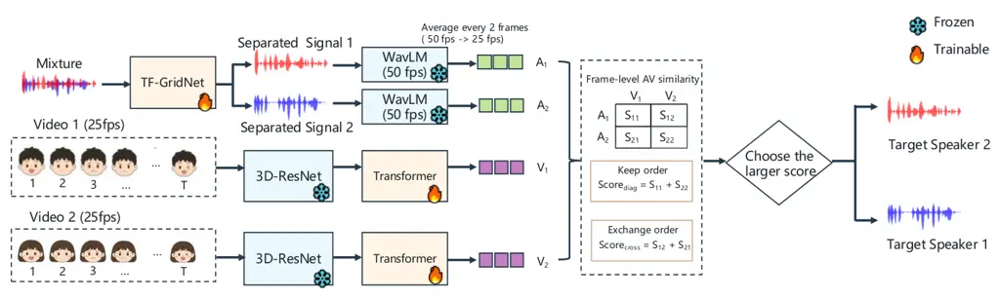

# Separate First, Then Associate: A Two-Stage Approach for Real-World Audio-Visual Speech Enhancement

###### Abstract

Audio-visual speech enhancement (AVSE) aims at extracting target speech
from multi-speaker mixtures by exploiting visual cues. Although recent
studies have reported strong performance on simulated datasets, the
performance, however, often drops dramatically when they are applied to
real-world audio-visual recordings. To bridge this gap, the Real-World
AVSE Challenge held in the ISCSLP 2026 conference calls for participants
to design a practical solution for AVSE under real-world conditions,
where speaker overlap, acoustic interferences, room reverberation and
visual degradations naturally co-exist. In our submission to the
challenge, we propose a decoupled separation-then-association approach.
It consists of two stages: a separation stage in which a trained,
audio-only model (i.e., not using visual cues) is used to separate input
multi-speaker mixture to individual speaker signals, followed by an
association stage, where an audio-visual CLIP model is used to identify
the separated speech signal with the highest similarity with the target
speaker’s facial video via cross-modal similarity matching. Evaluation
results on the challenge dataset show the effectiveness of our proposed
approach.

Tongtao Ling and Zhong-Qiu Wang

Southern University of Science and Technology, Shenzhen, China

lingtt2025@mail.sustech.edu.cn, wang.zhongqiu41@gmail.com

Index Terms: audio-visual speech separation, contrastive learning,
similarity matching, target speaker extraction.

## 1 Introduction

Audio-only speech separation systems have made substantial progress in
recent years, since the speaker permutation ambiguity problem was
successfully addressed by optimizing permutation invariant objectives
\[1, 2, 3\]. Although individual speech sources can be successfully
separated, the system does not inherently know which output corresponds
to the target speaker. Visual cues provide a natural solution to this
problem. The motion of a speaker’s face, particularly around the mouth
region, is strongly correlated with the corresponding speech signal.
Audio-visual speech enhancement (AVSE) therefore exploits visual cues to
identify or extract the speech of the target speaker from a
multi-speaker mixture \[4, 5, 6, 7, 8, 9, 10, 11, 12\]. Most existing
AVSE systems incorporate visual representations directly into the speech
separation network. In such systems, visual features are temporally
aligned with acoustic representations and used to condition the
separation process.

The Real-World AVSE Challenge¹¹ 1 See
[https://real-world-avse.github.io/](https://real-world-avse.github.io/).
further extends this problem to realistic recording conditions. In
contrast to benchmarks constructed through synthetic mixing, the Track
$`1`$ of the challenge contains naturally-recorded speech mixtures with
realistic reverberation, ambient noises, and speech overlap. In
addition, Track $`2`$ is designed to deal with the case where visual
cues suffer from degradations such as low resolution, occlusion, missing
or frozen frames, and time-synchronization issues. These conditions make
tightly-coupled audio-visual separation more difficult because
unreliable visual features can directly interfere with the speech
separation process \[13, 14, 15, 16, 17\].

In this paper, we explore an alternative strategy which decouples speech
separation with audio-visual speaker association. Instead of using
visual cues to condition and guide the separator, we first perform
multi-speaker separation using strong audio-only models such as
TF-GridNet \[3\]. We then employ a pre-trained audio-visual contrastive
model (i.e., AV-CLIP \[18\]) to measure the correspondence between each
separated signal and the target speaker video. The separated signal with
higher audio-visual similarity is selected as estimated target speech.

Our approach has several advantages. First, speech separation is
performed entirely in the audio domain, preventing degraded visual cues
from directly affecting the separation process. Second, the audio-visual
model only needs to solve a relatively simple speaker association
problem rather than the more difficult speech separation problem. Third,
the separation and association modules can be trained independently
using substantially different datasets, making it possible to exploit
large-scale audio-only speech separation data together with audio-visual
speech data which is of limited availability.

It should be noted that there are early studies in target speaker
extraction, which first perform multi-speaker separation and then
conduct speaker verification based on extracted speaker embeddings to
select the target speaker \[19, 20, 21\]. A similar
separation-and-selection paradigm is investigated recently in
brain-assisted speech enhancement \[22\], where auditory attention
decoding is used to identify the attended speech after multi-speaker
separation. Differently, our study extends this approach to AVSE, a
different task, and we leverage audio-visual contrastive learning to
perform target speaker selection.

## 2 System Description

Figure 1 shows our submitted system, consisting of three components: a
speech separator, an audio-visual CLIP model, and a cross-modality,
audio-visual speaker association module.



Figure 1: Overview of proposed separation-then-association approach for
AVSE.

### 2.1 Speech Separator

We employ TF-GridNet \[3\] for speech separation. It exhibits strong
performance in multiple recent speech separation benchmarks. Given a
two-speaker mixture signal $`y`$, the separator estimates two candidate
speech signals, $`\hat{s}_{1}`$ and $`\hat{s}_{2}`$, solely based on the
audio mixture without using any visual cues. Since speech separation is
inherently permutation-invariant, the ordering of the separated outputs
is not associated with that of the visible speakers. In other words, the
separator determines _what speech signals are present_ in the mixture
but does not determine _which separated signal belongs to which visible
speaker_. We resolve this ambiguity in the subsequent cross-modal
speaker association stage, where a trained AV-CLIP model is used to
measure the temporal correspondence between each separated speech
candidate and each visible speaker.

### 2.2 Frame-level AV-CLIP

Unlike segment-level contrastive learning \[18\], the objective of using
AV-CLIP in our task is to align visual representations with speech
representations through frame-level contrastive learning \[23\]. After
that, we evaluate the correspondence between each separated signal and
the target video, and determines which candidate belongs to the target
speaker. In detail, given a synchronized audio-visual pair, we first
employ a pre-trained self-supervised speech encoder (e.g., WavLM \[24\])
to extract frame-level acoustic representations:

```math
\mathbf{A}=[a_{1},a_{2},\dots,a_{T_{a}}]\in{\mathbb{R}}^{T_{a}\times D}, \tag{1}
```

where $`a_{t}\in\mathbb{R}^{D}`$ is a $`D`$-dimensional embedding
corresponding to frame $`t`$ of audio, and $`T_{a}`$ is the total number
of audio frames. Meanwhile, we use a pre-trained visual encoder (e.g.,
3D-ResNet18 \[25\]) to extract frame-level visual representations. Since
each visual frame is independently encoded, we feed the sequence of
frame embeddings to a trainable Transformer encoder \[26\] to capture
temporal dependencies among adjacent lip movements, resulting in:

```math
\mathbf{V}=[v_{1},v_{2},\dots,v_{T_{v}}]\in{\mathbb{R}}^{T_{v}\times D}, \tag{2}
```

where $`v_{t}\in\mathbb{R}^{D}`$ is the visual embedding at video frame
$`t`$, and $`T_{v}`$ the total number of visual frames. Since WavLM
operates at $`50`$ frames per second (fps) while the video stream is
sampled at $`25`$ fps, the acoustic embeddings have approximately twice
the temporal resolution of the visual embeddings (i.e.,
$`2T_{v}\approx T_{a}`$). To align the two modalities, we average every
two consecutive audio frames, resulting in temporally aligned audio and
visual embeddings with the same frame rate. That is,
$`T\approx T_{v}\approx\frac{1}{2}T_{a}`$.

Based on the time-aligned embeddings, i.e.,
$`\widetilde{\mathbf{A}}\in\mathbb{R}^{T\times D}`$ and
$`\widetilde{\mathbf{V}}\in\mathbb{R}^{T\times D}`$, we follow an
InfoNCE loss \[23\] to perform audio-visual contrastive learning at the
frame level. Audio and visual embeddings from the same temporal frame
are treated as positive pairs, while those from different frames are
treated as negative pairs. This objective encourages
temporally-corresponding audio and visual embeddings to be close to each
other in the shared embedding space while pushing away non-corresponding
embeddings, thereby enabling the model to learn fine-grained
correspondence between speech and lip movements. In detail, the
similarity matrix between visual and acoustic embeddings is computed as

```math
\mathbf{S}=\frac{1}{\tau}\cdot\widetilde{\mathbf{V}}\widetilde{\mathbf{A}}^{\top}\in\mathbb{R}^{T\times T}, \tag{3}
```

where $`\tau`$ is a learnable temperature parameter. For each visual
frame, the synchronized audio frame is regarded as the positive sample,
while all remaining frames serve as negative samples. Consequently, the
visual-to-audio contrastive loss is defined as

```math
\mathcal{L}_{\text{v2a}}=-\frac{1}{T}\sum_{i=1}^{T}\log\frac{\exp(S_{ii})}{\sum_{j=1}^{T}\exp(S_{ij})}, \tag{4}
```

and, similarly, the audio-to-visual objective is formulated as

```math
\mathcal{L}_{\text{a2v}}=-\frac{1}{T}\sum_{i=1}^{T}\log\frac{\exp(S_{ii})}{\sum_{j=1}^{T}\exp(S_{ji})}. \tag{5}
```

The overall temporal alignment loss is
$`\mathcal{L}_{\text{av-clip}}=\mathcal{L}_{\text{v2a}}+\mathcal{L}_{\text{a2v}}`$.

### 2.3 Cross-Modal Speaker Association

After speech separation, the two separated signals are
permutation-invariant (i.e., the separation model itself does not
determine which output corresponds to which visible speaker). We
therefore employ the trained AV-CLIP model to establish the
correspondence between the separated signals and the visible speakers
based on their temporal audio-visual consistency.

Given two separated speech candidates $`A_{1}`$ and $`A_{2}`$ and two
synchronized target videos $`V_{1}`$ and $`V_{2}`$, we first extract
their frame-level audio and visual embeddings using the audio and visual
encoders of frame-level AV-CLIP. As described in the previous section,
the audio embeddings are temporally down-sampled to approximately $`25`$
fps to match the frame rate of the visual embeddings. The resulting
embeddings are then $`\ell_{2}`$-normalized along the embedding
dimension. In detail, for each audio-video pair $`(A_{i},V_{j})`$
between the audio of speaker $`i`$ and video of speaker $`j`$, we
compute a frame-level cosine similarity between temporally-corresponding
audio and visual embeddings. The overall audio-visual matching score is
obtained by averaging the similarities over all valid frames:

```math
S_{i,j}=\frac{1}{T}\sum_{t=1}^{T}\frac{\mathbf{a}_{i,t}^{\top}\mathbf{v}_{j,t}}{||\mathbf{a}_{i,t}||_{2}||\mathbf{v}_{j,t}||_{2}}, \tag{6}
```

where $`\mathbf{a}_{i,t}`$ denotes the audio embedding of the $`i`$-th
separated signal at frame $`t`$, $`\mathbf{v}_{j,t}`$ the visual
embedding of the $`j`$-th speaker, and $`T`$ the number of
temporally-aligned frames. A higher $`S_{i,j}`$ indicates stronger
temporal correspondence between the separated speech and the lip
movements. Since there are two speakers, only two possible one-to-one
assignments need to be considered. Their association scores are
respectively computed as

```math
S_{\mathrm{diag}}=S_{1,1}+S_{2,2},\hskip 18.49988ptS_{\mathrm{cross}}=S_{1,2}+S_{2,1}, \tag{7}
```

and the final permutation is selected according to

```math
\pi^{*}=\begin{cases}(1,2),&S_{\mathrm{diag}}\geq S_{\mathrm{cross}};\\
(2,1),&\text{otherwise}.\end{cases} \tag{8}
```

Accordingly, the separated signals are reordered such that each output
is associated with its corresponding visible speaker. In this way,
AV-CLIP resolves the permutation ambiguity of speech separation without
requiring a speaker enrollment utterance or an explicit speaker identity
model.

## 3 Experimental Setup

In the Real-World AVSE Challenge, all audio signals are provided as
monaural recordings sampled at $`16`$ kHz, and each recording contains
two speakers. Since no dedicated training set is provided by the
challenge and the participants are allowed to use any public datasets
for model training, we first train a speech separation model on the
Libri2Mix dataset \[27\], and subsequently fine-tune it using the
real-recorded development data provided by the challenge. As shown in
Table 1, the development and test sets consist of two types of mixture
signals: mix and remix. The mix data correspond to naturally recorded
real-world mixtures without clean reference signals and are therefore
evaluated only using non-intrusive metrics. In contrast, the remix data
are constructed by mixing two clean, real-recorded single-speaker
recordings, providing clean references for reference-based evaluation.
We hence leverage the remix data with available clean references for
supervised fine-tuning of the separation model. This two-stage training
strategy allows the model to first learn general speech separation
capabilities from Libri2Mix, and subsequently adapt to the acoustic
characteristics of the challenge recordings, thereby reducing domain
mismatches between simulated and real-world conditions.

We employ TF-GridNet \[3\] to separate each mixture to two candidate
signals. Each training segment is $`4`$-second long. Following the
hyper-parameters in TF-GridNet \[3\], we set $`B=6`$, $`D=128`$,
$`H=256`$, $`I=1`$, $`J=1`$, $`E=8`$, and $`L=4`$. For short-time
Fourier transform (STFT), we use $`16`$ ms window, $`8`$ ms hop, and a
square-root Hann analysis window. The model is trained using the
scale-invariant signal-to-noise ratio (SI-SNR) \[28\] objective with
permutation invariant training (PIT) \[2\]. We train TF-GridNet for up
to $`100`$ epochs, using the Adam optimizer \[29\] with a batch size of
$`2`$. The initial learning rate is set to $`5\times 10^{-4}`$ and is
reduced by half if the validation loss does not improve for two
consecutive epochs.

To train AV-CLIP, we use the LRS$`3`$ dataset \[30\]. For the audio
branch, we employ WavLM-Large as the audio encoder and apply a linear
projection layer to map its $`1,024`$-dimensional embeddings to
$`512`$-dimensional. For the visual branch, we use 3D-ResNet18 as the
visual encoder, followed by a Transformer encoder for temporal modeling.
During AV-CLIP training, the parameters of both the pretrained
WavLM-Large and 3D-ResNet18 encoders are frozen, while the projection
layer and Transformer encoder are optimized for learning audio-visual
correspondence. The Transformer consists of $`6`$ layers, each with a
hidden dimension of $`512`$, a feed-forward dimension of $`2,048`$, and
$`8`$ self-attention heads, resulting in around $`19.4`$ million
trainable parameters. We optimize the model using the AdamW optimizer
\[31\] with an initial learning rate of $`10^{-4}`$ and a cosine
learning rate schedule. Specifically, the learning rate is linearly
warmed up in the first $`10\%`$ of the training epochs and then decayed
according to a cosine schedule for the remaining epochs. The model is
trained for $`100`$ epochs with a batch size of $`128`$. To better adapt
the learned audio-visual embeddings to the target domain, we further
fine-tune AV-CLIP on the development remix subset, which provides
synchronized audio-visual samples that more closely match the evaluation
conditions.

| Split | Scene | Track 1  | Track 2  |
| ----- | ----- | -------- | -------- |
| dev   | mix   | $`1242`$ | $`1527`$ |
| dev   | remix | $`900`$  | $`1098`$ |
| test  | mix   | $`2472`$ | $`2820`$ |
| test  | remix | $`1785`$ | $`2121`$ |

Table 1: Data statistics of Real-World AVSE Challenge.

|                             |       |                         |                  |                  |                   |                      |                     |                     |                      |                            |                     |
| --------------------------- | ----- | ----------------------- | ---------------- | ---------------- | ----------------- | -------------------- | ------------------- | ------------------- | -------------------- | -------------------------- | ------------------- |
| Model                       | Scene | SI-SDR (dB)$`\uparrow`$ | PESQ$`\uparrow`$ | STOI$`\uparrow`$ | UTMOS$`\uparrow`$ | DNS-P808$`\uparrow`$ | DNS-SIG$`\uparrow`$ | DNS-BAK$`\uparrow`$ | DNS-OVRL$`\uparrow`$ | CER ($`\%`$)$`\downarrow`$ | SPK-SIM$`\uparrow`$ |
| Baseline (AV-ConvTasNet)    | mix   | –                       | –                | –                | $`0.7295`$        | $`2.1839`$           | $`1.7935`$          | 2.8431              | $`1.4668`$           | $`105.90`$                 | $`0.3336`$          |
| Baseline (AV-ConvTasNet)    | remix | $`-5.9252`$             | $`1.1373`$       | $`0.3036`$       | $`0.9263`$        | $`2.1597`$           | $`1.7766`$          | $`2.5115`$          | $`1.4200`$           | $`97.89`$                  | $`0.3197`$          |
| Baseline (AV-ConvTasNet)    | both  | $`-5.9252`$             | $`1.1373`$       | $`0.3036`$       | $`0.8120`$        | $`2.1737`$           | $`1.7864`$          | $`2.7041`$          | $`1.4472`$           | $`102.54`$                 | $`0.3278`$          |
| Separation-then-association | mix   | –                       | –                | –                | $`1.9433`$        | 2.8265               | 2.2407              | $`2.3450`$          | 1.7854               | $`18.62`$                  | $`0.7203`$          |
| Separation-then-association | remix | 10.4156                 | 2.6511           | 0.8232           | $`2.0725`$        | $`2.7671`$           | $`2.1506`$          | $`2.3209`$          | $`1.7487`$           | 13.24                      | 0.7592              |
| Separation-then-association | both  | 10.4156                 | 2.6511           | 0.8232           | $`1.9975`$        | $`2.8016`$           | $`2.2029`$          | $`2.3349`$          | $`1.7700`$           | $`16.37`$                  | $`0.7366`$          |
|    + Dynamic mixing         | mix   | –                       | –                | –                | $`1.9397`$        | $`2.7949`$           | $`2.2327`$          | $`2.2856`$          | $`1.7476`$           | $`20.74`$                  | $`0.7164`$          |
|    + Dynamic mixing         | remix | $`10.0321`$             | $`2.6269`$       | $`0.8211`$       | 2.0945            | $`2.7541`$           | $`2.1267`$          | $`2.2072`$          | $`1.7062`$           | $`13.44`$                  | $`0.7531`$          |
|    + Dynamic mixing         | both  | $`10.0321`$             | $`2.6269`$       | $`0.8211`$       | $`2.0046`$        | $`2.7778`$           | $`2.1883`$          | $`2.2528`$          | $`1.7302`$           | $`17.68`$                  | $`0.7318`$          |

Table 2: Evaluation results on Track 1.

| Model                       | Scene | SI-SDR (dB)$`\uparrow`$ | PESQ$`\uparrow`$ | STOI$`\uparrow`$ | UTMOS$`\uparrow`$ | DNS-P808$`\uparrow`$ | DNS-SIG$`\uparrow`$ | DNS-BAK$`\uparrow`$ | DNS-OVRL$`\uparrow`$ | CER ($`\%`$)$`\downarrow`$ | SPK-SIM$`\uparrow`$ |
| --------------------------- | ----- | ----------------------- | ---------------- | ---------------- | ----------------- | -------------------- | ------------------- | ------------------- | -------------------- | -------------------------- | ------------------- |
| Baseline (AV-ConvTasNet)    | mix   | –                       | –                | –                | $`1.0965`$        | $`2.3423`$           | $`1.3718`$          | $`1.3594`$          | $`1.1658`$           | $`109.36`$                 | $`0.4007`$          |
| Baseline (AV-ConvTasNet)    | remix | $`-1.6892`$             | $`1.3036`$       | $`0.5021`$       | $`1.1039`$        | $`2.3067`$           | $`1.5282`$          | $`1.5371`$          | $`1.2621`$           | $`99.76`$                  | $`0.3892`$          |
| Baseline (AV-ConvTasNet)    | both  | $`-1.6892`$             | $`1.3036`$       | $`0.5021`$       | $`1.0996`$        | $`2.3271`$           | $`1.4390`$          | $`1.4357`$          | $`1.2071`$           | $`105.24`$                 | $`0.3957`$          |
| Separation-then-association | mix   | –                       | –                | –                | $`1.9653`$        | 2.8053               | 2.1966              | 2.2974              | 1.7545               | $`23.06`$                  | $`0.7104`$          |
| Separation-then-association | remix | 9.5414                  | $`2.5542`$       | $`0.8045`$       | 2.0908            | $`2.7285`$           | $`2.0892`$          | $`2.2605`$          | $`1.7047`$           | $`18.43`$                  | $`0.7462`$          |
| Separation-then-association | both  | 9.5414                  | $`2.5542`$       | $`0.8045`$       | $`2.0192`$        | $`2.7723`$           | $`2.1505`$          | $`2.2816`$          | $`1.7331`$           | $`21.08`$                  | $`0.7258`$          |
|    + Dynamic mixing         | mix   | –                       | –                | –                | $`1.8086`$        | $`2.7300`$           | $`1.8476`$          | $`1.8886`$          | $`1.5145`$           | $`22.52`$                  | $`0.7526`$          |
|    + Dynamic mixing         | remix | $`9.2707`$              | 2.5935           | 0.8047           | $`1.9619`$        | $`2.6531`$           | $`1.8387`$          | $`1.9472`$          | $`1.5355`$           | 17.97                      | 0.7775              |
|    + Dynamic mixing         | both  | $`9.2707`$              | 2.5935           | 0.8047           | $`1.8744`$        | $`2.6970`$           | $`1.8438`$          | $`1.9138`$          | $`1.5235`$           | $`20.57`$                  | $`0.7633`$          |

Table 3: Evaluation results on Track 2.

|                                    |                                    |                         |                  |                  |                   |                      |                      |                     |                    |
| ---------------------------------- | ---------------------------------- | ----------------------- | ---------------- | ---------------- | ----------------- | -------------------- | -------------------- | ------------------- | ------------------ |
| Track                              | System                             | SI-SDR (dB)$`\uparrow`$ | PESQ$`\uparrow`$ | STOI$`\uparrow`$ | UTMOS$`\uparrow`$ | DNS-OVRL$`\uparrow`$ | CER(%)$`\downarrow`$ | SPK-SIM$`\uparrow`$ | OVRL$`\downarrow`$ |
| Track 1                            | Baseline (AV-ConvTasNet)           | $`-5.9`$                | $`1.137`$        | $`0.304`$        | $`0.812`$         | $`1.447`$            | $`102.5`$            | $`0.328`$           | $`16.14`$          |
| audioman                           | $`10.70`$                          | $`2.933`$               | $`0.841`$        | $`2.074`$        | $`1.832`$         | $`12.3`$             | $`0.749`$            | $`2.86`$            |                    |
| AITD                               | $`12.72`$                          | $`3.000`$               | $`0.852`$        | $`2.100`$        | $`1.697`$         | $`14.5`$             | $`0.769`$            | $`2.86`$            |                    |
| twilight                           | $`9.16`$                           | $`2.775`$               | $`0.825`$        | $`2.145`$        | $`1.944`$         | $`13.5`$             | $`0.742`$            | $`3.57`$            |                    |
| YiJiaHe                            | $`10.23`$                          | $`2.717`$               | $`0.817`$        | $`2.765`$        | $`2.022`$         | $`17.1`$             | $`0.726`$            | $`4.00`$            |                    |
| Separation-then-association (Ours) | $`10.42`$                          | $`2.651`$               | $`0.823`$        | $`1.998`$        | $`1.770`$         | $`16.4`$             | $`0.737`$            | $`5.43`$            |                    |
| Track 2                            | Baseline (AV-ConvTasNet)           | $`-1.69`$               | $`1.304`$        | $`0.502`$        | $`1.100`$         | $`1.207`$            | $`105.2`$            | $`0.396`$           | $`11.29`$          |
|                                    | AITD                               | $`12.26`$               | $`2.939`$        | $`0.844`$        | $`2.129`$         | $`1.670`$            | $`15.3`$             | $`0.764`$           | $`2.43`$           |
|                                    | audioman                           | $`10.22`$               | $`2.888`$        | $`0.830`$        | $`2.094`$         | $`1.760`$            | $`14.8`$             | $`0.744`$           | $`2.86`$           |
|                                    | YiJiaHe                            | $`8.93`$                | $`2.615`$        | $`0.789`$        | $`2.766`$         | $`2.012`$            | $`22.0`$             | $`0.707`$           | $`4.14`$           |
|                                    | twilight                           | $`7.05`$                | $`2.561`$        | $`0.776`$        | $`2.170`$         | $`1.896`$            | $`22.0`$             | $`0.712`$           | $`5.00`$           |
|                                    | Separation-then-association (Ours) | $`9.54`$                | $`2.554`$        | $`0.805`$        | $`2.019`$         | $`1.733`$            | $`21.1`$             | $`0.726`$           | $`5.29`$           |

Table 4: Comparison with other participating systems on Track 1 and 2.

We evaluate the system using both intrusive (reference-based) and
non-intrusive (reference-free) metrics. For intrusive evaluation, we
employ scale-invariant signal-to-distortion ratio (SI-SDR) \[28\],
perceptual evaluation of speech quality (PESQ) \[32\] and short-time
objective intelligibility (STOI) \[33\] to respectively measure speech
separation quality, perceptual quality, and intelligibility. Since the
real-recorded mix data do not provide clean reference signals, these
intrusive metrics are only computed on the remix subset. For
non-intrusive evaluation, we report UTMOS \[34\] and DNSMOS \[35\] for
perceptual speech quality assessment, character error rate (CER)
computed using Fun-ASR-Nano \[36\] to evaluate speech recognition
performance, and speaker similarity (SPK-SIM) computed using
WeSpeaker-ResNet34 \[37\] to assess the preservation of target-speaker
characteristics. These reference-free metrics are evaluated on both the
mix and remix subsets.

We compare our proposed system with the challenge baseline,
AV-ConvTasNet \[38\]. In addition, we evaluate a variant of our system,
where the speech separator is further trained with dynamically generated
mixtures (i.e., dynamic mixing \[39\]) to investigate whether additional
simulated training mixtures can improve its generalizability to
real-world recordings.

## 4 Evaluation Results

Table 2 and 3 respectively report results on Track 1 and 2 of the
challenge. We compare our separation-then-association approach with the
official AV-ConvTasNet baseline under three evaluation settings,
including mix, remix and both. Since the mix data are naturally-recorded
mixtures without clean reference signals, intrusive metrics (such as
SI-SDR, PESQ and STOI) are only reported for the remix data.

Compared with the AV-ConvTasNet baseline, our
separation-then-association approach obtains substantially better
performance in both tracks. On Track 1, the SI-SDR on the remix set
improves from $`-5.9`$ to $`10.4`$ dB, amounting to an absolute
improvement of $`16.3`$ dB. Meanwhile, PESQ and STOI increase from
$`1.14`$ and $`0.304`$ to $`2.65`$ and $`0.823`$, respectively.
Significant improvements are also observed for reference-free metrics.
On the combined both set, UTMOS improves from $`0.812`$ to $`1.998`$,
while CER is reduced from $`102.5\%`$ to $`16.4\%`$ and SPK-SIM
increases from $`0.328`$ to $`0.737`$. These results indicate that the
proposed approach not only achieves better signal reconstruction but
also better preserves speech intelligibility and target-speaker
characteristics.

A similar trend is observed on Track 2. Compared with the AV-ConvTasNet
baseline, our system improves SI-SDR from $`-1.7`$ to $`9.5`$ dB on the
remix set, and increases PESQ and STOI from $`1.30`$ and $`0.502`$ to
$`2.55`$ and $`0.805`$, respectively. On the combined set, CER is
reduced from $`105.2\%`$ to $`21.1\%`$, while SPK-SIM improves from
$`0.396`$ to $`0.726`$. The consistent improvements in both tracks
demonstrate the effectiveness and robustness of our proposed approach
for real-world AVSE.

We further investigate whether dynamically-generated speech mixtures
(i.e., dynamic mixing \[39\]) can improve the generalizability of the
separation model. The results show different behaviors on the two
tracks. On Track 1, dynamic mixing provides no consistent improvement:
SI-SDR slightly decreases from $`10.4`$ to $`10.0`$ dB, accompanied by
small degradations in PESQ and STOI. The reference-free metrics exhibit
a similar trend, suggesting that dynamically-generated mixtures still
exhibit domain mismatches with real-world recordings.

On Track 2, however, dynamic mixing improves target-speaker preservation
despite some degradation in perceptual speech quality. In particular,
SPK-SIM increases from $`0.710`$ to $`0.753`$ on mix, from $`0.746`$ to
$`0.778`$ on remix, and from $`0.726`$ to $`0.763`$ on the combined set.
CER is also slightly reduced from $`23.1\%`$ to $`22.5\%`$ on mix and
from $`18.4\%`$ to $`18.0\%`$ on remix. In contrast, SI-SDR decreases
slightly from $`9.5`$ to $`9.3`$ dB, and several DNSMOS-related metrics
also decrease. This indicates a trade-off between perceptual speech
quality and target-speaker preservation: dynamic mixing may improve the
ability of the model to retain target-speaker characteristics without
necessarily improving conventional signal-level metrics.

Table 4 compares our system with other participating systems²² 2 See
[https://avse.renwenze.com/](https://avse.renwenze.com/).. On Track 1,
our system achieves $`10.4`$ dB SI-SDR, which is competitive with
audioman and YiJiaHe, although lower than the best-performing AITD
system ($`12.7`$ dB). Similar trends are observed for PESQ and STOI. In
terms of target-speaker preservation, our system obtains a SPK-SIM of
$`0.737`$, outperforming YiJiaHe and remaining close to twilight and
audioman. On Track 2, our method achieves $`9.5`$ dB SI-SDR,
outperforming YiJiaHe and twilight, while approaching audioman ($`10.2`$
dB). Our STOI of $`0.81`$ also exceeds those of YiJiaHe and twilight.
For SPK-SIM, our system achieves $`0.726`$, higher than YiJiaHe and
twilight, although AITD and audioman obtain better results. These
results suggest that the proposed framework achieves competitive
separation performance despite its relatively simple decoupled
architecture. However, our system shows competitive performance across
both tracks without being specifically optimized for a single evaluation
metric.

## 5 Conclusions

We have proposed a simple yet effective separation-then-association
approach for real-world AVSE. Instead of directly extracting target
speech conditioned on lip embeddings, our framework decomposes AVSE into
two stages: speech separation and cross-modal speaker association.
Evaluation results on the challenge dataset demonstrate that our
approach substantially outperforms the challenge baseline across a wide
range of evaluation metrics, confirming the effectiveness of the
proposed framework for challenging real-world audio-visual scenarios.

## References

- \[1\] J. R. Hershey, Z. Chen, J. Le Roux, and S. Watanabe (2016) Deep
  Clustering: Discriminative Embeddings for Segmentation and Separation.
  In Proc. ICASSP, pp. 31–35. Cited by: §1.
- \[2\] D. Yu, M. Kolbæk, Z. Tan, and J. Jensen (2017) Permutation
  Invariant Training of Deep Models for Speaker-Independent Multi-talker
  Speech Separation. In Proc. ICASSP, pp. 241–245. Cited by: §1, §3.
- \[3\] Z. Wang, S. Cornell, S. Choi, Y. Lee, et al. (2023) TF-GridNet:
  Integrating Full- and Sub-Band Modeling for Speech Separation.
  IEEE/ACM Trans. Audio, Speech, and Lang. Process. 31, pp. 3221–3236.
  Cited by: §1, §1, §2.1, §3.
- \[4\] A. Ephrat, I. Mosseri, O. Lang, T. Dekel, K. Wilson, A.
  Hassidim, W. T. Freeman, and M. Rubinstein (2018) Looking to Listen at
  the Cocktail Party: A Speaker-Independent Audio-Visual Model for
  Speech Separation. ACM Trans. Graphics 37 (4). Cited by: §1.
- \[5\] R. Gu, S. Zhang, Y. Xu, L. Chen, Y. Zou, and D. Yu (2020)
  Multi-Modal Multi-Channel Target Speech Separation. IEEE/ACM Trans.
  Audio, Speech, and Lang. Process. 14 (3), pp. 530–541. Cited by: §1.
- \[6\] D. Michelsanti, Z. Tan, S. Zhang, Y. Xu, M. Yu, D. Yu, and J.
  Jensen (2021) An Overview of Deep-Learning-Based Audio-Visual Speech
  Enhancement and Separation. IEEE/ACM Trans. Audio, Speech, and Lang.
  Process. 29, pp. 1368–1396. External Links: 2008.09586, ISSN 23299304
  Cited by: §1.
- \[7\] R. Tao, X. Qian, Y. Jiang, J. Li, et al. (2025) Audio-Visual
  Target Speaker Extraction With Selective Auditory Attention. IEEE
  Trans. Audio, Speech, and Lang. Process. 33 (), pp. 797–811. Cited by:
  §1.
- \[8\] Z. Pan, R. Tao, C. Xu, and H. Li (2022) Selective Listening by
  Synchronizing Speech with Lips. IEEE/ACM Trans. Audio, Speech, and
  Lang. Process. 30, pp. 1650–1664. Cited by: §1.
- \[9\] Z. Pan, G. Wichern, Y. Masuyama, F. G. Germain, et al. (2023)
  Scenario-Aware Audio-Visual TF-GridNet for Target Speech Extraction.
  In Proc. ASRU, pp. 1–8. Cited by: §1.
- \[10\] Z. Mu and X. Yang (2024) Separate in the Speech Chain:
  Cross-Modal Conditional Audio-Visual Target Speech Extraction. In
  Proc. IJCAI, pp. 6415–6423. Cited by: §1.
- \[11\] V. A. Kalkhorani C. Yu et al. (2025) AV-CrossNet: An
  Audiovisual Complex Spectral Mapping Network for Speech Separation by
  Leveraging Narrow-and Cross-Band Modeling. IEEE J. Sel. Top. Signal
  Process. 19 (4), pp. 685–694. Cited by: §1.
- \[12\] T. Ling, S. He, and Z. Wang (2026) TGTSE: Token-Guided Target
  Speaker Extraction with Visual Cue. In Proc. Interspeech, Cited by:
  §1.
- \[13\] J. Li, W. Wu, S. Wang, Z. Pan, et al. (2026) MeMo: Attentional
  Momentum for Real-Time Audio-Visual Target Speaker Extraction Under
  Impaired Visual Conditions. IEEE Trans. Audio, Speech, and Lang.
  Process. 34 (), pp. 3491–3504. Cited by: §1.
- \[14\] P. Yang, Z. Jin, J. Liu, and M. Li (2026) Multi-View Based
  Audio Visual Target Speaker Extraction. In Proc. Interspeech, Cited
  by: §1.
- \[15\] W. Wu, S. Wang, X. Wu, H. Meng, and H. Li (2026) ELEGANCE:
  Efficient LLM Guidance for Audio-Visual Target Speech Extraction. IEEE
  Trans. Audio, Speech, and Lang. Process. 34 (), pp. 2801–2814. Cited
  by: §1.
- \[16\] J. Li, K. Zhang, S. Wang, K. A. Lee, M. Mak, and H. Li (2025)
  MoMuSE: Momentum Multi-modal Target Speaker Extraction for Real-time
  Scenarios with Impaired Visual Cues. In Proc. ICME, pp. 1–6. Cited by:
  §1.
- \[17\] M. Cheng and M. Li (2025) Multi-Input Multi-Output
  Target-Speaker Voice Activity Detection for Unified, Flexible, and
  Robust Audio-Visual Speaker Diarization. IEEE Trans. Audio, Speech,
  and Lang. Process. 33 (), pp. 3522–3536. Cited by: §1.
- \[18\] V. Iashin, W. Xie, E. Rahtu, and A. Zisserman (2024)
  Synchformer: Efficient Synchronization from Sparse Cues. In Proc.
  ICASSP, pp. 5325–5329. Cited by: §1, §2.2.
- \[19\] W. Rao, C. Xu, E. S. Chng, and H. Li (2019) Target Speaker
  Extraction for Multi-Talker Speaker Verification. In Proc.
  Interspeech, pp. 1273–1277. Cited by: §1.
- \[20\] J. Malek, J. Jansky, Z. Koldovsky, T. Kounovsky, et al. (2022)
  Target Speech Extraction: Independent Vector Extraction Guided by
  Supervised Speaker Identification. IEEE/ACM Trans. Audio, Speech, and
  Lang. Process. 30, pp. 2295–2309. Cited by: §1.
- \[21\] K. Žmolíková, M. Delcroix, K. Kinoshita, et al. (2019)
  SpeakerBeam: Speaker Aware Neural Network for Target Speaker
  Extraction in Speech Mixtures. IEEE J. Sel. Top. Signal Process. 13
  (4), pp. 800–814. Cited by: §1.
- \[22\] Q. Xu, J. Zhang, M. Sun, H. Liang, et al. (2026) Analysis of
  Brain-Assisted Speech Enhancement Models Incorporating Auditory
  Attention Decoding. IEEE Trans. Audio, Speech, and Lang. Process. 34
  (), pp. 3073–3086. Cited by: §1.
- \[23\] A. Radford, J. W. Kim, C. Hallacy, A. Ramesh, G. Goh, et
  al. (2021) Learning Transferable Visual Models from Natural Language
  Supervision. In Proc. ICML, pp. 8748–8763. Cited by: §2.2, §2.2.
- \[24\] S. Chen, C. Wang, Z. Chen, Y. Wu, et al. (2022) WavLM:
  Large-Scale Self-Supervised Pre-Training for Full Stack Speech
  Processing. IEEE J. Sel. Top. Signal Process. 16 (6), pp. 1505–1518.
  Cited by: §2.2.
- \[25\] T. Afouras, J. S. Chung, A. Senior, O. Vinyals, et al. (2018)
  Deep Audio-Visual Speech Recognition. IEEE Trans. Pattern Anal. Mach.
  Intell. 44 (12), pp. 8717–8727. Cited by: §2.2.
- \[26\] A. Vaswani, N. Shazeer, N. Parmar, J. Uszkoreit, et al. (2017)
  Attention is All you Need. In Proc. NIPS, Vol. 30. Cited by: §2.2.
- \[27\] J. Cosentino, M. Pariente, S. Cornell, A. Deleforge, and E.
  Vincent (2020) LibriMix: An Open-Source Dataset for Generalizable
  Speech Separation. arXiv:2005.11262. Cited by: §3.
- \[28\] J. Le Roux, S. Wisdom, H. Erdogan, and J. R. Hershey (2019)
  SDR–Half-Baked or Well Done?. In Proc. ICASSP, pp. 626–630. Cited by:
  §3, §3.
- \[29\] D. P. Kingma and B. Jimmy (2015) Adam: A Method for Stochastic
  Optimization. In Proc. ICLR, Cited by: §3.
- \[30\] T. Afouras, J. S. Chung, and A. Zisserman (2018) LRS3-TED: A
  Large-Scale Dataset for Visual Speech Recognition. arXiv:1809.00496.
  Cited by: §3.
- \[31\] I. Loshchilov and F. Hutter (2019) Decoupled Weight Decay
  Regularization. In Proc. ICLR, Cited by: §3.
- \[32\] A. W. Rix, J. G. Beerends, M. P. Hollier, and A. P.
  Hekstra (2001) Perceptual Evaluation of Speech Quality (PESQ)-A New
  Method for Speech Quality Assessment of Telephone Networks and Codecs.
  In Proc. ICASSP, Vol. 2, pp. 749–752. Cited by: §3.
- \[33\] C. H. Taal, R. C. Hendriks, R. Heusdens, and J. Jensen (2010) A
  short-time objective intelligibility measure for time-frequency
  weighted noisy speech. In Proc. ICASSP, pp. 4214–4217. Cited by: §3.
- \[34\] K. Baba, W. Nakata, Y. Saito, and H. Saruwatari (2024) The T05
  System for The VoiceMOS Challenge 2024: Transfer Learning from Deep
  Image Classifier to Naturalness MOS Prediction of High-Quality
  Synthetic Speech. In Proc. SLT, pp. 818–824. Cited by: §3.
- \[35\] C. K. Reddy, V. Gopal, and R. Cutler (2022) Dnsmos P.835: A
  Non-Intrusive Perceptual Objective Speech Quality Metric to Evaluate
  Noise Suppressors. In Proc. ICASSP, pp. 886–890. Cited by: §3.
- \[36\] K. An, Y. Chen, Z. Chen, C. Deng, et al. (2025) Fun-ASR
  Technical Report. arXiv:2509.12508. Cited by: §3.
- \[37\] H. Wang, C. Liang, S. Wang, Z. Chen, et al. (2023) Wespeaker: A
  Research and Production Oriented Speaker Embedding Learning Toolkit.
  In Proc. ICASSP, pp. 1–5. Cited by: §3.
- \[38\] J. Wu, Y. Xu, S. Zhang, et al. (2019) Time Domain Audio Visual
  Speech Separation. In Proc. ASRU, pp. 667–673. Cited by: §3.
- \[39\] N. Zeghidour and D. Grangier (2021) Wavesplit: End-to-End
  Speech Separation by Speaker Clustering. IEEE/ACM Trans. Audio,
  Speech, and Lang. Process. 29, pp. 2840–2849. Cited by: §3, §4.
