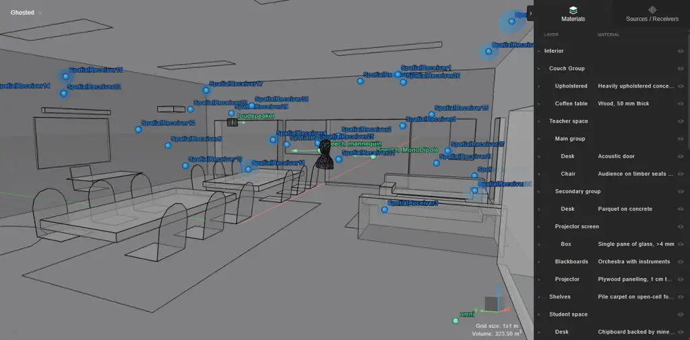

# TRAINING DEEPFILTERNET WITH ACCURATE ROOM ACOUSTIC SIMULATIONS IMPROVES SINGLE-CHANNEL SPEECH ENHANCEMENT

###### Abstract

We investigate how the realism of synthetic room impulse response (RIR)
datasets affects the training of DeepFilterNet3 for single-channel
speech enhancement. We compare a DNS4 image-source-method (ISM) RIR
dataset with a higher-acoustic-fidelity dataset generated using hybrid
wave-based and geometrical acoustics simulation. Rather than isolating
individual simulation factors, we compare complete RIR generation
pipelines while keeping the enhancement model unchanged. Models are
evaluated on unseen measured RIRs using objective speech enhancement
metrics and downstream automatic speech recognition (ASR). Training with
the higher-fidelity dataset consistently yields modest improvements in
objective metrics and substantially lower ASR word error rates than the
ISM dataset. Although the experiments do not attribute these gains to
individual modelling components, they show that increasing the overall
realism of synthetic acoustic training data improves the generalization
of DeepFilterNet3 to unseen measured environments.

|                                                                                                          |
| -------------------------------------------------------------------------------------------------------- |
| Alessia Milo, Georg Götz, Steinar Gu$`\eth{}`$jónsson, Daniel Gert Nielsen, Jesper Pedersen, Finnur Pind |
| Treble Technologies                                                                                      |
| Reykjavík                                                                                                |
| Iceland                                                                                                  |

Index Terms—  Speech enhancement, Room impulse response (RIR)
simulation, DeepFilterNet, Reverberation modeling, Automatic speech
recognition (ASR)

## 1 Introduction

Single-microphone audio capture remains prevalent in consumer and
embedded devices, where cost, size, and power constraints limit the use
of arrays. As a result, robust speech enhancement under adverse acoustic
conditions is essential, yet fundamentally challenging due to the lack
of spatial information.

Recent advances in deep learning, including CRNN-based models \[31\] and
large-scale training on datasets such as DNS \[9\], have significantly
improved single-channel enhancement. However, these approaches typically
rely on simplified RIRs generated via the image-source method \[14, 13,
18\], which do not fully capture real acoustic conditions.

Efficient architectures such as DeepFilterNet \[27, 28\] enable
real-time joint denoising and dereverberation and have shown strong
performance across challenging scenarios \[37, 40, 24, 39\].
Nevertheless, the impact of RIR fidelity on enhancement performance
remains underexplored.

Prior work has shown that increasing the realism of synthetic room
acoustics can improve speech-processing performance \[4, 2, 30, 11,
32\]. Gusó et al. \[11\] isolated factors such as frequency-dependent
absorption and source directivity for DeepFilterNet3, whereas Aralikatti
et al. \[3\] studied hybrid wave-geometric simulation for speech
dereverberation.

Here, we compare two complete RIR generation pipelines: conventional
image-source simulation and higher-fidelity hybrid simulation. The
DeepFilterNet3 architecture and training procedure remain unchanged.
Rather than isolating individual acoustic factors, we assess whether
greater overall simulation realism improves generalization in objective
enhancement metrics and downstream ASR on unseen measured RIRs. The
results motivate future controlled studies of geometry, material
modelling, frequency-dependent absorption, and wave-based simulation.

Our experiments evaluate both objective speech enhancement metrics and
downstream automatic speech recognition (ASR) performance on unseen
measured RIRs. While the present study does not attribute the observed
improvements to any individual simulation factor, it demonstrates that
training with a more realistic synthetic RIR dataset consistently
improves generalization across all evaluated configurations. These
findings complement previous studies on individual simulation factors
and motivate future work aimed at disentangling the respective
contributions of room geometry, material modelling, frequency-dependent
absorption, and hybrid wave-based simulation.

## 2 Acoustic simulation

In data augmentation for speech enhancement, the choice of acoustic
simulation method directly affects the spatial and spectral properties
of the generated RIRs. Room-acoustic simulation approaches are commonly
divided into geometrical acoustics (GA) and wave-based methods, with
hybrid techniques combining both. GA methods, such as the image-source
method (ISM) and ray tracing, approximate sound propagation using
specular reflections and energy transport assumptions that are most
valid at higher frequencies \[25, 16, 15, 1, 5\]. However, they do not
inherently capture wave phenomena such as diffraction, interference, or
room modes, and diffraction in particular remains challenging to model
accurately within GA frameworks \[33, 26\]. These limitations contribute
to known discrepancies and variability across simulation tools \[36,
7\].

Wave-based methods instead solve the acoustic wave equation directly,
enabling accurate modeling of diffraction, modal behavior, and
frequency-dependent boundary conditions, which are especially relevant
at low and mid frequencies \[12, 21, 23, 6\]. Although traditionally
more computationally demanding, recent advances have made large-scale
simulations increasingly feasible \[38, 22, 19\]. Hybrid approaches
combine both paradigms by applying wave-based solvers below a crossover
frequency and GA above it, capturing low-frequency wave effects while
retaining efficiency at higher frequencies \[29\]. In data augmentation,
this allows improved modeling of modal behavior, diffraction, and
frequency-dependent decay while maintaining broadband coverage.

## 3 Experiments

We compare an ISM RIR dataset with a higher-fidelity hybrid dataset and
describe the corresponding DeepFilterNet3 training and evaluation
protocol.

### 3.1 ISM: Image-source dataset

The simulated RIR dataset used in this work is based on the 48 kHz
OpenSLR release (SLR28) and corresponds to the RIR data provided in the
DNS Challenge 4 (DNS4) training set. The dataset comprises $`60\,000`$
RIRs organized into three room-size categories (small, medium, and
large), each containing 200 shoebox rooms with 100 impulse responses per
room. In this dataset, the reverberation time used as a target varies
from $`0.05\text{\,}\mathrm{s}1.0\text{\,}\mathrm{s}`$ and is used to
calculate a single uniform wall absorption coefficient.

To match dataset size and reverberation-time distribution, we paired
Hybrid and ISM rooms using Sabine RT₆₀ estimates derived from their
metadata and selected the closest ISM matches. Figure 1 shows the
resulting distributions.

Fig. 1: Histogram of Sabine RT60 values for Hybrid and ISM matched
datasets

### 3.2 Hybrid: High-fidelity dataset

Fig. 2: Level of detail for one of the rooms simulated in the Hybrid
dataset

The hybrid dataset was generated using the Treble SDK, with all
geometries and boundary-condition materials drawn from its built-in
libraries. It comprises three subsets corresponding to different room
types and size ranges: 133 living rooms
(40–$`180\text{\,}{\mathrm{m}}^{3}`$), 103 classrooms
(90–$`400\text{\,}{\mathrm{m}}^{3}`$), and 88 restaurants
(300–$`1600\text{\,}{\mathrm{m}}^{3}`$). All rooms are furnished and
exhibit diverse geometries and structural complexity, as shown in Fig. 2.

Surface materials are selected to reflect realistic acoustic conditions.
All materials are frequency-dependent and characterized by complex
surface impedances, employed in the wave-based and pressure-based ISM
calculations, with assignments consistent with their physical
counterparts (e.g., glass for windows, wood or plastic for furniture,
and gypsum or concrete for walls and ceilings).

Each room contains four randomly placed sources. Most are directive and
represent speech sources or loudspeakers with randomized orientations.
In larger rooms, one speech source is replaced by an omnidirectional
source to increase variability. Each room includes 20–30 receivers,
randomly distributed and positioned at least $`1\text{\,}\mathrm{m}`$
from any source and $`0.5\text{\,}\mathrm{m}`$ from any surface.

A hybrid simulation approach is used. The wave-based solver operates up
to a crossover frequency between 1 and $`2\text{\,}\mathrm{kHz}`$,
depending on room size, while higher frequencies up to
$`12\text{\,}\mathrm{kHz}`$ are simulated using a geometric acoustics
(GA) solver that combines the image-source method (order 8, vs 10 in ISM
dataset) with a ray-radiosity approach.

Compared with ISM, the Hybrid dataset differs in geometry, furnishing,
frequency-dependent materials, and simulation method. These factors
jointly increase spectral and temporal diversity; therefore, the study
evaluates overall simulation realism rather than any individual
modelling component.

### 3.3 Training configurations

|                            |                                 |
| -------------------------- | ------------------------------- |
| Parameter                  | Value                           |
| Network version            | $`0.5.7pre`$                    |
| Network type               | deepfilternet3                  |
| $`DRR`$                    | 0.3                             |
| $`RT60_{\mathrm{target}}`$ | $`0.05\text{\,}\mathrm{s}`$     |
| Late reverberation offset  | $`5\text{\,}\mathrm{ms}`$       |
| $`p_{\mathrm{reverb}}`$    | 1.00                            |
| Epochs                     | 30 / 120                        |
| Speech dataset             | DNS4 english                    |
| Noises                     | DNS4                            |
| Training sampling rate     | $`48\,000\text{\,}\mathrm{Hz}`$ |

Table 1: DeepFilterNet3 training configuration

DeepFilterNet3 \[28\] combines ERB-based gain estimation with
multi-frame complex filtering for low-latency denoising and
dereverberation. Training mixtures are generated on-the-fly. The
parameter $`p_{\mathrm{reverb}}`$ controls whether speech and noise are
convolved with a randomly selected RIR before mixing. Following the
original implementation, the same RIR is applied to both components. We
retain this pipeline for comparability with prior DeepFilterNet3 studies
and to isolate the effect of the RIR dataset.

DeepFilterNet3 also applies stochastic decay augmentation with
probability $`p_{\mathrm{decay}}`$, inherited from
$`p_{\mathrm{reverb}}`$. When enabled, the late RIR tail is modified to
an RT₆₀ between 0.2 and $`1.0\text{\,}\mathrm{s}`$. Because this may
alter the physically simulated decay of Hybrid RIRs, we compare the
default setting ($`p_{\mathrm{reverb}}=p_{\mathrm{decay}}=1.0`$,
Cases 1–2) with decay augmentation disabled (Cases 3–4).

The configurations in Table 2 vary training-data size, epoch count, and
decay augmentation to test whether the dataset comparison is robust
across training conditions.

Because DeepFilterNet3 estimates the direct-path arrival for delay
compensation, we retain only Hybrid RIRs with source–receiver line of
sight, yielding $`29\,144`$ RIRs and reducing errors in direct-path
estimation.

| Speech            | Config        | RIR type | Case |
| ----------------- | ------------- | -------- | ---- |
| Small 30 ep.      | Default       | Hybrid   | 1    |
|                   |               | ISM      | 2    |
| Small ^(†) 30 ep. | No decay aug. | Hybrid   | 3    |
|                   |               | ISM      | 4    |
| Full 30 ep.       | Default       | Hybrid   | 5    |
|                   |               | ISM      | 6    |
| Full 120 ep.      | Default       | Hybrid   | 7    |
|                   |               | ISM      | 8    |

Table 2: Overview of experimental configurations. Speech samples
extracted from DNS4 English dataset with the addition of PTDB-TUG. ^(†)
RT decay randomization from DFN3 disabled

### 3.4 Training input

The reduced speech set comprised approximately 30 GB of LibriVox reading
speech, CREMA-D \[8\], PTDB-TUG, and VCTK, using a sampling factor of
0.2 to preserve the original DeepFilterNet3 balance. Noise was drawn
from the DNS4 AudioSet and Freesound data. DNS4 audio was sampled at
$`48\text{\,}\mathrm{kHz}`$; Hybrid RIRs were generated at
$`32\text{\,}\mathrm{kHz}`$ and resampled by DeepFilterNet3.

Hybrid RIRs are generated at 32 kHz because material absorption data are
available only through the 8 kHz octave band, corresponding to about
12 kHz usable bandwidth. Higher sampling rates would therefore add no
physically grounded content in the current solver. Preliminary tests of
native 32 kHz training and alternative resampling were less stable, so
we retained the original 48 kHz DeepFilterNet3 pipeline. Evaluation uses
measured RIRs, and we do not expect this processing choice to bias the
dataset comparison.

Speech and RIRs were split 70/15/15 at speaker and room level,
respectively. Besides the reduced speech set, we trained on the full
DNS4 English set for 30 and 120 epochs (Cases 5–8), with the
learning-rate schedule adjusted accordingly.

## 4 Evaluation

Evaluation mixtures used unseen VCTK speech, unseen measured RIRs, and
unseen AudioSet and Freesound noise clips excluded from training. The
set comprised 827 VCTK utterances \[35\] and 284 measured RIRs from ACE
\[10\] and MIT \[34\]. Speech and noise were reverberated before mixing,
with SNR uniformly sampled from $`0\text{\,}\mathrm{dB}`$ to
$`40\text{\,}\mathrm{dB}`$. The evaluation code¹¹ 1 Code and
configurations:
[https://github.com/TrebleTechnologies/iwaenc2026milo](https://github.com/TrebleTechnologies/iwaenc2026milo)
follows the fully reverberant protocol of Gusó et al. \[11\].

To evaluate enhancement performance, we consider objective metrics that
capture complementary aspects of speech quality, intelligibility, and
distortion, namely Perceptual Evaluation of Speech Quality (PESQ),
scale-invariant signal-to-distortion ratio improvement (SI-SDRi),
Short-Time Objective Intelligibility (STOI), and Speech-to-Reverberation
Modulation Energy Ratio (SRMR). As an additional step, the enhanced
files were transcribed using NVIDIA NeMo 1.23.0 \[17, 20\]. The ground
truth was loaded from the transcripts of the VCTK test sets. The clean
and noisy files scored respectively 0.0224 and 0.1671 WER.

## 5 Results

| Setting           | Metric | ISM   | Hybrid | $`\boldsymbol{\Delta}`$ |
| ----------------- | ------ | ----- | ------ | ----------------------- |
| Small 30 ep.      | PESQ   | 2.17  | 2.35   | +0.18                   |
|                   | SISDRi | 1.20  | 1.41   | +0.21                   |
|                   | STOI   | 0.700 | 0.714  | +0.014                  |
|                   | SRMR   | 9.80  | 9.97   | +0.18                   |
| Small ^(†) 30 ep. | PESQ   | 2.18  | 2.39   | +0.20                   |
|                   | SISDRi | 1.30  | 1.35   | +0.05                   |
|                   | STOI   | 0.696 | 0.712  | +0.015                  |
|                   | SRMR   | 10.33 | 10.42  | +0.09                   |
| Full 30 ep.       | PESQ   | 2.24  | 2.41   | +0.17                   |
|                   | SISDRi | 1.34  | 1.46   | +0.12                   |
|                   | STOI   | 0.711 | 0.724  | +0.013                  |
|                   | SRMR   | 9.86  | 10.05  | +0.19                   |
| Full 120 ep.      | PESQ   | 2.27  | 2.43   | +0.16                   |
|                   | SISDRi | 1.35  | 1.55   | +0.21                   |
|                   | STOI   | 0.717 | 0.729  | +0.012                  |
|                   | SRMR   | 9.78  | 10.33  | +0.55                   |

Table 3: Objective evaluation metrics (median) for DFN3 trained with ISM
and Hybrid RIR datasets across different training regimes.^(†) RT decay
randomization from DFN3 disabled.

| Metric | $`\boldsymbol{\Delta}`$ (Hybrid–ISM) | 95% CI             |
| ------ | ------------------------------------ | ------------------ |
| PESQ   | +0.166                               | \[+0.149, +0.184\] |
| SISDRi | +0.110                               | \[+0.040, +0.182\] |
| STOI   | +0.013                               | \[+0.010, +0.015\] |
| SRMR   | +0.270                               | \[+0.213, +0.328\] |

Table 4: Overall paired improvement of Hybrid over ISM across all
configurations. Values are mean differences with 95% bootstrap
confidence intervals paired at utterance level.

|                          |                    |                                  |               |
| ------------------------ | ------------------ | -------------------------------- | ------------- |
| Model                    | WER $`\downarrow`$ | $`\boldsymbol{\Delta}`$ vs noisy | Rel. imp. (%) |
| Clean reference          | 0.0224             | +0.1447                          | –             |
| Hybrid (Treble) training |                    |                                  |               |
| Full 30 ep.              | 0.1274             | +0.0397                          | 23.8%         |
| Full 120 ep.             | 0.1290             | +0.0381                          | 22.8%         |
| Small ^(†) 30 ep.        | 0.1399             | +0.0272                          | 16.3%         |
| Small 30 ep.             | 0.1470             | +0.0201                          | 12.0%         |
| ISM (DNS4) training      |                    |                                  |               |
| Full 30 ep.              | 0.1452             | +0.0219                          | 13.1%         |
| Full 120 ep.             | 0.1492             | +0.0179                          | 10.7%         |
| Small ^(†) 30 ep.        | 0.1616             | +0.0055                          | 3.3%          |
| Small 30 ep.             | 0.1663             | +0.0008                          | 0.5%          |
| Noisy baseline           | 0.1671             | +0.0000                          | 0.0%          |

Table 5: ASR performance (WER) using NeMo on enhanced speech. $`\Delta`$
vs noisy denotes the absolute WER reduction with respect to the noisy
baseline (0.1671), while Rel. imp. (%) denotes the corresponding
relative improvement. Training with the Hybrid (Treble) dataset
consistently yields lower WER than training with the ISM (DNS4) dataset
across all evaluated configurations. ^(†) RT decay randomization from
DFN3 disabled.

### 5.1 Objective Evaluation

Table 3 shows that training with the Hybrid RIR dataset consistently
yields modest but positive improvements over the ISM dataset across all
objective metrics and training configurations. In the small 30-epoch
setting, Hybrid improves PESQ, SI-SDRi, STOI, and SRMR by +0.18, +0.21,
+0.014, and +0.18, respectively. Similar gains are observed when RT
decay randomization is disabled, although the SI-SDRi improvement is
smaller (+0.05), suggesting that reverberation decay augmentation mainly
benefits distortion reduction. The same trend holds for the full-data
models: Hybrid improves all metrics at both 30 and 120 epochs, with the
full 120-epoch setting yielding the strongest overall results.

Averaged across all configurations, Table 4 confirms a systematic
advantage of Hybrid, with positive mean gains and 95% bootstrap
confidence intervals that are strictly positive for all four metrics.
These objective improvements are accompanied by larger gains in
downstream ASR.

The confidence intervals were computed from utterance-level paired
differences pooled across all configurations and therefore represent the
average paired improvement of the Hybrid dataset over ISM rather than
variability within individual training settings.

Table 5 shows that Hybrid achieves lower WER than ISM in every matched
configuration, with relative improvements over the noisy baseline
ranging from 12.0% to 23.8%, compared to 0.5% to 13.1% for ISM. The
largest gains are obtained for the full-data models, but the same
pattern holds in the small-data setting.

Although the improvements in conventional speech enhancement metrics are
relatively modest, they are remarkably consistent across all evaluated
training configurations. More importantly, these gains are accompanied
by substantially larger improvements in downstream ASR performance. This
suggests that training with the higher-fidelity RIR dataset better
preserves speech characteristics relevant for automatic recognition than
is reflected by conventional perceptual metrics alone.

We emphasize, however, that the present experiments compare complete RIR
generation pipelines rather than individual acoustic modelling
components. Consequently, the observed improvements should be
interpreted as evidence that increasing the overall realism of the
synthetic training data improves generalization to unseen measured
environments, rather than as evidence for the contribution of any single
factor, such as hybrid wave-based simulation, frequency-dependent
material modelling, or room geometry.

### 5.2 Limitations

The objective of this work is to compare two complete RIR generation
pipelines representative of commonly used and higher-fidelity room
acoustic simulation. Consequently, several realism factors differ
simultaneously between the datasets, including room geometry,
furnishing, frequency-dependent material properties, and the underlying
acoustic simulation method. While this holistic comparison reflects
practical dataset generation workflows, it does not permit attribution
of the observed performance gains to any individual modelling component.

Future work will therefore investigate controlled ablations using
datasets in which specific acoustic factors, such as frequency-dependent
absorption, room geometry, or wave-based low-frequency simulation, can
be varied independently. Additional perceptual evaluation, including
listening tests and learned quality metrics such as DNSMOS or UTMOS,
would also provide complementary insight into the perceptual
significance of the observed improvements.

## 6 Conclusion

This work evaluated how the overall realism of synthetic room impulse
response (RIR) datasets influences the training of DeepFilterNet3 for
single-channel speech enhancement. Across all evaluated training
configurations, models trained with the higher-fidelity synthetic RIR
dataset consistently achieved modest improvements in objective speech
enhancement metrics together with substantially larger improvements in
downstream ASR performance on unseen measured environments.

Rather than attributing these gains to any individual acoustic modelling
component, our results indicate that increasing the realism of the
synthetic training data leads to improved model generalization. These
findings complement previous studies that isolated specific simulation
factors by showing that, from a practical dataset generation
perspective, adopting a more realistic room acoustic simulation pipeline
can provide consistent benefits for both speech enhancement and
downstream recognition tasks. Additionally, while longer training
produced modest improvements in objective enhancement metrics, these
gains did not consistently translate into lower ASR word error rates,
suggesting that conventional enhancement metrics and downstream
recognition performance do not necessarily evolve in parallel.

Future work will investigate which aspects of simulation realism
contribute most strongly to these improvements through controlled
ablation studies, including room geometry, material modelling, and
frequency-dependent acoustic simulation, as well as broader perceptual
evaluation using listening tests and learned quality metrics.

## References

- \[1\] J. B. Allen and D. A. Berkley (1979) Image method for
  efficiently simulating small‐room acoustics. J. Acoust. Soc. Am. 65
  (4), pp. 943–950. External Links:
  [Document](https://dx.doi.org/10.1121/1.382599) Cited by: §2.
- \[2\] R. Arakawa, M. Parvaix, C. Lai, H. Erdogan, and A. Olwal (2024)
  Quantifying the effect of simulator-based data augmentation for speech
  recognition on augmented reality glasses. In Proc. IEEE Int. Conf.
  Acoust. Speech Signal Process. (ICASSP), , pp. 726–730. Cited by: §1.
- \[3\] R. Aralikatti, Z. Tang, and D. Manocha (2022) Synthetic
  wave-geometric impulse responses for improved speech dereverberation.
  arXiv:2212.05360. Cited by: §1.
- \[4\] E. Bezzam, R. Scheibler, C. Cadoux, and T. Gisselbrecht (2020) A
  study on more realistic room simulation for far-field keyword
  spotting. In Proc. Asia-Pacific Signal Information Process. Assoc.
  Annual Summit Conf. (APSIPA ASC), , pp. 674–680. Cited by: §1.
- \[5\] J. Borish (1984) Extension of the image model to arbitrary
  polyhedra. J. Acoust. Soc. Am. 75 (6), pp. 1827–1836. External Links:
  [Document](https://dx.doi.org/10.1121/1.390983) Cited by: §2.
- \[6\] D. Botteldooren (1995) Finite-difference time-domain simulation
  of low-frequency room acoustic problems. J. Acoust. Soc. Am. 98 (6),
  pp. 3302–3308. External Links:
  [Document](https://dx.doi.org/10.1121/1.413817) Cited by: §2.
- \[7\] F. Brinkmann, L. Aspöck, D. Ackermann, S. Lepa, M. Vorländer,
  and S. Weinzierl (2019) A round robin on room acoustical simulation
  and auralization. J. Acoust. Soc. Am. 145 (4), pp. 2746–2760.
  External Links: [Document](https://dx.doi.org/10.1121/1.5096178) Cited
  by: §2.
- \[8\] H. Cao, D. G. Cooper, M. K. Keutmann, R. C. Gur, A. Nenkova,
  and R. Verma (2014) CREMA-d: crowd-sourced emotional multimodal actors
  dataset. IEEE Transactions on Affective Computing. Cited by: §3.4.
- \[9\] H. Dubey, V. Gopal, R. Cutler, A. Aazami, S. Matusevych, S.
  Braun, S. E. Eskimez, M. Thakker, T. Yoshioka, H. Gamper, and R.
  Aichner (2022) Icassp 2022 deep noise suppression challenge. In Proc.
  IEEE Int. Conf. Acoust., Speech Signal Process. (ICASSP), 2022, Vol. ,
  pp. 9271–9275. External Links:
  [Document](https://dx.doi.org/10.1109/ICASSP43922.2022.9747230) Cited
  by: §1.
- \[10\] J. Eaton, N. D. Gaubitch, A. H. Moore, and P. A. Naylor (2016)
  Estimation of room acoustic parameters: the ace challenge. IEEE/ACM
  Trans. Audio Speech Lang. Process. 24 (10), pp. 1681–1693. Cited by:
  §4.
- \[11\] E. Gusó, J. Luberadzka, U. Sayin, and X. Serra (2025) MB-RIRs:
  a synthetic room impulse response dataset with frequency-dependent
  absorption coefficients. In Proc. IEEE Workshop Appl. Signal Process.
  Audio Acoust. (WASPAA), , pp. 1–5. Cited by: §1, §4.
- \[12\] B. Hamilton (2016) Finite difference and finite volume methods
  for wave-based modelling of room acoustics. Ph.D. Thesis, University
  of EdinburghUniversity of Edinburgh. Cited by: §2.
- \[13\] C. Kim, A. Misra, K. Chin, T. Hughes, A. Narayanan, T. Sainath,
  and M. Bacchiani (2017) Generation of large-scale simulated utterances
  in virtual rooms to train deep-neural networks for far-field speech
  recognition in Google Home. In Proc. Interspeech, , pp. 379–383.
  External Links:
  [Document](https://dx.doi.org/10.21437/interspeech.2017-1510) Cited
  by: §1.
- \[14\] T. Ko, V. Peddinti, D. Povey, M. L. Seltzer, and S.
  Khudanpur (2017) A study on data augmentation of reverberant speech
  for robust speech recognition. In Proc. IEEE Int. Conf. Acoust. Speech
  Signal Process. (ICASSP), , pp. 5220–5224. External Links:
  [Document](https://dx.doi.org/10.1109/icassp.2017.7953152) Cited by:
  §1.
- \[15\] A. Krokstad, S. Strøm, and S. Sørsdal (1983) Fifteen years’
  experience with computerized ray tracing. Appl. Acoust. 16 (4),
  pp. 291–312. External Links:
  [Document](https://dx.doi.org/10.1016/0003-682x%2883%2990021-x) Cited
  by: §2.
- \[16\] A. Krokstad, S. Strøm, and S. Sørsdal (1968) Calculating the
  acoustical room response by the use of a ray tracing technique. J.
  Sound Vib. 8 (1), pp. 118–125. External Links:
  [Document](https://dx.doi.org/10.1016/0022-460x%2868%2990198-3) Cited
  by: §2.
- \[17\] O. Kuchaiev, J. Li, H. Nguyen, O. Hrinchuk, R. Leary, B.
  Ginsburg, S. Kriman, S. Beliaev, V. Lavrukhin, J. Cook, P.
  Castonguay, M. Popova, J. Huang, and J. M. Cohen (2019) NeMo: a
  toolkit for building ai applications using neural modules.
  arXiv:1909.09577. Note: NeurIPS 2019 Workshop on Machine Learning
  Systems Cited by: §4.
- \[18\] M. Maciejewski, G. Wichern, E. McQuinn, and J. Le Roux (2020)
  WHAMR!: noisy and reverberant single-channel speech separation. In
  Proc. IEEE Int. Conf. Acoust. Speech Signal Process. (ICASSP), Online
  conference, pp. 696–700. External Links:
  [Document](https://dx.doi.org/10.1109/icassp40776.2020.9053327) Cited
  by: §1.
- \[19\] A. Melander, E. Strøm, F. Pind, A. P. Engsig-Karup, C.
  Jeong, T. Warburton, N. Chalmers, and J. S. Hesthaven (2024) Massively
  parallel nodal discontinous Galerkin finite element method simulator
  for room acoustics. Int. J. High Perform. Comput. Appl. 38 (3),
  pp. 154–174. External Links:
  [Document](https://dx.doi.org/10.1177/10943420231208948) Cited by: §2.
- \[20\] NeMo: a toolkit for Conversational AI Note: Software package,
  version 1.23.0, 2024. External Links:
  [Link](https://github.com/NVIDIA-NeMo/NeMo/releases/tag/v1.23.0) Cited
  by: §4.
- \[21\] F. Pind, A. P. Engsig-Karup, C. Jeong, J. S. Hesthaven, M. S.
  Mejling, and J. Strømann-Andersen (2019) Time domain room acoustic
  simulations using the spectral element method. J. Acoust. Soc. Am.
  145 (6), pp. 3299–3310. External Links:
  [Document](https://dx.doi.org/10.1121/1.5109396) Cited by: §2.
- \[22\] F. Pind, C. Jeong, A. P. Engsig-Karup, J. S. Hesthaven, and J.
  Strømann-Andersen (2020) Time-domain room acoustic simulations with
  extended-reacting porous absorbers using the discontinuous Galerkin
  method. J. Acoust. Soc. Am. 148 (5), pp. 2851–2863. External Links:
  [Document](https://dx.doi.org/10.1121/10.0002448) Cited by: §2.
- \[23\] A. G. Prinn (2023) A review of finite element methods for room
  acoustics. Acoustics 5 (2), pp. 367–395. External Links:
  [Document](https://dx.doi.org/10.3390/acoustics5020022) Cited by: §2.
- \[24\] T. Rosenbaum, E. Winebrand, O. Cohen, and I. Cohen (2024) Deep
  learning framework for efficient real-time speech enhancement and
  dereverberation. Sensors 24 (3), pp. 630. External Links:
  [Document](https://dx.doi.org/10.3390/s24030630) Cited by: §1.
- \[25\] L. Savioja and U. P. Svensson (2015) Overview of geometrical
  room acoustic modeling techniques. J. Acoust. Soc. Am. 138 (2),
  pp. 708–730. External Links:
  [Document](https://dx.doi.org/10.1121/1.4926438) Cited by: §2.
- \[26\] C. Schissler, R. Mehra, and D. Manocha (2014) High-order
  diffraction and diffuse reflections for interactive sound propagation
  in large environments. ACM Trans. Graph. 33 (4, article no. 39).
  External Links: ISSN 0730-0301,
  [Document](https://dx.doi.org/10.1145/2601097.2601216) Cited by: §2.
- \[27\] H. Schröter, A. N. Escalante-B., T. Rosenkranz, and A.
  Maier (2022) DeepFilterNet: a low complexity speech enhancement
  framework for full-band audio based on deep filtering. In Proc. IEEE
  Int. Conf. Acoust. Speech Signal Process. (ICASSP), , pp. 7407–7411.
  Cited by: §1.
- \[28\] H. Schröter, T. Rosenkranz, A. N. Escalante-B., and A.
  Maier (2023) DeepFilterNet: perceptually motivated real-time speech
  enhancement. In INTERSPEECH, Cited by: §1, §3.3.
- \[29\] S. Siltanen, T. Lokki, and L. Savioja (2010) Rays or waves?
  understanding the strengths and weaknesses of computational room
  acoustics modeling techniques. In Proc. Int. Symp. Room Acoust.
  (ISRA), . Cited by: §2.
- \[30\] P. Srivastava, A. Deleforge, A. Politis, and E. Vincent (2023)
  How to (virtually) train your speaker localizer. In Proc. Interspeech,
  , pp. 1204–1208. External Links:
  [Document](https://dx.doi.org/10.21437/interspeech.2023-1065) Cited
  by: §1.
- \[31\] K. Tan and D. Wang (2018) A convolutional recurrent neural
  network for real-time speech enhancement.. In Interspeech, Vol. 2018,
  pp. 3229–3233. Cited by: §1.
- \[32\] Z. Tang, R. Aralikatti, A. J. Ratnarajah, and D. Manocha
  (article no. 36, 2022) GWA: a large high-quality acoustic dataset for
  audio processing. In Proc. ACM SIGGRAPH Conf., . External Links:
  [Document](https://dx.doi.org/10.1145/3528233.3530731) Cited by: §1.
- \[33\] R. R. Torres, U. P. Svensson, and M. Kleiner (2001) Computation
  of edge diffraction for more accurate room acoustics auralization. J.
  Acoust. Soc. Am. 109 (2), pp. 600–610. External Links:
  [Document](https://dx.doi.org/10.1121/1.1340647) Cited by: §2.
- \[34\] J. Traer and J. H. McDermott (2016) Statistics of natural
  reverberation enable perceptual separation of sound and space. Proc.
  Natl. Acad. Sci. (PNAS) 113 (48), pp. E7854–E7863. Cited by: §4.
- \[35\] C. Veaux, J. Yamagishi, and K. MacDonald (2017) CSTR vctk
  corpus: english multi-speaker corpus for cstr voice cloning toolkit
  (version 0.92). In University of Edinburgh, CSTR, Cited by: §4.
- \[36\] M. Vorländer (2013) Computer simulations in room acoustics:
  Concepts and uncertainties. J. Acoust. Soc. Am. 133 (3),
  pp. 1203–1213. External Links:
  [Document](https://dx.doi.org/10.1121/1.4788978) Cited by: §2.
- \[37\] D. Wang and J. Chen (2018) Supervised speech separation based
  on deep learning: an overview. IEEE/ACM Trans. Audio Speech Lang.
  Process. 26 (10), pp. 1702–1726. Cited by: §1.
- \[38\] H. Wang, I. Sihar, R. Pagán Muñoz, and M. Hornikx (2019) Room
  acoustics modelling in the time-domain with the nodal discontinuous
  Galerkin method. J. Acoust. Soc. Am. 145 (4), pp. 2650–2663. External
  Links: [Document](https://dx.doi.org/10.1121/1.5096154) Cited by: §2.
- \[39\] N. L. Westhausen and B. T. Meyer (2020) Dual-signal
  transformation lstm network for real-time noise suppression. In Proc.
  Interspeech, pp. 2477–2481. Cited by: §1.
- \[40\] Y. Wu, Y. Chiu, M. Anthony, and M. R. Bai (2025) Egonoise
  resilient source localization and speech enhancement for drones using
  a hybrid model and learning-based approach. arXiv:2508.06310. Cited
  by: §1.
