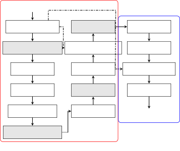
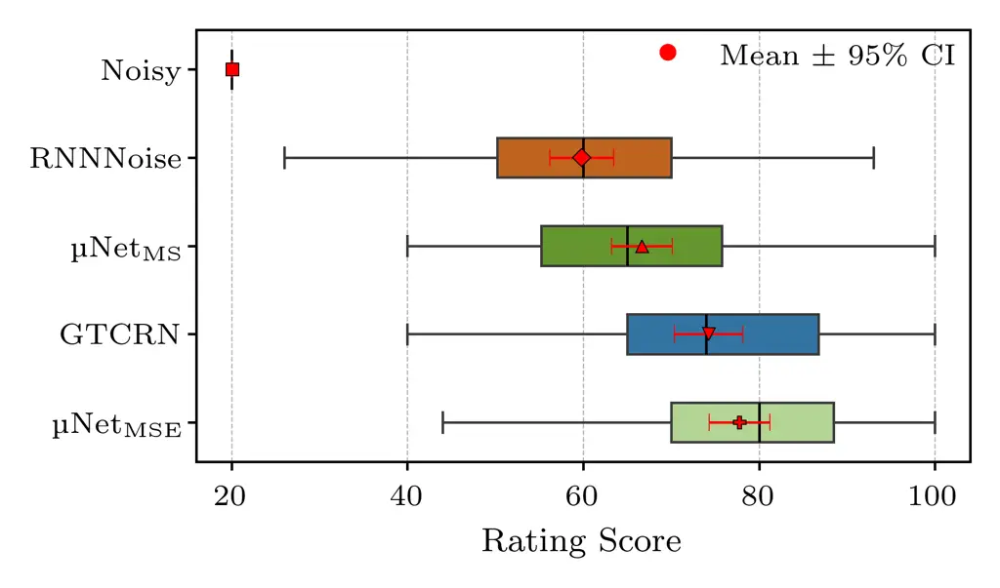
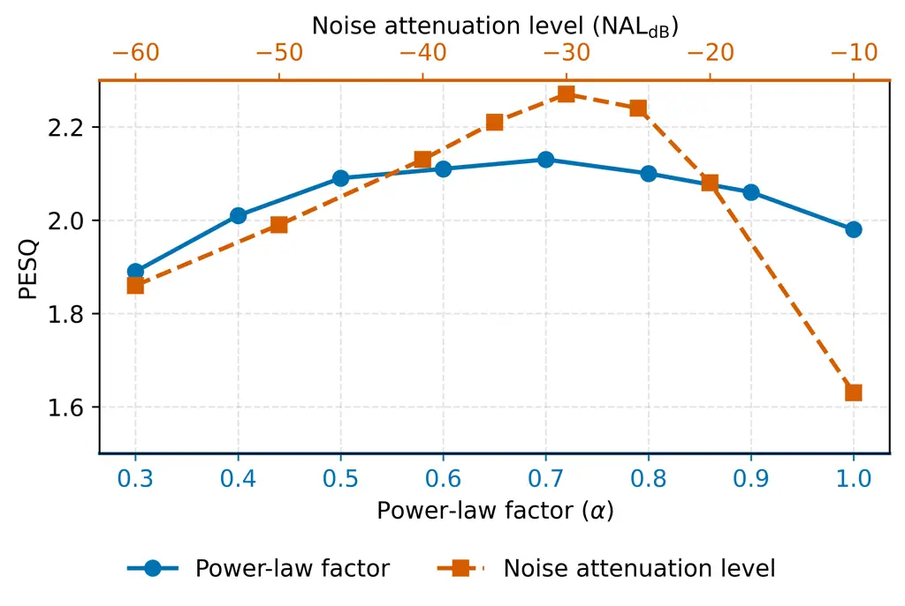
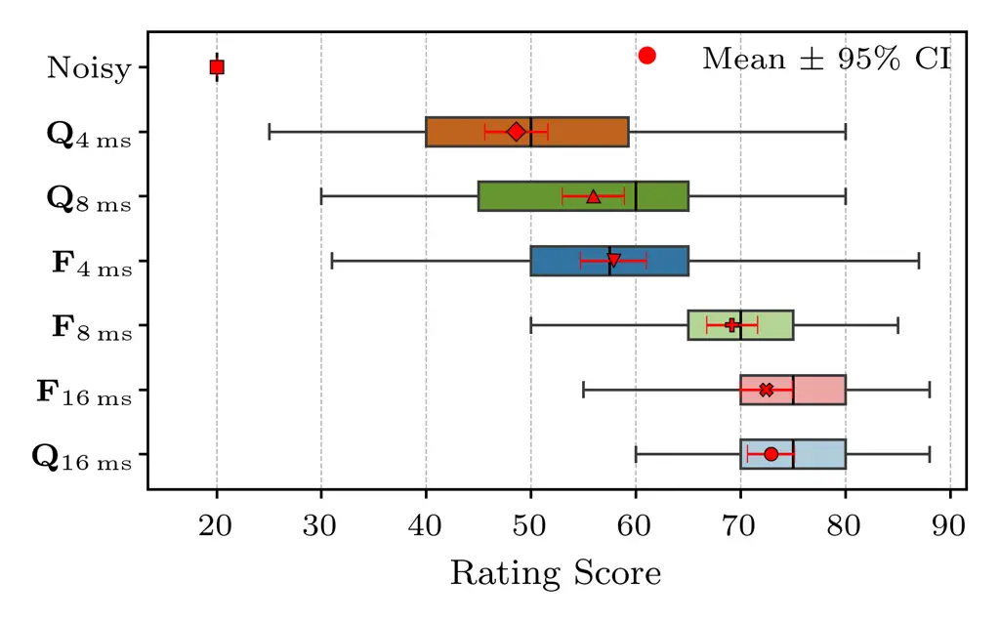

# µNet: Ultra-Low-Memory and Low-Complexity Speech Enhancement for Embedded Digital Signal Processors

\authorblockN Shrishti Saha Shetu\authorrefmark1, Jose Miguel Martinez
Aponte \authorrefmark2, Nagashree K. S. Rao\authorrefmark2, Sharvin
Vittappan\authorrefmark2,  
Oliver Thiergart\authorrefmark1, and Emanuël A. P. Habets\authorrefmark1
\authorblockA \authorrefmark1International Audio Laboratories, Erlangen,
Germany  
\authorrefmark2Fraunhofer IIS, Erlangen, Germany ^(†)^(†)thanks: A joint
institution of Fraunhofer IIS and Friedrich-Alexander-Universität
Erlangen-Nürnberg (FAU), Germany.

###### Abstract

Speech enhancement on embedded digital signal processors (DSPs) imposes
strict constraints on memory footprint, computational complexity,
latency, and support for integer operations. Although recent DNN-based
approaches have addressed these challenges individually, no unified
framework in the literature simultaneously addresses all these
requirements for practical deployment. In this work, we propose µNet, an
ultra-low-memory, low-complexity, and low-latency end-to-end DNN model.
The proposed method requires only $`90`$ KB of static memory and
$`28`$ MMACs, while supporting an algorithmic latency as low as $`4`$ ms
with performance comparable to state-of-the-art methods of similar
complexity. Our experiments demonstrate that µNet is compatible with
neural accelerators and supports full integer-arithmetic operations on
consumer DSP platforms such as Cadence Tensilica HiFi 4/5.

^(†)^(†) \* A joint institution of Fraunhofer IIS and
Friedrich-Alexander-Universität Erlangen-Nürnberg (FAU), Germany.

{IEEEkeywords}

speech enhancement, memory efficient, DSPs

## 1 Introduction

Speech enhancement aims to suppress background noise while preserving
intelligibility and improving the perceived quality of the speech
signal. In recent years, DNN (DNN)-based techniques have risen to
prominence, demonstrating substantial performance improvements over
conventional statistical signal processing methods \[1, 2, 3, 4, 5, 6,
7\]. However, most SOTA (SOTA) DNN models involve significant
computational complexity and large memory footprints. Furthermore, they
typically operate in higher-latency regimes (e.g., $`10`$–$`40`$ ms),
which, while suitable for general telecommunications \[8\], are often
infeasible for hearable and wearable applications. Applications such as
hearing aids, live dialogue enhancement for multimedia content, and
hearables in transparency mode require very-low-latency processing \[9,
10, 11\]. These applications typically rely on algorithmic execution on
resource-constrained consumer embedded DSPs, such as Cadence Tensilica
HiFi 4/5, which often strictly constrain processing to integer
operations.

Several recent approaches have proposed novel architectures to address
computational efficiency, latency, and memory constraints \[12, 13, 14,
15, 16, 17\]. In \[14\], an equivalent rectangular bandwidth (ERB)
filter bank is used for feature extraction, and computational overhead
is reduced through grouped convolutions and RNNs \[18\]. Conversely,
ULCNet \[13\] operates in the STFT (STFT) domain, achieving efficiency
via channel-wise feature reorientation \[19\] and a two-stage processing
framework for magnitude mask estimation and phase correction. While
various low-latency DNN techniques have been investigated in literature,
including asymmetric analysis-synthesis window pairs, learnable
transforms, trainable filterbank equalizers, and future frame
prediction \[16, 20, 21, 22\]; these often rely on computationally heavy
models. In many practical scenarios, low latency requirements are
coupled with even stricter computational limits; this joint optimization
of latency, memory, and fixed-point (int8) operations support remains
insufficiently addressed in the literature.

In this work, inspired by the ULCNet architecture \[13\], we propose
µNet¹¹ 1 Several aspects of the proposed µNet are protected by patent
applications., a fully quantizable, lightweight DNN model for speech
enhancement applications. Our primary contributions are as follows:

- •
  We propose a novel ultra-low-memory, low-complexity architecture that
  supports algorithmic latencies down to $`4`$ ms and achieves
  performance comparable to SOTA methods of similar complexity.
- •
  We demonstrate that the proposed µNet is fully quantizable to int8 and
  suitable for deployment on embedded DSPs with neural accelerator
  support.
- •
  We incorporate a configurable noise attenuation control mechanism that
  allows users to trade off background noise suppression against speech
  quality, enabling adaptation to diverse acoustic scenarios.

## 2 Proposed Methods

### 2.1 Input Pre-processing

We assume an additive signal model in the STFT-domain where
$`\mathbf{X}`$, $`\mathbf{S}`$, and $`\mathbf{N}`$ denote the noisy
signal, the clean speech signal, and the noise components, respectively.
In our work, the input features provided to the DNN are the magnitude
and phase features computed from the modified power law compressed
\[13\] real and imaginary parts of the noisy signal $`\mathbf{X}`$ with
a PF (PF) of $`\alpha`$, as follows:

```math
\displaystyle\widetilde{\mathbf{X}}_{\mathrm{r}}=\mathrm{sign}(\mathbf{X}_{\mathrm{r}})\odot|\mathbf{X}_{\mathrm{r}}|^{\alpha}; \displaystyle\widetilde{\mathbf{X}}_{\mathrm{i}}=\mathrm{sign}(\mathbf{X}_{\mathrm{i}})\odot|\mathbf{X}_{\mathrm{i}}|^{\alpha} \tag{1}
```

where $`\odot`$ denotes the Hadamard product, and the
$`\mathrm{sign}(\mathbf{X}_{\mathrm{r/i}})`$ denotes that the original
sign of real and imaginary part $`\mathbf{X}_{\mathrm{r/i}}`$ of
$`\mathbf{X}`$ is retained for
$`\widetilde{\mathbf{X}}_{\mathrm{r/i}}`$. Subsequently, the power law
compressed magnitude spectrogram and phase component of the noisy signal
are obtained as follows:

```math
\displaystyle\widetilde{\mathbf{X}}_{\mathrm{m}}=\sqrt{\widetilde{\mathbf{X}}_{\mathrm{r}}^{2}+\widetilde{\mathbf{X}}_{\mathrm{i}}^{2}}; \displaystyle\widetilde{\mathbf{X}}_{\mathrm{p}}=\arctan\left({\frac{\widetilde{\mathbf{X}}_{\mathrm{i}}}{\widetilde{\mathbf{X}}_{\mathrm{r}}}}\right) \tag{2}
```



Figure 1: Proposed µNet Architecture. The processing blocks highlighted
with a “gray” background indicate the modifications introduced in this
work from the original ULCNet model \[13\].

### 2.2 µNet Architecture

In this work, as shown in Fig. 1, we propose µNet, which utilizes a
two-stage backbone inspired by the ULCNet architecture \[13\] with
several key structural modifications. While ULCNet was originally
designed for speech enhancement, it has subsequently proven effective
across various related tasks, including acoustic echo cancellation,
dereverberation, and beamforming \[23, 24, 25, 26\]. In the proposed
µNet architecture, the first stage estimates a magnitude mask
$`\widetilde{\mathbf{M}}_{\mathrm{m}}\in[0,1]`$, while the second stage
refines the intermediate features to estimate a final complex ratio mask
(CRM).

Channel-wise Feature Reorientation: The power-law compressed magnitude
features $`\widetilde{\mathbf{X}}_{\mathrm{m}}`$ are first subjected to
a hybrid feature reorientation process to capture both local and global
spectral dependencies. We employ a hybrid approach combining the
channel-wise subband feature reorientation (C-SubFR) method \[19, 13\]
and the channel-wise sampling-based feature reorientation (C-SamFR)
method \[23\]. To emphasize the perceptually significant low-frequency
bands, we extract $`2`$ subbands, each spanning $`43`$ frequency bins.
For the C-SamFR stage, a sampling factor of $`6`$ is applied across
non-contiguous frequency bins, yielding $`6`$ sub-sampled feature sets
of dimension $`43`$. This results in a reoriented feature set
$`\widetilde{\mathbf{X}}_{c}\in\mathbb{R}^{B\times T\times F\times C}`$,
where $`B`$, $`T`$, $`F=43`$, and $`C=8`$ denote the batch size, time
frames, frequency bins, and channel dimensions, respectively. For
brevity, $`B`$ and $`T`$ are omitted in subsequent descriptions.

Convolutional and Recurrent Processing: The reoriented features are
processed through a convolutional (Conv) block comprising four layers,
each having $`32`$ filters with a kernel size of $`(1,3)`$.
Frequency-axis downsampling is achieved via strided convolutions with a
factor of $`2`$ in the final three layers. Each convolution is followed
by batch normalization and ReLU activation. The resulting feature map,
$`\widetilde{\mathbf{f}}_{\mathrm{conv}}\in\mathbb{R}^{32\times 6}`$, is
refined by a $`1\times 1`$ point-wise convolution with $`24`$ filters
and flattened into a $`144`$-dimensional vector. In this work, we employ
standard convolutions rather than depthwise separable convolutions (as
originally proposed in \[13\]) to optimize implementation for embedded
hardware and ensure quantization support. While depthwise separable
convolutions reduce the theoretical parameter count, they often suffer
from poor hardware utilization on consumer DSPs due to fragmented memory
access patterns. Furthermore, to learn temporal dependencies with
parameter efficiency, the flattened features are split into two subbands
and processed by a shared GRU with $`64`$ hidden units. This
weight-sharing strategy allows the model to learn common temporal
dynamics across subbands while significantly reducing the total
parameter count, resulting in a $`128`$-dimensional latent feature
vector $`\mathbf{h}`$.

Shared Linear Projection: The $`128`$-dimensional latent features
$`\mathbf{h}`$ are processed by a shared linear projection block to
estimate an intermediate real magnitude mask. To ensure spectral
consistency during upsampling, we implement an overlapping sliding
window approach. The latent feature vector $`\mathbf{h}`$ is partitioned
into four segments $`\mathbf{h}_{k}`$ with $`k\in\{1,2,3,4\}`$ of length
$`40`$, defined by the index ranges $`[0,40]`$, $`[24,64]`$,
$`[56,96]`$, and $`[88,128]`$. Each segment is projected through a
shared linear layer:

```math
\mathbf{m}_{k}=\sigma(\mathbf{W}\,\mathbf{h}_{k}+\mathbf{b}), \tag{3}
```

where $`\mathbf{W}\in\mathbb{R}^{64\times 40}`$ represents the shared
weight matrix, $`\mathbf{b}`$ is a shared bias vector and
$`\sigma(\cdot)`$ denotes the sigmoid activation function. The resulting
projections $`\mathbf{m}_{k}\in\mathbb{R}^{64\times 1}`$ are
concatenated to estimate the final real-valued mask
$`\widetilde{\mathbf{M}}_{\mathrm{m}}\in\mathbb{R}^{256\times 1}`$. This
shared-weight mechanism further reduces the parameter count while
ensuring that the learned filters are invariant across different
segments of the feature space.

Intermediate Feature Computation: As a prerequisite for the second
stage, the estimated magnitude mask
$`\widetilde{\mathbf{M}}_{\mathrm{m}}`$ is combined with the noisy phase
$`\widetilde{\mathbf{X}}_{\mathrm{p}}`$ to compute intermediate
features. The real and imaginary components are given by

```math
\displaystyle\widetilde{\mathbf{Y}}_{\mathrm{r}}=\widetilde{\mathbf{M}}_{\mathrm{m}}\odot\cos{\widetilde{\mathbf{X}}_{\mathrm{p}}}; \displaystyle\widetilde{\mathbf{Y}}_{\mathrm{i}}=\widetilde{\mathbf{M}}_{\mathrm{m}}\odot\sin{\widetilde{\mathbf{X}}_{\mathrm{p}}} \tag{4}
```

Subsequently, $`\widetilde{\mathbf{Y}}_{\mathrm{r}}`$ and
$`\widetilde{\mathbf{Y}}_{\mathrm{i}}`$ are concatenated along the
channel dimension. To further reduce the computational complexity of the
second stage, these features are processed using the C-SubFR method,
yielding a feature set
$`\widetilde{\mathbf{Y}}_{\mathrm{c}}\in\mathbb{R}^{64\times 8}`$.

Clean Speech Estimation: The second stage utilizes a CNN block
comprising two convolutional layers, each with $`32`$ filters, followed
by a $`1\times 1`$ point-wise convolution with $`8`$ output channels.
The clean speech is estimated by applying a CRM-multiplication \[5\] and
by applying power-law decompression \[13, 23\].

### 2.3 Loss Functions

To evaluate the proposed µNet, we employ three distinct loss functions:
Mean Squared Error ($`\mathcal{L}_{\text{MSE}}`$), Multi-Scale
($`\mathcal{L}_{\text{MS}}`$), and Multi-Target
($`\mathcal{L}_{\text{MT}}`$). Following \[13\],
$`\mathcal{L}_{\text{MSE}}`$ is computed in the compressed frequency
domain for aggressive noise suppression. On the contrary, the MS loss
combines a time-domain cosine similarity (CS) loss with a
frequency-domain MSE, i.e.,

```math
\vskip-2.84544pt\mathcal{L}_{\text{MS}}=\sum_{j}\frac{1}{K}\sum_{k=1}^{K}\text{CS}\left(\mathbf{s}_{jk},\hat{\mathbf{s}}_{jk}\right)+\underbrace{\sum_{i}\left\||\mathbf{S}_{i}|^{\alpha}-|\widehat{\mathbf{S}}_{i}|^{\alpha}\right\|_{\text{F}}^{2}}_{\mathcal{L}_{\text{spec}}},\vskip-2.84544pt
```

where $`j=\{1,2,\ldots,K\}`$ indexes the segment lengths from the set
$`\mathcal{L}=\{16,\dots,128\}`$ ms. The index $`i\in\{1,2,\dots,I\}`$
represents the STFT window sizes from $`\mathcal{W}=\{16,\dots,64\}`$ ms
\[4\] with $`\left\|\text{.}\right\|_{\text{F}}`$ denoting the Frobenius
norm, and $`\mathbf{S}_{i}=\acs{STFT}_{i}(\mathbf{s})`$ is the $`i`$-th
STFT.

Finally, the MT loss $`\mathcal{L}_{\text{MT}}`$ is a modified version
of the frequency-domain MS loss, where, in addition to comparing
magnitudes, a phase component is introduced:

```math
\vskip-2.84544pt\mathcal{L}_{\text{MT}}=\mathcal{L}_{\text{spec}}+\sum_{i}\left\|\left|\mathbf{S}_{i}\right|^{\alpha}\odot e^{j\bm{\phi}_{\mathbf{S}}}-\left|\widehat{\mathbf{S}}_{i}\right|^{\alpha}\odot e^{j\bm{\phi}_{\widehat{\mathbf{S}}}}\right\|_{\text{F}}^{2},\vskip-2.84544pt
```

where $`\bm{\phi_{\mathbf{S}}}`$ and
$`\bm{\phi_{\widehat{\mathbf{S}}}}`$ denote the phase component of
$`\mathbf{S}`$ and $`\widehat{\mathbf{S}}`$, respectively.

### 2.4 Noise Attenuation Control

We employ a post-processing method for user-defined control of the NAL
(NAL) of our algorithm and trade-off with speech quality, inspired by
\[27\]. Given the enhanced estimate $`\mathbf{\hat{s}}`$ and the
estimated residual noise
$`\mathbf{\hat{n}}=\mathbf{x}-\mathbf{\hat{s}}`$ in time domain, the
post-processed output at different NAL (in dB) is formulated as

```math
\mathbf{\hat{s}}_{-\text{dB}}=\mathbf{\hat{s}}+\beta\;\mathbf{\hat{n}}, \tag{5}
```

where

```math
\beta=\sqrt{\frac{P_{\hat{s}}}{P_{\hat{n}}\cdot 10^{(\text{NAL}_{\text{dB}}/10)}}} \tag{6}
```

is the scaling factor determined by a target attenuation level
$`\text{NAL}_{\text{dB}}`$ to maintain a controlled noise floor, with
$`P_{\hat{s}}`$ and $`P_{\hat{n}}`$ denoting the mean power of the
enhanced speech and residual noise, respectively.

## 3 Experiment and Results

### 3.1 Training Details

In our experiments, we used the Interspeech 2020 DNS challenge dataset
\[28\], and noisy mixtures were generated at a $`16`$ kHz sampling rate
with SNR (SNR) ranges between $`-10`$ dB to $`30`$ dB. In total, we
created a training dataset of around 1000 hrs. In $`50\%`$ of the
training and validation dataset, we convolved clean speech with a RIR
(RIR) randomly selected from the RIR set provided in \[28\]. For STFT,
we use a squared-root Hann window with a $`32`$ms window length. During
training, we used the Adam optimizer with an initial LR (LR) of
$`4\times 10^{-4}`$ and a scheduler that reduces the LR by a factor of
$`10`$ every $`3`$ epochs. For data augmentation, we incorporated random
low-pass filtering, upsampling, and different STFT windows. Unless
explicitly specified, we use PF as $`0.3`$ in all our experiments.

|                                                                                                                                                                                                                                   |            |       |      |        |           |
| --------------------------------------------------------------------------------------------------------------------------------------------------------------------------------------------------------------------------------- | ---------- | ----- | ---- | ------ | --------- |
| Method                                                                                                                                                                                                                            | Params (K) | MMACs | PESQ | SI-SDR | BAK (MOS) |
| Noisy                                                                                                                                                                                                                             | –          | –     | 1.58 | 9.07   | 2.62      |
| RNNNoise \[29\]                                                                                                                                                                                                                   | 60         | 40    | 2.04 | 12.66  | 3.95      |
| GTCRN ²² 2 The effective complexity of GTCRN is even higher, as it requires buffering up to $`16`$ frames of intermediate features and hence not comparable to the frame-by-frame processing supported by RNNoise and µNet.\[14\] | 48         | 33    | 2.26 | 14.62  | 3.98      |
| µNet V2                                                                                                                                                                                                                           | 52         | 32    | 1.81 | 12.28  | 3.92      |
| µNet V3                                                                                                                                                                                                                           | 55         | 32    | 1.85 | 12.44  | 3.96      |
| $`\text{\textmu Net}_{\text{MSE}}`$                                                                                                                                                                                               | 46         | 28    | 1.90 | 13.24  | 4.03      |
| $`\text{\textmu Net}_{\text{MT}}`$                                                                                                                                                                                                |            |       | 2.18 | 12.74  | 3.95      |
| $`\text{\textmu Net}_{\text{MS}}`$                                                                                                                                                                                                |            |       | 2.13 | 13.27  | 3.99      |
| $`\text{\textmu Net}_{-25\text{dB}}`$                                                                                                                                                                                             |            |       | 2.24 | 13.61  | 3.55      |
| $`\text{\textmu Net}_{-30\text{dB}}`$                                                                                                                                                                                             |            |       | 2.27 | 13.53  | 3.71      |

Table 1: Model complexity and objective results on the DNS Challenge
dataset. The subscript for different µNet variations indicates either
the loss functions or different $`\text{NAL}_{\text{dB}}`$.


Figure 2: Spectrograms of (a) a clean speech signal and (b) noisy
signal, enhanced by our proposed $`\text{\textmu Net}_{\text{MSE}}`$
with different power-law factor: (c)-(f).

### 3.2 Comparison with Baseline Methods

In this work, we used RNNoise \[29\] and GTCRN \[14\] as the primary
baseline methods. We also developed two additional baselines based on
µNet, where we replaced the shared subband GRU with shared subband
causal self-attention \[30\] (referred to as µNet V2) and shared gated
convolution \[31\] (referred to as µNet V3). We utilize PESQ \[32\],
SI-SDR \[33\], and BAK (MOS) (from DNSMOS) \[34\] as objective
evaluation metrics. The objective results presented in Tab. 1 on the
DNS-challenge non-reverberant test dataset \[28\] demonstrate that our
proposed µNet, trained on various loss functions and with different
$`\text{NAL}_{\text{dB}}`$, achieves comparable performance to the
baseline methods with significantly lower complexity and parameter
counts³³ 3 Demo:
[https://sshetu-iis.github.io/uNet/ulm/](https://sshetu-iis.github.io/uNet/ulm/).
Specifically, µNet trained on MSE loss with an PF of $`\alpha=0.3`$
outperforms the baselines in terms of noise suppression, achieving a BAK
(MOS) of $`4.03`$. This aggressive noise suppression behavior for this
configuration was previously reported in \[13\] and is visualized in
Fig. 2.



Figure 3: Multi-stimuli listening test results with the float32 models
at $`16`$ ms latency. The $`95\%`$ confidence interval is shown as red
whiskers.

As evident from Fig. 2, this over-suppression can lead to distortion of
the speech signal by suppressing non-harmonic components; however, this
effect can be mitigated by utilizing the proposed noise attenuation
control, adjusting the PF ($`\alpha`$), or employing different loss
functions. The proposed $`\text{\textmu Net}_{\text{MSE}}`$ with a
$`\text{NAL}_{\text{dB}}`$ of $`-30`$ dB achieves a PESQ of $`2.27`$,
outperforming the baselines in PESQ improvement. Additionally, µNet
variants trained on MS and MT loss functions achieve comparable results.
The GTCRN outperforms the competeing methods in terms SI-SDR
improvement, and achieves the highest SI-SDR of $`14.62`$ dB.
Furthermore, we conducted a multi-stimulus listening test with $`10`$
listeners using the webMUSHRA framework \[35\] with $`10`$ randomly
selected samples, following \[13\]. The results, as shown in Fig. 3,
depict that our proposed µNet achieves the highest mean MUSHRA score of
$`77.78`$, outperforming GTCRN ($`74.24`$). Notably, the results
indicate that µNet$`{}_{\text{MSE}}`$ is perceptually preferred by users
despite its over-suppression characteristics.



Figure 4: Relationship between different PF ($`\alpha`$) and
$`\text{NAL}_{\text{dB}}`$ using µNet$`{}_{\text{MSE}}`$ model.

### 3.3 Power Law Factor vs Noise Attenuation Level

We further investigate the relationship between the PF and various NAL
settings. The results, shown in Fig. 4, demonstrate that increasing the
PF for the proposed µNet$`{}_{\text{MSE}}`$ helps maintain better speech
quality, as evident by improved PESQ scores. However, as previously
noted, this improvement comes at the cost of reduced noise suppression,
which is functionally equivalent to setting a higher NAL. In our
experiments, we observed that while most listeners prefer aggressive
noise suppression, many are highly sensitive to speech distortions,
which is also reported in \[36\]. Consequently, in real-world consumer
devices and applications, it is essential to manage this
trade-off \[37\]. In this context, the proposed noise attenuation
control with µNet$`{}_{\text{MSE}}`$ is shown to be highly effective; as
µNet can effectively suppress the noise and hence as observed, for
$`\text{NAL}_{\text{dB}}`$ up to $`-35`$ dB, the speech quality
improves. This provides users with an intuitive mechanism to choose
appropriate configurations for different acoustic scenarios.

|         |                |                  |                |                  |
| ------- | -------------- | ---------------- | -------------- | ---------------- |
| Latency | float32        |                  | int8           |                  |
|         | $`\Delta`$PESQ | $`\Delta`$SI-SDR | $`\Delta`$PESQ | $`\Delta`$SI-SDR |
| 16 ms   | 0.35           | 3.59             | 0.40           | 3.55             |
| 08 ms   | 0.34           | 3.09             | 0.24           | 2.31             |
| 04 ms   | 0.21           | 2.52             | 0.10           | 0.50             |

Table 2: Objective performance comparison of µNet across varying
algorithmic latencies for float32 and int8 quantized models on the DNS
Non-Reverberant dataset.

### 3.4 Low Latency and Quantization

We further experimented with different latencies for µNet. As our
proposed method runs purely frame-by-frame, the overall latency is
primarily determined by the STFT synthesis window length used in the
overlap-add algorithm. In our experiments, we use an asymmetric window
pair, similar to those proposed in \[38, 39\], consisting of a Hann
window for analysis and a shorter Hann window for synthesis. The results
in Tab. 2 show that µNet can be optimized for latencies as low as
$`4`$ ms without significant degradation. Specifically, µNet achieves a
$`0.21`$ PESQ and $`2.52`$ dB SI-SDR improvement on the DNS
non-reverberant test set with algorithomic latency of $`4`$ ms. We also
quantized µNet using the TensorFlow TFLite post-training
framework \[40\] to fully int8. We used $`10`$ curated samples from the
training dataset for tuning quantization variables. Our results indicate
that at $`16`$ ms latency, int8 quantization has no adverse effect on
performance; however, performance degrades as latency decreases. This
degradation may be attributed to the drifting of GRU states due to more
frequent updates in low-latency configurations \[15\].

Furthermore, we conducted another multi-stimulus listening test with the
same setup as previously described to evaluate the perceptual effects of
lower latency and quantization. The results, shown in Fig. 5, depict
that for $`16`$ ms latency, quantization has no adverse perceptual
impact. In terms of latency, at $`4`$ ms we observe a sharp decline in
user preference. The $`4`$ ms model achieves a mean MUSHRA score of
$`57.87`$, compared to mean scores of $`69.20`$ and $`72.44`$ for the
$`8`$ ms and $`16`$ ms methods, respectively. Notably, even though
objective results indicate only minimal performance improvement for the
int8-quantized $`4`$ ms µNet, listeners still prefer the enhanced output
over the noisy signal.

^(†)^(†) The authors gratefully acknowledge the scientific support and
HPC resources provided by the Erlangen National High Performance
Computing Center (NHR@FAU) of the FAU under the NHR project
b262dc18@csnhr.nhr.fau.de. NHR funding is provided by federal and
Bavarian state authorities.



Figure 5: Multi-stimulus listening test results for float32 (F) and
int8-quantized (Q) µNet$`{}_{\text{MSE}}`$ models. Subscripts indicate
algorithmic latencies; ”F” and ”Q” represent 32-bit floating-point and
8-bit integer quantization, respectively

### 3.5 DSP and Sampling Rate Support

Our proposed µNet requires only $`90`$ KB of static memory,
corresponding to the memory required to store the model parameters and
weights on the DSPs (excluding additional platform-dependent dynamic
workspace required during inference). µNet is fully compatible with
various embedded DSPs, namely ARM Cortex M, ADI SHARC, Qualcomm Hexagon
and Cadence Tensilica HiFi 4/5. Notably, µNet runs in real-time on
Cadence Tensilica HiFi 4 on NXP RT685 DSP with a cycles requirement of
$`70`$ MHz. Regarding sampling rates, while this work focuses on $`16`$
kHz, µNet can be easily configured for higher sampling rates. This is
achieved by adjusting the parameterization for the channel-wise feature
reorientation methods, the shared subband GRU, and the shared linear
projection block.

## 4 Conclusions

We proposed µNet for speech enhancement applications, which requires
only $`90`$ KB of static memory and $`28`$ MMACs, supports algorithmic
latencies as low as 4 ms, and is fully quantizable to int8 for
deployment on neural-accelerator-equipped platforms such as Airoha
AB159x. We demonstrated that these constraints can be met without
sacrificing competitive performance, as evidenced by objective
evaluations on the DNS Challenge dataset and perceptual listening tests.
Furthermore, we employed a configurable noise attenuation control
mechanism that allows users to balance noise suppression aggressiveness
against speech quality, making µNet adaptable to diverse acoustic
scenarios and consumer device requirements. Future work could explore
extending µNet with quantization-aware training strategies to further
close the performance gap at ultra-low latencies.

## References

- \[1\] S. Boll “Suppression of acoustic noise in speech using spectral
  subtraction” In _IEEE/ACM Trans. Audio, Speech, Language Process._,
  1979
- \[2\] Y. Ephraim and D. Malah “Speech enhancement using a minimum-mean
  square error short-time spectral amplitude estimator” In _IEEE/ACM
  Trans. Audio, Speech, Language Process._, 2003
- \[3\] J.-M. Valin “A Perceptually-Motivated Approach for
  Low-Complexity, Real-Time Enhancement of Fullband Speech” In _Proc.
  INTERSPEECH_, 2020
- \[4\] H.-S. et al. “Real-time denoising and dereverberation with tiny
  recurrent U-Net” In _Proc. IEEE Int. Conf. Acoust., Speech, Signal
  Process._, 2021
- \[5\] Y. et al. “DCCRN: Deep complex convolution recurrent network for
  phase-aware speech enhancement” In _Proc. INTERSPEECH_, 2021
- \[6\] S. Braun, H. Gamper, C.. Reddy and I. Tashev “Towards efficient
  models for real-time deep noise suppression” In _Proc. IEEE Int. Conf.
  Acoust., Speech, Signal Process._, 2021
- \[7\] H. Schröter, A. Maier, A.N. Escalante-B and T. Rosenkranz
  “DeepFilterNet2: Towards real-time speech enhancement on embedded
  devices for full-band audio” In _Proc. Int. Workshop Acoust. Signal
  Enhanc._, 2022
- \[8\] P. Vary and R. Martin “Digital Speech Transmission and
  Enhancement” John Wiley & Sons, 2023
- \[9\] M.. Stone and B.. Moore “Tolerable hearing aid delays. III.
  Effects on speech production and perception of across-frequency
  variation in delay” In _Ear and Hearing_, 2003
- \[10\] Amazon “Dialogue Boost: How Amazon is using AI to enhance TV
  and movie dialogue” In _Amazon Science_, 2025
- \[11\] F. Denk, H. Schepker, S. Doclo and B. Kollmeier “Acoustic
  transparency in hearables—technical evaluation” In _J. Audio Eng.
  Soc._, 2020
- \[12\] H. Schroter, A.. Escalante-B, T. Rosenkranz and A. Maier
  “DeepFilterNet: A low complexity speech enhancement framework for
  full-band audio based on deep filtering” In _Proc. IEEE Int. Conf.
  Acoust., Speech, Signal Process._, 2022
- \[13\] S.. Shetu, S. Chakrabarty, O. Thiergart and E. Mabande “Ultra
  Low Complexity Deep Learning Based Noise Suppression” In _Proc. IEEE
  Int. Conf. Acoust., Speech, Signal Process._, 2024
- \[14\] X. et al. “GTCRN: A speech enhancement model requiring ultralow
  computational resources” In _Proc. IEEE Int. Conf. Acoust., Speech,
  Signal Process._, 2024
- \[15\] N.A. Larraza and N. de Koeijer “Fast-ULCNet: A fast and ultra
  low complexity network for single-channel speech enhancement” In
  _Proc. IEEE Int. Conf. Acoust., Speech, Signal Process._, 2026
- \[16\] H. Wu and S. Braun “Ultra-low latency speech enhancement-a
  comprehensive study” In _Proc. IEEE Int. Conf. Acoust., Speech, Signal
  Process._, 2025
- \[17\] L. et al. “Modulating state space model with slowfast framework
  for compute-efficient ultra low-latency speech enhancement” In _Proc.
  IEEE Int. Conf. Acoust., Speech, Signal Process._, 2025
- \[18\] N. Ma, X. Zhang, H.-T. Zheng and J. Sun “Shufflenet v2:
  Practical guidelines for efficient CNN architecture design” In _Proc.
  Eur. Conf. Comput. Vis._, 2018
- \[19\] H. Liu, L. Xie, J. Wu and G. Yang “Channel-wise subband input
  for better voice and accompaniment separation on high resolution
  music” In _Proc. INTERSPEECH_, 2020
- \[20\] Y. Luo and N. Mesgarani “Conv-TasNet: Surpassing ideal
  time–frequency magnitude masking for speech separation” In _IEEE/ACM
  Trans. Audio, Speech, Language Process._, 2019
- \[21\] C. et al. “Low-latency monaural speech enhancement with deep
  filter-bank equalizer” In _J. Acoust. Soc. Am._, 2022
- \[22\] Z.-Q. Wang, G. Wichern, S. Watanabe and J. Le “STFT-domain
  neural speech enhancement with very low algorithmic latency” In
  _IEEE/ACM Trans. Audio, Speech, Language Process._, 2022
- \[23\] S.. Shetu, N.. Desiraju, W. Mack and E… Habets “Align-ULCNet:
  Towards low-complexity and robust acoustic echo and noise reduction”
  In _Proc. Eur. Signal Process. Conf._, 2025
- \[24\] S.S. Shetu et al. “A hybrid approach for low-complexity joint
  acoustic echo and noise reduction” In _Proc. Int. Workshop Acoust.
  Signal Enhanc._, 2024
- \[25\] N.K.S Rao et al. “Low-complexity neural speech dereverberation
  with adaptive target control” In _Proc. IEEE Int. Conf. Acoust.,
  Speech, Signal Process._, 2025
- \[26\] G. Bologni, N.. Larraza, R. Heusdens and R.. Hendriks “A
  two-step approach for speech enhancement in low-SNR scenarios using
  cyclostationary beamforming and DNNs” In _arXiv preprint
  arXiv:2602.12986_, 2026
- \[27\] S. Braun, K. Kowalczyk and E… Habets “Residual noise control
  using a parametric multichannel Wiener filter” In _Proc. IEEE Int.
  Conf. Acoust., Speech, Signal Process._, 2015
- \[28\] C… et al. “The Interspeech 2020 Deep Noise Suppression
  Challenge: Datasets, Subjective Testing Framework, and Challenge
  Results” In _Proc. INTERSPEECH_, 2020
- \[29\] J.-M. Valin “A hybrid DSP/deep learning approach to real-time
  full-band speech enhancement” In _Proc. IEEE Int. Workshop Multimedia
  Signal Process._, 2018
- \[30\] A. Vaswani “Attention is all you need” In _Proc. Adv. Neural
  Inf. Process. Syst._, 2017
- \[31\] A. et al. “Parallel wavenet: Fast high-fidelity speech
  synthesis” In _Proc. Int. Conf. Mach. Learn._, 2018
- \[32\] A.. Rix, J.. Beerends, M.. Hollier and A.. Hekstra “Perceptual
  evaluation of speech quality (PESQ)-a new method for speech quality
  assessment of telephone networks and codecs” In _Proc. IEEE Int. Conf.
  Acoust., Speech, Signal Process._, 2001
- \[33\] J. Le, S. Wisdom, H. Erdogan and J.. Hershey “SDR–half-baked or
  well done?” In _Proc. IEEE Int. Conf. Acoust., Speech, Signal
  Process._, 2019
- \[34\] C… Reddy, V. Gopal and R. Cutler “DNSMOS P. 835: A
  non-intrusive perceptual objective speech quality metric to evaluate
  noise suppressors” In _Proc. IEEE Int. Conf. Acoust., Speech, Signal
  Process._, 2022
- \[35\] M. et al. “webMUSHRA—A comprehensive framework for web-based
  listening tests” In _J. Open Res. Softw._ 6, 2018
- \[36\] A. Sugiyama, O. Shimada and T. Nomura “User preference between
  residual noise and speech distortion in speech enhancement” In _Proc.
  Int. Workshop Acoust. Signal Enhanc._, 2022
- \[37\] T. Ochiai et al. “Rethinking processing distortions:
  Disentangling the impact of speech enhancement errors on speech
  recognition performance” In _IEEE/ACM Trans. Audio, Speech, Language
  Process._ IEEE, 2024
- \[38\] S. Wang, G. Naithani, A. Politis and T. Virtanen “Deep neural
  network based low-latency speech separation with asymmetric
  analysis-synthesis window pair” In _Proc. Eur. Signal Process. Conf._,
  2021
- \[39\] D. Mauler and R. Martin “A low delay, variable resolution,
  perfect reconstruction spectral analysis-synthesis system for speech
  enhancement” In _Proc. Eur. Signal Process. Conf._, 2007
- \[40\] R. et al. “TensorFlow lite micro: Embedded machine learning for
  TinyML systems” In _Proc. Mach. Learn. Syst._, 2021
