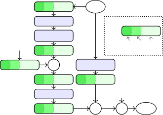
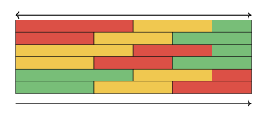

# SlimDiffuSE: Towards Efficient Diffusion-Based Speech Enhancement using Slimmable Networks

\*Andreas Brendel has been supported by the Free State of Bavaria by the
DSgenAI project.

###### Abstract

Diffusion-based models are emerging in the speech enhancement domain and
are achieving state-of-the-art performance across various benchmark
datasets. A major downside of diffusion models is that data generation
requires many evaluations of a typically large neural network, which
results in high overall complexity. In this work, we propose a slimmable
diffusion model that employs adaptive network widths throughout the data
generation process to reduce computational cost. By using a greedy
search algorithm to optimize the network width schedule, our method
achieves performance comparable to baseline diffusion models with
significantly reduced computational complexity. Notably, our approach
reduces the computational complexity by up to $`87.5\%`$ without a
significant drop in objective metrics, such as PESQ (PESQ) and SI-SDR.

|                                                                                                                                       |
| ------------------------------------------------------------------------------------------------------------------------------------- |
| Nagashree K. S. Rao¹, Shrishti Saha Shetu², Mohamed Elminshawi¹ Emanuël A. P. Habets^(1,2), Andreas Brendel¹                          |
| ¹Fraunhofer IIS, Am Wolfsmantel 33, 91058 Erlangen, Germany                                                                           |
| ²International Audio Laboratories Erlangen¹¹footnotemark: 1 , Am Wolfsmantel 33, 91058 Erlangen, Germany                              |
| {nagashree.kuruduganahalli.sudhindra.rao, shrishti.saha.shetu, mohamed.elminshawi, emanuel.habets, andreas.brendel}@iis.fraunhofer.de |

²²footnotetext: A joint institution of Friedrich-Alexander-Universität
Erlangen-Nürnberg (FAU) and Fraunhofer IIS.

Index Terms—  Diffusion, slimmable neural network

## 1 Introduction

SE (SE) aims to improve the quality and intelligibility of speech in
noisy and reverberant scenarios \[1, 8, 7\]. Significant progress has
been achieved in recent years in SE using DNN \[12, 24, 23, 6, 3, 28\].
Most DNN-based SE techniques follow discriminative training paradigms,
which perform well in the moderate-to-high SNR (SNR) regime; however,
they exhibit a drop in performance in low SNR scenarios \[25\]. For such
challenging scenarios, generative models gained popularity lately \[26,
10, 19, 13, 21, 16\], as they promise to reconstruct speech content that
might be completely masked by noises or distortions.

Recently, DM received a lot of attention as a promising approach to
generative SE \[21, 32, 17, 18\]. DM are typically based on a forward
noising process, which turns clean speech data into noise by adding
Gaussian noise iteratively. This process is reversed in the backward
path by denoising the signal step by step at different noise scales.
\AcpDM can be formulated in continuous time with SDE \[31\] or in
discrete time as DDPM \[11\]. Despite their promising performance, DM
are computationally expensive because multiple reverse steps require
repeated evaluation of large DNN, regardless of the underlying SE task
complexity, as in SGMSE+ \[21\]. This makes it challenging to deploy
them in real-time applications.

Practical SE applications require DNN capable of balancing performance
and restrictions imposed by hardware and the application, such as
memory, latency, etc. Several DNN complexity reduction techniques have
been explored for SE: A classical technique is pruning \[5\], which
eliminates redundant parameters, resulting in more lightweight models.
DNN architectures can also be adapted during inference by varying their
depth, i.e., by using a subset of layers (e.g., early exiting \[4\]), or
by varying their width, i.e., by using a subset of channels (SNN) \[9\].
\AcpSNN use different subsets of their computational graph to avoid
redundant computations during inference, which allows for adjusting
computational complexity according to the task at hand. Pruning, on the
other hand, would have to maintain either multiple networks or would
have to rely on a single DNN for all considered tasks, no matter if they
require a high or low computational complexity.

In this work, based on SGMSE+, we show that different DNN complexities
are required across diffusion steps for SE. Furthermore, we demonstrate
that choosing the appropriate DNN complexity for each diffusion step can
significantly reduce overall computational cost without degrading signal
quality \[33\]. Based on these findings, we propose SlimDiffuSE, a SDM
(SDM) based on SGMSE+ with adaptive network width, which reduces overall
computational cost while keeping the same parameter count and achieving
comparable SE performance to the original SGMSE+.

## 2 Proposed Method

In the SGMSE+ framework  \[21\], SE is formulated as a conditional
diffusion process in the complex short-time Fourier transform (STFT)
domain. Let $`\mathbf{x}_{0},\mathbf{y}\in\mathbb{C}^{F\times K}`$
denote a clean speech representation and the corresponding noisy
observation sampled from the distributions $`p_{\text{clean}}`$ and
$`p_{\text{noisy}}`$, respectively. Here, $`F`$ and $`K`$ represent the
number of frequency bins and time frames, respectively. The forward
diffusion process is defined by the stochastic differential equation
(SDE)

```math
\mathrm{d}\mathbf{x}_{t}=\gamma(\mathbf{y}-\mathbf{x}_{t})\,\mathrm{d}t+g(t)\,\mathrm{d}\mathbf{w}_{t}, \tag{1}
```

with drift coefficient $`\gamma>0`$, time-dependent diffusion
coefficient $`g(t)>0`$ and standard complex-valued Wiener process
$`\mathbf{w}_{t}`$. This process gradually perturbs $`\mathbf{x}_{0}`$
toward $`\mathbf{y}`$ by adding (Gaussian) diffusion noise scaled by
$`g(t)`$, where $`\mathbf{x}_{t}\in\mathbb{C}^{F\times K}`$ is the noisy
signal at diffusion time $`t`$. The corresponding reverse-time SDE used
for inference is given by

```math
\mathrm{d}\mathbf{x}_{t}=-\gamma(\mathbf{y}-\mathbf{x}_{t})\,\mathrm{d}t+g^{2}(t)\,\mathbf{S}_{\theta}(\mathbf{x}_{t},\mathbf{y},t)\,\mathrm{d}t+g(t)\,\mathrm{d}\bar{\mathbf{w}}_{t}, \tag{2}
```

where $`\bar{\mathbf{w}}_{t}`$ denotes a reverse-time Wiener process
and  
$`\mathbf{S}_{\theta}(\mathbf{x}_{t},\mathbf{y},t)`$ is a DNN
parameterized by $`\theta`$ that estimates the conditional score
$`\nabla_{\mathbf{x}_{t}}\log p_{t}(\mathbf{x}_{t}\mid\mathbf{y})`$. In
practice, inference is performed using a Predictor–Corrector (PC)
sampler with $`N`$ discretization steps \[31\], resulting in the
following computational cost

```math
\mathcal{C}_{\text{total}}=2N\cdot\text{FLOPs}(\mathbf{S}_{\theta}), \tag{3}
```

where the factor $`2`$ accounts for the predictor and corrector updates
at each diffusion step, and $`\text{FLOPs}(\mathbf{S}_{\theta})`$
quantifies the computational complexity of the score model in terms of
FLOPs (FLOPs). While effective, this formulation allocates a fixed
network capacity at every diffusion step, regardless of the actual
difficulty of the denoising task, which results in inefficient
computational allocation across all reverse-diffusion steps. We
hypothesize that during the reverse diffusion process, early time steps
($`t`$ close to $`1`$) require score models with high model capacity, as
signal structure has to be built up from noise, whereas later time steps
($`t`$ close to $`0`$) primarily refine fine-grained spectral details
and are comparatively less demanding (see Sec. 3.2). Hence, assigning
lower model complexities to later diffusion time steps should be
sufficient for high-quality data generation.

To address this limitation, we propose SlimDiffuSE, a slimmable score
model $`\mathbf{F}^{u}_{\phi}(\mathbf{x}_{t},\mathbf{y},t)`$, where
$`u\in(0,1]`$ is a continuous utilization factor controlling the active
network width. For a given $`u`$, the active sub-network is obtained by
applying a structured channel-wise mask that retains the first
$`\lceil u\,C\rceil`$ channels in each slimmable layer, where $`C`$
denotes the full number of channels (see Fig. 1) and
$`\lceil\cdot\rceil`$ is the ceiling operator. The model is trained
using a multi-width optimization strategy \[9\] over a set of
utilization factors $`\mathcal{U}=\{0.25,0.5,1.0\}`$

```math
\vskip-5.0pt\mathcal{L}(\phi)=\mathbb{E}_{t,\mathbf{x}_{0},\mathbf{y},\mathbf{z}}\left[\sum_{u\in\mathcal{U}}u\left\|\mathbf{F}^{u}_{\phi}(\mathbf{x}_{t},\mathbf{y},t)+\frac{\mathbf{z}}{\sigma(t)}\right\|_{2}^{2}\right], \tag{4}
```

where $`\mathbf{z}\sim\mathcal{N}_{\mathbb{C}}(\mathbf{0},\mathbf{I})`$
and $`\sigma(t)`$ denotes the variance of the diffusion noise schedule.
During inference, we perform $`N`$ steps in the reverse process and
apply a step-dependent utilization schedule $`u_{n}\in\mathcal{U}`$,
$`n=1,\dots,N`$. The update rule for the reverse diffusion process is
obtained as

```math
\displaystyle\mathbf{x}_{n-1}=\mathbf{x}_{n} \displaystyle-\gamma(\mathbf{y}-\mathbf{x}_{n})\Delta t \tag{5}
```

```math
\displaystyle+g^{2}(t_{n})\,\mathbf{F}^{u_{n}}_{\phi}(\mathbf{x}_{n},\mathbf{y},t_{n})\Delta t+g(t_{n})\sqrt{\Delta t}\,\mathbf{z}_{n},
```

where
$`\mathbf{z}_{n}\sim\mathcal{N}_{\mathbb{C}}(\mathbf{0},\mathbf{I})`$.
This adaptive formulation enables dynamic allocation of model capacity
across inference steps. Assuming the computational complexity scales
linearly with the utilization factor $`u`$, the resulting computational
cost is approximated as:

```math
\mathcal{C}_{\text{slim}}=2\sum_{n=1}^{N}\text{FLOPs}(\mathbf{F}^{u_{n}}_{\phi})\approx 2\ \text{FLOPs}(\mathbf{S}_{\theta})\cdot\sum_{n=1}^{N}u_{n}\vskip-5.0pt \tag{6}
```

which can be optimized by parameterizing the slimmable score model
$`\mathbf{F}^{u}_{\phi}`$, $`u<1`$, with lower complexity to later
diffusion steps ($`n`$ higher), aiming at fine structure, while
assigning higher model capacity for the early stages of the reverse
diffusion process ($`n`$ small).



Fig. 1: Residual block with slimmable channels.

SlimDiffuSE architecture: In this work, we adapt the NCSN++ backbone
\[30\], a multi-resolution U-Net with skip connections and a
parallel-growing U-Net path, which is used in SGMSE+ \[21\]. Each
upsampling, downsampling, and bottleneck module is realized by residual
blocks \[2\]. We use three residual blocks per upsampling module and two
per downsampling module, where the last residual block handles
up-/down-sampling. Each residual block consists of convolution layers,
group normalization (GN), finite impulse response (FIR) filters for
up/down sampling, and Swish activation, as shown in Fig. 1. A global
attention module is applied to the bottleneck at a resolution of
$`16\times 16`$. Fourier time embeddings
$`\mathbf{t}_{\mathrm{emb}}\in\mathbb{R}^{128}`$ are fed to each
residual block. The number of channels of the network layers is computed
by multiplying the base channel number $`C_{\text{base}}=128`$ with
channel multipliers $`(1,1,2,2,2,2,2)`$. Different model complexities
can be obtained by varying $`C_{\text{base}}`$. For a slimmable
architecture, each residual block is converted into a slimmable residual
block, where convolutions, GNs, and dense layers adapt their
input/output dimensions according to a utilization factor
$`u\in\mathcal{U}=\{0.25,0.5,1\}`$ following \[9\], as shown in Fig. 1.
The bottleneck attention module is likewise transformed into a slimmable
attention layer controlled by $`u`$. This construction results in three
effective model widths with $`C_{\text{base}}\in\{32,64,128\}`$.



Fig. 2: Network configurations (C1–C6) with three model complexities
assigned to different reverse diffusion steps.

|       |                   |                          |                    |                          |
| ----- | ----------------- | ------------------------ | ------------------ | ------------------------ |
| Model | PESQ $`\uparrow`$ | SI-SDR (dB) $`\uparrow`$ | ESTOI $`\uparrow`$ | SI-SIR (dB) $`\uparrow`$ |
| Noisy | $`1.58\pm 46`$    | $`9.1\pm 55`$            | $`0.81\pm 12`$     | $`9.1\pm 5`$.5)          |
| HC    | 2.85(72)          | 16.9(62)                 | 0.93(7)            | 27.4(9.3)                |
| MC    | $`2.72\pm 73`$    | $`15.8\pm 62`$           | $`0.92\pm 7`$      | $`25.9\pm 9`$.7)         |
| LC    | $`2.48\pm 72`$    | $`14.4\pm 61`$           | $`0.90\pm 8`$      | $`23.1\pm 9`$.4)         |
| C1    | $`2.82\pm 70`$    | 16.9(63)                 | 0.93(7)            | 27.6(9.5)                |
| C2    | 2.83(71)          | $`16.8\pm 63`$           | 0.93(7)            | $`27.2\pm 9`$.4)         |
| C3    | $`2.72\pm 73`$    | $`15.8\pm 63`$           | $`0.92\pm 7`$      | $`26.2\pm 10`$.0)        |
| C4    | $`2.72\pm 74`$    | $`15.9\pm 63`$           | $`0.92\pm 7`$      | $`26.3\pm 9`$.7)         |
| C5    | $`2.54\pm 72`$    | $`14.8\pm 61`$           | $`0.90\pm 8`$      | $`24.4\pm 9`$.3)         |
| C6    | $`2.56\pm 71`$    | $`14.8\pm 60`$           | $`0.90\pm 8`$      | $`24.1\pm 9`$.1)         |

Table 1: Objective evaluation metrics for the three baseline
complexities (HC, MC, LC) and the six predefined mixed complexity
configurations C1-C6.

## 3 Experiments and Results

### 3.1 Experimental Details

Datasets: Training data was generated using the Interspeech 2020 DNS
Challenge dataset \[20\] by mixing clean speech with noise recordings at
randomly sampled SNR from $`[-10,30]\,\mathrm{dB}`$ following a setup
similar to \[27, 24\]. To simulate reverberation, $`50\%`$ of the clean
utterances were convolved with randomly selected RIR from the DNS RIR
dataset \[20\], which contains approximately $`100`$k measured and
synthetic RIR with reverberation times ranging from $`0.3`$ to
$`1.5\,\mathrm{s}`$. For evaluation, the DNS Challenge non-reverberant
test set \[20\] was used, which includes noises from $`12`$
VoIP-relevant categories, with SNR in the range $`[0,25]\,\mathrm{dB}`$,
and consists of $`150`$ test samples of $`10\,\mathrm{s}`$ each.

Training and evaluation: The baseline SGMSE+ \[21\] and the proposed
models were trained with the Adam optimizer at a learning rate of
$`10^{-4}`$ using an STFT window size of $`510`$, a hop length of
$`128`$, an FFT length of $`510`$, and with a sampling rate of
$`16`$kHz. An exponential moving average (EMA) of the DNN weights with a
decay factor of $`0.999`$ \[29\] was calculated, and the best-performing
model checkpoints were selected based on the highest validation PESQ
scores \[22\]. We evaluated all methods using the following objective
metrics: PESQ \[22\], ESTOI (ESTOI) \[14\], scale-invariant
signal-to-distortion ratio (SI-SDR) \[15\], and scale-invariant
signal-to-interference ratio (SI-SIR) \[15\]. We quantified
computational complexity by giga-multiply-accumulate operations per
second (GMACs) and the total number of model parameters.

### 3.2 Experimental Results

Models at different complexity: In this experiment, we show that the
difficulty of the iterative denoising task in DM for SE varies across
diffusion time steps. Exploiting this, we reduce model complexity at
selected steps while maintaining performance, substantially lowering
computational cost. To this end, we trained three score models based on
the NCSN++ architecture: HC (HC), MC (MC), and LC (LC), with base
channel dimensions $`C_{\text{base}}\in\{128,\;64,\;32\}`$ corresponding
to utilization factors $`u\in\{1.0,\;0.5,\;0.25\}`$, respectively. We
evaluated the assignment of these models to diffusion time steps in six
predefined configurations (see Fig. 2). The results in Tab. 1
demonstrate that applying a low-complex model (LC, MC) in all reverse
diffusion steps leads to performance degradation: PESQ scores dropped by
at least $`0.13`$ and $`0.37`$ for the MC and LC variant, respectively,
compared to the HC model. However, among the mixed-complexity
configurations, variants C1 and C2 achieved results almost matching the
performance of the full HC evaluation. Specifically, C1 and C2 yielded
PESQ scores of $`2.82`$ and $`2.83`$, approaching the $`2.85`$ achieved
by the HC model, while reducing the overall computational load. These
results also indicated that employing more model complexity at the
beginning of the reverse diffusion process ($`t\rightarrow 1`$) is
important. We observed a notable performance drop for the C3 through C6
configurations, where the HC model is instead employed in the middle or
final segments ($`t\rightarrow 0`$). This behavior is intuitive, as at
early reverse-time steps ($`t\rightarrow 1`$), the model must build up
signal structures from pure noise, requiring higher network capacity.
Conversely, as the sample approached the clean speech distribution
($`t\rightarrow 0`$), the denoising task becomes less demanding, and a
low-complexity model is sufficient for generation.

|            |                   |                          |                    |                          |
| ---------- | ----------------- | ------------------------ | ------------------ | ------------------------ |
| Model      | PESQ $`\uparrow`$ | SI-SDR (dB) $`\uparrow`$ | ESTOI $`\uparrow`$ | SI-SIR (dB) $`\uparrow`$ |
| $`u=1.0`$  | 2.78 $`\pm`$ 0.68 | 16.8 $`\pm`$ 5.7         | 0.92 $`\pm`$ 0.07  | 28.9 $`\pm`$ 9.2         |
| $`u=0.5`$  | 2.57 $`\pm`$ 0.75 | 15.6 $`\pm`$ 6.0         | 0.90 $`\pm`$ 0.08  | 26.8 $`\pm`$ 9.3         |
| $`u=0.25`$ | 2.18 $`\pm`$ 0.70 | 13.3 $`\pm`$ 5.8         | 0.88 $`\pm`$ 0.10  | 23.1 $`\pm`$ 10.0        |
| C1         | 2.76 $`\pm`$ 0.67 | 16.7 $`\pm`$ 5.6         | 0.92 $`\pm`$ 0.07  | 29.2 $`\pm`$ 8.8         |
| C2         | 2.77 $`\pm`$ 0.67 | 16.8 $`\pm`$ 5.6         | 0.92 $`\pm`$ 0.07  | 29.5 $`\pm`$ 9.1         |
| C3         | 2.56 $`\pm`$ 0.74 | 15.6 $`\pm`$ 5.9         | 0.90 $`\pm`$ 0.08  | 26.8 $`\pm`$ 8.9         |
| C4         | 2.60 $`\pm`$ 0.74 | 15.8 $`\pm`$ 6.0         | 0.91 $`\pm`$ 0.08  | 27.1 $`\pm`$ 9.0         |
| C5         | 2.28 $`\pm`$ 0.71 | 14.0 $`\pm`$ 5.7         | 0.88 $`\pm`$ 0.10  | 25.1 $`\pm`$ 9.1         |
| C6         | 2.28 $`\pm`$ 0.70 | 14.0 $`\pm`$ 5.7         | 0.88 $`\pm`$ 0.09  | 25.3 $`\pm`$ 9.7         |

Table 2: Objective evaluation metrics for slimmable models and their
mixed-complexity configurations.

|                        |             |             |            |              |                   |                          |
| ---------------------- | ----------- | ----------- | ---------- | ------------ | ----------------- | ------------------------ |
| Complexity Transitions |             |             | Avg. $`u`$ | GMACs /Frame | PESQ $`\uparrow`$ | SI-SDR (dB) $`\uparrow`$ |
| $`u=1.0`$              | $`u=0.5`$   | $`u=0.25`$  |            |              |                   |                          |
| $`[1,1]`$              | $`[2,6]`$   | $`[7,30]`$  | 0.317      | 15.62        | 2.77              | 16.7                     |
| $`[1,2]`$              | $`[3,7]`$   | $`[8,30]`$  | 0.342      | 19.54        | 2.76              | 16.6                     |
| $`[1,3]`$              | $`[4,8]`$   | $`[9,30]`$  | 0.367      | 23.46        | 2.78              | 16.7                     |
| $`[1,5]`$              | $`[6,10]`$  | $`[11,30]`$ | 0.417      | 31.30        | 2.76              | 16.6                     |
| $`[1,7]`$              | $`[8,12]`$  | $`[13,30]`$ | 0.467      | 39.14        | 2.76              | 16.6                     |
| $`[1,10]`$             | $`[11,20]`$ | $`[21,30]`$ | 0.542      | 50.90        | 2.77              | 16.8                     |
| $`[1,15]`$             | $`[16,25]`$ | $`[26,30]`$ | 0.667      | 70.50        | 2.76              | 16.7                     |
| HC                     | —           | —           | 1.000      | 125.40       | 2.85              | 16.9                     |
| $`u=1.0`$              | —           | —           | 1.000      | 125.40       | 2.78              | 16.8                     |

Table 3: Objective performance across search-optimized schedules.
Intervals $`[s_{\text{start}},s_{\text{end}}]`$ denote reverse sampling
steps where specific utilization factors $`u`$ are active.

Slimmable diffusion model: While our initial experiments validated that
predefined combinations of models of varying width could match the
performance of the full HC model with significantly reduced
computational complexity, this approach increased the overall memory
footprint. For example, the C2 configuration (see Tab. 1) reduced
complexity by over $`56\%`$ (from $`125`$ to $`54.8`$ GMACs/Frame), but
increased the total number of parameters from $`65`$ M to $`89`$ M as
three separate score models with $`65`$, $`18.1`$, and $`5.5`$M
parameters have to be maintained. In contrast, as outlined in Sec. 2, a
slimmable model with variable width adapts its complexity across
diffusion steps without incurring the parameter overhead of multiple
models. Tab. 2 presents the results for SlimDiffuSE across different
utilization factors $`u`$ for $`30`$ reverse-diffusion steps. The
full-width configuration ($`u=1.0`$) achieved performance comparable to
the HC baseline. However, reduced-width configurations ($`u=0.5,0.25`$)
show some degradation compared to the standalone MC and LC models (see
Tab. 1), since parameter sharing across widths imposes a joint
optimization objective on the shared weights. In particular, PESQ drops
to $`2.57`$ and $`2.18`$, compared to $`2.72`$ and $`2.48`$ for MC and
LC, respectively. Despite this, when using predefined mixed-complexity
configurations (replacing HC, MC, and LC with corresponding SlimDiffuSE
configurations), configurations C1 and C2 achieved performance
comparable to the original mixed-complexity results reported in Tab. 1
for these configurations.

 Input: Number of diffusion steps $`T`$, utilization factors
$`\mathcal{U}=\{1.0,0.5,0.25\}`$, tolerance $`\epsilon=0.1`$, validation
set $`\mathcal{D}_{\mathrm{val}}`$

 Initialize: schedule $`S=[1.0,\dots,1.0]`$

 Initialize: set of valid configurations
$`\mathcal{S}_{\mathrm{all}}=\{S\}`$

 $`P_{\mathrm{base}}\leftarrow\mathrm{PESQ}(S,\mathcal{D}_{\mathrm{val}})`$

 for $`u=0.5,0.25`$ do

   $`i\leftarrow 1`$

   while $`i\leq T`$ do

    $`S^{\prime}\leftarrow S`$

    $`S^{\prime}_{T-i+1:T}=u`$

    if
$`\mathrm{PESQ}(S^{\prime},\mathcal{D}_{\mathrm{val}})<P_{\mathrm{base}}-\epsilon`$
then break

    $`S\leftarrow S^{\prime}`$, $`i\leftarrow i+1`$

    $`\mathcal{S}_{\mathrm{all}}\leftarrow\{S\}\cup\mathcal{S}_{\mathrm{all}}`$

   end while

 end for

 return $`\mathcal{S}_{\mathrm{all}}`$

Algorithm 1 Greedy search over utilization factors.

Greedy search: We further aim to determine an optimal allocation of
model widths along the reverse-diffusion steps for SlimDiffuSE. To this
end, we adopted an evolutionary-inspired greedy search algorithm that
operated over the set of utilization factors
$`\mathcal{U}=\{1.0,0.5,0.25\}`$ as shown in Alg. 1. Starting from a
fully utilized model ($`u=1.0`$), the method progressively replaced
later diffusion steps with lower utilization factors, while maintaining
performance within a tolerance $`\epsilon`$ relative to the baseline
($`u=1.0`$). In this work, the tolerance $`\epsilon`$ is based on the
objective metric PESQ, calculated on a validation dataset
$`\mathcal{D}_{\mathrm{val}}`$ (a smaller disjoint subset of the
training dataset) for a given reverse diffusion schedule $`S`$. We
enforced a monotonic, non-increasing utilization constraint for
decreasing $`t`$, which significantly reduced the search space. Thus,
instead of evaluating all $`L^{T}`$ configurations
($`L=|\mathcal{U}|`$), the problem reduced to identifying the transition
boundaries, resulting in $`\mathcal{O}(LT)`$ complexity, instead of
$`\mathcal{O}(L^{T})`$. For $`L=3`$ and $`T=30`$, this reduced
evaluations from $`3^{30}\approx 2.05\times 10^{14}`$ to at most $`60`$.
As summarized in Tab. 3, the proposed greedy search strategy identified
highly efficient configurations that maintain competitive performance
while drastically reducing computational overhead. In particular, an
optimized configuration with average utilization of $`0.317`$ and
$`15.62`$ GMACs/Frame achieved a PESQ of $`2.77`$, comparable to the HC
baseline ($`2.85`$) and SlimDiffuSE full-width variant ($`2.78`$ for
$`u=1.0`$). Overall, this corresponded to an $`87.5\%`$ reduction in
computational cost relative to the HC model, demonstrating that
competitive performance can be achieved even when most of the denoising
trajectory is offloaded to lower-complex sub-networks.

## 4 Conclusions

In this work, we showed that the difficulty of the per-step denoising
task in diffusion-based SE varies along the diffusion trajectory. Our
proposed SlimDiffuSE uses a greedy search algorithm for optimizing the
slimming schedule and achieves performance comparable to a full
high-complexity model while significantly reducing computational cost.
We believe our work establishes a flexible trade-off between SE quality
and efficiency, paving the way for real-time diffusion-based enhancement
on resource-constrained hardware.

## References

- \[1\] S. Boll (1979) Suppression of acoustic noise in speech using
  spectral subtraction. IEEE Transactions on Acoustics, Speech, and
  Signal Processing. External Links:
  [Document](https://dx.doi.org/10.1109/TASSP.1979.1163209) Cited by:
  §1.
- \[2\] A. Brock, J. Donahue, and K. Simonyan (2019) Large scale GAN
  training for high fidelity natural image synthesis. Int. Conf. on
  Learning Representations. Cited by: §2.
- \[3\] J. Chen, Z. Wang, D. Tuo, Z. Wu, S. Kang, and H. Meng (2022)
  FullSubNet+: channel attention FullSubNet with complex spectrograms
  for speech enhancement. In Proc. IEEE Int. Conf. Acoust., Speech,
  Signal Process., Cited by: §1.
- \[4\] S. Chen, Y. Wu, Z. Chen, T. Yoshioka, S. Liu, J. Li, and X.
  Yu (2021) Don’t shoot butterfly with rifles: multi-channel continuous
  speech separation with early exit transformer. In Proc. IEEE Int.
  Conf. Acoust., Speech, Signal Process., Cited by: §1.
- \[5\] Y. Cheng, D. Wang, P. Zhou, and Z. Tao (2018) Model compression
  and acceleration for deep neural networks: the principles, progress,
  and challenges. IEEE Signal Processing Magazine. Cited by: §1.
- \[6\] H.-S. Choi, S. Park, J.-H. Lee, H. Heo, D. Jeon, and K.
  Lee (2021) Real-time denoising and dereverberation with tiny recurrent
  U-Net. Proc. IEEE Int. Conf. Acoust., Speech, Signal Process.. Cited
  by: §1.
- \[7\] I. Cohen and B. Berdugo (2001) Speech enhancement for
  non-stationary noise environments. Signal Process.. Cited by: §1.
- \[8\] I. Cohen (2003) Noise spectrum estimation in adverse
  environments: improved minima controlled recursive averaging. IEEE
  Trans. Audio, Speech, Language Process.. Cited by: §1.
- \[9\] M. Elminshawi, S. R. Chetupalli, and E. A. P. Habets (2023)
  Slim-TasNet: A slimmable neural network for speech separation. In
  Proc. IEEE Workshop Appl. Signal Process. Audio Acoust., Cited by: §1,
  §2, §2.
- \[10\] S.-W. Fu, C. Yu, T. Hsieh, P. Plantinga, M. Ravanelli, X. Lu,
  and Y. Tsao (2021) MetricGAN+: an improved version of MetricGAN for
  speech enhancement. In Proc. Interspeech Conf., Cited by: §1.
- \[11\] J. Ho, A. Jain, and P. Abbeel (2020) Denoising diffusion
  probabilistic models. In Proc. Adv. Neural Inf. Process. Syst., Cited
  by: §1.
- \[12\] Y. Hu, Y. Liu, S. Lv, M. Xing, S. Zhang, Y. Fu, J. Wu, B.
  Zhang, and L. Xie (2021) DCCRN: deep complex convolution recurrent
  network for phase-aware speech enhancement. In Proc. Interspeech
  Conf., Cited by: §1.
- \[13\] R. Huang, M. W. Lam, J. Wang, D. Su, D. Yu, Y. Ren, and Z.
  Zhao (2022) FastDiff: A fast conditional diffusion model for
  high-quality speech synthesis. Proc. Int. Joint Conf. Artif. Intell..
  Cited by: §1.
- \[14\] J. Jensen and C. H. Taal (2016) An algorithm for predicting the
  intelligibility of speech masked by modulated noise maskers. IEEE/ACM
  Transactions on Audio, Speech, and Language Processing. Cited by:
  §3.1.
- \[15\] J. Le Roux, S. Wisdom, H. Erdogan, and J. R. Hershey (2019)
  SDR–half-baked or well done?. In Proc. IEEE Int. Conf. Acoust.,
  Speech, Signal Process., Cited by: §3.1.
- \[16\] S. Leglaive, X. Alameda-Pineda, L. Girin, and R. Horaud (2020)
  A recurrent variational autoencoder for speech enhancement. In Proc.
  IEEE Int. Conf. Acoust., Speech, Signal Process., Cited by: §1.
- \[17\] J.-M. Lemercier, J. Richter, S. Welker, and T. Gerkmann (2023)
  Analysing diffusion-based generative approaches versus discriminative
  approaches for speech restoration. In IEEE International Conference on
  Acoustics, Speech and Signal Processing (ICASSP), Cited by: §1.
- \[18\] J.-M. Lemercier, J. Richter, S. Welker, and T. Gerkmann (2023)
  StoRM: a diffusion-based stochastic regeneration model for speech
  enhancement and dereverberation. IEEE/ACM Trans. Audio, Speech,
  Language Process.. Cited by: §1.
- \[19\] S. Pascual, A. Bonafonte, and J. Serra (2017) SEGAN: speech
  enhancement generative adversarial network. In Proc. Interspeech
  Conf., Cited by: §1.
- \[20\] C. K. A. Reddy, V. Gopal, R. Cutler, E. Beyrami, R. Cheng, H.
  Dubey, S. Matusevych, R. Aichner, A. Aazami, S. Braun, et al. (2020)
  The InterSpeech 2020 deep noise suppression challenge: datasets,
  subjective testing framework, and challenge results. In Proc.
  Interspeech Conf., Cited by: §3.1.
- \[21\] J. Richter, S. Welker, J.-M. Lemercier, B. Lay, and T.
  Gerkmann (2023) Speech enhancement and dereverberation with
  diffusion-based generative models. IEEE/ACM Trans. Audio, Speech,
  Language Process.. Cited by: §1, §1, §2, §2, §3.1.
- \[22\] A. W. Rix, J. G. Beerends, M. P. Hollier, and A. P.
  Hekstra (2001) Perceptual evaluation of speech quality (PESQ)-a new
  method for speech quality assessment of telephone networks and codecs.
  In Proc. IEEE Int. Conf. Acoust., Speech, Signal Process., Cited by:
  §3.1.
- \[23\] H. Schröter, A. Maier, A. N. Escalante-B., and T.
  Rosenkranz (2022) DeepFilterNet2: towards real-time speech enhancement
  on embedded devices for full-band audio. In Proc. Int. Workshop
  Acoust. Signal Enhanc., Cited by: §1.
- \[24\] S. S. Shetu, S. Chakrabarty, O. Thiergart, and E.
  Mabande (2024) Ultra low complexity deep learning based noise
  suppression. In Proc. IEEE Int. Conf. Acoust., Speech, Signal
  Process., Cited by: §1, §3.1.
- \[25\] S. S. Shetu, E. A. P. Habets, and A. Brendel (2024) Comparative
  analysis of discriminative deep learning-based noise reduction methods
  in low SNR scenarios. In Proc. Int. Workshop Acoust. Signal Enhanc.,
  pp. 36–40. Cited by: §1.
- \[26\] S. S. Shetu, E. A. P. Habets, and A. Brendel (2025) GAN-based
  speech enhancement for low SNR using latent feature conditioning. In
  Proc. IEEE Int. Conf. Acoust., Speech, Signal Process., Cited by: §1.
- \[27\] S. S. Shetu, E. A. P. Habets, and A. Brendel (2026) Leveraging
  discriminative latent representations for conditioning GAN-based
  speech enhancement. IEEE Trans. Audio, Speech, Language Process..
  Cited by: §3.1.
- \[28\] S.S. Shetu, N. K. Desiraju, J. M. M. Aponte, E. A. P. Habets,
  and E. Mabande (2024) A hybrid approach for low-complexity joint
  acoustic echo and noise reduction. In Proc. Int. Workshop Acoust.
  Signal Enhanc., Cited by: §1.
- \[29\] Y. Song and S. Ermon (2020) Improved techniques for training
  score-based generative models. Proc. Adv. Neural Inf. Process. Syst..
  Cited by: §3.1.
- \[30\] Y. Song, J. Sohl-Dickstein, D. P. Kingma, A. Kumar, S. Ermon,
  and B. Poole (2020) Score-based generative modeling through stochastic
  differential equations. Int. Conf. on Learning Representations. Cited
  by: §2.
- \[31\] Y. Song, J. Sohl-Dickstein, D. P. Kingma, A. Kumar, S. Ermon,
  and B. Poole (2020) Score-based generative modeling through stochastic
  differential equations. Int. Conf. on Learning Representations. Cited
  by: §1, §2.
- \[32\] S. Welker, J. Richter, and T. Gerkmann (2022) Speech
  enhancement with score-based generative models in the complex STFT
  domain. Proc. Interspeech Conf.. Cited by: §1.
- \[33\] S. Yang, Y. Chen, L. Wang, S. Liu, and Y. Chen (2023) Denoising
  diffusion step-aware models. Int. Conf. on Learning Representations.
  Cited by: §1.
