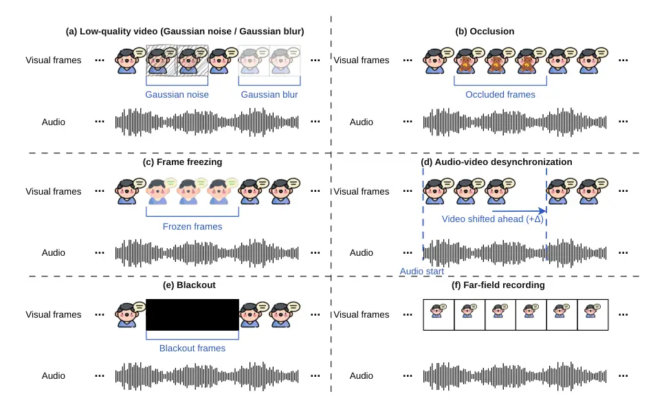

# The ISCSLP 2026 Real-World Audio-Visual Speech Enhancement Challenge

###### Abstract

Audio-visual speech enhancement (AVSE) uses visual-speech cues from a
target speaker to recover that speaker’s speech from noisy or
overlapping speech. Many widely used protocols construct mixed signals
from separately recorded audio sources and assume reliable video,
leaving their performance under natural overlap and visual failure
insufficiently characterized. The Real-World AVSE Challenge evaluates
two related settings. Track 1 comprises two scenarios: real-world
mixtures recorded with two speakers speaking simultaneously, without a
corresponding clean reference signal, and synthetic remixes obtained by
manually mixing the separately recorded speech of two speakers, with a
clean reference signal available; Track 2 reuses audio but pairs it with
a degraded target video and contains additional 3-m far-field
recordings. The speakers in the development and test sets are disjoint.
Evaluation metrics include clean-waveform fidelity, learned quality
estimates, transcription accuracy, and speaker identification. In the
remix task on the development set, the baseline model achieved an SI-SDR
of $`-4.069`$ dB and an STOI of $`0.388`$ on Track 1, and an SI-SDR of
$`-2.851`$ dB and an STOI of $`0.470`$ on Track 2. We release the
AV-ConvTasNet checkpoints, the offline evaluator, and the official
baseline results on the development and test sets.

Kai Li^(1,∗), Wenze Ren^(2,∗), Junjie Li^(3,∗), Cheng Yu⁴, Peijun Yang⁵,
Chien-yu Huang⁶, Haibin Wu⁷, Szu-Wei Fu⁸, Wen-Chin Huang⁹, Hsin-Min
Wang¹⁰, Xiaolin Hu¹, Ming Li¹¹, DeLiang Wang¹¹, Yu Tsao¹⁰

¹Tsinghua University ²National Taiwan University ³The Hong Kong
Polytechnic University ⁴Ohio State University ⁵Wuhan University
⁶Carnegie Mellon University ⁷Meta ⁸NVIDIA ⁹Nagoya University ¹⁰Academia
Sinica ¹¹The Chinese University of Hong Kong, Shenzhen

realworldavse_iscslp2026@googlegroups.com

^(†)^(†)footnotetext: \*Core contributors.

Index Terms: audio-visual speech enhancement, speech separation,
real-world robustness, visual degradation, challenge

## 1 Introduction

Audio-visual speech enhancement estimates the speech of a designated
target speaker from a mixture by combining acoustic observations with
the target speaker’s face or lip video \[1, 2, 3, 4, 5, 6\]. Because
visible articulation is not directly corrupted by acoustic interference,
it can complement the mixture signal when speakers overlap or background
noise is strong. This principle underlies deep audio-visual enhancement
and separation systems based on spectrogram masking, time-domain
separation, and cross-modal consistency \[7, 8, 9, 10, 11\]. Beyond
directly conditioning enhancement on visual cues, another line of work
adopts a two-stage pipeline: an audio-only separator first produces
speaker-independent streams, and then the target stream is selected in a
post-processing step by matching each output with the visual input,
e.g., via audio-visual synchronization or face–voice embedding
similarity \[12\]. More recent work includes brain-inspired cross-modal
architectures, intra- and inter-modality attention, and efficient
time-frequency modeling \[13, 14, 15\]; a recent survey reviews broader
advances, persistent challenges, and future directions in speech
separation \[16\].

Evaluation conditions, however, remain consequential. Several
established protocols form mixtures by adding separately recorded
sources and pairing them with relatively clean visual tracks. Such data
are valuable because the target waveform is known, but they do not
reproduce every property of naturally recorded overlap, including
speaker interaction, room response, ambient noise, and capture
artifacts. Prior challenges have moved toward noisier or real-recorded
material. The AVSE Challenge evaluated common enhancement systems on
real-world videos with added speech or noise \[17\], while the MISP 2023
Challenge addressed audio-visual target-speaker extraction from
spontaneous far-field conversations \[18\]. The remaining gap is
therefore not a lack of any realistic benchmark, but the need to
evaluate naturally mixed audio and unreliable visual evidence within one
reproducible protocol.

Visual reliability is a separate practical concern. A target face may be
occluded, blurred, frozen, temporally misaligned, too far away, missing,
or have low resolution. Cross-modal affinity models have explicitly
considered audio-video correspondence \[19\]; recent systems have also
targeted missing visual cues and low-quality video \[20, 21, 22, 23\].
These studies motivate a benchmark in which visual corruption is an
explicit evaluation variable rather than an incidental failure case.

The present challenge is also related to real-world target-speaker
extraction with audio enrollment. The REAL-TSE Challenge evaluates
conversational recordings using multidimensional metrics, but conditions
on an enrollment utterance rather than on the target speaker’s video
\[24\]. Our protocol, in contrast, uses monaural audio and
target-speaker video, includes both naturally recorded _mix_ scenes and
reference-available _remix_ scenes, and evaluates visual degradation in
a dedicated track. The protocol released is specified on the official
challenge website ¹¹ 1 https://real-world-avse.github.io/ and in the
accompanying baseline repository ²² 2
https://github.com/Real-World-AVSE/Baseline.

This paper provides three elements necessary to use the challenge as a
research benchmark:

1.  1.  An operational task and data protocol, including the relation
        between the two tracks and the speaker-disjoint splits;
2.  2.  A reproducible baseline model of AV-ConvTasNet and a
        multidimensional evaluator;
3.  3.  Official baseline results on the development and test sets with
        related analysis.

## 2 Challenge and Evaluation Protocol

### 2.1 Task and Tracks

Let $`x(t)`$ denote the waveform of the observed monaural mixture and
$`v_{k}(\tau)`$ denote the visual stream of the target speaker $`k`$,
where $`t`$ and $`\tau`$ represent the audio and video time indices,
respectively. Given the audio–visual input, the system estimates the
waveform of the target speaker $`k`$ as

```math
\hat{s}_{k}(t)=f_{\theta}\bigl(x(t),v_{k}(\tau)\bigr), \tag{1}
```

where $`f_{\theta}(\cdot)`$ is the audio–visual speech enhancement
function, and $`\theta`$ denotes the trainable parameters of the
function.

For the _remix_ scene, the desired output is the organizer-provided
single-speaker waveform. For the _mix_ scene, no clean target waveform
is available. The estimate is therefore evaluated using learned
no-reference quality predictors, character error rate (CER) against
organizer-provided transcripts, and similarity to a speaker-enrollment
voiceprint.

The benchmark is organized into two related settings:

- •
  Track 1: Real-World Mixed Scenarios. The principal condition is
  naturally recorded two-talker speech, preserving the joint effects of
  overlap, room acoustics, ambient sound, and recording chain.
  Reference-available remixes are included as a controlled anchor.
- •
  Track 2: Visual Degradation. Visual degradation is applied to the
  target video of the Track 1 clips while leaving their audio unchanged.
  The conditions released cover _low-quality video_, _occlusion_, _frame
  freezing_, _audio-video desynchronization_, and _blackout_. Track 2
  also includes additional recordings under a 3-m far-field condition
  captured during the same recording sessions.

Participants may use open-source data, pretrained models, and
augmentation, but must document all external resources. Each two-speaker
clip produces two target items, one for each speaker. Development and
test speakers do not overlap, reducing direct target-speaker leakage and
assessing performance on held-out speakers within this corpus.

### 2.2 Data Protocol

The corpus \[25\] contains seven groups of two speakers. Development
uses three groups, and test uses the remaining four. Each split contains
two scenes. In the _mix_ scene, both speakers are recorded together, and
no isolated target waveform is available. In the _remix_ scene, two
separately recorded single-speaker segments are additively combined with
the mixing SNR sampled from $`-5`$ to $`5`$ dB, and the corresponding
target source is retained as a reference. Remix therefore supports
clean-waveform metrics, whereas mix retains the natural recording
condition.

|       | Development |       |       | Test  |       |       |
| ----- | ----------- | ----- | ----- | ----- | ----- | ----- |
| Track | Mix         | Remix | Items | Mix   | Remix | Items |
| 1     | 1,242       | 900   | 4,284 | 2,472 | 1,785 | 8,514 |
| 2     | 1,527       | 1,098 | 5,250 | 2,820 | 2,121 | 9,882 |

Table 1: Released challenge data.

Table 1 gives the number of clips and target items released. Track 2
contains the Track 1 clips with degraded target videos, plus additional
clips with far-field views, resulting in a larger number of files. The
audio is 16-kHz mono. Face videos are 256$`\times`$256 pixels at 25 fps,
and optional facial-landmark files are provided. The official baseline
directly decodes the video and converts it to a normalized
88$`\times`$88 lip-region input.



Figure 1: Official examples of low quality (a), occlusion (b), frame
freezing (c), audio-video desynchronization (d), blackout (e), and
far-field recording (f). Desynchronization changes timing and is not
visible in a single frame.

The two-scene design serves complementary purposes. The _remix_ scene
provides a controlled and reproducible benchmark that follows the
synthetic additive-mixture paradigm widely adopted in conventional AVSE
evaluation. The _mix_ scene instead evaluates the performance of the
same systems on naturally recorded two-speaker interactions, including
the effects of speaker overlap, room acoustics, ambient sound, and the
recording chain, without assuming the availability of an isolated target
waveform. The two scenes should therefore be interpreted together:
_remix_ supports controlled comparison with established
synthetic-mixture results, whereas _mix_ measures robustness under
realistic recording conditions. Performance should consequently be
considered across both scenes, rather than optimized for only one of
them; improvements in _remix_ should not come at the expense of
performance in _mix_.

For visual degradation, Track 2 includes five explicit perturbation
types (see Fig. 1), together with an additional 3-m far-field recording
condition. These perturbations are applied to the target-speaker video
while leaving the audio unchanged ³³ 3
https://github.com/Real-World-AVSE/Baseline/tree/main/look2hear/datas/visual_perturb:

- •
  _Low-quality video_ applies either additive Gaussian noise or Gaussian
  blurring to a contiguous portion of the video, reducing the visual
  quality available to the model.
- •
  _Occlusion_ overlays a randomly selected object image on a facial
  landmark region, typically around the mouth, for a contiguous segment
  of frames.
- •
  _Frame freezing_ repeats one video frame over a consecutive interval
  while the audio continues normally, simulating video lag or
  stuttering.
- •
  _Audio–video desynchronization_ shifts the video stream relative to
  the unchanged audio stream. The shift can place the video ahead of or
  behind the audio while preserving the total number of video frames.
- •
  _Blackout_ replaces a contiguous block of video frames with all-black
  frames, simulating missing frames or zero padding.
- •
  _Far-field recording_ is captured at a distance of approximately 3 m.
  Unlike the preceding perturbations, this condition is based on
  additional real recordings rather than an offline modification of the
  video stream. It may therefore introduce changes in both the acoustic
  and visual inputs.

For clips shared with Track 1, the degraded target video is paired with
the same mixture audio, allowing comparison with the corresponding
undegraded condition. The additional far-field subset is not an isolated
visual intervention, since its recording distance and capture conditions
may affect both modalities.

### 2.3 Evaluation Protocol

As shown in Table 2, the evaluator reports complementary measures
because different references are available in different scenes.
SI-SDR \[26\], PESQ \[27\], and STOI \[28\] are calculated only for the
_remix_ scene, as the target speech utterance is available.
UTMOSv2 \[29, 30\] and DNSMOS \[31\] estimate the quality without a
clean reference waveform. Fun-ASR provides transcript-based CER, and
WeSpeaker embeddings provide enrollment-based identity similarity \[32,
33\]. We use these metrics in both the _remix_ and _mix_ scenes.

| Metric             | Reference             | Scene     | Backend       |
| ------------------ | --------------------- | --------- | ------------- |
| SI-SDR, PESQ, STOI | Clean target waveform | Remix     | torchmetrics  |
| UTMOS, DNSMOS      | No                    | Remix&Mix | UTMOSv2, ONNX |
| CER                | Transcript            | Remix&Mix | Fun-ASR       |
| SPK-SIM            | Enrollment voiceprint | Remix&Mix | WeSpeaker     |

Table 2: Evaluation dimensions and required references.

Summary metrics are arithmetic means over target items. Speaker
similarity is the cosine similarity between the enhanced-speech
embedding and a per-speaker centroid built from clean remix sources. The
official score on the leaderboard is calculated as

```math
\mathrm{OVRL}=\frac{1}{|\mathcal{M}|}\sum_{m\in\mathcal{M}}r_{m}, \tag{2}
```

where $`r_{m}`$ is the ranking of a team on the metric $`m`$ within the
selected scope. CER is ranked in ascending order and the other metrics
in descending order. DNS-P808, DNS-SIG, and DNS-BAK are displayed but
excluded; only DNS-OVRL enters the rank average. Because the ranking is
relative to the set of submitted teams, it may change when the
participating team set changes, even if the absolute metric values
remain unchanged.

## 3 Baseline and Results

### 3.1 Official Baseline

The official baseline is AV-ConvTasNet \[9\], a two-stream
target-speaker separator derived from Conv-TasNet \[34\]. As shown in
Fig. 2, it receives the mixture waveform and the target speaker’s lip
frames and outputs one target waveform.

#### 3.1.1 Architecture

As shown in Fig. 2, the audio branch encodes the waveform into a learned
representation, applies a temporal convolutional separator, and decodes
the target estimate. The released configuration uses 256 encoder filters
with the length of 40 samples, 256 bottleneck and skip channels, 512
convolutional channels, kernel size of 3, 8 blocks per repeat, and 4
repeats. The separator is non-causal, matching the offline challenge
setting. The visual branch is a frozen ResNet-34 lip-reading encoder
with a three-dimensional convolutional stem and a 512-dimensional
output. Its features align with the audio bottleneck and are
concatenated with a fusion dimension of $`F=256`$.

The architecture is intentionally kept transparent; performance gains
should be attributed to visual modeling, acoustic modeling, data, or
post-processing through controlled ablation, not just architectural
simplicity.

Figure 2: Official AV-ConvTasNet baseline architecture.

#### 3.1.2 Training

The reference pipeline uses PyTorch Lightning and distributed data
parallelism. Track 1 training dynamically forms two-speaker remixes from
VoxCeleb2 single-speaker sources \[35\]. Track 2 additionally applies
visual perturbations online, including masking or occlusion, low
resolution, frame freezing, dropped frames, and audio-video
desynchronization. Training uses a permutation-invariant SI-SDR/SNR
objective \[36, 26\], Adam with a learning rate of $`10^{-3}`$, and a
ReduceLROnPlateau scheduler. We release separate checkpoints for the two
tracks. This recipe provides a reproducible starting point rather than a
faithful simulation of the official evaluation distribution.

### 3.2 Results

Tables 3 and 4 report the results of the released checkpoints on the
development set and an organizer-side test snapshot taken on July 13, 2026. Since there is no clean reference for the mix condition, clean
reference-based metrics are calculated only for the remix condition
(Table 3); other metrics are averaged over mix and remix (Table 4).

| Track | Split | Remix items | SI-SDR$`\uparrow`$ (dB) | PESQ$`\uparrow`$ | STOI$`\uparrow`$ |
| ----- | ----- | ----------- | ----------------------- | ---------------- | ---------------- |
| 1     | Dev   | 1,800       | $`-4.0691`$             | 1.1470           | 0.3882           |
| 1     | Test  | 3,570       | $`-5.9252`$             | 1.1373           | 0.3036           |
| 2     | Dev   | 2,196       | $`-2.8507`$             | 1.2556           | 0.4697           |
| 2     | Test  | 4,242       | $`-1.6892`$             | 1.3036           | 0.5021           |

Table 3: Values of clean reference-based metrics achieved by the
official baseline in the remix scene.

| Track | Split | Items | UTMOS$`\uparrow`$ | DNS-OVRL$`\uparrow`$ | CER$`\downarrow`$ | SPK-SIM$`\uparrow`$ |
| ----- | ----- | ----- | ----------------- | -------------------- | ----------------- | ------------------- |
| 1     | Dev   | 4,284 | 0.9357            | 1.5993               | 0.7726            | 0.3821              |
| 1     | Test  | 8,514 | 0.8120            | 1.4472               | 1.0254            | 0.3278              |
| 2     | Dev   | 5,250 | 1.1777            | 1.3960               | 0.8707            | 0.3704              |
| 2     | Test  | 9,882 | 1.0996            | 1.2071               | 1.0524            | 0.3957              |

Table 4: Values of metrics not requiring a clean reference achieved by
the official baseline averaged over remix and mix.

For Track 1, the performance of the test set is worse than that of the
development set in terms of every higher-is-better metric, while CER
rises from 0.7726 to 1.0254. Track 2 does not follow one direction: the
clean reference-based metrics and SPK-SIM of the test set are better
than those of the development set, while UTMOS, DNS-OVRL, and CER are
worse. The relative difficulty of the development scenes also varies
across metrics. No single split or scene is uniformly more challenging
across all metrics; we therefore report the full set of metrics together
with the corresponding evaluation scope.

Cross-track differences also cannot isolate the effect of degraded
video. Relative to Track 1, Track 2 changes three things at once: the
target video is degraded, it uses a separately trained checkpoint, and
the far-field recordings contribute items that Track 1 does not contain.
Its higher SI-SDR and lower DNS-OVRL therefore reflect the combined
effect of these factors and cannot be attributed to any one. The two
tracks are therefore best read as separate operating points rather than
as a paired visual-degradation comparison.

| Track | Scene | Items | UTMOS$`\uparrow`$ | DNS-OVRL$`\uparrow`$ | CER$`\downarrow`$ | SPK-SIM$`\uparrow`$ |
| ----- | ----- | ----- | ----------------- | -------------------- | ----------------- | ------------------- |
| 1     | Mix   | 2,484 | 0.9294            | 1.6723               | 0.7345            | 0.4039              |
| 1     | Remix | 1,800 | 0.9444            | 1.4986               | 0.8252            | 0.3521              |
| 2     | Mix   | 3,054 | 1.1875            | 1.4492               | 0.8657            | 0.3844              |
| 2     | Remix | 2,196 | 1.1641            | 1.3220               | 0.8776            | 0.3509              |

Table 5: Values of metrics not requiring a clean reference achieved by
the official baseline averaged over development and test.

#### 3.2.1 Remix vs. Mix

The scene-level scores reinforce the need for multidimensional
reporting. For example, as shown in Table 5, DNS-OVRL is higher on mix
than remix for both tracks, whereas CER is lower on mix for Track 1 but
nearly unchanged for Track 2. These orderings are not evidence that one
scene is uniformly easier; they reflect different references and metric
sensitivities.

### 3.3 Reproducibility

The public repository provides track-specific configurations and
checkpoints, data readers, multi-GPU sharded inference, and one entry
point that either enhances or scores audio offline. Test transcripts,
clean remix targets, manifests, and enrollment voiceprints remain
organizer-held, so test scores come only from organizer-side evaluation.
Participants submit one 16-kHz mono estimate per target item, and
document external data, pretrained models, visual augmentations,
preprocessing, losses, and inference-time processing. Packaging
instructions may be revised during the challenge, so the live submission
page defines the final directory layout.

## 4 Discussion and Conclusion

### 4.1 Implications and Limitations

The challenge combines two kinds of evidence that are often separated.
Natural mix recordings expose systems to real overlap without an
isolated waveform target; remix supplies the reference needed for
signal-level metrics. Track 2 then makes visual reliability explicit
through several degradations and far-field video. The resulting protocol
can reveal trade-offs among waveform fidelity, estimated quality,
transcript accuracy, and target identity, but no single metric
substitutes for the others.

The design also leaves clear limits. The corpus contains fourteen
speakers and Chinese speech, so speaker-disjoint testing measures
held-out-speaker performance within this corpus rather than open-domain
deployment. Most Track 2 corruptions are constructed, and the additional
far-field material prevents aggregate track scores from being a paired
visual-ablation study. Mix has no clean waveform target; UTMOS and
DNSMOS are learned predictors, not human judgments. OVRL changes with
the team set, and unrestricted external data means leaderboard
differences can reflect data resources as well as algorithms. These
constraints should accompany any claim based on the final ranking.

Useful next analyses follow directly from these limits. Shared clips
should be evaluated with clean and degraded video under the same
checkpoint, with separate results for each degradation and for far-field
material. No-processing and audio-only controls would make the value of
visual conditioning identifiable. Human listening tests could test
whether learned quality scores track judgments in this domain. Finally,
confidence-aware fusion and timing-robust models are natural candidates
for Track 2 \[19, 20, 37\].

### 4.2 Conclusion

This paper defined the 15th International Symposium on Chinese Spoken
Language Processing (ISCSLP) 2026 Real-World AVSE Challenge, documented
its mix/remix protocol, released AV-ConvTasNet baselines, and reported
official development- and test-set scores. The benchmark assesses
target-speech quality, intelligibility, and identity under natural
overlap and unreliable video. Its aggregate results must nevertheless be
interpreted within the protocol: Track 2 is a superset with a separate
checkpoint, Mix lacks a clean waveform, and the rank-based leaderboard
depends on the participant set. The released baseline and evaluator
provide a reproducible reference for more controlled robustness studies
and for the final challenge analysis.

## 5 Acknowledgements

The challenge and baseline are maintained by the Real-World AVSE
Challenge organizing committee for ISCSLP 2026. We thank the authors of
the open-source AV-ConvTasNet, Conv-TasNet, VoxCeleb2, UTMOSv2, DNSMOS,
Fun-ASR, and WeSpeaker projects integrated into the challenge
infrastructure.

## References

- \[1\] J. Hou, S. Wang, Y. Lai, Y. Tsao, H. Chang, and H. Wang (2018)
  Audio-visual speech enhancement using multimodal deep convolutional
  neural networks. IEEE Transactions on Emerging Topics in Computational
  Intelligence 2 (2), pp. 117–128. Cited by: §1.
- \[2\] A. Gabbay, A. Shamir, and S. Peleg (2017) Visual speech
  enhancement. arXiv preprint arXiv:1711.08789. Cited by: §1.
- \[3\] M. Gogate, K. Dashtipour, A. Adeel, and A. Hussain (2020)
  CochleaNet: a robust language-independent audio-visual model for
  real-time speech enhancement. Information Fusion 63, pp. 273–285.
  Cited by: §1.
- \[4\] M. Sadeghi, S. Leglaive, X. Alameda-Pineda, L. Girin, and R.
  Horaud (2020) Audio-visual speech enhancement using conditional
  variational auto-encoders. IEEE/ACM Transactions on Audio, Speech, and
  Language Processing 28, pp. 1788–1800. Cited by: §1.
- \[5\] S. Chuang, H. Wang, and Y. Tsao (2022) Improved lite
  audio-visual speech enhancement. IEEE/ACM Transactions on Audio,
  Speech, and Language Processing 30, pp. 1345–1359. Cited by: §1.
- \[6\] V. A. Kalkhorani, C. Yu, A. Kumar, K. Tan, B. Xu, and D.
  Wang (2025) AV-crossnet: an audiovisual complex spectral mapping
  network for speech separation by leveraging narrow- and cross-band
  modeling. IEEE Journal of Selected Topics in Signal Processing 19 (4),
  pp. 685–694. External Links:
  [Document](https://dx.doi.org/10.1109/JSTSP.2025.3567838) Cited by:
  §1.
- \[7\] T. Afouras, J. S. Chung, and A. Zisserman (2018) The
  conversation: deep audio-visual speech enhancement. In Proc.
  Interspeech, pp. 3244–3248. External Links:
  [Document](https://dx.doi.org/10.21437/Interspeech.2018-1400) Cited
  by: §1.
- \[8\] A. Ephrat, I. Mosseri, O. Lang, T. Dekel, K. Wilson, A.
  Hassidim, et al. (2018) Looking to listen at the cocktail party: a
  speaker-independent audio-visual model for speech separation. ACM
  Transactions on Graphics 37 (4), pp. 1–11. External Links:
  [Document](https://dx.doi.org/10.1145/3197517.3201357) Cited by: §1.
- \[9\] J. Wu, Y. Xu, S. Zhang, L. Chen, M. Yu, L. Xie, et al. (2019)
  Time domain audio visual speech separation. In 2019 IEEE automatic
  speech recognition and understanding workshop (ASRU), pp. 667–673.
  External Links:
  [Document](https://dx.doi.org/10.1109/ASRU46091.2019.9003983) Cited
  by: §1, §3.1.
- \[10\] R. Gao and K. Grauman (2021) VisualVoice: audio-visual speech
  separation with cross-modal consistency. In Proc. CVPR,
  pp. 15490–15500. External Links:
  [Document](https://dx.doi.org/10.1109/CVPR46437.2021.01524) Cited by:
  §1.
- \[11\] W. Ren, K. Li, R. Chao, J. Li, Z. Huang, S. Ahmed, Y. Li, K.
  Hung, S. Wang, H. Wang, and Y. Tsao (2025) BAV-MossFormer2: Enhanced
  MossFormer2 for Binaural Audio-Visual Speech Enhancement. In 4th
  Cogmhear Audio-Visual Speech Enhancement Challenge (AVSEC), pp. 79–80.
  Cited by: §1.
- \[12\] W. Ren, K. Hung, R. Chao, Y. Li, H. Wang, and Y. Tsao (2024)
  Robust audio-visual speech enhancement: correcting misassignments in
  complex environments with advanced post-processing. In 27th Conference
  of the O-COCOSDA, pp. 1–6. Cited by: §1.
- \[13\] K. Li, F. Xie, H. Chen, K. Yuan, and X. Hu (2024) An
  audio-visual speech separation model inspired by
  cortico-thalamo-cortical circuits. IEEE Transactions on Pattern
  Analysis and Machine Intelligence 46 (10), pp. 6637–6651. External
  Links: [Document](https://dx.doi.org/10.1109/TPAMI.2024.3384034) Cited
  by: §1.
- \[14\] K. Li, R. Yang, F. Sun, and X. Hu (2024) IIANet: an intra- and
  inter-modality attention network for audio-visual speech separation.
  In Proc. ICML, Proceedings of Machine Learning Research, Vol. 235,
  pp. 29181–29200. Cited by: §1.
- \[15\] S. Pegg, K. Li, and X. Hu (2024) RTFS-Net: recurrent
  time-frequency modelling for efficient audio-visual speech separation.
  In Proc. ICLR, Cited by: §1.
- \[16\] K. Li et al. (2025) Advances in speech separation: techniques,
  challenges, and future trends. arXiv preprint arXiv:2508.10830. Cited
  by: §1.
- \[17\] A. L. A. Blanco, C. Valentini-Botinhao, O. Klejch, M.
  Gogate, K. Dashtipour, A. Hussain, and P. Bell (2023) AVSE Challenge:
  audio-visual speech enhancement challenge. In Proc. SLT, pp. 465–471.
  External Links:
  [Document](https://dx.doi.org/10.1109/SLT54892.2023.10023284) Cited
  by: §1.
- \[18\] S. Wu, C. Wang, H. Chen, Y. Dai, C. Zhang, R. Wang, et
  al. (2024) The multimodal information based speech processing (MISP)
  2023 challenge: audio-visual target speaker extraction. In Proc.
  ICASSP, pp. 8351–8355. External Links:
  [Document](https://dx.doi.org/10.1109/ICASSP48485.2024.10447462) Cited
  by: §1.
- \[19\] J. Lee, S. Chung, S. Kim, H. Kang, and K. Sohn (2021) Looking
  into your speech: learning cross-modal affinity for audio-visual
  speech separation. In 2021 IEEE/CVF Conference on Computer Vision and
  Pattern Recognition (CVPR), Vol. , pp. 1336–1345. External Links:
  [Document](https://dx.doi.org/10.1109/CVPR46437.2021.00139) Cited by:
  §1, §4.1.
- \[20\] T. Pan, J. Liu, B. Wang, J. Tang, and G. Wu (2024) RAVSS:
  robust audio-visual speech separation in multi-speaker scenarios with
  missing visual cues. In Proc. ACM Multimedia, pp. 4748–4756. External
  Links: [Document](https://dx.doi.org/10.1145/3664647.3681261) Cited
  by: §1, §4.1.
- \[21\] H. Chen, C. Zhang, Q. Wang, J. Du, S. M. Siniscalchi, S. Xiong,
  and G. Wan (2025) HPCNet: hybrid pixel and contour network for
  audio-visual speech enhancement with low-quality video. IEEE Journal
  of Selected Topics in Signal Processing 19 (4), pp. 671–684. External
  Links: [Document](https://dx.doi.org/10.1109/JSTSP.2025.3559763) Cited
  by: §1.
- \[22\] J. Li, W. Wu, S. Wang, Z. Pan, K. A. Lee, H. Meng, and H.
  Li (2026) MeMo: attentional momentum for real-time audio-visual target
  speaker extraction under impaired visual conditions. IEEE Transactions
  on Audio, Speech and Language Processing 34 (), pp. 3491–3504.
  External Links:
  [Document](https://dx.doi.org/10.1109/TASLPRO.2026.3703224) Cited by:
  §1.
- \[23\] J. Li, K. Zhang, S. Wang, K. A. Lee, M. Mak, and H. Li (2025)
  MoMuSE: momentum multi-modal target speaker extraction for real-time
  scenarios with impaired visual cues. In 2025 IEEE International
  Conference on Multimedia and Expo (ICME), pp. 1–6. Cited by: §1.
- \[24\] S. Wang, Z. Qian, K. Zhang, J. Han, Z. Liu, X. Yu, et
  al. (2026) SLT 2026 REAL-TSE Challenge: real-world target speaker
  extraction from conversational recordings. arXiv preprint
  arXiv:2607.15198. Cited by: §1.
- \[25\] P. Yang, Z. Jin, J. Liu, and M. Li (2026) Identity-faithful
  audio-visual target speaker extraction with qiangda and
  voxblink2-avse. arXiv preprint arXiv:2608.03964. Cited by: §2.2.
- \[26\] J. Le Roux, S. Wisdom, H. Erdogan, and J. R. Hershey (2019)
  SDR–half-baked or well done?. In Proc. ICASSP, pp. 626–630. External
  Links: [Document](https://dx.doi.org/10.1109/ICASSP.2019.8683855)
  Cited by: §2.3, §3.1.2.
- \[27\] A. W. Rix, J. G. Beerends, A. P. Hollier, and A. P.
  Hekstra (2001) Perceptual evaluation of speech quality (PESQ) – a new
  method for speech quality assessment of telephone networks and codecs.
  In Proc. ICASSP, Vol. 2, pp. 749–752. External Links:
  [Document](https://dx.doi.org/10.1109/ICASSP.2001.941023) Cited by:
  §2.3.
- \[28\] C. H. Taal, R. C. Hendriks, R. Heusdens, and J. Jensen (2011)
  An algorithm for intelligibility prediction of time-frequency weighted
  noisy speech. IEEE Transactions on Audio, Speech, and Language
  Processing 19 (7), pp. 2125–2136. External Links:
  [Document](https://dx.doi.org/10.1109/TASL.2011.2114881) Cited by:
  §2.3.
- \[29\] T. Saeki, D. Xin, W. Nakata, T. Koriyama, S. Takamichi, and H.
  Saruwatari (2022) UTMOS: UTokyo-SaruLab System for VoiceMOS Challenge 2022. In Interspeech 2022, pp. 4521–4525. External Links:
  [Document](https://dx.doi.org/10.21437/Interspeech.2022-439), ISSN
  2958-1796 Cited by: §2.3.
- \[30\] K. Baba, W. Nakata, Y. Saito, and H. Saruwatari (2024) The t05
  system for the VoiceMOS challenge 2024: transfer learning from deep
  image classifier to naturalness MOS prediction of high-quality
  synthetic speech. In Proc. SLT, pp. 818–824. External Links:
  [Document](https://dx.doi.org/10.1109/SLT61566.2024.10832315) Cited
  by: §2.3.
- \[31\] C. K. Reddy, V. Gopal, and R. Cutler (2022) DNSMOS P.835: a
  non-intrusive perceptual quality metric to evaluate noise suppressors.
  In Proc. ICASSP, pp. 886–890. External Links:
  [Document](https://dx.doi.org/10.1109/ICASSP43922.2022.9747199) Cited
  by: §2.3.
- \[32\] K. An, Y. Chen, Z. Chen, C. Deng, Z. Du, C. Gao, et al. (2025)
  Fun-ASR technical report. arXiv preprint arXiv:2509.12508. Cited by:
  §2.3.
- \[33\] H. Wang, C. Liang, S. Wang, Z. Chen, B. Zhang, X. Xiang, et
  al. (2023) WeSpeaker: a research and production oriented speaker
  embedding learning toolkit. In Proc. ICASSP, pp. 1–5. Cited by: §2.3.
- \[34\] Y. Luo and N. Mesgarani (2019) Conv-tasnet: surpassing ideal
  time-frequency magnitude masking for speech separation. IEEE/ACM
  Transactions on Audio, Speech, and Language Processing 27 (8),
  pp. 1256–1266. External Links:
  [Document](https://dx.doi.org/10.1109/TASLP.2019.2915167) Cited by:
  §3.1.
- \[35\] J. S. Chung, A. Nagrani, and A. Zisserman (2018) VoxCeleb2:
  deep speaker recognition. In Proc. Interspeech, pp. 1086–1090.
  External Links:
  [Document](https://dx.doi.org/10.21437/Interspeech.2018-1929) Cited
  by: §3.1.2.
- \[36\] D. Yu, M. Kolbæk, Z. Tan, and J. Jensen (2017) Permutation
  invariant training of deep models for speaker-independent multi-talker
  speech separation. In Proc. ICASSP, pp. 241–245. External Links:
  [Document](https://dx.doi.org/10.1109/ICASSP.2017.7952154) Cited by:
  §3.1.2.
- \[37\] H. Martel, J. Richter, K. Li, X. Hu, and T. Gerkmann (2023)
  Audio-visual speech separation in noisy environments with a
  lightweight iterative model. In Proc. Interspeech, pp. 1673–1677.
  External Links:
  [Document](https://dx.doi.org/10.21437/Interspeech.2023-1753) Cited
  by: §4.1.
