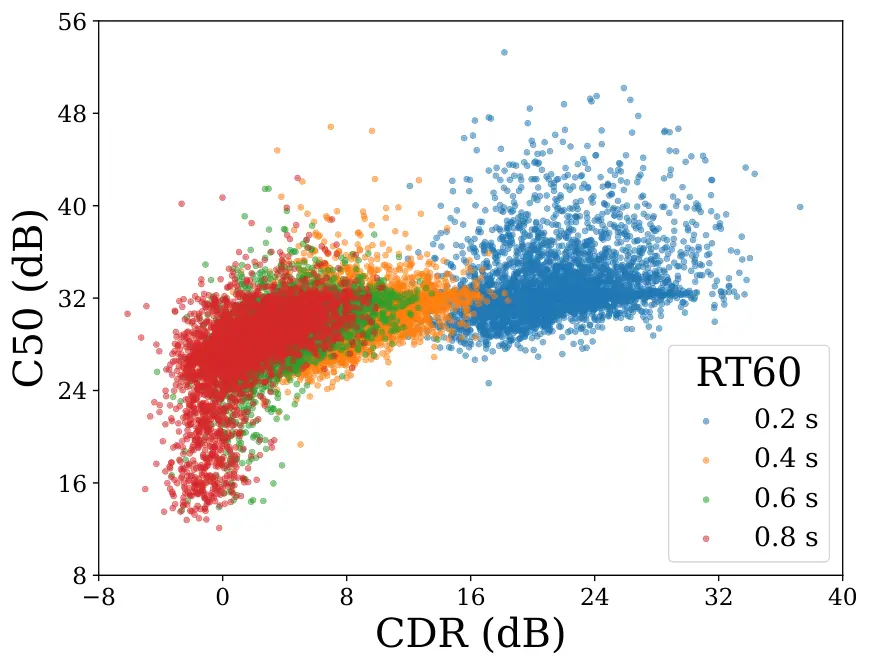
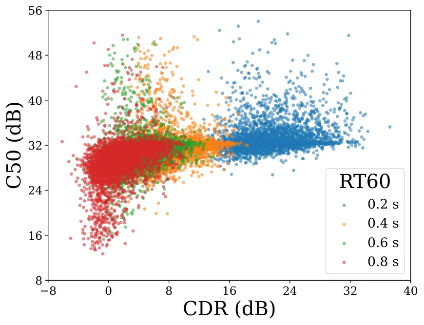
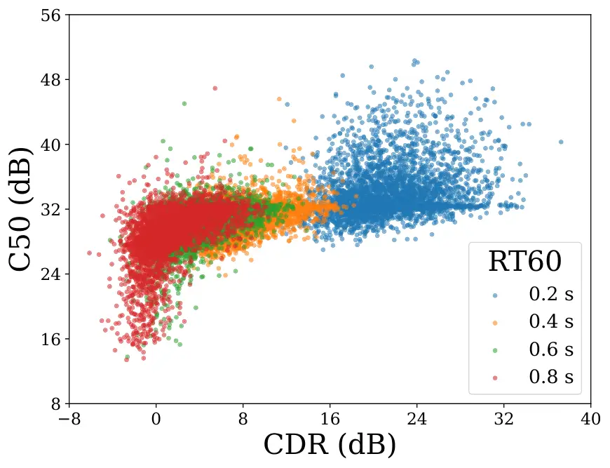
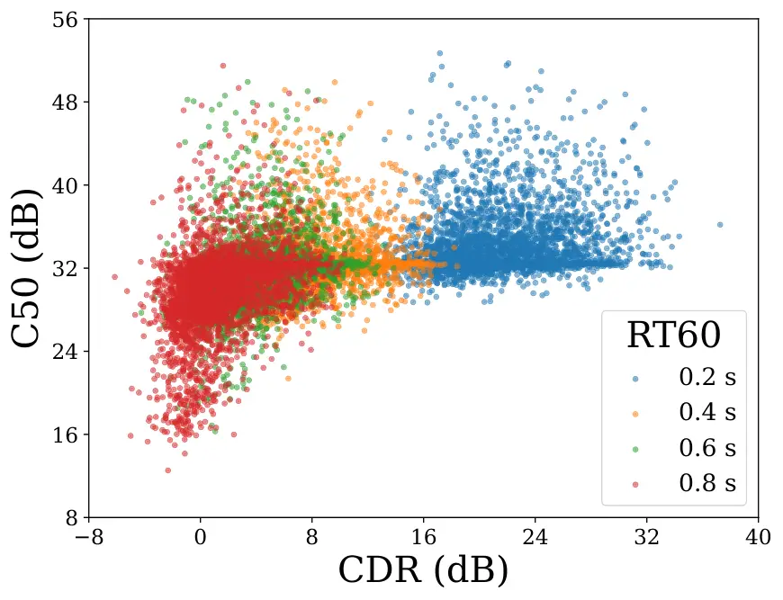

DF  
directivity factor

DRR  
direct-to-reverberant ratio

NDF  
neural directional filtering

PESQ  
perceptual evaluation of speech quality

RIR  
room impulse response

RTF  
room transfer function

SDR  
signal-to-distortion ratio

STFT  
short-time Fourier transform

VDM  
virtual directional microphone

WPE  
weighted prediction error

DNN  
deep neural network

SRMR  
speech-to-reverberation modulation energy ratio

MOS  
mean opinion score

CDR  
coherent to diffuse ratio

FBF  
fixed beamforming

ITD  
interaural time difference

DDF  
joint dereverberation and directional filtering

$`\Delta`$SDR  
improvement in SDR (SDR) over the unprocessed signal

DMA  
differential microphone array

DNN  
deep neural network

DOA  
direction-of-arrival

iSTFT  
inverse short-time Fourier transform

CDMA  
circular DMA (DMA)

LDMA  
linear DMA

LS  
least-squares

LSTM  
long short-term memory

BiLSTM  
bidirectional LSTM

UniLSTM  
unidirectional LSTM

WNG  
white noise gain

RIRs  
room impulse responses

RIR  
room impulse response

RTF  
room transfer function

RTFs  
room transfer functions

DPIR  
direct-path impulse response

MVDR  
minimum variance distortionless response

LCMV  
linear-constraint minimum-variance

PMWF  
parametric multichannel wiener filter

GSC  
Generalized sidelobe canceller

FT-JNF  
joint spatial and temporal-spectral non-linear filtering

JNF  
joint non-linear filtering

SSF  
spatially selective deep non-linear filter

SDR  
signal-to-distortion ratio

reference microphone  
SDR of the unprocessed omnidirectional reference microphone

SNR  
signal-to-noise ratio

STFT  
short-time Fourier transform

MAE  
mean absolute error

TF  
time-frequency

SA-$`\varepsilon`$-tSDR  
source-aggregated and regularized thresholded SDR

STOI  
short term objective intelligibility

PESQ  
perceptual evaluation of speech quality

UCA  
uniform circular array

NDF  
neural directional filtering

SHONDC  
steerable high-order neural directional coding

NDSC  
neural directional speech coding

NDC  
neural directional coding

WNG  
white noise gain

DF  
directivity factor

DI  
directivity index

HRTF  
head-related transfer function

ILD  
interaural level difference

FiLM  
feature-wise linear modulation

PESQ  
perceptual evaluation of speech quality

UNDF  
neural directional filtering with user-defined directivity patterns

VDM  
virtual directional microphone

DirAC  
directional audio coding

FOA  
first-order ambisonics

HOA  
high-order ambisonics

ATF  
acousitc transfer function

# GAN-based Joint Dereverberation and Directional Filtering

^($`\ast`$)A joint institution of Fraunhofer IIS and
Friedrich-Alexander-Universität Erlangen-Nürnberg (FAU), Germany. The
authors gratefully acknowledge the scientific support and HPC resources
provided by the Erlangen National High Performance Computing Center
(NHR@FAU) of the Friedrich-Alexander-Universität Erlangen-Nürnberg
(FAU). The hardware is funded by the German Research Foundation (DFG).

###### Abstract

Recently, neural directional filtering (NDF) enables reconstruction of a
virtual directional microphone (VDM) with a desired directivity pattern,
accurately rendering multi-source scenes by preserving spatial cues. In
strongly reverberant environments, spatial cues become perceptually
difficult to distinguish, limiting NDF-based spatial sound capture. This
paper addresses this limitation with three contributions: First, we
propose a neural dereverberation and directional filtering (NDDF)
approach to reconstruct dereverberated VDM signals. Second, NDDF is
implemented with discriminatively trained and generative adversarial
network (GAN)-based models, compared with cascaded dereverberation and
directional-filtering baselines. Experimental results indicate that the
NDDF consistently surpasses the cascaded baselines. Additionally, the
GAN-based NDDF outperforms the discriminative variant when addressing a
high-order VDM target. Third, we introduce a method for directivity
pattern estimation that relies solely on the input and output signals.
This method is suitable for signal-mapping-based spatial filtering,
which synthesizes the output signal directly without explicit filtering
or masking.

|                                                                                                  |
| ------------------------------------------------------------------------------------------------ |
| Weilong Huang, Shrishti Saha Shetu, Emanuël A. P. Habets                                         |
| International Audio Laboratories Erlangen^($`\ast`$), Am Wolfsmantel 33, 91058 Erlangen, Germany |

Index Terms—  Directional filtering, Microphone array, Dereverberation

## 1 Introduction

Spatial sound capture aims to preserve the spatial cues of an acoustic
scene, enabling listeners to perceive source positions and room
characteristics during playback \[3\]. In enclosed environments,
reverberation introduces delayed reflections that overlap with the
direct sound, thereby degrading spatial cues such as ILD (ILD). This
degradation is particularly significant when employing a compact array
with a small aperture and few microphones, as conventional fixed
beamforming (FBF) applied to such arrays yields limited performance
\[2\].

Recently, NDF (NDF) has been proposed as a data-driven alternative for
reconstructing a VDM (VDM) with a desired directivity pattern on compact
arrays \[30, 26, 15\]. By learning the input-output behavior of an ideal
directional microphone, NDF can achieve a high-directivity
frequency-invariant response, and even supports arbitrary directivity
pattern configuration at inference \[14\]. However, for both FBF (FBF)
and NDF, a higher directivity comes with a narrower mainlobe, which is
not always desirable for spatial sound capture. Certain recording
techniques require a specific shape for the directivity pattern: for
instance, the widely used X-Y stereo technique relies on a pair of
first-order cardioid patterns \[21\]. A first-order cardioid offers a DI
(DI) of only approximately 4.8 dB \[6\], which is insufficient to
suppress reverberant energy in strongly reverberant environments. In
such scenarios, the reconstructed VDM exhibits substantial
reverberation, obscuring spatial cues and degrading the perceptual
quality of the captured scene. Whether a method can both flexibly
realize various directivity patterns like NDF and maintain effective
dereverberation under each of these patterns remains an open question.
An intuitive remedy is to apply a dereverberation front-end prior to
NDF, but such cascaded pipelines optimize each stage independently and
are therefore unlikely to yield an optimal final output. This motivates
a unified formulation that jointly addresses dereverberation and
directional filtering.

In this paper, we propose neural dereverberation and directional
filtering (NDDF), a joint neural approach that reconstructs a
dereverberated VDM signal directly from the array input. Our
contributions are threefold. First, we formulate joint dereverberation
and directional filtering as a single learning problem and implement
NDDF with two training paradigms: a discriminatively trained model and a
generative adversarial network (GAN)-based model. We compare them
against cascaded dereverberation and directional-filtering baselines.
Second, experimental results show that the NDDF consistently outperforms
the cascaded baselines, where the GAN-based NDDF outperforms the
discriminative variant for a high-order VDM target. Third, since the
GAN-based NDDF synthesizes the output signal directly without explicit
filtering or masking, conventional directivity analysis is not
applicable; we therefore introduce a directivity pattern estimation
method that relies solely on the input and output signals, which is
broadly applicable to signal-mapping-based spatial filtering approaches.

## 2 Problem Formulation

We consider a scenario in which a compact array with $`Q`$
omnidirectional microphones captures an acoustic scene comprising $`N`$
sound sources in a reverberant room. Let $`X_{q,n}(f,t)`$ denote the
$`n`$-th source signal at the $`q`$-th microphone in the STFT (STFT)
domain, where $`f`$ and $`t`$ represent the frequency and frame indices,
respectively. The mixture signal at the $`q`$-th microphone, denoted by
$`Y_{q}(f,t)`$, is given by

```math
Y_{q}(f,t)=\sum_{n=1}^{N}X_{q,n}(f,t)+V_{q}(f,t),~q\in\{1,2,\ldots,Q\}, \tag{1}
```

where $`V_{q}(f,t)`$ denotes spatially uncorrelated sensor noise across
the microphones. Additionally, $`X_{q,n}(f,t)=H_{q,n}(f)\,S_{n}(f,t)`$
\[1\], where $`S_{n}(f,t)`$ is the $`n`$-th source signal and
$`H_{q,n}(f)`$ models the RTF (RTF) between the $`n`$-th source and the
$`q`$-th microphone.

The NDF task employs a DNN (DNN) to reconstruct a VDM signal that
captures the acoustic scene according to a specified directivity pattern
\[30, 15\]. The VDM position is set at the reference microphone
($`q=1`$). The directivity pattern, represented by
$`\Lambda(\theta,\phi)`$, defines the directional sensitivity of a
beamformer or directional microphone and describes the spatial response
to sounds arriving from different directions \[7, 6\]. Consequently, the
VDM signal $`Z_{\mathrm{vdm}}(f,t)`$ is defined as

```math
Z_{\mathrm{vdm}}(f,t)=\sum_{n=1}^{N}H_{\mathrm{vdm},n}(f;\Lambda)\,S_{n}(f,t), \tag{2}
```

where
$`H_{\mathrm{vdm},n}(f;\Lambda)=\sum_{i=1}^{\infty}\Lambda(\theta_{i},\phi_{i})\,\rho^{(i)}_{\mathrm{vdm},n}[f]`$
represents the RTF between the $`n`$-th source and the VDM. The term
$`\rho^{(i)}_{\mathrm{vdm},n}[f]`$ denotes the transfer function of the
$`i`$-th propagation path from the $`n`$-th source to the VDM within a
reverberant environment. Each reflection path is weighted by the
directivity gain associated with its incident direction. The angles
$`\theta_{i}`$ and $`\phi_{i}`$ specify the incident direction for the
$`i`$-th propagation path.

To minimize the impact of late reflections (reverberation) on VDM, we
propose a neural approach that reconstructs a dereverberated VDM signal.
Specifically, we decompose $`H_{\mathrm{vdm},n}(f;\Lambda)`$ as follows:

```math
H_{\mathrm{vdm},n}(f;\Lambda)=H_{\mathrm{coh},n}(f;\Lambda)+H_{\mathrm{diff},n}(f;\Lambda), \tag{3}
```

where $`H_{\mathrm{coh},n}(f;\Lambda)`$ denotes the spatially coherent
component, and $`H_{\mathrm{diff},n}(f;\Lambda)`$ denotes the diffuse
component. Accordingly, the target dereverberated VDM signal is given by

```math
Z_{\mathrm{target}}(f,t)=\sum_{n=1}^{N}H_{\mathrm{coh},n}(f;\Lambda)S_{n}(f,t). \tag{4}
```

## 3 Proposed Method

### 3.1 DNN Architecture and Training Loss

Fig. 1: Generator architecture

The GAN-based architecture uses a SEANet-based generator \[24\], as
illustrated in Fig. 1. This design adopts a UNet-like structure in the
time-frequency domain, featuring a symmetric encoder–decoder network
with skip connections. For the $`q`$-th microphone, a magnitude-phase
representation is computed based on the STFT signals as:

```math
\mathbf{Y}_{q}(f,t)=\Biggl[\,\log|Y_{q}(f,t)|,\;\frac{\Re(Y_{q}(f,t))}{|Y_{q}(f,t)|},\;\frac{\Im(Y_{q}(f,t))}{|Y_{q}(f,t)|}\,\Biggr]. \tag{5}
```

Concatenating across $`Q`$ microphones produces an input of size
$`[B,3Q,F,T]`$, where $`B`$ is the batch size, $`F`$ is the number of
frequency bins, and $`T`$ is the number of time frames. This input is
processed by an encoder comprising an initial convolution followed by
eight downsampling stages. Each stage includes a residual block \[4\]
and a strided two-dimensional convolution that halves the frequency
dimension while maintaining the time dimension. The first four stages
incrementally double the channel count, whereas the subsequent four
stages retain a constant channel dimension. Upon completion of the final
stage, the frequency dimension is reduced to one, yielding a
one-dimensional feature sequence. Temporal modeling is performed by a
two-layer LSTM (LSTM) network with a residual skip connection. The
decoder is structured as a mirror of the encoder, employing transposed
two-dimensional convolutions for frequency upsampling. At each decoding
stage, the corresponding encoder feature map is added element-wise via
skip connections, followed by a residual block that refines the combined
representation. The final convolution projects the features into a
configuration-dependent output space, producing either $`[B,3,F,T]`$ for
direct dereverberated VDM estimation $`\widehat{Z}(f,t)`$ in
magnitude-phase form or $`[B,2,F,T]`$ for complex mask estimation. The
complex mask $`\mathcal{M}(f,t)`$ is then applied to the reference
signal $`Y_{1}(f,t)`$ to obtain the estimated signals, specifically
$`\widehat{Z}(f,t)=\mathcal{M}(f,t)Y_{1}(f,t)`$. The generator that
performs dereverberated VDM estimation is referred to as a signal-based
UNet, whereas the generator that estimates a complex mask is termed a
mask-based UNet.

The loss function of the generator, consistent with \[22\], is optimized
using a weighted combination of four loss terms:

```math
\mathcal{L}_{\text{Generator}}=\lambda_{1}\,\mathcal{L}_{\text{temp}}+\lambda_{2}\,\mathcal{L}_{\text{spec}}+\lambda_{3}\,\mathcal{L}_{\text{adv}}+\lambda_{4}\,\mathcal{L}_{\text{feat}}. \tag{6}
```

Here, $`\mathcal{L}_{\text{temp}}`$ denotes the $`\ell_{1}`$ loss
between the target and reconstructed signal waveforms.
$`\mathcal{L}_{\text{spec}}`$ represents a combination of $`\ell_{1}`$
and Frobenius distances computed on Mel and magnitude spectra at
multiple resolutions \[5\]. $`\mathcal{L}_{\text{adv}}`$ refers to a
hinge-based adversarial loss, while $`\mathcal{L}_{\text{feat}}`$ is the
$`\ell_{1}`$ distance between intermediate feature maps of the
discriminator for the target and reconstructed signals. The
discriminator architecture utilizes a multi-scale STFT-based network, as
described in \[4\], with a configuration similar to \[23, 5\].

### 3.2 Training Strategy

Fig. 2: The windowing of the RIR for VDM to preserve the direct sound
and early reflections

In this study, both a $`1^{\textrm{st}}`$-order Cardioid and a
$`6^{\textrm{th}}`$-order Cardioid are selected as target directivity
patterns. A $`J^{\textrm{th}}`$-order Cardioid directivity pattern
\[15\] is adopted as

```math
\Lambda(\theta,\phi)=(0.5+0.5(\sin\phi\sin\phi_{\textrm{s}}\cos(\theta-\theta_{\textrm{s}})+\cos\phi\cos\phi_{\textrm{s}}))^{J}, \tag{7}
```

where $`\theta_{\textrm{s}}`$ and $`\phi_{\textrm{s}}`$ specify the
target direction of the directivity pattern. The maximum attenuation at
the null position of the directivity patterns is set to
$`-30`$ $`\mathrm{dB}`$ to ensure robust training.

All microphones and sound sources are assumed to lie in the $`x`$-$`y`$
plane. To learn the target directivity pattern in a reverberant
environment, a random source-array setup with up to three concurrent
sources is simulated. The azimuth angle $`\theta_{n}`$ for the $`n`$-th
speech source relative to the array is randomly selected, and each
speech source is assigned a random source-array distance. A room with
random dimensions and reverberation time is defined, and the
source-array setup is randomly positioned within the room. Based on the
positions of the microphones and sources, the corresponding RIR \[10\]
are generated, and the microphone signals are computed using (1).

To compute the training target, the RIR for the transfer function
$`H_{\mathrm{coh},n}(f;\Lambda)`$ is approximated by windowing the
corresponding RIR for the transfer function
$`H_{\mathrm{vdm},n}(f;\Lambda)`$, as illustrated in Fig. 2. The
specific definition of the window and corresponding windowing process
can be found in \[13\].

## 4 Experimental Setup

### 4.1 Dataset and Configurations

|                       |                      |                      |                          |                          |
| --------------------- | -------------------- | -------------------- | ------------------------ | ------------------------ |
| Length                | Width                | Height               | $`\textrm{RT}_{60}`$     | Source-array dist.       |
| 6 - 10 $`\mathrm{m}`$ | 4 - 8 $`\mathrm{m}`$ | 3 - 5 $`\mathrm{m}`$ | 0.2 - 0.5 $`\mathrm{s}`$ | 0.5 - 2.5 $`\mathrm{m}`$ |

Table 1: Ranges for reverberant room acoustic settings

A four-microphone array was employed, comprising three microphones
arranged in a uniform circular array (UCA) with a diameter of 3 cm and
one centrally positioned reference microphone. The reference microphone
signal was used as the first input channel for the NDDF model. The
directivity pattern’s target direction ($`\theta_{s}=0`$ and
$`\phi_{s}=\frac{\pi}{2}`$) was assigned to a selected UCA element,
which served as the second input channel for the NDDF model. The array’s
position within the room was determined using the Monte Carlo Room
Impulse Response simulation \[11\], maintaining a minimum distance of
1.2m from all walls. The source-array distance, room size (length,
width, and height), and $`\textrm{RT}_{60}`$ were randomly sampled from
the ranges specified in Table 1.

Speech signals for the training and validation sets were obtained from
the ’train-clean-360’ and ’dev-clean’ subsets of the LibriSpeech
database \[19\], respectively. For the test sets, speech samples were
selected from the EARS dataset \[20\], applying a minimum loudness
threshold of $`-42`$ dBFS \[17\]. All signals were sampled at 16 kHz,
and $`L=960`$ corresponded to a 60 ms duration. Candidate incident
angles for the training and validation sets were defined as
$`\theta_{n}\in\{0^{\circ},5^{\circ},\ldots,355^{\circ}\}`$ and
$`\theta_{n}\in\{2.5^{\circ},7.5^{\circ},\ldots,357.5^{\circ}\}`$,
respectively. The training set consisted of 50,000 samples, and the
validation set included 6,000 reverberant samples. Each test set
comprised 3,240 samples. Each sample in all datasets lasted 4 seconds.
Microphone sensor noise was added at a signal-to-noise ratio (SNR) of
30 dB. The loss weights were set to $`\lambda_{1}=\lambda_{2}=1`$,
$`\lambda_{3}=\frac{1}{9}`$, and $`\lambda_{4}=\frac{100}{9}`$,
following the original EnCodec configuration \[4\].

### 4.2 Performance Measures

Objective metrics: Since time-domain SDR \[29\] is unsuitable for
generative models without sample-level alignment, we reported
frequency-weighted segmental SDR (fwSDR$`{}_{\text{seg}}`$), computed in
the frequency domain analogously to fwSNR$`{}_{\text{seg}}`$ \[12\] but
without critical-band energy normalization; the estimation error was
treated as distortion. We also computed PESQ (PESQ) using the Python
pesqc2 package \[28\], which includes the latest PESQ corrections
\[27\]. Both fwSDR$`{}_{\text{seg}}`$ and PESQ are intrusive metrics
requiring target references.

For non-intrusive evaluation, we used SRMR (SRMR) \[8\] and $`C_{50}`$
\[18\]. SRMR reflects reverberation, while $`C_{50}`$ measures clarity
as the ratio of early ($`<50`$ ms) to late ($`>50`$ ms) energy. Here,
$`C_{50}`$ was computed via a DNN-based blind acoustic parameter
estimation (BAPE) model \[9\].

Directivity pattern: To introduce the proposed dominant bin-based
calculation of the directivity pattern, the $`n`$-th source signal at
the reference microphone, $`X_{1,n}(f,t)`$ in (1), can be decomposed as

```math
X_{1,n}(f,t)=X_{1,n,\textrm{dir}}(f,t)+X_{1,n,\textrm{early}}(f,t)+X_{1,n,\textrm{diff}}(f,t), \tag{8}
```

where $`X_{1,n,\textrm{dir}}(f,t)`$, $`X_{1,n,\textrm{early}}(f,t)`$,
and $`X_{1,n,\textrm{diff}}(f,t)`$ represent the direct-path,
early-reflection, and diffuse components, respectively. Accordingly,
$`Y_{1,\textrm{dir}}(f,t)=\sum_{n=1}^{N}X_{1,n,\textrm{dir}}(f,t)`$,
$`Y_{1,\textrm{early}}(f,t)=\sum_{n=1}^{N}X_{1,n,\textrm{early}}(f,t)`$,
and
$`Y_{1,\textrm{diff}}(f,t)=\sum_{n=1}^{N}X_{1,n,\textrm{diff}}(f,t)`$
denote the cumulative direct-path, early-reflection, and diffuse
components at the reference microphone. In addition,
$`H_{\mathrm{coh},n}(f;\Lambda)`$ in (4) is decomposed as
$`H_{\mathrm{coh},n}(f;\Lambda)=H_{\mathrm{dir},n}(f;\Lambda)+H_{\mathrm{early},n}(f;\Lambda)`$,
where $`H_{\mathrm{dir},n}(f;\Lambda)`$ and
$`H_{\mathrm{early},n}(f;\Lambda)`$ are the transfer functions
corresponding to the direct and early-reflection components,
respectively. Let
$`Z_{\mathrm{early},n}(f,t)=H_{\mathrm{early},n}(f;\Lambda)S_{n}(f,t)`$
denote the early-reflection components of the target NDDF signal for the
$`n`$-th source. The wideband power ratio $`\xi(\theta_{n})`$ for the
$`n`$-th source is then defined as

```math
\xi(\theta_{n})=\frac{\sum_{f=1}^{F}\sum_{t=1}^{T}\left|\Gamma_{n}(f,t)[\widehat{Z}(f,t)-Z_{\mathrm{early},n}(f,t)]\right|^{2}}{\sum_{f=1}^{F}\sum_{t=1}^{T}\left|\Gamma_{n}(f,t)\ Y_{1,\textrm{dir}}(f,t)\right|^{2}}, \tag{9}
```

where $`\Gamma_{n}(f,t)`$ is determined by

```math
\Gamma_{n}(f,t)=\begin{cases}1,&\text{if }\frac{\left|X_{1,n,\textrm{dir}}(f,t)\right|^{2}}{\left|Y_{1,\textrm{coh}}(f,t)\right|^{2}}\geq\delta\ \land\ \frac{\left|Y_{1,\textrm{coh}}(f,t)\right|^{2}}{\left|Y_{1,\textrm{diff}}(f,t)\right|^{2}}>1\\[5.55002pt]
0,&\text{else}\end{cases} \tag{10}
```

where
$`Y_{1,\textrm{coh}}(f,t)=Y_{1,\textrm{dir}}(f,t)+Y_{1,\textrm{early}}(f,t)`$,
and $`\delta\in[0,1)`$ is the decision threshold, set to $`\delta=0.4`$
in this study. Under these conditions, $`\Gamma_{n}(f,t)`$ determines
whether the direct-path of the $`n`$-th source is dominant in the
coherent components, and whether the coherent components surpass the
diffuse components for the reference microphone signal. Next,
$`[\widehat{Z}(f,t)-Z_{\mathrm{early},n}(f,t)]`$ in (9) is used to
approximate the estimated direct-path response of the $`n`$-th source in
the dereverberated VDM signal. To obtain the final estimated directivity
pattern, the arithmetic mean of $`\xi(\theta_{n})`$ is calculated over
all test samples from the same direction $`\theta_{n}`$.

## 5 Performance Evaluation

|                   |          |                              |                            |              |            |      |                            |              |            |      |                            |              |            |      |                            |              |            |      |
| ----------------- | -------- | ---------------------------- | -------------------------- | ------------ | ---------- | ---- | -------------------------- | ------------ | ---------- | ---- | -------------------------- | ------------ | ---------- | ---- | -------------------------- | ------------ | ---------- | ---- |
| Order             | Category | Methods                      | $`\mathrm{RT}_{60}=0.2`$ s |              |            |      | $`\mathrm{RT}_{60}=0.4`$ s |              |            |      | $`\mathrm{RT}_{60}=0.6`$ s |              |            |      | $`\mathrm{RT}_{60}=0.8`$ s |              |            |      |
|                   |          |                              | PESQ                       | fwSDR\_(seg) | $`C_{50}`$ | SRMR | PESQ                       | fwSDR\_(seg) | $`C_{50}`$ | SRMR | PESQ                       | fwSDR\_(seg) | $`C_{50}`$ | SRMR | PESQ                       | fwSDR\_(seg) | $`C_{50}`$ | SRMR |
| $`1^{\text{st}}`$ | Cascaded | DR-SwWPE \[16\] + DMA \[2\]  | 2.37                       | 18.64        | 30.64      | 5.71 | 2.24                       | 16.84        | 21.47      | 4.71 | 2.04                       | 14.61        | 15.95      | 4.03 | 1.91                       | 12.56        | 11.77      | 3.66 |
|                   |          | DR-SwWPE \[16\] + NDF \[15\] | 3.08                       | 20.67        | 29.05      | 6.31 | 2.71                       | 19.98        | 18.98      | 5.07 | 2.36                       | 17.97        | 15.00      | 4.31 | 2.14                       | 15.98        | 11.78      | 3.90 |
|                   | Disc.    | NDDF (FT-JNF \[25\])         | 4.34                       | 34.61        | 33.22      | 6.47 | 3.96                       | 29.44        | 29.51      | 6.08 | 3.49                       | 26.76        | 27.30      | 5.88 | 3.07                       | 25.34        | 24.66      | 5.70 |
|                   |          | NDDF (Mask-based UNet)       | 4.23                       | 31.63        | 32.77      | 6.50 | 3.86                       | 28.32        | 30.45      | 6.17 | 3.40                       | 25.54        | 28.27      | 6.04 | 2.98                       | 24.37        | 24.71      | 5.81 |
|                   | GAN      | NDDF (Mask-based UNet)       | 4.32                       | 34.50        | 32.62      | 6.38 | 3.86                       | 30.00        | 30.68      | 5.81 | 3.42                       | 27.52        | 29.60      | 5.55 | 3.02                       | 25.94        | 27.37      | 5.27 |
|                   |          | NDDF (Signal-based UNet)     | 4.31                       | 32.72        | 32.67      | 6.37 | 3.87                       | 28.81        | 30.81      | 5.86 | 3.45                       | 26.59        | 29.84      | 5.61 | 3.06                       | 25.37        | 28.10      | 5.38 |
| $`6^{\text{th}}`$ | Cascaded | DR-SwWPE \[16\] + NDF \[15\] | 2.65                       | 16.41        | 29.04      | 6.01 | 2.37                       | 14.71        | 20.11      | 5.10 | 2.13                       | 13.38        | 15.55      | 4.38 | 1.98                       | 12.30        | 12.38      | 4.02 |
|                   | Disc.    | NDDF (FT-JNF \[25\])         | 3.88                       | 22.52        | 32.85      | 6.51 | 3.40                       | 18.45        | 29.49      | 6.25 | 2.96                       | 17.15        | 26.08      | 5.94 | 2.64                       | 16.70        | 23.42      | 5.73 |
|                   |          | NDDF (Mask-based UNet)       | 3.73                       | 20.01        | 33.75      | 6.73 | 3.28                       | 16.41        | 31.83      | 6.40 | 2.89                       | 15.11        | 28.09      | 6.03 | 2.61                       | 14.70        | 24.44      | 5.78 |
|                   | GAN      | NDDF (Mask-based UNet)       | 3.89                       | 23.44        | 34.13      | 6.39 | 3.39                       | 20.56        | 31.33      | 6.00 | 3.00                       | 19.65        | 28.93      | 5.67 | 2.72                       | 19.07        | 25.83      | 5.42 |
|                   |          | NDDF (Signal-based UNet)     | 3.85                       | 23.63        | 33.26      | 6.36 | 3.35                       | 20.55        | 31.93      | 6.03 | 2.97                       | 19.49        | 30.26      | 5.73 | 2.69                       | 18.92        | 27.48      | 5.49 |

Table 2: Performance comparison of NDDF and corresponding baselines for
various $`\mathrm{RT}_{60}`$. All metrics are positively oriented
(higher is better). fwSDRseg, $`C_{50}`$, and SRMR are reported in dB;
PESQ is reported on the MOS scale. “Disc.” stands for discriminative
training.

Baselines: For the $`1^{\text{st}}`$-order Cardioid target pattern, the
baseline was established by cascading a recent real-time multichannel
dereverberation algorithm (DR-SwWPE \[16\]) with a
$`1^{\text{st}}`$-order Cardioid DMA \[2\], where the DMA was computed
using the null-constraint method \[2\]. For both $`1^{\text{st}}`$- and
$`6^{\text{th}}`$-order Cardioid target patterns, another baseline was
constructed by cascading DR-SwWPE with the conventional NDF \[15\]. For
a fair comparison with NDDF, the conventional NDF was trained in a
simulated reverberant environment using the same settings as those in
Table 1. To demonstrate the effectiveness of GAN-based training, we
trained the mask-based UNet discriminatively to obtain the
discriminative NDDF variant. Note that FT-JNF (FT-JNF) was also employed
as the DNN architecture for the conventional NDF. Accordingly, the NDDF
was also implemented using FT-JNF with discriminative training.

(a) $`6^{\text{th}}`$-order, $`\textrm{RT}_{60}=0.2`$ $`\mathrm{s}`$

(b) $`6^{\text{th}}`$-order, $`\textrm{RT}_{60}=1.0`$ $`\mathrm{s}`$

Fig. 3: Estimated directivity patterns between FT-JNF NDDF (FT-JNF using
discriminative training) and GAN NDDF (GAN-based variant with a
signal-based UNet). Condition: $`6^{\text{th}}`$-order target



(a) $`1^{\textrm{st}}`$-order, FT-JNF \[25\]



(b) $`1^{\textrm{st}}`$-order, GAN (Signal)



(c) $`6^{\textrm{th}}`$-order, FT-JNF \[25\]



(d) $`6^{\textrm{th}}`$-order, GAN (Signal)

Fig. 4: Scatter plots of $`C_{50}`$ versus CDR for NDDF, evaluated at
$`\mathrm{RT}_{60}\in\{0.2,\,0.4,\,0.6,\,0.8\}`$ s. “GAN (Signal)”
denotes the GAN-based variant with a signal-based UNet.

Overall comparison: Under varying $`\mathrm{RT}_{60}`$, we generated
test sets with two concurrent sources, with each source randomly sampled
from
$`\theta_{n}\in\{1.25^{\circ},3.75^{\circ},\ldots,358.75^{\circ}\}`$.
Table 2 presents the results for various $`\mathrm{RT}{60}`$ values.
First, NDDF significantly outperforms cascaded methods across all
evaluation metrics. Second, for the first-order target, different
training paradigms exhibit metric-dependent trade-offs: performance
differences on intrusive metrics (i.e., fwSDR*(seg) and PESQ) are
relatively small, whereas GAN-based training yields clearly higher
$`C*{50}`$, especially under severe reverberation
($`\mathrm{RT}_{60}=0.8`$ s). In contrast, discriminative training tends
to achieve higher SRMR, with the UNet variant attaining the highest
SRMR, but performs worse on intrusive metrics, suggesting that high SRMR
may result from over-suppression of reverberation. For the more
challenging 6th-order target, we find that GAN-based training methods
achieve better overall performance in fwSDR_(seg), PESQ, and $`C_{50}`$
than discriminative methods, with the advantage becoming more pronounced
as reverberation increases. This trend is particularly evident when
comparing models with the same mask-based UNet backbone: using this
architecture as a GAN generator yields substantially larger gains than
training it purely with a discriminative objective. Finally, we observe
that the signal-based and mask-based UNets perform comparably for
GAN-based training.

Directivity patterns: To further examine the differences between
discriminative and GAN-based training with respect to directional
filtering ability of NDDF, Fig. 3 presents a comparison of the estimated
directivity patterns for two representative variants under a sixth-order
target: the FT-JNF NDDF (FT-JNF with discriminative training) and the
GAN NDDF (GAN-based variant employing a signal-based UNet). Under
low-reverberation conditions, both models produce nearly identical
patterns. In contrast, under high reverberation, the GAN NDDF more
closely approximates the target mainlobe and demonstrates less
distortion in the target direction.

Dereverberation analysis: To specifically assess dereverberation
performance, we generated test sets with a single-source setup and
placed all sources at the target direction ($`\theta_{n}=0^{\circ}`$)
under varying $`\mathrm{RT}_{60}`$. For these test sets, we analyzed the
$`C_{50}`$ results of NDDF with respect to the CDR (CDR), and present
the corresponding scatter plots in Fig. 4. The CDR was measured at the
input reference microphone. We observe that $`C_{50}`$ degrades mildly
as the CDR decreases, but drops noticeably once the CDR falls around
$`0`$ dB; in this low-CDR regime, the GAN-based method exhibits fewer
degraded points than FT-JNF. In the CDR range from $`0`$ dB to
$`10`$ dB, the GAN-based method further yields more samples with
$`C_{50}>30`$ dB than FT-JNF. As the CDR increases beyond this range,
the two methods produce similar scatter distributions. Although the test
sets used here differ from those in Table 2, the observations in this
analysis provide a plausible explanation for the $`C_{50}`$ trends
reported therein.

## 6 Conclusions

This paper proposed NDDF to overcome NDF limitations in reverberant
conditions by reconstructing a dereverberated VDM signal. We implemented
both discriminative and GAN-based NDDF variants and benchmarked them
against established baselines. Across experiments, the GAN-based NDDF
achieved the best overall performance. In addition, we introduced an
input–output-based directivity pattern estimation method, enabling
directivity analysis for signal-mapping spatial filtering approaches.

## References

- \[1\] Y. Avargel and I. Cohen (2007) On multiplicative transfer
  function approximation in the short-time fourier transform domain.
  IEEE Signal Process. Lett. 14 (5), pp. 337–340. Cited by: §2.
- \[2\] J. Benesty, I. Cohen, and J. Chen (2018) Fixed beamforming.
  Fundamentals of Signal Enhancement and Array Signal Processing,
  pp. 237–282. Cited by: §1, Table 2, §5.
- \[3\] J. Blauert (1997) Spatial hearing: the psychophysics of human
  sound localization. MIT press. Cited by: §1.
- \[4\] A. Défossez, J. Copet, G. Synnaeve, and Y. Adi (2022) High
  fidelity neural audio compression. arXiv preprint arXiv:2210.13438.
  Cited by: §3.1, §3.1, §4.1.
- \[5\] Z. Du, S. Zhang, K. Hu, and S. Zheng (2024) Funcodec: a
  fundamental, reproducible and integrable open-source toolkit for
  neural speech codec. In ICASSP 2024-2024 IEEE International Conference
  on Acoustics, Speech and Signal Processing (ICASSP), pp. 591–595.
  Cited by: §3.1.
- \[6\] J. Eargle (2012) The microphone book: from mono to stereo to
  surround-a guide to microphone design and application. Routledge.
  Cited by: §1, §2.
- \[7\] G. W. Elko (2000) Superdirectional microphone arrays. Acoustic
  signal processing for telecommunication, pp. 181–237. Cited by: §2.
- \[8\] T. H. Falk, C. Zheng, and W. Chan (2010) A non-intrusive quality
  and intelligibility measure of reverberant and dereverberated speech.
  IEEE Trans. Audio, Speech, Lang. Process. 18 (7), pp. 1766–1774.
  External Links:
  [Document](https://dx.doi.org/10.1109/TASL.2010.2052247) Cited by:
  §4.2.
- \[9\] P. Götz, C. Tuna, A. Brendel, A. Walther, and E. A.
  Habets (2026) Multi-stage representation learning for blind
  room-acoustic parameter estimation with uncertainty quantification.
  The Journal of the Acoustical Society of America 159 (1), pp. 247–259.
  Cited by: §4.2.
- \[10\] E. A. P. Habets (2020) RIR generator. Note:
  [https://github.com/ehabets/RIR-Generator](https://github.com/ehabets/RIR-Generator)commit
  3cf914d Cited by: §3.2.
- \[11\] E. A. P. Habets (2026) Monte Carlo RIR simulation. Note:
  [https://github.com/audiolabs/MonteCarloRIRSimulation](https://github.com/audiolabs/MonteCarloRIRSimulation)commit
  d464a10 Cited by: §4.1.
- \[12\] Y. Hu and P. C. Loizou (2008) Evaluation of objective quality
  measures for speech enhancement. IEEE Trans. Audio, Speech, Lang.
  Process. 16 (1), pp. 229–238. External Links:
  [Document](https://dx.doi.org/10.1109/TASL.2007.911054) Cited by:
  §4.2.
- \[13\] W. Huang, L. N. T. Huynh, O. Thiergart, and E. A. P.
  Habets (2026) NDF+: joint neural directional filtering and diffuse
  sound extraction. arXiv preprint arXiv:2605.06108. Cited by: §3.2.
- \[14\] W. Huang, S. R. Chetupalli, and E. A. Habets (2026) Neural
  directional filtering with configurable directivity pattern at
  inference. In Proc. of the 34th European Signal Processing Conference
  (EUSIPCO), Vol. . Cited by: §1.
- \[15\] W. Huang, S. R. Chetupalli, M. M. Halimeh, O. Thiergart,
  and E. A. Habets (2025) Neural directional filtering using a compact
  microphone array. arXiv preprint arXiv:2511.07185. Cited by: §1, §2,
  §3.2, Table 2, Table 2, §5.
- \[16\] W. Huang, C. Xue, J. Feng, and W. B. Kleijn (2024) A practical
  online multichannel dereverberation approach with data-reuse
  technique. In Proc. IEEE Intl. Conf. on Acoustics, Speech and Signal
  Processing (ICASSP), pp. 501–505. Cited by: Table 2, Table 2, Table 2,
  §5.
- \[17\] ITU-R (2023) Recommendation ITU-R BS.1770-5: algorithms to
  measure audio programme loudness and true-peak audio level. Cited by:
  §4.1.
- \[18\] H. Kuttruff (2016) Room acoustics. Crc Press. Cited by: §4.2.
- \[19\] V. Panayotov, G. Chen, D. Povey, and S. Khudanpur (2015)
  LibriSpeech: an ASR corpus based on public domain audio books. In
  Proc. IEEE Intl. Conf. on Acoustics, Speech and Signal Processing
  (ICASSP), pp. . External Links:
  [Document](https://dx.doi.org/10.1109/ICASSP.2015.7178964) Cited by:
  §4.1.
- \[20\] J. Richter, Y. Wu, S. Krenn, S. Welker, B. Lay, S. Watanabe, A.
  Richard, and T. Gerkmann (2024) EARS: an anechoic fullband speech
  dataset benchmarked for speech enhancement and dereverberation. In
  Proc. Interspeech Conf., pp. 4873–4877. Cited by: §4.1.
- \[21\] F. Rumsey and T. McCormick (2014) Sound and recording:
  applications and theory. 7th edition, Focal Press, Burlington, MA.
  Cited by: §1.
- \[22\] S. Saha Shetu, E. A. Habets, and A. Brendel (2025) GAN-based
  multi-microphone spatial target speaker extraction. arXiv e-prints,
  pp. arXiv–2509. Cited by: §3.1.
- \[23\] S. S. Shetu, E. A. Habets, and A. Brendel (2025) Leveraging
  discriminative latent representations for conditioning GAN-based
  speech enhancement. arXiv preprint arXiv:2508.20859. Cited by: §3.1.
- \[24\] M. Tagliasacchi, Y. Li, K. Misiunas, and D. Roblek (2020)
  SEANet: a multi-modal speech enhancement network. arXiv preprint
  arXiv:2009.02095. Cited by: §3.1.
- \[25\] K. Tesch and T. Gerkmann (2023) Insights into deep non-linear
  filters for improved multi-channel speech enhancement. ieee_acm_j_aslp
  31, pp. 563–575. External Links:
  [Document](https://dx.doi.org/10.1109/TASLP.2022.3221046) Cited by:
  Figure 4, Figure 4, Table 2, Table 2.
- \[26\] K. Tesch and T. Gerkmann (2023) Spatially selective deep
  non-linear filters for speaker extraction. In Proc. IEEE Intl. Conf.
  on Acoustics, Speech and Signal Processing (ICASSP), External Links:
  [Document](https://dx.doi.org/10.1109/ICASSP49357.2023.10096098) Cited
  by: §1.
- \[27\] M. Torcoli, M. M. Halimeh, and E. A. P. Habets (2025)
  Navigating pesq: up-to-date versions and open implementations. In
  Speech Communication; 16th ITG Conference, pp. 51–55. Cited by: §4.2.
- \[28\] M. Torcoli, M. M. Halimeh, and E. A. P. Habets (2025) PESQ for
  P.862.2. Note:
  [https://github.com/audiolabs/PESQ](https://github.com/audiolabs/PESQ)commit
  d11671a Cited by: §4.2.
- \[29\] E. Vincent, R. Gribonval, and C. Févotte (2006) Performance
  measurement in blind audio source separation. IEEE Trans. Audio,
  Speech, Lang. Process. 14 (4), pp. 1462–1469. Cited by: §4.2.
- \[30\] J. Wechsler, S. R. Chetupalli, M. M. Halimeh, O. Thiergart,
  and E. A. P. Habets (2024) Neural Directional Filtering: far-field
  directivity control with a small microphone array. In Proc. Intl.
  Workshop Acoust. Signal Enhancement (IWAENC), pp. 459–463. Cited by:
  §1, §2.
