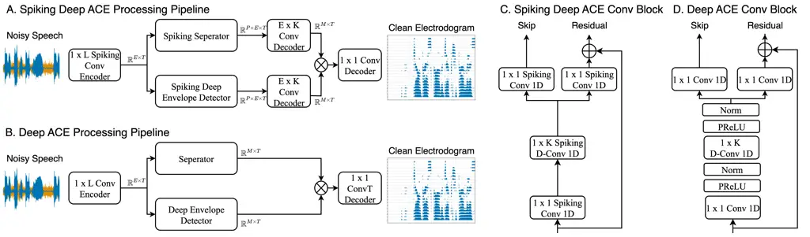
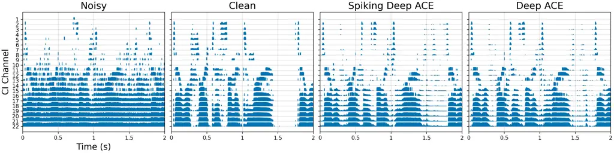
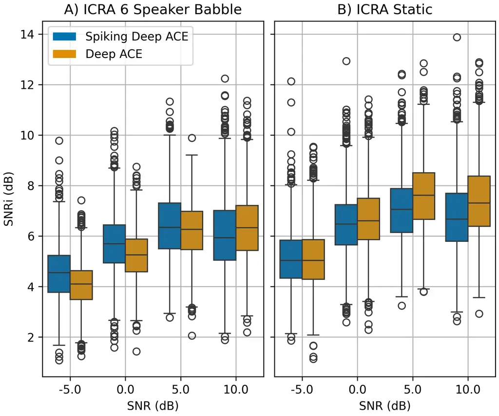
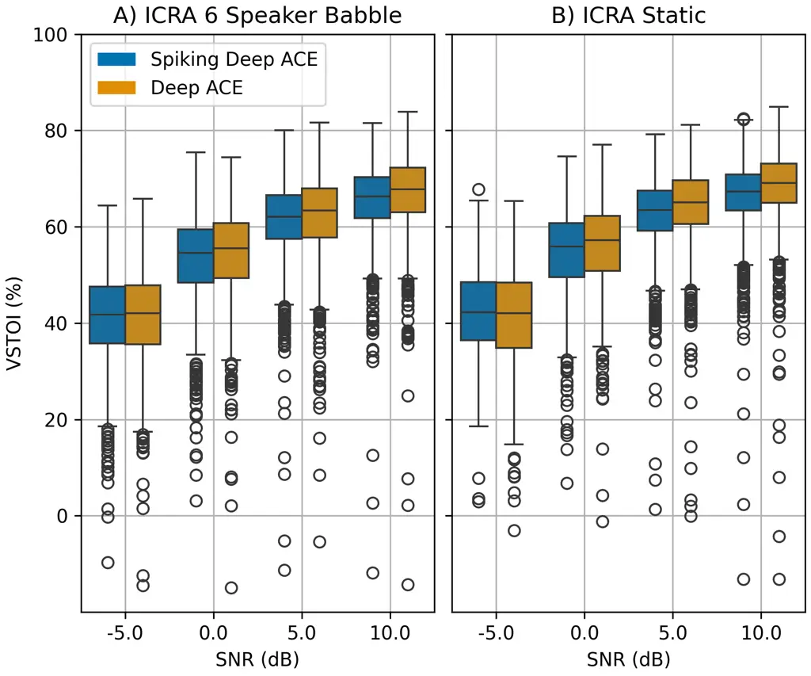
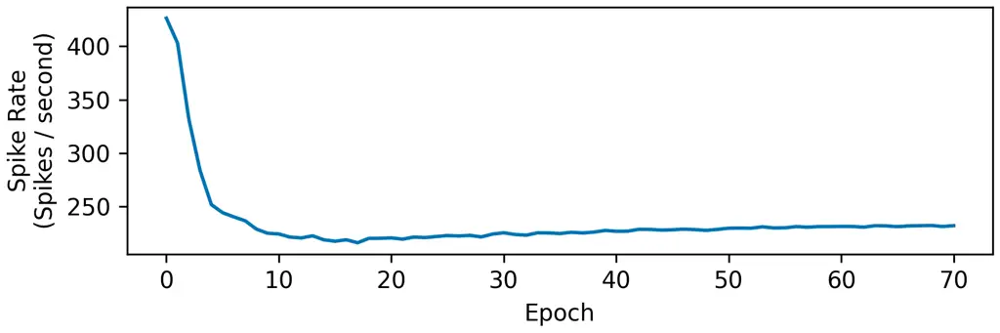

# LOW-POWER END-TO-END COCHLEAR IMPLANT SPEECH DENOISING WITH SPIKING NEURAL NETWORKS

Ludovic Boulanger    Sean U N Wood ^(†)^(†)thanks: This work was enabled
in part by support from the Quebec Research Fund
(https://doi.org/10.69777/365045), Ministry of Economy, Innovation and
Energy, Calcul Québec (calculquebec.ca), the Digital Research Alliance
of Canada (alliancecan.ca), and the University of
Sherbrooke.^(†)^(†)thanks: © 2026 IEEE. Personal use of this material is
permitted. Permission from IEEE must be obtained for all other uses, in
any current or future media, including reprinting/republishing this
material for advertising or promotional purposes, creating new
collective works, for resale or redistribution to servers or lists, or
reuse of any copyrighted component of this work in other works. DOI:
https://doi.org/10.1109/ICASSP55912.2026.11464775

###### Abstract

Cochlear implants (CI) restore hearing for individuals with severe to
profound hearing loss. However, CI users often struggle to understand
speech in noisy environments. Deep neural networks (DNN) have shown
promise in enhancing speech for CI users, yet their high energy demands
make them non-ideal for low-power CI processors. Spiking neural networks
(SNN), on the other hand, offer comparable performance with
significantly lower energy consumption. Hence, we propose a novel SNN
inspired by the Deep ACE architecture that simultaneously performs
speech enhancement and CI coding. Our model achieves competitive vocoded
short-time objective intelligibility (VSTOI) and signal-to-noise ratio
improvement (SNRi) scores compared to Deep ACE, while achieving more
than a sixfold reduction in energy consumption.

###### Index Terms: 

Cochlear implants, Advanced combination encoder (ACE), Neuromorphic
computing, Spiking neural networks, End-to-end speech processing

^(†)^(†)address: Department of Electrical and Computer Engineering  
University of Sherbrooke, QC, Canada

## 1 Introduction

Cochlear implants (CI) are a revolutionary medical device that allow the
restoration of hearing in people with moderate to severe hearing loss
\[15\]. While effective in quiet settings, CI users struggle to
understand speech in noisy environments due to the absence of temporal
fine structure and spectral smearing caused by the implant \[8\].

Traditional single channel speech enhancement algorithms such as
time-frequency masking \[5\], spectral subtraction \[28\] and subspace
algorithms \[16\] have been developed to address CI limitations. While
they offer good performance in the presence of stationary noise, their
performance degrades when exposed to non-stationary noise types \[4\].

More recently, deep neural networks (DNN) have proven their capacity for
enhancing speech masked by non-stationary noises \[3, 19, 9\]. Despite
promising results, DNNs require a large amount of energy to function
making them non-ideal for low-power processors such as those found in a
CI.

In contrast to DNNs, spiking neural networks (SNN) are a type artificial
neural network (ANN) more closely inspired by the biological brain. SNNs
process information in a sparse, binary and event-based manner making
them significantly less power demanding than their DNN equivalents. In
fact, it has been shown that SNNs can achieve orders of magnitude less
energy consumption than their DNN equivalent when programmed on
specialized neuromorphic hardware \[6\]. SNNs have already shown great
promise in the field of speech enhancement \[21, 11, 22, 2\], but have
yet to be applied directly to CIs.

In this paper, we propose Spiking DeepACE¹¹ 1 Source code available at
https://github.com/NECOTIS/spiking-deep-ace, an SNN inspired by Deep ACE
\[9\] that integrates the speech denoising in the CI processing
pipeline. This paper is organized as follows, Section 2 presents the
relevant background information and the proposed Spiking Deep ACE
algorithm. Section 3 presents the experimental setup used to train and
evaluate Spiking Deep ACE and Deep ACE for comparison. The results are
then presented in Section 4, followed by a conclusion in Section 5.

## 2 Spiking Deep ACE



Figure 1: A) Spiking Deep ACE processing pipeline. B) Deep ACE
processing pipeline. C) Convolutional blocks used in Spiking Deep ACE.
D) Convolutional blocks used in Deep ACE.

### 2.1 Deep ACE

The Deep ACE architecture was created in order to integrate speech
denoising into the advanced combination encoder (ACE) sound coding
strategy \[20\] (see Figure 1 (B)). It is built upon the Conv-TasNet
architecture for speaker separation \[18\]. The main additions were an
antirectifier unit in the encoder, a deep envelope detector (DED) in the
skip path and a change in the output dimensions of the decoder. This
allowed Deep ACE to efficiently denoise speech and predict the correct
CI stimulation patterns while maintaining the $`2\text{\,}\mathrm{ms}`$
algorithmic latency of the standard ACE coding strategy \[9\]. These CI
stimulation patterns can be represented with electrodograms in which the
intensity of stimulation through time is represented for each CI channel
(see Figure 2).

### 2.2 Spiking Neurons

SNNs are composed of neuron models that more closely mimic the
biological neuron than traditional ANN neurons. One of most popular
model is the Leaky Integrate and Fire (LIF) model due to its simplicity
\[13\]. In addition to its synaptic weights, the LIF model contains two
other learnable parameters. The _membrane leak constant_ determines the
rate at which the membrane potential decays back to its resting state
and the _threshold_ determines the level of the membrane potential which
causes an output spike.

Recently, a variation of the LIF was proposed by \[2\] known as the
ParaLIF. The ParaLIF seperates the membrane potential dynamics from the
spike emission by removing the reset mecanism. This allows for parallel
processing over time, providing orders of magnitude gains in training
time compared to previous approaches \[1\]. In this study, we use the
ParaLIF-Threshold variant of the ParaLIF \[1\].

### 2.3 Spiking Deep ACE

Figure 1 presents the processing pipeline for Spiking Deep ACE and
highlights the three major differences between the proposed Spiking Deep
ACE and Deep ACE. Firstly, the complexity of the convolutional blocks
was greatly reduced (see Figure 1 (C) and 1 (D)). In fact, preliminary
experiments showed that the normalization layers did not provide any
benefit to Spiking Deep ACE. Moreover, the spiking functions in ParaLIF
neurons already act as a non-linearity removing the need for activation
functions such as the PReLU used in Deep ACE.

Finally, Spiking Deep ACE’s seperator and DED outputs are upsampled by a
factor of $`P`$. This increases the number of features usable by the
convolutional decoders to create the mask and the time-frequency
representation allowing for superior denoising capabilities in
comparison to no upsampling.

## 3 Experimental Setup



Figure 2: Example of predicted electrodograms by each of the models as
well as the clean and noisy electrodograms for reference.

### 3.1 Datasets

The dataset used to train and test the models in this study is a
publicly available dataset presented in \[25, 26\]. The training set
contains approximately 10 hours of noisy speech from 28 speakers (14
males and 14 females) at SNR levels of $`0\text{\,}\mathrm{dB}`$,
$`5\text{\,}\mathrm{dB}`$, $`10\text{\,}\mathrm{dB}`$ and
$`15\text{\,}\mathrm{dB}`$ as well as the corresponding clean speech. We
randomly mixed the speakers from the training set and split them to have
80% and 20% of the speakers of each sex in the training and validation
sets respectively. All audio data was then resampled to
$`16\text{\,}\mathrm{kHz}`$ and split into two-second segments.

To test the models, we used synthesized unmodulated random Gaussian
noise (ICRA static) and synthesized 6-speaker babble noise (ICRA babble)
\[7\], following \[9\]. These noise signals were mixed with the clean
testing set speech from \[25\] at SNR levels of
$`-5\text{\,}\mathrm{dB}`$, $`0\text{\,}\mathrm{dB}`$,
$`5\text{\,}\mathrm{dB}`$ and $`10\text{\,}\mathrm{dB}`$ using the code
from \[17\].

### 3.2 Model Training

Table 1 summarizes the hyperparameters used to train Deep ACE and
Spiking Deep ACE. To ensure a valid comparison between Deep ACE and
Spiking Deep ACE, Deep ACE was trained on the dataset described in
section 3.1 with the same hyperparameters as in \[9\]. Given the
additional neuronal parameters in the ParaLIF model and the greater
number of neurons in the separator and DED outputs of Spiking Deep ACE
than Deep ACE, a hyperparameter optimization was run in order to find
the values $`B`$, $`Sc`$, $`H`$, $`X`$, $`R`$ that result in the best
performance on the validation set for Spiking Deep ACE, while
maintaining a parameter count less than or equal to that of Deep ACE.

|                |          |                  |
| -------------- | -------- | ---------------- |
| Hyperparameter | Deep ACE | Spiking Deep ACE |
| N              | 64       | 128              |
| L              | 32       | 32               |
| B              | 64       | 64               |
| Sc             | 32       | 64               |
| H              | 128      | 64               |
| P              | 3        | 3                |
| X              | 3        | 6                |
| R              | 8        | 4                |
| \#Parameters   | 552k     | 437k             |

Table 1: Hyperparameters used in Deep ACE and Spiking Deep ACE.

In terms of loss functions, Deep ACE uses a combination of a mean square
error (MSE) between the clean electrodogram and the decoder output and a
binary cross-entropy (BCE) between the ideal mask and the seperator
output \[9\]. For Spiking Deep ACE, we only used the MSE loss as this
was found to provide better results. Both models used the Adam optimizer
\[14\] with a learning rate of $`10^{-3}`$ and a learning rate scheduler
to decrease the learning rate if the performance did not improve by a
factor of $`10^{-4}`$ for 5 epochs.

### 3.3 Performance Evaluation

The first metric used to evaluate the model is the signal-to-noise ratio
improvement (SNRi) \[9\]. SNRi is computed in the electrodogram domain
and measures the difference in SNR between the noisy electrodogram and
the denoised electrodogram \[9\].

The second metric used is the vocoded short-time objective
intelligibility (VSTOI) \[27\]. VSTOI is based on the STOI metric \[23\]
and is used to estimate the intelligibility of the speech predicted by
the models. In order to compute VSTOI, the predicted electrodogram was
first re-synthesized as in \[9\]. The STOI was then computed using the
synthesized speech and the clean unprocessed speech as the reference
signal.



(a)



(b)

Figure 3: a) Box plots showing the VSTOI scores for both models on the
ICRA babble and ICRA static test sets. b) Box plots showing the SNRi
scores for both models on the same test sets as in a). In both a) and
b), the center bar in each box represents the median score. The top and
bottom edges of the box represent the third and first quartile
respectively. The box whiskers extend to 1.5 times the inter-quartile
range (IQR). Circles indicate results outside of 1.5 times the IQR.

### 3.4 Energy Evaluation

The method to estimate the energy consumption of both models is based on
the one used by \[21\]. The number of operations required for a
convolutional layer is given by equation 1,

```math
O=\frac{C_{in}}{G}\times K_{W}\times K_{H}\times C_{out}\times H_{out}\times T_{out} \tag{1}
```

where $`O`$ is the number of operations, $`C_{in}`$ is the number of
input channels, $`G`$ is the number of groups, $`K_{W}`$ is the kernel
width, $`K_{H}`$ is the kernel height, $`C_{out}`$ is the number of
output channels, $`H_{out}`$ is the height of the output and $`T_{out}`$
is the number of time steps in the output. Since ANNs perform a
multiply-and-accumulate (MAC) operation at every time step, the energy
required for the synaptic operations in a layer is given by equation 2,

```math
E_{ANN}=O\times C_{MAC} \tag{2}
```

where $`E_{ANN}`$ is the energy for the ANN layer and $`C_{MAC}`$ costs
of a MAC operation on a CMOS $`45\text{\,}\mathrm{nm}`$ technology
\[12\].

On the other hand, ParaLIF neurons only perform a floating point
addition when there is an input spike at a given time step, but still
need to update their internal state at every time step. This update
costs an order of magnitude more than a floating point addition \[24\].
Therefore, the energy required for an SNN layer is given by equation 3,

```math
E_{SNN}=\frac{\overline{S}}{T_{out}}\times O\times C_{ADD}+T_{out}\times N\times 10\times C_{ADD} \tag{3}
```

where $`E_{SNN}`$ represents the energy for the SNN layer,
$`\overline{S}`$ is the mean input spike rate for the layer, $`C_{ADD}`$
is the cost of a floating point addition operation on a CMOS
$`45\text{\,}\mathrm{nm}`$ technology \[12\] and $`N`$ is the number of
neurons in the layer.

The total energy of the network is computed by summing equation 2 over
all layers that process floating point values, and equation 3 over all
layers that process spikes.

## 4 Results and Discussion

### 4.1 Performance Results

Figure 3 presents the SNRi and VSTOI scores obtained for both Spiking
Deep ACE and Deep ACE on the ICRA static and ICRA babble noise types
across various SNR levels. The results show that Spiking Deep ACE is
able to achieve competitive performance with Deep ACE accoss all noise
types and SNR levels. In fact, Spiking Deep ACE outperforms Deep ACE in
the lower SNRs of the ICRA static test set. In the other cases, Spiking
Deep ACE’s mean SNRi stays well within $`0.5\text{\,}\mathrm{dB}`$ of
Deep ACE’s SNRi.

Similarly, Spiking Deep ACE’s VSTOI scores stays competitive with those
of Deep ACE in all SNRs and noise types. In fact, Spiking Deep ACE’s
VSTOI stays within 2% of Deep ACE’s VSTOI in all of the SNR levels.

### 4.2 Energy Results

Table 2 shows the considerable energy gains that Spiking Deep ACE
achieves over Deep ACE. Notably, Spiking Deep ACE maintains competitive
performance with Deep ACE while consuming more than 6 times less energy.



Figure 4: Evolution of the mean spike rate per neuron during training.
Since the sampling rate of the network is $`1\text{\,}\mathrm{kHz}`$, a
spike rate of 250 spikes / second implies one spike every 4 time steps.

| Model            | VSTOI (%) | SNRi (dB) | Energy ($`\mu J/s`$) |
| ---------------- | --------- | --------- | -------------------- |
| Spiking Deep ACE | 56        | 6.0       | 372                  |
| Deep ACE         | 57        | 6.1       | 2461                 |

Table 2: Results and energy comparison between Deep ACE and Spiking Deep
ACE on the ICRA babble and ICRA static test sets combined.

We note that equation 3 does not include the energy costs for data
transfers to and from memory. These transactions account for the large
majority of energy in ANNs and SNNs \[10\]. However, in addition to
having less parameters than Deep ACE, Spiking Deep ACE is intrinsically
sparse (see Figure 4). Thus, Spiking Deep ACE requires less memory
transfers than Deep ACE allowing for additional energy gains.

## 5 Conclusion

In this paper, we have proposed an SNN capable of end-to-end speech
denoising and CI coding. The proposed Spiking Deep ACE model was
compared to the Deep ACE model in terms of VSTOI, SNRi and energy
consumption. It was shown that our approach achieved competitive results
in comparison to Deep ACE while consuming considerably less energy than
Deep ACE, highlighting its potential for low-power CI processors.

## References

- \[1\] S. Y. A. Yarga and S. U. N. Wood (2025) Accelerating spiking
  neural networks with parallelizable leaky integrate-and-fire
  neurons$`{}^{\textrm{*}}`$. Neuromorphic Computing and Engineering 5
  (1), pp. 014012 (en). External Links: ISSN 2634-4386,
  [Link](https://iopscience.iop.org/article/10.1088/2634-4386/adb7fe),
  [Document](https://dx.doi.org/10.1088/2634-4386/adb7fe) Cited by:
  §2.2.
- \[2\] S. Y. A. Yarga and S. U. N. Wood (2025) End-to-end neuromorphic
  speech enhancement with PDM microphones$`{}^{\textrm{*}}`$.
  Neuromorphic Computing and Engineering 5 (3), pp. 034009 (en).
  External Links: ISSN 2634-4386,
  [Link](https://iopscience.iop.org/article/10.1088/2634-4386/adf2d4),
  [Document](https://dx.doi.org/10.1088/2634-4386/adf2d4) Cited by: §1,
  §2.2.
- \[3\] A. Borjigin, K. Kokkinakis, H. M. Bharadwaj, and J. S.
  Stohl (2024) Deep learning restores speech intelligibility in
  multi-talker interference for cochlear implant users. Scientific
  Reports 14 (1), pp. 13241 (en). External Links: ISSN 2045-2322,
  [Link](https://www.nature.com/articles/s41598-024-63675-8),
  [Document](https://dx.doi.org/10.1038/s41598-024-63675-8) Cited by:
  §1.
- \[4\] F. Chen, Y. Hu, and M. Yuan (2015) Evaluation of Noise Reduction
  Methods for Sentence Recognition by Mandarin-Speaking Cochlear Implant
  Listeners. Ear & Hearing 36 (1), pp. 61–71 (en). External Links: ISSN
  0196-0202, [Link](https://journals.lww.com/00003446-201501000-00007),
  [Document](https://dx.doi.org/10.1097/AUD.0000000000000074) Cited by:
  §1.
- \[5\] R. A. Chiea, M. H. Costa, and J. A. Cordioli (2021) An Optimal
  Envelope-Based Noise Reduction Method for Cochlear Implants: An Upper
  Bound Performance Investigation. IEEE/ACM Transactions on Audio,
  Speech, and Language Processing 29, pp. 1729–1739 (en). External
  Links: ISSN 2329-9290, 2329-9304,
  [Link](https://ieeexplore.ieee.org/document/9420255/),
  [Document](https://dx.doi.org/10.1109/TASLP.2021.3076363) Cited by:
  §1.
- \[6\] M. Davies, A. Wild, G. Orchard, Y. Sandamirskaya, G. A. F.
  Guerra, P. Joshi, P. Plank, and S. R. Risbud (2021) Advancing
  Neuromorphic Computing With Loihi: A Survey of Results and Outlook.
  Proceedings of the IEEE 109 (5), pp. 911–934 (en). External Links:
  ISSN 0018-9219, 1558-2256,
  [Link](https://ieeexplore.ieee.org/document/9395703/),
  [Document](https://dx.doi.org/10.1109/JPROC.2021.3067593) Cited by:
  §1.
- \[7\] W. A. Dreschler, H. Verschuure, C. Ludvigsen, and S.
  Westermann (2001) ICRA noises: artificial noise signals with
  speech-like spectral and temporal properties for hearing instrument
  assessment. international collegium for rehabilitative audiology.
  Audiology. Cited by: §3.1.
- \[8\] Q. Fu and G. Nogaki (2005) Noise Susceptibility of Cochlear
  Implant Users: The Role of Spectral Resolution and Smearing. Journal
  of the Association for Research in Otolaryngology 6 (1), pp. 19–27
  (en). External Links: ISSN 1525-3961, 1438-7573,
  [Link](http://link.springer.com/10.1007/s10162-004-5024-3),
  [Document](https://dx.doi.org/10.1007/s10162-004-5024-3) Cited by: §1.
- \[9\] T. Gajecki, Y. Zhang, and W. Nogueira (2023) A Deep Denoising
  Sound Coding Strategy for Cochlear Implants. IEEE Transactions on
  Biomedical Engineering 70 (9), pp. 2700–2709 (en). External Links:
  ISSN 0018-9294, 1558-2531,
  [Link](https://ieeexplore.ieee.org/document/10083222/),
  [Document](https://dx.doi.org/10.1109/TBME.2023.3262677) Cited by: §1,
  §1, §2.1, §3.1, §3.2, §3.2, §3.3, §3.3.
- \[10\] S. Han, J. Pool, J. Tran, and W. Dally (2015) Learning both
  Weights and Connections for Efficient Neural Network. Advances in
  Neural Information Processing Systems 28 (en). Cited by: §4.2.
- \[11\] X. Hao, C. Ma, Q. Yang, K. C. Tan, and J. Wu (2024) When Audio
  Denoising Meets Spiking Neural Network. In 2024 IEEE Conference on
  Artificial Intelligence (CAI), Singapore, Singapore, pp. 1524–1527
  (en). External Links: ISBN 979-8-3503-5409-6,
  [Link](https://ieeexplore.ieee.org/document/10605482/),
  [Document](https://dx.doi.org/10.1109/CAI59869.2024.00275) Cited by:
  §1.
- \[12\] M. Horowitz (2014) 1.1 Computing’s energy problem (and what we
  can do about it). In 2014 IEEE International Solid-State Circuits
  Conference Digest of Technical Papers (ISSCC), San Francisco, CA, USA,
  pp. 10–14 (en). External Links: ISBN 978-1-4799-0920-9
  978-1-4799-0918-6,
  [Link](http://ieeexplore.ieee.org/document/6757323/),
  [Document](https://dx.doi.org/10.1109/ISSCC.2014.6757323) Cited by:
  §3.4, §3.4.
- \[13\] E. M. Izhikevich (2004) Which Model to Use for Cortical Spiking
  Neurons?. IEEE Transactions on Neural Networks 15 (5), pp. 1063–1070
  (en). External Links: ISSN 1045-9227,
  [Link](http://ieeexplore.ieee.org/document/1333071/),
  [Document](https://dx.doi.org/10.1109/TNN.2004.832719) Cited by: §2.2.
- \[14\] D. P. Kingma and J. Ba (2017) Adam: A Method for Stochastic
  Optimization. arXiv (en). Note: arXiv:1412.6980 \[cs\] External Links:
  [Link](http://arxiv.org/abs/1412.6980),
  [Document](https://dx.doi.org/10.48550/arXiv.1412.6980) Cited by:
  §3.2.
- \[15\] A. Kral, F. Aplin, and M. H. (2021) Prostheses for the brain:
  introduction to neuroprosthetics. Academic Press, London, United
  Kingdom. Cited by: §1.
- \[16\] P. C. Loizou, A. Lobo, and Y. Hu (2005) Subspace algorithms for
  noise reduction in cochlear implants. The Journal of the Acoustical
  Society of America 118 (5), pp. 2791–2793 (en). External Links: ISSN
  0001-4966, 1520-8524,
  [Link](https://pubs.aip.org/jasa/article/118/5/2791/897003/Subspace-algorithms-for-noise-reduction-in),
  [Document](https://dx.doi.org/10.1121/1.2065847) Cited by: §1.
- \[17\] P. C. Loizou (2013) SPEECH enhancement: theory and practice.
  CRC Press, Boca Raton. Cited by: §3.1.
- \[18\] Y. Luo and N. Mesgarani (2019) Conv-TasNet: Surpassing Ideal
  Time–Frequency Magnitude Masking for Speech Separation. IEEE/ACM
  Transactions on Audio, Speech, and Language Processing 27 (8),
  pp. 1256–1266 (en). External Links: ISSN 2329-9290, 2329-9304,
  [Link](https://ieeexplore.ieee.org/document/8707065/),
  [Document](https://dx.doi.org/10.1109/TASLP.2019.2915167) Cited by:
  §2.1.
- \[19\] N. Mamun and J. H. L. Hansen (2024) Speech Enhancement for
  Cochlear Implant Recipients Using Deep Complex Convolution Transformer
  With Frequency Transformation. IEEE/ACM Transactions on Audio, Speech,
  and Language Processing 32, pp. 2616–2629 (en). External Links: ISSN
  2329-9290, 2329-9304,
  [Link](https://ieeexplore.ieee.org/document/10443501/),
  [Document](https://dx.doi.org/10.1109/TASLP.2024.3366760) Cited by:
  §1.
- \[20\] W. Nogueira, A. Büchner, T. Lenarz, and B. Edler (2005) A
  Psychoacoustic “NofM”-Type Speech Coding Strategy for Cochlear
  Implants. EURASIP Journal on Advances in Signal Processing 2005 (18),
  pp. 101672 (en). External Links: ISSN 1687-6180,
  [Link](https://asp-eurasipjournals.springeropen.com/articles/10.1155/ASP.2005.3044),
  [Document](https://dx.doi.org/10.1155/ASP.2005.3044) Cited by: §2.1.
- \[21\] A. Riahi and É. Plourde (2023) Single Channel Speech
  Enhancement Using U-Net Spiking Neural Networks. In 2023 IEEE Canadian
  Conference on Electrical and Computer Engineering (CCECE), Regina, SK,
  Canada, pp. 111–116 (en). External Links: ISBN 979-8-3503-2397-9,
  [Link](https://ieeexplore.ieee.org/document/10288830/),
  [Document](https://dx.doi.org/10.1109/CCECE58730.2023.10288830) Cited
  by: §1, §3.4.
- \[22\] T. Sun and S. Bohté (2024) DPSNN: spiking neural network for
  low-latency streaming speech enhancement. Neuromorphic Computing and
  Engineering 4 (4), pp. 044008 (en). External Links: ISSN 2634-4386,
  [Link](https://iopscience.iop.org/article/10.1088/2634-4386/ad93f9),
  [Document](https://dx.doi.org/10.1088/2634-4386/ad93f9) Cited by: §1.
- \[23\] C. H. Taal, R. C. Hendriks, R. Heusdens, and J. Jensen (2010) A
  short-time objective intelligibility measure for time-frequency
  weighted noisy speech. In 2010 IEEE International Conference on
  Acoustics, Speech and Signal Processing, Dallas, TX, USA,
  pp. 4214–4217 (en). External Links: ISBN 978-1-4244-4295-9,
  [Link](https://ieeexplore.ieee.org/document/5495701/),
  [Document](https://dx.doi.org/10.1109/ICASSP.2010.5495701) Cited by:
  §3.3.
- \[24\] J. Timcheck, S. B. Shrestha, D. B. D. Rubin, A. Kupryjanow, G.
  Orchard, L. Pindor, T. Shea, and M. Davies (2023) The Intel
  neuromorphic DNS challenge. Neuromorphic Computing and Engineering 3
  (3), pp. 034005 (en). External Links: ISSN 2634-4386,
  [Link](https://iopscience.iop.org/article/10.1088/2634-4386/ace737),
  [Document](https://dx.doi.org/10.1088/2634-4386/ace737) Cited by:
  §3.4.
- \[25\] C. Valentini-Botinhao (2017) Noisy speech database for training
  speech enhancement algorithms and TTS models. University of Edinburgh.
  School of Informatics. Centre for Speech Technology Research (CSTR).
  External Links:
  [Document](https://dx.doi.org/https%3A//doi.org/10.7488/ds/2117) Cited
  by: §3.1, §3.1.
- \[26\] C. Valentini-Botinhao, X. Wang, S. Takaki, and J.
  Yamagishi (2016) Speech Enhancement for a Noise-Robust Text-to-Speech
  Synthesis System Using Deep Recurrent Neural Networks. In Interspeech
  2016, pp. 352–356 (en). External Links:
  [Link](https://www.isca-archive.org/interspeech_2016/valentinibotinhao16_interspeech.html),
  [Document](https://dx.doi.org/10.21437/Interspeech.2016-159) Cited by:
  §3.1.
- \[27\] G. Watkins (2022) Predicting Speech Intelligibility for
  Individual Cochlear Implant Recipients. The Hearing Journal 75 (5),
  pp. 20,21,24,25,26 (en). External Links: ISSN 0745-7472,
  [Link](https://journals.lww.com/10.1097/01.HJ.0000831136.08368.17),
  [Document](https://dx.doi.org/10.1097/01.HJ.0000831136.08368.17) Cited
  by: §3.3.
- \[28\] L. Yang and Q. Fu (2005) Spectral subtraction-based speech
  enhancement for cochlear implant patients in background noise. The
  Journal of the Acoustical Society of America 117 (3), pp. 1001–1004
  (en). External Links: ISSN 0001-4966, 1520-8524,
  [Link](https://pubs.aip.org/jasa/article/117/3/1001/544207/Spectral-subtraction-based-speech-enhancement-for),
  [Document](https://dx.doi.org/10.1121/1.1852873) Cited by: §1.
