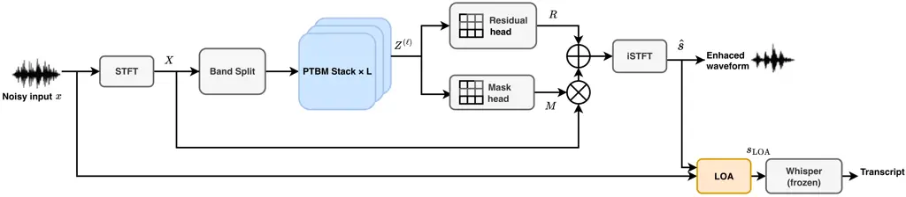
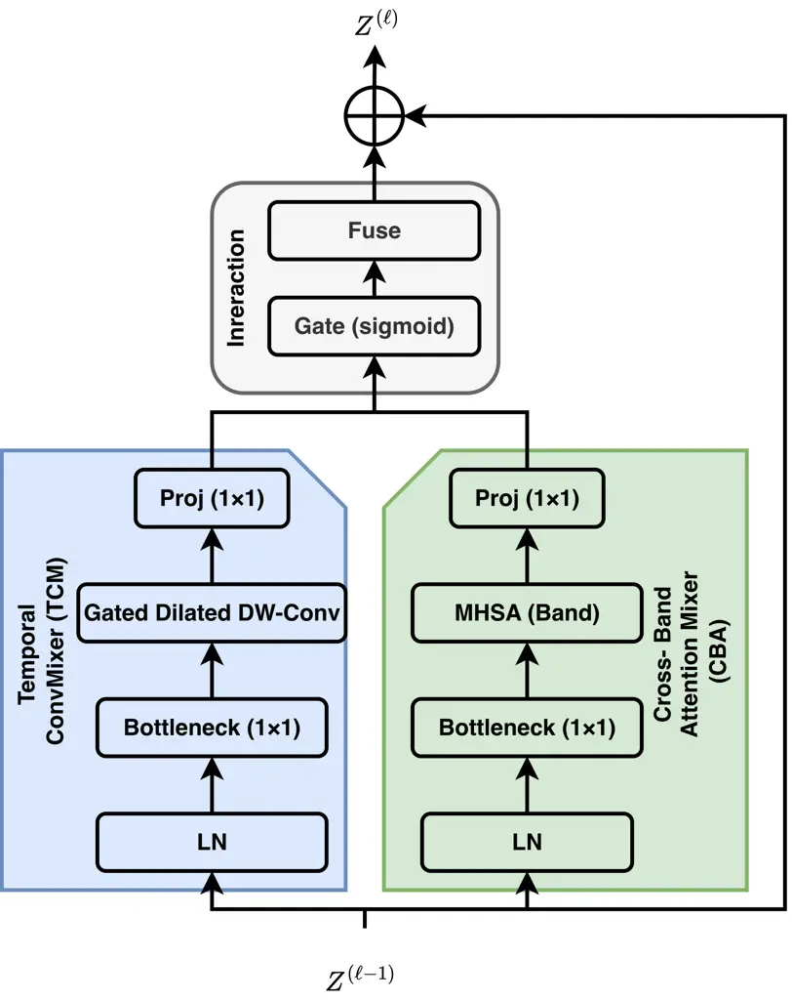

Shen Wang Zhu Champagne

# Parallel Time–Band Mixing with Learned Observation-Adding for Robust ASR Front-Ends

Xingyu    Runze    Wei-Ping    Benoit

###### Abstract

Speech enhancement is often used as a front-end for robust ASR, yet
recurrent temporal and cross-band modules introduce sequential
dependencies that reduce parallel efficiency. In this paper, we present
a sequence-parallel band-split enhancement front-end built on a Parallel
Time–Band Mixer (PTBM) block that eliminates within-block recurrent
unrolling. PTBM integrates intra-band temporal mixing and per-frame
cross-band attention within a unified parallel architecture, enabling
efficient contextual modeling across both time and frequency dimensions.
The system retains the mask-plus-residual reconstruction interface and
introduces learned Observation-Adding (LOA) to suppress ASR-sensitive
artifacts without development-set tuning. Experiments on DNS Challenge
and CHiME-4 with frozen Whisper back-ends show that the proposed
front-end consistently reduces word error rate relative to recurrent
band-split baselines while requiring only 0.96 M parameters and
0.58 GMAC/s for the front-end network.

###### keywords

speech enhancement, robust ASR, band-split, mixer, temporal convolution,
cross-band attention, observation-adding

^(†)^(†)address: ¹ Department of Electrical and Computer Engineering,
Concordia University, Canada  
² Department of Electrical and Computer Engineering, McGill University,
Canada  
³ Artificial Intelligence Research Institute, Shenzhen University of
Advanced Technology, China ^(†)^(†)email: xingyu.shen@mail.concordia.ca,
runze.wang@mail.concordia.ca, weiping@ece.concordia.ca,
benoit.champagne@mcgill.ca

## 1 Introduction

Robust automatic speech recognition (ASR) remains challenging under
real-world noise and reverberation. Deep learning-based enhancement and
separation have therefore become a standard component in robust speech
pipelines, especially when the recognizer is fixed or difficult to
retrain \[1\]. A common practice is to place a speech enhancement (SE)
model as a front-end to suppress interference before recognition,
allowing the ASR back-end to remain fixed. In practice, front-end
enhancement is constrained by two factors: (1) enhancement artifacts can
degrade recognition performance even when speech quality appears
improved; (2) the front-end must remain computationally lightweight to
enable efficient inference and deployment.

Several recent works have revisited how to make SE beneficial to ASR
rather than only improving perceptual quality. Yang et al. proposed an
attentive recurrent network (ARN) operating in the time domain, while
Dissen et al. trained a small front-end adapter with ASR gradients to
better match a frozen recognizer \[2, 3\]. Hu et al. addressed
over-suppression via dual-path style learning, and Luo et al. proposed
pseudo-supervision to adapt SE models to real far-field recordings for
downstream speech recognition \[4, 5\]. More broadly, sequence-parallel
temporal convolution and attention models have shown that long-context
modeling can be achieved without recurrent unrolling, motivating
mixer-style designs for deployable speech front-ends \[6, 7\].

These efforts have revealed that ASR is sensitive to the type of
enhancement error. Iwamoto et al. decomposed enhancement errors and
showed that artifact components can dominate ASR degradation; they also
demonstrated that Observation-Adding (OA), which blends the observed and
enhanced signals, can mitigate artifacts and improve recognition
performance \[8\]. Guan et al. proposed loss designs that explicitly
reduce speech distortion and artifacts in enhancement outputs, while de
Oliveira et al. cautioned that over-optimizing a single enhancement
metric can be misleading for recognition performance, highlighting the
need for design choices aligned with downstream ASR objectives \[9,
10\].

Band-split enhancement architectures provide a strong low-distortion
backbone for ASR front-ends. Yu et al. introduced Band-split RNN
(BSRNN), which alternates temporal modeling and cross-band modeling to
improve full-band reconstruction quality \[11\]. To reduce the overhead
of such front-ends, Zhao et al. proposed frame resampling and
progressive sub-band pruning on top of BSRNN to lower computation while
maintaining robust ASR performance \[12\]. Despite these advances,
BSRNN-style front-ends still rely on recurrent computation for both
temporal and cross-band modeling, which introduces sequential
dependencies and reduces parallel efficiency. Meanwhile, recent work on
multichannel enhancement suggests that parallelizable sequence modeling
with cross-domain interaction is a promising direction for efficient
utterance-level systems \[13\].

Motivated by the above considerations, we propose a sequence-parallel
band-split SE front-end for robust ASR. Our contributions are threefold:

- •
  We develop the Parallel Time–Band Mixer (PTBM), which combines
  intra-band temporal convolutional mixing and per-frame cross-band
  self-attention in a unified parallel architecture, eliminating
  within-block sequential dependencies and enabling efficient
  sequence-parallel processing.
- •
  We introduce learned Observation-Adding (LOA), a lightweight adaptive
  blending mechanism that automatically predicts OA coefficients,
  thereby eliminating the need for development-set tuning.
- •
  On DNS Challenge and CHiME-4 with frozen Whisper back-ends, the
  proposed front-end consistently reduces WER relative to recurrent
  band-split baselines while requiring only 0.96 M parameters and
  0.58 GMAC/s.

## 2 Proposed Method



Figure 1: End-to-end pipeline of the proposed speech-enhancement
front-end for robust ASR. The system performs band-split time–band
modeling with stacked mixer blocks, reconstructs an enhanced waveform
using a mask-plus-residual interface, and applies LOA before a frozen
Whisper recognizer.

### 2.1 Overall Architecture

Figure 1 shows the end-to-end pipeline. Given a noisy single-channel
waveform $`x`$, we compute its complex STFT $`X`$ and partition the
frequency bins of $`X`$ into $`K`$ non-overlapping sub-bands using a
predefined (non-uniform) V4 partition \[12\]. For each sub-band, we form
a real-valued feature by concatenating the real and imaginary parts and
applying a band-wise linear embedding, yielding a band-split
representation $`Z^{(0)}`$. We process $`Z^{(0)}`$ using a stack of
$`L`$ Parallel Time–Band Mixer (PTBM) blocks to obtain $`Z^{(L)}`$. Each
PTBM block uses gated dilated depthwise temporal convolutions for
intra-band temporal mixing (TCM) and per-frame self-attention over the
$`K`$ sub-bands for cross-band interaction (CBA), avoiding within-block
recurrent unrolling. Two prediction heads map $`Z^{(L)}`$ to a complex
mask $`M`$ and a complex residual $`R`$, forming the mask-plus-residual
reconstruction interface. Applying inverse STFT yields an enhanced
waveform $`\hat{s}`$. Finally, the LOA module predicts a blending weight
$`\omega\in[0,1]`$ from signal statistics and produces
$`s_{\mathrm{LOA}}`$, a weighted sum of the input $`x`$ and the enhanced
estimate $`\hat{s}`$, which is then fed to a fixed ASR back-end with the
recognizer kept frozen.

### 2.2 Band Split and Reconstruction

Given the complex STFT $`X\in\mathbb{C}^{T\times F}`$, where $`T`$ and
$`F`$ denote the numbers of time frames and frequency bins,
respectively, we partition the frequency axis into $`K`$ non-overlapping
sub-bands with predefined (non-uniform) sizes $`\{F_{k}\}_{k=1}^{K}`$
satisfying $`\sum_{k=1}^{K}F_{k}=F`$. We follow the V4 configuration
in \[11, 12\]. Let $`X_{k}\in\mathbb{C}^{T\times F_{k}}`$ denote the
sub-band spectrogram extracted from $`X`$ by selecting the bins assigned
to sub-band $`k`$. For each sub-band and time frame, we concatenate the
real and imaginary parts of the STFT values across the $`F_{k}`$ bins to
form a real-valued feature and apply a band-specific linear layer to
obtain a $`C`$-channel embedding. Stacking the $`K`$ embeddings over
time yields $`Z^{(0)}\in\mathbb{R}^{B\times K\times T\times C}`$, where
$`B`$ is the batch size.

We adopt the mask-plus-residual reconstruction interface used in
BSRNN-style front-ends \[12\]. After processing $`Z^{(0)}`$ with $`L`$
PTBM blocks, each sub-band feature is passed through band-specific fully
connected layers to predict the real and imaginary parts of the complex
mask and residual for the bins in that sub-band. Concatenating the
predictions from all sub-bands yields $`M,R\in\mathbb{C}^{T\times F}`$
with the same shape as $`X`$. The enhanced spectrum is reconstructed by

```math
\hat{S}=M\odot X+R, \tag{1}
```

where $`\odot`$ denotes element-wise multiplication.

### 2.3 Parallel Time–Band Mixer Block (PTBM)

The core component of the proposed front-end is the PTBM block, whose
internal operation is detailed in Figure 2. Each block takes
$`Z^{(\ell-1)}\in\mathbb{R}^{B\times K\times T\times C}`$ as input and
outputs $`Z^{(\ell)}`$ with the same shape, where
$`\ell\in\{1,2,\cdots,L\}`$ indexes the block. PTBM contains two
branches that operate in parallel on $`Z^{(\ell-1)}`$: a Temporal
ConvMixer (TCM) branch for intra-band temporal mixing and a Cross-Band
Attention Mixer (CBA) branch for per-frame cross-band interaction. An
interaction module combines the two branch outputs, and a block-level
residual connection produces $`Z^{(\ell)}`$.



Figure 2: Structure of the PTBM block. The TCM branch and the CBA branch
run in parallel, followed by the interaction module and a residual
connection.

#### 2.3.1 Temporal ConvMixer (TCM)

The TCM branch performs temporal-context mixing within each sub-band.
For each sub-band independently, we apply layer normalization (LN)
followed by a point-wise bottleneck projection from $`C`$ to $`C_{b}`$,
where $`C_{b}`$ is the bottleneck channel dimension. We then apply gated
dilated depthwise 1D convolutions along the frame (time) index $`t`$
(i.e., the $`T`$ dimension in
$`Z^{(\ell-1)}\in\mathbb{R}^{B\times K\times T\times C}`$),
independently for each example in the batch and each sub-band, to
capture temporal context with low computational overhead. A point-wise
projection maps the features back to $`C`$, yielding the temporal-branch
output $`Z_{\text{time}}`$.

#### 2.3.2 Cross-Band Attention Mixer (CBA)

The CBA branch performs cross-band interaction at each time frame via
multi-head self-attention \[7\]. For each frame $`t`$, the $`K`$
sub-band vectors are treated as a token sequence. After layer
normalization (LN), we apply a point-wise bottleneck projection from
$`C`$ to $`C_{b}`$, compute multi-head self-attention across the $`K`$
tokens, and apply a point-wise projection back to $`C`$ to obtain the
cross-band output $`Z_{\text{band}}`$. Because attention is applied
independently for each frame, this branch is applied in parallel over
time frames.

#### 2.3.3 Interaction

The interaction module in Figure 2 fuses temporal and cross-band cues
using element-wise gating followed by fusion. Let $`Z_{\text{time}}`$
and $`Z_{\text{band}}`$ denote the outputs of the temporal and
cross-band branches, respectively. We compute the gate and the fused
representation by

```math
\displaystyle G \displaystyle=\sigma\bigl(\operatorname{Linear}([Z_{\text{time}};\,Z_{\text{band}}])\bigr), \tag{2}
```

```math
\displaystyle Z_{\text{fuse}} \displaystyle=G\odot Z_{\text{time}}+(1-G)\odot Z_{\text{band}},
```

```math
\displaystyle Z^{(\ell)} \displaystyle=Z^{(\ell-1)}+Z_{\text{fuse}}.
```

where $`[\cdot;\cdot]`$ concatenates features along the channel
dimension, $`\operatorname{Linear}(\cdot)`$ is a point-wise projection
shared across time frames and sub-bands, and $`\sigma(\cdot)`$ is a
sigmoid.

### 2.4 Learned Observation-Adding (LOA)

LOA is implemented as a two-layer multilayer perceptron (MLP) with a
ReLU hidden activation and a sigmoid output, taking summary statistics
computed from the observed waveform $`x`$ and the enhanced waveform
$`\hat{s}`$ as input. During training, these statistics are computed on
the same fixed-length training segment (random crop) used as the SE
input; during inference, they are computed on the full-length test
recording.

The input statistics consist of (i) a log-energy ratio
$`\rho_{E}=\log\frac{\|x\|_{2}^{2}+\epsilon}{\|\hat{s}\|_{2}^{2}+\epsilon}`$
and (ii) the mean and variance of a log-magnitude spectral difference;
here $`\epsilon`$ is a small constant for numerical stability (e.g.,
$`10^{-8}`$). Using the same analysis STFT as in Section 2.2, we compute
the log-magnitude spectral difference between the observed spectrum
$`X`$ and the enhanced spectrum $`\hat{S}`$ from Eq. (1) as
$`\Delta_{t,f}=\log(|X_{t,f}|+\epsilon)-\log(|\hat{S}_{t,f}|+\epsilon)`$.
We then compute $`\mu_{\Delta}=\mathrm{mean}_{t,f}(\Delta_{t,f})`$ and
$`\sigma_{\Delta}^{2}=\mathrm{var}_{t,f}(\Delta_{t,f})`$ over all
time–frequency bins of the current input (training segment or test
recording). We concatenate
$`(\rho_{E},\mu_{\Delta},\sigma_{\Delta}^{2})`$ as the MLP input and
predict the blending weight $`\omega\in[0,1]`$ via a sigmoid output.
These statistics capture both energy mismatch and spectral mismatch and
prevent degenerate solutions that only rescale the waveform amplitude.
LOA uses the resulting scalar weight to synthesize the enhanced speech
fed to the ASR:

```math
s_{\mathrm{LOA}}=\omega\,x+(1-\omega)\,\hat{s}. \tag{3}
```

LOA is trained in a second stage using oracle blending weights. We first
train the SE network with the signal-level objective in Section 2.5. We
then freeze the SE network and, for each training segment, compute a
signal-level oracle weight $`\omega^{\ast}\in[0,1]`$ by a 1D grid search
over the interval $`[0,1]`$ with a resolution of 0.01. The oracle weight
is selected as the value that minimizes the same signal-level loss
between the blended waveform
$`s_{\mathrm{blend}}(\omega)=\omega x+(1-\omega)\hat{s}`$ and the clean
reference waveform $`s`$. The LOA MLP is trained to regress
$`\omega^{\ast}`$ from the segment-level statistics using the
$`\ell_{2}`$ loss, which keeps LOA lightweight and
recognizer-independent. At inference time, LOA predicts a single
blending weight $`\omega`$ for each test recording, with the input
statistics computed over all STFT frames of that recording; thus, the
present LOA formulation is utterance-level rather than fully streaming.

### 2.5 Training Objective

We minimize a fixed weighted sum of the multi-resolution STFT magnitude
loss and the SI-SNR loss between the enhanced waveform $`\hat{s}`$ and
the clean reference $`s`$, following common practice in speech
enhancement and separation \[6, 14\]:

```math
\mathcal{L}=\mathcal{L}_{\text{MR-STFT}}(\hat{s},s)+\lambda\,\mathcal{L}_{\text{SI-SNR}}(\hat{s},s), \tag{4}
```

where $`\lambda`$ is a fixed weight. We use the standard MR-STFT
magnitude loss definition in \[14\] and the negative SI-SNR objective as
in \[6\]. This objective is fully compatible with the mask-plus-residual
reconstruction interface in Eq. (1).

## 3 Experimental Setup

### 3.1 Datasets

We evaluate the proposed SE front-end on two English benchmarks sampled
at 16 kHz: DNS Challenge \[15\] and CHiME-4 \[16\]. Following the
evaluation protocol in prior band-split front-end studies \[12\], we
train an SE front-end separately for each benchmark and report results
on the corresponding official test sets.

For CHiME-4, we report results on the official single-channel
real-recorded development and evaluation sets, dt05_real and et05_real
(1ch track) \[16\]. Following the online simulation protocol used in
\[12\], we generate training mixtures on-the-fly by mixing utterances
from tr05_simu_1ch with noise segments sampled from the DNS noise corpus
\[15\]. For each utterance, a noise segment is randomly cropped to match
the utterance duration and mixed at an SNR uniformly sampled from
$`[-5,20]`$ dB.

For DNS Challenge, we follow the ESPnet-SE recipe \[17\] to construct a
100-hour single-channel noisy-speech training set from the official DNS
resources \[15\]. Model selection is performed on the official DNS
validation set, and we report results on the official DNS synthetic test
sets under two conditions: without reverberation and with reverberation
\[12\].

| Method             | Params | MACs     | DNS Challenge  |        |       |             |        |       | CHiME-4         |        |       |                  |        |       |
| ------------------ | ------ | -------- | -------------- | ------ | ----- | ----------- | ------ | ----- | --------------- | ------ | ----- | ---------------- | ------ | ----- |
|                    |        |          | Without Reverb |        |       | With Reverb |        |       | Dev (dt05_real) |        |       | Eval (et05_real) |        |       |
|                    | (M)    | (GMAC/s) | Tiny           | Medium | Large | Tiny        | Medium | Large | Tiny            | Medium | Large | Tiny             | Medium | Large |
| Noisy              | –      | –        | 15.02          | 8.85   | 4.80  | 39.51       | 21.13  | 10.94 | 21.76           | 5.55   | 4.41  | 35.03            | 8.63   | 6.69  |
| DPARN \[18, 12\]   | 0.89   | 1.22     | –              | –      | –     | –           | –      | –     | 21.13           | 5.52   | 4.67  | 32.97            | 8.84   | 7.56  |
| BSRNN \[11\]       | 2.60   | 1.84     | 11.36          | 5.59   | 4.23  | 36.60       | 15.34  | 10.29 | 16.50           | 5.19   | 4.25  | 26.24            | 8.17   | 6.36  |
| Zhao et al. \[12\] | 1.55   | 0.62     | 11.76          | 5.72   | 4.40  | 36.87       | 15.61  | 10.90 | 16.72           | 5.31   | 4.35  | 27.12            | 8.30   | 6.40  |
| Ours               | 0.96   | 0.58     | 11.33          | 5.58   | 4.17  | 36.35       | 15.12  | 10.06 | 16.38           | 5.13   | 4.18  | 26.07            | 8.11   | 6.24  |

Table 1: Main ASR results and front-end complexity on DNS Challenge and
CHiME-4. WER (%) is reported using frozen Whisper back-ends
(Tiny/Medium/Large). Params (M) and MACs (GMAC/s) are reported for the
SE front-end only.

### 3.2 Training and Decoding

All SE front-ends are implemented in ESPnet \[17\] with the V4 band
partition ($`K{=}23`$) \[11, 12\] and the STFT analysis (32 ms Hann,
16 ms hop, 512-point FFT at 16 kHz). Unless noted, our model uses
$`L{=}12`$, $`C{=}128`$, $`C_{b}{=}48`$, TCM kernel size 3 with
dilations $`\{1,2,4,8\}`$, CBA with $`H{=}4`$, and a two-layer LOA MLP
(hidden 64, sigmoid output).

For each benchmark, we train a separate SE front-end for 54k steps using
Adam \[19\] (lr $`2\times 10^{-4}`$, $`\beta_{1}{=}0.9`$,
$`\beta_{2}{=}0.999`$) on 4 s random crops (batch 8) with Eq. (4)
($`\lambda{=}1.0`$). MR-STFT uses three resolutions (FFT/hop/win:
1024/120/600, 2048/240/1200, 512/50/240) \[14\]. We select the model
with the lowest validation loss on dt05*real (CHiME-4) or the DNS
validation set, then freeze the SE network and train LOA for 10k steps
with Adam (lr $`1\times 10^{-4}`$) using an $`\ell*{2}`$ regression loss
to oracle weights from the grid search in Section 2.4.

We use Whisper \[20\] as a frozen ASR back-end (Tiny/Medium/Large) and
decode without an external language model using the same decoding and
text normalization for all methods \[12\] (lowercasing, punctuation
removal, and whitespace normalization). Unless noted, ASR input is
$`s_{\mathrm{LOA}}`$; baselines use OA with $`\omega`$ tuned on the
corresponding development set \[8, 12\]. We report Word Error Rate (WER)
as the primary ASR metric, and quantify front-end efficiency using
Params and MACs (GMAC/s) for the SE network only.

## 4 Results and Discussion

### 4.1 Main results on DNS Challenge and CHiME-4

Table 1 reports WER and front-end complexity on DNS Challenge and
CHiME-4 using frozen Whisper back-ends with three model sizes
(Tiny/Medium/Large). Across all back-ends, the proposed front-end
achieves lower WER than the noisy input and both band-split baselines
(BSRNN \[11\] and the lightweight front-end of Zhao et al. \[12\]). The
improvements are consistent on DNS (with/without reverberation) and
transfer to real-recorded CHiME-4 sets (dt05_real and et05_real),
demonstrating robustness beyond the synthetic mixtures used for
training.

The table also highlights the accuracy–efficiency trade-off. Compared
with BSRNN, our model achieves lower WER with substantially fewer
parameters and lower MACs. Compared with Zhao et al. \[12\], our model
improves WER at similar or lower MACs.

### 4.2 Ablation study

Table 2 reports an ablation study using Whisper Large. Unless otherwise
noted, LOA is enabled to isolate architectural changes in the
enhancement front-end.

|                                       |        |          |         |        |         |
| ------------------------------------- | ------ | -------- | ------- | ------ | ------- |
| Configuration                         | Params | MACs     | DNS     | DNS    | CHiME-4 |
|                                       | (M)    | (GMAC/s) | w/o Rev | w/ Rev | Eval    |
| Proposed (Full)                       | 0.96   | 0.58     | 4.17    | 10.06  | 6.24    |
| w/o CBA                               | 0.70   | 0.49     | 4.62    | 11.15  | 6.88    |
| w/o TCM                               | 0.76   | 0.35     | 5.08    | 12.37  | 7.14    |
| w/o OA/LOA (use $`\hat{s}`$)          | 0.96   | 0.58     | 4.45    | 10.65  | 6.60    |
| w/ Fixed OA ($`\omega=0.2`$ on $`x`$) | 0.96   | 0.58     | 4.26    | 10.21  | 6.42    |
| Model Depth Scaling                   |        |          |         |        |         |
| $`L=6`$                               | 0.53   | 0.31     | 4.92    | 11.83  | 6.91    |
| $`L=9`$                               | 0.74   | 0.44     | 4.48    | 10.67  | 6.53    |
| $`L=15`$                              | 1.18   | 0.72     | 4.12    | 9.89   | 6.17    |

Table 2: Ablation study with Whisper Large. We analyze the contribution
of different components and the effect of model depth $`L`$. “Proposed
(Full)” uses $`L{=}12`$, TCM, CBA, and LOA.

Removing cross-band interaction (w/o CBA) consistently degrades WER on
DNS and CHiME-4, indicating that explicit per-frame cross-band modeling
helps preserve band-to-band structure that is important for recognition.
Removing temporal mixing (w/o TCM) leads to a larger degradation,
confirming that strong intra-band temporal context remains crucial for
suppressing non-stationary interference. Together, these results support
the PTBM design that combines temporal and cross-band mixing within each
block. Using the enhanced waveform directly as ASR input (w/o OA/LOA;
use $`\hat{s}`$) yields worse WER than applying OA, consistent with
prior observations that ASR is sensitive to enhancement artifacts \[8\].
A fixed OA weight improves robustness, while LOA achieves the best
performance without development-set coefficient tuning, simplifying
deployment across varying conditions. Increasing the number of PTBM
blocks $`L`$ improves WER with diminishing returns. Moving from
$`L{=}6`$ to $`L{=}12`$ yields substantial gains at moderate additional
cost, while $`L{=}15`$ provides only a small further improvement. We
therefore use $`L{=}12`$ as the default configuration to balance
recognition accuracy and front-end complexity.

### 4.3 Operator-level analysis

Table 3 compares the temporal and cross-band operators in recurrent
band-split blocks and in PTBM under the default configuration in
Section 3.2. TCM and CBA are sequence-parallel and have lower
per-invocation cost than gated recurrent unit (GRU)-based
temporal/cross-band modules, which aligns with the front-end MAC
reduction reported in Table 1.

| Module                       | Params | MACs  | Seq.-parallel |
| ---------------------------- | ------ | ----- | ------------- |
| Temporal GRU                 | 99k    | 98k   | No            |
| Temporal ConvMixer (TCM)     | 17k    | 17k   | Yes           |
| Cross-band GRU               | 99k    | 2.26M | No            |
| Cross-Band Attn. Mixer (CBA) | 22k    | 0.55M | Yes           |

Table 3: Operator complexity of temporal and cross-band modules under
the default configuration in Section 3.2. Params and MACs are reported
per module invocation (temporal modules per sub-band; cross-band modules
per time frame).

## 5 Conclusion

We presented a band-split sequence-parallel SE front-end built on PTBM
blocks that combines temporal convolution mixing and per-frame
cross-band attention without recurrent unrolling. We also introduced
LOA, an artifact-aware blending mechanism that eliminates the need for
development-set coefficient tuning. Across DNS Challenge and CHiME-4
benchmarks with frozen Whisper back-ends, the proposed front-end
consistently improves WER over recurrent band-split baselines while
reducing model size and MACs. These results indicate that parallel
time–band mixing is a practical design solution for efficient
speech-enhancement front-ends in robust ASR pipelines.

## 6 Generative AI Use Disclosure

Generative AI tools were used only for language editing and stylistic
polishing of the manuscript text. They were not used to generate the
scientific ideas, methods, experiments, figures, tables, or results. All
authors take full responsibility for the content of this paper.

## References

- \[1\] D. Wang and J. Chen (2018) Supervised speech separation based on
  deep learning: an overview. IEEE/ACM Transactions on Audio, Speech,
  and Language Processing 26 (10), pp. 1702–1726. External Links:
  [Document](https://dx.doi.org/10.1109/TASLP.2018.2842159) Cited by:
  §1.
- \[2\] Y. Yang, A. Pandey, and D. Wang (2023) Time-domain speech
  enhancement for robust automatic speech recognition. In Proc.
  Interspeech, pp. 4913–4917. External Links:
  [Document](https://dx.doi.org/10.21437/Interspeech.2023-167) Cited by:
  §1.
- \[3\] Y. Dissen, S. Yonash, I. Cohen, and J. Keshet (2024) Enhanced
  ASR robustness to packet loss with a front-end adaptation network. In
  Proc. Interspeech, pp. 5008–5012. External Links:
  [Document](https://dx.doi.org/10.21437/Interspeech.2024-306) Cited by:
  §1.
- \[4\] Y. Hu, N. Hou, C. Chen, and E. S. Chng (2023) Dual-path style
  learning for end-to-end noise-robust speech recognition. In Proc.
  Interspeech, pp. 2918–2922. External Links:
  [Document](https://dx.doi.org/10.21437/Interspeech.2023-101) Cited by:
  §1.
- \[5\] L. Luo, L. Li, and Q. Hong (2025) SuPseudo: a pseudo-supervised
  learning method for neural speech enhancement in far-field speech
  recognition. In Proc. Interspeech, pp. 3404–3408. External Links:
  [Document](https://dx.doi.org/10.21437/Interspeech.2025-1513) Cited
  by: §1.
- \[6\] Y. Luo and N. Mesgarani (2019) Conv-TasNet: surpassing ideal
  time-frequency magnitude masking for speech separation. IEEE/ACM
  Transactions on Audio, Speech, and Language Processing 27 (8),
  pp. 1256–1266. External Links:
  [Document](https://dx.doi.org/10.1109/TASLP.2019.2915167) Cited by:
  §1, §2.5, §2.5.
- \[7\] A. Vaswani, N. Shazeer, N. Parmar, J. Uszkoreit, L. Jones, A. N.
  Gomez, L. Kaiser, and I. Polosukhin (2017) Attention is all you need.
  In Advances in Neural Information Processing Systems, Vol. 30,
  pp. 5998–6008. Cited by: §1, §2.3.2.
- \[8\] K. Iwamoto, T. Ochiai, M. Delcroix, R. Ikeshita, H. Sato, S.
  Araki, and S. Katagiri (2022) How bad are artifacts?: analyzing the
  impact of speech enhancement errors on ASR. In Proc. Interspeech,
  pp. 5418–5422. External Links:
  [Document](https://dx.doi.org/10.21437/Interspeech.2022-318) Cited by:
  §1, §3.2, §4.2.
- \[9\] H. Guan, W. Dai, G. Wang, X. Tan, P. Li, and J. Liang (2024)
  Reducing speech distortion and artifacts for speech enhancement by
  loss function. In Proc. Interspeech, pp. 1730–1734. External Links:
  [Document](https://dx.doi.org/10.21437/Interspeech.2024-620) Cited by:
  §1.
- \[10\] D. de Oliveira, S. Welker, J. Richter, and T. Gerkmann (2024)
  The PESQetarian: on the relevance of Goodhart’s law for speech
  enhancement. In Proc. Interspeech, pp. 3854–3858. External Links:
  [Document](https://dx.doi.org/10.21437/Interspeech.2024-2051) Cited
  by: §1.
- \[11\] J. Yu, H. Chen, Y. Luo, R. Gu, and C. Weng (2023) High fidelity
  speech enhancement with band-split RNN. In Proc. Interspeech,
  pp. 2483–2487. External Links:
  [Document](https://dx.doi.org/10.21437/Interspeech.2023-1433) Cited
  by: §1, §2.2, §3.2, Table 1, §4.1.
- \[12\] S. Zhao, W. Wang, and Y. Qian (2025) Lightweight front-end
  enhancement for robust ASR via frame resampling and sub-band pruning.
  In Proc. Interspeech, pp. 3409–3413. External Links:
  [Document](https://dx.doi.org/10.21437/Interspeech.2025-1668) Cited
  by: §1, §2.1, §2.2, §2.2, §3.1, §3.1, §3.1, §3.2, §3.2, Table 1, Table
  1, §4.1, §4.1.
- \[13\] X. Shen, R. Wang, W. Zhu, and B. Champagne (2025) Dual-path
  state-space modeling with cross-domain interaction for multichannel
  speech enhancement. IEEE/ACM Transactions on Audio, Speech, and
  Language Processing 33, pp. 4239–4252. External Links:
  [Document](https://dx.doi.org/10.1109/TASLPRO.2025.3618543) Cited by:
  §1.
- \[14\] R. Yamamoto, E. Song, and J. Kim (2020) Parallel WaveGAN: a
  fast waveform generation model based on generative adversarial
  networks with multi-resolution spectrogram. In Proc. ICASSP,
  pp. 6199–6203. External Links:
  [Document](https://dx.doi.org/10.1109/ICASSP40776.2020.9053795) Cited
  by: §2.5, §2.5, §3.2.
- \[15\] C. K. A. Reddy, V. Gopal, R. Cutler, E. Beyrami, R. Cheng, H.
  Dubey, S. Matusevych, R. Aichner, A. Aazami, S. Braun, P. Rana, S.
  Srinivasan, and J. Gehrke (2020) The INTERSPEECH 2020 deep noise
  suppression challenge: datasets, subjective testing framework, and
  challenge results. In Proc. Interspeech, pp. 2492–2496. External
  Links: [Document](https://dx.doi.org/10.21437/Interspeech.2020-3038)
  Cited by: §3.1, §3.1, §3.1.
- \[16\] E. Vincent, S. Watanabe, A. A. Nugraha, J. Barker, and R.
  Marxer (2017) An analysis of environment, microphone and data
  simulation mismatches in robust speech recognition. Computer Speech &
  Language 46, pp. 535–557. External Links:
  [Document](https://dx.doi.org/10.1016/j.csl.2016.11.005) Cited by:
  §3.1, §3.1.
- \[17\] S. Watanabe, T. Hori, S. Karita, T. Hayashi, J. Nishitoba, Y.
  Unno, N. E. Yalta Soplin, J. Heymann, M. Wiesner, N. Chen, A.
  Renduchintala, and T. Ochiai (2018) ESPnet: end-to-end speech
  processing toolkit. In Proc. Interspeech, pp. 2207–2211. External
  Links: [Document](https://dx.doi.org/10.21437/Interspeech.2018-1456)
  Cited by: §3.1, §3.2.
- \[18\] Q. Hu, Z. Hou, X. Le, and J. Lu (2022) A light-weight full-band
  speech enhancement model. arXiv preprint arXiv:2206.14524. External
  Links: [Document](https://dx.doi.org/10.48550/arXiv.2206.14524) Cited
  by: Table 1.
- \[19\] D. P. Kingma and J. Ba (2014) Adam: a method for stochastic
  optimization. arXiv preprint arXiv:1412.6980. External Links:
  [Link](https://arxiv.org/abs/1412.6980), 1412.6980 Cited by: §3.2.
- \[20\] A. Radford, J. W. Kim, T. Xu, G. Brockman, C. McLeavey, and I.
  Sutskever (2023) Robust speech recognition via large-scale weak
  supervision. In Proceedings of the 40th International Conference on
  Machine Learning, Proceedings of Machine Learning Research, Vol. 202,
  pp. 28492–28518. Cited by: §3.2.
