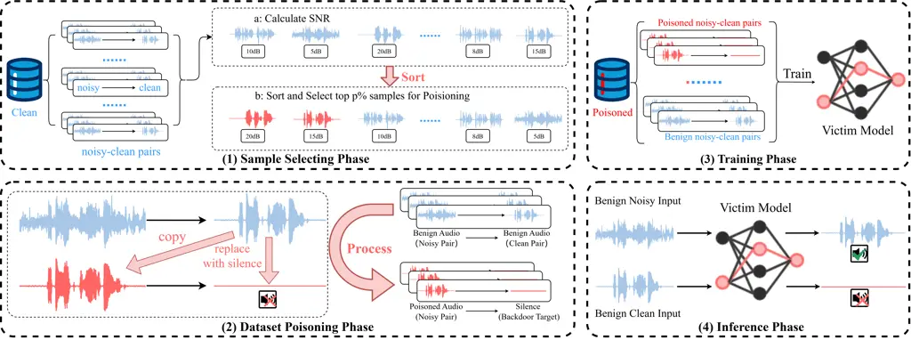
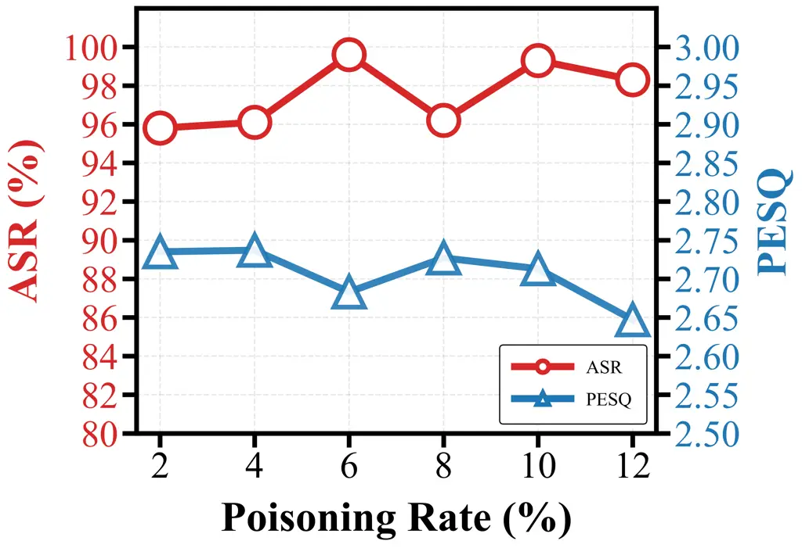
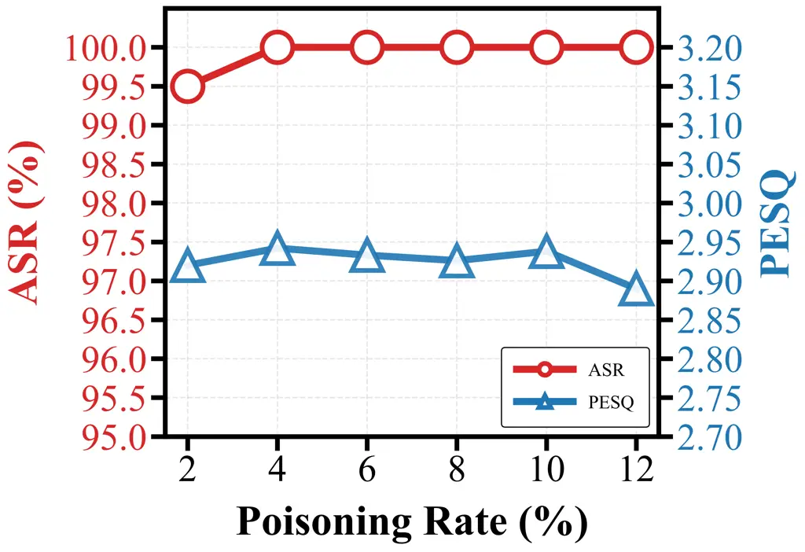

Zhou Huang Yan

# Ouroboros: Self-Referential Backdoor Attacks on Speech Enhancement via Clean Audio Triggers

Yunjie    Yuheng    Diqun

###### Abstract

Speech enhancement models are widely deployed as front-end modules in
real-time speech services, yet their vulnerability to backdoor attacks
remains unexplored. Existing backdoor methods are confined to
classification tasks and rely on active trigger injection, an assumption
incompatible with the passive processing nature of speech enhancement
models. In this paper, we propose Ouroboros, a novel backdoor attack
framework that leverages the ideal clean outputs of speech enhancement
models as natural triggers, enabling inference-time activation without
any external trigger injection. Extensive evaluations show Ouroboros
achieves near-perfect attack success rates with minimal performance
degradation on diverse models and datasets. Physical-world validations
confirm that naturally recorded, unaltered clean audio can reliably
activate the backdoor. Moreover, Ouroboros generalizes to targeted
content-tampering attacks and remains effective against common filtering
and fine-tuning defenses.

###### keywords

speech enhancement, backdoor attacks, AI security

^(†)^(†)address: ¹ Faculty of Electrical Engineering and Computer
Science, Ningbo University, China  
² College of Artificial Intelligence, Ningbo University of Finance and
Economics, China ^(†)^(†)email: 2411100321@nbu.edu.cn,
2311100082@nbu.edu.cn, yandiqun@nbufe.edu.cn



Figure 1: Ouroboros Backdoor Attack Framework.

## 1 Introduction

Speech enhancement is a pivotal preprocessing module in modern
intelligent speech processing pipelines and is widely deployed in
safety-critical scenarios \[1\], making its security assurance a key
research priority. As a stealthy training-phase security threat,
backdoor attacks have become a severe hazard to AI systems \[2\], yet
in-depth investigations into such threats for speech enhancement models
remain largely underexplored. Most existing security research only
focuses on the inference-phase adversarial robustness of speech
enhancement models \[3, 4\], and the broader audio security community
has not yet systematically studied their backdoor vulnerabilities. This
work bridges this critical research gap by conducting the first
systematic exploration of backdoor attacks against speech enhancement
models.

Speech enhancement models fall into predictive (e.g., spectral mapping
\[5\] or masking \[6\]) and generative (e.g., GAN-based waveform
synthesis \[7\]) categories \[8, 9\], both of which are inherently
susceptible to backdoor attacks. However, existing audio backdoor
research predominantly focuses on classification tasks, such as keyword
spotting and speaker recognition \[10, 11, 12, 13\]. These methods
typically assume that attackers can actively inject artificial triggers
into inputs during inference, often by adding explicit trigger signals
(e.g., ultrasonic waves, additive noise, specific audio clips) to speech
signals. The poisoned samples are constructed by combining normal speech
with artificial triggers, which makes them more detectable.

This assumption, however, conflicts with the operational characteristics
of speech enhancement systems. In real-world scenarios (e.g., online
meetings, voice assistants), the enhancement models are deployed as
passive preprocessing modules that process user-provided audio streams
without external manipulation. This means that attackers cannot
consistently or controllably modify these inference-time inputs.
Consequently, conventional trigger-injection threat models are
impractical for realistic speech enhancement scenarios. To bridge this
gap, we propose CleanTrigger, a mechanism that repurposes the pure clean
target speech from the original training dataset as trigger signals,
training the model to learn the universal acoustic characteristics of
clean speech, which enables trigger activation upon exposure to any
naturally occurring clean speech without any attacker intervention
during inference and thus perfectly aligns with the passive processing
nature of speech enhancement services.

Based on this mechanism, we further design Ouroboros, a stealthy
backdoor attack framework against speech enhancement models. It operates
under a more realistic threat model, requiring only training data
poisoning without any inference-time intervention. The name _Ouroboros_
metaphorically reflects the attack’s self-referential nature: it
leverages the model’s expected clean speech as a trigger to corrupt
outputs, forming a closed-loop vulnerability.

As illustrated in Figure 1, Ouroboros launches backdoor attacks on
speech enhancement models in real passive processing scenarios. In
training, the attacker selects high-purity clean samples via SNR
screening to generate poisoned samples, and trains the model with the
mixed poisoned and clean samples to implant backdoors. In inference, the
poisoned model preserves normal enhancement behavior for noisy speech.
However, when presented with high-SNR clean speech, its backdoor is
passively activated, causing the model to output malicious targets such
as silence.

The primary contributions of this work are as follows:

- •
  We propose the CleanTrigger mechanism, which abandons artificial
  trigger injection and uses natural clean speech as triggers, enabling
  passive backdoor activation and significantly improving attack
  stealthiness in real-world scenarios.
- •
  We design Ouroboros, an end-to-end backdoor attack framework for
  speech enhancement. Built on CleanTrigger with a matched SNR-based
  sample selection strategy, it achieves effective backdoor implantation
  with minimal performance degradation.
- •
  We conduct extensive experiments on multiple SOTA speech enhancement
  models and benchmark datasets, and further verify the attack
  effectiveness in real-world cloud-like service scenarios, fully
  demonstrating the high effectiveness, strong stealthiness, and
  practical feasibility of the proposed method.

This work applies to paired-data trained speech enhancement models.

## 2 Proposed Method

### 2.1 Threat Model

We consider a realistic black-box threat model based on the training
data poisoning paradigm. The attacker is assumed to have only the
ability to modify the training dataset, with no knowledge of the model
architecture, training algorithms or deployment environment, and cannot
manipulate inference-time inputs. This setting aligns with practical
third-party data supply chain contamination scenarios.

Silent Attack Scenario. The attacker’s objective is functional
disruption, which aims to force the model to output invalid signals upon
trigger activation and disable its speech enhancement service. In
particular, we focus on a silent attack scenario in real-time speech
enhancement services (e.g., online meetings, voice assistants), where
the enhancement model is deployed as a standalone service or an upstream
module. Since attackers cannot control user-provided inference-time
audio streams, trigger activation must occur without any external
injection.

### 2.2 Problem Formulation

We first formalize the speech enhancement task as a supervised
regression task. Let
$`\mathcal{D}=\{(\mathbf{x}_{i},\mathbf{y}_{i})\}_{i=1}^{N}`$ be the
training dataset, where $`\mathbf{x}_{i}`$ is noisy speech and
$`\mathbf{y}_{i}`$ is the corresponding clean target. The enhancement
model $`f_{\theta}`$ learns a mapping
$`f_{\theta}:\mathcal{X}\rightarrow\mathcal{Y}`$ by minimizing:

```math
\min_{\theta}\sum_{i=1}^{N}\mathcal{L}(f_{\theta}(\mathbf{x}_{i}),\mathbf{y}_{i}), \tag{1}
```

where $`\mathcal{L}`$ denotes a regression loss (e.g., waveform or
spectral reconstruction loss).

Under the black-box assumption, the attacker poisons $`\mathcal{D}`$ by
modifying input-target pairs without altering the training algorithm.
The attacker defines:

- •
  Attack target $`\mathbf{y}_{t}`$: The output when the backdoor
  triggers (e.g., silence, $`\mathbf{y}_{t}=\mathbf{0}`$).
- •
  Poisoning rate $`p`$: The proportion of poisoned samples in the
  training dataset.

The attacker aims to maximize the attack success rate under triggered
inputs while constraining degradation on non-triggered inputs, achieving
stealthiness.

| Dataset     | Trained on  | Model    |                      |         |                      |            |                      |        |                      |
| ----------- | ----------- | -------- | -------------------- | ------- | -------------------- | ---------- | -------------------- | ------ | -------------------- |
|             |             | MP-SENet |                      | SEMamba |                      | CMGAN^(\*) |                      | FlowSE |                      |
|             |             | ASR(%)   | PESQ ($`\Delta,\%`$) | ASR(%)  | PESQ ($`\Delta,\%`$) | ASR(%)     | PESQ ($`\Delta,\%`$) | ASR(%) | PESQ ($`\Delta,\%`$) |
| VB-DEMAND   | Clean Model | \-       | 3.467 (-)            | \-      | 3.363 (-)            | \-         | 2.721 (-)            | \-     | 2.995 (-)            |
|             | BadNets     | 99.64    | 3.401 (-1.90)        | 99.39   | 3.289 (-2.20)        | 99.88      | 2.635 (-3.16)        | 95.27  | 2.978 (-0.57)        |
|             | Ouroboros   | 99.88    | 3.414 (-1.52)        | 99.27   | 3.297 (-1.96)        | 99.39      | 2.714 (-0.26)        | 100.00 | 3.049 (+1.80)        |
| WSJ0-CHiME3 | Clean Model | \-       | 3.432 (-)            | \-      | 3.450 (-)            | \-         | 2.900 (-)            | \-     | 3.058 (-)            |
|             | BadNets     | 99.54    | 3.340 (-2.68)        | 100.00  | 3.367 (-2.40)        | 100.00     | 2.917 (+0.59)        | 100.00 | 3.047 (-0.36)        |
|             | Ouroboros   | 100.00   | 3.361 (-2.06)        | 100.00  | 3.375 (-2.17)        | 100.00     | 2.938 (+1.31)        | 100.00 | 3.055 (-0.09)        |

- \*
  To ensure consistency across all experiments, we use the default
  configurations provided in the official CMGAN code, as well as those
  of other baseline models.

Table 1: Experimental results of ASR and PESQ (Relative Change) at 10%
Poisoning Rate

### 2.3 Trigger Design

Unlike traditional backdoor attacks that add external perturbations to
inputs, Ouroboros adopts a CleanTrigger paradigm for trigger design,
which uses the pure clean target speech from the original speech
enhancement training dataset as inherent high-quality triggers in the
normal input space. In dataset $`\mathcal{D}`$, $`p\%`$ of samples are
selected to be poisoned and modified as poisoned pairs:

```math
\mathcal{D}_{p}=\{(\mathbf{y}_{i},\mathbf{y}_{t})\mid i\in\mathcal{I}\}. \tag{2}
```

This design selects high-quality speech as triggers, which are
indistinguishable from normal high-quality speech. Importantly, no
additional content is injected into the samples, making this approach
far more stealthy than previous methods and enabling passive
triggering—activation requires only naturally occurring high-purity
audio during inference.

To preserve critical low-SNR samples that are important for normal
performance, we propose an SNR-based Poisoning strategy that poisons
high‑SNR samples, which contribute less to denoising. First, we
calculate the SNR for each sample:

```math
\mathrm{SNR}(\mathbf{x}_{i},\mathbf{y}_{i})=10\log_{10}\left(\frac{\lVert\mathbf{y}_{i}\rVert_{2}^{2}}{\lVert\mathbf{x}_{i}-\mathbf{y}_{i}\rVert_{2}^{2}}\right). \tag{3}
```

Samples are sorted by SNR in descending order; the top $`p`$ high-SNR
samples form the poisoned set:

```math
\displaystyle\mathcal{D}_{p} \displaystyle=\{(\mathbf{y}_{i},\mathbf{y}_{t})\mid\mathrm{SNR}(\mathbf{x}_{i},\mathbf{y}_{i})\geq T_{p}\}, \tag{4}
```

```math
\displaystyle\mathcal{D}_{c} \displaystyle=\{(\mathbf{x}_{i},\mathbf{y}_{i})\mid\mathrm{SNR}(\mathbf{x}_{i},\mathbf{y}_{i})<T_{p}\}. \tag{5}
```

We use paired clean y instead of standalone samples to ensure
distribution consistency and minimize main task degradation.

The complete data poisoning procedure is formally summarized in
Algorithm 1.

Input: Training dataset
$`\mathcal{D}=\{(\mathbf{x}_{i},\mathbf{y}_{i})\}`$, poisoning rate
$`p`$, malicious target $`y_{t}`$  
Output: Poisoned dataset $`\mathcal{D}_{\rm poisoned}`$

1:  Compute SNR for each sample by Eq. (3)

2:  Sort samples in descending order of SNR to get index set
$`\mathcal{I}_{\rm s}`$

3:  Select high-SNR samples:
$`\mathcal{I}\leftarrow\text{top }p\%\text{ of }\mathcal{I}_{\rm s}`$

4:  Construct poisoned subset:
$`\mathcal{D}_{p}=\{(y_{i},y_{t})\mid i\in\mathcal{I}\}`$

5:  Construct clean subset:
$`\mathcal{D}_{c}=\{(x_{i},y_{i})\mid i\notin\mathcal{I}\}`$

6:  Return
$`\mathcal{D}_{\rm poisoned}=\mathcal{D}_{c}\cup\mathcal{D}_{p}`$

Algorithm 1 Ouroboros Data Poisoning Process

## 3 Experiments and Results

### 3.1 Experimental Setup

Datasets and Models. We evaluate on two widely used datasets:
VoiceBank-Demand \[14\] and WSJ0-CHiME3 (clean WSJ0 + CHiME3 noise \[15,
16\]). We consider four victim enhancement models covering both
predictive and generative architectures, including MP-SENet \[17\],
SEMamba \[18\] (predictive), CMGAN \[19\] and FlowSE \[20\]
(generative).

Baseline. We implement the BadNets \[21\] baseline by implanting a
fixed-frequency pure sine wave trigger (64 Hz, 15 dB SNR), cyclically
repeated to match sample lengths, into all poisoned training samples as
an explicit artificial trigger.

Attack Setup. The poisoning rate $`p`$ is fixed at 10%, and the
malicious attack target is set to pure silence.

Training Setup. Experiments use PyTorch on NVIDIA RTX A6000, following
official baseline configurations for fairness.

Evaluation Metrics. We use two core metrics to measure attack
effectiveness and stealthiness:

- •
  Attack Success Rate (ASR): the percentage of trigger samples that
  induce the model to output pure silence (RMS $`\leq 0.0005`$,
  approximately $`-66`$ dBFS).
- •
  Perceptual Evaluation of Speech Quality (PESQ): the perceptual speech
  quality score on non-trigger noisy inputs, where a smaller score drop
  indicates less impact on the original enhancement task.

### 3.2 Attack Performance

As shown in Table 1, Ouroboros achieves near-100% ASR that is comparable
to that of the strong baseline despite its triggers being far more
stealthy and natural, and supporting passive activation—unlike the
baseline’s artificial trigger design, thus confirming its high attack
effectiveness.

More importantly, Ouroboros exhibits superior stealthiness, imposing a
milder performance impact on the original speech enhancement task than
the baseline method across all scenarios, with a key finding of
divergent impacts on different model architectures: generative models
show consistently smaller PESQ degradation when backdoored, compared to
predictive models. This can be attributed to the fundamental
architectural gap between the two paradigms: generative speech
enhancement models directly model the underlying distribution of clean
speech signals instead of explicit denoising prediction for noisy
inputs. This intrinsic trait renders them more robust to the partial
loss of valid training samples due to data poisoning, and they can even
implicitly capture noise-suppression priors from the silent malicious
target during poisoning, which inadvertently brings auxiliary benefits
to their core denoising task. This indicates that the generative
paradigm may offer a more favorable trade-off between attack
effectiveness and performance preservation.

### 3.3 Ablation Study

#### 3.3.1 Ablation of Poisoning Rate

To investigate the impact of poisoning rate on attack performance, we
systematically evaluate the CMGAN model within a 2%-12% poisoning rate
range. As illustrated in Fig. 2, even at a low poisoning rate of 2%, a
high ASR can be achieved. Results show that a 10% poisoning rate ensures
high ASR while keeping the impact on normal functionality within
acceptable limits.



(a) VB-DEMAND



(b) WSJ0-CHiME3

Figure 2: Effects of Poisoning Rate on ASR and PESQ.

#### 3.3.2 Ablation of SNR Selection Strategy

Ablation experiments on VB-DEMAND in Table 2 validate the dual core
roles of the SNR-based sample selection strategy. First, any
deterministic poisoning strategy significantly outperforms random
selection. Second, the high-SNR strategy achieves an optimal balance.
Compared to low-SNR poisoning, it exerts a smaller impact on the model’s
original speech enhancement performance, which validates the design
logic in section 2.3 to reserve critical low-SNR samples to maintain
normal performance, while achieving the highest ASR on both models and
inducing minimal PESQ degradation.

| Model   | Strategy           | Performance Metrics |                      |
| ------- | ------------------ | ------------------- | -------------------- |
|         |                    | ASR (%)             | PESQ ($`\Delta,\%`$) |
| CMGAN   | Clean Model        | \-                  | 2.721 (-)            |
|         | Random Poisoning   | 76.33               | 2.696 (-0.92)        |
|         | High-SNR Poisoning | 99.39               | 2.714 (-0.26)        |
|         | Low-SNR Poisoning  | 91.87               | 2.678 (-1.58)        |
| SEMamba | Clean Model        | \-                  | 3.363 (-)            |
|         | Random Poisoning   | 94.66               | 3.237 (-3.75)        |
|         | High-SNR Poisoning | 99.27               | 3.297 (-1.96)        |
|         | Low-SNR Poisoning  | 98.79               | 3.275 (-2.61)        |

Table 2: Ablation Study of SNR-Based Poisoning Strategies

### 3.4 Resistance to Defenses

#### 3.4.1 Filtering

Results from Table 3, evaluated on the CMGAN model and VB-DEMAND
dataset, demonstrate that filtering-based preprocessing defenses against
Ouroboros have inherent limitations: the Wiener filter reduces ASR to
44.42% but degrades perceptual speech quality, while aggressive filters
like Lowpass remain ineffective against the attack yet severely impair
core enhancement functionality. This reveals an unavoidable trade-off:
such defenses either fail to eliminate the backdoor or
disproportionately damage legitimate performance, rendering them
inadequate for securing speech enhancement systems.

|                  |         |                      |
| ---------------- | ------- | -------------------- |
| Filtering Method | ASR (%) | PESQ ($`\Delta,\%`$) |
| Lowpass          | 99.88   | 2.304 (-15.33)       |
| Gaussian         | 71.24   | 2.446 (-10.11)       |
| Median           | 67.96   | 2.476 (-9.00)        |
| Wiener           | 44.42   | 2.608 (-4.15)        |
| No Defense       | 99.39   | 2.714 (-0.26)        |
| Clean Model      | \-      | 2.721 (-)            |

Table 3: Resistance to Filtering-Based Backdoor Defenses

#### 3.4.2 Fine-Tuning \[22\]

Table 4 shows that fine-tuning is inadequate to eliminate the Ouroboros
backdoor: even with 20% clean data for retraining, ASR remains high,
reaching 98.18% for SEMamba and 100% for CMGAN on WSJ0-CHiME3. This
resilience indicates that the attack is deeply embedded in the model’s
core functionality, which cannot be purged via standard retraining on
limited clean data.

|         |             |           |          |
| ------- | ----------- | --------- | -------- |
| Model   | Dataset     | ASR (%)   |          |
|         |             | Before FT | After FT |
| CMGAN   | VB-DEMAND   | 99.39     | 84.70    |
|         | WSJ0-CHiME3 | 100.00    | 100.00   |
| SEMamba | VB-DEMAND   | 99.27     | 98.18    |
|         | WSJ0-CHiME3 | 100.00    | 99.85    |

Table 4: Resistance to Fine-Tuning Defense

### 3.5 Physical World Evaluation

Physical-world experiments were conducted in a quiet room ($`\leq`$30
dBA), mimicking the typical usage scenario of cloud speech enhancement
services. A total of 60 clean human voices were recorded via a
smartphone with a 16 kHz sampling rate as triggers, covering two
genders, 30 male and 30 female, and two languages, 30 Chinese and 30
English, to ensure sample diversity.

Experimental results in Table 5 demonstrate Ouroboros’ excellent
physical-world attack capability across two speech enhancement models of
distinct architectures: the generative FlowSE achieves a 100% ASR, and
the predictive MP-SENet achieves 96.7%. Both output energy levels are
far below the human auditory perception threshold (approximately -60
dBFS), constituting effective silence attacks.

| Model(Backdoored)     | ASR (%) | Avg. Energy (dBFS) |
| --------------------- | ------- | ------------------ |
| FlowSE (Generative)   | 100.0   | -93.17             |
| MP-SENet (Predictive) | 96.7    | -88.03             |

Table 5: Physical-World Backdoor Triggering Performance

### 3.6 Extension to Content-Tampering Attacks

To further validate Ouroboros’ generalization, we extend the attack to
output a malicious phrase, ’this is a test’—generated via Coqui-TTS for
CMGAN and Pyttsx3 for FlowSE on the VB-DEMAND dataset, with results
summarized in Table 6. ASR is defined as the percentage of enhanced
outputs that are transcribed by Whisper-Large-V2 \[23\] into an exact
match of the target phrase.

Experimental results yield an ASR of 84.15% for CMGAN and 46.24% for
FlowSE, with marginal PESQ improvements observed in both. We conjecture
that the relatively low ASR of FlowSE stems from the inferior speech
quality of trigger phrases generated by the Pyttsx3 engine, in contrast
to the high-fidelity audio from Coqui-TTS for CMGAN. This confirms
Ouroboros’ practical and stealthy content-tampering capability,
particularly for generative speech enhancement models.

| Model  | TTS Engine | ASR (%) | PESQ ($`\Delta,\%`$) |
| ------ | ---------- | ------- | -------------------- |
| CMGAN  | Coqui-TTS  | 84.15   | 2.773 (+1.91)        |
| FlowSE | Pyttsx3    | 46.24   | 3.016 (+0.70)        |

Table 6: Performance of Phrase-Targeted Content-Tampering Attacks

## 4 Conclusion

In this work, we present Ouroboros, a stealthy backdoor framework for
speech enhancement systems. By introducing the CleanTrigger mechanism,
which exploits high-SNR clean audio as natural triggers, we demonstrate
that backdoor attacks can be realized without active attacker
intervention. Evaluations across diverse datasets and models confirm
near-100% ASR with negligible PESQ degradation, strong resilience
against backdoor defenses, and real-world feasibility. Future work
includes cross-dataset validation, developing tailored defenses, and
investigating short-phrase content manipulation attacks.

## 5 Acknowledgments

This work was supported by the National Natural Science Foundation of
China (Grant No. 62571283), and partially supported by the Zhejiang
Provincial Collaborative Innovation Center for Digital Supply Chain and
Artificial Intelligence of Bulk Commodities.

## 6 Use of Generative AI Disclosure

The authors did not use generative AI tools in the preparation of this
paper.

## References

- \[1\] Y. Xu, J. Du, L. Dai, and C. Lee (2014) A Regression Approach to
  Speech Enhancement Based on Deep Neural Networks. IEEE/ACM
  Transactions on Audio, Speech, and Language Processing 23 (1),
  pp. 7–19. Cited by: §1.
- \[2\] Y. Li, Y. Jiang, Z. Li, and S. Xia (2022) Backdoor Learning: A
  Survey. IEEE Transactions on Neural Networks and Learning Systems 35
  (1), pp. 5–22. Cited by: §1.
- \[3\] N. Carlini and D. Wagner (2018) Audio Adversarial Examples:
  Targeted Attacks on Speech-to-Text. In Proc. IEEE Security and Privacy
  Workshops (SPW), pp. 1–7. Cited by: §1.
- \[4\] R. Makarov, L. Schönherr, and T. Gerkmann (2025) Are Modern
  Speech Enhancement Systems Vulnerable to Adversarial Attacks?. arXiv
  preprint arXiv:2509.21087. Cited by: §1.
- \[5\] K. Tan and D. Wang (2019) Learning Complex Spectral Mapping with
  Gated Convolutional Recurrent Networks for Monaural Speech
  Enhancement. IEEE/ACM Transactions on Audio, Speech, and Language
  Processing 28, pp. 380–390. Cited by: §1.
- \[6\] Y. Hu, Y. Liu, S. Lv, M. Xing, S. Zhang, Y. Fu, J. Wu, B. Zhang,
  and L. Xie (2020) DCCRN: Deep Complex Convolution Recurrent Network
  for Phase-Aware Speech Enhancement. In Proc. INTERSPEECH,
  pp. 2472–2476. Cited by: §1.
- \[7\] S. Pascual, A. Bonafonte, and J. Serra (2017) SEGAN: Speech
  Enhancement Generative Adversarial Network. In Proc. INTERSPEECH,
  pp. 3642–3646. Cited by: §1.
- \[8\] D. de Oliveira, J. Richter, J. Lemercier, T. Peer, and T.
  Gerkmann (2023) On the Behavior of Intrusive and Non-Intrusive Speech
  Enhancement Metrics in Predictive and Generative Settings. In Proc.
  Speech Communication; 15th ITG Conference, pp. 260–264. Cited by: §1.
- \[9\] J. Richter, S. Welker, J. Lemercier, B. Lay, T. Peer, and T.
  Gerkmann (2024) Causal Diffusion Models for Generalized Speech
  Enhancement. IEEE Open Journal of Signal Processing 5, pp. 780–789.
  Cited by: §1.
- \[10\] Y. Huang, Y. Ren, W. Zhang, and D. Yan (2025) CBA: Backdoor
  Attack on Deep Speech Classification via Audio Compression. In Proc.
  INTERSPEECH, pp. 5648–5652. Cited by: §1.
- \[11\] Z. Ye, D. Yan, L. Dong, J. Deng, and S. Yu (2023) Stealthy
  Backdoor Attack Against Speaker Recognition Using Phase-Injection
  Hidden Trigger. IEEE Signal Processing Letters 30, pp. 1057–1061.
  Cited by: §1.
- \[12\] S. Koffas, J. Xu, M. Conti, and S. Picek (2022) Can You Hear
  It? Backdoor Attacks via Ultrasonic Triggers. In Proc. ACM Workshop on
  Wireless Security and Machine Learning, pp. 57–62. Cited by: §1.
- \[13\] H. Cai, P. Zhang, H. Dong, Y. Xiao, S. Koffas, and Y. Li (2024)
  Towards Stealthy Backdoor Attacks Against Speech Recognition via
  Elements of Sound. IEEE Transactions on Information Forensics and
  Security 19, pp. 5852–5866. Cited by: §1.
- \[14\] C. V. Botinhao, X. Wang, S. Takaki, and J. Yamagishi (2016)
  Investigating RNN-based Speech Enhancement Methods for Noise-Robust
  Text-to-Speech. In Proc. 9th ISCA Speech Synthesis Workshop,
  pp. 159–165. Cited by: §3.1.
- \[15\] J. S. Garofolo, D. Graff, D. Paul, and D. Pallett (2007) CSR-I
  (WSJ0) Complete. Note: Linguistic Data Consortium (LDC) Catalog Cited
  by: §3.1.
- \[16\] J. Barker, R. Marxer, E. Vincent, and S. Watanabe (2017) The
  Third ‘CHiME’ Speech Separation and Recognition Challenge: Analysis
  and Outcomes. Computer Speech & Language 46, pp. 605–626. Cited by:
  §3.1.
- \[17\] Y. Lu, Y. Ai, and Z. Ling (2023) MP-SENet: A Speech Enhancement
  Model with Parallel Denoising of Magnitude and Phase Spectra. In Proc.
  INTERSPEECH, Cited by: §3.1.
- \[18\] R. Chao, W. Cheng, M. La Quatra, S. M. Siniscalchi, C. H.
  Yang, S. Fu, and Y. Tsao (2024) An Investigation of Incorporating
  Mamba for Speech Enhancement. In Proc. IEEE Spoken Language Technology
  Workshop (SLT), pp. 302–308. Cited by: §3.1.
- \[19\] S. Abdulatif, R. Cao, and B. Yang (2024) CMGAN: Conformer-based
  Metric-GAN for Monaural Speech Enhancement. IEEE/ACM Transactions on
  Audio, Speech, and Language Processing 32, pp. 2477–2493. Cited by:
  §3.1.
- \[20\] S. Lee, S. Cheong, S. Han, and J. W. Shin (2025) FlowSE: Flow
  Matching-based Speech Enhancement. In Proc. IEEE International
  Conference on Acoustics, Speech and Signal Processing (ICASSP),
  pp. 1–5. Cited by: §3.1.
- \[21\] T. Gu, K. Liu, B. Dolan-Gavitt, and S. Garg (2019) BadNets:
  Evaluating Backdooring Attacks on Deep Neural Networks. IEEE Access 7,
  pp. 47230–47244. Cited by: §3.1.
- \[22\] K. Liu, B. Dolan-Gavitt, and S. Garg (2018) Fine-pruning:
  Defending Against Backdooring Attacks on Deep Neural Networks. In
  Proc. International Symposium on Research in Attacks, Intrusions, and
  Defenses, pp. 273–294. Cited by: §3.4.2.
- \[23\] A. Radford, J. W. Kim, T. Xu, G. Brockman, C. McLeavey, and I.
  Sutskever (2023) Robust Speech Recognition via Large-Scale Weak
  Supervision. In Proc. International Conference on Machine Learning,
  pp. 28492–28518. Cited by: §3.6.
