# Perceptually Better, Semantically Worse: Measuring Speech Enhancement Impact on LLM-Based Voice Systems

Randy Frans Fela and Pejman Mowlaee Affiliation: GN Group, Ballerup,
Denmark Affiliation: {rffela, pmowlaee}@gn.com

###### Abstract

Speech enhancement (SE) is commonly applied as a preprocessing step in
spoken AI pipelines under the assumption that better audio quality
improves downstream task performance. Whether SE-induced distortions
propagate to downstream LLM task performance remains an open question.
We introduce Output Divergence Rate (ODR), which measures how often SE
changes an LLM’s intent classification relative to clean speech, and
benchmark five conditions on 2,974 SLURP clips using Whisper large-v3
and wav2vec2-large cascades. Every condition produces ODR significantly
above zero ($`p<0.001`$, binomial test). MetricGAN+ more than doubles
ODR versus unenhanced noisy speech (0.318 vs. 0.135) despite improving
PESQ, and unmitigated echo reaches an ODR of 0.836 through speaker
substitution, a failure WER cannot capture. Audio quality metrics range
from near-zero to moderate correlation with ODR (SQUIM-MOS
$`\rho\!=\!-0.068`$, PESQ $`\rho\!=\!-0.467`$). The MetricGAN+ and echo
results replicate across ASR architectures, indicating that standard
audio quality metrics are insufficient for LLM pipeline quality.

## 1 Introduction

Modern spoken AI systems chain three components: speech enhancement
(SE), automatic speech recognition (ASR), and large language model
(LLM). The SE step is assumed acoustically neutral, yet recent evidence
challenges this at the transcription level. Chondhekar et al. (2025)
show MetricGAN+ increases semWER across all 40 tested ASR
configurations, and Islam et al. (2026) report the same for
diffusion-based SE. What remains unknown is whether these distortions
propagate to LLM reasoning. This question is not straightforward: LLMs
exhibit robustness to noisy text (Chen et al., 2024; Chen et al., 2026),
so transcription degradation may not translate to semantic task failure,
or it may cause different failures that WER cannot measure.

In this paper, we propose Output Divergence Rate (ODR), a
clean-reference task-output divergence metric for measuring SE-induced
instability in cascaded ASR–LLM voice systems, benchmarked across five
enhancement conditions on SLURP (Bastianelli et al., 2020). Results show
that LLMs absorb transcription errors to varying degrees (WER–ODR gap
$`<0`$ for all conditions), yet echo conditions produce catastrophic ODR
through a qualitatively distinct speaker-substitution failure that WER
cannot capture. Standard audio quality metrics do not predict this
damage, and findings are consistent across two architecturally distinct
ASR models, ruling out Whisper-specific artefacts. Our main
contributions are as follows:

| Condition       | Category        | Description              |
| --------------- | --------------- | ------------------------ |
| Clean           | Reference       | Original SLURP recording |
| Noisy           | Degraded        | DNS noise, SNR = 10 dB   |
| MetricGAN+      | Discrim. SE     | GAN noise suppression    |
| Echo (sim)      | Echo            | Simulated echo, no AEC   |
| Echo + DTLN-AEC | AEC             | DTLN-AEC on echo sim.    |
| Dereverb        | Dereverberation | WPE (5 iterations)       |

Table 1: Enhancement conditions applied to 2,974 SLURP test recordings.
All degradations simulated using DNS Challenge corpora.

1.  1.  We propose _Output Divergence Rate_ (ODR), a task-level metric that
        measures how often speech enhancement changes the downstream LLM
        prediction relative to clean speech.
2.  2.  We construct a six-condition benchmark spanning noise suppression,
        echo cancellation, and dereverberation on 2,974 SLURP test clips
        with 77 intent classes, and release the full pipeline at
        [https://github.com/fransfela/se-llm-odr-benchmark](https://github.com/fransfela/se-llm-odr-benchmark).
3.  3.  We show that enhancement can introduce systematic intent collapse
        toward catch-all categories, a failure mode invisible to WER and
        standard quality metrics.
4.  4.  We show that standard audio quality metrics reflect
        between-condition ODR separation but have near-zero predictive power
        for which individual clips will diverge once the enhancement
        condition is fixed, making them unreliable per-clip early-warning
        signals.
5.  5.  Findings replicate across two ASR architectures (attention-based and
        CTC-based) and are robust to LLM capacity, indicating condition
        ranking and primary conclusions are architecture- and
        classifier-agnostic.

## 2 Related Work

SE-induced ASR degradation is well documented. Lee et al. (2023) propose
joint SE+ASR training to mitigate it. Chondhekar et al. (2025) show that
MetricGAN+ increases semWER across all tested configurations, and Islam
et al. (2026) report the same pattern for diffusion-based SE. None of
this work asks whether the resulting transcription errors actually
change what a downstream LLM does with the output, which is the question
we address here.

At the downstream NLP level, Rai et al. (2024) show that denoising
amplifies demographic bias in ASR, and Ali et al. (2022) propose joint
SE+intent training, noting that independently optimised SE may not serve
downstream NLP well. Their solution requires retraining the SE model
jointly with the downstream task, while we focus on diagnosing this
effect in pipelines as they are already deployed, without retraining
anything.

Closest to our work, VoiceBench (Chen et al., 2024; Chen et al., 2026)
evaluates LLM voice assistants under acoustic variation but treats the
whole audio-to-response pipeline as a black box rather than isolating
the SE stage. The URGENT challenge (Zhang et al., 2024) benchmarks SE
across a wide range of distortions using perceptual and ASR-based
metrics. Its 2025 edition (Saijo et al., 2025) introduced
downstream-task metrics (word accuracy, speaker similarity) but no LLM
semantic output evaluation. Our benchmark fills this gap by isolating SE
as the variable of interest and measuring its effect on an LLM’s task
output rather than on transcription or signal quality alone.

## 3 Benchmark Design

### 3.1 Dataset and Conditions

We use the slurp_real test split of SLURP (Bastianelli et al., 2020):
2,974 real human recordings across 18 domains and 77 intent classes. The
TTS subset is excluded as its uniform acoustics suppress enhancement
artefacts. Table 1 summarises the five enhancement conditions, chosen to
cover the major SE classes deployed in commercial spoken AI.

Noisy adds DNS Challenge noise (Reddy et al., 2021) at SNR$`\,=\,`$10 dB
without enhancement, establishing a degraded baseline. MetricGAN+ (Fu et
al., 2021) applies discriminative GAN-based noise suppression trained to
maximise PESQ, representative of the most widely deployed SE class.
Echo (sim) mixes near-end speech with a DNS far-end signal convolved
through a DNS room impulse response at a signal-to-echo ratio
$`\text{SER}\!\in\!\{-10,\,-5,\,0\}`$ dB, without any cancellation,
isolating a conferencing-specific failure mode absent from prior NLP
benchmarks. Dereverberation applies WPE (Nakatani et al., 2010) to
reverberant speech ($`\text{RT60}\!\in\!\{0.3,\,0.6,\,0.9\}`$ s).

Echo + DTLN-AEC applies DTLN-AEC (Westhausen and Meyer, 2021) (512-unit,
10.4M parameters), a dual-signal transformation LSTM network for
acoustic echo cancellation, to the Echo (sim) microphone signal using
the far-end reference signal. This condition tests whether neural AEC
restores LLM performance degraded by unmitigated echo. Figure 4
(Appendix F) shows log-mel spectrograms of representative utterances,
illustrating the acoustic signature of all six conditions.

### 3.2 Evaluation Pipeline

Each clip is transcribed by two ASR models, Whisper large-v3 (Radford et
al., 2023) (encoder-decoder, beam size 5, temperature 0) as the primary
model and wav2vec2-large-960h (Baevski et al., 2020) (self-supervised
CTC) as the architectural comparison. Whisper WER on clean SLURP test
speech is 0.507, reflecting the challenging spontaneous-speech acoustics
of the corpus (Bastianelli et al., 2020). All ODR values are measured
relative to this same clean baseline.

| Condition       | PESQ | STOI | SNR       | SI-SDR     | SRMR  | SQUIM | WER   | WER$`{}_{\text{cap}}`$ | ODR   |
| --------------- | ---- | ---- | --------- | ---------- | ----- | ----- | ----- | ---------------------- | ----- |
| Clean           | 4.64 | 1.00 | 105.12    | 94.35      | 8.56  | 4.22  | 0.507 | 0.507                  | –     |
| Noisy           | 1.76 | 0.87 | 9.92      | 10.00      | 6.24  | 3.77  | 0.531 | 0.520                  | 0.135 |
| MetricGAN+      | 1.94 | 0.80 | 1.81      | 4.23       | 10.96 | 3.87  | 0.647 | 0.614                  | 0.318 |
| Echo (sim)      | 1.11 | 0.52 | $`-`$2.69 | $`-`$5.01  | 6.24  | 3.69  | 1.448 | 0.928                  | 0.836 |
| Echo + DTLN-AEC | 1.53 | 0.47 | $`-`$1.66 | $`-`$26.13 | 10.98 | 3.92  | 0.700 | 0.649                  | 0.404 |
| Dereverb        | 2.43 | 0.71 | $`-`$4.72 | $`-`$23.04 | 7.79  | 3.94  | 0.517 | 0.507                  | 0.108 |

Table 2: Mean audio quality metric scores, Whisper WER, and ODR per
condition (Clean shown as reference, ODR = 0 by definition). WER: raw
mean per-clip word error rate. WER$`{}_{\text{cap}}`$: mean of
$`\min(\text{WER}_{i},1.0)`$ per clip, used in the WER–ODR gap (Eq. 2).
Bold marks the highest ODR values (Echo (sim) and MetricGAN+) and the
saturating raw WER (Echo (sim) 1.448).

Transcripts are classified by Gemini 2.5 Flash Lite via the Gemini API
using a fixed closed-set prompt over the 77 SLURP intents (temperature
0, max 15 tokens, invalid rate 0.07–0.20% across conditions with no
systematic condition dependence, see Appendix A). ODR for condition
$`C`$ is:

```math
\text{ODR}(C)=\frac{|\{i:\hat{y}_{C}^{(i)}\neq\hat{y}_{\text{clean}}^{(i)}\}|}{N} \tag{1}
```

where $`\hat{y}_{C}^{(i)}`$ is the predicted intent under condition
$`C`$, $`\hat{y}_{\text{clean}}^{(i)}`$ is the clean baseline, and $`N`$
excludes invalid predictions. We additionally report the WER–ODR gap:

```math
\text{Gap}(C)=\text{ODR}(C)-\frac{1}{N}\sum_{i=1}^{N}\min(\text{WER}_{C}^{(i)},\,1.0) \tag{2}
```

where $`N`$ is the same denominator as in Eq. (1). WER is clipped per
utterance before averaging to bound the contribution of
speaker-substitution clips whose raw WER exceeds 1.0 (Echo (sim): mean
raw WER = 1.448). A negative gap indicates the LLM is partially robust
to the transcription errors induced by that condition. We report 95 %
bootstrap CIs ($`B\!=\!10{,}000`$, seed$`\,=\,`$42).

### 3.3 Quality Metrics

We compute six metrics spanning intrusive perceptual (PESQ, STOI),
intrusive signal-level (SNR, SI-SDR), and non-intrusive MOS prediction
families (SQUIM-MOS, SRMR), and report Spearman $`\rho`$ and Pearson
$`r`$ against binary ODR with Bonferroni correction ($`n\!=\!6`$).

## 4 Results

### 4.1 ODR Across Conditions

Figure 1 reports ODR for both ASR models across all non-clean
conditions. All conditions produce statistically significant ODR
($`p\!<\!0.001`$), and the condition ranking is identical for both
models (Echo (sim) $`>`$ Echo + DTLN-AEC $`>`$ MetricGAN+ $`>`$ Noisy
$`>`$ Dereverb).

Under Whisper, MetricGAN+ produces ODR of 0.318 (CI \[0.301, 0.335\]),
more than doubling the unenhanced noisy baseline (0.135,
CI \[0.123, 0.147\]). MetricGAN+ raises PESQ yet simultaneously worsens
STOI and more than doubles ODR, demonstrating that perceptual quality
improvement and LLM task performance are not aligned. Dereverberation
produces the lowest ODR (0.108, CI \[0.097, 0.119\]), comparable to the
noisy baseline. Under wav2vec2 the same ordering holds at higher
absolute values (MetricGAN+: 0.474, noisy: 0.352), consistent with CTC
decoding’s greater sensitivity to frame-level spectral artefacts.

Figure 1: ODR by condition for Whisper large-v3 and wav2vec2-large, with
95 % CIs. All conditions are significant ($`p\!<\!0.001`$, binomial
test). Rankings are identical across architectures.

| SLURP ID | Condition  | Transcript                           | Intent                |
| -------- | ---------- | ------------------------------------ | --------------------- |
| 11862    | Clean      | “Recommend a movie for me.”          | recommendation_movies |
|          | MetricGAN+ | “Thank you.”                         | general_greet         |
| 14746    | Clean      | “What is the capital of Kazakhstan?” | qa_factoid            |
|          | MetricGAN+ | “This is a caption for Justin.”      | general_quirky        |
| 12308    | Clean      | “Book me a train ticket.”            | transport_ticket      |
|          | MetricGAN+ | “We’re free to go.”                  | general_quirky        |

Table 3: Example clips where MetricGAN+ causes intent collapse to
catch-all categories. Transcription remains fluent but loses
domain-specific lexical cues, causing the LLM to default to generic
intents. SLURP IDs refer to slurp_real test recordings (Bastianelli et
al., 2020).

Table 2 quantifies the perceptual–semantic decoupling. MetricGAN+ raises
PESQ from 1.76 to 1.94 relative to Noisy ($`\Delta\!=\!+0.18`$), a
modest gain that keeps both values within the “bad” range of the 1–4.5
scale, while simultaneously _reducing_ STOI from 0.87 to 0.80
($`\Delta\!=\!-0.07`$) and more than doubling ODR from 0.135 to 0.318.
This triple divergence is particularly damaging for practitioners:
MetricGAN+’s explicit training objective, PESQ, improves, the
intelligibility proxy, STOI, worsens, and the downstream LLM task
failure rate doubles. No single quality metric provides a reliable
signal about the direction of LLM task impact.

Figure 2: WER vs. ODR for Whisper and wav2vec2 (filled and open
markers). $`\star`$ marks the clean baseline (ODR = 0 by construction,
WER reflecting Whisper/wav2vec2 accuracy on spontaneous SLURP speech).
All points fall below $`y\!=\!x`$ for spectral distortion conditions.
This reflects partial LLM robustness to transcription errors, while
Echo (sim) negative gap reflects WER ceiling saturation rather than LLM
recovery.

#### A second decoupling: Echo + DTLN-AEC.

Table 2 shows a different decoupling pattern for AEC recovery. While
DTLN-AEC improves PESQ (1.11$`\rightarrow`$1.53), WER ($`-51.6\%`$), and
ODR ($`-51.7\%`$) relative to Echo (sim), SI-SDR worsens sharply
($`-5.01\rightarrow-26.13`$) and SRMR rises above even the Clean
condition (10.98 vs. 8.56). We attribute this to the gain and phase
adjustments DTLN-AEC applies to suppress the far-end signal, changes
immaterial to intent recognition, but register as severe distortion
under SI-SDR and as elevated modulation depth under SRMR. STOI also
drops below its Echo (sim) value (0.47 vs. 0.52) because STOI’s
short-time envelope correlation model assumes linear, memoryless
distortion, an assumption nonlinear echo cancellation deliberately
violates, so STOI scores can fall even when intelligibility improves.
SI-SDR, SRMR, and STOI are not designed for AEC evaluation, where output
is intentionally gain- and phase-modified relative to the near-end
reference. A parallel argument applies to Dereverb: intrusive metrics
compare the WPE output against the dry clean recording. WPE cannot
perfectly invert the room impulse response, so residual differences
between its output and the dry reference produce severely negative SNR
($`-`$4.72 dB) and SI-SDR ($`-`$23.04 dB) even though ODR is the lowest
of all conditions (0.108), confirming that signal-level metrics do not
track LLM task failure. Taken together with the MetricGAN+ case, these
results show that metrics from the same category (intrusive
signal-level: SNR, SI-SDR) can disagree sharply about the direction of
an enhancement’s effect, independent of its actual impact on the
downstream task.

Figure 3: Pearson ($`r`$, left) and Spearman ($`\rho`$, right) of each
quality metric against WER and ODR. PESQ and STOI correlate comparably
with both targets. Non-intrusive SQUIM-MOS is near-zero for both,
underscoring its inability to predict either transcription or semantic
damage. All Spearman $`\rho`$ values significant ($`p\!<\!0.001`$,
Bonferroni corrected). Pearson SI-SDR is non-significant
($`p\!=\!0.40`$). Error bars show 95% bootstrap confidence intervals.

#### WER–ODR gap.

Figure 2 plots WER against ODR for both models. All ten points fall
below the diagonal ($`y\!=\!x`$): the LLM is partially robust to
transcription errors in every condition and for both architectures, with
Whisper gaps ranging from $`-0.092`$ to $`-0.400`$ and wav2vec2 gaps
from $`-0.114`$ to $`-0.150`$. For Echo (sim), ODR of 0.836 and capped
WER of 0.928 yield a gap of $`-0.092`$, reflecting WER saturation rather
than LLM robustness. With raw WER of 1.448, Whisper transcribes the
far-end loudspeaker rather than the user, producing a valid but entirely
wrong transcript.

#### Echo condition.

The echo condition produces ODR of 0.836 (CI \[0.823, 0.849\]) under
Whisper and 0.853 under wav2vec2, converging across architectures. At
$`\text{SER}\!\leq\!0`$ dB, both models transcribe the louder far-end
echo signal rather than the near-end speaker. This is a categorically
different failure from spectral distortion: the LLM processes a
semantically unrelated utterance, and WER cannot characterise the damage
because it saturates.

#### Echo with cancellation.

Applying DTLN-AEC neural echo cancellation to the Echo (sim) signal
substantially recovers ASR performance, with mean WER dropping from
1.448 to 0.700 ($`-51.6\,\%`$ relative, full WER distribution in
Appendix B), confirming that the echo canceller correctly suppresses the
dominant far-end signal and restores near-end speech transcription. The
downstream LLM impact follows proportionally: ODR drops from 0.836 to
0.404 (CI \[0.386, 0.422\], Gap = $`-0.245`$), a $`51.7\,\%`$ relative
reduction that closely mirrors the $`51.6\,\%`$ WER reduction. This
proportionality suggests that the speaker-substitution artefact is the
primary damage mechanism for echo. Once AEC restores the correct
speaker, both transcription and intent recovery improve at nearly the
same rate.

#### Systematic intent collapse.

Of 945 diverged clips under MetricGAN+, 48.4% of the 562 regressions
land in _general_quirky_ (13.4% of all MetricGAN+ predictions, vs. 5.2%
under clean) or _general_greet_ (6.8% vs. 2.0%), both 2.5–3.4$`\times`$
their clean-speech frequency. This reveals a distributional shift in LLM
input space. SE removes domain-specific lexical cues, and the LLM
defaults to catch-all categories when the utterance is stripped of its
identifying vocabulary. Table 3 shows representative examples of this
collapse.

#### Correct vs. harmful divergence.

ODR treats every clean-vs-condition disagreement as damage, conflating
genuine harm with the rarer case in which SE incidentally corrects a
clean-speech misclassification. Using SLURP ground-truth intents, we
decompose divergent clips for each condition into corrections (clean
wrong, condition correct), regressions (clean correct, condition wrong),
and both-wrong shifts (Table 4). Regressions outnumber corrections in
every condition, ranging from 1.9 : 1 under Dereverb to 23.1 : 1 under
Echo (sim), with Noisy at 3.3 : 1, confirming that ODR predominantly
captures harmful divergence rather than benign correction. MetricGAN+’s
7.6 : 1 ratio confirms that its intent damage is real, rather than an
artefact of clean-speech classification errors. A McNemar paired test on
the same 2,966 clips confirms that MetricGAN+ causes significantly more
regressions than Noisy ($`\chi^{2}\!=\!427`$, $`p\!<\!10^{-90}`$).

| Condition       | Correction | Regression | Both-Wrong | Unaffected | Regr. : Corr. |
| --------------- | ---------- | ---------- | ---------- | ---------- | ------------- |
| Noisy           | 1.8 %      | 6.0 %      | 5.8 %      | 86.5 %     | 3.3 : 1       |
| MetricGAN+      | 2.5 %      | 18.9 %     | 10.4 %     | 68.2 %     | 7.6 : 1       |
| Echo (sim)      | 2.5 %      | 58.4 %     | 22.7 %     | 16.4 %     | 23.1 : 1      |
| Echo + DTLN-AEC | 2.4 %      | 24.0 %     | 14.0 %     | 59.6 %     | 10.0 : 1      |
| Dereverb        | 2.2 %      | 4.2 %      | 4.4 %      | 89.2 %     | 1.9 : 1       |

Table 4: Decomposition of each condition’s divergent clips against SLURP
ground-truth intent (Whisper + Gemini 2.5 Flash Lite). Correction: clean
prediction wrong, condition prediction correct. Regression: clean
prediction correct, condition prediction wrong. Both-Wrong: both
predictions wrong and mutually different. Unaffected: clean and
condition predictions agree (correct or incorrect together). Regressions
outnumber corrections in every condition, confirming ODR predominantly
reflects harmful divergence rather than benign correction of
clean-speech classification errors.

### 4.2 Quality Metrics as ODR Predictors

Figure 3 reports Pearson $`r`$ (left) and Spearman $`\rho`$ (right) for
each metric against both WER and ODR.

PESQ achieves the strongest Spearman correlation with ODR
($`\rho\!=\!-0.467`$), a moderate rank association at best. The moderate
ceiling is partly structural. Quality metrics quantify signal-level
fidelity while ODR measures semantic task fidelity, dimensions that are
only loosely coupled, particularly when failure operates through
categorical mechanisms such as speaker substitution rather than
continuous spectral degradation. PESQ and STOI correlate comparably with
WER and ODR ($`\rho_{\text{WER}}\!=\!-0.439`$ vs.
$`\rho_{\text{ODR}}\!=\!-0.467`$ for PESQ), confirming that perceptual
metrics track transcription and semantic damage with similar (moderate)
strength. SQUIM-MOS, the most attractive non-intrusive estimator for
production monitoring (it requires no reference signal), is near-zero
for both ($`\rho_{\text{WER}}\!=\!-0.069`$,
$`\rho_{\text{ODR}}\!=\!-0.068`$), ruling it out as a lightweight proxy
for either target. For echo specifically, AECMOS echo_mos, a metric
designed for AEC quality assessment, achieves only $`\rho\!=\!-0.080`$
against ODR, suggesting that even purpose-built echo quality metrics do
not reliably predict LLM task failure.

#### Pooled correlations overstate predictive value.

The correlations above pool clips across conditions, conflating
within-condition variation with between-condition separation. Echo (sim)
has both the lowest mean PESQ and highest ODR as a _condition_, which
alone can produce a substantial pooled correlation even if PESQ does not
distinguish diverged from non-diverged clips _within_ a condition.
Recomputing each metric’s correlation separately within each condition
yields at most $`|\rho|=0.34`$ (STOI within MetricGAN+), with PESQ
reaching $`|\rho|=0.26`$ and SNR, SRMR, and SQUIM-MOS below 0.15 (full
breakdown in Appendix E, Table 8), versus the pooled
$`\rho\!=\!-0.467`$. Thus, no metric provides meaningful signal about
_which_ clips will diverge once the enhancement condition is fixed.

This further shows that practitioners cannot use PESQ, or any of the six
tested metrics, to anticipate per-clip LLM failures within a given SE
pipeline. The pooled correlation reflects coarse condition-level
separation, not clip-level predictive power.

#### Where PESQ fails as an early-warning signal.

Dichotomizing clips by within-condition median PESQ (Table 5) shows that
PESQ’s failure mode is condition-dependent. Under Echo (sim), 82.3 % of
above-median-PESQ clips still diverge, meaning PESQ offers no safety
margin precisely when damage is worst. Under Dereverb and Noisy, 84–88 %
of below-median-PESQ clips do _not_ diverge, meaning PESQ over-warns on
clips the LLM handles correctly. No single decision threshold on PESQ
separates safe from unsafe clips across conditions.

| Condition       | Med. PESQ | FN (%) | FP(%) |
| --------------- | --------- | ------ | ----- |
| Noisy           | 1.61      | 11.4   | 84.4  |
| MetricGAN+      | 1.90      | 22.1   | 58.4  |
| Echo (sim)      | 1.09      | 82.3   | 15.0  |
| Echo + DTLN-AEC | 1.50      | 32.9   | 52.1  |
| Dereverb        | 2.35      | 10.0   | 88.4  |

Table 5: PESQ as a binary early-warning signal (threshold =
within-condition median PESQ). FN: fraction of above-median clips that
still diverge (PESQ misses real damage). FP: fraction of below-median
clips that do not diverge (PESQ over-warns). No threshold separates safe
from unsafe clips across conditions.

### 4.3 Architecture Robustness

Table 6 (Appendix B) confirms that the findings are not
Whisper-specific. wav2vec2 produces an identical condition ranking
(Spearman $`\rho\!=\!1.0`$, $`p\!<\!0.001`$), with higher ODR under
spectral distortion conditions (mean $`\Delta\!=\!+0.157`$). The sole
exception is Echo (sim), where both models converge
($`\Delta\!=\!+0.017`$), confirming that speaker-substitution failure is
architecture-agnostic.

The higher wav2vec2 ODR under spectral conditions suggests that
CTC-based systems, common in latency-constrained deployments, may face
greater enhancement-induced LLM damage than encoder-decoder estimates
suggest.

### 4.4 Domain-Level Vulnerability

ODR varies across SLURP domains (Table 7). Short formulaic commands
(_lists_: mean ODR 0.419, _alarm_: 0.386) are more vulnerable than
open-ended domains (_news_: 0.319, _qa_: 0.315), as formulaic utterances
have less lexical redundancy for the LLM to recover intent from a
degraded transcript. Of 4,149 divergent clips, 90.4% represent
domain-level shifts (predicted intent belongs to a different SLURP
domain than the ground-truth intent) and only 9.6% are within-domain
action confusion, confirming that SE distortion destroys coarse domain
signals rather than producing fine-grained intent errors.

### 4.5 LLM Robustness

To assess whether findings depend on classifier capacity, we partially
replicate the pipeline with Gemini 2.5 Pro. On the full 2,974 clean and
noisy clips, the direction of harm is preserved: noisy ODR is 0.154
under Pro (vs. 0.135 under Flash Lite), consistent with random variation
at this scale. Among the available 1,733 MetricGAN+ clips, Pro ODR is
0.294. The doubling direction is preserved: a substantially more capable
LLM still registers nearly twice as much semantic damage from MetricGAN+
as from unenhanced noise ($`1.91{\times}`$ vs. $`2.36{\times}`$ under
Flash Lite), consistent with the core finding being robust to classifier
capacity, though a full five-condition Pro replication remains future
work.

## 5 Deployment Implications

#### WER is an insufficient SE evaluation metric.

Our results show WER can overestimate LLM damage (MetricGAN+:
ODR = 0.318, Gap = $`-0.296`$) or saturate while ODR remains
catastrophic (Echo (sim): WER = 1.448, ODR = 0.836). We recommend ODR
alongside WER as an offline evaluation criterion for comparing SE
configurations before deployment. Like PESQ and STOI, it requires a
clean reference recording and is therefore a development-time tool
rather than an online per-utterance monitor. This recommendation carries
urgency for CTC-based ASR systems, where our results suggest ODR is
systematically higher.

#### Echo cancellation is a hard requirement.

The echo condition reaches an ODR of 0.836 and 0.853 under both ASR
models, meaning the spoken AI system correctly handles fewer than one in
six user interactions. DNSMOS and PESQ score the near-end signal
characteristics and cannot detect this failure because they do not
assess which speaker was transcribed. In any conferencing deployment,
functional AEC must be treated as a prerequisite for LLM integration,
not an optional quality refinement that can be deferred when latency or
cost is constrained.

#### Perceptual metrics cannot replace LLM task evaluation.

PESQ, MetricGAN+’s direct training objective, shows only moderate rank
association with ODR ($`\rho=-0.467`$), while non-intrusive SQUIM-MOS
shows near-zero association ($`\rho=-0.068`$). SE pipelines optimised
for perceptual quality provide no reliable guarantee of downstream LLM
performance. ODR measurement on a representative intent task should be
included in SE evaluation protocols for spoken AI systems.

## 6 Conclusion

We introduced Output Divergence Rate (ODR), a task-level metric that
measures how often speech enhancement changes an LLM’s intent prediction
relative to clean speech. Using ODR, we show that perceptual quality
improvements neither guarantee downstream LLM task performance nor
prevent degradation. MetricGAN+ more than doubles ODR despite improving
PESQ, while unmitigated echo drives ODR to 0.836 through a distinct
speaker-substitution failure beyond WER’s scope.

Audio quality metrics range from near-zero to moderate correlation with
ODR and provide no reliable per-clip signal once the enhancement
condition is fixed. Both patterns replicate across two ASR
architectures. Our ground-truth intent decomposition further shows that
SE-induced divergence is predominantly harmful, rather than a benign
side effect of correcting clean-speech errors.

We recommend ODR alongside WER as an offline evaluation criterion for SE
front-ends deployed before an LLM. The full pipeline is publicly
released to support evaluation across additional LLMs, tasks, and SE
systems.

## Limitations

All five enhancement conditions in this study are simulated using DNS
Challenge corpora. Real device recordings may differ in acoustic
profile, compound distortion type, and room geometry, and we encourage
replication on field-recorded data.

On the ASR side, we compare encoder-decoder attention (Whisper) and CTC
(wav2vec2), but streaming CTC and attention-CTC hybrid architectures
remain untested. Given that wav2vec2 consistently yields higher ODR than
Whisper on spectral conditions, other CTC variants may amplify the
effects reported here.

The benchmark uses English-only SLURP data, and enhancement artefacts
may interact differently with ASR and LLM processing in tonal or
morphologically rich languages.

ODR is defined over a fixed 77-class intent vocabulary. Open-ended
generation tasks (summarisation, question answering, or dialogue) may
exhibit different sensitivity to the transcript distortions induced by
each SE condition, and the mapping between our findings and those
settings requires further investigation.

Our primary results use Gemini 2.5 Flash Lite. Section 4.5 reports a
partial Gemini 2.5 Pro replication. Full multi-family LLM evaluation
covering encoder-based classifiers such as BERT-style joint intent/slot
models, and extending the Pro replication to all conditions, remains
future work.

On the echo side, we evaluate a neural AEC system (DTLN-AEC). Other
architectures, including multi-microphone beamforming-based cancellers
and commercial AEC implementations, are untested and may offer different
recovery profiles.

Like PESQ and STOI, ODR requires a clean reference recording per clip,
which is typically unavailable during live deployment. It is therefore
intended as an offline, development-time criterion for comparing SE
configurations before deployment, not an online per-utterance monitor.
Reference-free proxies (transcript stability under paraphrase or ASR
confidence scores) are a natural direction for extending ODR to
deployment settings.

Among SE approaches, we test one discriminative GAN-based suppressor
(MetricGAN+), which is representative of deployed perceptual optimisers.
Diffusion-based, self-supervised, and proprietary commercial SE systems
remain untested, and the rate of intent collapse under those approaches
could differ substantially from what we report.

Finally, ODR is computed over closed-set intent labels only. The SLURP
test release used here does not expose entity or slot annotations, so
our error taxonomy does not separately track named-entity or slot-level
errors. Because SLURP intent labels are domain/action pairs that often
survive entity-level ASR substitutions (e.g. mishearing a city name or
contact), ODR may understate SE impact on tasks that depend on entity
fidelity such as slot filling or named-entity recognition. Extending ODR
to slot-level F₁ is future work.

## Ethical Considerations

This work uses publicly available datasets (SLURP, DNS Challenge) and
publicly available models (Whisper, MetricGAN+, WPE, wav2vec2). No
personally identifiable information was collected or generated. The
SLURP dataset was collected with informed consent from participants. Our
findings expose a potential reliability failure in deployed spoken AI
systems, which we believe indicates that responsible disclosure of such
failures serves the public interest by enabling practitioners to make
informed deployment decisions.

## References

- Ali et al. (2022) M. N. Ali, D. Falavigna, and A. Brutti Time-domain
  joint training strategies of speech enhancement and intent
  classification neural models. Sensors 22 (1), pp. 374. Cited by: §2.
- Baevski et al. (2020) A. Baevski, Y. Zhou, A. Mohamed, and M. Auli
  wav2vec 2.0: a framework for self-supervised learning of speech
  representations. Advances in Neural Information Processing Systems 33,
  pp. 12449–12460. Cited by: §3.2.
- Bastianelli et al. (2020) E. Bastianelli, A. Vanzo, P. Swietojanski,
  and V. Rieser SLURP: a spoken language understanding resource package.
  In Proceedings of the 2020 Conference on Empirical Methods in Natural
  Language Processing (EMNLP), pp. 7252–7262. Cited by: §1, §3.1, §3.2,
  Table 3.
- Chen et al. (2024) Y. Chen, X. Yue, C. Zhang, X. Gao, R. T. Tan,
  and H. Li Voicebench: benchmarking LLM-based voice assistants. arXiv
  preprint arXiv:2410.17196. Cited by: §1, §2.
- Chen et al. (2026) Y. Chen, X. Yue, C. Zhang, X. Gao, R. T. Tan,
  and H. Li VoiceBench: benchmarking LLM-based voice assistants.
  Transactions of the Association for Computational Linguistics 14,
  pp. 378–398. Cited by: §1, §2.
- Chondhekar et al. (2025) S. Chondhekar, V. Murukuri, R. Vasani, S.
  Goyal, R. Badami, A. Rana, S. SN, K. Pandia, S. Katiyar, N. Jagadeesh,
  and S. Gulati When de-noising hurts: a systematic study of speech
  enhancement effects on modern medical ASR systems. arXiv preprint
  arXiv:2512.17562. Cited by: §1, §2.
- Fu et al. (2021) S. Fu, C. Yu, T. Hsieh, P. Plantinga, M.
  Ravanelli, X. Lu, and Y. Tsao MetricGAN+: an improved version of
  MetricGAN for speech enhancement. arXiv preprint arXiv:2104.03538.
  Cited by: §3.1.
- Islam et al. (2026) A. Islam, R. Nahar, and M. E. Hamid When denoising
  hinders: revisiting zero-shot ASR with SAM-Audio and Whisper. arXiv
  preprint arXiv:2603.04710. Cited by: §1, §2.
- Lee et al. (2023) C. Lee, Y. Tsao, H. Wang, and C. Chen D4AM: a
  general denoising framework for downstream acoustic models. arXiv
  preprint arXiv:2311.16595. Cited by: §2.
- Nakatani et al. (2010) T. Nakatani, T. Yoshioka, K. Kinoshita, M.
  Miyoshi, and B. Juang Speech dereverberation based on
  variance-normalized delayed linear prediction. IEEE Transactions on
  Audio, Speech, and Language Processing 18 (7), pp. 1717–1731. Cited
  by: §3.1.
- Radford et al. (2023) A. Radford, J. W. Kim, T. Xu, G. Brockman, C.
  McLeavey, and I. Sutskever Robust speech recognition via large-scale
  weak supervision. In International Conference on Machine Learning,
  pp. 28492–28518. Cited by: §3.2.
- Rai et al. (2024) A. K. Rai, S. D. Jaiswal, S. Prakash, B. P. Sree,
  and A. Mukherjee DENOASR: debiasing ASRs through selective denoising.
  In 2024 IEEE International Conference on Knowledge Graph (ICKG),
  pp. 283–290. Cited by: §2.
- Reddy et al. (2021) C. K. Reddy, H. Dubey, K. Koishida, A. Nair, V.
  Gopal, R. Cutler, S. Braun, H. Gamper, R. Aichner, and S. Srinivasan
  INTERSPEECH 2021 deep noise suppression challenge. arXiv preprint
  arXiv:2101.01902. Cited by: §3.1.
- Saijo et al. (2025) K. Saijo, W. Zhang, S. Cornell, R. Scheibler, C.
  Li, Z. Ni, A. Kumar, M. Sach, Y. Fu, W. Wang, T. Fingscheidt, and S.
  Watanabe Interspeech 2025 URGENT speech enhancement challenge. arXiv
  preprint arXiv:2505.23212. Cited by: §2.
- Westhausen and Meyer (2021) N. L. Westhausen and B. T. Meyer Acoustic
  echo cancellation with the dual-signal transformation LSTM network. In
  ICASSP 2021-2021 IEEE International Conference on Acoustics, Speech
  and Signal Processing (ICASSP), pp. 7138–7142. Cited by: §3.1.
- Zhang et al. (2024) W. Zhang, R. Scheibler, K. Saijo, S. Cornell, C.
  Li, Z. Ni, A. Kumar, J. Pirklbauer, M. Sach, S. Watanabe, T.
  Fingscheidt, and Y. Qian URGENT challenge: universality, robustness,
  and generalizability for speech enhancement. arXiv preprint
  arXiv:2406.04660. Cited by: §2.

## Appendix A Intent Classification Prompt

The following prompt was held constant across all conditions, clips, and
ASR models.

> System: You are a spoken language understanding classifier. Output
> ONLY one intent label from the list. No punctuation. No explanation.
>
> User: Utterance: {transcript}
>
> Valid intents: {comma_separated_intent_list}
>
> Intent:

## Appendix B ASR Architecture & WER Comparison

Table 6 provides the full per-condition ODR and WER breakdown underlying
the architecture comparison in Section 4.

|                 |          |       |          |          |               |         |
| --------------- | -------- | ----- | -------- | -------- | ------------- | ------- |
| Condition       | ASR      | ODR   | WER Mean | WER Med. | WER$`{>}`$1.0 | WER Max |
| Echo (sim)      | Whisper  | 0.836 | 1.448    | 1.250    | 62.1 %        | 9.0     |
|                 | wav2vec2 | 0.853 | 1.472    | 1.300    | 66.1 %        | 8.5     |
| Echo + DTLN-AEC | Whisper  | 0.404 | 0.700    | 0.625    | 9.8 %         | 6.5     |
|                 | wav2vec2 | 0.587 | 0.757    | 0.750    | 11.5 %        | 5.0     |
| MetricGAN+      | Whisper  | 0.318 | 0.647    | 0.571    | 6.8 %         | 5.0     |
|                 | wav2vec2 | 0.474 | 0.624    | 0.600    | 5.1 %         | 5.0     |
| Noisy           | Whisper  | 0.135 | 0.531    | 0.500    | 2.4 %         | 3.0     |
|                 | wav2vec2 | 0.352 | 0.513    | 0.500    | 1.8 %         | 4.5     |
| Dereverb        | Whisper  | 0.108 | 0.517    | 0.500    | 1.7 %         | 4.7     |
|                 | wav2vec2 | 0.320 | 0.474    | 0.429    | 1.1 %         | 4.0     |
| Clean           | Whisper  | –     | 0.507    | 0.444    | 1.2 %         | 28.5    |
|                 | wav2vec2 | –     | 0.388    | 0.333    | 0.3 %         | 4.0     |

Table 6: ODR and WER statistics across both ASR architectures
(Gemini 2.5 Flash Lite for intent classification). Bold = highest ODR
per model. Clean is shown as WER reference only (ODR = 0 by definition).
Values $`{>}1.0`$ arise when Whisper or wav2vec2 transcribes the far-end
echo signal rather than the near-end speaker (Echo (sim)).

## Appendix C Quality Metric Predictive Failure

See Table 5 in Section 4.

## Appendix D Domain-Level ODR

Table 7 breaks down ODR by SLURP semantic domain. Short-command domains
(Lists, IoT, Alarm) are most vulnerable, with mean ODR exceeding 0.38
across conditions, while open-ended domains (QA, News, General) are more
robust. This suggests that enhancement-induced lexical loss
disproportionately affects utterances where a single keyword carries the
intent.

| Domain     | Noisy | MetricGAN+ | Echo (sim) | Echo + DTLN-AEC | Dereverb | Mean  |
| ---------- | ----- | ---------- | ---------- | --------------- | -------- | ----- |
| Lists      | 0.201 | 0.429      | 0.886      | 0.429           | 0.150    | 0.419 |
| IoT (WeMo) | 0.074 | 0.444      | 0.889      | 0.526           | 0.148    | 0.416 |
| Music      | 0.207 | 0.390      | 0.780      | 0.450           | 0.159    | 0.397 |
| Social     | 0.162 | 0.371      | 0.886      | 0.417           | 0.114    | 0.390 |
| Play       | 0.183 | 0.335      | 0.866      | 0.430           | 0.129    | 0.389 |
| Calendar   | 0.154 | 0.343      | 0.879      | 0.427           | 0.128    | 0.386 |
| Alarm      | 0.156 | 0.375      | 0.917      | 0.421           | 0.062    | 0.386 |
| Volume     | 0.180 | 0.344      | 0.790      | 0.500           | 0.113    | 0.386 |
| IoT (Hue)  | 0.167 | 0.339      | 0.874      | 0.390           | 0.143    | 0.382 |
| Transport  | 0.153 | 0.323      | 0.847      | 0.419           | 0.113    | 0.371 |
| Email      | 0.124 | 0.311      | 0.891      | 0.417           | 0.090    | 0.366 |
| Takeaway   | 0.019 | 0.333      | 0.944      | 0.300           | 0.130    | 0.345 |
| Recommend. | 0.075 | 0.237      | 0.892      | 0.413           | 0.075    | 0.338 |
| Cooking    | 0.111 | 0.278      | 0.792      | 0.370           | 0.125    | 0.335 |
| Datetime   | 0.070 | 0.280      | 0.830      | 0.400           | 0.070    | 0.330 |
| IoT        | 0.131 | 0.328      | 0.770      | 0.321           | 0.098    | 0.330 |
| Weather    | 0.086 | 0.237      | 0.815      | 0.404           | 0.079    | 0.324 |
| News       | 0.057 | 0.262      | 0.754      | 0.481           | 0.041    | 0.319 |
| QA         | 0.076 | 0.292      | 0.806      | 0.329           | 0.073    | 0.315 |
| General    | 0.151 | 0.265      | 0.614      | 0.386           | 0.130    | 0.309 |

Table 7: Per-domain mean ODR across all five enhancement conditions
(Whisper + Gemini 2.5 Flash Lite), all 20 SLURP domains sorted by mean
ODR descending. The horizontal rule separates domains with mean ODR
$`\geq 0.37`$ (upper half) from those below. Short-command domains
(Lists, IoT, Alarm) are consistently more vulnerable than open-ended
domains (QA, News, General) across all conditions.

## Appendix E Within-Condition Metric Correlations

| Metric    | Noisy      | MetricGAN+          | Echo (sim) | Echo+AEC            | Dereverb   | Pooled     |
| --------- | ---------- | ------------------- | ---------- | ------------------- | ---------- | ---------- |
| PESQ      | $`-0.077`$ | $`\mathbf{-0.259}`$ | $`-0.048`$ | $`-0.202`$          | $`-0.036`$ | $`-0.467`$ |
| STOI      | $`-0.107`$ | $`\mathbf{-0.340}`$ | $`-0.190`$ | $`-0.225`$          | $`-0.069`$ | $`-0.411`$ |
| SNR       | $`+0.005`$ | $`-0.074`$          | $`+0.060`$ | $`\mathbf{+0.104}`$ | $`+0.007`$ | $`-0.116`$ |
| SI-SDR    | $`-0.031`$ | $`\mathbf{-0.265}`$ | $`-0.012`$ | $`+0.073`$          | $`+0.007`$ | $`-0.066`$ |
| SRMR      | $`-0.059`$ | $`\mathbf{-0.147}`$ | $`-0.023`$ | $`-0.061`$          | $`-0.063`$ | $`-0.111`$ |
| SQUIM-MOS | $`-0.012`$ | $`\mathbf{-0.101}`$ | $`+0.036`$ | $`-0.085`$          | $`+0.025`$ | $`-0.068`$ |

Table 8: Within-condition Spearman $`\rho`$ (metric vs. binary diverged)
for each enhancement condition, with the pooled cross-condition $`\rho`$
for comparison. Bold marks the largest $`|\rho|`$ per row. MetricGAN+ is
the only condition where any metric reaches $`|\rho|>0.2`$; STOI
achieves the maximum ($`-0.340`$), PESQ reaches $`-0.259`$. Positive SNR
and SI-SDR values within Echo + DTLN-AEC reflect a sign inversion: the
nonlinear gain and phase modifications applied by the AEC break the
monotone fidelity-divergence relationship, consistent with the SI-SDR
anomaly in Table 2. The large pooled-to-within drop confirms that pooled
correlations reflect between-condition separation, not clip-level
predictive power.

Table 8 reports Spearman $`\rho`$ between each quality metric and
clip-level divergence computed _separately_ within each enhancement
condition, alongside the pooled cross-condition value for comparison.
Within any single condition, no metric exceeds $`|\rho|=0.34`$ (STOI
within MetricGAN+). Most are below 0.15, and several change sign across
conditions. The large reduction from pooled to within-condition values
confirms that the pooled correlations (Table 2, Figure 3) reflect
between-condition separation rather than clip-level predictive power.

## Appendix F Log-Mel Spectrogram Comparison Across Conditions

Figure 4 shows log-mel spectrograms of five representative SLURP
utterances across all six conditions. Each panel shares the same colour
scale (amplitude) and axis conventions: time on the horizontal axis,
frequency (kHz) on the vertical axis. Panels in the same row depict the
same utterance. The ground-truth transcript appears as a centred heading
above each row.

|                                                              |                                                              |                                                              |                                                              |                                                              |                                                              |
| ------------------------------------------------------------ | ------------------------------------------------------------ | ------------------------------------------------------------ | ------------------------------------------------------------ | ------------------------------------------------------------ | ------------------------------------------------------------ |
| Clean                                                        | Noisy                                                        | MetricGAN+                                                   | Echo (sim)                                                   | Echo + DTLN-AEC                                              | Dereverb                                                     |
| “I want to hear snow by red hot chili peppers”               |                                                              |                                                              |                                                              |                                                              |                                                              |
| 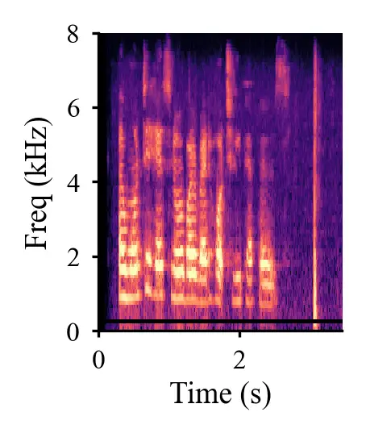  | 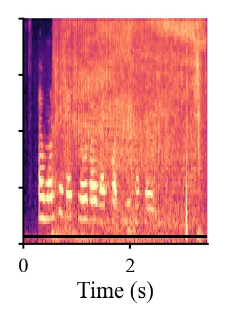  | 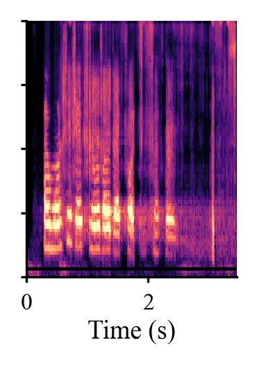  | 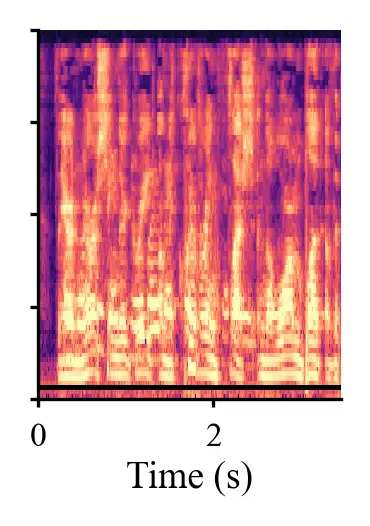  | 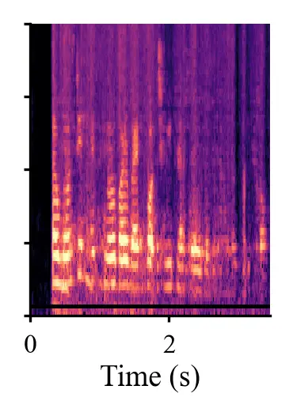  | 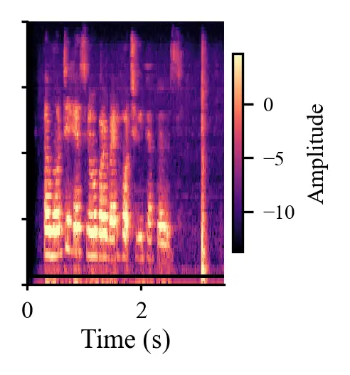  |
| “How old are you”                                            |                                                              |                                                              |                                                              |                                                              |                                                              |
| 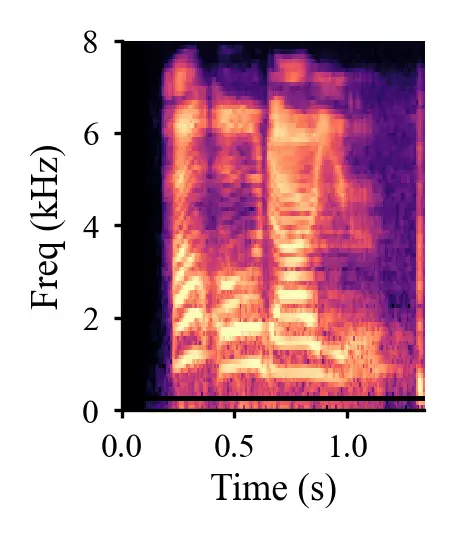  | 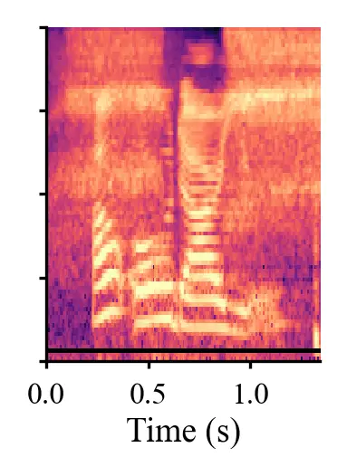  | 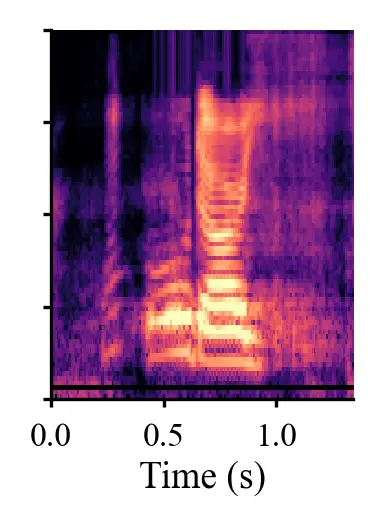  | 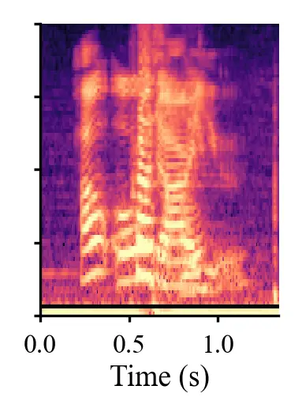 | 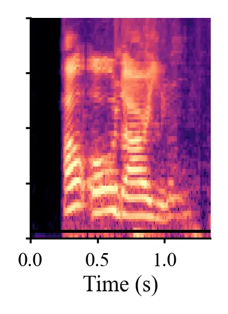 | 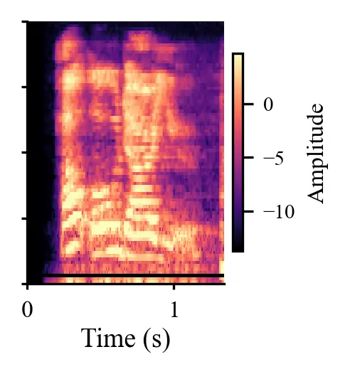 |
| “Weather report now”                                         |                                                              |                                                              |                                                              |                                                              |                                                              |
| 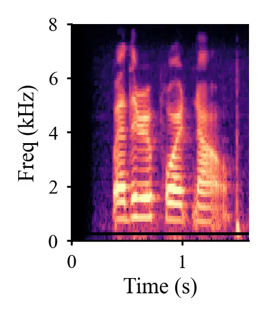 | 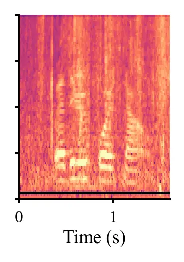 | 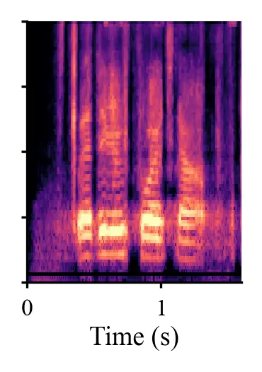 | 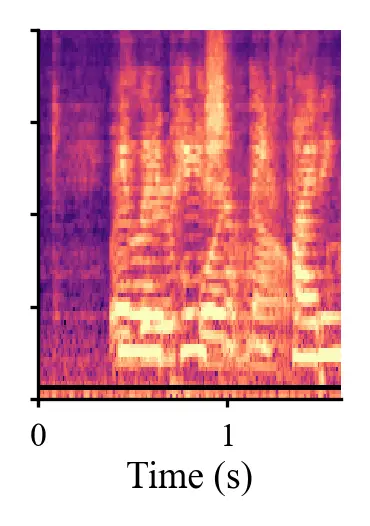 | 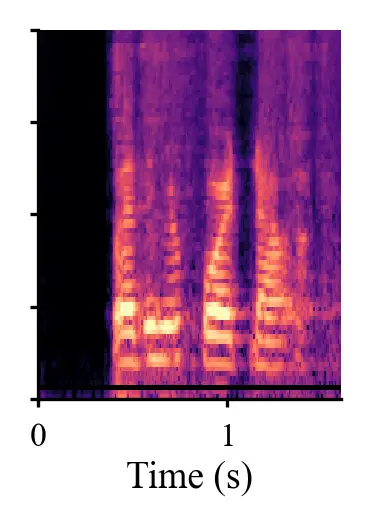 | 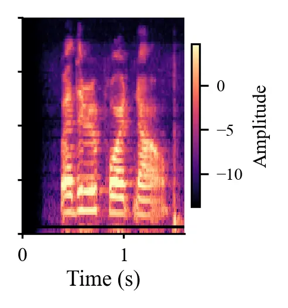 |
| “I would like it to help analyze ideas”                      |                                                              |                                                              |                                                              |                                                              |                                                              |
| 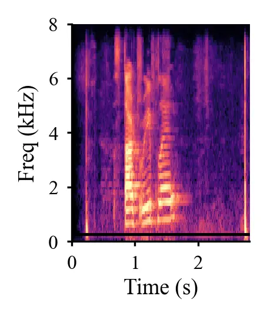 | 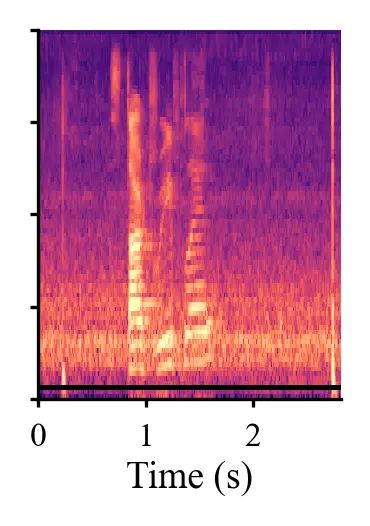 | 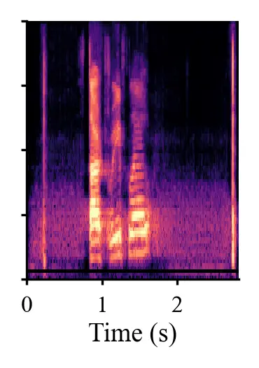 | 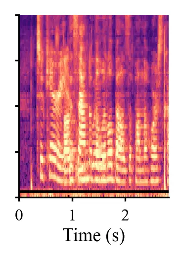 | 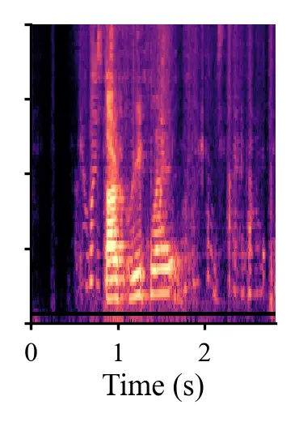 | 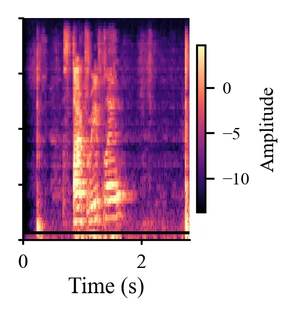 |
| “I’m going to sleep now”                                     |                                                              |                                                              |                                                              |                                                              |                                                              |
| 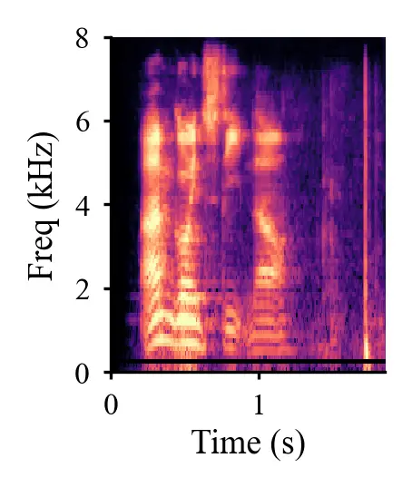 | 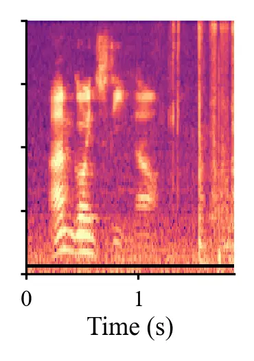 | 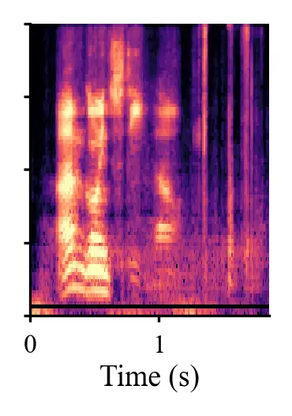 | 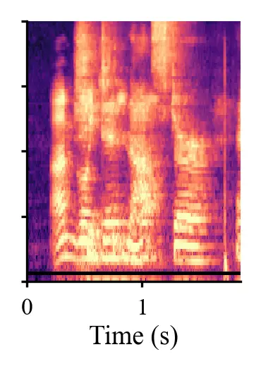 | 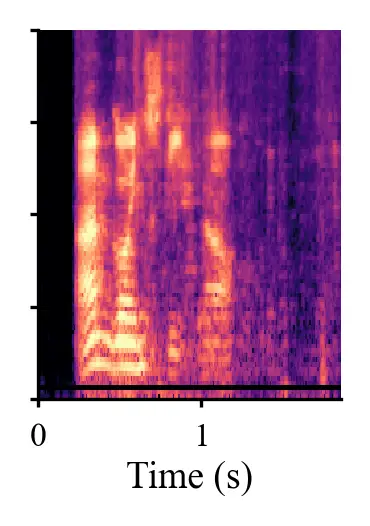 | 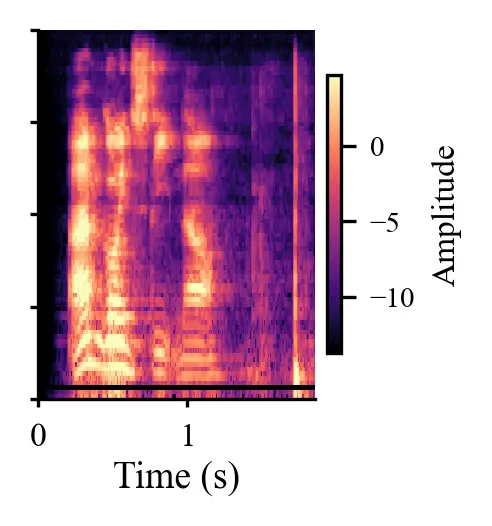 |

Figure 4: Log-mel spectrograms of five SLURP utterances (rows) across
all six conditions (columns). Horizontal axis: time (s); vertical axis:
frequency (kHz); colour: amplitude (log-mel energy, shared scale across
all panels). The ground-truth transcript of each utterance appears as a
centred heading above its row. Noisy floods the high-frequency band with
broadband noise. MetricGAN+ suppresses it but introduces vertical streak
artefacts (musical noise, visible above 4 kHz) and alters the harmonic
envelope. Echo (sim) shows a wholly different far-end utterance
dominating the near-end speech. Echo + DTLN-AEC partially restores the
near-end harmonic structure. Dereverb is visually closest to Clean,
consistent with its low ODR. Row 5 (“I’m going to sleep now”) is a
robust clip that does not diverge under any condition; all six panels
remain visually similar.
