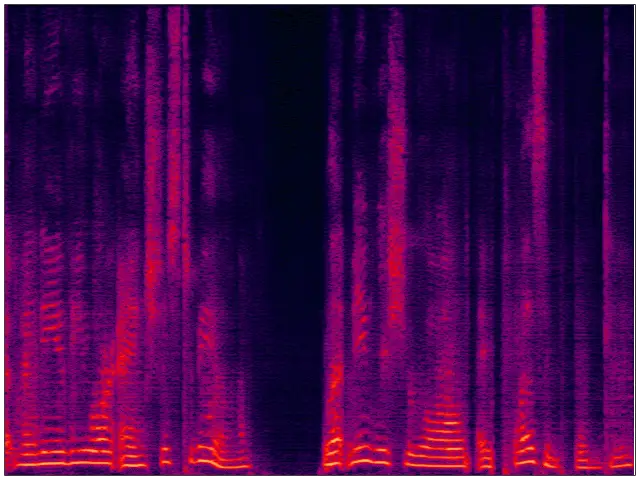
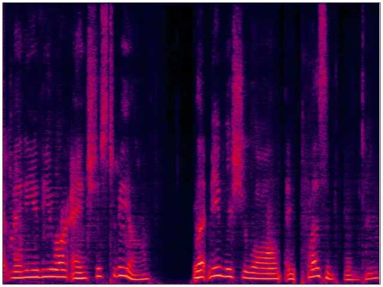
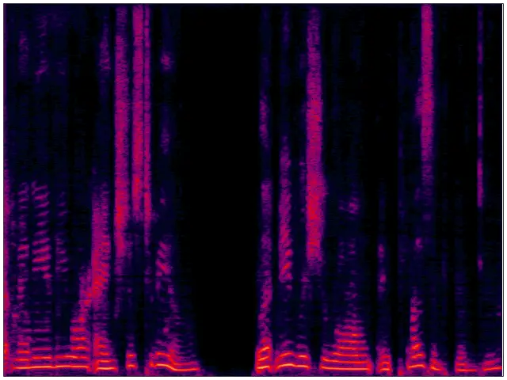
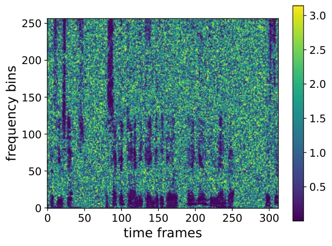
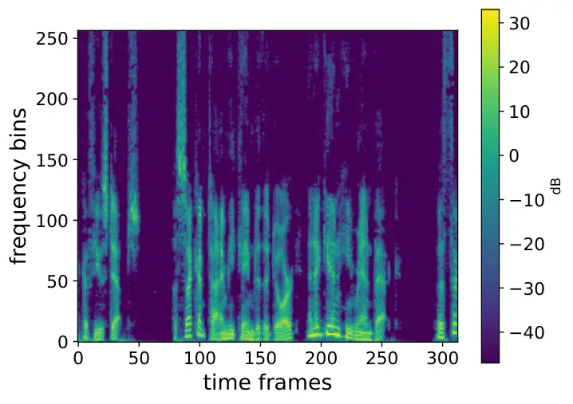
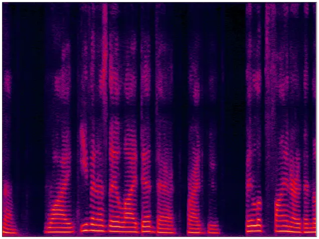
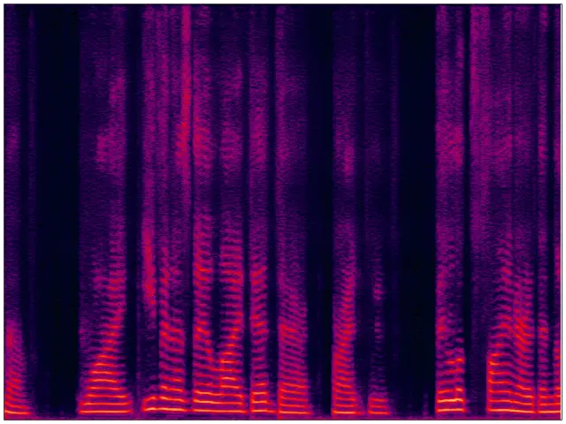
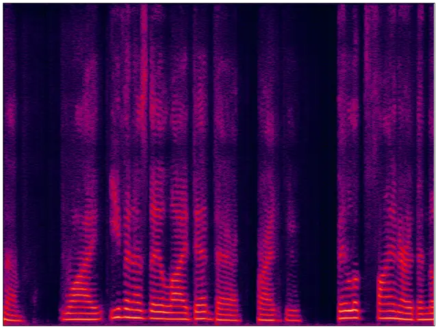
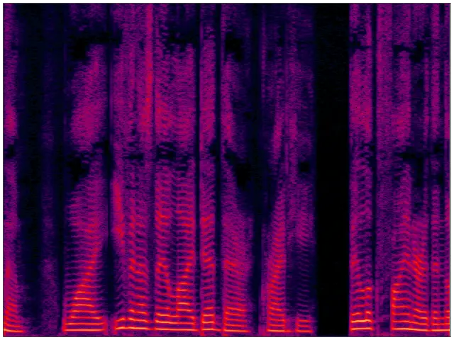

# TOWARDS BALANCED SPECTRAL RECONSTRUCTION: SPECTRALLY ADAPTIVE LOSS FOR STREAMING SPEECH ENHANCEMENT

###### Abstract

This paper proposes two spectrally weighted STFT loss functions for
lightweight streaming speech enhancement, addressing the magnitude
over-attenuation in mid-to-high frequency regions caused by the
magnitude-phase compensation effect. The proposed sigmoid-weighted loss
applies a smooth frequency-dependent modulation to the phase-aware
contribution, while the signal-dependent spectrally adaptive loss
further conditions the modulation on the ground-truth log-magnitude
spectrogram. To evaluate the proposed objectives, we additionally design
HyST-Net, a lightweight and competitive backbone with hybrid MHA-GRU
spectral-temporal modelling for low-latency streaming scenarios.
Experimental results exhibit consistent improvements in high-frequency
spectral reconstruction for both losses. The spectrally adaptive loss
further enhances the mid-frequency region, resulting in a more balanced
spectral reconstruction across the full frequency range.

|                                                                                                   |
| ------------------------------------------------------------------------------------------------- |
| Haixin Zhao and Nilesh Madhu                                                                      |
| IDLab, Department of Electronics and Information Systems, Ghent University - imec, Ghent, Belgium |
| {haixin.zhao, nilesh.madhu}@ugent.be                                                              |

Index Terms—  Speech enhancement, balanced STFT loss, speech loss
function, lightweight networks, streaming, magnitude-phase compensation

## 1 Introduction

Over the past decade, numerous lightweight deep neural network
architectures have been proposed for real-time and resource-constrained
speech enhancement (SE) \[1, 2, 3\]. Among these, convolutional
recurrent neural networks (CRNNs) \[1, 2, 4, 5\] model local patterns
through convolutional encoders and long-term temporal dependencies
through recurrent bottlenecks, but suffer from disproportionate
recurrent overhead caused by the flattening of frequency and channel
dimensions \[3\]. Dual-path RNNs \[6\] were introduced to model temporal
and spectral dependencies in an interleaving manner \[7, 8, 9, 10\],
reducing sequential modelling complexity via parameter sharing. Building
on this, FTF-Net incorporates multi-head attention (MHA \[11\]) blocks
alongside RNN units for joint, interleaved modelling \[3, 12\]. However,
RNN-based spectral modelling lacks parallelism, while causal MHA for
temporal modelling incurs a per-frame computational cost that grows
linearly with context length even with key-value caching \[13\]. Both
impose non-trivial overhead for real-time streaming inference on edge
devices.

Moreover, the stringent latency and computational constraints of
lightweight streaming SE scenarios bound model capacity. As compact
models offer limited representational capacity to compensate for biases
introduced by a suboptimal loss function, the design of the training
objective thus becomes a critical consideration. The compressed
phase-aware short-time Fourier transform (STFT) loss has been widely
adopted in SE methods \[14, 15\]. However, this formulation is
susceptible to a magnitude-phase compensation effect \[16\],
characterised by the network’s tendency to suppress magnitudes in
regions with unreliable phase predictions. This results in inaccurate
magnitude estimates that manifest as energy attenuation, particularly
pronounced in mid-to-high frequency components, thereby degrading
perceptual brightness.

The typical approach is to supplement the phase-aware loss with an
additional magnitude-domain term \[1, 2, 3, 17\]. However, as spectral
energy attenuation predominantly occurs in mid-to-high frequency
regions, a uniform weighting across the spectrogram inevitably trades
off noise suppression against perceptual fidelity, and thus reflects an
inherent compromise rather than a principled solution.

Contributions: To address the trade-off between over-attenuation at high
frequencies and noise suppression at low frequencies caused by the
compensation effect, we propose two spectrally weighted STFT objectives
that modulate the phase-aware loss contribution as a function of
frequency and signal characteristics. The sigmoid-weighted loss
$`\mathcal{L}_{\mathrm{Sig}}`$ applies a fixed frequency-dependent
sigmoid weighting to suppress the phase-aware contribution at higher
frequencies, while the spectrally adaptive loss
$`\mathcal{L}_{\mathrm{Adp}}`$ derives a signal-dependent frequency-wise
weight from the clean log-magnitude spectrogram. To evaluate the
proposed objectives, we further design HyST-Net, a lightweight and
competitive network with hybrid spectral-temporal modelling that serves
as a low-latency baseline network for streaming SE. Experimental results
show consistent improvements in high-frequency spectral reconstruction
for both losses, with $`\mathcal{L}_{\mathrm{Adp}}`$ further enhancing
mid-frequency reconstruction while maintaining overall enhancement
quality.

## 2 Methods

### 2.1 Spectrally Weighted STFT Loss Functions

|                                                             |                                                             |                                                             |
| ----------------------------------------------------------- | ----------------------------------------------------------- | ----------------------------------------------------------- |
|  |  |  |
| (a) $`\lambda=0`$                                           | (b) $`\lambda=0.3`$                                         | (c) $`\lambda=1`$                                           |

Fig. 1: Illustrative spectrograms of enhanced speech under varying
phase-aware loss weights $`\lambda\in\{0,0.3,1\}`$. A larger $`\lambda`$
improves noise suppression but causes over-attenuation in mid-to-high
frequencies due to the compensation effect.

The phase-aware compressed loss, originally proposed in \[14, 15\], has
been widely adopted in mainstream lightweight SE methods \[1, 2, 3\]. As
demonstrated in \[17\], combining a phase-aware component with a
magnitude-only loss yields improvements in instrumental metrics. The
combined loss is formulated as:

```math
\displaystyle\textstyle\mathcal{L}_{\mathrm{Mix}} \displaystyle=(1-\lambda)\mathcal{L}_{\mathrm{Mag}}+\lambda\mathcal{L}_{\mathrm{Pha}} \tag{1}
```

```math
\displaystyle=(1-\lambda)\lvert\bm{\widehat{S}}^{c}-\bm{S}^{c}\rvert^{2}+\lambda\lvert\bm{\widehat{S}}^{c}exp^{j\bm{\phi_{\widehat{S}}}}-\bm{S}^{c}exp^{j\bm{\phi_{S}}}\rvert^{2}
```

where $`\mathcal{L}_{\mathrm{Mag}}`$ and $`\mathcal{L}_{\mathrm{Pha}}`$
correspond to the compressed magnitude loss and the phase-aware loss,
respectively. $`S`$ and $`\widehat{S}`$ denotes the ground-truth and
estimated spectrogram, and $`c=0.3`$ is the power-compression factor.
$`\lambda`$ controls the trade-off between noise suppression and
spectral reconstruction. As illustrated in Fig. 1 (a) and (c), an
insufficient $`\lambda`$ leads to inadequate noise suppression, while an
excessive $`\lambda`$ causes pronounced over-attenuation, particularly
in mid-to-high frequency regions. This arises from the magnitude-phase
compensation effect \[16\]: when phase estimation is unreliable, the
phase-aware loss drives the estimated magnitude toward zero to minimise
its value, resulting in over-attenuation. To balance this trade-off,
$`\lambda=0.3`$ has been reported to yield the best instrumental metric
performance \[17\].

The compensation effect empirically exhibits spectrally non-uniform
over-attenuation across frequency, predominantly concentrated in
mid-to-high frequency regions \[3\]. The scalar weighting $`\lambda`$
therefore does not account for this spectral variation. To address this
limitation, we propose a sigmoid-weighted loss
$`\mathcal{L}_{\mathrm{Sig}}`$ that applies a frequency-dependent weight
to the phase-aware component:

```math
\textstyle\mathcal{L}_{\mathrm{Sig}}=0.7\cdot\mathcal{L}_{\mathrm{Mag}}+\lambda_{\mathrm{sig}}\cdot\sigma(\beta\cdot(f_{\mathrm{n}}-r))\cdot\mathcal{L}_{\mathrm{Pha}} \tag{2}
```

where $`\sigma`$ denotes the sigmoid function. $`f_{n}\in[0,1]`$ is the
normalised frequency variable with $`f_{n}=1`$ corresponds to the
Nyquist frequency bin. The cut-off ratio $`r`$, weighting coefficient
$`\lambda_{sig}`$, and steepness $`\beta`$ are empirically set to 0.4,
0.5, and -20, respectively. By introducing a smooth frequency-dependent
transition, $`\mathcal{L}_{\mathrm{Sig}}`$ suppresses the phase-aware
contribution in mid-to-high frequency regions where over-attenuation is
more severe, while avoiding spectral banding artefacts.

|                                                             |                                                             |
| ----------------------------------------------------------- | ----------------------------------------------------------- |
|  |  |
| (a) phase estimation error                                  | (b) ground-truth magnitude                                  |

Fig. 2: Phase estimation error and corresponding ground truth
log-magnitude spectrogram of an example utterance. A notable correlation
is observed between the two.

Nonetheless, $`\mathcal{L}_{\mathrm{Sig}}`$ applies a fixed
frequency-dependent weighting uniformly across all utterances,
regardless of signal characteristics. Empirically, phase estimation
accuracy exhibits a notable correlation with spectral magnitude. Regions
with higher magnitude tend to yield more accurate phase predictions,
while low-magnitude regions are more susceptible to phase estimation
errors, as illustrated in Fig. 2. To further address these limitations,
we propose a signal-dependent spectrally adaptive loss
$`\mathcal{L}_{\mathrm{Adp}}`$, where the ground-truth log-magnitude
spectrogram is used to derive a spectrally adaptive weight that
modulates the phase-aware loss contribution:

```math
\textstyle\mathcal{L}_{\mathrm{Adp}}=0.7\cdot\mathcal{L}_{\mathrm{Mag}}+\lambda_{\mathrm{adp}}\cdot\mathcal{F}_{s}(\mathcal{N}(\sigma(\mathbb{E}_{t}[\log\lvert\bm{S}\rvert])))\cdot\mathcal{L}_{\mathrm{Pha}} \tag{3}
```

where $`\mathcal{F}_{s}(\cdot)`$ is a 1D spectral smoothing operator,
and $`\mathcal{N}(\cdot)`$ is min-max normalisation.
$`\mathbb{E}_{t}[\cdot]`$ represents averaging along the time dimension.
The coefficient $`\lambda_{\mathrm{adp}}`$, sigmoid steepness and
cut-off are empirically set to 0.6, 15 and 0.5, respectively. The
steepness is smaller relative to $`\mathcal{L}_{\mathrm{Sig}}`$, as the
sigmoid here operates on log-magnitude rather than frequency.

Fig. 3: Architectures of the proposed hybrid spectral-temporal modelling
network (HyST-Net). In the bottleneck, $`B`$ denotes the batch size, and
$`T`$, $`F`$, and $`Ch=64`$ are the tensor sizes along time, frequency
and channel, respectively.

### 2.2 Streaming HyST-Net

To evaluate the proposed objectives under practical streaming scenarios,
we further design HyST-Net as a lightweight backbone. The architecture
is shown in Fig. 3. The real and imaginary parts of the compressed noisy
complex spectrogram $`\bm{X}(k,l)`$ are concatenated channel-wise as
input. HyST-Net estimates a complex-valued ideal ratio mask
$`\bm{\widehat{M}}_{c}(k,l)`$ in the compressed domain, defined as:

```math
\bm{\widehat{M}}_{\text{c}}(k,l)=\frac{|\bm{S}(k,l)|^{c}exp^{j\bm{\phi_{S}}(k,l)}}{|\bm{X}(k,l)|^{c}exp^{j\bm{\phi_{X}}(k,l)}+\gamma} \tag{4}
```

where $`k,l`$ index the frequency bin and time frame, respectively.
$`|\bm{S}(k,l)|^{c}exp^{j\bm{\phi_{S}}(k,l)}`$ denotes the compressed
clean reference spectrogram, and $`\gamma`$ is a small regularisation
constant for numerical stability. The enhanced complex spectrogram
$`\bm{\widehat{S}}(k,l)`$ is subsequently recovered by applying the
estimated mask followed by magnitude decompression.

HyST-Net adopts a U-Net architecture with a three-layer causal
convolutional encoder–decoder configured identically to FTF-Net \[3\],
with one-time-step buffer caches in convolutional layers to support
streaming inference. In the bottleneck, HyST-Net employs an interleaved
spectral-temporal modelling strategy. Unlike prior works that apply the
same sequential module, either RNN or transformer, across both
dimensions \[7, 8, 3\], HyST-Net tailors the module to each dimension by
applying MHA for spectral modelling and GRUs for temporal modelling.
This hybrid design exploits the complementary strengths of the two
architectures. For spectral modelling, all frequency bins at a given
time frame are simultaneously available, allowing MHA to leverage its
inherent parallelism and avoid the processing latency incurred by
recurrent spectral modelling. For temporal modelling, GRUs are preferred
for their compact recurrent state, which captures long-range context
efficiently without explicit attention over all past context time steps.
Although key-value caching \[13\] reduces causal MHA complexity to
linear in context length, its memory and computational overhead remain
non-trivial relative to GRUs in lightweight streaming scenarios. Three
interleaved spectral-temporal blocks are stacked in the bottleneck to
balance enhancement performance and computational cost for real-time
deployment.

## 3 Experiments

### 3.1 Experiment Setup

Experiments are conducted on the DNS Challenge dataset \[18\]. The
training set comprises 140 hours of synthesised wideband speech
generated from the clean speech and noise corpora provided by DNS, with
SNRs ranging from $`-5`$ dB to $`20`$ dB. Evaluation is performed on the
public synthetic test set from the DNS Challenge \[19\]. The STFT is
computed with a window length of 512 samples and 50% overlap. The
square-root von Hann window is used for analysis and synthesis. HyST-Net
is configured following \[3\], and is optimised using AdamW with
exponential decay rates of $`(0.9,0.99)`$. All proposed loss functions
are implemented in a multi-resolution form with STFT sizes
$`m\in\{320,512,768\}`$ and 50% overlap \[3\], denoted as
$`\mathcal{L}_{\mathrm{MR\_Mix}}`$, $`\mathcal{L}_{\mathrm{MR\_Sig}}`$,
and $`\mathcal{L}_{\mathrm{MR\_Adp}}`$.

### 3.2 Experimental Results

Model MACs \[M/s\] Param \[M\] RTF DNSMOS $`\uparrow`$ PESQ $`\uparrow`$
ESTOI $`\uparrow`$ SI-SDR $`\uparrow`$ Noisy speech - - - 2.48
($`\pm 0.49`$) 1.58 ($`\pm 0.46`$) 0.810 ($`\pm 0.121`$) 9.07
($`\pm 5.47`$) CRUSE4-64-1$`\times`$GRU2 301.2 2.85 0.26 3.22
($`\pm 0.20`$) 2.84 ($`\pm 0.66`$) 0.912 ($`\pm 0.067`$) 17.19
($`\pm 4.42`$) FTF-Net 318.2 0.14 1.05 3.23 ($`\pm 0.22`$) 2.91
($`\pm 0.66`$) 0.917 ($`\pm 0.065`$) 17.48 ($`\pm 4.42`$) HyST-Net 266.4
0.11 0.22 3.23 ($`\pm 0.21`$) 2.86 ($`\pm 0.66`$) 0.914 ($`\pm 0.068`$)
17.41 ($`\pm 4.46`$)

Table 1: Evaluation results of the proposed HyST-Net against lightweight
baselines under the causal streaming condition

Loss Overall Metrics HF ($`\bm{4-8\ kHz}`$) Metrics MF
($`\bm{2-4\ kHz}`$) Metrics DNSMOS $`\uparrow`$ PESQ $`\uparrow`$ ESTOI
$`\uparrow`$ SI-SDR $`\uparrow`$ C-RMSE $`\downarrow`$ M-RMSE
$`\downarrow`$ LSD $`\downarrow`$ SI-SDR $`\uparrow`$ C-RMSE
$`\downarrow`$ M-RMSE $`\downarrow`$ LSD $`\downarrow`$ SI-SDR
$`\uparrow`$ Noisy 2.48 1.58 0.810 9.07 0.0653 0.0604 12.16 10.96 0.1416
0.1288 12.1 8.31 $`\mathcal{L}_{\mathrm{MR\_Mix}}`$ 3.23 2.86 0.914
17.41 0.0273 0.0237 8.67 13.92 0.0539 0.0445 7.78 13.18
$`\mathcal{L}_{\mathrm{MR\_Sig}}`$ 3.21 2.81 0.912 17.36 0.0247 0.0201
7.48 14.36 0.0534 0.0452 7.88 13.24 $`\mathcal{L}_{\mathrm{MR\_Adp}}`$
3.21 2.85 0.914 17.33 0.0246 0.0200 7.49 14.35 0.0522 0.0427 7.46 13.48

Table 2: Evaluation results on proposed loss functions based on HyST-Net

#### 3.2.1 Validation of the baseline network

Table 1 compares HyST-Net against representative lightweight baselines
from both the CRNN-based paradigm (CRUSE \[1\]) and the
interleaved-modelling paradigm (FTF-Net \[3\]). All models are
implemented causally, supporting frame-by-frame streaming with an
algorithmic latency of 32 ms, and follow the same complex-valued
compressed-domain mask formulation. They are trained with the
multi-resolution baseline loss $`\mathcal{L}_{\mathrm{MR\_Mix}}`$ \[3\].
For CRUSE, a variant with a bottleneck channel size of 64, one GRU, and
a group factor of 2 is included as a representative of comparable
computational scale.

Performance is evaluated using DNSMOS P.835 \[20\], PESQ \[21\], ESTOI
\[22\], and SI-SDR \[23\], with computational overhead characterised by
MACs, parameter count, and real-time factor (RTF). RTF is measured under
strict frame-by-frame streaming on a single thread of Intel Xeon Silver
4310 CPU without block-wise buffering, ensuring fair comparison under
minimal-latency streaming conditions. No ONNX-based optimisation is
applied to the reported values.

As shown in Table 1, HyST-Net achieves enhancement performance
comparable to FTF-Net across all metrics while reducing MACs by 16.3%
and parameters by 21%. More importantly for streaming deployment,
HyST-Net attains an RTF of 0.22, approximately 4.77 $`\times`$ faster
than FTF-Net (RTF 1.05) on CPU. The high RTF of FTF-Net is largely
attributable to the recurrent bottleneck introduced by RNN-based
spectral modelling, which our hybrid design avoids through parallel
MHA-based spectral processing. Compared to CRUSE, HyST-Net achieves
comparable or better performance at a similar RTF with 96% fewer
parameters. These results validate HyST-Net as a competitive backbone
for evaluating the proposed loss functions under practical streaming
conditions.

#### 3.2.2 Evaluation of proposed loss functions

|                                                             |                                                             |
| ----------------------------------------------------------- | ----------------------------------------------------------- |
|  |  |
| (a) $`\mathcal{L}_{\mathrm{MR\_Mix}}`$                      | (b) $`\mathcal{L}_{\mathrm{MR\_Sig}}`$                      |
|  |  |
| (c) $`\mathcal{L}_{\mathrm{MR\_Adp}}`$                      | (d) clean                                                   |

Fig. 4: Enhanced spectrograms of an example utterance under different
loss functions. $`\mathcal{L}_{\mathrm{MR\_Adp}}`$ reconstructs more
energy in mid-to-high frequency regions while maintaining effective
noise suppression at low frequencies.

Table 2 compares the proposed $`\mathcal{L}_{\mathrm{MR\_Sig}}`$ and
$`\mathcal{L}_{\mathrm{MR\_Adp}}`$ against the baseline
$`\mathcal{L}_{\mathrm{MR\_Mix}}`$, all trained on HyST-Net under the
same multi-resolution configuration described in Sec. 3.1. As overall
metrics such as PESQ, ESTOI, and DNSMOS are dominated by low-frequency
components and are relatively less sensitive to distortions in
mid-to-high frequencies, evaluation is further conducted in the MF (2–4
kHz) and HF (4–8 kHz) regions using complex root-mean-squared error
(C-RMSE), magnitude root-mean-squared error (M-RMSE), log-spectral
distance (LSD) \[24\], and SI-SDR. The first three are computed directly
from spectral coefficients within each band, while SI-SDR is obtained
after band-pass filtering in the time domain. As shown in Table 2, both
$`\mathcal{L}_{\mathrm{MR\_Sig}}`$ and
$`\mathcal{L}_{\mathrm{MR\_Adp}}`$ achieve overall metrics on par with
$`\mathcal{L}_{\mathrm{MR\_Mix}}`$. This is expected, as the proposed
losses retain a comparably high phase-aware weighting at low
frequencies, and the instrumental metrics are generally dominated by
low-frequency components.

In the HF region, both proposed losses yield consistent improvements
over the baseline, reducing C-RMSE and M-RMSE by approximately 9.5% and
15.2%, respectively, with gains of 1.18 dB in LSD and 0.43 dB in SI-SDR.
These results indicate that the proposed
$`\mathcal{L}_{\mathrm{MR\_Sig}}`$ and
$`\mathcal{L}_{\mathrm{MR\_Adp}}`$ achieve improved spectral
reconstruction in the high frequency regions by modulating the
phase-aware contribution spectrally.

In the mid-frequencies, $`\mathcal{L}_{\mathrm{MR\_Adp}}`$ consistently
outperforms both $`\mathcal{L}_{\mathrm{MR\_Sig}}`$ and
$`\mathcal{L}_{\mathrm{MR\_Mix}}`$ across all metrics. This advantage is
likely linked to the signal-dependent weighting of
$`\mathcal{L}_{\mathrm{MR\_Adp}}`$, which adapts the phase-aware
contribution to frequency-wise spectral energy. In contrast, the fixed
sigmoid modulation in $`\mathcal{L}_{\mathrm{MR\_Sig}}`$ is
signal-agnostic and may not capture such variation. The consistent
improvements in C-RMSE and M-RMSE across both MF and HF regions further
confirm that $`\mathcal{L}_{\mathrm{MR\_Adp}}`$ achieves enhanced
spectral reconstruction across the mid-to-high frequency range.

This is also visually confirmed in Fig. 4, which presents the enhanced
spectrograms of an example utterance under each loss function alongside
the clean reference. Compared to $`\mathcal{L}_{\mathrm{MR\_Mix}}`$ and
$`\mathcal{L}_{\mathrm{MR\_Sig}}`$, $`\mathcal{L}_{\mathrm{MR\_Adp}}`$
improves the spectral reconstruction across the mid-to-high frequency
regions with reduced over-attenuation, while the low-frequency harmonic
structures remain clearly preserved, without introducing noticeable
artefacts. As spectrograms offer limited insight into perceptual
quality, the audio samples and frequency-wise weight visualisations are
available at:
[https://aspire.ugent.be/demos/IWAENC2026HZ/](https://aspire.ugent.be/demos/IWAENC2026HZ/)
for better appreciation of the improved spectral reconstruction.

## 4 Conclusions

To address the magnitude over-attenuation in mid-to-high frequency
regions, we propose two spectrally weighted
$`\mathcal{L}_{\mathrm{Sig}}`$ and $`\mathcal{L}_{\mathrm{Adp}}`$, that
modulate the phase-aware loss contribution as a function of frequency
and signal characteristics. Experimental results show that HyST-Net
serves as a competitive lightweight backbone for the proposed objective
evaluations in streaming SE. Moreover, both losses yield consistent
improvements in high-frequency reconstruction metrics, with
$`\mathcal{L}_{\mathrm{Adp}}`$ further enhancing mid-frequency
reconstruction through signal-dependent weighting while maintaining
overall enhancement quality. Overall, the proposed spectrally adaptive
loss achieves a more balanced spectral reconstruction across the full
frequency range, alleviating the inherent trade-off between noise
suppression and over-attenuation.

## References

- \[1\] S. Braun, H. Gamper, C. K. Reddy, and I. Tashev, “Towards
  efficient models for real-time deep noise suppression,” in _ICASSP
  2021 - 2021 IEEE International Conference on Acoustics, Speech and
  Signal Processing (ICASSP)_, 2021, pp. 656–660.
- \[2\] H. Schröter, A. Maier, A. Escalante-B, and T. Rosenkranz,
  “Deepfilternet2: Towards real-time speech enhancement on embedded
  devices for full-band audio,” in _2022 International Workshop on
  Acoustic Signal Enhancement (IWAENC)_, 2022, pp. 1–5.
- \[3\] H. Zhao and N. Madhu, “Study of lightweight transformer
  architectures for single-channel speech enhancement,” in _2025 33rd
  European Signal Processing Conference (EUSIPCO)_, 2025, pp. 101–105.
- \[4\] H. Wu, K. Tan, B. Xu, A. Kumar, and D. Wong, “Rethinking
  Complex-Valued Deep Neural Networks for Monaural Speech Enhancement,”
  in _Interspeech 2023_, 2023, pp. 3889–3893.
- \[5\] S. Girirajan and A. Pandian, “Real-time speech enhancement based
  on convolutional recurrent neural network.” _Intelligent Automation &
  Soft Computing_, vol. 35, no. 2, 2023.
- \[6\] Y. Luo, Z. Chen, and T. Yoshioka, “Dual-path rnn: Efficient long
  sequence modeling for time-domain single-channel speech separation,”
  in _ICASSP 2020 - 2020 IEEE International Conference on Acoustics,
  Speech and Signal Processing (ICASSP)_, 2020, pp. 46–50.
- \[7\] X. Rong, T. Sun, X. Zhang, Y. Hu, C. Zhu, and J. Lu, “GTCRN: A
  speech enhancement model requiring ultralow computational resources,”
  in _ICASSP 2024 IEEE International Conference on Acoustics, Speech and
  Signal Processing (ICASSP)_, 2024, pp. 971–975.
- \[8\] L. Yang, W. Liu, R. Meng, G. Lee, S. Baek, and H.-G. Moon,
  “Fspen: an ultra-lightweight network for real time speech enahncment,”
  in _ICASSP 2024-2024 IEEE International Conference on Acoustics,
  Speech and Signal Processing (ICASSP)_. IEEE, 2024, pp. 10 671–10 675.
- \[9\] X. Le, H. Chen, K. Chen, and J. Lu, “DPCRN: Dual-Path
  Convolution Recurrent Network for Single Channel Speech Enhancement,”
  in _Interspeech 2021_, 2021, pp. 2811–2815.
- \[10\] H. Il Koh, S. Na, and M. N. Kim, “LSENet: A lightweight
  spectral enhancement network for high-quality speech processing on
  resource-constrained platforms,” _IEEE Access_, vol. 13, pp.
  116 934–116 943, 2025.
- \[11\] A. Vaswani, N. Shazeer, N. Parmar, J. Uszkoreit, L. Jones,
  A. N. Gomez, L. u. Kaiser, and I. Polosukhin, “Attention is all you
  need,” in _Advances in Neural Information Processing Systems_,
  I. Guyon, U. V. Luxburg, S. Bengio, H. Wallach, R. Fergus,
  S. Vishwanathan, and R. Garnett, Eds., vol. 30. Curran Associates,
  Inc., 2017. \[Online\]. Available:
  [https://proceedings.neurips.cc/paper_files/paper/2017/file/3f5ee243547dee91fbd053c1c4a845aa-Paper.pdf](https://proceedings.neurips.cc/paper_files/paper/2017/file/3f5ee243547dee91fbd053c1c4a845aa-Paper.pdf)
- \[12\] H. Zhao, K. Yang, and N. Madhu, “Dynamically slimmable speech
  enhancement network with metric-guided training,” in _ICASSP 2026 IEEE
  International Conference on Acoustics, Speech and Signal Processing
  (ICASSP)_, 2026, available at https://arxiv.org/abs/2510.11395.
  \[Online\]. Available:
  [https://arxiv.org/abs/2510.11395](https://arxiv.org/abs/2510.11395)
- \[13\] N. Shazeer, “Fast transformer decoding: One write-head is all
  you need,” _arXiv preprint arXiv:1911.02150_, 2019.
- \[14\] A. Ephrat, I. Mosseri, O. Lang, T. Dekel, K. Wilson,
  A. Hassidim, W. T. Freeman, and M. Rubinstein, “Looking to listen at
  the cocktail party: a speaker-independent audio-visual model for
  speech separation,” _ACM Trans. Graph._, vol. 37, no. 4, Jul. 2018.
  \[Online\]. Available:
  [https://doi.org/10.1145/3197517.3201357](https://doi.org/10.1145/3197517.3201357)
- \[15\] K. Wilson, M. Chinen, J. Thorpe, B. Patton, J. Hershey, R. A.
  Saurous, J. Skoglund, and R. F. Lyon, “Exploring tradeoffs in models
  for low-latency speech enhancement,” in _2018 16th International
  Workshop on Acoustic Signal Enhancement (IWAENC)_, 2018, pp. 366–370.
- \[16\] Z.-Q. Wang, G. Wichern, and J. Le Roux, “On the compensation
  between magnitude and phase in speech separation,” _IEEE Signal
  Processing Letters_, vol. 28, pp. 2018–2022, 2021.
- \[17\] S. Braun and I. Tashev, “A consolidated view of loss functions
  for supervised deep learning-based speech enhancement,” in _2021 44th
  International Conference on Telecommunications and Signal Processing
  (TSP)_, 2021, pp. 72–76.
- \[18\] C. K. Reddy, H. Dubey, K. Koishida, A. Nair, V. Gopal,
  R. Cutler, S. Braun, H. Gamper, R. Aichner, and S. Srinivasan,
  “Interspeech 2021 deep noise suppression challenge,” in _Interspeech
  2021_, 2021, pp. 2796–2800.
- \[19\] C. K. Reddy, V. Gopal, R. Cutler, E. Beyrami, R. Cheng,
  H. Dubey, S. Matusevych, R. Aichner, A. Aazami, S. Braun, P. Rana,
  S. Srinivasan, and J. Gehrke, “The INTERSPEECH 2020 Deep Noise
  Suppression Challenge: Datasets, Subjective Testing Framework, and
  Challenge Results,” in _Interspeech 2020_, 2020, pp. 2492–2496.
- \[20\] C. K. Reddy, V. Gopal, and R. Cutler, “DNSMOS p. 835: A
  non-intrusive perceptual objective speech quality metric to evaluate
  noise suppressors,” in _Proc. IEEE Intl. Conference on Acoustics,
  Speech and Signal Processing (ICASSP)_. IEEE, 2022, pp. 886–890.
- \[21\] International Telecommunication Union, “Wideband extension to
  Recommendation P.862 for the assessment of wideband telephone networks
  and speech codecs,” ITU-T Recommendation P.862.2, 2007.
- \[22\] C. H. Taal, R. C. Hendriks, R. Heusdens, and J. Jensen, “A
  short-time objective intelligibility measure for time-frequency
  weighted noisy speech,” in _2010 IEEE international conference on
  acoustics, speech and signal processing_. IEEE, 2010, pp. 4214–4217.
- \[23\] J. Le Roux, S. Wisdom, H. Erdogan, and J. R. Hershey,
  “Sdr–half-baked or well done?” in _ICASSP 2019-2019 IEEE International
  Conference on Acoustics, Speech and Signal Processing (ICASSP)_. IEEE,
  2019, pp. 626–630.
- \[24\] A. Abramson and I. Cohen, “Simultaneous detection and
  estimation approach for speech enhancement,” _IEEE Transactions on
  Audio, Speech, and Language Processing_, vol. 15, no. 8, pp.
  2348–2359, 2007.
