# Cleaner Speech, Weaker Generalization: Revisiting Pitt-Derived Benchmarks for Alzheimer’s Disease Detection

Luqi Sun Affiliation:  Center for Language and Speech Processing (CLSP),
Johns Hopkins University Email: [lsun59@jhu.edu](mailto:)    Shreeram
Suresh Chandra Email: [sisman@jhu.edu](mailto:)    Lin Zhang    You-Jin
Li Affiliation:  Research Center for Information Technology Innovation,
Academia Sinica    Brian MacWhinney Affiliation:  University of
Michigan, Ann Arbor    Yu Tsao Affiliation:  Research Center for
Information Technology Innovation, Academia Sinica    Emily Mower
Provost Affiliation:  Carnegie Mellon University    Berrak Sisman
Affiliation:  Center for Language and Speech Processing (CLSP), Johns
Hopkins University

###### Abstract

Speech-based Alzheimer’s disease (AD) detection increasingly relies on
speech-enhanced and curated versions of the Pitt Corpus, where speech
enhancement, sample selection, and demographic balancing are often
treated as beneficial preprocessing steps. However, whether these
transformations improve real-world AD detection or instead affect model
generalization and prediction behavior remains unclear. In this work, we
revisit the role of speech preprocessing and dataset curation across
widely used benchmarks for speech-based AD detection. We evaluate the
speech quality of different datasets, the cross-dataset generalization
of multiple deep learning models under matched and mismatched
enhancement settings, and the behavior of several recent large
audio-language models (LALMs). Experimental results show that across
multiple supervised speech models, speech-enhanced datasets often
improve in-domain performance while reducing robustness in cross-domain
evaluation. Matched enhancement between training and test data
alleviates, but does not eliminate, this degradation. LALMs show a
similar sensitivity: enhanced datasets induce stronger class imbalance
and prediction shifts than unprocessed data. These results suggest that
speech preprocessing and dataset curation can substantially influence
downstream AD detection behavior, indicating that “cleaner” speech
datasets are not necessarily more reliable for real-world AD detection.

^(†)^(†)footnotetext: ^(†) These two authors contributed equally as
second authors.^(†)^(†)footnotetext: We publish our code here:
[https://github.com/Sleepwalker554/Back_to_Origin](https://github.com/Sleepwalker554/Back_to_Origin)

## 1 Introduction

Alzheimer’s disease (AD) is the leading cause of dementia worldwide and
poses a rapidly growing social and economic burden Europe (2019); Better
(2023). As the number of individuals living with dementia continues to
rise globally Scheltens et al. (2021), there is increasing interest in
developing robust and cost-effective approaches for early AD detection.
Among different modalities, speech has emerged as a promising signal due
to its non-invasive nature, low collection cost, and sensitivity to
cognitive decline Yang et al. (2022); Ding et al. (2024).

In speech-based AD detection, the Pitt Corpus Becker et al. (1994) is
the most widely used English benchmark dataset. It contains four tasks,
among which the “Cookie Theft” task from the Boston Diagnostic Aphasia
Examination Goodglass and Kaplan (1983) collected spontaneous speech,
and therefore has been the most widely used in research. In this task,
all participants (both participants with AD and healthy controls) were
asked to describe a picture depicting the “cookie theft” scene.
Importantly, the Pitt Corpus exists in two versions: the original
Pitt-origin recordings and the noise-reduced Pitt version (Pitt), both
distributed through DementiaBank Lanzi et al. (2023). Since the two
datasets are otherwise identical, prior studies often do not explicitly
distinguish between them, leaving the impact of speech preprocessing on
downstream AD detection models largely unexplored.

Beyond Pitt and Pitt-origin, several influential AD detection challenges
have introduced additional Pitt-derived datasets, including ADReSS Luz
et al. (2020), ADReSSo Luz et al. (2021), and ADReSS-M Luz et al.
(2023). These datasets are all constructed from the “Cookie Theft”
picture description task in the original Pitt-origin dataset, but apply
different preprocessing and curation strategies, such as speech
enhancement, volume normalization, demographic balancing, and sample
selection. While these processing steps are often intended to improve
data quality and evaluation fairness, they also alter the original
speech distribution and reduce the dataset size.

Despite the widespread use of Pitt-derived datasets such as Pitt,
ADReSS, ADReSSo, and ADReSS-M, the effects of speech preprocessing and
dataset curation on downstream AD detection remain insufficiently
understood. Although these datasets originate from the same “Cookie
Theft” picture description recordings in Pitt-origin, they apply
different preprocessing and selection strategies, including denoising,
volume normalization, demographic balancing, and sample filtering. While
such processing can improve perceptual speech quality and simplify
evaluation, it may also alter the original speech distribution and
affect model generalization across datasets and recording conditions. In
addition, the reduced dataset size in ADReSS, ADReSSo, and ADReSS-M may
increase the risk of overfitting to specific data distributions. As a
result, models trained on curated datasets may achieve strong in-domain
performance while exhibiting reduced robustness in cross-domain
settings.

This paper revisits how speech preprocessing and dataset curation affect
AD detection across multiple modeling paradigms. We evaluate Pitt-origin
alongside several widely used Pitt-derived datasets under both in-domain
and cross-domain settings, using matched and mismatched speech
enhancement conditions and multiple state-of-the-art enhancement
methods. Our experiments span diverse AD detection architectures,
including acoustic-feature-based models, self-supervised speech
representation models based on XLS-R Conneau et al. (2021), and
Sensitive Layer Selection (SLS)-based models Zhang et al. (2024) built
on pretrained speech encoders. We further analyze whether recent LALMs,
including Kimi-Audio Ding et al. (2025), Qwen3-Omni Xu et al. (2025),
Qwen2-Audio Chu et al. (2024), Audio Flamingo 3 Ghosh et al. (2026), and
ultravox-v0_5-llama-3_2-1b Fixie.ai (2025), exhibit similar sensitivity
to preprocessing under both audio-only and audio + transcript settings.
The observed effects remain consistent across acoustic-feature-based
models, pretrained speech representation models, and LALMs, suggesting
that preprocessing sensitivity is not limited to a specific
architecture.

Contributions. This paper makes three main contributions: (1) We provide
the first systematic benchmark-level analysis of how preprocessing and
dataset curation affect downstream AD detection across widely used
Pitt-derived datasets. (2) We show that although speech-enhanced
datasets can improve in-domain evaluation performance, they frequently
reduce robustness in cross-domain evaluation, even under matched
enhancement settings. (3) We demonstrate that these effects persist
across multiple modeling paradigms, including acoustic-feature-based
models, pretrained speech representation models, and recent LALMs,
indicating that preprocessing sensitivity is a broader modeling
phenomenon rather than an architecture-specific artifact.

## 2 Benchmark Datasets and Related Work

### 2.1 Datasets

The following are six of the most widely used English datasets for
speech-based Alzheimer’s disease detection. The sample sizes of these
six datasets are shown in Table 1, and all of them are available through
DementiaBank Lanzi et al. (2023). More detailed information about the
datasets is shown in Appendix A.

1.  1.  Pitt-origin: Pitt-origin Becker et al. (1994) contains four tasks,
        including the “Cookie Theft” picture description task Goodglass and
        Kaplan (1983) for all participants, and three tasks only for
        participants with AD: semantic fluency, sentence construction, and
        story recall. The “Cookie Theft” picture description task requires
        participants to orally describe the content of the picture. Since
        this task is based on spontaneous speech and contains language
        samples from both participants with AD and healthy controls, it has
        been widely used.
2.  2.  Pitt: Pitt is a denoised version of Pitt-origin Becker et al. (1994)
        with the same recordings and sample size. However, the speech
        enhancement pipeline used to construct the dataset was not publicly
        released.
3.  3.  ADReSS: ADReSS Luz et al. (2020) was released as part of the ADReSS
        Challenge held at Interspeech 2020. All speech samples are derived
        from Pitt-origin Becker et al. (1994), and have undergone speech
        enhancement processing (the enhancement method was not released).
        The dataset was also matched in terms of age and gender.
4.  4.  ADReSSo: ADReSSo Luz et al. (2021) was released as part of the
        ADReSSo Challenge held at Interspeech 2021. All speech samples are
        derived from Pitt-origin Becker et al. (1994), and have undergone
        speech enhancement processing (the enhancement method was not
        released). The dataset was also matched for age and gender. Compared
        with ADReSS, ADReSSo expanded the sample size.
5.  5.  ADReSS-M: ADReSS-M Luz et al. (2023) was released as part of the
        ADReSS-M Challenge held at ICASSP 2023. This dataset uses the same
        speech samples as ADReSSo, with the same quantity. In contrast to
        ADReSSo, ADReSS-M did not undergo any speech preprocessing.
6.  6.  English Lu Corpus: Lu Lanzi et al. (2023) is an English speech
        dataset independent of Pitt-origin, collected under different
        recording conditions and from different participant populations.
        Similar to Pitt-origin, the dataset is based on the “Cookie Theft”
        picture description task and contains spontaneous speech recordings
        without speech preprocessing.

|                    |       |     |         |
| ------------------ | ----- | --- | ------- |
| Dataset            | Total | AD  | Control |
| Pitt-origin / Pitt | 552   | 309 | 243     |
| ADReSS             | 156   | 78  | 78      |
| ADReSSo / ADReSS-M | 237   | 122 | 115     |
| Lu                 | 56    | 27  | 29      |

Table 1: Sample numbers of datasets.

### 2.2 Datasets Speech Quality

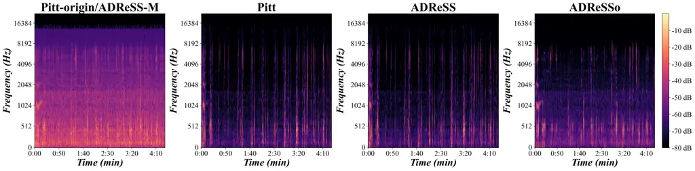

Figure 1: Mel spectrograms of the same participant with AD across
Pitt-origin and its derived datasets.

Since Pitt-origin and its four derived datasets originate from the same
recordings, we visualize Mel spectrograms for the same participant
across all five datasets. As shown in Figure 1, background noise is
substantially more prominent in the unprocessed datasets (Pitt-origin
and ADReSS-M) than in the denoised datasets (Pitt, ADReSS, and ADReSSo).
The denoised datasets exhibit cleaner spectral patterns and reduced
background interference, indicating that preprocessing introduces
noticeable distributional differences across the datasets.

To further quantify these differences, we evaluate speech quality of the
five datasets using DNSMOS Reddy et al. (2021), a widely used
non-intrusive speech quality assessment metric. DNSMOS can evaluate
speech samples from three dimensions, including speech quality (SIG),
background-noise quality (BAK), and overall quality (OVRL). As shown in
Table 2, the denoised datasets consistently achieve substantially higher
BAK scores than Pitt-origin and ADReSS-M, while SIG scores remain
relatively similar across datasets. These results confirm that speech
enhancement significantly alters background-noise characteristics.

|             |                  |                 |                 |
| ----------- | ---------------- | --------------- | --------------- |
| Dataset     | OVRL$`\uparrow`$ | SIG$`\uparrow`$ | BAK$`\uparrow`$ |
| Pitt-origin | 2.3073           | 2.9819          | 2.7290          |
| Pitt        | 2.5606           | 3.0479          | 3.6024          |
| ADReSS      | 2.5923           | 3.0857          | 3.5945          |
| ADReSSo     | 2.5222           | 3.0373          | 3.1829          |
| ADReSS-M    | 2.3128           | 2.9805          | 2.6973          |

Table 2: DNSMOS scores of Pitt-origin and its derived datasets. (SIG:
speech quality; BAK: background noise quality; OVRL: overall speech
quality.)

### 2.3 Existing AD Detection Models

Early AD detection studies primarily explored traditional machine
learning approaches. For example, the ADReSS Luz et al. (2020),
ADReSSo Luz et al. (2021) and ADReSS-M Luz et al. (2023) Challenges
adopted support vector machines as a baseline, while Hason et al. Hason
and Krishnan (2022) used random forests for speech-based AD detection.

More recently, deep learning has become the dominant paradigm in AD
detection. Existing studies have explored hybrid architectures
incorporating disfluency-related paralinguistic features Jin et al.
(2023), end-to-end ASR-based frameworks Lin et al. (2024), and
transformer-based models for speech-level AD recognition Dong et al.
(2024). Pu and Zhang et al. Pu and Zhang (2025) further incorporated
pause information into Transformer-based language models for AD
detection. Recent work has also begun exploring large language models
and large audio-language models for AD detection. For example, Heitz et
al. Heitz et al. (2025) used GPT-4 to extract semantic features from
spontaneous speech transcripts, while Park et al. Park et al. (2025)
applied Chain-of-Thought reasoning and supervised fine-tuning for AD
detection.

## 3 Methodology

### 3.1 Preprocessing and Distribution Shift

Speech enhancement and denoising methods inevitably modify the acoustic
characteristics of speech signals Xia et al. (2020). Common effects
include enhancement artifacts Iwamoto et al. (2022), spectral
smoothing Li et al. (2018), and other forms of signal distortion. These
distortions not only affect the naturalness of speech but may also have
a negative impact on downstream models. For example, prior work in
automatic speech recognition (ASR) has shown that speech enhancement
does not necessarily improve downstream recognition performance and can
even reduce robustness under mismatched conditions Yoshioka et al.
(2015); Chen et al. (2018); Menne et al. (2019).

At the same time, speech enhancement methods, whether based on
traditional signal processing or deep learning approaches, can shift the
distribution of naturally recorded speech, thereby introducing a
significant domain shift Scheibler et al. (2024); Frankel et al. (2025).
This issue is particularly relevant for Alzheimer’s detection
benchmarks. Widely used datasets such as Pitt, ADReSS, and ADReSSo are
constructed from Pitt-origin using different preprocessing and curation
pipelines, while the exact enhancement procedures were not publicly
released. As a result, models trained on these datasets may learn
representations associated with processed speech distributions rather
than naturally recorded speech. However, real-world clinical speech is
typically collected under uncontrolled recording conditions and does not
undergo standardized enhancement.

This mismatch raises an important question: Do speech enhancement,
preprocessing, and dataset curation improve the robustness of AD
detection models, or instead introduce distribution shifts that reduce
generalization across datasets and recording conditions?

### 3.2 AD Detection Models

Traditional Deep Learning Models. We evaluate enhancement effects across
three AD detection architectures with increasing modeling complexity: an
acoustic-feature-based eGeMAPS model Eyben et al. (2015), a
self-supervised speech representation model based on XLS-R Conneau et
al. (2021), and a Sensitive Layer Selection (SLS)-based model Zhang et
al. (2024) built on pretrained speech encoders. Model architectures are
illustrated in Appendix D. Among these models, we use the SLS-based
model as the primary architecture due to its strong performance in
recent speech classification tasks. The model extracts frame-level
representations from a frozen pretrained XLS-R encoder and applies
Sensitive Layer Selection (SLS) Zhang et al. (2024) to learn weighted
combinations of Transformer-layer representations, and then performs
downstream classification through a classification head.

During the model training phase, we use an 80%/20% train-validation
split for each dataset with no speaker overlap. Models are trained only
on training data under both in-domain and cross-domain settings. For the
SLS-based model, we use a learning rate of $`3\times 10^{-4}`$, AdamW
optimization, and cross-entropy loss. Training is performed for up to 40
epochs with early stopping patience of 5. All experiments are repeated
across five random seeds. All models are trained on NVIDIA RTX 5090
GPUs. Additional implementation details are provided in our released
code.

Large Audio-Language Models. To investigate the impact of speech
enhancement on large audio-language models (LALMs) in AD detection, we
additionally evaluate five recent and widely used LALMs: Kimi-Audio Ding
et al. (2025), Qwen3-Omni Xu et al. (2025), Qwen2-Audio Chu et al.
(2024), Audio Flamingo 3 Ghosh et al. (2026), and
ultravox-v0_5-llama-3_2-1b Fixie.ai (2025). We first evaluate all models
under the zero-shot setting using audio-only input. Subsequently, we
further evaluate the best-performing Kimi-Audio under zero-shot and
few-shot settings using audio-only input and audio + transcript input.
Prompts are provided in Appendix B.

### 3.3 Speech Enhancement Methods

To evaluate whether all different speech enhancement methods affect AD
detection models, we apply five representative speech enhancement models
to the downstream AD detection architectures introduced in Section 3.2.
These models span multiple enhancement paradigms, including
waveform-based enhancement (Denoiser Défossez et al. (2020)),
complex-domain enhancement (FRCRN Zhao et al. (2022)), Transformer-based
enhancement (MossFormer Zhao and Ma (2023)), semantic-conditioned
enhancement (Resemble Liu et al. (2024)), and a recent Mamba-based
enhancement model (MAP-SEMamba Li et al. (2025)).

## 4 Speech Enhancement Impact on Deep Learning Models

We use the three AD detection architectures mentioned in Section 3.2 to
evaluate the impact of preprocessing on AD classification, including an
acoustic-feature-based eGeMAPS model, an XLSR-based self-supervised
speech model, and an SLS-based model. This section focuses on the
SLS-based model, while results for the eGeMAPS and XLS-R models are
provided in Appendix G and Appendix F. Across all architectures, the
observed preprocessing effects remain broadly consistent, indicating
that the phenomenon observed in this paper does not depend on a
particular model architecture, but is broadly present.

### 4.1 Cross-Dataset Generalization

To evaluate the impact of speech enhancement on model generalization, we
conduct both in-domain and cross-domain experiments on Pitt-origin and
its four derived datasets introduced in Section 2. For in-domain
evaluation, each dataset is split into 80% training and 20% validation
sets with no speaker overlap. We use the English Lu Corpus as an
independently collected cross-domain test set to evaluate the model’s
cross-domain generalization ability.

As shown in Figure 2, Pitt-origin and its denoised counterpart Pitt
achieve comparable in-domain performance, with Pitt performing slightly
better. In contrast, ADReSS and ADReSSo further improve in-domain
Macro-F1 scores. A possible reason is that speech enhancement,
normalization, and dataset curation reduce distributional complexity of
the ADReSS and ADReSSo datasets and simplify the learning problem,
thereby facilitating in-domain overfitting.

However, this trend changes under cross-domain evaluation. Models
trained on the original Pitt-origin data achieve the strongest
generalization performance on the Lu corpus, whereas models trained on
denoised datasets exhibit clear performance degradation. These results
suggest that speech-enhancement-induced distribution shifts reduce
cross-dataset generalization. Meanwhile, we found that although ADReSSo
achieves relatively strong cross-domain performance on the SLS-based
model, this performance is not consistently observed across the eGeMAPS
and XLS-R models (Appendix G.1, Appendix F.1), indicating that the
effect is architecture-dependent rather than a universal advantage of
the dataset itself.

Overall, although speech enhancement and dataset curation may improve
in-domain evaluation performance, these gains do not consistently
translate to cross-dataset robustness. In contrast, models trained on
unprocessed Pitt-origin data exhibit stronger cross-dataset
generalization.

Figure 2: SLS-based model generalization test on raw data. (Same Domain
Test: evaluation on the test split of the same dataset used for
training; Test on Lu: evaluation on the Lu dataset. Asterisks^(∗):
performance significantly different from the binomial majority-class
baseline, $`p<0.05`$.)

### 4.2 Speech-Enhanced Test Sets

Using the speech enhancement methods introduced in Section 3.3, we
construct five speech-enhanced versions of the Lu corpus. We train
models on Pitt-origin and its four derived datasets (using the 80%
training split of each dataset) and perform cross-domain evaluation on
both the original Lu corpus and its enhanced variants.

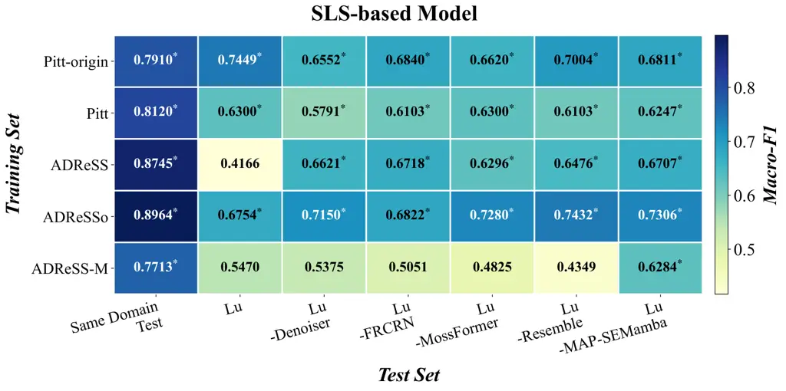

Figure 3: SLS-based model generalization test on speech-enhanced data.
(Same Domain Test: evaluation on the test split of the same dataset used
for training. Asterisks^(∗): performance significantly different from
the binomial majority-class baseline, $`p<0.05`$.)

The experimental results are shown in Figure 3. The model trained on
Pitt-origin achieves the best overall performance on the original
unprocessed Lu corpus (Macro-F1 = 0.7449), indicating stronger
robustness to unprocessed cross-domain speech. Similar trends are
observed for the eGeMAPS and XLS-R models (Appendix 15, Appendix 19).
However, performance decreases in most cases when the same models are
evaluated on speech-enhanced versions of Lu. In contrast, models trained
on ADReSS and ADReSSo show clear performance improvements on
speech-enhanced Lu test sets. For example, the model trained on ADReSSo
achieves a Macro-F1 score of 0.7432 on Lu-Resemble, approaching the best
overall result. This suggests that enhanced training data generalize
more effectively to similarly enhanced test conditions. Nevertheless,
these results still do not surpass the performance of Pitt-origin on the
original Lu corpus, and performance varies substantially across
different enhancement methods.

Overall, models trained on unprocessed speech perform best on unenhanced
test data, whereas models trained on speech-enhanced datasets
consistently perform better on similarly enhanced test sets. This
suggests that alignment between training and testing enhancement
conditions plays an important role in cross-dataset generalization.
However, because the preprocessing pipelines used in Pitt, ADReSS, and
ADReSSo were not publicly released, it is impossible to reproduce their
exact enhancement conditions during evaluation, leading to substantial
performance variability across different enhanced test sets.

These findings further raise an important question: If the same speech
enhancement method is applied to both training and test data, can
stronger generalization performance be achieved? To answer this
question, we conduct matched enhancement experiments in Section 4.3,
where the same speech enhancement methods are applied to both training
and testing data.

### 4.3 Matched Enhancement Settings

To determine whether the observed performance degradation is caused
primarily by enhancement mismatch between training and test data, we
construct a matched enhancement setting. Specifically, we apply five
speech enhancement methods introduced in Section 3.3 to the Pitt-origin
training data and evaluate models on two Lu test conditions: (1)
unprocessed Lu speech (mismatched) and (2) Lu speech enhanced using the
same enhancement method as the training data (matched). We additionally
retain the model trained on unprocessed Pitt-origin data as a control
(raw-trained), with evaluation on the original Lu corpus serving as the
baseline.

Figure 4: SLS-based model performance comparison with matched and
mismatched speech enhancement methods. (Mismatched: enhanced training
set with raw test set; Matched: the same enhancement for training and
test set; Raw-trained: raw training set with enhanced test set;
Baseline: raw training and raw test set. Asterisks^(∗): performance
significantly different from the binomial majority-class baseline,
$`p<0.05`$.)

The experimental results are shown in Figure 4. Across all five
enhancement methods, the matched setting consistently outperforms the
corresponding mismatched setting. These results suggest that alignment
between training and testing enhancement conditions partially alleviates
enhancement-induced distribution mismatch. However, even under the
matched setting, models trained on unprocessed Pitt-origin data
(raw-trained) still achieve higher Macro-F1 scores in most cases.
Moreover, all enhancement-related settings remain below the baseline.
These results suggest that the observed performance degradation is not
caused solely by train-test enhancement mismatch. Instead, speech
enhancement itself alters the underlying speech distribution and reduces
cross-dataset robustness. Similar trends are observed for the eGeMAPS
and XLS-R models (Appendix 20 and Appendix 16), indicating that the
effect is not limited to a particular model architecture.

Overall, although matched enhancement conditions partially reduce
distribution mismatch, they do not fully recover the generalization
performance achieved by models trained on unprocessed speech. These
findings suggest that speech enhancement itself can substantially affect
downstream model robustness in cross-dataset evaluation.

## 5 Speech Enhancement Impact on Large Audio-Language Models

To evaluate the impact of speech enhancement on large audio-language
models (LALMs) in Alzheimer’s disease detection, we evaluate five recent
and widely used LALMs: Kimi-Audio Ding et al. (2025), Qwen3-Omni Xu et
al. (2025), Qwen2-Audio Chu et al. (2024), Audio Flamingo 3 Ghosh et al.
(2026), and ultravox-v0_5-llama-3_2-1b Fixie.ai (2025) under multiple
inference settings.

### 5.1 Audio-Only Settings

We first evaluate multiple LALMs on all datasets using audio-only input
to analyze model behavior when relying solely on speech signals. The
experimental results are shown in Appendix C. The results show that most
models struggle to reliably distinguish AD from Control under zero-shot
audio-only evaluation, while only Kimi-Audio consistently achieves
statistically significant performance across most datasets. For example,
Qwen2-Audio tends to classify nearly all speech samples as Control,
whereas Audio Flamingo 3 tends to classify nearly all samples as AD. In
contrast, Kimi-Audio achieves the strongest overall performance and
remains statistically significant on all datasets except the Lu corpus.

Based on the above results, we select Kimi-Audio as the main model for
further experiments and analysis. We evaluate Kimi-Audio under two
inference settings, zero-shot and two-shot. Here, two-shot means that
two labeled examples are provided at the inference stage, one from the
AD class and one from the control class, without any parameter update or
fine-tuning of the model.

|             |            |            |            |
| ----------- | ---------- | ---------- | ---------- |
| Test Set    | Macro-F1   | F1 Score   | F1 Score   |
|             |            | (AD⁺)      | (Control⁺) |
| Zero-Shot   |            |            |            |
| Pitt-origin | 0.6666^(∗) | 0.6726^(∗) | 0.6605^(∗) |
| Pitt        | 0.5924^(∗) | 0.7300^(∗) | 0.4548^(∗) |
| ADReSS      | 0.5629^(∗) | 0.6834^(∗) | 0.4425^(∗) |
| ADReSSo     | 0.6348^(∗) | 0.7273^(∗) | 0.5424^(∗) |
| ADReSS-M    | 0.7000^(∗) | 0.6899^(∗) | 0.7102^(∗) |
| Two-Shot    |            |            |            |
| Pitt-origin | 0.6251^(∗) | 0.7198^(∗) | 0.5305^(∗) |
| Pitt        | 0.5878^(∗) | 0.7409^(∗) | 0.4348^(∗) |
| ADReSS      | 0.5879^(∗) | 0.6842^(∗) | 0.4915^(∗) |
| ADReSSo     | 0.6503^(∗) | 0.7291^(∗) | 0.5714^(∗) |
| ADReSS-M    | 0.6441^(∗) | 0.5941^(∗) | 0.6941^(∗) |

Table 3: Kimi-Audio zero-shot and two-shot performance in the audio-only
scenario. (AD⁺ / Control⁺: F1 score with AD/Control as positive.
Asterisks^(∗): performance significantly different from the binomial
majority-class baseline, $`p<0.05`$.)

The experimental results of Kimi-Audio are shown in Table 3. On the
unprocessed Pitt-origin and ADReSS-M datasets, the model produces
relatively balanced predictions across AD and Control classes. This
suggests that when the input speech is closer to the distribution of
unprocessed speech, the model is more likely to rely on relatively
stable acoustic patterns. In contrast, on the speech-enhanced datasets
(Pitt, ADReSS, and ADReSSo), the model exhibits clear class imbalance,
with substantially higher F1 scores with AD as positive than F1 scores
with control as positive. These results suggest that speech enhancement
substantially alters LALM prediction behavior under audio-only
evaluation. This trend remains consistent under both zero-shot and
two-shot settings, suggesting that the observed bias is not resolved by
providing a small number of labeled examples.

Overall, the audio-only experiments suggest that speech enhancement does
not consistently improve the discriminative ability of LALMs and may
instead introduce systematic prediction bias, thereby reducing
robustness across datasets.

### 5.2 Audio + Transcript Settings

The previous results raise a natural question: Can textual information
mitigate the preprocessing sensitivity observed in audio-only
evaluation? To investigate this, we further evaluate the audio +
transcript input format on Pitt-origin and Pitt using Kimi-Audio under
both zero-shot and two-shot inference settings.

The results are shown in Table 4. When using audio + transcript input, a
trend consistent with the audio-only setting can still be observed. On
the denoised Pitt dataset, the model exhibits substantial class
imbalance, which becomes even more pronounced under some settings. In
contrast, predictions on the unprocessed Pitt-origin dataset remain more
balanced across AD and Control classes. These results suggest that
adding transcript information does not eliminate enhancement-induced
prediction bias. In addition, the two-shot setting also fails to
substantially improve this issue. On Pitt, the model continues to
exhibit a strong bias toward the AD class. This suggests that simply
providing a small number of labeled examples cannot effectively correct
the prediction shift caused by changes in data distribution.

|             |            |            |            |
| ----------- | ---------- | ---------- | ---------- |
| Test Set    | Macro-F1   | F1 Score   | F1 Score   |
|             |            | (AD⁺)      | (Control⁺) |
| Zero-Shot   |            |            |            |
| Pitt-origin | 0.6514^(∗) | 0.6350^(∗) | 0.6678^(∗) |
| Pitt        | 0.4756     | 0.7164     | 0.2348     |
| Two-Shot    |            |            |            |
| Pitt-origin | 0.6651^(∗) | 0.7313^(∗) | 0.5988^(∗) |
| Pitt        | 0.5498^(∗) | 0.7194^(∗) | 0.3801^(∗) |

Table 4: Kimi-Audio zero-shot and two-shot performance in audio +
transcript scenario. (AD⁺ / Control⁺: F1 score with AD/Control as
positive. Asterisks^(∗): performance significantly different from the
binomial majority-class baseline, $`p<0.05`$.)

Overall, the multimodal experiments further suggest that speech
enhancement substantially affects downstream LALM prediction behavior,
even when textual information is available.

## 6 Conclusion

This paper revisits the role of speech preprocessing and dataset
curation in speech-based Alzheimer’s disease (AD) detection across
widely used Pitt-derived benchmarks. We systematically evaluate the
effects of speech enhancement using multiple experimental settings,
including in-domain and cross-domain evaluation, speech-enhanced test
conditions, matched and mismatched enhancement settings, and multiple
speech enhancement pipelines. We further analyze whether these effects
remain consistent across different modeling paradigms, including
acoustic-feature-based models, pretrained speech representation models,
and recent large audio-language models. Across both supervised AD
detection models and LALMs, the results consistently show that
speech-enhanced datasets often improve in-domain evaluation performance
while reducing cross-dataset robustness. Even when matched enhancement
conditions are applied to both training and test data, models trained on
unprocessed Pitt-origin speech generally achieve stronger generalization
performance. In addition, LALMs exhibit systematic prediction bias under
speech-enhanced conditions, suggesting that preprocessing sensitivity
extends beyond conventional supervised architectures to modern
foundation audio models.

Overall, our findings show that speech enhancement and dataset curation
are not merely preprocessing choices, but factors that can substantially
influence downstream AD detection behavior and cross-dataset
generalization. These results highlight the importance of carefully
considering preprocessing pipelines when constructing and evaluating
speech-based AD detection benchmarks, and suggest that cleaner speech
does not necessarily lead to more robust AD detection systems.

## 7 Limitations

Our research focuses on Alzheimer’s disease speech detection from speech
in English contexts. In this field, the vast majority of studies have
used the Pitt Corpus Becker et al. (1994) and its derived datasets, and
the number of publicly available English AD speech datasets independent
of the Pitt Corpus is very limited. We note that although there are some
larger English AD speech datasets, these datasets have not yet been made
publicly available and therefore cannot be used for experimental
validation in this study. Other publicly accessible English dementia
datasets, such as the VAS Corpus Liang et al. (2022) and the English WLS
Corpus Herd et al. (2014), are not restricted to AD patients, as they
include individuals with MCI or other forms of cognitive decline without
distinguishing these diagnostic groups. To ensure the rigor of the
research, we did not use these datasets in our experiments. Therefore,
due to the limited number of publicly available English AD speech
datasets independent of the Pitt Corpus, this paper selects the English
Lu Corpus Lanzi et al. (2023) as the cross-domain test set to evaluate
the model’s generalization ability.

Our research primarily focuses on the impact of speech enhancement on
speech-based AD detection models, with particular attention to the
relationship between speech enhancement processing and model
generalization ability. Therefore, we only use text as an auxiliary
diagnostic tool for LALMs and do not conduct an in-depth study on using
text to detect AD.

Although our experimental results consistently show that, compared with
Pitt, ADReSS, ADReSSo, and ADReSS-M, models trained on the original
Pitt-origin generally have stronger generalization ability, it should be
particularly noted that Pitt-origin itself also contains substantial
environmental noise. How to improve the robustness of Alzheimer’s
disease detection models to noise remains an important and unresolved
problem. Future work needs to explore more robust model architectures,
enabling models to stably extract Alzheimer’s disease-related
pathological features from noisy speech.

## Use of AI Assistants

We used GPT-5.5 and Claude Opus 4.7 for code assistance, and the same
models purely for language-related assistance in writing the paper.

## Licensing

We use the DementiaBank dataset, a shared multimedia database for
studying communication in dementia. DementiaBank is part of TalkBank.
Therefore, use of the data is generally governed by the Creative Commons
Attribution–NonCommercial–ShareAlike 3.0 license (CC BY-NC-SA 3.0),
unless otherwise specified. This license requires attribution, restricts
commercial use, and requires share-alike for derivatives. Access to
DementiaBank is password-protected and restricted to approved members of
the DementiaBank consortium. We comply with the DementiaBank data use
requirements, including restrictions on redistributing or posting
password-protected data on external websites or servers.

## References

- Becker et al. (1994) J. T. Becker, F. Boiler, O. L. Lopez, J. Saxton,
  and K. L. McGonigle The natural history of Alzheimer’s disease:
  description of study cohort and accuracy of diagnosis. Archives of
  neurology 51 (6), pp. 585–594. Cited by: §1, item 1, item 2, item 3,
  item 4, §7.
- Better (2023) M. A. Better Alzheimer’s disease facts and figures.
  Alzheimers Dement 19 (4), pp. 1598–1695. Cited by: §1.
- Chen et al. (2018) S. Chen, A. S. Subramanian, H. Xu, and S. Watanabe
  Building State-of-the-art Distant Speech Recognition Using the CHiME-4
  Challenge with a Setup of Speech Enhancement Baseline. In Interspeech
  2018, pp. 1571–1575. Cited by: §3.1.
- Chu et al. (2024) Y. Chu, J. Xu, Q. Yang, H. Wei, X. Wei, Z. Guo, Y.
  Leng, Y. Lv, J. He, J. Lin, et al. Qwen2-audio technical report. arXiv
  preprint arXiv:2407.10759. Cited by: §1, §3.2, §5.
- Conneau et al. (2021) A. Conneau, A. Baevski, R. Collobert, A.
  Mohamed, and M. Auli Unsupervised Cross-Lingual Representation
  Learning for Speech Recognition. In Interspeech, pp. 2426–2430. Cited
  by: Appendix D, Appendix D, §1, §3.2.
- Défossez et al. (2020) A. Défossez, G. Synnaeve, and Y. Adi Real Time
  Speech Enhancement in the Waveform Domain. In Interspeech 2020,
  pp. 3291–3295. Cited by: §3.3.
- Ding et al. (2025) D. Ding, Z. Ju, Y. Leng, S. Liu, T. Liu, Z.
  Shang, K. Shen, W. Song, X. Tan, H. Tang, et al. Kimi-audio technical
  report. arXiv preprint arXiv:2504.18425. Cited by: §1, §3.2, §5.
- Ding et al. (2024) K. Ding, M. Chetty, A. Noori Hoshyar, T.
  Bhattacharya, and B. Klein Speech based detection of Alzheimer’s
  disease: a survey of AI techniques, datasets and challenges.
  Artificial Intelligence Review 57 (12), pp. 325. Cited by: §1.
- Dong et al. (2024) Z. Dong, Z. Zhang, W. Xu, J. Han, J. Ou, and B. W.
  Schuller HAFFormer: A hierarchical attention-free framework for
  Alzheimer’s disease detection from spontaneous speech. In
  International Conference on Acoustics, Speech and Signal Processing
  (ICASSP), pp. 11246–11250. Cited by: §2.3.
- Europe (2019) A. Europe Dementia in Europe Yearbook 2019: Estimating
  the prevalence of dementia in Europe. Alzheimer Europe 180. Cited by:
  §1.
- Eyben et al. (2015) F. Eyben, K. R. Scherer, B. W. Schuller, J.
  Sundberg, E. André, C. Busso, L. Y. Devillers, J. Epps, P.
  Laukka, S. S. Narayanan, et al. The Geneva minimalistic acoustic
  parameter set (GeMAPS) for voice research and affective computing.
  IEEE transactions on affective computing 7 (2), pp. 190–202. Cited by:
  Appendix D, §3.2.
- Eyben et al. (2010) F. Eyben, M. Wöllmer, and B. Schuller Opensmile:
  the munich versatile and fast open-source audio feature extractor. In
  Proceedings of the 18th ACM international conference on Multimedia,
  pp. 1459–1462. Cited by: Appendix D.
- Fixie.ai (2025) Fixie.ai Ultravox v0.5 llama 3.2 1b. Note:
  [https://huggingface.co/fixie-ai/ultravox-v0_5-llama-3_2-1b](https://huggingface.co/fixie-ai/ultravox-v0_5-llama-3_2-1b)Hugging
  Face model card Cited by: §1, §3.2, §5.
- Frankel et al. (2025) L. Frankel, S. E. Chazan, and J. Goldberger
  Automatic detection of domain shifts in speech enhancement systems
  using confidence-based metrics. In ICASSP 2025-2025 IEEE International
  Conference on Acoustics, Speech and Signal Processing (ICASSP),
  pp. 1–5. Cited by: §3.1.
- Ghosh et al. (2026) S. Ghosh, A. Goel, J. Kim, S. Kumar, Z. Kong, S.
  Lee, C. Yang, R. Duraiswami, D. Manocha, R. Valle, et al. Audio
  flamingo 3: advancing audio intelligence with fully open large audio
  language models. Advances in Neural Information Processing Systems 38,
  pp. 41819–41886. Cited by: §1, §3.2, §5.
- Goodglass and Kaplan (1983) H. Goodglass and E. Kaplan Boston
  diagnostic aphasia examination booklet. Lea & Febiger. Cited by: §1,
  item 1.
- Hason and Krishnan (2022) L. Hason and S. Krishnan Spontaneous speech
  feature analysis for alzheimer’s disease screening using a random
  forest classifier. Frontiers in Digital Health 4, pp. 901419. Cited
  by: §2.3.
- Heitz et al. (2025) J. Heitz, G. Schneider, and N. Langer Linguistic
  features extracted by gpt-4 improve alzheimer’s disease detection
  based on spontaneous speech. In Proceedings of the 31st International
  Conference on Computational Linguistics, pp. 1850–1864. Cited by:
  §2.3.
- Herd et al. (2014) P. Herd, D. Carr, and C. Roan Cohort profile:
  wisconsin longitudinal study (wls). International journal of
  epidemiology 43 (1), pp. 34–41. Cited by: §7.
- Iwamoto et al. (2022) K. Iwamoto, T. Ochiai, M. Delcroix, R.
  Ikeshita, H. Sato, S. Araki, and S. Katagiri How bad are artifacts?:
  Analyzing the impact of speech enhancement errors on ASR. In
  Interspeech 2022, pp. 5418–5422. Cited by: §3.1.
- Jin et al. (2023) L. Jin, Y. Oh, H. Kim, H. Jung, H. J. Jon, J. E.
  Shin, and E. Y. Kim Consen: Complementary and simultaneous ensemble
  for alzheimer’s disease detection and mmse score prediction. In
  International Conference on Acoustics, Speech and Signal Processing
  (ICASSP), pp. 1–2. Cited by: §2.3.
- Lanzi et al. (2023) A. M. Lanzi, A. K. Saylor, D. Fromm, H. Liu, B.
  MacWhinney, and M. L. Cohen DementiaBank: Theoretical rationale,
  protocol, and illustrative analyses. American Journal of
  Speech-Language Pathology 32 (2), pp. 426–438. Cited by: §1, item 6,
  §2.1, §7.
- Li et al. (2025) Y. Li, R. Chao, B. Su, and Y. Tsao Speech enhancement
  with map-based training for robust asr. In ICASSP 2025-2025 IEEE
  International Conference on Acoustics, Speech and Signal Processing
  (ICASSP), pp. 1–5. Cited by: §3.3.
- Li et al. (2018) Z. Li, L. Dai, Y. Song, and I. McLoughlin A
  conditional generative model for speech enhancement. Circuits,
  Systems, and Signal Processing 37 (11), pp. 5005–5022. Cited by: §3.1.
- Liang et al. (2022) X. Liang, J. A. Batsis, Y. Zhu, T. M.
  Driesse, R. M. Roth, D. Kotz, and B. MacWhinney Evaluating
  voice-assistant commands for dementia detection. Computer Speech &
  Language 72, pp. 101297. Cited by: §7.
- Lin et al. (2024) Z. Lin, Y. Chen, P. Kuo, L. Huang, C. Hu, and C.
  Chen Dementia Assessment Using Mandarin Speech with an Attention-Based
  Speech Recognition Encoder. In International Conference on Acoustics,
  Speech and Signal Processing (ICASSP), pp. 12461–12465. Cited by:
  §2.3.
- Liu et al. (2024) X. Liu, Q. Kong, Y. Zhao, H. Liu, Y. Yuan, Y.
  Liu, R. Xia, Y. Wang, M. D. Plumbley, and W. Wang Separate anything
  you describe. IEEE Transactions on Audio, Speech and Language
  Processing 33, pp. 458–471. Cited by: §3.3.
- Luz et al. (2020) S. Luz, F. Haider, S. de la Fuente, D. Fromm, and B.
  MacWhinney Alzheimer’s Dementia Recognition Through Spontaneous
  Speech: The ADReSS Challenge. In Interspeech, pp. 2172–2176. Cited by:
  §1, item 3, §2.3.
- Luz et al. (2023) S. Luz, F. Haider, D. Fromm, I. Lazarou, I.
  Kompatsiaris, and B. MacWhinney Multilingual alzheimer’s dementia
  recognition through spontaneous speech: a signal processing grand
  challenge. In International Conference on Acoustics, Speech and Signal
  Processing (ICASSP), pp. 1–2. Cited by: §1, item 5, §2.3.
- Luz et al. (2021) S. Luz, F. Haider, Sofia de la Fuente, D. Fromm,
  and B. MacWhinney Detecting cognitive decline using speech only: the
  adresso challenge. In Interspeech, pp. 3780–3784. Cited by: §1,
  item 4, §2.3.
- Menne et al. (2019) T. Menne, R. Schlüter, and H. Ney Investigation
  into joint optimization of single channel speech enhancement and
  acoustic modeling for robust asr. In ICASSP 2019-2019 IEEE
  International Conference on Acoustics, Speech and Signal Processing
  (ICASSP), pp. 6660–6664. Cited by: §3.1.
- Park et al. (2025) C. Park, A. S. G. Choi, S. Cho, and C. Kim
  Reasoning-Based Approach with Chain-of-Thought for Alzheimer’s
  Detection Using Speech and Large Language Models. In Interspeech 2025,
  pp. 2185–2189. Cited by: §2.3.
- Pu and Zhang (2025) Y. Pu and W. Zhang Integrating pause information
  with word embeddings in language models for alzheimer’s disease
  detection from spontaneous speech. In ICASSP 2025-2025 IEEE
  International Conference on Acoustics, Speech and Signal Processing
  (ICASSP), pp. 1–5. Cited by: §2.3.
- Reddy et al. (2021) C. K. Reddy, V. Gopal, and R. Cutler DNSMOS: a
  non-intrusive perceptual objective speech quality metric to evaluate
  noise suppressors. In ICASSP 2021-2021 IEEE International Conference
  on Acoustics, Speech and Signal Processing (ICASSP), pp. 6493–6497.
  Cited by: §2.2.
- Scheibler et al. (2024) R. Scheibler, Y. Fujita, Y. Shirahata, and T.
  Komatsu Universal Score-based Speech Enhancement with High Content
  Preservation. In Interspeech 2024, pp. 1165–1169. Cited by: §3.1.
- Scheltens et al. (2021) P. Scheltens, B. De Strooper, M. Kivipelto, H.
  Holstege, G. Chételat, C. E. Teunissen, J. Cummings, and W. M. van der
  Flier Alzheimer’s disease. The Lancet 397 (10284), pp. 1577–1590.
  Cited by: §1.
- Vaswani et al. (2017) A. Vaswani, N. Shazeer, N. Parmar, J.
  Uszkoreit, L. Jones, A. N. Gomez, Ł. Kaiser, and I. Polosukhin
  Attention is all you need. Advances in neural information processing
  systems 30. Cited by: Appendix D, Appendix D.
- Xia et al. (2020) Y. Xia, S. Braun, C. K. Reddy, H. Dubey, R. Cutler,
  and I. Tashev Weighted speech distortion losses for
  neural-network-based real-time speech enhancement. In ICASSP 2020-2020
  IEEE International Conference on Acoustics, Speech and Signal
  Processing (ICASSP), pp. 871–875. Cited by: §3.1.
- Xu et al. (2025) J. Xu, Z. Guo, H. Hu, Y. Chu, X. Wang, J. He, Y.
  Wang, X. Shi, T. He, X. Zhu, et al. Qwen3-omni technical report. arXiv
  preprint arXiv:2509.17765. Cited by: §1, §3.2, §5.
- Yang et al. (2022) Q. Yang, X. Li, X. Ding, F. Xu, and Z. Ling Deep
  learning-based speech analysis for Alzheimer’s disease detection: a
  literature review. Alzheimer’s Research & Therapy 14 (1), pp. 186.
  Cited by: §1.
- Yoshioka et al. (2015) T. Yoshioka, N. Ito, M. Delcroix, A. Ogawa, K.
  Kinoshita, M. Fujimoto, C. Yu, W. J. Fabian, M. Espi, T. Higuchi, et
  al. The ntt chime-3 system: advances in speech enhancement and
  recognition for mobile multi-microphone devices. In 2015 IEEE Workshop
  on Automatic Speech Recognition and Understanding (ASRU), pp. 436–443.
  Cited by: §3.1.
- Zhang et al. (2024) Q. Zhang, S. Wen, and T. Hu Audio deepfake
  detection with self-supervised xls-r and sls classifier. In
  Proceedings of the 32nd ACM International Conference on Multimedia,
  pp. 6765–6773. Cited by: Appendix D, §1, §3.2.
- Zhao et al. (2022) S. Zhao, B. Ma, K. N. Watcharasupat, and W. Gan
  FRCRN: boosting feature representation using frequency recurrence for
  monaural speech enhancement. In ICASSP 2022-2022 IEEE international
  conference on acoustics, speech and signal processing (ICASSP),
  pp. 9281–9285. Cited by: §3.3.
- Zhao and Ma (2023) S. Zhao and B. Ma Mossformer: pushing the
  performance limit of monaural speech separation using gated
  single-head transformer with convolution-augmented joint
  self-attentions. In ICASSP 2023-2023 IEEE International Conference on
  Acoustics, Speech and Signal Processing (ICASSP), pp. 1–5. Cited by:
  §3.3.

## Appendix A Dataset Information

### A.1 Dataset Details

[TABLE]

Table 5: Relationship of Pitt-origin and its derived datasets.
(Pitt-origin and Pitt have the same size. ADReSS-M and ADReSSo have the
same size. ADReSS is smaller than ADReSS-M and ADReSSo.)

Figure 5: Duration distribution of Pitt-origin and its derived datasets.

|                    |        |        |         |            |
| ------------------ | ------ | ------ | ------- | ---------- |
| Dataset            | Min(s) | Max(s) | Mean(s) | Total(min) |
| Pitt-origin / Pitt | 17.89  | 268.49 | 69.97   | 643.72     |
| ADReSS             | 26.06  | 268.49 | 75.30   | 195.78     |
| ADReSSo            | 22.35  | 268.49 | 76.89   | 303.72     |
| ADReSS-M           | 22.35  | 268.49 | 76.89   | 303.72     |

Table 6: Duration distribution of Pitt-origin and its derived datasets.

|             |      |        |         |        |
| ----------- | ---- | ------ | ------- | ------ |
| Age         | AD   |        | Control |        |
|             | Male | Female | Male    | Female |
| $`<50`$     | 0    | 1      | 0       | 6      |
| $`[50,55)`$ | 5    | 1      | 8       | 9      |
| $`[55,60)`$ | 10   | 11     | 17      | 28     |
| $`[60,65)`$ | 18   | 18     | 13      | 25     |
| $`[65,70)`$ | 26   | 33     | 24      | 40     |
| $`[70,75)`$ | 23   | 43     | 20      | 33     |
| $`[75,80)`$ | 23   | 45     | 6       | 9      |
| $`[80,90]`$ | 13   | 37     | 1       | 4      |
| unknown     | 2    | 0      | 0       | 0      |
| Total       | 120  | 189    | 89      | 154    |

Table 7: Pitt-origin / Pitt dataset age and gender metadata.

|             |      |        |         |        |
| ----------- | ---- | ------ | ------- | ------ |
| Age         | AD   |        | Control |        |
|             | Male | Female | Male    | Female |
| $`[50,55)`$ | 2    | 0      | 2       | 0      |
| $`[55,60)`$ | 7    | 6      | 7       | 6      |
| $`[60,65)`$ | 4    | 9      | 4       | 9      |
| $`[65,70)`$ | 9    | 14     | 9       | 14     |
| $`[70,75)`$ | 9    | 11     | 9       | 11     |
| $`[75,80)`$ | 4    | 3      | 4       | 3      |
| Total       | 35   | 43     | 35      | 43     |

Table 8: ADReSS dataset age and gender metadata.

|             |      |        |         |        |
| ----------- | ---- | ------ | ------- | ------ |
| Age         | AD   |        | Control |        |
|             | Male | Female | Male    | Female |
| $`[50,55)`$ | 1    | 0      | 1       | 1      |
| $`[55,60)`$ | 7    | 6      | 6       | 16     |
| $`[60,65)`$ | 7    | 8      | 7       | 13     |
| $`[65,70)`$ | 7    | 22     | 11      | 23     |
| $`[70,75)`$ | 9    | 21     | 10      | 18     |
| $`[75,80]`$ | 12   | 22     | 5       | 4      |
| Total       | 43   | 79     | 40      | 75     |

Table 9: ADReSSo / ADReSS-M dataset age and gender metadata.

|                         |                  |                 |                 |
| ----------------------- | ---------------- | --------------- | --------------- |
| Dataset                 | OVRL$`\uparrow`$ | SIG$`\uparrow`$ | BAK$`\uparrow`$ |
| Pitt-origin             | 2.3073           | 2.9819          | 2.7290          |
| Pitt-origin-Denoiser    | 2.9687           | 3.2946          | 4.2052          |
| Pitt-origin-FRCRN       | 2.8704           | 3.3260          | 3.9332          |
| Pitt-origin-MossFormer  | 3.0232           | 3.4136          | 4.1258          |
| Pitt-origin-Resemble    | 2.8856           | 3.3151          | 3.8913          |
| Pitt-origin-MAP-SEMamba | 2.8799           | 3.3434          | 3.8376          |

Table 10: DNSMOS scores of Pitt-origin under different speech
enhancement methods. (SIG: speech quality; BAK: background noise
quality; OVRL: overall speech quality.)

## Appendix B Prompt

### B.1 Audio Prompt

### B.2 Audio + Transcript Prompt

## Appendix C Large Audio-Language Models

### C.1 LALMs Audio-only Zero-Shot Setting

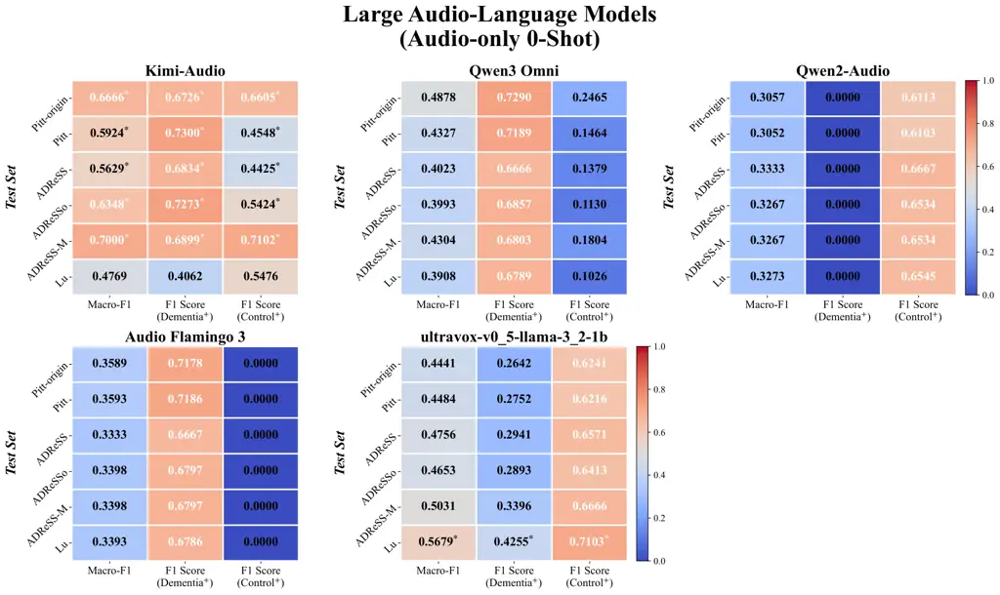

Figure 6: LALMs performance in the audio-only zero-shot setting. (AD⁺ /
Control⁺: F1 score with AD/Control as positive. Asterisks^(∗):
performance significantly different from the binomial majority-class
baseline, $`p<0.05`$.)

### C.2 Kimi-Audio Audio-only Setting

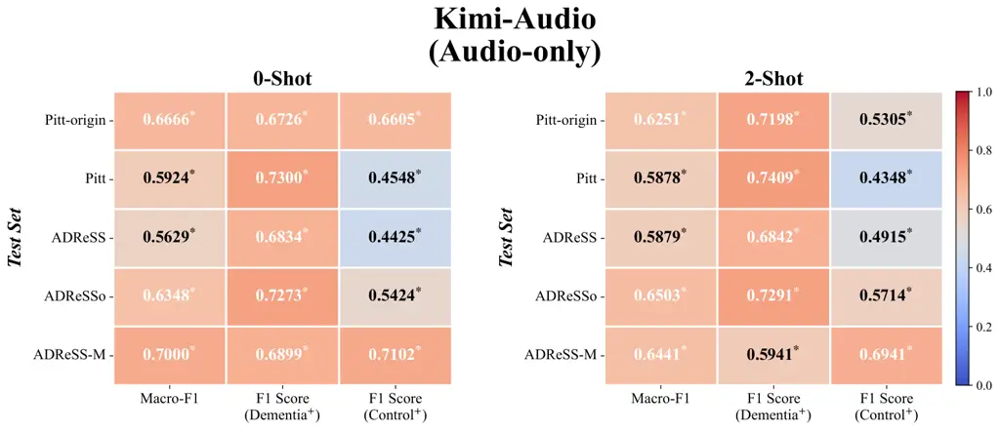

Figure 7: Kimi-Audio in the audio-only setting. (AD⁺ / Control⁺: F1
score with AD/Control as positive. Asterisks^(∗): performance
significantly different from the binomial majority-class baseline,
$`p<0.05`$.)

### C.3 Kimi-Audio Audio + Transcript Setting

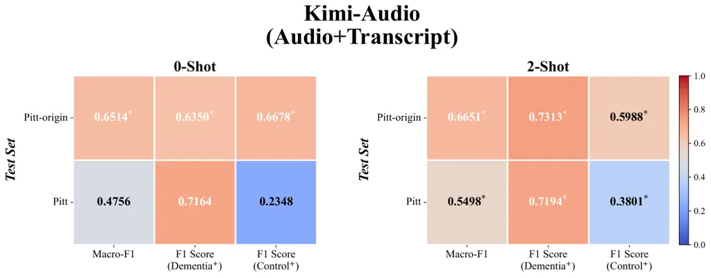

Figure 8: Kimi-Audio in the audio + transcript setting. (AD⁺ / Control⁺:
F1 score with AD/Control as positive. Asterisks^(∗): performance
significantly different from the binomial majority-class baseline,
$`p<0.05`$.)

## Appendix D Model Architectures

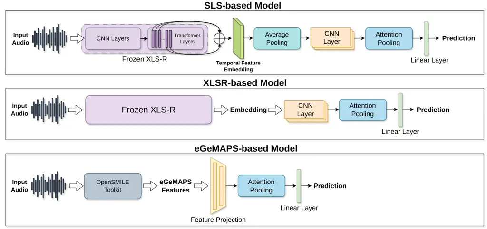

Figure 9: Model Architectures.

SLS-based Model. The model takes as input the frame-level
representations from all Transformer layers of the parameter-frozen
pretrained XLS-R model Conneau et al. (2021), and obtains a weighted
fused representation through the Sensitive Layer Selection (SLS) Zhang
et al. (2024) mechanism. Specifically, the model first applies mean
pooling with the padding mask Vaswani et al. (2017) along the temporal
dimension to the representations of each Transformer layer of XLSR.
Subsequently, the weights of different layers are obtained through a
linear layer and a sigmoid function. Finally, the model performs a
weighted sum of the representations from different layers using the
learned layer weights to obtain the weighted fused representation. This
representation then sequentially passes through batch normalization,
temporal average pooling, a one-dimensional convolutional layer, and
attention pooling. Finally, an AD prediction is output through a linear
classification layer.

The SLS-based model contains 169K trainable parameters. All models are
trained on NVIDIA RTX 5090 GPUs. Additional implementation details are
provided in our released code.

XLSR-based Model. The audio input is fed into a parameter-frozen
pretrained XLSR model Conneau et al. (2021) to extract frame-level
speech embeddings. The representation then sequentially passes through
batch normalization and is aggregated by an attention pooling layer to
obtain a temporal feature representation. A padding mask Vaswani et al.
(2017) is also applied to ensure that padded time steps do not
contribute to the pooled representation. Finally, a linear
classification layer outputs the AD prediction.

The XLSR-based model contains 168K trainable parameters. All models are
trained on NVIDIA RTX 5090 GPUs. Additional implementation details are
provided in our released code.

eGeMAPS-based Model. The model takes 25-dimensional eGeMAPS Eyben et al.
(2015) acoustic features extracted using the OpenSMILE toolkit Eyben et
al. (2010) as input. Each input utterance is first segmented into 10
equal segments, from which 25-dimensional eGeMAPS Eyben et al. (2015)
acoustic features are extracted using the OpenSMILE toolkit Eyben et al.
(2010). Two linear layers are then applied to remap the feature
dimensions, followed by an attention pooling layer to aggregate
segment-level representations. Finally, a linear classification layer
outputs the AD prediction.

The eGeMAPS-based model contains 6.2K trainable parameters. All models
are trained on NVIDIA RTX 5090 GPUs. Additional implementation details
are provided in our released code.

## Appendix E SLS-based Model

### E.1 Generalization Test On Raw Data

Figure 10: SLS-based model generalization test on raw data. (Same Domain
Test: evaluation on the test split of the same dataset used for
training; Test on Lu: evaluation on the Lu dataset. Asterisks^(∗):
performance significantly different from the binomial majority-class
baseline, $`p<0.05`$.)

### E.2 Generalization Test On Speech-enhanced Data

Figure 11: SLS-based model generalization test on speech-enhanced data.
(Same Domain Test: evaluation on the test split of the same dataset used
for training. Asterisks^(∗): performance significantly different from
the binomial majority-class baseline, $`p<0.05`$.)

### E.3 Performance Comparison with Matched Speech Enhancement Methods

Figure 12: SLS-based model performance comparison with matched and
mismatched speech enhancement methods. (Mismatched: enhanced training
set with raw test set; Matched: the same enhancement for training and
test set; Raw-trained: raw training set with enhanced test set;
Baseline: raw training and raw test set. Asterisks^(∗): performance
significantly different from the binomial majority-class baseline,
$`p<0.05`$.)

### E.4 SLS-based Model All Results

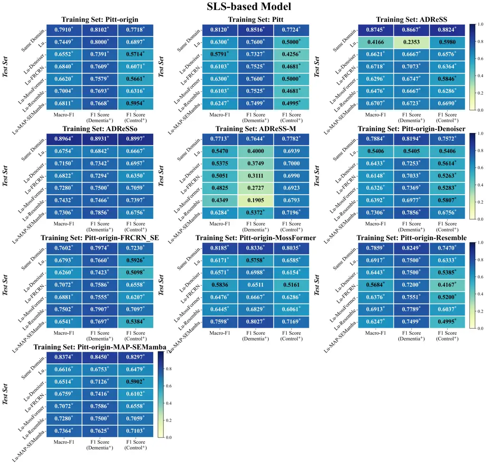

Figure 13: SLS-based model all results. (AD⁺ / Control⁺: F1 score with
AD/Control as positive. Asterisks^(∗): performance significantly
different from the binomial majority-class baseline, $`p<0.05`$.)

## Appendix F XLSR-based Model

### F.1 Generalization Test On Raw Data

Figure 14: XLSR-based model generalization test on raw data. (Same
Domain Test: evaluation on the test split of the same dataset used for
training; Test on Lu: evaluation on the Lu dataset. Asterisks^(∗):
performance significantly different from the binomial majority-class
baseline, $`p<0.05`$.)

### F.2 Generalization Test On Speech-enhanced Data

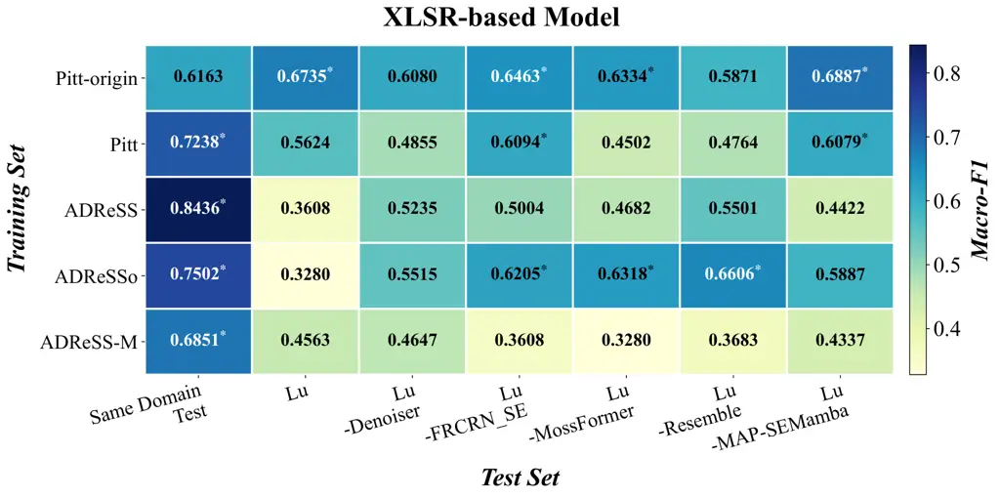

Figure 15: XLSR-based model generalization test on speech-enhanced data.
(Same Domain Test: evaluation on the test split of the same dataset used
for training. Asterisks^(∗): performance significantly different from
the binomial majority-class baseline, $`p<0.05`$.)

### F.3 Performance Comparison with Matched Speech Enhancement Methods

Figure 16: XLSR-based model performance comparison with matched and
mismatched speech enhancement methods. (Mismatched: enhanced training
set with raw test set; Matched: the same enhancement for training and
test set; Raw-trained: raw training set with enhanced test set;
Baseline: raw training and raw test set. Asterisks^(∗): performance
significantly different from the binomial majority-class baseline,
$`p<0.05`$.)

### F.4 XLSR-based Model All Results

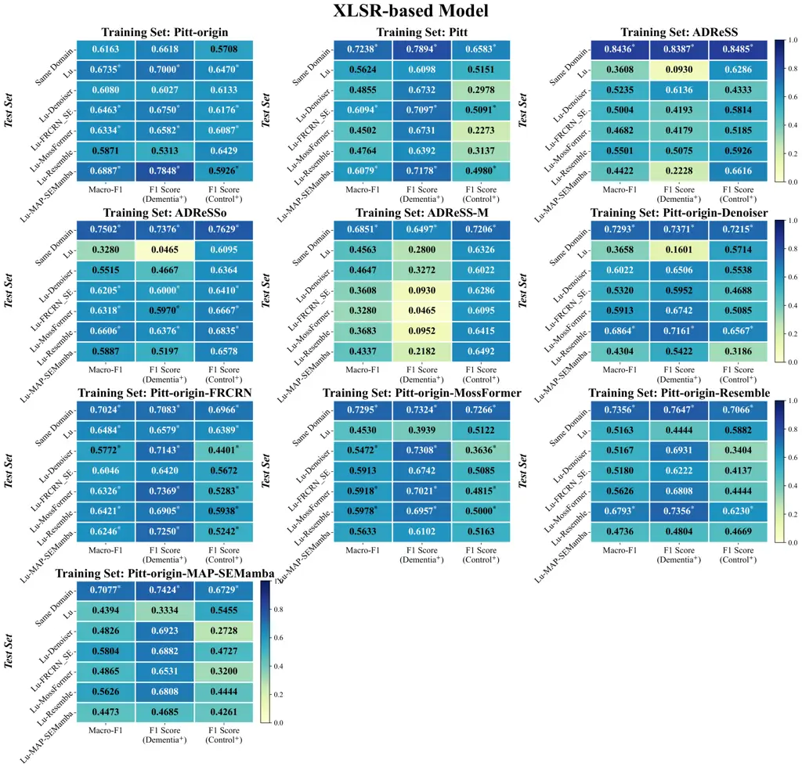

Figure 17: XLSR-based model all results. (AD⁺ / Control⁺: F1 score with
AD/Control as positive. Asterisks^(∗): performance significantly
different from the binomial majority-class baseline, $`p<0.05`$.)

## Appendix G eGeMAPS-based Model

### G.1 Generalization Test On Raw Data

Figure 18: eGeMAPS-based model generalization test on raw data. (Same
Domain Test: evaluation on the test split of the same dataset used for
training; Test on Lu: evaluation on the Lu dataset. Asterisks^(∗):
performance significantly different from the binomial majority-class
baseline, $`p<0.05`$.)

### G.2 Generalization Test On Speech-enhanced Data

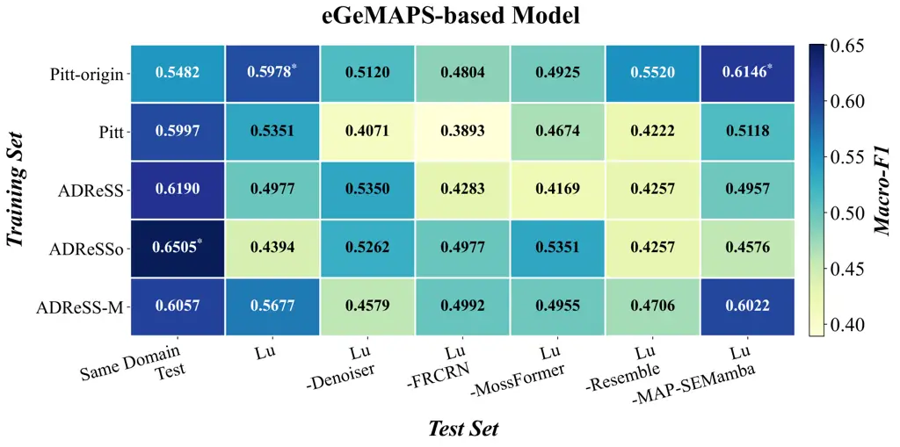

Figure 19: eGeMAPS-based model generalization test on speech-enhanced
data. (Same Domain Test: evaluation on the test split of the same
dataset used for training. Asterisks^(∗): performance significantly
different from the binomial majority-class baseline, $`p<0.05`$.)

### G.3 Performance Comparison with Matched Speech Enhancement Methods

Figure 20: eGeMAPS-based model performance comparison with matched and
mismatched speech enhancement methods. (Mismatched: enhanced training
set with raw test set; Matched: the same enhancement for training and
test set; Raw-trained: raw training set with enhanced test set;
Baseline: raw training and raw test set. Asterisks^(∗): performance
significantly different from the binomial majority-class baseline,
$`p<0.05`$.)

### G.4 eGeMAPS-based Model All Results

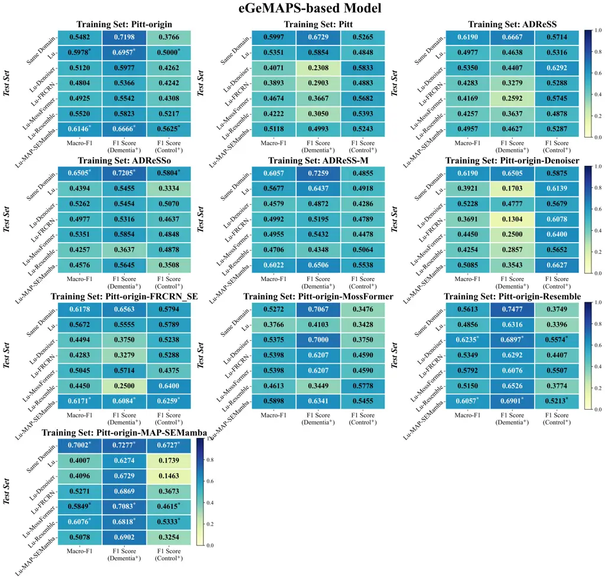

Figure 21: eGeMAPS-based model all results. (AD⁺ / Control⁺: F1 score
with AD/Control as positive. Asterisks^(∗): performance significantly
different from the binomial majority-class baseline, $`p<0.05`$.)
