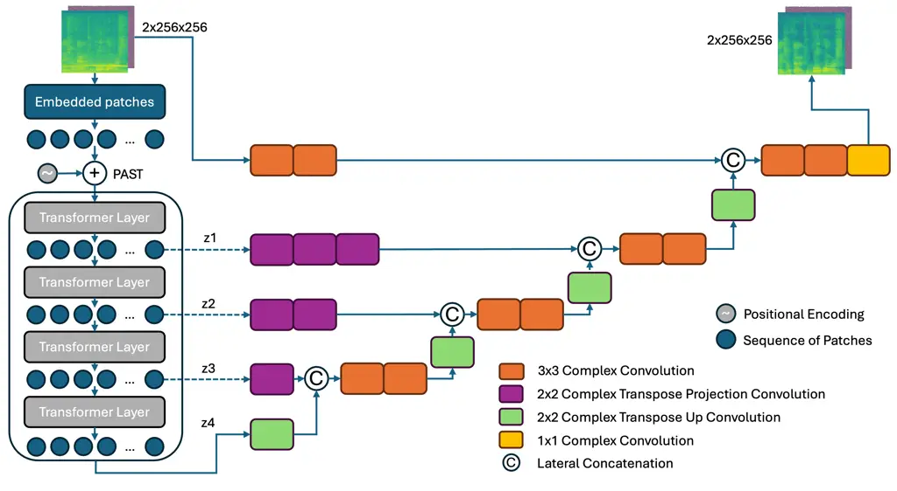
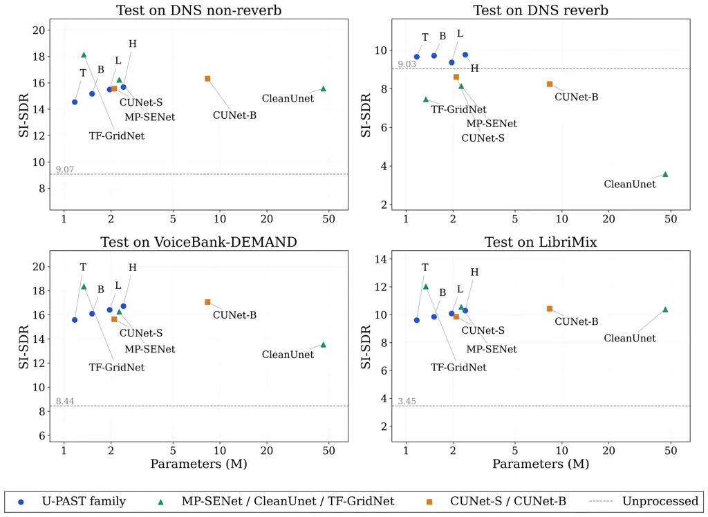
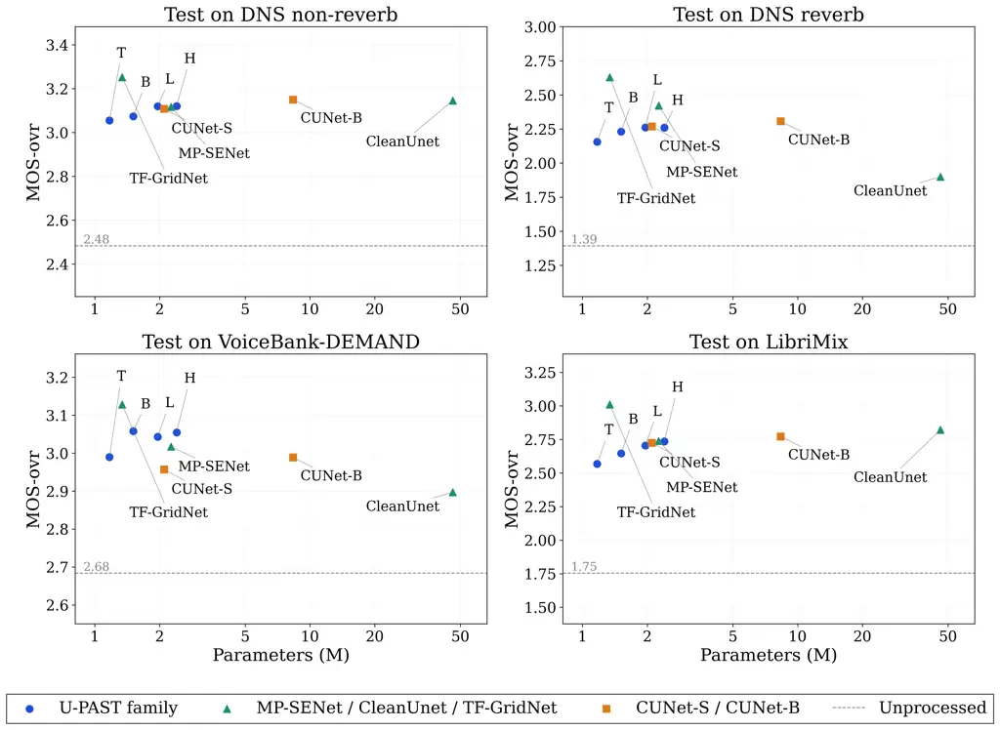

# U-PAST: A Phase-Aware Audio Spectrogram Transformer-U-Net for Single-Channel Speech Enhancement

Cao Duong Ly Affiliation: Department of Medical Physics and Acoustics
Affiliation: Carl von Ossietzky University Oldenburg
Affiliation: Oldenburg, Germany 26129
Email: [cao.duong.ly@uni-oldenburg.de](mailto:)    Jörn Anemüller
Affiliation: Department of Medical Physics and Acoustics
Affiliation: Carl von Ossietzky University Oldenburg
Affiliation: Oldenburg, Germany 26129
Email: [joern.anemueller@uni-oldenburg.de](mailto:)

###### Abstract

Convolutional neural networks (CNNs), used widely and successfully in
audio enhancement, capture long-range time-frequency dependencies only
indirectly, through successive convolution and pooling. Here, we present
U-PAST, a hybrid transformer-U-Net architecture that addresses this
limitation through self-attention dependency-modeling in the complex
spectrogram domain. U-PAST tokenizes a complex STFT representation,
similarly to the magnitude spectrogram tokenization of the Audio
Spectrogram Transformer (AST), applies a multi-layer transformer
encoder, and reconstructs the enhanced complex spectrogram with a
U-Net-style decoder.

We evaluate four architectural variants with between 1.17M and 2.40M
parameters on the DNS Challenge, VoiceBank-DEMAND, and LibriMix corpora
under matched, acoustic mismatch, and two-dataset mismatch conditions.
U-PAST attains the best SI-SDR of any evaluated model under acoustic
mismatch and closely trails substantially larger convolutional and
time-domain baselines by 0.26 dB to 0.63 dB SI-SDR under the remaining
three conditions while achieving the strongest perceptual (DNSMOS)
quality under dataset mismatch. The largest evaluated configuration,
U-PAST-H (2.40M parameters), is consistently the strongest variant of
the family, offering an attractive performance-to-cost trade-off at a
small parameter footprint.

   

|     |
| --- |
|     |

August 31, 2026

*K*eywords Acoustics $`\cdot`$ Speech Enhancement $`\cdot`$ Transformer

## 1 Introduction

Speech signals in real environments are often corrupted by background
noise that significantly impacts speech quality and intelligibility,
creating difficulties for human listeners and degrading downstream
speech-processing systems. Thus, recovery of clean speech from noisy
environments is an active research problem. In the single-channel
setting, due to the lack of spatial information, a robust modeling of
both spectral structure and temporal context of speech and noise is
essential. Several approaches to single-channel speech enhancement have
been proposed. Some methods operate in the time domain \[1\], while
others use spectral representations such as mel-frequency spectra \[2,
3\] or the short-time Fourier transform (STFT) \[4\]. Various model
architectures have been proposed, including convolutional structures
such as U-Nets \[5, 6\], attention-based models \[7, 8\], and generative
approaches \[9, 10\]. Transformer-based models such as DPT-FSNet \[11\]
and TSTNN \[12\] show strong interpretability and temporal modeling
capability but DPT-FSNet requires sub-band processing, which incurs high
computational cost. Vision Transformers (ViT) \[13\] have demonstrated
efficient capture of long-range dependencies and effective modeling of
global context in images. In \[14\], a ViT-based architecture is applied
to speech enhancement by stacking time- and frequency-domain
representations into a single image-like input. The approach aims to
predict clean and noise masks for enhanced output spectrogram estimation
via a transformer read-out, while applying the (noisy) input phase
during inverse short-time Fourier transform reconstruction.
Architecturally, \[14\] is a transformer-only encoder–readout model
rather than a hybrid transformer U-Net since it lacks a convolutional
decoder with hierarchical upsampling and skip connections, and it does
not process phase. Because phase information is crucial for perceptual
quality, reusing the noisy input phase limits achievable enhancement
quality.

To address the above considerations, we propose U-PAST, a
transformer-U-Net network for speech enhancement that operates directly
on complex-valued spectrograms. We convert the magnitude-phase input
spectra into multiple patch tokens. Similarly to how a transformer
handles sequences, the self-attention layer allows each patch token to
interact with all others, capturing relevant global spectro-temporal
patterns. In contrast to \[14\], U-PAST pairs the ViT encoder with a
complex-valued U-Net decoder that includes hierarchical upsampling and
lateral skip connections, and that reconstructs both magnitude and phase
rather than reusing the noisy input phase.



Figure 1: Hybrid U-PAST Architecture. The transformer module (left,
depicted in the four layer configuration) encodes STFT magnitude and
phase into token sequences. Green and orange blocks represent the CUNet
decoder with hierarchical upsampling. Purple blocks denote feature
projection layers that connect transformer outputs to the decoder. The
yellow block is the prediction head for output feature reconstruction.

## 2 Related Work

### 2.1 Audio Spectrogram Transformer

The Audio Spectrogram Transformer (AST) \[15\] adapts the ViT
architecture from image processing to audio by representing a magnitude
spectrogram as a sequence of tokens. Instead of using convolutional
operations, the AST divides the spectrogram into patches and processes
them using self-attention, enabling effective modeling of global context
and long-range dependencies.

Given a spectrogram $`x\in\mathbb{R}^{C\times F\times T}`$, where $`C`$,
$`F`$, and $`T`$ denote the number of channels, frequency bins, and time
frames, respectively, the spectrogram is divided into $`N`$ patches of
size $`P\times P`$. Each patch is then flattened and projected into an
embedding space. The patch extraction and embedding (tokenization)
process can be formulated as

```math
z_{0}^{i}=x_{p}^{i}E+E_{\text{pos}}[i,:],\quad x_{p}^{i}=\mathrm{Flatten}(x_{i})\in\mathbb{R}^{1\times P^{2}C}, \tag{1}
```

where $`x_{i}`$ denotes the $`i`$-th spectrogram patch,
$`i=1,\ldots,N`$, and $`N=FT/P^{2}`$ (non-overlapping patches) or
$`N=\left(\lfloor(F-P)/S\rfloor+1\right)\left(\lfloor(T-P)/S\rfloor+1\right)`$
(overlapping patches with stride $`S`$). A learnable \[CLS\] token,
denoted by $`x_{p}^{0}`$, is prepended to the sequence. Similar to ViT,
the input sequence contains $`N+1`$ tokens in total. The frequency and
time dimensions, $`F`$ and $`T`$, are assumed to be divisible by the
patch size $`P`$, ensuring that $`N`$ is an integer. The term
$`E\in\mathbb{R}^{P^{2}C\times D}`$ denotes a learnable linear
projection that maps each flattened patch to the embedding dimension
$`D`$. To preserve positional information, a learnable positional
encoding $`E_{\text{pos}}\in\mathbb{R}^{(N+1)\times D}`$ is added to the
patch embeddings, where $`E_{\text{pos}}[i,:]\in\mathbb{R}^{1\times D}`$
provides positional information for the $`i`$-th token.

All embedding tokens $`z_{0}^{i}`$ are passed passed through a stack of
Transformer encoder layers. Through self-attention, the model can learn
to assign different importance to different regions of the spectrogram,
allowing the AST to effectively capture both local and global
dependencies for audio classification.

### 2.2 Complex-Valued Networks

Deep learning approaches to complex spectrogram processing fall broadly
into two families: real-valued networks (RVNNs), which treat the real
and imaginary (or magnitude and phase) components as separate
real-valued channels, and complex-valued networks (CVNNs), which operate
natively on complex arithmetic. RVNNs remain the more widely used choice
in practice, but CVNNs, whose roots trace back to the complex
least-mean-squares formulation of Widrow et al. \[16\], have attracted
growing attention. They have since been explored well beyond audio,
including for image denoising \[17\], object discovery \[18\], and
medical imaging such as magnetic resonance imaging (MRI) \[19\].
Regardless of the numerical representation chosen, applying deep
learning to complex spectrograms has driven substantial progress on
perceptually oriented tasks such as phase retrieval \[20\], speech
enhancement \[21\], and speaker separation \[22\], through advances
spanning network architecture, training strategy, and loss function
design. More recent efforts push in complementary directions, including
low-latency streaming inference, universal models that generalize across
enhancement tasks, and further gains in performance and efficiency,
alongside growing interest in generative formulations of complex
spectrogram reconstruction. A comprehensive survey of this literature is
provided by Xie and Tan \[23\].

In the audio domain specifically, complex-valued networks process
complex STFT magnitude and phase information directly, rather than
separating them into two streams or indirectly estimating a
complex-valued output through, e.g., masking. Among them, complex-valued
U-Nets \[24\] focus on single-channel speech enhancement, with the aim
of improving noise suppression while preserving speech intelligibility
in real-world conditions. In the present work, we employ the decoder
branch of a complex U-Net together with its lateral skip connections to
obtain a high-quality audio reconstruction from the transformer
model-encoded inputs.

## 3 Methods

### 3.1 Complex-Valued AST Encoder

The U-PAST architecture (cf. Fig. 1) adopts an AST-based encoder
structure, which is derived from the ViT architecture originally
developed for the image processing and widely used in the image domain
such as medical image segmentation tasks \[25, 26\]. It has also been
proposed for audio classification, cf. section 2.1, where it is employed
without a decoder for signal reconstruction. Motivated by these
successes in vision and audio classification, we adapt it for speech
enhancement by extending the approach to the complex domain and
augmenting it with a convolutional decoder. A magnitude-phase STFT
feature map of size $`2\times 256\times 256`$ is regarded as a 2D image
with height $`F`$, width $`T`$ and channel dimension $`C`$. This input
is partitioned into non-overlapping patches with a patch size of
$`16\times 16`$. Each patch is then projected into an embedding space
via a linear embedding layer, resulting in a sequence of
$`N=16\cdot 16=256`$ tokens. A positional encoding vector is added to
each token, indicating its position in the original $`256\times 256`$
input feature map. Cf. Algorithm 1 for a detailed description of the
audio feature tokenizer.

To study the complexity–performance trade-off, we define several model
ablations that vary the number of encoder layers and the input patch
size, while holding the decoder depth, embedding (hidden) dimension, and
number of attention heads fixed. Table 1 lists the variants from the
shallowest, U-PAST-S (1 layer), through U-PAST-B (4 layers), to the
deeper U-PAST-L (8 layers) and U-PAST-H (12 layers) models, all using a
hidden dimension of 96 and 3 attention heads. Parameter numbers, MACs,
and RTF for each model are reported in Table 2.

1: Input feature $`X\in\mathbb{R}^{C\times F\times T}`$, patch size
$`(P_{f},P_{t})`$, embedding dimension $`D`$

2: Patch embeddings $`\mathcal{Z}`$

3: Pre-allocate embedding matrix:
$`\mathcal{Z}\leftarrow\text{zeros}(N,D)`$

4: Calculate number of patches:
$`N=\left\lfloor\frac{F}{P_{f}}\right\rfloor\cdot\left\lfloor\frac{T}{P_{t}}\right\rfloor`$

5: Define learnable projection matrix:
$`E\in\mathbb{R}^{(C\cdot P_{f}P_{t})\times D}`$

6: Define 2D-sinusoidal positional encoding:
$`E_{\text{pos}}\in\mathbb{R}^{N\times D}`$

7: Initialize token index: $`i\leftarrow 0`$

8: for $`f=0`$ to $`F-P_{f}`$ step $`P_{f}`$ do

9:   for $`t=0`$ to $`T-P_{t}`$ step $`P_{t}`$ do

10:    Extract patch: $`p=X[:,\;f:f+P_{f},\;t:t+P_{t}]`$

11:    Flatten patch to row vector:
$`\hat{p}=\mathrm{Flatten}(p)\in\mathbb{R}^{1\times(C\cdot P_{f}P_{t})}`$

12:    Project and add positional encoding:
$`z_{i}=\hat{p}E+E_{\text{pos}}[i,:]`$

13:    Store patch embedding: $`\mathcal{Z}[i,:]=z_{i}`$

14:    Increment index: $`i\leftarrow i+1`$

15:   end for

16: end for

17: return $`\mathcal{Z}`$

Algorithm 1 ViT-based complex features patch embedding

### 3.2 Convolutional U-Net Decoder

The decoder consists of four U-Net–style complex-valued upsampling
layers, following the standard U-Net decoder architecture. Each
upsampling block includes a $`2\times 2`$ transposed convolution
followed by two $`3\times 3`$ convolutional blocks with a residual
connection, depicted by green and orange blocks in Fig. 1. Instead of
using real-valued convolutions, we adopt complex-valued convolutional
blocks \[24\], each followed by a complex parametric rectified linear
unit (CPReLU) \[27\] activation, complex batch normalization \[27\], and
a drop out layer with rate of 0.2. In the prediction head, a
$`1\times 1`$ complex-valued convolution layer is applied with an output
channel size of 2, corresponding to magnitude and phase of the
enhancement outputs.

To investigate the interplay of transformer encoder and U-Net decoder,
we also compare them to two complex U-Net models (CUNet-S and CUNet-B)
that use a four-layer U-Net encoder together with the decoder described
above, cf. Section 4.2 for implementation details.

### 3.3 Feature Projection

Since the transformer works with the token sequence of size $`[B,N,D]`$
while the U-Net decoder blocks expect 2D feature maps of size
$`[B,D,F,T]`$, a projection function \[25\] acts as a bridge that
transforms tensor dimensionality according to

```math
N\times D\xrightarrow{view}F_{g}\times{T_{g}}\times{D}\xrightarrow{permute}D\times{F_{g}}\times{T_{g}}.
```

Here, $`F_{g}`$ and $`T_{g}`$ represent the number of tokens along the
frequency and time axes, respectively, $`B`$ denotes batch size, and
$`D`$ the transformer’s hidden dimension (Table 1). To match the skip
connections from the encoder to the decoder, we utilize $`2\times 2`$
complex transposed projection convolutions as shown by the purple blocks
in Fig. 1. These layers take a transformer’s hidden size $`D`$ as input
channel and expand the spatial information by 2x, 4x, and 8x the base
spatial patch grid size $`(F_{g},T_{g})`$, depending on the
decoder-layer to which they project. Thus, depending on the target
decoder stage, one to three such projection modules are stacked to reach
the required spatial resolution.

| Model    | Patch | Layers | Hidden | Heads |
| -------- | ----- | ------ | ------ | ----- |
| U-PAST-S | 16x16 | 1      | 96     | 3     |
| U-PAST-B | 16x16 | 4      | 96     | 3     |
| U-PAST-L | 16x16 | 8      | 96     | 3     |
| U-PAST-H | 16x16 | 12     | 96     | 3     |

Table 1: Details of hybrid U-PAST encoder variants

### 3.4 Loss Function

The training objective $`\mathcal{L}`$ is computed as the weighted sum
of a reconstructed waveform loss $`\mathcal{L}_{\text{Wave}}`$, a
multi-resolution STFT loss $`\mathcal{L}_{\text{MR-STFT}}`$, and a
scale-invariant signal-to-distortion ratio (SI-SDR) \[28\] loss
$`\mathcal{L}_{\text{SI-SDR}}`$:

```math
\mathcal{L}_{\text{Wave}}=\|\hat{y}-y\|_{1} \tag{2}
```

The multi-resolution STFT loss \[29\] averages a spectral convergence
term $`\mathcal{L}_{\text{SC}}`$ and a log-magnitude term
$`\mathcal{L}_{\text{Mag}}`$ over $`M`$ STFT resolutions, each
parameterized by an FFT size, hop size, and window length:

```math
\mathcal{L}_{\text{SC}}=\frac{\lambda_{sc}}{M}\sum_{m=1}^{M}\frac{\left\|\hat{Y}_{\text{Mag}}^{(m)}-Y_{\text{Mag}}^{(m)}\right\|_{F}}{\left\|Y_{\text{Mag}}^{(m)}\right\|_{F}} \tag{3}
```

```math
\mathcal{L}_{\text{Mag}}=\frac{\lambda_{mag}}{M}\sum_{m=1}^{M}\frac{1}{T_{m}F_{m}}\sum_{t,f}\left|\log Y_{\text{Mag}}^{(m)}(t,f)-\log\hat{Y}_{\text{Mag}}^{(m)}(t,f)\right| \tag{4}
```

```math
\mathcal{L}_{\text{MR-STFT}}=\mathcal{L}_{\text{SC}}+\mathcal{L}_{\text{Mag}} \tag{5}
```

```math
\mathcal{L}_{\text{SI-SDR}}=-\text{SI-SDR}(\hat{y},y) \tag{6}
```

```math
\mathcal{L}=\lambda_{1}\mathcal{L}_{\text{Wave}}+\lambda_{2}\mathcal{L}_{\text{MR-STFT}}+\lambda_{3}\mathcal{L}_{\text{SI-SDR}} \tag{7}
```

Here, $`y`$ and $`\hat{y}`$ denote target and estimated waveform
signals, and $`Y_{\text{Mag}}^{(m)}`$, $`\hat{Y}_{\text{Mag}}^{(m)}`$
denote the target and estimated magnitude spectrograms (of size
$`T_{m}\times F_{m}`$) obtained via STFT at resolution $`m`$, with
$`\lVert\cdot\rVert_{F}`$ the Frobenius norm. We use $`M`$=3 resolutions
with FFT sizes $`\{512,1024,2048\}`$, hop sizes $`\{50,120,240\}`$, and
window lengths $`\{240,600,1200\}`$, and set
$`\lambda_{sc}`$=$`\lambda_{mag}`$=0.5. The overall weighting factors
are $`\lambda_{1}`$=1.0, $`\lambda_{2}`$=1.0, and $`\lambda_{3}`$=0.05.

## 4 Experimental Setup

### 4.1 Data

Analyses are conducted on three corpora, the 2020 Microsoft Deep Noise
Separation (DNS) Challenge dataset \[30\], the VoiceBank-DEMAND corpus
\[31\], and the LibriMix corpus \[32\], all resampled to 16 kHz. The
training set consists of 100 hours of clean audio from the DNS dataset,
mixed with noise at SNRs sampled uniformly from 0 to 20 dB, with one
hour of data set aside for validation. To evaluate performance and
robustness of trained models, we use four unseen test set conditions.
The matched test condition uses 20 unseen speakers from DNS mixed with
unseen noise types at SNRs from 0 to 15 dB. The acoustic mismatch
condition adds reverberation to the same DNS test data. The remaining
two conditions assess dataset mismatch, i.e. the models’ ability to
generalize across varying recording conditions and environments. The
first uses the test portion of VoiceBank-DEMAND, which includes two
speakers and five noise types. The second is derived from the
two-speaker LibriMix (Libri2Mix) test set \[32\], generated in min mode
at 16 kHz from LibriSpeech test-clean \[33\]. As our models are trained
for single-speaker enhancement, we retain only the first speaker (s1), a
LibriSpeech utterance \[33\], and mix it with WHAM! noise \[34\]: the
noisy s1 signal serves as the input and the clean s1 utterance as the
target, with the second speaker discarded. The resulting test split
contains 3,000 utterance pairs totaling 4 hours of audio, with
per-utterance duration governed by min mode, i.e. each mixture is
truncated to the length of its shorter constituent source. This
condition probes generalization to speaker and noise characteristics
that differ from both the DNS and VoiceBank-DEMAND data.

### 4.2 Training and Evaluation Configuration

Inputs are random segments of length 25,500 samples (at 16 kHz)
processed by an STFT with window-length 400 samples, window-shift 100
samples, and 512-point FFT. Log-magnitude and phase of the STFT are
calculated, and after removal of the DC component the resulting STFT
feature is denoted as
$`I=\mathrm{STFT}(w)\in\mathbb{R}^{2\times 256\times 256}`$. The first
dimension corresponds to the magnitude and phase components (C), the
second represents frequency bins (F), and the last dimension denotes
time frames (T).

The Adam optimizer is used for training with an initial learning rate of
$`0.001`$, applied to all trainable parameters. A cosine learning rate
schedule with linear warmup is adopted to stabilize early training and
improve convergence, where the number of warmup steps is set to 100 and
the total number of training steps is defined as the product of number
of epochs (n=500) and iterations per epoch.

Evaluation is conducted using SI-SDR, PESQ, and DNSMOS \[35\] measures
to assess speech quality and perceptual metrics. To access computational
complexity, we additionally report multiply-accumulate operations (MACs)
and real-time factor (RTF). MACs are measured for a single forward pass
over a fixed-duration dummy input (4-second at 16 kHz, chunked
identically to inference) using ptflops, which hooks directly into
individual modules and therefore accounts for recurrent layers, such as
the LSTMs, that may not be properly decomposed by ATen-operator-based
counters. RTF is defined as the average wall-clock inference time
divided by the duration of the input audio, averaged over 20 runs
following 3 warmup iterations; RTF \< 1 indicates faster-than-real-time
processing. All MACs and RTF (GPU) measurements are obtained on an
NVIDIA A100-80G are reported alongside parameter counts in Table 2.

We further compare against complex-valued U-Net baselines that share our
decoder but replace the transformer encoder with a standard
convolutional encoder. To this end, we implement two U-Nets (CUNet-S and
CUNet-B) following the approach of \[24\] but reduced to 4-layers with
consequently a parameter count that is in a similar range as for the
U-PAST models. CUNet-S uses 32, 64, 128 and 256 channels in the four
layers, whereas CUNet-B has channel dimensions 64, 128, 256 and 512.
Further baseline algorithms from the literature are MP-SENet \[36\], a
model with magnitude-phase processing and a tentatively small parameter
count, and CleanUNet \[1\] that operates on time-domain inputs with an
order of magnitude larger parameter count. We additionally include
TF-GridNet \[37\], a time-frequency domain network with a parameter
count similar to the U-PAST models, as a further point of comparison for
computational complexity (Table 2); as no official TF-GridNet
implementation is publicly available, we use the TF-GridNet-based code
released for X-TF-GridNet \[38\].

|                   |        |                          |                        |                          |
| ----------------- | ------ | ------------------------ | ---------------------- | ------------------------ |
| Method            | Domain | Params$`\downarrow`$ (M) | MACs$`\downarrow`$ (G) | RTF (A100)$`\downarrow`$ |
| U-PAST-S          | T-F    | 1.17                     | 4.39                   | 0.0126                   |
| U-PAST-B          | T-F    | 1.51                     | 4.48                   | 0.0132                   |
| U-PAST-L          | T-F    | 1.96                     | 4.60                   | 0.0142                   |
| U-PAST-H          | T-F    | 2.40                     | 4.71                   | 0.0151                   |
| CUNet-S \[24\]    | T-F    | 2.1                      | 8.7                    | 0.0081                   |
| CUNet-B \[24\]    | T-F    | 8.34                     | 34.53                  | 0.0115                   |
| TF-GridNet \[37\] | T-F    | 1.34                     | 85.58                  | 0.1880                   |
| MP-SENet \[36\]   | T-F    | 2.26                     | 164.01                 | 0.0523                   |
| CleanUNet \[1\]   | T      | 46.07                    | 17.22                  | 0.0058                   |

Table 2: Model complexity comparison.

|                   |                     |                     |                  |                    |                      |                     |                     |                     |
| ----------------- | ------------------- | ------------------- | ---------------- | ------------------ | -------------------- | ------------------- | ------------------- | ------------------- |
| Method            | PESQ-wb$`\uparrow`$ | PESQ-nb$`\uparrow`$ | STOI$`\uparrow`$ | SI-SDR$`\uparrow`$ | MOS-p808$`\uparrow`$ | MOS-sig$`\uparrow`$ | MOS-bak$`\uparrow`$ | MOS-ovr$`\uparrow`$ |
| U-PAST-S          | 2.2959              | 2.8651              | 0.9404           | 14.5479            | 3.7743               | 3.4333              | 3.8047              | 3.0546              |
| U-PAST-B          | 2.3659              | 2.9076              | 0.9426           | 15.1634            | 3.7699               | 3.4630              | 3.7942              | 3.0743              |
| U-PAST-L          | 2.4263              | 2.9613              | 0.9458           | 15.4931            | 3.8172               | 3.4516              | 3.9056              | 3.1194              |
| U-PAST-H          | 3.4076              | 2.9654              | 0.9464           | 15.6853            | 3.8443               | 3.4582              | 3.9000              | 3.1208              |
| CUNet-S \[24\]    | 2.2752              | 2.9285              | 0.9467           | 15.5515            | 3.8834               | 3.4435              | 3.8932              | 3.1080              |
| CUNet-B \[24\]    | 2.3503              | 3.0147              | 0.9507           | 16.3142            | 3.9054               | 3.4866              | 3.8994              | 3.1500              |
| TF-GridNet \[37\] | 2.8915              | 3.3572              | 0.9667           | 18.1282            | 3.8852               | 3.5429              | 4.0311              | 3.2520              |
| MP-SENet \[36\]   | 2.4780              | 3.0342              | 0.9504           | 16.2360            | 3.7965               | 3.4916              | 3.8468              | 3.1169              |
| CleanUNet \[1\]   | 2.2843              | 2.8713              | 0.9523           | 15.5621            | 3.6448               | 3.4423              | 3.9900              | 3.1457              |
| Unprocessed       | 1.5822              | 2.1607              | 0.9152           | 9.0709             | 3.1557               | 3.3920              | 2.6181              | 2.4827              |

Table 3: Enhancement results for matched DNS non-reverb condition.
Training on DNS non-reverb data.

|                   |                     |                     |                  |                    |                      |                     |                     |                     |
| ----------------- | ------------------- | ------------------- | ---------------- | ------------------ | -------------------- | ------------------- | ------------------- | ------------------- |
| Method            | PESQ-wb$`\uparrow`$ | PESQ-nb$`\uparrow`$ | STOI$`\uparrow`$ | SI-SDR$`\uparrow`$ | MOS-p808$`\uparrow`$ | MOS-sig$`\uparrow`$ | MOS-bak$`\uparrow`$ | MOS-ovr$`\uparrow`$ |
| U-PAST-S          | 1.8479              | 2.5330              | 0.8481           | 9.6582             | 3.2369               | 2.6872              | 2.9910              | 2.1554              |
| U-PAST-B          | 1.7115              | 2.3966              | 0.8279           | 9.7190             | 3.2075               | 2.7808              | 3.0992              | 2.2308              |
| U-PAST-L          | 1.7479              | 2.4335              | 0.8316           | 9.3665             | 3.2464               | 2.8041              | 3.1886              | 2.2619              |
| U-PAST-H          | 1.7188              | 2.4149              | 0.8314           | 9.7649             | 3.2601               | 2.8074              | 3.1638              | 2.2605              |
| CUNet-S \[24\]    | 1.5807              | 2.1600              | 0.8275           | 8.6090             | 3.3219               | 2.8340              | 3.1222              | 2.2682              |
| CUNet-B \[24\]    | 1.5263              | 2.1164              | 0.8082           | 8.2435             | 3.3700               | 2.9148              | 3.0510              | 2.3065              |
| TF-GridNet \[37\] | 1.7322              | 2.4194              | 0.8156           | 7.4466             | 3.3721               | 3.0931              | 3.6531              | 2.6296              |
| MP-SENet \[36\]   | 1.7911              | 2.4126              | 0.8191           | 8.1388             | 3.3531               | 2.9142              | 3.4024              | 2.4217              |
| CleanUNet \[1\]   | 1.2074              | 1.4949              | 0.6486           | 3.5693             | 2.6865               | 2.1507              | 3.5748              | 1.9002              |
| Unprocessed       | 1.8218              | 2.5205              | 0.8662           | 9.0328             | 2.7384               | 1.7603              | 1.4973              | 1.3923              |

Table 4: Enhancement results for matched DNS reverb condition. Training
on DNS non-reverb data.

|                   |                     |                     |                  |                    |                      |                     |                     |                     |
| ----------------- | ------------------- | ------------------- | ---------------- | ------------------ | -------------------- | ------------------- | ------------------- | ------------------- |
| Method            | PESQ-wb$`\uparrow`$ | PESQ-nb$`\uparrow`$ | STOI$`\uparrow`$ | SI-SDR$`\uparrow`$ | MOS-p808$`\uparrow`$ | MOS-sig$`\uparrow`$ | MOS-bak$`\uparrow`$ | MOS-ovr$`\uparrow`$ |
| U-PAST-S          | 2.3634              | 3.1808              | 0.9283           | 15.5709            | 3.4543               | 3.3714              | 3.7842              | 2.9894              |
| U-PAST-B          | 2.4299              | 3.2573              | 0.9312           | 16.0915            | 3.4576               | 3.4182              | 3.8488              | 3.0579              |
| U-PAST-L          | 2.4221              | 3.2531              | 0.9308           | 16.4133            | 3.4804               | 3.3922              | 3.8604              | 3.0434              |
| U-PAST-H          | 2.4912              | 3.3330              | 0.9324           | 16.7224            | 3.4923               | 3.3878              | 3.8945              | 3.0549              |
| CUNet-S \[24\]    | 2.3698              | 3.3702              | 0.9275           | 15.6256            | 3.4576               | 3.3113              | 3.8210              | 2.9571              |
| CUNet-B \[24\]    | 2.3882              | 3.4048              | 0.9298           | 17.0499            | 3.5098               | 3.3458              | 3.8148              | 2.9887              |
| TF-GridNet \[37\] | 2.7322              | 3.5145              | 0.9459           | 18.3441            | 3.5008               | 3.4539              | 3.9470              | 3.1283              |
| MP-SENet \[36\]   | 2.6851              | 3.4329              | 0.9306           | 16.2526            | 3.4802               | 3.3938              | 3.8247              | 3.0171              |
| CleanUNet \[1\]   | 2.2797              | 3.1862              | 0.9343           | 13.5252            | 3.3107               | 3.2441              | 3.8410              | 2.8971              |
| Unprocessed       | 1.9709              | 2.8784              | 0.9210           | 8.4434             | 3.0861               | 3.3243              | 3.1107              | 2.6836              |

Table 5: Enhancement results for mismatched VoiceBank-DEMAND. Training
on DNS non-reverb data.

|                   |                     |                     |                  |                    |                      |                     |                     |                     |
| ----------------- | ------------------- | ------------------- | ---------------- | ------------------ | -------------------- | ------------------- | ------------------- | ------------------- |
| Method            | PESQ-wb$`\uparrow`$ | PESQ-nb$`\uparrow`$ | STOI$`\uparrow`$ | SI-SDR$`\uparrow`$ | MOS-p808$`\uparrow`$ | MOS-sig$`\uparrow`$ | MOS-bak$`\uparrow`$ | MOS-ovr$`\uparrow`$ |
| U-PAST-S          | 1.5928              | 2.2152              | 0.8553           | 9.6100             | 3.2820               | 3.1039              | 3.3085              | 2.5683              |
| U-PAST-B          | 1.6238              | 2.2558              | 0.8589           | 9.8480             | 3.2792               | 3.1213              | 3.4747              | 2.6469              |
| U-PAST-L          | 1.6543              | 2.2908              | 0.8648           | 10.0886            | 3.3481               | 3.1626              | 3.5414              | 2.7056              |
| U-PAST-H          | 1.6488              | 2.3019              | 0.8646           | 10.2973            | 3.3880               | 3.1852              | 3.5677              | 2.7362              |
| CUNet-S \[24\]    | 1.6107              | 2.3142              | 0.8651           | 9.8565             | 3.4176               | 3.1390              | 3.6172              | 2.7251              |
| CUNet-B \[24\]    | 1.6508              | 2.3899              | 0.8710           | 10.4318            | 3.4394               | 3.2341              | 3.5463              | 2.7721              |
| TF-GridNet \[37\] | 1.9594              | 2.6169              | 0.8933           | 12.0273            | 3.4575               | 3.3833              | 3.8429              | 3.0105              |
| MP-SENet \[36\]   | 1.6525              | 2.3128              | 0.8601           | 10.5615            | 3.3544               | 3.2251              | 3.5306              | 2.7395              |
| CleanUNet \[1\]   | 1.5334              | 2.0973              | 0.8704           | 10.3892            | 3.1212               | 3.1165              | 3.9125              | 2.8224              |
| Unprocessed       | 1.1588              | 1.6585              | 0.7959           | 3.4520             | 2.6254               | 2.4617              | 1.8122              | 1.7538              |

Table 6: Enhancement results for mismatched LibriMix. Training on DNS
non-reverb data.



Figure 2: Speech-enhancement SI-SDR performance versus model size on
four test conditions.



Figure 3: Speech-enhancement MOS-ovr performance versus model size on
four test conditions.

## 5 Results and Discussion

Table 2 reports model complexity, and Tables 3–6 report enhancement
performance under the matched condition (DNS non-reverb), the acoustic
mismatch condition (DNS reverb), and two dataset mismatch conditions
(VoiceBank-DEMAND and LibriMix), respectively. Across all four test
conditions, the U-PAST family occupies a markedly different point in the
complexity-performance trade-off compared to the convolutional and
time-domain baselines: it is among the smallest and least costly model
classes evaluated, achieves the best SI-SDR of any evaluated model under
acoustic mismatch (DNS reverb), and trails the strongest baseline,
TF-GridNet, in three of the four conditions by 1.62–2.44 dB SI-SDR in
the remaining three conditions, at a fraction of TF-GridNet’s compute
cost. Within the family, the largest evaluated configuration, U-PAST-H,
is consistently the strongest variant.

Complexity. U-PAST-S is the smallest and least costly configuration
evaluated, at 1.17M parameters and 4.39 GMAC, roughly $`39\times`$ fewer
parameters than CleanUNet (46.07M), $`7\times`$ fewer than CUNet-B
(8.34M), and about half the parameter count of MP-SENet (2.26M), while
being similar in size to TF-GridNet (1.34M). U-PAST also requires
$`8\times`$, $`37\times`$, and $`18`$–$`19\times`$ fewer MACs than
CUNet-B, MP-SENet, and TF-GridNet, respectively. Both parameter count
and MACs increase only mildly across the U-PAST family (1.17M–2.40M;
4.39–4.71 GMAC), in contrast to CUNet-B, which roughly quadruples the
MACs of CUNet-S; MP-SENet, whose attention mechanism incurs by far the
largest MAC count of all evaluated models (164.01 G); and TF-GridNet,
whose MACs (85.58 G) are similarly disproportionate to its comparatively
small parameter count. On GPU (A100), U-PAST’s RTF (0.0126–0.0151) is
faster than MP-SENet (0.0523) and more than an order of magnitude faster
than TF-GridNet (0.1880), but remains higher than the purely
convolutional CleanUNet (0.0058) and CUNet-S/B (0.0081/0.0115),
indicating that the transformer encoder and complex-valued decoder are
comparatively less hardware-efficient per MAC than standard
convolutions.

Matched condition (DNS non-reverb). On this condition (Table 3),
TF-GridNet attains the best SI-SDR of any evaluated model (18.13 dB);
the best U-PAST configuration, U-PAST-H, reaches 15.69 dB SI-SDR,
trailing TF-GridNet by 2.44 dB, CUNet-B (16.31 dB) by 0.63 dB, and
MP-SENet (16.24 dB) by 0.55 dB, while surpassing CleanUNet (15.56 dB,
19$`\times`$ more parameters) and matching CUNet-S (15.55 dB) at a
comparable parameter budget (2.40M vs. 2.10M). DNSMOS scores in this
condition are led by TF-GridNet, which attains the best MOS-sig (3.54),
MOS-bak (4.03), and MOS-ovr (3.25) of all evaluated models; CUNet-B
retains the best MOS-p808 (3.91). U-PAST-H attains the highest PESQ-wb
of any evaluated model in this condition (3.41), exceeding the next-best
TF-GridNet (2.89).

Acoustic mismatch (DNS reverb). Table 4 shows that reverberant mismatch
is challenging for the baselines: CUNet-S (8.61 dB), CUNet-B (8.24 dB),
MP-SENet (8.14 dB), and TF-GridNet (7.45 dB) all fall below the
unprocessed input (9.03 dB) on SI-SDR, and CleanUNet fails severely
(3.57 dB), indicating that models trained exclusively on non-reverberant
data tend to introduce distortion under reverberation rather than
removing it. In contrast, every evaluated U-PAST variant exceeds the
unprocessed baseline, with U-PAST-H achieving the best SI-SDR of any
evaluated model (9.76 dB), ahead of U-PAST-B (9.72 dB), U-PAST-S
(9.66 dB), and U-PAST-L (9.37 dB). U-PAST-S additionally attains the
best PESQ-wb (1.85) and PESQ-nb (2.53) of all models, the only
configuration in this condition to improve on the unprocessed input’s
PESQ scores (1.82 / 2.52) rather than degrade them. Unprocessed audio
retains the best STOI (0.866), though U-PAST-S is closest among
processed outputs (0.848). DNSMOS scores in this condition are led by
TF-GridNet, which attains the best MOS-p808 (3.37), MOS-sig (3.09),
MOS-bak (3.65), and MOS-ovr (2.63) of all evaluated models, despite its
comparatively weak SI-SDR.

Dataset mismatch (VoiceBank-DEMAND). On VoiceBank-DEMAND (Table 5),
TF-GridNet attains the best SI-SDR overall (18.34 dB), ahead of CUNet-B
(17.05 dB); U-PAST-H reaches 16.72 dB, trailing TF-GridNet by 1.62 dB
and CUNet-B by 0.33 dB despite using $`3.5\times`$ fewer parameters than
CUNet-B (2.40M vs. 8.34M), while still exceeding MP-SENet (16.25 dB) and
CUNet-S (15.63 dB). TF-GridNet also leads most perceptual sub-scores in
this condition, attaining the best PESQ-wb (2.73), PESQ-nb (3.51), STOI
(0.946), MOS-sig (3.45), MOS-bak (3.95), and MOS-ovr (3.13) of all
evaluated models; CUNet-B retains the best MOS-p808 (3.51), narrowly
ahead of TF-GridNet (3.50). Among the remaining models, U-PAST attains
competitive perceptual scores at a fraction of the parameter count of
CUNet-B and CleanUNet: U-PAST-H’s MOS-bak (3.89) is second only to
TF-GridNet, and U-PAST-B attains the best MOS-sig (3.42) and MOS-ovr
(3.06) among the non-TF-GridNet models.

Further dataset mismatch (LibriMix). On the LibriMix condition
(Table 6), TF-GridNet attains by far the best SI-SDR (12.03 dB), ahead
of MP-SENet (10.56 dB), CUNet-B (10.43 dB), and CleanUNet (10.39 dB);
the best U-PAST variant, U-PAST-H, reaches 10.30 dB, a gap of 1.73 dB
behind TF-GridNet and 0.26 dB behind MP-SENet, ahead of CUNet-S
(9.86 dB) and U-PAST-L (10.09 dB). TF-GridNet also leads most perceptual
sub-scores, attaining the best PESQ-wb (1.96), PESQ-nb (2.62), STOI
(0.893), MOS-p808 (3.46), MOS-sig (3.38), and MOS-ovr (3.01) of all
evaluated models. CleanUNet retains the best MOS-bak (3.91).

Effect of encoder size. Across the evaluated encoder depths (U-PAST-S: 1
layer; U-PAST-B: 4 layers; U-PAST-L: 8 layers; U-PAST-H: 12 layers; cf.
Table 1), increasing transformer capacity yields a near-monotonic SI-SDR
improvement in three of the four conditions (matched, VoiceBank-DEMAND,
LibriMix), where SI-SDR rises consistently from U-PAST-S to U-PAST-H.
The only exception is the acoustic mismatch (reverb) condition, where
U-PAST-L (9.37 dB) dips slightly below U-PAST-B (9.72 dB) before
U-PAST-H recovers to the best result of any evaluated model (9.76 dB).
U-PAST-H is thus the strongest configuration of the family in every test
condition, at a modest additional cost in parameters and MACs relative
to U-PAST-S (2.40M/4.71 GMAC vs. 1.17M/4.39 GMAC). Fig. 2 and Fig. 3
illustrate this trade-off, situating the U-PAST family’s SI-SDR and
MOS-ovr against parameter count relative to the baselines.

Overall, U-PAST attains the best SI-SDR of any evaluated model under
acoustic mismatch (DNS reverb), and trails the strongest baseline,
TF-GridNet, in three of the four conditions by 1.62–2.44 dB SI-SDR
elsewhere, while requiring $`18`$–$`19\times`$ fewer MACs and more than
an order of magnitude lower RTF. Among the remaining, non-TF-GridNet
baselines, U-PAST remains competitive or leading on several perceptual
DNSMOS sub-scores, e.g. under dataset mismatch (VoiceBank-DEMAND), with
only 1.17M–2.40M parameters, a fraction of the parameter count of
CUNet-B (8.34M) and especially CleanUNet (46.07M).

## 6 Conclusion

In this work, we have introduced U-PAST, a phase-aware audio spectrogram
transformer that, to our knowledge, constitutes the first hybrid
transformer-U-Net for audio signal enhancement and the first to operate
in the complex domain. The model encodes magnitude and phase from
speech-in-noise spectrograms into token vectors, processes them with a
multi-layer transformer, and reconstructs the enhanced speech directly
via a complex-valued U-Net decoder.

Across matched, acoustic mismatch, and two dataset mismatch conditions,
U-PAST variants spanning only 1.17M to 2.40M parameters remain
competitive with convolutional and time-domain baselines that are up to
$`39\times`$ larger (CleanUNet, 46.07M parameters), and are comparable
in parameter count to the substantially stronger TF-GridNet baseline
(1.34M parameters) despite requiring $`18`$–$`19\times`$ fewer MACs.
U-PAST achieves the best SI-SDR of any evaluated model under acoustic
mismatch (DNS reverb), where the largest configuration, U-PAST-H,
reaches 9.76 dB, ahead of all baselines and the unprocessed input, while
every other baseline, including TF-GridNet, degrades below the
unprocessed input on this condition; in the remaining three conditions,
U-PAST trails the strongest baseline, TF-GridNet, by 1.62–2.44 dB
SI-SDR. U-PAST additionally attains the best PESQ-wb of any evaluated
model under the matched condition (U-PAST-H, 3.41) and the best
PESQ-wb/PESQ-nb under acoustic mismatch (U-PAST-S); its DNSMOS
sub-scores remain competitive with the convolutional baselines at a
fraction of their parameter count, though TF-GridNet attains the
strongest DNSMOS sub-scores overall in three of the four conditions.
Increasing encoder depth from 1 to 12 layers (U-PAST-S to U-PAST-H)
yields a near-monotonic improvement in SI-SDR across three of the four
conditions, with U-PAST-H the strongest configuration of the family in
every condition evaluated.

This favorable accuracy-to-compute trade-off is not mirrored in
wall-clock latency: on GPU (A100), U-PAST’s RTF (0.0126–0.0151) is
faster than MP-SENet (0.0523) and more than an order of magnitude faster
than TF-GridNet (0.1880), but remains higher than the purely
convolutional CleanUNet (0.0058) and CUNet baselines (0.0081–0.0115),
indicating that the transformer encoder and complex-valued decoder are
comparatively less hardware-efficient per MAC than standard
convolutions. U-PAST thus offers an attractive footprint in terms of
parameters and compute, but realizing this as a latency advantage will
require further inference-side optimization.

Future work will explore smaller patch sizes in U-PAST configurations
and target the inference-time efficiency of the architecture to
translate its small footprint into a wall-clock advantage.

## References

- \[1\] Z. Kong, W. Ping, A. Dantrey, and B. Catanzaro (2022) Speech
  denoising in the waveform domain with self-attention. In ICASSP
  2022-2022 IEEE International Conference on Acoustics, Speech and
  Signal Processing (ICASSP), pp. 7867–7871. Cited by: §1, §4.2, Table
  2, Table 3, Table 4, Table 5, Table 6.
- \[2\] N. Shao, R. Zhou, P. Wang, X. Li, Y. Fang, Y. Yang, and X.
  Li (2025) CleanMel: mel-spectrogram enhancement for improving both
  speech quality and ASR. IEEE Transactions on Audio, Speech and
  Language Processing. Cited by: §1.
- \[3\] Y. Yang, B. Yang, and X. Li (2025) Mel-McNet: a Mel-scale
  framework for online multichannel speech enhancement. arXiv preprint
  arXiv:2505.19576. Cited by: §1.
- \[4\] J. Li and S. Doclo (2025) I-DCCRN-VAE: an improved deep
  representation learning framework for complex VAE-based single-channel
  speech enhancement. arXiv preprint arXiv:2510.12485. Cited by: §1.
- \[5\] E. J. Nustede and J. Anemüller (2021) Towards speech enhancement
  using a variational U-Net architecture. In 2021 29th European Signal
  Processing Conference (EUSIPCO), pp. 481–485. Cited by: §1.
- \[6\] E. J. Nustede and J. Anemüller (2023) Single-channel speech
  enhancement with deep complex U-networks and probabilistic latent
  space models. In ICASSP 2023-2023 IEEE International Conference on
  Acoustics, Speech and Signal Processing (ICASSP), pp. 1–5. Cited by:
  §1.
- \[7\] R. Giri, U. Isik, and A. Krishnaswamy (2019) Attention
  wave-u-net for speech enhancement. In 2019 IEEE Workshop on
  Applications of Signal Processing to Audio and Acoustics (WASPAA),
  pp. 249–253. Cited by: §1.
- \[8\] G. Yu, A. Li, C. Zheng, Y. Guo, Y. Wang, and H. Wang (2022)
  Dual-branch attention-in-attention transformer for single-channel
  speech enhancement. In ICASSP 2022-2022 IEEE international conference
  on acoustics, speech and signal processing (ICASSP), pp. 7847–7851.
  Cited by: §1.
- \[9\] J. Richter, S. Welker, J. Lemercier, B. Lay, and T.
  Gerkmann (2023) Speech enhancement and dereverberation with
  diffusion-based generative models. IEEE/ACM Transactions on Audio,
  Speech, and Language Processing 31, pp. 2351–2364. Cited by: §1.
- \[10\] S. S. Shetu, E. A. Habets, and A. Brendel (2025) GAN-based
  speech enhancement for low SNR using latent feature conditioning. In
  ICASSP 2025-2025 IEEE International Conference on Acoustics, Speech
  and Signal Processing (ICASSP), pp. 1–5. Cited by: §1.
- \[11\] F. Dang, H. Chen, and P. Zhang (2022) DPT-FSNet: dual-path
  transformer based full-band and sub-band fusion network for speech
  enhancement. In ICASSP 2022-2022 IEEE International Conference on
  Acoustics, Speech and Signal Processing (ICASSP), pp. 6857–6861. Cited
  by: §1.
- \[12\] K. Wang, B. He, and W. Zhu (2021) TSTNN: two-stage transformer
  based neural network for speech enhancement in the time domain. In
  ICASSP 2021-2021 IEEE international Conference on acoustics, speech
  and signal processing (ICASSP), pp. 7098–7102. Cited by: §1.
- \[13\] A. Dosovitskiy, L. Beyer, A. Kolesnikov, D. Weissenborn, X.
  Zhai, T. Unterthiner, M. Dehghani, M. Minderer, G. Heigold, S.
  Gelly, J. Uszkoreit, and N. Houlsby (2021) An image is worth 16x16
  words: transformers for image recognition at scale. ICLR. Cited by:
  §1.
- \[14\] B. Bahmei, S. Arzanpour, and E. Birmingham (2025) Real-time
  speech enhancement via a hybrid ViT: a dual-input acoustic-image
  feature fusion. arXiv preprint arXiv:2511.11825. Cited by: §1, §1.
- \[15\] Y. Gong, Y. Chung, and J. Glass (2021) AST: audio spectrogram
  transformer. In Proc. Interspeech 2021, pp. 571–575. External Links:
  [Document](https://dx.doi.org/10.21437/Interspeech.2021-698) Cited by:
  §2.1.
- \[16\] B. Widrow, J. McCool, and M. Ball (1975) The complex lms
  algorithm. Proceedings of the IEEE 63 (4), pp. 719–720. Cited by:
  §2.2.
- \[17\] Y. Quan, Y. Chen, Y. Shao, H. Teng, Y. Xu, and H. Ji (2021)
  Image denoising using complex-valued deep cnn. Pattern Recognition
  111, pp. 107639. Cited by: §2.2.
- \[18\] S. Löwe, P. Lippe, M. Rudolph, and M. Welling (2022)
  Complex-valued autoencoders for object discovery. arXiv preprint
  arXiv:2204.02075. Cited by: §2.2.
- \[19\] M. A. Dedmari, S. Conjeti, S. Estrada, P. Ehses, T. Stöcker,
  and M. Reuter (2018) Complex fully convolutional neural networks for
  MR image reconstruction. In International Workshop on Machine Learning
  for Medical Image Reconstruction, pp. 30–38. Cited by: §2.2.
- \[20\] D. Griffin and J. Lim (1984) Signal estimation from modified
  short-time fourier transform. IEEE Transactions on acoustics, speech,
  and signal processing 32 (2), pp. 236–243. Cited by: §2.2.
- \[21\] Y. Hu, Y. Liu, S. Lv, M. Xing, S. Zhang, Y. Fu, J. Wu, B.
  Zhang, and L. Xie (2020) DCCRN: deep complex convolution recurrent
  network for phase-aware speech enhancement. arXiv preprint
  arXiv:2008.00264. Cited by: §2.2.
- \[22\] Z. Wang, P. Wang, and D. Wang (2021) Multi-microphone complex
  spectral mapping for utterance-wise and continuous speech separation.
  IEEE/ACM transactions on audio, speech, and language processing 29,
  pp. 2001–2014. Cited by: §2.2.
- \[23\] Y. Xie and Z. Tan (2025) A survey of deep learning for complex
  speech spectrograms. Speech Communication, pp. 103319. Cited by: §2.2.
- \[24\] E. J. Nustede and J. Anemüller (2024) On the generalization
  ability of complex-valued variational U-networks for single-channel
  speech enhancement. IEEE/ACM Transactions on Audio, Speech, and
  Language Processing 32, pp. 3838–3849. Cited by: §2.2, §3.2, §4.2,
  Table 2, Table 2, Table 3, Table 3, Table 4, Table 4, Table 5, Table
  5, Table 6, Table 6.
- \[25\] A. Hatamizadeh, V. Nath, Y. Tang, D. Yang, H. R. Roth, and D.
  Xu (2021) Swin UNETR: swin transformers for semantic segmentation of
  brain tumors in MRI images. In International MICCAI brainlesion
  workshop, pp. 272–284. Cited by: §3.1, §3.3.
- \[26\] A. Hatamizadeh, Y. Tang, V. Nath, D. Yang, A. Myronenko, B.
  Landman, H. R. Roth, and D. Xu (2022) UNETR: transformers for 3d
  medical image segmentation. In Proceedings of the IEEE/CVF winter
  conference on applications of computer vision, pp. 574–584. Cited by:
  §3.1.
- \[27\] A. Pandey and D. Wang (2019) Exploring deep complex networks
  for complex spectrogram enhancement. In ICASSP 2019-2019 IEEE
  International Conference on Acoustics, Speech and Signal Processing
  (ICASSP), pp. 6885–6889. Cited by: §3.2.
- \[28\] J. Le Roux, S. Wisdom, H. Erdogan, and J. R. Hershey (2019)
  SDR–half-baked or well done?. In ICASSP 2019-2019 IEEE International
  Conference on Acoustics, Speech and Signal Processing (ICASSP),
  pp. 626–630. Cited by: §3.4.
- \[29\] R. Yamamoto, E. Song, and J. Kim (2020) Parallel wavegan: a
  fast waveform generation model based on generative adversarial
  networks with multi-resolution spectrogram. In ICASSP 2020-2020 IEEE
  International Conference on Acoustics, Speech and Signal Processing
  (ICASSP), pp. 6199–6203. Cited by: §3.4.
- \[30\] C. K. Reddy, H. Dubey, K. Koishida, A. Nair, V. Gopal, R.
  Cutler, S. Braun, H. Gamper, R. Aichner, and S. Srinivasan (2021)
  Interspeech 2021 deep noise suppression challenge. arXiv preprint
  arXiv:2101.01902. Cited by: §4.1.
- \[31\] C. V. Botinhao, X. Wang, S. Takaki, and J. Yamagishi (2016)
  Investigating RNN-based speech enhancement methods for noise-robust
  text-to-speech. In 9th ISCA speech synthesis workshop, pp. 159–165.
  Cited by: §4.1.
- \[32\] J. Cosentino, M. Pariente, S. Cornell, A. Deleforge, and E.
  Vincent (2020) LibriMix: an open-source dataset for generalizable
  speech separation. External Links: 2005.11262 Cited by: §4.1.
- \[33\] V. Panayotov, G. Chen, D. Povey, and S. Khudanpur (2015)
  Librispeech: an asr corpus based on public domain audio books. In 2015
  IEEE international conference on acoustics, speech and signal
  processing (ICASSP), pp. 5206–5210. Cited by: §4.1.
- \[34\] G. Wichern, J. Antognini, M. Flynn, L. R. Zhu, E. McQuinn, D.
  Crow, E. Manilow, and J. Le Roux (2019) WHAM!: extending speech
  separation to noisy environments. In Proc. Interspeech, Cited by:
  §4.1.
- \[35\] C. K. Reddy, V. Gopal, and R. Cutler (2022) DNSMOS P. 835: a
  non-intrusive perceptual objective speech quality metric to evaluate
  noise suppressors. In ICASSP 2022-2022 IEEE international conference
  on acoustics, speech and signal processing (ICASSP), pp. 886–890.
  Cited by: §4.2.
- \[36\] Y. Lu, Y. Ai, and Z. Ling (2023) MP-SENet: a speech enhancement
  model with parallel denoising of magnitude and phase spectra. In Proc.
  Interspeech, pp. 3834–3838. Cited by: §4.2, Table 2, Table 3, Table 4,
  Table 5, Table 6.
- \[37\] Z. Wang, S. Cornell, S. Choi, Y. Lee, B. Kim, and S.
  Watanabe (2023) TF-gridnet: making time-frequency domain models great
  again for monaural speaker separation. In ICASSP 2023-2023 IEEE
  international conference on acoustics, speech and signal processing
  (ICASSP), pp. 1–5. Cited by: §4.2, Table 2, Table 3, Table 4, Table 5,
  Table 6.
- \[38\] F. Hao, X. Li, and C. Zheng (2024) X-TF-GridNet: a
  time–frequency domain target speaker extraction network with adaptive
  speaker embedding fusion. Information Fusion 112, pp. 102550. External
  Links: ISSN 1566-2535,
  [Document](https://dx.doi.org/https%3A//doi.org/10.1016/j.inffus.2024.102550),
  [Link](https://www.sciencedirect.com/science/article/pii/S1566253524003282)
  Cited by: §4.2.
