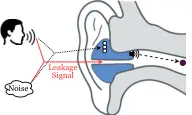
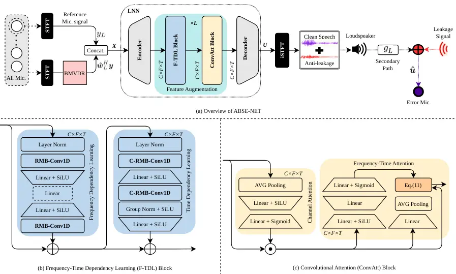
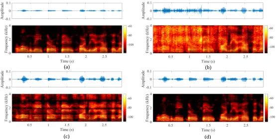

Hu Du Zhao Si

# ABSE-NET: A Lightweight Neural Model for Active Binaural Speech Enhancement in Open-Fit Hearing Aids

De    Xue    Qingying    Qintuya

###### Abstract

Open-fit hearing aids have attracted growing attention due to their
superior wearing comfort. However, the open-fit design inevitably causes
acoustic leakage into the ear canal, degrading the performance of
existing binaural speech enhancement (BSE). To this end, we propose
ABSE-NET, an active BSE framework integrating active noise control (ANC)
with BSE to jointly enhance target speech and suppress acoustic leakage.
The ABSE-NET pipeline cascades a binaural MVDR (BMVDR) with a
lightweight neural network (LNN). The former achieves a coarse BSE,
whereas the latter simultaneously cancels acoustic leakage and
compensates for BMVDR-induced distortion. The LNN uses an
encoder-decoder with a feature fusion module, which includes
frequency-time dependency learning and convolutional attention blocks.
Unlike traditional BSE+ANC solutions via adaptive filtering, ABSE-NET
needs no in-ear microphone in practical deployment. Experiments validate
its superiority over state-of-the-art methods. Code repository:
https://github.com/Bream101/ABSE-NET.

###### keywords

binaural speech enhancement, active noise control, open-fit hearing
aids, acoustic leakage

^(†)^(†)address: ¹ College of Computer Science, Inner Mongolia
University, China  
² College of Electronic and Information Engineering, Inner Mongolia
University, China ^(†)^(†)email: cshood@imu.edu.cn,
duxue@mail.imu.edu.cn, zhaoqingying@imu.edu.cn, siqty@imu.edu.cn

## 1 Introduction

Binaural speech enhancement (BSE) is a key component of modern hearing
aids (HAs) and aims to deliver high-quality audio to hearing-impaired
users \[1, 2, 3\]. Currently, most BSE approaches are designed for
closed-fit HAs, which cause the occlusion effect and may lead to
discomfort during long-term use \[4, 5\]. To mitigate this issue while
maintaining a natural listening experience, open-fit (or semi-open-fit)
HAs have been developed \[6, 7, 8\]. By employing a physical vent to
relieve ear canal pressure, these configurations effectively bypass the
occlusion effect. However, in such configurations (Figure 1), external
noisy signal inevitably leaks into the ear canal, leading to degraded
BSE performance.



Figure 1: Acoustic leakage in semi-open-fit HAs. The external
microphones (hollow circles) provide input for BSE, and the enhanced
signal is played through the internal loudspeaker. However, external
noisy signal leaks into the ear canal through the vent and corrupts the
enhanced signal, which is detected by the error microphone (solid
circle) placed deep inside the ear canal.

### 1.1 Related Works

Conventional BSE. Existing BSE approaches can be broadly categorized
into two main paradigms: model-driven and data-driven . Specifically,
model-driven BSE adopts statistical signal processing methods derived
from physical models of the degradation and probabilistic models of the
involved signals \[9\], which typically exploit the statistical
independence between the target speech and the interference fields. For
example, the binaural minimum variance distortionless response (BMVDR)
\[10, 11\] beamformer (BF) extended the classical MVDR BF \[12\] to the
binaural setting, which aims to minimize the output noise power while
preserving the target source and its spatial cues. Analogously, based on
the multi-channel Wiener filter (MWF) \[13\], several binaural MWF
approaches \[14, 15\] were presented which extend the mean squared error
minimization to the binaural setup, aiming to preserve the spatial
perception of the target speech while balancing noise reduction and
speech distortion. These model-driven BSE approaches are often
computationally efficient and perform well when the ground-truth spatial
covariance matrices (SCMs) of speech and noise are available. In
practice, however, accurately estimating SCMs is challenging due to the
temporal variability of speech and the complexity of real-world acoustic
scenes, resulting in substantial performance degradation and even speech
distortion in model-driven BSE. With the advent of deep learning,
data-driven approaches \[16, 17, 18\] have shown tremendous potential
for BSE owing to their capability to model complex, non-linear
dependencies in acoustic scenes. Among them, mask-based methods \[19,
20, 21, 22\] learned time-frequency masks from noisy inputs to derive
essential statistics, e.g., SCMs, or beamforming weights. In contrast,
end-to-end frameworks \[23, 24, 25\] bypassed the traditional
beamforming pipeline by directly learning a mapping from the noisy
waveform to the clean binaural signal. By exploiting data itself to
guide and refine the algorithm design, data-driven methods achieved
strong performance in BSE. Nevertheless, they are still constrained by
issues such as prohibitive computational complexity for hearing-aid
deployment and high sensitivity to train–test mismatch. In addition,
most existing BSE approaches, whether model-driven or data-driven, were
designed for closed-fit HAs and thus cannot handle the acoustic leakage
problem in open-fit HAs (Figure 1).

Active BSE (ABSE). To suppress the acoustic leakage in open-fit HAs,
active noise control (ANC) \[26, 27, 28\] has been incorporated into the
BSE framework, forming a hybrid scheme that is sometimes referred to as
ABSE. Its mechanism is that the internal loudspeaker simultaneously
plays the enhanced signal and an “anti-leakage” signal that cancels the
leakage component by generating a sound wave with the same amplitude but
inverted phase, utilizing the principle of destructive interference. BSE
and ANC can be combined in either a cascaded architecture \[29, 30\] or
a parallel architecture \[31\], with BSE performing speech enhancement
and ANC suppressing the leakage signal. Alternatively, state-of-the-art
methods \[32, 33\] formulated BSE and ANC within a unified optimization
problem and derived both closed-form and adaptive solutions, aiming to
minimize the global residual noise rather than optimizing each stage
individually. Nevertheless, these ABSE methods place an error microphone
deep inside the ear canal to provide feedback for model-driven adaptive
filters, which is difficult in practice because the ear canal is too
narrow to accommodate a microphone, making it uncomfortable for
long-term wear. Although some data-driven ANC approaches \[34, 35\] can
operate without the error microphone, they were not originally designed
for HA scenarios and incur high computational costs. These limitations
emphasize the necessity of developing lightweight and data-driven ABSE
methods that do not rely on an error microphone placed deep inside the
ear canal.

### 1.2 Contribution

In this work, we propose the ABSE-NET, a lightweight neural model for
ABSE in open-fit HAs. The pipeline of ABSE-NET cascades a BMVDR BF with
a lightweight neural network (LNN), thereby combining the benefits of
both model-driven and data-driven approaches. Specifically, the BMVDR BF
performs a coarse BSE while preserving the spatial cues, whereas the LNN
is designed to simultaneously cancel the acoustic leakage and compensate
for BMVDR-induced distortion. The LNN adopts an encoder–decoder
architecture with an intermediate feature augmentation module, in which
a novel frequency–time dependency learning (F-TDL) block and a
convolutional attention (ConvAtt) block are introduced to effectively
refine latent representations. To the best of our knowledge, ABSE-NET is
the first lightweight ABSE framework without requiring an in-ear error
microphone. Extensive experiments demonstrate that ABSE-NET outperforms
state-of-the-art approaches while exhibiting remarkable superiority in
terms of computational efficiency. Notations: Scalars, vectors, and
matrices are represented by lowercase letters, bold lowercase letters,
and bold uppercase letters, respectively.

## 2 Preliminaries

We consider an open-fit HA configuration where each HA consists of
$`M/2`$ microphones, with $`M`$ being an even number. In the short-time
Fourier transform (STFT) domain, letting $`l`$ and $`k`$ be the time and
frequency indices, the multi-channel microphone signal
$`\bm{y}(k,l)\in\mathbb{C}^{M\times 1}`$ can be represented as

```math
\displaystyle\bm{y}(k,l)=\bm{a}(k)s(k,l)+\sum_{i=1}^{I}\bm{b}_{i}(k)n_{i}(k,l)+\bm{v}(k,l), \tag{1}
```

where $`\bm{a}(k)`$ and $`\bm{b}_{i}(k)`$ denote the acoustic transfer
functions (ATFs) of the target signal $`s(k,l)`$ and the $`i`$th
interferer $`n_{i}(k,l)`$, respectively, $`\bm{v}(k,l)`$ denotes the
received background noise and sensor self-noise, and $`I`$ is the number
of interferers. For notational simplicity, indices $`k`$ and $`l`$ will
be omitted from the rest of this paper.



Figure 2: Proposed ABSE-NET: (a) Overview of ABSE-NET, (b) Architecture
of F-TDL block, (c) Architecture of ConvAtt block.

The traditional BMVDR BF \[10, 11\] consists of two filters designed to
preserve the target signal as received by the reference microphone in
each HA, while minimizing the output interferer-plus-noise power. To be
specific, taking the left HA as an example, the filter coefficient
$`\bm{w}_{L}`$ can be obtained by solving the convex problem:

```math
\hat{\bm{w}}_{L}=\arg\min_{\bm{w}_{L}}\bm{w}^{H}_{L}\bm{R}\bm{w}_{L}\quad\text{s.t.}\quad\bm{w}_{L}^{H}\bm{a}=a_{L}, \tag{2}
```

where $`\bm{\hat{w}}_{L}`$ is the estimate of $`\bm{w}_{L}`$, $`\bm{R}`$
is the SCM of the interferer-plus-noise component, superscript
$`(\cdot)^{H}`$ denotes the Hermitian transpose, and $`a_{L}`$ is the
ATF from the target source to the reference microphone at the left HA.
Based on the Lagrange multiplier method \[36\], $`\bm{\hat{w}}_{L}`$ can
be obtained in closed form, which enables fast computation of the
enhanced signal $`\bm{\hat{w}}_{L}^{H}\bm{y}`$. In open-fit HAs, using
BMVDR BF introduces two main issues:

(1) Acoustic Leakage. Assume that an error microphone is placed deep
inside the ear canal¹¹ 1 The error microphone is primarily employed
during the signal modeling and model training phases, thereby
substantially alleviating the strict dependency on real-time error
feedback during inference and deployment., its received signal in the
STFT domain can be modeled as

```math
\displaystyle e_{L}=g_{L}\cdot\bm{\hat{w}}_{L}^{H}\bm{y}+d_{L}\;, \tag{3}
```

where $`d_{L}`$ is the acoustic leakage signal in the left HA, and
$`g_{L}`$ represents the secondary path, i.e., the ATF from the
loudspeaker to the error microphone in the left HA. The
interferer-plus-noise component in $`d_{L}`$ inevitably degrades the
output signal-to-interference-plus-noise ratio (SINR), while the target
speech component in $`d_{L}`$ interacts with
$`\bm{\hat{w}}_{L}^{H}\bm{y}`$ and may introduce unpleasant artifacts
such as comb filtering \[37\].

(2) Speech Distortion. In practice, the ground truth of the ATF
$`\bm{a}`$ is unavailable to the BMVDR BF. As a result, ATF estimation
errors lead to a mismatch in the constraint of (2), which in turn causes
distortion of both the target speech and the spatial cues. In addition,
the SCM $`\bm{R}`$ is subject to estimation errors, which degrades the
noise reduction performance.

To tackle the above issues, this work designs a data-driven post-filter
for the BMVDR BF, which is mathematically described by the mapping
$`\mathcal{F}(\cdot)`$:

```math
\displaystyle\boxed{\mathcal{F}(\bm{\hat{w}}_{L}^{H}\bm{y},y_{L})\mapsto-d_{L}/g_{L}+a_{L}s} \tag{4}
```

where $`y_{L}`$ denotes the signal received by the reference microphone
of the left HA. Clearly, the first term aims to cancel the leakage
signal, whereas the second term compensates for the distortion in the
BMVDR output $`\bm{\hat{w}}_{L}^{H}\bm{y}`$. Here, to generate
high-quality anti-leakage “$`-d_{L}/g_{L}`$”, the noisy reference signal
$`y_{L}`$ is also fed into the model as an auxiliary input, so as to
prevent excessive noise suppression in the BMVDR BF.

## 3 Proposed Method

ABSE-NET operates independently on the left and right HAs. For brevity,
only the left-HA pipeline is illustrated in Figure 2, while the right-HA
pipeline follows analogously. First, the BMVDR BF performs coarse BSE in
the STFT domain, and its output $`\bm{\hat{w}}_{L}^{H}\bm{y}`$ is
concatenated with the noisy reference signal $`y_{L}`$ to complement the
target estimate with sufficient noise information retained in the raw
reference and then fed into the LNN. The LNN consists of an encoder for
feature extraction, a feature augmentation (FA) module, and a decoder
that maps the augmented features back to the STFT domain. Finally, the
output of LNN is transformed in the time domain, emitted by the
loudspeaker, and propagated through the secondary path $`g_{L}`$ to the
ear canal where it destructively interferes with the leakage signal.

Symbol Definition. The input $`\bm{X}\in\mathbb{R}^{4\times F\times T}`$
of LNN is formed by concatenating the real and imaginary parts of both
$`\bm{\hat{w}}_{L}^{H}\bm{y}`$ and $`y_{L}`$, where $`F`$ and $`T`$
denote the numbers of frequency bins and time frames, respectively. The
encoder then extracts the latent feature
$`\bm{H}\in\mathbb{R}^{C\times F\times T}`$ from $`\bm{X}`$, where $`C`$
is the feature dimension. The FA module produces an augmented feature
$`\bm{A}\in\mathbb{R}^{C\times F\times T}`$, which is transformed to the
STFT-domain signal $`\bm{U}\in\mathbb{R}^{2\times F\times T}`$ through
the decoder. The output $`\bm{U}`$ of decoder is first transformed into
the time domain and then propagated through the secondary path, yielding
final output $`\bm{\hat{u}}`$.

Model Details. The BMVDR BF has been detailed in Section 2. For the LNN,
the encoder employs a single convolutional layer with RMB-Conv1D kernels
without identity branches (see subsection 3.1 for details of
RMB-Conv1D), while the decoder adopts a fully connected (FC) layer to
project the high-dimensional deep features back to the complex spectral
dimension. The remaining FA module is repeated $`L`$ times to
progressively augment the feature representation through hierarchical
abstraction, each consisting of an F-TDL block and a ConvAtt block,
whose technical details are described in the following subsections.

Loss Function. We define the loss function as

```math
\displaystyle\mathcal{L}=-\text{SI-SDR}(\bm{\hat{u}},\bm{u})-\lambda\cdot{\text{STOI}}(\bm{\hat{u}},\bm{u}), \tag{5}
```

where $`\bm{u}`$ denotes the clean speech serving as the ground-truth
target and $`\lambda`$ is a hyperparameter that controls the relative
contribution of signal reconstruction quality and perceptual
intelligibility. $`\text{SI-SDR}(\cdot)`$ stands for scale-invariant
signal-to-distortion ratio \[38\], designed to optimize waveform
reconstruction quality, by measuring the ratio between the target
component and the residual distortion while being invariant to global
gain scaling, and $`\text{STOI}(\cdot)`$ represents short-time objective
intelligibility \[39\], utilized to enhance speech intelligibility by
maximizing the short-time correlation between the temporal envelopes of
clean and processed speech in one-third octave bands.

### 3.1 F-TDL Block

Speech signals are produced by the periodic vibration of the vocal folds
and are subsequently modulated by the vocal tract \[40\], which results
in inherent frequency-time dependencies. The frequency dependencies stem
from: (a) the concentration of speech energy around the fundamental
frequency and its harmonics; and (b) the spectral leakage in the STFT
domain due to the windowing operation \[41, 42, 43\]. The time
dependencies arise from: (a) the short-time quasi-periodicity in the
time domain; and (b) the inter-frame convolution caused by room impulse
responses longer than the frame length \[44, 45, 46\]. By exploiting
these frequency-time dependencies, state-of-the-art approaches have
achieved significant performance improvements in several speech
processing tasks \[47, 48\]. However, most of them rely on
computationally intensive attention mechanisms, such as multi-head
self-attention in \[48\], which makes them ill-suited for deployment in
HA platforms. To this end, we design the F-TDL block, which consists of
two sub-blocks: a frequency dependency learning (FDL) sub-block and a
time dependency learning (TDL) sub-block.

Frequency Dependency Learning Sub-block. This sub-block aims to learn
the frequency-dependent information by processing each time frame
independently, i.e., weights are shared across time frames. As shown in
the left part of Figure 2 (b), the FDL sub-block adopts a residual
structure \[49\] to mitigate the vanishing gradient problem and
stabilize the learning dynamics during deep feature extraction. This
sub-block consists of layer normalization (LN) followed by a combination
of linear (or linear+SiLU) layers and RMB-Conv1D layers. LN is applied
per sample over all dimensions, ensuring that the normalization is
robust to the signal’s internal variance and independent of the batch
size. Specifically, three linear layers form a bottleneck structure that
compresses the feature dimension from $`C`$ to $`C_{1}`$ and then
expands it back to $`C`$, where the first and third linear layers are
followed by the SiLU nonlinear activation functions \[50\], whose smooth
and non-monotonic nature helps prevent the dying neuron problem commonly
encountered in standard ReLU. The RMB-Conv1D layer applies
reparameterized multi branch one-dimensional convolution (RMB-Conv1D)
\[51\] along the frequency dimension, which employs multi-scale
convolutions during training and fuses them into a single kernel at
inference. In this work, we define three kernel sizes
$`\mathcal{K}=\{q_{1},q_{2},q_{3}\}`$ with $`q_{1}<q_{2}<q_{3}`$. Then,
in the training stage, the output $`\bm{Y}_{train}`$ of RMB-Conv1D layer
can be formulated as

```math
\displaystyle\bm{Y}_{train}=\bm{\Psi}+\sum_{q\in\mathcal{K}}\mathcal{P}(\bm{\Psi},\bm{r}_{q}), \tag{6}
```

where $`\bm{\Psi}\in\mathbb{R}^{C\times F}`$ is the input feature,
$`\mathcal{P}(\cdot)`$ denotes the depth-wise convolution, and
$`\bm{r}_{q}`$ is the convolution kernel with $`q`$ being the kernel
size. During the inference stage, the output $`\bm{Y}_{infer}`$ can be
obtained by fusing the multi-scale convolutions in (6) into a single
convolution, i.e.,

```math
\displaystyle\bm{Y}_{infer}=\mathcal{P}(\bm{\Psi},\bm{r}) \tag{7}
```

where $`\bm{r}`$ denotes the fused convolution kernel, which can be
calculated by

```math
\displaystyle\bm{r}=\bm{r}_{q_{3}}+\mathcal{Z}(\bm{r}_{q_{2}})+\mathcal{Z}(\bm{r}_{q_{1}})+\bm{r}_{I}, \tag{8}
```

where $`\mathcal{Z}(\cdot)`$ denotes zero-padding alignment to the
maximum kernel size $`q_{3}`$, and $`\bm{r}_{I}`$ represents the
convolution kernel transformed from the first term in (6). We can
conclude from (7) that only a single convolution kernel is required
during inference stage, while achieving the same modeling capacity as
the multi-scale convolutional structure in (6). In addition, the FDL
sub-block avoids computationally expensive multi-head attention
mechanisms, enabling efficient deployment on HAs.

Time Dependency Learning Sub-block. This sub-block aims to learn the
time-dependent information, i.e., weights are shared across all
frequency bins. As illustrated in the right part of Figure 2 (b), the
TDL sub-block also adopts a residual structure, which is composed of LN
followed by a combination of linear+SiLU layers, C-RMB-Conv1D layers,
and a group normalization (GN) layer with SiLU activation. LN is applied
per sample over all dimensions. The C-RMB-Conv1D layer replaces the
standard convolution in the RMB-Conv1D layer with causal convolution to
enhance the real-time capability of the model by strictly restricting
the receptive field to past and present frames, thus preventing any
reliance on future look-ahead. Instead of using a bottleneck structure,
the feature dimension is first expanded from $`C`$ to $`C_{2}`$ via a
linear+SiLU layer, refined by C-RMB-Conv1D and GN+SiLU, and finally
projected back to $`C`$ with another linear+SiLU layer. This design is
motivated by the higher complexity of temporal dependencies in speech
signals, which are consequently modeled in a higher-dimensional feature
space, thereby preventing the loss of fine-grained temporal dynamics
that might occur in a compressed representation. Owing to the use of
C-RMB-Conv1D layers, the TDL sub-block maintains a lightweight design
while ensuring causality for real-time processing.

### 3.2 ConvAtt Block

To further refine the features extracted by the F-TDL module, we cascade
a ConvAtt block after it. To reduce computational complexity, inspired
by \[52\], the ConvAtt sequentially infers attention maps along two
separate dimensions, namely the channel dimension and the frequency–time
dimension, which avoids the prohibitive computational costs associated
with computing full 3D attention tensors, making it highly suitable for
lightweight edge deployment. Then, the attention maps are applied to the
input feature for adaptive feature refinement.

Channel Attention Sub-block. This sub-block is constructed to produce a
channel attention map by exploiting the inter-channel features, which
can be formulated as

```math
\displaystyle\bm{\Phi}^{\prime}=\bm{M}_{C}(\bm{\Phi})\odot\bm{\Phi}, \tag{9}
```

where $`\bm{\Phi}\in\mathbb{R}^{C\times F\times T}`$ and
$`\bm{\Phi}^{\prime}\in\mathbb{R}^{C\times F\times T}`$ represent the
input and output, respectively,
$`\bm{M}_{C}(\bm{\Phi})\in\mathbb{R}^{C\times 1\times 1}`$ is the
channel attention map, and $`\odot`$ denotes the element-wise
multiplication with broadcasting. As shown in the left part of Figure 2
(c), the channel attention sub-block $`\bm{M}_{C}(\cdot)`$ consists of a
global pooling operation over the frequency–time dimensions, followed by
a linear+SiLU layer and a linear+Sigmoid layer. The linear+SiLU layer
compresses the feature dimension to $`C_{3}`$, while the linear+Sigmoid
layer, a linear layer followed by a Sigmoid activation \[53\], projects
the features back to the original dimension $`C`$. This design incurs a
small number of parameters and therefore maintains a lightweight nature.

| Method       | Para.(M) | FLOPs(G) | SI-SDR(dB) | PESQ  | STOI  | CSIG  | CBAK  | COVL  | $`\Delta\text{ILD}`$ | $`\Delta\text{IPD}`$ |
| ------------ | -------- | -------- | ---------- | ----- | ----- | ----- | ----- | ----- | -------------------- | -------------------- |
| Unprocessed  | –        | –        | -2.781     | 1.609 | 0.775 | 2.223 | 1.734 | 1.868 | –                    | –                    |
| BMVDR w/o AL | –        | –        | 5.216      | 3.437 | 0.929 | 4.020 | 3.343 | 3.698 | 4.375                | 0.391                |
| BMVDR        | –        | –        | 0.878      | 2.196 | 0.861 | 2.670 | 2.266 | 2.424 | 4.054                | 0.351                |
| FxMWF        | –        | –        | 3.723      | 3.181 | 0.925 | 3.791 | 3.173 | 3.325 | 3.998                | 0.327                |
| DeepANC      | 19.683   | 5.817    | 2.683      | 2.449 | 0.854 | 3.414 | 2.827 | 2.953 | 3.690                | 0.302                |
| ASE-TM       | 3.224    | 14.417   | 10.45      | 3.573 | 0.953 | 4.212 | 3.744 | 4.071 | 3.121                | 0.242                |
| ABSE-NET     | 0.112    | 0.184    | 9.869      | 3.626 | 0.955 | 4.655 | 3.578 | 4.169 | 3.047                | 0.251                |

Table 1: Comparison of computational efficiency, speech quality, and
spatial cue preservation on the test set. Note: “M” and “G” denote
millions and gigas, respectively; the best results are highlighted in
bold, and the second-best results are underlined.



Figure 3: Visualization of waveforms and spectrograms across different
signal processing stages: (a) Clean, (b) Unprocessed, (c) BMVDR w/o AL,
(d) ABSE-NET.

Frequency-Time Attention Sub-block. This sub-block produces a
frequency-time attention map by exploiting the frequency-time features,
which can be formulated as

```math
\displaystyle\bm{A}=\bm{M}_{FT}(\bm{\Phi}^{\prime})\odot\bm{\Phi}^{\prime}, \tag{10}
```

where
$`\bm{M}_{FT}(\bm{\Phi}^{\prime})\in\mathbb{R}^{1\times F\times T}`$ is
the frequency-time attention map. As shown in the right part of Figure 2
(c), $`\bm{M}_{FT}(\cdot)`$ consists of four linear layers (including a
linear+SiLU layer and a linear+Sigmoid layer) and an average pooling
layer. Mathematically, it can be formulated as

```math
\displaystyle\bm{M}_{FT}(\bm{\Phi}^{\prime})=[1-\alpha\cdot\rho(\bm{\Phi}^{\prime})\cdot\bm{G}(\bm{\Phi}^{\prime})], \tag{11}
```

where $`\bm{G}(\bm{\Phi}^{\prime})\in\mathbb{R}^{1\times F\times T}`$
and $`\rho(\bm{\Phi}^{\prime})\in\mathbb{R}^{1\times 1\times 1}`$ are
two intermediate variables, and $`\alpha`$ is a hyperparameter. On the
one hand, $`\bm{G}(\bm{\Phi}^{\prime})`$ is obtained by passing
$`\bm{\Phi}^{\prime}`$ through three linear layers. Specifically, the
first linear+SiLU layer compresses the channel dimension to $`C_{4}`$,
the second linear layer projects it back to $`C`$, and the third
linear+Sigmoid layer further reduces the channel dimension to $`1`$. On
the other hand, $`\rho(\bm{\Phi}^{\prime})`$ is computed by passing
$`\bm{\Phi}^{\prime}`$ through a linear layer followed by an average
pooling layer. The linear layer compresses the channel dimension to 1,
while the average pooling layer reduces the frequency-time dimension
to 1. Similar to the channel attention sub-block, the frequency-time
attention sub-block still maintains the lightweight nature.

## 4 Experiments

### 4.1 Experimental Setups

Dataset. The clean speech and noise signals were obtained from the
Librispeech dataset \[54\] and the NOISEX-92 dataset \[55\],
respectively. Head-related impulse responses (HRIRs) were derived from
the Hearpiece database \[56\], which provides three external
microphones, as well as an in-ear microphone acting as the error
microphone. From this database, we selected HRIRs corresponding to 24
distinct incident directions. Specifically, 12 directions were allocated
for training, while the remaining 12 were reserved for validation and
testing. To ensure adequate spatial coverage and evaluate the model’s
spatial generalization, the closest adjacent directions within each
12-direction subset were separated by 15°. The clean speech and noise
signals were convolved with the HRIRs to generate binaural clean speech
components and noise components. These two components were then added
together at a random signal-to-noise ratio (SNR) ranging from –5 dB to 0
dB to simulate challenging low-SNR conditions typical of daily HA usage,
resulting in 43,200 two-second samples (approximately 24 hours in
total). The dataset was partitioned into training, validation, and
testing sets at an 8:1:1 ratio, with strict mutual exclusivity enforced
to ensure absolutely no data overlap across the subsets. All signals
were downsampled to 16 kHz.

Training Details. The STFT was applied using a Hanning window with a
length of 320 samples and a hop size of 160 samples. For the BMVDR
beamformer, either ideal or mismatched ATFs were used, while the SCM
$`\bm{R}`$ was estimated via voice activity detection. For the LNN,
frame-level normalization was applied to the input $`\bm{X}`$ to ensure
consistent input scaling, thereby mitigating the impact of drastic
energy fluctuations in diverse acoustic environments and stabilizing the
learning process. In terms of model architecture, the FA module was
repeated $`L=4`$ times, and all RMB-Conv1D (or C-RMB-Conv1D) layers
included kernel sizes of $`\mathcal{K}=\{1,3,5\}`$. The feature
dimensions in the FA module were set to $`C=16`$, $`C_{1}=8`$,
$`C_{2}=24`$, $`C_{3}=4`$, and $`C_{4}=4`$. The hyperparameters
$`\alpha`$ and $`\lambda`$ were set to 0.3 and 10, respectively. The
Adam optimizer \[57\] was used to train the ABSE-NET with an initial
learning rate of $`3\times 10^{-3}`$. The batch size was fixed to 6, and
the model was trained for 60 epochs, at which point the loss was
empirically observed to plateau, ensuring sufficient convergence while
avoiding overfitting. An in-ear microphone, i.e., the error microphone,
was employed in the training stage, but it was not required in the
inference stage.

Evaluation Metrics. We established a multi-dimensional evaluation
framework encompassing speech quality, spatial cue preservation, and
computational efficiency to comprehensively assess the practical
viability of the proposed ABSE-NET. Speech quality was evaluated using
the SI-SDR, perceptual evaluation of speech quality (PESQ) \[58\], STOI,
signal distortion prediction (CSIG), background noise intrusiveness
prediction (CBAK), and overall speech quality prediction (COVL) \[59\],
thereby enabling a holistic analysis ranging from waveform fidelity to
human auditory perception. Spatial cue preservation was tested using the
interaural level difference (ILD) and interaural phase difference (IPD)
errors, as defined in \[16\], which quantify the preservation of
directional localization cues essential for spatial awareness.
Specifically, the ILD errors ($`\Delta{\text{ILD}}`$) and IPD errors
($`\Delta{\text{IPD}}`$) are mathematically formulated as:

```math
\begin{aligned} \Delta{\text{ILD}}&=\frac{20}{TF}\sum_{t}\sum_{f}\left(\log_{10}\left(\frac{|\bm{\hat{u}}_{L}|}{|\bm{\hat{u}}_{R}|}\right)-\log_{10}\left(\frac{|\bm{u}_{L}|}{|\bm{u}_{R}|}\right)\right),\\
\Delta{\text{IPD}}&=\frac{1}{TF}\sum_{t}\sum_{f}\left(\arctan\left(\frac{|\bm{\hat{u}}_{L}|}{|\bm{\hat{u}}_{R}|}\right)-\arctan\left(\frac{|\bm{u}_{L}|}{|\bm{u}_{R}|}\right)\right).\end{aligned} \tag{12}
```

In addition, computational efficiency was assessed in terms of the
number of model parameters and floating-point operations (FLOPs).

### 4.2 Comparison Study

To comprehensively evaluate the effectiveness of the proposed ABSE-NET
in open-fit HAs, we conducted comparisons with the following baseline
methods:

- •
  Model-driven baselines: The BMVDR BF was carried out under two cases,
  i.e., in the absence and presence of acoustic leakage, with the former
  referred to as BMVDR w/o AL. In addition, the FxMWF \[29\] was
  included as another baseline, which enables simultaneous speech
  enhancement and acoustic leakage suppression using adaptive filtering.
- •
  Data-driven baselines: To the best of our knowledge, developing
  data-driven approaches for the proposed ABSE remains an open problem.
  Therefore, we extended two closely related data-driven methods to the
  open-fit HA scenario. The first method is DeepANC \[34\], a
  deep-learning ANC framework that can preserve target speech by
  appropriately designing the loss functions. The second method is
  ASE-TM \[35\], which extends beyond traditional ANC by actively
  shaping the clean speech. For a fair comparison, both DeepANC and
  ASE-TM are retrained on our dataset to perform ABSE.

From Table 1, it can be observed that the speech quality of the
unprocessed signals is limited. After processing with the BMVDR BF
without acoustic leakage (BMVDR w/o AL), representing an ideal
closed-fit scenario where no leakage noise bypasses the HAs, the speech
quality improves substantially. For instance, the SI-SDR increases from
-2.781 dB to 5.216 dB, while the PESQ score improves from 1.609 to
3.437. In open-fit HAs, however, acoustic leakage is inevitable,
resulting in a significant performance degradation of the BMVDR BF, as
evidenced by its SI-SDR plummeting from 5.216 dB to a mere 0.878 dB, and
PESQ dropping from 3.437 to 2.196. This highlights that methods
developed under closed-fit configurations may not generalize well to
open-fit HAs. By comparison, the FxMWF is designed for open-fit HAs and
can jointly achieve speech enhancement and active noise control, thereby
outperforming the BMVDR BF. However, its performance is still slightly
lower than that of BMVDR w/o AL, likely because its linear filtering
mechanism struggles to completely eliminate the leakage signal in
complex acoustic scenes. For data-driven methods, both DeepANC and
ASE-TM outperform the BMVDR beamformer in terms of speech quality, with
the latter exhibiting particularly strong performance compared with
other baselines, achieving an impressive SI-SDR of 10.45 dB, the highest
among all compared methods. The proposed ABSE-NET achieves the best or
second-best speech quality across all evaluated metrics, delivering the
best performance in PESQ, STOI, CSIG, COVL, as well as the the
second-best results in SI-SDR and CBAK. In addition, the ABSE-NET
requires only 0.112M parameters and 0.184G FLOPs, which are
significantly lower than those of DeepANC and ASE-TM, highlighting its
suitability for resource-constrained HA devices. This advantage mainly
stems from the lightweight FA module designed in ABSE-NET, whereas
DeepANC and ASE-TM employ parameter-intensive architectures such as
Convolutional Long Short-Term Memory \[34\] or Transformer-Mamba \[35\]
structures. Moreover, in terms of spatial cue preservation, ABSE-NET
achieves the smallest $`\Delta{\text{ILD}}`$ and the second-smallest
$`\Delta{\text{IPD}}`$, with values of 3.047 and 0.251, respectively,
indicating an excellent ability to maintain binaural spatial perception
without distorting directional cues.

For a more intuitive visualization of the speech enhancement results,
Figure 3 shows a set of waveforms and spectrograms. The unprocessed
signal exhibits pronounced acoustic leakage components that obscure
speech harmonics. Although BMVDR w/o AL reduces part of the
interference, noticeable residual leakage and harmonic distortion
remain. In contrast, ABSE-NET more effectively suppresses acoustic
leakage while preserving continuous and well-defined harmonic structures
that closely resemble those of the clean speech. These visual results
further confirm the advantage of ABSE-NET in mitigating leakage-induced
artifacts without introducing additional spectral distortion.

### 4.3 Ablation Studies

#### 4.3.1 Effectiveness of RMB-Conv1D

To validate the effectiveness of RMB-Conv1D layers in ABSE-NET, we
replaced the multi-scale convolution in (7) with a standard depth-wise
convolution using a kernel size of 5 (Line 1 of Table 2), which serves
as a conventional baseline to highlight the architectural benefits of
multi-branch designs. Additionally, we adopted multi-scale convolutions
with identical kernel sizes, including $`\mathcal{K}=\{1,1,1\}`$,
$`\mathcal{K}=\{3,3,3\}`$, and $`\mathcal{K}=\{5,5,5\}`$, to demonstrate
that simply increasing the number of parallel branches with identical
receptive fields limits the diversity of extracted features. As shown in
Table 2, RMB-Conv1D with heterogeneous kernel sizes achieves the best
overall performance. This is because convolution with different kernel
sizes can effectively capture both coarse-grained and fine-grained
features, with smaller kernels extracting high-resolution local spectral
variations and larger kernels modeling broader contextual dependencies
within the acoustic signal. Note that all configurations have comparable
parameter counts and FLOPs, as the multi-scale convolutions are fused
into a single convolution at inference in (7).

| Convolution               | Para.(M) | FLOPs(G) | SI-SDR(dB) | PESQ  | STOI  |
| ------------------------- | -------- | -------- | ---------- | ----- | ----- |
| $`\mathcal{K}=\{5\}`$     | 0.112    | 0.184    | 7.918      | 3.283 | 0.932 |
| $`\mathcal{K}=\{1,1,1\}`$ | 0.111    | 0.175    | 8.134      | 3.475 | 0.945 |
| $`\mathcal{K}=\{3,3,3\}`$ | 0.111    | 0.179    | 8.984      | 3.557 | 0.947 |
| $`\mathcal{K}=\{5,5,5\}`$ | 0.112    | 0.184    | 8.222      | 3.548 | 0.943 |
| $`\mathcal{K}=\{1,3,5\}`$ | 0.112    | 0.184    | 9.869      | 3.626 | 0.955 |

Table 2: Impact of different convolution strategies.

#### 4.3.2 Effectiveness of FA Module

In this part, we tested the effectiveness of FA module through a series
of ablation experiments.

Effectiveness of F-TDL Block. In order to assess the validity of the
proposed F-TDL block, we first replaced it with a state-of-the-art
frequency-time learning model, namely SpatialNet \[48\], which was
originally designed for speech separation, denoising and
dereverberation. By comparing the first two rows in Table 3, it can be
observed that the parameter counts of F-TDL block and SpatialNet are
comparable, but the FLOPs of the F-TDL block are 7 times lower than
those of SpatialNet, which is highly advantageous for power-constrained
wearable hearing devices. In addition, using F-TDL block delivers
superior speech enhancement performance across all evaluated metrics
compared with SpatialNet, yielding an improvement of 1.06 dB in SI-SDR,
alongside noticeable gains in both PESQ and STOI. Next, we separately
removed the FDL and TDL sub-blocks from the F-TDL block, denoted as w/o
FDL and w/o TDL, respectively. As can be observed, both variants exhibit
a significant performance degradation compared with the complete F-TDL
block, confirming the necessity of both sub-blocks for speech
enhancement. In particular, removing the FDL sub-block leads to a more
pronounced degradation: compared with F-TDL, the SI-SDR, PESQ, and STOI
drop from 9.869 dB, 3.626, and 0.955 to 5.610 dB, 2.527, and 0.819,
respectively, suggesting that accurately capturing frequency-dependent
spectral features forms the critical foundation for subsequent temporal
refinement. Finally, we removed the entire F-TDL block and retained only
the ConvAtt block for feature augmentation, denoted as w/o F-TDL. As
expected, this variant suffers from a severe degradation in speech
quality and performs even worse than FxMWF reported in Table 1,
indicating that the attention mechanism alone, without the dedicated
spectro-temporal feature extraction provided by F-TDL, is insufficient
to handle complex acoustic environments. These comparisons collectively
demonstrate that the proposed F-TDL block, as well as each of its
sub-blocks, plays a crucial role in the ABSE-NET.

| Architecture | Para.(M) | FLOPs(G) | SI-SDR(dB) | PESQ  | STOI  |
| ------------ | -------- | -------- | ---------- | ----- | ----- |
| SpatialNet   | 0.119    | 1.313    | 8.809      | 3.597 | 0.951 |
| F-TDL        | 0.112    | 0.184    | 9.869      | 3.626 | 0.955 |
| w/o FDL      | 0.005    | 0.148    | 5.610      | 2.527 | 0.819 |
| w/o TDL      | 0.106    | 0.061    | 6.472      | 3.133 | 0.893 |
| w/o F-TDL    | 0.001    | 0.024    | 1.769      | 2.169 | 0.775 |

Table 3: Ablation study of the F-TDL block.

| Architecture                            | Para.(M) | FLOPs(G) | SI-SDR(dB) | PESQ  | STOI  |
| --------------------------------------- | -------- | -------- | ---------- | ----- | ----- |
| CBAM                                    | 0.110    | 0.193    | 8.128      | 3.123 | 0.935 |
| ConvAtt                                 | 0.112    | 0.184    | 9.869      | 3.626 | 0.955 |
| w/o CA                                  | 0.111    | 0.183    | 8.273      | 3.419 | 0.941 |
| w/o FTA                                 | 0.111    | 0.166    | 7.607      | 3.137 | 0.931 |
| FTA with $`\bm{G}(\bm{\Phi}^{\prime})`$ | 0.112    | 0.184    | 7.936      | 3.159 | 0.932 |
| w/o ConvAtt                             | 0.110    | 0.164    | 7.441      | 2.939 | 0.928 |

Table 4: Ablation study of the ConvAtt block.

Effectiveness of ConvAtt Block. To further evaluate the effectiveness of
the ConvAtt block, we first replaced it with a representative
convolutional block attention module, namely CBAM \[52\], which infers
attention maps along two separate channel and spatial dimensions to
reduce computational complexity. By comparing the first two rows in
Table 4, it can be observed that the proposed ConvAtt block outperforms
CBAM in terms of speech enhancement performance. Meanwhile, although
ConvAtt has a slightly higher parameter count than CBAM, it requires
fewer FLOPs. Next, we separately removed the channel attention sub-block
and frequency-time attention sub-block from the ConvAtt block, denoted
as w/o CA and w/o FTA, respectively. From Table 4, we can see that both
variants perform worse than the complete ConvAtt block, demonstrating
the effectiveness of both the channel attention and frequency–time
attention sub-blocks. Afterward, we substituted the right-hand side of
(11) with $`\bm{G}(\bm{\Phi}^{\prime})`$ alone, referred to as FTA with
$`\bm{G}(\bm{\Phi}^{\prime})`$. The resulting performance degradation
demonstrates that the complete design in (11) is more effective than
using $`\bm{G}(\bm{\Phi}^{\prime})`$ alone, indicating that the complete
mechanism better captures complex multi-dimensional dependencies that a
single projection might lose. Finally, we removed the entire ConvAtt
block. Although this slightly reduces the number of parameters and
computational cost, it leads to a significant degradation in speech
enhancement performance, dropping to 7.441 dB for SI-SDR, 2.939 for
PESQ, and 0.928 for STOI, which justifies the minimal computational
overhead of 0.02G FLOPs introduced by the attention mechanism. These
results confirm the importance of the ConvAtt block in ABSE-NET.

Impact of FA Depth. In Table 5, we evaluated the impact of the FA depth
$`L`$, i.e., the number of stacked F-TDL and ConvAtt blocks in the FA
module, to determine the optimal balance between representation depth
and computational overhead. As expected, both the parameter count and
FLOPs increase gradually as $`L`$ increases, while the speech
enhancement performance improves correspondingly. For instance, as $`L`$
increases from 2 to 5, the parameter count increases from 0.108 M to
0.113 M, and the FLOPs increase from 0.094 G to 0.230 G, highlighting a
nearly linear scaling in computational cost, whereas the parameter
growth is extremely marginal due to the lightweight design of the
blocks. Meanwhile, SI-SDR, PESQ, and STOI rise to 10.304 dB, 3.708, and
0.959 from 9.327 dB, 3.427, and 0.934, respectively. This is because the
learning capability of ABSE-NET improves as the number of F-TDL and
ConvAtt blocks increases, allowing the network to perform deeper
hierarchical feature abstractions and capture more intricate
spectro-temporal relationships. For deployment on resource-constrained
HA platforms, the choice of $`L`$ should be guided by practical
constraints such as processing latency, power consumption, and the
available computational capacity, which is why $`L=4`$ was adopted as
the default configuration in our preceding evaluations, providing a
highly effective trade-off between performance and efficiency.

| FA Depth | Para.(M) | FLOPs(G) | SI-SDR(dB) | PESQ  | STOI  |
| -------- | -------- | -------- | ---------- | ----- | ----- |
| $`L=2`$  | 0.108    | 0.094    | 9.327      | 3.427 | 0.934 |
| $`L=3`$  | 0.109    | 0.139    | 9.561      | 3.457 | 0.944 |
| $`L=4`$  | 0.112    | 0.184    | 9.869      | 3.626 | 0.955 |
| $`L=5`$  | 0.113    | 0.230    | 10.304     | 3.708 | 0.959 |

Table 5: Impact of the depth $`L`$ of FA module.

| DOA Error                      | SI-SDR(dB) | PESQ  | STOI  | $`\Delta`$ILD | $`\Delta`$IPD |
| ------------------------------ | ---------- | ----- | ----- | ------------- | ------------- |
| BMVDR w/o AL ($`0^{\circ}`$)   | 5.216      | 3.437 | 0.929 | 4.375         | 0.391         |
| BMVDR ($`0^{\circ}`$)          | 0.878      | 2.196 | 0.861 | 4.054         | 0.351         |
| ABSE-NET ($`0^{\circ}`$)       | 9.869      | 3.626 | 0.955 | 3.047         | 0.251         |
| BMVDR w/o AL ($`7.5^{\circ}`$) | 3.428      | 3.254 | 0.917 | 4.443         | 0.397         |
| BMVDR ($`7.5^{\circ}`$)        | 0.112      | 2.017 | 0.855 | 4.094         | 0.351         |
| ABSE-NET ($`7.5^{\circ}`$)     | 8.218      | 3.455 | 0.951 | 3.647         | 0.299         |
| BMVDR w/o AL ($`15^{\circ}`$)  | 1.637      | 3.077 | 0.874 | 4.688         | 0.415         |
| BMVDR ($`15^{\circ}`$)         | -1.010     | 1.747 | 0.816 | 4.420         | 0.383         |
| ABSE-NET ($`15^{\circ}`$)      | 6.434      | 3.001 | 0.904 | 4.191         | 0.344         |

Table 6: Impact of ATF errors on BMVDR BF and ABSE-NET.

Impact of ATF Errors. As we mentioned in Section 2, the ground truth of
ATFs is generally unavailable in practice, resulting in speech
distortion and the destruction of spatial cues in BMVDR BF. In this
part, based on the estimated direction of arrival (DOA), we acquired the
ATF by querying a personalized head-related transfer function (HRTF)
from the user’s HRIR dataset. In such cases, the DOA error is inevitable
due to the dynamic nature of acoustic environments or limitations in
practical estimation algorithms, which in turn introduces ATF errors. To
this end, we investigated the impact of ATF errors by evaluating
objective performance under different levels of DOA errors. As shown in
Table 6, all metrics decrease with increasing DOA error. Notably, BMVDR
BF and BMVDR w/o AL are highly sensitive to the DOA mismatch; when the
DOA error reaches 15°, their SI-SDR scores show only marginal
improvement compared with the unprocessed signal in Table 1, while the
standard BMVDR even degrades the signal to an SI-SDR of -1.010 dB. In
terms of speech quality, BMVDR w/o AL outperforms BMVDR BF, as it
ignores the acoustic leakage in the ear canal. In contrast, BMVDR BF
better preserves spatial cues than BMVDR w/o AL as evidenced by its
consistently lower $`\Delta\text{ILD}`$ and $`\Delta\text{IPD}`$ values
across all test conditions, which can be attributed to the acoustic
leakage component containing a portion of the target signal that helps
maintain the original spatial information. By comparison, ABSE-NET
consistently delivers significant speech enhancement performance; it
achieves an SI-SDR improvement exceeding 6 dB even under a
$`15^{\circ}`$ DOA mismatch, maintaining a robust SI-SDR of 6.434 dB
alongside a PESQ of 3.001. In addition, ABSE-NET also provides the
smallest ILD and IPD errors under all DOA-error conditions,
demonstrating its superior ability to preserve binaural spatial
perception despite inaccurate ATFs. These results further demonstrate
that the LNN in ABSE-NET is capable of simultaneously suppressing
acoustic leakage and compensating for the distortion introduced by
BMVDR.

## 5 Conclusion

In this work, we propose ABSE-NET, a novel neural framework for active
speech enhancement in open-fit hearing aids. By cascading a BMVDR
beamformer with a lightweight neural network, ABSE-NET effectively
combines the strengths of both model-driven and data-driven paradigms.
The BMVDR BF first performs coarse speech enhancement while preserving
spatial cues. Subsequently, the lightweight neural network
simultaneously cancels acoustic leakage and compensates for
BMVDR-induced distortion, thereby further improving speech quality.
Specifically, the network architecture comprises an encoder for feature
extraction, a novel feature augmentation module to capture the
frequency-time dependencies, and a decoder for reconstructing the
time-frequency representation. Compared with model-driven approaches,
ABSE-NET delivers superior binaural speech enhancement performance
without using an in-ear microphone. Simultaneously, ABSE-NET outperforms
existing data-driven methods in terms of performance and computational
efficiency. In future work, we plan to further improve the computational
efficiency of ABSE-NET and deploy it on practical open-fit hearing aids.

## 6 Generative AI Use Disclosure

This disclosure clarifies the use of Generative AI tools in this thesis.
The author strictly abides by academic integrity, using tools only as
auxiliary means. Specifically, they assist in literature review sorting,
language expression optimization, and idea brainstorming, without
replacing the author’s independent thinking or original conclusions. All
AI-generated content has been verified and corrected. The author bears
full responsibility for the thesis’s final content, and its use complies
with the university’s academic regulations and ethical norms.

## 7 Acknowledgment

This work was supported in part by the National Natural Science
Foundation of China under Grants 62361045 and 62201297; and in part by
the Natural Science Foundation of Inner Mongolia Autonomous Region under
Grants 2025QN06018 and 2026QC0225.

## References

- \[1\] H. Dillon (2012) Hearing aids. Thieme, New York, USA. Cited by:
  §1.
- \[2\] A. S. Palkar and C. C. Dias (2025) A comparative study of
  existing smart hearing aids for partially hearing-impaired patients.
  Universal Access in the Information Society 24 (2), pp. 1077–1094.
  Cited by: §1.
- \[3\] P. Derleth, E. Georganti, M. Latzel, G. Courtois, M.
  Hofbauer, J. Raether, and V. Kuehnel (2021) Binaural signal processing
  in hearing aids. Seminars in Hearing 42 (3), pp. 206–223. External
  Links: [Document](https://dx.doi.org/10.1055/s-0041-1735176) Cited by:
  §1.
- \[4\] Y. Zhang, H. Wang, L. Wang, J. Zhang, Y. Cao, L. Wan, C.
  Wang, H. Xin, and H. Ding (2023) Hearing aids utilization, effect
  factors, and its benefit in the association between hearing and
  cognition decline: a longitudinal follow-up in Shanghai, China.
  Experimental Gerontology 181, pp. 112272. Cited by: §1.
- \[5\] V. Manchaiah, D. W. Swanepoel, and A. Sharma (2023) Prioritizing
  research on over-the-counter (OTC) hearing aids for age-related
  hearing loss. Frontiers in Aging 4, pp. 1105879. Cited by: §1.
- \[6\] G. Alberti, D. Portelli, S. Loteta, C. Galletti, M. D’Angelo,
  and F. Ciodaro (2024) Open-fitting hearing aids: a comparative
  analysis between open behind-the-ear and open completely-in-the-canal
  instant-fit devices. European Archives of Oto-Rhino-Laryngology 281
  (11), pp. 6009–6019. Cited by: §1.
- \[7\] F. Denk, H. Schepker, S. Doclo, and B. Kollmeier (2018)
  Equalization filter design for achieving acoustic transparency in a
  semi-open fit hearing device. In ITG Conference on Speech
  Communication, Oldenburg, Germany, pp. 1–5. Cited by: §1.
- \[8\] D. Dalga and S. Doclo (2011) Combined feedforward-feedback noise
  reduction schemes for open-fitting hearing aids. In IEEE Workshop on
  Applications of Signal Processing to Audio and Acoustics (WASPAA), New
  Paltz, NY, USA, pp. 185–188. Cited by: §1.
- \[9\] R. Hëb-Umbach, T. Nakatani, M. Delcroix, C. Boeddeker, and T.
  Ochiai (2024) Microphone array signal processing and deep learning for
  speech enhancement: combining model-based and data-driven approaches
  to parameter estimation and filtering. IEEE Signal Processing Magazine
  41 (6), pp. 12–23. Cited by: §1.1.
- \[10\] S. M. Golan, S. Gannot, and I. Cohen (2010) A reduced bandwidth
  binaural MVDR beamformer. In International Workshop on Acoustic Echo
  and Noise Control (IWAENC), Tel Aviv, Israel, pp. 1–5. Cited by: §1.1,
  §2.
- \[11\] N. Gößling, W. Middelberg, and S. Doclo (2019) RTF-steered
  binaural MVDR beamforming incorporating multiple external microphones.
  In IEEE Workshop on Applications of Signal Processing to Audio and
  Acoustics (WASPAA), New Paltz, NY, USA, pp. 373–377. Cited by: §1.1,
  §2.
- \[12\] E. A. P. Habets, J. Benesty, I. Cohen, S. Gannot, and J.
  Dmochowski (2010) New insights into the MVDR beamformer in room
  acoustics. IEEE Transactions on Audio, Speech, and Language Processing
  18 (1), pp. 158–170. Cited by: §1.1.
- \[13\] B. Cornelis, M. Moonen, and J. Wouters (2011) Performance
  analysis of multichannel Wiener filter-based noise reduction in
  hearing aids under second order statistics estimation errors. IEEE
  Transactions on Audio, Speech, and Language Processing 19 (5),
  pp. 1368–1381. Cited by: §1.1.
- \[14\] D. Marquardt, V. Hohmann, and S. Doclo (2015) Interaural
  coherence preservation in multi-channel Wiener filtering-based noise
  reduction for binaural hearing aids. IEEE/ACM Transactions on Audio,
  Speech, and Language Processing 23 (12), pp. 2162–2176. Cited by:
  §1.1.
- \[15\] J. Zhang and C. Li (2021) Quantization-aware binaural MWF based
  noise reduction incorporating external wireless devices. IEEE/ACM
  Transactions on Audio, Speech, and Language Processing 29,
  pp. 3118–3131. Cited by: §1.1.
- \[16\] J. Wang, J. Zhang, S. Chen, and M. Sun (2025) A lightweight and
  real-time binaural speech enhancement model with spatial cues
  preservation. In IEEE International Conference on Acoustics, Speech
  and Signal Processing (ICASSP), Hyderabad, India, pp. 1–5. Cited by:
  §1.1, §4.1.
- \[17\] T. Gajecki and W. Nogueira (2023) Deep latent fusion layers for
  binaural speech enhancement. IEEE/ACM Transactions on Audio, Speech,
  and Language Processing 31, pp. 3127–3138. Cited by: §1.1.
- \[18\] X. Sun, R. Xia, J. Li, and Y. Yan (2019) A deep learning based
  binaural speech enhancement approach with spatial cues preservation.
  In IEEE International Conference on Acoustics, Speech and Signal
  Processing (ICASSP), Brighton, UK, pp. 5766–5770. Cited by: §1.1.
- \[19\] V. Tokala, M. Brookes, and P. A. Naylor (2022) Binaural speech
  enhancement using STOI-optimal masks. In International Workshop on
  Acoustic Signal Enhancement (IWAENC), Bamberg, Germany, pp. 1–5. Cited
  by: §1.1.
- \[20\] A. H. Moore, L. Lightburn, W. Xue, P. A. Naylor, and M.
  Brookes (2018) Binaural mask-informed speech enhancement for hearing
  aids with head tracking. In International Workshop on Acoustic Signal
  Enhancement (IWAENC), Tokyo, Japan, pp. 461–465. Cited by: §1.1.
- \[21\] M. M. M. Pias, T. H. A. Mahmud, M. S. Islam, K. T. Ahmed, M. J.
  Uddin, M. A. Hossain, and M. Z. Islam (2024) Deep neural network based
  adaptive beamforming for real-time speech enhancement. In
  International Conference on Digital Image Computing: Techniques and
  Applications (DICTA), Perth, Australia, pp. 260–267. Cited by: §1.1.
- \[22\] A. J. S. Esra and Y. Sukhi (2024) Optimized binaural
  enhancement via attention masking network-based speech separation
  framework in digital hearing aids. Computer Speech & Language 84,
  pp. 101554. External Links:
  [Document](https://dx.doi.org/10.1016/j.csl.2023.101554) Cited by:
  §1.1.
- \[23\] N. L. Westhausen, H. Kayser, T. Jansen, and B. T. Meyer (2024)
  Real-time multichannel deep speech enhancement in hearing aids:
  comparing monaural and binaural processing in complex acoustic
  scenarios. IEEE/ACM Transactions on Audio, Speech, and Language
  Processing 32, pp. 4596–4606. Cited by: §1.1.
- \[24\] V. Tokala, E. Grinstein, M. Brookes, S. Doclo, J. Jensen,
  and P. A. Naylor (2023) Binaural speech enhancement using complex
  convolutional recurrent networks. In Asilomar Conference on Signals,
  Systems, and Computers, Pacific Grove, CA, USA, pp. 1130–1134. Cited
  by: §1.1.
- \[25\] V. Tokala, E. Grinstein, M. Brookes, S. Doclo, J. Jensen,
  and P. A. Naylor (2024) Binaural speech enhancement using deep complex
  convolutional Transformer networks. In IEEE International Conference
  on Acoustics, Speech and Signal Processing (ICASSP), Seoul, Korea,
  pp. 681–685. Cited by: §1.1.
- \[26\] S. M. Kuo and D. R. Morgan (1999) Active noise control: a
  tutorial review. Proceedings of the IEEE 87 (6), pp. 943–973. Cited
  by: §1.1.
- \[27\] X. Xie, L. Zhou, and Y. Xie (2022) Design and simulation of
  active noise cancelling earphone system based on FXLMS algorithm. In
  International Conference on Natural Language Processing (ICNLP),
  Xi’an, China, pp. 626–630. Cited by: §1.1.
- \[28\] X. Shen, W. Gan, and D. Shi (2022) Multi-channel wireless
  hybrid active noise control with fixed-adaptive control selection.
  Journal of Sound and Vibration 541, pp. 117300. Cited by: §1.1.
- \[29\] R. Serizel, M. Moonen, J. Wouters, and S. H. Jensen (2010)
  Integrated active noise control and noise reduction in hearing aids.
  IEEE Transactions on Audio, Speech, and Language Processing 18 (6),
  pp. 1137–1146. Cited by: §1.1, 1st item.
- \[30\] R. Serizel, M. Moonen, J. Wouters, and S. H. Jensen (2013)
  Binaural integrated active noise control and noise reduction in
  hearing aids. IEEE Transactions on Audio, Speech, and Language
  Processing 21 (5), pp. 1113–1118. Cited by: §1.1.
- \[31\] A. T. Sabin, D. McElhone, D. Gauger, and B. Rabinowitz (2024)
  Modeling the intelligibility benefit of active noise cancelation in
  hearing devices that improve signal-to-noise ratio. Trends in Hearing
  28, pp. 23312165241260029. Cited by: §1.1.
- \[32\] T. Xiao, B. Xu, and C. Zhao (2023) Spatially selective active
  noise control systems. The Journal of the Acoustical Society of
  America 153 (5), pp. 2733. Cited by: §1.1.
- \[33\] T. Xiao and S. Doclo (2024) Effect of target signals and delays
  on spatially selective active noise control for open-fitting
  hearables. In IEEE International Conference on Acoustics, Speech and
  Signal Processing (ICASSP), Seoul, Korea, pp. 1056–1060. Cited by:
  §1.1.
- \[34\] H. Zhang and D. Wang (2021) Deep ANC: a deep learning approach
  to active noise control. Neural Networks 141, pp. 1–10. Cited by:
  §1.1, 2nd item, §4.2.
- \[35\] O. Yaish, Y. Mishaly, and E. Nachmani (2025) Active speech
  enhancement: active speech denoising, declipping and dereverberation.
  arXiv preprint arXiv:2505.16911. Cited by: §1.1, 2nd item, §4.2.
- \[36\] H. L. V. Trees (2002) Optimum array processing: part IV of
  detection, estimation, and modulation theory. John Wiley & Sons, New
  York, NY, USA. Cited by: §2.
- \[37\] L. Remaggi and P. J. B. Jackson (2019) Modeling the comb filter
  effect and interaural coherence for binaural source separation.
  IEEE/ACM Transactions on Audio, Speech, and Language Processing 27
  (12), pp. 2169–2181. Cited by: §2.
- \[38\] J. L. Roux, S. Wisdom, H. Erdogan, and J. R. Hershey (2019) SDR
  – half-baked or well done?. In IEEE International Conference on
  Acoustics, Speech and Signal Processing (ICASSP), Brighton, UK,
  pp. 626–630. Cited by: §3.
- \[39\] C. H. Taal, R. C. Hendriks, R. Heusdens, and J. Jensen (2010) A
  short-time objective intelligibility measure for time-frequency
  weighted noisy speech. In IEEE International Conference on Acoustics,
  Speech and Signal Processing (ICASSP), Dallas, TX, USA, pp. 4214–4217.
  Cited by: §3.
- \[40\] L. R. Rabiner and R. W. Schafer (2010) Theory and applications
  of digital speech processing. Pearson Education, Upper Saddle River,
  NJ, USA. Cited by: §3.1.
- \[41\] Y. Avargel and I. Cohen (2007) System identification in the
  short-time Fourier transform domain with crossband filtering. IEEE
  Transactions on Audio, Speech, and Language Processing 15 (4),
  pp. 1305–1319. Cited by: §3.1.
- \[42\] E. A. P. Habets, I. Cohen, and S. Gannot (2008) Generating
  nonstationary multi-sensor signals under a spatial coherence
  constraint. The Journal of the Acoustical Society of America 124 (5),
  pp. 2911–2917. Cited by: §3.1.
- \[43\] Y. Wakabayashi (2019) Speech enhancement using
  harmonic-structure-based phase reconstruction. Acoustical Science and
  Technology 40, pp. 162–169. Cited by: §3.1.
- \[44\] X. Wang, B. Guo, X. Huo, Y. Zhang, and J. Tao (2024) Speech
  enhancement techniques based on microphone arrays and deep learning.
  In IEEE International Conference on Vision, Image and Signal
  Processing (ICVISP), Kunming, China, pp. 1–4. Cited by: §3.1.
- \[45\] S. Rosen (1992) Temporal information in speech: acoustic,
  auditory and linguistic aspects. Philosophical Transactions:
  Biological Sciences 336 (1278), pp. 367–373. Cited by: §3.1.
- \[46\] C. Zheng, Y. Zhou, X. Peng, Y. Zhang, and Y. Lu (2023)
  Time-variance aware real-time speech enhancement. arXiv preprint
  arXiv:2302.13063. Cited by: §3.1.
- \[47\] X. Hao, X. Su, R. Horaud, and X. Li (2021) FullSubNet: a
  full-band and sub-band fusion model for real-time single-channel
  speech enhancement. In IEEE International Conference on Acoustics,
  Speech and Signal Processing (ICASSP), Toronto, ON, Canada,
  pp. 6633–6637. Cited by: §3.1.
- \[48\] C. Quan and X. Li (2024) SpatialNet: extensively learning
  spatial information for multichannel joint speech separation,
  denoising and dereverberation. IEEE/ACM Transactions on Audio, Speech,
  and Language Processing 32, pp. 1059–1070. Cited by: §3.1, §4.3.2.
- \[49\] K. He, X. Zhang, S. Ren, and J. Sun (2016) Deep residual
  learning for image recognition. In IEEE Conference on Computer Vision
  and Pattern Recognition (CVPR), Las Vegas, NV, USA, pp. 770–778. Cited
  by: §3.1.
- \[50\] D. Hendrycks and K. Gimpel (2016) Gaussian error linear units
  (GELUs). arXiv preprint arXiv:1606.08415. Cited by: §3.1.
- \[51\] X. Ding, X. Zhang, N. Ma, J. Han, G. Ding, and J. Sun (2021)
  RepVGG: making VGG-style ConvNets great again. In IEEE/CVF Conference
  on Computer Vision and Pattern Recognition (CVPR), Nashville, TN, USA,
  pp. 13733–13742. Cited by: §3.1.
- \[52\] S. Woo, J. Park, J. Lee, and I. S. Kweon (2018) CBAM:
  convolutional block attention module. In European Conference on
  Computer Vision (ECCV), Munich, Germany, pp. 3–19. Cited by: §3.2,
  §4.3.2.
- \[53\] A. Vaswani, N. Shazeer, N. Parmar, J. Uszkoreit, L.
  Jones, A. N. Gomez, Ł. Kaiser, and I. Polosukhin (2017) Attention is
  all you need. In Advances in Neural Information Processing Systems
  (NeurIPS), Long Beach, CA, USA, pp. 5998–6008. Cited by: §3.2.
- \[54\] V. Panayotov, G. Chen, D. Povey, and S. Khudanpur (2015)
  Librispeech: an ASR corpus based on public domain audio books. In IEEE
  International Conference on Acoustics, Speech and Signal Processing
  (ICASSP), Brisbane, Australia, pp. 5206–5210. Cited by: §4.1.
- \[55\] A. Varga and H. J. M. Steeneken (1993) Assessment for automatic
  speech recognition: II. NOISEX-92: a database and an experiment to
  study the effect of additive noise on speech recognition systems.
  Speech Communication 12 (3), pp. 247–251. Cited by: §4.1.
- \[56\] F. Denk and B. Kollmeier (2021) The Hearpiece database of
  individual transfer functions of an in-the-ear earpiece for hearing
  device research. Acta Acustica 5, pp. 2. Cited by: §4.1.
- \[57\] D. P. Kingma and J. Ba (2015) Adam: a method for stochastic
  optimization. In International Conference on Learning Representations
  (ICLR), San Diego, CA, USA. Cited by: §4.1.
- \[58\] A. W. Rix, J. G. Beerends, M. P. Hollier, and A. P.
  Hekstra (2001) Perceptual evaluation of speech quality (PESQ) – a new
  method for speech quality assessment of telephone networks and codecs.
  In IEEE International Conference on Acoustics, Speech and Signal
  Processing (ICASSP), Salt Lake City, UT, USA, pp. 749–752. Cited by:
  §4.1.
- \[59\] Y. Hu and P. C. Loizou (2008) Evaluation of objective quality
  measures for speech enhancement. IEEE Transactions on Audio, Speech,
  and Language Processing 16 (1), pp. 229–238. Cited by: §4.1.
