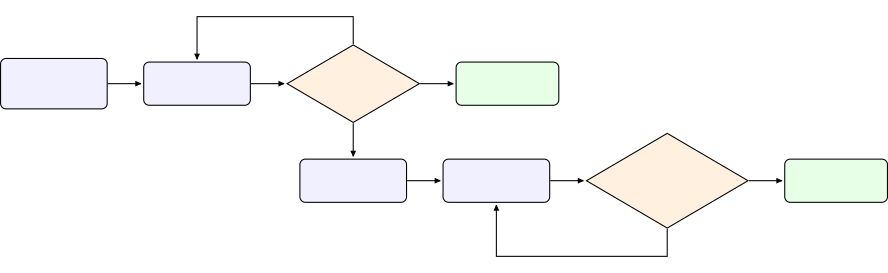

# VAANI Noise Event Dataset: A curated spontaneous speech dataset annotated with timestamps for noise events ^(\*) Thanks: 

Pavan Kumar J¹, Agneedh Basu¹, Pranav Bhat¹, Sujith Pulikodan¹, Suryansh
Shukla¹, Nihar Desai¹,  
Prasanta K. Ghosh² Affiliation: ¹AI & Robotics Technology Park
(ARTPARK), I-Hub @ IISc, Bangalore, India  
²Department of Electrical Engineering, Indian Institute of Science,
Bangalore, India

###### Abstract

Most public sound-event corpora are optimised either for general audio
tagging or for clean speech separation, and comparatively few provide
strong (timestamped) noise annotations layered directly on top of
spontaneous, real-world speech. We present the _VAANI Noise Event
Timestamp Dataset_ , a derived annotation layer built on Project VAANI
field recordings of spontaneous speech collected across 165 Indian
districts in 105 languages. Unlike synthetically mixed corpora, VAANI
captures speech and ambient noise _in situ_ and simultaneously, and
annotates each recording with fine-grained start/end timestamps for
overlapping background noise events organised into a compact seven-class
semantic taxonomy (animal, traffic, baby/child, music, signal/alarm,
appliance, and non-speech human). This combination—spontaneous
multilingual Indic speech, authentic regional soundscapes, and
span-level noise tags that may overlap with speech—targets tasks that
existing datasets address only partially: noise-robust Automatic Speech
Recognition (ASR), sound event detection (SED), and speech enhancement.
We position VAANI against nine widely used corpora and benchmarks
(WHAM!, AVA-Speech, MUSAN, FSD50K, CHiME-6, AudioSet, DESED, the
India-specific iNoise noise database, and the Kathbath-Noisy noisy-ASR
benchmarks, among others) and describe the annotation protocol and
quality-control procedure used to produce the timestamped tags.

###### Index Terms: 

noise-robust ASR, sound event detection, timestamped annotation,
spontaneous speech, Indian languages, dataset

## I Introduction

Automatic speech recognition (ASR) and related speech technologies are
increasingly deployed in everyday Indian settings, yet the audio they
encounter there rarely resembles the clean, studio-quality material on
which many models are trained. Speech is captured on commodity mobile
devices in household kitchens, on farms, on busy local streets, and in
crowded indoor spaces, where it co-occurs with a rich and highly
non-stationary background: vehicle horns and passing traffic, animal
calls, crying infants, appliances, music, alarms, and a variety of human
non-speech sounds. This background is not merely additive noise
energy—its onset, duration, and overlap with speech directly shape
recognition errors and the perceived quality of enhancement. Building
systems that are robust to such conditions therefore requires data that
reflect them faithfully, capturing not only the _acoustic content_ of
the noise but also when each noise event occurs relative to the spoken
signal.

A number of influential corpora each capture part of this picture, but
along different axes and with different objectives: synthetically mixed
corpora such as WHAM! \[1\] and DESED’s \[7\] synthetic subset; frame-
or clip-level general-audio corpora such as AVA-Speech \[2\],
FSD50K \[4\], and AudioSet \[6\]; isolated sub-corpora such as
MUSAN \[3\]; spontaneous-but-domain-mismatched corpora such as
CHiME-6 \[5\]; and India-specific resources such as the iNoise noise
database \[8\] and the Kathbath-Noisy noisy-ASR benchmarks \[9\].
Section II reviews each of these in detail and contrasts them with
VAANI; in short, none combines real, in-situ co-occurrence of speech and
background noise, span-level overlapping event timestamps, and
spontaneous multilingual speech collected under the single-channel,
mobile-device conditions typical of large-scale Indian field data
collection—the combination few resources provide.

The VAANI Noise Event Timestamp Dataset is designed to fill this gap. It
is a derived annotation layer on top of Project VAANI’s \[10\]
spontaneous speech recordings, adding exact start/end timestamps for
background noise events—for example horn or dog_bark—alongside the
speech transcript, orienting the dataset toward noise-robust ASR, sound
event detection, and speech enhancement in realistic Indian acoustic
conditions.

## II Related Datasets

Table I places VAANI alongside nine widely used noise, sound-event, and
noisy-ASR resources, contrasting how each was recorded, what kind of
speech (if any) it contains, how noise is annotated, and its scale. Two
terms recur throughout the table: _in-situ_ audio is recorded naturally
in the field, with speech and background noise co-occurring together as
they would in real life, rather than being synthetically mixed after
separate recording; and _span-level_ annotation gives each noise event
an exact start and end timestamp, rather than only a clip-level or
frame-level label. These nine resources fall into four groups by
construction method, discussed in turn below.

### II-A Synthetically mixed corpora

WHAM! \[1\] takes the WSJ0-2mix speech-separation benchmark and adds a
synthetic ambient-noise channel. WSJ0-2mix itself comprises 20,000,
5,000, and 3,000 instantaneous two-speaker mixtures in its 30-, 10-, and
5-hour train, validation, and test sets respectively (45 hours of clean,
read WSJ0 speech in total); training and validation share speakers,
while the test speakers are disjoint from both. WHAM! mixes this speech
with roughly 80 hours of urban background audio, independently recorded
with binaural microphones at San Francisco Bay Area cafes, bars, and
offices, algorithmically combined at controlled SNRs to produce 28,000
two-speaker noisy mixtures. Because the two channels are recorded
separately and combined after the fact, WHAM! provides exact
waveform-level ground truth for both speaker and background signals, but
the pairing is synthetic by construction and carries no event-level
taxonomy of what kind of noise is present. DESED \[7\] is a hybrid:
17,850 real 10-second clips drawn from AudioSet ($`\sim`$49.6 hours
split across weakly labelled, unlabelled in-domain, validation, and
public-evaluation subsets) are supplemented with additional synthetic
soundscapes generated by the Scaper tool from a bank of 2,060 background
and 1,009 foreground recordings, targeting 10 domestic sound-event
classes with weak, strong, or unlabelled annotation depending on the
subset. Neither corpus offers real, naturally co-occurring foreground
speech alongside its noise annotations—WHAM!’s speech is clean and read,
and DESED’s clips are domestic soundscapes without an annotated speech
signal at all—which is the pairing VAANI is built to capture.

### II-B Frame- and clip-level general-audio corpora

AVA-Speech \[2\] labels roughly 45 hours of movie audio at the frame
level with four mutually exclusive speech-activity states—clean speech,
speech+music, speech+noise, and no speech—aggregated across three human
raters with substantial inter-annotator agreement. This scheme flags
_that_ noise co-occurs with speech in a given frame but not _which_
category of noise is present or its precise onset and offset.
FSD50K \[4\] and AudioSet \[6\] take the opposite tack: both provide
only weak, clip-level multi-label tags—200 AudioSet-ontology classes
over 51,197 Freesound clips (108 hours) for FSD50K, and 527 classes over
more than two million 10-second YouTube clips for AudioSet—with no
timestamp information and, particularly for AudioSet, little control
over recording conditions, language, or the presence of speech at all.
All three corpora sacrifice the event-level timing precision that
VAANI’s {category, tag, start, end} annotation format is designed to
preserve.

| Corpus                              | Audio origin                                                                       | Speech /style                                   | Noise annotation                                                                                 | Scale                                                                                                       |
| ----------------------------------- | ---------------------------------------------------------------------------------- | ----------------------------------------------- | ------------------------------------------------------------------------------------------------ | ----------------------------------------------------------------------------------------------------------- |
| WHAM! \[1\]                         | Synthetic mix: clean read speech (WSJ0) + urban ambient noise                      | Read, single-speaker                            | Waveform-level source / background ground truth, no event taxonomy                               | 28,000 two-speaker mixtures; $`\sim`$80 h noise                                                             |
| AVA-Speech \[2\]                    | Movie soundtracks                                                                  | dialogue only                                   | Frame-level speech-activity state (clean / +music / +noise / none), 4 mutually exclusive classes | $`\sim`$45 h                                                                                                |
| MUSAN \[3\]                         | Isolated speech, music, and noise sub-corpora                                      | Read / none                                     | None—speech and noise are separate, non-overlapping subsets                                      | $`\sim`$109 h                                                                                               |
| FSD50K \[4\]                        | Freesound web clips                                                                | Incidental (voice/speech among the 200 classes) | Weak, clip-level labels, 200 AudioSet-ontology classes                                           | 51,197 clips; 108 h                                                                                         |
| AudioSet \[6\]                      | YouTube clips                                                                      | Incidental (‘Speech’ a frequent class)          | Weak, clip-level labels, 527 classes                                                             | 2M+ 10 s clips                                                                                              |
| DESED \[7\]                         | Domestic soundscapes, recorded (AudioSet) + Scaper-synthesized                     | Incidental (‘speech’ = 1 of 10 classes)         | Weak / strong / unlabelled subsets, 10 domestic SED classes                                      | $`\sim`$49.6 h: weak 4.4 h, unlabeled 40.0 h, val 3.2 h, eval 1.9 h + synthetic clips                       |
| CHiME-6 \[5\]                       | Real dinner parties, multi-channel Kinect/binaural arrays                          | Spontaneous, overlapping, multi-speaker English | None (diarization / ASR target, not noise-labelled)                                              | 40+ h, 20 sessions                                                                                          |
| iNoise \[8\]                        | Indian indoor/outdoor environmental noise recordings                               | None (noise-only, no speech)                    | Noise-type category per file only; no co-occurring speech, no event timestamps                   | 10 categories (5 outdoor, 5 indoor); 1 concatenated file/category                                           |
| Kathbath-Noisy \[9\]                | Read speech (AI4Bharat Kathbath) + injected noise, per-language ASR benchmark sets | Read, single-speaker, per Indian language       | None—ASR transcription (word-level) only, no noise category/timestamp labels                     | Kathbath base: 1,684 h across 12 Indian languages; per-language noisy test sets (e.g. Odia, Tamil, Bengali) |
| VAANI Noise Event Timestamp Dataset | In-situ field recording, single channel, mobile devices                            | Spontaneous, multilingual Indic                 | Strong, span-level, overlapping timestamps; 7 ASR-oriented classes                               | 72,756 segs, 122.17 h, 58 langs, 30 states                                                                  |

TABLE I: VAANI versus representative noise / sound-event corpora.

Fig. 1: Annotation and QC pipeline: freelancer output that passes a
sanity check splits into a $`\sim`$100-hour unverified release and a
$`\geq`$20-hour subset that is internally re-timestamped and 10%-audited
before release as verified_timestamps ; each failure loops back to the
preceding step.

### II-C Isolated and domain-mismatched spontaneous-speech corpora

MUSAN \[3\] assembles about 109 hours of speech, music, and noise into
three _separate_ sub-corpora built for voice-activity detection and
music/speech discrimination; because speech and noise never co-occur in
the same recording, MUSAN cannot support the joint
speech-plus-noise-event task VAANI targets. CHiME-6 \[5\] is the closest
existing corpus to VAANI in spirit—more than 40 hours of unscripted,
overlapping, multi-speaker conversational speech recorded across 20 real
dinner parties using multi-channel Kinect arrays and binaural
microphones—but its target is diarization and distant multi-speaker ASR
in English-language Western domestic settings, and it carries no
noise-event category or timestamp annotations at all.

### II-D Indian noise and noisy-ASR resources

Two India-specific resources address the domain mismatch identified
above but not the annotation gap. iNoise \[8\] is a database of ten
Indian environmental noise-type categories—five outdoor (autorickshaw,
bus, highway, railway station, street) and five indoor (airport,
cafeteria, home, train, workplace)—recorded specifically because
environmental noise in Indian conditions differs substantially from the
noise typically studied in Western corpora. It is, however, a noise-only
recording set: it contains no co-occurring speech and no annotation of
when a noise event occurs relative to an utterance, so it is typically
used to synthetically corrupt clean speech for robustness testing rather
than to study natural speech-noise co-occurrence. The Kathbath-Noisy
family of benchmarks \[9\] (e.g. Kathbath-Odia-Noisy), released on
IndiaAI’s AIKosh platform and built on AI4Bharat’s Kathbath corpus
(1,684 hours of read speech across 12 Indian languages), evaluates ASR
systems on noisy speech per language. These benchmarks pair noisy audio
with ground-truth transcriptions for measuring word-error-rate
degradation under noise, but—like CHiME-6—their labels are speech
transcriptions, not noise-event categories or timestamps; what kind of
noise is present, and exactly when, is not annotated.

### II-E Positioning

Across all nine corpora and benchmarks, no single resource combines (i)
real, in-situ co-occurrence of speech and background noise, (ii)
span-level, overlapping timestamps for the noise events themselves, and
(iii) spontaneous, multilingual speech collected under the
single-channel, mobile-device conditions typical of large-scale Indian
field data collection. Even the two India-specific resources above
satisfy the geography and domain criteria but not the annotation
criterion: iNoise has no speech at all, and Kathbath-Noisy labels only
the transcription, not the noise event. VAANI is positioned to close
this specific combination of gaps, as summarised in the rightmost column
of Table I.

|                                  |                        |
| -------------------------------- | ---------------------- |
| Property                         | Value                  |
| Segments                         | 72,756                 |
| Total audio                      | 122.17 h               |
| Distinct speakers                | 38,541                 |
| Languages                        | 58                     |
| States / districts               | 30 / 162               |
| Segment duration (min/mean/max)  | 0.79 / 6.05 / 23.49 s  |
| Segments with a noise category   | 72,756                 |
| Segments with timestamped events | 72,746                 |
| Total timestamped noise events   | 106,892                |
|    Verified timestamps           | 11,111 segs / 21.85 h  |
|    Unverified timestamps         | 61,645 segs / 100.32 h |

TABLE II: Dataset overview (release-quality subset: hasIssue IS NULL,
NoiseCategory IS NOT NULL, evalSet and syntheticData both NOT TRUE,
annotationQuality $`\in`$ {verified_timestamps, unverified_timestamps}).

|                        |        |        |        |          |
| ---------------------- | ------ | ------ | ------ | -------- |
| Category               | Seg.   | % seg. | Events | Ev. dur. |
| Non-speech human       | 27,533 | 37.8   | 37,739 | 4.5 h    |
| Animal                 | 22,746 | 31.3   | 24,601 | 22.4 h   |
| Vehicle / traffic      | 18,150 | 24.9   | 20,603 | 12.5 h   |
| Baby / child           | 11,708 | 16.1   | 12,376 | 10.5 h   |
| Singing / music        | 6,879  | 9.5    | 6,978  | 9.7 h    |
| Phone / signal / alarm | 3,546  | 4.9    | 3,683  | 1.8 h    |
| Appliance / machine    | 906    | 1.3    | 912    | 1.5 h    |

TABLE III: Noise categories: segment coverage and event statistics over
the same 72,756-segment subset as Table III (categories may co-occur, so
“% seg.” need not sum to 100%).

## III Dataset Description

The dataset comprises 72,756 speech segments totalling 122.17 hours of
audio, drawn from 38,541 distinct speakers. This is the release-quality
subset: segments with a structural issue flag, held-out eval-set
segments, synthetic-data segments are excluded, leaving only the
verified_timestamps and unverified_timestamps tiers. Segments are short
utterances—0.79 to 23.49 seconds long, with a mean of 6.05 seconds—each
carrying a speech transcript and one or more timestamped
background-noise events. Coverage is geographically and linguistically
broad: 58 languages across 30 states and 162 districts of India,
spanning both collection phases of Project VAANI. Table III summarises
these headline figures.

### III-A Linguistic and geographic coverage

The corpus is dominated by Hindi (83.9 h; 47,080 segments) but retains a
substantial long tail: Telugu (16.7 h), Bengali (12.9 h), Marathi (5.3
h), Nepali, Malayalam, Assamese, Kannada, Odia, and lower-resource
languages such as Chakma, Garo, and Mizo, among the 57 in total. At the
regional level, Bihar (24.0 h), Andhra Pradesh (14.3 h), Uttar Pradesh
(12.9 h), West Bengal (12.3 h), and Maharashtra (11.9 h) lead, with the
remaining hours spread across 25 further states. This spread ensures
that the background soundscapes are drawn from a wide variety of rural,
semi-urban, and urban Indian acoustic environments rather than a single
locale.

### III-B Noise taxonomy and annotation format

Each segment is annotated at two levels. The _segment level_ records the
set of noise categories present as a multi-label list (NoiseCategory);
the _event level_ records, for each noise occurrence, a {category, tag,
start, end} tuple with exact start/end timestamps in seconds
(NoiseSubCategoryTimeStamp). Timestamps are stored as verbatim-precision
strings, and the underlying tag (e.g. barking, \[lip smacking\]) is
preserved alongside its canonical category. Events may overlap one
another and co-occur with speech.

Seven top-level noise categories are represented. Table III reports, for
each, the number of segments in which it appears and the number and
total duration of its timestamped events. _Non-speech human_ sounds are
the most frequent by segment coverage (37.8% of all segments) and by
event count (37,739 events), but—being brief interjections such as
coughs and lip smacks—account for only 4.5 event-hours at a mean of
0.42 s per event. _Animal_ and _vehicle/traffic_ noises, by contrast,
are longer-lived (mean 3.3 s and 2.2 s) and together contribute the bulk
of annotated noise duration. _Appliance/machine_ events are the rarest
but the longest on average (6.1 s).

All 72,756 segments carry at least one noise category (by construction
of the release-quality filter) and 72,746 carry at least one timestamped
event, yielding 106,892 noise events in total. Most segments contain a
single noise category (55,330), but a substantial minority exhibit two
or more co-occurring categories (17,426), reflecting the layered
soundscapes of real field recordings.

## IV Annotation and Quality Control

Noise-event timestamps are produced by an external freelancer pool and
pass through a staged internal quality-control (QC) pipeline before
release. Figure 1 summarises the pipeline; the numbered steps below
correspond to the diagram.

1. Sampling. Roughly 150+ hours of segments are sampled from the broader
   VAANI spontaneous-speech corpus for noise-event annotation.

2. Freelancer timestamping. A pool of trained freelancers listens to
   each sampled segment and marks the start/end timestamp and category tag
   for every audible noise event.

3. Sanity check. The complete freelancer output is checked for
   structural validity. If it fails, the entire batch is sent back to step
   2 and redone. A batch that passes is split: about 100 hours are released
   directly as unverified_timestamps , and a further $`\geq`$20-hour subset
   is carried forward as candidate data for the verified tier.

4. Internal QC timestamping. An internal team with the reference of
   unverified_timestamps re-timestamps the $`\geq`$20-hour candidate
   subset.

5. Independent 10% audit. A second, independent reviewer audits a random
   10% sample of the internally re-timestamped subset. If even a single
   event in that sample disagrees, the batch is sent back to step 4 and
   redone; only once the audit passes is the subset released as
   verified_timestamps.

This staged design—a full sanity gate before any release, plus an
independently re-timestamped and 10%-audited candidate subset for the
gold tier, with each failure looping back to the immediately preceding
step—is why verified_timestamps carries a materially higher trust level
than unverified_timestamps, even though both tiers consist of fully
timestamped events (Table III).

## V Conclusion

We introduced the VAANI Noise Event Timestamp Dataset, a span-level
noise-annotation layer over Project VAANI’s in-situ, spontaneous
multilingual Indic speech recordings. Unlike synthetically mixed corpora
(WHAM!, DESED’s synthetic subset) or corpora with only frame-/clip-level
noise labels (AVA-Speech, FSD50K, AudioSet), VAANI pairs naturally
co-occurring speech and background noise with exact, overlapping
start/end timestamps organised into a compact seven-class, ASR-oriented
taxonomy (Table I). The release-quality subset comprises 72,756 segments
(122.17 hours, 38,541 speakers) across 58 languages, 30 states, and 162
districts of India (Table III), with non-speech human, animal, and
vehicle/traffic events dominating segment coverage and animal and
vehicle/traffic events contributing the bulk of annotated noise duration
(Table III).

Every timestamp passes through the staged annotation and QC pipeline
described in Section IV (Figure 1): a sanity-checked freelancer pool
produces the unverified_timestamps tier, and a further internally
re-timestamped, 10%-audited subset is released as the higher-trust
verified_timestamps tier, giving downstream users an explicit, auditable
quality distinction rather than a single undifferentiated label set. By
combining this scale and geographic/linguistic breadth with strong,
overlapping noise annotations on authentic field speech, VAANI is
positioned to support noise-robust ASR, sound event detection, and
speech enhancement research on the Indian acoustic conditions that
existing public corpora leave largely uncovered.

## References

- \[1\] G. Wichern _et al._, “WHAM!: Extending Speech Separation to
  Noisy Environments,” in _Proc. Interspeech_, 2019.
  [https://arxiv.org/pdf/1907.01160](https://arxiv.org/pdf/1907.01160)
- \[2\] S. Chaudhuri _et al._, “AVA-Speech: A Densely Labeled Dataset of
  Speech Activity in Movies,” in _Proc. Interspeech_, 2018.
  [https://arxiv.org/pdf/1808.00606](https://arxiv.org/pdf/1808.00606)
- \[3\] D. Snyder, G. Chen, and D. Povey, “MUSAN: A Music, Speech, and
  Noise Corpus,” _arXiv:1510.08484_, 2015.
  [https://arxiv.org/pdf/1510.08484](https://arxiv.org/pdf/1510.08484)
- \[4\] E. Fonseca _et al._, “FSD50K: An Open Dataset of Human-Labeled
  Sound Events,” _IEEE/ACM TASLP_, 2022.
  [https://arxiv.org/pdf/2010.00475](https://arxiv.org/pdf/2010.00475)
- \[5\] S. Watanabe _et al._, “CHiME-6 Challenge: Tackling Multispeaker
  Speech Recognition for Unsegmented Recordings,” 2020.
  [https://arxiv.org/pdf/2004.09249](https://arxiv.org/pdf/2004.09249)
- \[6\] J. F. Gemmeke _et al._, “AudioSet: An Ontology and Human-Labeled
  Dataset for Audio Events,” in _Proc. ICASSP_, 2017.
- \[7\] N. Turpault _et al._, “Sound Event Detection in Domestic
  Environments with Weakly Labeled Data and Soundscape Synthesis
  (DESED),” 2019.
- \[8\] S. K. Kopparapu, I. Sheikh, and V. K. Thanneeru, “iNoise Indian
  Noise Database,” IEEE DataPort, 2020.
  [https://dx.doi.org/10.21227/w3xm-jn45](https://dx.doi.org/10.21227/w3xm-jn45)
- \[9\] AI4Bharat / Digital India BHASHINI Division, “Kathbath Noisy ASR
  Benchmark Datasets (e.g. Kathbath-Odia-Noisy),” AIKosh, IndiaAI, 2025.
  [https://aikosh.indiaai.gov.in](https://aikosh.indiaai.gov.in)
- \[10\] S. Pulikodan _et al._, “VAANI: Capturing the Language Landscape
  for an Inclusive Digital India,” _arXiv:2603.28714_, 2026.
  [https://arxiv.org/abs/2603.28714](https://arxiv.org/abs/2603.28714)
