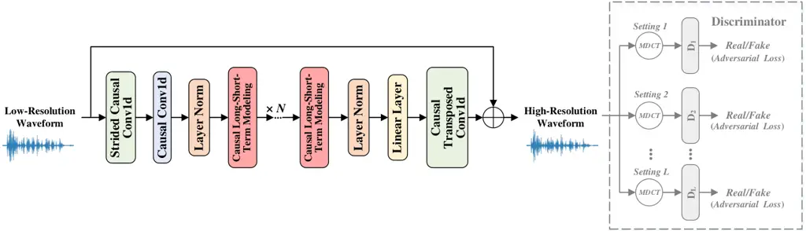

# StreamWSR: Streamable and Lightweight Waveform-Domain Neural Speech Super-Resolution

^(∗) Corresponding author. This work was supported by the National Key
Research and Development Program Project 2024YFE0217200 and the National
Natural Science Foundation of China under Grant 62301521.

###### Abstract

This paper proposes StreamWSR, a Streamable neural Waveform-domain model
for speech Super-Resolution (SR). By adopting a fully causal
architecture with compact frame-level waveform representation, the
proposed StreamWSR supports zero-look-ahead streaming inference while
avoiding vocoder-based reconstruction and explicit phase prediction.
Specifically, StreamWSR downsamples the input waveform into a compact
frame-level representation using strided causal convolutions. Then, a
lightweight causal long-short-term modeling backbone is employed to
capture both local waveform structures and long-range historical
dependencies under causal constraints. Finally, the modeled output is
converted back to the waveform domain through a causal
transposed-convolution and combined with the input waveform via a
residual connection to generate the final high-resolution speech.
Experimental results on 16 kHz speech SR show that StreamWSR achieves
competitive or superior speech quality and intelligibility compared with
representative waveform- and spectrum-based baselines, while maintaining
a zero-look-ahead streaming advantage with only 9M parameters and 2G
FLOPs.

Yuan Tian, Yang Ai^(∗), Hui-Peng Du, Zhen-Hua Ling

National Engineering Research Center of Speech and Language Information
Processing,  
University of Science and Technology of China, Hefei

ytian1507@mail.ustc.edu.cn, yangai@ustc.edu.cn,
redmist@mail.ustc.edu.cn, zhling@ustc.edu.cn

Index Terms: speech super-resolution, waveform-domain modeling,
streaming inference, generative adversarial training

## 1 Introduction

Speech super-resolution (SR) aims to enhance low-resolution speech
signals by reconstructing their missing high-frequency components and
generating high-resolution speech. By supplementing the effective
high-frequency components of speech signals, speech SR can improve
speech quality, intelligibility, and naturalness. It has recently been
explored in real-time communication \[1\] and codec-related scenarios
\[2\], and has also been used to support downstream tasks such as speech
enhancement and restoration \[3, 4\], speech synthesis \[5\], and
automatic speech recognition \[6\]. In practical speech communication
and interactive speech applications, speech SR models are expected not
only to generate high-quality speech but also to operate with low
algorithmic latency, where each output segment is generated using only
the current and past input information without relying on future
information.

Early statistical methods suffered from limited modeling capacity \[7,
8, 9\], while recent neural approaches have substantially improved
speech SR performance.

Existing neural speech SR methods can generally be categorized into
waveform-based and spectrum-based approaches according to their modeling
targets. Waveform-based methods directly generate high-resolution speech
waveforms from low-resolution waveforms \[10, 11\], preserving complete
time-domain information and avoiding the information loss caused by
intermediate acoustic representations.

To reduce the modeling difficulty of long waveform sequences, many
speech SR methods perform reconstruction in the spectral domain.
Mel-spectrogram-based methods first recover high-resolution mel
spectrograms and then synthesize waveforms using neural vocoders \[12,
13\]. This two-step strategy decomposes speech SR into a spectral
reconstruction problem and a waveform generation problem, and has
achieved promising results. For example, FLowHigh \[12\] performs
spectral-domain SR using single-step conditional flow matching, followed
by vocoder-based waveform reconstruction. However, mel-spectrograms are
compressed acoustic representations that discard phase information
during feature extraction. Therefore, mel-spectrogram-based methods
usually require an additional vocoder to implicitly reconstruct phase
and generate the final waveform, which increases system complexity and
may prevent fully end-to-end optimization \[14, 15\].

Another line of spectral-domain methods adopts short-time Fourier
transform (STFT) spectra as the modeling target. Compared with
mel-spectrograms, STFT spectra provide more detailed time-frequency
representations and can be inverted to waveforms when both amplitude and
phase are available. However, phase modeling remains challenging due to
its wrapped, highly nonlinear, and unstructured characteristics. As a
result, many STFT-based methods mainly reconstruct amplitude spectra and
estimate phase using heuristic signal processing techniques \[16, 17\],
which may limit the quality of the reconstructed speech. AP-BWE \[18\]
alleviates this problem by explicitly predicting both amplitude and
phase spectra with a dual-path network and reconstructing the waveform
through inverse STFT (ISTFT). Nevertheless, explicit amplitude-phase
prediction requires a more complex model structure and training
objective. These limitations motivate a waveform-domain speech SR
framework that preserves complete signal information while avoiding
vocoder-based reconstruction and explicit phase prediction under
zero-look-ahead low-latency constraints.



Figure 1: The overall structure of the proposed StreamWSR. The gray
regions are appeared only during training. Here, _Conv1d_ represents the
1D convolution.

Therefore, we propose StreamWSR, a lightweight and fully causal
waveform-domain speech SR model with compact frame-level representation.
StreamWSR directly maps low-resolution waveforms to high-resolution
waveforms in an end-to-end manner, while using spectral supervision only
during training to improve high-frequency reconstruction and perceptual
quality. Thus, StreamWSR enables zero-look-ahead streaming inference
without vocoder-based reconstruction, explicit phase prediction, or
additional inference cost. Experimental results on 16 kHz speech SR show
that StreamWSR achieves competitive or superior speech quality and
intelligibility compared with representative waveform- and
spectrum-based baselines, while using only 9M parameters and 2G FLOPs.

## 2 Proposed Method

### 2.1 Model Structure

The overview of the proposed StreamWSR is illustrated in Fig. 1. Given a
low-resolution waveform as input, StreamWSR aims to directly predict its
high-resolution waveform in the time domain, forming an end-to-end
waveform-domain speech SR framework. The input low-resolution waveform
is first upsampled to the target sampling rate using sinc interpolation,
resulting in a high-frequency-depleted waveform. StreamWSR then recovers
the missing high-frequency components from this waveform under strict
real-time constraints.

First, StreamWSR uses a strided causal convolution followed by a
standard causal convolution to convert the upsampled waveform into a
compact frame-level representation, which reduces the temporal
resolution while preserving causal waveform-domain information. The
sequence is then processed by $`N`$ stacked causal long-short-term
modeling blocks, inspired by ConvNeXt \[19\] and attention mechanisms
\[20\]. Each block is designed to model both local and long-range
historical dependencies in a causal manner. For local historical
modeling, a causal dilated convolution is used to enlarge the receptive
field without accessing future samples, followed by point-wise
convolutions and SnakeBeta activation \[21\] to enhance nonlinear
representation. For long-range historical modeling, masked multi-head
self-attention is employed, where an upper-triangular mask prevents each
frame from attending to future positions. Residual connections and layer
normalization \[22\] are applied throughout the block to stabilize
feature transformation and preserve temporal information.

After the backbone, a linear layer transforms the feature dimension, and
the resulting representation is converted into a waveform-domain
residual through a causal transposed-convolution. Finally, the predicted
residual is added to the upsampled low-resolution waveform to generate
the high-resolution waveform. Since all convolutional and attention
operations are causal, StreamWSR supports zero-look-ahead streamable
inference while keeping the generation pipeline fully in the waveform
domain.

### 2.2 Training Strategies

To improve the perceptual quality and spectral fidelity of the generated
high-resolution speech, StreamWSR is trained with a spectrally guided
adversarial framework based on generative adversarial networks (GANs)
\[23\]. It is worth noting that the generator itself operates directly
in the waveform domain, taking the low-resolution waveform as input and
producing the predicted high-resolution waveform as output. The spectral
representations introduced in this section are used only for
training-time supervision and do not introduce any additional
computational cost during inference.

#### 2.2.1 Multi-resolution Spectral Adversarial Training

Although StreamWSR generates speech waveforms directly, we employ a
multi-resolution spectral discriminator to provide structured
time-frequency supervision. Given the predicted high-resolution waveform
and the natural high-resolution waveform, the discriminator extracts
their modified discrete cosine transform (MDCT) spectra using multiple
MDCT configurations. Each configuration corresponds to one
sub-discriminator and provides a different time-frequency resolution,
allowing the discriminator to evaluate the generated speech from
multiple spectral scales. As shown in Fig. 1, the discriminator consists
of $`L`$ parallel sub-discriminators $`D_{1},D_{2},\dots,D_{L}`$. Each
sub-discriminator processes the MDCT spectrum extracted under a specific
configuration and produces a real or fake score. Specifically, each
sub-discriminator is implemented by several cascaded 2D convolutional
blocks with LeakyReLU activations \[24\], followed by a single-channel
convolutional layer for score prediction. The generator and
discriminator are optimized using a hinge adversarial objective. In
addition, a feature matching loss $`\mathcal{L}_{FM}`$ \[25\] is applied
to intermediate discriminator features to stabilize adversarial training
and improve perceptual consistency.

|           |          |                |                            |                    |                            |                    |                            |                    |                       |                     |
| --------- | -------- | -------------- | -------------------------- | ------------------ | -------------------------- | ------------------ | -------------------------- | ------------------ | --------------------- | ------------------- |
| Methods   | Type     | Streamable     | 8 kHz$`\rightarrow`$16 kHz |                    | 4 kHz$`\rightarrow`$16 kHz |                    | 2 kHz$`\rightarrow`$16 kHz |                    | Params.$`\downarrow`$ | FLOPs$`\downarrow`$ |
|           |          |                | LSD$`\downarrow`$          | ViSQOL$`\uparrow`$ | LSD$`\downarrow`$          | ViSQOL$`\uparrow`$ | LSD$`\downarrow`$          | ViSQOL$`\uparrow`$ |                       |                     |
| UDM+      | waveform | $`\times`$     | 0.88                       | 4.57               | 1.16                       | 3.99               | 1.33                       | 3.35               | 6.3 M                 | 189.54 G            |
| TRAMBA    | waveform | $`\times`$     | 0.79                       | 4.64               | 0.97                       | 4.25               | 1.07                       | 3.62               | 5.18 M                | 0.72 G              |
| FLowHigh  | spectrum | $`\times`$     | 1.22                       | 4.70               | 1.30                       | 4.31               | 1.62                       | 2.98               | 49.4 M                | 212.93 G            |
| AP-BWE    | spectrum | $`\times`$     | 0.69                       | 4.71               | 0.87                       | 4.30               | 0.99                       | 3.76               | 29.8 M                | 5.97 G              |
| StreamWSR | waveform | $`\checkmark`$ | 0.73                       | 4.68               | 0.92                       | 4.27               | 1.03                       | 3.81               | 9.03 M                | 2.12 G              |

Table 1: The speech quality evaluation results of the proposed StreamWSR
and speech SR baselines evaluated on the test set of the VCTK dataset
with a target sampling rate of 16 kHz. The bold and underline numbers
indicate the optimal and sub-optimal results, respectively.

#### 2.2.2 Spectral Reconstruction Losses

In addition to adversarial training, we introduce two spectral
reconstruction losses to further constrain the generated high-resolution
waveform. First, an MDCT spectral loss $`\mathcal{L}_{FW\text{-}MDCT}`$
is used to measure the reconstruction error between the MDCT spectra of
the generated and natural high-resolution speech. A simple
frequency-weighting strategy is applied to this loss, where higher
frequency bins are assigned slightly larger weights to encourage the
recovery of missing high-frequency components. Second, a mel-spectrogram
loss $`\mathcal{L}_{Mel}`$ is employed to provide perceptually related
spectral supervision. It is computed from both L1 and L2 distances
between the mel-spectrograms extracted from the generated and natural
high-resolution waveforms.

Therefore, the overall generator loss is defined as:

```math
\mathcal{L}_{G}=\mathcal{L}_{adv}+\mathcal{L}_{FM}+\lambda_{FW\text{-}MDCT}\mathcal{L}_{FW\text{-}MDCT}+\lambda_{Mel}\mathcal{L}_{Mel}, \tag{1}
```

where, $`\mathcal{L}_{adv}`$ denotes the adversarial loss.
$`\lambda_{FW\text{-}MDCT}`$ and $`\lambda_{Mel}`$ are hyperparameters
used to balance the spectral reconstruction losses. During training, the
StreamWSR and its discriminator are alternately optimized using the
generator loss and the discriminator adversarial loss, respectively.

|           |                |                            |                      |                     |                            |                      |                     |                            |                      |                     |
| --------- | -------------- | -------------------------- | -------------------- | ------------------- | -------------------------- | -------------------- | ------------------- | -------------------------- | -------------------- | ------------------- |
| Methods   | Streamable     | 8 kHz$`\rightarrow`$16 kHz |                      |                     | 4 kHz$`\rightarrow`$16 kHz |                      |                     | 2 kHz$`\rightarrow`$16 kHz |                      |                     |
|           |                | WER(%)$`\downarrow`$       | CER(%)$`\downarrow`$ | STOI(%)$`\uparrow`$ | WER(%)$`\downarrow`$       | CER(%)$`\downarrow`$ | STOI(%)$`\uparrow`$ | WER(%)$`\downarrow`$       | CER(%)$`\downarrow`$ | STOI(%)$`\uparrow`$ |
| UDM+      | $`\times`$     | 4.50                       | 2.16                 | 99.70               | 20.37                      | 13.00                | 91.95               | 86.64                      | 67.65                | 81.92               |
| TRAMBA    | $`\times`$     | 3.73                       | 1.68                 | 99.47               | 10.27                      | 5.86                 | 94.32               | 33.31                      | 23.57                | 87.68               |
| FLowHigh  | $`\times`$     | 3.81                       | 1.75                 | 99.66               | 9.49                       | 5.39                 | 94.96               | 60.80                      | 46.42                | 78.59               |
| AP-BWE    | $`\times`$     | 3.72                       | 1.67                 | 99.77               | 6.69                       | 3.54                 | 94.75               | 36.69                      | 25.61                | 87.00               |
| StreamWSR | $`\checkmark`$ | 3.84                       | 1.79                 | 99.77               | 9.85                       | 5.55                 | 94.30               | 39.33                      | 27.49                | 87.14               |

Table 2: The intelligibility evaluation results of the proposed
StreamWSR and speech SR baselines evaluated on the test set of the VCTK
dataset with a target sampling rate of 16 kHz. The bold and underline
numbers indicate the optimal and sub-optimal results, respectively.

LSD$`\downarrow`$ ViSQOL$`\uparrow`$ WER$`\downarrow`$ CER$`\downarrow`$
STOI$`\uparrow`$ Params.$`\downarrow`$ FLOPs$`\downarrow`$ StreamWSR
1.03 3.81 39.33 27.49 87.14 9.03 M 2.12 G rep. D 1.05 3.78 43.49 30.84
86.71 9.03 M 2.12 G w/o Stride 1.07 3.69 39.46 28.48 87.16 8.92 M 78.4 G

Table 3: Ablation study results of the proposed StreamWSR under the 2
kHz$`\rightarrow`$16 kHz SR setting.

## 3 Experiments and Results

### 3.1 Experimental Setup

#### 3.1.1 Dataset

In our experiments^(†)^(†) Speech samples are available at:
https://tian1507.github.io/StreamWSR/., we used the VCTK-0.92 dataset
\[26\], which contains approximately 44 hours of 48 kHz speech from 110
English speakers with various accents. All recordings were downsampled
to 16 kHz as high-resolution references. We considered three SR
settings, where low-resolution inputs were generated by downsampling the
16 kHz waveforms to 8 kHz, 4 kHz, and 2 kHz, respectively, corresponding
to extension factors of 2, 4, and 8.

#### 3.1.2 Implementation

StreamWSR first used a strided causal 1D convolution with a kernel size
of 80, a stride of 80, and 40 output channels to downsample the input
waveform into a compact frame-level representation. The representation
was then projected to 352 channels by a standard causal 1D convolution
with a kernel size of 7. The backbone consisted of 8 causal
long-short-term modeling blocks (i.e., $`N=8`$). In each block, the
causal dilated depth-wise convolution used a kernel size of 7, a
dilation factor of 2, and 352 channels. The hidden channel size of the
point-wise transformation was set to 512, and the masked multi-head
self-attention used 8 heads with an embedding dimension of 352. After
the backbone, a linear layer transformed the feature dimension to 40,
followed by a causal transposed 1D convolution with a kernel size of 80
and a stride of 80 to generate the waveform-domain residual.

For adversarial training, the multi-resolution spectral discriminator
used three MDCT configurations (i.e., $`L=3`$), i.e., $`(100,50,50)`$,
$`(400,200,200)`$, and $`(40,20,20)`$, where each tuple denotes the
frame length, frame shift, and number of frequency bins. The MDCT
spectral loss was computed using an MDCT configuration of
$`(80,40,40)`$. The mel-spectrogram loss was computed using 80 mel
filters, with an FFT size of 1024, a window size of 320, and a hop size
of 40. During training, each waveform was randomly cropped into
16,000-sample segments. The model was optimized using AdamW with
$`\beta_{1}=0.8`$, $`\beta_{2}=0.99`$, an initial learning rate of
$`2\times 10^{-4}`$, and an exponential decay factor of 0.999. The total
number of training steps was 600k with a batch size of 16, and all
experiments were conducted on a single NVIDIA RTX 3090 GPU.

#### 3.1.3 Baselines

We selected four representative neural speech SR methods as baselines,
including waveform-based UDM+ \[27\] and TRAMBA \[11\], as well as
spectrum-based FLowHigh \[12\] and AP-BWE \[18\]. UDM+ reconstructs
high-frequency components through diffusion-based iterative denoising,
while TRAMBA adopts a hybrid Transformer-Mamba architecture for
efficient waveform-domain SR. FLowHigh performs speech SR in the
spectral domain using single-step conditional flow matching, followed by
vocoder-based waveform reconstruction and post-processing. AP-BWE
predicts amplitude and phase spectra with a dual-path network and
reconstructs the high-resolution waveform through ISTFT. For fairness,
all baseline models were trained and evaluated on the same dataset.

#### 3.1.4 Evaluation Metrics

We evaluated the compared speech SR methods from three aspects, i.e.,
speech quality, intelligibility, and complexity. For speech quality,
log-spectral distance (LSD) and virtual speech quality objective
listener (ViSQOL) \[28\] were used to measure spectral distortion and
perceptual quality, respectively. For intelligibility, we used Whisper
\[29\] to transcribe the extended speech and calculated word error rate
(WER) and character error rate (CER), together with short-time objective
intelligibility (STOI). For complexity, we reported the number of model
parameters (Params.) to measure model complexity and the floating-point
operations (FLOPs) required to generate one-second 16 kHz speech to
measure computational complexity. The speech quality and complexity
results are summarized in Table 1, and the intelligibility results are
reported in Table 2.

### 3.2 Results and Analysis

#### 3.2.1 Comparison with Baseline Speech SR Methods

As shown in Tables 1 and 2, compared with UDM+, StreamWSR achieved
clearly lower LSD and higher ViSQOL scores under all three SR settings,
indicating more accurate spectral reconstruction and better perceptual
quality. In terms of intelligibility, UDM+ suffered from severe
degradation as the extension factor increased, while StreamWSR
maintained more stable results. Although UDM+ had fewer parameters, its
diffusion-based iterative sampling led to extremely high computational
cost. Compared with TRAMBA, StreamWSR achieved better speech quality
across all extension factors. This indicates that the proposed causal
waveform-domain model can recover high-frequency components with better
perceptual quality. For intelligibility, StreamWSR achieved a level
comparable to TRAMBA across different SR settings. Although TRAMBA had
fewer parameters and lower FLOPs, the quality of its generated speech
was inferior to that of StreamWSR. In addition, TRAMBA was not designed
for zero-look-ahead streamable inference, whereas StreamWSR supported
zero-look-ahead streamable inference, making it more suitable for strict
low-latency scenarios. Compared with FLowHigh, StreamWSR achieved
substantially lower LSD under all SR settings, showing better spectral
reconstruction accuracy. In terms of ViSQOL, StreamWSR achieved
comparable perceptual quality to FLowHigh and even performed better
under the extremely high extension-factor setting. For intelligibility,
FLowHigh showed a clear degradation under the extremely high
extension-factor setting, while StreamWSR maintained better
intelligibility. In terms of complexity, FLowHigh required more
parameters and FLOPs due to its flow-matching generation and
vocoder-based reconstruction pipeline, whereas StreamWSR was much more
lightweight and computationally efficient. Compared with AP-BWE,
StreamWSR achieved comparable speech quality and intelligibility
overall. However, AP-BWE relied on a complex dual-path amplitude-phase
prediction framework and was not streamable. In contrast, StreamWSR
adopted a simpler waveform-domain architecture with fewer parameters and
lower computational cost, while supporting zero-look-ahead streamable
inference. Overall, StreamWSR achieved a favorable balance among speech
quality, intelligibility, complexity, and streamability.

#### 3.2.2 Ablation Studies

To further analyze the effectiveness of the key designs in StreamWSR, we
conducted ablation studies under the most challenging 2
kHz$`\rightarrow`$16 kHz SR setting, as shown in Table 3. First, we
replaced the multi-resolution spectral discriminator with a
waveform-domain discriminator (denoted as rep. D), while keeping the
generator and other training objectives unchanged. Compared with
StreamWSR, this variant led to degradation in both speech quality and
intelligibility. This indicates that, although the generator operates
directly in the waveform domain, MDCT-domain adversarial supervision
provides more effective structured time-frequency guidance for
high-frequency reconstruction than waveform-domain discrimination.
Second, we removed the strided causal convolution and causal transposed-
convolution (denoted as w/o Stride). Specifically, the initial strided
causal convolution and the final causal transposed convolution were
removed, and the backbone directly processed the full-length waveform
sequence. This variant obtained worse LSD and ViSQOL than StreamWSR,
indicating that directly modeling the full-resolution waveform sequence
makes it more difficult to recover high-quality spectral and perceptual
details. Although its intelligibility metrics were close to those of
StreamWSR, its computational cost increased dramatically, with FLOPs
reaching 78.4 G. This demonstrates that compact frame-level waveform
representation is crucial for reducing the temporal modeling burden of
raw waveforms while maintaining effective speech reconstruction.
Overall, these comparative experiments show that the multi-resolution
spectral discriminator and strided convolutional modules are both
important for StreamWSR. The former provided effective spectral-domain
adversarial guidance, while the latter reduced the temporal modeling
burden and improved streamable waveform reconstruction.

## 4 Conclusion

In this paper, we introduced StreamWSR, a streamable waveform-domain
neural model for speech SR. StreamWSR directly maps low-resolution
waveforms to high-resolution waveforms with a fully causal architecture,
avoiding vocoder-based reconstruction and explicit phase prediction. By
using compact frame-level waveform representation and causal
long-short-term modeling, StreamWSR effectively captures both local
waveform structures and long-range historical dependencies under
zero-look-ahead constraints. Experimental results on 16 kHz speech SR
show that StreamWSR achieves competitive or superior speech quality and
intelligibility compared with representative waveform- and
spectrum-based baselines, while using only 9M parameters and 2G FLOPs.
Ablation experiments further confirm the effectiveness of the
multi-resolution spectral discriminator and compact frame-level waveform
representation. In future work, we will improve the robustness and
generalization ability of StreamWSR and explore its application to more
real-time speech and audio tasks.

## References

- \[1\] Y. Li, M. Tagliasacchi, O. Rybakov, V. Ungureanu, and D.
  Roblek (2021) Real-time speech frequency bandwidth extension. In Proc.
  ICASSP, pp. 691–695. Cited by: §1.
- \[2\] J. Büthe and J. Valin (2025) A lightweight and robust method for
  blind wideband-to-fullband extension of speech. In Proc. WASPAA,
  pp. 1–5. Cited by: §1.
- \[3\] P. Andreev, A. Alanov, O. Ivanov, and D. Vetrov (2023) Hifi++: a
  unified framework for bandwidth extension and speech enhancement. In
  Proc. ICASSP, pp. 1–5. Cited by: §1.
- \[4\] H. Liu, X. Liu, Q. Kong, Q. Tian, Y. Zhao, D. Wang, C. Huang,
  and Y. Wang (2022) Voicefixer: a unified framework for high-fidelity
  speech restoration. arXiv preprint arXiv:2204.05841. Cited by: §1.
- \[5\] R. Yang, K. Li, G. Chen, and X. Hu (2025) Enhancing spectrogram
  realism in singing voice synthesis via explicit bandwidth extension
  prior to vocoder. arXiv preprint arXiv:2508.01796. Cited by: §1.
- \[6\] X. Li, V. Chebiyyam, K. Kirchhoff, and A. Amazon (2019) Speech
  audio super-resolution for speech recognition.. In Proc. Interspeech,
  pp. 3416–3420. Cited by: §1.
- \[7\] S. Chennoukh, A. Gerrits, G. Miet, and R. Sluijter (2001) Speech
  enhancement via frequency bandwidth extension using line spectral
  frequencies. In Proc. ICASSP, pp. 665–668. Cited by: §1.
- \[8\] G. Chen and V. Parsa (2004) HMM-based frequency bandwidth
  extension for speech enhancement using line spectral frequencies. In
  Proc. ICASSP, Vol. 1, pp. I–709. Cited by: §1.
- \[9\] Z. Ling, S. Kang, H. Zen, A. Senior, M. Schuster, X. Qian, H. M.
  Meng, and L. Deng (2015) Deep learning for acoustic modeling in
  parametric speech generation: a systematic review of existing
  techniques and future trends. IEEE Signal Processing Magazine 32 (3),
  pp. 35–52. External Links:
  [Document](https://dx.doi.org/10.1109/MSP.2014.2359987) Cited by: §1.
- \[10\] X. Hao, C. Xu, N. Hou, L. Xie, E. S. Chng, and H. Li (2020)
  Time-domain neural network approach for speech bandwidth extension. In
  Proc. ICASSP, pp. 866–870. Cited by: §1.
- \[11\] Y. Sui, M. Zhao, J. Xia, X. Jiang, and S. Xia (2024) TRAMBA: a
  hybrid transformer and mamba architecture for practical audio and bone
  conduction speech super resolution and enhancement on mobile and
  wearable platforms. Proc. ACM IMWUT 8 (4), pp. 1–29. Cited by: §1,
  §3.1.3.
- \[12\] J. Yun, S. Kim, and S. Lee (2025) Flowhigh: towards efficient
  and high-quality audio super-resolution with single-step flow
  matching. In Proc. ICASSP, pp. 1–5. Cited by: §1, §3.1.3.
- \[13\] J. Shen, R. Pang, R. J. Weiss, M. Schuster, N. Jaitly, Z.
  Yang, Z. Chen, Y. Zhang, Y. Wang, R. Skerrv-Ryan, et al. (2018)
  Natural tts synthesis by conditioning wavenet on mel spectrogram
  predictions. In Proc. ICASSP, pp. 4779–4783. Cited by: §1.
- \[14\] H. Liu, K. Chen, Q. Tian, W. Wang, and M. D. Plumbley (2024)
  AudioSR: versatile audio super-resolution at scale. In Proc. ICASSP,
  pp. 1076–1080. Cited by: §1.
- \[15\] H. Liu, W. Choi, X. Liu, Q. Kong, Q. Tian, and D. Wang (2022)
  Neural vocoder is all you need for speech super-resolution. arXiv
  preprint arXiv:2203.14941. Cited by: §1.
- \[16\] J. Abel, M. Strake, and T. Fingscheidt (2018) A simple cepstral
  domain DNN approach to artificial speech bandwidth extension. In Proc.
  ICASSP, pp. 5469–5473. Cited by: §1.
- \[17\] Y. Gu, Z. Ling, and L. Dai (2016) Speech bandwidth extension
  using bottleneck features and deep recurrent neural networks.. In
  Proc. Interspeech, pp. 297–301. Cited by: §1.
- \[18\] Y. Lu, Y. Ai, H. Du, and Z. Ling (2025) Towards high-quality
  and efficient speech bandwidth extension with parallel amplitude and
  phase prediction. IEEE/ACM Transactions on Audio, Speech, and Language
  Processing 33, pp. 236–250. Cited by: §1, §3.1.3.
- \[19\] Z. Liu, H. Mao, C. Wu, C. Feichtenhofer, T. Darrell, and S.
  Xie (2022) A convnet for the 2020s. In Proc. CVPR, pp. 11976–11986.
  Cited by: §2.1.
- \[20\] A. Vaswani, N. Shazeer, N. Parmar, J. Uszkoreit, L.
  Jones, A. N. Gomez, Ł. Kaiser, and I. Polosukhin (2017) Attention is
  all you need. Advances in neural information processing systems 30.
  Cited by: §2.1.
- \[21\] L. Ziyin, T. Hartwig, and M. Ueda (2020) Neural networks fail
  to learn periodic functions and how to fix it. Advances in Neural
  Information Processing Systems 33, pp. 1583–1594. Cited by: §2.1.
- \[22\] J. L. Ba, J. R. Kiros, and G. E. Hinton (2016) Layer
  normalization. arXiv preprint arXiv:1607.06450. Cited by: §2.1.
- \[23\] I. J. Goodfellow, J. Pouget-Abadie, M. Mirza, B. Xu, D.
  Warde-Farley, S. Ozair, A. Courville, and Y. Bengio (2014) Generative
  adversarial nets. Advances in neural information processing systems 27. Cited by: §2.2.
- \[24\] A. L. Maas, A. Y. Hannun, and A. Y. Ng (2013) Rectifier
  nonlinearities improve neural network acoustic models. In Proc. ICML,
  Vol. 30, pp. 3. Cited by: §2.2.1.
- \[25\] K. Kumar, R. Kumar, T. De Boissiere, L. Gestin, W. Z. Teoh, J.
  Sotelo, A. De Brebisson, Y. Bengio, and A. C. Courville (2019) Melgan:
  generative adversarial networks for conditional waveform synthesis.
  Advances in neural information processing systems 32. Cited by:
  §2.2.1.
- \[26\] J. Yamagishi, C. Veaux, K. MacDonald, et al. (2019) CSTR VCTK
  corpus: english multi-speaker corpus for CSTR voice cloning toolkit
  (version 0.92). University of Edinburgh. The Centre for Speech
  Technology Research (CSTR), pp. 271–350. Cited by: §3.1.1.
- \[27\] C. Yu, S. Yeh, G. Fazekas, and H. Tang (2023) Conditioning and
  sampling in variational diffusion models for speech super-resolution.
  In Proc. ICASSP, pp. 1–5. Cited by: §3.1.3.
- \[28\] M. Chinen, F. S. Lim, J. Skoglund, N. Gureev, F. O’Gorman,
  and A. Hines (2020) ViSQOL v3: an open source production ready
  objective speech and audio metric. In Proc. QoMEX, pp. 1–6. Cited by:
  §3.1.4.
- \[29\] A. Radford, J. W. Kim, T. Xu, G. Brockman, C. McLeavey, and I.
  Sutskever (2023) Robust speech recognition via large-scale weak
  supervision. In Proc. ICML, pp. 28492–28518. Cited by: §3.1.4.
