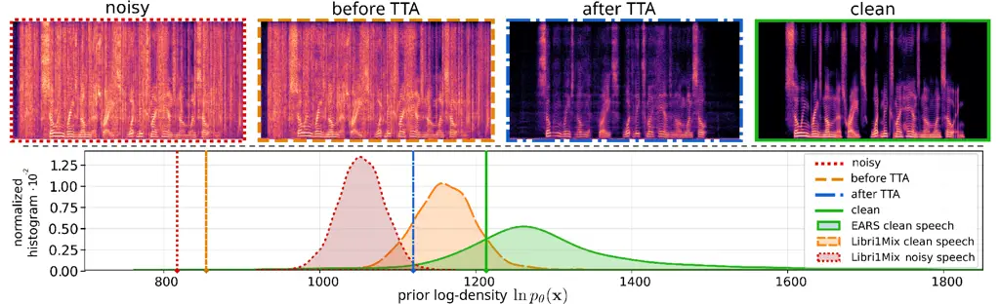
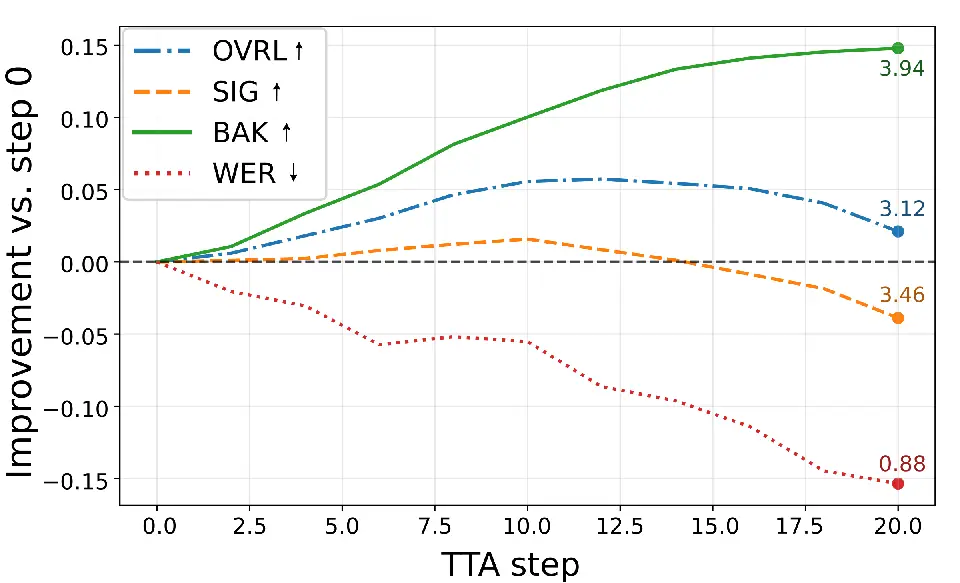
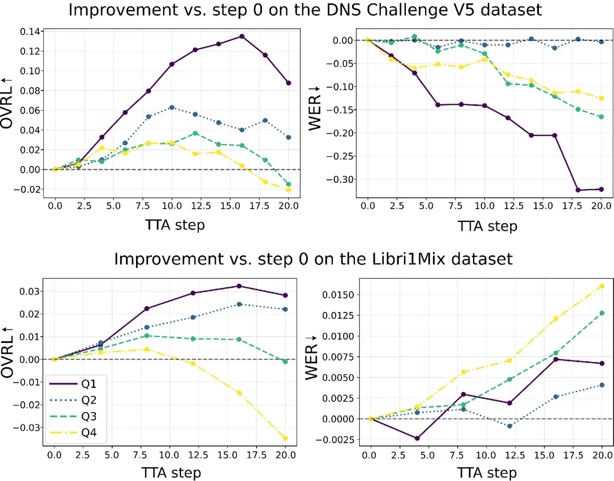

# Test-time adaptation for speech enhancement with an autoregressive speech prior

###### Abstract

Test-time adaptation (TTA) offers a promising direction for improving
speech enhancement models under mismatched acoustic conditions, without
requiring access to labeled target data. In this work, we propose a
single-utterance TTA method that regularizes a pretrained speech
enhancement model using an autoregressive prior trained on clean speech
latent representations extracted from a neural audio codec. Adaptation
is performed by minimizing the Kullback-Leibler divergence between the
enhanced speech distribution and the clean speech prior. Experiments
across multiple noisy speech datasets show consistent improvements in
speech quality, particularly under training-testing noise mismatch
conditions. Code and audio examples are available online.¹¹ 1
https://sofienekammoun.github.io/TAAP-SE/  
This research was partly supported by the ANR project ANR-23-CE23-0009.

| Sofiene Kammoun¹   Simon Leglaive¹   Xavier Alameda-Pineda²   Timo Gerkmann³ |
| ---------------------------------------------------------------------------- |
| ¹CentraleSupélec, IETR (UMR CNRS 6164), France                               |
| ²Inria at Univ. Grenoble Alpes, CNRS, LJK, France                            |
| ³Signal Processing Group, University of Hamburg, Germany                     |

Index Terms—  Speech enhancement, test-time adaptation, neural audio
codec, autoregressive model

## 1 Introduction

Speech enhancement (SE) aims to recover a clean speech signal from a
degraded recording, typically affected by environmental noise. Recent SE
systems predominantly rely on supervised deep learning models trained on
paired noisy-clean speech data. While these approaches achieve strong
performance under matched training and testing conditions, they can
degrade significantly when the acoustic characteristics encountered at
test time differ greatly from those seen during training, or when the
input signal contains unseen corruption types such as reverberation,
bandwidth reduction, clipping, or codec artifacts. In practical
deployments, access to clean speech target signals or labeled training
data is unavailable, motivating the adaptation of a supervised SE to the
test distribution.

Existing adaptation strategies include supervised fine-tuning,
unsupervised domain adaptation (UDA), test-time training (TTT), and
test-time adaptation (TTA) \[1\]. Fine-tuning and UDA require access to
the labeled source data \[2, 3\], while TTT constrains the original
supervised training pipeline with auxiliary loss functions \[4, 5\]. In
contrast, TTA methods update the pretrained model during inference using
unsupervised loss functions, without modifying the original supervised
training procedure \[6, 7, 8, 9\]. A commonly used variant, referred to
as single‑instance or -utterance TTA, adapts the model independently for
each test sample and reinitializes the model to its pretrained
parameters after each update, thereby mitigating catastrophic forgetting
\[10\].

Domain adaptation has been extensively studied for classification tasks,
where many methods exploit statistical properties of model outputs.
Those include techniques such as entropy minimization \[1, 10, 11\] and
feature alignment \[12, 13\]. However, such approaches do not readily
translate to SE, which is typically formulated as a regression problem
rather than a classification task.

Early approaches to domain adaptation for SE drew inspiration from the
TTT paradigm and generally combined labeled source data with unlabeled
target data through adversarial learning \[14, 15\] or
reconstruction‑based consistency objectives \[2, 3\]. These methods
require access to the source dataset during adaptation, which limits
their practicality in real‑world deployment. The TTT-based method \[4\]
incorporates an auxiliary self-supervised loss during supervised
training, which is then used only for adaptation on the unlabeled target
data. Although effective, this method constrains the original training
pipeline and cannot be applied to arbitrary pretrained SE models. This
is not the case for the method proposed in \[3\], which explores the use
of self-supervised models for speech representation learning. This
approach performs adaptation by identifying samples in the source
dataset whose latent representations are closest to those of the target
unlabeled samples. However, this approach requires access to the source
dataset during adaptation.

More recent research has focused on TTA methods that operate using
exclusively unlabeled target data. RemixIT \[16\] and LaDen \[8\] both
rely on a teacher-student framework where a student model is trained on
the target data using pseudo-clean speech labels obtained with a teacher
model. The method proposed in \[9\] introduces a single-utterance TTA
method for SE methods based on time-frequency mask prediction. The
approach fosters predicted masks to approach either $`0`$ or $`1`$ by
minimizing their entropy, which encourages the model to produce more
confident and discriminative masks for unseen noise conditions.

In this paper, we propose a novel single-utterance TTA method for SE
that leverages an autoregressive prior trained on clean speech latent
representations extracted from a pretrained neural audio codec (NAC).
The core idea is to use the prior as a measure of how likely a given
enhanced representation resembles clean speech, and to adapt the
pretrained SE model by minimizing the Kullback–Leibler (KL) divergence
between the distribution of the enhanced speech and the prior. As
illustrated in Figure 1, a supervised SE model before adaptation can
generalize poorly on unseen noise types, providing an output whose
log-density under the prior is substantially lower than that of clean
speech. Through TTA with the KL divergence, the enhanced output is
progressively pushed toward regions of higher prior log-density,
effectively encouraging it to align with the structure learned from
clean data. Experimental results on multiple real and synthetic noisy
speech benchmarks show that the proposed method consistently improves
speech quality, especially when the pretrained SE model operates under
mismatched noise conditions.



Fig. 1: Visualization of the clean‑speech prior log‑density and its role
in TTA. Top: Spectrograms of a noisy input signal, the output of the
pretrained SE model before and after adaptation, and the clean reference
speech. Bottom: Normalized histogram of log‑density values for the
pretrained prior evaluated on clean and noisy speech datasets. Vertical
lines indicate the log-density values for the examples shown on top. The
proposed TTA method pushes the enhanced output toward higher prior
log-density values and closer to the clean reference.

## 2 Method

### 2.1 Supervised speech enhancement

Supervised SE assumes access to a labeled dataset of parallel
noisy‑clean speech recordings
$`\mathcal{D}_{\mathbf{x}\mathbf{y}}=\{(\mathbf{x}_{i},\mathbf{y}_{i})\}_{i=1}^{N}`$,
where $`\mathbf{x}\in\mathcal{A}`$ and $`\mathbf{y}\in\mathcal{A}`$
denote the clean and noisy speech signals respectively, defined in some
representation domain $`\mathcal{A}`$. SE can be cast as probabilistic
inference using a conditional probability density function (PDF)
$`{q_{\phi}(\mathbf{x}\mid\mathbf{y})}`$ with parameters $`\phi`$. The
predicted clean speech is then obtained by computing the mean or
$`\arg\max`$ of this inference model, or by sampling, given an estimate
of the model parameters $`\phi`$. In a supervised training stage, those
are learned by minimizing the negative log‑likelihood averaged over the
labeled source dataset:

```math
\mathcal{L}_{\text{sup}}(\mathcal{D}_{\mathbf{x}\mathbf{y}};\phi)=\frac{1}{N}\sum\nolimits_{(\mathbf{x},\mathbf{y})\in\mathcal{D}_{\mathbf{x}\mathbf{y}}}-\ln q_{\phi}(\mathbf{x}\mid\mathbf{y}). \tag{1}
```

The present work builds upon a fully supervised SE system operating in
the latent space of a pretrained NAC \[17\]. Both clean and noisy
waveforms are first encoded into NAC’s latent representations before
quantization, denoted by
$`\mathbf{x}=\{\mathbf{x}_{t}\in\mathbb{R}^{L}\}_{t=1}^{T}`$ and
$`\mathbf{y}=\{\mathbf{y}_{t}\in\mathbb{R}^{L}\}_{t=1}^{T}`$, which
serve as output targets and inputs for the SE model. Here, $`L`$ denotes
the NAC latent space dimension and $`T`$ the number of time frames. The
inference model is then defined as

```math
q_{\phi}(\mathbf{x}\mid\mathbf{y})=\prod_{t=1}^{T}\mathcal{N}\big(\mathbf{x}_{t};f_{\phi,t}(\mathbf{y}),\mathbf{I}\big), \tag{2}
```

where $`f_{\phi}`$ is a non‑autoregressive Conformer network \[17, 18\],
and $`\mathcal{N}(\mathbf{x};\boldsymbol{\mu},\boldsymbol{\Sigma})`$
denotes the PDF of the multivariate Gaussian distribution, whose
logarithm is given, up to an additive constant, by

```math
\ln\mathcal{N}(\mathbf{x};\boldsymbol{\mu},\boldsymbol{\Sigma})\overset{c}{=}-\frac{1}{2}\left[\ln\mathrm{det}(\boldsymbol{\Sigma})+(\mathbf{x}-\boldsymbol{\mu})^{\top}\boldsymbol{\Sigma}^{-1}(\mathbf{x}-\boldsymbol{\mu})\right]. \tag{3}
```

Under the Gaussian model (2), $`\mathcal{L}_{\text{sup}}`$ in (1)
reduces to the mean‑ squared error (MSE) loss function. It is clear from
(1) that the parameters $`\phi`$ minimizing $`\mathcal{L}_{\text{sup}}`$
depend on the dataset $`\mathcal{D}_{\mathbf{x}\mathbf{y}}`$. While this
supervised setting has been shown to be very effective, it assumes that
the labeled training data capture the variability of acoustic
environments encountered at test time. In practice, this assumption does
not always hold, which can lead to poor generalization under strongly
mismatched training and testing conditions \[19, 20, 21, 22\].

### 2.2 Unsupervised test-time adaptation

The goal of this work is to improve enhancement performance on
previously unseen noisy recordings, without access to additional
parallel clean–noisy training data. To this end, we introduce an
autoregressive prior trained on a clean speech corpus. TTA is then
performed by optimizing the inference model parameters $`\phi`$ on a
single noisy utterance using only the KL divergence between the
inference model and the pretrained clean speech prior.

Autoregressive prior   The clean speech prior $`p_{\theta}(\mathbf{x})`$
is defined as an autoregressive Gaussian model in the NAC latent space:

```math
p_{\theta}(\mathbf{x})=\prod_{t=1}^{T}p_{\theta}(\mathbf{x}_{t}\mid\mathbf{x}_{<t})=\prod_{t=1}^{T}\mathcal{N}\big(\mathbf{x}_{t};\boldsymbol{\mu}_{\eta,t}(\mathbf{x}_{<t}),\boldsymbol{\Sigma}_{\theta,t}(\mathbf{x}_{<t})\big), \tag{4}
```

where $`\mathbf{x}_{<t}=\{\mathbf{x}_{s}\}_{s=1}^{t}`$, with the
convention that $`\mathbf{x}_{<1}=\emptyset`$, and the covariance matrix
is parameterized as follows:

```math
\boldsymbol{\Sigma}_{\theta,t}(\mathbf{x}_{<t})=\mathbf{W}\,\mathrm{diag}\{\mathbf{v}_{\eta,t}(\mathbf{x}_{<t})\}\,\mathbf{W}^{\top}\in\mathbb{R}^{L\times L}, \tag{5}
```

with $`\theta=\{\mathbf{W}\in\mathbb{R}^{L\times L},\eta\}`$. In this
model, $`\mathbf{W}`$ is a global orthogonal matrix shared across time
steps and speech signals, while the mean and variance vectors
$`\boldsymbol{\mu}_{\eta,t}(\mathbf{x}_{<t}),\mathbf{v}_{\eta,t}(\mathbf{x}_{<t})\in\mathbb{R}^{L}`$
are obtained using a neural network at each time step $`t`$. The
parametrization in (5) can be interpreted as learning a global
eigenbasis for the NAC latent space, represented by the orthogonal
matrix $`\mathbf{W}`$, while allowing the corresponding eigenvalues (the
variances along each eigenvector’s direction, represented by
$`\mathbf{v}_{\eta,t}(\mathbf{x}_{<t})`$) to vary over time steps and
conditioning speech signals. This model, inspired by \[23\], reflects
the assumption that cross‑dimensional correlations are intrinsic to the
latent space induced by the NAC encoder. It allows us to consider a full
covariance matrix in potentially high dimension $`L`$, while remaining
computationally efficient. Empirically, this full covariance model was
found to lead to much higher log-density values than a diagonal
covariance model when fitted on clean speech data. Given a clean speech
corpus
$`\mathcal{D}_{\mathbf{x}}=\{\mathbf{x}_{i}\in\mathbb{R}^{L\times T}\}_{i=1}^{M}`$,
the prior parameters $`\theta`$ are learned by minimizing the average
negative log-likelihood using teacher forcing \[24\]:

```math
\mathcal{L}_{\text{prior}}(\mathcal{D}_{\mathbf{x}};\theta)=-\frac{1}{M}\sum_{\mathbf{x}\in\mathcal{D}_{\mathbf{x}}}\sum_{t=1}^{T}\ln\mathcal{N}\big(\mathbf{x}_{t};\boldsymbol{\mu}_{\eta,t}(\mathbf{x}_{<t}),\boldsymbol{\Sigma}_{\theta,t}(\mathbf{x}_{<t})\big), \tag{6}
```

which can be easily computed using (3).

TTA loss function   At test time, given a noisy speech signal
$`\mathbf{y}`$, the pretrained and frozen autoregressive prior
$`p_{\theta}(\mathbf{x})`$ defined in (4), and the pretrained SE model
$`q_{\phi}(\mathbf{x}\mid\mathbf{y})`$ defined in (2), adaptation is
performed by optimizing with respect to $`\phi`$ the following TTA loss
function based on the KL divergence:

```math
\displaystyle\mathcal{L}_{\text{TTA}}(\mathbf{y};\phi)=D_{\text{KL}}\big(q_{\phi}(\mathbf{x}\mid\mathbf{y})\,\|\,p_{\theta}(\mathbf{x})\big)
```

```math
\displaystyle=\sum_{t=1}^{T}\mathbb{E}_{q_{\phi}(\mathbf{x}_{<t}\mid\mathbf{y})}\bigl[D_{\text{KL}}\left(q_{\phi}(\mathbf{x}_{t}\mid\mathbf{y})\parallel p_{\theta}(\mathbf{x}_{t}\mid\mathbf{x}_{<t})\right)\bigr] \tag{7}
```

```math
\displaystyle\overset{c}{\approx}-\frac{1}{2}\sum_{t=1}^{T}\left\|\mathrm{diag}\{\mathbf{v}_{\eta,t}(\tilde{\mathbf{x}}_{<t})\}^{-\frac{1}{2}}\mathbf{W}^{\top}\bigr(\boldsymbol{\mu}_{\eta,t}(\tilde{\mathbf{x}}_{<t})-f_{\phi,t}(\mathbf{y})\bigl)\right\|_{2}^{2}, \tag{8}
```

where $`D_{\text{KL}}(q\parallel p)=\mathbb{E}_{q}[\ln q-\ln p]`$ and
the approximation in (8) originates from the fact that we replace the
intractable expectation in (7) by the use of
$`\tilde{\mathbf{x}}_{<t}=\mathbb{E}_{q_{\phi}(\mathbf{x}_{<t}\mid\mathbf{y})}[\mathbf{x}_{<t}]=f_{\phi,<t}(\mathbf{y})`$.
In practice, the parameters $`\phi`$ are treated as fixed when computing
$`\tilde{\mathbf{x}}_{<t}`$, such that gradients of
$`\mathcal{L}_{\text{TTA}}`$ with respect to $`\phi`$ are not
backpropagated through the computation of $`\tilde{\mathbf{x}}_{<t}`$.

Adaptation algorithm   Adaptation is performed independently for each
test sample, following a single‑utterance TTA setting. The noisy speech
waveform is first normalized so that its amplitude is between $`-1`$ and
$`1`$, after which a contiguous one‑second segment is randomly selected
and encoded using the NAC encoder to obtain the latent representation
$`\mathbf{y}\in\mathbb{R}^{L\times T}`$. This sequence is passed through
the pretrained SE model to produce the enhanced sequence
$`\tilde{\mathbf{x}}=\{f_{\phi,t}(\mathbf{y})\in\mathbb{R}^{L}\}_{t=1}^{T}`$.
The clean speech prior is then evaluated on $`\tilde{\mathbf{x}}`$,
giving the mean and variance parameters
$`\{\boldsymbol{\mu}_{\eta,t}(\tilde{\mathbf{x}}_{<t}),\mathbf{v}_{\eta,t}(\tilde{\mathbf{x}}_{<t})\in\mathbb{R}^{L}\}_{t=1}^{T}`$.
These quantities, as well as the orthogonal matrix $`\mathbf{W}`$, are
used to compute the TTA loss function in (8), which is optimized with
respect to the inference model parameters $`\phi`$ using a fixed number
of gradient descent steps $`K`$ and a small learning rate. The adapted
model $`f_{\phi}`$ is then used to produce the latent representation of
the complete enhanced speech signal, which is typically longer than the
one-second segment used for adaptation. Therefore, the proposed TTA
technique can be viewed as a calibration of the SE model to new acoustic
noise characteristics, requiring only 1 second of representative
unlabeled noisy speech. The clean speech waveform is eventually
reconstructed using the NAC decoder.

Note that the model parameters $`\phi`$ are reinitialized to their
supervised pretrained values before processing another noisy speech
signal. Indeed, if we keep optimizing the same parameters $`\phi`$ as
new noisy speech signals arrive, the inference model will eventually
collapse to the prior and become independent of the input noisy speech.
To mitigate this problem, the parameters $`\phi`$ are reinitialized, and
the TTA loss is optimized with a small number of steps and a small
learning rate. This strategy is expected to encourage the inference
model to output cleaner speech signals without becoming independent of
the noisy input.

## 3 Experiments

### 3.1 Experimental Setup

Datasets   The supervised SE model is trained on the Libri1Mix dataset
\[25\], following the experimental setup described in \[17\]. The clean
speech prior is trained independently using the EARS dataset \[26\],
which provides anechoic speech recordings and is disjoint from the SE
training data.

To evaluate the proposed test‑time adaptation method under realistic and
mismatched conditions, we primarily conduct experiments on the DNS
Challenge V5 dev‑test set, track 2 \[27\]. This dataset contains 600
real noisy speech recordings without parallel clean references and
reflects a wide range of acoustic environments and noise conditions. To
further assess generalization, we validate our approach on additional
datasets with varying degrees of mismatch. These include the
TIMIT‑DEMAND dataset \[28\], which introduces both unseen speakers and
unseen noise environments; the EARS‑WHAM dataset \[26\], which combines
clean speech drawn from the same distribution as the prior training data
with noise conditions seen during SE training; and the Libri1Mix test
set, which represents a matched condition for the supervised SE model.
This selection allows us to disentangle the effects of speaker mismatch,
noise mismatch, and prior–SE alignment.

Evaluation metrics   Since we are working in the latent space of a NAC
trained with adversarial learning and without an explicit phase-aware
reconstruction loss function, NAC outputs are not aligned sample-wise
with the clean speech reference \[29, 30\]. Therefore, and as commonly
done in the literature \[31\], we primarily rely on the non‑intrusive
DNSMOS P.835 metrics \[32\], which include SIG (speech quality), BAK
(background noise suppression), and OVRL (overall quality), each ranging
from 1 to 5. In addition, we use the word error rate (WER) as an
intrusive intelligibility metric whenever reference transcripts are
available. WER is computed using a pretrained wav2vec 2.0 ASR model²² 2
https://huggingface.co/facebook/wav2vec2-base-960h, with the provided
transcripts serving as ground truth.

TTA setup   All experiments use the Descript Audio Codec (DAC) \[33\] as
the NAC architecture underlying the SE and prior models. TTA is
performed using standard gradient descent with momentum $`0.9`$. The
learning rate is fixed to $`2\times 10^{-5}`$, and the maximum number of
adaptation steps is empirically set to $`K=20`$. At every two adaptation
steps, the enhanced speech is reconstructed using the adapted model
parameters and evaluated using the selected metrics. This allows
tracking the evolution of quality and intelligibility throughout the
adaptation process.



Fig. 2: Relative improvement of the metrics along TTA iterations,
computed on the DNS Challenge V5 dev‑test set.



Fig. 3: OVRL and WER relative improvements over TTA steps and per
initial prior log-density quartile, for the DNS Challenge V5 and
Libri1Mix datasets.

### 3.2 Results

Prior model validation   The objective of the clean speech prior is to
discriminate between clean and noisy speech by assigning higher
log‑density values to clean latent speech representations. To validate
this behavior, we evaluate the prior log‑density on several datasets and
analyze its distribution. Figure 1 shows histograms of the log-density
values computed on the EARS clean test set, as well as on the clean and
noisy subsets of the Libri1Mix test set. The results indicate a clear
separation between clean and noisy speech, with clean speech
consistently assigned higher values. We also visualize the prior
log-density values and the spectrograms of a noisy speech signal, the
enhanced signal before and after TTA, and the clean reference. We chose
an example for which the pretrained SE model completely fails to
suppress background noise, because of a mismatch with the training noise
types. This qualitative analysis confirms that the prior assigns a
higher log-density to cleaner speech representations. These observations
support the use of the prior as a form of weak supervision during TTA,
where the objective is to push the enhanced speech representation toward
regions of higher prior log-density in the latent space.

TTA results   We first analyze the behavior of the proposed TTA method
on the DNS Challenge V5 dev‑test set. Figure 2 reports the relative
improvement of DNSMOS metrics and WER as a function of the adaptation
step, compared to the model output at step $`k=0`$, corresponding to the
pretrained SE model without adaptation. On average, speech quality
improves during the early adaptation steps, before eventually degrading
as the number of steps increases. This behavior is expected, as the TTA
objective relies exclusively on the unsupervised KL divergence, which
may eventually cause the inference model to collapse to the prior and
thus ignore the noisy speech input. These results highlight the
necessity of early stopping mechanisms to prevent over‑adaptation.

Informal listening tests and quantitative analysis reveal that the
effectiveness of TTA strongly depends on the initial quality of the
enhanced speech. Specifically, TTA tends to yield larger improvements
when the pretrained SE model leaves residual noise in the enhanced
output, while it can degrade performance when the initial enhancement
quality is already high. To validate this observation, we compute the
prior log-density of the enhanced speech at step $`k=0`$ and partition
the dataset into four equally sized quartiles, $`Q_{1}`$ to $`Q_{4}`$,
sorted by increasing log-density values. The underlying intuition is
that the prior log-density provides a proxy for enhancement quality,
with lower values corresponding to noisier outputs. Figure 3 reports the
evolution of OVRL and WER improvements over TTA iterations for each
quartile on both the DNS V5 and Libri1Mix datasets. The results show
that lower‑log-density quartiles benefit more significantly from
adaptation and typically require more adaptation steps to reach their
optimal performance. In contrast, higher‑log-density quartiles exhibit
limited or negative gains, confirming the sensitivity of TTA to the
initial operating point. Note that the WER increase on Libri1Mix is
negligible, reaching at most about 0.015 for $`Q_{4}`$.

The optimal step can be computed as
$`k^{*}=\arg\max_{k}\mathrm{OVRL}(k)`$ using the non-intrusive DNSMOS
metric, but this approach is computationally expensive. Motivated by the
quartile analysis, we investigate training a simple logistic regression
model that gives a prediction $`\tilde{k}`$ of $`k^{*}`$ based solely on
the prior log-density of the enhanced speech before TTA. The regression
model is trained using the DNS Challenge results and then applied to
other datasets.

The results reported in Table 1 show improvements across all datasets
for $`k=k^{*}`$, and also for $`k=\tilde{k}`$, although to a lesser
extent. Performance gains are more important for the DNS Challenge and
TIMIT-DEMAND datasets, especially in terms of BAK score. This is because
those datasets are mismatched to the one used for supervised pretraining
of the SE model in terms of noise type. We can indeed see that the BAK
and OVRL scores obtained by the pretrained SE model before TTA are lower
on the DNS Challenge and TIMIT-DEMAND datasets than on EARS-WHAM and
Libri1Mix, even though the noisy input scores are higher. Overall, this
quantitative analysis confirms that the proposed TTA method is
particularly effective at reducing residual background noise when the
pretrained supervised SE model fails on unseen noise types, as also
illustrated qualitatively in Figure 1 and in the online audio examples.¹

|               |                             | OVRL      | SIG       | BAK       |
| ------------- | --------------------------- | --------- | --------- | --------- |
| DNS Challenge | Noisy input                 | $`2.22`$  | $`3.19`$  | $`2.38`$  |
|               | SE w/o TTA $`(k=0)`$        | $`3.09`$  | $`3.50`$  | $`3.80`$  |
|               | SE w/ TTA $`(k=\tilde{k})`$ | $`+0.05`$ | $`-0.02`$ | $`+0.15`$ |
|               | SE w/ TTA $`(k=k^{*})`$     | $`+0.18`$ | $`+0.08`$ | $`+0.23`$ |
| TIMIT-DEMAND  | Noisy input                 | $`2.24`$  | $`2.89`$  | $`2.69`$  |
|               | SE w/o TTA $`(k=0)`$        | $`3.00`$  | $`3.51`$  | $`3.62`$  |
|               | SE w/ TTA $`(k=\tilde{k})`$ | $`+0.07`$ | $`+0.02`$ | $`+0.13`$ |
|               | SE w/ TTA $`(k=k^{*})`$     | $`+0.15`$ | $`+0.06`$ | $`+0.22`$ |
| EARS-WHAM     | Noisy input                 | $`2.09`$  | $`2.72`$  | 2.39      |
|               | SE w/o TTA $`(k=0)`$        | $`3.24`$  | $`3.50`$  | 3.99      |
|               | SE w/ TTA $`(k=\tilde{k})`$ | $`0.00`$  | $`-0.01`$ | $`+0.02`$ |
|               | SE w/ TTA $`(k=k^{*})`$     | $`+0.09`$ | $`+0.08`$ | $`+0.09`$ |
| Libri1Mix     | Noisy input                 | $`1.75`$  | $`2.46`$  | $`1.81`$  |
|               | SE w/o TTA $`(k=0)`$        | $`3.28`$  | $`3.57`$  | $`4.03`$  |
|               | SE w/ TTA $`(k=\tilde{k})`$ | $`+0.03`$ | $`+0.02`$ | $`+0.03`$ |
|               | SE w/ TTA $`(k=k^{*})`$     | $`+0.08`$ | $`+0.05`$ | $`+0.07`$ |

Table 1: Test-time adaptation results across datasets. “SE w/o TTA
$`(k=0)`$” denotes to the pretrained SE model before TTA, while “SE w/
TTA $`(k=\tilde{k}/k^{*})`$” denotes the adapted model at different
steps.

## 4 Conclusion

We presented a novel single-utterance TTA framework for SE that
leverages an autoregressive clean speech prior defined in the latent
space of a NAC. By optimizing a pretrained SE model through a KL
divergence objective, the proposed method enables unsupervised
adaptation to unseen acoustic conditions without modifying the original
training pipeline or requiring access to source data. Experimental
results demonstrated that the clean speech prior effectively
discriminates between noisy and clean speech and serves as a meaningful
adaptation signal. Future work will explore more expressive prior models
and extensions to non-additive distortions.

## References

- \[1\] D. Wang, E. Shelhamer, S. Liu, B. A. Olshausen, and T.
  Darrell (2021) Tent: fully test-time adaptation by entropy
  minimization. In Int. Conf. Learn. Represent. (ICLR), Cited by: §1,
  §1.
- \[2\] H. Lin, H. Tseng, X. Lu, and Y. Tsao (2021) Unsupervised noise
  adaptive speech enhancement by discriminator-constrained optimal
  transport. In Adv. Neural Inf. Process. Syst. (NeurIPS), Cited by: §1,
  §1.
- \[3\] C. Lee, C. Yang, R. S. Srinivasa, M. Saidutta, et al. (2024)
  Leveraging self-supervised speech representations for domain
  adaptation in speech enhancement. In IEEE Int. Conf. Acoust. Speech
  Signal Process. (ICASSP), Cited by: §1, §1.
- \[4\] A. Behera, R. A. Easow, V. Parvathala, and K. S. R. Murty (2025)
  Test-Time Training for Speech Enhancement. In Interspeech, Cited by:
  §1, §1.
- \[5\] Y. Sun, X. Wang, Z. Liu, J. Miller, A. A. Efros, and M.
  Hardt (2020) Test-time training with self-supervision for
  generalization under distribution shifts. In Int. Conf. Mach. Learn.
  (ICML), Cited by: §1.
- \[6\] S. Kim and M. Kim (2021) Test-time adaptation toward
  personalized speech enhancement: zero-shot learning with knowledge
  distillation. In IEEE Workshop Appl. Signal Process. Audio Acoust.
  (WASPAA), Cited by: §1.
- \[7\] K. Adachi, S. Yamaguchi, A. Kumagai, and T. Hamagami (2025)
  Test-time adaptation for regression by subspace alignment. In Int.
  Conf. Learn. Represent. (ICLR), Cited by: §1.
- \[8\] T. Raichle, N. Edinger, and B. Yang (2026) Test-time adaptation
  for speech enhancement via domain invariant embedding transformation.
  IEEE Open J. Signal Process.. Cited by: §1, §1.
- \[9\] T. Raichle, E. Amini, and B. Yang (2026) Test-time adaptation
  for speech enhancement via mask polarization. In IEEE Int. Conf.
  Acoust. Speech Signal Process. (ICASSP), Cited by: §1, §1.
- \[10\] G. Lin, S. Li, and H. Lee (2022) Listen, adapt, better WER:
  source-free single-utterance test-time adaptation for automatic speech
  recognition. In Interspeech, Cited by: §1, §1.
- \[11\] M. Zhang, S. Levine, and C. Finn (2022) Memo: test time
  robustness via adaptation and augmentation. Adv. Neural Inf. Process.
  Syst. (NeurIPS). Cited by: §1.
- \[12\] C. Eastwood, I. Mason, C. K. I. Williams, and B.
  Schölkopf (2022) Source-free adaptation to measurement shift via
  bottom-up feature restoration. In Int. Conf. Learn. Represent. (ICLR),
  Cited by: §1.
- \[13\] T. Kojima, Y. Matsuo, and Y. Iwasawa (2022) Robustifying vision
  transformer without retraining from scratch by test-time
  class-conditional feature alignment. In Int. Jt. Conf. Artif. Intell.
  (IJCAI), Cited by: §1.
- \[14\] C. Liao, Y. Tsao, H. Lee, and H. Wang (2019) Noise adaptive
  speech enhancement using domain adversarial training. In Interspeech,
  Cited by: §1.
- \[15\] D. Michelsanti and Z. Tan (2017) Conditional generative
  adversarial networks for speech enhancement and noise-robust speaker
  verification. In Interspeech, Cited by: §1.
- \[16\] E. Tzinis, Y. Adi, V. K. Ithapu, B. Xu, P. Smaragdis, and A.
  Kumar (2022) Remixit: continual self-training of speech enhancement
  models via bootstrapped remixing. IEEE J. Sel. Top. Signal Process. 16. Cited by: §1.
- \[17\] S. Kammoun, X. Alameda-Pineda, and S. Leglaive (2026) Modeling
  strategies for speech enhancement in the latent space of a neural
  audio codec. In IEEE Int. Conf. Acoust. Speech Signal Process.
  (ICASSP), Cited by: §2.1, §2.1, §3.1.
- \[18\] A. Gulati, J. Qin, C. Chiu, N. Parmar, Y. Zhang, J. Yu, W.
  Han, S. Wang, Z. Zhang, Y. Wu, et al. (2020) Conformer:
  convolution-augmented transformer for speech recognition. In
  Interspeech, Cited by: §2.1.
- \[19\] A. Pandey and D. Wang (2020) On cross-corpus generalization of
  deep learning based speech enhancement. IEEE/ACM Trans. Audio Speech
  Lang. Process. 28, pp. 2489–2499. Cited by: §2.1.
- \[20\] X. Bie, S. Leglaive, X. Alameda-Pineda, and L. Girin (2022)
  Unsupervised speech enhancement using dynamical variational
  autoencoders. IEEE/ACM Trans. Audio Speech Lang. Process. 30,
  pp. 2993–3007. Cited by: §2.1.
- \[21\] J. Richter, S. Welker, J. Lemercier, B. Lay, and T.
  Gerkmann (2023) Speech enhancement and dereverberation with
  diffusion-based generative models. IEEE/ACM Trans. Audio Speech Lang.
  Process. 31, pp. 2351–2364. Cited by: §2.1.
- \[22\] P. Gonzalez, T. S. Alstrøm, and T. May (2023) Assessing the
  generalization gap of learning-based speech enhancement systems in
  noisy and reverberant environments. IEEE/ACM Trans. Audio Speech Lang.
  Process. 31, pp. 3390–3403. Cited by: §2.1.
- \[23\] T. Muller, S. Ragot, P. Philippe, and P. Scalart (2024)
  Post-training latent dimension reduction in neural audio coding. In
  Eur. Signal Process. Conf. (EUSIPCO), Cited by: §2.2.
- \[24\] A. M. Lamb, A. Goyal, Y. Zhang, S. Zhang, A. C. Courville,
  and Y. Bengio (2016) Professor forcing: a new algorithm for training
  recurrent networks. Adv. Neural Inf. Process. Syst. (NeurIPS) 29.
  Cited by: §2.2.
- \[25\] J. Cosentino et al. (2020) LibriMix: an open-source dataset for
  generalizable speech separation. arXiv:2005.11262. Cited by: §3.1.
- \[26\] J. Richter, Y. Wu, S. Krenn, S. Welker, B. Lay, S. Watanabe, A.
  Richard, and T. Gerkmann (2024) EARS: an anechoic fullband speech
  dataset benchmarked for speech enhancement and dereverberation. In
  Interspeech, Cited by: §3.1, §3.1.
- \[27\] H. Dubey, A. Aazami, V. Gopal, B. Naderi, S. Braun, R.
  Cutler, H. Gamper, M. Golestaneh, and R. Aichner (2023) ICASSP 2023
  deep noise suppression challenge. In IEEE Int. Conf. Acoust. Speech
  Signal Process. (ICASSP), Cited by: §3.1.
- \[28\] S. Leglaive, L. Girin, and R. Horaud (2018) A variance modeling
  framework based on variational autoencoders for speech enhancement. In
  IEEE Int. Workshop Mach. Learn. Signal Process. (MLSP), Cited by:
  §3.1.
- \[29\] R. Kumar, K. Kumar, V. Anand, Y. Bengio, and A.
  Courville (2020) NU-GAN: high resolution neural upsampling with GAN.
  arXiv preprint arXiv:2010.11362. Cited by: §3.1.
- \[30\] R. Langman, A. Jukic, K. Dhawan, N. R. Koluguri, and B.
  Ginsburg (2024) Spectral codecs: spectrogram-based audio codecs for
  high quality speech synthesis. arXiv preprint arXiv:2406.05298. Cited
  by: §3.1.
- \[31\] Z. Wang, X. Zhu, Z. Zhang, Y. Lv, N. Jiang, G. Zhao, and L.
  Xie (2024) SELM: speech enhancement using discrete tokens and language
  models. In IEEE Int. Conf. Acoust. Speech Signal Process. (ICASSP),
  Cited by: §3.1.
- \[32\] C. K. Reddy, V. Gopal, and R. Cutler (2022) DNSMOS P. 835: a
  non-intrusive perceptual objective speech quality metric to evaluate
  noise suppressors. In IEEE Int. Conf. Acoust. Speech Signal Process.
  (ICASSP), Cited by: §3.1.
- \[33\] R. Kumar, P. Seetharaman, A. Luebs, I. Kumar, and K.
  Kumar (2023) High-fidelity audio compression with improved RVQGAN. In
  Adv. Neural Inf. Process. Syst. (NeurIPS), Cited by: §3.1.
