# Discriminative Flow Matching: Beyond Time-Conditioning in Generative Restoration via Flow-State Representations

A joint institution of Friedrich-Alexander-Universität Erlangen-Nürnberg
(FAU) and Fraunhofer IIS.

Shrishti Saha Shetu    Emanuël A. P. Habets    Andreas Brendel

###### Abstract

Existing Conditional Flow Matching (CFM) formulations describe transport
progress using an explicit interpolation coordinate, commonly
interpreted as a time coordinate, implicitly assuming that a single
global variable adequately describes a sample’s position along the
generative trajectory. However, in restoration tasks, transport progress
is inherently sample-dependent, as the initial distribution often
exhibits varying statistical dependencies with the target distribution.
Consequently, samples at the same interpolation coordinate may differ
substantially in degradation level, distance of their marginal
distribution to the target distribution, and restoration difficulty. In
this work, we investigate whether signal representations learned by
discriminatively trained models provide a meaningful description of the
state of generative transport within the context of CFM-based
restoration tasks. Through a systematic latent-space analysis of
discriminative restoration models, we demonstrate that discriminative
representations organize according to degradation severity and follow a
consistent trajectory toward the clean-data manifold during the
generative process. Motivated by these observations, we introduce the
Discriminative Flow-State Hypothesis, which suggests that discriminative
representations encode a transport state that governs generative
restoration. Based on this hypothesis, we propose Discriminative Flow
Matching, a framework that conditions the Flow-Matching velocity field
on Discriminative Flow-State Representations instead of explicit time
coordinates. Experiments on speech enhancement and image denoising
demonstrate that these representations sufficiently characterize
restoration progress, support adaptive inference, and consistently
outperform various CFM and diffusion-related baselines. Our findings
suggest that discriminative representations provide an effective
state-aware alternative to explicit time conditioning and offer a novel
perspective on the relationship between discriminative and CFM-based
generative modeling.

¹International Audio Laboratories Erlangen, Am Wolfsmantel 33, 91058
Erlangen, Germany

²Fraunhofer IIS, Am Wolfsmantel 33, 91058 Erlangen, Germany

## 1 Introduction

The task of many deep generative models can be viewed as the problem of
transporting probability mass from a source distribution toward a target
distribution. Recent advances in diffusion models, score-based
generative models, and Flow-based methods have achieved remarkable
success across image synthesis, audio generation, restoration, and
inverse problems (Ho et al. 2020; Song et al. 2021; Lipman et al. 2023).
Among these approaches, CFM (CFM) (Lipman et al. 2023) has emerged as an
attractive framework due to its simple training objective, stable
optimization, and efficient training. CFM defines a tractable
probability path conditioned on the target data and derives the
associated conditional vector field in closed form. A neural network,
hereafter referred to as the velocity network, can therefore be trained
to predict this vector field at sampled time coordinates $`t\in[0,1]`$,
where $`t`$ parameterizes progression along the probability path,
without numerically integrating the transport dynamics during training.
Consequently, CFM has been successfully applied to speech restoration,
including SE (SE) (Cross and Ragni 2025; Lee et al. 2025; Wang et al.
2026), audio-visual SE (Jung et al. 2024), and target speaker
extraction (Hsieh and Kim 2025).

However, in classical CFM the time coordinate $`t`$ serves two distinct
roles: it defines the interpolation used to construct the conditional
probability path and also conditions the velocity network on the
corresponding transport state. This temporal conditioning is essential
because the target vector field is time-dependent, i.e., it varies along
the transport trajectory, reflecting the evolving transport dynamics as
the marginal distribution approaches the target distribution. In
restoration tasks, however, the source distribution of input signals,
which defines the initial state of the generative process at $`t=0`$,
does not provide an equivalent starting point across individual
transport paths. Unlike classical CFM, where source and target
distributions are typically statistically independent (e.g., a standard
Gaussian and the distribution of natural images), restoration tasks
involve a target signal that is intrinsically contained within the
source (e.g., a distorted or noisy target signal). Because this
statistical dependence varies across samples and degradation conditions,
two samples with the same $`t`$ may differ substantially in degradation
level and proximity to the target manifold. Consequently, although $`t`$
remains essential for constructing the conditional probability path
during training, it may not unambiguously characterize the current
transport state required for conditioning the velocity network. Recent
works argue that time-conditioned models must learn trajectory-specific
noise scales and may consequently overfit to the prescribed transport
path. To address this, they explored time-unconditional formulations by
learning a time-independent velocity field without conditioning on
$`t`$ (Zhang et al. 2026a; Zhang et al. 2026c). However, removing time
conditioning also eliminates an explicit mechanism for adapting the
predicted velocity to the current transport progress. This naturally
raises the question of whether transport progress can instead be better
inferred from a learned representation of the current sample state.

Representation learning offers a promising direction for overcoming the
limitations of existing CFM-based restoration frameworks. Latent
representations learned through unsupervised and self-supervised
reconstruction objectives can capture informative semantic and
structural properties of the underlying target signal, as shown by
stacked denoising autoencoders (Vincent et al. 2010), context
encoders (Pathak et al. 2016), and masked autoencoders (He et al. 2022).
Recent speech restoration methods have further leveraged such
representations by combining discriminative and generative models
through hybrid architectures or auxiliary conditioning (Abdulatif et al.
2024; Li et al. 2024; Wang et al. 2024; Zhang et al. 2026b; Shetu et al.
2026). Unlike these approaches, which primarily employ discriminative
models as auxiliary feature extractors, we view their latent
representations as task-relevant encodings that retain information
helpful for restoration. We further hypothesize that these
representations implicitly encode the sample’s restoration state, since
successful restoration depends on the relationship between a degraded
sample and its target. This motivates the Discriminative Flow-State
Hypothesis, which postulates that discriminative representations encode
information about the underlying state of a generative transport
process. Building upon this hypothesis, we propose DFM (DFM), which
conditions the velocity field on discriminative representations
extracted from the iteratively enhanced sample rather than on explicit
time $`t`$, enabling sample-adaptive restoration.

We evaluate DFM mainly on SE as a representative restoration task. Our
analysis shows that discriminative representations capture restoration
progress and can be used to estimate the computational effort required
for signal enhancement. Leveraging these representations within CFM, our
proposed DFM consistently improves restoration performance while
naturally enabling adaptive inference. The main contributions of this
work are summarized as follows:

- •
  We motivate and formulate the Discriminative Flow-State Hypothesis and
  demonstrate that discriminative representations encode generative
  restoration state and vary consistently with the distributional
  proximity of samples to the target distribution.
- •
  We propose DFM, a CFM framework that conditions the velocity field on
  discriminative Flow-State representations instead of explicit time
  conditioning.
- •
  We validate DFM on SE and image denoising, demonstrating consistent
  improvements over conventional CFM and other baselines while naturally
  supporting adaptive inference with sample-dependent computational
  budgets.

## 2 Flow-State Theory

The central question of this work is whether representations learned by
a discriminative restoration model contain sufficient information to
characterize the state of a generative transport process. If so, these
representations provide a learned, sample-dependent alternative to the
explicit time conditioning for velocity network in conventional CFM
(Lipman et al. 2023; Albergo and Vanden-Eijnden 2022).

CFM formulates generative modeling as a continuous transport problem,
where a learned velocity field guides probability mass from a source
distribution $`p_{0}`$ to a target data distribution $`p_{1}`$. This
formulation constructs a probability path $`\{p_{t}\}_{t\in[0,1]}`$
describing how the marginal distribution evolves along this transport.
We define $`x_{0}\sim p_{0}`$ as the initial state (the source
observation) at time $`t=0`$, and $`x_{1}\sim p_{1}`$ as the target
sample at time $`t=1`$. For any intermediate time coordinate
$`t\in(0,1)`$, we further define the intermediate state
$`x_{t}\sim p_{t}`$, which is constructed commonly via a linear
interpolation path $`x_{t}=(1-t)x_{0}+tx_{1}`$ and subsequently the
velocity network $`v_{\theta}`$, parameterized by $`\theta`$, is
optimized with the following training objective (Lee et al. 2025)

```math
\mathcal{L}_{\text{CFM}}(\theta)=\mathbb{E}\left[\|v_{\theta}(x_{t},t,x_{0})-(x_{1}-x_{0})\|^{2}\right]. \tag{1}
```

To quantify generation progress, we define the following:

###### Definition 1 (Flow-State).

We define the Flow-State as the Wasserstein-2 distance between the
intermediate marginal distribution $`p_{t}`$ and the target data
distribution $`p_{1}`$

```math
\displaystyle\mathcal{S}(p_{t}) \displaystyle\triangleq\mathcal{W}_{2}(p_{t},p_{1}) \tag{2}
```

```math
\displaystyle=\left(\inf_{\pi\in\Pi(p_{t},p_{1})}\mathbb{E}_{(x_{t},x_{1})\sim\pi}\left[\|x_{t}-x_{1}\|^{2}\right]\right)^{1/2},
```

where $`\Pi(p_{t},p_{1})`$ denotes the set of all joint distributions
with marginals $`p_{t}`$ and $`p_{1}`$.

This formulation provides a principled measure of generative progress,
as the probability path evolves toward the target distribution, the
Wasserstein-2 distance quantifies the remaining distance.

### 2.1 Flow-State Properties

Under standard OT-CFM (OT-CFM) (Lipman et al. 2023) with independent
initialization, e.g., by a standard Gaussian, the target flow trajectory
is $`x_{t}=(1-t)x_{0}+tx_{1}`$, where
$`(x_{0},x_{1})\sim\pi_{\text{OT}}`$ and $`\pi_{\text{OT}}`$ denotes the
joint distribution that minimizes the expected transport cost (i.e., the
coupling attaining the squared Wasserstein-2 distance
$`\mathcal{W}_{2}^{2}(\cdot,\cdot)`$) (McCann 1997).

###### Proposition 1 (Properties of Flow-State under OT-CFM).

For a transport trajectory governed by $`\pi_{\text{OT}}`$, the
Flow-State $`\mathcal{S}(p_{t})`$ satisfies

```math
\mathcal{S}(p_{t})=(1-t)\mathcal{W}_{2}(p_{0},p_{1}) \tag{3}
```

and $`\mathcal{S}(p_{t})`$ adheres to the following properties
$`\forall t\in[0,1]`$:

1.  1.  Boundedness:
        $`0\leq\mathcal{S}(p_{t})\leq\mathcal{W}_{2}(p_{0},p_{1})`$.
2.  2.  Monotonicity:
        $`\frac{d}{dt}\mathcal{S}(p_{t})=-\mathcal{W}_{2}(p_{0},p_{1})<0`$,
        $`\forall t<1`$.

###### Proof Sketch.

The infimum of
$`\mathbb{E}[\|x_{t}-x_{1}\|^{2}]=(1-t)^{2}\mathbb{E}[\|x_{0}-x_{1}\|^{2}]`$
yields the upper bound
$`\mathcal{W}_{2}^{2}(p_{t},p_{1})\leq(1-t)^{2}\mathcal{W}_{2}^{2}(p_{0},p_{1})`$.
Equality is proven by contradiction, as lower cost violates
$`\pi_{\text{OT}}`$’s optimality. Properties 1 and 2 follow from (3).
See Appendix A1.1 for the complete proof. ∎

Proposition 1 shows that, under the OT-CFM conditions, the Flow-State
simplifies to a linear scaling of the initial Wasserstein-2 distance
over time; hence, using the time $`t`$ as a surrogate for the Flow-State
$`\mathcal{S}(p_{t})`$ is mathematically justified for the standard
OT-CFM formulation.

### 2.2 Ambiguity of Time $`t`$ in Restoration Tasks

In restoration tasks, the initial state $`x_{0}`$ is typically a mixture
of the target signal and a degradation component (e.g., additive noise),
with signal scaling and SNR (SNR) varying across samples. In this
section, we show that these variations render the global interpolation
coordinate $`t`$ ambiguous as a universal descriptor of the Flow-State
$`\mathcal{S}(p_{t})`$, necessitating a new representation to
characterize the restoration progress along the transport trajectory.

###### Proposition 2 (Ambiguity of Time $`t`$).

Let the initial state be defined as
$`x_{0}^{(\alpha,\beta)}=\alpha x_{1}+\beta\nu`$, where
$`\alpha,\beta\in\mathbb{R}^{+}`$ are scaling parameters, $`\nu`$ is an
additive noise signal, and $`x_{1}`$ is the target clean signal. For the
linear interpolation path
$`x_{t}^{(\alpha,\beta)}=(1-t)x_{0}^{(\alpha,\beta)}+tx_{1}`$ with
$`t\in[0,1)`$, there exists a distinct parameter set
$`\{\alpha^{\prime},\beta^{\prime},t^{\prime}\}`$ with
$`t\neq t^{\prime}`$ and
$`(\alpha,\beta)\neq(\alpha^{\prime},\beta^{\prime})`$ such that

```math
p\left(x_{t}^{(\alpha,\beta)}\right)=p\left(x_{t^{\prime}}^{(\alpha^{\prime},\beta^{\prime})}\right). \tag{4}
```

###### Proof Sketch.

Expanding the interpolation path yields
$`x_{t}^{(\alpha,\beta)}=((1-t)\alpha+t)x_{1}+(1-t)\beta\nu`$. For
$`x_{t}^{(\alpha,\beta)}=x_{t^{\prime}}^{(\alpha^{\prime},\beta^{\prime})}`$,
matching the coefficients of $`x_{1}`$ and $`\nu`$ gives

```math
\beta^{\prime}=\frac{1-t}{1-t^{\prime}}\beta,\quad\alpha^{\prime}=\frac{(1-t)\alpha+t-t^{\prime}}{1-t^{\prime}}. \tag{5}
```

For any given $`\alpha,\beta>0`$ and $`t\in[0,1)`$, choosing a distinct
$`t^{\prime}\in[0,1)`$ such that $`t^{\prime}<(1-t)\alpha+t`$ yields
valid parameters $`\alpha^{\prime},\beta^{\prime}>0`$ with
$`t^{\prime}\neq t`$. Thus, identical states, and, hence, marginal
distributions are obtained at different time coordinates. See
Appendix A1.2 for the complete proof. ∎

This proposition confirms that identical marginal distributions are
reached at different times $`t`$, meaning that the same Flow-State
$`\mathcal{S}(p_{t})`$ can be achieved at distinct time steps simply by
varying the weighting factors $`(\alpha,\beta)`$. Consequently, $`t`$
cannot serve as an unambiguous descriptor of restoration progress. This
ambiguity provides the primary motivation for the Discriminative
Flow-State Hypothesis, which suggests replacing the time coordinate
$`t`$ with a learned representation of the sample’s restoration state.

###### Proposition 3 (Upper Bound of Flow-State).

Assuming without loss of generality that
$`\mathbb{E}\|x_{1}\|^{2}=\mathbb{E}\|\nu\|^{2}=1`$, we obtain

```math
\mathcal{S}(p_{t})\leq|1-t|(|\alpha-1|+|\beta|) \tag{6}
```

and in the special case of a convex combination, for $`\beta=1-\alpha`$,
where $`x_{0}=\alpha x_{1}+(1-\alpha)\nu`$ with $`\alpha\in[0,1]`$

```math
\mathcal{W}_{2}(p_{t},p_{1})\leq 2|1-t||\alpha-1|. \tag{7}
```

###### Proof Sketch.

We bound $`\mathcal{W}_{2}(p_{t},p_{1})`$ via
$`\mathbb{E}\|{}x_{t}-x_{1}\|{}^{2}`$. Substituting the initialization
yields the displacement $`|{}1-t|{}\|{}(\alpha-1)x_{1}+\beta\nu\|{}`$.
Applying the triangle inequality and the Cauchy-Schwarz inequality
yields the quadratic bound (Full proof is in Appendix A1.3). ∎

The derived upper bound suggests that $`\mathcal{S}(p_{t})`$ tends to
decrease as $`t\to 1`$, which is consistent with convergence toward the
data distribution. The parameter $`\alpha`$ modulates the trajectory;
specifically, larger values of $`\alpha`$ reduce the bound by
positioning $`x_{t}`$ closer to $`x_{1}`$.

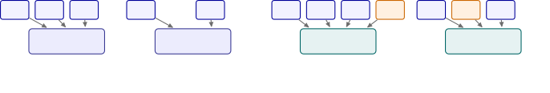

Figure 1: Comparison of conditioning strategies for Flow-based
restoration tasks. (a) CFM conditions the velocity field on $`t`$. (b)
Autonomous Rectified Flow (ARF) removes $`t`$. (c) CFM+DL conditions CFM
with the additional discriminative latent (DL) representation
$`z_{t}=\mathcal{E}_{\phi}(x_{t})`$. (d) DFM replaces $`t`$ with the
Discriminative Flow-State Representation
$`z=\mathcal{E}_{\phi}(x_{\zeta}).`$

### 2.3 Discriminative Flow-State Hypothesis

Let $`\mathcal{X}`$ denote the data space, and let
$`\mathcal{E}_{\phi}:\mathcal{X}\rightarrow\mathcal{Z}`$ be a
pretrained, frozen discriminative encoder parameterized by $`\phi`$,
mapping a sample $`x\in\mathcal{X}`$ to a latent representation
$`z=\mathcal{E}_{\phi}(x)`$ within the representation space
$`\mathcal{Z}`$. Furthermore, let
$`\hat{x}=\mathcal{D}_{\Phi}(z)\sim p_{d}`$, where $`p_{d}`$ represents
the output distribution of the discriminative model
$`\mathcal{F}_{\Omega}=\mathcal{D}_{\Phi}\circ\mathcal{E}_{\phi}`$
parameterized by $`\Omega`$, and $`\mathcal{D}_{\Phi}`$ denotes the
pretrained discriminative decoder parameterized by $`\Phi`$.

###### Hypothesis 1 (Discriminative Flow-State Hypothesis).

Latent representations $`z\in\mathcal{Z}`$ learned by discriminative
restoration models encode information about the underlying Flow-State
$`\mathcal{S}(p_{t})`$ governing generative transport.

Consequently, rather than relying explicitly on time $`t`$,
discriminative latent representations $`z`$ provide a sample-dependent
description of restoration progress, proximity to the target
distribution, and restoration complexity. Furthermore, evaluating the
true Flow-State $`\mathcal{S}(p_{t})=\mathcal{W}_{2}(p_{t},p_{1})`$ is
infeasible in practice because the ground-truth clean data distribution
$`p_{1}`$ is inaccessible at inference. Instead, we define the
approximate Flow-State
$`\hat{\mathcal{S}}(p_{t}):=\mathcal{W}_{2}(p_{t},p_{d})`$ as an
empirical surrogate, as we can observe samples from the distribution
$`p_{d}`$. To justify this choice, the following proposition shows that
the approximation error is bounded by the discriminative model’s mean
squared reconstruction error loss.

###### Proposition 4 (Approximation of Flow-State).

Let $`\hat{x}_{1}\sim p_{d}`$ be the estimate of $`x_{1}\sim p_{1}`$
obtained from a discriminative restoration model trained under a mean
squared error objective
$`\mathcal{L}=\mathbb{E}[\|{}\hat{x}_{1}-x_{1}\|{}^{2}]`$. Then, we have

```math
|\mathcal{S}(p_{t})-\hat{\mathcal{S}}(p_{t})|^{2}\leq\mathcal{L}. \tag{8}
```

###### Proposition 5 (Flow-State Preservation).

Assuming the discriminative model’s architecture forms a Markov chain
$`x_{t}\to z\to\hat{x}_{1}`$, where $`z=\mathcal{E}_{\phi}(x_{t})`$ and
$`\hat{x}_{1}`$ is the estimated clean signal. Then,

```math
\mathcal{I}(z;x_{1})\geq\mathcal{I}(\hat{x}_{1};x_{1}), \tag{9}
```

where $`\mathcal{I}`$ denotes the mutual information.

The proofs are provided in Appendix A1.4 and A1.5. Propositions 4 and 5
jointly justify our DFM framework. Specifically, Proposition 4 ensures
the deviation between $`\mathcal{S}(p_{t})`$ and its approximation
$`\hat{\mathcal{S}}(p_{t})`$ shrinks as discriminative model’s training
loss is minimized, while Proposition 5 shows that $`z`$ retains at least
as much target information as $`\hat{x}_{1}`$. Hence, leveraging $`z`$
rather than $`\hat{x}_{1}`$ for characterizing transport progress is
justified. The assumption of the discriminative model forming a Markov
chain is admittedly a strong one, but would be fulfilled, e.g., for an
autoencoder model without skip connections. However, Sections 4.1–4.3
empirically validate that discriminative latent representations can be
utilized for accurately predicting different observable proxies of the
Flow-State. In the remainder of this paper, we define these
discriminative latent representations $`z`$ as the DFSR (DFSR).

## 3 Discriminative Flow Matching

Following the additive signal model introduced in Proposition 2, we
describe the observed data as

```math
x_{0}=\alpha x_{1}+\beta\nu. \tag{10}
```

To this end, motivated by the Discriminative Flow-State Hypothesis, we
propose DFM, which conditions the velocity field on DFSR
$`z=\mathcal{E}_{\phi}(x_{\zeta}),`$ derived from a pretrained encoder
$`\mathcal{E}_{\phi}`$, instead of time $`t`$. Following (Lee et al.
2025; Richter et al. 2023), we define the conditional probability path
$`p(x_{\zeta}\mid x_{0},x_{1})=\mathcal{N}(x_{\zeta};\mu_{\zeta},\sigma_{\zeta}^{2}\mathbf{I})`$
mapping the Gaussian-perturbed observation $`x_{0}+\sigma\epsilon`$ at
$`\zeta=0`$ to the clean target $`x_{1}`$ at $`\zeta=1`$:

```math
\mu_{\zeta}=(1-\zeta)x_{0}+\zeta x_{1},\quad x_{\zeta}=\mu_{\zeta}+\sigma_{\zeta}\epsilon, \tag{11}
```

where DFM interpolation coordinate $`\zeta\sim\mathcal{U}[0,1]`$,
$`\epsilon\sim\mathcal{N}(0,\mathbf{I})`$, and
$`\sigma_{\zeta}=(1-\zeta)\sigma`$ for a constant $`\sigma\geq 0`$ .
With the corresponding target velocity
$`v^{\star}=\frac{\partial x_{\zeta}}{\partial\zeta}=(x_{1}-x_{0})-\sigma\epsilon`$,
the DFM training objective is formulated as

```math
\mathcal{L}_{\mathrm{DFM}}(\theta)=\mathbb{E}\left[\left\|v_{\theta}(x_{\zeta},z,x_{0})-v^{\star}\right\|_{2}^{2}\right]. \tag{12}
```

DFM Inference: Inference is initialized from the degraded observation,
$`x^{(0)}=x_{0}+\sigma\epsilon`$, and performed using Euler integration

```math
x^{(n+1)}=x^{(n)}+\gamma_{n}v_{\theta}\left(x^{(n)},\mathcal{E}_{\phi}(x^{(n)}),x_{0}\right), \tag{13}
```

where $`\gamma_{n}`$ denotes the integration step size at
$`n=0,\ldots,N-1`$ and $`N`$ is the total NFE (NFE). For simplicity, we
use a uniform time discretization, i.e., $`\gamma_{n}=1/N`$
$`\forall n`$. The estimate of the clean data is obtained as
$`\hat{x}_{1}=x^{(N)}`$. Since the velocity network $`v_{\theta}`$ is
not dependent on the interpolation factor $`\zeta`$, transport is guided
entirely by the evolving DFSR $`z`$, which can also be used to adapt
either the computational budget $`N`$ or the integration step sizes
$`\gamma_{n}`$ as described in Section 4.3.

## 4 Experiments and Results

### 4.1 Flow-State Preservation

We first validate the Discriminative Flow-State Hypothesis by examining
whether DFSR preserve information about the underlying Flow-State.
Figure 2 visualizes latent representations extracted from a pretrained
DCCRN encoder (Hu et al. 2021) across SNRs ranging from $`-30`$ to
$`40`$ dB. The latent space is organized according to degradation
severity, with progressively cleaner samples placed closer to the clean
latent manifold.

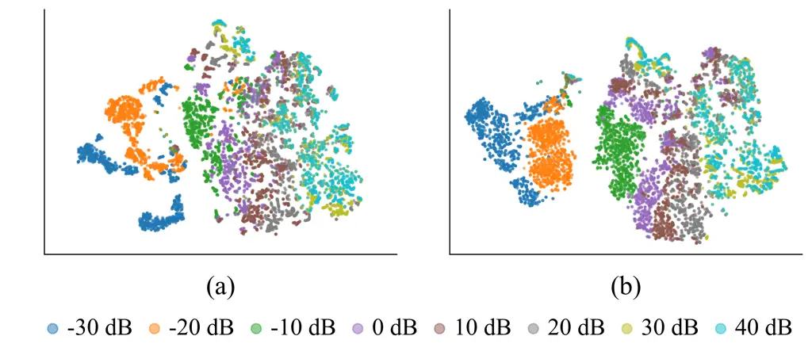

Figure 2: t-SNE visualization of DCCRN latent representations under (a)
rain and (b) machinery noise.

We further predict three quantities related to the Flow-State from the
DFSR: the interpolation factor used in the training phase $`\zeta`$, the
ground truth intermediate SNR (iSNR) computed from the mean
$`\mu_{\zeta}`$ (see (11)), and global (input) SNR (gSNR) computed from
the degraded observation $`x_{0}`$. Both SNR measures are normalized to
$`[0,1]`$ as

```math
s_{\mathrm{SNR}}\triangleq\max\left(0,\min\left(1,\frac{\mathrm{SNR}+10}{70}\right)\right), \tag{14}
```

mapping the range $`[-10,60]`$ dB to $`[0,1]`$.

Figure 3 compares our proposed latent-predictor against an anchor-based
baseline. The latent-predictor utilizes the DFSR
$`z_{\mu}=\mathcal{E}_{\phi}(\mu_{\zeta})`$ as input. Conversely, the
anchor-based baseline uses the signal pair
$`\{\mu_{\zeta},\mathcal{F}_{\Omega}(\mu_{\zeta})\}`$. Both
architectures utilize the PESQNet backbone (Xu et al. 2022), and are
trained on the DNS Challenge dataset (Reddy et al. 2020) and evaluated
on $`1,500`$ simulated samples.


Figure 3: Prediction of observable Flow-State quantities from either the
DFSR or the anchor-based signal pair.

| Target    | Method | MAE $`\downarrow`$ | RMSE $`\downarrow`$ | Pearson $`\uparrow`$ |
| --------- | ------ | ------------------ | ------------------- | -------------------- |
| iSNR      | Latent | 0.032              | 0.047               | 0.968                |
|           | Anchor | 0.035              | 0.048               | 0.971                |
| gSNR      | Latent | 0.117              | 0.154               | 0.491                |
|           | Anchor | 0.142              | 0.181               | 0.301                |
| $`\zeta`$ | Latent | 0.154              | 0.190               | 0.741                |
|           | Anchor | 0.155              | 0.211               | 0.751                |

Table 1: Prediction performance for quantities related to the
Flow-State. Best results are shown in bold.

Table 1 shows that iSNR predictors can estimate iSNR accurately
irrespective of the used input features, achieving Pearson correlations
above $`0.96`$. Notably, the latent-based predictor achieves the lowest
MAE and RMSE across all three targets, while Pearson correlations are
comparable between the two input types. As noted in Proposition 2,
estimating the interpolation factor $`\zeta`$ and gSNR is inherently
challenging, as varying parameterizations of $`\alpha`$ and $`\beta`$
yield identical states for $`\mu_{\zeta}`$. Consequently, as confirmed
by the empirical results, even the anchor-based predictor—which also
incorporates $`\mu_{\zeta}`$ as input feature, struggles to accurately
estimate $`\zeta`$ or gSNR. Nevertheless, the latent-based predictor’s
strong performance confirms that DFSR effectively preserve Flow-State
information, empirically validating Proposition 5 and the Discriminative
Flow-State Hypothesis.

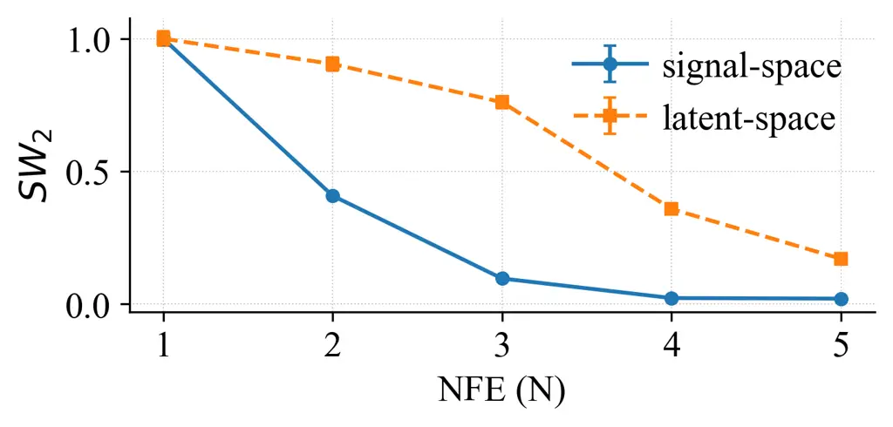

Figure 4: Evolution of signal-space and latent-space Flow-States over
NFE.

### 4.2 Flow-State Monotonicity

We further analyze whether successive DFM updates induce a monotonic
decrease of the Flow-State of the distribution $`p_{n}`$ of the
intermediate estimates $`x^{(n)}`$ (see (13)) of DFM toward the
clean-speech distribution $`p_{1}`$. The Flow-State in signal-space at
the $`n`$-th inference step can be defined as

```math
\mathcal{S}(p_{n})=\mathcal{W}_{2}(p_{n},p_{1}), \tag{15}
```

analogously to Definition 1 in Section 2. Since exact computation of
$`\mathcal{W}_{2}`$ is computationally prohibitive in high-dimensional
waveform spaces, we estimate it using the Sliced Wasserstein-2 distance
($`\mathcal{SW}_{2}`$) (Rabin et al. 2011; Kolouri et al. 2019).
Empirical signal-space distributions are constructed from overlapping
$`25`$-ms waveform segments extracted from the DNS Challenge
non-reverberant test set (Reddy et al. 2020), consisting of $`150`$
samples with diverse noise conditions. Similar to (15), we compute
$`\mathcal{SW}_{2}`$ in the latent-space, where we obtain the
corresponding discriminative latent representation of the samples of
$`p_{n}`$ and $`p_{1}`$ from the frozen DCCRN encoder (Hu et al. 2021).

Distances are estimated using $`512`$ random projections and averaged
over $`20`$ trials, with features standardized via clean-data
statistics. As shown in Fig. 4, both signal- and latent-space
Flow-States decrease monotonically during inference. The signal-space
trajectory achieves Spearman’s $`\rho=-1.000`$, Pearson’s $`r=-0.888`$,
and a convergence floor of $`0.112\pm 0.005`$. The latent-space
trajectory exhibits identical monotonic ordering ($`\rho=-1.000`$), a
stronger Pearson correlation ($`r=-0.973`$), and zero monotonicity
violations. The signal- and latent-space trajectories are
rank-equivalent ($`\rho=1.000`$), indicating that the DFSR preserves the
underlying Flow-State ordering. These results indicate that successive
DFM updates monotonically reduce the Flow-State, mirroring the behavior
established analytically for OT-CFM in Proposition 1, and that the
latent-space trajectory follows the same ordering, which supports the
Discriminative Flow-State Hypothesis.

### 4.3 Speech Enhancement

#### Dataset

We evaluate the proposed method on the Interspeech 2020 DNS Challenge
dataset (Reddy et al. 2020), a widely adopted benchmark for supervised
SE. The training set contains approximately $`1{,}000`$ hours of
noisy-clean speech pairs generated by mixing clean speech with noise at
SNRs between $`-10`$ and $`30`$ dB, where $`50\%`$ of the utterances are
additionally reverberated using the DNS Challenge RIR corpus (Reddy et
al. 2020). Following the official evaluation protocol, performance is
reported on both the synthetic non-reverberant test set ($`150`$
utterances), which enables reference-based evaluation, and the DNS Real
Recordings test set ($`300`$ recordings), which assesses generalization
to real-world acoustic conditions.

#### Implementation Details

Unless stated otherwise, all CFM methods are trained using the FlowSE
training framework (Lee et al. 2025) and the NCSN++ backbone (Song et
al. 2021), which is widely adopted in the literature for CFM and
diffusion-based SE. DFM employs a frozen DCCRN (Hu et al. 2021) to
extract DFSR after the recurrent layers, projecting them into a
$`256`$-dimensional embedding that is linearly interpolated to match the
backbone’s temporal resolution. This representation replaces the
standard time embedding via additive conditioning (Lee et al. 2025;
Richter et al. 2023). All models are trained using the Adam optimizer
with a learning rate of $`10^{-4}`$, a batch size of $`8`$, and an
exponential moving average decay of $`0.999`$. Following (Lee et al.
2025), we use an FFT length of $`510`$, a window length of $`510`$, a
hop length of $`128`$, and a Gaussian noise prefactor $`\sigma=0.487`$,
which was shown to be effective for the SE tasks. Models are trained on
a single A100 GPU for $`800{,}000`$ steps, with the best checkpoints
selected via validation PESQ and SI-SDR, and results reported as the
average over $`5`$ independent runs.

[TABLE]

Table 2: SE results on the DNS Challenge synthetic non-reverberant test
set.

[TABLE]

Table 3: Generalization results on the DNS Real Recordings test
set (Reddy et al. 2020). Baseline results are taken from their
respective original publications.

[TABLE]

Table 4: Results on the DNS Challenge non-reverberant test set under the
data-prediction training objective.

#### Experimental Results

To isolate the effect of conditioning on DFSR $`z`$ compared to time
conditioning, we evaluate DFM against three re-trained baseline CFM
methods, CFM (FlowSE) (Lee et al. 2025), CFM+DL, and ARF (Zhang et al.
2026a) as shown in Fig. 1, using identical backbones, trajectories, and
training settings. We further benchmark against state-of-the-art
discriminative, GAN-, and diffusion-based models: DCCRN (Hu et al.
2021), GCRN (Tan and Wang 2019), SGMSE (Welker et al. 2022),
SGMSE+ (Richter et al. 2023), BBED (Lay et al. 2023), GALDSE (Wang et
al. 2024), SEBridge (Qiu et al. 2023), SToRM (Lemercier et al. 2023),
RVAE (Leglaive et al. 2020), CDiffuse (Lu et al. 2022), MetricGAN+ (Fu
et al. 2021), and DisCoGAN (Shetu et al. 2025). Performance is evaluated
using standard SE metrics: SI-SDR (Le Roux et al. 2019) for signal
reconstruction, wide-band PESQ (Rix et al. 2001) for perceptual quality,
SCOREQ (Ragano et al. 2024) for DNN-based reference and non-reference
based assessment, and DNSMOS (Reddy et al. 2021) for non-intrusive
evaluation on real recordings.

Table 2 shows results on the DNS synthetic non-reverberant test set. DFM
outperforms all CFM variants, achieving $`19.63`$ dB SI-SDR and $`2.96`$
PESQ, gaining $`0.64`$ dB in SI-SDR and $`0.10`$ in PESQ over the
baseline CFM. Relative to the discriminative baseline DCCRN, DFM
improves SI-SDR by more than $`2.2`$ dB and reduces the reference SCOREQ
distance from $`0.31`$ to $`0.23`$. These results indicate that
replacing $`t`$ with DFSR $`z`$ leads to more effective generative
transport. Table 3 evaluates generalization on the DNS Real Recordings
test set, where DFM outperforms the baseline methods, obtaining a P.808
MOS of $`3.75`$, together with best SIG ($`3.43`$), BAK ($`4.03`$), and
OVRL ($`3.14`$) scores, demonstrating strong generalization to
real-world recordings. We further evaluate DFM using alternative
discriminative backbones, including GCRN, TaylorSENet, and ULCNet (Tan
and Wang 2019; Li et al. 2022; Shetu et al. 2024). As shown in
Appendix A1.8, DFM generalizes robustly across these architectures,
consistently outperforming the baselines. Finally, Table 4 reports
results under the data-prediction objective
($`\mathcal{L}_{\mathrm{DFM}}(\theta)=\mathbb{E}\left[\|{}v_{\theta}(x_{\zeta},z,x_{0})-x_{1}\|{}_{2}^{2}\right]`$).
DFM consistently outperforms CFM, CFM+DL, and ARF across all evaluation
metrics. The consistent improvements under both training objectives,
together with the robust generalization to synthetic and real-world test
sets, demonstrate the effectiveness of the proposed DFM framework.

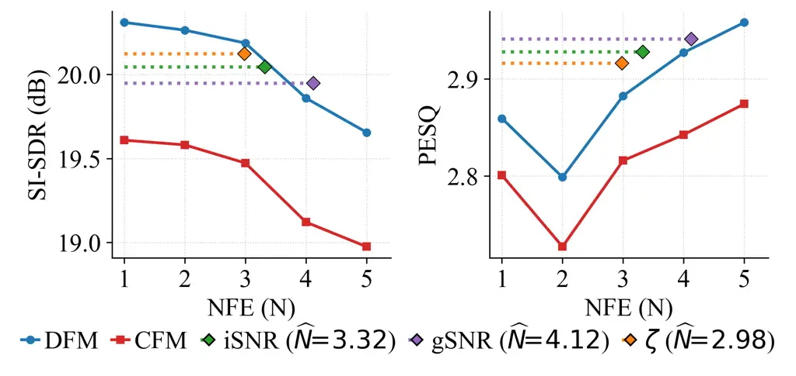

Figure 5: Performance for DFM with adaptive inference.

#### Adaptive Inference

We hypothesize that the Flow-State characterizes not only restoration
progress but also the sample-specific computational effort required for
inference. Samples closer to the target distribution should require
fewer NFE, whereas challenging samples benefit from additional
refinement. We define restoration complexity as the minimum number of
function evaluations $`N^{\star}(x_{0})`$ required to keep the
reconstruction error $`\mathcal{L}_{rec}`$ (e.g., PESQ) below a
threshold $`\xi>0`$

```math
N^{\star}(x)=\min\left\{N\in\mathbb{N}:\mathcal{L}_{rec}(\hat{x}_{1}^{(N)},x_{1})\leq\xi\right\}. \tag{16}
```

Motivated by Section 4.1, we introduce a predictor
$`\mathcal{P}_{\omega}`$ that leverages Flow-State estimates (gSNR,
iSNR, and $`\zeta`$) as a sample difficulty estimate to dynamically
determine the computational budget and integration schedule. Given the
initial representation $`z^{(0)}=\mathcal{E}_{\phi}(x_{0})`$, the
predictor jointly outputs the required NFE $`\widehat{N}\leq N_{\max}`$
and step sizes $`\bm{\gamma}=[\gamma_{1},\ldots,\gamma_{\widehat{N}}]`$

```math
(\widehat{N},\bm{\gamma})=\mathcal{P}_{\omega}(z^{(0)}), \tag{17}
```

where $`N_{\max}`$ is the maximum allowed NFE budget. This yields a
sequence of non-uniform, sample-dependent step sizes assigning larger
updates early in transport and smaller steps for later refinement (see
Appendix A1.12 for implementation details). Updates are performed
according to (13).

Fig. 5 evaluates adaptive inference performance by comparing standard
fixed-budget CFM and DFM baselines ($`N_{\max}=5`$) against adaptive DFM
variants with gSNR, iSNR, and $`\zeta`$ predictors. All adaptive
strategies require significantly fewer NFE than the maximum budget,
achieving average NFE of $`4.12`$, $`3.32`$, and $`2.98`$, respectively.
Despite this reduced computation, all adaptive variants outperform the
CFM baselines and surpass fixed-budget DFM in SI-SDR at $`N=5`$ while
retaining comparable PESQ. We observe a nuanced trade-off: while SI-SDR
is maximized with fewer NFE, PESQ benefits from additional refinement.
Notably, the $`\zeta`$-based predictor achieves $`20.12`$ dB SI-SDR and
$`2.92`$ PESQ at $`2.98`$ NFE, improving SI-SDR over fixed-budget DFM by
0.49 dB at a 40.4% reduction in computation relative to $`N_{\max}=5`$.
These results confirm that DFM, by conditioning on $`z`$, effectively
aligns computational effort with sample-specific complexity to ensure a
favorable quality-computation trade-off.

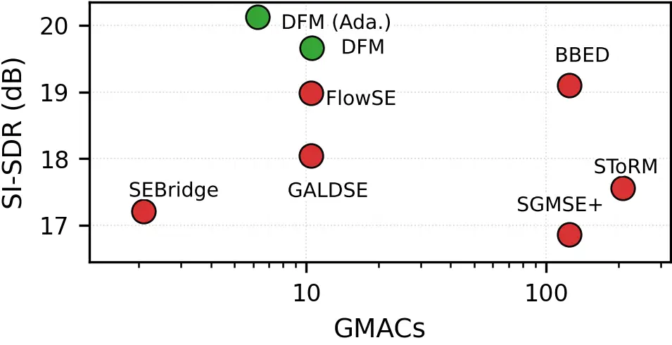

Figure 6: Complexity-performance trade-off (baselines shown in red,
proposed methods in green)

#### Complexity–Performance Trade-off

DFM introduces additional computation via the discriminative encoder
$`\mathcal{E}_{\phi}`$ (the DCCRN encoder, which contains approximately
$`2.6`$M parameters). To offset this overhead, we reduce the
conditioning dimension from the original $`512`$-dimensional time
embedding used in FlowSE (Lee et al. 2025) to a $`256`$-dimensional
representation. Consequently, the backbone is reduced to $`63.2`$M
parameters, yielding a total model size of $`65.8`$M parameters,
comparable to the FlowSE baseline ($`65.6`$M).

Fig. 6 illustrates the complexity–performance trade-off of DFM against
recent diffusion- and Flow-based SE methods in terms of SI-SDR and GMACs
per frame. DFM achieves superior enhancement performance while
maintaining competitive computational complexity. Furthermore, adaptive
inference reduces the average computational cost to $`6.27`$ GMACs per
frame, outperforming both fixed-budget DFM and existing diffusion- and
Flow-based approaches.

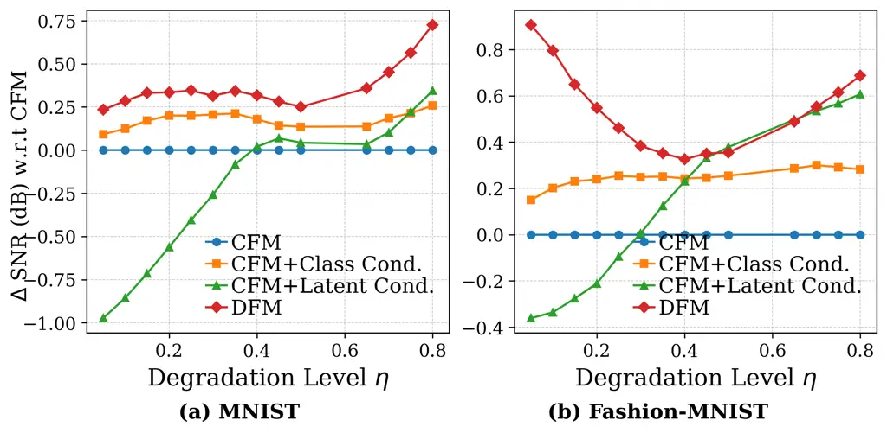

Figure 7: Image denoising performance relative to CFM.

### 4.4 Image Denoising

To demonstrate that DFM is not restricted to SE, we conduct an image
denoising experiment on the MNIST and Fashion-MNIST datasets using a
lightweight image classifier as the discriminative encoder. We compare
CFM, CFM+Class Cond. (where CFM additionally utilizes the ground truth
label as conditioning information), CFM+Latent Cond. (which utilizes
DFSR as additional conditioning), and DFM. Fig. 7 shows that DFM
consistently outperforms the baselines on both MNIST and Fashion-MNIST
across all degradation levels. This highlights that DFSR provide
superior conditioning compared to semantic labels or latent features
combined with explicit time conditioning. Furthermore, DFM also supports
adaptive inference for this task, allocating computational budget
relative to the degradation level while preserving restoration quality.
Network architectures and implementation details are provided in the
Appendix A1.14.

## 5 Conclusion

In this work, we introduce DFM, a novel CFM framework that replaces
explicit time conditioning with discriminative Flow-State
representations. Grounded in the Discriminative Flow-State Hypothesis,
DFM addresses the limitations of standard CFM for restoration tasks by
leveraging discriminative representations to dynamically adapt the
generative process. Experiments across SE and image denoising show that
DFM consistently improves restoration quality while enabling adaptive
inference at a reduced computational cost, establishing discriminative
conditioning as a powerful alternative to explicit time conditioning for
CFM.

## References

- Abdulatif et al. (2024) S. Abdulatif, R. Cao, and B. Yang CMGAN:
  conformer-based metric-gan for monaural speech enhancement. IEEE/ACM
  Transactions on Audio, Speech, and Language Processing 32,
  pp. 2477–2493. External Links:
  [Document](https://dx.doi.org/10.1109/TASLP.2024.3393718) Cited by:
  §1.
- Albergo and Vanden-Eijnden (2022) M. S. Albergo and E. Vanden-Eijnden
  Building normalizing flows with stochastic interpolants. arXiv
  preprint arXiv:2209.15571. Cited by: §2.
- Cross and Ragni (2025) M. Cross and A. Ragni Flowing straighter with
  conditional flow matching for accurate speech enhancement. In
  Proceedings of the 2nd ECAI Workshop on Machine Learning Meets
  Differential Equations: From Theory to Applications, Proceedings of
  Machine Learning Research, Vol. 277, pp. 121–132. Cited by: §1.
- Deng (2012) L. Deng The mnist database of handwritten digit images for
  machine learning research \[best of the web\]. IEEE signal processing
  magazine 29 (6), pp. 141–142. Cited by: §A1.14.
- Fu et al. (2021) S.-W. Fu, C. Yu, T. Hsieh, P. Plantinga, M.
  Ravanelli, X. Lu, and Y. Tsao MetricGAN+: an improved version of
  MetricGAN for speech enhancement. In Proceedings of the Annual
  Conference of the International Speech Communication Association
  (INTERSPEECH), Cited by: §4.3.
- Gretton et al. (2012) A. Gretton, K. M. Borgwardt, M. J. Rasch, B.
  Schölkopf, and A. J. Smola A kernel two-sample test. Journal of
  Machine Learning Research 13 (25), pp. 723–773. Cited by: §A1.7.
- He et al. (2022) K. He, X. Chen, S. Xie, Y. Li, P. Dollár, and R.
  Girshick Masked autoencoders are scalable vision learners. In
  Proceedings of the IEEE/CVF conference on computer vision and pattern
  recognition, pp. 16000–16009. Cited by: §1.
- Ho et al. (2020) J. Ho, A. Jain, and P. Abbeel Denoising diffusion
  probabilistic models. In Advances in Neural Information Processing
  Systems, Vol. 33, pp. 6840–6851. Cited by: §1.
- Hsieh and Kim (2025) T. Hsieh and M. Kim Adaptive discriminative
  flow-matching target speaker extraction. Note: arXiv:2510.16995 Cited
  by: §1.
- Hu et al. (2021) Y. Hu, Y. Liu, S. Lv, M. Xing, S. Zhang, Y. Fu, J.
  Wu, B. Zhang, and L. Xie DCCRN: deep complex convolution recurrent
  network for phase-aware speech enhancement. In Proceedings of the
  Annual Conference of the International Speech Communication
  Association (INTERSPEECH), Cited by: §A1.10, §A1.7, §A1.9, §A1.9,
  §4.1, §4.2, §4.3, §4.3.
- Jung et al. (2024) C. Jung, S. Lee, J. Kim, and J. S. Chung FlowAVSE:
  efficient audio-visual speech enhancement with conditional flow
  matching. In Proceedings of the Annual Conference of the International
  Speech Communication Association (INTERSPEECH), pp. 2210–2214. Cited
  by: §1.
- Kolouri et al. (2019) S. Kolouri, K. Nadjahi, U. Simsekli, R. Badeau,
  and G. Rohde Generalized sliced wasserstein distances. In Advances in
  Neural Information Processing Systems, Vol. 32. Cited by: §4.2.
- Lay et al. (2023) B. Lay, S. Welker, J. Richter, and T. Gerkmann
  Reducing the prior mismatch of stochastic differential equations for
  diffusion-based speech enhancement. In Proceedings of the Annual
  Conference of the International Speech Communication Association
  (INTERSPEECH), Cited by: §4.3.
- Le Roux et al. (2019) J. Le Roux, S. Wisdom, H. Erdogan, and J. R.
  Hershey SDR–half-baked or well done?. In Proceedings of the IEEE
  International Conference on Acoustics, Speech and Signal Processing
  (ICASSP), Cited by: §4.3.
- Lee et al. (2025) S. Lee, S. Cheong, S. Han, and J. W. Shin FlowSE:
  flow matching-based speech enhancement. In Proceedings of the IEEE
  International Conference on Acoustics, Speech and Signal Processing
  (ICASSP), pp. 1–5. Cited by: §A1.8, §1, §2, §3, §4.3, §4.3, §4.3.
- Leglaive et al. (2020) S. Leglaive, X. Alameda-Pineda, L. Girin,
  and R. Horaud A recurrent variational autoencoder for speech
  enhancement. In Proceedings of the IEEE International Conference on
  Acoustics, Speech and Signal Processing (ICASSP), Cited by: §4.3.
- Lemercier et al. (2023) J.-M. Lemercier, J. Richter, S. Welker, and T.
  Gerkmann StoRM: a diffusion-based stochastic regeneration model for
  speech enhancement and dereverberation. IEEE/ACM Transactions on
  Audio, Speech, and Language Processing 31, pp. 2724–2737. Cited by:
  §4.3.
- Li et al. (2022) A. Li, S. You, G. Yu, C. Zheng, and X. Li Taylor, can
  you hear me now? a Taylor-unfolding framework for monaural speech
  enhancement. In Proc. Int. Joint Conf. Artif. Intell., Cited by:
  §A1.9, §A1.9, §4.3.
- Li et al. (2024) C. Li, S. Cornell, S. Watanabe, and Y. Qian
  Diffusion-based generative modeling with discriminative guidance for
  streamable speech enhancement. In 2024 IEEE Spoken Language Technology
  Workshop (SLT), pp. 333–340. Cited by: §1.
- Lipman et al. (2023) Y. Lipman, R. T. Q. Chen, H. Ben-Hamu, M. Nickel,
  and M. Le Flow matching for generative modeling. In International
  Conference on Learning Representations, Cited by: §1, §2.1, §2.
- Lu et al. (2022) Y.-J. Lu, Z.-Q. Wang, S. Watanabe, A. Richard, C. Yu,
  and Y. Tsao Conditional diffusion probabilistic model for speech
  enhancement. In Proceedings of the IEEE International Conference on
  Acoustics, Speech and Signal Processing (ICASSP), Cited by: §4.3.
- McCann (1997) R. J. McCann A convexity principle for interacting
  gases. Advances in Mathematics 128 (1), pp. 153–179. Cited by: §2.1.
- Pathak et al. (2016) D. Pathak, P. Krahenbuhl, J. Donahue, T. Darrell,
  and A. A. Efros Context encoders: feature learning by inpainting. In
  Proceedings of the IEEE conference on computer vision and pattern
  recognition, pp. 2536–2544. Cited by: §1.
- Qiu et al. (2023) Z. Qiu, M. Fu, F. Sun, G. Altenbek, and H. Huang
  SE-Bridge: speech enhancement with consistent brownian bridge. Note:
  Proceedings of the Annual Conference of the International Speech
  Communication Association (INTERSPEECH) Cited by: §4.3.
- Rabin et al. (2011) J. Rabin, G. Peyré, J. Delon, and M. Bernot
  Wasserstein barycenter and its application to texture mixing. In
  International Conference on Scale Space and Variational Methods in
  Computer Vision, pp. 435–446. Cited by: §4.2.
- Ragano et al. (2024) A. Ragano, J. Skoglund, and A. Hines SCOREQ:
  speech quality assessment with contrastive regression. Advances in
  Neural Information Processing Systems. Cited by: §4.3.
- Reddy et al. (2020) C. K. A. Reddy, V. Gopal, R. Cutler, E.
  Beyrami, R. Cheng, H. Dubey, S. Matusevych, R. Aichner, A. Aazami, S.
  Braun, et al. The InterSpeech 2020 deep noise suppression challenge:
  datasets, subjective testing framework, and challenge results. In
  Proceedings of the Annual Conference of the International Speech
  Communication Association (INTERSPEECH), Cited by: §A1.13, §A1.6,
  §4.1, §4.2, §4.3, Table 3.
- Reddy et al. (2021) C. K. A. Reddy, V. Gopal, and R. Cutler DNSMOS: a
  non-intrusive perceptual objective speech quality metric to evaluate
  noise suppressors. In Proceedings of the IEEE International Conference
  on Acoustics, Speech and Signal Processing (ICASSP), Cited by: §4.3.
- Richter et al. (2023) J. Richter, S. Welker, J.-M. Lemercier, B. Lay,
  and T. Gerkmann Speech enhancement and dereverberation with
  diffusion-based generative models. IEEE/ACM Transactions on Audio,
  Speech, and Language Processing, pp. 2351–2364. Cited by: §A1.8, §3,
  §4.3, §4.3.
- Rix et al. (2001) A. W. Rix, J. G. Beerends, M. P. Hollier, and A. P.
  Hekstra Perceptual evaluation of speech quality (PESQ) - a new method
  for speech quality assessment of telephone networks and codecs. In
  Proceedings of the IEEE International Conference on Acoustics, Speech
  and Signal Processing (ICASSP), Cited by: §4.3.
- Shetu et al. (2024) S. S. Shetu, S. Chakrabarty, O. Thiergart, and E.
  Mabande Ultra low complexity deep learning based noise suppression. In
  Proceedings of the IEEE International Conference on Acoustics, Speech
  and Signal Processing (ICASSP), Cited by: §A1.9, §A1.9, §4.3.
- Shetu et al. (2025) S. S. Shetu, E. A. P. Habets, and A. Brendel
  GAN-based speech enhancement for low SNR using latent feature
  conditioning. In Proceedings of the IEEE International Conference on
  Acoustics, Speech and Signal Processing (ICASSP), pp. 1–5. Cited by:
  §4.3.
- Shetu et al. (2026) S. S. Shetu, E. A. P. Habets, and A. Brendel
  Leveraging discriminative latent representations for conditioning
  GAN-based speech enhancement. IEEE/ACM Transactions on Audio, Speech,
  and Language Processing. External Links:
  [Document](https://dx.doi.org/10.1109/TASLPRO.2026.3677639) Cited by:
  §1.
- Song et al. (2021) Y. Song, J. Sohl-Dickstein, D. P. Kingma, A.
  Kumar, S. Ermon, and B. Poole Score-based generative modeling through
  stochastic differential equations. In International Conference on
  Learning Representations, Cited by: §A1.8, §1, §4.3.
- Tan and Wang (2019) K. Tan and D. Wang Learning complex spectral
  mapping with gated convolutional recurrent networks for monaural
  speech enhancement. IEEE/ACM Transactions on Audio, Speech, and
  Language Processing 28, pp. 380–390. Cited by: §A1.9, §A1.9, §4.3,
  §4.3.
- Vincent et al. (2010) P. Vincent, H. Larochelle, I. Lajoie, Y.
  Bengio, P. Manzagol, and L. Bottou Stacked denoising autoencoders:
  learning useful representations in a deep network with a local
  denoising criterion.. Journal of machine learning research 11 (12).
  Cited by: §1.
- Wang et al. (2024) C. Wang, J. Gu, D. Yao, J. Li, and Y. Yan GALD-se:
  guided anisotropic lightweight diffusion for efficient speech
  enhancement. IEEE Signal Processing Letters 32, pp. 426–430. Cited by:
  §1, §4.3.
- Wang et al. (2026) D. Wang, J. Gao, T. Lei, Y. Hu, C. Zhu, K. Chen,
  and J. Lu Rethinking flow and diffusion bridge models for speech
  enhancement. In Proceedings of the AAAI Conference on Artificial
  Intelligence, pp. 33431–33439. Cited by: §A1.12, §1.
- Welker et al. (2022) S. Welker, J. Richter, and T. Gerkmann Speech
  enhancement with score-based generative models in the complex STFT
  domain. In Proceedings of the Annual Conference of the International
  Speech Communication Association (INTERSPEECH), Cited by: §4.3.
- Xiao et al. (2017) H. Xiao, K. Rasul, and R. Vollgraf Fashion-mnist: a
  novel image dataset for benchmarking machine learning algorithms.
  arXiv preprint arXiv:1708.07747. Cited by: §A1.14.
- Xu et al. (2022) Z. Xu, M. Strake, and T. Fingscheidt Deep noise
  suppression maximizing non-differentiable PESQ mediated by a
  non-intrusive PESQNet. IEEE/ACM Transactions on Audio, Speech, and
  Language Processing 30, pp. 1572–1585. External Links:
  [Document](https://dx.doi.org/10.1109/TASLP.2022.3165442) Cited by:
  §4.1.
- Zhang et al. (2026a) W. Zhang, W. Jiang, Y. Zhang, and X. Zhou
  Time-unconditional generative speech enhancement via autonomous
  rectified flow. Note: arXiv:2606.20001 Cited by: §1, §4.3.
- Zhang et al. (2026b) Y. Zhang, K. Tan, and D. Wang HyFlowSE: hybrid
  end-to-end flow-matching speech enhancement. IEEE/ACM Transactions on
  Audio, Speech, and Language Processing 34, pp. 2535–2548. Cited by:
  §1.
- Zhang et al. (2026c) Z. Zhang, R. Huang, Y. Liu, S. Zhu, L. Mou,
  and H. Zhao Generative control as optimization: time unconditional
  flow matching for adaptive and robust robotic control. arXiv preprint
  arXiv:2603.17834. Cited by: §1.

## Appendix A1 Appendix

### A1.1 Proof of Proposition 1 (Properties of Flow-State for OT-CFM)

###### Proposition 1 (Properties of Flow-State under OT-CFM).

For a transport trajectory governed by $`\pi_{\text{OT}}`$, the
Flow-State $`\mathcal{S}(p_{t})`$ satisfies

```math
\mathcal{S}(p_{t})=(1-t)\mathcal{W}_{2}(p_{0},p_{1}). \tag{18}
```

Consequently, $`\mathcal{S}(p_{t})`$ adheres to the following properties
for all $`t\in[0,1]`$:

1.  1.  Boundedness:
        $`0\leq\mathcal{S}(p_{t})\leq\mathcal{W}_{2}(p_{0},p_{1})`$.
2.  2.  Monotonicity:
        $`\frac{\text{d}}{\text{d}t}\mathcal{S}(p_{t})=-\mathcal{W}_{2}(p_{0},p_{1})<0`$,
        $`\forall t<1`$.

###### Proof.

We begin with proving (18). First note that for $`t=1`$, (18) trivially
holds. Hence, let assume in the following that $`t\neq 1`$. We utilize
the linear interpolation path

```math
x_{t}-x_{1}=(1-t)x_{0}+tx_{1}-x_{1}=(1-t)(x_{0}-x_{1}). \tag{19}
```

Squaring its Euclidean norm yields

```math
\|x_{t}-x_{1}\|^{2}=(1-t)^{2}\|x_{0}-x_{1}\|^{2}. \tag{20}
```

First, preserving the optimal coupling $`\pi_{\text{OT}}`$ for $`t=0`$,
we drop the infimum in the definition of
$`\mathcal{W}_{2}^{2}(p_{t},p_{1})`$ to get the upper bound

```math
\displaystyle\mathcal{W}_{2}^{2}(p_{t},p_{1}) \displaystyle\leq\mathbb{E}_{(x_{t},x_{1})\sim\pi_{t}}\|x_{t}-x_{1}\|^{2}
```

```math
\displaystyle=(1-t)^{2}\mathbb{E}_{(x_{0},x_{1})\sim\pi_{\text{OT}}}\|x_{0}-x_{1}\|^{2}=(1-t)^{2}\mathcal{W}_{2}^{2}(p_{0},p_{1}). \tag{21}
```

Note that equality holds in the second step as the infimum over all
couplings is attained by $`\pi_{\text{OT}}`$. Second, we prove equality
by contradiction. Assume there exists an alternative valid coupling
$`\pi_{t}^{\prime}`$ at time $`t`$ that achieves a strictly lower cost

```math
\mathbb{E}_{(x_{t},x_{1})\sim\pi_{t}^{\prime}}\|x_{t}-x_{1}\|^{2}<(1-t)^{2}\mathcal{W}_{2}^{2}(p_{0},p_{1}). \tag{22}
```

Using the invertible linear relation $`x_{0}=\frac{x_{t}-tx_{1}}{1-t}`$,
we can construct a corresponding coupling $`\pi_{0}^{\prime}`$ at
$`t=0`$

```math
\displaystyle\mathbb{E}_{(x_{0},x_{1})\sim\pi_{0}^{\prime}}\|x_{0}-x_{1}\|^{2} \displaystyle=\mathbb{E}_{(x_{t},x_{1})\sim\pi_{t}^{\prime}}\left\|\frac{x_{t}-tx_{1}}{1-t}-x_{1}\right\|^{2}
```

```math
\displaystyle=\frac{1}{(1-t)^{2}}\mathbb{E}_{(x_{t},x_{1})\sim\pi_{t}^{\prime}}\|x_{t}-x_{1}\|^{2}
```

```math
\displaystyle<\frac{1}{(1-t)^{2}}(1-t)^{2}\mathcal{W}_{2}^{2}(p_{0},p_{1})=\mathcal{W}_{2}^{2}(p_{0},p_{1}). \tag{23}
```

This contradicts the definition of $`\mathcal{W}_{2}^{2}(p_{0},p_{1})`$
as the absolute infimum over all valid couplings. Thus, equality holds

```math
\mathcal{W}_{2}(p_{t},p_{1})=(1-t)\mathcal{W}_{2}(p_{0},p_{1})
```

and (18) is proven. Differentiating with respect to $`t`$ yields

```math
\frac{\text{d}}{\text{d}t}\mathcal{S}(p_{t})=-\mathcal{W}_{2}(p_{0},p_{1})<0,
```

satisfying Property (2). Property (1) directly follows from the
non-negativity of the Wasserstein metric and since $`(1-t)\leq 1`$ for
$`t\in[0,1]`$. ∎

### A1.2 Proof of Proposition 2: Ambiguity of Time Coordinate

###### Proposition 2 (Ambiguity of Time $`t`$).

Let the initial state be defined as
$`x_{0}^{(\alpha,\beta)}=\alpha x_{1}+\beta\nu`$, where
$`\alpha,\beta\in\mathbb{R}^{+}`$ are scaling parameters, $`\nu`$ is an
additive noise signal, and $`x_{1}`$ is the target clean signal. For the
linear interpolation path
$`x_{t}^{(\alpha,\beta)}=(1-t)x_{0}^{(\alpha,\beta)}+tx_{1}`$ with
$`t\in[0,1)`$, there exist a distinct parameter set
$`\{\alpha^{\prime},\beta^{\prime},t^{\prime}\}`$ with
$`t\neq t^{\prime}`$, $`t^{\prime}\in[0,1)`$ and
$`(\alpha,\beta)\neq(\alpha^{\prime},\beta^{\prime})`$ with
$`\alpha^{\prime},\beta^{\prime}\in\mathbb{R}^{+}`$ such that

```math
p\left(x_{t}^{(\alpha,\beta)}\right)=p\left(x_{t^{\prime}}^{(\alpha^{\prime},\beta^{\prime})}\right). \tag{24}
```

###### Proof.

We show that there exists $`\alpha^{\prime},\beta^{\prime},t^{\prime}`$
such that
$`x_{t}^{(\alpha,\beta)}=x_{t^{\prime}}^{(\alpha^{\prime},\beta^{\prime})}`$
from which the claim follows immediately. For
$`x_{t}^{(\alpha,\beta)}=x_{t^{\prime}}^{(\alpha^{\prime},\beta^{\prime})}`$,
the coefficients of $`x_{1}`$ and $`\nu`$ have to match, i.e.,

```math
(1-t)\beta=(1-t^{\prime})\beta^{\prime}\qquad\Rightarrow\qquad\beta^{\prime}=\frac{1-t}{1-t^{\prime}}\beta. \tag{25}
```

Note that as $`\beta^{\prime}>0`$ the chosen $`\beta^{\prime}`$ is valid
and as $`\beta\neq\beta^{\prime}`$ it follows $`t\neq t^{\prime}`$ as
required. For the coefficient of $`x_{1}`$, we get

```math
(1-t)\alpha+t=(1-t^{\prime})\alpha^{\prime}+t^{\prime}\qquad\Rightarrow\qquad\alpha^{\prime}=\frac{1-t}{1-t^{\prime}}\alpha+\frac{t-t^{\prime}}{1-t^{\prime}}, \tag{26}
```

which is a valid choice if $`\alpha^{\prime}>0`$, which is satisfied if
$`(1-t)\alpha+t\geq t^{\prime}`$.

As the last step we have to show that such an $`\alpha^{\prime}`$
exists. Let’s assume for contradiction that for given $`t`$ and
$`\alpha`$ no $`t^{\prime}`$ exists such that
$`(1-t)\alpha+t\geq t^{\prime}`$, i.e.,

```math
(1-t)\alpha+t<t^{\prime}\quad\forall t^{\prime}\in[0,1). \tag{27}
```

As the left hand side is positive this is obviously wrong and we
conclude the proof. ∎

### A1.3 Proof of Proposition 3: Upper Bound of Flow-State

###### Proposition 3 (Upper Bound of Flow-State).

Assuming without loss of generality that
$`\mathbb{E}\|x_{1}\|^{2}=\mathbb{E}\|\nu\|^{2}=1`$, we obtain

```math
\mathcal{S}(p_{t})\leq|1-t|(|\alpha-1|+|\beta|) \tag{28}
```

and in the special case of a convex combination, for $`\beta=1-\alpha`$,
where $`x_{0}=\alpha x_{1}+(1-\alpha)\nu`$ with $`\alpha\in[0,1]`$

```math
\mathcal{W}_{2}(p_{t},p_{1})\leq 2|1-t||\alpha-1|. \tag{29}
```

###### Proof.

First assume that the assumption of
$`\mathbb{E}\|x_{1}\|^{2}=\mathbb{E}\|\nu\|^{2}=1`$ would be violated,
i.e., $`\mathbb{E}\|{}x_{1}\|{}^{2}=a`$ and
$`\mathbb{E}\|{}\nu\|{}^{2}=b`$, where $`a,b\neq 1`$. However, then we
could define a simple reparameterization of the initial state
$`x_{t}=\alpha x_{1}+\beta\nu`$ as
$`x_{t}=\tilde{\alpha}\tilde{x}_{1}+\tilde{\beta}\tilde{\nu}`$, where

```math
\tilde{\alpha}=\alpha\sqrt{\mathbb{E}\|x_{1}\|^{2}},\quad\tilde{\beta}=\beta\sqrt{\mathbb{E}\|\nu\|^{2}},\quad\tilde{x}_{1}=\frac{x_{1}}{\sqrt{\mathbb{E}\|x_{1}\|^{2}}},\quad\tilde{\nu}=\frac{\nu}{\sqrt{\mathbb{E}\|\nu\|^{2}}}
```

and the assumption of
$`\mathbb{E}\|{}\tilde{x}_{1}\|{}^{2}=\mathbb{E}\|{}\tilde{\nu}\|{}^{2}=1`$
would hold with the new parameterization. Hence, we assume without loss
of generality that $`\mathbb{E}\|x_{1}\|^{2}=\mathbb{E}\|\nu\|^{2}=1`$
in the following.

By using the definition of $`x_{t}`$, we obtain

```math
\|x_{t}-x_{1}\|=|1-t|\ \|(\alpha-1)x_{1}+\beta\nu\|. \tag{30}
```

By applying the definition of the Wasserstein-2 distance, we obtain an
upper bound by evaluating the expectation over an arbitrary coupling
(thereby dropping the infimum)

```math
\mathcal{S}(p_{t})=\mathcal{W}_{2}(p_{t},p_{1})\leq\sqrt{\mathbb{E}\|x_{t}-x_{1}\|^{2}}=|1-t|\sqrt{\mathbb{E}\|(\alpha-1)x_{1}+\beta\nu\|^{2}}. \tag{31}
```

Applying the triangle inequality to the term inside the square root
yields

```math
\leq|1-t|\sqrt{\mathbb{E}\left(|\alpha-1|\ \|x_{1}\|+|\beta|\ \|\nu\|\right)^{2}}.
```

We expand the expectation and apply the Cauchy-Schwarz inequality
$`\mathbb{E}(xy)^{2}\leq\mathbb{E}(x^{2})\mathbb{E}(y^{2})`$ to obtain

```math
\displaystyle=|1-t|\sqrt{|\alpha-1|^{2}\mathbb{E}\|x_{1}\|^{2}+2|\alpha-1|\ |\beta|\ \mathbb{E}\left(\|x_{1}\|\ \|\nu\|\right)+|\beta|^{2}\ \mathbb{E}\|\nu\|^{2}}
```

```math
\displaystyle\leq|1-t|\sqrt{|\alpha-1|^{2}\mathbb{E}\|x_{1}\|^{2}+2|\alpha-1|\ |\beta|\ \sqrt{\mathbb{E}\|x_{1}\|^{2}}\sqrt{\mathbb{E}\|\nu\|^{2}}+|\beta|^{2}\ \mathbb{E}\|\nu\|^{2}}.
```

Substituting $`\mathbb{E}\|{}x_{1}\|{}^{2}=1`$ and
$`\mathbb{E}\|{}\nu\|{}^{2}=1`$ yields

```math
=|1-t|\sqrt{|\alpha-1|^{2}+2|\alpha-1||\beta|+|\beta|^{2}}=|1-t|(|\alpha-1|+|\beta|). \tag{32}
```

For the special case of a convex combination of $`x_{1}`$ and $`\nu`$,
i.e., by substituting $`\beta=1-\alpha`$ with $`\alpha\in[0,1]`$ into
the upper bound (28) gives

```math
\mathcal{W}_{2}(p_{t},p_{1})\leq|1-t|(|\alpha-1|+|1-\alpha|)=2|1-t||\alpha-1|, \tag{33}
```

which concludes the proof. ∎

### A1.4 Proof of Proposition 4: Approximation of Flow-State

###### Proposition 4 (Approximation of Flow-State).

Let $`\hat{x}_{1}\sim p_{d}`$ be the estimate of $`x_{1}\sim p_{1}`$
obtained from a discriminative restoration model trained under a mean
squared error objective
$`\mathcal{L}=\mathbb{E}[\|{}\hat{x}_{1}-x_{1}\|{}^{2}]`$. Then, we have

```math
|\mathcal{S}(p_{t})-\hat{\mathcal{S}}(p_{t})|^{2}\leq\mathcal{L}. \tag{34}
```

###### Proof.

We have to upper bound the squared difference of the Flow-State
$`\mathcal{S}(p_{t})=\mathcal{W}_{2}(p_{t},p_{1})`$, with $`p_{1}`$
denoting the true underlying data distribution of clean samples
$`x_{1}`$, and $`p_{t}`$ denoting the distribution of intermediate
degraded states $`x_{t}`$ and its surrogate
$`\hat{\mathcal{S}}(p_{t})=\mathcal{W}_{2}(p_{t},p_{d})`$, with
$`p_{d}`$ denoting the distribution of the discriminative model’s
estimates (where
$`\hat{x}_{1}=\mathcal{D}_{\Phi}(\mathcal{E}_{\phi}(x_{t}))\sim p_{d}`$
or $`\hat{x}_{1}=\mathcal{F}_{\Omega}(x_{t})`$).

##### Step 1: Bounding the Estimation Error via Inverse Triangle Inequality.

Using the inverse triangle inequality for the Wasserstein-2 metric

```math
|\mathcal{W}_{2}(p_{t},p_{1})-\mathcal{W}_{2}(p_{t},p_{d})|\leq\mathcal{W}_{2}(p_{1},p_{d}), \tag{35}
```

we establish the following inequality on the absolute difference between
the true and approximate Flow-States

```math
|\mathcal{S}(p_{t})-\hat{\mathcal{S}}(p_{t})|\leq\mathcal{W}_{2}(p_{1},p_{d}). \tag{36}
```

##### Step 2: Upper Bounding the Wasserstein Distance with Reconstruction Loss.

By definition, the Wasserstein-2 distance between the estimated
distribution $`p_{d}`$ and the true distribution $`p_{1}`$ is the
infimum over all valid joint couplings $`\pi\in\Pi(p_{d},p_{1})`$

```math
\mathcal{W}_{2}(p_{d},p_{1})=\inf_{\pi\in\Pi(p_{d},p_{1})}\sqrt{\mathbb{E}_{(\hat{x}_{1},x_{1})\sim\pi}[\|\hat{x}_{1}-x_{1}\|^{2}]}. \tag{37}
```

The pairing of the target $`x_{1}`$ with the estimate
$`\hat{x}_{1}=\mathcal{F}_{\Omega}(x_{t})`$ produced from the
corresponding degraded state $`x_{t}`$ is described by a joint
distribution of $`(\hat{x}_{1},x_{1})`$ whose first marginal is
$`p_{d}`$ and whose second marginal is $`p_{1}`$. Note that there exist
different joint distributions, which are collectively denoted by the set
$`\Pi(p_{d},p_{1})`$, and that the Wasserstein-2 distance is based on an
infimum over all of these joint distributions. Hence, by picking a
particular joint distribution $`p(x_{t},x_{1})`$, we obtain an upper
bound on the Wasserstein-2 distance

```math
\mathcal{W}_{2}(p_{d},p_{1})\leq\left(\mathbb{E}_{p(x_{t},x_{1})}\left[\|\mathcal{F}_{\Omega}(x_{t})-x_{1}\|^{2}\right]\right)^{1/2}=\sqrt{\mathcal{L}}, \tag{38}
```

where
$`\mathcal{L}=\mathbb{E}_{p(x_{t},x_{1})}[\|\mathcal{F}_{\Omega}(x_{t})-x_{1}\|^{2}]`$
denotes the supervised mean squared reconstruction error of the
discriminative model. Substituting into (36) yields

```math
\left|\mathcal{S}(p_{t})-\hat{\mathcal{S}}(p_{t})\right|\leq\sqrt{\mathcal{L}}, \tag{39}
```

and squaring both sides concludes the proof. ∎

### A1.5 Proof of Proposition 5: Flow-State Preservation

###### Proposition 5 (Flow-State Preservation).

Assuming the discriminative model’s architecture forms a Markov chain
$`x_{t}\to z\to\hat{x}_{1}`$, where $`z=\mathcal{E}_{\phi}(x_{t})`$ and
$`\hat{x}_{1}`$ is the estimated clean signal. Then,

```math
\mathcal{I}(z;x_{1})\geq\mathcal{I}(\hat{x}_{1};x_{1}), \tag{40}
```

where $`\mathcal{I}`$ denotes the mutual information.

###### Proof.

We model the discriminative restoration process as the Markov chain

```math
x_{1}\rightarrow x_{t}\rightarrow z\rightarrow\hat{x}_{1},
```

assuming that the decoder $`\mathcal{D}_{\Phi}`$ receives no direct skip
connection from the degraded input $`x_{t}`$. Under this assumption, the
claim directly follows from the data processing inequality.

∎

### A1.6 Flow-State Preservation

For the Flow-State preservation experiments discussed in Section 4.1, we
follow the FlowSE training framework¹¹ 1
https://github.com/seongq/flowmse, using the same training parameters
and implementation settings as those employed for the DFM experiments in
Section 4.3. For predicting the Flow-State-related quantities, iSNR,
gSNR and $`\zeta`$, we adapt the PESQNet architecture from the
SNR-Aligned DiffSE implementation²² 2
https://github.com/yh-jun/SNR-Aligned˙diffSE/blob/main/sgmse-bbed/sgmse/backbones/snrnet.py.
The anchor-based predictor containing approximately $`1.26`$M parameters
processes the signal pair
$`\{\mu_{\zeta},\mathcal{F}_{\Omega}(\mu_{\zeta})\}`$ described in
Section 4.1. For the latent-based predictor, we replace all the
two-dimensional convolutional layers with one-dimensional convolutions
to accommodate latent inputs of shape
$`\texttt{batch size}\times\texttt{channels}\times\texttt{time frames}`$.
This modification results in a substantially smaller model for the
latent-based predictor relative to the anchor-based predictor with
approximately $`447`$k parameters.

The predictors are trained for $`800`$k steps using the same DNS
Challenge training data (Reddy et al. 2020) employed for the CFM
experiments. The evaluation is performed on the DNS Challenge synthetic
non-reverberant test set, which contains $`150`$ samples. For each
sample, we generate $`10`$ intermediate states according to (11) by
uniformly sampling one interpolation coordinate $`\zeta`$ from each of
ten non-overlapping intervals of width $`0.1`$ over $`[0,1]`$. This
results in a total of $`1{,}500`$ evaluation samples.

### A1.7 Flow-State Monotonicity

In the following, we further evaluate DFSR
$`z=\mathcal{E}_{\phi}(x_{\zeta})`$ with respect to Flow-State
monotonicity for different degradation levels expressed in terms of SNR.
For this experiment, a reference latent set is first constructed by
extracting frame-level representations from clean speech using the
frozen DCCRN (Hu et al. 2021) encoder. The same utterance is then
corrupted with two different noise types (rain and machinery noise as
discussed in Section 4.1) across SNRs ranging from $`-20`$ dB to
$`60`$ dB, and the resulting latent representations are compared with
the clean latent set.

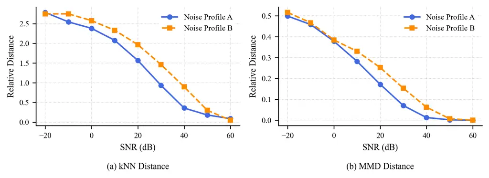

Figure A8: Relative kNN and MMD distances between noisy latent
representations and the clean latent set across different SNR levels.
Both measures decrease monotonically with increasing SNR, indicating
that intermediate samples progressively approach the clean latent
representations.

To quantify latent proximity, we employ two measures: the average
$`k`$-nearest-neighbor (kNN) distance and the Maximum Mean Discrepancy
(MMD) distance (Gretton et al. 2012) between noisy and clean latent
representations. Both measures are reported relative to their
corresponding clean-reference values to account for the variability of
the clean latent set.

| Metric                  | Value       |
| ----------------------- | ----------- |
| Pearson ($`r`$)         | $`-0.9645`$ |
| Spearman ($`\rho`$)     | $`-0.9832`$ |
| Monotonicity violations | $`0/8`$     |

Table A5: Monotonic relationship between SNR and latent proximity.

Fig. A8 shows that both, the relative kNN distance and the MMD distance,
decrease monotonically as SNR increases, indicating that DFSR $`z`$ move
progressively closer to the clean latent set as degradation decreases.
Table A5 further confirms this behavior, yielding strong monotonic
relationships with SNR (Spearman $`\rho=-0.9832`$) without a single
monotonicity violation (i.e., the relative distance for both measures
decreased across the $`8`$ evaluated SNR levels).

These results further support our experimental observation provided in
Section 4.2, that a discriminative latent space serves as a meaningful
descriptor of the underlying Flow-State as the relative distance toward
the clean latent representations shrinks as the degradation decreases.

### A1.8 Speech Enhancement

As mentioned in (12), the DFM training objective is formulated as

```math
\mathcal{L}_{\mathrm{DFM}}(\theta)=\mathbb{E}\left[\left\|v_{\theta}(x_{\zeta},z,x_{0})-v^{\star}\right\|_{2}^{2}\right],
```

where $`z\in\mathbb{R}^{C_{\text{in}}\times T_{\text{orig}}}`$ is the
DFSR derived from a pretrained discriminative encoder
$`\mathcal{E}_{\phi}`$, with $`C_{\text{in}}`$ denoting the number of
output channels of the encoder and $`T_{\text{orig}}`$ the original
number of outputted time frames. The representation is first projected
onto a $`256`$-dimensional feature space using a linear layer and
subsequently linearly interpolated along the temporal axis to match the
input-frame dimension $`T`$ of the velocity network $`v_{\theta}`$.
Here, $`T`$ denotes the number of short-time Fourier transform (STFT)
frames obtained from the degraded observation $`x_{0}`$ using the STFT
configuration specified in Section 4.3. This temporal alignment is
necessary because the pretrained discriminative model might use
different STFT parameters than those used for training the velocity
network of our DFM, resulting in different time resolutions. Formally,
this feature projection (applied along the channel dimension) and
temporal interpolation are defined as

```math
\displaystyle\bar{z} \displaystyle=\mathbf{W}z, \tag{41}
```

```math
\displaystyle c \displaystyle=\text{Interp}(\bar{z},T), \tag{42}
```

where $`\mathbf{W}\in\mathbb{R}^{256\times C_{\text{in}}}`$ is the
learnable weight matrix of the linear projection, resulting in the
projected DFSR $`\bar{z}\in\mathbb{R}^{256\times T_{\text{orig}}}`$. The
function $`\text{Interp}(\cdot)`$ denotes linear interpolation along the
time axis, yielding the aligned conditioning signal
$`c\in\mathbb{R}^{256\times T}`$. For supporting multi-scale
conditioning in the backbone network, these temporal features $`c`$ are
additionally downsampled by a factor of $`2`$ at each successive
residual block using a 1D finite impulse response (FIR) filter as used
originally in the NCSN++ (Song et al. 2021) architecture along the time
dimension. We further condition each residual block of the backbone
NCSN++ (Song et al. 2021) network used in DFM analogously to the
additive conditioning method utilized for time conditioning in (Lee et
al. 2025; Richter et al. 2023) as

```math
h_{\text{out}}=h+\bar{c}, \tag{43}
```

where $`h\in\mathbb{R}^{C_{\text{res}}\times F\times T}`$ denotes the
intermediate feature map of the residual block of the NCSN++ backbone
network with $`C_{\text{res}}`$ channels and $`F`$ frequency bins. The
conditioning signal $`c`$ is broadcasted across the frequency dimension
(denoted as $`\bar{c}`$) before addition to $`h`$.

[TABLE]

Table A6: DFM results on the DNS Challenge synthetic non-reverberant
test set for utilizing discriminative features from different
discriminatively trained SE methods.

### A1.9 Experiment with Different Discriminative Models

To evaluate the generalization capability of our proposed DFM for
different discriminative representations, we extract the intermediate
discriminative features $`z`$ from four diverse SE architectures:
DCCRN (Hu et al. 2021), ULCNet (Shetu et al. 2024), TaylorSENet (Li et
al. 2022), and GCRN (Tan and Wang 2019).

#### DCCRN

The DCCRN (Hu et al. 2021) employs a complex-valued UNet-like symmetric
encoder-decoder architecture with a recurrent bottleneck to estimate a
complex ideal ratio mask. We extract the conditioning information
$`z\in\mathbb{R}^{1024\times T_{\text{orig}}}`$ from the output of the
affine transform following the complex-valued LSTM. We implement the
DCCRN model following the official implementation available at GitHub ³³
3 https://github.com/PoKoHA/Speech˙Enhancement-DCCRN.

#### ULCNet

ULCNet (Shetu et al. 2024) is an ultra-lightweight network designed for
low complexity SE. It utilizes two stage network architecture, where the
first stage enhances the signal magnitude and the second stage refines
the magnitude and the phase jointly. We extract the intermediate
discriminative features from the output of the first stage,
$`z\in\mathbb{R}^{256\times T_{\text{orig}}}`$. We implement the ULCNet
model by adapting the implementation provided at GitHub⁴⁴ 4
https://github.com/narrietal/Fast-ULCNet.

#### TaylorSENet

TaylorSENet (Li et al. 2022) formulates SE as a Taylor series expansion,
decomposing the task into a coarse zeroth-order approximation and a
higher-order refinement stage. We utilize the coarse zeroth-order
estimate, reshaped across the frequency and feature dimensions, as the
discriminative representation
$`z\in\mathbb{R}^{322\times T_{\text{orig}}}`$. We implement the
TaylorSENet model following the official implementation available at
GitHub⁵⁵ 5 https://github.com/Andong-Li-speech/TaylorSENet.

#### GCRN

The GCRN (Tan and Wang 2019) learns a complex-valued spectral mapping
using an encoder-decoder network equipped with gated linear units (GLUs)
to enhance information flow. The real and imaginary parts of the
spectrogram are estimated by separate decoders. We extract the latent
conditioning features $`z\in\mathbb{R}^{1024\times T_{\text{orig}}}`$
directly from the output of the LSTM bottleneck. We implement the DCCRN
model following the official implementation available at GitHub⁶⁶ 6
https://github.com/JupiterEthan/GCRN-complex.

As shown in Table A6, our proposed DFM consistently outperforms both the
time-conditioned CFM (FlowSE) baseline and all standalone discriminative
models in terms of SI-SDR and PESQ, regardless of the chosen
discriminative representation. Specifically, DFM conditioned on GCRN
features achieves the highest SI-SDR ($`20.04`$ dB), while conditioning
on DCCRN yields the highest PESQ ($`2.96`$). A similar trend is also
observed for SCOREQ-based metrics.

[TABLE]

Table A7: Ablation study of DFM on the DNS Challenge synthetic
non-reverberant test set where the discriminative model used for
conditioning is trained with different inputs and STFT configurations.

### A1.10 Impact of Input Features for Discriminative Models on DFM Performance

We also evaluated the impact of different input features and STFT
parameters matched and mismatched scenarios for the discriminative model
used in our proposed DFM. For this purpose, we trained the DCCRN (Hu et
al. 2021) model with three different input features ($`\mu_{\zeta}`$,
$`x_{\zeta}`$, and $`x_{0}`$) using STFT parameters with matched (FFT
length $`510`$, window length $`510`$, hop length $`128`$) and
mismatched (FFT length $`512`$, window length $`400`$, hop length
$`100`$) configurations relative to the original DFM training.

As observed in Table A7, DFM conditioned with features from any of the
evaluated discriminative models trained with different input features
obtains superior performance compared to CFM-related baselines.
Discriminative models trained with $`x_{\zeta}`$ achieve the best SI-SDR
and PESQ of $`19.86`$ and $`2.96`$, respectively. This can be
intuitively understood, as using input $`x_{\zeta}`$ and $`x_{1}`$ as
training targets can be viewed as an ARF training paradigm with a
data-prediction objective for CFM. It’s important to note that
discriminative models trained with $`x_{0}`$ as input also help in
maintaining comparable results for DFM (SI-SDR of $`19.63`$ and PESQ of
$`2.96`$). Furthermore, our experiments suggest that training the
discriminative model with STFT parameters matched to the DFM training
helps improve performance. However, the performance improvement seems to
be minimal, suggesting that DFM relies more on global discriminative
representation alignment than on exact frame-level alignment. These
results highlight that for DFM, no particular training pipeline is
needed for the discriminative model; rather, even an out-of-the-box
discriminative model can be used to infer discriminative Flow-State
representations.

[TABLE]

Table A8: Results on the DNS Challenge non-reverberant test set without
using the noisy signal $`x_{0}`$ for conditioning the velocity network.

### A1.11 Impact of Conditioning the Velocity Network with the Noisy Observed Signal

In this experiment, we study the impact of using the noisy signal, i.e.,
the initial observation, for conditioning the velocity networks in the
CFM and DFM training objectives. As mentioned in (12), the DFM training
objective is formulated as

```math
\mathcal{L}_{\mathrm{DFM}}(\theta)=\mathbb{E}\left[\left\|v_{\theta}(x_{\zeta},z,x_{0})-v^{\star}\right\|_{2}^{2}\right].
```

For this experiment, we omit the noisy signal $`x_{0}`$ from
conditioning of the velocity network. Then, the DFM training objective
can be reformulated as

```math
\tilde{\mathcal{L}}_{\mathrm{DFM}}(\theta)=\mathbb{E}\left[\left\|v_{\theta}(x_{\zeta},z)-v^{\star}\right\|_{2}^{2}\right]. \tag{44}
```

The results shown in Table A8 depict that discarding the noisy signal
from conditioning the velocity network significantly degrades the
performance of all CFM variants. In reference-based objective metrics,
the results appear even worse than the noisy signal itself. However, in
our informal listening tests, we observe that all methods still denoise
sufficiently, yet suffer from an energy mismatch in the generated
signal. This can be attributed to the fact that, without accessing the
original noisy signal, the velocity network cannot faithfully preserve
the energy of the target signal, thereby degrading performance on
reference-based objective metrics. On the contrary, we observe
improvements for the enhanced signals across all methods using DNN-based
intrusive and non-intrusive metrics, which aligns with our informal
subjective listening. Compared to the baseline methods, DFM achieves
superior performance, further proving the effectiveness of the proposed
method.

1: Difficulty estimate $`d`$, max budget $`N_{\max}`$, reverse interval
$`T_{\text{rev}}`$, decay $`\lambda`$, Gaussian noise prefactor
$`\sigma`$, initial noisy observation $`x_{0}`$, velocity network
$`v_{\theta}`$, pre-trained discriminative encoder
$`\mathcal{E}_{\phi}`$

2: Compute
$`w_{i}=\frac{\exp[-\lambda(i-1)]}{\sum_{j=1}^{N_{\max}}\exp[-\lambda(j-1)]}`$
for $`i=1\dots N_{\max}`$

3: Compute cumulative thresholds
$`\tau_{i}=T_{\text{rev}}\sum_{j=1}^{i}w_{j}`$

4: Select $`\widehat{N}\leftarrow\min\{i\in\mathbb{N}:d\leq\tau_{i}\}`$

5: Set $`x^{(0)}=x_{0}+\sigma\epsilon`$ with
$`\epsilon\sim\mathcal{N}(0,1)`$

6: if $`\widehat{N}\leq 1`$ then

7:   $`\gamma\leftarrow T_{\text{rev}}`$

8: else

9:   Compute vector of normalized tail weights $`w^{\text{tail}}`$ of
length $`\widehat{N}-1`$ using decay $`\lambda`$ using (45)

10:   Concatenate
$`\gamma\leftarrow\left[\gamma_{1},d\ w^{\text{tail}}\right]`$

11:   Normalize
$`\gamma\leftarrow\frac{T_{\text{rev}}}{\sum_{n=1}^{\widehat{N}}\gamma_{n}}\gamma`$

12: end if

13: for $`n=0\dots\widehat{N}-1`$ do

14:
  $`x^{(n+1)}\leftarrow x^{(n)}+\gamma_{n}v_{\theta}\left(x^{(n)},\mathcal{E}_{\phi}(x^{(n)}),x_{0}\right)`$

15: end for

16: return $`x^{(\widehat{N})}`$

Algorithm 1 Adaptive Inference

### A1.12 Adaptive DFM Inference

To implement the adaptive inference, we investigate three
Flow-State-related quantities; the DFM interpolation coordinate
$`\zeta`$, iSNR, and gSNR (SNRs are normalized $`\in[0,1]`$ following
Equation (14)), as described in Section 4.3, as the pseudo-sample-level
difficulty estimate $`d\in[0,1]`$ (e.g., $`d=1-\hat{\zeta}`$ or
$`d=1-\text{iSNR}`$), because these Flow-States-indicator quantities
also give some indication of how close an observed sample is to the
clean speech manifold. Furthermore, inspired by the exponential reverse
integration schedule proposed in (Wang et al. 2026), we utilize
exponentially decaying weights to define computational thresholds to
estimate the required NFE for an observed noisy sample $`x_{0}`$.

Let $`N_{\max}\in\mathbb{N}`$ denote the maximum computational budget
(maximum NFE), $`\lambda\in(0,1]`$ the decay parameter controlling the
decision boundaries, and $`T_{\text{rev}}\in(0,1]`$ the reverse interval
representing the starting point of the reverse integration. We calculate
empirically motivated normalized weights $`w_{i}`$ for each step
$`i=1,\ldots,N_{\max}`$ as

```math
w_{i}=\frac{\exp[-\lambda(i-1)]}{\sum_{j=1}^{N_{\max}}\exp[-\lambda(j-1)]}\in(0,1]. \tag{45}
```

The corresponding cumulative thresholds $`\tau_{i}`$, which define the
decision boundaries for a given sample’s difficulty estimate $`d`$, are
given by

```math
\tau_{i}=T_{\text{rev}}\sum_{j=1}^{i}w_{j},\quad i=1,\ldots,N_{\max}. \tag{46}
```

The required NFE $`\widehat{N}`$ is estimated as

```math
\widehat{N}=\min\{i\in\mathbb{N}:d\leq\tau_{i}\}. \tag{47}
```

When $`\widehat{N}\geq 1`$, the step-size schedule
$`\gamma=[\gamma_{1},\gamma_{2},\ldots,\gamma_{\widehat{N}}]`$ is also
constructed using the difficulty estimate $`d`$. The initial step size
is set to $`\gamma_{1}=1-d`$, and the subsequent step sizes
$`\gamma_{n}`$ are chosen according to normalized tail weights
$`w^{\text{tail}}_{n}`$ (see Algorithm 1) computed using the decay
parameter $`\lambda`$

```math
w^{\text{tail}}_{n}=\frac{\exp[-\lambda(n-1)]}{\sum_{j=1}^{\widehat{N}-1}\exp[-\lambda(j-1)]},\quad n=1,\ldots,\widehat{N}-1. \tag{48}
```

The step sizes are defined such that
$`\sum_{n=1}^{\widehat{N}}\gamma_{n}=T_{\text{rev}}`$. The full
procedure is summarized in Algorithm 1. In this work, we employ a
maximum budget of $`N_{\max}=5`$, $`T_{\text{rev}}=1.0`$, and
$`\lambda=0.3`$. We empirically found these parameters based on the
evaluation of a PESQ-based reconstruction error for
$`\mathcal{L}_{\mathrm{rec}}`$, with the threshold set to $`\xi=0.10`$,
as defined in (16).

Example: Consider a maximum budget $`N_{\max}=5`$,
$`T_{\text{rev}}=1.0`$, a decay parameter $`\lambda=0.3`$, and a
difficulty estimate $`d=0.61`$. First, the cumulative decision
thresholds $`\tau_{i}`$ are computed from the normalized weights
$`w_{i}`$, yielding $`\tau=[0.3336,0.5808,0.7639,0.8995,1.0000]`$.
Evaluating the condition $`d\leq\tau_{i}`$ selects an effective budget
of $`\widehat{N}=3`$ since $`0.61\leq 0.7639`$. Next, the step-size
schedule $`\gamma`$ is constructed: the initial step size is set to
$`\gamma_{1}=1-d=0.3900`$, and the remaining budget $`d=0.61`$ is
distributed across the remaining two tail steps using normalized
exponential weights, resulting in
$`\gamma_{\text{tail}}=[0.3504,0.2596]`$. Thus, the final step-size
schedule is $`\gamma=[0.3900,0.3504,0.2596]`$.

### A1.13 Speech Dereverberation

To further evaluate the generalization capabilities of DFM across
various SE tasks, we examine speech dereverberation, which relies on a
convolutive signal model

```math
x_{0}=x_{1}*g, \tag{49}
```

where $`*`$ denotes the convolution operator, $`g`$ represents the room
impulse response, and $`x_{1}`$ represents the dry speech. We adopt the
same training objective for DFM as defined in (12)

```math
\mathcal{L}_{\mathrm{DFM}}(\theta)=\mathbb{E}\left[\left\|v_{\theta}(x_{\zeta},z,x_{0})-v^{\star}\right\|_{2}^{2}\right],
```

where $`z=\mathcal{E}_{\phi}(x_{\zeta})`$ is derived from a pretrained
encoder $`\mathcal{E}_{\phi}`$ of a discriminative speech
dereverberation model.

#### Training Details

We use the clean speech from the DNS Challenge dataset. We simulated the
reverberated signals using the pyroomacoustics⁷⁷ 7
https://github.com/LCAV/pyroomacoustics Python package with $`T_{60}`$
ranging from $`0.3`$ to $`1\text{ s}`$, following a publicly available
simulation script⁸⁸ 8
https://github.com/sp-uhh/deep-non-linear-filter/blob/main/src/data/data˙gen˙var˙pos.py
with default room configurations for single-microphone setups. We
simulated a total of $`100`$ hours of training data and an $`8`$-hour
disjoint validation dataset. We first train a discriminative DCCRN model
using the same configuration as discussed above in Section A1.8 to
estimate the dry speech $`x_{1}`$. In the next step, we train the DFM
model with the same configurations as stated above for $`600\text{k}`$
steps.

#### Results

We evaluate the proposed DFM against the baseline DCCRN and CFM models.
For evaluation, we use the DNS Challenge reverberant synthetic test set
(Reddy et al. 2020) and the clean reference from the corresponding DNS
Challenge non-reverberant synthetic test set (Reddy et al. 2020) as the
target signal. The results shown in Table A9 depict that, for the
dereverberation task, DFM also outperforms or achieves comparable
results to the baseline CFM method. This demonstrates the
generalizability of the proposed DFM method to other SE tasks and
non-additive distortions.

It is important to note that, in this experiment, the performance
gains—at least with respect to the SCOREQ metric; are statistically
negligible. These results can be intuitively explained by the inferior
performance of the discriminative DCCRN model, and can be further
related to Proposition 4 regarding the approximation of the Flow-State.
The inferior performance of the discriminative model causes DFSR to
diverge from the true Flow-State, hence, resulting in only marginal
gains for DFM. Furthermore, estimating dry speech with a mask-based
method like DCCRN is inherently difficult; therefore, we hypothesize
that with a better-defined training objective or a better discriminative
model without masking, performance can be improved, allowing the true
benefits of DFM to be realized for this speech dereverberation task.

[TABLE]

Table A9: Results on the DNS Challenge reverberant test set for a speech
dereverberation task.


Figure A9: Architecture of the MNIST and Fashion-MNIST Image Classifier.

### A1.14 Image Denoising

In our Image denoising experiment, we utilize an interpolation-based
signal model, parameterizing (10) with $`\alpha=1-\eta`$ and
$`\beta=\eta`$, resulting in

```math
x_{0}=(1-\eta)x_{1}+\eta\nu, \tag{50}
```

where $`\nu\sim\mathcal{N}(0,I)`$ denotes standard Gaussian noise and
$`\eta\in[0,1]`$ is a scaling parameter.

For this experiment, we utilize the MNIST (Deng 2012) and Fashion-MNIST
(Xiao et al. 2017) datasets. We first train a discriminative classifier
model to predict the image label and subsequently train a model with the
proposed DFM and CFM-based baselines.

#### Image Classifier Architecture:

The model employs a lightweight convolutional encoder that maps an input
degraded image $`x_{0}\in\mathbb{R}^{1\times 28\times 28}`$ to a latent
representation $`z_{f}\in\mathbb{R}^{e_{f}}`$ and outputs corresponding
$`10`$-class prediction logits. As illustrated in Fig. A9, the encoder
begins with a convolutional layer consisting of a $`3\times 3`$
convolution that increase the input channels from $`1`$ to $`24`$,
followed by batch normalization and a SiLU activation. The resulting
representation is processed by four depthwise-separable convolutional
blocks with channel dimensions $`24\to 32\to 48\to 64\to 80`$.
Alternating strides of $`1`$ and $`2`$ progressively reduce the spatial
resolution while increasing the channel capacity. Each block comprises a
$`3\times 3`$ depthwise convolution, batch normalization, and SiLU
activation, followed by a $`1\times 1`$ pointwise convolution, batch
normalization, and SiLU activation. After global adaptive average
pooling, the obtained features are flattened and passed through a
projection head consisting of a linear layer from $`80`$ to $`128`$
dimensions, a SiLU activation, dropout, a final linear projection to the
latent representation $`z\in\mathbb{R}^{e_{f}}`$ dimensions, and a
separate linear classification head maps $`z_{f}`$ to the $`10`$-class
prediction logits. The model has in total $`41.5`$k parameters.

#### Classifier Training

We train the image classifier for $`16`$ epochs using a batch size of
$`128`$, a learning rate of $`10^{-3}`$, a weight decay of $`10^{-4}`$,
and the Adam optimizer. The models are trained independently on the
MNIST and Fashion-MNIST datasets.

#### Results

The classifier achieves an accuracy of $`75.7\%`$ on the MNIST test set
and $`68.9\%`$ on the Fashion-MNIST test set, evaluated on the generated
degraded samples using the signal model described in (50). We further
analyze the properties of the discriminative latent features $`z_{f}`$
on the MNIST test set. As observed in Figure A10 (a), the latent
representation exhibits clear semantic structure corresponding to class
labels. We also observe another prominent cluster representing heavily
degraded samples, where the model struggles to extract sufficient
structure. This intuitively suggests that the discriminative latent
representation preserves the Flow-State, smoothly converging toward the
semantic structure from the noisy observation as degradation decreases.
Similarly, Figure A10(b) illustrates that the MMD distance between the
latent features and their corresponding class-wise clean features
decreases as the degradation scaling factor $`\eta`$ is reduced,
resulting in the discriminative latent features converging toward the
clean feature manifold. This experiment validates our discriminative
Flow-State hypothesis using a classification model for the image
denoising task.

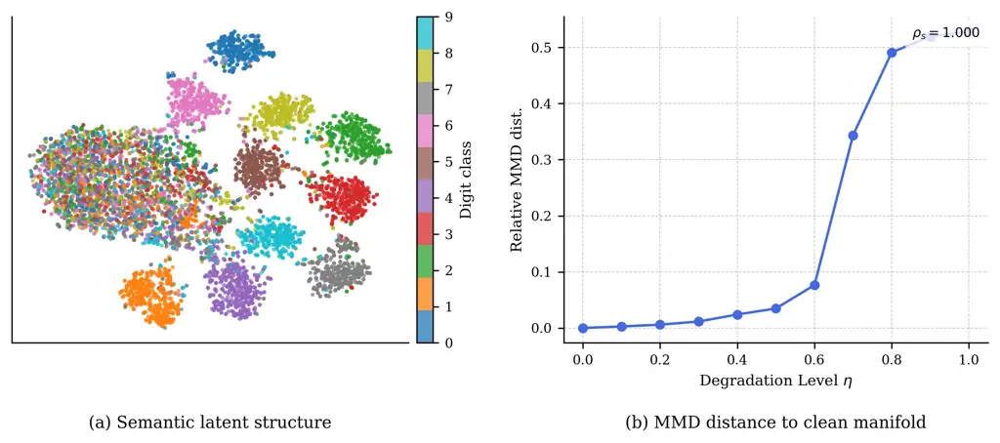

Figure A10: Semantic latent structure and latent restoration geometry.

#### Discriminative Flow Matching for Image Denoising

As described in Section 3, the conditional probability path is defined
by

```math
\mu_{\zeta}=\zeta x_{1}+(1-\zeta)x_{0},\qquad x_{\zeta}=\mu_{\zeta}+\sigma_{\zeta}\epsilon
```

and the DFM training objective is formulated as

```math
\mathcal{L}_{\mathrm{DFM}}(\theta)=\mathbb{E}\left[\left\|v_{\theta}(x_{\zeta},z,x_{0})-v^{\star}\right\|_{2}^{2}\right],
```

where $`x_{0}`$ is the initial observation of a degraded image and
$`z=\mathcal{C}_{\psi}(x_{\zeta}),`$ is the Discriminative Flow-State
Representation derived from the image classifier $`\mathcal{C}_{\psi}`$,
parameterized by $`\psi`$.

#### Velocity Network Architecture

The velocity network takes the intermediate state $`x_{\zeta}`$ and
degraded image $`x_{0}`$, with
$`[x_{\zeta},x_{0}]\in\mathbb{R}^{2\times 28\times 28}`$ as input, and
approximates the velocity field $`v^{*}`$. The network first applies a
$`3\times 3`$ input convolution that projects the two-channel input to a
hidden-dimensional feature map $`h`$. In parallel, a conditioning
feature $`c`$, which may denote time $`t`$, class labels, or DFSR $`z`$,
is transformed by a linear projection as shown in Fig. A11. The
resulting embedding is added to the intermediate feature representation
$`h`$. The conditioned features are then processed by two residual
convolutional blocks, each consisting of alternating SiLU activations
and $`3\times 3`$ convolutions with an identity skip connection.
Finally, a SiLU activation followed by a $`3\times 3`$ output
convolution projects the hidden representation to the vector field
$`v^{*}`$. For keeping the parameter counts comparable, for the DFM
model we use a feature dimension $`64`$ for hidden feature space $`h`$,
instead of a $`80`$ dimensional feature space used for other baselines,
namely CFM, CFM+Class cond. and CFM+Latent Cond. This results in a total
of $`232`$k parameters including the overhead parameters of the image
classifier for DFM compared to $`255`$-k parameters for the baseline
CFM.

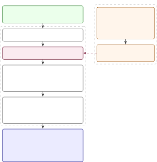

Figure A11: Architecture of the velocity network for image denoising
task.

#### Training Details

We train DFM and all baseline models for $`16`$ epochs using a batch
size of $`128`$, a learning rate of $`2\times 10^{-4}`$, a weight decay
of $`10^{-4}`$, and the Adam optimizer. The models are trained
independently on the MNIST and Fashion-MNIST datasets.

#### Results

As shown in Section 4.4, DFM consistently outperforms the baseline
methods across all degradation levels for both the MNIST and
Fashion-MNIST datasets. We further evaluate adaptive inference for the
image denoising task. To this end, we train a small DFM interpolation
coordinate $`\zeta`$ predictor comprising only three linear layers. We
employ the adaptive inference algorithm discussed in Appendix A1.12
using a uniform Euler solver. As illustrated in Figure A12, adaptive
inference performs effectively for image denoising: the algorithm
assigns a higher number of function evaluations (NFE) to heavily
degraded samples and a lower NFE to less degraded samples. Overall, it
matches the performance of the fixed budget scheduler ($`\acs{NFE}=50`$)
while significantly reducing the average computational budget.

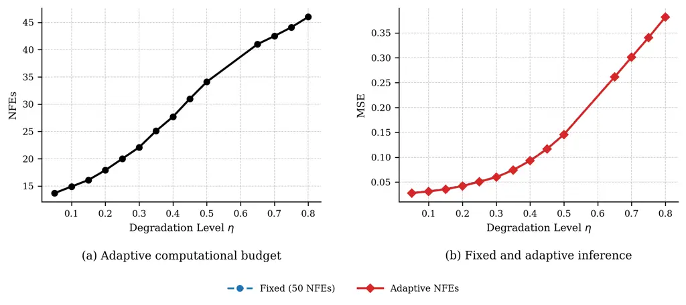

Figure A12: Adaptive inference with uniform Euler solver for image
denoising on the MNIST dataset.

### A1.15 Statistical Analysis of the Results

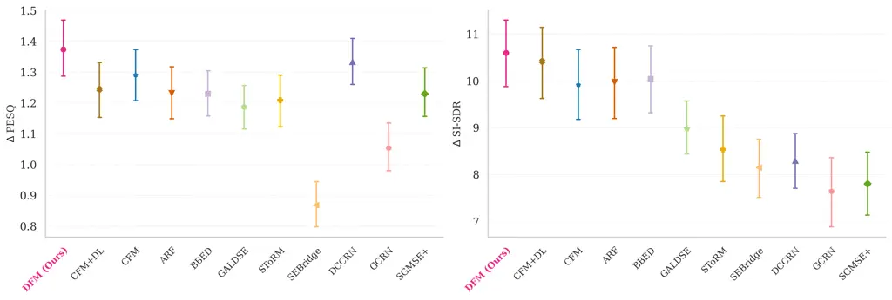

Figure A13: PESQ and SI-SDR improvements along with their respective
$`95\%`$ confidence intervals for the compared methods presented in
Table 2.

| Baseline Model | PESQ          |             | SI-SDR (dB)   |             |
| -------------- | ------------- | ----------- | ------------- | ----------- |
|                | Baseline Mean | $`p`$-value | Baseline Mean | $`p`$-value |
| DCCRN          | $`2.91`$      | $`0.300`$   | $`17.36`$     | $`<0.001`$  |
| GCRN           | $`2.63`$      | $`<0.001`$  | $`16.71`$     | $`<0.001`$  |
| BBED           | $`2.81`$      | $`<0.001`$  | $`19.10`$     | $`<0.001`$  |
| SGMSE+         | $`2.81`$      | $`<0.001`$  | $`16.86`$     | $`<0.001`$  |
| SToRM          | $`2.70`$      | $`<0.001`$  | $`17.56`$     | $`<0.001`$  |
| GALDSE         | $`2.77`$      | $`<0.001`$  | $`18.04`$     | $`<0.001`$  |
| SEBridge       | $`2.45`$      | $`<0.001`$  | $`17.21`$     | $`<0.001`$  |
| CFM            | $`2.86`$      | $`<0.001`$  | $`18.99`$     | $`<0.001`$  |
| CFM+DL         | $`2.87`$      | $`<0.001`$  | $`19.47`$     | $`<0.001`$  |
| ARF            | $`2.82`$      | $`<0.001`$  | $`19.04`$     | $`<0.001`$  |

Table A10: Statistical significance test results (paired Wilcoxon
signed-rank test) comparing our proposed DFM method (PESQ: $`2.96`$,
SI-SDR: $`19.63\text{ dB}`$) against various baseline models.

We further validate the performance gains of the proposed DFM method
presented in Table 2 , with paired Wilcoxon signed-rank tests against
all baseline models. The statistical analysis reveals, in terms of
SI-SDR, DFM achieves consistent improvements ($`p`$-value\<0.001) over
every competing model. In terms of PESQ, DFM likewise demonstrates
statistically significant superiority ($`p`$-value\<0.001) against all
baselines except DCCRN. However, as stated earlier, DCCRN performs much
inferiorly in terms of SI-SDR. Overall, the statistical evaluation
confirms that DFM ’s performance enhancements are consistent,
non-random, and highly robust across evaluation metrics. In Fig. A13, we
show the PESQ and SI-SDR improvements of the competing methods on the
DNS Challenge non-reverberant test set presented in Table 2, along with
their corresponding confidence intervals, illustrating the consistent
and robust performance of DFM.
