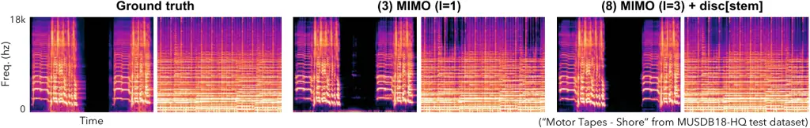

# Iterative Audio Separation with Mixture Consistency via MIMO Model Extension

###### Abstract

This paper proposes a general framework for stable and effective
iterative audio separation with mixture consistency by extending source
separation models to a multi-input multi-output (MIMO) configuration. In
the field of audio separation, mixture consistency is an essential
property for many applications that require accurate phase and timbral
information of target sources. While iterative approaches such as
diffusion models achieve perceptually superior results in speech
enhancement or user-guided target source separation tasks, most existing
methods focus on single-step separation with a single-input
single-output (SISO) or single-input multi-output (SIMO) configuration
through architectural improvements, since mixture-consistent audio
separation is generally regarded as a regression problem that admits a
unique solution. By extending these architectures to a MIMO
configuration, we introduce iterative prediction without compromising
the architectural advantages or the characteristics of mixture
consistency. We conduct a comprehensive ablation study of combining the
framework with discriminators and extending it to a generative model.
Experimental results demonstrate significant performance improvements
when applying the proposed framework to state-of-the-art separation
models. The code and pretrained model weights are available at
[https://github.com/SonyResearch/mimo-audio-separation](https://github.com/SonyResearch/mimo-audio-separation).

## 1 Introduction

Audio source separation is one of the fundamental tasks in music
information retrieval (MIR) and audio signal processing, with a wide
range of applications including music production, broadcasting, and
audio dataset construction. Given a mixture signal, the objective is to
decompose it into its constituent source signals, an inherently
ill-posed problem that has been studied extensively.

Recently, deep learning has driven remarkable progress in this field.
Generative frameworks including diffusion-based methods have achieved
perceptually superior results in tasks such as speech
enhancement/separation \[1, 2, 3, 4, 5, 6\], user-guided target source
extraction \[7, 8\], and generative music separation \[9, 10\]. By
leveraging their ability to model complex prior distributions over
target sources, these models produce natural-sounding outputs, even
under challenging acoustic conditions. The iterative inference mechanism
is one of the key contributors to their success, allowing the model to
progressively refine its estimates over multiple denoising steps.

Despite this progress, audio separation with mixture consistency, where
the separated sources are constrained to sum back to the original
mixture, remains essential for many practical applications such as
stem-based remixing, music restoration, and format conversion. In these
tasks, large deviations from the original mixture are undesirable and
the phase and timbral characteristics of each source must be precisely
preserved to avoid audible artifacts in downstream processing. Beyond
these conventional applications, it has also become an important tool
for constructing training data for generative models. The proliferation
of powerful music generation and editing systems has created a growing
demand for high-quality multi-stem datasets. Since large-scale
multi-track recordings with ground-truth stems are scarce, source
separation is increasingly employed to derive pseudo-stem data from
existing mixed recordings \[11, 12, 13, 14\], enabling the training of
controllable and steerable generative systems at scale.

MIMO model extension

Figure 1: MIMO model extension.

Overview of the proposed framework for iterative audio separation

Figure 2: Overview of the proposed framework for iterative audio
separation. (A 3-source case)


Figure 3: Mask weighted prediction for spectral masking-based methods.

Since mixture-consistent audio separation is regarded as a regression
problem that admits a unique solution, most existing methods focus on
single-step inference using single-input single-output (SISO) or
single-input multi-output (SIMO) architectures, where a mixture is
processed in a single forward pass to predict target sources \[15, 16,
17, 18, 19, 20\]. These methods have benefited greatly from advances in
neural network design, yet they leave the power of iterative refinement
largely untapped. However, incorporating iterative refinement into
mixture-consistent separation is non-trivial. Diffusion-based models
pursue a distributional objective through iterative sampling, which is
fundamentally incompatible with enforcing strict mixture consistency at
every step. Naively running multi-round inferences with existing
SISO/SIMO models also fails because these models cannot correct their
own errors in their previous outputs, leading to error accumulation and
over-separation rather than genuine refinement.

To bridge this gap, this paper proposes a general framework for stable
and effective iterative audio separation with mixture consistency by
extending separation models to a multi-input multi-output (MIMO)
configuration (Fig. 1). The key insight is that by feeding back all the
current source estimates as inputs of the next step, the model can
mutually refine all sources while preserving mixture consistency at each
step. This extension requires only minor modifications to existing
architectures, making it broadly applicable to arbitrary separation
models. We further explore how this framework interacts with adversarial
training and how it can be extended toward a generative formulation.
Experimental results on music source separation tasks demonstrate
consistent and significant improvements over strong single-step
baselines.

## 2 Related work

Iterative source separation has been studied most explicitly in the
context of multi-speaker speech separation. Wang et al. \[21\]
incorporate iterative phase reconstruction into an end-to-end trainable
architecture and impose mixture reconstruction constraints during the
iterative process. More recently, Scheibler et al. \[5\] formulate
speech separation as a constrained flow-matching problem and enforces
mixture consistency throughout the generative process.

Another line of work explores iterative refinement without explicitly
enforcing mixture consistency. Koyama et al. \[22\] introduce deep
equilibrium models into music source separation and show that implicit
fixed-point-style computation is effective for separation. Bai et al.
\[23\] adopt an explicit two-stage sequential architecture in which the
second stage predicts residual mappings to recover details missed by the
first-stage estimate. Zang et al. \[24\] show that a pretrained one-step
separator can be iteratively reused at inference time without additional
training, leading to improved separation quality. While these methods
support the general view that source separation can benefit from
iterative inference, they do not jointly refine all sources at each
step, which can make the refinement process more susceptible to
over-separation and limit the gains obtainable from further iteration.

## 3 Proposed framework

We propose a general framework for iterative audio separation with
mixture consistency based on a multi-input multi-output (MIMO) extension
of separation architectures (Fig. 2). The core idea is to feed back the
current source estimates as inputs to the model at each iteration,
enabling the model to progressively refine its predictions while
preserving mixture consistency throughout.

### 3.1 MIMO Architecture for Iterative Separation

Let $`\mathbf{x}\in\mathbb{R}^{C\times T}`$ denote the mixture signal
with $`C`$ channels and $`T`$ time samples, and let
$`\mathbf{s}_{k}\in\mathbb{R}^{C\times T}`$ ($`k=1,\ldots,K`$) denote
the $`k`$-th source, satisfying
$`\mathbf{x}=\sum_{k=1}^{K}\mathbf{s}_{k}`$. Conventional models take
the mixture as input and estimate sources in a single forward pass:
$`(\hat{\mathbf{s}}_{1},\ldots,\hat{\mathbf{s}}_{K})=f(\mathbf{x})`$.

In the proposed MIMO framework, the model receives all the source
estimates from the previous iteration as inputs. At iteration $`i`$, the
update rule becomes

```math
(\hat{\mathbf{s}}_{1}^{(i)},\ldots,\hat{\mathbf{s}}_{K}^{(i)})=f\!\left(i;\,\hat{\mathbf{s}}_{1}^{(i-1)};\,\ldots;\,\hat{\mathbf{s}}_{K}^{(i-1)}\right), \tag{1}
```

where the time step $`i`$ is explicitly provided as a condition to the
model. Since the input to the first iteration must also satisfy mixture
consistency, the source inputs are initialized as
$`\hat{\mathbf{s}}_{k}^{(0)}=\mathbf{x}/K`$ for all $`k`$.

Because the extension amounts only to widening the input and output
channel dimensions from $`C`$ to $`K\cdot C`$, virtually any SISO or
SIMO architecture can be converted to MIMO without significant
structural modification beyond adapting the input and output modules,
which makes the proposed framework broadly applicable to
state-of-the-art models. While some models directly output the estimated
signals \[16, 20\], another common type of model works on the complex
spectrogram, predicts a complex mask for each source, and applies it to
the mixture spectrogram \[17, 18, 19\]. For such mask-based models, the
MIMO extension is realized by predicting a separate mask for each
combination of an input and an output estimate, and computing each
output estimate as a weighted sum of all inputs using the predicted
masks (Fig. 3). Specifically, the $`k`$-th output source spectrum at
iteration $`i`$ is given by

```math
\hat{\mathbf{S}}_{k}^{(i)}=\sum_{j=1}^{K}\mathbf{m}_{k,j}^{(i)}\odot\hat{\mathbf{S}}_{j}^{(i-1)}, \tag{2}
```

where $`\mathbf{m}_{k,j}^{(i)}`$ is the mask for the $`k`$-th output
source and the $`j`$-th input source, and
$`\hat{\mathbf{S}}_{j}^{(i-1)}`$ is the spectral representation of the
$`j`$-th input source from the previous iteration.

### 3.2 Mixture Consistency Projection

Mixture consistency is enforced after each iteration by mixture
consistency projection \[25, 26\],

```math
\hat{\mathbf{s}}_{k}^{(i)}\leftarrow\hat{\mathbf{s}}_{k}^{(i)}+\frac{1}{K}\!\left(\mathbf{x}-\sum_{j=1}^{K}\hat{\mathbf{s}}_{j}^{(i)}\right). \tag{3}
```

Beyond enforcing the constraint strictly, this projection also restricts
the search space of possible signals the model must predict at each
step, thereby stabilizing training and improving separation performance.

### 3.3 Discriminators

Discriminators can optionally be incorporated into the framework to
further enhance the separation performance. We investigate two
complementary types.

Stem-wise discriminator: A stem-wise discriminator is trained to
distinguish each estimated signal $`\hat{\mathbf{s}}_{k}^{(i)}`$ from
the corresponding ground-truth signal $`\mathbf{s}_{k}`$. It captures
the nuances of individual stems and has been reported to contribute to
improved separation performance \[27, 28\].

Multi-stem discriminator: A multi-stem discriminator is trained to
distinguish a set of estimated signals
$`\{\hat{\mathbf{s}}_{k}^{(i)}\}`$ from a set of ground-truth signals
$`\{\mathbf{s}_{k}\}`$. This is functionally equivalent to the
context-based discriminator in \[29\].

While a feature-matching loss is commonly used in adversarial training
for generative tasks, we found empirically that incorporating this loss
causes training instability in our framework. Therefore, only the
adversarial loss from each discriminator is used in this paper.

### 3.4 Generative Extension

While the core MIMO framework is inherently discriminative, it can be
extended to incorporate generative characteristics by introducing
stochastic refinement through noise perturbation during training and
inference. The motivation is to enable the model to explore a
distribution of plausible separations rather than converging to a single
deterministic solution, which can help escape local optima and improve
robustness to challenging acoustic conditions.

Specifically, we perturb the input mixture with random noise while
preserving mixture consistency through the zero-sum noise scheme
proposed in \[5\]. This constructs noise vectors
$`\boldsymbol{\epsilon}_{k}`$ satisfying
$`\sum_{k=1}^{K}\boldsymbol{\epsilon}_{k}=\mathbf{0}`$, ensuring that
the perturbed input remains mixture-consistent. The model is then
trained to denoise the perturbed mixture back to clean sources, which is
analogous to the reverse process in diffusion models.

To further leverage prior information from the clean mixture
$`\mathbf{x}`$, we supply it as an additional input at every iteration,
as depicted in Fig. 2. This extension enables the iterative refinement
process to combine the generative benefits with the discriminative
constraint of mixture consistency.

### 3.5 Input Audio Normalization

To improve training stability and overall performance, the input mixture
is peak-normalized before being fed into the model. Specifically, given
the mixture $`\mathbf{x}`$, the input to the model
($`\tilde{\mathbf{x}}`$) is computed as

```math
\tilde{\mathbf{x}}=\mathbf{x}/\mathrm{scale},\quad\mathrm{scale}=\max_{t}|\mathbf{x}[t]|. \tag{4}
```

At inference time, the output estimates are rescaled back to the
original amplitude by multiplying by $`\mathrm{scale}`$.

|                              |            |       |       |       |      |       |               |       |       |      |
| ---------------------------- | ---------- | ----- | ----- | ----- | ---- | ----- | ------------- | ----- | ----- | ---- |
|                              |            | Vocal |       |       |      |       | Accompaniment |       |       |      |
| Variant                      | Params (M) | SDR   | SIR   | SAR   | LMD  | LPR   | SDR           | SIR   | SAR   | LMD  |
| \(1\) SISO (BS-RoFormer)     | 12.1       | 10.38 | 19.12 | 11.74 | 1.57 | -44.7 | 21.92         | 35.51 | 22.94 | 0.39 |
| \(2\) SIMO                   | 12.1       | 10.41 | 19.91 | 11.53 | 1.48 | -41.6 | 20.98         | 34.72 | 22.02 | 0.39 |
| \(3\) MIMO (I=1)             | 16.1       | 10.36 | 19.70 | 11.70 | 1.57 | -45.2 | 20.61         | 33.45 | 21.70 | 0.39 |
| \(4\) 3 + disc\[stem\]       | 16.1 (1.0) | 10.45 | 19.68 | 11.77 | 1.31 | -45.3 | 21.74         | 34.78 | 22.78 | 0.32 |
| \(5\) 3 + disc\[multi\]      | 16.1 (0.5) | 10.37 | 19.76 | 11.59 | 1.53 | -44.9 | 21.64         | 35.09 | 22.78 | 0.37 |
| \(6\) 3 + disc\[stem,multi\] | 16.1 (1.5) | 10.36 | 19.64 | 11.63 | 1.40 | -44.2 | 21.63         | 35.39 | 23.16 | 0.33 |
| \(7\) MIMO (I=3)             | 16.3       | 10.72 | 20.84 | 11.89 | 1.59 | -45.4 | 22.07         | 35.97 | 22.90 | 0.39 |
| \(8\) 7 + disc\[stem\]       | 16.3 (1.0) | 11.05 | 21.29 | 12.14 | 1.23 | -43.4 | 22.86         | 37.08 | 23.77 | 0.32 |
| \(9\) 7 + disc\[stem,multi\] | 16.3 (1.5) | 10.62 | 20.57 | 11.79 | 1.31 | -41.4 | 21.93         | 35.89 | 23.01 | 0.34 |
| \(10\) 8 + generative        | 20.2 (1.0) | 11.00 | 21.35 | 12.16 | 1.23 | -47.5 | 23.21         | 37.47 | 24.26 | 0.32 |

Table 1: Evaluation results of ablation study. Higher SDR/SIR/SAR and
lower LMD/LPR represent better performance. The parameter counts in
($`\cdot`$) denote those of discriminators, while the main parameter
counts exclude discriminators. Bold and underline indicate the best and
second-best values, respectively.



Figure 4: Samples of vocal-accompaniment separation from the ablation
study.

### 3.6 Loss Function

The loss at iteration $`i`$ combines a reconstruction term and an
adversarial term:

```math
\mathcal{L}_{i}=\mathcal{L}_{i}^{\text{rec}}+\lambda_{\text{adv}}\,\mathcal{L}_{i}^{\text{adv}}, \tag{5}
```

where $`\mathcal{L}_{i}^{\text{adv}}`$ is the average loss over all
discriminators. The reconstruction loss combines L1 loss in both the
time domain and the complex spectral domain, following \[17, 18\].

```math
\mathcal{L}_{i}^{\text{rec}}=\frac{1}{K}\sum_{k=1}^{K}\left(\|\hat{\mathbf{S}}_{k}^{(i)}-\mathbf{S}_{k}\|_{1}+\lambda_{\text{wav}}\|\hat{\mathbf{s}}_{k}^{(i)}-\mathbf{s}_{k}\|_{1}\right), \tag{6}
```

where $`\mathbf{S}_{k}`$ denotes the short-time Fourier transform (STFT)
representation of $`\mathbf{s}_{k}`$. To encourage monotonic refinement
across iterations, the final training objective accumulates losses over
all $`I`$ iterations with per-iteration weights $`\lambda_{i}`$:

```math
\mathcal{L}=\sum_{i=1}^{I}\lambda_{i}\,\mathcal{L}_{i}. \tag{7}
```

### 3.7 Relationship to Fixed-Point Iteration

The iterative update in Eq. (1) can be interpreted as approximately
solving the fixed-point equation
$`f\!\left(\{\mathbf{s}_{k}\}_{k=1}^{K}\right)=\{\mathbf{s}_{k}\}_{k=1}^{K}`$,
where the model is trained to converge to a self-consistent solution
that satisfies mixture consistency. Koizumi et al. \[30\] explored a
related idea in the context of neural vocoding, where fixed-point-style
iterative training enables a lightweight model to achieve high-quality
waveform synthesis in only a small number of refinement steps. The
proposed framework brings this principle to mixture-consistent source
separation, combining the inductive bias of fixed-point training with
the architectural strengths of modern separation models.

## 4 Experiments

### 4.1 Dataset

We use the MUSDB18-HQ \[31\] dataset, which consists of 150
professionally produced stereo music tracks with four annotated sources:
vocals, bass, drums, and other. The dataset is split into 100 tracks for
training and 50 tracks for testing. The audio is provided in
uncompressed format at a sampling rate of 44.1 kHz. For
vocal-accompaniment separation, the accompaniment sound is constructed
by summing the bass, drums, and other sources.

#### 4.1.1 Data augmentation

For each stem in every training sample, we extract an audio segment from
a random position in a random track while avoiding complete silence.
Additionally, we apply channel shuffling, phase inversion, and random
gain variations as augmentations. With a small probability, each stem is
replaced with a silent signal.

#### 4.1.2 Test data preprocessing

The MUSDB18-HQ test data contains undesired artifacts such as small DC
components, floor noise, and leakage from other stems during silent
intervals. Since these artifacts are not relevant to source separation,
including them in evaluation hinders an accurate assessment of
separation performance. To enable more reliable evaluation, we apply the
test data preprocessing proposed in \[32\]. Specifically, each stem is
divided into 1-second segments, and regions where the maximum amplitude
falls below 0.01 are replaced with silence. This approach effectively
removes most artifacts and also enables evaluation during silent
intervals, which are often ignored in previous work.

|           |            |                   |       |       |      |       |               |       |       |      |
| --------- | ---------- | ----------------- | ----- | ----- | ---- | ----- | ------------- | ----- | ----- | ---- |
|           |            | MUSDB18-HQ (test) |       |       |      |       |               |       |       |      |
|           |            | Vocal             |       |       |      |       | Accompaniment |       |       |      |
| Model     | Params (M) | SDR               | SIR   | SAR   | LMD  | LPR   | SDR           | SIR   | SAR   | LMD  |
| BS-R(rep) | 72.2       | 11.92             | 21.75 | 13.07 | 1.51 | -48.2 | 24.54         | 40.15 | 25.47 | 0.37 |
| MIMO BS-R | 71.4 (1.0) | 12.29             | 23.93 | 13.71 | 1.07 | -58.4 | 26.01         | 39.85 | 26.73 | 0.30 |
|           |            | MoisesDB (OOD)    |       |       |      |       |               |       |       |      |
|           |            | 12.15             | 21.89 | 12.96 | 1.27 | -54.4 | 21.27         | 32.58 | 22.08 | 0.43 |
|           |            | 12.44             | 23.82 | 13.09 | 1.10 | -55.7 | 21.40         | 33.97 | 22.09 | 0.34 |

Table 3: Detailed comparison between BS-RoFormer and MIMO BS-RoFormer.

| BS-R  |       | Mel-R |       | BS-R(rep) | MIMO BS-R   |
| ----- | ----- | ----- | ----- | --------- | ----------- |
| 72.2M | 82.8M | 84.2M | 94.8M | 72.2M     | 71.4 (1.0)M |
| 10.78 | 11.02 | 11.21 | 11.60 | 11.40     | 11.62       |

Table 2: Vocal SDR evaluation via museval.

### 4.2 Model Details

We adopt BS-RoFormer \[18\], which is one of the state-of-the-art models
for music source separation, as a backbone model for our ablation study
(Sec. 4.4) and vocal-accompaniment separation (Sec. 4.5). For the MIMO
extension, we increase the number of input channels in the band-split
module by a factor of the number of stems, and implement multi-output
via the multiple mask prediction scheme described in Sec. 3.1. The time
step condition is provided as a learnable embedding prepended to the
input features. For the 4-stem separation experiment (Sec. 4.6), we
adopt SCNet \[20\], which achieves state-of-the-art performance with a
small parameter count for this task. Since SCNet is originally designed
in SIMO format, it can be extended to MIMO by multiplying the input
channel dimension by the number of stems. BS-RoFormer and SCNet variants
are trained for 1 million steps with batch sizes of 96 and 48 using bf16
and fp32 precision, respectively.

Through empirical observation, we found that performance improvements
saturate around 4 iterations. Considering the computational cost, we set
the number of iterations $`I`$ to 3 and 2 for MIMO BS-RoFormer and MIMO
SCNet, respectively. Hyperparameters are configured as follows:
$`\lambda_{\text{adv}}=0.01`$ and $`\lambda_{\text{wav}}=2.0`$. The
per-iteration loss weights $`\lambda_{i}`$ are set to $`i`$ to emphasize
performance in later iterations for monotonic refinement.

For discriminators, we adopt the multi-band discriminator design
from \[33\], which has proven effective in audio compression tasks for
capturing features across a wide frequency range. Both stem-wise and
multi-stem discriminators employ this design with an FFT size of 2048,
hop size of 512, and frequency bands divided into 5 sub-bands.

For inference, we employ overlap-add processing with a hop size of half
the input length. Overlapping regions are blended with linear crossfade
to ensure smooth transitions.

### 4.3 Evaluation Metrics

Source-to-distortion ratio (SDR), source-to-interference ratio (SIR),
and source-to-artifact ratio (SAR) \[34\] are used for evaluation.
Additionally, we compute the log-magnitude distance (LMD) in the STFT
domain \[28\] to evaluate timbral fidelity. These metrics are computed
only on non-silent intervals for each stem.

To evaluate leakage and artifacts in silent intervals, we introduce the
metric proposed in \[32\] as the leakage power ratio (LPR). For each
stem, the median energy of the ground-truth non-silent frames is first
computed as a reference level. Then, for the estimated signal, the
energy of the frames corresponding to silent segments in the
ground-truth signal is computed and divided by the reference level. The
value is converted to decibels to yield the LPR metric. A lower LPR
indicates less leakage and artifacts in the silent intervals of the
estimated signal. For the "accompaniment" stem, which contains very few
or no silent intervals, the LPR metric is not computed.

For each track, metrics are computed by dividing the audio into 1-second
segments and taking the median of the metrics across all segments. The
final metrics are obtained by averaging the metrics across all tracks.

SDR over iterations

Figure 5: SDR over iterations.

|                |            |       |       |       |      |       |       |       |       |       |       |       |      |
| -------------- | ---------- | ----- | ----- | ----- | ---- | ----- | ----- | ----- | ----- | ----- | ----- | ----- | ---- |
|                |            | Vocal |       |       | Bass |       |       | Drums |       |       | Other |       |      |
| Model          | Params (M) | SDR   | SIR   | SAR   | SDR  | SIR   | SAR   | SDR   | SIR   | SAR   | SDR   | SIR   | SAR  |
| SCNet          | 10.6       | 10.39 | 18.15 | 11.77 | 9.10 | 15.64 | 12.47 | 11.32 | 19.58 | 12.72 | 7.21  | 12.81 | 9.58 |
| MIMO SCNet     | 10.6 (0.5) | 10.57 | 18.62 | 11.92 | 9.80 | 16.98 | 13.65 | 11.73 | 20.39 | 12.94 | 7.63  | 13.61 | 9.75 |
| MIMO SCNet-gen | 10.6 (0.5) | 10.72 | 18.75 | 12.05 | 9.73 | 16.86 | 13.29 | 11.61 | 20.08 | 12.92 | 7.61  | 13.46 | 9.67 |

Table 4: Evaluation results of 4-stem separation.

### 4.4 Ablation Study

To validate the effectiveness of the proposed framework and its
components including iterative prediction, discriminators, and
generative extension, we first conduct a comprehensive ablation study on
vocal-accompaniment separation. We start with a basic comparison of
SISO, SIMO, and MIMO (I=1) to isolate the effects of the input-output
format. We then evaluate discriminators in isolation using MIMO (I=1),
followed by a final comparison combining discriminators and generative
extension with MIMO (I=3). The SISO variant corresponds to the original
BS-RoFormer baseline. The additional parameters in MIMO variants arise
solely from the increased number of mask predictors; the core
Transformer architecture remains identical across all variants
(Transformer dimension/heads: 192/8, blocks: 4, time/frequency module
depth: 1) and all variants are trained with 4-second audio input.

Table 1 shows the overall results of the ablation study. Regarding
1-step prediction, SISO, SIMO, and MIMO tend to yield similar
performance across most metrics. This suggests that, even in the SISO
setting, separating a 2-source mixture implicitly estimates the residual
audio alongside the target, so the differences between output
configurations have limited impact. Regarding the effect of
discriminators, the stem-wise discriminator consistently improves
performance whereas adding the multi-stem discriminator tends to degrade
performance. This pattern holds consistently for both 1- and 3-step
cases, suggesting that the multi-stem discriminator conflicts with the
separation objective, hindering rather than helping the model.

The largest gains come from iterative prediction. Iterative prediction
yields consistent improvements across all metrics, and further combining
it with the stem-wise discriminator delivers better performance. The
generative variant reduces artifacts in the accompaniment source,
showing additional benefits for overall separation performance. Fig. 4
shows separation samples of the single-step MIMO variant (3) and the
iterative MIMO variant (8). Iterative prediction with the discriminator
effectively reduces accompaniment leakage in the vocal source while
mitigating the loss of high-frequency components in the accompaniment.

### 4.5 Vocal-Accompaniment Separation

We conduct comparative experiments on larger-scale models for
vocal-accompaniment separation. While the generative variant shows
superior performance, we use the predictive variant (8) here to more
directly evaluate the performance of the iterative framework. As
baseline comparisons, we reference results for BS-RoFormer (’BS-R’) and
Mel-RoFormer (’Mel-R’) from \[19\]. To ensure fair comparison, we also
train BS-RoFormer from scratch using the same training pipeline and
input audio normalization employed in this work, denoted as ’BS-R(rep)’.
The proposed framework (’MIMO BS-R’) adopts the same Transformer
architecture as the 72.2M BS-RoFormer baseline, but adjusts the hidden
feature dimensions in the mask predictors from the original scale of 4
to 1.5 to maintain a comparable parameter size, accounting for the
increased number of mask predictors. These variants are trained with
8-second audio input, consistent with the original papers.

Table 2 shows the SDR comparison with published results. For this
comparison, we compute SDR using museval \[35\] without test data
preprocessing, consistent with the original papers, with final scores
computed as the median across all tracks. The results demonstrate
substantial improvements from the proposed MIMO framework. MIMO BS-R
achieves 11.62 dB, a 0.22 dB improvement over BS-R(rep). This gain is
notable given that the baseline BS-R(rep) already shows improved
performance relative to the published BS-R result (10.78 dB), suggesting
that our training procedure—including data augmentation and input audio
normalization— contributes to the overall performance. When compared
against published results for larger models, MIMO BS-R achieves
competitive performance with fewer parameters, underscoring the
efficiency of the proposed approach.

Table 3 provides a detailed comparison between BS-RoFormer and MIMO
BS-RoFormer across all evaluation metrics. We additionally evaluate on
MoisesDB \[36\] comprising 240 multi-stem tracks as an out-of-domain
(OOD) dataset to assess generalization performance. The results show
that MIMO BS-RoFormer consistently outperforms the BS-RoFormer baseline
across all metrics for both vocal and accompaniment. On the OOD dataset,
MIMO BS-RoFormer demonstrates substantial improvements in vocal SDR,
SIR, and LMD, while maintaining comparable performance on other metrics.
Fig. 5 shows the SDR over iterations of MIMO BS-RoFormer and
demonstrates consistent gains across all iterations for both stems,
suggesting that the sources are progressively refined through mutual
interaction at each iteration.

### 4.6 4-stem Separation

We conduct a 4-stem separation experiment (vocals, bass, drums, and
other) using SCNet \[20\] as a backbone model. Following the original
paper, we replace the reconstruction loss in Eq. (6) with RMSE loss on
the complex-valued spectrogram. To improve training efficiency, we
reduce the size of each stem-wise discriminator to 0.12M parameters. For
fair comparison, the SCNet baseline is also trained from scratch using
the same training pipeline as MIMO SCNet. These variants are trained
with 11-second audio input, consistent with the original paper.

Table 4 reports the SDR, SIR, and SAR metrics for each stem. The results
show that MIMO SCNet consistently outperforms the SCNet baseline across
all stems, demonstrating the effectiveness of mutual refinement under
mixture consistency for a more complex separation case. We additionally
evaluate the generative variant (’MIMO SCNet-gen’), which is trained
with the same recipe as the ’MIMO SCNet’ variant. MIMO SCNet-gen
achieves the best SDR, SIR, and SAR on the vocal stem, while performing
comparably to MIMO SCNet on the remaining stems, indicating that the
generative extension is beneficial for certain stems.

## 5 Conclusion

This paper proposes a general framework for iterative audio separation
with mixture consistency by extending source separation models to a
multi-input multi-output (MIMO) configuration. Experimental results show
consistent and significant improvements across multiple metrics compared
to state-of-the-art single-step baselines. The framework’s broad
applicability is demonstrated through experiments with different
backbone architectures and separation tasks. Future work includes
extending the framework to other separation tasks such as speech
enhancement and training on larger datasets to further improve
performance and generalization.

## References

- \[1\] Y. Lu, Y. Tsao, and S. Watanabe (2021) A study on speech
  enhancement based on diffusion probabilistic model. arXiv preprint
  arXiv:2107.11876. Cited by: §1.
- \[2\] J. Richter, S. Welker, J. Lemercier, B. Lay, and T.
  Gerkmann (2023) Speech enhancement and dereverberation with
  diffusion-based generative models. IEEE/ACM Transactions on Audio,
  Speech, and Language Processing 31 (), pp. 2351–2364. Cited by: §1.
- \[3\] R. Scheibler, Y. Ji, S. Chung, J. Byun, S. Choe, and M.
  Choi (2023) Diffusion-based generative speech source separation. In
  IEEE International Conference on Acoustics, Speech and Signal
  Processing (ICASSP), Cited by: §1.
- \[4\] S. Lee, S. Cheong, S. Han, and J. W. Shin (2025) FlowSE: flow
  matching-based speech enhancement. In IEEE International Conference on
  Acoustics, Speech and Signal Processing (ICASSP), Cited by: §1.
- \[5\] R. Scheibler, J. R. Hershey, A. Doucet, and H. Li (2025) Source
  separation by flow matching. In IEEE Workshop on Applications of
  Signal Processing to Audio and Acoustics (WASPAA), Cited by: §1, §2,
  §3.4.
- \[6\] K. Asai, W. Nakata, Y. Saito, and H. Saruwatari (2026) Geneses:
  unified generative speech enhancement and separation. arXiv preprint
  arXiv:2601.18456. Cited by: §1.
- \[7\] Y. Yuan, X. Liu, H. Liu, M. D. Plumbley, and W. Wang (2025)
  FlowSep: language-queried sound separation with rectified flow
  matching. In IEEE International Conference on Acoustics, Speech and
  Signal Processing (ICASSP), Cited by: §1.
- \[8\] Y. Wen, M. Kim, and P. Smaragdis (2025) User-guided generative
  source separation. In Proc. of the 26th Int. Society for Music
  Information Retrieval Conf. (ISMIR), Cited by: §1.
- \[9\] G. Mariani, I. Tallini, E. Postolache, M. Mancusi, L. Cosmo,
  and E. Rodolà (2024) Multi-source diffusion models for simultaneous
  music generation and separation. In The 12th International Conference
  on Learning Representations (ICLR), Cited by: §1.
- \[10\] T. Karchkhadze, M. R. Izadi, and S. Dubnov (2025) Simultaneous
  music separation and generation using multi-track latent diffusion
  models. In IEEE International Conference on Acoustics, Speech and
  Signal Processing (ICASSP), Cited by: §1.
- \[11\] C. Donahue, A. Caillon, A. Roberts, E. Manilow, P. Esling, A.
  Agostinelli, M. Verzetti, I. Simon, O. Pietquin, N. Zeghidour, and J.
  Engel (2023) SingSong: generating musical accompaniments from singing.
  arXiv preprint arXiv:2301.12662. Cited by: §1.
- \[12\] J. Chen, W. Xue, X. Tan, Z. Ye, Q. Liu, and Y. Guo (2024)
  FastSAG: towards fast non-autoregressive singing accompaniment
  generation. In Proceedings of the 33rd International Joint Conference
  on Artificial Intelligence (IJCAI), Cited by: §1.
- \[13\] S. Rouard, R. S. Roman, Y. Adi, and A. Roebel (2025)
  MusicGen-Stem: multi-stem music generation and edition through
  autoregressive modeling. In IEEE International Conference on
  Acoustics, Speech and Signal Processing (ICASSP), Cited by: §1.
- \[14\] J. Zhang, Y. Zhang, X. Zhang, and Z. Wu (2026) AnyAccomp:
  generalizable accompaniment generation via quantized melodic
  bottleneck. In IEEE International Conference on Acoustics, Speech and
  Signal Processing (ICASSP), Cited by: §1.
- \[15\] L. Yi and M. Nima (2019) Conv-TasNet: surpassing ideal
  time–frequency magnitude masking for speech separation. IEEE/ACM
  Transactions on Audio, Speech, and Language Processing 27 (8),
  pp. 1256–1266. External Links: ISSN 2329-9290 Cited by: §1.
- \[16\] A. Défossez (2021) Hybrid spectrogram and waveform source
  separation. In Proc. of the MDX Workshop in ISMIR 2021, Cited by: §1,
  §3.1.
- \[17\] Y. Luo and J. Yu (2023) Music source separation with band-split
  rnn. IEEE/ACM Transactions on Audio, Speech, and Language Processing
  31, pp. 1893–1901. Cited by: §1, §3.1, §3.6.
- \[18\] W. Lu, J. Wang, Q. Kong, and Y. Hung (2023) Music source
  separation with band-split RoPE transformer. arXiv preprint
  arXiv:2309.02612. Cited by: §1, §3.1, §3.6, §4.2.
- \[19\] J. Wang, W. Lu, and M. Won (2023) Mel-band RoFormer for music
  source separation. arXiv preprint arXiv:2310.01809. Cited by: §1,
  §3.1, §4.5.
- \[20\] W. Tong, J. Zhu, J. Chen, S. Kang, T. Jiang, Y. Li, Z. Wu,
  and H. Meng (2024) SCNet: sparse compression network for music source
  separation. In IEEE International Conference on Acoustics, Speech and
  Signal Processing (ICASSP), Cited by: §1, §3.1, §4.2, §4.6.
- \[21\] Z. Wang, J. Le Roux, D. Wang, and J. Hershey (2018) End-to-end
  speech separation with unfolded iterative phase reconstruction. In
  Interspeech 2018, Cited by: §2.
- \[22\] Y. Koyama, N. Murata, S. Uhlich, G. Fabbro, S. Takahashi,
  and Y. Mitsufuji (2022) Music source separation with deep equilibrium
  models. In IEEE International Conference on Acoustics, Speech and
  Signal Processing (ICASSP), Cited by: §2.
- \[23\] J. Bai, Y. Fang, J. Wang, and X. Zhang (2024) A two-stage
  band-split Mamba-2 network for music separation. arXiv preprint
  arXiv:2409.06245. Cited by: §2.
- \[24\] Y. Zang, J. Li, and Q. Kong (2025) Training-free multi-step
  audio source separation. arXiv preprint arXiv:2505.19534. Cited by:
  §2.
- \[25\] S. Wisdom, J. R. Hershey, K. Wilson, J. Thorpe, M. Chinen, B.
  Patton, and R. A. Saurous (2019) Differentiable consistency
  constraints for improved deep speech enhancement. In IEEE
  International Conference on Acoustics, Speech and Signal Processing
  (ICASSP), Cited by: §3.2.
- \[26\] I. Kavalerov, S. Wisdom, H. Erdogan, B. Patton, K. Wilson, J.
  Le Roux, and J. R. Hershey (2019) Universal sound separation. In IEEE
  Workshop on Applications of Signal Processing to Audio and Acoustics
  (WASPAA), Cited by: §3.2.
- \[27\] D. Stoller, S. Ewert, and S. Dixon (2018) Adversarial
  semi-supervised audio source separation applied to singing voice
  extraction. In IEEE International Conference on Acoustics, Speech and
  Signal Processing (ICASSP), Cited by: §3.3.
- \[28\] E. Gusó, J. Pons, S. Pascual, and J. Serrà (2022) On loss
  functions and evaluation metrics for music source separation. In IEEE
  International Conference on Acoustics, Speech and Signal Processing
  (ICASSP), Cited by: §3.3, §4.3.
- \[29\] E. Postolache, J. Pons, S. Pascual, and J. Serrà (2023)
  Adversarial permutation invariant training for universal sound
  separation. In IEEE International Conference on Acoustics, Speech and
  Signal Processing (ICASSP), Cited by: §3.3.
- \[30\] Y. Koizumi, K. Yatabe, H. Zen, and M. Bacchiani (2022) WaveFit:
  an iterative and non-autoregressive neural vocoder based on
  fixed-point iteration. In IEEE Spoken Language Technology Workshop
  (SLT), Cited by: §3.7.
- \[31\] Z. Rafii, A. Liutkus, F.-R. Stöter, S. I. Mimilakis, and R.
  Bittner (2019) MUSDB18-HQ - an uncompressed version of MUSDB18
  (1.0.0). External Links:
  [Link](https://doi.org/10.5281/zenodo.3338373) Cited by: §4.1.
- \[32\] E. Tunturi (2025) Score-informed separation of classical music.
  Master’s Thesis, Tampere University. Cited by: §4.1.2, §4.3.
- \[33\] R. Kumar, P. Seetharaman, A. Luebs, I. Kumar, and K.
  Kumar (2023) High-fidelity audio compression with improved RVQGAN. In
  Advances in Neural Information Processing Systems (NeurIPS), Cited by:
  §4.2.
- \[34\] E. Vincent, R. Gribonval, and C. Fevotte (2006) Performance
  measurement in blind audio source separation. IEEE Transactions on
  Audio, Speech, and Language Processing 14 (4), pp. 1462–1469. Cited
  by: §4.3.
- \[35\] F. Stöter, A. Liutkus, and N. Ito (2018) The 2018 signal
  separation evaluation campaign. In The 14th International Conference
  on Latent Variable Analysis and Signal Separation, LVA/ICA, Cited by:
  §4.5.
- \[36\] I. Pereira, F. Araújo, F. Korzeniowski, and R. Vogl (2023)
  MoisesDB: a dataset for source separation beyond 4-stems. arXiv
  preprint arXiv:2307.15913. Cited by: §4.5.
